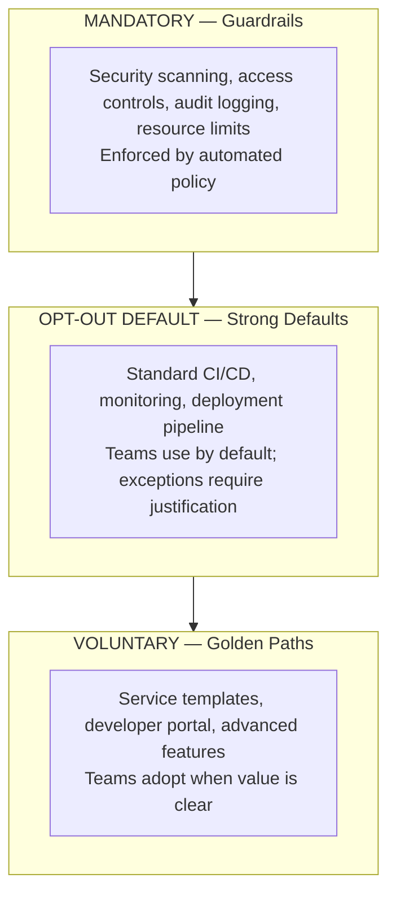
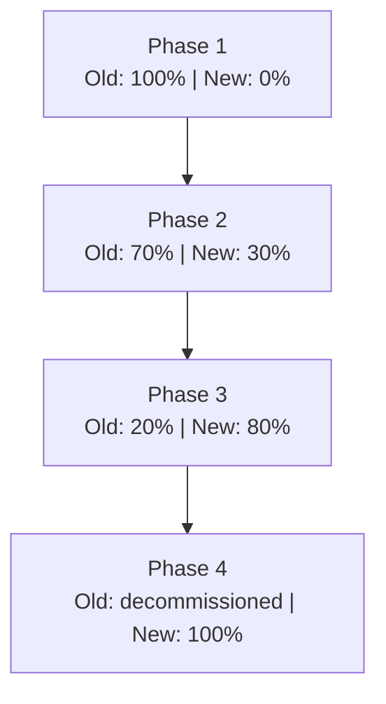
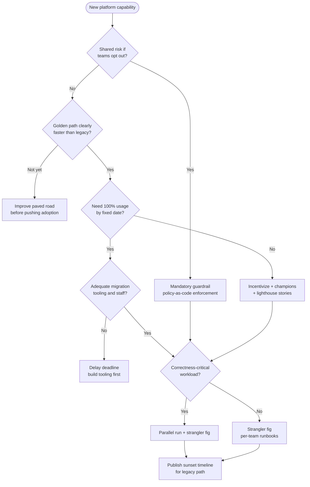

> **Discipline Module** | Complexity: `[ADVANCED]` | Time: 55-65 min

## Prerequisites

Before starting this module:
- **Required**: [Module 1.3: Platform as Product](/platform/disciplines/core-platform/leadership/module-1.3-platform-as-product/) — Product management, user research, roadmapping
- **Required**: [Module 1.2: Developer Experience Strategy](/platform/disciplines/core-platform/leadership/module-1.2-developer-experience/) — DX measurement, golden paths
- **Recommended**: [SRE: Toil and Automation](/platform/disciplines/core-platform/sre/module-1.4-toil-automation/) — Understanding repetitive work and automation ROI
- **Recommended**: Experience with organizational change or system migrations

---

## What You'll Be Able To Do

After completing this module, you will be able to:

- **Design migration strategies that move teams to the platform incrementally with minimal disruption**
- **Implement adoption tracking dashboards that identify teams struggling with platform onboarding**
- **Build champion programs that turn early adopters into advocates who accelerate platform adoption**
- **Lead organizational change management for platform migrations spanning hundreds of services**

## Why This Module Matters

Hypothetical scenario: A platform team ships a Kubernetes-based internal platform after eighteen months of engineering work. Leadership sends a company-wide email mandating migration within six months. At the deadline, roughly one quarter of development teams have moved workloads; the rest cite competing priorities, fear of production risk, or unresolved blockers from earlier attempts. Three teams have quietly rebuilt bespoke deployment tooling to avoid the mandate entirely. The platform is technically sound, but adoption is not — because building infrastructure and earning adoption are different disciplines that require different investments.

The answer to "why won't they use it?" is rarely "the technology is wrong." More often, migration was announced as a deadline without a plan, without embedded support, and without understanding what migration costs each product team in calendar time and cognitive load. Platform teams that treat adoption as a communications problem — send another email, extend the deadline — discover that resentment compounds faster than compliance dashboards improve. This module teaches durable practices for earning adoption through paved roads, incremental migration, aligned incentives, and honest deprecation — without organizational warfare.

> **The Garden Path Analogy**
>
> A mandate is a fence that tells people where they cannot go. A golden path is a well-lit walkway that happens to be the fastest route to where they already want to be. Teams do not resent the walkway; they resent being shoved through a gate on someone else's schedule. Your job is to pave the path so thoroughly that walking on it feels like the team's own decision.

Building a platform and getting people to use it require overlapping but distinct capabilities. The former rewards deep technical design; the latter rewards empathy, change management, migration tooling, and patience. When organizations conflate the two, platform teams burn out while product teams learn to route around them. The practices in this module apply whether you operate a Kubernetes 1.35 cluster platform, a CI/CD paved road, or an internal developer portal — the organizational mechanics of pull versus push, strangler-fig migration, and sunset discipline stay the same even when the tool skin changes.

If you take one idea from this module, let it be that adoption metrics and migration plans deserve the same engineering rigor as control-plane availability. Teams that instrument cluster health but guess at adoption fly blind into sunset deadlines and wonder why holdouts become heroes for resisting. Treat every migration as a product launch with cohorts, feedback loops, and a credible story — because to the teams you are asking to move, it is a product launch whether you call it that or not.

---

## Adoption Is Earned, Not Mandated

Adoption is the moment a team chooses your platform because it is the easiest, safest, and fastest path to ship — not the moment they comply with a policy ticket. Evan Bottcher's framing of platforms as products that reduce cognitive load for stream-aligned teams (see [What I Talk About When I Talk About Platforms](https://martinfowler.com/articles/talk-about-platforms.html)) only delivers value when teams actually consume those capabilities. A paved road nobody walks is indistinguishable from no road at all, regardless of how elegant the underlying Kubernetes abstractions are.

Pull-based adoption works by reducing friction on the desired path and letting product teams retain agency. Push-based adoption works by removing alternatives — mandates, gatekeeping review boards, or hard blocks in legacy pipelines. Both can raise usage numbers on a dashboard, but they produce different long-term outcomes. Pull builds advocates who recommend the platform in design reviews; push builds experts at working around your controls. The CNCF TAG App Delivery platforms whitepaper emphasizes that internal platforms succeed when they deliver a compelling product experience to application teams, not when they win arguments in architecture review.

The adoption spectrum runs from fully optional capabilities through strongly encouraged defaults to opt-out baselines and fully mandatory guardrails. Most healthy organizations use a layered model rather than picking one point on the spectrum for everything. Security scanning, identity baselines, and audit logging often belong in the mandatory layer because they protect the whole company regardless of individual team preference. Standard CI/CD, observability integrations, and deployment pipelines fit the opt-out default layer: teams use them unless they document a supported exception. Service templates, developer portals, and advanced platform features belong in the voluntary layer where teams adopt when the value proposition is clear.

Mandates are justified when the capability protects shared risk that individual teams cannot price correctly — regulatory controls, secrets handling, or production access patterns that create blast-radius exposure across tenants on a shared Kubernetes 1.35 cluster. Mandates are corrosive when they force teams onto workflows that genuinely do not fit their constraints, or when they arrive without migration support, tooling, or a credible rollback story. The test is simple: if you removed the mandate tomorrow, would usage collapse because teams never wanted the capability, or would usage remain because the paved road is genuinely better? Collapse signals compliance theater; retention signals earned adoption.

Strongly encouraged adoption sits in the sweet spot for most core platform services: leadership communicates clear expectations, platform teams invest in documentation and support, and teams migrate because the path of least resistance aligns with the path of best outcomes. Fully optional adoption is appropriate for experimental capabilities where you are still discovering product-market fit inside the company; the risk is never reaching critical mass. Fully mandatory adoption for non-security capabilities usually trades short-term dashboard green for long-term shadow systems and eroded trust in the platform team.

Team Topologies reminds us that platform teams succeed when they operate as an internal product consumed via X-as-a-Service interaction modes — clear APIs, predictable release cadence, and boundaries that do not require constant collaboration firefights. When platform teams slip into facilitation mode for every migration, they become a bottleneck; when they hide behind tickets without customer empathy, they become irrelevant. Pull-based adoption is how you keep the platform team in the product posture: stream-aligned teams choose the service because it accelerates their flow, and the platform team scales by improving the product rather than arm-wrestling each holdout in isolation.

Hypothetical scenario: A security baseline moves to mandatory policy-as-code enforcement on all Kubernetes 1.35 clusters while developer tooling around CI and observability stays strongly encouraged. Product teams accept the security mandate because the rationale is legible — shared blast radius — and the enforcement is automated rather than a monthly exception spreadsheet. They resist a mandate on the internal developer portal because their workflow already integrates documentation elsewhere; incentives and templates eventually raise portal usage without a decree. The lesson is that legitimacy of push correlates with clarity of shared risk, not with the platform team's frustration level.

---

## The Paved Road as Pull Principle

A golden path — sometimes called a paved road — is an opinionated, supported route through your platform that handles the boring correctness work so product teams focus on business logic. Golden paths are not catalogs of every possible tool combination; they are curated defaults with escape hatches. The pull principle states that teams should migrate because the golden path is faster than their bespoke setup, not because a architecture review board rejected their alternative.

Making the paved road the easiest path requires obsessive attention to time-to-first-value. Measure how long it takes a new engineer to deploy a "hello world" service through the golden path versus through the legacy route, including account provisioning, documentation hunting, and waiting for platform team office hours. If the legacy route is faster for common cases, your adoption strategy is fighting physics. Fix the golden path before you fix the communications plan.

Reduce switching costs at the boundary where teams feel pain. Automated scaffolding that generates a working repository with CI, observability hooks, and Kubernetes manifests beats a twenty-page manual that assumes fluency in six tools. Embedded platform engineers during a team's first migration week signal commitment more loudly than a Slack announcement. Instant rollback mechanisms — feature flags on routing, parallel pipelines, or reversible DNS cutovers — convert risk-averse holdouts into willing experimenters because the downside is bounded.

Internal marketing is not vanity; it is how pragmatic teams learn that peers succeeded. Reference stories from lighthouse teams — early adopters who tolerated rough edges in exchange for influence on the roadmap — provide the social proof that Geoffrey Moore described in *Crossing the Chasm* between enthusiastic early adopters and the pragmatic early majority. Without those stories, the majority waits indefinitely for proof that the platform survives real production traffic. Platform teams that only celebrate feature launches miss the adoption mechanism: celebrate team outcomes enabled by the platform, not platform components shipped in isolation.

Documentation and onboarding are adoption levers only when they shorten time-to-first-value rather than merely describing architecture. A tutorial that ends with a running service in a sandbox cluster beats a reference manual that assumes twelve prerequisites. Pair documentation with office hours staffed by engineers who have migrated real services — not only developer advocates who demo happy paths. The goal is for a new team lead to believe "my peer shipped with this last sprint" rather than "the platform team wants credit for a launch blog."

Align incentives with product-team KPIs instead of platform-team vanity metrics. If product management rewards feature delivery while platform metrics reward ticket closure, migrations lose every prioritization meeting. Co-create migration milestones with engineering managers so platform work appears on the same Gantt chart as customer-facing epics. When adopting the paved road visibly removes recurring operational tasks from a team's backlog, Desire in the ADKAR sense emerges naturally because the change helps them hit commitments they already care about.

---

## Migration Strategy: The Strangler Fig and Beyond

Martin Fowler's [Strangler Fig Application](https://martinfowler.com/bliki/StranglerFigApplication.html) pattern names the safest default for platform migrations: gradually route functionality from the old system to the new one while the legacy path remains operational until confidence is high. Like the fig vine that grows around a host tree, new capabilities wrap existing workflows piece by piece rather than demanding a single cutover weekend. The old system handles less and less until decommissioning is a formality rather than a crisis.

Strangler-fig migration succeeds when you identify seams — boundaries where traffic, configuration, or ownership can split without rewriting everything at once. Ian Cartwright, Rob Horn, and James Lewis outline four activities for incremental modernization: understand desired outcomes, break the problem into smaller parts, deliver those parts successfully, and change the organization so the approach sustains. Platform migrations fail when teams skip the first activity and jump to swapping tools. Outcomes like "reduce deployment lead time" or "standardize observability baselines on Kubernetes 1.35" anchor decisions; tool names do not.

Parallel run extends strangler fig for correctness-critical paths. Both old and new systems process the same inputs; automated comparison detects divergence before you promote the new path to primary. Payment routing, authentication, and telemetry pipelines benefit from shadow mode because manual spot checks do not scale across hundreds of services. The comparison layer must be automated and noisy when mismatches appear; otherwise teams dismiss drift as acceptable until an incident proves it was not.

Feature-flag migration toggles cohorts — individual teams, namespaces, or traffic percentages — between old and new implementations. Robust flag infrastructure with fast rollback is non-negotiable; a flag that takes hours to revert is not a safety mechanism. Big-bang migration — switching everyone on a single date — remains appropriate only when vendors decommission legacy systems, regulatory deadlines force coordinated change, or parallel operation is technically impossible. Even then, rehearse in staging, staff surge support, publish rollback runbooks, and communicate daily as the cutover approaches.

Every migrating team deserves a runbook that names their seam, their rollback trigger, their platform buddy, and their success criteria. A portfolio-level migration plan without per-team runbooks is a Gantt chart fantasy. Reversibility and blast-radius control should be explicit: which services can roll back independently, which shared dependencies create coupling, and what maximum concurrent migrations your platform team can support without starving incident response.

Hypothetical scenario: A platform team migrates CI from a self-hosted system to a Git-backed pipeline integrated with Argo CD on Kubernetes 1.35. Phase one onboards only greenfield services. Phase two migrates low-risk internal tools with parallel runs on pull requests. Phase three tackles revenue services with embedded support and automated config translation. Phase four decommissions the old controller only after the last team completes phase three or receives a documented exception. Total calendar time might stretch to nine months, but production incidents during migration stay near zero because no single weekend carries the entire company.

Portfolio migration governance should include a visible status board: teams in discovery, in progress, blocked, validating, or complete. Blocked status must link to an owner and ETA, not merely linger as shameful red. Review the board weekly with product leadership so blockers receive staffing decisions instead of passive-aggressive pings. Transitional architecture — temporary routing layers, dual-published artifacts, compatibility shims — feels wasteful but buys option value; Fowler's strangler fig writing explicitly accepts transitional cost because earlier returns and lower risk outweigh purity.

---

## Change Management and Incentives

Platform migrations are organizational change initiatives, not ticket queues. John Kotter's research on major change programs — summarized in the [8 Steps for Leading Change](https://www.kotterinc.com/8-steps-process-for-leading-change/) — emphasizes urgency, coalition building, short-term wins, and sustained reinforcement. Platform teams that skip coalition building and jump to documentation wonder why perfect guides gather dust. You need allies in product leadership, security, and finance who repeat the same narrative: why migration matters now, what teams gain personally, and what happens if we accrete permanent legacy.

The Prosci [ADKAR Model](https://www.prosci.com/methodology/adkar) sequences individual change through Awareness, Desire, Knowledge, Ability, and Reinforcement. Platform rollouts routinely fail at Awareness and Desire while over-investing in Knowledge (documentation) and Ability (CLI tools). A developer who does not believe the migration solves their problem will not read the guide, no matter how polished. Start with the business case in language product teams use — faster incident recovery, fewer pager nights, reduced toil — before publishing the hundredth tutorial.

Incentives beat sticks for sustained adoption. Mandates produce compliance metrics; incentives produce behavior that survives the next reorg. Effective incentives align platform usage with what teams already optimize for: shipping features, reducing operational burden, and avoiding career-limiting outages. Reduced toil on the paved road — one-click deploys versus twelve manual steps — is an incentive embedded in the product. Priority support SLAs for teams on the platform signal that migration buys responsiveness. Budget relief when legacy infrastructure costs are transparently charged back to holdouts makes the status quo expensive without public shaming.

| Approach | Short-term effect | Long-term effect |
|----------|-------------------|------------------|
| Mandate | High compliance on dashboards | Resentment, shadow IT, eroded trust |
| Deadline without support | Urgency | Rushed migrations, quality regressions |
| Incentives and paved roads | Moderate initial uptake | Sustained adoption, goodwill |
| Social proof from lighthouse teams | Peer-driven uptake | Organic growth across pragmatists |
| Automated migration tooling | Faster conversions | Permanent behavior change |

Meet teams where they are, not where you wish they were. Capacity-constrained teams need migration windows aligned with their release calendar, not arbitrary fiscal-quarter deadlines. Risk-averse teams need white-glove migration and proof on non-critical services first. Teams with legitimate capability gaps need roadmap honesty — either build the missing feature or grant a supported exception path. Pretending the platform supports a workflow it does not destroys credibility faster than any delayed timeline.

Research summarized in *Accelerate* and the ongoing [DORA](https://dora.dev/research/2023/dora-report/) program links generative culture — psychological safety, learning orientation, user focus — to software delivery performance. Platform migrations stall in blame-heavy cultures because teams hide bypass behavior instead of reporting friction. Invest in blameless postmortems when migrations fail, publish what changed afterward, and reward teams that surface blockers early. Change management is not a slide deck; it is the repeated experience that honesty is safer than silence.

For politically resistant teams, escalation to leadership is a last resort, not a first move. Executives can remove organizational obstacles — conflicting priorities, underfunded platform staffing — but executive mandates without support recreate the failure mode this module opens with. Prefer making success visible on peer teams so resistance becomes the exception that requires explanation, not the default that requires courage to opt in.

---

## Champion Programs and Lighthouse Teams

Champion programs convert early adopters into internal advocates who accelerate adoption across the pragmatic majority. A champion is not a unpaid salesperson for the platform team; they are a respected engineer on a product team who co-designs golden paths, surfaces friction early, and tells credible stories in language their peers trust. The platform team provides air cover — roadmap influence, early access, public recognition — in exchange for time spent helping the next wave migrate.

Lighthouse teams are the first production users of a new capability under real constraints, not demo tenants with synthetic traffic. Select lighthouse teams for diversity of stack and risk tolerance: include one enthusiastic team and one skeptical team with strong production discipline. Skeptical lighthouse successes convince the early majority; enthusiastic-only stories read as marketing. Document what broke during lighthouse migrations with the same transparency as what improved; hiding early incidents poisons the reference story later.

A minimal champion program includes nomination criteria (peer respect, willingness to mentor), explicit time allocation from product management, office hours co-hosted by champions and platform engineers, and a feedback channel that turns champion input into visible roadmap movement within weeks. Champions who file issues into a void stop championing. Celebrate champion teams in engineering all-hands with metrics they care about — deploy frequency, incident recovery time — not platform vanity counts.

Hypothetical scenario: Six champions across three business units each mentor two teams through a CI migration over one quarter. Each champion runs a ninety-minute workshop using their own service as the worked example. Adoption among mentored teams reaches roughly double the rate of teams that only received email announcements, because skepticism is addressed by someone who shares their backlog pressures. The platform team learns edge cases earlier, and the champion cohort becomes the hiring pool for future platform engineers who understand product realities.

---

## Measuring Adoption: Signal Versus Theater

Adoption metrics should distinguish mandated compliance from value-driven usage. A dashboard showing one hundred percent of teams "on platform" means little if usage is a single health-check cron job while real deploys bypass the paved road. Track depth, not just presence: services actively deploying through the platform, pull requests using golden-path templates, observability data flowing through standard pipelines, and repeat usage after initial onboarding.

Core metrics include adoption rate (teams or services on the paved road), coverage (share of production workloads using platform capabilities versus exceptions), time-to-onboard (median days from first request to first successful deploy), time-to-first-value (days until the team ships a meaningful change through the platform), and retention (teams still active ninety days after onboarding). Segment metrics by team tenure, workload criticality, and technology stack so aggregate numbers do not hide stuck cohorts.

Hypothetical scenario: Leadership celebrates sixty percent adoption while the platform team knows forty percent of that figure is mandated namespace labels without CI integration. Drilling into deploy-source telemetry reveals twenty percent genuine usage — a crisis of narrative, not a crisis of engineering. The remediation is honest reporting with two series — compliance baseline versus voluntary golden-path usage — and executive alignment on which series defines success.

Pair quantitative telemetry with qualitative signals: support ticket themes, ADKAR stage assessments per cohort, and periodic developer surveys using multidimensional frameworks like [SPACE](https://www.microsoft.com/en-us/research/publication/the-space-of-developer-productivity-theres-more-to-it-than-you-think/) so satisfaction is not reduced to a single misleading score. DORA research consistently links organizational culture and user-centric delivery to performance outcomes; treat adoption measurement as input to continuous improvement, not as a weapon for blame during quarterly reviews.

Design dashboards for action, not decoration. Each tile should answer who must act tomorrow: teams stuck in onboarding longer than the median, services deploying outside the paved road, champions with mentees who have not started, blockers older than two weeks without an owner. Red metrics without a named intervention are anxiety theater. Review adoption data in the same forums where product priorities are set so metrics influence staffing; dashboards viewed only by the platform team become consolation prizes.

Hypothetical scenario: A platform team publishes weekly adoption email with three numbers — new onboardings, active deployers, blocked teams — and one human story from a champion mentee. Over two quarters, managers begin asking for their team's row in the status board before asking for new platform features. The metric program succeeded because it connected data to narrative and narrative to staffing decisions, not because the Grafana panels were prettier than the old ones.

---

## Deprecation, Sunset, and Legacy Hygiene

Migration's mirror image is deprecation: retiring the old path so the platform does not accrete permanent dual-stack tax. Every team maintaining two CI systems, two deployment controllers, or two observability agents pays interest in cognitive load and incident complexity. Sunset discipline communicates timelines early, reduces support gradually, and decommissions only after migrations or documented exemptions are complete.

A typical sunset arc spans multiple quarters. Month zero announces the timeline and makes the replacement available with migration guides. Month three shifts old-path support to community-only without SLA-backed response. Month six freezes new integrations on the legacy stack; all new capabilities ship on the paved road only. Month nine begins infrastructure teardown for unused components while keeping read-only access to historical artifacts teams need for audits. Month twelve completes decommission with archived runbooks explaining where logs and build history migrated.

Never surprise-decommission a system teams still rely on for production deploys. Surprise shutdowns are remembered for years and become the anecdote skeptics cite in every future platform initiative. If three teams legitimately block on missing features, extend their sunset date publicly while you build capability or formalize exceptions — do not pretend the feature exists. Legacy hygiene also applies to documentation: strike outdated guides that describe the retired path, or label them with bold deprecation banners linking to replacements.

Communication during deprecation is empathetic and specific. Affected teams need direct notice, not only a broadcast in a channel they muted. Name their services, name their deadline, name their migration buddy, and name the rollback window if the new path fails acceptance testing. Empathy without specifics feels like platitudes; specifics without empathy feels like threats. Balance both.

Deprecation is also when you discover whether adoption was real. Teams that integrated deeply will ask detailed questions about audit trails and artifact retention; teams that performed checkbox compliance will shrug and disappear until the old path dies. Use sunset planning as a diagnostic: if decommissioning terrifies many teams, your adoption metrics were lying. If decommissioning is boring, you earned the migration. Plan migration support capacity to spike during the final quartile of a sunset — that is when holdouts arrive, not when the program launches.

---

## Communication for Platform Changes

Different changes demand different communication strategies. Breaking changes affecting pipeline contracts need weeks of lead time, direct outreach to high-risk teams, workshops, tracked migration status per team, and a staffed response roster on cutover day. New golden-path features need concise changelog entries, worked examples, and demo sessions showing time saved — not architecture diagrams alone. Deprecation notices need individualized impact statements eight or more weeks ahead. Incidents need factual, calm updates in a known channel; silence during outages fills with rumors that outlive the postmortem.

The breaking-change protocol is a template, not bureaucracy for its own sake. Eight weeks before change: inventory affected teams, estimate effort, publish migration guide, identify blockers. Six weeks: announce scope, rationale, timeline, and support channels; offer office hours. Four weeks: run workshops, track per-team status, unblock stuck migrations. Two weeks: direct outreach to lagging teams with white-glove offers. Cutover week: monitor, respond fast, verify with affected teams. One week after: retrospective survey, update templates, publish lessons. Skipping the middle weeks produces the same outage with worse trust.

Organizational resistance often masquerades as technical objections. When a lead says "we do not have time," they may mean "I do not trust you after the last failed migration." When they say "our use case is unique," they may be right. Listen for the underlying concern before offering solutions. The resistance table below is a diagnostic aid, not a script for winning arguments.

| Stated reason | Surface reading | Deeper concern |
|---------------|-----------------|----------------|
| "We cannot afford downtime" | Risk | Distrust of platform stability or rollback |
| "We have no capacity" | Scheduling | Migration not prioritized in team goals |
| "Our setup works fine" | Inertia | Unclear personal benefit from switching |
| "We tried and it broke" | History | Broken trust requiring small wins first |
| "Our workflow is unique" | Exception | Genuine capability gap or political autonomy |
| "We need to evaluate alternatives" | Process | Desire to own tooling decisions |

For risk-averse teams, offer to execute the migration alongside them with a written rollback checklist and a scheduled validation window. For capacity-constrained teams, propose a scoped first slice — migrate nightly batch jobs before customer-facing APIs — and fund the effort as a shared initiative rather than "extra work." For teams with bad history, name the previous failure in writing, document deltas, and grant an explicit trial period with opt-out if service levels degrade. For politically resistant teams, find the one engineer on the team who wants faster deploys and start there; universal consensus is rare, but partial coalition is enough for strangler fig.

Breaking changes deserve the same care as migrations because they are migrations compressed in time. Publish a changelog rhythm — weekly for active platform development — so teams learn to scan updates habitually instead of discovering breaking diffs during deploy. Incident communication during a failed migration attempt must be fast, factual, and owned: who is mitigating, what is the customer impact, when is the next update. Silence converts a recoverable technical glitch into a trust bankruptcy that slows the next cohort regardless of root cause.

---

## Patterns and Anti-Patterns

### Patterns That Work

1. **Strangler-fig migration with explicit seams** — Incremental cutovers preserve rollback and shrink blast radius compared with big-bang weekends that couple every team's fate.
2. **Lighthouse teams before mass rollout** — Real production learning on diverse teams produces credible reference stories for the pragmatic majority.
3. **Champion programs with protected time** — Peer advocates accelerate adoption faster than platform-team-only outreach because they share context and credibility.
4. **Automated migration tooling** — Scripts that translate eighty percent of legacy configuration beat manuals that demand weeks of engineer attention.
5. **Layered adoption spectrum** — Mandatory guardrails for shared risk, opt-out defaults for core workflows, voluntary layer for advanced capabilities.
6. **Honest sunset with supported timelines** — Deprecation communicated early with SLAs that taper before decommission prevents permanent dual-stack operations.

### Anti-Patterns to Avoid

| Anti-Pattern | Why it fails | Better approach |
|--------------|--------------|-----------------|
| Big-bang cutover without rehearsal | Coupled failure across all teams | Strangler fig with phased traffic or team cohorts |
| Mandate without migration support | Compliance without capability | Embedded support, tooling, and rollback |
| Announcing deprecation without exemptions process | Production stops for edge cases | Document exceptions; extend timelines when gaps are real |
| Metrics that count token usage only | False sense of adoption | Measure deploy depth, retention, and voluntary usage |
| Champion program without roadmap feedback | Advocates burn out | Close the loop publicly on champion-filed blockers |
| Never deprecating legacy paths | Permanent dual-stack tax | Published sunset with tapering support |
| Skipping ADKAR Awareness and Desire | Perfect docs nobody reads | Explain why and personal benefit first |

---

## Decision Framework — Mandate Versus Incentivize Versus Migration Style

Use the flowchart when choosing how strongly to push a capability and how to migrate teams onto it. Start with risk class: shared security and compliance floors justify mandatory enforcement; productivity enhancements justify incentives and paved roads. Then select migration mechanics based on reversibility needs and correctness requirements.

Revisit decisions when evidence changes. A capability that began voluntary may move to opt-out default after lighthouse teams prove stability. A mandated control may need softer rollout if enforcement blocks critical deploys during an acquisition integration. Decision frameworks are guardrails for judgment, not substitutes for conversation with affected teams.

When choosing between rewrite and coexistence, ask whether the legacy system's behavior is knowable. Unknown behavior favors strangler fig discovery; well-understood but toxic behavior may justify a bounded rewrite for a single service while the portfolio still migrates incrementally elsewhere. Coexistence is not failure — permanent coexistence without sunset is failure. Document the coexistence end date even when you extend it later so teams trust extensions as considered decisions, not as platform team forgetfulness.

---

## Landscape Snapshot — Internal Developer Portals

**Landscape snapshot — as of 2026-06. This changes fast; verify against vendor docs before relying on specifics.** Internal developer portals illustrate adoption mechanics: teams adopt portals when catalog and scaffolding reduce search time, not when catalogs exist in isolation.

| Durable capability | Backstage (CNCF Incubating) | Port | Cortex |
|--------------------|----------------------------|------|--------|
| Software catalog | Core focus | Core focus | Core focus |
| Scaffolding / golden paths | Software Templates | Self-service actions | Scaffolder plugins |
| Scorecards / maturity models | TechDocs + plugins | Scorecards | Scorecards |
| Ownership graph | Catalog relationships | Catalog + scorecards | Catalog + rules |

Present portals as peers compared by capability and integration model, not as a single winner. Adoption strategy stays constant: paved roads, clear ownership data, and templates that produce working services — portal brand is secondary to whether a developer ships faster on day one.

Portals fail adoption goals when treated as catalogs alone. A service graph without scaffolding leaves teams admiring metadata while still copying last year's repository by hand. Successful portal rollouts pair catalog discovery with Software Templates or equivalent golden-path generators, TechDocs or linked runbooks that answer "what do I do Monday morning," and scorecards that make production readiness visible without shaming teams into hiding problems. Migration onto the portal should reuse strangler fig: one template, one team, one success story, then widen.

---

## Did You Know?

- **Geoffrey Moore's *Crossing the Chasm* describes a gap between early adopters and the early majority** — internal platforms stall when they recruit only enthusiasts and lack credible stories from pragmatic teams operating under real production constraints.

- **Martin Fowler named the Strangler Fig pattern after a vine that gradually replaces its host tree** — the metaphor emphasizes that legacy systems remain operational throughout incremental migration, which is why the pattern remains the default recommendation for platform cutovers.

- **The Prosci ADKAR Model sequences Awareness, Desire, Knowledge, Ability, and Reinforcement** — platform teams that jump straight to documentation often fail because individuals never wanted the change, regardless of guide quality.

- **DORA research links generative organizational culture and user-centric prioritization to stronger performance outcomes** — adoption programs that ignore culture and treat migration as purely technical configuration work underperform programs that invest in coalition building and short-term wins.

---

## Common Mistakes

| Mistake | Problem | Solution |
|---------|---------|----------|
| Equating compliance with adoption | Dashboard green while bypass behavior grows | Measure deploy depth, retention, and voluntary usage |
| Big-bang migration weekends | Coupled failures, no rollback | Strangler fig with per-team runbooks and reversibility |
| Mandates without tooling or support | Resentment and shadow systems | Automated migration, embedded engineers, honest timelines |
| Skipping lighthouse teams | Early-majority skeptics never see credible proof | Diverse lighthouse cohorts with transparent incident stories |
| Champion programs without time allocation | Burnout and shallow advocacy | Secure PM sponsorship for champion hours and visible wins |
| Announcing sunset without individualized outreach | Teams surprised at decommission | Direct notices with service names, buddies, and extensions |
| Over-indexing on Knowledge and Ability in ADKAR | Perfect tools nobody desires | Build Awareness and Desire with business-case narratives |
| Never deprecating legacy paths | Permanent dual-stack operational tax | Published sunset with tapering support and archived artifacts |

Platform adoption is a loop, not a launch event. Revisit incentives, metrics, and sunset assumptions each quarter because product portfolios, compliance rules, and team composition shift underneath static dashboards. The organizations that sustain high paved-road usage treat adoption work as permanent product operations — the same way they treat reliability work — rather than as a one-time migration project to checkbox and forget.

---

## Quiz

### Question 1
**Scenario**: Your organization has fifty development teams on a legacy self-hosted CI system. You have built a Git-integrated pipeline targeting Kubernetes 1.35 deployments. Leadership wants minimal production risk while all teams eventually migrate. Which migration pattern should you select, and how would you apply it?

Answer

Select the **strangler fig** pattern with per-team phases rather than a single cutover weekend. Onboard greenfield services first, then migrate low-risk internal tools, then revenue services with embedded platform support and automated config translation from the legacy system. Keep the old CI operational for rollback until each cohort completes validation. This approach limits blast radius, lets teams learn incrementally, and supplies feedback to improve guides before the pragmatic majority migrates.

### Question 2
**Scenario**: You are meeting the payment platform lead who says, "We tried your beta pipeline last year and had a multi-hour outage during peak season. We cannot take that risk again." What is your immediate strategy to rebuild trust?

Answer

Acknowledge the past failure without defensiveness, then explain specific technical and procedural changes since that incident with evidence — tests added, rollback automation, canary defaults. Offer a low-risk trial on a non-critical service with an explicit rollback trigger and an embedded platform engineer during migration. Share parallel-run results from other teams only after listening to their constraints. Trust rebuilds through small flawless wins, not through slides about roadmap velocity.

### Question 3
**Scenario**: The CTO wants a company-wide mandate that all teams adopt the internal developer portal within thirty days. You recommend a strongly encouraged model with incentives instead. How do you justify that to executive leadership?

Answer

Mandates raise compliance metrics but obscure whether the portal solves real problems; teams may create minimal integrations while keeping real workflows elsewhere. Strong encouragement with paved-road incentives — faster support, templates, reduced toil — produces adoption that signals genuine value and generates useful product feedback. Reserve mandates for shared-risk guardrails like security baselines. For productivity tooling, pull-based adoption preserves trust and reduces shadow-system work that costs more than the portal saves.

### Question 4
**Scenario**: You shipped excellent documentation, migration scripts, and weekly office hours for a new ingress standard. Teams ignore the effort. Using ADKAR, what is the likely root cause and fix?

Answer

The likely gap is **Awareness and Desire**: teams do not understand why the change matters to their outcomes or have not been convinced the personal cost is worth the benefit. Knowledge and Ability artifacts cannot overcome apathy. Pause the technical push, run targeted sessions with leads explaining incident reduction and support SLAs, co-design timelines with product management goals, and recruit a lighthouse team to publish a peer story before re-issuing migration tooling.

### Question 5
**Scenario**: Three teams refuse to migrate before a legacy CI decommission date because the new platform lacks equivalent build steps. Platform engineers demand they "figure it out." How do you resolve the standoff?

Answer

Treat this as a legitimate capability gap, not laziness. Meet each team to document missing steps, extend their sunset dates publicly, and prioritize platform work to close gaps or publish supported workarounds. Forcing decommission while blockers remain halts delivery and destroys platform credibility across the organization. Update the portfolio migration plan with transparent criteria for exemptions and a revised timeline tied to feature readiness, not arbitrary calendar fear.

### Question 6
**Scenario**: Adoption dashboards show sixty percent of teams "on platform," but deploy telemetry suggests many teams still release through legacy paths. What metrics program corrects this blind spot?

Answer

Split **compliance usage** from **value-driven usage**: track production deploys through the paved road, repeat activity ninety days after onboarding, time-to-first-value, and voluntary golden-path template usage versus mandated baseline checks. Segment by criticality and team cohort to find stuck groups. Pair telemetry with qualitative ADKAR assessments and short interviews. Report both series to leadership so success is measured by depth and retention, not by checkbox integrations that mask bypass behavior.

### Question 7
**Scenario**: Early adopters enthusiastically migrated, but the remaining pragmatic teams have entrenched custom infrastructure and have not moved in two quarters. How do you cross the adoption chasm?

Answer

Shift from feature announcements to **switching-cost reduction**: invest in automated translation from legacy configs, offer incremental adoption where teams use platform CI while keeping bespoke deploy steps temporarily, and publish lighthouse stories from skeptical teams with production credibility. Make maintenance costs of custom stacks visible against platform support SLAs. Recruit **champions** on pragmatic teams with protected time to mentor peers — peer proof matters more than platform-team marketing for the early majority.

### Question 8
**Scenario**: You built an automated CLI to migrate repositories to Argo CD. After fanfare in Slack, only three of forty-five teams used it. What are plausible causes and how do you investigate?

Answer

Causes include poor discoverability, distrust of black-box automation, CLI failures on edge cases, or misaligned timing with team roadmaps. Check telemetry for abandoned runs and error hotspots, then interview non-adopters across risk and capacity profiles. Run paired sessions where platform engineers migrate alongside skeptics, capturing gaps. Adoption tools without ADKAR Desire and champion social proof often become shelfware regardless of engineering quality.

---

## Hands-On Exercise: Adoption and Migration Plan

Design a documented adoption and migration program for a realistic portfolio. Work on paper or in your internal wiki; the artifact is the deliverable. This exercise mirrors how platform leads prepare executive briefings: you are not configuring tools yet — you are making tradeoffs explicit so staffing, timelines, and sunset commitments receive scrutiny before engineers burn a quarter on a big-bang cutover nobody can roll back.

**Scenario**: Twenty development teams use a self-hosted CI system. You operate a new Git-integrated CI/CD platform with Argo CD deploying to Kubernetes 1.35. Leadership wants broad adoption within three quarters without a single big-bang weekend.

**Step 1 — Choose migration pattern and justify it** in prose: strangler fig, parallel run, feature-flag cohorts, or big-bang (only if you can defend it). Name seams, rollback triggers, and maximum concurrent migrations your platform team can support.

**Step 2 — Design adoption layers** using the mandatory / opt-out / voluntary model. List which capabilities belong in each layer and why. Identify one capability that deserves mandatory enforcement and one that must remain incentive-driven.

**Step 3 — Plan lighthouse and champion cohorts.** Nominate two lighthouse teams (one enthusiastic, one skeptical) and three champion candidates. Define what protected time champions receive and what feedback loop closes within two weeks.

**Step 4 — Build an adoption dashboard spec.** Define metrics for compliance usage versus voluntary paved-road usage, time-to-onboard, time-to-first-value, retention at ninety days, and blocked teams. Note which metrics you review weekly versus monthly.

**Step 5 — Write a sunset communication** for the legacy CI system with tapering support milestones and individualized outreach template fields (team name, services, buddy, deadline, extension criteria).

### Success Criteria

- [ ] Migration pattern documented with seams, phases, and rollback story
- [ ] Adoption spectrum assigns every major capability to mandatory, opt-out, or voluntary layer with rationale
- [ ] Lighthouse and champion plan includes skeptical team and feedback loop
- [ ] Dashboard distinguishes compliance metrics from value-driven usage metrics
- [ ] Sunset timeline includes support tapering and exemption criteria
- [ ] ADKAR assessment identifies weakest stage for one holdout persona and concrete action

---

## Sources

- [Strangler Fig Application — Martin Fowler](https://martinfowler.com/bliki/StranglerFigApplication.html) — Canonical description of incremental legacy replacement and migration seams.
- [What I Talk About When I Talk About Platforms — Evan Bottcher via MartinFowler.com](https://martinfowler.com/articles/talk-about-platforms.html) — Foundational essay on internal platforms as products that reduce cognitive load.
- [Team Topologies — Key Concepts](https://teamtopologies.com/key-concepts) — Platform teams as internal products enabling stream-aligned delivery.
- [CNCF TAG App Delivery — Platforms White Paper](https://tag-app-delivery.cncf.io/whitepapers/platforms/) — Guidance on platform product thinking, adoption, and organizational interfaces.
- [Prosci ADKAR Model](https://www.prosci.com/methodology/adkar) — Individual change sequence: Awareness, Desire, Knowledge, Ability, Reinforcement.
- [Kotter — 8 Steps for Leading Change](https://www.kotterinc.com/8-steps-process-for-leading-change/) — Organizational change framework emphasizing coalitions and short-term wins.
- [Accelerate — IT Revolution](https://itrevolution.com/product/accelerate/) — Research grounding for DORA capabilities and high-performing technology organizations.
- [DORA — 2023 State of DevOps Report](https://dora.dev/research/2023/dora-report/) — Culture, user focus, and continuous improvement findings relevant to adoption programs.
- [DORA — Capability Catalog](https://dora.dev/capabilities/) — Practices that foster learning, feedback, and delivery performance.
- [SPACE of Developer Productivity — Microsoft Research](https://www.microsoft.com/en-us/research/publication/the-space-of-developer-productivity-theres-more-to-it-than-you-think/) — Multidimensional view of developer experience measurement beyond single metrics.
- [ThoughtWorks Technology Radar — Platform engineering product teams](https://www.thoughtworks.com/radar/techniques/platform-engineering-product-teams) — Internal platform teams as product teams with defined customers.
- [Kubernetes Documentation — Overview](https://kubernetes.io/docs/concepts/overview/) — Container platform context for migration targets (current release family includes 1.35).

---

## Next Module

Continue to [Module 1.5: Scaling Platform Organizations](/platform/disciplines/core-platform/leadership/module-1.5-scaling-platform-org/) to learn how to grow from a single platform team to a platform organization.

---

*"You can build the best platform in the world, but if nobody migrates to it, you've built nothing."*
