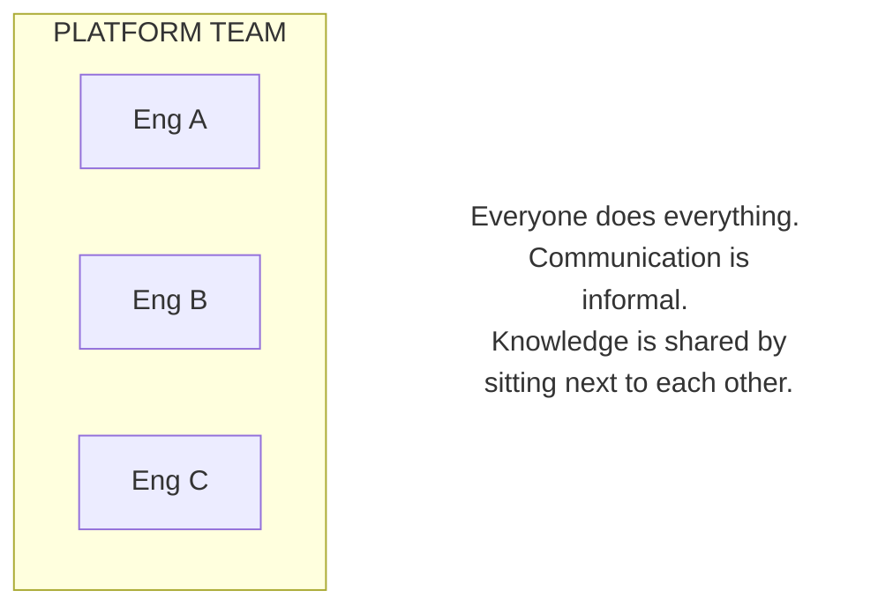
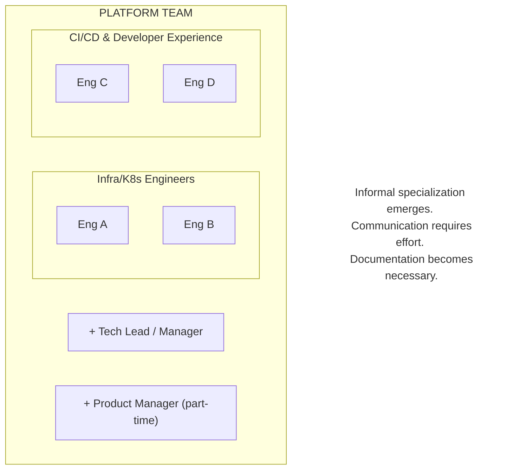
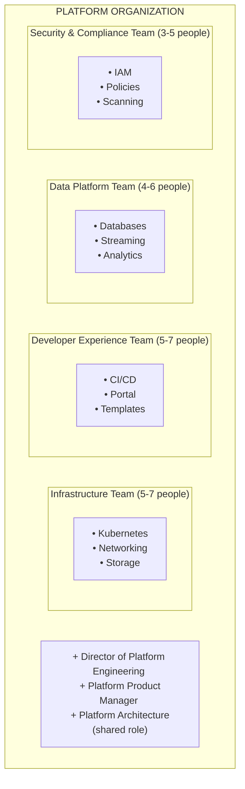
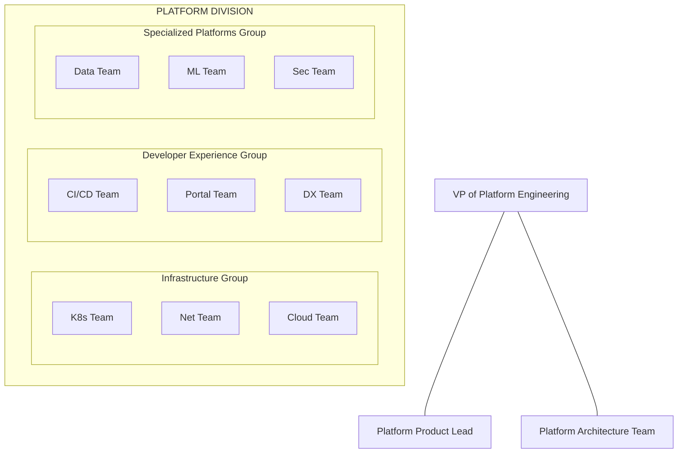
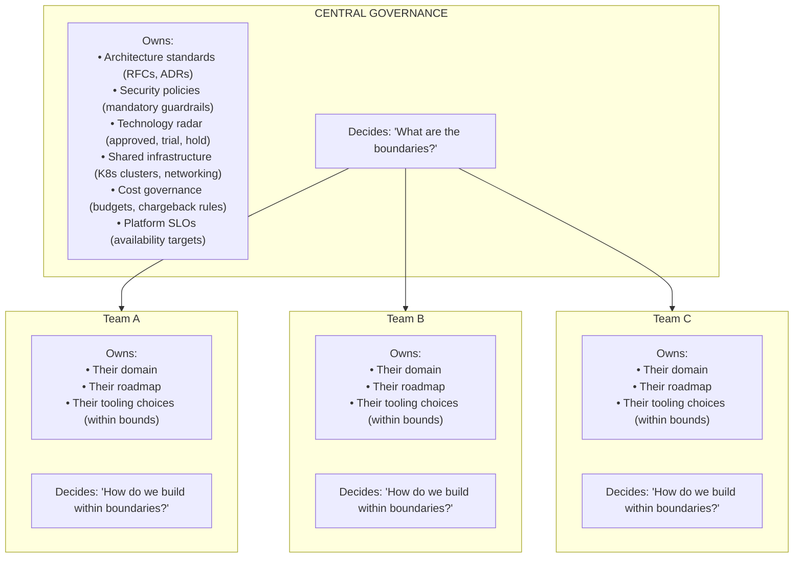
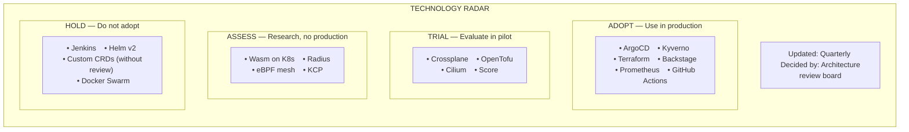
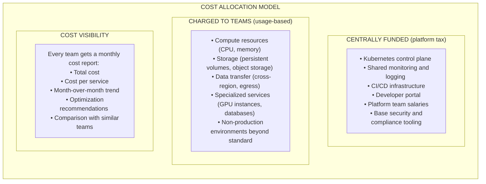
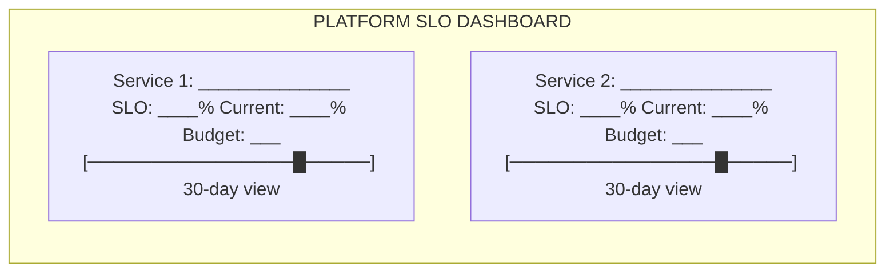

> **Discipline Module** | Complexity: `[ADVANCED]` | Time: 55-65 min

## Prerequisites

Before starting this module:
- **Required**: [Module 1.4: Adoption & Migration Strategy](../module-1.4-adoption-migration/) — Driving adoption, managing change
- **Required**: [Module 1.1: Building Platform Teams](../module-1.1-platform-team-building/) — Team topologies and Conway's Law
- **Recommended**: [SRE: Service Level Objectives](/platform/disciplines/core-platform/sre/module-1.2-slos/) — Defining measurable reliability targets
- **Recommended**: [FinOps Discipline](/platform/disciplines/business-value/finops/) — Cloud cost management
- **Recommended**: Experience managing multi-team engineering organizations

---

## What You'll Be Able to Do

After completing this module, you will be able to:

- **Design organizational structures that scale platform teams from 5 to 50+ engineers**
- **Implement governance models that balance platform consistency with team autonomy at scale**
- **Build platform operating models that work across business units, regions, and cloud environments**
- **Evaluate when to centralize versus federate platform capabilities as the organization grows**

## Why This Module Matters

A payments company had one of the best platform teams in fintech. Five engineers who built and maintained a deployment platform, a monitoring stack, and a self-service database provisioning system. Developers loved them. Adoption was 95%. The team was a case study in doing platform engineering right.

Then the company grew from 80 developers to 350 in 18 months.

The platform team went from heroes to bottleneck overnight. Every new team needed onboarding. Every product launch required platform support. The backlog grew from 15 items to 120. Response time for support requests went from hours to weeks. The five engineers were working 60-hour weeks and still falling behind.

The company's response was to hire more platform engineers. They went from 5 to 25 in a year. But 25 people cannot operate as one team. Communication broke down. Three different engineers built overlapping solutions to the same problem. Standards diverged. The platform that was elegant at 5 people became chaotic at 25.

**Scaling a platform organization is not just hiring.** It requires deliberate structural decisions about governance, ownership, cost allocation, and team boundaries. Get these wrong and you create a bureaucratic mess that is worse than having no platform at all. This module teaches you how to scale without losing what made your platform team effective in the first place.

---

## Did You Know?

> **Dunbar's number** (roughly 150) is the cognitive limit to the number of people with whom one can maintain stable social relationships. When a platform organization exceeds ~8-12 people, informal coordination breaks down and you need explicit processes. Most platform scaling problems happen at exactly this inflection point.

> **Amazon's "two-pizza team" rule** was not about team size — it was about **ownership scope**. Jeff Bezos' insight was that small teams with clear ownership make better decisions and move faster than large teams with shared ownership. This principle applies directly to platform sub-teams.

> According to the 2024 Puppet State of Platform Engineering report, organizations with **mature platform governance** (clear SLOs, documented standards, explicit decision-making processes) scale their platform teams **2.4x more efficiently** than organizations that scale by headcount alone.

> **Google's infrastructure division** employs thousands of engineers, yet maintains consistency through a combination of automated enforcement, design reviews, and a strong culture of documentation. They do not achieve consistency through management oversight — they achieve it through systems.

---

## From 1 Team to 10: Growth Stages

> **Stop and think**: Think about the last time your organization added headcount to solve a delivery bottleneck. Did the new hires proportionally increase delivery speed, or did communication overhead eat into the gains?

### Stage 1: The Founding Team (2-5 people)



**Characteristics**:
- Everyone knows everything
- No formal processes needed
- Fast decision-making
- High bus-factor risk
- Works for 20-80 developers

**What to focus on**: Build the core platform. Validate product-market fit with internal users. Do not worry about governance or structure.

### Stage 2: The Specialized Team (5-12 people)



**Characteristics**:
- Engineers develop specializations
- You need a tech lead or manager
- Documentation becomes necessary (not everyone knows everything)
- Weekly team meetings become important
- Works for 80-200 developers

**What to focus on**: Formalize ownership areas. Start documenting architecture decisions. Introduce lightweight processes (standups, architecture reviews). Hire or designate a product manager.

### Stage 3: The Multi-Team Organization (12-30 people)



**Characteristics**:
- Multiple teams with distinct ownership
- You need a director (manages managers, sets strategy)
- Cross-team coordination becomes a challenge
- Standards and governance are essential
- Works for 200-500 developers

**What to focus on**: Clear team charters and ownership boundaries. Explicit API contracts between platform teams. Architecture reviews for cross-cutting concerns. Shared on-call and incident response.

### Stage 4: The Platform Division (30+ people)



**Characteristics**:
- Multiple layers of management
- Dedicated architecture and product functions
- Significant coordination overhead
- Governance and standards are critical
- Works for 500+ developers

**What to focus on**: Federated governance (see below). Clear escalation paths. Investment in platform-for-the-platform (internal tooling for your own team). Preventing bureaucracy.

---

## Federated vs Centralized Platform Governance

> **Pause and predict**: If a centralized board has to approve every infrastructure change, what happens to the lead time for new applications? How might developers attempt to bypass this process?

### The Governance Spectrum

| Model | Description | Pros | Cons |
|-------|-------------|------|------|
| **Centralized** | One team sets all standards and makes all decisions | Consistent, efficient | Slow, disconnected from users |
| **Federated** | Standards set centrally, decisions made locally | Balanced speed and consistency | Requires coordination |
| **Decentralized** | Each team makes its own decisions | Fast, autonomous | Inconsistent, duplicated effort |

### The Federated Model (Recommended at Scale)



### What Gets Centralized vs Federated

| Decision | Centralize | Federate | Why |
|----------|-----------|----------|-----|
| Kubernetes version | Yes | | Security, compatibility |
| Monitoring stack | Yes | | Consistent observability |
| CI/CD tool | Yes | | Shared investment |
| Programming language for platform tools | | Yes | Teams know their domain best |
| API design standards | Yes | | Interoperability |
| Feature prioritization | | Yes | Teams know their users best |
| Cost budgets | Yes (total) | Yes (per-team allocation) | Central budget, local spending |
| Incident response process | Yes | | Consistency in crisis |
| Hiring criteria | Yes (framework) | Yes (specific skills) | Consistent bar, diverse needs |

### The Technology Radar

A technology radar classifies tools and technologies into four categories:



---

## Platform SLOs and Internal SLAs

### Why Internal SLOs Matter

Without SLOs, platform reliability is invisible until it is terrible. With SLOs, you can:
- Prove your platform is reliable (data, not feelings)
- Prioritize reliability work based on budget burn
- Set expectations with development teams
- Justify investment in reliability engineering

### Defining Platform SLOs

| Platform Service | SLI (what you measure) | SLO (target) |
|-----------------|----------------------|---------------|
| **Kubernetes API** | API request success rate | 99.95% |
| **CI/CD pipelines** | Pipeline success rate (infrastructure-caused failures) | 99.9% |
| **Container registry** | Image pull success rate | 99.95% |
| **Deployment system** | Deployment success rate | 99.9% |
| **Developer portal** | Portal availability | 99.9% |
| **Secret management** | Vault API availability | 99.99% |
| **DNS** | DNS resolution success rate | 99.99% |
| **Monitoring stack** | Metric ingestion success rate | 99.9% |

### SLOs vs SLAs

| | SLO (Service Level Objective) | SLA (Service Level Agreement) |
|-|-------------------------------|-------------------------------|
| **What** | Internal reliability target | Formal commitment (sometimes contractual) |
| **Audience** | Platform team | Development teams, leadership |
| **Consequence of miss** | Prioritize reliability work | Remediation plan, possible escalation |
| **Tracking** | Automated dashboards | Monthly or quarterly reviews |
| **Flexibility** | Can adjust based on learning | Changes require negotiation |

### The Internal SLA Document

If your platform is large enough (serving 100+ developers), formalize an internal SLA:

**PLATFORM TEAM INTERNAL SLA**

**Coverage**: Monday-Friday, 9 AM - 6 PM [timezone]
**Emergency**: 24/7 for P1 incidents

**Response Times**:
- **P1 (Platform outage)**: 15 minutes
- **P2 (Degraded performance)**: 2 hours
- **P3 (Feature request)**: 5 business days
- **P4 (General inquiry)**: 10 business days

**Availability Targets**:
- **Core platform (K8s, CI/CD, monitoring)**: 99.9%
- **Developer portal**: 99.5%
- **Non-production environments**: 99%

**Maintenance Windows**:
- **Planned**: Tuesday 2-4 AM [timezone], with 48h notice
- **Emergency**: As needed, with best-effort notice

**Escalation**:
- **Level 1**: `#platform-support` Slack channel
- **Level 2**: Platform on-call (PagerDuty)
- **Level 3**: Platform engineering manager

---

## Cost Allocation and Chargeback Models

> **Stop and think**: If the platform is entirely free for developers, but highly available and infinitely scalable, what incentive do they have to write efficient code or clean up abandoned environments?

### Why Cost Allocation Matters

Without cost allocation:
- Platform costs are a black hole in the budget
- No incentive for teams to use resources efficiently
- Platform team cannot prove ROI
- Leadership sees platform as "just expense"

With cost allocation:
- Teams understand the cost of their infrastructure
- Natural incentive to optimize
- Platform team can demonstrate value vs cost
- Budget conversations are data-driven

### Cost Allocation Models

| Model | Description | Pros | Cons |
|-------|-------------|------|------|
| **Central funding** | Platform costs in one budget | Simple, no per-team tracking | No cost awareness, hard to justify |
| **Showback** | Show teams their costs, don't charge them | Awareness without friction | No financial incentive to optimize |
| **Chargeback** | Charge teams for their actual usage | Strong optimization incentive | Complex to implement, creates friction |
| **Hybrid** | Base platform centrally funded, usage-based extras charged | Balanced incentives | Medium complexity |

### The Hybrid Model (Recommended)



### Implementing Cost Tagging

Cost allocation requires tagging resources to teams. Enforce this with automated policies:

```yaml
# Example: Kyverno policy to enforce labels
apiVersion: kyverno.io/v1
kind: ClusterPolicy
metadata:
  name: require-cost-labels
spec:
  validationFailureAction: Enforce
  rules:
    - name: check-labels
      match:
        any:
          - resources:
              kinds:
                - Deployment
                - StatefulSet
      validate:
        message: "All workloads must have team, environment, service, and cost-center labels."
        pattern:
          metadata:
            labels:
              team: "?*"
              environment: "?*"
              service: "?*"
              cost-center: "?*"
```

---

## Measuring Platform Team Effectiveness

### The Platform Scorecard

Track these metrics monthly or quarterly:

| Category | Metric | Target | Current |
|----------|--------|--------|---------|
| **Adoption** | % of teams on platform | > 80% | ___ |
| **Adoption** | % of deploys via platform | > 90% | ___ |
| **Speed** | Time to first deploy (new service) | < 2 hours | ___ |
| **Speed** | Lead time for changes | < 1 day | ___ |
| **Reliability** | Platform availability | > 99.9% | ___ |
| **Reliability** | Platform-caused incidents | < 2/month | ___ |
| **Satisfaction** | Developer NPS | > 40 | ___ |
| **Satisfaction** | Support satisfaction | > 4/5 | ___ |
| **Efficiency** | Self-service ratio | > 90% | ___ |
| **Efficiency** | Support ticket volume (trend) | Decreasing | ___ |
| **Cost** | Platform cost per developer | < $X/month | ___ |
| **Cost** | Infrastructure cost savings | > $Y/quarter | ___ |

### Platform Team Health Metrics

In addition to user-facing metrics, track team health:

| Metric | Healthy | Warning | Critical |
|--------|---------|---------|----------|
| **Sprint velocity** | Stable or increasing | Declining | Erratic |
| **On-call load** | < 2 pages/week | 3-5 pages/week | > 5 pages/week |
| **Toil ratio** | < 30% | 30-50% | > 50% |
| **Attrition** | < 10%/year | 10-20%/year | > 20%/year |
| **Bus factor** | 3+ per system | 2 per system | 1 per system |
| **Tech debt ratio** | < 20% of work | 20-40% | > 40% |

---

## Build vs Buy vs Partner

> **Pause and predict**: If your platform team decides to build a custom internal CI/CD runner to perfectly match your environment, what are the hidden long-term costs that will emerge two years from now?

### The Decision Framework

Every platform capability faces this question: do we build it ourselves, buy a commercial product, or partner with an open-source community?

| Factor | Build | Buy | Partner (Open Source) |
|--------|-------|-----|---------------------|
| **Control** | Full | Limited | Medium (contribute upstream) |
| **Cost (upfront)** | High (engineering time) | Medium (license fee) | Low (free + integration time) |
| **Cost (ongoing)** | High (maintenance) | Medium (subscription) | Medium (upgrades, customization) |
| **Time to value** | Months | Weeks | Weeks to months |
| **Customization** | Unlimited | Vendor roadmap dependent | Fork-and-extend (risky) |
| **Talent** | Must hire specialists | Vendor provides support | Community knowledge |
| **Risk** | Maintenance burden, bus factor | Vendor lock-in, price increases | Project abandonment, complexity |

### When to Build

Build when:
- Your requirements are truly unique (rare — most infrastructure is not unique)
- The capability is a core differentiator for your platform
- You have the talent to build AND maintain it long-term
- The commercial and open-source options genuinely do not fit

**Warning signs you should NOT build**:
- "We could build a better version" (you probably cannot maintain it)
- "The vendor is too expensive" (compare total cost including engineering time)
- "We need full control" (you rarely actually do)
- "It'll be a fun project" (this is not a valid business reason)

### When to Buy

Buy when:
- The capability is well-served by commercial products
- Your team should focus on higher-value work
- You need support and SLAs
- Time to value is critical

**Warning signs you should NOT buy**:
- The vendor requires deep integration that creates lock-in
- The product requires extensive customization to fit your needs
- The vendor's roadmap does not align with your direction
- The total cost (license + integration + customization) exceeds building

### When to Partner (Open Source)

Partner with open source when:
- Active community with multiple corporate backers
- Extensible architecture that supports your customization
- You can contribute upstream (gives you influence over direction)
- You have talent to integrate and maintain

**Warning signs**:
- Single-company-backed project (risk of abandonment or relicensing)
- Small community (limited support, slow bug fixes)
- Frequent breaking changes (high maintenance burden)
- License changes (recent examples: HashiCorp BSL, Redis SSPL)

### Build vs Buy Decision Matrix

For each capability, score these factors (1-5):

```text
Capability: _______________

Build Score:
  Team has expertise:          ___/5
  Requirements are unique:     ___/5
  Long-term maintenance ok:    ___/5
  Time to build acceptable:    ___/5
  Total:                       ___/20

Buy Score:
  Good product exists:         ___/5
  Budget available:            ___/5
  Integration effort low:      ___/5
  Vendor reliable:             ___/5
  Total:                       ___/20

Open Source Score:
  Good project exists:         ___/5
  Active community:            ___/5
  License acceptable:          ___/5
  Team can contribute:         ___/5
  Total:                       ___/20

Recommendation: Highest score → [ ] Build  [ ] Buy  [ ] Open Source
```

---

## Hands-On Exercises

### Exercise 1: Platform Organization Design (45 min)

Design the structure for a platform organization at different scales:

**Scenario A: 100 developers, 5 platform engineers**
```text
Team structure:
Specializations:
Communication cadence:
Key risk:
```

**Scenario B: 300 developers, 15 platform engineers**
```text
Team structure:
Number of sub-teams:
Team charters:
Governance model:
Key risk:
```

**Scenario C: 800 developers, 40 platform engineers**
```text
Organizational structure:
Groups and teams:
Governance bodies:
Central vs federated decisions:
Key risk:
```

For each scenario, answer:
1. What is the biggest organizational risk at this scale?
2. What governance mechanisms are needed?
3. How do teams communicate across boundaries?
4. What is the role of the platform leader?

### Exercise 2: Platform SLO Workshop (40 min)

Define SLOs for your platform services:

**Step 1**: List your platform services
```text
1. _______________
2. _______________
3. _______________
4. _______________
5. _______________
```

**Step 2**: For each service, define SLIs and SLOs
```text
Service: _______________
SLI (what you measure): _______________
SLO (target): _______________
Measurement method: _______________
Error budget (per month): _______________
Error budget policy: _______________
  If < 50% budget remaining: _______________
  If budget exhausted: _______________
```

**Step 3**: Create an SLO dashboard layout


### Exercise 3: Build vs Buy Analysis (30 min)

Evaluate a platform capability using the decision matrix:

**Choose one**: Service mesh, developer portal, CI/CD, monitoring, secrets management, database provisioning

```text
Capability: _______________

Build:
  Effort: ___ person-months
  Maintenance: ___ people ongoing
  Risk: _______________
  Score: ___/20

Buy:
  Product: _______________
  Cost: $___ /year
  Integration: ___ weeks
  Risk: _______________
  Score: ___/20

Open Source:
  Project: _______________
  Integration: ___ weeks
  Customization: ___ weeks
  Risk: _______________
  Score: ___/20

Recommendation: _______________
Justification: _______________
```

### Exercise 4: Cost Allocation Model Design (30 min)

Design a cost allocation model for your platform:

```text
COST ALLOCATION MODEL
---------------------

Centrally funded items:
  1. _______________  ($___/month)
  2. _______________  ($___/month)
  3. _______________  ($___/month)
  Total central: $___/month

Charged to teams:
  1. _______________  (per ___)
  2. _______________  (per ___)
  3. _______________  (per ___)

Monthly team report includes:
  [ ] Total cost
  [ ] Cost breakdown by service
  [ ] Trend vs previous month
  [ ] Optimization recommendations
  [ ] Comparison with similar teams

Implementation plan:
  Month 1: _______________
  Month 2: _______________
  Month 3: _______________
```

---

## War Story: Scaling From 5 to 50 Platform Engineers

**Company**: Large SaaS company, ~1,200 engineers, publicly traded

**Situation**: The original platform team of 5 engineers was legendary within the company. They had built a deployment platform that developers loved, achieving 92% voluntary adoption in 2 years. They were fast, responsive, and had deep relationships with every development team.

Then the company decided to expand the platform to cover data infrastructure, ML pipelines, and security tooling. The plan: grow from 5 to 50 platform engineers over 18 months.

**Timeline**:

**Month 1-3: Rapid hiring (5 to 15)**
- Hired 10 engineers in 3 months
- All joined the "platform team" as one group
- Slack channel went from 5 people to 15
- Standup went from 10 minutes to 35 minutes
- Decision-making slowed dramatically

**Month 4-6: First split (15 to 25)**
- Split into 3 teams: Infrastructure, Developer Experience, Data Platform
- Each team had a tech lead but shared a manager
- Immediately hit coordination problems: Infrastructure team changed a Kubernetes configuration that broke Data Platform's pipelines
- No API contracts between teams

**Month 7-9: Growing pains (25 to 35)**
- Created "Platform Architecture" role to coordinate across teams
- Introduced bi-weekly architecture reviews
- Established a technology radar (Adopt, Trial, Assess, Hold)
- Hired a platform product manager
- Defined SLOs for all platform services
- Added a Security team

**Month 10-12: Governance (35 to 45)**
- Created a "Platform RFC" process for major changes
- Introduced cost allocation (showback model)
- Published an internal SLA
- Created a "Platform Council" — monthly meeting of all team leads
- Started measuring platform scorecard

**Month 13-18: Maturity (45 to 50)**
- Promoted the original tech lead to Director of Platform Engineering
- Each team had its own manager, tech lead, and roadmap
- Federated governance: central architecture standards, local team decisions
- Platform scorecard reviewed monthly with VP of Engineering

**What worked**:
- Splitting teams early (at 12-15 people, not 25)
- Hiring a platform architect to own cross-cutting concerns
- Technology radar prevented tool sprawl
- SLOs made reliability a measurable commitment
- Cost allocation made platform costs visible and defensible

**What they would do differently**:
- Split teams at 8-10, not 15 (the first split was too late)
- Establish API contracts between teams before the first split
- Hire a product manager earlier (should have been hire #6, not #20)
- Start with federated governance, not centralized (the transition was painful)

**Business impact**: The platform organization reduced time-to-production from 3 weeks to 2 days, reduced infrastructure incidents by 65%, and saved an estimated $4M/year in engineering productivity. The cost of the platform org: $8M/year in salaries. ROI: positive within the first year.

**Lessons**:
1. **Split early**: 8-10 people is the inflection point, not 15-20
2. **Define boundaries before you need them**: API contracts, ownership, and governance should precede team growth
3. **Product management is not optional**: A 50-person engineering org without product management builds impressive things nobody asked for
4. **Governance scales with headcount**: What works at 5 people (informal, trust-based) fails at 50 (need explicit processes)
5. **Measure ruthlessly**: Without the platform scorecard, leadership would have questioned a $8M/year investment

---

## Knowledge Check

### Question 1
**Scenario:** Your company's internal platform team recently grew from 6 to 11 engineers. Lately, developers have complained about inconsistent answers from different platform engineers, and a recent incident occurred because two engineers made conflicting changes to the Kubernetes cluster without realizing it. What organizational threshold has this team crossed, and why are these specific issues emerging now?

<details>
<summary>Show Answer</summary>

The team has crossed the 8-12 person threshold, where informal coordination mechanisms typically break down. At this size, it is no longer possible for everyone to know what everyone else is doing simply by sitting in the same room or sharing a single Slack channel. Because informal communication is failing, engineers are making local decisions that conflict with others, leading to incidents and inconsistent support. To resolve this, the team must introduce explicit team charters, formal documentation, and regular cross-team coordination processes to replace reliance on informal knowledge sharing.

</details>

### Question 2
**Scenario:** You are the Director of Platform Engineering for an organization with 400 developers. Currently, your architecture review board must approve every tool choice and implementation detail for the four platform sub-teams. This is causing massive bottlenecks, yet you fear that relaxing these rules will lead to a chaotic, fragmented platform. Which governance model should you adopt to resolve this tension, and how does it function?

<details>
<summary>Show Answer</summary>

You should adopt a federated governance model. Federated governance works by centralizing the definition of broad standards, security policies, and boundaries, while delegating the actual implementation decisions to individual teams. This model is preferred at scale because a centralized board cannot make decisions fast enough for multiple teams without becoming a severe bottleneck. By giving teams autonomy within strict, centrally defined boundaries, you maintain overall platform consistency while preserving the speed and ownership that engineers need to remain effective.

</details>

### Question 3
**Scenario:** The CFO has mandated that the platform organization (now serving 500 developers) must implement a strict, 100% chargeback model for all platform services, including CI/CD usage, developer portal access, and the platform team's salaries. As the platform lead, you are concerned this will drive teams away from the platform. What alternative cost model should you propose, and why is it superior for platform adoption?

<details>
<summary>Show Answer</summary>

You should propose a hybrid cost allocation model. In a hybrid model, base platform capabilities (like the Kubernetes control plane, CI/CD, and platform team salaries) are centrally funded as a "platform tax," while only variable, usage-based resources (like compute, storage, and specialized databases) are charged back to individual teams. This is recommended over pure chargeback because pure chargeback penalizes teams for adopting shared infrastructure, creating perverse incentives where teams might try to build their own cheaper, less secure solutions. The hybrid model aligns financial incentives correctly: it encourages efficient resource usage through variable chargebacks while removing financial friction from adopting the core platform standards.

</details>

### Question 4
**Scenario:** Your developer experience team wants to build a custom internal developer portal from scratch. They argue that the open-source Backstage project is too complex to configure, and commercial offerings are expensive. They estimate it will take three engineers about four months to build a "perfectly tailored" solution. Based on the build vs. buy framework, why is this proposal likely a mistake, and what criteria should truly justify building a capability internally?

<details>
<summary>Show Answer</summary>

This proposal is likely a mistake because the team is underestimating the long-term maintenance burden and the opportunity cost of dedicating three engineers to a non-differentiating tool. You should only build a capability internally when your requirements are genuinely unique, it serves as a core competitive differentiator, and you have the dedicated talent to maintain it indefinitely. Most organizations' needs for developer portals, CI/CD, or monitoring are not unique enough to justify the massive ongoing cost of internal development. Unless the total cost of ownership—including years of future maintenance and lost productivity on other projects—is demonstrably lower, the organization should buy or adopt an existing solution.

</details>

### Question 5
**Scenario:** Your platform organization recently reorganized into four specialized sub-teams (Infrastructure, DX, Data, Security) with a total of 30 engineers. Three months later, you discover that the Infrastructure team and the Security team have both spent weeks building separate, incompatible systems for managing Kubernetes secrets. What organizational failure caused this duplication, and what specific steps must you take to resolve and prevent it?

<details>
<summary>Show Answer</summary>

This duplication occurred because the organization lacks explicit team charters and clear ownership boundaries. When teams do not have strictly defined domains, they naturally gravitate toward interesting problems that overlap with other teams' implicit responsibilities. To fix this, leadership must immediately define and document explicit boundaries for each team's scope. Furthermore, you must implement an RFC (Request for Comments) process or a regular cross-team architecture review so that all new capabilities are proposed, discussed, and assigned to the correct team before any engineering work begins.

</details>

### Question 6
**Scenario:** The platform team recently adopted the same SLO framework used by the customer-facing product teams. However, when the shared Kubernetes cluster experienced a 10-minute API outage, the platform team declared it "within budget" because their SLO is 99.5%. Meanwhile, three different product teams missed their own 99.9% SLOs because they couldn't deploy critical hotfixes during that window. Why did this happen, and how must platform SLOs be designed differently from standard application SLOs?

<details>
<summary>Show Answer</summary>

This incident occurred because the platform team set their reliability targets lower than the targets of the applications depending on them. Platform SLOs differ from application SLOs because platform services are foundational dependencies; their blast radius affects multiple teams simultaneously. Therefore, a platform's SLO must be mathematically stricter (e.g., 99.95% or higher) than the tightest SLO of any application running on top of it. Additionally, platform SLOs measure the infrastructure's internal availability to developers (like deployment success rates or Kubernetes API uptime) rather than the end-user experience, ensuring that product teams always have the reliable foundation they need to meet their own customer commitments.

</details>

### Question 7
**Scenario:** Your infrastructure team wants to adopt a highly capable open-source infrastructure-as-code tool. The tool is wildly popular, but you notice that 95% of the commits come from employees of a single startup that holds the trademark. Given recent trends in the open-source ecosystem, what specific risks does this dependency introduce, and how should you evaluate whether to proceed?

<details>
<summary>Show Answer</summary>

Relying on a project with a single corporate backer introduces severe risks regarding license changes and project abandonment. The backing company could unilaterally change the license (e.g., from an open-source license to a Business Source License or SSPL) to protect their commercial interests, potentially forcing your organization into unexpected licensing fees or complex migrations. Furthermore, if the startup pivots or is acquired, the project may be abruptly abandoned. To mitigate this, you must evaluate the project's governance model, looking for neutral foundation backing (like the CNCF or Apache) and a diverse maintainer base, and weigh the cost of potentially having to fork and maintain the code yourself if the corporate backer changes direction.

</details>

### Question 8
**Scenario:** Following a rough financial quarter, the VP of Engineering approaches you. They note that the platform division now costs $5 million annually in salaries and infrastructure. They ask, "Can we cut this team in half? Product teams can just manage their own deployments." How do you systematically build a business case to defend the platform team's ROI using both direct savings and productivity metrics?

<details>
<summary>Show Answer</summary>

To defend the platform team's ROI, you must build a business case grounded in measurable impact rather than abstract activity. First, quantify direct savings by highlighting infrastructure cost optimizations the platform enforces, as well as the eliminated costs of duplicate licenses and redundant tools. Next, calculate productivity gains by demonstrating the reduction in onboarding time, the decrease in time-to-production for new services, and the hours saved by developers not having to firefight infrastructure incidents. Finally, format this argument as a clear financial equation: show how the $5 million investment directly enables millions more in recovered developer hours, avoided security breaches, and faster time-to-market, proving a net-positive return on investment.

</details>

---

## Summary

Scaling a platform organization requires deliberate structural design at every growth stage. What works at 5 people — informal communication, shared ownership, trust-based coordination — breaks at 15. What works at 15 breaks at 50.

Key principles:
- **Split teams early**: 8-10 people, not 15-20
- **Federate governance**: Central standards, local decisions
- **Define SLOs**: Make reliability measurable and visible
- **Allocate costs transparently**: Hybrid model balances incentives
- **Measure everything**: Platform scorecard proves value to leadership
- **Build vs buy honestly**: Most infrastructure is not unique enough to build
- **Invest in governance before you need it**: Team charters, RFCs, technology radar

---

## What's Next

Congratulations on completing the Platform Leadership discipline. You now have frameworks for building teams, designing developer experiences, running your platform as a product, driving adoption, and scaling your organization.

**Recommended next steps**:
- [Platform Engineering Discipline](/platform/disciplines/core-platform/platform-engineering/) — Technical depth for the platforms you lead
- [SRE Discipline](/platform/disciplines/core-platform/sre/) — Reliability practices your platform must embody
- [FinOps Discipline](/platform/disciplines/business-value/finops/) — Cost management at scale
- [GitOps Discipline](/platform/disciplines/delivery-automation/gitops/) — Delivery patterns your platform enables

---

*"A platform organization's job is to be invisible. When developers don't think about infrastructure, you've succeeded."*