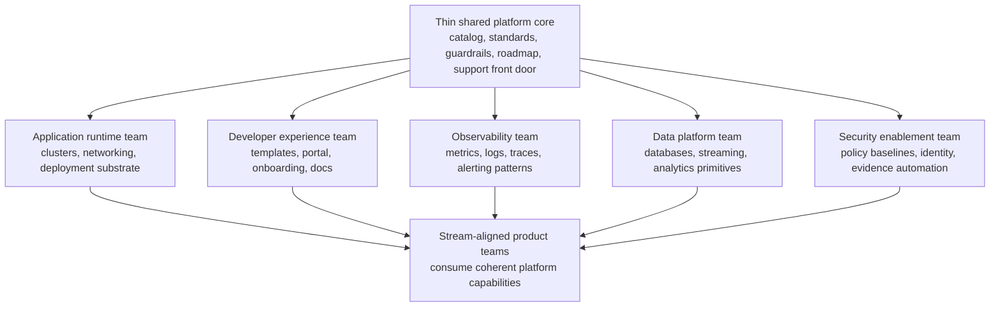
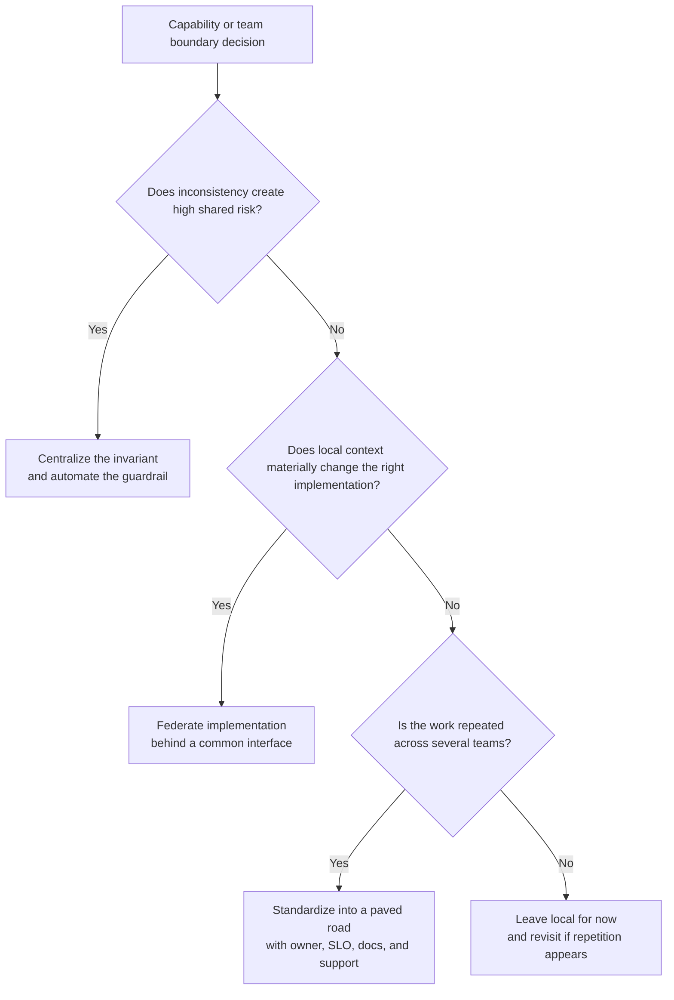

> **Discipline Module** | Complexity: `[ADVANCED]` | Time: 70-85 min
>
> **Prerequisites**: [Module 1.4: Adoption & Migration Strategy](../module-1.4-adoption-migration/), [Module 1.1: Building Platform Teams](../module-1.1-platform-team-building/), [SRE: Service Level Objectives](/platform/disciplines/core-platform/sre/module-1.2-slos/), [FinOps Discipline](/platform/disciplines/business-value/finops/), and experience with multi-team engineering organizations.

---

## What You'll Be Able to Do

After completing this module, you will be able to make platform-organization scaling decisions with explicit tradeoffs, rather than treating headcount growth as the only available lever.

- **Design** a platform grouping that splits work by durable capability while keeping one coherent platform experience for stream-aligned teams.
- **Choose** when to centralize, federate, or leave a capability local based on risk, cognitive load, adoption, and speed of change.
- **Implement** paved-road governance with automated guardrails, policy-as-code, and security baselines that enable teams instead of creating ticket queues.
- **Operate** a multi-team platform organization with clear intake, prioritization, support, on-call, funding, and maturity practices.
- **Reduce** cross-team cognitive load by managing platform surface area, deprecations, internal documentation, and developer experience for both builders and users.

---

## Why This Module Matters

Hypothetical scenario: A product organization grows from about 100 developers to about 400 developers while its original platform team remains organized as one small group. At first the platform team looks successful because most teams use its deployment path, monitoring defaults, and database provisioning workflow. Then the support channel starts filling faster than the team can answer, every roadmap item competes with urgent enablement work, and product teams begin asking individual platform engineers for private exceptions because the official path is too slow.

The first instinct is usually to hire more platform engineers, but adding people to the same undifferentiated team rarely scales the original operating model. A small team can coordinate through conversation, shared memory, and informal trust. A larger platform organization needs explicit ownership, service boundaries, prioritization rules, and governance mechanisms because nobody can hold the whole system in their head. Without that design, the platform becomes a crowd of helpful specialists rather than a reliable internal product.

Scaling a platform organization is closer to scaling a city transit system than buying more cars. A single shuttle can serve a campus for a while, but a growing city needs routes, transfer points, maintenance windows, safety rules, fare policy, signs, and dispatch. The goal is not to centralize every movement through one dispatcher. The goal is to create a coherent system where people can move independently because the network, rules, and interfaces are understandable.

Platform engineering adds one more twist: the organization that builds the platform can easily reproduce its own structure in the platform's architecture. Melvin Conway's 1968 paper is still useful here because communication boundaries influence system boundaries. If every platform sub-team builds a separate catalog, a separate onboarding path, and a separate support model, the consuming teams experience that fragmentation directly. If one central team approves every detail, consuming teams experience that bottleneck just as directly.

This module teaches the durable practice behind scaling the platform organization. It is not a tour of internal developer portal products, Kubernetes policy engines, or org-chart templates. Tools can help, but they cannot decide which capabilities should be central, which should be federated, which interfaces must be stable, and which governance rules deserve automation. Those are leadership decisions, and they become more important as the platform grows.

---

## Scaling From One Team to a Platform Grouping

Team Topologies uses the term platform team for a grouping of teams that provide a compelling internal product to accelerate stream-aligned teams. That distinction matters at scale because a platform can be one team early on, but a mature platform is often a thin shared experience composed from several platform teams. Each team offers something as-a-service: Kubernetes foundations, delivery pipelines, runtime observability, secrets, databases, data pipelines, identity, templates, or other reusable capabilities.

The leadership mistake is assuming the word platform means one permanent team. A single team is a good starting shape when the platform is still proving demand, but it becomes a poor container once the work contains multiple deep specialties, distinct user journeys, and separate reliability obligations. If the same engineers are expected to maintain clusters, design golden paths, answer compliance questions, run the portal, manage cloud costs, and support data tooling, they will eventually optimize for whichever fire is loudest.

The better mental model is platform-of-platforms with a thin shared core. The shared core owns the things that must feel coherent to developers: the service catalog taxonomy, paved-road patterns, security baseline, shared identity model, documentation standard, support entry point, and product narrative. The capability teams own the actual services behind that experience. A developer should not need to know the entire internal org chart to create a service, request a database, understand ownership, or find the right support path.


```mermaid
flowchart TD
    Core["Thin shared platform core\ncatalog, standards, guardrails, roadmap, support front door"]
    App["Application runtime team\nclusters, networking, deployment substrate"]
    DX["Developer experience team\ntemplates, portal, onboarding, docs"]
    Obs["Observability team\nmetrics, logs, traces, alerting patterns"]
    Data["Data platform team\ndatabases, streaming, analytics primitives"]
    Sec["Security enablement team\npolicy baselines, identity, evidence automation"]
    Users["Stream-aligned product teams\nconsume coherent platform capabilities"]

    Core --> App
    Core --> DX
    Core --> Obs
    Core --> Data
    Core --> Sec
    App --> Users
    DX --> Users
    Obs --> Users
    Data --> Users
    Sec --> Users
```

Splitting by capability is not the same as splitting by technology preference. A Kubernetes team, a CI team, and a portal team might be reasonable names if those labels describe durable service boundaries. They are weak names if they simply mirror tools currently in use. The question is what promise the team makes to consuming teams. "We provide a supported runtime path for production workloads" is a capability. "We own this cluster manager" is an implementation detail that may change.

The first split should usually happen before the original team is already exhausted. Waiting until everyone is overloaded makes the split political because every boundary decision feels like a loss of control. Earlier splits can be framed as service design: one group keeps the runtime stable, another improves onboarding and golden paths, another handles data or security services when those domains are genuinely distinct. The split is successful only if each new team gets a clear API, backlog, users, support expectations, and decision rights.

Boundaries also need an integration layer. If every platform team creates its own intake process, service vocabulary, documentation format, support channel, and maturity model, consuming teams still experience the platform as fragmented. The thin shared core exists to prevent that fragmentation without becoming a central bottleneck. It defines the platform contract, not every implementation detail. It says what every platform service must expose to developers, how lifecycle states are represented, and how changes are communicated.

A practical test is whether a new product team can perform a common journey without discovering the platform's internal seams. If creating a service requires one portal page, one request taxonomy, one set of ownership labels, and one documented escalation path, the platform grouping is coherent. If the same journey requires separate knowledge of the runtime team, security team, observability team, and database team, the platform organization has scaled internally while pushing its coordination cost outward.

This is where Conway's Law becomes a leadership tool rather than a slogan. You can either let communication paths accidentally design the platform, or you can design team boundaries and interfaces so they support the architecture you want. A platform grouping should make the desired architecture easier to build by giving each team a clear service boundary and giving developers a consistent way to consume those services.

---

## Federation, Boundaries, and Coherence

Centralized and federated platform models both solve real problems, and both fail when used as ideology. Centralization is useful when variance creates risk, duplicated work, or a confusing developer experience. Federation is useful when local context changes quickly, business units have different needs, or a central team would become too far removed from the work. The leadership job is to decide where consistency creates leverage and where local ownership creates speed.

A fully centralized platform organization can preserve consistency, but it often becomes the approval desk for every unusual need. Product teams wait for the platform queue, then work around it when they cannot wait. The workarounds are rational from their point of view: a team with a launch deadline will not wait weeks for a perfect shared pattern if a local solution can be built today. Over time, the central team loses trust because its standards are experienced as delay.

A fully decentralized model creates the opposite failure. Every team chooses its own delivery path, observability style, security evidence pattern, and cost tagging approach. Autonomy feels fast locally, but the organization pays later through duplicated tools, inconsistent operations, weak auditability, and hard-to-transfer knowledge. Developers changing teams must relearn basics that should have been common, and security or compliance teams must negotiate the same controls repeatedly.

Federation is the middle path, but it has to be designed. In a federated platform model, the platform core centralizes the minimum constraints required for coherence: baseline security controls, golden-path interfaces, service catalog taxonomy, standard ownership metadata, supported runtime patterns, and organization-wide reliability expectations. Capability teams and product teams can extend within those boundaries when their domain requires it. The boundary is explicit enough to prevent sprawl and flexible enough to avoid bureaucracy.

The key word is boundary. A good boundary tells teams where they have freedom and where they do not. It should be written in terms of outcomes, risks, and interfaces rather than personal permission. For example, a product team may choose a language or framework within a supported runtime path, but it may not bypass workload identity, owner labeling, logging, vulnerability scanning, or incident escalation metadata. The platform does not need to review every design choice if those invariants are automatically enforced.

Federation also needs a feedback loop from the edges back to the core. When multiple teams need the same exception, that exception is probably a missing platform capability. When only one team needs it because of a domain-specific constraint, the platform can document it as a local extension. Without this loop, central standards become stale. With it, federation becomes a discovery mechanism that tells the platform where to evolve next.

| Capability decision | Usually centralize | Usually federate | Leave local when |
|---|---|---|---|
| Security baseline | Identity, admission policy, audit evidence | Domain-specific threat controls | The risk is isolated and reversible |
| Golden paths | Service creation flow and required metadata | Template variants for team context | The service is experimental and short-lived |
| Observability | Minimum telemetry contract and alert conventions | Domain dashboards and service-specific signals | The system has no production dependency |
| Data services | Supported database classes and backup expectations | Schema ownership and domain access patterns | The data is temporary or non-sensitive |
| Developer portal | Catalog model and shared entry points | Team-owned docs, scorecards, and actions | A prototype has not become shared infrastructure |

Boundaries are not only technical. They also cover decision rights. A platform council can define organization-wide standards, but it should not become the place where routine implementation decisions go to wait. Capability teams should own their roadmaps, SLOs, support model, and user research. Product teams should own their applications and runtime choices within the platform's guardrails. Security and compliance should own risk interpretation and evidence requirements, not every manual approval step.

The healthiest federated platform organizations make escalation rare because the normal path is clear. Teams know what is mandatory, what is recommended, what is unsupported, and how to propose a change. That clarity reduces both fear and drift. People do not have to ask permission for every decision, and they do not have to guess which rules are real.

---

## Scaling Across Business Units, Regions, and Environments

Scaling becomes more subtle when the platform organization serves multiple business units, regions, or cloud environments. The pressure to fragment usually comes from real constraints: a regulated business unit needs stronger evidence, a region has different availability requirements, a data team has specialized storage needs, or an acquired group arrives with its own delivery path. Treating all of those differences as rebellion is a mistake. Treating all of them as reasons to create separate platforms is also a mistake.

The platform leader's job is to separate legitimate domain variation from accidental duplication. Legitimate variation changes the product promise. A regulated workload may need a stricter audit trail than an internal prototype. A latency-sensitive service may need regional deployment patterns that ordinary applications do not. Accidental duplication happens when teams solve the same generic problem in isolation because the shared platform is unavailable, slow, unclear, or not trusted.

A useful rule is to centralize the language of the platform even when implementations vary. Service ownership, lifecycle state, support tier, reliability target, data classification, and security baseline should mean the same thing across the organization. A team in one region can use different implementation details from a team in another region, but both should publish ownership in the same catalog model and expose the same kind of operational evidence. This is how the platform remains legible at scale.

Business-unit federation works best when each unit has a named platform interface rather than a private fork. The local platform representative can maintain domain-specific templates, help prioritize local needs, and coordinate adoption, but they should still participate in the shared platform council. That council should focus on the platform contract: what capabilities are supported, which metadata is mandatory, which risks are centrally governed, and which extension points are intentionally local.

Regional federation needs a similar contract. A region may have different latency, residency, or availability needs, but a developer should not have to learn a completely different platform vocabulary to deploy there. The platform can expose regional variants through the same golden path, with the differences surfaced as supported options rather than tribal knowledge. If a regional platform feels like a separate product, the platform grouping has failed to preserve coherence.

Cloud-environment federation should be handled with extra discipline because cloud differences invite tool-driven structure. The platform should not create one team per provider unless the operating promises truly require it. Many decisions are provider-specific at the implementation layer but common at the platform-product layer: identity, cost allocation, runtime ownership, service catalog metadata, incident routing, and compliance evidence. A provider split that hides these common concerns will recreate the same work several times.

The platform-of-platforms idea is powerful because it allows local specialization behind a shared contract. The shared core does not need to know every implementation detail, but it must know which promises are made to users and which invariants protect the organization. Local capability teams can innovate, but they should export their learning back to the core. When a local pattern becomes broadly useful, it can graduate into the paved road. When it remains domain-specific, it can stay federated without shame.

The failure mode to watch is parallel maturity. One business unit develops excellent onboarding, another develops excellent compliance evidence, another develops cost visibility, and none of those improvements become shared. The platform organization then contains pockets of maturity but no scaling mechanism. A mature platform grouping has a way to notice local success, evaluate whether it generalizes, and promote it into shared practice without forcing every team into the same implementation.

---

## Governance as Paved-Road Guardrails

Governance gets a bad reputation because many organizations implement it as meetings, approval queues, and exception forms. That style does not scale because every new team, service, cluster, and environment increases the number of decisions waiting for human review. Manual governance also tends to punish teams that are trying to follow the official path, because the teams asking for review are the visible ones. The teams bypassing the path often move faster until something breaks.

Paved-road governance works differently. It starts by deciding which rules are important enough to encode into the platform itself. A rule such as "production workloads must declare an owner" should not depend on a reviewer remembering to check a template. It can be enforced by admission control, CI validation, infrastructure policy, or catalog ingestion. A rule such as "new services must have an escalation path" can be built into service templates and checked by scorecards.

The goal is not to automate every judgment. Some decisions require architectural conversation, especially when a team is introducing a new runtime pattern, changing a shared dependency, or accepting a risk that affects other teams. The goal is to reserve human attention for those high-context decisions by automating the low-context invariants. Governance scales when reviewers stop checking whether every form field exists and start discussing whether the proposed capability changes the platform contract.

```yaml
apiVersion: admissionregistration.k8s.io/v1
kind: ValidatingAdmissionPolicy
metadata:
  name: require-platform-owner-label
spec:
  failurePolicy: Fail
  matchConstraints:
    resourceRules:
      - apiGroups: ["apps"]
        apiVersions: ["v1"]
        operations: ["CREATE", "UPDATE"]
        resources: ["deployments"]
  validations:
    - expression: "has(object.metadata.labels) && 'platform.kubedojo.io/owner' in object.metadata.labels"
      message: "Deployments must declare platform.kubedojo.io/owner."
```

That YAML is not the point of the module, but it illustrates the leadership pattern. A platform organization can turn a policy decision into a fast, consistent feedback loop at the moment developers act. The developer gets an immediate explanation, the platform gets a consistent invariant, and the security team gets a control that does not require manual review. Kubernetes ValidatingAdmissionPolicy, OPA, Kyverno, CI checks, and infrastructure-as-code policy tools are all examples of mechanisms; the durable practice is moving repeatable governance into the paved road.

Security and compliance partners should be treated as co-designers of the paved road, not late-stage approvers. If security writes controls after the platform has already chosen its workflows, controls arrive as friction. If security helps design the golden path, controls become defaults. Evidence collection can happen through catalog metadata, deployment records, policy evaluation logs, vulnerability scan results, and incident links instead of after-the-fact spreadsheet hunts.

Governance should also define the exception path. A no-exception platform is unrealistic, and an exception path with no expiry becomes permanent drift. A good exception records the owner, risk, compensating control, expiry date, and decision maker. It also feeds product learning back to the platform core. If several teams request similar exceptions, the platform may need a new supported variant rather than stricter enforcement.

The relationship between governance and developer experience is direct. A rule that developers understand early feels like a guardrail. A rule discovered after days of work feels like a trap. The platform should expose guardrails through templates, docs, scorecards, CLI feedback, pull request checks, and portal context before a deployment is blocked. Enforcement is necessary, but explanation is what preserves trust.

The governance model should be lightweight enough to change. Early platform organizations often need a small standards group, a written RFC process for cross-cutting changes, and automated checks for known invariants. Larger organizations may need formal risk review for new capability classes, maturity scorecards, or audit evidence pipelines. In both cases, the test is whether governance helps teams make good decisions faster. If it mainly moves work into a queue, the model is not scaling.

---

## Operating Model and Maturity

A platform operating model describes how work enters the platform organization, how priorities are chosen, how services are supported, how reliability is owned, and how funding follows responsibility. Many scaling failures come from adding teams without changing the operating model. The org chart grows, but intake remains a noisy chat channel, prioritization remains whoever escalates most loudly, and support remains whoever happens to know the answer.

Intake needs to separate different kinds of work. Support requests, defects, adoption help, roadmap requests, risk exceptions, and strategic bets should not compete in one backlog without labels. A production incident deserves a different flow from a template improvement. A request for a new platform capability deserves discovery, sizing, and product prioritization. A team asking for help adopting an existing path may need enablement, not engineering work.

Prioritization becomes harder because platform work has multiple customers. Product teams want speed, security wants enforceable controls, finance wants cost visibility, leadership wants predictability, and platform engineers want technical sustainability. A mature operating model makes those tradeoffs visible. It should include a product roadmap, a reliability backlog, a security/compliance backlog, a deprecation backlog, and an explicit capacity allocation for support and enablement.

Support also changes with scale. One shared support channel may work early, but a platform grouping needs a front door, routing rules, severity definitions, and ownership metadata. Developers should not need to know which team owns a problem before asking for help. The platform support model can route based on service catalog ownership, capability area, incident severity, and known service boundaries. The first response can be centralized while resolution remains with the responsible capability team.

On-call needs the same clarity. A platform organization with multiple teams cannot rely on heroic generalists forever. The runtime team may own cluster incidents, the observability team may own telemetry ingestion, and the developer experience team may own portal or template outages. Cross-cutting incidents still need an incident commander and escalation path, but that does not mean every page should go to every platform engineer. Clear service ownership reduces both burnout and confusion.

Funding and headcount should follow platform surface area, not just developer count. A platform serving one standardized runtime and a narrow set of golden paths can operate with a smaller organization than a platform responsible for multiple runtimes, regulated evidence, data services, global environments, and specialized workloads. Leadership should fund the platform based on the capabilities it promises, the reliability it owns, and the support load it absorbs. Otherwise the platform silently borrows capacity from maintenance, documentation, and deprecation work until quality declines.

The maturity progression is organizational, not just technical. In the crawl stage, the platform proves demand, identifies its users, and removes the largest sources of friction. In the walk stage, it defines capability ownership, service contracts, support paths, SLOs, and basic governance. In the run stage, it operates as a platform grouping with product management, federated governance, automated evidence, deprecation discipline, and continuous measurement of developer experience.

| Maturity stage | Operating model focus | Leadership question |
|---|---|---|
| Crawl | Prove the platform solves real developer problems | Which painful journeys are worth standardizing first? |
| Walk | Define ownership, support, SLOs, and guardrails | Which promises can each platform team reliably keep? |
| Run | Federate capability teams behind one coherent experience | Which decisions should move to the edge, and which invariants stay central? |

The transition between stages should be deliberate. A crawl-stage platform can survive on informal communication because the cost of ceremony would exceed the benefit. A run-stage platform cannot survive on informal communication because the coordination cost becomes invisible until it fails. Maturity means adding just enough structure for the current scale, then removing or automating structure that stops paying for itself.

---

## Funding and Capacity Signals

Platform funding is often discussed too late, after the platform has already become a critical dependency. Early platform teams can survive as a strategic bet because they are still proving demand. A scaled platform organization needs a more explicit funding model because it owns services, support, reliability, compliance evidence, and developer experience across many teams. If leadership funds only new features, the platform will quietly underfund maintenance and support until trust declines.

The most important funding question is what the platform promises to absorb on behalf of product teams. A platform that owns runtime security baselines, deployment automation, observability defaults, database provisioning, and compliance evidence is removing work from many teams. That value is real, but it also means the platform must be staffed for service ownership rather than project delivery alone. Headcount should follow the promises the platform makes, not only the number of engineers consuming it.

Capacity planning should include work that is easy to hide. Support load, incident response, dependency upgrades, evidence maintenance, documentation, enablement sessions, deprecations, roadmap discovery, and internal platform tooling all consume real time. When those categories are invisible, platform engineers appear slower than feature teams because they are carrying unacknowledged operational work. A mature operating model names these capacity buckets and reviews them during planning.

One practical signal is backlog composition. If most platform capacity goes to urgent support and reliability work, the platform may be underfunded, over-promised, or carrying too many obsolete paths. If most capacity goes to new capability work while support quality falls, the platform may be optimizing roadmap optics over service ownership. If deprecation and documentation receive no capacity, the platform is accumulating cognitive debt that will later appear as adoption friction.

Another signal is queue shape. A growing queue of similar requests usually means the platform needs a self-service capability, not more manual throughput. A growing queue of unrelated exceptions usually means governance boundaries are unclear or too rigid. A growing queue of questions that should be answered by docs usually means the platform's interfaces are not legible. Platform leaders should study queues as product research, not merely as operational burden.

Cost allocation should support the operating model rather than fight it. Shared primitives that every team must use are usually better funded centrally, because charging teams for mandatory standards can create incentives to avoid the paved road. Variable consumption, specialized resources, and domain-specific extensions can be made visible through showback or charged locally when that improves accountability. The goal is not to make every platform cost someone else's problem. The goal is to align incentives so shared safety and efficiency are easy to adopt.

Funding conversations are also where platform leaders must be honest about tradeoffs. If leadership wants broader platform surface area without additional capacity, something else must become slower, less reliable, less supported, or retired. A platform roadmap that never says no is not customer-focused; it is avoiding prioritization. Clear funding and capacity signals give leaders a way to choose deliberately instead of letting hidden toil choose for them.

---

## Cross-Team Cognitive Load at Scale

Team Topologies emphasizes cognitive load because teams can only understand and operate so much at once. Platform organizations sometimes reduce cognitive load for product teams while increasing it for platform engineers. That is not sustainable. If every platform engineer must understand every cluster, every template, every compliance exception, every data service, and every portal workflow, the platform organization has merely moved complexity inward without managing it.

The first defense is a clear platform surface area. Every supported capability should have an owner, lifecycle state, support model, documentation entry point, and deprecation path. Capabilities that lack those attributes are not really products; they are artifacts. Artifacts accumulate because they are easy to launch and politically hard to remove. A scaling platform organization needs the discipline to mark things experimental, supported, deprecated, or retired.

Deprecation is a developer experience practice, not a cleanup chore. Removing an old template or runtime path without migration help teaches teams that platform adoption is risky. Leaving every old path alive teaches teams that standards are optional. A good deprecation program announces the reason, identifies affected owners, provides a migration path, offers enablement, and tracks completion. It also gives the platform permission to stop carrying cognitive load that no longer creates value.

Internal platform developer experience matters as much as consumer developer experience. Platform teams need their own golden paths for creating a new platform service, publishing documentation, adding catalog metadata, exposing support contacts, defining SLOs, and connecting policy evidence. Without those internal paths, each capability team invents its own operating style, and the shared platform experience fragments. The platform needs a platform for itself.

Documentation should be treated as an interface, not a side effect. A consuming team reads docs to understand what promise the platform makes. A platform engineer reads docs to understand what neighboring capability teams own. A security partner reads docs to understand how controls are enforced. Good documentation reduces meetings because it makes boundaries legible. Poor documentation increases cognitive load because every answer requires a person.

Scorecards can help when they are used as conversation starters rather than public shame boards. A service scorecard might show whether a workload has an owner, SLO, runbook, telemetry, backup policy, dependency inventory, and current runtime version. The score should help teams see the next improvement. If scorecards become a punitive ranking system, teams will optimize the score instead of improving the service.

Measurement should balance flow, quality, and human experience. DORA and Accelerate are useful for delivery and operational performance, SPACE is useful for avoiding one-dimensional productivity measures, and the DevEx framework is useful because it focuses on feedback loops, cognitive load, and flow state. A platform organization should not reduce its value story to adoption count alone. High adoption of a frustrating platform is not success; it may simply mean teams have no alternative.

The scaling question is therefore not "How many platform teams do we have?" The better question is "How much complexity do product teams and platform teams need to understand to make a safe change?" A mature platform organization reduces that complexity through stable interfaces, thoughtful defaults, automated guardrails, reliable support, and disciplined retirement of obsolete paths.

---

## Landscape snapshot — as of 2026-06. This changes fast; verify against vendor docs before relying on specifics.

Internal developer portals are useful examples because they show how volatile tools can support durable capabilities. Backstage, Port, Cortex, and similar products are not governance strategies by themselves. They are possible user interfaces and data models for catalog ownership, software templates, scorecards, documentation, and self-service actions. The durable decision is whether the platform organization needs those capabilities, who owns the data, and how the portal fits the operating model.

Use this snapshot as a vocabulary aid, not a ranking. The products below change quickly, and feature names vary. A platform leader should evaluate them by ownership model, extensibility, data quality, workflow integration, operational burden, and fit with the organization's platform product strategy. The wrong lesson is "buy a portal and become mature." The right lesson is "make the platform's promises discoverable, measurable, and executable."

| Durable capability | Backstage example | Port example | Cortex example |
|---|---|---|---|
| Software catalog | Catalog entities and ownership metadata | Catalog with flexible data model | Service catalog and engineering system of record |
| Golden paths | Software templates and scaffolder actions | Self-service actions and workflows | Self-service workflows and integrations |
| Standards visibility | Plugins and custom views around entities | Scorecards and automation | Scorecards and maturity tracking |
| Documentation | TechDocs and catalog-linked docs | Portal pages and entity context | Service docs and ownership context |
| Tradeoff to evaluate | Requires engineering ownership of the portal | SaaS workflow model shapes implementation | SaaS data model and integration fit matter |

---

## Patterns & Anti-Patterns

The most reliable scaling pattern is a federated platform grouping with a thin shared core. The core keeps the developer experience coherent, while capability teams own services deeply enough to improve them. This pattern avoids two common extremes: a central team that becomes the queue for everything, and a loose collection of teams that all call themselves platform while offering incompatible experiences.

Good patterns make boundaries explicit and changeable. A team API describes what a platform capability owns, what it provides, how to request help, how reliability is measured, and how changes are communicated. A platform RFC process handles changes that affect multiple teams. Automated guardrails enforce repeatable rules. A product roadmap explains why some capabilities are being improved and others are being retired.

Anti-patterns usually hide coordination cost. A central bottleneck team looks efficient because one group owns all standards, but the queue becomes the architecture. Fragmented per-team platforms look autonomous because every team can move, but the organization loses shared learning and consistent risk controls. Governance-as-gatekeeping looks responsible because approvals are visible, but it trains teams to avoid the official path.

| Pattern | What it protects | How to recognize it |
|---|---|---|
| Thin shared platform core | Coherent developer experience across capability teams | One catalog, one support front door, one standards vocabulary |
| Capability teams with X-as-a-Service contracts | Deep ownership without forcing developers to know every internal boundary | Each team publishes promises, SLOs, docs, and escalation paths |
| Paved-road guardrails | Security and compliance at scale | Common rules are checked automatically before manual review is needed |
| Federated platform council | Shared standards without centralizing every decision | Council sets invariants and resolves cross-cutting changes, not routine work |

| Anti-pattern | Why it fails | Better approach |
|---|---|---|
| Central bottleneck team | Every exception, design choice, and support request waits for the same group | Centralize invariants and federate implementation decisions |
| Fragmented per-team platforms | Each product team rebuilds basics and creates operational drift | Provide shared primitives with local extension points |
| Governance as gatekeeping | Manual approvals scale linearly with teams and services | Encode repeatable controls into guardrails and reserve review for judgment |
| Platform mega-team | Too much surface area sits in one backlog and one communication network | Split by capability before exhaustion forces a chaotic reorg |

---

## Decision Framework

Use two decisions repeatedly: should this capability be centralized or federated, and should this platform team split? Treat both decisions as reversible design choices where possible. The point is not to find a perfect permanent structure. The point is to move complexity to the place where it can be owned with the least coordination cost and the clearest user experience.

Centralize a capability when variance creates organization-wide risk, when the capability is expensive to duplicate, when developers need one consistent entry point, or when security and compliance evidence depends on common metadata. Federate when domain context matters, when capability teams can maintain a stable interface, or when a central queue would slow local learning. Leave work local when the blast radius is low, the need is temporary, and standardizing it would create more process than value.

| Question | Centralize if the answer is yes | Federate if the answer is yes |
|---|---|---|
| Does inconsistency create serious security, reliability, or audit risk? | Define a shared baseline and automate enforcement | Let teams extend controls only inside the baseline |
| Does every team need the same user journey? | Provide one golden path and one catalog model | Allow templates or actions to vary by domain |
| Does the work require deep local context? | Centralize only the interface and mandatory metadata | Let the domain team own implementation details |
| Is the capability changing quickly? | Centralize discovery and standards slowly | Run local experiments, then promote repeated patterns |
| Would a queue form if one team owned every decision? | Centralize fewer decisions | Move decisions to capability teams with clear guardrails |

Split a platform team when the work has distinct service promises, not merely because the calendar is full. Warning signs include competing on-call domains, repeated backlog conflict between unrelated capabilities, support questions that require different specialists, roadmap debates that mix product discovery with operational firefighting, and developers receiving inconsistent answers. A split is premature if the new teams would still share one backlog, one support model, one technical lead for all decisions, and no clear service boundary.


```mermaid
flowchart TD
    A["Capability or team boundary decision"] --> B{"Does inconsistency create high shared risk?"}
    B -- "Yes" --> C["Centralize the invariant\nand automate the guardrail"]
    B -- "No" --> D{"Does local context materially change the right implementation?"}
    D -- "Yes" --> E["Federate implementation\nbehind a common interface"]
    D -- "No" --> F{"Is the work repeated across several teams?"}
    F -- "Yes" --> G["Standardize into a paved road\nwith owner, SLO, docs, and support"]
    F -- "No" --> H["Leave local for now\nand revisit if repetition appears"]
```

After a split, review the developer journey rather than celebrating the new org chart. If developers now need to understand more internal teams to complete the same work, the split exported coordination cost. If each capability team moves faster while the platform still feels like one product, the split reduced cognitive load. The test is experienced by the users, not by the leaders who drew the boxes.

---

## Did You Know?

- **Team Topologies treats a platform team as a grouping, not just a single team**: This is why a mature platform can be composed from several teams while still presenting one internal product experience.
- **Conway's Law came from Melvin Conway's 1968 paper "How Do Committees Invent?"**: The core lesson for platform leaders is that communication structures influence system structures.
- **Thoughtworks' Technology Radar uses rings such as Adopt, Trial, Assess, and Caution**: Internal radars borrow that idea to make technology governance more explicit and less personality-driven.
- **Amazon's two-pizza team idea** <!-- incident-xref: amazon-two-pizza --> **is about small, focused ownership as much as team size**: The lesson for platform grouping design is to keep each team mission narrow enough to own.

---

## Common Mistakes

| Mistake | Problem | Better Approach |
|---|---|---|
| Hiring more platform engineers into one undifferentiated team | Communication overhead rises while ownership remains unclear | Split by durable capability and define service contracts |
| Calling every shared service "the platform" | Developers cannot tell which promises are supported or experimental | Publish lifecycle states and a coherent platform catalog |
| Centralizing every decision in an architecture board | The board becomes a bottleneck and teams route around it | Centralize invariants, federate implementation, and automate checks |
| Letting each product team build its own mini-platform | Local speed creates duplicated cost, weak controls, and inconsistent operations | Provide shared primitives with domain-specific extension points |
| Treating compliance as a late manual review | Controls appear after teams have already built the wrong path | Co-design guardrails with security and collect evidence automatically |
| Measuring only adoption | Teams may use the platform because they must, not because it helps | Combine adoption with DevEx, reliability, flow, support, and cost signals |
| Never retiring old paths | The platform carries every historical decision and overwhelms builders | Run deprecation as a supported migration program with clear ownership |

---

## Quiz

1. **Hypothetical scenario:** A platform team grows from about 8 engineers to about 20, but it still uses one backlog, one support channel, and one technical lead for all decisions. Product teams complain that answers differ by engineer and roadmap work is constantly interrupted by unrelated incidents. What design problem is showing up, and what should the leader do first?

<details><summary>Answer</summary>

The design problem is that the team has outgrown informal coordination while still pretending to be one unit of ownership. The leader should first map the actual platform capabilities, support load, and reliability obligations, then split only where there are durable service boundaries. A good split creates clear service contracts, ownership, SLOs, documentation, and escalation paths for each platform capability. Splitting by personalities or current tools would not solve the underlying operating-model problem.

</details>

2. **Hypothetical scenario:** A security group wants to approve every Kubernetes deployment before production because some teams have missed required labels and runtime controls. Product teams say this will slow urgent releases, while the platform team agrees that the controls are legitimate. How should paved-road governance handle this tension?

<details><summary>Answer</summary>

The platform should implement the repeatable controls as automated guardrails rather than manual approvals. Required labels, workload identity rules, baseline security settings, and evidence metadata can be checked through admission policy, CI validation, templates, or catalog scorecards. Security remains accountable for the risk model, but routine enforcement happens in the delivery path where developers get fast feedback. Manual review should be reserved for high-context exceptions or new patterns that change the platform contract.

</details>

3. **Hypothetical scenario:** A data platform team needs specialized templates, cost reporting, and support practices that differ from the main application runtime platform. The platform core worries that allowing variation will fragment the developer experience. What should be centralized, and what should be federated?

<details><summary>Answer</summary>

The shared platform core should centralize the catalog taxonomy, ownership metadata, support entry point, security baseline, and lifecycle vocabulary. The data platform team can federate implementation details such as data-specific templates, domain dashboards, retention guidance, and support playbooks. This preserves one coherent platform experience while allowing the specialized team to serve its domain well. The key is a stable interface between the shared core and the federated capability.

</details>

4. **Hypothetical scenario:** Leadership wants to measure whether the platform organization is worth continued funding. One manager proposes reporting only the percentage of teams using the platform because that number is easy to explain. Why is that insufficient, and what should be measured instead?

<details><summary>Answer</summary>

Adoption alone does not prove the platform is improving engineering outcomes, because teams may use a required platform even when it is slow or frustrating. The platform should combine adoption with developer experience, delivery flow, reliability, support quality, cost visibility, and cognitive-load signals. DORA, SPACE, and DevEx ideas can help leaders avoid a single-metric story. A stronger value case shows whether the platform reduces friction while preserving reliability and governance.

</details>

5. **Hypothetical scenario:** A platform organization split into runtime, developer experience, observability, and security enablement teams. Six months later, each team has its own docs style, support intake, scorecard language, and lifecycle terms. What went wrong with the platform grouping?

<details><summary>Answer</summary>

The split created specialized teams but failed to preserve a thin shared core. Capability ownership improved internally, but the consuming developer experience became fragmented because every team exposed a different interface. The platform core should standardize catalog metadata, support routing, lifecycle states, documentation expectations, and common scorecard vocabulary. Once those shared interfaces exist, each capability team can still own its deeper implementation.

</details>

6. **Hypothetical scenario:** A platform capability has low security risk, only two teams need it, and both teams are experimenting with different approaches. A senior architect wants to standardize it immediately to prevent future sprawl. How should the centralize-versus-federate decision framework guide the response?

<details><summary>Answer</summary>

The framework suggests leaving the work local or federated until repetition and risk justify standardization. Premature centralization can turn an experiment into a platform commitment before the organization understands the need. The platform should watch for common patterns, capture learning, and define minimum metadata or safety expectations if needed. If more teams need the capability later, the platform can promote the repeated pattern into a paved road.

</details>

7. **Hypothetical scenario:** A platform team wants to retire an old deployment path because maintaining it consumes support capacity, but several product teams still depend on it. What does deprecation discipline require beyond announcing an end date?

<details><summary>Answer</summary>

Deprecation discipline requires identifying owners, explaining the reason, providing a migration path, offering enablement, tracking progress, and making the replacement path trustworthy. The platform should treat retirement as a product migration, not an infrastructure cleanup. If teams are surprised or left to migrate alone, they will learn that platform adoption is risky. A good deprecation program reduces cognitive load while preserving trust.

</details>

---

## Hands-On

In this practice exercise, you will draft a scaling plan for a platform organization that is moving from one team to a platform grouping. Use your own organization if you can, or use a hypothetical internal platform that provides deployment, observability, service templates, secrets, and database provisioning to product teams.

### Step 1: Map the current platform surface

Write down every capability the platform currently promises, even if the promise is informal. For each capability, name the user, owner, support path, reliability expectation, and lifecycle state. The goal is not to create a perfect inventory; it is to expose where the current platform depends on memory rather than explicit service ownership.

```text
Capability:
Primary users:
Current owner:
Support path:
Reliability expectation:
Lifecycle state: experimental | supported | deprecated | retired
Current pain:
```

### Step 2: Design a platform grouping

Group the capabilities into a thin shared core and capability teams. The shared core should own coherence across the developer journey, while each capability team should own a service promise. If a proposed team cannot describe its users, interface, support model, and SLO, it is probably not a real team boundary yet.

```text
Thin shared core owns:
Capability team 1 owns:
Capability team 2 owns:
Capability team 3 owns:
Federated extension points:
Centralized invariants:
```

### Step 3: Define governance guardrails

Choose three rules that should be enforced automatically and one decision that should still require human review. For each automated rule, name the enforcement point and the developer feedback channel. For the human review, define the decision threshold so teams know when the review is necessary.

```text
Automated guardrail:
Why it matters:
Enforcement point:
Developer feedback:

Human review decision:
Threshold:
Reviewer group:
Expected response time:
```

### Success Criteria

- [ ] Your platform grouping has a thin shared core and at least two capability teams with clear service promises.
- [ ] Your centralize-versus-federate choices explain why each capability belongs in that category.
- [ ] Your governance plan includes at least three automated guardrails and one bounded human review path.
- [ ] Your operating model names intake, prioritization, support routing, and on-call ownership.
- [ ] Your deprecation plan identifies at least one old path, its owner, its migration path, and its exit criteria.

---

## Sources

- [Team Topologies Key Concepts](https://teamtopologies.com/key-concepts)
- [Team Topologies Key Concepts: Groupings](https://teamtopologies.com/key-concepts-content)
- [What I Talk About When I Talk About Platforms](https://martinfowler.com/articles/talk-about-platforms.html)
- [Team Topologies - Martin Fowler](https://martinfowler.com/bliki/TeamTopologies.html)
- [CNCF Platforms White Paper](https://tag-app-delivery.cncf.io/whitepapers/platforms/)
- [CNCF Platform Engineering Maturity Model](https://tag-app-delivery.cncf.io/whitepapers/platform-eng-maturity-model/)
- [How Do Committees Invent?](https://www.melconway.com/research/committees.html)
- [DevEx: What Actually Drives Productivity](https://queue.acm.org/detail.cfm?id=3595878)
- [The SPACE of Developer Productivity](https://queue.acm.org/detail.cfm?id=3454124)
- [Applying Product Management to Internal Platforms](https://www.thoughtworks.com/en-us/radar/techniques/applying-product-management-to-internal-platforms)
- [Thoughtworks Technology Radar](https://www.thoughtworks.com/en-us/radar)
- [DORA](https://dora.dev/)
- [Google SRE: Service Level Objectives](https://sre.google/sre-book/service-level-objectives/)
- [Google SRE Workbook: Error Budget Policy](https://sre.google/workbook/error-budget-policy/)
- [Open Policy Agent Documentation](https://www.openpolicyagent.org/docs)
- [Kubernetes Validating Admission Policy](https://kubernetes.io/docs/reference/access-authn-authz/validating-admission-policy/)
- [Backstage Software Catalog](https://backstage.io/docs/features/software-catalog/)
- [Backstage Software Templates](https://backstage.io/docs/features/software-templates/writing-templates/)
- [Port Documentation](https://docs.port.io/)
- [Cortex: What Is an Internal Developer Portal?](https://www.cortex.io/post/what-is-an-internal-developer-portal)
- [Amazon's Two Pizza Teams](https://aws.amazon.com/executive-insights/content/amazon-two-pizza-team/)

---

## Next Module

You have completed the Core Platform Leadership sequence; continue with the [Platform Engineering discipline](/platform/disciplines/core-platform/platform-engineering/) to connect these organizational scaling choices to the technical platform practices they govern.
