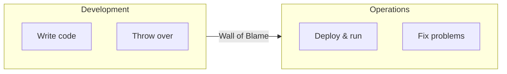
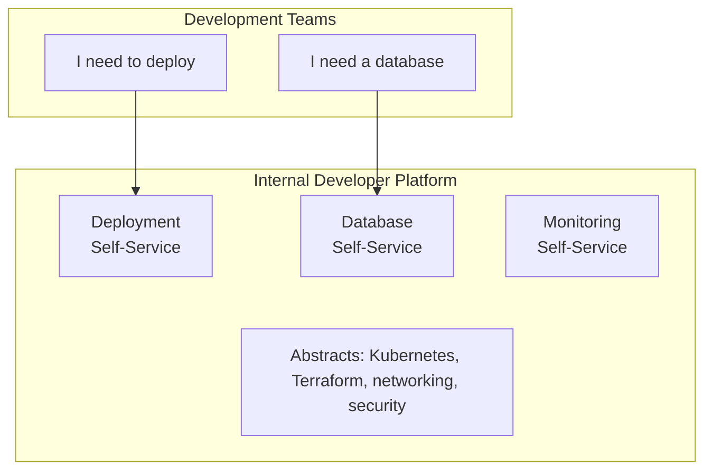
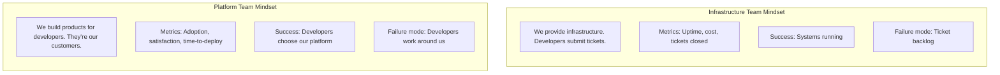
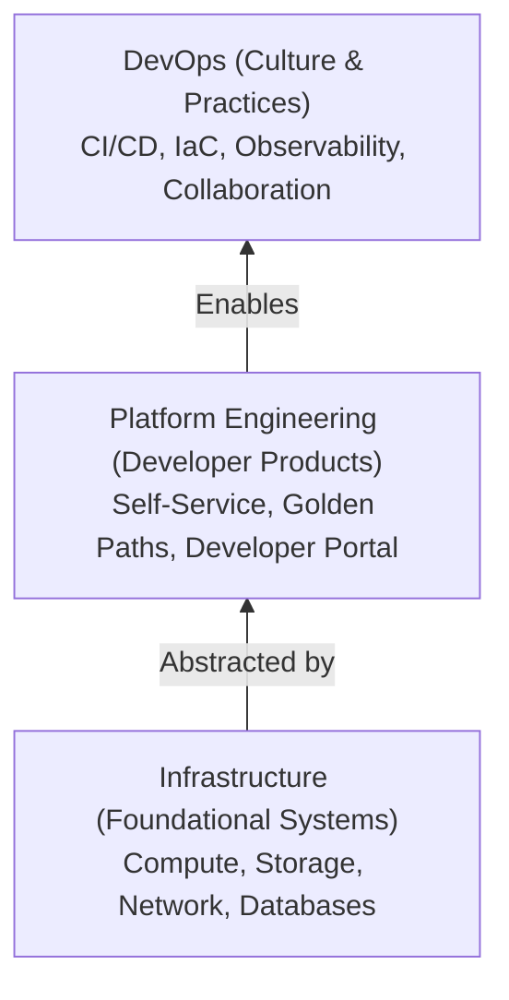
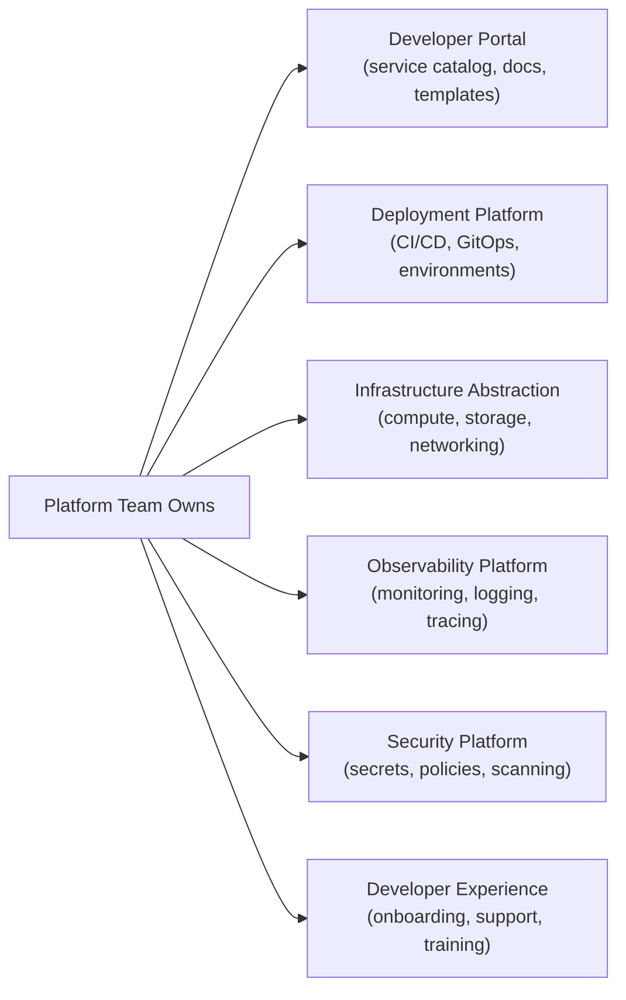
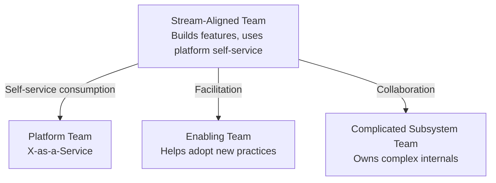

> **Discipline Module** | Complexity: `[MEDIUM]` | Time: 35-45 min

## Prerequisites

Before starting this module:
- **Required**: [Systems Thinking Track](/platform/foundations/systems-thinking/) — Understanding complex systems
- **Recommended**: [SRE Discipline](/platform/disciplines/core-platform/sre/) — Operations perspective
- **Helpful**: Experience in a DevOps or infrastructure role

---

## What You'll Be Able to Do

After completing this module, you will be able to:

- **Evaluate your organization's readiness for platform engineering adoption**
- **Design a platform team charter that defines scope, boundaries, and success metrics**
- **Analyze the difference between platform engineering, DevOps, and SRE to position your team correctly**
- **Build a platform vision document that aligns engineering leadership around shared infrastructure goals**

## Why This Module Matters

You've heard the buzzword. "Platform Engineering" is everywhere—conference talks, job postings, vendor pitches. But what actually *is* it? And why does it matter?

Here's the uncomfortable truth: **DevOps promised developers would own everything. That promise broke many teams.**

"You build it, you run it" sounds empowering. In practice, it often means:
- Developers drowning in operational complexity
- Every team reinventing deployment pipelines
- Cognitive load crushing productivity
- Security and compliance becoming everyone's problem (and therefore nobody's)

Platform Engineering is the course correction. It's about building products—internal products—that make developers' lives better while maintaining organizational guardrails.

After this module, you'll understand:
- Where Platform Engineering came from
- How it differs from DevOps and infrastructure
- What "platform as a product" really means
- How platform teams should be structured

---

## The Origin Story

### DevOps Origins

Before we can understand Platform Engineering, we need to understand what it evolved *from*.

**The birth of DevOps** traces back to **Patrick Debois** in 2009. Frustrated by the wall between developers and operations, Debois organized the first **DevOpsDays** conference in Ghent, Belgium. The term "DevOps" — a portmanteau of Development and Operations — stuck, and a movement was born.

In **2013**, Gene Kim, Kevin Behr, and George Spafford published **"The Phoenix Project"**, a novel that dramatized the pain of siloed IT and the transformation DevOps could bring. It became required reading in engineering organizations worldwide and brought DevOps principles to mainstream tech leadership.

The **CALMS framework** emerged as a way to evaluate DevOps adoption:

| Pillar | Meaning | Example |
|--------|---------|---------|
| **C**ulture | Shared responsibility, blameless collaboration | Joint on-call between dev and ops |
| **A**utomation | Eliminate manual, error-prone processes | CI/CD pipelines, Infrastructure as Code |
| **L**ean | Reduce waste, small batch sizes, fast feedback | Continuous delivery, WIP limits |
| **M**easurement | Data-driven decisions (see DORA metrics) | Deployment frequency, lead time tracking |
| **S**haring | Knowledge sharing, transparency, feedback loops | Blameless postmortems, internal tech talks |

DevOps was transformative — it broke down silos, accelerated delivery, and introduced practices like CI/CD and Infrastructure as Code that are now industry standard. But as we will see, the "everyone owns everything" philosophy created new problems that Platform Engineering would eventually address.

### DevOps: The Promise

In the 2000s, development and operations were separate silos:



DevOps broke down this wall. Shared responsibility. Continuous delivery. Infrastructure as code. Teams owning their services end-to-end.

**The DevOps promise**: Faster delivery, better quality, happier teams.

### DevOps: The Reality

Fast forward to 2020. DevOps succeeded—maybe too well:

```text
Developer responsibilities (2010):
- Write code
- Write tests

Developer responsibilities (2020):
- Write code
- Write tests
- Configure CI/CD pipelines
- Write Terraform
- Manage Kubernetes manifests
- Set up monitoring
- Configure alerting
- Handle incidents
- Manage secrets
- Deal with networking
- Understand security policies
- ...
```

**The cognitive load problem**: Developers became responsible for *everything*. The "full-stack" expanded to include infrastructure, security, observability, and more.

> **Stop and think**: If developers are fully responsible for the entire stack from CSS to Kubernetes networking and incident response, when do they actually have time to write business features?

### The Breaking Point

Research from the DORA team and others showed:

- **Developer productivity declined** as operational complexity increased
- **Lead time increased** despite more automation
- **Developer satisfaction dropped** as context-switching grew
- **Security vulnerabilities increased** as everyone owned (and nobody owned) security

Something had to change.

### The Platform Engineering Response

Around 2018-2020, a new pattern emerged. Instead of every team building their own tooling, dedicated teams would build **internal platforms**—curated, self-service capabilities that abstract away complexity.



**Platform Engineering** is the discipline of building these internal platforms.

---

## Try This: Cognitive Load Audit

Think about a recent project. List all the technologies and systems a developer had to understand:

```text
Project: _________________

Technologies/systems needed:
□ Programming language(s): _________________
□ Framework(s): _________________
□ CI/CD: _________________
□ Container runtime: _________________
□ Orchestration: _________________
□ Networking: _________________
□ Storage: _________________
□ Observability: _________________
□ Security: _________________
□ Cloud provider services: _________________
□ Other: _________________

Count: ___

Question: How many of these are *intrinsic* to the problem
being solved vs *extrinsic* complexity from infrastructure?
```

Platform Engineering aims to reduce extrinsic complexity.

---

## Platform as a Product

### The Mindset Shift

Traditional infrastructure teams operate as **service providers**:
- Ticket queues
- Approval workflows
- "We'll get to it when we can"
- Success = uptime metrics

Platform teams operate as **product teams**:
- Developer customers
- User research
- Iterative development
- Success = developer adoption and satisfaction



### What "Product" Means

Treating your platform as a product means:

**1. Know Your Customers**
```text
Who are your developers?
- What do they need to accomplish?
- What frustrates them?
- What do they wish existed?
- How do they prefer to work?
```

**2. Provide Self-Service**
```text
Good: "Request a database in the UI, get it in 5 minutes"
Bad: "Submit a ticket, wait 3 days, attend a meeting"
```

**3. Maintain Clear Interfaces**
```text
Good: "Here's our API/CLI/portal for deployments"
Bad: "Read this 50-page wiki and figure it out"
```

**4. Iterate Based on Feedback**
```text
Good: Regular user research, usage analytics, feedback loops
Bad: Build what you think is cool, hope developers use it
```

**5. Market Internally**
```text
Good: Documentation, onboarding, training, community
Bad: "We built it, they should use it"
```

### The Optional Platform

Here's the controversial part: **Good platforms are optional.**

> **Pause and predict**: If you force developers to use a new platform without them buying into the value, what will they naturally start doing to get their work done?

If developers *have* to use your platform, you'll never know if it's actually good. They're forced customers, not happy customers.

The best platforms win through being genuinely better:
- Faster than doing it yourself
- Easier than DIY
- More reliable
- Better supported

When developers *choose* your platform over rolling their own, you've built something valuable.

---

## Did You Know?

1. **The term "Platform Engineering" was popularized around 2020** by Evan Bottcher at Thoughtworks, though the concepts existed earlier. His article "What I Talk About When I Talk About Platforms" is considered foundational.

2. **Spotify didn't call it Platform Engineering** when they created Backstage. They were solving their own internal developer experience problems. The industry adopted their solution as a platform engineering tool.

3. **Netflix's "Full Cycle Developers"** are often cited as DevOps success. What's less discussed: they have massive platform teams (like the Spinnaker team) enabling those developers. The platform is invisible but essential.

4. **According to Gartner, by 2026, 80% of software engineering organizations will establish platform teams** as internal providers of reusable services, components, and tools. This is up from less than 45% in 2022.

---

## War Story: The Platform Nobody Used

A company I worked with decided they needed a platform. They were inspired by conference talks about Kubernetes, GitOps, and developer portals.

**The Build (6 months):**
- Custom deployment pipeline
- Self-service infrastructure portal
- Integrated monitoring dashboard
- Single sign-on everywhere
- Comprehensive documentation

**The Launch:**
- Big announcement
- Mandatory migration deadline
- "This is how we do things now"

**The Reality (3 months later):**
```text
Platform adoption: 15%
Developer satisfaction: Down 20%
Deployment frequency: Down 30%
Workarounds: Everywhere
```

**What Went Wrong:**

1. **No user research**: Built what engineers thought was cool, not what developers needed
2. **Mandated adoption**: Developers felt forced, not empowered
3. **Ignored existing workflows**: Developers had working (if imperfect) solutions
4. **Feature overload**: Too much at once, overwhelming onboarding
5. **No feedback loops**: Built for 6 months without shipping

**The Pivot:**

They scraped most of it and started over:

1. **Interviewed developers**: "What's your biggest pain point?"
2. **Solved ONE problem**: Deployment time (from 45 min to 5 min)
3. **Made it optional**: Teams could adopt when ready
4. **Iterated weekly**: Ship small, get feedback, improve
5. **Tracked adoption organically**: Teams voluntarily migrated

**Results (6 months later):**
```text
Adoption: 80%
Developer satisfaction: Up 35%
Deployment frequency: Up 400%
```

**The Lesson**: Platform Engineering isn't about building platforms. It's about solving developer problems. Start with the problem, not the solution.

---

## Platform vs Infrastructure vs DevOps

These terms overlap and confuse. Here's how to think about them:

### Infrastructure

**Focus**: Systems that applications run on
**Customers**: Applications (not directly developers)
**Output**: Compute, storage, networking, databases
**Mindset**: Keep systems running

```text
Infrastructure team owns:
- VM provisioning
- Network configuration
- Storage systems
- Base Kubernetes clusters
- Database engines
```

### DevOps

**Focus**: Culture and practices for delivery
**Customers**: The organization
**Output**: Processes, automation, collaboration
**Mindset**: Break down silos, accelerate delivery

```text
DevOps practices include:
- CI/CD pipelines
- Infrastructure as Code
- Monitoring and observability
- Incident management
- Blameless postmortems
```

### Platform Engineering

**Focus**: Internal products for developers
**Customers**: Developers (explicitly)
**Output**: Self-service capabilities, golden paths
**Mindset**: Developer experience as product

```text
Platform team owns:
- Developer portal (Backstage)
- Deployment self-service
- Environment provisioning
- Template libraries
- Internal tooling
```

### The Relationship



Platform Engineering *uses* DevOps practices and *builds on* infrastructure to create products for developers.

> **Stop and think**: If a platform team is just renaming the infrastructure team without changing their ticket-based workflow, have they actually adopted Platform Engineering?

---

## Platform Team Topologies

How should platform teams be structured? Team Topologies (Skelton & Pais) provides a useful framework.

### The Four Team Types

**1. Stream-Aligned Teams**
- Deliver value to customers
- Own end-to-end for a product/service
- Your "product teams" or "feature teams"

**2. Platform Teams**
- Provide self-service capabilities
- Reduce cognitive load for stream teams
- Own the Internal Developer Platform

**3. Enabling Teams**
- Help stream teams adopt new capabilities
- Temporary assistance, not permanent dependency
- Bridge between platform and stream teams

**4. Complicated Subsystem Teams**
- Own technically complex components
- Specialists in deep domains
- Reduce complexity for stream teams

### Platform Team Responsibilities



### Platform Team Interactions



### Interaction Modes

**X-as-a-Service** (Platform → Stream)
- Stream teams consume platform capabilities
- No deep collaboration required
- "Use our deployment service"

**Facilitating** (Enabling → Stream)
- Temporary collaboration
- Teaching, coaching, assisting
- "Let us help you adopt Kubernetes"

**Collaboration** (Any teams)
- Close partnership
- Working together on new capability
- "Let's design this feature together"

---

## Common Mistakes

| Mistake | Problem | Solution |
|---------|---------|----------|
| Building before talking to users | Platform nobody wants | Start with user research |
| Mandating platform adoption | Resentment, workarounds | Make it optional, win through value |
| Feature overload | Overwhelming, underused | Start small, iterate |
| Infrastructure mindset | Ticket queues, slow response | Treat it as a product |
| Copying Netflix/Google | Wrong scale, wrong problems | Solve YOUR developers' problems |
| No metrics | Don't know if it's working | Track adoption, satisfaction, productivity |

---

## Quiz: Check Your Understanding

### Question 1
You are hired as a new engineering director. The CEO tells you, "We just hired five DevOps engineers to build our developer portal and abstract away Kubernetes." Based on industry definitions, how should you clarify the roles of DevOps versus Platform Engineering to your CEO?

<details>
<summary>Show Answer</summary>

**DevOps** represents a culture and set of practices focused on breaking down silos between development and operations, while **Platform Engineering** is the specific discipline of building internal developer products. In the scenario, the CEO is conflating the two. You should explain that DevOps is the broader philosophy of shared responsibility and continuous delivery that the entire organization adopts. Platform Engineering, on the other hand, is the dedicated team applying product management principles to build self-service tools (like the developer portal). By clarifying this, you ensure the team focuses on treating developers as customers rather than just enforcing operations practices.

</details>

### Question 2
The CTO at your company mandates that starting next month, all 50 engineering teams must use the new internal deployment platform, regardless of their current custom pipelines. As a platform product manager, why might you argue against this strict mandate?

<details>
<summary>Show Answer</summary>

Mandating a platform removes the critical feedback loop that tells you if you have actually built a valuable product. When a platform is optional, developers will only migrate if it genuinely reduces their cognitive load and solves their pain points faster than their custom solutions. A strict mandate often breeds resentment and leads to teams building shadow IT or workarounds to avoid a platform that doesn't fit their needs. By keeping it optional, the platform team is forced to treat developers as actual customers, using adoption rates as a true metric of success. If the platform is truly better, teams will adopt it voluntarily.

</details>

### Question 3
Your platform team celebrates during sprint review because they successfully resolved 50 Jira tickets this week for provisioning new testing environments, hitting their SLA of 24 hours. From a Platform Engineering perspective, how should you evaluate this "success"?

<details>
<summary>Show Answer</summary>

This situation represents a fundamental failure of the Platform Engineering model, despite meeting the 24-hour SLA. True platform engineering aims to eliminate ticket-based workflows in favor of self-service capabilities. If the team is manually processing 50 tickets a week, it means they are operating as a traditional infrastructure service desk rather than building a scalable product. The goal should be to create an automated self-service portal where developers can provision testing environments instantly without human intervention. The team's celebration indicates they are measuring the wrong behavior (ticket closure) instead of the right outcome (frictionless developer autonomy).

</details>

### Question 4
Historically, your infrastructure team's primary KPIs were 99.99% uptime and keeping AWS costs under budget. Now that they are transitioning to a "Platform as a Product" model, what new metrics should they prioritize to gauge their success?

<details>
<summary>Show Answer</summary>

Treating the platform as a product means shifting focus from purely operational metrics to developer-centric outcomes. The team should now prioritize metrics like active adoption rate (what percentage of teams voluntarily use the platform) and developer satisfaction (often measured via Net Promoter Score or internal surveys). Additionally, they should track "Time-to-Value" metrics, such as how long it takes a new developer to deploy their first application or provision an environment. While uptime and cost are still important constraints, the primary measure of a platform's success is how effectively it reduces cognitive load and accelerates the stream-aligned teams.

</details>

---

## Hands-On Exercise: Platform Vision Document

Create a platform vision for your organization (or a hypothetical one).

### Part 1: Current State Assessment

```markdown
## Current State

### Developer Pain Points
Interview 3-5 developers. Ask:
1. What takes longer than it should?
2. What requires tickets/waiting?
3. What do you wish was automated?
4. What's your biggest frustration with infrastructure/tooling?

Pain Point 1: _________________
- Impact: _________________
- Frequency: _________________

Pain Point 2: _________________
- Impact: _________________
- Frequency: _________________

Pain Point 3: _________________
- Impact: _________________
- Frequency: _________________

### Current Tooling
List what developers currently use:
- Deployment: _________________
- Monitoring: _________________
- Environment provisioning: _________________
- Documentation: _________________
```

### Part 2: Platform Vision

```markdown
## Platform Vision

### North Star
In one sentence, what does your platform enable?

"Our platform enables developers to _________________
without _________________."

### Core Capabilities
What self-service capabilities would address the pain points?

| Pain Point | Platform Capability | Success Metric |
|------------|--------------------|--------------------|
| | | |
| | | |
| | | |

### Non-Goals
What will the platform NOT do? (Equally important)

1. _________________
2. _________________
3. _________________
```

### Part 3: First Iteration

```markdown
## MVP Platform

### The ONE Problem
Which single pain point will you solve first?

Pain Point: _________________

Why this one?
- Highest impact / lowest effort
- Most developers affected
- Clear success criteria

### MVP Scope
What's the minimal solution?

Features IN:
1. _________________
2. _________________

Features OUT (for later):
1. _________________
2. _________________

### Success Criteria
How will you know it's working?

- Adoption target: _________________
- Satisfaction target: _________________
- Time-to-X improvement: _________________
```

### Success Criteria
- [ ] Documented at least 3 real developer pain points
- [ ] Created a one-sentence platform vision
- [ ] Identified first problem to solve
- [ ] Scoped an MVP (not a full platform)
- [ ] Defined measurable success criteria

---

## Key Takeaways

1. **Platform Engineering is a response to DevOps complexity**: Too much cognitive load on developers
2. **Platform as a product**: Treat developers as customers, measure adoption and satisfaction
3. **Start with problems, not solutions**: Interview developers, solve their pain
4. **Optional beats mandated**: Win through value, not through force
5. **Different from infrastructure**: Product mindset vs service provider mindset

---

## Further Reading

**Books**:
- **"Team Topologies"** — Matthew Skelton & Manuel Pais (essential)
- **"Platform Engineering on Kubernetes"** — Mauricio Salatino
- **"The Phoenix Project"** — Gene Kim (DevOps foundation)

**Articles**:
- **"What I Talk About When I Talk About Platforms"** — Evan Bottcher
- **"Platform as a Product"** — Martin Fowler's site
- **"Cognitive Load and Platform Teams"** — Team Topologies

**Communities**:
- **platformengineering.org** — Community and resources
- **Platform Engineering Slack** — Active community
- **CNCF Platforms Working Group** — Standards efforts

---

## Summary

Platform Engineering is the discipline of building internal products for developers. It emerged as a response to DevOps complexity—the unintended consequence of "you build it, you run it" creating unsustainable cognitive load.

Key principles:
- **Developers are customers**: Build products for them, not services at them
- **Self-service over tickets**: Reduce friction, increase autonomy
- **Start with problems**: Interview users, don't assume
- **Optional adoption**: Win through value, measure satisfaction
- **Iterate rapidly**: Ship small, learn fast

The goal isn't to build a platform. It's to make developers more productive and happier. The platform is just the means.

---

## Next Module

Continue to [Module 2.2: Developer Experience (DevEx)](../module-2.2-developer-experience/) to learn how to measure and improve developer experience—the core metric for platform success.

---

*"The best platform is the one developers forget is there—because it just works."* — Platform Engineering Wisdom