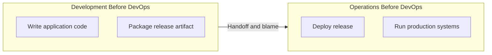
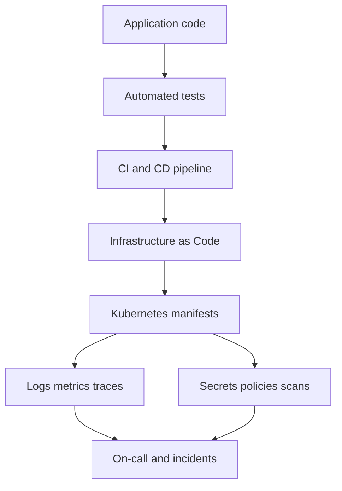
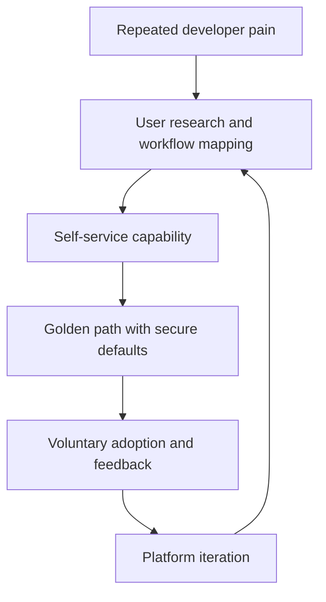
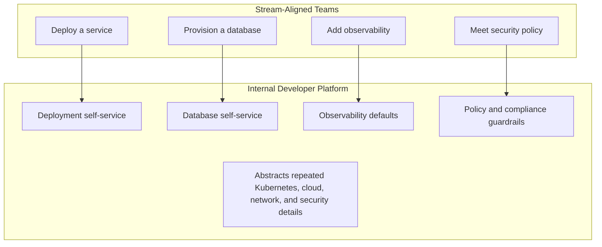
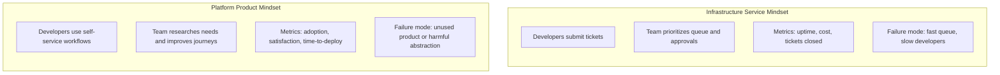
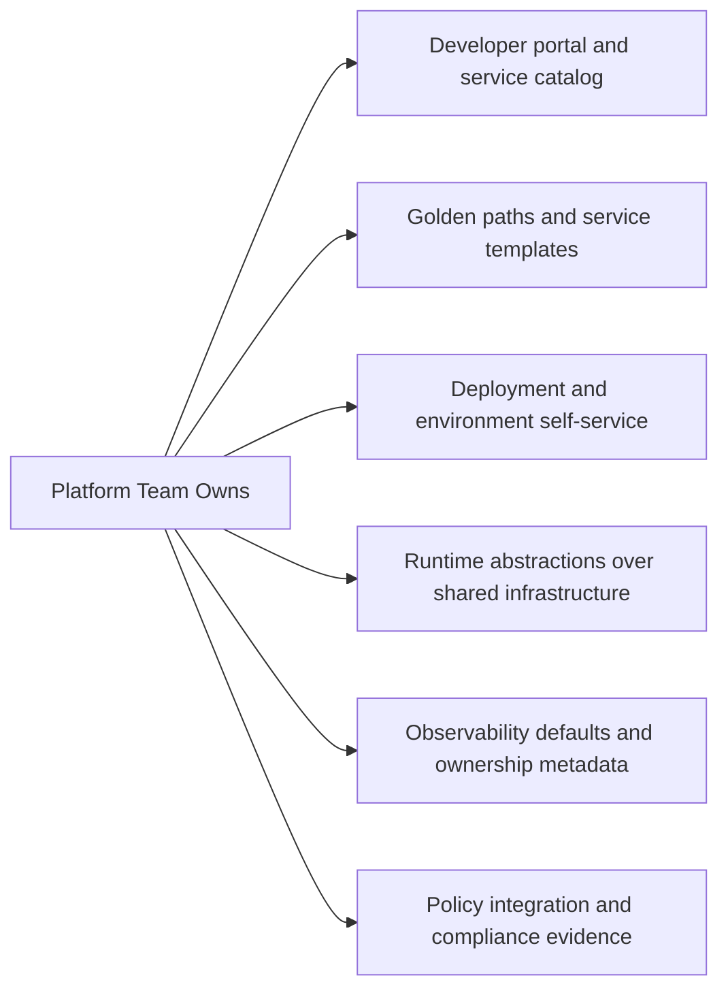
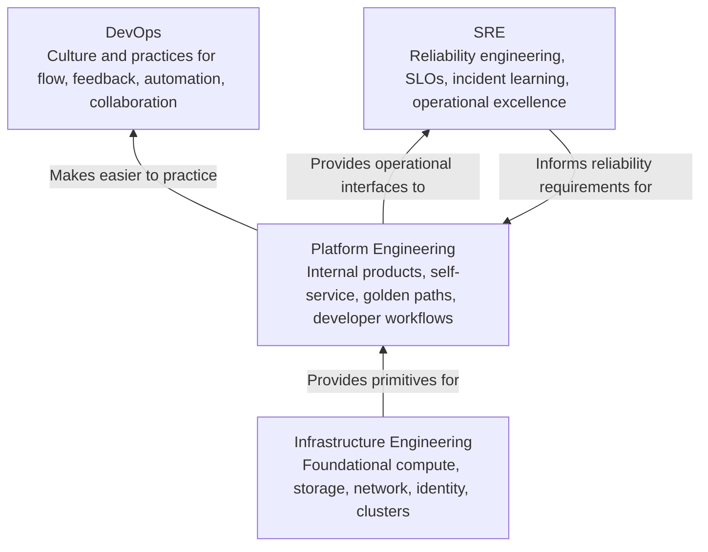
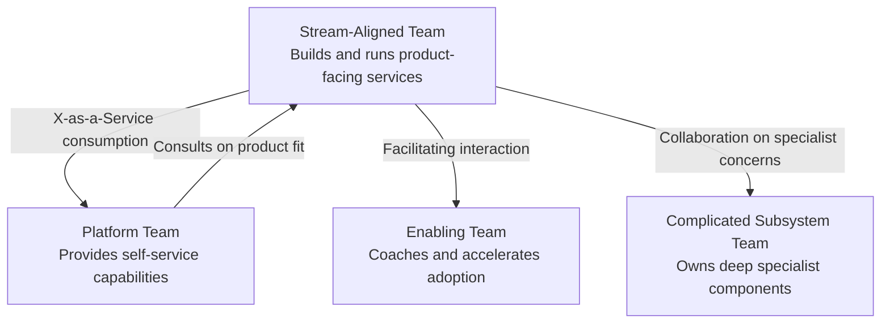
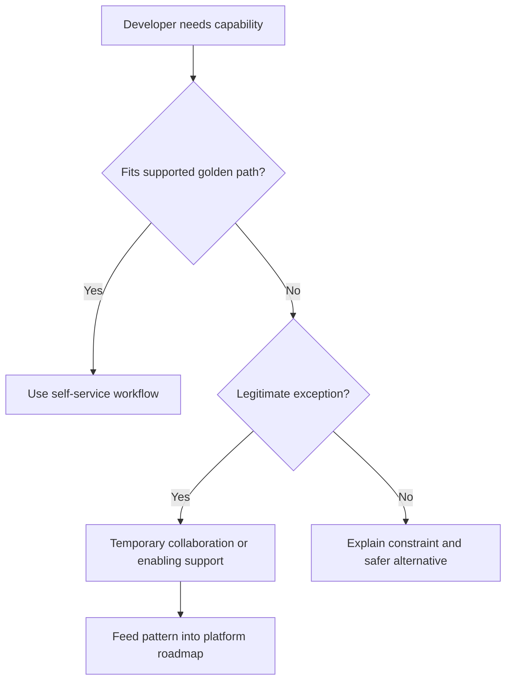

> **Discipline Module** | Complexity: `[MEDIUM]` | Time: 45-60 min

## Prerequisites

Before starting this module, you should be comfortable reasoning about engineering systems as socio-technical systems, not only as toolchains. Platform Engineering sits at the boundary between infrastructure, developer experience, operations, product management, and organizational design, so the strongest learners will keep asking how a technical decision changes team behavior.

- **Required**: [Systems Thinking Track](/platform/foundations/systems-thinking/) — Understanding complex systems, feedback loops, local optimization, and second-order effects.
- **Recommended**: [SRE Discipline](/platform/disciplines/core-platform/sre/) — Understanding reliability, operational ownership, service-level thinking, and incident response.
- **Helpful**: Experience in a DevOps, infrastructure, software engineering, or developer tooling role where teams have had to balance speed, safety, and autonomy.

---

## What You'll Be Able to Do

After completing this module, you will be able to:

- **Evaluate** whether Platform Engineering is the right response to a team's delivery, cognitive-load, and governance problems.
- **Compare** Platform Engineering, DevOps, SRE, and infrastructure engineering so that responsibilities are positioned clearly instead of renamed casually.
- **Design** a platform team charter that defines customers, product boundaries, supported golden paths, and measurable outcomes.
- **Diagnose** platform adoption failure by tracing symptoms back to product, team topology, workflow, and incentive problems.
- **Build** a first-iteration platform vision that starts from developer pain rather than from fashionable tools.

---

## Why This Module Matters

The engineering director entered the quarterly review with numbers that looked successful on the surface. Deployment frequency had increased, every service had a CI pipeline, every team owned its Kubernetes manifests, and infrastructure tickets were down because developers could technically do more themselves. Then the incident review told a different story: feature teams were copying fragile YAML from old repositories, senior developers were spending afternoons debugging network policies, audit evidence was inconsistent, and every new hire needed weeks to understand how to ship safely.

The organization had adopted many DevOps practices but had not reduced the amount of complexity each team had to carry. "You build it, you run it" had become "you build it, you debug the pipeline, you patch the base image, you understand cloud IAM, you answer the compliance questionnaire, and you still deliver the roadmap." Developers were not resisting ownership; they were drowning in undifferentiated operational work that did not make their products better.

Platform Engineering matters because it offers a disciplined correction, not a retreat from DevOps. The goal is not to create a new gatekeeping infrastructure team with a better name. The goal is to build internal products that make the right way the easy way: self-service deployment, paved paths, secure defaults, usable observability, and clear interfaces that let stream-aligned teams move quickly without becoming specialists in every layer underneath them.

A strong platform team changes the shape of work. It absorbs repeated complexity once, packages it behind supported interfaces, measures whether developers actually choose and succeed with those interfaces, and keeps improving the product through feedback. A weak platform team changes the labels on an org chart while keeping ticket queues, hidden constraints, and mandatory workflows intact. This module teaches you how to tell the difference and how to design the first version responsibly.

---

## The Problem Platform Engineering Solves

Platform Engineering is easiest to misunderstand when it is introduced as a tool category. Developer portals, GitOps controllers, CI templates, Kubernetes abstractions, service catalogs, and infrastructure APIs may all appear in a platform, but none of them define the discipline. The discipline begins with a problem: modern delivery requires more operational knowledge than most product teams can safely or efficiently hold in working memory.

DevOps originally challenged the separation between development and operations. That challenge was necessary because handoffs, blame, and slow release processes were damaging software delivery. Teams needed shared responsibility, faster feedback, automation, and closer collaboration. Those ideas remain valuable, and Platform Engineering does not replace them.

The failure mode appeared when organizations interpreted shared responsibility as equal responsibility for every detail. A product team that owns a service should understand its runtime behavior, error budgets, operational signals, release risks, and customer impact. That does not mean every product team should independently design Kubernetes deployment standards, cloud account vending, secret rotation, audit evidence collection, ingress patterns, and observability pipelines.

A platform exists to reduce extraneous cognitive load while preserving meaningful ownership. Developers should still understand what they are deploying and how it behaves in production. They should not need to rediscover every infrastructure convention before delivering a feature. The platform team's job is to identify repeated operational needs, turn them into reliable self-service capabilities, and keep those capabilities aligned with the way developers actually work.



The original wall between development and operations was costly because it broke feedback. Developers could not easily learn from production behavior, and operators inherited services they did not design. DevOps improved that by increasing collaboration and automation, but it also expanded the surface area of knowledge expected from every team.



A developer can learn this whole chain, and many senior engineers do. The question is whether every stream-aligned team should have to learn and maintain every part independently. When ten teams solve the same deployment, monitoring, and compliance problems in ten slightly different ways, the organization has created a hidden tax on delivery and reliability.

```text
Developer responsibilities in a small product team:

- Understand the product domain
- Design and ship application changes
- Write and maintain tests
- Operate the service in production
- Interpret user and business impact
- Configure delivery pipelines
- Manage runtime manifests
- Handle secrets and permissions
- Produce compliance evidence
- Maintain observability conventions
- Keep infrastructure patterns current

Question:
Which responsibilities create product advantage for this team,
and which ones are repeated platform concerns that could be
solved once behind a supported self-service interface?
```

**Active learning prompt:** Choose one service your organization owns or one service you have worked on. Separate its responsibilities into two columns: work that expresses the product's unique business logic, and work that every service team must repeat to ship safely. If the second column is long, you have found the space where a platform may help.

Platform Engineering is not a promise that developers never touch infrastructure. It is a promise that the organization will treat developer workflows as a product problem. The platform team studies where teams lose time, where inconsistency creates risk, and where specialists can turn repeated expertise into reusable capabilities.

---

## From DevOps to Platform Engineering

The history matters because it prevents a common mistake: treating Platform Engineering as an admission that DevOps failed. DevOps succeeded at changing the industry. It normalized automation, continuous delivery, infrastructure as code, monitoring, postmortems, and cross-functional ownership. The problem is that success created a new scale problem.

The early DevOps movement pushed back against siloed handoffs. Patrick Debois helped catalyze the movement with DevOpsDays in 2009, and later works such as "The Phoenix Project" gave leaders a language for discussing flow, feedback, and learning. The CALMS model became a useful way to discuss DevOps adoption because it emphasized that automation alone was not enough.

| Pillar | Meaning | Example of the Principle in Practice |
|--------|---------|--------------------------------------|
| **Culture** | Teams share responsibility and learn without blame | Product and operations engineers review incidents together |
| **Automation** | Repeated manual work is made reliable and repeatable | Pipelines build, test, scan, and deploy consistently |
| **Lean** | Work moves in small batches with fast feedback | Teams reduce release queues and expose bottlenecks early |
| **Measurement** | Decisions are guided by delivery and reliability data | DORA metrics and service-level indicators inform improvement |
| **Sharing** | Knowledge spreads across teams instead of staying tribal | Postmortems, internal docs, and communities of practice teach lessons |

The CALMS model still applies in a platform organization. Culture matters because developers must trust the platform team, automation matters because self-service must be reliable, lean thinking matters because the platform should remove queues, measurement matters because adoption and developer outcomes must be visible, and sharing matters because platform patterns must be understandable.

What changed is the operational burden placed on each team. Continuous delivery and cloud-native systems gave teams more power, but they also gave them more choices. Choice is useful when it supports product differentiation. It becomes harmful when every team must choose its own base images, deployment controller, secret pattern, dashboard layout, compliance workflow, and cloud account structure without enough context.

```text
A common timeline inside growing engineering organizations:

Stage 1:
A few teams ship manually.
Operations handles most production work.

Stage 2:
DevOps practices spread.
Teams automate builds, deployments, and infrastructure.

Stage 3:
Every team owns a growing toolchain.
Speed improves in places, but cognitive load rises everywhere.

Stage 4:
Repeated complexity becomes visible.
Teams ask for paved roads, templates, and self-service capabilities.

Stage 5:
A platform team forms.
The best repeated solutions become internal products with feedback loops.
```

This timeline is not universal, but it is common enough to be useful. Platform Engineering usually appears when the organization has passed the point where informal conventions and heroic specialists can scale. The platform team becomes the steward of shared delivery capabilities that product teams can consume without waiting for manual help.



Notice the loop. A platform team does not simply build a tool and declare victory. It researches, ships, measures, learns, and improves. That product loop is the difference between Platform Engineering and a renamed ticket queue.

**Active learning prompt:** Imagine your organization forms a platform team tomorrow and gives it a mandate to "standardize deployments." What would the team need to learn before choosing a tool? List the teams affected, current deployment paths, failure modes, compliance constraints, and reasons teams might resist change. If you cannot answer those questions, the first platform activity should be discovery, not implementation.

---

## Platform Engineering Defined

Platform Engineering is the discipline of designing, building, operating, and continuously improving internal developer platforms that enable stream-aligned teams to deliver software safely and efficiently. The platform is an internal product. Developers are its customers. The platform team is responsible for reducing friction while preserving the autonomy product teams need to serve their users.

A useful definition has four parts. First, the platform is internal because its primary users are the organization's own engineers, operators, security teams, and sometimes data or machine learning teams. Second, it is a product because it has users, adoption curves, support needs, roadmaps, trade-offs, and success metrics. Third, it is self-service because the platform should remove waiting from common workflows. Fourth, it is opinionated because it encodes supported paths rather than exposing every possible infrastructure choice.

```text
Platform Engineering definition:

Platform Engineering is the practice of building internal products
that provide self-service capabilities, secure defaults, and paved
paths for software delivery.

The platform team reduces repeated operational complexity so that
stream-aligned teams can own their services without having to become
experts in every underlying infrastructure domain.
```

The word "platform" can describe many scopes. A small company may start with a deployment template, shared observability conventions, and an environment provisioning workflow. A large enterprise may operate a full internal developer portal, service catalog, infrastructure vending APIs, policy engines, golden paths, audit evidence automation, and managed runtime services. The size is less important than the product discipline behind it.

A platform should not hide every detail. Abstraction has a cost, and too much hiding creates helpless users who cannot debug when something goes wrong. The right platform exposes the concepts developers need to make responsible decisions while automating the details that should be consistent across teams. For example, a deployment interface may expose rollout strategy, resource needs, and service ownership while generating the underlying Kubernetes manifests and policy attachments.



The best platform interfaces are boring in the right way. They are predictable, documented, observable, and integrated into existing workflows. Developers should not need to attend a meeting to deploy a standard service, and security teams should not need to manually chase evidence for every compliant change. Both outcomes are product requirements, not side effects.

---

## Platform as a Product

The phrase "platform as a product" is more than branding. It changes how the team decides what to build, how it measures success, and how it handles disagreement. A traditional infrastructure service provider often optimizes for tickets closed, uptime, cost control, and policy enforcement. Those metrics still matter, but they do not prove that developers can ship better software.

A product-minded platform team starts with customer understanding. It interviews developers, watches deployment and incident workflows, studies support requests, maps cognitive load, and identifies repeated pain. It then chooses a narrow problem, ships a usable capability, measures adoption and outcomes, and improves the experience over time. The team does not assume that technical elegance equals product value.



The difference appears in daily decisions. If developers repeatedly request test environments, a service mindset may hire more people to process environment tickets faster. A platform product mindset asks why a human is involved at all, which constraints must be enforced, what safe defaults are required, and how a developer could request an environment through a workflow that completes in minutes without bypassing governance.

```text
Ticket workflow:

Developer -> Ticket -> Queue -> Infra engineer -> Manual review -> Provisioning -> Handoff

Platform workflow:

Developer -> Self-service request -> Policy checks -> Automated provisioning -> Observable result

Design question:
What must be true for the second workflow to be safer, faster,
and easier than the first workflow?
```

A product mindset also changes prioritization. The platform team should not build every requested feature. It should evaluate who experiences the pain, how often it happens, what risk it creates, whether the platform is the right owner, and whether a simpler policy, documentation change, or enabling-team engagement would solve the problem. Senior platform work often means refusing expensive generality until usage evidence justifies it.

| Product Question | Weak Platform Answer | Strong Platform Answer |
|------------------|----------------------|------------------------|
| Who is the customer? | "All engineers" | "The six stream-aligned teams deploying HTTP services weekly" |
| What problem are we solving? | "We need a portal" | "New services take days to reach a compliant staging environment" |
| Why will teams adopt it? | "Leadership says they must" | "It removes manual tickets and preserves their existing Git workflow" |
| How will we measure value? | "We shipped the feature" | "Median first deployment time drops and support requests decrease" |
| What is out of scope? | "Nothing yet" | "Stateful workload migration remains manual until discovery is complete" |

The most controversial product principle is optionality. In a perfect world, a good platform wins because developers prefer it. Optionality creates honest feedback: if teams keep working around the platform, the product is not solving their problem or the adoption path is too costly. Mandates may still be necessary in regulated contexts, but mandates should be used carefully and paired with evidence that the paved path is actually usable.

Optional does not mean unmanaged chaos. A platform can define supported paths, security guardrails, and compliance requirements while still earning adoption. For example, leadership may require all production workloads to meet certain audit controls, but the platform should make satisfying those controls easier than inventing a separate process. The constraint is mandatory; the developer experience can still be product-led.

---

## Worked Example: Diagnosing a Platform That Nobody Uses

Consider a company with twenty product teams and a small central infrastructure group. Leadership funds a platform initiative after repeated complaints about slow deployments and inconsistent environments. The platform team spends several months building a developer portal with service scaffolding, deployment templates, dashboards, and approval workflows. Launch day arrives, adoption is announced as mandatory, and teams are told to migrate before the next quarter.

Three months later, only a handful of teams use the portal regularly. Several teams keep their old pipelines alive, some copy generated manifests and edit them manually, and support channels fill with complaints about missing features. Leadership asks whether the developers are simply resistant to change. A stronger analysis treats low adoption as diagnostic data.

```text
Observed symptoms:

- Platform adoption remains low after launch.
- Teams continue using older pipelines.
- Support requests focus on missing workflow fit.
- Developers describe the portal as "another thing to learn."
- Deployment lead time has not improved.
- Security still reviews exceptions manually.

Initial hypothesis:
The platform team shipped capabilities before validating the
highest-friction developer journeys.
```

A junior analysis might say, "The platform needs better documentation." Documentation may help, but it is rarely enough when the product does not fit the workflow. A senior analysis asks which developer job the platform was supposed to make easier and whether the shipped product actually completes that job with less friction than the old path.

The team should interview representative users and map the deployment journey step by step. They may discover that most teams already have acceptable pipelines, but provisioning compliant test environments is the real bottleneck. They may find that the portal requires fields developers do not understand, breaks existing Git review habits, or hides deployment errors behind generic status messages. Each finding points to a different fix.

```text
Worked diagnosis:

Step 1: Identify the claimed outcome.
"Reduce deployment lead time for product teams."

Step 2: Compare current and platform workflows.
Old workflow: Git merge -> team pipeline -> manual environment ticket.
New workflow: Portal form -> generated pipeline -> approval -> deployment.

Step 3: Find the real bottleneck.
The manual environment ticket still exists in both workflows.

Step 4: Identify the adoption blocker.
The portal changes the developer workflow without removing the wait.

Step 5: Redesign the first valuable slice.
Automate compliant environment provisioning from the existing Git workflow.

Step 6: Measure the result.
Track median environment provisioning time, deployment lead time,
voluntary adoption, support volume, and developer satisfaction.
```

The corrected approach starts smaller and lands where pain is highest. Instead of asking every team to migrate to a new portal, the platform team integrates environment provisioning into the workflow teams already trust. It defines a small request file, validates it against policy, provisions the environment automatically, and publishes clear status. The portal can come later as a useful interface, not as the center of the universe.

```yaml
# platform/environment-request.yaml
apiVersion: platform.kubedojo.io/v1
kind: EnvironmentRequest
metadata:
  name: payments-staging
spec:
  owner: payments-team
  purpose: integration-test
  lifetime: 14d
  region: eu-central-1
  dataClassification: internal
  services:
    - name: payments-api
      replicas: 2
    - name: payments-worker
      replicas: 1
```

This YAML is not a full platform. It is a product interface for one narrow capability. A developer can review it in Git, a policy engine can validate it, automation can provision it, and the platform team can support it. The important lesson is not the file format; it is the sequence of reasoning from pain to workflow to interface to measurement.

```bash
# Example validation command a platform team might provide.
# The alias "k" is commonly used for kubectl after learners understand kubectl itself,
# but this command validates a platform request file before any Kubernetes apply step.
.venv/bin/python scripts/validate_environment_request.py platform/environment-request.yaml
```

In a real repository, the validation script must exist and run in the project's environment. The teaching point is that platform interfaces should be testable before they change infrastructure. Fast validation shortens feedback loops, reduces support burden, and helps developers trust the paved path.

**Active learning prompt:** Apply the worked diagnosis to a platform or shared tool you have seen. Identify one claimed outcome, one real bottleneck, one adoption blocker, and one smaller slice that would prove value. If your first answer is "build a portal," step back and name the specific developer job the portal would improve.

---

## What a Platform Contains

An internal developer platform is usually a collection of capabilities, not a single product screen. The visible part may be a portal, CLI, documentation site, Git workflow, API, or chat-based workflow. The invisible part includes templates, automation, policy engines, observability conventions, runtime services, support processes, and ownership agreements.

A helpful way to reason about platform scope is to separate capabilities from implementations. "Deployment self-service" is a capability. Backstage, Argo CD, GitHub Actions, Tekton, Flux, custom CLIs, and internal APIs are possible implementation choices. Strong platform teams discuss capabilities first because tools only matter when they solve the right workflow problem.

```text
Common internal platform capability map:

Developer entry points:
- Service catalog
- Documentation
- Templates
- CLI or portal
- Support channels

Delivery capabilities:
- Build pipelines
- Deployment workflows
- Release strategies
- Environment provisioning
- Rollback paths

Runtime capabilities:
- Kubernetes namespaces
- Secrets management
- Service networking
- Database provisioning
- Resource policies

Operational capabilities:
- Logs, metrics, and traces
- Alert templates
- Incident handoff data
- Ownership metadata
- Runbook links

Governance capabilities:
- Policy checks
- Security scanning
- Audit evidence
- Cost allocation
- Compliance reporting
```

The platform does not need to own all of these on day one. In fact, trying to own everything early is one of the fastest ways to fail. A first platform slice should be narrow enough to ship, important enough to matter, and measurable enough to teach the team whether its assumptions are true.

The platform also needs clear boundaries. If a stream-aligned team owns business behavior, the platform should not become a bottleneck for every product decision. If security owns enterprise risk policy, the platform should not invent separate risk standards. If infrastructure owns low-level cloud reliability, the platform should not hide operational signals that infrastructure needs. Good platform boundaries reduce confusion; bad boundaries create shadow ownership.



A golden path is a supported way to accomplish a common developer task. It is not merely a template repository. It includes documentation, defaults, automation, operational expectations, support, and a clear upgrade path. A golden path for HTTP services might include a service template, CI pipeline, container build, deployment strategy, observability dashboard, alert policy, security scanning, dependency update process, and production readiness checklist.

```text
Golden path anatomy for a standard HTTP service:

Input:
- Team name
- Service name
- Runtime choice
- Data classification
- Expected traffic profile

Platform provides:
- Repository template
- Build and test pipeline
- Container image publishing
- Kubernetes deployment defaults
- Ingress and service discovery
- Logs, metrics, and tracing
- Security checks
- Ownership metadata
- Production readiness checklist

Developer still owns:
- Business logic
- Service behavior
- SLO selection with stakeholders
- Operational response
- Product-specific risks
```

The boundary matters because platforms can accidentally remove too much agency. If the platform forces every service into one runtime model, it may speed up common cases while blocking legitimate product needs. A mature platform defines standard paths, exception paths, and collaboration modes so teams know when they can self-serve and when they need deeper design work.

---

## Platform Engineering, DevOps, SRE, and Infrastructure

The terms often overlap because real organizations rarely draw perfect boundaries. A person may have "DevOps" in their job title while doing platform work. An SRE team may build internal tooling. An infrastructure team may expose self-service APIs. The label matters less than the operating model, but confused labels lead to confused expectations.

DevOps is a cultural and delivery movement. It emphasizes shared ownership, automation, feedback, collaboration, and learning. Platform Engineering is a product discipline that builds internal capabilities to make those practices easier and safer. SRE is an operations and reliability discipline that uses engineering methods to manage service reliability. Infrastructure Engineering builds and runs the foundational compute, network, storage, identity, and runtime systems.

| Discipline | Primary Focus | Main Customer | Typical Outputs | Failure Mode |
|------------|---------------|---------------|-----------------|--------------|
| DevOps | Delivery culture and practices | The engineering organization | CI/CD practices, collaboration patterns, shared ownership | Tooling without cultural change |
| SRE | Reliability and operability | Users of production services | SLOs, incident response, reliability engineering, automation | Reliability work isolated from product teams |
| Infrastructure Engineering | Foundational systems | Platforms and applications | Compute, networking, storage, clusters, cloud foundations | Stable systems that are hard for developers to consume |
| Platform Engineering | Internal developer products | Stream-aligned teams | Self-service workflows, golden paths, portals, templates, guardrails | A mandatory internal product nobody values |

This comparison is a starting point, not a law. A small organization may combine these responsibilities in one team. A large organization may split them across many teams. The important question is whether each responsibility has an owner, a customer, an interface, and a success measure.

```text
Infrastructure team owns:
- Cloud account foundations
- Network connectivity
- Kubernetes cluster lifecycle
- Storage classes and backup systems
- Base identity integrations
- Shared runtime reliability

Platform team consumes and packages:
- Cluster capabilities
- Identity primitives
- Storage options
- Network policies
- Security controls
- Observability systems

Stream-aligned team consumes and owns:
- Product service behavior
- Deployment decisions within supported paths
- Runtime configuration for its service
- Service-level objectives and user impact
```

A common anti-pattern is renaming the infrastructure team as the platform team while keeping the same interaction model. If developers still submit tickets for every environment, wait for manual approvals, and receive infrastructure objects with little documentation, the organization has not adopted Platform Engineering. It has changed vocabulary without changing the system.



The healthiest organizations make these interactions explicit. SRE may define reliability patterns and production readiness requirements. Infrastructure may provide secure cluster and network primitives. Platform may package those primitives into developer-facing workflows. Stream-aligned teams may use those workflows while retaining accountability for their services.

**Active learning prompt:** Your company says, "The platform team owns production reliability now." Evaluate that statement. Which reliability responsibilities should remain with stream-aligned teams, which should be supported by SRE practices, and which should be encoded into the platform as defaults or guardrails?

---

## Team Topologies and Interaction Modes

Team Topologies gives Platform Engineering a practical organizational vocabulary. It distinguishes team types by purpose and describes how they should interact. This is useful because many platform failures are not tool failures; they are interaction failures. A platform cannot reduce cognitive load if every team still needs constant meetings to use it.

Stream-aligned teams deliver value to external or internal customers through a product, service, or user journey. Platform teams provide self-service capabilities that reduce cognitive load for those stream-aligned teams. Enabling teams help other teams build capability for a limited time. Complicated subsystem teams own specialized domains where deep expertise is required.



The platform team's preferred interaction mode is X-as-a-Service. That means a stream-aligned team can consume the capability without deep collaboration. This does not mean the platform team never talks to users. It means the normal path should not require a series of meetings. Research, support, and co-design still happen, but routine usage should be self-service.

Facilitating interaction is useful when teams need help adopting new practices. For example, an enabling team may coach product teams on service ownership, SLO definition, or Kubernetes basics before the platform path becomes fully self-service. Collaboration is useful when building a new capability or handling unusual requirements, but it is expensive and should not be the default for every deployment.

| Interaction Mode | When to Use It | Platform Example | Risk if Overused |
|------------------|----------------|------------------|------------------|
| X-as-a-Service | The workflow is common and well understood | A team provisions a standard staging environment through Git | Users may feel unsupported if documentation and feedback are weak |
| Facilitating | Teams need temporary help building capability | Coaches help teams migrate to the golden path | The helper becomes a permanent dependency |
| Collaboration | Requirements are uncertain or novel | Platform and product teams co-design a regulated workload path | Too much meeting-heavy work slows both teams |
| Handoff | Work crosses ownership boundaries once | Infrastructure provides a new cluster primitive to platform | Handoffs can recreate silos if feedback is missing |

A senior platform leader watches interaction modes as a health signal. If every platform use requires collaboration, the product is not mature enough or the scope is too broad. If every adoption requires facilitation, the user experience may be unclear. If teams bypass the platform entirely, the platform may not be solving the right problems or the incentives may be misaligned.

---

## Designing the First Platform Slice

A beginner often asks, "Which platform tool should we install?" A senior practitioner asks, "Which developer journey is painful, repeated, valuable, and safe to improve first?" The first slice should prove that the platform team can reduce friction without creating a bigger system for everyone to learn.

Start by choosing a problem with observable pain. Good candidates include new service creation, test environment provisioning, deployment standardization, ownership metadata, secrets onboarding, or production readiness checks. Poor first candidates are usually broad portals, universal abstractions, or complete rewrites of every pipeline before any user value is proven.

```text
First-slice decision filter:

1. Is the pain repeated across multiple teams?
2. Does the pain slow delivery or increase operational risk?
3. Can the platform team solve it without owning product logic?
4. Can the first version fit existing developer workflows?
5. Can success be measured within weeks rather than quarters?
6. Can teams adopt it without migrating every system at once?
```

The first slice should also include non-goals. Non-goals protect the team from building a platform-shaped wishlist. If the first slice is self-service staging environments, then a full developer portal, production database migration, service mesh redesign, and company-wide pipeline replacement may all be explicitly out of scope. This is not lack of ambition; it is product discipline.

```text
Example first slice:

Problem:
Developers wait two to five business days for compliant test environments.

Customers:
Seven stream-aligned teams that deploy customer-facing HTTP services.

MVP:
A Git-based environment request file validated by policy and fulfilled automatically.

In scope:
- Staging environments only
- Standard HTTP services only
- Internal data classification only
- Automatic expiry after a configured lifetime
- Status comments in the pull request

Out of scope:
- Production environments
- Stateful workload migration
- Custom networking exceptions
- Full developer portal
- Replacing existing service pipelines
```

A platform slice becomes real when it has measurable outcomes. "Ship environment automation" is an output. "Reduce median environment wait time from three days to under thirty minutes for standard staging requests" is an outcome. Outputs are useful for planning; outcomes prove value.

| Measurement Area | Example Metric | Why It Matters |
|------------------|----------------|----------------|
| Adoption | Percentage of eligible teams using the capability voluntarily | Shows whether the product is valuable enough to choose |
| Speed | Median time from request to usable environment | Tests whether friction actually decreased |
| Reliability | Failed provisioning rate and rollback frequency | Shows whether automation is safe enough to trust |
| Support Load | Number and type of support requests per week | Reveals usability gaps and hidden complexity |
| Satisfaction | Developer survey comments and internal NPS-style scoring | Captures qualitative friction metrics miss |
| Governance | Percentage of requests with complete policy evidence | Shows whether speed and control improved together |

Good measurement includes both numbers and stories. Adoption can rise while developers are still unhappy because a mandate forced usage. Satisfaction can be high among early adopters while support load explodes for new teams. Senior platform teams triangulate across metrics and use feedback to decide whether to deepen, simplify, or stop a capability.

---

## Operating a Platform Responsibly

Building the first slice is only the beginning. A platform becomes critical infrastructure for the engineering organization, and that creates operational responsibilities. The platform team must support users, manage change, document interfaces, handle incidents, and avoid becoming the bottleneck it was created to remove.

Platform reliability matters because developer trust is fragile. If the deployment path fails unpredictably, teams will build workarounds. If support channels are unclear, teams will escalate through personal relationships. If breaking changes arrive without migration help, teams will freeze on old patterns. The platform team needs product operations, not only platform development.

```text
Responsible platform operations checklist:

- Published support channels and response expectations
- Clear ownership metadata for each platform capability
- Versioned interfaces for templates, APIs, and workflows
- Change communication before breaking behavior changes
- Migration paths for deprecated golden paths
- Error messages that explain what the user can do next
- Observability for platform services and user journeys
- Incident review when platform failures block delivery
```

The platform must also manage standardization carefully. Standardization creates leverage when it removes repeated choices that do not create product value. It creates resentment when it blocks legitimate differences or ignores team context. The platform team should provide a strong default path, a documented exception process, and a feedback loop that turns repeated exceptions into future product improvements.

A useful senior test is whether the platform increases autonomy. If a team can ship a standard service with less waiting, clearer guardrails, and better operational defaults, autonomy increased. If a team now needs platform approval for decisions it previously owned, autonomy decreased even if the architecture diagram looks cleaner. Platform Engineering should reduce coordination costs, not centralize control for its own sake.



This decision flow keeps the platform from becoming either a free-for-all or a rigid gate. Common needs go through self-service. Valid exceptions receive help and may influence the roadmap. Unsafe or unsupported requests receive a clear explanation and an alternative path.

---

## Did You Know?

1. Many famous "you build it, you run it" organizations also invest heavily in internal platforms, which means their developer autonomy is supported by substantial hidden enablement rather than individual teams solving every infrastructure problem alone.

2. Backstage began as Spotify's internal developer portal before becoming a widely adopted open source project, which is a useful reminder that successful platform tools often emerge from concrete internal workflow pain.

3. The phrase "golden path" does not mean "the only path"; in mature platform organizations it usually means a well-supported default with clear guidance for exceptions and learning loops.

4. Platform Engineering often improves governance when done well because policy can move from manual approval meetings into automated checks, evidence capture, and safe defaults that developers encounter during normal work.

---

## Common Mistakes

| Mistake | Problem | Better Approach |
|---------|---------|-----------------|
| Building before talking to users | The team solves imagined problems and ships capabilities that do not fit real developer workflows | Start with interviews, workflow observation, support data, and a narrow validated pain point |
| Mandating adoption too early | Forced usage hides whether the platform is actually valuable and often creates workarounds | Earn adoption with a useful golden path, then use policy mandates only where risk truly requires them |
| Renaming infrastructure as platform | Ticket queues and manual approvals remain, so developer experience does not improve | Change the interaction model toward self-service, product metrics, and supported interfaces |
| Starting with a portal | A portal becomes an attractive shell around unsolved workflow problems | Start with a painful journey, then add a portal when it improves discovery or execution |
| Hiding too much complexity | Developers cannot debug failures or make responsible operational decisions | Abstract repeated details while exposing the concepts needed for ownership and troubleshooting |
| Measuring outputs only | Shipped features do not prove that delivery, reliability, or satisfaction improved | Track adoption, lead time, support load, reliability, governance evidence, and qualitative feedback |
| Copying a famous company | Tooling and team shapes from larger organizations may solve problems you do not have | Match platform scope to your scale, constraints, team skills, and highest-friction workflows |
| Treating exceptions as failure | Legitimate edge cases become political fights or unsupported shadow systems | Document exception paths and convert repeated exceptions into roadmap evidence |

---

## Quiz: Check Your Understanding

### Question 1

Your company has five product teams, and each team maintains a separate deployment pipeline with different approval steps, secret handling, and rollback behavior. Incidents increasingly involve confusion about which pipeline did what. Leadership asks whether hiring two more "DevOps engineers" will solve the problem. How would you evaluate whether this is a Platform Engineering problem instead?

<details>
<summary>Show Answer</summary>

You should evaluate the repeated workflow pain, not the job title. The symptoms suggest that multiple teams are solving the same delivery problem inconsistently, which increases cognitive load and operational risk. A Platform Engineering response would study the current deployment journeys, identify the common safe path, and build a self-service deployment capability or golden path with consistent approvals, secret handling, rollback behavior, and observability. Hiring more people to support the existing fragmented pipelines may reduce short-term pressure, but it does not remove the repeated complexity or create a product interface that teams can use reliably.

</details>

### Question 2

A newly formed platform team wants to spend its first six months building a full developer portal with a service catalog, docs search, scaffolding, dashboard links, and ownership metadata. Developer interviews show that the most painful issue is waiting several days for compliant staging environments. What should you recommend and why?

<details>
<summary>Show Answer</summary>

You should recommend starting with the staging environment workflow rather than the full portal. The interviews identified a concrete, repeated pain point with measurable delivery impact, while the portal is a broad implementation idea that may or may not solve the bottleneck. A strong first slice might provide a Git-based or API-based environment request, automated policy validation, provisioning, status feedback, and expiry controls. The portal can become useful later as an entry point, but the first platform product should prove value by reducing environment wait time and preserving a workflow developers already understand.

</details>

### Question 3

The CTO says all teams must use the new deployment platform next month because "optional platforms create inconsistency." Several teams currently have pipelines that work well for their workloads, while others struggle with unreliable manual steps. How would you design an adoption strategy that balances standardization and product fit?

<details>
<summary>Show Answer</summary>

You should separate mandatory outcomes from mandatory interfaces. The organization may require consistent security checks, ownership metadata, audit evidence, and rollback capability, but the platform team should still earn adoption by making the supported path easier than the alternatives. Start with the teams experiencing the most pain, migrate a narrow workload class, measure outcomes, and use feedback to improve the golden path. For teams with valid differences, define an exception path and look for repeated patterns that should become future platform capabilities. This balances governance with evidence-based adoption.

</details>

### Question 4

A platform team reports success because it closed eighty environment provisioning tickets last month within its service-level agreement. Developers say they still plan work around waiting for environments. How should you reinterpret the team's success metric?

<details>
<summary>Show Answer</summary>

The ticket metric shows that the team is processing work, but it does not show that developer friction has been removed. From a Platform Engineering perspective, the better outcome is self-service provisioning that eliminates the queue for standard requests. You would measure median time from request to usable environment, percentage of requests fulfilled automatically, failed provisioning rate, support volume, and developer satisfaction. Closing tickets faster may be a local improvement, but it can still preserve the bottleneck that the platform should remove.

</details>

### Question 5

An infrastructure team becomes the platform team and creates a rule that every production change must be approved in a weekly platform review meeting. They argue this improves safety because experts inspect all changes. After two months, teams batch risky changes and complain about slow delivery. What platform principle is being violated, and what alternative would you propose?

<details>
<summary>Show Answer</summary>

The team is violating the principle that platforms should reduce coordination costs through self-service and automated guardrails. A weekly review meeting centralizes control and encourages batching, which can make changes riskier. A better approach is to encode standard safety requirements into automated checks, templates, policy validation, progressive delivery defaults, and observable rollback paths. Expert review can remain for unusual or high-risk exceptions, but routine changes should follow a paved path that is faster and safer than manual approval.

</details>

### Question 6

Your platform exposes a single deployment abstraction that hides all Kubernetes details. Junior developers like the simplicity, but senior service owners complain that they cannot debug rollout failures because error messages only say "deployment failed." How would you improve the abstraction without abandoning the platform?

<details>
<summary>Show Answer</summary>

You should keep the abstraction for repeated deployment details but expose enough operational information for responsible ownership. Improve error messages, surface relevant Kubernetes events, show rollout status, link logs and metrics, document the concepts developers need, and provide an escape or diagnostic path for advanced cases. The goal is not to force every developer to hand-write Kubernetes manifests; it is to avoid hiding the information needed to understand production behavior. A good platform reduces unnecessary complexity while preserving debuggability.

</details>

### Question 7

A security team worries that optional platform adoption will weaken compliance because some teams may keep custom workflows. Product teams worry that mandatory platform adoption will slow them down. How can the platform team design a solution that improves both compliance and delivery speed?

<details>
<summary>Show Answer</summary>

The platform team can make compliance part of the paved path by automating policy checks, evidence capture, secret handling, scanning, and ownership metadata inside normal developer workflows. Compliance outcomes can be mandatory while the platform earns adoption by being the easiest way to satisfy them. For custom workflows, define minimum control requirements and an exception process, then use repeated exceptions as product input. This approach improves governance because evidence becomes consistent and automatic, while teams gain speed by avoiding manual approval and rework.

</details>

### Question 8

A senior engineer proposes copying the platform architecture from a large technology company, including a service mesh, custom deployment controller, internal portal, and multi-region environment vending. Your organization has six services, one Kubernetes cluster, and the biggest complaint is unclear ownership during incidents. How would you evaluate the proposal?

<details>
<summary>Show Answer</summary>

You should reject copying the architecture as the starting point because it solves a scale and complexity profile your organization does not currently have. The first platform slice should address the observed pain: unclear ownership during incidents. A better initial capability might standardize service ownership metadata, runbook links, alert routing, dashboards, and production readiness checks. Those improvements are smaller, measurable, and directly tied to the current problem. More complex platform architecture should only be added when evidence shows that the organization has the corresponding need.

</details>

---

## Hands-On Exercise: Build a Platform Vision and First Slice

In this exercise, you will design a platform vision for your organization or for a realistic hypothetical company. The goal is not to invent a complete platform. The goal is to practice the product reasoning that separates useful Platform Engineering from tool-driven centralization.

### Part 1: Current State Assessment

Interview or simulate interviews with three to five developers, service owners, SREs, security engineers, or infrastructure engineers. If you are working alone, answer from the perspective of teams you have observed, but keep the scenarios concrete. Avoid generic complaints such as "deployment is bad" until you can describe the workflow, wait, error, rework, or risk.

```markdown
## Current State

### Developer Pain Points

Interview prompts:
1. What delivery task takes longer than it should?
2. What requires waiting for another team?
3. Where do teams copy old examples because the official path is unclear?
4. Which production failures are hard to diagnose?
5. Which compliance or security steps create repeated rework?
6. What would you automate if you had one platform engineer for a month?

Pain Point 1: _________________
- Affected teams: _________________
- Current workflow: _________________
- Delay or risk: _________________
- Frequency: _________________

Pain Point 2: _________________
- Affected teams: _________________
- Current workflow: _________________
- Delay or risk: _________________
- Frequency: _________________

Pain Point 3: _________________
- Affected teams: _________________
- Current workflow: _________________
- Delay or risk: _________________
- Frequency: _________________

### Current Tooling

Deployment: _________________
Environment provisioning: _________________
Secrets management: _________________
Observability: _________________
Ownership metadata: _________________
Security checks: _________________
Documentation: _________________
Support channel: _________________
```

### Part 2: Classify the Pain

Now classify each pain point so you do not accidentally turn every complaint into platform scope. Some problems belong to product teams, some to infrastructure, some to SRE, some to security, and some to enabling teams. Platform Engineering is most appropriate when a repeated developer workflow can be improved through a self-service product interface with safe defaults.

```markdown
## Pain Classification

| Pain Point | Repeated Across Teams? | Current Bottleneck | Likely Owner | Platform Fit? |
|------------|------------------------|--------------------|--------------|---------------|
| | | | | |
| | | | | |
| | | | | |

Decision:
The best first platform candidate is _________________ because
it is repeated, measurable, and can be improved without taking
product ownership away from stream-aligned teams.
```

### Part 3: Platform Vision

Write a one-sentence platform vision that names the customer, the job, and the removed friction. A useful vision is specific enough to guide trade-offs. "Make developers productive" is too broad. "Enable product teams to deploy standard HTTP services to compliant staging environments in under thirty minutes without infrastructure tickets" is specific enough to prioritize work.

```markdown
## Platform Vision

### North Star

Our platform enables _________________
to _________________
without _________________.

### Customers

Primary users: _________________
Secondary users: _________________
Stakeholders: _________________

### Product Boundaries

The platform will own:
1. _________________
2. _________________
3. _________________

The platform will not own:
1. _________________
2. _________________
3. _________________
```

### Part 4: Design the First Slice

Choose one narrow capability. The first slice should fit into existing workflows when possible, include safe defaults, and have a clear support model. Do not choose "build a portal" unless you can explain the exact workflow the portal improves.

```markdown
## First Platform Slice

### Problem

Developers currently _________________,
which causes _________________.

### Customers

The first users will be _________________.

### Self-Service Interface

Users will request or use the capability through:
- [ ] Git workflow
- [ ] CLI
- [ ] Portal
- [ ] API
- [ ] Existing CI/CD system
- [ ] Other: _________________

### In Scope

1. _________________
2. _________________
3. _________________

### Out of Scope

1. _________________
2. _________________
3. _________________

### Guardrails

Security default: _________________
Reliability default: _________________
Cost default: _________________
Ownership default: _________________
```

### Part 5: Define Metrics and Review the Design

The last step is to check whether your design can be evaluated. A platform slice without metrics becomes a belief system. Choose measures that reveal speed, adoption, reliability, support load, and governance impact.

```markdown
## Success Metrics

Adoption target: _________________
Time-to-value target: _________________
Reliability target: _________________
Support-load target: _________________
Developer satisfaction target: _________________
Governance or compliance target: _________________

Review Questions:
1. What would prove this slice is not valuable?
2. What would developers do if this slice disappeared?
3. Which teams are likely to resist adoption, and why?
4. Which exceptions should become roadmap input?
5. Which metric could be misleading if viewed alone?
```

### Success Criteria

- [ ] Documented at least three concrete developer pain points with affected teams, workflow details, delay or risk, and frequency.
- [ ] Classified each pain point and justified why one is a strong platform candidate.
- [ ] Wrote a one-sentence platform vision that names the customer, job, and removed friction.
- [ ] Defined platform ownership boundaries and at least three non-goals.
- [ ] Designed one first platform slice with a self-service interface, guardrails, and explicit scope.
- [ ] Selected measurable success criteria across adoption, speed, reliability, support load, satisfaction, and governance.
- [ ] Explained how the first slice preserves stream-aligned team ownership instead of centralizing product decisions.
- [ ] Identified at least one adoption risk and one exception path.

---

## Next Module

Continue to [Module 2.2: Developer Experience (DevEx)](../module-2.2-developer-experience/) to learn how to measure and improve the developer experience outcomes that determine whether a platform is actually working.
