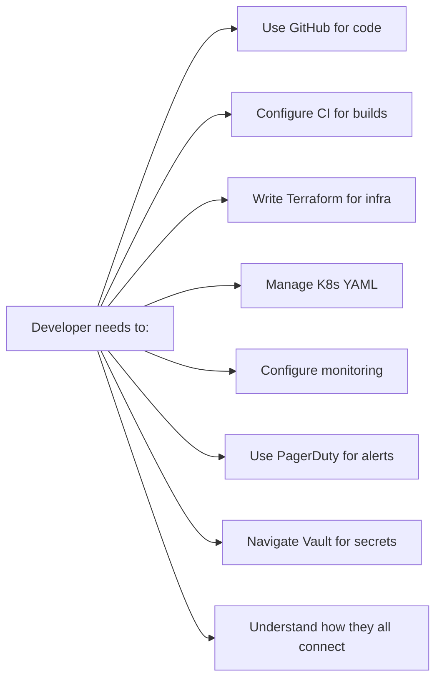
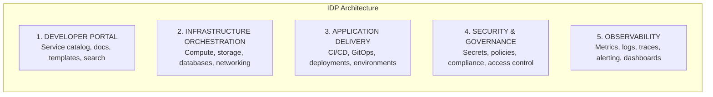
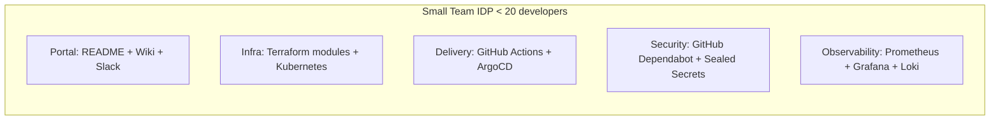
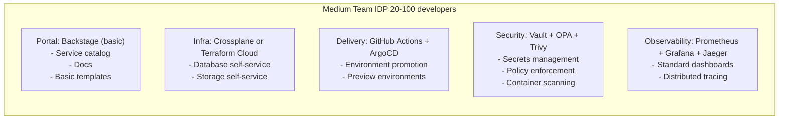
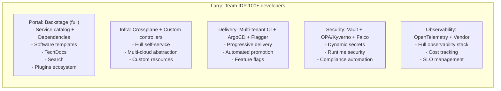
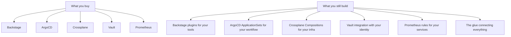
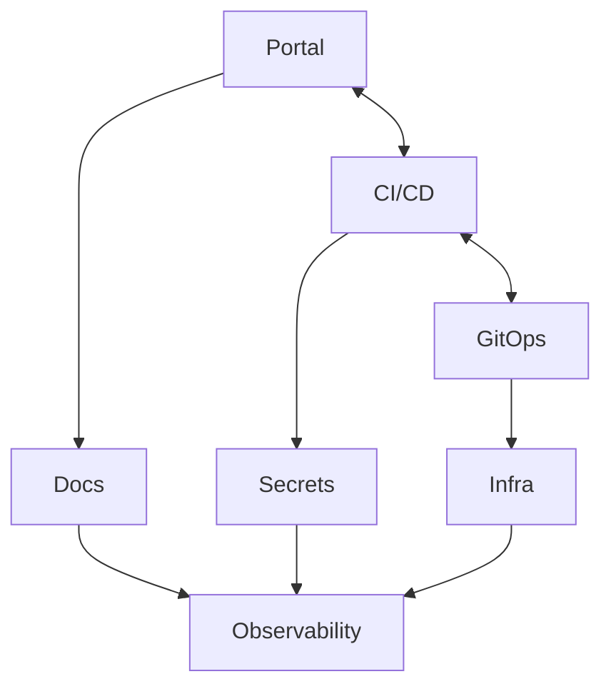

> **Discipline Module** | Complexity: `[COMPLEX]` | Time: 50-60 min

## Prerequisites

Before starting this module:
- **Required**: [Module 2.1: What is Platform Engineering?](../module-2.1-what-is-platform-engineering/) — Platform foundations
- **Required**: [Module 2.2: Developer Experience (DevEx)](../module-2.2-developer-experience/) — Understanding DevEx
- **Recommended**: Experience with Kubernetes, CI/CD, or cloud platforms

---

## What You'll Be Able to Do

After completing this module, you will be able to:

- **Design an Internal Developer Platform architecture with clear abstraction layers**
- **Evaluate IDP tools like Backstage, Port, and Kratix against your organization's requirements**
- **Implement a service catalog that gives developers self-service access to infrastructure capabilities**
- **Build platform APIs that encapsulate infrastructure complexity behind simple developer interfaces**

## Why This Module Matters

You understand Platform Engineering. You can measure developer experience. Now you need to build something.

But what exactly? "Internal Developer Platform" is thrown around, but what does it actually contain? What components are required? What's optional? Should you build or buy?

Without understanding IDP architecture:
- You'll build a random collection of tools, not a platform
- You'll reinvent what exists
- You'll buy expensive tools that don't integrate
- You'll create more complexity, not less

This module teaches you the components, architecture, and decision frameworks for building effective IDPs.

---

## What is an Internal Developer Platform?

> **Stop and think**: If you had to build a platform today, what is the absolute minimum capability you would need to provide to make a developer's life easier?

### Definition

An Internal Developer Platform (IDP) is a **layer of tools, workflows, and self-service capabilities** that sits between developers and underlying infrastructure, reducing cognitive load and enabling self-service.

```mermaid
flowchart TD
    devs[Developers<br/>"I need to deploy" | "Give me a database" | "Show me logs"]
    
    subgraph IDP [Internal Developer Platform]
        direction LR
        portal[Portal<br/>UI/API]
        deploy[Deploy<br/>Platform]
        infra[Infra<br/>Platform]
        obs[Observe<br/>Platform]
    end
    
    features[Golden Paths | Templates | Self-Service | Guardrails]
    
    infraLayer[Infrastructure Layer<br/>Kubernetes | Cloud | Databases | Networking | Security]

    devs --> IDP
    IDP --- features
    features --> infraLayer
```

### IDP vs Point Solutions

**Without IDP (Point Solutions)**:


**With IDP**:


The IDP doesn't replace these tools—it **integrates and abstracts** them into a cohesive experience.

---

## IDP Components

### The Five Pillars

Every IDP has five core components:



### 1. Developer Portal

The **front door** to your platform. Where developers discover, interact, and get help.

**Core Capabilities**:
```yaml
developer_portal:
  service_catalog:
    - List all services
    - Ownership information
    - Dependencies
    - Health status
    - Documentation links

  templates:
    - New service scaffolding
    - Approved technology stacks
    - Pre-configured best practices

  documentation:
    - Searchable docs
    - API references
    - Tutorials and guides

  self_service:
    - Create new projects
    - Request resources
    - Manage environments

  search:
    - Find services
    - Find documentation
    - Find owners
```

**Example: Backstage Service Catalog**
```yaml
apiVersion: backstage.io/v1alpha1
kind: Component
metadata:
  name: order-service
  description: Handles order processing
  annotations:
    backstage.io/techdocs-ref: dir:.
    github.com/project-slug: org/order-service
spec:
  type: service
  lifecycle: production
  owner: team-orders
  providesApis:
    - orders-api
  dependsOn:
    - component:inventory-service
    - resource:orders-database
```

### 2. Infrastructure Orchestration

**Provision infrastructure** without tickets or waiting.

**Core Capabilities**:
```yaml
infrastructure_orchestration:
  compute:
    - Kubernetes namespaces
    - Serverless functions
    - VM provisioning

  databases:
    - PostgreSQL
    - Redis
    - MongoDB
    - Self-service provisioning

  storage:
    - Object storage
    - Persistent volumes
    - Backups

  networking:
    - Load balancers
    - DNS entries
    - Service mesh config
```

**Example: Crossplane Composition**
```yaml
apiVersion: database.example.org/v1alpha1
kind: PostgreSQLInstance
metadata:
  name: orders-db
spec:
  parameters:
    storageGB: 50
    version: "16"
    environment: production
  # Crossplane provisions actual RDS instance
  # Developer doesn't need AWS knowledge
```

### 3. Application Delivery

**Deploy code** from commit to production.

**Core Capabilities**:
```yaml
application_delivery:
  ci_pipeline:
    - Build automation
    - Test execution
    - Security scanning
    - Artifact creation

  cd_pipeline:
    - Environment management
    - Deployment strategies
    - Rollback capabilities

  gitops:
    - Declarative deployments
    - Drift detection
    - Environment promotion

  environments:
    - Development
    - Staging
    - Production
    - Preview environments
```

**Example: Deployment Self-Service**
```yaml
# Developer creates this
apiVersion: platform.example.com/v1
kind: Application
metadata:
  name: order-service
spec:
  image: order-service
  replicas: auto
  environments:
    - name: staging
      promote: auto
    - name: production
      promote: manual

# Platform creates:
# - Kubernetes Deployment
# - Service
# - Ingress
# - HPA
# - PDB
# - NetworkPolicy
# - ArgoCD Application
# - Monitoring dashboards
```

### 4. Security & Governance

**Secure by default** with guardrails, not gates.

**Core Capabilities**:
```yaml
security_governance:
  secrets_management:
    - Secret storage
    - Rotation
    - Injection

  access_control:
    - RBAC
    - SSO integration
    - Audit logging

  policy_enforcement:
    - Security policies
    - Compliance requirements
    - Cost guardrails

  scanning:
    - Vulnerability scanning
    - License compliance
    - Static analysis
```

**Example: Policy as Code**
```yaml
# OPA/Gatekeeper policy
apiVersion: constraints.gatekeeper.sh/v1beta1
kind: K8sRequiredLabels
metadata:
  name: require-owner-label
spec:
  match:
    kinds:
      - apiGroups: [""]
        kinds: ["Namespace"]
  parameters:
    labels: ["owner", "cost-center"]
```

### 5. Observability

**Visibility** into everything running on the platform.

**Core Capabilities**:
```yaml
observability:
  metrics:
    - Application metrics
    - Infrastructure metrics
    - Business metrics
    - Dashboards

  logging:
    - Centralized logs
    - Log search
    - Log correlation

  tracing:
    - Distributed tracing
    - Request flow
    - Latency analysis

  alerting:
    - Alert rules
    - Routing
    - Escalation
    - On-call management
```

**Example: Auto-Generated Dashboard**
```yaml
# Developer adds annotation
metadata:
  annotations:
    platform.example.com/dashboard: "standard"

# Platform generates Grafana dashboard with:
# - Request rate
# - Error rate
# - Latency (p50, p95, p99)
# - Resource usage
# - Dependencies health
```

---

## Try This: Component Inventory

Map your organization's current tooling to IDP components:

```markdown
## IDP Component Inventory

### Developer Portal
Current tools: _________________
Gaps: _________________
Satisfaction (1-5): ___

### Infrastructure Orchestration
Current tools: _________________
Gaps: _________________
Self-service level (1-5): ___

### Application Delivery
Current tools: _________________
Gaps: _________________
Satisfaction (1-5): ___

### Security & Governance
Current tools: _________________
Gaps: _________________
Confidence level (1-5): ___

### Observability
Current tools: _________________
Gaps: _________________
Satisfaction (1-5): ___

### Integration Score
How well do these tools work together? (1-5): ___
```

---

> **Pause and predict**: How do you think the complexity and toolchain of an IDP changes as a company scales from 20 developers to over 100?

## IDP Reference Architectures

### Small Team IDP (< 20 developers)



Investment: 0.5-1 FTE
Timeline: 1-3 months

### Medium Team IDP (20-100 developers)



Investment: 2-4 FTE
Timeline: 3-6 months

### Large Team IDP (100+ developers)



Investment: 5-15 FTE (dedicated platform team)
Timeline: 6-12 months initial, continuous evolution

---

## Did You Know?

1. **Spotify built Backstage** because they had 2000+ services and developers couldn't find anything. The developer portal solved "what services exist?" before solving "how do I deploy?".

2. **Platform Engineering is not new at Google**. Borg (Kubernetes' predecessor) had internal tooling that inspired many IDP concepts. The difference now is these patterns are accessible to all organizations.

3. **The most successful IDPs often start with the portal**, not the infrastructure. Discoverability and documentation solve immediate pain; infrastructure abstraction can come later.

4. **Humanitec's 2024 IDP benchmarking report** found that enterprises with mature IDPs deploy 4x more frequently than peers—while reducing change failure rates by 50%.

---

## War Story: The Million-Dollar Mistake

A company decided to build their IDP. They had budget, ambition, and a two-year timeline.

**The Plan (Year 1)**:
- Build custom Kubernetes controllers
- Create bespoke deployment system
- Design proprietary service mesh
- Implement custom observability

**The Reality (Month 6)**:
```
Progress:
- Custom controllers: 40% complete
- Deployment system: 30% complete
- Service mesh: Research phase
- Observability: Not started
- Developer adoption: 0%

Developers: "When can we use it?"
Platform team: "It's not ready yet"
```

**Month 12**:
```
Budget: 150% of plan
Timeline: Slipping
Team morale: Low
Developer frustration: High

Meanwhile, competitors shipped features.
```

**The Pivot**:

New leadership came in and asked: "What if we bought instead of built?"

**The New Approach (3 months)**:
- Portal: Backstage (open source)
- Infra: Crossplane (open source)
- Delivery: ArgoCD (already using)
- Security: Vault (existing)
- Observability: Datadog (paid, but works immediately)

**Results**:
```
Month 1: Backstage deployed, service catalog live
Month 2: Crossplane database self-service
Month 3: First team fully on platform

Total cost: 70% less than custom build
Time to value: 3 months vs 18+ months
Developer satisfaction: Up 40%
```

**What They Learned**:

1. **Build where you differentiate, buy where you don't**: Custom deployment doesn't give competitive advantage
2. **Start with open source**: Reduce risk, avoid lock-in
3. **Time to value matters**: 80% solution today beats 100% solution never
4. **Integration > invention**: Wiring together good tools is often better than building perfect tools

**The Lesson**: The best IDP is the one developers actually use. Shipping something imperfect beats building something perfect that never ships.

---

> **Stop and think**: What is the danger of a platform team deciding to build everything in-house because "our use case is special"?

## Build vs Buy Decision Framework

### When to Build

```yaml
build_when:
  - "Core differentiator for your business"
  - "No existing solution fits your needs"
  - "You have unique constraints (air-gapped, regulations)"
  - "Long-term strategic investment"
  - "You have the team to maintain it forever"

build_examples:
  - "Custom workflow specific to our domain"
  - "Integration layer between proprietary systems"
  - "Specialized security requirements"
```

### When to Buy/Use Open Source

```yaml
buy_when:
  - "Standard capability (CI, monitoring, secrets)"
  - "Time to value is critical"
  - "You lack expertise to build/maintain"
  - "Community momentum is valuable"
  - "Focus engineering on product, not infra"

buy_examples:
  - "Kubernetes (don't build your own orchestrator)"
  - "Observability (Prometheus, Datadog, etc.)"
  - "CI/CD (GitHub Actions, CircleCI)"
  - "Secrets (Vault)"
```

### Decision Matrix

| Component | Build? | Buy/OSS? | Rationale |
|-----------|--------|----------|-----------|
| Container orchestration | ❌ | ✅ | K8s is standard |
| Service mesh | ❌ | ✅ | Istio/Linkerd exist |
| Developer portal | Maybe | ✅ | Backstage is solid |
| CI/CD | ❌ | ✅ | Many good options |
| Custom abstractions | ✅ | ❌ | Your specific workflow |
| Observability | ❌ | ✅ | Don't reinvent metrics |
| Integration layer | ✅ | ❌ | Your systems, your glue |

> **Pause and predict**: Which phase of IDP implementation typically consumes the most engineering time: selecting tools, deploying tools, or integrating tools?

### The Integration Reality

Even "buying" requires building:



**Budget accordingly**: Buy = 30% cost. Integration = 70% cost.

---

## IDP Adoption Strategies

### Strategy 1: Big Bang (High Risk)

```
Month 0: Build entire IDP
Month 6: Mandatory migration
Month 7: Chaos

Risk: High
Disruption: Maximum
Success rate: Low
```

**When it might work**: Startup greenfield, no legacy

### Strategy 2: Greenfield First (Recommended)

```
Month 1: Build IDP MVP
Month 2: New projects use IDP
Month 3-6: Expand capabilities
Month 6+: Voluntary migration

Risk: Low
Disruption: Minimal
Success rate: High
```

**Why it works**: New projects have no legacy, prove value early

### Strategy 3: Pain Point First

```
Month 1: Solve biggest pain point (e.g., slow CI)
Month 2: Demonstrate value
Month 3: Add next capability
Month 4+: Expand organically

Risk: Low
Disruption: Minimal
Success rate: High
```

**Why it works**: Solve real problems, build trust

### Strategy 4: Team by Team

```
Month 1: Partner with one team
Month 2: Build for their needs
Month 3: Expand to similar team
Month 4+: Word-of-mouth growth

Risk: Low
Disruption: Minimal
Success rate: High
```

**Why it works**: Deep understanding, advocates emerge

### Anti-Patterns

```
❌ Build for 6 months, then mandate adoption
❌ Try to support every use case on day one
❌ Force migration with deadlines
❌ Ignore feedback from early adopters
❌ Compete with teams' existing solutions
```

---

## Common Mistakes

| Mistake | Problem | Solution |
|---------|---------|----------|
| Building everything custom | Slow, expensive, unmaintainable | Buy commodity, build differentiators |
| No integration strategy | Collection of tools, not platform | Plan integration from day one |
| Too much too fast | Overwhelms developers | Start small, iterate |
| Mandatory adoption | Resentment, workarounds | Make it compelling, not required |
| Ignoring existing tools | Waste existing investment | Integrate before replacing |
| Under-investing in portal | Capability exists but hidden | Portal is discovery layer |

---

## Quiz: Check Your Understanding

### Question 1
You are the lead platform engineer at a mid-sized fintech startup. The engineering director comes to you suggesting the company should build a custom, proprietary CI/CD orchestrator because "existing tools like GitHub Actions and Jenkins don't perfectly match our strict compliance approval steps." How do you evaluate this build vs. buy decision?

<details>
<summary>Show Answer</summary>

You should strongly advise against building a custom CI/CD orchestrator from scratch and instead look to integrate your compliance steps into a commodity tool. Building a CI system is incredibly complex and represents a massive ongoing maintenance burden that distracts from your company's core product. "Standard CI" capabilities are not a competitive differentiator for a fintech company. Instead, you should "buy" (or adopt) an existing solution and "build" only the specific compliance plugins or custom steps needed to satisfy your security team's requirements. This approach minimizes your time to value while still meeting your strict constraints.

</details>

### Question 2
You've just been hired as the first platform engineer for a growing software company with 60 developers. The developers complain that they can't figure out who owns which microservice, and provisioning a new database takes 3 weeks of Jira tickets. You have a budget to implement your first IDP component. Where should you start and why?

<details>
<summary>Show Answer</summary>

You should start by implementing a Developer Portal (like Backstage) focused primarily on a service catalog and centralized documentation. While the 3-week database provisioning time is a painful bottleneck, tackling infrastructure abstraction first carries high risk and takes much longer to deliver visible value. A developer portal provides an immediate, low-risk "quick win" that solves the discoverability problem ("who owns what?"). This early victory builds trust with the development teams and establishes a central front door where you can later integrate self-service infrastructure capabilities once the foundational layer is solid.

</details>

### Question 3
Six months after launching your new Internal Developer Platform, the CTO asks you to prove that the platform is actually working and worth the investment. What specific combination of metrics should you present to provide a complete picture of the platform's success?

<details>
<summary>Show Answer</summary>

You must present a balanced combination of metrics spanning adoption, developer experience, and business efficiency. Showing only adoption rates (e.g., "80% of teams are on the platform") is misleading if teams were forced to migrate and are deeply unhappy. You should pair adoption metrics with Developer Experience scores (like platform NPS or CSAT) to prove the tool is actually liked. Additionally, you should highlight efficiency gains such as a reduction in "time to first deployment" for new engineers or an increase in the self-service rate versus manual IT tickets, demonstrating that the platform is tangibly speeding up product delivery.

</details>

### Question 4
Your organization mandated that all engineering teams migrate to the new Internal Developer Platform by Q3. As Q4 begins, your dashboard shows 95% adoption, but your developer satisfaction surveys return an abysmal 35% approval rating. What is the most likely cause of this discrepancy, and what should be your immediate next step?

<details>
<summary>Show Answer</summary>

The discrepancy is almost certainly caused by the fact that adoption was forcefully mandated rather than earned through genuine value, leading developers to use the platform begrudgingly. When an IDP lacks critical capabilities or creates friction, developers are forced to invent awkward workarounds, which destroys morale and satisfaction. Your immediate next step must be to interview the most dissatisfied teams and directly observe them using the platform to identify their friction points. You should focus your next sprints entirely on resolving these pain points and potentially relaxing the mandate until the platform acts as a paved road that developers actually *want* to use.

</details>

---

## Hands-On Exercise: IDP Architecture Design

Design an IDP for your organization.

### Part 1: Current State

```markdown
## Current State Assessment

### Team Size & Structure
- Total developers: ___
- Teams: ___
- Services/apps: ___
- Deployment frequency: ___

### Current Tooling
| Component | Current Tool(s) | Satisfaction |
|-----------|-----------------|--------------|
| Code | | /5 |
| CI/CD | | /5 |
| Infrastructure | | /5 |
| Monitoring | | /5 |
| Secrets | | /5 |
| Documentation | | /5 |

### Top Pain Points
1. _________________
2. _________________
3. _________________
```

### Part 2: IDP Design

```markdown
## IDP Architecture

### Component Selection
| Component | Tool Choice | Build/Buy | Rationale |
|-----------|-------------|-----------|-----------|
| Portal | | | |
| Infra | | | |
| Delivery | | | |
| Security | | | |
| Observability | | | |
```

### Integration Points
How will components connect?



### Abstraction Layer
What will developers interact with?

```yaml
# Developer-facing resource
apiVersion: platform.yourcompany.com/v1
kind: Application
spec:
  # What fields do developers set?
  # What does platform handle?
```

### Part 3: Roadmap

```markdown
## IDP Roadmap

### Phase 1: Foundation (Months 1-3)
Goal: _________________

Deliverables:
- [ ] _________________
- [ ] _________________
- [ ] _________________

Success criteria:
- _________________

### Phase 2: Core Capabilities (Months 4-6)
Goal: _________________

Deliverables:
- [ ] _________________
- [ ] _________________
- [ ] _________________

Success criteria:
- _________________

### Phase 3: Scale (Months 7-12)
Goal: _________________

Deliverables:
- [ ] _________________
- [ ] _________________
- [ ] _________________

Success criteria:
- _________________
```

### Success Criteria
- [ ] Assessed current state with tooling inventory
- [ ] Selected components with build/buy rationale
- [ ] Designed integration approach
- [ ] Created phased roadmap
- [ ] Defined success metrics

---

## Key Takeaways

1. **Five pillars**: Portal, Infrastructure, Delivery, Security, Observability
2. **Buy commodity, build differentiators**: Don't reinvent CI/CD
3. **Start small**: Portal + one pain point, not everything at once
4. **Integration > invention**: Connecting tools is the real work
5. **Adoption follows value**: Make it compelling, not mandatory

---

## Further Reading

**Books**:
- **"Platform Engineering on Kubernetes"** — Mauricio Salatino
- **"Cloud Native Infrastructure"** — Justin Garrison, Kris Nova

**Architecture References**:
- **CNCF Platforms White Paper** — CNCF Platforms Working Group
- **Backstage.io** — Architecture and plugins
- **Crossplane** — Compositions and providers

**Case Studies**:
- **Spotify's Backstage** — Why they built it
- **Zalando's Platform** — Scale lessons
- **Airbnb's Platform** — Evolution story

---

## Summary

Internal Developer Platforms consist of five pillars:
1. **Developer Portal**: Front door, discovery, templates
2. **Infrastructure Orchestration**: Self-service compute, storage, databases
3. **Application Delivery**: CI/CD, GitOps, environments
4. **Security & Governance**: Secrets, policies, compliance
5. **Observability**: Metrics, logs, traces, alerts

Key decisions:
- **Build vs Buy**: Buy commodity, build differentiators
- **Start small**: Portal and one pain point
- **Integrate existing tools**: Don't replace unnecessarily
- **Adopt incrementally**: Voluntary adoption over mandates

The best IDP is invisible—developers just get their work done.

---

## Next Module

Continue to [Module 2.4: Golden Paths](../module-2.4-golden-paths/) to learn how to design opinionated workflows that guide developers toward success.

---

*"The platform should be a product so good that developers choose it, not a mandate so strict they can't avoid it."* — IDP Wisdom