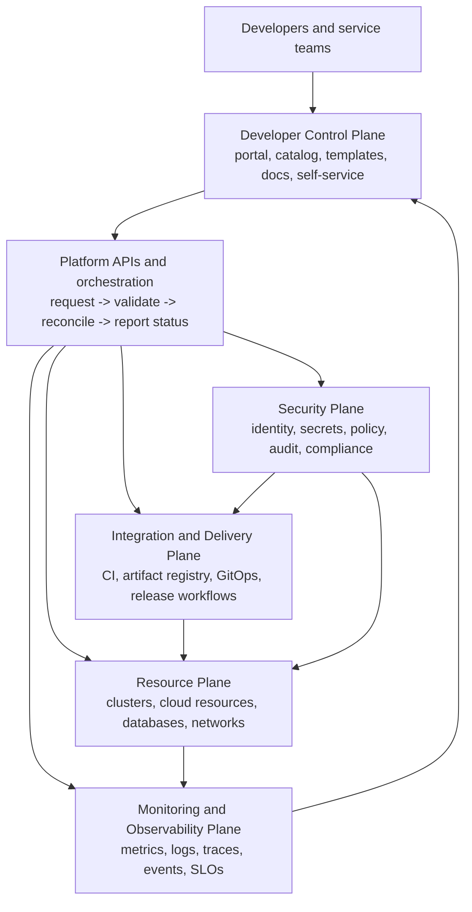
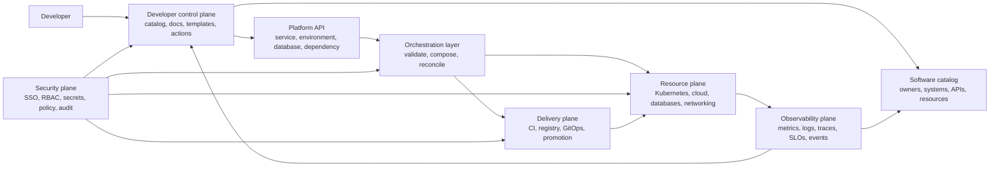
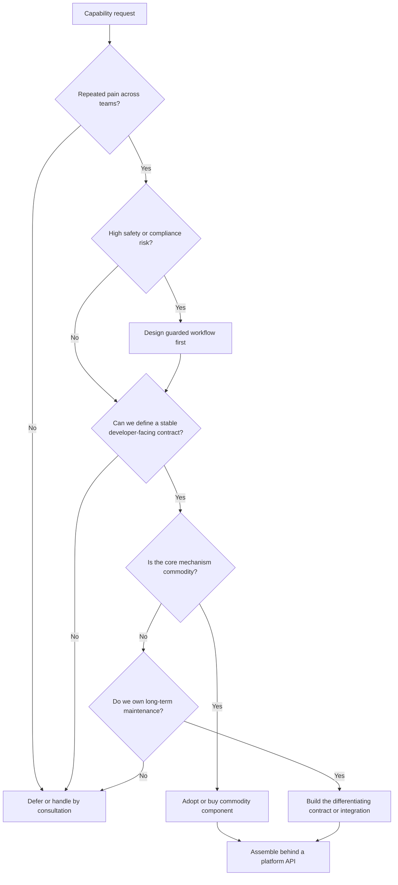

> **Discipline Module** | Complexity: `[COMPLEX]` | Time: 70-90 min

## What You'll Be Able to Do

After completing this module, you will be able to:

- **Design an Internal Developer Platform architecture with clear abstraction layers.**
- **Evaluate IDP tools (Backstage, Port, Kratix, Crossplane, Humanitec, and related options) against organizational requirements.**
- **Implement a service catalog giving developers self-service access to infrastructure capabilities.**
- **Build platform APIs that encapsulate infrastructure complexity behind simple developer interfaces.**

Before starting, you should be comfortable with the platform foundations from [Module 2.1: What is Platform Engineering?](../module-2.1-what-is-platform-engineering/) and the developer experience framing from [Module 2.2: Developer Experience (DevEx)](../module-2.2-developer-experience/). Experience with Kubernetes, CI/CD, GitOps, cloud accounts, or internal tooling will make the hands-on sections more concrete, but the durable architecture is useful even when your organization is still early in its platform journey.

## Why This Module Matters

Platform engineering becomes real when an organization stops talking about "developer productivity" as a slogan and starts offering a product developers can actually use. A developer should not need to memorize a maze of cloud console screens, IAM conventions, Kubernetes YAML, CI secrets, monitoring dashboards, and security exception processes every time they start a service. The platform team's job is to turn that maze into a smaller set of trusted paths, clear interfaces, and feedback loops that let product teams move without waiting for a specialist to translate every infrastructure decision.

Hypothetical scenario: imagine ten service teams sharing three ticket queues for repositories, environments, and databases. A new service needs a repository, a build pipeline, a staging environment, a production namespace, secrets access, an alert route, and a dashboard. None of those requests is exotic, yet each one waits behind unrelated work, each handoff uses different vocabulary, and each team learns the process by copying the last service that happened to ship. An Internal Developer Platform matters because it makes repeated, safe work self-service while keeping the expert decisions close to the people who understand the infrastructure.

The central lesson is that an IDP is not just a portal, a wiki, a product logo, or a set of scripts. It is a product layer over the delivery system: a designed interface where developers ask for capabilities, the platform enforces guardrails, and automation reconciles desired state into running infrastructure. Evan Bottcher's platform framing, Thoughtworks' platform-as-product guidance, the CNCF Platforms Working Group, and Team Topologies all point toward the same idea: the platform should reduce cognitive load for stream-aligned teams by offering self-service APIs, tools, knowledge, and support as a compelling internal product.

## What an IDP Is and Is Not

An Internal Developer Platform is the layer that lets developers consume infrastructure capabilities without becoming experts in every underlying subsystem. It normally includes a developer control plane, catalog, templates, workflow automation, security guardrails, observability integration, and platform APIs that represent approved ways to request runtime resources. The important word is "consume": the platform should expose the right nouns for the developer's job, such as service, environment, database, queue, dependency, release, ownership, and readiness, rather than forcing every team to think first in terms of subnets, IAM policies, Helm values, Terraform state files, and admission controller exceptions.

The platform-as-a-product framing is what prevents an IDP from becoming a pile of tools with a nicer landing page. A product has users, outcomes, support expectations, a roadmap, usage signals, and tradeoff decisions. When developers are the customers, the platform team has to understand their jobs well enough to decide which path should be paved, which path should remain possible but unsupported, and which path should be blocked because it creates risk for everyone else. Good product thinking also keeps the team honest: a capability that exists but is undocumented, hard to find, or painful to use is not yet a finished platform capability.

An IDP is not a wiki of runbooks. A wiki can document how to create a database, but it still leaves the developer responsible for translating instructions into a working, compliant resource. An IDP turns the repeated parts of that work into a request and a control loop: "I need a PostgreSQL database for this service in staging" becomes a typed request, policy validation, provisioning, connection handling, ownership metadata, and observable status. Documentation still matters, but it becomes the explanation of the platform contract rather than the only mechanism for operating it.

An IDP is also not a ticket queue with a friendlier form. A ticket queue can capture intent, but it usually routes the intent to another human who repeats the same low-level steps. That may be acceptable for rare, risky, or judgment-heavy operations, but it is a poor default for standard resources. Self-service does not mean "no governance"; it means the governance is encoded into templates, policies, APIs, and reconciliation so that the normal path is both faster and safer than the manual path.

An IDP is different from a traditional PaaS because the platform is usually assembled around your organization's delivery system rather than purchased as a single sealed runtime. A PaaS often offers a prescribed application model, runtime, routing layer, and operations model. A modern IDP may include PaaS-like experiences, but it commonly integrates Kubernetes, cloud services, CI/CD, GitOps, identity, observability, security tooling, and an internal catalog behind organization-specific abstractions. The platform can be opinionated without pretending every workload should fit one vendor's application model.

The best analogy is a well-run airport. Passengers do not need to understand fuel logistics, runway scheduling, air traffic control, maintenance certification, baggage routing, or security system design to board a flight. They need clear signs, reliable gates, safe guardrails, and a small set of actions they can perform themselves. The airport does not remove the underlying complexity; it organizes that complexity into interfaces that let different specialists work together without asking every traveler to become an airport operations engineer.

## The Five Planes of an IDP

The CNCF Platforms Working Group describes platforms through interacting capability planes rather than one mandatory product bundle. For IDPs, this framing is more durable than a tool roster because the planes explain the jobs the platform must perform. The names you choose internally can vary, but most serious IDPs need a Developer Control Plane, an Integration and Delivery Plane, a Resource Plane, a Monitoring and Observability Plane, and a Security Plane. Each plane should have a clear owner, a clear contract, and a clear relationship to the others.


```mermaid
flowchart TD
    dev[Developers and service teams]
    dcp[Developer Control Plane<br/>portal, catalog, templates, docs, self-service]
    idp[Integration and Delivery Plane<br/>CI, artifact registry, GitOps, release workflows]
    rp[Resource Plane<br/>clusters, cloud resources, databases, networks]
    obs[Monitoring and Observability Plane<br/>metrics, logs, traces, events, SLOs]
    sec[Security Plane<br/>identity, secrets, policy, audit, compliance]
    api[Platform APIs and orchestration<br/>request -> validate -> reconcile -> report status]

    dev --> dcp
    dcp --> api
    api --> idp
    api --> rp
    api --> obs
    api --> sec
    idp --> rp
    rp --> obs
    sec --> idp
    sec --> rp
    obs --> dcp
```

The Developer Control Plane is the front door. It is where a developer discovers what exists, who owns it, how healthy it is, how to create something new, and how to request supported capabilities. A portal such as Backstage, Port, Cortex, or another catalog-centered interface can live here, but the durable capability is not the web UI itself. The durable capability is a discoverable inventory of software and platform resources, a trusted set of templates, and a consistent way to connect human intent with platform automation.

The Integration and Delivery Plane handles the movement from source code to running software. It includes source control integrations, build systems, artifact repositories, security scans, deployment workflows, environment promotion, and rollback or progressive delivery patterns. Developers experience this plane as "my commit moves through a known path," while platform engineers see the underlying supply chain: credentials, artifact provenance, policy checks, GitOps controllers, release metadata, and operational handoffs. Without this plane, the portal can create projects but cannot reliably carry them into production.

The Resource Plane is where compute, storage, networking, data services, and runtime dependencies are actually provisioned. In Kubernetes-centered organizations, this often includes clusters, namespaces, operators, Crossplane compositions, Kratix promises, cloud provider resources, databases, queues, ingress, DNS, and runtime configuration. The platform should not expose every low-level knob directly to every developer. Instead, it should expose resource classes that match common needs, such as "small development database with automatic backup" or "production service with autoscaling and standard network policy."

The Monitoring and Observability Plane turns platform work into visible feedback. It includes metrics, logs, traces, events, dashboards, alert routing, SLO views, cost signals, and operational health indicators. This plane is easy to underbuild because teams assume observability starts after deployment, but a platform API without status feedback feels like a black box. Developers need to know whether their request was accepted, which resources were created, what version is running, where to find telemetry, and whether the service is meeting the expectations attached to its lifecycle.

The Security Plane supplies identity, access control, secrets, policy enforcement, audit trails, vulnerability management, and compliance evidence. A useful IDP does not bolt security onto the end of the workflow. It encodes security into the paved path so that a standard service receives approved defaults, least-privilege access, secret handling, network boundaries, image scanning, and auditability without a separate negotiation for every deployment. This is the "guardrails, not gates" principle: prevent unsafe defaults and make the safe default the easiest path.

These planes compose through contracts. The catalog says which team owns a service, the delivery plane says which artifact is promoted, the resource plane says where it runs, the security plane says which identities and policies apply, and the observability plane says how the result behaves. If those contracts are implicit, every integration becomes a special case. If the contracts are explicit, the platform can evolve one plane at a time without turning the whole IDP into a fragile chain of hidden assumptions.

## Abstraction Layers and Platform APIs

The platform API is the most important design decision in an IDP because it defines what developers are allowed to ask for. If the API is too low-level, developers still carry the cognitive load of infrastructure design. If it is too high-level or too narrow, teams will bypass it the moment their workload differs from the happy path. A good platform API sits at the level where product teams can express intent while platform engineers can still apply standards, policy, and automation behind the scenes.

Kubernetes is a useful mental model because it separates desired state from reconciliation. A user submits an object that says what they want, and controllers try to move the actual system toward that desired state. Kubernetes custom resources extend that pattern to new domain-specific APIs, while tools such as Crossplane and Kratix apply the same control-plane mechanics to infrastructure and platform capabilities. The durable idea is not "use this one tool"; it is "describe the capability, validate the contract, reconcile the result, and report status."

The Score workload specification illustrates another durable abstraction pattern: describe what a workload needs without binding the developer to one runtime implementation. A workload specification can say "this service exposes an HTTP port and needs a PostgreSQL dependency" while different platform backends translate that intent into local Docker Compose, Kubernetes manifests, GitOps changes, or orchestrator requests. The exact spec may evolve, but the idea is stable: developers should describe their workload and dependencies in product language, while the platform owns the environment-specific translation.

Platform orchestration is the layer that connects the developer-facing request to the systems that fulfill it. Humanitec describes this as an orchestrator pattern, Kratix uses Promises to expose resource APIs backed by workflows and destination rules, and Crossplane uses XRDs and Compositions to define custom APIs backed by composed resources. These approaches differ in packaging and operating model, but they all implement the same loop: receive a request, validate it against a contract, generate or reconcile lower-level resources, and expose status back to the user.

Here is a compact Crossplane-style example of the contract. In Crossplane v2, XRDs can define namespaced composite resources, and Compositions can compose Kubernetes resources or managed resources behind that API. This example is intentionally small: it teaches the API boundary, not a full production database platform. In a real platform, you would add RBAC, composition functions, provider configuration, policy checks, connection handling, backup choices, and status conditions before treating it as a supported product.

```yaml
apiVersion: apiextensions.crossplane.io/v2
kind: CompositeResourceDefinition
metadata:
  name: xserviceenvironments.platform.kubedojo.example
spec:
  scope: Namespaced
  group: platform.kubedojo.example
  names:
    kind: XServiceEnvironment
    plural: xserviceenvironments
  versions:
    - name: v1alpha1
      served: true
      referenceable: true
      schema:
        openAPIV3Schema:
          type: object
          properties:
            spec:
              type: object
              required:
                - serviceName
                - image
                - environment
              properties:
                serviceName:
                  type: string
                image:
                  type: string
                environment:
                  type: string
                  enum:
                    - development
                    - staging
                    - production
                replicas:
                  type: integer
                  minimum: 1
                  maximum: 10
```

The XRD defines the developer-facing noun. A service team does not ask for a Deployment, Service, HorizontalPodAutoscaler, NetworkPolicy, alert rule, and dashboard separately; it asks for a service environment. That noun is the platform team's product decision. It makes sense only if it reflects repeated needs in the organization, and it should remain small enough that developers can understand the contract without reading the implementation of every composed resource.

```yaml
apiVersion: platform.kubedojo.example/v1alpha1
kind: XServiceEnvironment
metadata:
  name: checkout-staging
  namespace: checkout-team
spec:
  serviceName: checkout
  image: nginx:1.27
  environment: staging
  replicas: 2
```

The request is deliberately boring. Boring is the goal. It gives the developer a small set of choices while leaving the platform implementation free to create the actual runtime resources, attach labels, set security defaults, register the service in the catalog, and connect telemetry. The platform team can change the underlying composition later without teaching every product team a new cloud provider workflow, provided the contract remains compatible and the migration is handled as product work.

Kratix Promises express the same pattern with different packaging. A Promise defines the API a platform user can call, the dependencies that must exist, workflows that run during Promise or resource lifecycles, and destination rules that decide where generated resources land. That makes it useful when the platform team wants a reusable product capability that can fan out to multiple destinations. Crossplane tends to feel natural when you want Kubernetes-style custom APIs and composition; Kratix tends to feel natural when you want a promise catalog with lifecycle workflows and destination scheduling. Both are implementations of the broader platform API pattern.

## The Software Catalog as the Backbone

The software catalog is the backbone of self-service because a platform cannot automate responsibly if it does not know what exists and who owns it. A catalog entry should answer operational questions before they become emergencies: which team owns this service, which system does it belong to, what APIs does it provide, what resources does it depend on, what lifecycle stage is it in, where are its docs, where is its source, and which alerts or dashboards describe its health. Without those answers, the platform can scaffold new services but cannot maintain a trustworthy map of the software estate.

Backstage popularized the `catalog-info.yaml` pattern, but the idea is not tied to Backstage. A catalog entity is an explicit piece of metadata that lives close to the thing it describes and can be ingested by the platform. The entity model commonly includes components, systems, APIs, resources, groups, users, locations, and templates. When the metadata is versioned with the service, ownership and dependency information can evolve through normal code review instead of living in a stale spreadsheet.

```yaml
apiVersion: backstage.io/v1alpha1
kind: System
metadata:
  name: commerce
  description: Customer-facing commerce capabilities.
spec:
  owner: team-commerce-platform
  domain: retail
---
apiVersion: backstage.io/v1alpha1
kind: Component
metadata:
  name: checkout-service
  description: Accepts carts, validates payment intent, and creates checkout sessions.
  tags:
    - kubernetes
    - payments
  annotations:
    backstage.io/techdocs-ref: dir:.
    github.com/project-slug: kubedojo/checkout-service
spec:
  type: service
  lifecycle: production
  owner: team-checkout
  system: commerce
  providesApis:
    - checkout-api
  dependsOn:
    - component:catalog-service
    - resource:checkout-postgres
---
apiVersion: backstage.io/v1alpha1
kind: API
metadata:
  name: checkout-api
  description: Public checkout API consumed by web and mobile clients.
spec:
  type: openapi
  lifecycle: production
  owner: team-checkout
  system: commerce
  definition:
    $text: ./openapi.yaml
---
apiVersion: backstage.io/v1alpha1
kind: Resource
metadata:
  name: checkout-postgres
  description: PostgreSQL database used by checkout-service.
spec:
  type: database
  owner: team-checkout
  system: commerce
```

A catalog becomes powerful when it is connected to workflows rather than treated as an address book. A template can scaffold a new service and create its initial catalog entry. A delivery workflow can update lifecycle or deployment metadata. A scorecard can compare the catalog entry against production-readiness expectations. An incident workflow can route to the owning team without asking an operator to search chat history. A platform API can require an owning group and system before creating infrastructure, which turns metadata quality into part of the normal path.

Scorecards deserve careful handling because they can help or harm the platform's relationship with developers. A useful scorecard makes invisible risk visible and gives teams a clear next action, such as adding an owner, connecting a dashboard, or defining an alert route. A harmful scorecard becomes a public scoreboard of shame or a compliance checklist detached from actual service risk. The platform team should treat scorecards as coaching and prioritization tools, not as a substitute for talking with teams about why a standard exists.

The catalog should also model platform capabilities, not only application services. If "managed PostgreSQL" is a product offered by the platform, it should have docs, ownership, lifecycle, support expectations, dependencies, and known limits. That makes the platform itself discoverable. Developers should not have to guess whether the database offering supports development environments, production backups, data residency constraints, or restore testing; those expectations belong in the platform product surface.

## Self-Service Workflows and Golden Paths

Self-service does not mean giving every developer unrestricted access to every platform lever. It means turning repeatable requests into well-designed workflows where the safe default is fast and the risky path is explicit. A golden path is the recommended route through that workflow: the supported stack, template, delivery pattern, observability baseline, and operational model that the platform team is prepared to maintain. The next module goes deeper on golden paths, but IDP architecture depends on them because a platform with no opinion is just a toolbox.

The strongest self-service workflows start with a problem developers already feel. "Create a new service" is a common entry point because it touches source control, CI, catalog metadata, deployment, observability, and ownership. "Create a database for an existing service" is another useful entry point because it demonstrates the platform API pattern clearly. "Add a new environment" can be valuable when teams lose time coordinating namespaces, secrets, DNS, and deployment configuration. Each workflow should prove one thing: the platform is a better way to get real work done.

A workflow should have three layers. The outer layer is the developer experience: form fields, CLI arguments, template parameters, docs, and status messages. The middle layer is policy and orchestration: validation, authorization, naming, labels, approvals when needed, and calls to the right systems. The inner layer is infrastructure implementation: Git commits, Kubernetes resources, cloud APIs, secrets, dashboards, and alert routes. Keeping those layers separate lets the platform team improve the implementation without constantly changing the developer-facing contract.

The common failure is to automate the happy path while leaving exceptions unclear. Real services need migrations, special data retention, unusual traffic patterns, legacy dependencies, preview environments, temporary privileges, and production freeze windows. The platform does not need to support every variation on day one, but it should say which variations are supported, which require consultation, and which are intentionally out of bounds. Good self-service reduces ambiguity; it does not pretend ambiguity never exists.

## Reference Architecture: How the Planes Wire Together

A reference architecture is not a mandate to install the exact same products everywhere. It is a way to show how intent, metadata, delivery, resources, security, and feedback move through the platform. The architecture below is intentionally product-neutral in the main path. You can map it to Backstage, Port, Cortex, Crossplane, Kratix, Humanitec, Argo CD, Flux, Terraform, Kubernetes, cloud services, or a custom platform, but the value comes from the contracts between layers rather than from the names in the boxes.


```mermaid
flowchart LR
    dev[Developer]
    portal[Developer control plane<br/>catalog, docs, templates, actions]
    catalog[Software catalog<br/>owners, systems, APIs, resources]
    api[Platform API<br/>service, environment, database, dependency]
    orchestrator[Orchestration layer<br/>validate, compose, reconcile]
    delivery[Delivery plane<br/>CI, registry, GitOps, promotion]
    resources[Resource plane<br/>Kubernetes, cloud, databases, networking]
    security[Security plane<br/>SSO, RBAC, secrets, policy, audit]
    telemetry[Observability plane<br/>metrics, logs, traces, SLOs, events]

    dev --> portal
    portal --> catalog
    portal --> api
    api --> orchestrator
    orchestrator --> delivery
    orchestrator --> resources
    security --> portal
    security --> orchestrator
    security --> delivery
    security --> resources
    delivery --> resources
    resources --> telemetry
    telemetry --> portal
    telemetry --> catalog
```

In this architecture, the portal is not responsible for doing all the work. It is responsible for presenting a coherent product surface and routing requests into the right contracts. The catalog is not a passive inventory; it is the shared model that makes ownership, dependency, lifecycle, and operational metadata available to other workflows. The orchestration layer is where platform-specific decisions happen, and the delivery and resource planes turn those decisions into running software. Security and observability are cross-cutting planes because they must inform every step, not just inspect the result.

This wiring gives you a useful diagnostic question: if a developer requests a new capability, where does the request become a durable object with status? If the answer is "a chat thread," the platform has not yet made that capability self-service. If the answer is "a typed platform API object, catalog entity, workflow run, Git commit, or ticket with a clear state machine," you have something that can be measured, retried, audited, improved, and supported. The IDP matures as more repeated work moves from informal coordination into visible contracts.

## Landscape Snapshot and Tool Rosetta

> **Landscape snapshot — as of 2026-06. This changes fast; verify against vendor docs before relying on specifics.** Backstage is listed by CNCF as Incubating, Crossplane is listed by CNCF as Graduated, Score is listed by CNCF as Sandbox, and OpenChoreo is listed by CNCF as Sandbox. GitHub release checks during authoring saw Crossplane `v2.3.2`, Backstage stable tag `v1.51.2`, Score spec `0.4.1`, Score Kubernetes implementation `0.14.0`, Score Compose `0.41.0`, and OpenChoreo `v1.1.1`; several commercial portals and orchestrators are vendor-managed SaaS products without a single public semver to pin. Treat this paragraph as a dated map, not as a recommendation or ranking.

| Durable capability | Backstage | Port | Cortex | Crossplane | Kratix | Humanitec | Score |
|--------------------|-----------|------|--------|------------|--------|-----------|-------|
| Software catalog | Native catalog model | Catalog-centered portal | Catalog-centered portal | Not the main focus | Not the main focus | Integrates with portals | Can complement catalog metadata |
| Scaffolding and templating | Software Templates and scaffolder | Self-service actions and forms | Self-service workflows | Compositions and functions | Promise workflows | Orchestrated workflows | Workload spec consumed by implementations |
| Platform API and orchestration | Usually calls external automation | Calls external automation | Calls external automation | XRDs and Compositions | Promises and resource APIs | Platform orchestrator pattern | Describes workload intent |
| Scorecards and maturity | Plugin or custom model | Built-in scorecard concepts | Built-in scorecard concepts | Not the main focus | Not the main focus | Usually external or integrated | Not the main focus |
| RBAC and guardrails | Plugin and app configuration model | Catalog and action RBAC | Product RBAC and integrations | Kubernetes RBAC and policy around APIs | Kubernetes RBAC plus Promise boundaries | Orchestrator policies and integrations | Delegates enforcement to platform |
| IaC or resource backend | Integrates with external systems | Integrates with external systems | Integrates with external systems | Direct control-plane backend | Promise workflows and destinations | Coordinates external backends | Feeds implementations such as Kubernetes or Compose |

The Rosetta table is intentionally capability-based. A tool can be excellent for one plane and incomplete for another, which is why "best IDP tool" is usually the wrong question. A portal can make ownership and workflows discoverable but still depend on a separate orchestrator for resource provisioning. A control-plane tool can expose excellent platform APIs but still need a portal, documentation, and product management to become a developer-facing platform. A workload specification can improve portability and intent capture, but it still needs a platform backend that translates the specification into real environments.

Build-versus-buy decisions also change as the organization learns. Backstage is often attractive when a team wants an open framework and is willing to own portal assembly, plugin selection, upgrades, and internal product design. Commercial portals can be attractive when catalog, scorecards, RBAC, and workflow UX need to arrive quickly and the organization accepts the SaaS operating model. Crossplane or Kratix can be attractive when platform APIs and reconciliation are central. Humanitec's orchestrator pattern can be attractive when the main problem is coordinating existing tools behind consistent workload and resource flows. Score can be attractive when teams want a portable workload description that feeds multiple environments.

OpenChoreo sits slightly differently from the other entries because it presents a more bundled platform shape for Kubernetes, including abstractions, developer portal elements, delivery, GitOps, and observability. That can be useful when a team wants a more complete reference implementation rather than assembling every plane from separate parts. The tradeoff is the same as with any broader platform: you gain coherence, but you must evaluate how well its opinionated model fits your applications, operating constraints, identity model, and existing delivery system.

## Build, Buy, or Assemble

The real IDP decision is rarely "build or buy" in a pure sense. Most organizations assemble. They buy or adopt commodity capabilities, build the contracts that are unique to their delivery system, and integrate everything into a product experience. Even a commercial portal needs catalog modeling, ownership cleanup, workflow design, identity integration, and platform-specific automation. Even an open source control plane needs packaging, upgrades, support, policy, docs, and adoption work. The hidden cost is not only the software; it is the ongoing product and integration ownership.

Build when the capability expresses a real organizational differentiator or a constraint no standard product can satisfy. Examples include a platform API that captures a domain-specific deployment model, an integration with a proprietary approval system, or a resource class shaped by your regulatory boundary. Build also when owning the interface is strategically important enough that you are prepared to maintain it for years. "Our use case feels special" is not enough; the test is whether the custom work creates lasting leverage that a vendor or open source component cannot reasonably provide.

Buy or adopt open source when the capability is a common platform need and your differentiation comes from using it well rather than inventing it. Source control integration, artifact storage, common observability primitives, secrets handling, portal frameworks, policy engines, and GitOps controllers usually fall into this category. Buying does not remove engineering work; it changes the work from inventing the core mechanism to configuring, integrating, operating, and teaching it. That is often the right trade because platform teams are scarce and should spend their effort where the organization's context matters.

Assemble when no single product should own the whole platform experience. This is the default for many cloud-native organizations. A portal supplies the front door, a catalog stores ownership and dependencies, CI/CD moves artifacts, GitOps applies changes, Crossplane or Kratix exposes resource APIs, policy engines enforce guardrails, observability tools publish signals, and an orchestrator or custom glue connects the flow. Assembly works when contracts are explicit. It fails when every integration is a one-off script known only to the person who wrote it.

Hypothetical scenario: a platform team gets funding to "build the IDP" and spends a year on a custom portal, custom deployment engine, custom dashboard generator, and custom database workflow before the first product team can use it. The team is not irresponsible; it is solving interesting problems in the wrong order. A better path is to ship a thin portal and catalog, integrate one delivery workflow, expose one high-demand resource API, and learn from real usage before expanding. The lesson is not "never build." The lesson is to build the parts that make your platform coherent and adopt the parts where the community or market has already solved the commodity problem.

## Patterns & Anti-Patterns

Successful IDPs share a few patterns that are more important than any product choice. The first pattern is the thinnest viable platform: start with the smallest set of APIs, documentation, workflows, and support that accelerates real teams. A thin platform is not a toy if it solves a real bottleneck end to end. It is a disciplined way to avoid building a large, abstract platform before you know which capabilities developers will trust.

The second pattern is contract-first self-service. Before choosing a portal plugin or writing a controller, define the request object, required metadata, validation rules, ownership model, status feedback, and support promise. This contract becomes the stable part of the platform. The implementation can move from Terraform to Crossplane, from one GitOps controller to another, or from one portal to another if the developer-facing contract remains understandable and supported.

The third pattern is paved roads with visible exits. The platform should make the recommended path obvious, fast, and well supported, while still explaining what happens when a team needs something different. Mature organizations do not hide exceptions; they classify them. Some exceptions become future platform features, some become temporary consultation paths, and some are rejected because they undermine safety or operability.

The first anti-pattern is portal theater: launching an attractive developer portal without reliable workflows behind it. Developers quickly learn whether the portal creates real outcomes or only links to old processes. If "create database" opens a ticket, "view health" links to an empty dashboard, and ownership metadata is stale, the portal becomes another place to search before asking in chat.

The second anti-pattern is abstraction without empathy. Platform teams sometimes hide too much in the name of simplicity, leaving developers unable to debug, reason about cost, or understand operational consequences. Abstractions should reduce irrelevant detail, not remove all visibility. A good platform shows the request, the generated resources that matter, the status, the ownership path, and the escape hatch when deeper investigation is needed.

The third anti-pattern is mandatory adoption before product fit. Mandates can force usage statistics upward, but they cannot create trust. A platform that is slower, less observable, or less flexible than the old path will generate workarounds. Adoption should be earned by solving painful workflows first, then reinforced by policy once the paved path is demonstrably safer and easier for the majority of teams.

The fourth anti-pattern is treating the IDP as a project with an end date. Internal platforms evolve with language stacks, Kubernetes versions, security expectations, cloud products, team structures, and delivery practices. A one-time launch can create useful momentum, but the operating model has to include product management, support, roadmap decisions, deprecation work, upgrade work, and measurement. Without that ongoing ownership, the IDP becomes legacy software maintained by a team that no longer understands why each integration exists.

### Decision Framework

Use this framework when deciding whether a capability belongs in the IDP now, later, or not at all. The rows are not a scoring algorithm; they are prompts for a product conversation between platform, security, operations, and application teams. The best decision is the one that makes the supported path clearer while keeping maintenance responsibilities honest.

| Decision question | Build | Buy or adopt OSS | Assemble | Defer |
|-------------------|-------|------------------|----------|-------|
| Is this capability unique to your domain or operating constraints? | Strong option if the contract is differentiating | Use only if product can model the constraint | Common when custom glue is enough | Defer if the need is speculative |
| Is the problem a common commodity capability? | Usually avoid | Strong option | Strong option when several tools must connect | Defer if current pain is low |
| Do you have a team to maintain it for years? | Required | Required for operations and integration | Required for contracts and glue | Defer if ownership is unclear |
| Does it reduce cognitive load for many teams? | Strong option for internal abstractions | Strong option for standard UX | Strong option for mixed toolchains | Defer if only one team benefits |
| Can you expose a small stable API? | Strong option | Possible if product supports it | Strong option | Defer until the API is understood |
| Does it create lock-in risk you cannot accept? | Lower vendor lock-in, higher internal maintenance | Evaluate exit paths and data ownership | Can reduce lock-in through contracts | Defer if exit cost is unclear |


```mermaid
flowchart TD
    start[Capability request]
    repeat{Repeated pain across teams?}
    risk{High safety or compliance risk?}
    contract{Can we define a stable developer-facing contract?}
    commodity{Is the core mechanism commodity?}
    maintain{Do we own long-term maintenance?}
    defer[Defer or handle by consultation]
    guard[Design guarded workflow first]
    buy[Adopt or buy commodity component]
    build[Build the differentiating contract or integration]
    assemble[Assemble behind a platform API]

    start --> repeat
    repeat -- No --> defer
    repeat -- Yes --> risk
    risk -- Yes --> guard
    risk -- No --> contract
    guard --> contract
    contract -- No --> defer
    contract -- Yes --> commodity
    commodity -- Yes --> buy
    commodity -- No --> maintain
    maintain -- No --> defer
    maintain -- Yes --> build
    buy --> assemble
    build --> assemble
```

## Adoption and Operating Model

IDP adoption is a product rollout, not a migration spreadsheet. Start with a narrow capability that a real team wants, ship it to a small group, watch them use it, and fix the places where the platform's mental model differs from their work. A platform team that sits with early users will learn details no architecture review can reveal: confusing names, missing status messages, awkward ownership fields, hidden security reviews, and the steps developers still perform outside the platform.

Greenfield adoption is often easier than migration because new services have fewer existing assumptions. A new service template can set catalog metadata, CI workflow, runtime defaults, observability, and ownership from the beginning. Legacy services need mapping, cleanup, and exceptions. That does not mean legacy services should be ignored, but it does mean the platform should prove its shape with new work before promising to absorb every old path.

Measurement should combine usage, flow, quality, and sentiment. Usage says whether teams are trying the platform. Flow says whether the platform reduces waiting time or handoffs. Quality says whether the resulting services meet operational and security expectations. Sentiment says whether developers would choose the platform if they were not forced. Any one metric can mislead; together they tell a more honest story.

Support is part of the product. Developers need to know where to ask questions, what response they can expect, which paths are supported, how incidents are handled, and how platform changes will be communicated. A self-service workflow with no support model is risky because failures become mysterious. A platform team can reduce support load through better docs and automation, but it cannot eliminate the need for product support and stewardship.

## Did You Know?

1. **Backstage originated at Spotify and is now a CNCF Incubating project.** Its durable lesson is not that every organization should copy Spotify, but that discoverability and ownership become platform problems when software estates grow beyond what people can remember.

2. **Crossplane is listed by CNCF as a Graduated project after moving through Sandbox and Incubating stages.** That maturity status does not make it the right answer for every IDP, but it shows that Kubernetes-style control planes for infrastructure are now a mainstream platform engineering pattern.

3. **Team Topologies introduced the thinnest viable platform idea to keep platform scope disciplined.** The useful takeaway is that a platform should be small enough to understand and operate while still accelerating the teams that build customer-facing software.

4. **Kubernetes controllers are control loops that move actual state toward desired state.** Once you understand that loop, platform APIs, Crossplane compositions, Kratix promises, GitOps reconciliation, and many IDP workflows become variations on the same operating model.

## Common Mistakes

| Mistake | Problem | Better approach |
|---------|---------|-----------------|
| Treating the portal as the whole IDP | Developers get links and forms but not reliable outcomes | Design the portal as the front door to catalog, APIs, workflows, and feedback |
| Exposing raw infrastructure knobs | Developers still need specialist knowledge for routine work | Define product-level abstractions such as service, environment, database, and dependency |
| Building every component in-house | The platform team spends its capacity on commodity mechanisms | Adopt proven components where the capability is standard, and build the differentiating contracts |
| Ignoring ownership metadata | Incidents, dependencies, and scorecards become unreliable | Make catalog ownership required for templates, deployments, and platform API requests |
| Mandating adoption too early | Teams comply on paper and route around the platform in practice | Earn trust with a narrow workflow, then expand policy once the paved path works |
| Hiding all implementation detail | Developers cannot debug, estimate impact, or understand limits | Show status, generated resources, docs, and escalation paths without forcing low-level work |
| Leaving security as an external review | Self-service slows down or produces unsafe defaults | Encode identity, policy, secrets, and audit controls into the normal workflow |
| Forgetting the operating model | The IDP launches but decays as tools, teams, and standards change | Fund platform product management, support, upgrades, deprecation, and measurement |

## Quiz

### Question 1

You are asked to design the first IDP architecture for an organization that already has CI, Kubernetes, a secrets manager, and dashboards, but developers still open tickets to discover owners and request routine infrastructure. Which planes should you connect first, and why?

<details><summary>Answer</summary>

Start by designing an Internal Developer Platform architecture that connects the Developer Control Plane, software catalog, platform API, and the existing delivery and resource planes. The organization already has important backend systems, so the first IDP value is not replacing them; it is creating a coherent product surface over them. A catalog gives ownership and discoverability, while a small platform API turns routine infrastructure requests into typed self-service. This answer probes the design outcome because it focuses on abstraction layers and how the planes compose.

</details>

### Question 2

A director wants to choose between Backstage, Port, Cortex, Crossplane, Kratix, Humanitec, and Score by asking which one is "the best IDP tool." How should you reframe the evaluation?

<details><summary>Answer</summary>

Reframe the question around durable capabilities: catalog, scaffolding, platform API, orchestration, RBAC, guardrails, scorecards, IaC integration, and operating model. Evaluating IDP tools against organizational requirements means comparing each option to the planes and contracts you need, not ranking products as if they solve the same problem. A portal-centered tool may be strong for discoverability but depend on a separate orchestrator, while Crossplane or Kratix may be strong for platform APIs but need a developer-facing control plane. The right evaluation also includes maintenance ownership, integration cost, lock-in, and whether the product model fits how your teams work.

</details>

### Question 3

Your platform team launches a catalog, but many entries have no owner, no system, no dependency information, and no link to telemetry. Developers say the catalog is "just another stale database." What should change?

<details><summary>Answer</summary>

Implement a service catalog as part of workflows rather than as a separate inventory cleanup project. New service templates should create catalog metadata, deployment workflows should keep lifecycle and runtime links current, and platform API requests should require ownership before provisioning shared resources. Existing services can be onboarded in waves, prioritizing production systems and teams with active pain. This answer probes the catalog outcome because self-service access depends on trustworthy ownership, dependencies, and operational links.

</details>

### Question 4

A product team asks for direct cloud administrator access because the platform API does not support one database option they need. What is the platform response that balances speed, safety, and product thinking?

<details><summary>Answer</summary>

Do not treat the request as only an access-control dispute; treat it as feedback about the platform API. If the need is repeated and safe to standardize, build platform APIs that encapsulate that database option behind a supported contract, policy checks, and status feedback. If the need is rare or risky, provide a consultation path with explicit guardrails and capture what would be required to support it later. The goal is to preserve the safe paved path while making exceptions visible and intentional.

</details>

### Question 5

Your organization has a mature Terraform module library and a working GitOps flow. A vendor offers a portal with self-service actions, while another team proposes replacing everything with a custom control plane. What decision framework should guide you?

<details><summary>Answer</summary>

Use a build, buy, or assemble framework rather than a binary build-versus-buy debate. The existing Terraform and GitOps investments may remain useful as the resource and delivery backends, while a portal can improve the developer control plane and a thin orchestration layer can standardize requests. Building a custom control plane is justified only if the developer-facing contract or operating constraint is truly differentiating and the team can maintain it long term. Assembly is often the pragmatic answer when existing tools work but lack a coherent product surface.

</details>

### Question 6

A CTO wants to mandate IDP usage for all services next quarter because usage numbers are the fastest metric to report. What risk should you raise, and what rollout would you propose instead?

<details><summary>Answer</summary>

The risk is that mandated adoption can hide poor product fit and create workarounds that reduce trust in the platform. Propose a rollout that starts with greenfield services or one painful workflow, measures flow and sentiment, and expands only after the paved path is faster and safer than the old path. Usage should be paired with quality, waiting-time, support, and developer feedback signals. A mandate can come later for well-supported standards, but it should reinforce value rather than substitute for it.

</details>

### Question 7

An application team says the platform is too abstract because they cannot see why a deployment failed or which resources were created. How should the IDP expose implementation detail without handing back all the complexity?

<details><summary>Answer</summary>

Expose status, generated resource references, workflow logs, ownership, and telemetry links through the developer control plane and catalog. The platform should keep routine infrastructure decisions behind the API, but it should not hide the facts developers need to debug and operate their services. A useful abstraction shows what was requested, what was reconciled, what failed validation, and where to escalate. This keeps cognitive load low while preserving enough transparency for responsible ownership.

</details>

## Hands-On

In this exercise, you will design a minimal IDP slice rather than a full production platform. The goal is to connect catalog metadata, a developer-facing platform API, and a build-versus-buy decision in a way that another engineer could review. You do not need a running Backstage, Crossplane, or Kratix installation to complete the design portion, but the manifests use current shapes from the referenced projects so they can become implementation starting points in a real platform environment.

### Part 1: Create a catalog entry

Create a file named `catalog-info.yaml` for one service your organization could onboard to an IDP. Use the Backstage descriptor shape shown earlier, but replace the names, owners, systems, APIs, and resources with realistic values. Include at least one `Component`, one `API`, and one `Resource`, because a catalog entry that only names a service does not teach the platform enough about ownership and dependencies.

```bash
cat > catalog-info.yaml <<'EOF'
apiVersion: backstage.io/v1alpha1
kind: Component
metadata:
  name: checkout-service
  description: Accepts carts, validates payment intent, and creates checkout sessions.
  annotations:
    backstage.io/techdocs-ref: dir:.
spec:
  type: service
  lifecycle: production
  owner: team-checkout
  system: commerce
  providesApis:
    - checkout-api
  dependsOn:
    - resource:checkout-postgres
---
apiVersion: backstage.io/v1alpha1
kind: API
metadata:
  name: checkout-api
spec:
  type: openapi
  lifecycle: production
  owner: team-checkout
  system: commerce
  definition:
    $text: ./openapi.yaml
---
apiVersion: backstage.io/v1alpha1
kind: Resource
metadata:
  name: checkout-postgres
spec:
  type: database
  owner: team-checkout
  system: commerce
EOF

.venv/bin/python - <<'PY'
from pathlib import Path
import yaml

docs = list(yaml.safe_load_all(Path("catalog-info.yaml").read_text()))
required = {"Component", "API", "Resource"}
found = {doc["kind"] for doc in docs}
missing = required - found
if missing:
    raise SystemExit(f"missing catalog kinds: {sorted(missing)}")
for doc in docs:
    if not doc.get("spec", {}).get("owner"):
        raise SystemExit(f"{doc['kind']} {doc['metadata']['name']} has no owner")
print("catalog entry has required entity kinds and owners")
PY
```

### Part 2: Draft a platform API request

Write the developer-facing resource you wish product teams could request. Keep it small. A good first API has fewer fields than the implementation because the platform owns defaults, policy, and translation. The example below uses the `XServiceEnvironment` contract from the teaching section; in a real Crossplane control plane, you would apply it only after installing Crossplane, the required composition functions, and the XRD.

```yaml
apiVersion: platform.kubedojo.example/v1alpha1
kind: XServiceEnvironment
metadata:
  name: checkout-staging
  namespace: checkout-team
spec:
  serviceName: checkout
  image: nginx:1.27
  environment: staging
  replicas: 2
```

Now write a short contract note that explains what the platform creates from that request. Include the generated Kubernetes or cloud resources, the ownership labels, the security defaults, the observability links, and the support expectation. This note is as important as the YAML because a platform API without a support contract becomes a mysterious automation endpoint.

### Part 3: Build the decision record

Create a decision record for one IDP capability: service catalog, service scaffolding, database self-service, environment creation, or production-readiness scorecards. Decide whether you would build, buy or adopt OSS, assemble, or defer. Use the decision framework from this module, and make the maintenance owner explicit.

```markdown
# IDP Capability Decision: <capability name>

## User problem

Who is blocked, what are they trying to do, and how do they solve it today?

## Capability contract

What developer-facing request, template, scorecard, or catalog entity will exist?

## Decision

Build, buy/adopt OSS, assemble, or defer.

## Rationale

Why this choice fits our team size, existing tooling, maintenance capacity, and risk?

## Operating model

Who owns support, upgrades, documentation, deprecation, and measurement?
```

### Success Criteria

- [ ] Your `catalog-info.yaml` defines at least one component, one API, one resource, and an owner for every entity.
- [ ] Your platform API request describes intent in developer language instead of exposing every infrastructure implementation detail.
- [ ] Your contract note explains what the platform creates, how status is reported, and where observability links appear.
- [ ] Your decision record chooses build, buy/adopt OSS, assemble, or defer with a maintenance owner.
- [ ] Your design maps each capability to at least two IDP planes, such as Developer Control Plane plus Resource Plane.

## Sources

- [CNCF Platforms White Paper](https://tag-app-delivery.cncf.io/whitepapers/platforms/)
- [CNCF Platform Engineering Maturity Model](https://tag-app-delivery.cncf.io/whitepapers/platform-eng-maturity-model/)
- [Evan Bottcher, What I Talk About When I Talk About Platforms](https://martinfowler.com/articles/talk-about-platforms.html)
- [Thoughtworks, Platforms as Products](https://www.thoughtworks.com/en-us/insights/looking-glass/platforms-as-products)
- [Team Topologies, Thinnest Viable Platform](https://teamtopologies.com/key-concepts-content/what-is-a-thinnest-viable-platform-tvp)
- [CNCF Backstage Project](https://www.cncf.io/projects/backstage/)
- [Backstage, What Is Backstage?](https://backstage.io/docs/overview/what-is-backstage/)
- [Backstage Software Catalog Descriptor Format](https://backstage.io/docs/features/software-catalog/descriptor-format/)
- [Backstage Software Templates](https://backstage.io/docs/features/software-templates/)
- [CNCF Crossplane Project](https://www.cncf.io/projects/crossplane/)
- [Crossplane Composite Resource Definitions](https://docs.crossplane.io/latest/composition/composite-resource-definitions/)
- [Crossplane Compositions](https://docs.crossplane.io/latest/composition/compositions/)
- [Crossplane v2 Changes](https://docs.crossplane.io/latest/whats-new/)
- [Kratix, Writing a Promise](https://docs.kratix.io/main/guides/writing-a-promise)
- [Kratix Promise Custom Resource](https://docs.kratix.io/main/reference/promises/intro)
- [Humanitec Platform Orchestrator Overview](https://developer.humanitec.com/platform-orchestrator/docs/what-is-the-platform-orchestrator/overview/)
- [Humanitec IDP Structure and Integration Points](https://developer.humanitec.com/app-humanitec-io/guides/getting-started/master-your-internal-developer-platform/structure-and-integration-points/)
- [Score Specification Documentation](https://docs.score.dev/)
- [CNCF Score Project](https://www.cncf.io/projects/score/)
- [Kubernetes Custom Resources](https://kubernetes.io/docs/concepts/extend-kubernetes/api-extension/custom-resources/)
- [Kubernetes Controllers](https://kubernetes.io/docs/concepts/architecture/controller/)
- [Port Documentation](https://docs.port.io/)
- [Port RBAC Overview](https://docs.port.io/sso-rbac/rbac-overview/)
- [Cortex Scorecards API Documentation](https://docs.cortex.io/api/readme/scorecards)
- [OpenChoreo Documentation](https://openchoreo.dev/docs/)
- [CNCF OpenChoreo Project](https://www.cncf.io/projects/openchoreo/)
- [Backstage GitHub Releases](https://github.com/backstage/backstage/releases)
- [Crossplane v2.3.2 Release](https://github.com/crossplane/crossplane/releases/tag/v2.3.2)
- [Score Spec 0.4.1 Release](https://github.com/score-spec/spec/releases/tag/0.4.1)
- [Score Kubernetes 0.14.0 Release](https://github.com/score-spec/score-k8s/releases/tag/0.14.0)
- [Score Compose 0.41.0 Release](https://github.com/score-spec/score-compose/releases/tag/0.41.0)
- [OpenChoreo v1.1.1 Release](https://github.com/openchoreo/openchoreo/releases/tag/v1.1.1)

## Next Module

Continue to [Module 2.4: Golden Paths](../module-2.4-golden-paths/) to learn how to design opinionated workflows that guide developers toward success.
