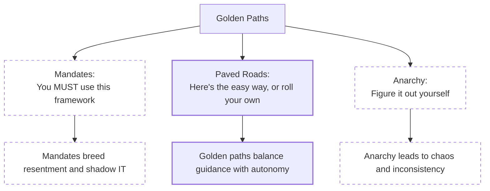
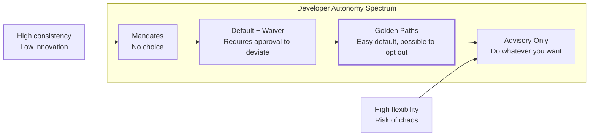
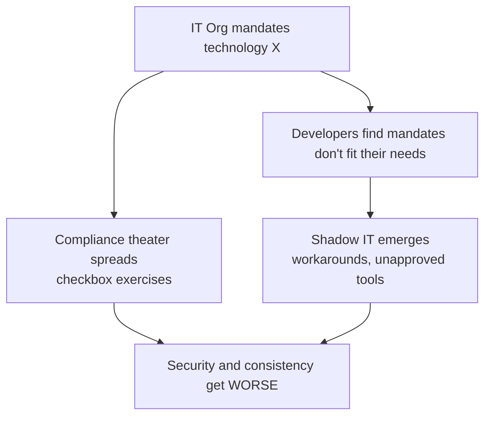
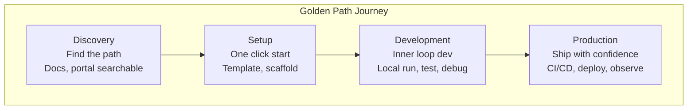
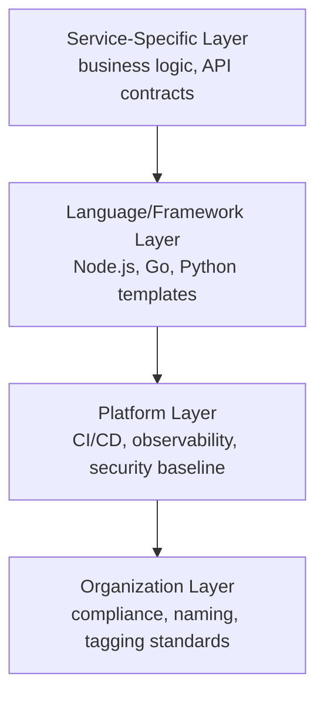
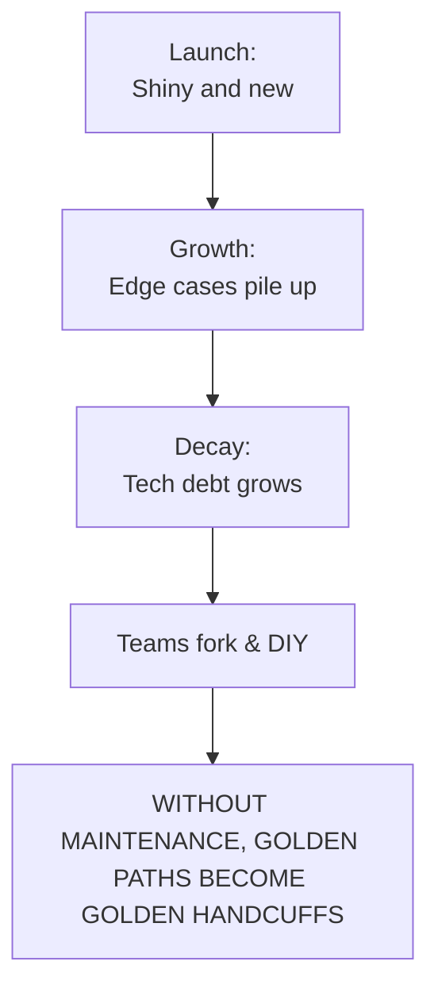

> **Discipline Module** | Complexity: `[MEDIUM]` | Time: 40-50 min

## Prerequisites

Before starting this module, you should:

- Complete [Module 2.1: What is Platform Engineering?](../module-2.1-what-is-platform-engineering/) - Platform foundations
- Complete [Module 2.2: Developer Experience](../module-2.2-developer-experience/) - Cognitive load concepts
- Complete [Module 2.3: Internal Developer Platforms](../module-2.3-internal-developer-platforms/) - IDP components
- Understand template engines (Helm, Cookiecutter, or similar)

## What You'll Be Able to Do

After completing this module, you will be able to:

- **Design golden paths that accelerate common development workflows without restricting flexibility**
- **Implement project scaffolding templates that embed security, observability, and deployment best practices**
- **Evaluate golden path adoption metrics to determine which paths deliver the most developer value**
- **Build escape hatches that let advanced teams customize golden paths for edge cases**

## Why This Module Matters

The 2012 Knight Capital Group<!-- incident-xref: knight-capital-2012 --> deployment failure — an engineer missed one of eight servers in a manual rollout, and the mismatched node triggered losses that nearly bankrupted the firm in under an hour — is the canonical story of what happens without golden paths. For the full case study, see [Infrastructure as Code](../../../../prerequisites/modern-devops/module-1.1-infrastructure-as-code/).

While most organizations won't bankrupt themselves in under an hour, the absence of paved roads creates a silent, compounding tax. Without golden paths, every development team spends weeks reinventing the wheel—researching how to configure CI/CD pipelines, debating database choices, and fighting with security controls. This "shadow IT" leads to a fragmented ecosystem where security patches take months to roll out because every microservice is a unique, bespoke creation. 

Golden paths transform "you must comply with these fifty security rules" into "here is how to deploy a secure, monitored service in five minutes." They are not about restricting developers; they are about eliminating cognitive load. By embedding organizational best practices into self-service templates, platform teams can accelerate feature delivery while ensuring that the fastest route to production is also the most secure and reliable route.

## Did You Know?

- **Spotify formally documented "Golden Paths"** in 2020 to describe their paved roads approach—paths that are well-lit, well-maintained, and lead somewhere good.
- **Netflix's "Paved Road"** handles over 90% of internal use cases, freeing platform teams to support the genuinely unique 10%.
- **Organizations with mature golden paths** report up to an 80% reduction in time-to-production for new services, dropping lead times from weeks to hours.
- **According to the 2023 State of DevOps Report**, teams using established platform engineering paved roads are 2.5 times more likely to achieve high organizational performance.

---

## What is a Golden Path?

### Definition

A **golden path** (also called paved road, happy path, or blessed path) is:

> A well-supported, opinionated route to accomplishing a common task that encodes organizational best practices while remaining optional.

Key characteristics:

| Characteristic | Description |
|---------------|-------------|
| **Opinionated** | Makes decisions so developers don't have to |
| **Supported** | Platform team maintains and evolves it |
| **Optional** | Developers can deviate if they have good reason |
| **Complete** | Handles the full journey, not just setup |
| **Discoverable** | Easy to find when you need it |

### What Golden Paths Are NOT



### The Spectrum of Developer Freedom



Golden paths sit in the sweet spot: **making the right thing easy without making the wrong thing impossible**.

> **Stop and think**: Look at the tools your team uses daily. How many of them were mandated from the top down, and how many grew organically because they were simply the easiest path to production?

---

## Golden Paths vs Mandates

### Why Mandates Fail



Real-world mandate failures:

| Mandate | Intent | Reality |
|---------|--------|---------|
| "Everyone must use Java" | Consistency | Python scripts everywhere, JavaScript "exceptions" |
| "All deployments through Jenkins" | Control | Teams running kubectl directly |
| "No cloud services" | Security | Spreadsheets with customer data on Google Sheets |
| "Use approved vendors only" | Cost control | Shadow SaaS subscriptions on expense reports |

### The Golden Path Alternative

Instead of: **"You must use PostgreSQL"**

Try: **"Here's a golden path for PostgreSQL that gives you:"**
- Pre-configured connection pooling
- Automatic backups
- Monitoring dashboards
- Easy migration paths
- Same-day provisioning

And then: **"If PostgreSQL doesn't fit, here's the process to request a different database"**

The difference:
- Mandate says "NO" until you prove you need something else
- Golden path says "YES, here's the easy way" with an option to customize

### When Mandates ARE Appropriate

Golden paths aren't universal. Some things require mandates:

| Domain | Why Mandate? | Example |
|--------|-------------|---------|
| **Security** | Legal/compliance requirements | "Secrets must be encrypted at rest" |
| **Legal** | Regulatory obligations | "PII handling follows GDPR processes" |
| **Financial** | Cost/liability | "Cloud spend must have cost allocation tags" |
| **Safety** | Critical systems | "Production changes require two approvals" |

The key: **Mandate the outcomes, golden-path the implementation**.

```text
Example:
  Mandate:      "All services must have authentication"
  Golden Path:  "Here's our auth sidecar that adds OAuth2 in 5 minutes"
```

---

## Anatomy of a Great Golden Path

### The Golden Path Journey



### Essential Elements

Every complete golden path includes:

```yaml
Golden Path: "Create a new microservice"

Discovery:
  - Searchable in developer portal
  - Clear description of what it provides
  - Honest about what it DOESN'T support

Setup:
  - One-command or one-click initialization
  - Sensible defaults (can override)
  - Integrated with existing tools

Development:
  - Local development environment
  - Hot reload / fast feedback
  - Testing framework configured
  - Documentation generated

Deployment:
  - CI/CD pipeline pre-configured
  - Environments (dev/staging/prod) set up
  - Feature flags ready

Operations:
  - Logging configured
  - Metrics exported
  - Alerts templated
  - Runbooks linked

Day 2+:
  - Upgrade path documented
  - Migration guides available
  - Deprecation warnings automated
```

### The 5-Minute Rule

A golden path fails if the developer can't get to "hello world in production" within a reasonable time:

| Stage | Target Time | What This Means |
|-------|-------------|-----------------|
| **Discovery** | < 1 minute | Find the path in portal/docs |
| **Setup** | < 5 minutes | Scaffold, credentials, access |
| **First deployment** | < 15 minutes | Running in dev environment |
| **Production-ready** | < 1 day | Full path to prod |

If any stage takes longer, you'll lose developers to "I'll just do it myself."

---

## Designing Golden Paths

> **Pause and predict**: Before you design a new golden path, what metric would most clearly indicate that developers are struggling with the current process?

### Step 1: Identify the Journey

Start by mapping what developers actually do today:

**User Research: "How do teams currently deploy a new service?"**

**Team A: 2 weeks**
- **Week 1**: Request infrastructure ticket -> Wait -> Get rejected -> Re-request with different details -> Wait -> Approved
- **Week 2**: Copy another service's config -> Modify -> Debug for days -> Ask around for help -> Finally deploy

**Team B: 3 days**
- **Day 1**: Know the right people -> Get access faster
- **Day 2**: Copy from a known-good template
- **Day 3**: Debug environment differences -> Deploy

**Team C: 4 hours**
- Use internal template -> One command -> Deployed

*The goal: Make Team C's experience the default.*

### Step 2: Define Opinions

The power of golden paths is in the decisions they make:

```yaml
# Example: Node.js Service Golden Path Opinions

Runtime:
  decision: Node.js 20 LTS
  why: Security updates, team familiarity, ecosystem
  override: Must justify in ADR

Framework:
  decision: Express.js with TypeScript
  why: Mature, well-understood, types catch errors
  override: Allowed with team approval

Database:
  decision: PostgreSQL via platform service
  why: ACID compliance, operational familiarity
  override: Request through data architecture review

Authentication:
  decision: Platform OAuth2 sidecar
  why: Consistent security, centrally managed
  override: Security team approval required

Observability:
  decision: OpenTelemetry + platform dashboards
  why: Vendor-neutral, integrated with existing tools
  override: Additional tools allowed, base required

Deployment:
  decision: Kubernetes v1.35 via ArgoCD
  why: GitOps, consistent with org standard
  override: Not negotiable for production workloads
```

### Step 3: Make It Concrete

Transform opinions into runnable templates:

```bash
# The golden path in action
$ platform create service \
    --name order-service \
    --type nodejs-api \
    --team team-orders

Creating new Node.js API service: order-service
[OK] Created GitHub repository: org/order-service
[OK] Applied Node.js template
[OK] Configured CI/CD pipelines
[OK] Set up dev/staging/prod environments
[OK] Registered in service catalog
[OK] Created initial monitoring dashboards
[OK] Added to team-orders ownership

Service ready! Next steps:
   cd order-service
   npm install
   npm run dev          # Local development
   git push             # Triggers CI/CD
```

### What Gets Generated

```text
order-service/
├── src/
│   ├── index.ts              # Entry point with health checks
│   ├── routes/               # API routes (example included)
│   └── middleware/           # Auth, logging pre-configured
├── test/
│   ├── unit/                 # Jest configured
│   └── integration/          # Test containers ready
├── deploy/
│   ├── kubernetes/           # K8s manifests
│   │   ├── base/            # Kustomize base
│   │   └── overlays/        # Per-environment
│   └── argocd/              # GitOps config
├── .github/
│   └── workflows/           # CI/CD pipelines
├── docs/
│   ├── api.md               # Generated from code
│   └── runbook.md           # Operational playbook
├── catalog-info.yaml        # Backstage integration
├── package.json             # Dependencies locked
├── tsconfig.json            # TypeScript config
├── jest.config.js           # Test config
└── README.md                # How to develop locally
```

---

## Template Design Patterns

### Pattern 1: Layered Templates



This layering allows:
- Organization layer: Update compliance requirements everywhere
- Platform layer: Upgrade CI/CD without touching app code
- Language layer: Different stacks, same operational model
- Service layer: Business-specific customization

### Pattern 2: Composition Over Inheritance

Instead of one massive template, compose from building blocks:

```yaml
# Backstage template.yaml
apiVersion: scaffolder.backstage.io/v1beta3
kind: Template
metadata:
  name: nodejs-microservice
  title: Node.js Microservice
spec:
  parameters:
    - title: Service Details
      properties:
        name:
          type: string
        description:
          type: string
        owner:
          type: string
          ui:field: OwnerPicker

    - title: Components
      properties:
        database:
          type: string
          enum:
            - none
            - postgresql
            - mongodb
        cache:
          type: string
          enum:
            - none
            - redis
        queue:
          type: string
          enum:
            - none
            - rabbitmq
            - kafka

  steps:
    # Base service
    - id: fetch-base
      action: fetch:template
      input:
        url: ./skeleton/nodejs-base

    # Conditionally add database
    - id: fetch-database
      if: ${{ parameters.database != 'none' }}
      action: fetch:template
      input:
        url: ./skeleton/database-${{ parameters.database }}

    # Conditionally add cache
    - id: fetch-cache
      if: ${{ parameters.cache != 'none' }}
      action: fetch:template
      input:
        url: ./skeleton/cache-${{ parameters.cache }}
```

### Pattern 3: Escape Hatches

Always provide ways to customize:

```yaml
# platform.yaml - service configuration

# Use all defaults
service:
  name: order-service
  type: nodejs-api

---

# Override specific defaults
service:
  name: order-service
  type: nodejs-api

  # Override: need more memory for image processing
  resources:
    memory: 1Gi  # default is 256Mi

  # Override: custom health check
  health:
    path: /api/health  # default is /health

  # Override: additional environment
  env:
    - name: FEATURE_NEW_UI
      value: "true"

---

# Escape hatch: bring your own Dockerfile
service:
  name: special-service
  type: custom  # No template, minimal scaffolding

  dockerfile: ./Dockerfile.custom
  # Platform still provides:
  # - CI/CD pipeline
  # - Kubernetes deployment
  # - Monitoring integration
```

> **Stop and think**: If a team repeatedly uses the escape hatches in your template to override the default database choice, is that a failure of the platform, or a valuable signal for future roadmap planning?

### Pattern 4: Progressive Disclosure

Start simple, reveal complexity only when needed:

**Level 0: Zero Config**
```bash
$ platform deploy ./
# Uses conventions: Dockerfile, main branch, auto-scaling
```

**Level 1: Basic Config**
```yaml
# platform.yaml
service:
  name: my-service
  replicas: 3
```

**Level 2: Custom Behavior**
```yaml
# platform.yaml
service:
  name: my-service
  replicas: 3
  scaling:
    min: 2
    max: 10
    metrics:
      - type: cpu
        target: 70
```

**Level 3: Full Control**
```yaml
# platform.yaml
service:
  name: my-service
  kubernetes:
    deployment:
      spec:
        # Full Kubernetes spec access
        containers:
          - name: app
            resources:
              requests:
                memory: "512Mi"
```

---

## Maintaining Golden Paths

### The Maintenance Challenge



### Maintenance Practices

**1. Version Your Paths**

```yaml
# Template versioning
templates/
├── nodejs-api/
│   ├── v1/          # Original, deprecated
│   ├── v2/          # Current default
│   └── v3/          # Beta, opt-in
└── catalog.yaml

# catalog.yaml
templates:
  - name: nodejs-api
    versions:
      - version: v1
        status: deprecated
        sunset: 2024-06-01
        migration: docs/migrations/v1-to-v2.md
      - version: v2
        status: current
        default: true
      - version: v3
        status: beta
        features: [arm64-support, otel-v2]
```

**2. Track Adoption**

```sql
-- Golden path adoption metrics

-- How many services use each path?
SELECT
  template_name,
  template_version,
  COUNT(*) as services,
  COUNT(*) * 100.0 / SUM(COUNT(*)) OVER () as percentage
FROM services
GROUP BY template_name, template_version
ORDER BY services DESC;

-- Template drift: services that modified template files
SELECT
  service_name,
  modified_files,
  last_template_update
FROM services
WHERE template_drift_score > 0.3  -- 30%+ files modified
ORDER BY template_drift_score DESC;
```

**3. Automated Upgrades**

```yaml
# Renovate-style template updates
# .github/workflows/template-upgrade.yaml

name: Template Upgrade Check

on:
  schedule:
    - cron: '0 0 * * 1'  # Weekly

jobs:
  check-updates:
    runs-on: ubuntu-latest
    steps:
      - uses: platform/template-checker @scripts/v1_pipeline.py
        with:
          current-template: nodejs-api-v2

      - name: Create upgrade PR
        if: steps.checker.outputs.update-available
        uses: platform/template-upgrader @scripts/v1_pipeline.py
        with:
          target-version: ${{ steps.checker.outputs.latest }}
          auto-merge: false  # Human review required
```

**4. Feedback Loops**

```yaml
# Embedded feedback collection
# Every golden path includes:

post_scaffold_survey:
  trigger: 7_days_after_creation
  questions:
    - "How easy was it to get started? (1-5)"
    - "What took longer than expected?"
    - "What's missing?"

nps_survey:
  trigger: 30_days_after_creation
  question: "How likely are you to recommend this golden path?"

exit_interview:
  trigger: service_deleted_or_archived
  questions:
    - "Why did you stop using this service/template?"
    - "What would have made you stay?"
```

> **What would happen**: If you launched a perfect golden path today but completely defunded its maintenance for the next 12 months, what specific behaviors would you expect to see from product teams?

### War Story: The Abandoned Path

> **"Why Did Nobody Use Our Perfect Template?"**
>
> A platform team spent 3 months building the "ultimate" microservice template. It had everything: 15 integrations, comprehensive testing, full observability. Launch day came with great fanfare.
>
> Six months later, adoption was 12%. Most teams were still copying from a 2-year-old service called "order-service-old".
>
> **Why?**
>
> The team investigated:
> - Template took 45 minutes to scaffold (too many prompts)
> - Local development required 8 services running
> - "Hello world" was buried under generated code
> - Documentation assumed expert knowledge
>
> Meanwhile, order-service-old:
> - Zero configuration
> - Copy-paste in 5 minutes
> - Everyone knew how it worked
>
> **The fix:**
> 1. Created "lite" version with minimal setup
> 2. Made integrations opt-in, not default
> 3. Added progressive complexity levels
> 4. Ran the 5-minute test with real developers
>
> Adoption jumped to 67% in 3 months.
>
> **Lesson**: The best template you ship beats the perfect template in development.

---

## Case Study: Migrating to Golden Paths

To understand the operational impact of paved roads, consider a mid-sized e-commerce company struggling with microservice sprawl. They had over 200 services written in a mix of Node.js, Python, and Java. Each service had its own bespoke Helm charts and GitHub Actions workflows.

### The Catalyst for Change

When a critical vulnerability was discovered in a widely used logging library, the security team realized they had no centralized way to update the fleet. It took four engineers three weeks to manually open pull requests across all 200 repositories. The process was error-prone, and several services broke in production due to misconfigured dependency overrides. 

### Implementing the Paved Road

Instead of issuing a top-down mandate ("everyone must update their libraries within 48 hours"), the platform engineering team built a central golden path for service scaffolding using Backstage. The paved road included:
- A standardized base Docker image maintained by the security team.
- A centralized CI/CD pipeline template that pulled the latest security checks at runtime.
- Built-in OpenTelemetry instrumentation that routed directly to the company's observability stack.

### The "Carrot" Approach

To drive adoption, the platform team didn't force migrations. Instead, they offered a massive incentive: any team that migrated their service to the new golden path would no longer be responsible for managing their own infrastructure upgrades or on-call alerts for deployment failures. The platform team would take over the operational burden of the CI/CD pipeline and the base infrastructure.

Within six months, 80% of the active services had voluntarily migrated to the golden path. Developers loved it because it deleted hundreds of lines of boilerplate YAML from their repositories. The security team loved it because the next time a vulnerability emerged, they simply patched the base template and triggered a centralized fleet-wide rollout, completing the task in under two hours.

---

## Common Mistakes

| Mistake | Why It Happens | Better Approach |
|---------|---------------|-----------------|
| **Too many options** | Trying to support every use case | Start with 80% case, add options later |
| **No escape hatch** | Fear of "doing it wrong" | Trust developers, provide escape routes |
| **One-size-fits-all** | Efficiency mindset | Different paths for different needs |
| **Set and forget** | Launch fatigue | Budget ongoing maintenance from day 1 |
| **Building in isolation** | "We know best" | Co-create with developer users |
| **Mandating the path** | Control instinct | Make it so good mandate isn't needed |
| **Ignoring existing patterns** | Greenfield thinking | Pave the cowpaths first |
| **Perfect before shipping** | Perfectionism | Ship MVP, iterate based on feedback |

---

## Golden Path Metrics

### Measuring Success

```yaml
Adoption Metrics:
  - percentage_of_services_on_golden_path
  - time_from_discovery_to_first_deploy
  - golden_path_vs_custom_ratio

Satisfaction Metrics:
  - developer_nps_for_golden_path
  - support_tickets_per_service
  - time_to_productive (first meaningful change)

Quality Metrics:
  - security_findings_golden_vs_custom
  - incident_rate_golden_vs_custom
  - mttr_golden_vs_custom

Maintenance Metrics:
  - template_drift_score
  - upgrade_adoption_rate
  - deprecation_compliance
```

### Example Dashboard

**Adoption Rate**: 73%
**Time to First Deploy**: 18 min (Down from 2hr)
**Developer NPS**: +42 (Up from +28)

**Template Versions**
- v3 (current): 156
- v2 (supported): 82
- v1 (deprecated): 23
- custom: 45

**Services by Path**
- nodejs-api: 180
- go-service: 95
- python-ml: 45
- static-site: 35
- custom: 45

**Recent Feedback**
- "Database setup was confusing" - team-payments (3 days ago)
- "Love the new debugging tools!" - team-search (5 days ago)
- "Need ARM64 support" - team-ml (1 week ago)

---

## Quiz

Test your understanding of golden paths:

**Question 1**: Your platform team is rolling out a new standardized CI/CD pipeline. The CIO wants to require all teams to use it by Q3, but your team advocates for a golden path approach instead. How would the rollout and enforcement differ under a golden path strategy?

<details>
<summary>Show Answer</summary>

Under a golden path strategy, the platform team would provide the CI/CD pipeline as a supported, easy route while allowing developers to opt out and manage their own pipelines if they have a valid business reason. Mandates require compliance and prohibit alternatives, essentially saying "NO" by default. The golden path says "YES, here's the easy way," but relies on the pipeline being so valuable and seamless that developers actively choose to use it rather than being forced to. This builds developer trust and focuses the platform team on delivering a product that solves real friction, rather than acting as compliance enforcers.
</details>

**Question 2**: A platform engineering team releases a new microservice golden path. It includes twenty configuration prompts covering networking, storage, security, and alerting, and it takes around 45 minutes to scaffold. Adoption is extremely low. What core principle was violated, and how should it be addressed?

<details>
<summary>Show Answer</summary>

This golden path clearly violates the 5-minute rule, which states that developers must be able to go from discovery to a deployed "hello world" quickly. Because the template attempts to capture too many configuration prompts upfront, developers suffer from decision fatigue and abandon the process. Additionally, the lack of sensible defaults means every user pays the cognitive cost of configuring edge cases they might not even need. To fix this, the team should implement progressive disclosure by offering a minimal default path and making advanced options discoverable only when required.
</details>

**Question 3**: Your organization handles sensitive financial transactions. The security team wants to implement a new encryption standard for all data at rest. Should this be implemented as a golden path or a mandate, and why?

<details>
<summary>Show Answer</summary>

This requirement must be implemented as a mandate because it addresses a fundamental security and compliance obligation. Golden paths are designed to be optional, giving developers the autonomy to diverge if they maintain their own solutions, which is unacceptable for non-negotiable legal or regulatory requirements like financial data encryption. However, the best approach is to mandate the outcome while golden-pathing the implementation. You enforce the rule that all data must be encrypted, but you provide a frictionless golden path—such as a pre-configured storage module or a sidecar—that automatically handles the encryption, making compliance the easiest choice.
</details>

**Question 4**: Your platform team deployed a highly successful golden path for Python microservices 18 months ago. Recently, you notice that new teams are forking the template repository and manually modifying it rather than using the centralized updates. What is the most likely cause of this behavior, and how should you respond?

<details>
<summary>Show Answer</summary>

This pattern is a classic symptom of golden path decay, which occurs when a template fails to keep pace with evolving developer needs or accumulates unhandled edge cases. Over time, as new integrations or dependencies are required, teams find it easier to fork the repository than to work within a constrained or outdated path. To address this, the platform team must establish a feedback loop to understand why developers are diverging and identify the unmet needs. They should then version the templates, automate the upgrade process, and ensure that the golden path is treated as an actively maintained product rather than a set-and-forget project.
</details>

**Question 5**: You are designing a golden path for provisioning cloud databases. A senior engineer argues that if you allow teams to bring their own custom database configurations, it defeats the entire purpose of standardization. Why should you insist on including "escape hatches" in your design?

<details>
<summary>Show Answer</summary>

You must include escape hatches because no single template can ever accommodate one hundred percent of a large organization's use cases. If you lock developers into a rigid structure without a way out, teams with legitimate edge cases will abandon the platform entirely, leading to shadow IT and fragmented tooling. Escape hatches build developer trust by acknowledging their expertise and providing a documented, supported way to bypass defaults while still benefiting from baseline platform services like monitoring and deployment. Tracking how often these escape hatches are used also provides critical data for evolving the standard golden path in the future.
</details>

**Question 6**: Your platform team maintains a golden path for generating React frontends. A product team complains that the template includes a heavy state management library they don't need, which inflates their bundle size. How should the platform team adapt the golden path to solve this without breaking the path for others?

<details>
<summary>Show Answer</summary>

The platform team should implement composition over inheritance by making the heavy state management library an optional, composable component rather than a mandatory part of the base template. By using conditional scaffolding (such as Backstage's template parameters), developers can select whether they need the advanced state management during initialization. This progressive disclosure approach keeps the default path lightweight and fast for simple use cases, while still providing a supported, paved road for complex applications that genuinely require the heavier dependency. It solves the bundle size issue without forcing the product team to abandon the golden path entirely.
</details>

**Question 7**: You are reviewing adoption metrics for your organization's three golden paths. The Node.js and Go templates have 85% adoption, but the Python data science template has only 15% adoption, with most data teams choosing to write raw Kubernetes manifests from scratch. What is the most appropriate first step to diagnose this issue?

<details>
<summary>Show Answer</summary>

The most appropriate first step is to conduct user research with the data science teams to understand their actual workflows and identify where the golden path introduces friction. Low adoption typically indicates that the paved road does not actually map to the "cowpaths" developers are naturally taking, or that the template fails to accommodate crucial edge cases specific to data workloads (like GPU resource requests or specific volume mounts). Avoid enforcing a mandate to increase adoption; if developers are choosing the painful route of writing raw manifests, it strongly implies the golden path is currently even more painful or restrictive for their specific needs.
</details>

---

## Hands-On Exercise

### Scenario

Your organization has 150 microservices across 20 teams. Currently, there are 5 different ways services are created, and 40% of services are missing basic authentication. You are tasked with designing a new microservice golden path.

### Task 1: Map the Current Journey

Identify the friction points in the typical developer journey for creating a new service in this environment. Write out three specific pain points that a golden path must solve.

<details>
<summary>Show Solution</summary>

1. **Inconsistent Security**: Because there are 5 different creation methods, security controls are missed (leading to the 40% lacking authentication). Developers have to manually configure auth every time, which is error-prone.
2. **Slow Setup Time**: Developers are likely wasting days copying old services, reverse-engineering undocumented configurations, and debugging environment differences just to get a "hello world" running.
3. **High Cognitive Load**: Developers are forced to make decisions about infrastructure, networking, and deployment pipelines rather than focusing purely on business logic.
</details>

### Task 2: Define the Non-Negotiable Mandates

Determine which elements of the new service must be mandated (enforced regardless of the golden path) versus which elements should simply be strong defaults.

<details>
<summary>Show Solution</summary>

**Non-Negotiable Mandates**:
- All services must implement standard authentication (to fix the 40% vulnerability rate).
- All services must export baseline metrics and logs in standard formats for centralized observability.
- All deployments to production must pass through the automated CI/CD pipeline (no manual kubectl changes).

**Strong Defaults (Overridable)**:
- Programming language/framework (e.g., Go/Node.js).
- Specific testing frameworks.
- Datastore choices (e.g., PostgreSQL).
</details>

### Task 3: Design the Progressive Disclosure Flow

Outline a three-level progressive disclosure configuration for the new service template to prevent developer overwhelm during initial scaffolding.

<details>
<summary>Show Solution</summary>

- **Level 0 (Zero Config)**: The developer provides only a service name and repository URL. The template automatically applies authentication, sets up a standard CI/CD pipeline, and provisions default CPU/Memory resources.
- **Level 1 (Basic Config)**: The developer can toggle specific supported integrations via simple parameters, such as `database: postgresql` or `cache: redis`, which automatically inject the necessary credentials and sidecars.
- **Level 2 (Full Escape Hatch)**: The developer can provide their own `Dockerfile` and override specific Kubernetes manifest fields (like custom volume mounts or GPU requests) while still utilizing the platform's CI/CD and monitoring mesh.
</details>

### Task 4: Establish Success Metrics

Define three specific, measurable metrics to evaluate whether this new golden path is actually successful after launch.

<details>
<summary>Show Solution</summary>

1. **Adoption Rate**: Reach 75% usage of the golden path for all *new* microservices created within the next 6 months.
2. **Time to Production**: Reduce the time from repository creation to a deployed "hello world" in the staging environment to under 15 minutes.
3. **Security Compliance**: Reduce the percentage of services missing authentication from 40% to near 0% for services generated via the new path.
</details>

### Success Checklist

- [ ] You have mapped the user friction in the current state.
- [ ] You have separated strict mandates from opinionated defaults.
- [ ] You have designed an easy default setup with escape hatches.
- [ ] You have established quantitative metrics to measure success.

---

## Summary

Golden paths succeed by making the right thing the easy thing:

```text
KEY PRINCIPLES:
  1. OPINIONATED but not MANDATORY
     Make decisions so developers don't have to

  2. COMPLETE journey, not just SETUP
     Discovery -> Development -> Production -> Day 2+

  3. ESCAPE HATCHES for legitimate needs
     Trust developers to know when they need to deviate

  4. MAINTAINED actively, not launched and forgotten
     Version, measure, gather feedback, iterate

  5. CO-CREATED with developers, not imposed on them
     The best paths pave existing cowpaths
```

The test of a great golden path: **developers choose it because it's better, not because they have to**.

---

## Further Reading

### Articles
- [Spotify's Golden Path to Kubernetes](https://engineering.atspotify.com/2020/08/how-we-use-golden-paths-to-solve-fragmentation-in-our-software-ecosystem/)
- [Netflix Paved Road](https://netflixtechblog.com/full-cycle-developers-at-netflix-a08c31f83249)
- [How to Build a Platform Team](https://martinfowler.com/articles/platform-teams-stuff-done.html)

### Books
- *Team Topologies* - Matthew Skelton & Manuel Pais
- *Building Evolutionary Architectures* - Neal Ford, Rebecca Parsons, Patrick Kua

### Talks
- "Paved Paths at Scale" - KubeCon
- "Building Golden Paths" - PlatformCon 2023

---

## Next Module

Continue to [Module 2.5: Self-Service Infrastructure](../module-2.5-self-service-infrastructure/) to learn how to empower developers with on-demand infrastructure while maintaining control and governance.