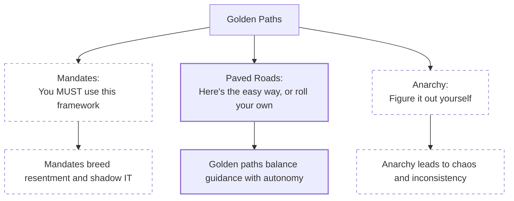
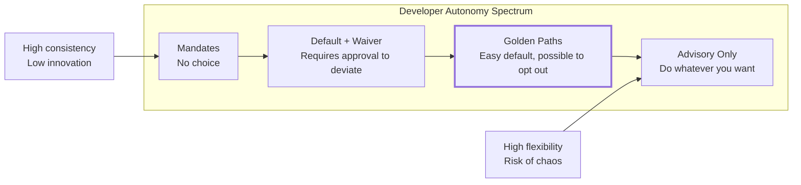
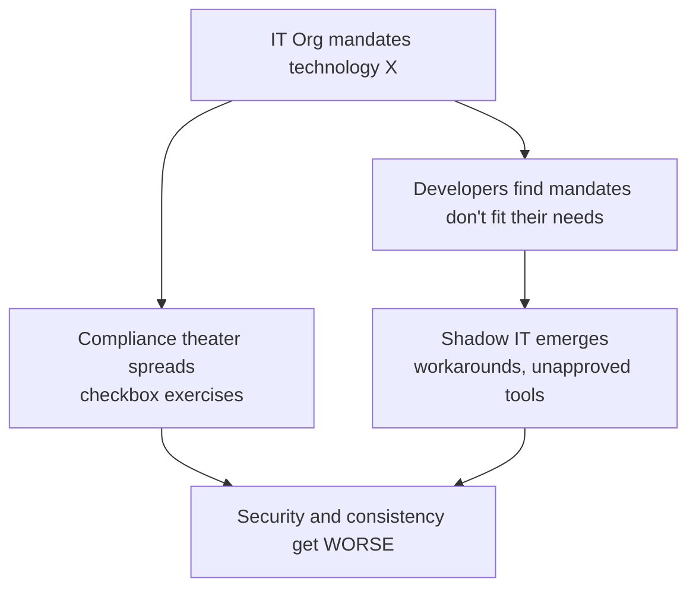
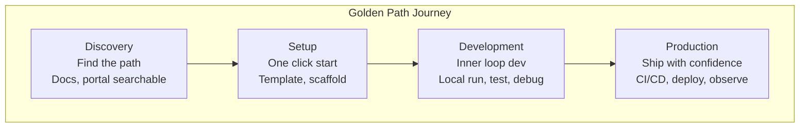
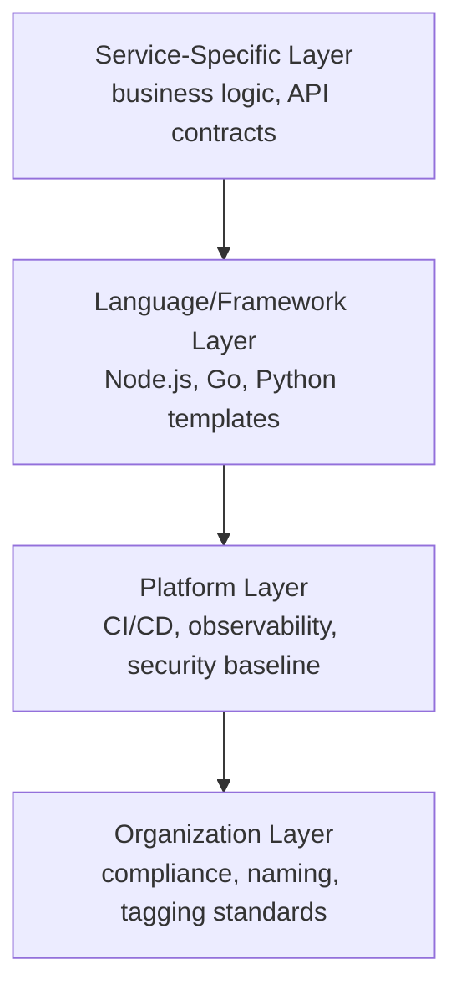
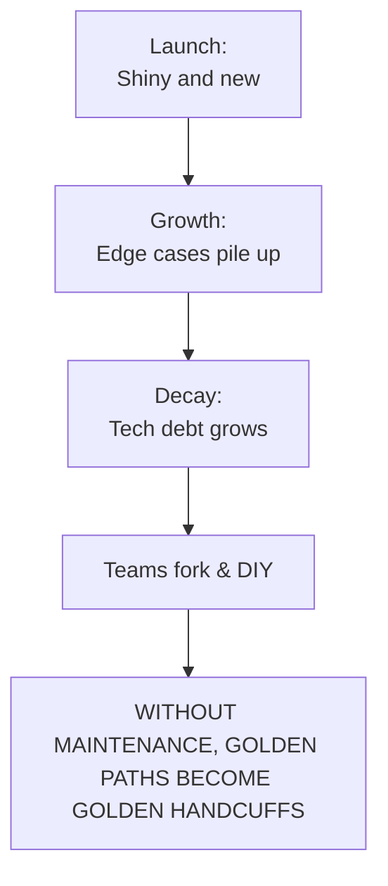
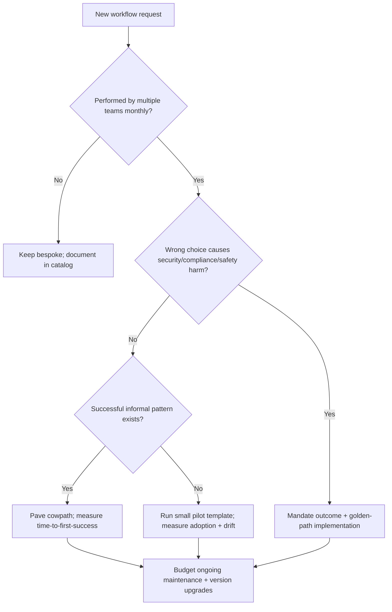

> **Discipline Module** | Complexity: `[MEDIUM]` | Time: 40-50 min

## Prerequisites

Before starting this module, you should:

- Complete [Module 2.1: What is Platform Engineering?](../module-2.1-what-is-platform-engineering/) - Platform foundations
- Complete [Module 2.2: Developer Experience](../module-2.2-developer-experience/) - Cognitive load concepts
- Complete [Module 2.3: Internal Developer Platforms](../module-2.3-internal-developer-platforms/) - IDP components
- Understand template engines (Helm, Cookiecutter, or similar)

## What You'll Be Able to Do

After completing this module, you will be able to:

- **Design golden paths that accelerate common development workflows without restricting flexibility**
- **Implement project scaffolding templates that embed security, observability, and deployment best practices**
- **Evaluate golden path adoption metrics to determine which paths deliver the most developer value**
- **Build escape hatches that let advanced teams customize golden paths for edge cases**

## Why This Module Matters

The 2012 Knight Capital Group<!-- incident-xref: knight-capital-2012 --> deployment failure remains one of the most cited cautionary tales in software operations. An engineer missed one of eight servers during a manual rollout, and the mismatched node triggered automated trading behavior that nearly bankrupted the firm in under an hour. The incident was not caused by a single careless keystroke alone; it was the predictable outcome of a system where production change had no paved, verified default route and where manual variance across nodes was still considered normal. For the full case study, see [Infrastructure as Code](../../../../prerequisites/modern-devops/module-1.1-infrastructure-as-code/).

While most organizations will not face existential trading losses, the absence of golden paths creates a silent, compounding tax that shows up in slower delivery, inconsistent security posture, and rising operational toil. Without a supported easy route, every development team spends weeks reinventing the same decisions: how to wire CI/CD, which observability conventions to follow, how to request credentials, and which deployment pattern is still considered current. Evan Bottcher's framing of internal platforms as products that reduce cognitive load for stream-aligned teams applies directly here: a golden path is how that product becomes tangible in daily work, not merely aspirational in a strategy deck.

Golden paths transform the organizational conversation from "you must comply with these fifty security rules" into "here is how to deploy a secure, monitored service in minutes." They are not about restricting developers; they are about eliminating unnecessary decision fatigue while preserving autonomy for teams with legitimate edge cases. By embedding organizational best practices into self-service templates and workflows, platform teams accelerate feature delivery and ensure that the fastest route to production is also the safest and most observable route. The durable practice is making the right thing easy without making alternatives impossible.

## What is a Golden Path?

A **golden path** — also called a paved road, happy path, or blessed path in different organizations — is a well-supported, opinionated route for accomplishing a common task that encodes organizational best practices while remaining optional. Spotify's engineering organization formalized the term in 2020 to describe how they reduce fragmentation across a large, polyglot estate: golden paths are the routes that are well-lit, well-maintained, and lead somewhere good, as described in their [golden paths essay](https://engineering.atspotify.com/2020/08/how-we-use-golden-paths-to-solve-fragmentation-in-our-software-ecosystem/). Netflix's related paved-road concept for full-cycle developers pursues the same goal from a different angle: provide a default route that handles common internal use cases so platform teams can focus scarce attention on genuinely unique needs, a practice widely discussed in platform engineering literature alongside Spotify's formulation.

The critical distinction is that a golden path is a **default**, not a **dictate**. Mandates say you must comply before you may proceed. Golden paths say here is the supported easy way, and if you have a documented reason to deviate, you still can. That distinction matters because developer trust is a platform team's most valuable currency. When teams choose a golden path because it genuinely reduces friction, the platform team receives adoption signal, maintenance feedback, and political goodwill. When teams comply only because policy forbids alternatives, the platform team receives checkbox theater and shadow workarounds that undermine security and consistency.


```mermaid
graph TD
    GP[Golden Paths]
    GP --> M[Mandates:<br>You MUST use this framework]
    GP --> PR[Paved Roads:<br>Here's the easy way, or roll your own]
    GP --> A[Anarchy:<br>Figure it out yourself]

    M --> M2[Mandates breed resentment and shadow IT]
    PR --> PR2[Golden paths balance guidance with autonomy]
    A --> A2[Anarchy leads to chaos and inconsistency]
    
    classDef bad fill:none,stroke-dasharray: 5 5;
    classDef good stroke-width:2px;
    class M,A,M2,A2 bad;
    class PR,PR2 good;
```

Every mature golden path shares five characteristics that platform teams should be able to articulate to any skeptical engineer. It is **opinionated**, making routine decisions so developers do not re-litigate them on every new service. It is **supported**, meaning a platform team owns maintenance, documentation, and upgrades rather than dumping a template repository into the wild. It is **optional**, with a documented off-ramp for teams whose constraints the default cannot satisfy. It is **complete**, covering discovery through day-two operations rather than stopping at project initialization. And it is **discoverable**, surfaced in the developer portal, documentation search, or CLI help where developers actually look when they are under delivery pressure.


```mermaid
flowchart LR
    subgraph Spectrum[Developer Autonomy Spectrum]
    direction LR
    M[Mandates<br/>No choice] --> D[Default + Waiver<br/>Requires approval to deviate]
    D --> G[Golden Paths<br/>Easy default, possible to opt out]
    G --> A[Advisory Only<br/>Do whatever you want]
    end
    
    C1[High consistency<br/>Low innovation] --> M
    C2[High flexibility<br/>Risk of chaos] --> A
    
    style G stroke-width:3px
```

Golden paths sit in the sweet spot of that autonomy spectrum: making the right thing easy without making the wrong thing impossible. Team Topologies describes platform teams as curating compelling internal products for stream-aligned teams; golden paths are the concrete workflows inside that product that developers can actually walk on Monday morning. The CNCF Platforms White Paper similarly emphasizes curated, self-service capabilities that accelerate internal customers — golden paths are one of the highest-leverage ways to deliver that acceleration without collapsing into a ticket-driven shared services queue.

> **Stop and think**: Look at the tools your team uses daily. How many were mandated from the top down, and how many became default because they were simply the fastest route to production?

## Golden Paths vs Mandates

Mandates fail in platform engineering not because engineers are inherently defiant, but because reality is messier than policy documents assume. When a mandate does not fit a team's legitimate constraint — latency sensitivity, data locality, regulatory isolation, or a dependency on a legacy integration — developers do not stop shipping; they route around the control point. The result is shadow IT: unapproved tools, manual kubectl access, spreadsheet-based workflows, and SaaS subscriptions expensed outside the platform catalog. Security and consistency often get worse, not better, because the organization loses visibility into what is actually running.


```mermaid
graph TD
    A[IT Org mandates technology X] --> B[Developers find mandates don't fit their needs]
    A --> C[Compliance theater spreads<br>checkbox exercises]
    B --> D[Shadow IT emerges<br>workarounds, unapproved tools]
    C --> E[Security and consistency get WORSE]
    D --> E
```

The Knight Capital incident illustrates the mandate-versus-path distinction at the infrastructure layer. Production change required manual execution across multiple servers without a single verified deployment mechanism that made the safe configuration the default everywhere. That is not an argument against all constraints; it is an argument for encoding safe outcomes into supported workflows rather than relying on human perfection under time pressure. Golden paths for deployment — consistent GitOps promotion, automated canaries, or standardized rollout controllers on Kubernetes 1.35 — reduce the surface area where a one-node miss becomes a firm-threatening event.

Platform marketing language often confuses golden paths with generic "best practice checklists" that live in wikis nobody reads. The difference is executability: a checklist tells you what to verify; a golden path wires the verification into CI and generates the compliant baseline by default. When teams still must manually assemble half the stack, you have documentation, not a path. Measuring executability is straightforward — watch whether a new hire can complete the journey with portal links alone, or whether they still need a tour guide from the team that built the template three years ago.

Consider the contrast in how database provisioning is usually communicated. A mandate sounds like "everyone must use PostgreSQL, no exceptions without executive approval." A golden path sounds like "here is a supported PostgreSQL route with connection pooling, backups, monitoring dashboards, and same-day provisioning — and if your workload genuinely needs something else, here is the architecture review process to request it." The mandate optimizes for uniformity of tooling. The golden path optimizes for uniformity of **outcomes** while preserving a supported on-ramp for edge cases.

Some domains still require mandates because the risk is binary rather than trade-off shaped. Legal and regulatory obligations for personally identifiable information, financial controls, encryption at rest, and production change approvals are not optional product preferences. The durable pattern is to **mandate the outcome** while **golden-path the implementation**. Requiring authentication on every service is a mandate; providing an OAuth2 sidecar or service mesh policy template that adds authentication in minutes is the golden path that makes compliance the path of least resistance.

```text
Example:
  Mandate:      "All services must have authentication"
  Golden Path:  "Here's our auth sidecar that adds OAuth2 in five minutes"
```

## Anatomy of a Great Golden Path

A golden path is not a Cookiecutter repository that generates a README and disappears. It is an end-to-end journey that begins when a developer discovers the capability and continues through day-two upgrades, security refreshes, and eventual deprecation. Spotify's essay emphasizes reducing fragmentation; fragmentation returns quickly when templates only solve "day zero" scaffolding but leave teams alone to figure out CI/CD wiring, on-call runbooks, and dependency upgrades.


```mermaid
flowchart LR
    subgraph Journey[Golden Path Journey]
    direction LR
    D[Discovery<br/>Find the path<br/>Docs, portal searchable] --> S[Setup<br/>One click start<br/>Template, scaffold]
    S --> Dev[Development<br/>Inner loop dev<br/>Local run, test, debug]
    Dev --> P[Production<br/>Ship with confidence<br/>CI/CD, deploy, observe]
    end
```

**Discovery** means the path is searchable in the developer portal, described honestly including known limitations, and linked from adjacent tasks developers already perform. **Setup** means one-command or one-click initialization with sensible defaults that can be overridden later rather than interrogated upfront. **Development** means local feedback loops, pre-wired test harnesses, and generated documentation that helps newcomers orient quickly. **Deployment** means CI/CD, environment promotion, and guardrails are already integrated rather than documented as a twelve-step checklist. **Operations** means logs, metrics, traces, alert templates, and runbook links ship with the service skeleton. **Day two and beyond** means upgrade guides, migration paths between template versions, and automated deprecation warnings exist before the first breaking platform change arrives.

The five-minute rule is a useful design heuristic, not a literal stopwatch obsession. If a developer cannot reach a credible "hello world in a non-production environment" within roughly fifteen minutes of choosing a path, they will rationally revert to copying an old repository they trust, even if that repository encodes years of outdated practices. Discovery should take under a minute inside a mature portal. Initial scaffolding should take only a few minutes for the default case. First deployment to a development environment should remain within a single focused working session. Production readiness can take longer, but only because organizational approvals — not template friction — introduce delay.

```yaml
Golden Path: "Create a new microservice"

Discovery:
  - Searchable in developer portal
  - Clear description of what it provides
  - Honest about what it DOESN'T support

Setup:
  - One-command or one-click initialization
  - Sensible defaults (can override)
  - Integrated with existing tools

Development:
  - Local development environment
  - Hot reload / fast feedback
  - Testing framework configured
  - Documentation generated

Deployment:
  - CI/CD pipeline pre-configured
  - Environments (dev/staging/prod) set up
  - Feature flags ready

Operations:
  - Logging configured
  - Metrics exported
  - Alerts templated
  - Runbooks linked

Day 2+:
  - Upgrade path documented
  - Migration guides available
  - Deprecation warnings automated
```

## Designing Golden Paths

Design begins with user research, not template syntax. Map how teams accomplish the target task today, including the unofficial shortcuts. The best golden paths **pave existing cowpaths**: they formalize what high-performing teams already do, then remove the toil that made those cowpaths hard for everyone else to follow. If your fastest team deploys in four hours using an informal template while everyone else needs two weeks of ticket-driven infrastructure requests, your design goal is to make the four-hour experience the organizational default without pretending the two-week path never existed.

When defining opinions, document the decision, the rationale, and the override policy in Architecture Decision Record style commentary inside template metadata or companion docs. A Node.js golden path might standardize on an LTS runtime for security patch predictability, a typed framework for defect detection, a platform-managed PostgreSQL route for operational familiarity, a centralized OAuth integration for consistent policy enforcement, OpenTelemetry export for vendor-neutral observability, and GitOps-based Kubernetes deployment for reproducible promotion. Some of those opinions are soft defaults; others, like production deployment through the approved pipeline, may be non-negotiable mandates expressed as guardrails rather than optional parameters.

```yaml
# Example: Node.js Service Golden Path Opinions

Runtime:
  decision: Node.js 20 LTS
  why: Security updates, team familiarity, ecosystem
  override: Must justify in ADR

Framework:
  decision: Express.js with TypeScript
  why: Mature, well-understood, types catch errors
  override: Allowed with team approval

Database:
  decision: PostgreSQL via platform service
  why: ACID compliance, operational familiarity
  override: Request through data architecture review

Authentication:
  decision: Platform OAuth2 sidecar
  why: Consistent security, centrally managed
  override: Security team approval required

Observability:
  decision: OpenTelemetry + platform dashboards
  why: Vendor-neutral, integrated with existing tools
  override: Additional tools allowed, base required

Deployment:
  decision: Kubernetes v1.35 via ArgoCD
  why: GitOps, consistent with org standard
  override: Not negotiable for production workloads
```

Concrete templates turn those opinions into executable scaffolding. A CLI or portal action should create the repository, apply the skeleton, wire CI/CD, register the service catalog entry, provision baseline observability dashboards, and print the next three commands a developer needs. The generated tree should be legible: a newcomer should see where business logic lives, where infrastructure manifests live, and which files are safe to edit versus owned by the platform upgrade machinery.

Co-creation workshops prevent the classic failure mode where platform engineers design templates in isolation and launch them to confused silence. Invite representatives from high-performing and struggling teams to a timed exercise: scaffold a service together, deploy to a sandbox, and narrate every moment of hesitation. Record which questions recur, which defaults get overridden immediately, and which generated files get deleted before the first commit. Those observations should feed directly into the next template revision rather than living only in meeting notes. The CNCF Platforms White Paper emphasizes curated experiences; curation without observation is just guesswork with better branding.

When multiple golden paths overlap — for example separate paths for batch jobs, synchronous APIs, and event consumers — maintain a small set of shared platform layers so security and observability baselines stay consistent even when application scaffolds diverge. Developers should recognize familiar CI/CD shapes, logging fields, and deployment promotion rules regardless of which path they chose. Consistency at the operational layer makes it easier for SRE and security partners to support diverse workloads without learning a new toolchain per team.

Document the opinion rationale inside the template repository using lightweight Architecture Decision Records or inline comments in template metadata. Future maintainers need to know why an LTS runtime was chosen, why GitOps promotion is non-negotiable for production, and which regulatory constraint blocked a simpler default. Without that memory, paths decay through well-intentioned tweaks that erode the original tradeoffs. Kubernetes 1.35 cluster capabilities may enable safer defaults this year that were impossible when the path first shipped; ADR context helps you modernize without accidentally removing a compliance guardrail.

```bash
# The golden path in action
$ platform create service \
    --name order-service \
    --type nodejs-api \
    --team team-orders

Creating new Node.js API service: order-service
[OK] Created GitHub repository: org/order-service
[OK] Applied Node.js template
[OK] Configured CI/CD pipelines
[OK] Set up dev/staging/prod environments
[OK] Registered in service catalog
[OK] Created initial monitoring dashboards
[OK] Added to team-orders ownership

Service ready! Next steps:
   cd order-service
   npm install
   npm run dev          # Local development
   git push             # Triggers CI/CD
```

## Scaffolding Templates That Embed Best Practices

Templates are the executable heart of a golden path. Their job is to embed security, observability, and deployment best practices as **defaults** rather than as checklist items developers must remember to add manually. That embedding is what connects golden paths to Module 2.3's Internal Developer Platform components: the portal advertises the path, the orchestration layer provisions dependencies, the delivery layer owns CI/CD conventions, and the observability layer exports consistent telemetry shapes from the first commit.

Layered templates separate concerns so platform teams can upgrade operational baselines without forcing every application team to merge enormous diffs. An organization layer encodes naming, tagging, and compliance requirements. A platform layer encodes CI/CD, policy hooks, and observability baselines. A language layer encodes framework-specific structure. A service layer leaves room for business logic and API contracts. When security patches a base container image or changes a mandatory network policy, the platform layer update propagates across every path that composes from it.


```mermaid
flowchart TD
    S[Service-Specific Layer<br/>business logic, API contracts] --> L[Language/Framework Layer<br/>Node.js, Go, Python templates]
    L --> P[Platform Layer<br/>CI/CD, observability, security baseline]
    P --> O[Organization Layer<br/>compliance, naming, tagging standards]
```

Composition beats monolithic inheritance for long-lived platforms. Instead of one template repository that tries to anticipate every permutation, expose building blocks: base service skeleton, optional database module, optional cache module, optional queue module. Backstage Software Templates implement this pattern with conditional steps that fetch additional skeleton fragments only when selected parameters require them, as documented in the [Backstage scaffolder guide](https://backstage.io/docs/features/software-templates/). The same compositional idea appears in Cookiecutter hooks, Yeoman generators, and internal `create-*` CLIs even when the underlying engine differs.

```yaml
# Backstage template.yaml (illustrative excerpt)
apiVersion: scaffolder.backstage.io/v1beta3
kind: Template
metadata:
  name: nodejs-microservice
  title: Node.js Microservice
spec:
  parameters:
    - title: Service Details
      properties:
        name:
          type: string
        owner:
          type: string
          ui:field: OwnerPicker
    - title: Components
      properties:
        database:
          type: string
          enum: [none, postgresql, mongodb]
  steps:
    - id: fetch-base
      action: fetch:template
      input:
        url: ./skeleton/nodejs-base
    - id: fetch-database
      if: ${{ parameters.database != 'none' }}
      action: fetch:template
      input:
        url: ./skeleton/database-${{ parameters.database }}
```

Progressive disclosure keeps the default path fast while allowing deeper configuration when teams need it. Level zero might deploy with conventions only: existing Dockerfile, default branch, autoscaling policy inferred. Level one exposes a small `platform.yaml` with replica counts and integration toggles. Level two exposes scaling metrics and environment variables. Level three exposes selective Kubernetes spec overrides for teams that still want platform-managed CI/CD and observability but need custom resource shapes for GPU workloads or specialized volumes.

> **Landscape snapshot — as of 2026-06. This changes fast; verify against vendor docs before relying on specifics.**

| Durable capability | Backstage Software Templates | Cookiecutter / Yeoman | Internal `create-*` CLI | Kratix Promises | Crossplane Compositions |
|--------------------|------------------------------|------------------------|-------------------------|-----------------|-------------------------|
| Software catalog + discoverability | Native portal integration | External docs / README | CLI help + portal link | Platform CRD catalog | Claim-based discovery |
| Project scaffolding / templating | `fetch:template` actions | Template repos + hooks | Org-specific generators | Promise-driven pipelines | Composition patches |
| Platform API / orchestration | Actions calling platform APIs | Custom hooks | Direct control-plane calls | Declarative promises | Control plane abstractions |
| Policy / guardrails embedding | Custom actions + RBAC | Post-gen scripts | CLI validation steps | Cluster policies | Composite resource policies |
| Day-2 upgrade signaling | Template version metadata | Manual renovate PRs | Platform-driven upgrades | Promise version bumps | Composition revisions |

Present these mechanisms as peers that implement the same durable capabilities with different integration depth. The teaching goal is to recognize which capability you need — cataloged discoverability, composable scaffolding, orchestrated provisioning — not to crown a single vendor winner.

## Golden Paths Inside the Internal Developer Platform

Golden paths do not float independently above the Internal Developer Platform described in Module 2.3; they are the workflows that make portal tiles, orchestration APIs, and software catalog entries feel useful instead of ornamental. When a developer searches the portal for "create API service," the golden path is the combination of catalog metadata, template parameters, policy checks, and post-scaffold automation that turns an abstract capability into a repeatable outcome. Without that binding, portals devolve into link farms that document what teams ought to do while everyone continues copying repositories from memory.

The service catalog is the discovery layer for golden paths. Each path should register as a catalog component or template with ownership, lifecycle stage, supported versions, and links to runbooks. That registration gives platform teams an honest inventory of which paved roads exist, which are deprecated, and which teams own ongoing maintenance. It also gives stream-aligned teams a single search surface rather than a maze of wikis, chat pins, and tribal knowledge about which repository was "the good one" six months ago.

Platform APIs and orchestration layers supply the provisioning half of the path. A template might create application code, but the path is incomplete if database credentials, ingress controllers, and observability exporters still require separate tickets. Humanitec's platform orchestrator reference architecture and Crossplane's composite resources describe different implementations of the same durable idea: hide infrastructure verbs behind a narrower developer-facing contract. Kratix Promises pursue a similar goal with declarative platform APIs that materialize pipelines and dependencies when a team requests a capability. The specific product matters less than the architectural discipline of keeping developer-facing surfaces stable while implementation details evolve underneath.

Thoughtworks has long described **platform as a product** on its Technology Radar as a technique for sustaining internal platforms, and golden paths are among the most concrete deliverables that product mindset produces. A platform product manager can prioritize path renovations using the same evidence gathering you would use for an external product: funnel analytics from portal search to template completion, qualitative interviews after scaffold, and comparative incident rates between path-born services and bespoke ones. Martin Fowler's essay on how platform teams get stuff done reinforces that these products succeed through collaboration and thin value-stream interfaces, not through heavyweight approval committees that review every deviation.

Security and governance embed into paths at generation time rather than at audit time. A golden path for public APIs might inject authentication middleware, wire secrets management, attach network policies, and register the service with policy engines before the first commit lands on main. That is how organizations shrink the gap between policy intent and production reality without turning every deploy into a manual checklist. The Knight Capital lesson applies analogously: when safe configuration is not the default outcome of the standard workflow, you are betting on human attention under operational stress.

Documentation for each path should explain not only how to start but what happens next quarter when Kubernetes minor versions advance, when base images rotate, or when observability schemas change. Link each path to an explicit maintainer group, a support channel, and a published service level expectation for template upgrades. Developers forgive missing edge-case features far more readily than they forgive silent rot that turns a once-trusted path into a liability.

## Escape Hatches and the Autonomy Contract

Escape hatches are not admissions of failure; they are structural requirements for any golden path that must survive contact with a large engineering organization. No template captures one hundred percent of legitimate use cases across every team, regulatory context, and performance profile. If advanced teams cannot leave the path cleanly, they will leave the platform entirely, taking their observability integrations and security controls with them into bespoke repositories the platform team no longer sees.

A well-designed escape hatch follows an explicit contract: you may override specific defaults through documented configuration surfaces; you may bring custom artifacts like Dockerfiles or Helm overlays when the typed parameters are insufficient; you may opt into a `custom` path type that still receives CI/CD, deployment, and baseline monitoring from the platform. In exchange, you accept responsibility for maintaining the divergent portions and for notifying the platform team when your override reveals a missing mainstream capability.

```yaml
# platform.yaml - escape hatch examples

# Override specific defaults
service:
  name: order-service
  type: nodejs-api
  resources:
    memory: 1Gi  # default is 256Mi
  health:
    path: /api/health  # default is /health

---

# Escape hatch: bring your own Dockerfile
service:
  name: special-service
  type: custom
  dockerfile: ./Dockerfile.custom
  # Platform still provides CI/CD, Kubernetes deployment, monitoring integration
```

Track escape hatch usage the same way product teams track feature requests. Repeated overrides of the same default — database choice, health check path, resource profile — are roadmap signal, not developer misbehavior. The platform team learns which opinions were wrong, which were right but incomplete, and which edge cases deserve first-class support in the next template version.

Communicate the autonomy contract explicitly in portal copy and generated README files. Developers should see a short table listing what the platform guarantees on the default path, which overrides are self-service, which require review, and which capabilities they forfeit when choosing a fully custom deployment shape. Transparency reduces the suspicion that golden paths are traps designed to corner teams into obsolete tooling. It also shortens security review because approvers can see that mandated controls remain attached even when application code diverges.

When advanced teams exercise escape hatches responsibly, celebrate those contributions rather than treating them as platform defeat. A custom GPU scheduling patch that three data teams need this quarter may become next quarter's first-class parameter on the paved path. The goal is not uniform repositories; the goal is predictable outcomes with minimal repeated toil. Escape hatches are how the platform learns which opinions should graduate from exception handling to supported configuration.

> **Stop and think**: If teams repeatedly override the default database integration, is that a platform failure or valuable signal for the next paved path?

## Adoption Metrics and Developer Value

Golden paths are platform products; products without feedback loops stagnate. Adoption metrics tell you whether the paved road actually reduces friction or merely exists in documentation. Useful signals include the share of new services created through each path, median time from discovery to first successful deploy, template version dispersion, drift scores measuring how far live repositories have diverged from the current skeleton, support ticket volume per path, and qualitative developer experience feedback collected after scaffolding.

The CNCF Platform Engineering Maturity Model describes progression from ad hoc tooling toward measured, product-managed platforms. While maturity labels and survey instruments evolve, the durable idea is that platform teams should be able to demonstrate value with evidence rather than anecdotes. DORA's continuous delivery capabilities — deployment frequency, lead time, change failure rate, and recovery time — provide outcome-oriented context for whether golden paths improve delivery performance, as summarized in the [DORA continuous delivery capability page](https://dora.dev/capabilities/continuous-delivery/). DevEx-focused surveys complement DORA by capturing friction that pure deployment metrics miss, such as confusing template parameters or missing local development affordances.

```yaml
Adoption Metrics:
  - percentage_of_services_on_golden_path
  - time_from_discovery_to_first_deploy
  - golden_path_vs_custom_ratio

Satisfaction Metrics:
  - developer_nps_for_golden_path
  - support_tickets_per_service
  - time_to_productive (first meaningful change)

Quality Metrics:
  - security_findings_golden_vs_custom
  - incident_rate_golden_vs_custom
  - mttr_golden_vs_custom

Maintenance Metrics:
  - template_drift_score
  - upgrade_adoption_rate
  - deprecation_compliance
```

Low adoption is a diagnostic, not a moral judgment. When data science teams ignore a Python template but happily use Go and Node paths, the first response is ethnographic: watch their workflow, interview tech leads, and identify missing affordances such as GPU scheduling, notebook integration, or dataset volume mounts. Mandating usage rarely fixes a path that does not map to real work; it only hides the rejection beneath compliance metrics while shadow patterns proliferate.

Operationalizing feedback turns those ethnographic insights into a roadmap without boiling everything down to a single vanity metric. Run quarterly reviews that combine portal analytics, support queue tags, template drift reports, and structured interviews with teams who abandoned a path mid-scaffold. Prioritize renovations that reduce time-to-first-deploy or remove recurring security findings rather than chasing feature parity with bespoke solutions nobody asked for. Publish a short changelog for each template version so developers understand what improved and why upgrading is worth the merge conflict risk.

Score-based workload specifications and similar abstraction layers can extend golden paths into runtime configuration without reintroducing full Kubernetes verbosity for every team. The [Score specification documentation](https://docs.score.dev/) describes a portable workload description that platforms can translate into environment-specific manifests, which is useful when your paved road should survive multiple clusters or hosting targets. Yeoman and Cookiecutter remain relevant for local project generation patterns even when the portal layer uses Backstage; the [Yeoman learning guide](https://yeoman.io/learning/) illustrates generator composition that mirrors the platform layering model taught earlier in this module.

## Maintaining Golden Paths

Golden paths rot the way internal libraries rot: slowly, then all at once. Launch day templates are shiny because they encode today's platform APIs and security baselines. Six months later, the underlying cluster version has advanced, the observability schema has changed, the base image has patched a critical CVE, and the template still generates yesterday's conventions. Teams that trusted the path early feel betrayed; teams that never adopted it feel vindicated. Without maintenance, golden paths become golden handcuffs — enough structure to constrain, insufficient support to liberate.

Version every path explicitly. Maintain a current default, a supported previous version with a published migration guide, and a deprecated line with a sunset date. Automate upgrade proposals the way application teams automate dependency updates: scheduled checks that open pull requests when a new template baseline is available, with human review for breaking changes. Embed lightweight feedback prompts after scaffolding and after first production deploy so friction surfaces while memory is fresh.


```mermaid
graph TD
    L[Launch:<br/>Shiny and new] --> G[Growth:<br/>Edge cases pile up]
    G --> D[Decay:<br/>Tech debt grows]
    D --> T[Teams fork & DIY]
    T --> W[WITHOUT MAINTENANCE, GOLDEN PATHS BECOME GOLDEN HANDCUFFS]
```

**Hypothetical scenario:** A platform team spends three months building a comprehensive microservice template with numerous optional integrations, lengthy parameter prompts, and extensive generated boilerplate. Launch communications celebrate completeness. Six months later, adoption remains in the low teens because scaffolding takes most of an hour, local development requires many companion services, and the quickest onboarding route is still copying a familiar legacy repository. The team responds by shipping a minimal default path, making heavy integrations opt-in, running real developers through a timed onboarding exercise, and measuring time-to-first-deploy weekly. Adoption rises as the path begins to match how teams actually work rather than how architects wish they worked.

Template drift detection deserves explicit investment because it is the earliest warning that your paved road no longer matches the terrain. Compare generated files against the current skeleton on a schedule, score repositories by how many platform-owned files diverged, and correlate drift with incident frequency or upgrade failures. Teams with high drift are not necessarily misbehaving; they may be signaling missing features faster than your feedback form captures. Pair quantitative drift with office hours where maintainers watch developers scaffold live without helping unless asked — the pauses and curses are qualitative data no dashboard captures.

Deprecation is maintenance work platform teams often postpone until a crisis forces it. Publish sunset dates for template major versions, provide codemods or semi-automated pull requests when feasible, and keep a supported previous version long enough for teams with quarterly planning cycles to schedule migrations. Abruptly deleting an old path without migration support destroys trust faster than never shipping the path at all. Developers remember whether the platform team treated upgrades as a partnership or as a surprise tax.

## Patterns & Anti-Patterns

**Pattern: Pave the cowpath.** Observe what successful teams already do, remove friction, and codify the result rather than inventing an idealized workflow nobody uses.

**Pattern: Mandate outcomes, path implementations.** Require encryption, authentication, and auditable change; provide templates and sidecars that make those outcomes automatic for the default case.

**Pattern: Progressive disclosure.** Ship a fast minimal default; expose advanced integrations and Kubernetes overrides only when teams select them or hit documented limits.

**Pattern: Composition over monolith templates.** Maintain small skeleton modules for databases, queues, and observability that snap together instead of one brittle mega-template.

**Pattern: Product-style feedback loops.** Treat template prompts, portal analytics, and post-scaffold surveys as first-class inputs to roadmap prioritization.

**Pattern: Co-create with stream-aligned teams.** Run timed onboarding sessions before launch; let hesitation points drive the first three template revisions instead of guessing from architecture diagrams alone.

**Pattern: Publish path changelogs.** Treat template repositories like libraries with semver and migration notes so upgrades feel predictable rather than adversarial.

**Anti-pattern: Mandate the path.** Forcing template usage breeds resentment and shadow workflows that bypass the security and observability you thought you standardized.

**Anti-pattern: Perfect-before-ship paralysis.** Delaying launch until every edge case is modeled guarantees teams keep using outdated informal templates while you polish.

**Anti-pattern: Set-and-forget ownership.** Publishing a template without staffing upgrades turns early adopters into involuntary maintainers of forked baselines.

**Anti-pattern: One-size-fits-all parameterization.** A single template with dozens of upfront questions recreates the ticket-driven discovery you were trying to eliminate.

**Anti-pattern: Ignoring drift signal.** High template drift scores mean your path no longer matches reality; pretending adoption numbers are sufficient hides the need for renovation.

## Decision Framework

Use this framework when deciding whether to invest in a new golden path, keep a task bespoke, or escalate a requirement from path to mandate.


```mermaid
flowchart TD
    Start[New workflow request] --> Freq{Performed by multiple teams monthly?}
    Freq -->|No| Bespoke[Keep bespoke; document in catalog]
    Freq -->|Yes| Risk{Wrong choice causes security/compliance/safety harm?}
    Risk -->|Yes| Mandate[Mandate outcome + golden-path implementation]
    Risk -->|No| Cow{Successful informal pattern exists?}
    Cow -->|Yes| Pave[Pave cowpath; measure time-to-first-success]
    Cow -->|No| Pilot[Run small pilot template; measure adoption + drift]
    Pave --> Maintain[Budget ongoing maintenance + version upgrades]
    Pilot --> Maintain
    Mandate --> Maintain
```

| Decision | Favor a golden path when… | Favor a mandate when… | Keep bespoke when… |
|----------|---------------------------|----------------------|-------------------|
| New service scaffolding | Many teams repeat the same setup weekly | — | Workload is genuinely unique research infra |
| Database provisioning | Standard relational or cache patterns dominate | Regulatory data residency requires fixed controls | Experimental datastore with no operational playbook |
| CI/CD onboarding | Pipeline structure should be consistent | Production deploy must use audited pipeline | One-off migration tooling with finite lifetime |
| Observability wiring | Shared dashboards and alert baselines help everyone | Audit requires specific log retention proofs | Short-lived batch job needs only minimal metrics |

Golden paths succeed when the organization treats them as products with owners, metrics, and changelogs — not as one-time template dumps that age in silence while developers return to copying legacy repositories that feel faster even when they are riskier.

## Did You Know?

- **Spotify coined "golden paths" in a 2020 engineering essay** to describe supported routes that reduce fragmentation across their software ecosystem, emphasizing well-lit paths over mandatory standardization.
- **Netflix's paved road concept** pairs with full-cycle developer ownership so default tooling handles common cases and specialists focus on genuinely novel infrastructure problems, a pattern often cited alongside Spotify's golden paths in platform engineering practice.
- **Evan Bottcher's platform essay** on Martin Fowler's site defines internal platforms as compelling products; golden paths are among the most tangible expressions of that product mindset in daily engineering work.
- **The CNCF Platform Engineering Maturity Model** explicitly discusses measuring platform value and managing capabilities as products — adoption and maintenance metrics for golden paths are practical implementations of that guidance.

## Common Mistakes

| Mistake | Why It Happens | Better Approach |
|---------|---------------|-----------------|
| **Too many options** | Trying to support every use case upfront | Start with the mainstream case; add composable modules later |
| **No escape hatch** | Fear that customization equals chaos | Document supported overrides; track them as signal |
| **One-size-fits-all** | Efficiency mindset ignores legitimate diversity | Offer multiple paths by workload shape, not dozens of parameters in one |
| **Set and forget** | Launch fatigue after first release | Budget maintenance headcount from day one |
| **Building in isolation** | Platform architects assume they know best | Co-create with stream-aligned teams; run timed onboarding tests |
| **Mandating the path** | Control instinct after security incidents | Make the path so valuable that teams choose it; mandate outcomes instead |
| **Ignoring existing patterns** | Greenfield thinking ignores history | Pave cowpaths teams already trust, then remove toil |
| **Perfect before shipping** | Perfectionism disguised as quality | Ship a minimal credible path; iterate from measured friction |

## Quiz

Test your understanding of golden paths:

**Question 1**: Your platform team is rolling out a new standardized CI/CD pipeline. The CIO wants to require all teams to use it by next quarter, but your team advocates for a golden path approach instead. How would rollout and enforcement differ under a golden path strategy?

<details>
<summary>Answer</summary>

Under a golden path strategy, the platform team ships the CI/CD pipeline as a supported, easy route while documenting how teams with legitimate constraints can opt out and still meet mandated outcomes. Mandates require compliance and prohibit alternatives by default, turning the platform team into enforcement police. Golden paths say yes here is the easy way and invest in making that way faster, safer, and better documented than bespoke pipelines. Developers choose the path when it reduces toil, which gives the platform team credible adoption metrics to evaluate whether the pipeline product actually delivers developer value.
</details>

**Question 2**: A platform engineering team releases a new microservice golden path with twenty configuration prompts covering networking, storage, security, and alerting; scaffolding takes around forty-five minutes. Adoption is extremely low. What core principle was violated, and how should the team respond?

<details>
<summary>Answer</summary>

The path violates the five-minute heuristic for credible defaults: developers cannot reach hello world quickly when every edge case is interrogated upfront. The team suffers decision fatigue and rationally copies legacy repositories instead. The fix is progressive disclosure — ship a minimal default with integrated security, observability, and deployment baselines, then expose advanced modules only when selected. The team should also implement scaffolding templates that embed best practices as silent defaults rather than as questions, and measure time-from-discovery-to-first-deploy weekly until median onboarding fits inside a single focused session.
</details>

**Question 3**: Your organization handles sensitive financial transactions. Security wants a new encryption standard for all data at rest. Should this be a golden path or a mandate, and why?

<details>
<summary>Answer</summary>

The outcome must be mandated because encryption for regulated financial data is non-negotiable regardless of team preference. Golden paths are optional by design, so leaving encryption to individual choice is unacceptable. The best combination is mandating the outcome while golden-pathing the implementation: provide a storage module, sidecar, or platform-provisioned database route that encrypts by default with no additional developer action. Compliance becomes the easy path rather than a separate checklist item teams might skip under schedule pressure.
</details>

**Question 4**: Your platform team deployed a successful Python microservices golden path eighteen months ago. Recently, new teams fork the template repository and manually modify it instead of taking centralized upgrades. What is the most likely cause, and what should you do?

<details>
<summary>Answer</summary>

This behavior usually signals golden path decay: the template no longer matches current platform APIs, security baselines, or legitimate new requirements, so forks feel cheaper than fighting outdated defaults. The platform team should interview forking teams, quantify template drift scores, publish a new version with migration guides, and automate upgrade pull requests where safe. Treat the path as a maintained product with budgeted owners, not a finished project. Adoption metrics should combine version dispersion with qualitative feedback to prioritize renovation work.
</details>

**Question 5**: You are designing a golden path for cloud databases. A senior engineer argues that allowing custom configurations defeats standardization. Why should you insist on escape hatches?

<details>
<summary>Answer</summary>

Escape hatches prevent advanced teams from abandoning the platform entirely when the default database integration cannot satisfy latency, licensing, or data locality constraints. Without a documented off-ramp, shadow provisioning appears outside catalog and policy visibility. Supported overrides let teams customize while still inheriting monitoring, backup integrations, and deployment guardrails from the platform layer. Tracking override frequency also reveals which opinions should become first-class options in the next template version, improving golden path adoption metrics over time.
</details>

**Question 6**: Your platform team maintains a golden path for React frontends. A product team complains that the template bundles a heavy state management library they do not need, inflating bundle size. How should you adapt without breaking the path for other teams?

<details>
<summary>Answer</summary>

Apply composition over inheritance: move the heavy library into an optional template module selected at scaffold time rather than embedding it in the base skeleton. Default scaffolding should produce a lightweight application server and routing setup with security and observability baselines intact. Teams needing advanced state management opt in explicitly. This implements progressive disclosure, keeps implement scaffolding templates that embed best practices for all users, and avoids forcing the product team into a fully bespoke repository just to shed one dependency.
</details>

**Question 7**: You review adoption metrics for three golden paths. Node.js and Go templates show strong uptake, but a Python data science template shows weak uptake while teams write raw Kubernetes manifests. What is the appropriate first diagnostic step?

<details>
<summary>Answer</summary>

Conduct structured user research with data science teams before mandating usage or sunsetting the template. Weak golden path adoption metrics alongside painful bespoke alternatives strongly suggest the paved road does not match real workflows — for example missing GPU resource requests, notebook integration, or dataset volume patterns. Evaluate time-to-first-deploy, support ticket themes, and drift among the minority who did adopt. Use those findings to decide whether to renovate the path, split it into workload-specific variants, or defer investment until a clearer cowpath emerges.
</details>

**Question 8**: Leadership asks whether to invest in golden-path automation for internal batch migration tools used twice a year by one platform squad. What does the decision framework recommend?

<details>
<summary>Answer</summary>

The framework favors keeping infrequent, single-team workflows bespoke unless poor execution creates security or compliance harm. Golden paths earn maintenance budget when multiple teams repeat a journey often enough that standardization reduces measurable toil. Here, document the procedure in the catalog, provide expert support on demand, and spend automation effort on high-frequency journeys like new service scaffolding where adoption metrics can justify ongoing template ownership.
</details>

## Hands-On

### Scenario

Your organization has many microservices across numerous teams. Currently, several different creation methods coexist, and a meaningful share of services lack baseline authentication. You are designing a new microservice golden path.

### Task 1: Map the Current Journey

Walk through the current developer journey for creating a new service in your environment, noting every wait state, tribal knowledge dependency, and security control applied inconsistently. Write at least three specific friction points your golden path must remove, citing where in the journey each pain appears rather than describing abstract annoyances.

### Task 2: Separate Mandates from Defaults

Review your organization's security, compliance, and delivery policies and classify which requirements must be mandated outcomes regardless of path choice versus which technology selections should remain strong defaults with documented escape hatches. Capture your reasoning so platform partners can explain the distinction to skeptical teams without sounding arbitrary.

### Task 3: Design Progressive Disclosure

Design three configuration levels for your template: a zero-config fast path, a parameterized middle path for common integrations, and a documented escape hatch for advanced overrides. For each level, describe what the developer sees at scaffold time and which platform capabilities still apply automatically after they deviate.

### Task 4: Define Adoption Metrics

Select three measurable signals you will track after launch — such as share of new services created via the path, median time to first deploy, and template drift rate — and write how each signal would influence a keep-iterate-or-retire decision after ninety days of operation.

### Success Checklist

- [ ] You mapped current-state friction with evidence from real workflows, not assumptions.
- [ ] You separated non-negotiable security outcomes from opinionated scaffolding defaults.
- [ ] You designed a fast default path with documented, supported escape hatches.
- [ ] You defined adoption metrics including time-to-first-deploy and template drift indicators.

## Sources

- [How We Use Golden Paths to Solve Fragmentation — Spotify Engineering](https://engineering.atspotify.com/2020/08/how-we-use-golden-paths-to-solve-fragmentation-in-our-software-ecosystem/) — Primary definition of golden paths as well-lit, maintained routes.
- [What I Talk About When I Talk About Platforms — Evan Bottcher](https://martinfowler.com/articles/talk-about-platforms.html) — Internal platforms as compelling products that reduce cognitive load.
- [How Platform Teams Get Stuff Done — Martin Fowler](https://martinfowler.com/articles/platform-teams-stuff-done.html) — Collaboration patterns between platform and stream-aligned teams.
- [CNCF Platforms White Paper](https://tag-app-delivery.cncf.io/whitepapers/platforms/) — Curated self-service capabilities and platform product framing.
- [CNCF Platform Engineering Maturity Model](https://tag-app-delivery.cncf.io/whitepapers/platform-eng-maturity-model/) — Measuring platform capabilities and value delivery.
- [Backstage Software Templates: Writing Templates](https://backstage.io/docs/features/software-templates/writing-templates/) — Authoring scaffolder templates that bake org defaults (security, observability, CI) into newly generated services.
- [Backstage Software Templates Documentation](https://backstage.io/docs/features/software-templates/) — Portal-integrated scaffolding and composable template actions.
- [Crossplane Documentation](https://docs.crossplane.io/latest/) — Control-plane abstractions for infrastructure golden paths.
- [Humanitec Platform Orchestrator Reference](https://docs.humanitec.com/reference/platform-orchestrator) — Reference architecture for platform orchestration layers.
- [Kratix Documentation](https://docs.kratix.io/) — Promise-based platform APIs for declarative golden paths.
- [Team Topologies Key Concepts](https://teamtopologies.com/key-concepts) — Platform teams as internal product providers to stream-aligned teams.
- [DORA: Continuous Delivery Capability](https://dora.dev/capabilities/continuous-delivery/) — Outcome metrics context for evaluating delivery improvements.
- [Cookiecutter Documentation](https://cookiecutter.readthedocs.io/en/stable/) — Template composition patterns for project generation.
- [Yeoman Learning Guide](https://yeoman.io/learning/) — Generator composition for layered scaffolding.
- [Score Specification Documentation](https://docs.score.dev/) — Portable workload descriptions for multi-environment golden paths.
- [Platform as a Product — Thoughtworks Technology Radar](https://www.thoughtworks.com/radar/techniques/platform-as-a-product) — Product mindset for internal platform capabilities.

## Next Module

Continue to [Module 2.5: Self-Service Infrastructure](../module-2.5-self-service-infrastructure/) to learn how to empower developers with on-demand infrastructure while maintaining control and governance.
