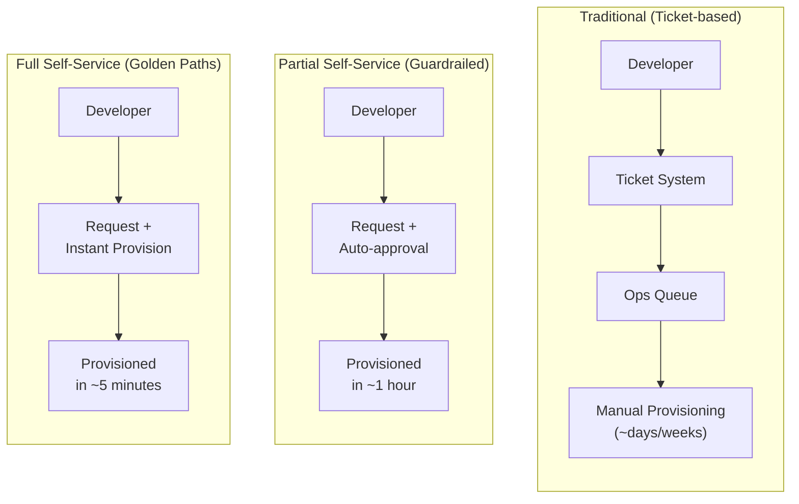
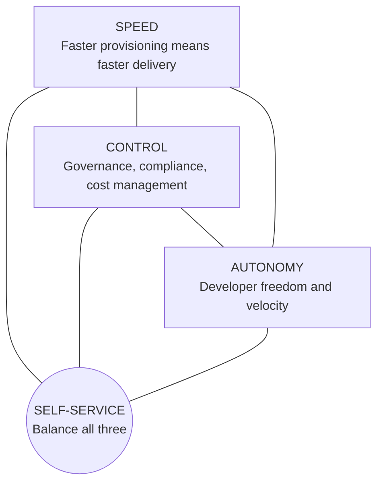
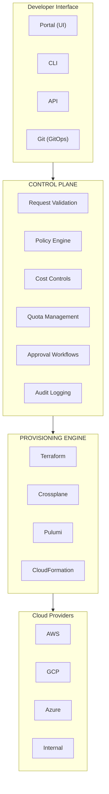
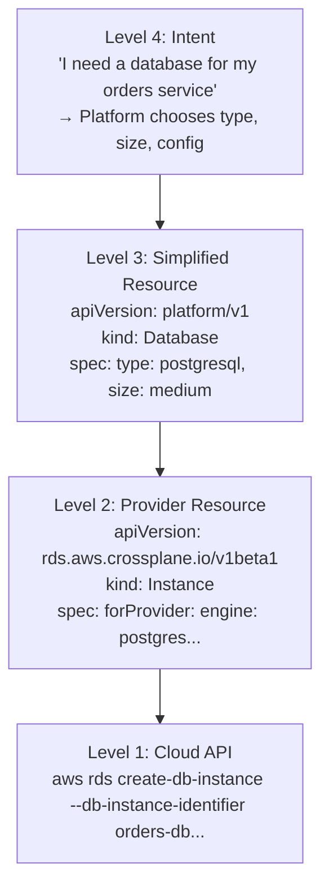
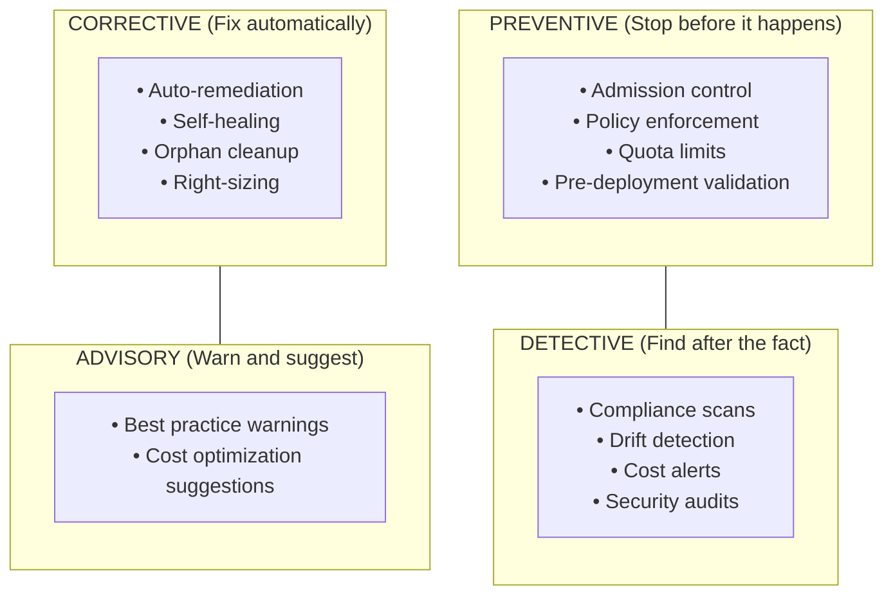
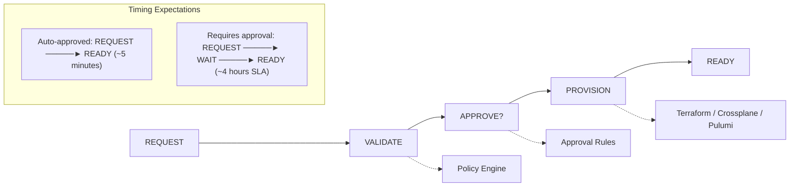
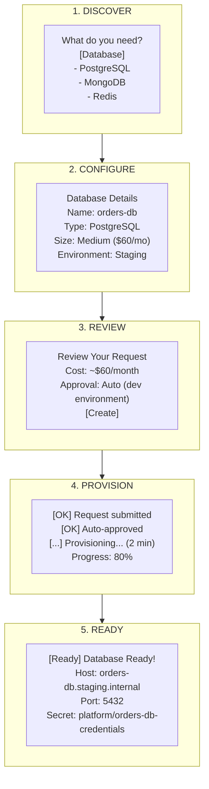
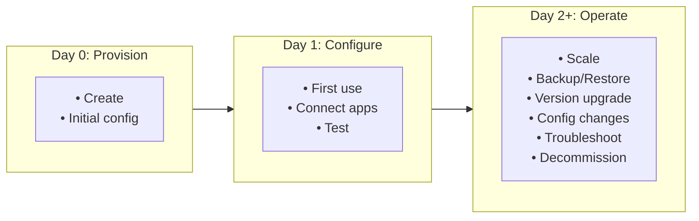
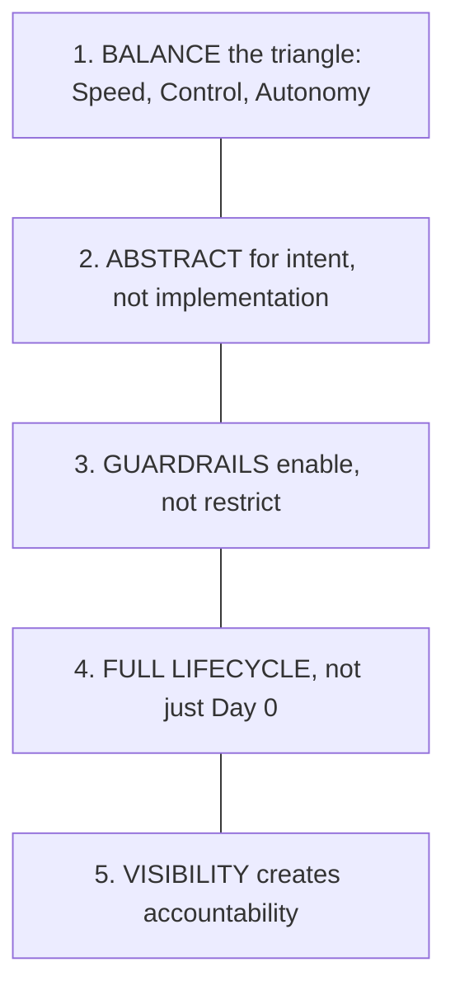

> **Discipline Module** | Complexity: `[COMPLEX]` | Time: 50-60 min

## Prerequisites

Before starting this module, you should:

- Complete [Module 2.1: What is Platform Engineering?](../module-2.1-what-is-platform-engineering/) - Platform foundations
- Complete [Module 2.3: Internal Developer Platforms](../module-2.3-internal-developer-platforms/) - IDP architecture
- Complete [Module 2.4: Golden Paths](../module-2.4-golden-paths/) - Template design
- Understand infrastructure-as-code concepts (Terraform, Pulumi, or similar)
- Familiarity with Kubernetes Custom Resources

## What You'll Be Able to Do

After completing this module, you will be able to:

- **Design self-service infrastructure workflows with appropriate guardrails and approval gates**
- **Implement infrastructure request APIs that provision resources in minutes instead of days**
- **Build policy-as-code controls that enforce organizational standards without blocking developer autonomy**
- **Evaluate self-service adoption patterns to identify gaps in your platform's capabilities**

## Why This Module Matters

The promise of cloud computing was "infrastructure in minutes." The reality for most developers:
- File a ticket
- Wait for approval
- Wait for provisioning
- Get credentials (maybe)
- Repeat when requirements change

Self-service infrastructure makes that promise real. Developers get what they need, when they need it, while organizations maintain governance, cost control, and security.

This module teaches you to build self-service systems that actually work.

## Did You Know?

- **Netflix provisions databases in under 10 minutes** through self-service—the same provisioning used to take 3 weeks with manual processes
- **The term "ClickOps"** describes the anti-pattern of infrastructure managed through cloud console clicks—brittle, unauditable, and error-prone
- **Crossplane**, a CNCF project, enables Kubernetes-style management of any infrastructure through custom resources
- **80% of cloud waste** comes from over-provisioned or orphaned resources—self-service with guardrails can dramatically reduce this

---

## What is Self-Service Infrastructure?

### Definition

**Self-service infrastructure** enables developers to provision, modify, and decommission infrastructure resources through automated systems, without requiring tickets, approvals, or manual intervention from operations teams.



### The Self-Service Triangle



The art of self-service is balancing these three:
- **Too much control** → Slow, ticket-based systems return
- **Too much autonomy** → Cost explosion, security gaps, chaos
- **Speed without governance** → Fast path to technical debt

> **Stop and think**: Consider your current organization. Which of the three points on the triangle is currently prioritized the most, and which one is suffering as a result?

---

## Self-Service Architecture

### The Control Plane Pattern



### Key Components

**1. Developer Interface**

Multiple ways to request infrastructure:

```yaml
# Option 1: Portal UI
# Click-based, guided experience for discovery and occasional use

# Option 2: CLI
$ platform infra create database \
    --type postgresql \
    --size medium \
    --env staging

# Option 3: API
POST /api/v1/infrastructure
{
  "type": "database",
  "provider": "postgresql",
  "size": "medium",
  "environment": "staging"
}

# Option 4: GitOps (Declarative)
# infrastructure/staging/database.yaml
apiVersion: platform.example.com/v1alpha1
kind: PostgreSQLInstance
metadata:
  name: orders-db
  namespace: team-orders
spec:
  size: medium
  version: "15"
```

**2. Control Plane**

The brain that enforces guardrails:

```yaml
# Policy Example (OPA/Rego)
package platform.infrastructure

# Deny databases larger than allowed
deny[msg] {
  input.kind == "PostgreSQLInstance"
  input.spec.size == "xlarge"
  not has_exception(input.metadata.namespace)
  msg := "XLarge databases require architecture review"
}

# Enforce cost tags
deny[msg] {
  not input.metadata.labels["cost-center"]
  msg := "All resources must have cost-center label"
}

# Limit resources per team
deny[msg] {
  team := input.metadata.labels["team"]
  count(resources_by_team[team]) > quota[team]
  msg := sprintf("Team %v has exceeded resource quota", [team])
}
```

**3. Provisioning Engine**

Translates requests into actual infrastructure:

```yaml
# Crossplane Composition Example
apiVersion: apiextensions.crossplane.io/v1
kind: Composition
metadata:
  name: postgresql-standard
spec:
  compositeTypeRef:
    apiVersion: platform.example.com/v1alpha1
    kind: PostgreSQLInstance

  resources:
    # RDS Instance
    - name: rds-instance
      base:
        apiVersion: rds.aws.crossplane.io/v1beta1
        kind: Instance
        spec:
          forProvider:
            engine: postgres
            engineVersion: "15"
            instanceClass: db.t3.medium  # Default
            allocatedStorage: 20
            publiclyAccessible: false
            vpcSecurityGroupIds: []  # Patched
            dbSubnetGroupName: ""    # Patched
          writeConnectionSecretToRef:
            namespace: crossplane-system
      patches:
        # Size to instance class mapping
        - type: FromCompositeFieldPath
          fromFieldPath: spec.size
          toFieldPath: spec.forProvider.instanceClass
          transforms:
            - type: map
              map:
                small: db.t3.micro
                medium: db.t3.medium
                large: db.t3.large

    # Secret for connection details
    - name: connection-secret
      base:
        apiVersion: kubernetes.crossplane.io/v1alpha1
        kind: Object
        spec:
          forProvider:
            manifest:
              apiVersion: v1
              kind: Secret
              metadata:
                namespace: ""  # Patched
```

---

## Infrastructure Abstractions

### The Abstraction Ladder



### Designing Good Abstractions

**Principle 1: Hide Complexity, Expose Intent**

```yaml
# Bad: Exposing too much detail
apiVersion: platform/v1
kind: Database
spec:
  provider: aws
  service: rds
  engine: postgres
  version: "15.2"
  instanceClass: db.t3.medium
  storage:
    type: gp3
    size: 50
    iops: 3000
    throughput: 125
  networking:
    subnetGroup: prod-private
    securityGroups:
      - sg-12345
    publicAccess: false
  backup:
    retentionDays: 7
    window: "03:00-04:00"
  # ... 30 more fields

# Good: Intent-focused
apiVersion: platform/v1
kind: Database
spec:
  type: postgresql       # What kind
  size: medium           # Relative sizing
  environment: staging   # Environment determines many defaults
```

**Principle 2: Sensible Defaults with Override**

```yaml
# Default behaviors (from platform config)
database:
  defaults:
    postgresql:
      version: "15"        # Latest stable
      backup:
        enabled: true
        retention: 7       # days
      encryption: true
      monitoring: enabled

# User only specifies what they need differently
apiVersion: platform/v1
kind: Database
spec:
  type: postgresql
  size: medium
  # Override specific default
  backup:
    retention: 30  # Need longer retention for this one
```

**Principle 3: T-Shirt Sizing**

```yaml
# Define sizes centrally
sizes:
  database:
    postgresql:
      small:
        instanceClass: db.t3.micro
        storage: 20
        connections: 50
        cost: ~$15/month
        useCase: "Development, small apps"

      medium:
        instanceClass: db.t3.medium
        storage: 50
        connections: 200
        cost: ~$60/month
        useCase: "Production, moderate traffic"

      large:
        instanceClass: db.t3.large
        storage: 200
        connections: 500
        cost: ~$150/month
        useCase: "High traffic, data-intensive"

      xlarge:
        instanceClass: db.r5.xlarge
        storage: 500
        connections: 1000
        cost: ~$400/month
        useCase: "Critical systems, requires approval"
```

> **Pause and predict**: If you only offer small, medium, and large T-shirt sizes, what happens when a team genuinely needs an XX-large database for a massive event? A robust abstraction always provides an "escape hatch" or a clearly documented exception process for advanced use cases.

---

## Guardrails and Governance

### Types of Guardrails



### Implementing Policy Guardrails

**Using OPA Gatekeeper (Kubernetes):**

```yaml
# Constraint Template: Define the policy type
apiVersion: templates.gatekeeper.sh/v1
kind: ConstraintTemplate
metadata:
  name: k8sresourcequota
spec:
  crd:
    spec:
      names:
        kind: K8sResourceQuota
      validation:
        openAPIV3Schema:
          properties:
            maxCpu:
              type: string
            maxMemory:
              type: string

  targets:
    - target: admission.k8s.gatekeeper.sh
      rego: |
        package k8sresourcequota

        violation[{"msg": msg}] {
          container := input.review.object.spec.containers[_]
          cpu_requested := container.resources.requests.cpu
          max_cpu := input.parameters.maxCpu
          to_number(cpu_requested) > to_number(max_cpu)
          msg := sprintf("Container %v requests %v CPU, max allowed is %v",
                        [container.name, cpu_requested, max_cpu])
        }

---
# Constraint: Apply the policy
apiVersion: constraints.gatekeeper.sh/v1beta1
kind: K8sResourceQuota
metadata:
  name: max-cpu-per-container
spec:
  match:
    kinds:
      - apiGroups: [""]
        kinds: ["Pod"]
    namespaces: ["team-*"]
  parameters:
    maxCpu: "2"
    maxMemory: "4Gi"
```

**Using Crossplane Composition Validation:**

```yaml
# Composition with built-in guardrails
apiVersion: apiextensions.crossplane.io/v1
kind: Composition
metadata:
  name: database-with-guardrails
spec:
  compositeTypeRef:
    apiVersion: platform.example.com/v1alpha1
    kind: Database

  # Pipeline mode with validation functions
  mode: Pipeline
  pipeline:
    # Step 1: Validate request
    - step: validate
      functionRef:
        name: function-validation
      input:
        apiVersion: validation.fn.crossplane.io/v1beta1
        kind: Validate
        rules:
          - name: size-limit
            condition: |
              spec.size in ["small", "medium", "large"]
            message: "Size must be small, medium, or large"

          - name: production-requires-backup
            condition: |
              spec.environment != "production" ||
              (spec.backup != null && spec.backup.enabled == true)
            message: "Production databases must have backups enabled"

    # Step 2: Provision if validation passes
    - step: provision
      functionRef:
        name: function-go-templating
```

> **Pause and predict**: If you only implement detective guardrails (like nightly cost reports), how might developers react when they are asked to delete resources they spent all week configuring?

### Cost Guardrails

```yaml
# Budget Policies
apiVersion: platform/v1
kind: BudgetPolicy
metadata:
  name: team-orders-budget
spec:
  target:
    team: team-orders

  limits:
    monthly:
      soft: 5000   # Warn at $5k
      hard: 7500   # Block at $7.5k

  actions:
    onSoftLimit:
      - notify:
          channels: [slack, email]
          message: "Team orders approaching budget limit"

    onHardLimit:
      - notify:
          channels: [slack, email, pagerduty]
      - policy: block-new-resources
        exceptions:
          - critical-incidents
          - approved-by: platform-team

  tracking:
    granularity: daily
    breakdown: [service, resource-type, environment]
```

### Quota Management

```yaml
# Team Quotas
apiVersion: platform/v1
kind: ResourceQuota
metadata:
  name: team-orders-quota
spec:
  team: team-orders

  environments:
    development:
      databases: 3
      caches: 2
      queues: 2
      storage: 100Gi

    staging:
      databases: 2
      caches: 1
      queues: 2
      storage: 50Gi

    production:
      databases: 5
      caches: 3
      queues: 5
      storage: 500Gi

  overrides:
    # Temporary increase for migration
    - until: "2024-06-01"
      environment: production
      databases: 8
      reason: "Database migration project"
      approvedBy: "platform-team"
```

---

## Self-Service Workflows

### The Request Lifecycle



### Approval Strategies

**Strategy 1: Risk-Based Approval**

```yaml
# approval-policy.yaml
apiVersion: platform/v1
kind: ApprovalPolicy
metadata:
  name: infrastructure-approvals
spec:
  rules:
    # Low risk: Auto-approve
    - name: dev-environment
      conditions:
        - field: spec.environment
          operator: equals
          value: development
        - field: spec.cost.monthly
          operator: lessThan
          value: 50
      approval: automatic

    # Medium risk: Single approver
    - name: staging-environment
      conditions:
        - field: spec.environment
          operator: equals
          value: staging
      approval:
        type: single
        from:
          - role: team-lead
          - role: platform-engineer

    # High risk: Multiple approvers
    - name: production-database
      conditions:
        - field: spec.environment
          operator: equals
          value: production
        - field: kind
          operator: equals
          value: Database
      approval:
        type: all
        required: 2
        from:
          - role: team-lead
          - role: dba
          - role: security

    # Very high risk: Review board
    - name: large-infrastructure
      conditions:
        - field: spec.cost.monthly
          operator: greaterThan
          value: 1000
      approval:
        type: quorum
        required: 3
        from:
          - group: architecture-board
```

**Strategy 2: Time-Based Auto-Approval**

```yaml
# If no response in X hours, auto-approve (for low-risk items)
approvalPolicy:
  lowRisk:
    autoApproveAfter: 4h
    notify:
      - slack: #platform-requests
      - email: approvers@company.com

  mediumRisk:
    autoApproveAfter: 24h
    escalateAfter: 8h

  highRisk:
    autoApproveAfter: never
    escalateAfter: 4h
```

### Self-Service Portal Flow



---

## Lifecycle Management

### Day 2 Operations

Self-service doesn't stop at provisioning:



**Self-Service Operations:**

```yaml
# Scaling
$ platform infra scale orders-db --size large
Scaling orders-db from medium to large...
[OK] Approved (within quota)
[OK] Scaling in progress (maintenance window: 2:00 AM)
[OK] Estimated completion: ~15 minutes

# Backup/Restore
$ platform infra backup create orders-db --name pre-migration
Creating backup pre-migration...
[OK] Backup created: s3://backups/orders-db/pre-migration

$ platform infra backup restore orders-db --from pre-migration --target orders-db-restore
Restoring to new instance orders-db-restore...
[OK] Restore complete

# Version Upgrade
$ platform infra upgrade orders-db --version 16
Pre-upgrade checks:
[OK] Compatible application versions
[OK] Backup exists (less than 24h old)
[Warning] Breaking changes in PG16: [link to docs]

Schedule upgrade for maintenance window? [Y/n]

# Decommission
$ platform infra delete orders-db
This will permanently delete orders-db and all data.
Type 'orders-db' to confirm: orders-db
[OK] Final backup created
[OK] Dependent services notified
[OK] Resource deleted
[OK] Cost allocation updated
```

> **Stop and think**: How does your organization currently handle the decommissioning of old infrastructure? Is it an automated process, or does it rely on someone remembering to click delete?

### Orphan Detection and Cleanup

```yaml
# Orphan Detection Policy
apiVersion: platform/v1
kind: OrphanPolicy
metadata:
  name: detect-orphaned-resources
spec:
  detectionRules:
    # No traffic for 30 days
    - name: unused-databases
      type: Database
      condition:
        metric: connections_per_day
        threshold: 0
        duration: 30d
      action:
        - notify:
            owner: true
            message: "Database has had no connections for 30 days"
        - label:
            orphan-candidate: "true"

    # No owner team exists
    - name: ownerless-resources
      condition:
        label: team
        teamExists: false
      action:
        - notify:
            channel: "#platform-orphans"
        - assignTo: platform-team

  cleanupPolicy:
    # After 60 days of no activity and notification
    gracePeriod: 60d
    actions:
      - backup
      - delete
    requireApproval: true
```

---

## War Story: The $2M Wake-Up Call

> **"Self-Service Without Guardrails"**
>
> A fast-growing startup gave developers full AWS access to move quickly. Their platform team's motto: "Trust the developers."
>
> Six months later:
> - 847 EC2 instances running (they needed ~200)
> - 156 RDS databases (many duplicates, test instances never deleted)
> - $2.1M monthly cloud bill (budget was $400K)
> - No one knew what half the resources were for
>
> The forensics revealed:
> - Test environments never cleaned up: "I'll delete it later"
> - Over-provisioned "just in case": "Make it big, we might need it"
> - Duplicate resources: "Easier to create new than find existing"
> - Shadow resources: "I needed it for a demo"
>
> **The Fix (6 months to implement):**
>
> 1. **Resource tagging required**: No tag, no provision
>    ```yaml
>    required_tags:
>      - team
>      - project
>      - environment
>      - cost-center
>      - expiry-date  # For non-prod
>    ```
>
> 2. **Auto-expiry for non-production**: Default 30-day TTL
>    ```yaml
>    non_prod_defaults:
>      ttl: 30d
>      extendable: true
>      max_extensions: 3
>    ```
>
> 3. **Right-sizing recommendations**: Weekly reports
>    ```
>    Resource: web-server-prod
>    Current: m5.2xlarge ($280/mo)
>    Recommended: m5.large ($70/mo)
>    Utilization: CPU 12%, Memory 23%
>    Potential savings: $210/mo
>    ```
>
> 4. **Budget alerts with teeth**: Soft limits warn, hard limits block
>
> 5. **Orphan hunting**: Weekly sweep, 60-day grace period
>
> **Results after 1 year:**
> - Cloud bill: $580K/month (down from $2.1M)
> - Resource count: 312 (down from 847 EC2 alone)
> - Developer satisfaction: Actually higher (less confusion)
>
> **Lesson**: Self-service without guardrails isn't freedom—it's chaos that eventually requires painful cleanup.

---

## Implementation Approaches

> **Stop and think**: Which of the three implementation approaches (Crossplane, Terraform/Atlantis, Internal API) best fits your team's current skill set and existing infrastructure footprint?

### Approach 1: Crossplane (Kubernetes-Native)

```yaml
# Composite Resource Definition
apiVersion: apiextensions.crossplane.io/v1
kind: CompositeResourceDefinition
metadata:
  name: xdatabases.platform.example.com
spec:
  group: platform.example.com
  names:
    kind: XDatabase
    plural: xdatabases
  claimNames:
    kind: Database
    plural: databases
  versions:
    - name: v1alpha1
      served: true
      referenceable: true
      schema:
        openAPIV3Schema:
          type: object
          properties:
            spec:
              type: object
              required:
                - type
                - size
              properties:
                type:
                  type: string
                  enum: [postgresql, mysql, mongodb]
                size:
                  type: string
                  enum: [small, medium, large]
                version:
                  type: string
                backup:
                  type: object
                  properties:
                    enabled:
                      type: boolean
                      default: true
                    retentionDays:
                      type: integer
                      default: 7
            status:
              type: object
              properties:
                host:
                  type: string
                port:
                  type: integer
                secretName:
                  type: string
                status:
                  type: string

---
# User just creates this
apiVersion: platform.example.com/v1alpha1
kind: Database
metadata:
  name: orders-db
  namespace: team-orders
spec:
  type: postgresql
  size: medium
```

### Approach 2: Terraform with Atlantis

```hcl
# modules/database/main.tf
variable "name" {
  type = string
}

variable "size" {
  type = string
  validation {
    condition     = contains(["small", "medium", "large"], var.size)
    error_message = "Size must be small, medium, or large."
  }
}

variable "environment" {
  type = string
}

locals {
  size_map = {
    small  = "db.t3.micro"
    medium = "db.t3.medium"
    large  = "db.t3.large"
  }
}

resource "aws_db_instance" "main" {
  identifier     = var.name
  instance_class = local.size_map[var.size]
  engine         = "postgres"
  engine_version = "15"

  # Security defaults
  storage_encrypted   = true
  deletion_protection = var.environment == "production"

  # Networking (from environment)
  db_subnet_group_name   = data.aws_db_subnet_group.main.name
  vpc_security_group_ids = [data.aws_security_group.database.id]

  tags = {
    Name        = var.name
    Environment = var.environment
    ManagedBy   = "terraform"
  }
}
```

```yaml
# atlantis.yaml - GitOps workflow
version: 3
projects:
  - name: team-orders-database
    dir: infrastructure/team-orders
    workflow: database
    autoplan:
      when_modified: ["*.tf"]
      enabled: true

workflows:
  database:
    plan:
      steps:
        - run: terraform init
        - run: |
            # Policy check before plan
            conftest test . --policy ../policies/
        - plan

    apply:
      steps:
        - run: |
            # Final validation
            terraform validate
        - apply
```

### Approach 3: Internal Platform API

```python
# platform_api/resources/database.py
from fastapi import APIRouter, Depends, HTTPException
from pydantic import BaseModel
from typing import Literal

router = APIRouter()

class DatabaseRequest(BaseModel):
    name: str
    type: Literal["postgresql", "mysql", "mongodb"]
    size: Literal["small", "medium", "large"]
    environment: Literal["development", "staging", "production"]
    team: str

class DatabaseResponse(BaseModel):
    id: str
    status: str
    host: str | None
    port: int | None
    secret_name: str | None

@router.post("/databases", response_model=DatabaseResponse)
async def create_database(
    request: DatabaseRequest,
    user = Depends(get_current_user),
    policy_engine = Depends(get_policy_engine),
    provisioner = Depends(get_provisioner)
):
    # 1. Validate against policies
    policy_result = await policy_engine.evaluate(
        action="create",
        resource_type="database",
        request=request,
        user=user
    )
    if not policy_result.allowed:
        raise HTTPException(403, policy_result.reason)

    # 2. Check quotas
    quota_result = await check_quota(user.team, "database")
    if quota_result.exceeded:
        raise HTTPException(429, f"Quota exceeded: {quota_result.message}")

    # 3. Determine if approval needed
    approval = await get_approval_requirement(request, user)
    if approval.required:
        return await create_pending_request(request, approval)

    # 4. Provision
    result = await provisioner.create_database(request)

    # 5. Audit log
    await audit_log.record(
        action="database.create",
        user=user.id,
        resource=result.id,
        request=request.dict()
    )

    return result
```

---

## Common Mistakes

| Mistake | Why It Happens | Better Approach |
|---------|---------------|-----------------|
| **No guardrails** | Fear of slowing down developers | Start with lightweight guardrails, add more based on incidents |
| **Too many guardrails** | Overcorrection from past incidents | Focus on high-impact policies, automate the rest |
| **Manual approvals for everything** | Risk aversion | Risk-based approval tiers |
| **No cost visibility** | "Cloud is infinite" mindset | Show costs at request time, enable team accountability |
| **Day 0 only** | Provisioning is the "fun" part | Day 2 operations are where value is realized |
| **One size fits all** | Simplicity over usability | Different abstractions for different needs |
| **No feedback loop** | Build it and move on | Track usage, gather feedback, iterate |
| **Ignoring existing IaC** | Greenfield thinking | Support existing Terraform/Pulumi alongside new abstractions |

---

## Quiz

Test your understanding of self-service infrastructure:

**Question 1**: Your platform team recently launched a self-service portal that gives developers full AWS access. Within weeks, cloud costs tripled due to over-provisioned resources. When you tried to revoke access, developers complained that the old ticket system was too slow. Which fundamental self-service framework is your team failing to balance?

<details>
<summary>Show Answer</summary>

The **Self-Service Triangle** (Speed, Control, Autonomy).
Your team over-indexed on **Autonomy** (giving full AWS access) and **Speed** (removing tickets), but completely neglected **Control** (governance and cost management). This imbalance naturally leads to cost explosions and security risks because developers will optimize for their immediate needs rather than organizational constraints. If you swing too far back to Control by revoking access and bringing back tickets, you sacrifice Speed and Autonomy, leading to frustrated developers. A successful platform balances all three pillars by providing guardrailed abstractions (like predefined instance sizes) that maintain velocity without sacrificing governance.
</details>

**Question 2**: You've built an incredible API that provisions an RDS database with complete security compliance in exactly 3 minutes. Developers love it. Six months later, you notice your team's support queue is full of tickets asking to resize databases, restore from backups, and update PostgreSQL versions. What self-service principle did you miss?

<details>
<summary>Show Answer</summary>

You missed the critical importance of **Day 2 operations** in your self-service platform design.
Infrastructure spends the vast majority of its lifecycle in the "Operate" phase (Day 2+), far beyond initial provisioning. If you only build self-service capabilities for Day 0 (Provisioning), developers will still be blocked by operations ticket queues whenever they need to scale, troubleshoot, or upgrade their resources. True self-service requires building APIs and UI flows for the entire lifecycle, ensuring that developers can maintain and eventually decommission their own infrastructure.
</details>

**Question 3**: After a rapid hiring phase, your company discovers 400 orphaned test environments running in AWS, costing over $50,000 a month. The platform team wants to implement strict approval workflows for every new environment to stop the bleeding, but engineering leadership refuses to slow down deployments. How can you implement guardrails that solve the cost issue without adding manual approvals?

<details>
<summary>Show Answer</summary>

You should implement a combination of **automated lifecycle policies and tagging requirements** directly in the provisioning layer.
Manual approvals are an anti-pattern that slows down velocity and eventually becomes a rubber-stamp process anyway. Instead, enforce mandatory tagging (e.g., `owner`, `environment`, `expiry-date`) at provision time as a preventive guardrail. Combine this with a detective guardrail: an automated script that scans for non-production resources older than 30 days and deletes them automatically after a Slack warning. This approach maintains high speed and autonomy for developers while regaining complete control over cloud costs.
</details>

**Question 4**: Your compliance team requires all databases to have encrypted storage. You could write an OPA Gatekeeper policy to block any unencrypted database request before it reaches Kubernetes, or you could run a nightly script that scans AWS for unencrypted databases and pages the owner. What are these two approaches called, and which should you prefer?

<details>
<summary>Show Answer</summary>

These represent **preventive** (blocking before creation) and **detective** (finding after the fact) guardrails, respectively.
The Gatekeeper policy is a preventive guardrail because it stops the non-compliant action at the API layer before any resources are actually created. The nightly scan is a detective guardrail because it identifies violations after they exist in the environment. You should strongly prefer preventive guardrails for known compliance requirements, as they stop issues at the source and provide immediate, actionable feedback to developers. Detective guardrails should be retained as a secondary safety net for complex, emerging, or hard-to-prevent issues like configuration drift or manual console changes.
</details>

**Question 5**: A senior developer argues that your new Internal Developer Platform is useless because they already know how to write Terraform for AWS. They want the platform portal to just accept raw Terraform modules instead of your simplified "Database" YAML resource. Why should you insist on using your simplified abstraction?

<details>
<summary>Show Answer</summary>

Because abstractions hide complexity, enforce secure defaults, and focus on the developer's underlying **intent**.
Exposing raw cloud APIs or raw Terraform forces developers to understand dozens of provider-specific configurations, such as VPC subnets, security groups, and storage IOPS. By providing a simplified "Database" resource (Level 3 abstraction), the platform can automatically inject organizational standards like networking routing and encryption without the developer needing to configure them. This reduces cognitive load for developers and ensures consistency and security across the entire organization, even for those who aren't infrastructure experts.
</details>

---

## Hands-On Exercise

### Scenario

Your organization currently has a ticket-based system for database provisioning:
- Average time to provision: 5 days
- 60% of requests are for PostgreSQL in development
- Common complaints: "too slow", "don't know the status", "can't resize easily"
- Security finding: 30% of databases missing encryption

### Part 1: Design the Abstraction (15 minutes)

Design a simplified database API:

```yaml
# What fields does the developer specify?
apiVersion: platform.example.com/v1alpha1
kind: Database
metadata:
  name: ???
spec:
  # Required fields:
  ???

  # Optional fields with defaults:
  ???
```

Document your decisions:
- What options do you expose?
- What do you hide/default?
- How do you handle the encryption requirement?

### Part 2: Define Guardrails (15 minutes)

Create policies for your self-service database:

```yaml
# Policy: What checks run before provisioning?
validation_policies:
  - name: ???
    rule: ???

# Policy: What requires approval?
approval_policies:
  - name: ???
    condition: ???
    approvers: ???

# Policy: What limits apply?
quota_policies:
  - name: ???
    limit: ???
```

### Part 3: Lifecycle Operations (10 minutes)

Design the Day 2 self-service operations:

```bash
# What commands should developers have?
$ platform database ???

# Example operations:
# - Scale to larger size
# - Create backup
# - Restore from backup
# - Check status
# - Delete (with safeguards)
```

### Success Criteria

Your design should:
- [ ] Reduce provisioning time from 5 days to <15 minutes for standard requests
- [ ] Enforce encryption on all databases (the 30% gap is closed)
- [ ] Allow developers to manage their databases independently
- [ ] Provide appropriate controls for production environments
- [ ] Enable cost visibility and accountability

---

## Summary

Self-service infrastructure transforms how organizations deliver:



The goal isn't to give developers AWS root access—it's to give them what they need to be productive while keeping the organization safe, compliant, and cost-effective.

---

## Further Reading

### Tools
- [Crossplane](https://crossplane.io/) - Kubernetes-native infrastructure orchestration
- [Backstage](https://backstage.io/) - Developer portal with self-service templates
- [Atlantis](https://www.runatlantis.io/) - GitOps for Terraform
- [Open Policy Agent](https://www.openpolicyagent.org/) - Policy as code

### Articles
- [Infrastructure Self-Service at Scale](https://www.hashicorp.com/resources/self-service-infrastructure-terraform)
- [Crossplane: Infrastructure as Code the Kubernetes Way](https://crossplane.io/docs/)
- [Platform Engineering and Self-Service](https://platformengineering.org/)

### Books
- *Infrastructure as Code* - Kief Morris
- *Cloud Native Infrastructure* - Justin Garrison & Kris Nova

---

## Next Module

Continue to [Module 2.6: Platform Maturity](../module-2.6-platform-maturity/) to learn how to assess your platform's maturity level and plan a roadmap for improvement.