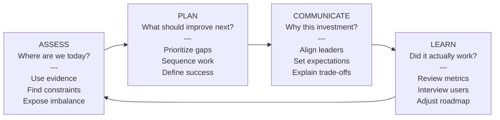
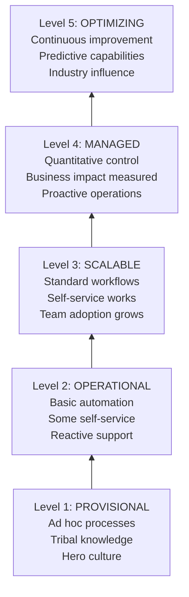
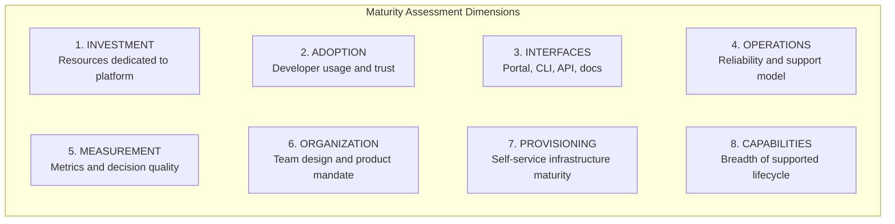
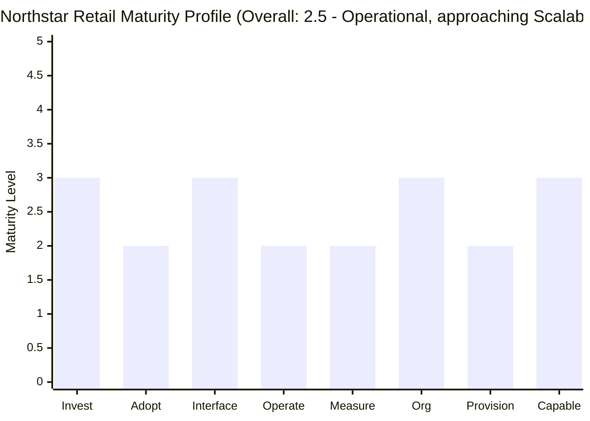
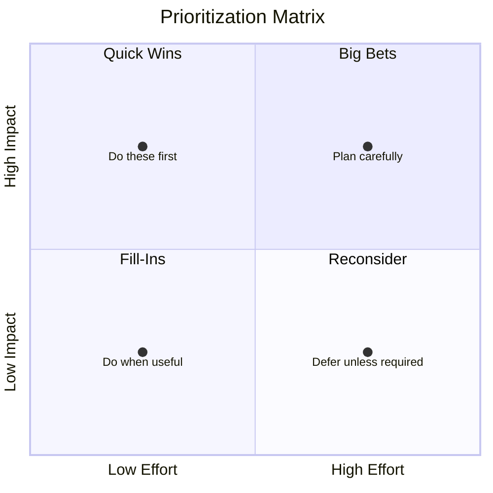
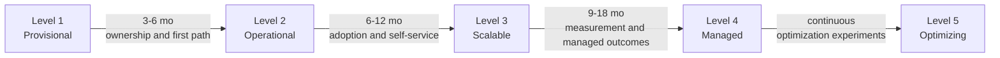
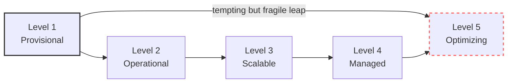

> **Discipline Module** | Complexity: `[MEDIUM]` | Time: 55-70 min

## Prerequisites

Before starting this module, you should be comfortable with the platform engineering foundations from the earlier modules in this track. Platform maturity is not a standalone topic; it is the discipline of evaluating whether the developer experience, internal developer platform, golden paths, and self-service capabilities are becoming a coherent product that engineers trust.

- Complete [Module 2.1: What is Platform Engineering?](../module-2.1-what-is-platform-engineering/) so you can distinguish a platform from a pile of shared infrastructure.
- Complete [Module 2.2: Developer Experience](../module-2.2-developer-experience/) so you can reason about friction, satisfaction, flow, and cognitive load.
- Complete [Module 2.3: Internal Developer Platforms](../module-2.3-internal-developer-platforms/) so you understand the portal, catalog, API, template, and workflow layers.
- Complete [Module 2.4: Golden Paths](../module-2.4-golden-paths/) so you can connect maturity to supported paved roads rather than isolated tools.
- Complete [Module 2.5: Self-Service Infrastructure](../module-2.5-self-service-infrastructure/) so you can assess whether infrastructure access is becoming repeatable, safe, and developer-owned.
- Bring one real or realistic platform case to mind, such as your current company, a previous employer, a client platform, or a public engineering organization you can reason about from talks and documentation.

## Learning Outcomes

After completing this module, you will be able to:

- **Evaluate** a platform's maturity across investment, adoption, interfaces, operations, measurement, organization, provisioning, and capability breadth using evidence instead of team optimism.
- **Diagnose** which maturity dimension is constraining platform value when technical capability, developer adoption, and operational behavior do not move together.
- **Design** a quarter-by-quarter platform roadmap that improves the weakest high-impact dimensions before adding advanced capabilities.
- **Compare** leading and lagging platform metrics, then choose a balanced measurement set that supports both early warning and executive decision-making.
- **Justify** maturity recommendations to senior stakeholders by connecting platform work to developer productivity, reliability, risk reduction, and business outcomes.

## Why This Module Matters

A platform team at a growing fintech had every visible sign of progress: a polished developer portal, Kubernetes clusters running modern add-ons, GitOps delivery, service templates, and a confident roadmap. Executives saw demos and assumed the company had a mature platform. Six months later, product teams were still creating their own pipelines, security exceptions were handled in Slack, and the platform team was surprised that adoption had barely moved.

The problem was not that the team lacked skill. The problem was that they confused capability with maturity. A platform can look advanced while remaining immature if the interfaces are unused, the operating model is reactive, the provisioning flow still requires tickets, or nobody can show whether developers are actually faster. Maturity is not a trophy for having fashionable tools; it is an evidence-backed picture of how consistently the platform helps teams deliver software safely.

Senior platform engineers need this skill because platform work competes for scarce organizational attention. Without a maturity model, every conversation becomes a negotiation based on anecdotes: one team says the platform is excellent, another says it is unusable, leadership asks for ROI too early, and the platform team tries to satisfy everyone by building more. A maturity model gives the organization a shared language for current state, target state, trade-offs, and sequencing.

The goal of this module is not to push every organization toward a mythical Level 5. Many companies get excellent results at a stable Level 3 or Level 4. The goal is to teach you how to assess honestly, identify the real constraint, and choose improvements that compound rather than creating a beautiful platform nobody uses.

## Core Content

## 1. Maturity Is a Decision Tool, Not a Status Badge

A maturity model is useful only when it changes decisions. If the model is used to decorate a quarterly review, people will inflate scores, hide awkward gaps, and treat the final number as a political weapon. If the model is used as a diagnostic tool, it helps teams decide where to invest next, what risks to accept, and which improvements need evidence before they deserve more budget.

The most common mistake is treating maturity as a single ladder that every team climbs at the same pace. Real platforms are uneven. A company might have Level 4 investment, Level 3 interfaces, Level 2 adoption, and Level 1 measurement. Averaging those numbers is helpful, but the shape of the profile matters more than the average because the weakest dimensions often explain why value is not appearing.

A second mistake is assuming that maturity always means more automation. Automation can be valuable, but automation without adoption creates unused machinery, and automation without operational accountability creates brittle systems that fail faster. Mature platforms combine product thinking, reliable operations, usable interfaces, sensible guardrails, measurable outcomes, and continuous learning.



The loop matters because a platform is never finished. New application architectures appear, Kubernetes versions move forward, teams reorganize, security requirements tighten, and product pressure changes. A mature platform team does not freeze a score once a year; it reassesses regularly and uses the assessment to drive learning.

> **Active learning prompt:** Think about a platform you know. If leadership asked the platform team to prove maturity tomorrow, would the team show tool screenshots, adoption data, reliability data, developer feedback, or business outcomes? The answer tells you which evidence muscle is strongest and which one may be missing.

| Maturity Use | Weak Version | Strong Version |
|--------------|--------------|----------------|
| Current-state assessment | "We feel like Level 3 because the portal exists." | "Adoption is Level 2 because only thirty percent of standard workloads use the portal-created path." |
| Roadmap planning | "Build multi-cloud because it sounds strategic." | "Improve provisioning and adoption first because self-service failure blocks every other capability." |
| Executive communication | "Trust us; platforms take time." | "We are in the J-curve phase, and these leading indicators show whether adoption is bending upward." |
| Team learning | "The score is disappointing, so defend the work." | "The score shows the constraint, so use it to choose the next experiment." |

Maturity assessment is also a language for expectation management. A Level 2 platform usually cannot produce clean platform ROI because adoption is fragmented and manual work still surrounds automated pieces. A Level 4 platform should be able to show stronger business impact because adoption, measurement, and operational discipline have matured enough for the value to be visible.

## 2. The Five Maturity Levels

The five-level model gives you a rough map from chaotic beginnings to continuous improvement. The levels are not certifications, and they are not moral judgments. They describe patterns of behavior that appear when a platform moves from individual heroics toward a dependable product used by many teams.



Most organizations do not move cleanly from one level to the next across every dimension. They progress in pockets. A strong platform leader uses the levels to find the next useful step, not to shame teams for the natural messiness of growth.

### Level 1: Provisional

At Level 1, the organization has tools but not yet a platform. Workflows depend on individual knowledge, scripts live in scattered repositories, and deployment advice often includes a person's name. The platform team may not exist as a dedicated group; instead, infrastructure-minded engineers fill gaps while also carrying product responsibilities.

```yaml
level: 1
name: Provisional
dominant_pattern: "Heroic effort keeps delivery working"
process: "Ad hoc and different across teams"
automation: "Local scripts, manual handoffs, undocumented conventions"
documentation: "Stale, missing, or trusted less than Slack"
support_model: "Interrupt-driven help from a few experts"
self_service: "Mostly absent; requests become tickets or favors"
typical_risk: "Delivery depends on individuals rather than repeatable systems"
```

The teaching point at this level is that the first maturity step is not buying a portal. The first step is usually discovering what people actually do, documenting the most common path, and creating one narrow workflow that works reliably. Platform teams that skip this discovery often automate a fantasy version of delivery rather than the real one.

A practical Level 1 assessment should collect evidence from deployment histories, onboarding experiences, ticket queues, and interviews. Ask how a new service reaches production, how secrets are requested, how observability is configured, and how a team learns whether it followed the expected path. If the answer changes by team or depends on one senior engineer, the process is still provisional.

### Level 2: Operational

At Level 2, a recognizable platform exists, but it is still basic and uneven. There may be CI/CD, a standard deployment path, a portal prototype, or a small set of templates. Some teams use the platform successfully, but many edge cases still require tickets, platform engineers still spend a large share of time reacting, and documentation often lags implementation.

```yaml
level: 2
name: Operational
dominant_pattern: "Some workflows are repeatable, but the platform team remains reactive"
process: "Defined for common cases and inconsistent for non-standard cases"
automation: "Useful automation exists, but gaps require manual coordination"
documentation: "Available, but developers still rely heavily on direct questions"
support_model: "Dedicated team with a growing request backlog"
self_service: "Limited to the first few high-volume workflows"
typical_risk: "The platform looks real but does not yet scale with adoption"
```

Level 2 is where platform teams frequently overpromise. Demos look good because the happy path works, but production reality includes migrations, legacy services, unusual stacks, compliance exceptions, and developers who do not have time to decode platform conventions. A mature Level 2 team admits these gaps and chooses the next few workflows carefully.

The key transition challenge is moving from "the platform can do this" to "most teams can use this without help." That requires interface design, migration support, documentation, feedback loops, and operational SLOs. It also requires refusing some shiny work until the core paths are dependable.

### Level 3: Scalable

At Level 3, the platform becomes the normal path for standard workloads. Developers can create services, provision common dependencies, ship changes, and get baseline observability without waiting on bespoke support. The platform team still handles edge cases, but its time shifts toward improving product capabilities rather than answering the same requests repeatedly.

```yaml
level: 3
name: Scalable
dominant_pattern: "Self-service works for standard cases and adoption compounds"
process: "Standardized, documented, and trusted by most teams"
automation: "Covers the common software lifecycle from creation through production"
documentation: "Current enough that developers can solve routine problems"
support_model: "Enablement-oriented with ticket trends under control"
self_service: "Works for most common provisioning and deployment needs"
typical_risk: "Success creates pressure to support every edge case too soon"
```

A Level 3 platform usually has a service catalog, golden paths for common workload types, clear ownership metadata, standard deployment workflows, observability defaults, and guardrails that prevent common mistakes. It also has a product operating rhythm: roadmap, feedback intake, release notes, support review, and adoption analysis. The platform is no longer just infrastructure; it is a product with users.

The senior-level nuance is that Level 3 does not mean "all teams must use everything." Forced adoption can damage trust if the platform is not ready for all scenarios. A better pattern is default adoption for supported cases, explicit exception handling for unsupported cases, and a roadmap that turns recurring exceptions into future platform capabilities.

### Level 4: Managed

At Level 4, the platform is quantitatively managed. The organization can connect platform adoption to engineering outcomes, reliability behavior, cost control, security posture, and delivery speed. Decisions are driven by evidence, not by the loudest team or the most impressive demo.

```yaml
level: 4
name: Managed
dominant_pattern: "The platform is operated as a strategic product with measured outcomes"
process: "Optimized through regular review and data-informed prioritization"
automation: "Proactive guardrails and self-healing patterns reduce preventable toil"
documentation: "Generated or maintained close to source systems"
support_model: "Low-friction escalation with strong prevention work"
self_service: "Broad coverage with intelligent defaults and policy-aware workflows"
typical_risk: "Metric confidence can hide qualitative developer frustration"
```

Level 4 is where ROI conversations become more credible. Because adoption is high enough and measurement is disciplined enough, the platform team can compare platform-adopting and non-adopting services, estimate time saved, show reduced incident rates, and connect guardrails to prevented security or compliance work. This does not remove all uncertainty, but it gives leaders better evidence than slogans.

The danger at Level 4 is metric myopia. Teams can become so focused on dashboards that they stop listening to developers. A managed platform still needs interviews, office hours, usability testing, and embedded work with teams that struggle. Numbers tell you where to look; they do not replace fieldwork.

### Level 5: Optimizing

At Level 5, the platform continuously improves and may influence the wider industry. The platform can anticipate needs, recommend optimizations, detect emerging risks, and help shape organizational strategy. Few organizations need to live at this level across all dimensions, and attempting it too early often creates waste.

```yaml
level: 5
name: Optimizing
dominant_pattern: "The platform improves continuously and anticipates developer needs"
process: "Experiment-driven with fast feedback and strategic influence"
automation: "Predictive, adaptive, and supported by high-quality operational data"
documentation: "Contextual and deeply integrated into workflows"
support_model: "Routine needs are handled through self-service and learning systems"
self_service: "Anticipatory provisioning and optimization suggestions"
typical_risk: "Overengineering sophisticated systems for problems that are still basic"
```

A useful Level 5 platform might recommend right-sized infrastructure based on historical usage, identify services likely to violate SLOs after a dependency change, or suggest migration steps when a team falls behind supported templates. Those capabilities require clean data, broad adoption, stable interfaces, and trust. Without those foundations, predictive features become expensive guesses.

The practical takeaway is simple: do not chase Level 5 because it sounds impressive. Chase the level that solves your organization's current constraint. If teams cannot provision a database without a ticket, predictive infrastructure is not the next problem to solve.

## 3. The Eight Assessment Dimensions

A single maturity score hides too much. The eight-dimension assessment gives you a profile that explains why the platform is or is not delivering value. Each dimension captures a different part of the system, and the profile helps you see imbalance before it becomes waste.



The dimensions are intentionally interdependent. Adoption depends on interfaces, provisioning, and trust. Measurement depends on instrumentation and organizational discipline. Capabilities depend on investment, but capability breadth without adoption can become unused inventory. Operations depends on engineering skill, but also on whether the organization funds reliability work instead of only feature work.

### Dimension 1: Investment

Investment measures whether the organization has committed enough people, time, and budget for platform work to be more than a side project. This includes engineers, product management, design, enablement, documentation, and operational ownership. A platform team with no dedicated capacity can still do useful work, but it cannot honestly claim high maturity.

| Level | Investment Characteristics |
|-------|----------------------------|
| **1** | No dedicated platform team; infrastructure work is a side project done between product commitments. |
| **2** | Small team or shared ownership exists, but the team is frequently borrowed for unrelated operational work. |
| **3** | Dedicated platform team has a clear mandate, budget, roadmap, and enough staffing for core workflows. |
| **4** | Platform organization includes multiple specialized roles, product leadership, enablement, and sustained funding. |
| **5** | Platform is treated as strategic business capability with executive sponsorship and long-range investment planning. |

When scoring investment, look for budget behavior rather than org chart promises. If the platform team is constantly pulled into emergency infrastructure work, the investment score is lower than the official headcount suggests. A high investment score should show up as stable capacity for product discovery, reliability improvement, roadmap delivery, and user support.

### Dimension 2: Adoption

Adoption measures how much the intended developer audience actually uses the platform for supported work. Adoption is not the same as awareness, and it is not the same as account creation in a portal. A team has adopted a platform capability when it uses that capability in the normal flow of delivering software.

| Level | Adoption Characteristics |
|-------|--------------------------|
| **1** | Platform use is voluntary, inconsistent, and easily bypassed; shadow IT is common. |
| **2** | Some teams adopt selected capabilities, but usage is fragmented and many teams maintain separate paths. |
| **3** | A majority of teams use the platform for standard workloads, especially new services and routine provisioning. |
| **4** | The platform is the default path for new work, and exceptions are explicit, reviewed, and managed. |
| **5** | Platform usage is universal for supported workflows, and the platform is how engineering work gets done. |

Adoption should be scored with evidence from repositories, service catalogs, deployment systems, templates, and interviews. A portal login does not prove adoption if teams still deploy through private pipelines. A template creation event does not prove adoption if services are immediately forked away from supported standards.

### Dimension 3: Interfaces

Interfaces measure the quality of the ways developers interact with the platform. This includes the developer portal, CLI, APIs, documentation, templates, support channels, and workflow integrations. A mature interface reduces cognitive load by making the right path discoverable, understandable, and hard to misuse.

| Level | Interface Characteristics |
|-------|---------------------------|
| **1** | Wikis, shared scripts, personal guidance, and tribal knowledge are the main interface. |
| **2** | Basic CLI or portal exists, but flows are incomplete and documentation is scattered. |
| **3** | Integrated developer portal, service catalog, templates, CLI, and API support common workflows. |
| **4** | Interfaces are context-aware, policy-aware, and connected across tools used in delivery. |
| **5** | Interfaces anticipate needs, guide optimization, and make routine platform interaction nearly invisible. |

A strong interface score requires usability evidence. Watch a developer create a service, request a dependency, investigate a failed deployment, or onboard to an existing service. If the developer must switch between many systems, ask a platform engineer for hidden knowledge, or copy undocumented values, the interface is not as mature as it may look in a demo.

### Dimension 4: Operations

Operations measures whether the platform is run as a dependable service. Platform teams often teach other teams to use SLOs, incident review, change management, and observability while neglecting those practices for the platform itself. That inconsistency becomes visible as soon as adoption grows.

| Level | Operations Characteristics |
|-------|----------------------------|
| **1** | Reactive firefighting dominates; there are no meaningful SLOs, ownership models, or incident practices. |
| **2** | Monitoring exists, but SLOs are informal and support remains largely reactive. |
| **3** | Platform SLOs are tracked, incidents are reviewed, and reliability work is planned deliberately. |
| **4** | Guardrails, self-healing, and operational contracts reduce preventable failures and clarify expectations. |
| **5** | Predictive signals and automated prevention catch many issues before users experience impact. |

Scoring operations requires looking at behavior during failure. Ask what happens when the portal is down, a template produces broken workloads, a shared cluster add-on fails, or a provisioning workflow stalls. Mature operations are visible in alert quality, on-call clarity, incident learning, user communication, and backlog allocation for prevention.

### Dimension 5: Measurement

Measurement evaluates whether the platform team collects and uses data that improves decisions. Basic uptime and ticket counts are useful, but they are not enough. Mature measurement connects platform behavior to developer productivity, reliability, risk, satisfaction, and cost.

| Level | Measurement Characteristics |
|-------|-----------------------------|
| **1** | No meaningful metrics exist; success stories are anecdotal and hard to compare. |
| **2** | Basic operational metrics exist, such as uptime, ticket count, and backlog size. |
| **3** | Adoption, satisfaction, reliability, and delivery metrics are reviewed regularly. |
| **4** | Business impact, cost, risk reduction, and productivity outcomes influence roadmap decisions. |
| **5** | Predictive analytics and continuous optimization guide experiments and investment decisions. |

Good measurement combines leading and lagging indicators. Leading indicators show whether behavior is changing early, such as template usage, self-service success rate, or documentation engagement. Lagging indicators show whether outcomes improved, such as deployment frequency, lead time, incident rate, or engineering time saved.

### Dimension 6: Organization

Organization measures whether the platform team has a clear operating model, mandate, product mindset, and relationship with the rest of engineering. The same number of engineers can produce very different results depending on ownership clarity and decision rights. A team without a charter becomes a shared help desk even if it has skilled people.

| Level | Organization Characteristics |
|-------|------------------------------|
| **1** | No clear ownership exists; individuals heroically fill platform gaps. |
| **2** | A named team exists, but mandate, boundaries, and priorities are unclear. |
| **3** | Dedicated team operates with product mindset, clear charter, roadmap, and user feedback loops. |
| **4** | Platform organization has specialized teams, product leadership, enablement, and governance. |
| **5** | Platform acts as a center of excellence and influences engineering strategy across the company. |

Scoring organization requires asking how priorities are chosen. If the platform roadmap is determined by whoever escalates most loudly, the organization score is limited. If the team has a product manager, regular discovery, a decision framework, executive sponsorship, and clear interfaces with security and infrastructure teams, the score is higher.

### Dimension 7: Provisioning

Provisioning measures how developers obtain the infrastructure and platform resources needed to deliver software. This includes environments, databases, queues, secrets, certificates, network access, observability setup, and policy exceptions. Provisioning is often the dimension that exposes whether a platform is truly self-service.

| Level | Provisioning Characteristics |
|-------|------------------------------|
| **1** | Provisioning is manual, ticket-based, and dependent on infrastructure specialists. |
| **2** | Some automation exists, but non-standard needs still require many manual steps. |
| **3** | Self-service works for most standard cases, with guardrails and clear ownership metadata. |
| **4** | Comprehensive self-service includes intelligent defaults, policy checks, and lifecycle management. |
| **5** | Provisioning anticipates needs and recommends changes based on usage, risk, and patterns. |

A provisioning score should be based on end-to-end developer effort, not just whether an automation script exists. If a developer can request a database but must file separate tickets for network policy, secrets, backups, alerts, and cost ownership, the workflow is not mature self-service. Mature provisioning handles the bundle of operational requirements around the resource.

### Dimension 8: Capabilities

Capabilities measure what the platform enables across the software lifecycle. A narrow platform may only handle CI/CD. A broader platform may include service creation, deployment, observability, security, compliance, cost visibility, incident tooling, dependency management, and runtime policy. Breadth matters, but only when the capabilities are reliable and adopted.

| Level | Capability Breadth |
|-------|--------------------|
| **1** | Basic CI/CD or container orchestration exists, but lifecycle support is minimal. |
| **2** | CI/CD, basic observability, and simple deployment support are available for common cases. |
| **3** | Full lifecycle support covers service creation through production operations for standard workloads. |
| **4** | Complete platform capabilities integrate security, compliance, cost, reliability, and governance. |
| **5** | Comprehensive capability set includes emerging needs and advanced optimization patterns. |

Do not score capabilities by counting tools. Score them by asking what a team can accomplish without building its own parallel platform. A tool that exists but is hard to use, unsupported, or disconnected from the golden path should not raise the maturity score much.

## 4. Worked Example: Applying the Rubric Before You Assess Yourself

Before you score your own platform, walk through a concrete case. Worked examples reduce self-assessment bias because they show how to convert messy evidence into dimension scores. The goal is not perfect precision; the goal is defensible reasoning that another platform leader could review and challenge.

### Case Study: Northstar Retail

Northstar Retail has forty application teams and a six-person platform team. The platform includes a Backstage-based portal, GitOps deployment through ArgoCD, a Kubernetes 1.35+ runtime baseline, service templates for Go APIs and frontend apps, and a self-service workflow for PostgreSQL databases. The platform team has an engineering manager but no dedicated product manager, and leadership wants to know whether the platform is ready for a larger investment.

The platform team's demos are strong. A new Go service can be created from the portal, connected to a repository, deployed through GitOps, and registered in the service catalog. However, only twelve of the forty application teams use the full flow. Many older services still use Jenkins pipelines, and several teams provision databases by filing tickets because they do not trust the self-service workflow for production.

Operational data is mixed. The portal has a loose availability target but no reviewed SLO. ArgoCD incidents are investigated, but incident reviews are inconsistent and action items often compete with feature requests. The platform team tracks ticket count and portal usage, but it cannot yet connect platform adoption to lead time, incident reduction, or cost savings.

> **Active learning prompt:** Before reading the scoring below, predict which two dimensions will most constrain Northstar's overall maturity. Do not pick the most technically exciting dimensions; pick the dimensions that explain why platform value is not yet showing up at organization scale.

### Step 1: Separate Claims from Evidence

The first step is to write down observable evidence rather than impressions. "The portal is good" is a claim. "Twelve of forty teams use the portal-created golden path for production services" is evidence. Evidence keeps the assessment from becoming a confidence contest.

```text
Northstar evidence inventory:
  teams_total: 40
  teams_using_full_golden_path: 12
  platform_team_size: 6
  product_manager: no
  portal: yes
  service_catalog: yes
  templates: Go API and frontend app
  deployment_model: ArgoCD GitOps for supported services
  provisioning: PostgreSQL self-service exists, but production trust is mixed
  operations: partial monitoring, informal availability target, inconsistent incident review
  measurement: ticket count and portal usage, no business impact metrics
  legacy_migration: unclear path for Jenkins-based services
```

This evidence inventory already hints at imbalance. Interfaces and capabilities are stronger than adoption and measurement. The platform can do useful things, but the organization has not yet made those things the normal way of working.

### Step 2: Score Each Dimension Against the Rubric

Now score each dimension conservatively. When evidence sits between two levels, choose the lower level unless the higher-level behavior is consistently true across the organization. Mature assessment rewards repeatability, not isolated success.

| Dimension | Score | Evidence-Based Reasoning |
|-----------|-------|--------------------------|
| Investment | 3 | Six dedicated engineers and a platform mandate indicate a real team, but no product manager limits product maturity. |
| Adoption | 2 | Twelve of forty teams use the full path, and many legacy teams still bypass the platform with Jenkins. |
| Interfaces | 3 | Portal, catalog, templates, and GitOps integration support common workflows for new services. |
| Operations | 2 | Monitoring exists, but SLOs and incident review are not managed as reliable platform practices. |
| Measurement | 2 | Ticket count and portal usage exist, but adoption impact and business outcomes are not measured. |
| Organization | 3 | Dedicated team and manager exist, but product operating model is incomplete without clear product ownership. |
| Provisioning | 2 | PostgreSQL self-service exists, but production trust gaps and ticket work keep it below scalable maturity. |
| Capabilities | 3 | Core lifecycle support exists for common service types, though legacy migration and full operations coverage lag. |

The average score is 2.5, which places Northstar in Level 2, Operational, approaching Level 3. The most important part is not the exact decimal. The important part is the shape: interfaces and capabilities are ahead of adoption, measurement, operations, and provisioning.



### Step 3: Identify the Constraint

A maturity profile becomes useful when it points to the system constraint. Northstar's constraint is not that the platform lacks another advanced feature. The constraint is that standard platform flows are not trusted and adopted by most teams, especially existing services. That means more capability work may increase complexity without increasing organizational value.

The strongest recommendation is to focus the next quarter on adoption, production trust in provisioning, and basic measurement. The platform team should embed with three Jenkins-heavy teams, create a migration path for one representative legacy service, improve the PostgreSQL production workflow, and define a small metric set that includes golden path adoption, self-service success rate, time to first deploy, support tickets, and developer satisfaction.

### Step 4: Turn Scores into Roadmap Choices

The scoring should change the roadmap. If Northstar had misread itself as Level 4 because the portal demo was impressive, it might have invested in predictive infrastructure optimization or multi-region templates. The evidence says that would be premature. The better roadmap strengthens the weakest dimensions that prevent Level 3 behavior.

```yaml
northstar_next_quarter:
  primary_goal: "Move from Operational toward Scalable by increasing adoption and trust"
  focus_dimensions:
    adoption: "Migrate representative legacy services and remove blockers discovered through embedded support"
    provisioning: "Make PostgreSQL self-service production-ready with backups, alerts, ownership, and clear failure handling"
    measurement: "Track adoption, self-service completion, time to first deploy, support load, and satisfaction"
    operations: "Define portal and provisioning SLOs, then review incidents monthly"
  defer:
    - "Predictive optimization"
    - "Multi-cloud abstraction"
    - "Additional language templates before migration blockers are understood"
```

This is the most important habit in platform maturity work: let the profile constrain ambition. Senior platform leaders do not simply ask, "What could we build?" They ask, "What improvement would make the current platform more trusted, adopted, reliable, and measurable?"

### Step 5: Write the Recommendation in Executive Language

Technical scores are useful inside the platform team, but leaders need a decision. A good recommendation connects the score to investment and risk. It explains why the next work matters, what will be measured, and what the organization should not expect yet.

For Northstar, the executive summary would be: "The platform is operational and has solid foundations, but it is not yet scalable because adoption, provisioning trust, operations, and measurement lag behind the interface layer. The next quarter should focus on migration support, production-ready self-service, and a small outcome dashboard. We should not expect a clean ROI model until adoption is higher, but we can show leading evidence that the platform is becoming the default path."

That summary is honest without being defensive. It does not hide progress, and it does not overclaim maturity. It gives leadership a reason to fund the right next step instead of demanding late-stage ROI from an early-stage platform.

## 5. Self-Assessment: Score Your Platform with Evidence

Now apply the same process to your own platform or to a platform you know well enough to reason about. The value of this exercise comes from evidence quality. If you cannot find evidence for a score, that is itself a measurement gap.

### Assessment Questionnaire

Use the scoring guide below and write one evidence sentence for each dimension. Avoid scoring from memory alone. Pull examples from deployment data, portal analytics, ticket history, developer interviews, incident reviews, roadmap documents, and service catalog records.

```text
DIMENSION 1: INVESTMENT
─────────────────────────────────────────────────────────────────
[ ] (1) No dedicated resources
[ ] (2) Part-time or small team with frequent unrelated responsibilities
[ ] (3) Dedicated team with clear mandate and budget
[ ] (4) Multiple teams, product leadership, clear roadmap, sustained funding
[ ] (5) Strategic investment with executive sponsorship and long-range planning

DIMENSION 2: ADOPTION
─────────────────────────────────────────────────────────────────
[ ] (1) Fewer than a quarter of intended teams use platform capabilities
[ ] (2) Fragmented adoption with significant shadow paths
[ ] (3) Majority adoption for standard workloads
[ ] (4) Platform is default for new work, with managed exceptions
[ ] (5) Platform is universal for supported workflows

DIMENSION 3: INTERFACES
─────────────────────────────────────────────────────────────────
[ ] (1) Wiki pages, scripts, and tribal guidance
[ ] (2) Basic CLI or UI with scattered documentation
[ ] (3) Developer portal with catalog, templates, CLI, and API support
[ ] (4) Integrated, context-aware experience across delivery tools
[ ] (5) Predictive, low-friction interfaces that anticipate routine needs

DIMENSION 4: OPERATIONS
─────────────────────────────────────────────────────────────────
[ ] (1) Reactive firefighting, frequent outages, no platform SLOs
[ ] (2) Some monitoring, informal SLOs, mostly reactive support
[ ] (3) Comprehensive monitoring, tracked SLOs, regular incident review
[ ] (4) Proactive guardrails, self-healing, managed operational contracts
[ ] (5) Predictive prevention and continuous operational optimization

DIMENSION 5: MEASUREMENT
─────────────────────────────────────────────────────────────────
[ ] (1) No meaningful metrics; success is anecdotal
[ ] (2) Basic operational metrics such as uptime and ticket count
[ ] (3) Adoption, satisfaction, reliability, and delivery metrics reviewed regularly
[ ] (4) Business impact, ROI, cost, and risk reduction influence roadmap decisions
[ ] (5) Predictive analytics and continuous optimization guide platform strategy

DIMENSION 6: ORGANIZATION
─────────────────────────────────────────────────────────────────
[ ] (1) Ad hoc ownership with individual heroics
[ ] (2) Named team, unclear mandate, borrowed capacity
[ ] (3) Dedicated team with product mindset, charter, roadmap, and feedback loops
[ ] (4) Platform organization with specialized teams and enablement capability
[ ] (5) Center of excellence influencing engineering strategy

DIMENSION 7: PROVISIONING
─────────────────────────────────────────────────────────────────
[ ] (1) Manual and ticket-based for routine needs
[ ] (2) Some automation with many manual follow-up steps
[ ] (3) Self-service for most standard cases, with guardrails
[ ] (4) Comprehensive self-service with lifecycle management and intelligent defaults
[ ] (5) Anticipatory provisioning based on patterns, risk, and usage

DIMENSION 8: CAPABILITIES
─────────────────────────────────────────────────────────────────
[ ] (1) Basic CI/CD or runtime support only
[ ] (2) CI/CD plus basic observability and simple deployment support
[ ] (3) Full lifecycle support for standard services from creation to production
[ ] (4) Integrated security, compliance, reliability, cost, and governance capabilities
[ ] (5) Comprehensive lifecycle plus emerging and advanced optimization capabilities
```

### Evidence Template

Use the template as a thinking aid, not as paperwork. The strongest assessments include specific examples, dates, metrics, or observations. A weak assessment says, "Developers like the portal." A stronger assessment says, "Twenty-eight of thirty-six services created this quarter used the portal template, and five teams reported that the template reduced service setup from days to hours."

```text
Your Assessment:

DIMENSION 1: INVESTMENT
Score: ___ / 5
Evidence: _______________________________________________

DIMENSION 2: ADOPTION
Score: ___ / 5
Evidence: _______________________________________________

DIMENSION 3: INTERFACES
Score: ___ / 5
Evidence: _______________________________________________

DIMENSION 4: OPERATIONS
Score: ___ / 5
Evidence: _______________________________________________

DIMENSION 5: MEASUREMENT
Score: ___ / 5
Evidence: _______________________________________________

DIMENSION 6: ORGANIZATION
Score: ___ / 5
Evidence: _______________________________________________

DIMENSION 7: PROVISIONING
Score: ___ / 5
Evidence: _______________________________________________

DIMENSION 8: CAPABILITIES
Score: ___ / 5
Evidence: _______________________________________________

Overall Average: ___ → Level ___
Weakest Dimension: ______________________________________
Most Overestimated Dimension: ____________________________
Most Important Evidence Gap: _____________________________
```

### Interpreting the Average and the Shape

The overall average gives a quick summary, but the shape gives the diagnosis. An average of 3.0 can describe a balanced platform that is truly scalable, or it can describe a platform with Level 5 investment and Level 1 adoption. Those are completely different management problems.

Use the average to communicate the broad maturity level, then use the dimension profile to choose action. If adoption is weak, do discovery and migration work. If measurement is weak, instrument the platform and define decision metrics. If operations are weak, treat the platform as a service with SLOs and incident learning. If provisioning is weak, reduce ticket handoffs in the most common resource workflows.

```text
Overall Maturity Calculation:
  Add all eight dimension scores.
  Divide by eight.
  Round only for communication, not for hiding nuance.

Example:
  Investment:    3
  Adoption:      2
  Interfaces:    3
  Operations:    2
  Measurement:   2
  Organization:  3
  Provisioning:  2
  Capabilities:  3
  ─────────────────
  Total:         20
  Average:       2.5 → Level 2, Operational, approaching Scalable
```

The score should produce a conversation, not end it. A platform team should ask which evidence was missing, which score was most disputed, and which score changed the roadmap. Disagreement is useful when it reveals hidden assumptions about what the platform is supposed to accomplish.

## 6. Roadmapping from Maturity Evidence

A maturity roadmap is not a list of everything the platform team wants to build. It is a sequence of changes that moves the weakest important dimensions toward the next stable level. Good roadmaps are honest about dependencies: adoption depends on trust, trust depends on reliability and usability, and ROI depends on enough adoption for outcomes to be measurable.



The matrix is simple, but the discipline is hard. Platform teams are often rewarded for building visible features, even when invisible adoption blockers are more important. A quick win might be improving error messages in the provisioning flow, adding ownership metadata to templates, or creating a migration guide for legacy services. These sound smaller than new capabilities, but they can unlock adoption faster.

### Level 1 to Level 2: From Chaos to Order

The first transition is about creating ownership and one reliable path. Do not try to standardize every stack at once. Choose one common workload, document the real current process, remove the worst manual handoffs, and make a pilot team successful enough that others can see the value.

```yaml
transition: "Level 1 to Level 2"
theme: "From chaos to order"
typical_timeline: "3-6 months"
focus_areas:
  - "Create dedicated platform ownership, even if the initial team is small"
  - "Map the current deployment and provisioning workflows honestly"
  - "Build one golden path for a common service type"
  - "Start basic operational and adoption measurement"
success_criteria:
  - "At least two teams use the first golden path for real work"
  - "New service setup no longer depends on one named expert"
  - "The platform team spends less time answering repeat deployment questions"
  - "The organization can describe the supported path in one place"
```

The senior trade-off at this stage is scope control. A Level 1 organization often has many painful problems, and every team wants its problem handled first. The platform team must choose one path that proves repeatability. If the team tries to solve every edge case before the first path works, it will remain a support group rather than becoming a platform product team.

### Level 2 to Level 3: From Basic to Scalable

The second transition is where many platform teams get stuck. The platform exists, but growth exposes support load, missing migration paths, and incomplete self-service. The work shifts from proving that the platform can work to proving that many teams can use it without constant assistance.

```yaml
transition: "Level 2 to Level 3"
theme: "From basic to scalable"
typical_timeline: "6-12 months"
focus_areas:
  - "Developer portal and service catalog that reflect real ownership"
  - "Self-service provisioning for the most common resource requests"
  - "Golden paths for multiple standard workload types"
  - "Platform SLOs and regular incident review"
  - "Migration support for existing services, not only new projects"
success_criteria:
  - "Most new services use golden paths"
  - "Time to first production deploy drops below one business day for supported services"
  - "Support ticket volume stops growing with adoption"
  - "Developer satisfaction is measured and trending in the right direction"
```

The hidden blocker at this stage is often legacy adoption. New service templates create good demos, but most organizations carry many existing services. If those services cannot migrate without a rewrite, adoption stalls. Mature Level 2-to-Level 3 roadmaps include migration tooling, embedded support, compatibility patterns, and explicit exception management.

### Level 3 to Level 4: From Scalable to Managed

The third transition adds business discipline. The platform is widely used, so the organization expects stronger evidence of value. The team must connect platform work to delivery speed, reliability, risk reduction, cost visibility, compliance, and developer satisfaction without reducing the platform to a single vanity metric.

```yaml
transition: "Level 3 to Level 4"
theme: "From scalable to managed"
typical_timeline: "9-18 months"
focus_areas:
  - "Business impact measurement and platform ROI model"
  - "Policy-as-code and intelligent guardrails"
  - "Platform roadmap tied to engineering and business outcomes"
  - "Proactive capacity planning and cost visibility"
  - "Release management and communication for platform changes"
success_criteria:
  - "Platform improvements are prioritized by measured impact"
  - "Security and compliance issues are prevented earlier in the workflow"
  - "Leadership can see platform value in delivery, risk, cost, or reliability terms"
  - "Platform team time shifts strongly toward improvement rather than support"
```

The risk at this stage is oversimplifying value. Platform ROI is rarely one clean number. It is usually a portfolio of saved engineering time, reduced incident cost, faster onboarding, lower cognitive load, better compliance posture, and less duplicated tooling. The platform team should build a credible model while being transparent about assumptions.

### Level 4 to Level 5: From Managed to Optimizing

The final transition is not necessary for every organization. Level 5 work makes sense when the platform has strong adoption, clean data, reliable operations, and a culture that can use advanced recommendations responsibly. Without those prerequisites, predictive systems become theater.

```yaml
transition: "Level 4 to Level 5"
theme: "From managed to optimizing"
typical_timeline: "Continuous, experiment-driven"
focus_areas:
  - "Predictive risk and capacity signals"
  - "Automated optimization recommendations"
  - "Experimentation around developer workflow improvement"
  - "External contribution and ecosystem influence where appropriate"
success_criteria:
  - "Optimization suggestions are trusted because historical data is strong"
  - "Developers experience fewer preventable issues before they request help"
  - "The platform influences engineering strategy, not only tool selection"
  - "Continuous improvement is visible in both qualitative and quantitative evidence"
```

A good senior recommendation may be to stop at Level 4 in some dimensions. If the business does not need predictive provisioning, or if the added complexity would outstrip the benefit, Level 4 discipline may be the better target. Maturity is about fit for purpose, not collecting every advanced pattern.

### Transition Timeline Summary



Timelines vary by organization size, regulatory burden, existing technical debt, and political support. Treat them as planning ranges, not promises. A small company with low legacy burden can move quickly, while a regulated enterprise with many inherited platforms may need more time and stronger change management.

## 7. Anti-Patterns and Pitfalls

Maturity work fails when teams use the model to confirm what they already want to do. The anti-patterns below are common because each one contains a partial truth. It is true that advanced capabilities can be useful, that metrics matter, and that strong funding helps. The failure comes from treating one truth as the whole system.

### Anti-Pattern 1: Maturity Theater

Maturity theater happens when a team claims a high level based on the strongest visible dimension. A polished portal, large team, or advanced Kubernetes setup becomes evidence for the whole platform even if adoption, operations, and measurement are weak. This is especially tempting in executive presentations because screenshots are easier to explain than behavioral change.

```yaml
maturity_theater_example:
  claimed_level: 4
  reason_given: "The portal has advanced templates and automated deployments"
  actual_profile:
    investment: 4
    adoption: 2
    interfaces: 3
    operations: 2
    measurement: 1
    organization: 2
    provisioning: 2
    capabilities: 3
  reality: "Operational with serious measurement and adoption gaps"
```

The fix is to make the full dimension profile visible. Do not let one strong area hide the constraint. A team can celebrate interface progress while still admitting that low adoption prevents the platform from being mature.

### Anti-Pattern 2: Skipping Levels

Skipping levels happens when leaders want advanced outcomes before the basic platform behaviors exist. The classic example is asking for AI-assisted optimization while developers still file tickets for common infrastructure. This creates expensive sophistication on top of weak foundations.



The fix is sequential improvement. You can run experiments early, but production commitments should match the maturity of the supporting system. If data quality, adoption, and operational trust are weak, the roadmap should strengthen those foundations before promising predictive capabilities.

### Anti-Pattern 3: Metric Myopia

Metric myopia happens when the organization optimizes what is easy to count and ignores what actually explains developer behavior. Portal daily active users, ticket volume, and deployment frequency can all be useful, but each can mislead when interpreted alone. A rising portal metric might reflect confusion rather than value if developers repeatedly visit documentation to solve the same problem.

The fix is to pair metrics with interpretation. Combine leading and lagging indicators, segment users by adoption stage, and keep qualitative feedback in the loop. A mature platform dashboard should prompt better questions, not end the conversation.

### Anti-Pattern 4: Dimension Imbalance

Dimension imbalance happens when investment and capability grow faster than adoption, operations, and measurement. The organization spends heavily, the platform becomes more complex, and the value remains hard to prove. This is one of the fastest ways to lose leadership confidence.

The fix is to slow down capability expansion and rebalance the system. Invest in migration, usability, reliability, documentation, and outcome measurement. A platform that does fewer things well is often more mature than a platform that does many things poorly.

### Anti-Pattern 5: Forced Adoption Before Trust

Forced adoption can raise usage numbers while lowering trust. If teams are required to use an unreliable platform, they will create hidden escape hatches, duplicate tooling, and informal support channels. The dashboard may show adoption, but developer experience will degrade.

The fix is to distinguish default paths from coercion. Make the platform the default for supported cases, document exceptions, and use exception patterns as product discovery. When developers resist, investigate whether the issue is missing capability, poor usability, migration cost, reliability concern, or organizational habit.

### Anti-Pattern 6: Roadmap Without Kill Criteria

Platform roadmaps often accumulate initiatives without clear conditions for stopping, pivoting, or declaring success. This leads to long-running work that nobody wants to cancel because it once sounded strategic. Maturity improves when every initiative has a hypothesis and a success measure.

The fix is to define kill criteria and learning checkpoints. For example, a new provisioning workflow might require a target self-service completion rate, a maximum support escalation rate, and positive feedback from pilot teams. If those signals do not appear, the team should revisit the design instead of continuing because the roadmap says so.

### Anti-Pattern 7: Treating the Assessment as Annual Compliance

Annual maturity reviews are too slow for platform learning. By the time the assessment reveals a problem, the roadmap may already be committed and budget cycles may be closed. Platform maturity should be reviewed often enough to affect decisions.

The fix is a lightweight quarterly profile review with deeper annual calibration. Each quarter, update evidence for the eight dimensions, choose one or two focus areas, and record which decisions changed because of the review. The annual review can then validate trends rather than discovering them from scratch.

## 8. War Story: The Beautiful Platform Nobody Used

A well-funded financial technology company invested heavily in its internal platform for eighteen months. The platform team built a developer portal, service templates, GitOps deployment, Crossplane-based infrastructure provisioning, observability defaults, and a custom CLI. The technical architecture looked strong, and executive demos created the impression that the company had reached advanced platform maturity.

The adoption data told a different story. Fewer than one in ten teams used the full golden path for production services. Teams continued to maintain custom Jenkins pipelines, copy old Terraform modules, and ask infrastructure engineers for help through informal channels. The platform team had built a capable system, but it had not become the normal way developers worked.

The root causes were not mysterious after the team started interviewing users. The platform had been built in isolation, so templates did not match several common service patterns. Legacy services had no realistic migration path, so teams with existing workloads saw the platform as useful only for future projects. Production provisioning workflows were technically automated but did not explain ownership, rollback, backup, alerting, or support behavior clearly enough for teams to trust them.

The recovery took a year. Platform engineers embedded with product teams, migrated representative services, and treated every failed adoption attempt as product research. The team changed its dashboard from "templates shipped" to "teams successfully operating production services through supported paths." It also added support for migration patterns, documented exception handling, and created a product review cadence with developer representatives.

The lesson is not that portals, GitOps, or Crossplane are bad. The lesson is that platform maturity is sociotechnical. Technical capability matters only when it is usable, trusted, operated, measured, and adopted. A senior platform engineer should be able to spot the difference between "we built it" and "the organization changed how it delivers software."

## 9. Metrics That Matter

Metrics should help the platform team learn faster and make better trade-offs. A useful metric set includes leading indicators that predict future value, lagging indicators that prove outcomes, and guardrail metrics that prevent local optimization from damaging the wider system. The set should be small enough to review regularly and broad enough to avoid tunnel vision.

### Lagging Indicators

Lagging indicators show whether the platform is producing outcomes. They are essential for leadership conversations, but they move slowly. If you wait for lagging indicators before correcting course, you may discover adoption problems months late.

```yaml
lagging_indicators:
  developer_productivity:
    - "Deployment frequency per team"
    - "Lead time for changes"
    - "Time to first production deploy for new services"
    - "Developer satisfaction or platform NPS trend"
  platform_health:
    - "Platform SLO attainment"
    - "Mean time to resolve platform incidents"
    - "Support ticket volume and aging"
    - "Incident rate for platform-adopting services"
  business_impact:
    - "Engineering time saved through self-service"
    - "Cost visibility and cost reduction from standardization"
    - "Security or compliance findings prevented earlier"
    - "Onboarding time for new engineers or teams"
```

A lagging metric becomes stronger when it is segmented. Overall deployment frequency may hide that platform-adopting teams improved while non-adopting teams did not. Segmentation helps make a credible case that platform adoption contributes to outcomes rather than merely happening alongside them.

### Leading Indicators

Leading indicators show whether the behaviors that should produce value are changing. They are useful during early maturity stages because clean ROI may not exist yet. If golden path usage, self-service completion, and migration success are rising, the platform may be approaching the adoption threshold where outcomes become measurable.

```yaml
leading_indicators:
  adoption_signals:
    - "Golden path usage rate for new services"
    - "Self-service request completion without ticket escalation"
    - "Template version currency across services"
    - "Percentage of services with complete ownership metadata"
  engagement_signals:
    - "Portal and CLI use by team, not only total traffic"
    - "Documentation task completion and search failure patterns"
    - "Feedback submission rate and closure time"
    - "Office-hour themes and repeated blockers"
  risk_signals:
    - "Escape hatch usage"
    - "Shadow pipeline creation"
    - "Policy violation attempts"
    - "Support sentiment and repeated confusion areas"
```

Leading indicators need interpretation because high numbers are not always good. A sudden increase in documentation searches may mean growing adoption, but it may also mean confusing workflows. A rising escape hatch rate may indicate new edge cases or a platform reliability problem. Metrics should trigger inquiry, not automatic conclusions.

### Maturity Dashboard Example

A dashboard should show maturity profile, adoption health, operational health, and roadmap progress together. Separating them encourages local optimization. A platform could improve support ticket volume by discouraging questions, or improve adoption count by forcing teams onto a poor path. The dashboard should make those trade-offs visible.

| Dimension | Score | Trend Over Six Months | Interpretation |
|-----------|-------|-----------------------|----------------|
| **Investment** | 3.0 | Stable | Dedicated team is funded, but product and enablement capacity remain limited. |
| **Adoption** | 3.2 | Improving | New services mostly use golden paths, while legacy migration still limits total adoption. |
| **Interfaces** | 3.5 | Improving | Portal and CLI flows are usable for common workflows, with remaining gaps in troubleshooting. |
| **Operations** | 3.0 | Stable | SLOs exist and incidents are reviewed, but prevention work competes with roadmap features. |
| **Measurement** | 2.8 | Improving | Adoption and satisfaction are tracked, but business impact model is still early. |
| **Organization** | 3.0 | Stable | Team has charter and roadmap, but cross-functional governance is still informal. |
| **Provisioning** | 3.6 | Improved | Standard database and queue flows are self-service with guardrails and ownership metadata. |
| **Capabilities** | 3.2 | Stable | Core lifecycle is supported, while advanced compliance and cost workflows are still developing. |

A senior dashboard also records decisions. If measurement says adoption is blocked by legacy migration, the roadmap should visibly shift toward migration support. If operations show recurring incidents in a provisioning workflow, the roadmap should allocate prevention time. A dashboard that does not change decisions is reporting theater.

## 10. Communicating Maturity to Stakeholders

Different stakeholders need different levels of detail. Developers need to know what will become easier, what will change, and how exceptions will be handled. Engineering managers need to understand migration effort and team impact. Executives need to know what investment buys, when value should appear, and what risks remain.

The simplest structure is current state, constraint, next investment, expected signal, and risk. For example: "We are Level 2.6 overall, with strong interfaces but weak adoption and measurement. The constraint is legacy migration and low trust in provisioning. Next quarter we will focus on migration support, production-ready self-service, and a small measurement dashboard. We expect golden path adoption and self-service completion to improve before ROI becomes clear. The risk is that feature pressure pulls the team away from adoption work."

This framing avoids both defensiveness and hype. It acknowledges progress, names the constraint, and explains why the chosen roadmap is better than adding a flashy capability. Senior platform engineers earn trust by making trade-offs visible before stakeholders discover them accidentally.

### Executive Summary Pattern

Use the following pattern when you need to present maturity in one slide or one short memo. The pattern keeps the conversation anchored in evidence rather than tool names.

```text
Platform Maturity Summary:
  Current level: ____________
  Strongest dimensions: _____, _____
  Weakest dimensions: ______, _____
  Primary constraint: ______________________________________
  Next quarter focus: ______________________________________
  Evidence we expect to improve first: ______________________
  Outcome we expect later: _________________________________
  Work we are deliberately deferring: _______________________
  Risk if we ignore the constraint: _________________________
```

This summary works because it explicitly includes deferral. Platform teams often struggle to say no to strategic-sounding work. Naming what is deferred shows that the team has made a deliberate sequencing decision, not simply forgotten a stakeholder request.

## Did You Know?

1. **Organizations often overestimate maturity when they score from demos instead of adoption data.** A portal walkthrough shows what is possible, while production usage shows what developers actually trust.

2. **The platform investment J-curve is a normal planning problem.** Productivity can dip during early rollout because teams are learning new paths while the platform team is still closing gaps.

3. **Level 3 can be a healthy long-term target for many companies.** A scalable platform with strong self-service, reliable operations, and measured adoption may deliver excellent value without chasing predictive optimization.

4. **The weakest dimension often determines perceived maturity.** Developers rarely describe a platform as mature if provisioning fails, support is slow, or migration is painful, even when other dimensions are strong.

## Common Mistakes

| Mistake | Why It Happens | Better Approach |
|---------|----------------|-----------------|
| **Scoring from demos instead of behavior** | Demos highlight the happy path and hide adoption, migration, and operations gaps. | Score with production usage, ticket data, interviews, incident history, and service catalog evidence. |
| **Optimizing one dimension while ignoring the profile** | Teams fund visible capabilities because they are easier to explain than adoption or measurement work. | Use the full eight-dimension profile and prioritize the weakest high-impact constraints. |
| **Skipping foundational levels** | Executive pressure makes advanced automation sound like a shortcut to maturity. | Build reliable self-service, adoption, operations, and measurement before predictive capabilities. |
| **Treating forced usage as successful adoption** | Mandates create attractive usage numbers while developers build hidden escape paths. | Make the platform the default for supported cases and investigate resistance as product feedback. |
| **Tracking only lagging indicators** | Outcome metrics are easier to defend in leadership reviews. | Pair lagging outcomes with leading adoption, engagement, and risk indicators. |
| **Building roadmaps without kill criteria** | Strategic initiatives persist because nobody defined what failure would look like. | Attach hypotheses, success measures, review dates, and pivot conditions to major roadmap items. |
| **Claiming ROI too early or too late** | Teams either overpromise at Level 2 or avoid value conversations after adoption grows. | Set J-curve expectations early, then build stronger ROI models as adoption and measurement mature. |

## Quiz

Test your ability to apply the maturity model to realistic platform situations. Each question asks you to diagnose a situation or choose a next step, not recall a definition.

**Question 1:** Your platform team has built a polished developer portal with a service catalog, templates, and GitOps deployment. Only a fifth of engineering teams use it for production services, and the rest maintain custom pipelines. The CTO wants to score the platform as Level 4 because the interface is impressive. How should you evaluate the maturity level, and what evidence would you show?

<details>
<summary>Show Answer</summary>

The platform is probably Level 2 overall, possibly approaching Level 3 in interfaces and capabilities, because adoption is too low for the platform to be considered managed or scalable. You should show the dimension profile rather than arguing from a single score: interfaces may be Level 3, capabilities may be Level 3, but adoption is weak, measurement may be incomplete, and operations may not yet be proven at scale. The most useful evidence would include the percentage of production services created through golden paths, deployment system usage by team, support tickets for non-platform paths, and interviews explaining why teams bypass the platform. The recommendation should focus on adoption blockers, migration support, and measurement before adding more advanced capabilities.
</details>

**Question 2:** A startup has a small platform team and basic deployment automation. The CEO wants AI-assisted predictive infrastructure provisioning because competitors mention it in conference talks. Developers at the company still file tickets for databases, secrets, and network access. What should the platform leader recommend instead, and why?

<details>
<summary>Show Answer</summary>

The platform leader should recommend improving standard self-service provisioning before investing in predictive provisioning. The current evidence suggests Level 2 or lower provisioning maturity: automation exists in places, but routine needs still require tickets. Predictive infrastructure depends on stable workflows, good usage data, trusted interfaces, and operational discipline. Without those foundations, the advanced system would likely become expensive theater and would not solve the developer pain that blocks delivery today. A better next step is to automate the most common resource requests end to end, including ownership, policy checks, backups, alerts, and support expectations.
</details>

**Question 3:** Your maturity assessment shows Investment 4, Organization 4, Interfaces 3, Capabilities 3, Adoption 2, Measurement 1, Operations 2, and Provisioning 2. Your manager asks for a roadmap item that will look impressive to executives next quarter. What should you propose, and how would you justify it?

<details>
<summary>Show Answer</summary>

You should propose work that rebalances the profile rather than work that makes the strongest dimensions stronger. A strong proposal would target adoption, measurement, operations, and provisioning: for example, migrate several representative legacy services, make one provisioning workflow production-ready, define platform SLOs, and create an adoption and outcome dashboard. The justification is that the organization already has high investment and strong structure, but value is constrained by low adoption and weak measurement. Executives will eventually lose confidence if the platform remains expensive without evidence of use or impact. Improving the weakest high-impact dimensions is the fastest route to credible maturity.
</details>

**Question 4:** A quarterly dashboard shows deployment frequency has improved for platform-adopting teams. A VP suggests dropping leading indicators such as golden path usage, self-service completion rate, and template version currency because outcome metrics already look good. How should you respond?

<details>
<summary>Show Answer</summary>

You should push back because lagging indicators show what has already happened, while leading indicators reveal whether the behaviors that produce those outcomes are still healthy. Deployment frequency can remain strong for a while even if new services stop using golden paths, self-service starts failing, or teams drift onto unsupported template versions. Dropping leading indicators would remove early warning signals and make the platform team slower to detect adoption regression. A better response is to keep a small balanced set: outcome metrics for proof, leading indicators for prediction, and qualitative feedback for interpretation.
</details>

**Question 5:** A regulated enterprise has a platform with strong SLOs, monthly incident reviews, and reliable deployment automation. However, every database request still requires a ticket, and developers wait several days for environment access. The platform team wants to claim Level 3 because operations are disciplined. What maturity diagnosis is more accurate?

<details>
<summary>Show Answer</summary>

The platform may be Level 3 in operations, but it is not broadly Level 3 if provisioning remains manual and slow. Maturity must be assessed across dimensions, and provisioning is a major constraint on developer productivity. A platform cannot be considered truly scalable for standard workloads when routine resource access still depends on tickets and waiting. The recommendation should preserve the operational strengths while prioritizing self-service provisioning for the most common resource types, with guardrails that satisfy regulatory requirements. The profile is likely uneven Level 2 to Level 3, not a clean Level 3.
</details>

**Question 6:** Your platform team is asked to prove ROI after six months. The platform is at Level 2: a few teams use golden paths, self-service is limited, and measurement mostly covers uptime and ticket count. The CFO wants a precise dollar figure. What is a responsible answer?

<details>
<summary>Show Answer</summary>

A responsible answer is that precise ROI is difficult at Level 2 because adoption is not broad enough and measurement is not mature enough to attribute business outcomes confidently. You should not invent a precise number that the evidence cannot support. Instead, explain the platform investment J-curve and present leading indicators that show whether the platform is moving toward value: golden path adoption, self-service completion, time to first deploy for supported services, ticket reduction, and developer satisfaction. You can also propose an ROI model that becomes more credible as adoption grows, with assumptions made explicit.
</details>

**Question 7:** A platform team requires every new service to use its golden path. Adoption numbers rise quickly, but office-hour attendance doubles, teams complain about missing features, and several groups create unofficial scripts to work around the templates. How should you interpret the maturity signal?

<details>
<summary>Show Answer</summary>

The adoption number is not enough to claim maturity because the surrounding signals show low trust and poor fit. Forced adoption can create usage without real success. Rising office-hour demand, workarounds, and complaints indicate that the platform may not support common needs or may be too hard to use. The correct response is to investigate the friction, segment issues by missing capability versus usability versus migration cost, and improve the golden path before expanding the mandate. Mature adoption is visible in successful production use, reduced support burden, and developer trust, not only in compliance with a requirement.
</details>

## Hands-On Exercise

### Assess a Platform and Build a Maturity Roadmap

In this exercise, you will assess a real or realistic platform, identify the constraining dimensions, and design a roadmap that improves maturity without skipping foundations. Use your current organization if possible. If you cannot use real company data, choose a previous platform, an anonymized client scenario, or the Northstar Retail case study from the worked example.

### Part 1: Choose and Describe the Platform

Write a short platform description before scoring. This prevents you from assessing an imaginary ideal instead of the actual system. Include the target users, supported workloads, main interfaces, provisioning model, operating model, and the evidence sources you can access.

```text
Platform Context:
  Organization or case name: _________________________________
  Intended users: ____________________________________________
  Supported workload types: __________________________________
  Main platform interfaces: _________________________________
  Provisioning model: ________________________________________
  Operating model: ___________________________________________
  Evidence sources available: ________________________________
  Evidence sources missing: _________________________________
```

### Part 2: Score Each Dimension

Score each dimension from 1 to 5 and include evidence. If you are unsure, write the uncertainty down rather than hiding it. A missing evidence source is a useful finding because it reveals where measurement maturity needs work.

```text
Dimension Scores:

INVESTMENT
Score: ___ / 5
Evidence: _______________________________________________
Confidence: High / Medium / Low

ADOPTION
Score: ___ / 5
Evidence: _______________________________________________
Confidence: High / Medium / Low

INTERFACES
Score: ___ / 5
Evidence: _______________________________________________
Confidence: High / Medium / Low

OPERATIONS
Score: ___ / 5
Evidence: _______________________________________________
Confidence: High / Medium / Low

MEASUREMENT
Score: ___ / 5
Evidence: _______________________________________________
Confidence: High / Medium / Low

ORGANIZATION
Score: ___ / 5
Evidence: _______________________________________________
Confidence: High / Medium / Low

PROVISIONING
Score: ___ / 5
Evidence: _______________________________________________
Confidence: High / Medium / Low

CAPABILITIES
Score: ___ / 5
Evidence: _______________________________________________
Confidence: High / Medium / Low
```

### Part 3: Identify the Constraint

Find the weakest high-impact dimension. Do not automatically pick the lowest number; pick the dimension that most explains why platform value is not compounding. For example, measurement may score low, but adoption might be the immediate constraint if developers are not using the platform at all.

```text
Constraint Analysis:
  Lowest scoring dimensions: _________________________________
  Dimension most limiting platform value: ____________________
  Evidence for that constraint: ______________________________
  Teams or workflows most affected: __________________________
  What would improve if this constraint moved one level: ______
  What advanced work should be deferred until this improves: __
```

### Part 4: Build a Quarter Roadmap

Create a one-quarter roadmap that targets the constraint. Include one quick win, one deeper initiative, one measurement improvement, and one explicit deferral. This keeps the plan balanced and prevents the team from chasing a large initiative without learning signals.

```text
Quarter Roadmap:

Primary maturity goal:
  ____________________________________________________________

Quick win, less than one month:
  Action: ___________________________________________________
  Dimension improved: _______________________________________
  Success signal: ___________________________________________

Deeper initiative, one to three months:
  Action: ___________________________________________________
  Dimension improved: _______________________________________
  Success signal: ___________________________________________
  Main risk: ________________________________________________

Measurement improvement:
  Action: ___________________________________________________
  Leading indicator: ________________________________________
  Lagging indicator: ________________________________________

Explicit deferral:
  We will not do: ___________________________________________
  Reason for deferral: ______________________________________
  Revisit condition: ________________________________________
```

### Part 5: Write the Stakeholder Summary

Summarize your assessment in language a senior engineering leader could use. Avoid tool-first language. State the current maturity, strongest dimensions, weakest dimensions, next investment, expected early signal, and delayed outcome.

```text
Stakeholder Summary:
  Current maturity: _________________________________________
  Strongest dimensions: _____________________________________
  Weakest dimensions: _______________________________________
  Primary constraint: _______________________________________
  Next investment: __________________________________________
  Early signal we expect: ___________________________________
  Later outcome we expect: _________________________________
  Risk if we ignore this: ___________________________________
```

### Success Criteria

Your completed exercise should meet the following criteria:

- [ ] You score all eight dimensions and provide evidence for every score.
- [ ] You distinguish the overall average from the shape of the dimension profile.
- [ ] You identify a specific constraining dimension or pair of dimensions.
- [ ] You propose roadmap work that targets the constraint rather than only adding new capabilities.
- [ ] You include at least one leading indicator and one lagging indicator for the roadmap.
- [ ] You name one attractive initiative that should be deferred and explain the revisit condition.
- [ ] You write a stakeholder summary that connects platform work to adoption, reliability, productivity, risk, or cost.

## Next Module

You have completed the core Platform Engineering discipline sequence. To continue applying these ideas with concrete implementation patterns, go next to the [GitOps Tools Toolkit](/platform/toolkits/cicd-delivery/gitops-deployments/) and evaluate how delivery tooling choices affect adoption, operations, measurement, and platform maturity.
