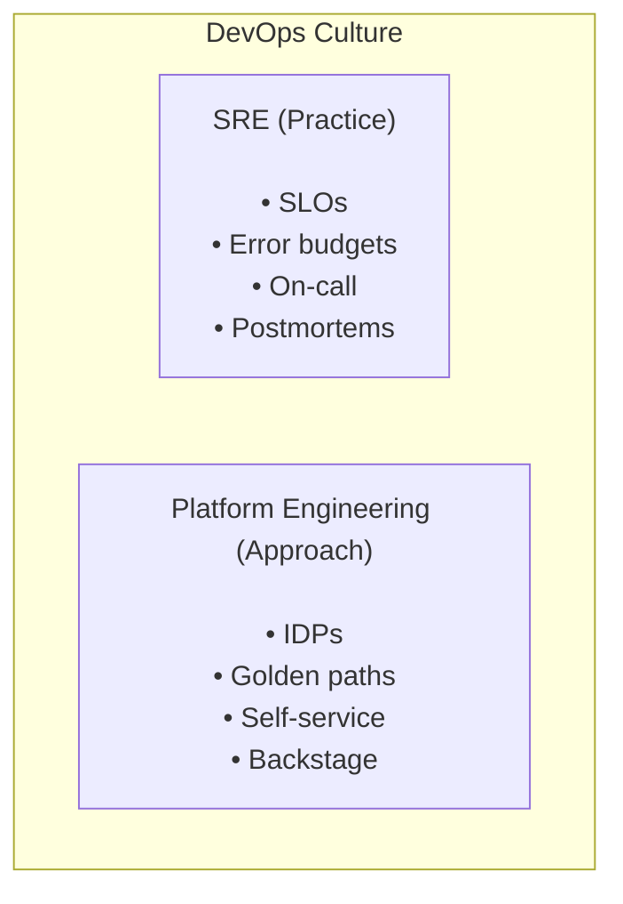
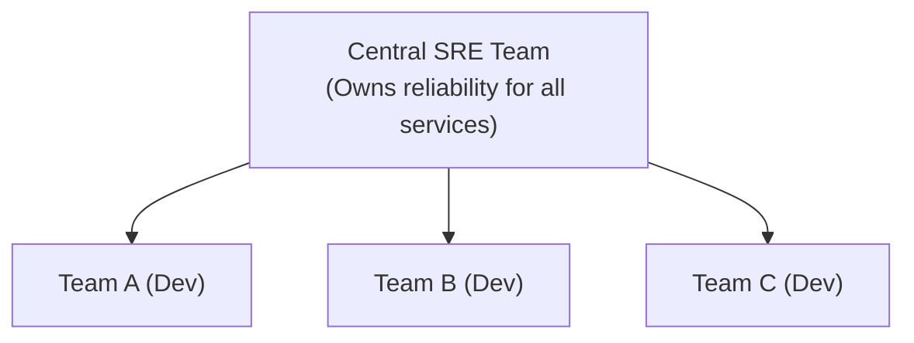
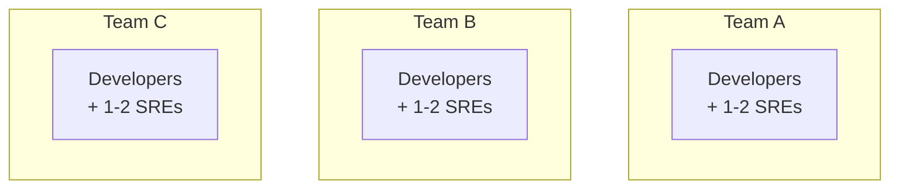
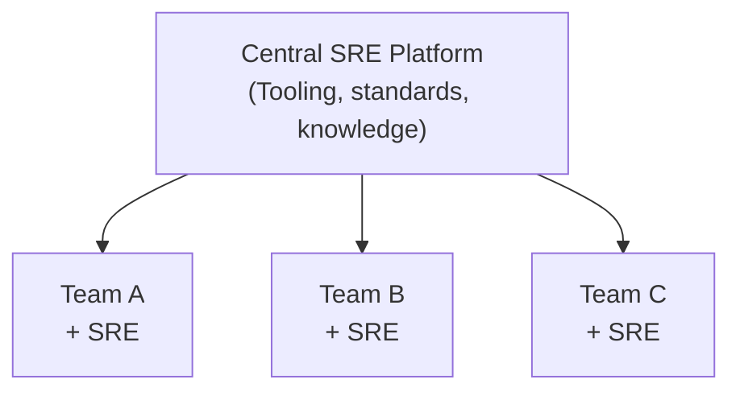
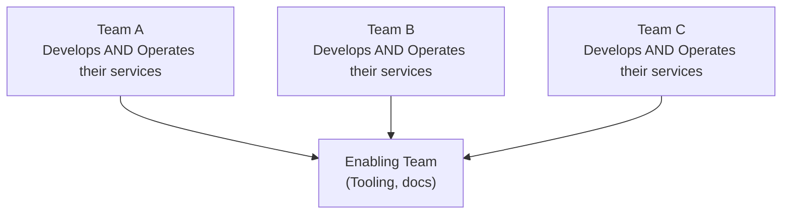

> **Discipline Module** | Complexity: `[MEDIUM]` | Time: 30-35 min

## Prerequisites

Before starting this module:
- **Required**: [Reliability Engineering Track](/platform/foundations/reliability-engineering/) — Understanding failure and resilience
- **Required**: [Systems Thinking Track](/platform/foundations/systems-thinking/) — See systems as wholes
- **Recommended**: Some experience operating production systems
- **Recommended**: Understanding of software development lifecycle

---

## What You'll Be Able to Do

After completing this module, you will be able to:

- **Evaluate whether SRE practices are appropriate for your organization's reliability needs**
- **Design an SRE team structure with clear roles, responsibilities, and engagement models**
- **Implement the core SRE principles — SLOs, error budgets, toil reduction — in a real service**
- **Analyze the gap between traditional ops and SRE to build a credible adoption roadmap**

## Why This Module Matters

You've learned reliability principles. Now you need a **framework** to apply them.

Site Reliability Engineering (SRE) is that framework. Invented at Google, adopted worldwide, SRE transforms reliability from "someone else's problem" to "everyone's measurable responsibility."

> **Stop and think**: How is reliability currently handled in your organization? Is it a shared goal, or does it fall squarely on the shoulders of a single team when things break?

**Here's the thing**: Without SRE, reliability is:
- A vague goal ("make it more reliable")
- Someone else's job ("ops will handle it")
- In conflict with features ("we don't have time for reliability")

With SRE, reliability is:
- A measurable objective (99.9% availability)
- A shared responsibility (developers on-call)
- Balanced with velocity (error budgets)

This module shows you how SRE makes this transformation happen.

---

## The Origin Story

### 2003: Google's Problem

Google was growing fast. Very fast.

Traditional operations couldn't keep up:
- **Manual processes**: Too slow for Google's scale
- **Siloed teams**: Developers threw code over the wall
- **Perverse incentives**: Ops wanted stability, Dev wanted features

Ben Treynor (now Treynor Sloss) was tasked with fixing this. His solution: treat operations as a **software engineering problem**.

> "SRE is what happens when you ask a software engineer to design an operations team."
> — Ben Treynor Sloss

### The Key Insight

Instead of hiring traditional sysadmins, Google hired software engineers and gave them operations responsibilities.

These engineers did what engineers do:
- Automated repetitive tasks
- Built tools to manage systems at scale
- Applied engineering rigor to reliability
- Measured everything

The result was **Site Reliability Engineering** — a discipline that bridges development and operations through software engineering.

---

## The SRE Mindset

### Engineering, Not Administration

Traditional ops focuses on **doing work**: patching servers, deploying code, responding to alerts.

SRE focuses on **eliminating work**: automating deployments, reducing toil, preventing incidents.

| Traditional Ops | SRE Approach |
|-----------------|--------------|
| Manual deployments | Automated CI/CD |
| Reactive firefighting | Proactive prevention |
| Tribal knowledge | Documented runbooks |
| "Keep it running" | "Make it self-healing" |
| Blame individuals | Blame systems |

### The 50% Rule

SRE teams have a hard rule: **no more than 50% of time on operational work**.

The rest goes to engineering projects that:
- Reduce future operational burden
- Improve system reliability
- Automate repetitive tasks
- Build better tools

> **Pause and predict**: What happens if an SRE team ignores the 50% rule and spends 90% of their time fighting fires? 

If operational work exceeds 50%, something is wrong. Either:
- The system is too unreliable (needs reliability work)
- Too much toil exists (needs automation)
- The team is understaffed (needs hiring)

This rule ensures SRE remains an engineering discipline, not just operations with a fancy name.

### Embrace Risk (Carefully)

Here's a counterintuitive SRE principle: **100% reliability is wrong**.

Why? Because:
1. **Users can't tell**: If your service is 99.99% reliable but the user's ISP is 99% reliable, they won't notice your extra 9s
2. **It's expensive**: Each additional 9 costs exponentially more
3. **It's slow**: Extreme reliability requires extreme caution, which means slow releases

SRE embraces calculated risk through **error budgets** (more in Module 1.3).

---

## Try This: Calculate Your Users' Reliability Experience

Think about your service's path to users:

```text
Your Service (99.9%)
    → Load Balancer (99.95%)
    → Internet (99.9%)
    → User's ISP (99%)
    → User's WiFi (99.5%)
    → User's Browser (99.9%)

Combined: 0.999 × 0.9995 × 0.999 × 0.99 × 0.995 × 0.999
        = ~97.3%
```

Your 99.9% doesn't matter much when users only see ~97.3%.

**Lesson**: Match your reliability to what users can actually perceive.

---

## SRE vs DevOps vs Platform Engineering

These terms get confused. Let's clarify:

### DevOps: A Culture

DevOps is a **cultural movement** that breaks down silos between development and operations.

Core values:
- **Collaboration**: Dev and Ops work together
- **Automation**: Reduce manual work
- **Measurement**: Track what matters
- **Sharing**: Knowledge flows freely
- **Feedback**: Fast loops everywhere

DevOps is **what you believe**.

### SRE: A Practice

SRE is a **specific implementation** of DevOps principles.

It provides:
- **Concrete practices**: SLOs, error budgets, toil reduction
- **Defined roles**: SRE teams with specific responsibilities
- **Measurable goals**: Reliability targets, not vague aspirations
- **Engineering focus**: Treat operations as software problem

SRE is **how you work**.

> "Class SRE implements interface DevOps."
> — Seth Vargo and Liz Fong-Jones

### Platform Engineering: An Approach

Platform Engineering focuses on building **internal developer platforms** that make reliability, deployment, and operations self-service.

It provides:
- **Golden paths**: Paved roads for common tasks
- **Self-service**: Developers help themselves
- **Abstraction**: Hide infrastructure complexity
- **Standardization**: Consistent patterns across teams

Platform Engineering is **what you build**.

### The Overlap



You can do SRE without Platform Engineering. You can do Platform Engineering without dedicated SREs. But many organizations do both, and they complement each other well.

---

## SRE Team Structures

There's no single way to structure SRE. Here are common models:

### Model 1: Centralized SRE Team



**Pros**:
- Consistent practices across organization
- Efficient use of specialized skills
- Clear ownership of reliability

**Cons**:
- Bottleneck for all teams
- SREs disconnected from product context
- "Throw it to SRE" mentality

**Best for**: Smaller organizations, early SRE adoption

### Model 2: Embedded SREs



**Pros**:
- SREs understand product context
- Faster response to team-specific issues
- Strong collaboration with developers

**Cons**:
- Inconsistent practices across teams
- SREs can get "captured" by product work
- Less efficient (specialized skills spread thin)

**Best for**: Larger organizations, mature teams

### Model 3: Hybrid



**Pros**:
- Consistent tooling and standards
- SREs have product context
- Best practices shared centrally

**Cons**:
- More complex to manage
- Potential for duplication
- Requires mature organization

**Best for**: Large organizations, scaled SRE

### Model 4: You Build It, You Run It (No Dedicated SREs)



**Pros**:
- Developers fully own their services
- No "throw it over the wall"
- Deep product understanding

**Cons**:
- Not everyone wants operations work
- Inconsistent reliability practices
- Specialized skills may be lacking

**Best for**: Small organizations, high-autonomy cultures

---

## Did You Know?

1. **Google's SRE teams are about 50% software engineering work**. They spend half their time on automation projects that reduce future operational burden, not just keeping things running.

2. **The term "error budget" was invented at Google** to flip the conversation from "minimize all errors" to "how much error can we afford to ship features faster?"

3. **Netflix famously has no SRE team**. Instead, they practice "full-cycle developers" where each team owns their entire service lifecycle. They invest heavily in tooling to make this possible.

4. **The first Google SRE book (2016) was downloaded over 1 million times** in its first month and sparked an industry-wide transformation. Before this, operations was rarely discussed with engineering rigor—now SRE is one of the most sought-after specializations in tech.

---

## War Story: The Team That Couldn't Scale

A startup I worked with was growing fast. Their ops team was drowning:

- 3 people handling all production for 50 developers
- On-call meant actual calls every night
- Deployment queue was 2 weeks long
- Burnout was rampant

They hired more ops people. It helped briefly, then got worse again.

**The problem**: They were scaling linearly while the system grew exponentially.

**The fix**: They adopted SRE practices:

1. **Established SLOs**: Defined what "good enough" meant
2. **Created error budgets**: Developers owned reliability
3. **Mandated toil measurement**: Found where time went
4. **Set the 50% rule**: Forced automation investment

Within 6 months:
- Deployment queue: Same day
- On-call incidents: Down 70%
- Team size: Same (3 people)
- Coverage: 100 developers

The shift wasn't hiring more people. It was **working differently**.

**Lesson**: You can't hire your way out of operational problems. You have to engineer your way out.

---

## SRE Principles Summary

| Principle | Meaning |
|-----------|---------|
| **Reliability is a feature** | It's not separate from product development |
| **Embrace risk** | 100% is wrong; match reliability to user needs |
| **Service level objectives** | Measure reliability concretely |
| **Error budgets** | Balance reliability with velocity |
| **Toil reduction** | Automate repetitive work away |
| **Blameless postmortems** | Learn from failure without blame |
| **Engineering mindset** | Treat operations as software problem |

---

## Common Mistakes

| Mistake | Problem | Solution |
|---------|---------|----------|
| "We hired an SRE" | SRE is a practice, not a person | Adopt SRE practices org-wide |
| 100% reliability target | Expensive and slow | Set realistic SLOs based on user needs |
| SRE team does all ops | Creates bottleneck and resentment | Shared responsibility model |
| Ignoring the 50% rule | SREs become glorified ops | Protect engineering time ruthlessly |
| SRE without SLOs | No way to measure success | Define SLOs before anything else |
| Copy Google exactly | Their context isn't yours | Adapt principles to your situation |

---

## Quiz: Check Your Understanding

### Question 1
Your company is migrating from a traditional operations model to an SRE model. The VP of Engineering suggests that the new SRE team should handle all deployments and manual server patching to free up developers. Based on SRE principles, why is this approach problematic?

<details>
<summary>Show Answer</summary>

This approach is problematic because it treats the SRE team as a traditional operations group focused on manual work rather than engineering solutions. In SRE, the primary goal is to treat operations as a software engineering problem. SREs should focus on automating deployments and reducing toil, governed by the 50% rule where no more than half their time is spent on operational tasks. By taking on all manual patching and deployments, the team would quickly exceed this limit and fail to build the scalable, automated systems that SRE is designed to create.

</details>

### Question 2
Your product manager insists that the new critical payment service must be built to achieve 100% reliability, arguing that "any downtime is unacceptable for payments." As an SRE, how would you address this requirement?

<details>
<summary>Show Answer</summary>

Targeting 100% reliability is considered an anti-pattern in SRE because it is both practically impossible and misaligned with actual user experience. Even if your service never fails, users will still experience errors due to unstable internet connections, ISP outages, or device issues, making the extra effort invisible to them. Furthermore, achieving each additional "nine" of reliability costs exponentially more in engineering effort and severely throttles feature velocity. Instead, the SRE approach is to set a realistic Service Level Objective (SLO), such as 99.99%, and use the remaining error budget to safely deploy updates and balance reliability with innovation.

</details>

### Question 3
An executive at your company states, "We don't need to adopt DevOps because we're already building a Platform Engineering team, and we'll hire SREs to run it." How would you clarify the relationship between these three concepts to correct this misunderstanding?

<details>
<summary>Show Answer</summary>

It is crucial to clarify that DevOps, SRE, and Platform Engineering are complementary concepts, not mutually exclusive alternatives. DevOps is the foundational cultural movement that emphasizes collaboration, shared responsibility, and breaking down silos between development and operations. SRE is a specific, prescriptive implementation of those DevOps principles, providing concrete practices like Service Level Objectives (SLOs) and error budgets. Meanwhile, Platform Engineering focuses on building internal developer platforms to enable self-service and standardize workflows. You still need the DevOps culture and SRE practices to ensure the platform is reliable and aligns with your business goals.

</details>

### Question 4
Six months into your SRE team's existence, you audit their time and find they are spending 75% of their week resolving tickets, responding to alerts, and manually scaling infrastructure. What SRE principle is being violated, and what should be the immediate course of action?

<details>
<summary>Show Answer</summary>

This situation directly violates the 50% rule, which mandates that SREs must spend at least half of their time on project-based engineering work rather than reactive operations. When operational work (toil) exceeds 50%, it indicates that the system is either too unreliable, under-automated, or the team is understaffed. The immediate course of action should be to push back on operational duties, potentially routing excess tickets back to the development teams. The SRE team must then redirect their focus toward automating the manual scaling and addressing the root causes of the alerts to permanently reduce the operational burden.

</details>

---

## Hands-On Exercise: SRE Self-Assessment

Assess your organization's SRE maturity:

### Instructions

Rate each area from 1 (not at all) to 5 (fully implemented):

**Reliability Measurement**
```text
[ ] We have SLOs for our critical services
[ ] We measure availability and latency
[ ] We have dashboards showing reliability metrics
[ ] We review reliability metrics regularly

Score: ___/20
```

**Operational Practices**
```text
[ ] We have documented runbooks for common issues
[ ] We do blameless postmortems after incidents
[ ] We track and measure toil
[ ] We have a formal on-call rotation

Score: ___/20
```

**Engineering Investment**
```text
[ ] Developers participate in on-call
[ ] We regularly invest in automation
[ ] We have error budgets that gate releases
[ ] We protect time for reliability engineering

Score: ___/20
```

**Culture**
```text
[ ] Reliability is a product feature, not ops problem
[ ] We learn from failures, not blame individuals
[ ] Developers and operations collaborate closely
[ ] Leadership supports reliability investment

Score: ___/20
```

### Interpreting Your Score

| Score | Maturity Level | Focus Area |
|-------|----------------|------------|
| 60-80 | Advanced SRE | Continuous improvement |
| 40-60 | Developing | Fill in gaps systematically |
| 20-40 | Beginning | Start with SLOs and postmortems |
| 0-20 | Pre-SRE | Build awareness and buy-in |

### Success Criteria

You've completed this exercise when you:
- [ ] Honestly assessed all 16 areas
- [ ] Identified your lowest-scoring category
- [ ] Listed 3 specific improvements for that category

---

## Key Takeaways

1. **SRE is software engineering applied to operations** — not just ops with a new name
2. **The 50% rule** protects engineering time and forces automation
3. **100% reliability is wrong** — match reliability to user needs
4. **SRE implements DevOps** — concrete practices for cultural values
5. **Team structure matters** — choose based on your organization's maturity

---

## Further Reading

**Books**:
- **"Site Reliability Engineering"** — Google (the original SRE book, free online)
- **"The Site Reliability Workbook"** — Google (practical companion)
- **"Seeking SRE"** — David Blank-Edelman (SRE across different contexts)

**Articles**:
- **"What is SRE?"** — Google Cloud (cloud.google.com/blog/products/devops-sre)
- **"SRE vs DevOps"** — Atlassian (atlassian.com/incident-management)

**Talks**:
- **"Keys to SRE"** — Ben Treynor Sloss (YouTube)
- **"SRE: An Incomplete Guide to Cultural Nuance"** — Liz Fong-Jones (YouTube)

---

## Summary

Site Reliability Engineering is a discipline that brings software engineering practices to operations. Born at Google, it provides:

- **Measurable reliability** through SLOs
- **Balanced velocity** through error budgets
- **Reduced toil** through automation
- **Learning culture** through blameless postmortems

SRE isn't about perfection — it's about being **reliably good enough** while still shipping features.

---

## Next Module

Continue to [Module 1.2: Service Level Objectives (SLOs)](../module-1.2-slos/) to learn how to define and measure reliability targets.

---

*"Hope is not a strategy."* — Traditional SRE saying