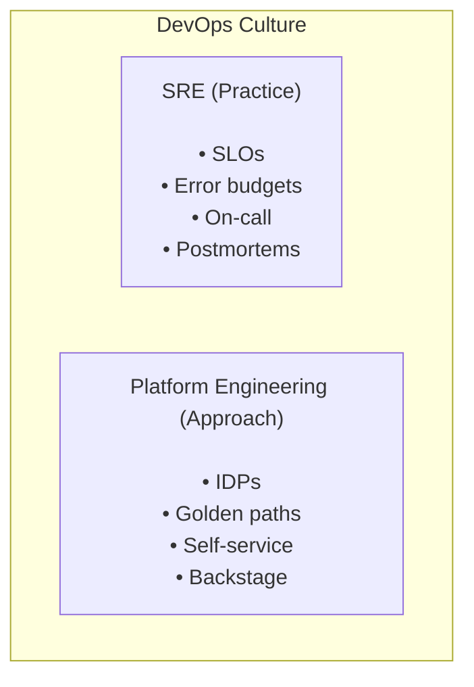
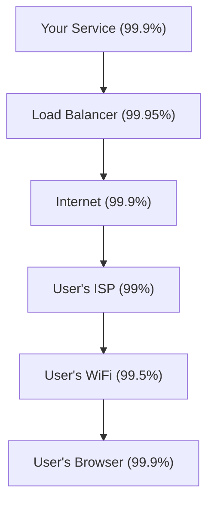
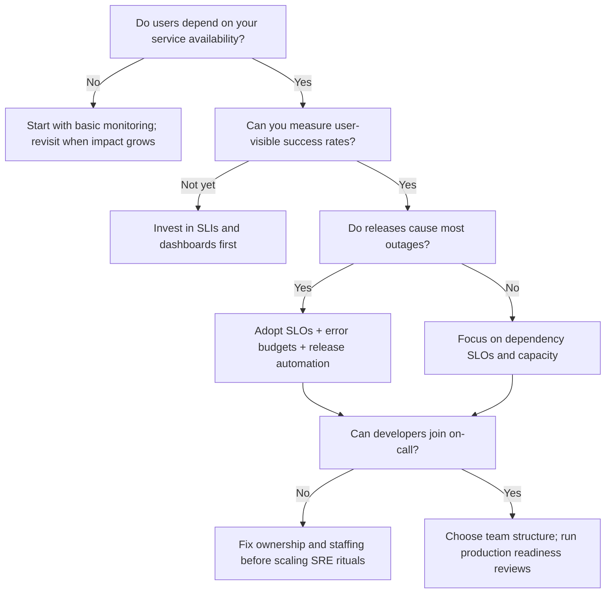

> **Discipline Module** | Complexity: `[MEDIUM]` | Time: 55-65 min

## Prerequisites

Before starting this module, you should have completed the reliability and systems-thinking foundations so you can reason about failure, feedback loops, and user-visible impact rather than treating uptime as a vague aspiration.

- **Required**: [Reliability Engineering Track](/platform/foundations/reliability-engineering/) — understanding failure, redundancy, and resilience
- **Required**: [Systems Thinking Track](/platform/foundations/systems-thinking/) — seeing services as wholes within larger systems
- **Recommended**: Some experience operating production systems or participating in on-call rotations
- **Recommended**: Familiarity with the software development lifecycle and basic observability concepts

---

## What You'll Be Able to Do

After completing this module, you will be able to:

- **Evaluate whether SRE practices are appropriate for your organization's reliability needs**
- **Design an SRE team structure with clear roles, responsibilities, and engagement models**
- **Implement the core SRE principles — SLOs, error budgets, toil reduction — in a real service**
- **Analyze the gap between traditional ops and SRE to build a credible adoption roadmap**

## Why This Module Matters

You already know that systems fail, that redundancy helps, and that observability beats guessing. What you may not yet have is an operating model that turns those ideas into daily decisions about staffing, releases, alerting, and trade-offs. Site Reliability Engineering is that model. [Google introduced SRE around 2003](https://sre.google/sre-book/introduction/) when rapid growth made manual operations and developer–operations silos unsustainable, and the discipline has since spread because it answers a question every growing organization eventually faces: how do you ship quickly without treating production pain as someone else's problem?

Without a shared reliability framework, organizations drift into predictable dysfunction. Reliability becomes a slogan rather than a metric, operations becomes a dumping ground for manual work, and product teams treat production risk as an externality they can ignore until an outage forces attention. Meetings about "how reliable is enough?" turn into opinion battles because nobody has agreed on indicators, targets, or what should happen when those targets slip. SRE replaces that ambiguity with explicit service level objectives, error budgets that connect reliability to release policy, and engineering habits that shrink repetitive operational work over time.

SRE is not a rebranding exercise for an existing operations team, nor is it a license to slow development to a crawl in the name of stability. It is a way to make reliability negotiable in the same language product and engineering already use for features: measurable commitments, explicit trade-offs, and shared ownership of production outcomes. When SRE works, developers still own their services, operators still understand the platform, and leadership can see whether the organization is buying reliability improvements or merely hoping for them. This module establishes the vocabulary and principles you will use throughout the rest of the SRE track, including SLO design in [Module 1.2](../module-1.2-slos/), error budget policy in [Module 1.3](../module-1.3-error-budgets/), and incident learning in [Module 1.6](../module-1.6-postmortems/).

---

## What SRE Is: Treating Operations as a Software Problem

Site Reliability Engineering is [what happens when you ask a software engineer to design an operations function](https://sre.google/sre-book/introduction/). That definition is deliberately provocative. It does not mean every SRE must write application features all day, and it does not mean traditional operational skills disappear. It means the default response to repetitive production work should be the same default response engineers apply elsewhere: understand the system, automate the safe parts, measure outcomes, and simplify the architecture so fewer heroic interventions are required.

The shift is philosophical before it is organizational. Traditional operations often optimizes for immediate restoration: patch the server, restart the process, clear the queue, and move on. SRE still cares about restoration, but it treats recurring restoration as a design defect. If the same manual remediation happens every week, the SRE question is not only "how do we fix it faster?" but also "what change eliminates this class of work permanently?" That mindset is why SRE teams invest in release automation, self-healing controllers, better defaults, and observability that explains user impact rather than merely listing infrastructure symptoms.

Google's framing also explains why SRE sits between development and operations rather than replacing either group entirely. Developers understand feature logic and change velocity; operators understand production constraints and failure modes; SRE provides the engineering discipline that connects those perspectives with explicit reliability targets. [The production environment chapter of the SRE book](https://sre.google/sre-book/production-environment/) describes how Google pairs software expertise with operational responsibility so large distributed systems remain governable. You do not need Google's scale for the idea to matter. Any team that deploys frequently, depends on shared platforms, or answers to users about availability is already living inside the problem SRE was built to solve.

> **The SRE Analogy**
>
> Imagine a hospital that treats the same preventable injury every weekend. Traditional ops is the emergency room: skilled, fast, and essential. SRE is the public-health program that asks why the injury keeps happening, installs guardrails, trains staff, and measures whether admissions fall. Both roles save lives, but only one reduces how often the emergency room must scramble.

---

## The Origin at Google

Ben Treynor Sloss built Google's SRE function when the company's infrastructure outgrew classic sysadmin workflows. Hiring more people to perform the same manual steps could not keep pace with service growth, and the handoff model—developers write code, operations run it—created incentives that rewarded local speed over systemic stability. Treynor's bet was that software engineers, given operational responsibility, would apply the same design rigor to production that they applied to product code. The resulting discipline became Site Reliability Engineering, and [the introduction to the Google SRE book](https://sre.google/sre-book/introduction/) remains the canonical statement of that origin story.

The early SRE teams did not invent reliability from scratch. They inherited decades of systems-engineering practice—capacity planning, change control, incident command, post-incident review—and replaced ad hoc execution with software-backed enforcement where possible. Configuration management, automated rollouts, monitoring pipelines, and SLO-driven alerting turned fragile manual rituals into repeatable systems. That historical detail matters for adopters today because it explains why SRE emphasizes measurement and automation together. Without measurement, you have no way to tell whether a change improved reliability; without automation, you will struggle to afford the reliability level you claim to target.

Adoption outside Google does not require copying Google's headcount or tooling stack. Organizations adapt SRE principles to regulated industries, smaller teams, and vendor-managed platforms every day. The durable lesson is structural: reliability improves when the people who can change the system are accountable for operating it, when operational pain is quantified, and when engineering time is protected to pay down the causes of that pain. Everything else—team names, ticket queues, vendor choices—is implementation detail that should follow your context rather than a slide deck from someone else's organization.

---

## The SRE Tenets and Why Each One Exists

Google's SRE material organizes reliability practice around a small set of tenets. They are not slogans for posters; each tenet resolves a failure mode that appears when organizations treat reliability as vague goodwill rather than engineered behavior.

### Embracing risk

[The embracing risk chapter](https://sre.google/sre-book/embracing-risk/) argues that **100% reliability is the wrong target** for most services. Perfection is not free—it demands slower change, heavier redundancy, stricter change windows, and often higher cost—while users may be unable to perceive the difference because other parts of the path are less reliable. SRE therefore chooses an appropriate level of risk, documents it as a service level objective, and spends the remaining unreliability deliberately through error budgets rather than pretending failures should never happen.

### Service level objectives

Reliability without measurement becomes argument. [Service level objectives](https://sre.google/sre-book/service-level-objectives/) translate user expectations into indicators and targets over explicit windows, such as "99.9% of checkout requests return a non-5xx response over 30 days." SLOs are internal operating targets, stricter than most external SLAs, and they give teams a shared answer to whether the service is healthy enough to accept additional release risk. Module 1.2 goes deep on SLI selection and target setting; here the key idea is that SRE speaks in SLOs instead of adjectives like "stable" or " flaky."

### Error budgets

An error budget is the complement of the SLO: if the target is 99.9% availability, the budget is 0.1% allowed bad events over the measurement window. Budgets turn reliability and velocity into a zero-sum negotiation with data. When budget remains, teams can ship aggressively; when budget burns quickly, reliability work and release freezes take precedence. [Implementing SLOs in the SRE Workbook](https://sre.google/workbook/implementing-slos/) shows how this math connects to alerting and policy documents you can adopt verbatim or adapt.

### Eliminating toil

[Toil is manual, repetitive, automatable work tied to running a production service](https://sre.google/sre-book/eliminating-toil/), and it scales linearly with traffic unless you remove it. Resetting stuck jobs by hand, copying credentials between systems, and manually scaling replicas during predictable peaks are classic toil. SRE teams measure toil, cap it, and fund engineering projects that eliminate the worst sources. Google's internal guidance targets keeping toil below half of an SRE's time; the exact percentage matters less than the discipline of measuring and pushing back when operational work crowds out improvement work.

### Monitoring and the four golden signals

[Monitoring distributed systems](https://sre.google/sre-book/monitoring-distributed-systems/) teaches SREs to focus on **latency, traffic, errors, and saturation**—the four golden signals—because those dimensions explain most user-visible failure modes. Latency tells you whether work completes in time; traffic tells you how much demand exists; errors tell you how often work fails; saturation tells you how full the system is. Infrastructure metrics such as CPU percentage can help diagnose problems, but they are not substitutes for user-centered signals when deciding whether a service meets its SLO.

### Automation

[Automation at Google](https://sre.google/sre-book/automation-at-google/) describes a maturity path from manual operation to autonomous systems that handle routine events without human intervention. SRE does not automate for novelty's sake; it automates to reduce variance, shorten recovery time, and free humans for work that requires judgment. The guiding question is whether a machine can perform the action more consistently than a tired engineer at 03:00. If yes, the action belongs in code, a controller, or a pipeline—not in a runbook step that will be skipped under pressure.

### Release engineering

Reliability and change are inseparable. Most outages trace to deployments, configuration edits, or dependency upgrades rather than spontaneous hardware failure. SRE therefore partners with release engineering to make rollouts reversible, observable, and incremental. Canary releases, automated verification, and clear rollback paths reduce the blast radius of change. You will practice these ideas concretely in later modules; at this stage, remember that SRE treats every production change as a reliability experiment with measurable outcomes.

### Simplicity

Complex systems fail in complex ways. [The simplicity chapter](https://sre.google/sre-book/simplicity/) argues that unnecessary components, opaque dependencies, and special-case tooling increase operational load and incident duration. SRE teams push back on architecture that trades short-term delivery speed for long-term fragility, because fragility becomes toil and toil consumes the error budget you needed for feature work. Simplicity is not minimalism for aesthetics; it is a reliability strategy that keeps systems understandable under stress.

---

## Error Budgets as the Bridge Between Dev and SRE

The central mechanism that makes SRE workable in product-driven organizations is the error budget. Developers want to ship features; SRE wants sustainable reliability; executives want both without endless debate. Error budgets give all three parties the same spreadsheet. When the budget is healthy, product-led risk is explicitly allowed. When the budget is exhausted, the organization agreed in advance that reliability work takes precedence over new feature launches until service quality recovers.

Consider a service with a 99.9% availability SLO measured over 30 days. The allowed bad ratio is 0.1%, which equals roughly 43.2 minutes of downtime in a 30-day month if you express the budget in time, or 1,000 failed requests per million requests if you express it in events. Those numbers come directly from the target; they are not moral judgments about whether failures are acceptable. They are accounting rules that make trade-offs visible. A team burning budget on repeated deploy regressions sees a signal to invest in tests and canaries; a team that never touches its budget may be holding an SLO so loose that users suffer before internal charts turn red.

Budgets also prevent the two classic failure modes of reliability programs. Without budgets, teams either argue forever about whether a release is "safe enough," or operations unilaterally blocks change without transparent criteria. With budgets, the policy can be written down: while budget remains above a threshold, releases proceed under normal review; when burn rate spikes, trigger incident review; when budget hits zero, freeze non-emergency changes and fund remediation. [Alerting on SLOs in the SRE Workbook](https://sre.google/workbook/alerting-on-slos/) connects those policies to multi-window burn-rate alerts so teams detect budget consumption early instead of discovering exhaustion at month end.

This module previews error budgets because SRE's relationship to development velocity is unintelligible without them. Module 1.3 dedicates an entire lesson to budget math, policies, and organizational escalation. For now, internalize the cultural shift: reliability is not maximized; it is **negotiated to a defined level**, and the unused portion of that level is a resource you spend on innovation.

---

## Monitoring Philosophy: Symptoms, Not Just Causes

SRE monitoring begins with user-visible symptoms and works backward toward causes. A database can show healthy replication lag while returning corrupt rows; a pod can restart cleanly while failing every request; a load balancer can report green backends while routing to an empty cache. Symptom-based alerting aligns with SLOs because both ask whether users are receiving acceptable service. Cause-based metrics remain valuable for diagnosis after you know users hurt, but paging humans on every CPU spike trains teams to ignore alerts and hides real outages behind noise.

Rob Ewaschuk's essay on alerting philosophy, cited throughout Google's SRE practice materials, emphasizes that alerts should be actionable, attributable, and tied to urgency that matches user impact. [Practical alerting in the SRE book](https://sre.google/sre-book/practical-alerting/) extends that idea with concrete guidance about paging sparingly and using ticket severity for lower-urgency work. The four golden signals give you a minimum viable dashboard for any service: if latency, traffic, errors, or saturation move abnormally relative to baseline, you likely have a story worth investigating even before you know which subsystem failed.

For Kubernetes environments running on modern observability stacks, that philosophy usually means exporting HTTP metrics from ingress or service meshes, tracking queue depth for workers, and defining SLO recording rules in Prometheus rather than maintaining dozens of unrelated infrastructure charts. Tools change; the durable rule does not: **measure what users experience first**, then instrument components deeply enough to explain deviations quickly when they occur.

---

## SRE vs DevOps vs Traditional Operations

These terms overlap in conversation, but they answer different questions. Confusing them leads to organizational theater—renaming teams without changing incentives—or to tool purchases mistaken for culture change.

Traditional operations, often rooted in the sysadmin era, emphasizes stable production through controlled procedures, specialized operators, and separation from development. Developers hand off artifacts; operators deploy and tend them. That model can work for slow release cadences and small systems, but it breaks when deployment frequency rises and services become distributed platforms rather than single servers. Operators become bottlenecks, developers lack production feedback, and incidents devolve into blame because the people who can fix code are not the people awake at night.

DevOps is the cultural movement that challenged those silos. It emphasizes collaboration, automation, measurement, and shared responsibility for the full lifecycle. DevOps is intentionally underspecified about implementation because it aims to change beliefs and incentives across roles. You can agree with DevOps values while still lacking concrete reliability targets, on-call models, or policies that decide when to stop releasing. DevOps tells you **what to believe** about collaboration; it does not by itself tell you **what to do** at 02:00 when checkout error rates double.

SRE is a concrete implementation of DevOps principles for reliability-focused work. [The SRE Workbook's opening chapter on how SRE relates to DevOps](https://sre.google/workbook/how-sre-relates/) uses the metaphor "class SRE implements interface DevOps": SLOs, error budgets, toil caps, blameless postmortems, and production readiness reviews are the methods that instantiate DevOps ideals in running systems. Seth Vargo and Liz Fong-Jones popularized that phrasing because it clarifies that SRE is not competing with DevOps—it is one rigorous way to practice it.

Traditional operations versus SRE is therefore not a question of hats versus hoodies. It is a question of whether operational work is treated as a manufacturing line that must be staffed forever or as a software problem whose manual portions should shrink over time. SRE teams still operate production, but they are measured partly by how much operational work they eliminate, not by how many tickets they close per shift.

| Dimension | Traditional ops | DevOps culture | SRE practice |
|-----------|-----------------|----------------|--------------|
| Primary goal | Keep production stable | Break silos; accelerate delivery | Make reliability measurable and sustainable |
| Success metric | Uptime heroics, ticket closure | Collaboration and flow | SLO attainment, budget policy, toil reduction |
| Change relationship | Controlled handoffs | Shared ownership | Budget-gated releases with explicit risk |
| Tooling stance | Procedures and runbooks | Automation everywhere | Automation prioritized by measured toil |
| Incident learning | Often blame-oriented | Improving feedback loops | Blameless postmortems with action items |

---

## Platform Engineering and Where SRE Fits

Platform Engineering builds internal platforms—developer portals, golden paths, self-service clusters, standardized pipelines—that make the right way the easy way. SRE and platform engineering are complementary because platforms fail in production too, and because reliability guardrails embedded in platforms scale farther than policy documents alone. An internal platform team might provide a paved-road deployment pipeline with canary hooks and default Prometheus rules; an SRE team might define the SLOs those defaults enforce and the error budget policy that gates promotion to production.

You can practice SRE without a formal platform organization, and you can build platforms without hiring people titled SRE. Many organizations do both. The distinction worth preserving is responsibility: platform teams optimize developer experience and standardization; SRE teams optimize measurable reliability and operational sustainability. When those groups collaborate, developers encounter SLO templates when they scaffold a service, on-call rotations include clear escalation paths, and incident tooling captures timelines automatically for postmortems.

> **Landscape snapshot — as of 2026-06. This changes fast; verify against vendor docs before relying on specifics.**
>
> On-call and incident tooling is a capability map, not a popularity contest. **Alert routing** turns monitoring signals into notified humans; **scheduling** maintains fair rotations; **incident coordination** tracks roles, timelines, and communications; **status pages** publish user-facing updates. Peers in this space include PagerDuty, Grafana OnCall, Incident.io, and Opsgenie—the last reached end-of-life with Atlassian directing customers toward Jira Service Management integrations. Choose based on integration with your metrics stack, audit requirements, and workflow—not slogans about market leadership.

---

## The SRE Engagement Model and the 50% Rule

How SRE teams attach to product organizations determines whether they improve systems or become human shields for unreliable code. [Google's evolving SRE engagement model](https://sre.google/sre-book/evolving-sre-engagement-model/) and [the workbook's engagement chapter](https://sre.google/workbook/engagement-model/) describe a lifecycle: consulting early, sharing tools, taking co-ownership of critical services, and stepping back when teams mature. The goal is not permanent dependency; the goal is raising the reliability floor until product teams can operate safely with lighter SRE involvement.

Production readiness reviews are a practical handshake in that lifecycle. Before a service accepts production traffic at scale, SRE partners review observability, runbooks, capacity assumptions, failure modes, and on-call readiness. The review is not a gatekeeping ritual for its own sake; it ensures that the people who will be paged understand how the service fails and how users experience those failures. Shared ownership means developers participate in on-call rotations for the services they build, which aligns incentives faster than any policy memo about "quality culture."

The **50% rule** caps operational work at half of SRE time so the function remains engineering. [Google's guidance on identifying and tracking toil](https://cloud.google.com/blog/products/management-tools/identifying-and-tracking-toil-using-sre-principles/) states that SREs should spend no more than 50% of their time on toil; the remainder funds automation and reliability projects. When operational load chronically exceeds that cap, the response is not heroic overtime—it is staffing adjustment, reliability remediation, or pushing operational responsibility back to the owning team until the system is governable again.

That rule protects SRE credibility. An team that spends every week manually scaling, patching, and restarting without fixing root causes becomes indistinguishable from traditional ops with a new title. Leadership may wonder why expensive engineers are performing tasks that a runbook could describe. Conversely, an SRE team that never touches production loses situational awareness and becomes advisory wallpaper. The balance is intentional: enough operational exposure to feel pain, enough protected project time to remove pain permanently.

---

## SRE Team Structures

No single org chart fits every company, but the trade-offs recur. Centralized SRE teams spread expertise efficiently but risk becoming bottlenecks if product teams treat them as a remote ops department. Embedded SREs deepen product context but may diverge in practice or get captured by feature work. Hybrid models—central platform standards with embedded liaisons—scale well in large enterprises but require explicit governance so standards do not ossify and embeds do not fork tooling silently.


```mermaid
flowchart TD
    subgraph DevOps["DevOps Culture"]
        direction LR
        SRE["SRE (Practice)<br/><br/>• SLOs<br/>• Error budgets<br/>• On-call<br/>• Postmortems"]
        PE["Platform Engineering (Approach)<br/><br/>• IDPs<br/>• Golden paths<br/>• Self-service<br/>• Backstage"]
    end
```

The centralized model places one SRE organization responsible for reliability across many product teams. Consistency is the win: the same SLO templates, incident tools, and postmortem formats apply everywhere. The loss is context switching and queue latency if demand exceeds capacity. [Google Cloud's overview of how SRE teams are organized](https://cloud.google.com/blog/products/devops-sre/how-sre-teams-are-organized-and-how-to-get-started) recommends this pattern for early adoption because it concentrates learning before practices fragment.

Embedded SREs sit inside product teams, often one or two per group. They attend the same planning meetings, know the roadmap, and can challenge reliability implications before code merges. The risk is inconsistent standards and career isolation if embeds lack a strong central community. Hybrid structures address that by maintaining a central SRE platform team for tooling, training, and standards while assigning embeds or liaisons to critical product areas.

The "you build it, you run it" model pushes operational responsibility directly to development teams without dedicated SRE headcount. That can work when services are small, platforms are mature, and engineers accept on-call duty—but it fails silently when teams lack reliability skills or when leadership assigns operations work without freeing capacity. Enabling teams that provide observability baselines, deployment pipelines, and documentation often support this model even without the SRE name.

When evaluating structures for your organization, ask who owns SLOs, who is paged, who funds reliability projects, and what happens when budget burns. If answers differ by team without explicit reason, you have an adoption roadmap problem rather than a naming problem.

---

## End-to-End Reliability: Why Local Perfection Misleading

Reliability is path-dependent. Your service can exceed its SLO while users still fail because DNS, TLS, client devices, or upstream APIs dominate the experience. SRE teaches you to match investment to the weakest meaningful link rather than buying extra nines where users will not perceive them.


```mermaid
flowchart TD
    S["Your Service (99.9%)"] --> LB["Load Balancer (99.95%)"]
    LB --> I["Internet (99.9%)"]
    I --> ISP["User's ISP (99%)"]
    ISP --> W["User's WiFi (99.5%)"]
    W --> B["User's Browser (99.9%)"]
```

```text
Combined: 0.999 × 0.9995 × 0.999 × 0.99 × 0.995 × 0.999
        = ~97.3%
```

If your service improves from 99.9% to 99.99% while the rest of the path remains unchanged, user-perceived availability moves only marginally because the chain multiplies. [Google's guidance on choosing SLOs](https://cloud.google.com/architecture/framework/reliability/choose-slos) uses this reasoning to argue against pursuing 100% reliability targets that consume engineering time without improving customer outcomes. The lesson for architects is to instrument end-to-end journeys where possible and to set internal targets that reflect realistic dependencies rather than aspirational isolation.

The [availability table in the SRE book appendix](https://sre.google/sre-book/availability-table/) quantifies nines in downtime per year and month. At 99.9%, you allow about 8.76 hours of downtime per year or roughly 43.8 minutes per month; at 99.99%, about 52.6 minutes per year. Those figures are useful when executives ask for "five nines" without calculating cost. SRE makes the cost explicit so organizations choose reliability levels deliberately.

---

## Patterns and Anti-Patterns

| Pattern | Why it works | When to use it |
|---------|--------------|----------------|
| SLO-first design | Forces explicit user-centered targets before tooling debates | Any service with external users or contractual commitments |
| Error budget policy | Converts reliability/velocity conflict into written rules | Teams that argue about release freezes every quarter |
| Toil measurement | Shows where SRE time disappears and justifies automation | SRE teams above 50% operational load |
| Blameless postmortems | Surfaces systemic fixes instead of hiding fear | After every significant incident or near miss |
| Production readiness reviews | Catches missing observability before launch | New services or major architecture changes |

| Anti-pattern | Why it fails | Better approach |
|--------------|--------------|-----------------|
| "We hired an SRE" | Titles without practices recreate old ops | Adopt SLOs, budgets, and ownership rules org-wide |
| 100% reliability targets | Impossible and starves innovation | Set evidence-based SLOs with executive sign-off |
| SRE as sole operator | Creates bottleneck and weak dev incentives | Shared on-call with developers who can change code |
| Alerting on every metric | Pages become noise; real outages hide | Page on SLO burn or user-visible symptoms |
| Copy-paste Google staffing | Context differs; practices must adapt | Start with one critical service and expand deliberately |
| Ignoring toil | Team becomes permanent manual ops | Track toil weekly; fund elimination projects |

---

## Decision Framework: Should You Adopt SRE?

Use this framework when leadership asks whether SRE fits your organization. It is not a scorecard for vendors; it evaluates whether the **practices** will change outcomes.


```mermaid
flowchart TD
    A["Do users depend on your service availability?"] -->|No| B["Start with basic monitoring; revisit when impact grows"]
    A -->|Yes| C["Can you measure user-visible success rates?"]
    C -->|Not yet| D["Invest in SLIs and dashboards first"]
    C -->|Yes| E["Do releases cause most outages?"]
    E -->|Yes| F["Adopt SLOs + error budgets + release automation"]
    E -->|No| G["Focus on dependency SLOs and capacity"]
    F --> H["Can developers join on-call?"]
    G --> H
    H -->|No| I["Fix ownership and staffing before scaling SRE rituals"]
    H -->|Yes| J["Choose team structure; run production readiness reviews"]
```

Ask the questions in order. If you lack user-visible success metrics, SLO workshops will frustrate everyone because debates lack data. If developers do not participate in on-call, SRE becomes a buffer that hides misaligned incentives rather than fixing them. When prerequisites exist, start with one critical user journey, define an SLO and budget policy for it, and expand practices only after that service demonstrates improved decision making during incidents and releases.

---

## On-Call, Incidents, and Blameless Learning

SRE is not only metrics on dashboards; it is also how humans behave when metrics turn red. [Being on-call in the SRE book](https://sre.google/sre-book/being-on-call/) treats sustainable rotations as a design problem: clear escalation paths, runbooks that reflect real failure modes, and post-incident reviews that improve systems instead of punishing individuals. An organization can adopt every SLO template in the industry and still fail if the first response to an outage is to hunt for someone to blame, because people will hide uncertainty, skip documenting actions, and repeat the same manual fixes without recording why they worked.

Blameless postmortems are the cultural complement to error budgets. Budgets govern change before failure; postmortems govern learning after failure. [Google's postmortem culture chapter](https://sre.google/sre-book/postmortem-culture/) emphasizes identifying contributing factors across tooling, process, and architecture rather than stopping at a single human error. That approach aligns with resilience engineering practice and with John Allspaw's early advocacy at Etsy for debriefs that make it safe to describe mistakes honestly. The output of a good postmortem is not a lengthy narrative for archives—it is a short list of action items with owners, prioritized by how much they reduce future user impact or toil.

On-call sustainability also connects to the 50% rule. If every incident requires hours of manual recovery, on-call engineers will burn out even when pages are "successful." SRE teams therefore track repeat incidents and fund fixes that turn pages into tickets or into silent self-healing. [Practical alerting guidance](https://sre.google/sre-book/practical-alerting/) reinforces paging only when human action is urgent and time-sensitive; everything else should become tracked work that survives daylight hours. That discipline protects the engineers who implement the automation that keeps SRE scalable.

For Kubernetes operators, the lesson translates directly: cluster health probes and node NotReady conditions matter, but they should not page unless user-facing SLOs are at risk or cluster failure is imminent. Tie paging policies to customer journeys—checkout, authentication, data ingestion—and use infrastructure alerts to support diagnosis after those journeys show distress. This ordering prevents the common anti-pattern of waking someone because a non-critical DaemonSet restarted while users continue unaffected.

---

## DORA Metrics and the Delivery–Reliability Link

SRE does not ask teams to choose between shipping and staying up; it asks them to measure both and to improve both deliberately. The [DORA research program](https://dora.dev/guides/) identifies capabilities such as deployment frequency, lead time for changes, change fail rate, and time to restore service after failure. Those metrics mirror SRE concerns: fast recovery depends on observability and rehearsed incident response; low change fail rate depends on error budgets, canaries, and postmortem follow-through; sensible deployment frequency depends on automation rather than manual gatekeeping.

High-performing organizations in DORA studies do not treat operations as a separate universe from development. They invest in continuous integration, trunk-based development where appropriate, and monitoring that developers trust during rollouts. SRE gives those investments a reliability vocabulary. When change fail rate rises, SRE teams examine whether budget burn spiked, whether alerts fired early enough, and whether rollbacks are practiced rather than theoretical. When recovery time improves, they capture what tooling or runbook change made the difference so other services inherit the gain.

This connection helps when executives ask why reliability headcount should grow alongside feature teams. The answer is not mystical dedication to uptime—it is that unreliability taxes every DORA metric simultaneously. Slow recovery lengthens incidents that already anger customers; high change fail rate wastes engineering time on hotfixes; fearful release processes lengthen lead time and push teams toward risky manual pushes. SRE practices attack those taxes at the root by making risk explicit, automating toil, and learning from failures without scapegoating.

---

## Production Readiness as the Handshake Between Dev and SRE

Before a service graduates from "works in staging" to "trusted in production," SRE teams often run a production readiness review. The review is a structured conversation, not a bureaucratic veto, and [the engagement model material](https://sre.google/workbook/engagement-model/) describes it as a way to share accountability early. Typical checklist topics include defining SLIs and SLOs, ensuring dashboards and alerts exist, documenting dependencies and failure modes, verifying capacity plans, confirming on-call runbooks, and practicing rollback. Missing any one item does not always block launch, but it should trigger explicit acceptance of risk—ideally recorded alongside the error budget policy so leaders understand the trade-off.

Production readiness also surfaces hidden toil. If launching requires a manual database migration script, a special flag toggled by one engineer, or a traffic switch that only veterans understand, the review captures that debt before it becomes midnight folklore. SRE partners can then prioritize automation or require feature teams to embed operations into their definition of done. Over time, the checklist shrinks because platforms encode the defaults: new services inherit monitoring templates, standard ingress patterns, and deployment pipelines with canary hooks in Kubernetes environments aligned with current best practices for version 1.35 clusters.

The handshake works best when developers co-own the checklist items rather than receiving a failing grade from a distant team. Embed SREs or trained champions inside product groups so readiness conversations happen during design, not forty-eight hours before marketing announces a launch date. That timing shift is one of the highest-leverage differences between traditional ops gatekeeping and SRE partnership.

---

## Hypothetical scenario: Scaling operations without scaling reliability

**Hypothetical scenario:** A software company grows its engineering headcount from 40 to 200 in eighteen months while keeping a six-person operations team. On-call pages triple, deploy queues stretch across days, and engineers bypass process because waiting feels slower than risky manual pushes. Leadership hires four additional operators, which smooths the queue briefly until traffic and microservice count grow again. Burnout rises because the organization treats reliability as headcount math rather than systems design.

The turning point comes when the company adopts SRE practices rather than another hiring round. Product and SRE define SLOs for three revenue-critical paths, publish an error budget policy that pauses discretionary releases when burn exceeds agreed thresholds, and measure toil from ticket tags. Developers join a lightweight on-call rotation with runbooks generated from actual incident timelines. Within two quarters—using round illustrative numbers, not measured claims—the deploy queue shrinks because automated pipelines replace manual steps, pages become correlated with SLO burn rather than noisy CPU alerts, and the same operations headcount supports a larger engineering organization because repetitive work is automated away.

The lesson is structural: hiring alone will not dig you out of operational debt indefinitely. Eventually you must engineer reliability into platforms, ownership models, and measurement—or growth will outrun any ops team you staff.

---

## Did You Know?

- **Google's SRE teams target spending at least half their time on engineering projects**, not reactive operations, because the discipline only scales when manual work shrinks over time.
- **The first Google SRE book was published in 2016 and released free online**, which accelerated industry-wide adoption of SLOs, error budgets, and blameless postmortems as shared vocabulary.
- **DORA research ties organizational performance to metrics such as deployment frequency, lead time, change fail rate, and time to restore service**, aligning closely with SRE's emphasis on sustainable change and fast recovery ([DORA guides](https://dora.dev/guides/)).
- **Blameless postmortem culture draws from both Google's SRE book and earlier resilience engineering practice**, including John Allspaw's work at Etsy on learning from failure without punishing people for speaking candidly.

---

## Common Mistakes

| Mistake | Problem | Solution |
|---------|---------|----------|
| Renaming ops to SRE without SLOs | No shared definition of "reliable enough" | Define SLIs and SLOs for critical journeys first |
| Treating SRE as a gatekeeper team | Developers offload responsibility; resentment grows | Use production readiness reviews with shared ownership |
| Pursuing maximum nines everywhere | Cost explodes; velocity collapses | Match targets to user-visible need and dependency limits |
| Skipping error budget policy | Release debates revert to opinions | Write budget thresholds and actions before the next outage |
| Ignoring the 50% toil cap | SREs become permanent manual operators | Measure toil; fund automation or return work to owners |
| Copying Google's org chart blindly | Context differs; practices fragment | Adapt engagement model to one service, then expand |
| Alerting on infrastructure only | Miss user-visible failures; page fatigue | Start from four golden signals and SLO burn alerts |
| Skipping developer on-call | Fixes slow; incentives stay misaligned | Pair SRE embeds with dev rotation and clear runbooks |

---

## Quiz

### Question 1
Your VP asks the new SRE team to handle all manual deployments and server patching so developers can focus on features. Why does this conflict with core SRE principles?

<details>
<summary>Answer</summary>

This plan recreates a traditional operations silo where SREs perform repetitive manual work instead of engineering it away. SRE treats operations as a software problem: deployments and patching should be automated through pipelines and configuration management, not executed by hand indefinitely. The 50% rule exists precisely to prevent SRE teams from spending all their time on toil, because that leaves no capacity to build the systems that eliminate future manual work. A credible adoption roadmap assigns automation projects and shared ownership rather than expanding a human-powered deployment queue.

</details>

### Question 2
A product manager demands 100% reliability for a payment API, arguing that any failure is unacceptable. How should an SRE respond using principles from this module?

<details>
<summary>Answer</summary>

SRE teaches that 100% reliability is usually the wrong target because it is practically unattainable and often invisible to users who experience failures elsewhere in the path. Even a perfect API does not control client networks, DNS, or third-party dependencies, so extra nines may not improve perceived experience. Extreme targets also slow innovation because every change requires disproportionate verification. The SRE response is to propose a realistic SLO such as 99.95% or 99.99%, define it with measurable SLIs, and use the resulting error budget to govern how aggressively the team ships changes.

</details>

### Question 3
An executive says, "We do not need DevOps because we hired SREs and built an internal platform." How do SRE, DevOps, and platform engineering relate?

<details>
<summary>Answer</summary>

DevOps is the cultural foundation emphasizing collaboration, measurement, and shared lifecycle ownership. SRE is a concrete implementation of those ideals for reliability, providing practices like SLOs, error budgets, and blameless postmortems rather than replacing DevOps. Platform engineering builds self-service tooling and golden paths that make good practices easy to adopt. Organizations still need the cultural alignment DevOps describes, the reliability mechanisms SRE specifies, and often platforms that embed both; the three are complementary layers, not substitutes.

</details>

### Question 4
After six months, audits show SREs spending 75% of their time on tickets, manual scaling, and alert response. Which principle is violated and what should happen next?

<details>
<summary>Answer</summary>

This violates the 50% rule capping toil and operational work. Chronic overload signals that the system is under-automated, understaffed, or inappropriately owning work that product teams should fix in code. The immediate response is to stop accepting new manual responsibilities, route recurring work back to owning teams with data, and prioritize engineering projects that remove top toil sources. Leadership should treat sustained overload as a reliability incident requiring remediation funding, not as proof that the SRE team needs to work harder manually.

</details>

### Question 5
You are evaluating whether SRE fits a small startup with eight engineers and one critical SaaS API. They deploy daily but have no SLOs and no on-call rotation. What is the smallest credible first step?

<details>
<summary>Answer</summary>

Start with one user-critical SLI and SLO for the API, such as successful request rate over 30 days, because measurement must precede elaborate team structures. Add a minimal on-call rotation that includes the developers who can fix code, plus a blameless postmortem template for any outage. Defer centralized SRE hiring until the team feels pain that tooling and ownership fail to solve. This evaluates fit cheaply: if SLOs improve release conversations within a quarter, expand budgets and automation; if not, examine whether reliability pain is real or whether another bottleneck dominates.

</details>

### Question 6
Your organization debates centralized versus embedded SRE. The platform VP wants consistency; product directors want dedicated partners. Which trade-offs should decide the structure?

<details>
<summary>Answer</summary>

Centralized teams maximize consistent SLO templates, tooling, and incident practices but risk bottlenecks if product teams treat SRE as remote ops. Embedded SREs maximize product context and faster feedback but may diverge in standards without a strong guild. Hybrid models work when a central team owns platforms and standards while embeds partner on critical services. Choose based on scale, service criticality, and whether developers already operate their code; the engagement model should make ownership and budget policy explicit regardless of chart shape.

</details>

### Question 7
Monitoring shows green CPU and memory while support tickets report slow checkout. Which SRE monitoring principle explains the gap?

<details>
<summary>Answer</summary>

Infrastructure metrics measure causes; users experience symptoms such as latency, errors, traffic drops, or saturation. Green CPU does not guarantee acceptable latency or correct responses, so symptom-based monitoring aligned with SLOs should drive paging decisions. The four golden signals exist to keep dashboards anchored to user-visible behavior before drilling into component metrics. Fixing this gap means defining SLIs on checkout success and latency, then alerting on SLO burn rather than resource thresholds alone.

</details>

### Question 8
Leadership asks for an adoption roadmap from traditional ops to SRE. What gaps should the roadmap explicitly analyze?

<details>
<summary>Answer</summary>

Compare current state to SRE on measurement, ownership, toil, and learning loops. Traditional ops often lacks SLOs, keeps developers off-call, measures ticket closure instead of budget burn, and resolves incidents without blameless postmortems. The roadmap should sequence SLI/SLO definition for one service, error budget policy, toil tracking, developer on-call participation, and production readiness reviews before scaling headcount. Each milestone should include success criteria such as reduced manual deploy steps or postmortem action items completed, not merely renamed teams.

</details>

---

## Hands-On

Complete these exercises to connect SRE principles to your environment. Use hypothetical numbers where you lack production data, but be explicit about assumptions.

### Exercise 1: SRE readiness assessment

Rate your organization from 1 (not present) to 5 (embedded practice) on reliability measurement, operational practices, engineering investment, and culture. Identify the lowest category and write three concrete improvements tied to SLOs, budgets, or toil reduction.

### Exercise 2: Draft a one-page error budget policy

Pick a fictional 99.9% monthly availability target for a checkout API. Calculate the allowed bad ratio and approximate minutes of downtime per 30-day window using the availability table. Write policy sentences describing what happens at 50% budget remaining, rapid burn, and exhausted budget.

### Exercise 3: Map your team structure

Draw whether your organization is centralized, embedded, hybrid, or full-cycle developer ownership. List who owns SLOs, who is paged, and where operational work piles up today.

### Success Criteria

- [ ] Documented four maturity scores with evidence, not gut feel alone
- [ ] Calculated error budget math correctly for a 99.9% target over 30 days
- [ ] Identified at least three gaps between traditional ops behaviors and SRE principles in your roadmap
- [ ] Proposed one team structure with explicit ownership for on-call and SLO reviews

---

## Next Module

Continue to [Module 1.2: Service Level Objectives (SLOs)](../module-1.2-slos/) to learn how to define and measure reliability targets that make everything in this module actionable.

---

## Sources

- [Google SRE Book — Introduction](https://sre.google/sre-book/introduction/) — Canonical definition of SRE and Ben Treynor Sloss's framing of operations as a software engineering problem.
- [Google SRE Book — Production Environment](https://sre.google/sre-book/production-environment/) — How Google structures production responsibility from an SRE viewpoint.
- [Google SRE Book — Embracing Risk](https://sre.google/sre-book/embracing-risk/) — Why pursuing 100% reliability is usually the wrong goal and how risk becomes explicit.
- [Google SRE Book — Service Level Objectives](https://sre.google/sre-book/service-level-objectives/) — Foundational SLI/SLO vocabulary and the role of targets in reliability decisions.
- [Google SRE Book — Eliminating Toil](https://sre.google/sre-book/eliminating-toil/) — Definition of toil and why SRE teams must cap manual operational work.
- [Google SRE Book — Monitoring Distributed Systems](https://sre.google/sre-book/monitoring-distributed-systems/) — The four golden signals and symptom-oriented monitoring philosophy.
- [Google SRE Book — Automation at Google](https://sre.google/sre-book/automation-at-google/) — Maturity model for automating operational tasks safely.
- [Google SRE Book — Simplicity](https://sre.google/sre-book/simplicity/) — Reliability arguments for resisting unnecessary complexity.
- [Google SRE Book — Practical Alerting](https://sre.google/sre-book/practical-alerting/) — Guidance on actionable alerts and sustainable on-call load.
- [Google SRE Book — Being On-Call](https://sre.google/sre-book/being-on-call/) — Practices for sustainable rotations and escalation.
- [Google SRE Book — Postmortem Culture](https://sre.google/sre-book/postmortem-culture/) — Blameless learning from incidents with systemic follow-up.
- [Google SRE Book — Evolving SRE Engagement Model](https://sre.google/sre-book/evolving-sre-engagement-model/) — How SRE partners with product teams over a service lifecycle.
- [Google SRE Book — Availability Table](https://sre.google/sre-book/availability-table/) — Nines-of-availability translated into downtime budgets.
- [SRE Workbook — How SRE Relates to DevOps](https://sre.google/workbook/how-sre-relates/) — "Class SRE implements interface DevOps" and concrete practice mapping.
- [SRE Workbook — SRE Engagement Model](https://sre.google/workbook/engagement-model/) — Workbook treatment of consulting, co-ownership, and stepping back.
- [SRE Workbook — Implementing SLOs](https://sre.google/workbook/implementing-slos/) — Practical steps connecting SLIs, SLOs, and error budgets.
- [SRE Workbook — Alerting on SLOs](https://sre.google/workbook/alerting-on-slos/) — Multi-window burn-rate alerting aligned with budget policy.
- [Google Cloud — Identifying and Tracking Toil](https://cloud.google.com/blog/products/management-tools/identifying-and-tracking-toil-using-sre-principles/) — Google's 50% toil guidance for SRE time allocation.
- [Google Cloud — Choosing SLOs](https://cloud.google.com/architecture/framework/reliability/choose-slos/) — Architecture guidance on realistic targets versus 100% reliability.
- [Google Cloud — How SRE Teams Are Organized](https://cloud.google.com/blog/products/devops-sre/how-sre-teams-are-organized-and-how-to-get-started/) — Trade-offs among centralized, embedded, and hybrid models.
- [DORA Guides](https://dora.dev/guides/) — Research-backed metrics linking delivery performance to reliability outcomes.
- [Prometheus — Alerting Best Practices](https://prometheus.io/docs/practices/alerting/) — Upstream guidance on symptom-oriented alerting complementary to SLO practice.
- [USENIX Login — Systems Engineering Side of SRE](https://www.usenix.org/publications/login/june15/hixson) — Historical perspective on the systems-engineering roots of SRE thinking.
