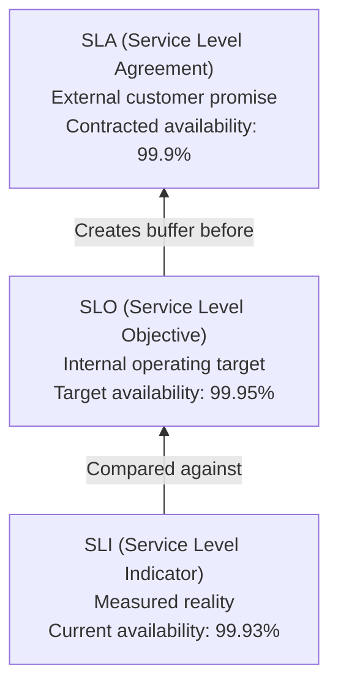
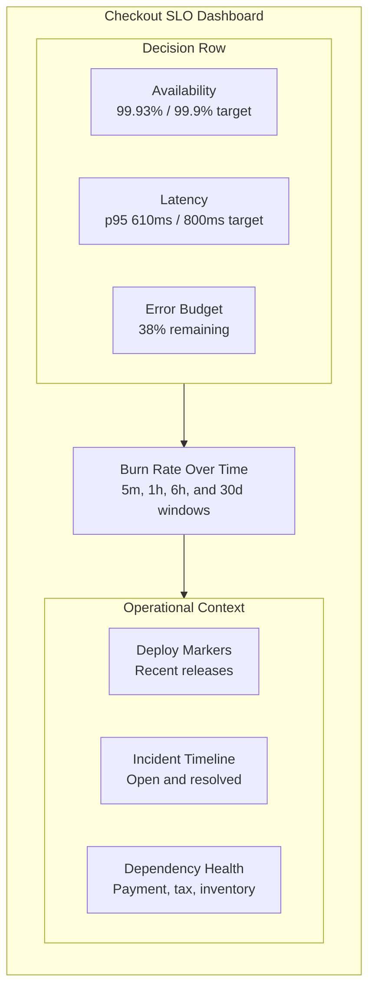

> **Discipline Module** | Complexity: `[MEDIUM]` | Time: 55-65 min

## Prerequisites

Before starting this module, you should be comfortable reading service dashboards, basic Kubernetes workload manifests, and Prometheus-style metric names.

- **Required**: [Module 1.1: What is SRE?](../module-1.1-what-is-sre/) because SLOs only make sense after you understand SRE as an operating model.
- **Required**: [Reliability Engineering Track](/platform/foundations/reliability-engineering/) because this module assumes you can reason about failure, redundancy, and user impact.
- **Recommended**: [Observability Theory Track](/platform/foundations/observability-theory/) because Prometheus queries are easier when counters, histograms, labels, and rates are familiar.

---

## Learning Outcomes

After completing this module, you will be able to:

- **Design** user-centered SLIs for availability, latency, quality, freshness, and coverage by mapping service behavior to what users actually experience.
- **Evaluate** whether an SLO target is realistic by comparing user expectations, dependency reliability, architectural limits, and business risk.
- **Calculate** error budgets and burn rates from raw request metrics, then interpret whether the current trend requires a page, a ticket, or no action.
- **Implement** Kubernetes-friendly SLO monitoring with Prometheus recording rules, alert rules, and dashboard panels that explain reliability in operational terms.
- **Compare** SLO-based alerting with symptom-based alerting and justify which signals should wake an on-call engineer.

## Why This Module Matters

At 09:10 on a Monday, a product director asks whether the checkout service is reliable enough for a major launch. One engineer says the pods are healthy, another says the database CPU looks high, support says there were a few complaints, and the incident commander says last week felt rough but not catastrophic. Everyone is looking at a different slice of reality, so the meeting turns into argument rather than decision.

That is the failure mode SLOs are designed to prevent. A Service Level Objective turns “the service feels okay” into a measurable agreement about which user experiences count as good enough. It gives engineers a target, gives product teams a vocabulary for trade-offs, and gives leadership a way to decide whether to spend the next sprint on features, reliability work, or operational cleanup.

SLOs are not a dashboard decoration. A useful SLO changes behavior: it determines when deployments should slow down, when reliability work outranks feature work, which alerts deserve a page, and how much risk a team can take while still respecting users. A weak SLO creates false confidence, while a strong SLO becomes a shared control system for the service.

This module starts with the vocabulary, then moves into design decisions, math, Kubernetes implementation, and review practices. The goal is not to memorize three acronyms. The goal is to build enough judgment that you can look at a service, choose meaningful indicators, set defensible targets, implement them in Prometheus, and explain what the resulting numbers mean when pressure is high.

---

## The SLI, SLO, and SLA Hierarchy

The most common SLO mistake is treating three related terms as interchangeable. They are connected, but they answer different questions. An SLI describes what happened, an SLO describes what the team is trying to achieve, and an SLA describes what the organization has promised externally.

An **SLI**, or Service Level Indicator, is a measurement of service behavior. It should come from real observations rather than intention. For an HTTP API, an SLI might be the ratio of successful requests to total requests, the 95th percentile latency for a specific route, or the percentage of responses that contain complete product data.

An **SLO**, or Service Level Objective, is an internal target for an SLI over a defined window. It is the team’s statement of “good enough” reliability. For example, a team might target 99.9% successful checkout requests over 30 days, or 95% of search requests under 250 milliseconds over seven days.

An **SLA**, or Service Level Agreement, is an external contract with consequences. It may include credits, refunds, support obligations, or legal terms. SLAs are usually less strict than SLOs because the internal target should provide warning before the external promise is at risk.

The hierarchy matters because each layer has a different audience. Engineers use SLIs to observe reality, teams use SLOs to make operational decisions, and customers or legal teams use SLAs to define contractual obligations. If those layers are inverted, the organization can violate promises before internal systems even say anything is wrong.

> **Stop and reason**: Your service has a customer-facing SLA of 99.9% availability, an internal SLO of 99.95%, and a measured SLI of 99.93% halfway through the month. Which group should be worried first: engineering, legal, or customers?



A healthy relationship usually looks like this: measured performance should normally exceed the SLO, and the SLO should be stricter than the SLA. That arrangement gives the team a buffer. The team can investigate a slipping SLO before customers experience a contract breach.

A dangerous relationship looks different. If the SLA is stricter than the SLO, engineering can be “green” internally while the company is already failing externally. If the SLO is much stricter than users need, the team may spend excessive time chasing reliability improvements that do not improve customer outcomes.

| Term | Question It Answers | Example | Primary Audience |
|---|---|---|---|
| SLI | What did users actually experience? | 99.93% of checkout requests returned a non-5xx status. | Engineers and incident responders |
| SLO | What level of service are we targeting internally? | 99.95% successful checkout requests over 30 days. | Engineering, product, and operations |
| SLA | What have we promised externally? | 99.9% monthly availability or service credits apply. | Customers, sales, support, and legal |

A useful SLO is therefore not just a number. It is an operating agreement. It says which user experiences matter, how they will be measured, what level is good enough, and what the team should do when the target is at risk.

## Choosing SLIs That Represent User Experience

A good SLI starts from the user’s point of view, not from whatever metric happens to be available first. CPU usage, pod restarts, replica counts, and queue depth may help diagnose a problem, but they rarely define whether users are receiving acceptable service. User-facing indicators describe outcomes that someone outside the cluster would notice.

The practical test is simple: if this metric changes, would a user care before an engineer explains it? A shopper cares that the product page loads quickly and shows the correct price. They do not care whether the service used 70% CPU while doing it. A platform team may care about CPU for capacity planning, but that does not make CPU a service level indicator.

This distinction is not academic. Teams that alert on infrastructure symptoms often wake people for events that do not affect users, and they sometimes miss events that do affect users. A service can have low CPU while returning wrong data, and it can have high CPU while serving every request successfully. SLOs force the team to separate user experience from implementation detail.

| Metric | Would a User Notice Directly? | Good SLI? | Better Use |
|---|---:|---:|---|
| HTTP 5xx rate for checkout requests | Yes | Yes | Availability SLI |
| 95th percentile checkout latency | Yes | Yes | Latency SLI |
| Product response missing price data | Yes | Yes | Quality SLI |
| Pod CPU utilization | Usually no | No | Capacity and diagnosis |
| Pod restart count | Usually no | No | Diagnosis and rollout health |
| Database connection pool saturation | Indirectly | Sometimes | Leading diagnostic signal |

Availability SLIs answer whether the operation succeeded. For an HTTP service, success might mean a 2xx or 3xx response for read paths and a committed transaction for write paths. For a queue consumer, success might mean the event was processed without dead-lettering. For a batch job, success might mean the report completed before the business deadline.

Latency SLIs answer whether the operation was fast enough. Latency is usually measured with percentiles rather than averages because averages hide tail pain. A checkout service with a 100 millisecond average can still have a painful 99th percentile if a meaningful slice of users waits several seconds.

Quality SLIs answer whether the response was correct or complete. A product page returning HTTP 200 with missing price data is not good service. A recommendation API that returns an empty list because a downstream model failed may look available while delivering degraded value.

Freshness SLIs answer whether data is current enough for the use case. A billing dashboard might tolerate data that is 30 minutes old, while an incident dashboard cannot. Freshness is especially important for caches, analytics pipelines, inventory systems, and replicated data stores.

Coverage SLIs answer whether all expected work was processed. A streaming pipeline can appear healthy while silently dropping events. A backup system can complete successfully for most tenants while missing a subset of critical databases. Coverage keeps the team honest about “partial success.”

| SLI Category | User-Centered Question | Typical Measurement | Kubernetes Example |
|---|---|---|---|
| Availability | Did the operation succeed? | Good requests divided by total requests | HTTP non-5xx ratio from ingress metrics |
| Latency | Did the operation finish fast enough? | Histogram percentile or threshold ratio | p95 request duration from app metrics |
| Quality | Was the response complete and correct? | Valid responses divided by total responses | Product pages with price and inventory fields |
| Freshness | Was the data recent enough? | Age of last successful update | Cache age exported by a controller |
| Coverage | Did we process all expected work? | Processed items divided by received items | Queue messages acknowledged before deadline |

When designing an SLI, define the numerator and denominator with care. “Successful requests divided by total requests” sounds obvious until you ask whether client-canceled requests, health checks, redirects, validation errors, and admin paths should count. The answer depends on the service contract and the user journey.

For example, a 400 response caused by invalid user input should not usually burn the service’s availability budget. A 500 response caused by the service failing to validate a normal checkout request should burn budget. A readiness probe should not count as a user request. A synthetic probe may count if it is intentionally measuring an external user path.

A useful SLI also has a clear boundary. “The platform is available” is too broad because it hides which service, route, tenant, or workflow is failing. “99.9% of POST /checkout requests from real users return a non-5xx response within 800 milliseconds over 30 days” is narrow enough to measure and act on.

> **Active learning prompt**: Pick one service you know. Write one availability SLI that excludes health checks and one latency SLI that focuses on the most important user operation. If you cannot define the denominator, the SLI is not ready yet.

## Setting SLO Targets Without Guesswork

A strong SLO target sits between user happiness and engineering reality. It should be strict enough to protect the experience users care about, but realistic enough that teams can still deploy, experiment, and recover from ordinary incidents. A target that is always missed becomes noise, while a target that is always met with huge margin may be too loose or too disconnected from the user journey.

Start with the user’s tolerance for failure. A payment authorization path needs a stricter target than an internal reporting page because the cost of failure is higher and the user’s patience is lower. A batch analytics job may not need high minute-by-minute availability if the real promise is completion before the morning business review.

Then compare the target with the architecture. A service running in one region with a single database dependency cannot honestly promise the same availability as a carefully engineered multi-region system. If a required third-party API has a 99.9% external commitment and you have no fallback, your user-facing target cannot be meaningfully higher unless you absorb that dependency failure with caching, queuing, graceful degradation, or another design.

Finally, consider what the target will do to team behavior. A 99.99% target allows roughly a few minutes of monthly unavailability, which can make normal deployments feel dangerous. That may be appropriate for a critical control plane, but it can be wasteful for a low-risk internal tool. SLOs are economic choices as much as technical choices.

| Service Type | User Expectation | Reasonable Starting SLO | Why This Starting Point Makes Sense |
|---|---|---|---|
| E-commerce checkout | Successful purchases with minimal interruption | 99.9% availability over 30 days | Lost transactions hurt revenue, but perfect uptime is usually not economical. |
| Internal analytics dashboard | Available during business hours with current data | 99.5% availability over 30 days | Users can often tolerate short outages if data is not used for live operations. |
| Critical incident paging service | Pages must arrive quickly and reliably | 99.99% availability over 30 days | Failure during incidents directly extends outages for other systems. |
| Nightly reporting batch | Complete before a morning deadline | 99% deadline success over 30 days | Continuous availability matters less than predictable completion time. |
| Public documentation site | Pages should load for readers | 99% availability over 30 days | CDN caching and lower business risk may justify a looser target. |

Targets should usually begin with observed reality. If the service has delivered 99.4% availability for the last three months, setting an immediate 99.99% SLO may express ambition but not operational truth. A better path is to set an achievable initial SLO, make the work visible, and tighten the target when architecture and practices improve.

This does not mean teams should sandbag. A target that simply matches current mediocre behavior can normalize poor service. The right target creates tension: it should be reachable with discipline, but missed when the team ignores reliability. That tension is what turns SLOs into a management tool rather than a vanity graph.

| Architecture Pattern | Rough Reliability Expectation | SLO Design Implication |
|---|---:|---|
| Single instance application with manual recovery | Low to moderate | Use modest SLOs and prioritize redundancy before strict commitments. |
| Replicated service behind a load balancer | Moderate | 99.9% may be realistic if dependencies and deploys are controlled. |
| Multi-zone service with automated rollback | Moderate to high | Consider stricter availability and latency targets for critical paths. |
| Multi-region active-active service | High | Higher targets may be justified, but operational complexity rises sharply. |
| Service with a single hard dependency | Bounded by dependency | Target must account for dependency failure unless fallback behavior exists. |

A common pattern is to use a primary 30-day SLO for business reporting, a seven-day view for trend detection, and shorter windows for alerting. The 30-day window gives enough data to avoid overreacting to tiny samples. Shorter windows show whether a recent deploy or dependency incident is burning the budget too quickly.

```yaml
availability_slo:
  name: checkout_success
  target: 99.9%
  primary_window: 30d
  review_windows:
    - 7d
    - 1d
  user_journey: "A real customer submits checkout and receives a non-5xx response."
  exclusions:
    - "Synthetic readiness probes"
    - "Client-side validation failures"
    - "Requests cancelled before reaching the service"
```

The target should also name exclusions explicitly. Exclusions are not loopholes; they are part of measurement design. Without them, teams will argue during incidents about whether the data is fair. With them, the team can focus on whether the service is meeting the agreed user promise.

> **Pause and predict**: Your service depends synchronously on a third-party tax API with a 99.9% SLA. You want a 99.95% checkout availability SLO. What architectural feature would make that target defensible?

## SLO Math and Error Budgets

SLO math is the bridge between reliability goals and operational decisions. The target defines how much unreliability the service can tolerate, and that allowance is the error budget. If the team spends the budget slowly, it can keep shipping. If the team burns the budget quickly, reliability work becomes the priority.

For an availability SLO, the budget is simply one minus the target. A 99.9% SLO allows 0.1% of measured events to be bad. Over a fixed time window, that can be expressed as minutes of downtime, failed requests, missed jobs, stale responses, or any other unit that matches the SLI.

The request-based view is often more precise than the time-based view. If an API receives most of its traffic during business hours, ten minutes of failure at peak time hurts more users than ten minutes at midnight. Request-based SLOs naturally weight failure by traffic, which often aligns better with user impact.

| SLO Target | Allowed Error Rate | Approximate Downtime per 30 Days | Failed Requests per 1,000,000 |
|---|---:|---:|---:|
| 99% | 1% | 7.2 hours | 10,000 |
| 99.5% | 0.5% | 3.6 hours | 5,000 |
| 99.9% | 0.1% | 43.2 minutes | 1,000 |
| 99.95% | 0.05% | 21.6 minutes | 500 |
| 99.99% | 0.01% | 4.32 minutes | 100 |
| 99.999% | 0.001% | 25.9 seconds | 10 |

Burn rate describes how quickly the service is consuming that budget. A burn rate of 1 means the current error rate would use exactly the allowed budget over the full window. A burn rate of 2 means the budget is being consumed twice as fast as planned. A burn rate below 1 means the service is currently healthier than the target requires.

```text
Allowed error rate = 1 - SLO target

Burn rate = Actual error rate / Allowed error rate

For a 99.9% SLO:
  Allowed error rate = 1 - 0.999 = 0.001 = 0.1%

If actual error rate is 0.5%:
  Burn rate = 0.5% / 0.1% = 5

If the 30-day budget is consumed at 5x:
  Budget lasts = 30 days / 5 = 6 days
```

The important skill is interpretation, not arithmetic. A 5x burn rate for one minute might be noise during a tiny traffic sample. A 5x burn rate for an hour on a critical path may justify freezing risky deploys and starting incident response. SLOs help you ask whether the service is failing users fast enough to require action.

Error budgets also turn reliability into a shared trade-off with product teams. When plenty of budget remains, the team can take reasonable delivery risk. When budget is nearly exhausted, the conversation changes. Feature work may pause, deploys may require additional review, and reliability fixes may move to the top of the backlog.

| Budget State | Operational Meaning | Typical Decision |
|---|---|---|
| More than 75% remaining late in the window | Reliability margin is healthy or target may be loose | Continue normal deploys and review whether the target should tighten. |
| 25% to 75% remaining | Budget is being used but not exhausted | Watch trends and prioritize fixes that reduce recurring burn. |
| Less than 25% remaining | Little room remains for additional failure | Reduce risky changes and focus on reliability debt. |
| Budget exhausted | The service missed its reliability objective | Run a review, repair causes, and adjust release policy until stable. |

Composite SLOs combine multiple user requirements into one definition of “good.” For a checkout request, a response might count as good only if it succeeds, returns within 800 milliseconds, and includes a valid order confirmation identifier. This is often better than separate dashboards that each look green while the combined experience is bad.

Composite SLOs also make trade-offs visible. A service might have excellent availability but poor latency, or good latency with incomplete data. Users experience the whole request, so the SLO should sometimes measure the whole request. The danger is complexity: if the composite definition becomes hard to explain, teams may stop trusting it.

```text
Example good event definition for checkout:

A request is good when all conditions are true:
  - It is a real user checkout request.
  - The response status is not 5xx.
  - The response completes within 800 milliseconds.
  - The response includes a confirmation_id field.

Composite SLI:
  good_checkout_requests / total_real_checkout_requests
```

> **Active learning prompt**: Imagine your team has 90% of its monthly error budget left on the last day of the month. Write two possible interpretations: one that suggests excellent engineering, and one that suggests the SLO is not ambitious enough.

## Worked Example: From Raw Metrics to Final SLO Output

Before implementing recording rules, walk through the calculation with small numbers. This makes the Prometheus queries easier to trust because every aggregation has a visible purpose. The example below uses request counters from a Kubernetes service called `checkout-api` running behind an ingress controller.

Assume the service exposes a counter named `http_requests_total` with labels for `service`, `route`, and `status`. Prometheus stores the counter as an increasing value. The `rate()` function converts counter growth into requests per second over a time window, which is what you need for ratios.

Here is a simplified five-minute snapshot for the checkout route. The numbers are already converted from counter deltas into request counts for teaching clarity. In Prometheus you would normally use rates, but the ratio logic is the same.

| Route | Status Class | Requests in 5 Minutes | Counts as Good? | Reason |
|---|---:|---:|---:|---|
| `/checkout` | 2xx | 9,620 | Yes | Customer received a successful response. |
| `/checkout` | 3xx | 180 | Yes | Redirect completed the expected flow. |
| `/checkout` | 4xx | 140 | Usually neutral | Many are user input errors and may be excluded. |
| `/checkout` | 5xx | 60 | No | Service failed the user request. |
| `/healthz` | 2xx | 1,500 | Excluded | Probe traffic is not user experience. |

The first design decision is the denominator. If the SLI is “real checkout requests,” the health check traffic is excluded. If the team decides ordinary 4xx responses should not burn budget, those can also be excluded from both numerator and denominator. That leaves 9,620 successful 2xx responses, 180 acceptable redirects, and 60 failed 5xx responses.

```text
Raw input after exclusions:

Good requests:
  2xx checkout requests = 9,620
  3xx checkout requests = 180
  total good requests   = 9,800

Bad requests:
  5xx checkout requests = 60

Total measured requests:
  good requests + bad requests = 9,800 + 60 = 9,860

Availability SLI:
  good / total = 9,800 / 9,860 = 0.9939148 = 99.39148%
```

Now compare the measured SLI with the target. Suppose the SLO target is 99.9% over 30 days. The allowed error rate is 0.1%. In this five-minute window, the actual error rate is about 0.6085%. That is far above the target, but the response depends on how long the condition persists and how much traffic is affected.

```text
Target:
  SLO target = 99.9%
  allowed error rate = 100% - 99.9% = 0.1%

Observed:
  availability = 99.39148%
  actual error rate = 100% - 99.39148% = 0.60852%

Burn rate:
  actual error rate / allowed error rate = 0.60852% / 0.1% = 6.0852

Interpretation:
  The service is burning error budget about 6.1 times faster than planned.
  If this persisted for a full 30-day window, the budget would last about 4.9 days.
```

The same calculation can be expressed with Prometheus. The numerator sums good checkout request rates. The denominator sums good and bad measured checkout request rates. The query excludes health checks and excludes ordinary 4xx responses because this team decided user validation errors are not service failures.

```promql
sum(rate(http_requests_total{
  service="checkout-api",
  route="/checkout",
  status=~"2..|3.."
}[5m]))
/
sum(rate(http_requests_total{
  service="checkout-api",
  route="/checkout",
  status!~"4.."
}[5m]))
```

To convert that SLI into burn rate, Prometheus calculates the current bad ratio and divides it by the allowed bad ratio. The bad ratio is one minus the availability ratio. For a 99.9% SLO, the allowed bad ratio is `0.001`.

```promql
(
  1 -
  (
    sum(rate(http_requests_total{service="checkout-api", route="/checkout", status=~"2..|3.."}[5m]))
    /
    sum(rate(http_requests_total{service="checkout-api", route="/checkout", status!~"4.."}[5m]))
  )
)
/
0.001
```

The final SLO output should be something an operator can act on. A dashboard can show the measured availability, target, error budget remaining, and burn rate. An alert can page only when burn rate is high enough for long enough that the budget is genuinely at risk.

```text
Final operator-facing output for this five-minute window:

Service: checkout-api
User journey: POST /checkout
Availability SLI: 99.391%
SLO target: 99.9%
Allowed error rate: 0.1%
Observed error rate: 0.609%
Current burn rate: 6.1x
Decision: investigate quickly; page only if paired long-window burn also confirms sustained impact.
```

This worked example is intentionally small, but the sequence is the same in production. Define the user journey, decide which events count, calculate good and total events, compare the ratio with the target, convert the gap into burn rate, and choose an operational response. Recording rules exist to automate those steps, not to hide them.

## Implementing SLOs in Kubernetes

In Kubernetes, SLO implementation usually combines application metrics, Prometheus recording rules, alerting rules, and a dashboard. Kubernetes itself does not know whether users are happy. It knows about Pods, Services, Deployments, and health probes. You need service-level instrumentation to connect cluster behavior to user outcomes.

A common pattern is to emit HTTP request counters and duration histograms from the application, scrape them with Prometheus, and write recording rules that turn raw labels into stable SLI series. Stable recording rules are important because dashboards and alerts should not repeat complex queries everywhere. When the SLI definition changes, you update the rule once.

The example below assumes the application exports `http_requests_total` and `http_request_duration_seconds_bucket`. The service label identifies the workload, the route label identifies the user journey, and the status label separates success from failure. Your actual label names may differ, but the structure should be similar.

```yaml
apiVersion: monitoring.coreos.com/v1
kind: PrometheusRule
metadata:
  name: checkout-slo-rules
  namespace: observability
spec:
  groups:
    - name: checkout.slo
      interval: 30s
      rules:
        - record: sli:checkout_availability:ratio_rate5m
          expr: |
            sum(rate(http_requests_total{
              service="checkout-api",
              route="/checkout",
              status=~"2..|3.."
            }[5m]))
            /
            sum(rate(http_requests_total{
              service="checkout-api",
              route="/checkout",
              status!~"4.."
            }[5m]))

        - record: sli:checkout_availability:ratio_rate30d
          expr: |
            sum(rate(http_requests_total{
              service="checkout-api",
              route="/checkout",
              status=~"2..|3.."
            }[30d]))
            /
            sum(rate(http_requests_total{
              service="checkout-api",
              route="/checkout",
              status!~"4.."
            }[30d]))

        - record: sli:checkout_latency:p95_rate5m
          expr: |
            histogram_quantile(
              0.95,
              sum(rate(http_request_duration_seconds_bucket{
                service="checkout-api",
                route="/checkout"
              }[5m])) by (le)
            )

        - record: slo:checkout_error_budget_remaining:ratio
          expr: |
            1 - (
              (1 - sli:checkout_availability:ratio_rate30d)
              /
              (1 - 0.999)
            )

        - record: slo:checkout_burn_rate:ratio_rate5m
          expr: |
            (1 - sli:checkout_availability:ratio_rate5m)
            /
            (1 - 0.999)
```

Notice that the recording rule names encode the intent. `sli:` series describe measured indicators, while `slo:` series describe interpretation against a target. This naming convention helps dashboard authors and incident responders understand whether they are looking at raw user experience or budget math.

Latency can be represented in two different ways. A percentile query such as p95 is intuitive for dashboards, but a threshold ratio can be better for SLO math because it counts good events directly. For example, “95% of checkout requests complete under 800 milliseconds” can be measured as the ratio of histogram buckets at or below 0.8 seconds to all requests.

```yaml
apiVersion: monitoring.coreos.com/v1
kind: PrometheusRule
metadata:
  name: checkout-latency-slo-rules
  namespace: observability
spec:
  groups:
    - name: checkout.latency.slo
      interval: 30s
      rules:
        - record: sli:checkout_latency_under_800ms:ratio_rate5m
          expr: |
            sum(rate(http_request_duration_seconds_bucket{
              service="checkout-api",
              route="/checkout",
              le="0.8"
            }[5m]))
            /
            sum(rate(http_request_duration_seconds_count{
              service="checkout-api",
              route="/checkout"
            }[5m]))

        - record: slo:checkout_latency_burn_rate:ratio_rate5m
          expr: |
            (1 - sli:checkout_latency_under_800ms:ratio_rate5m)
            /
            (1 - 0.95)
```

Multi-window burn-rate alerts reduce false positives by requiring both fast and sustained evidence. A short window detects rapid budget burn, while a longer window confirms the problem is not a tiny spike. This is why many mature SLO alerts use paired conditions rather than a single threshold.

```yaml
apiVersion: monitoring.coreos.com/v1
kind: PrometheusRule
metadata:
  name: checkout-slo-alerts
  namespace: observability
spec:
  groups:
    - name: checkout.slo.alerts
      rules:
        - alert: CheckoutFastBurn
          expr: |
            (
              (
                1 - sli:checkout_availability:ratio_rate5m
              ) / (1 - 0.999) > 14.4
            )
            and
            (
              (
                1 - sli:checkout_availability:ratio_rate1h
              ) / (1 - 0.999) > 14.4
            )
          for: 2m
          labels:
            severity: page
            service: checkout-api
          annotations:
            summary: "Checkout is burning availability budget rapidly"
            description: "The checkout availability SLO is burning budget fast across both 5m and 1h windows."

        - alert: CheckoutSlowBurn
          expr: |
            (
              (
                1 - sli:checkout_availability:ratio_rate30m
              ) / (1 - 0.999) > 6
            )
            and
            (
              (
                1 - sli:checkout_availability:ratio_rate6h
              ) / (1 - 0.999) > 6
            )
          for: 15m
          labels:
            severity: ticket
            service: checkout-api
          annotations:
            summary: "Checkout availability budget burn is elevated"
            description: "The checkout availability SLO is consuming budget faster than planned across medium windows."
```

The rule above references `ratio_rate1h`, `ratio_rate30m`, and `ratio_rate6h`, so production configuration should define those recording rules as well. The pattern is the same as the 5-minute rule, only the range window changes. Recording those windows separately keeps alert expressions readable.

After applying the rules, use `kubectl` to verify that the PrometheusRule object exists. Many Kubernetes engineers alias `kubectl` to `k` for speed; after that alias is explained, this module uses `k` in command examples. The alias is optional, and the full command works the same way.

```bash
alias k=kubectl
k apply -f checkout-slo-rules.yaml
k apply -f checkout-slo-alerts.yaml
k get prometheusrule -n observability
k describe prometheusrule checkout-slo-rules -n observability
```

The most common implementation failure is label mismatch. If the application exports `handler` instead of `route`, or `app` instead of `service`, the query may return no data. Always test the raw query in Prometheus before relying on a recording rule, and verify that the denominator is non-zero during normal traffic.

```bash
k port-forward -n observability svc/prometheus-operated 9090:9090
```

Once the port-forward is active, query Prometheus at `http://127.0.0.1:9090` and inspect the raw metric labels. Avoid hard-coding assumptions from another service. SLO implementation is only as reliable as the instrumentation contract between the application and the monitoring system.

## Designing Dashboards That Drive Decisions

An SLO dashboard should answer operational questions, not merely display impressive charts. The first screen should tell a responder whether users are currently receiving acceptable service, whether the service is meeting its target over the primary window, how much budget remains, and whether burn rate requires action.

A dashboard that starts with CPU, memory, and pod counts may be useful for diagnosis, but it should not be the SLO dashboard’s headline. Those signals explain why the service might be failing after the SLO indicates user impact. Put user experience first, then diagnostics below.



Good dashboard labels should match the SLO document. If the SLO says “real checkout requests excluding validation errors,” the dashboard should not simply say “availability.” Clear labels prevent misunderstandings during incidents, when people have little patience for hidden definitions.

A mature dashboard also shows deploy markers, incident annotations, and dependency health. SLOs do not replace debugging context. They help decide whether debugging is urgent and user-impacting. Once the decision is made, engineers still need traces, logs, Kubernetes events, dependency graphs, and rollout history.

| Dashboard Panel | Question It Answers | Design Guidance |
|---|---|---|
| Current SLI value | Are users currently receiving good service? | Show current value next to target and use plain service language. |
| Error budget remaining | How much reliability margin is left? | Show primary 30-day value and avoid hiding negative budget states. |
| Burn rate windows | How fast is the budget being consumed? | Show short, medium, and long windows together for context. |
| SLO history | Is this a recurring pattern? | Show prior windows and missed periods to support review. |
| Deploy annotations | Did a change correlate with budget burn? | Overlay production releases and rollback events. |
| Dependency status | Is failure likely internal or upstream? | Show key synchronous dependencies near SLO panels. |

The dashboard should support product and engineering conversations as well as incident response. A product manager should be able to see whether reliability work is justified. An engineer should be able to see which service path is failing. A platform team should be able to compare SLO patterns across many services without reading every Prometheus expression.

## SLO-Based Alerting and Operational Policy

Traditional alerting often starts with symptoms: CPU is high, memory is low, a pod restarted, a disk is filling, or a queue is growing. Those alerts can be useful, but they should not all page humans. SLO-based alerting pages when user experience is degrading fast enough to threaten the objective.

The key question is not “is something unusual happening?” The key question is “are we spending user-impact budget too quickly?” A service can have unusual internals while still serving users well. A different service can look quiet internally while returning incomplete data. SLO alerts align pages with user impact.

| Traditional Alert | Problem With Paging Directly | SLO-Based Alternative |
|---|---|---|
| CPU above 85% for five minutes | High CPU may mean efficient utilization during normal traffic. | Page only if availability or latency budget burns quickly. |
| Pod restarted once | A restart may be self-healed and invisible to users. | Track restarts as diagnostic context below SLO panels. |
| Queue depth above a fixed number | Queue size needs workload and deadline context. | Alert when processing coverage or freshness SLO is at risk. |
| Error rate above 1% | One threshold ignores each service’s reliability target. | Alert when burn rate exceeds the allowed error budget pace. |
| p99 latency above fixed threshold | Tail spikes may affect too little traffic to justify a page. | Use latency SLI ratio and burn windows for user impact. |

Burn-rate thresholds should reflect urgency. A very high short-window burn rate can exhaust a monthly budget in hours, so it may deserve a page. A moderate burn rate over several hours may deserve a ticket or daytime investigation. A slight elevation may only deserve dashboard visibility.

The alert should also include enough context for the first response. A page that says “SLO burn high” is better than “CPU high,” but it is still incomplete. Include service, user journey, target, current SLI, burn windows, dashboard link, and runbook link. The responder should not have to reverse-engineer the alert while tired.

Operational policy is where SLOs become real. If the team misses an SLO but nothing changes, the SLO is decorative. Teams should decide ahead of time what happens when budget is healthy, when burn is elevated, when the budget is nearly exhausted, and when the objective is missed.

```text
Example SLO policy:

Healthy budget:
  Normal deployments continue.
  Reliability work competes with feature work through normal planning.

Elevated burn:
  On-call investigates trend during business hours unless page threshold is met.
  Recent deploys and dependency changes are reviewed.

Low remaining budget:
  Risky deployments require explicit approval from service owner.
  Reliability fixes and rollback safety work move ahead of discretionary features.

Budget exhausted:
  Team runs a review focused on causes, detection, and prevention.
  Release policy tightens until the service returns to a healthy trend.
```

This policy should be negotiated with product leadership before an incident. Otherwise, the first serious SLO miss becomes a political argument about whether reliability matters more than a planned launch. SLOs work best when they make trade-offs explicit before emotions are high.

## DORA Metrics and SLOs

SLOs measure reliability from the user’s perspective, while DORA metrics measure software delivery performance. They answer different questions, but together they describe whether a team can move quickly without repeatedly harming users. A team with high deployment frequency and healthy SLOs is in a very different place from a team that deploys often by burning reliability budget.

The four DORA metrics are deployment frequency, lead time for changes, change failure rate, and mean time to recovery. These metrics reveal how effectively the delivery system moves change into production and recovers from failure. SLOs reveal whether that delivery system is preserving the service experience users need.

| DORA Metric | What It Measures | How SLOs Connect |
|---|---|---|
| Deployment frequency | How often changes reach production | Healthy error budgets can support frequent deployment with controlled risk. |
| Lead time for changes | Time from commit to production | Reliable automation reduces delay without bypassing safety. |
| Change failure rate | Share of deployments causing incidents | Failed changes consume error budget and should drive prevention work. |
| Mean time to recovery | Time to restore service after failure | SLO alerts should detect meaningful user impact quickly. |

An overly strict SLO can damage delivery if the architecture and testing practices are not ready. Teams may become afraid to deploy, lead time grows, and changes become larger because releases are delayed. That makes each deployment riskier, which can increase change failure rate. Reliability targets should raise standards without freezing learning.

An overly loose SLO has the opposite problem. The team may ship quickly while users quietly suffer. DORA metrics may look strong because deployments are frequent and lead time is low, but the business impact is hidden in support tickets, abandoned carts, or lost trust. SLOs keep delivery metrics honest by adding user outcome constraints.

> **Pause and predict**: A team improves deployment frequency from weekly to daily, but its 30-day availability budget is exhausted halfway through each month. Which two DORA metrics would you inspect next, and what would you expect to find?

Platform teams can use SLO and DORA data together to prioritize platform investments. If many teams have long lead times but healthy error budgets, the platform may need better self-service delivery. If many teams have high change failure rates and repeated SLO misses, the platform may need safer rollout patterns, better observability templates, or automated rollback support.

## Reviewing and Evolving SLOs

SLOs should be reviewed on a regular cadence because services, users, dependencies, and business priorities change. A target that made sense for a prototype may be too loose after the service becomes revenue-critical. A target that made sense for a synchronous architecture may become too strict after the product adds graceful degradation.

A quarterly review is a useful default for stable services. High-growth services may need more frequent review, especially after traffic shifts, large launches, or architecture migrations. The review should examine whether the SLI still reflects user experience, whether the target still matches business need, and whether alert behavior produced useful action.

A good review uses evidence rather than vibes. Look at budget consumption, incidents, support tickets, user complaints, deploy history, and dependency failures. Compare SLO status with what customers actually felt. If the dashboard was green while customers were angry, the SLI is wrong. If the dashboard was red while nobody cared, the target or denominator may be wrong.

| Review Question | Evidence to Inspect | Possible Change |
|---|---|---|
| Did the SLI reflect real user pain? | Support tickets, incident reports, user analytics | Add quality, freshness, or journey-specific indicators. |
| Was the target realistic? | Historical SLI data and dependency reliability | Tighten or loosen the SLO with explicit justification. |
| Did alerts produce action? | Alert history and incident timelines | Tune burn windows, severity, or routing. |
| Did teams change behavior based on budget? | Deployment decisions and planning notes | Clarify operational policy or escalation rules. |
| Did exclusions hide real impact? | Excluded traffic samples and customer reports | Narrow exclusions or split the SLO by journey. |

SLO changes should be documented. When a target changes, record why it changed, what data supported the decision, and when it will be reviewed again. This prevents future teams from treating the number as sacred without understanding its origin.

## Did You Know?

1. Google’s SRE practice popularized error budgets as a way to balance reliability and velocity, but the idea only works when product and engineering both honor the budget policy.

2. A request-based SLO often represents user impact better than a time-based uptime SLO because high-traffic periods naturally carry more weight in the calculation.

3. Burn rate is dimensionless, which makes it useful across services with different traffic levels because it compares actual failure pace against each service’s own allowed pace.

4. Some mature organizations publish internal SLO catalogs so platform teams can compare service reliability patterns and reuse proven SLI templates.

## Common Mistakes

| Mistake | Why It Hurts | Better Practice |
|---|---|---|
| Treating SLOs and SLAs as the same number | The team loses the early warning buffer needed before contractual consequences occur. | Set internal SLOs stricter than external SLAs and monitor the gap. |
| Choosing infrastructure metrics as SLIs | CPU and memory often explain symptoms but do not directly represent user experience. | Define SLIs around successful, timely, complete user operations. |
| Setting 99.99% for every service | Strict targets are expensive and can slow delivery without improving user value. | Match targets to business criticality, architecture, and user tolerance. |
| Ignoring denominator design | Health checks, validation errors, or admin traffic can distort the measured experience. | Define included and excluded events before writing Prometheus rules. |
| Alerting on every brief SLO violation | Short spikes can create alert fatigue when they do not threaten the budget. | Use multi-window burn-rate alerts with severity tied to urgency. |
| Building dashboards without policy | Teams can see budget burn but still argue about what action to take. | Agree in advance how budget states affect deploys and priorities. |
| Never reviewing targets | SLOs drift away from reality as traffic, users, and architecture change. | Review SLOs quarterly or after major incidents and launches. |
| Hiding quality failures behind availability | HTTP 200 responses can still deliver broken, stale, or incomplete results. | Add quality, freshness, or coverage SLIs when success requires more than status codes. |

## Quiz: Apply the Concepts

### Question 1

Your team owns a checkout service with a 99.9% customer SLA, a 99.95% internal SLO, and a current 30-day measured availability of 99.92%. Sales asks whether the service is “fine” because the SLA has not been breached. How should you evaluate the situation, and what action should engineering take?

<details>
<summary>Show Answer</summary>

The service has not breached the customer SLA, but it has breached the internal SLO because 99.92% is below the 99.95% target. Engineering should treat this as an early warning rather than a legal emergency. The correct action is to inspect burn rate, incident causes, and remaining budget, then prioritize fixes or reduce risky deploys before the service falls below the 99.9% SLA. This is exactly why the SLO should be stricter than the SLA.

</details>

### Question 2

A product page API returns HTTP 200 for nearly every request, so the availability SLO is green. Support reports that many customers see pages without prices because the pricing dependency sometimes times out and the frontend renders incomplete data. What SLI should you add, and why is availability alone insufficient?

<details>
<summary>Show Answer</summary>

You should add a quality SLI that measures the ratio of product responses containing required fields such as price and availability. Availability alone is insufficient because HTTP success does not prove the response is useful. From the user’s perspective, a product page without a price is degraded even if the API returned 200. The SLO should count complete and correct responses, not merely technically successful responses.

</details>

### Question 3

A service with a 99.9% availability SLO receives 2,000,000 measured user requests in a 30-day window. During that window, 3,800 requests fail with 5xx responses. Calculate whether the SLO was met, and explain the operational meaning of the result.

<details>
<summary>Show Answer</summary>

A 99.9% SLO allows 0.1% bad requests, so the service can fail 2,000 requests out of 2,000,000. It failed 3,800 requests, which is 0.19% bad and 99.81% availability. The SLO was not met. Operationally, the team exhausted its error budget and should run a review, identify the main sources of failure, and adjust release or reliability priorities until the trend improves.

</details>

### Question 4

Your Prometheus availability query includes `/healthz` readiness probes in both the numerator and denominator. The probes generate more traffic than real users, and they almost always succeed. During a user-facing outage, the SLO dashboard barely moves. What is wrong with the SLI design, and how should you fix it?

<details>
<summary>Show Answer</summary>

The denominator is polluted with non-user traffic, so the SLI no longer represents user experience. Successful health checks dilute real request failures and make the service look healthier than it is. The fix is to exclude probe routes from the SLI and define the denominator around real user journeys, such as `/checkout` or `/product/:id`, depending on the service objective.

</details>

### Question 5

A team pages on `CPU > 85% for 5 minutes` and receives frequent overnight alerts, but the SLO dashboard shows healthy availability, latency, and quality. The team proposes raising the CPU threshold to 95%. How would you evaluate that proposal?

<details>
<summary>Show Answer</summary>

Raising the CPU threshold may reduce noise, but it does not solve the design problem. CPU is a diagnostic or capacity signal, not usually a paging signal. If user-facing SLIs remain healthy, the CPU alert should probably become a ticket, dashboard annotation, or capacity warning rather than an overnight page. Paging should be tied to SLO burn rate or another direct user-impact signal.

</details>

### Question 6

A checkout service has a 99.9% SLO, so its allowed error rate is 0.1%. A new deployment causes a sustained 0.8% error rate for checkout requests over the last 30 minutes. Calculate the burn rate and decide whether this should be treated as urgent.

<details>
<summary>Show Answer</summary>

The burn rate is 0.8% divided by 0.1%, which equals 8x. This is urgent because the service is consuming budget eight times faster than planned, and the condition has persisted for 30 minutes rather than appearing as a tiny spike. The team should inspect the deployment, consider rollback or mitigation, and check longer burn windows to decide whether the alert should page or remain a high-priority incident response action.

</details>

### Question 7

Your team wants to set a 99.99% SLO for an internal dashboard used by finance twice per day. Historical data shows 99.6% availability, most outages occur outside finance working hours, and users mainly need reports ready by 08:00. What SLO design would you recommend instead?

<details>
<summary>Show Answer</summary>

A strict 99.99% continuous availability SLO is probably misaligned with the user need and current architecture. A better design would include a deadline or freshness SLO, such as reports complete by 08:00 on business days, plus a modest availability SLO during finance working hours. This aligns measurement with the actual user journey and avoids expensive reliability work that may not improve the business outcome.

</details>

### Question 8

A platform team notices that one service always finishes the month with nearly all error budget remaining, while another exhausts its budget by mid-month. Both teams claim their SLOs prove they are operating correctly. How should the platform team compare these services without jumping to conclusions?

<details>
<summary>Show Answer</summary>

The platform team should review each SLI definition, target, user journey, dependency profile, and historical incident pattern. The first service may be excellent, or its SLO may be too loose or pointed at the wrong journey. The second service may have poor reliability, or it may have an ambitious target for a critical workflow. Comparing budget state alone is not enough; the review must evaluate whether each SLO is meaningful, realistic, and aligned with user impact.

</details>

## Hands-On Exercise: Design and Implement an SLO for a Kubernetes Service

In this exercise, you will design SLOs for a user-facing e-commerce product page and then turn one of them into Prometheus recording rules. The goal is to practice the full sequence: define the user journey, choose SLIs, set targets, calculate budgets, write rules, and decide how alerts should behave.

### Scenario

Your team owns a product page service running on Kubernetes 1.35 or later. The page displays product details, pricing, inventory, and delivery estimates. The service receives about 100,000 real user requests per day, and failed or incomplete pages reduce sales because customers cannot confidently add items to their cart.

The application exports two Prometheus metrics: `http_requests_total` and `http_request_duration_seconds_bucket`. It also exports `product_page_responses_total{complete="true|false"}` to indicate whether the response included all required business fields. Health checks are served from `/healthz` and must not count as user traffic.

### Step 1: Define the User Journey

Write a short SLO description that names the service, route, users, and business outcome. Avoid vague language such as “the product service should be reliable.” Your description should be specific enough that another engineer can identify which traffic belongs in the denominator.

- [ ] The description names the service and route or operation being measured.
- [ ] The description explains why the journey matters to users or the business.
- [ ] The description states which traffic should be excluded from measurement.

Example shape:

```yaml
journey:
  service: product-page
  operation: "GET /products/:id"
  user: "real shoppers viewing product details"
  business_reason: "Incomplete or slow product pages reduce add-to-cart conversion"
  exclusions:
    - "GET /healthz readiness and liveness probes"
    - "Synthetic load tests unless explicitly marked as user simulation"
```

### Step 2: Define Three SLIs

Define one availability SLI, one latency SLI, and one quality SLI. For each SLI, write the numerator, denominator, and why the metric reflects user experience. Do not use CPU, memory, or pod restart count as an SLI.

- [ ] Availability SLI distinguishes successful product page responses from service failures.
- [ ] Latency SLI uses a percentile or threshold that matches user experience.
- [ ] Quality SLI catches incomplete responses that still return HTTP 200.
- [ ] Each SLI defines included and excluded traffic.

Use this structure:

```yaml
slis:
  availability:
    numerator: "Real product page requests returning 2xx or 3xx"
    denominator: "Real product page requests excluding health checks and ordinary validation failures"
    user_reason: "A shopper needs the page to load successfully before buying"

  latency:
    numerator: "Real product page requests completed under 500ms"
    denominator: "All real product page requests"
    user_reason: "Slow pages reduce confidence and conversion"

  quality:
    numerator: "Responses containing product details, price, inventory, and delivery estimate"
    denominator: "All successful product page responses"
    user_reason: "A technically successful response is still bad if required fields are missing"
```

### Step 3: Set SLO Targets and Justify Them

Choose targets for each SLI over a 30-day window. The product page is important, but it is not a life-safety system. Your justification should mention user expectations, traffic volume, architecture, and the cost of over-tightening the target.

- [ ] Targets are realistic for a replicated Kubernetes service with ordinary dependencies.
- [ ] Targets are strict enough to protect a revenue-relevant user journey.
- [ ] Justifications explain trade-offs instead of simply saying “high availability.”
- [ ] The availability SLO is not stricter than the architecture can plausibly support.

Example:

```yaml
slos:
  - name: product_page_availability
    target: 99.9%
    window: 30d
    justification: "Revenue-relevant path with high traffic, but brief failures are recoverable"

  - name: product_page_latency_under_500ms
    target: 95%
    window: 30d
    justification: "Most users should receive a fast page, while rare tail events are tracked separately"

  - name: product_page_quality
    target: 99.5%
    window: 30d
    justification: "Incomplete price or inventory data directly damages buying decisions"
```

### Step 4: Calculate the Availability Error Budget

Use the daily traffic estimate to calculate the request-based budget. Then calculate the approximate time-based budget for comparison. Explain which one you would use for operations and why.

- [ ] Request budget uses 100,000 requests per day over 30 days.
- [ ] Time budget uses 30 days and the chosen availability target.
- [ ] Your explanation distinguishes traffic-weighted impact from clock-time outage.
- [ ] The final answer states how many failed requests the service can tolerate.

Calculation template:

```text
Monthly requests:
  100,000 requests/day * 30 days = 3,000,000 requests

For 99.9% availability:
  Allowed bad ratio = 1 - 0.999 = 0.001
  Request budget = 3,000,000 * 0.001 = 3,000 failed requests

Time budget:
  30 days * 24 hours * 60 minutes * 0.001 = 43.2 minutes
```

### Step 5: Write Prometheus Recording Rules

Write recording rules for availability, quality, and a five-minute availability burn rate. Use your own label names if needed, but keep the numerator and denominator aligned with your SLI definitions. If you test these in a real cluster, apply them with `k apply -f <file>` after verifying the metric labels in Prometheus.

- [ ] Recording rules exclude `/healthz` or other probe traffic.
- [ ] Availability counts only the status classes you defined as good.
- [ ] Quality uses the exported completeness metric rather than HTTP status alone.
- [ ] Burn rate divides observed bad ratio by allowed bad ratio.

Example solution:

```yaml
apiVersion: monitoring.coreos.com/v1
kind: PrometheusRule
metadata:
  name: product-page-slo-rules
  namespace: observability
spec:
  groups:
    - name: product-page.slo
      interval: 30s
      rules:
        - record: sli:product_page_availability:ratio_rate5m
          expr: |
            sum(rate(http_requests_total{
              service="product-page",
              route="/products/:id",
              status=~"2..|3.."
            }[5m]))
            /
            sum(rate(http_requests_total{
              service="product-page",
              route="/products/:id",
              status!~"4.."
            }[5m]))

        - record: sli:product_page_quality:ratio_rate5m
          expr: |
            sum(rate(product_page_responses_total{
              service="product-page",
              complete="true"
            }[5m]))
            /
            sum(rate(product_page_responses_total{
              service="product-page"
            }[5m]))

        - record: slo:product_page_availability_burn_rate:ratio_rate5m
          expr: |
            (1 - sli:product_page_availability:ratio_rate5m)
            /
            (1 - 0.999)
```

### Step 6: Define Alert Behavior

Create a page-level alert and a ticket-level alert. The page-level alert should require fast burn and sustained confirmation. The ticket-level alert should catch slower budget consumption before the end of the window. Include the action you expect responders to take.

- [ ] Page alert is tied to urgent budget burn rather than raw CPU or pod count.
- [ ] Ticket alert catches slower trends that still threaten the SLO.
- [ ] Alert annotations include service, user journey, and expected first action.
- [ ] Severity matches operational urgency.

Example behavior:

```yaml
alerts:
  page:
    condition: "burn rate above 14.4 across short and one-hour windows"
    action: "Check recent deploys, dependency failures, and rollback options immediately"

  ticket:
    condition: "burn rate above 6 across medium windows"
    action: "Investigate during business hours and prioritize recurring failure causes"
```

### Step 7: Review the Design

Before considering your SLO complete, review it as if you are the on-call engineer receiving the first alert at night. Ask whether the alert names the user impact, whether the dashboard shows the target and budget state, and whether the runbook explains how to distinguish application failure from dependency failure.

- [ ] The SLO can be explained to a product manager without Prometheus syntax.
- [ ] The dashboard starts with user-facing SLI values rather than infrastructure internals.
- [ ] The alert includes enough context for the first responder to act.
- [ ] The SLO policy says what changes when the budget is low or exhausted.

### Success Criteria

- [ ] Designed three user-centered SLIs for availability, latency, and quality.
- [ ] Set realistic 30-day SLO targets and justified each target with trade-offs.
- [ ] Calculated request-based and time-based error budgets correctly.
- [ ] Wrote Prometheus recording rules that match the SLI definitions.
- [ ] Defined page and ticket alert behavior using burn rate rather than symptoms.
- [ ] Explained how the SLO would influence deploy policy when budget is nearly exhausted.

## Next Module

Continue to [Module 1.3: Error Budgets](../module-1.3-error-budgets/) to learn how teams use SLO budget state to balance reliability work, deployment risk, and product delivery.
