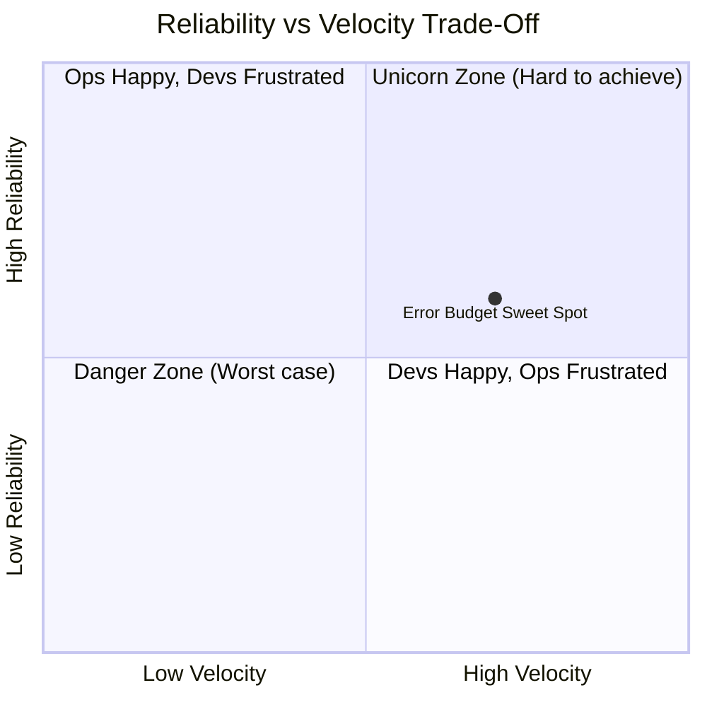
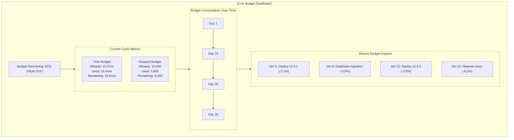

> **Discipline Module** | Complexity: `[MEDIUM]` | Time: 30-35 min

## Prerequisites

Before starting this module:
- **Required**: [Module 1.2: Service Level Objectives](../module-1.2-slos/) — Understanding SLOs
- **Required**: [Reliability Engineering Track](/platform/foundations/reliability-engineering/) — Reliability concepts
- **Recommended**: Experience with software releases and deployment

---

## What You'll Be Able to Do

After completing this module, you will be able to:

- **Implement error budget policies that balance feature velocity with reliability goals**
- **Design escalation procedures triggered by error budget burn rate thresholds**
- **Analyze error budget consumption patterns to identify systemic reliability issues**
- **Build automated error budget tracking that informs release and deployment decisions**

## Why This Module Matters

Here's the fundamental tension in every software organization:

- **Development wants**: Ship features fast, experiment, innovate
- **Operations wants**: Stability, predictability, no surprises

These goals seem opposed. The faster you ship, the more risk. The more stable you are, the slower you ship.

**Error budgets resolve this tension.** They turn the reliability vs. velocity debate into a data-driven conversation.

Instead of arguing "should we release?" you calculate "do we have budget to release?"

This module shows you how error budgets work and how to use them to make better decisions.

---

## What Is an Error Budget?

> **Stop and think**: If your product manager asks for 100% uptime, what are the actual engineering and business costs of trying to achieve that goal?

An error budget is the inverse of your SLO — the amount of unreliability you're allowed.

```
Error Budget = 100% - SLO Target

For 99.9% availability SLO:
  Error Budget = 100% - 99.9% = 0.1%
```

That 0.1% is **yours to spend**. You can "spend" it on:
- Feature releases that might have bugs
- Experiments that might fail
- Infrastructure changes that might cause issues
- Maintenance windows
- Or just accept that some failures happen

When you exhaust your budget, you stop releasing until it recovers.

### The Genius of Error Budgets

Error budgets reframe the conversation:

| Without Error Budgets | With Error Budgets |
|----------------------|-------------------|
| "Is this release risky?" | "Do we have budget for this risk?" |
| "Operations says no releases" | "Budget says we can release" |
| "Zero failures is the goal" | "We're supposed to have some failures" |
| Endless debates | Data-driven decisions |

**Key insight**: If you never exhaust your error budget, your SLO is too loose. If you always exhaust it, your SLO is too tight.

---

## Error Budget Math

> **Pause and predict**: Will a time-based budget or a request-based budget be more forgiving during a low-traffic period in the middle of the night?

### Time-Based Calculation

```
Budget in time = SLO Window × (1 - SLO Target)

For 99.9% SLO over 30 days:
  Budget = 30 days × (1 - 0.999)
        = 30 days × 0.001
        = 0.03 days
        = 43.2 minutes

You're allowed 43.2 minutes of downtime per month.
```

### Request-Based Calculation

```
Budget in requests = Total Requests × (1 - SLO Target)

For 99.9% SLO with 10 million requests/month:
  Budget = 10,000,000 × (1 - 0.999)
        = 10,000,000 × 0.001
        = 10,000 failed requests

You're allowed 10,000 failed requests per month.
```

### Budget Consumption

```
Budget Consumed = (Allowed Errors - Actual Errors) / Allowed Errors
               = Actual Errors / Allowed Errors

Example:
  Allowed: 10,000 failed requests
  Actual so far: 4,000 failed requests

  Budget Remaining = (10,000 - 4,000) / 10,000
                  = 60% remaining
```

---

## Try This: Calculate Your Error Budget

For a service you work on:

```
1. What's your SLO? ____%
2. What's your SLO window? ____ days
3. How many requests per window? ____

Time budget = window × (1 - SLO) = ____ minutes
Request budget = requests × (1 - SLO) = ____ requests

Current errors this window: ____
Budget remaining: ____%
```

---

## Error Budget Policies

An error budget is useless without policies that define what happens when it's consumed.

> **Stop and think**: If an error budget policy has no consequences for exhausting the budget, is it actually a policy or just a dashboard metric?

### The Standard Policy

```
If error budget remaining:
  > 50%: Full speed ahead. Ship what you want.
  25-50%: Caution. Extra testing, staged rollouts.
  0-25%: Slow down. Only critical releases.
  < 0%: Stop. Reliability work only.
```

### Example Policy Document

```yaml
error_budget_policy:
  service: payment-api
  slo_target: 99.9%
  window: 30d

  thresholds:
    healthy:
      range: "> 50% budget remaining"
      actions:
        - Normal release cadence
        - Experiments allowed
        - On-call: standard procedures

    caution:
      range: "25-50% budget remaining"
      actions:
        - Staged rollouts required
        - Increased monitoring during releases
        - On-call: heightened awareness

    critical:
      range: "5-25% budget remaining"
      actions:
        - Only critical bug fixes
        - All releases need SRE approval
        - Reliability improvements prioritized

    frozen:
      range: "< 5% budget remaining"
      actions:
        - Feature freeze
        - Only reliability work
        - Incident review for all outages
        - Daily leadership updates

  exceptions:
    - Security fixes: Always allowed
    - Critical bugs: Case-by-case
    - Scheduled maintenance: Pre-approved budget spend
```

### Making the Policy Real

The policy must have consequences, or it won't work:

**Development Impact:**
- Budget healthy → Ship features
- Budget exhausted → Stop features, fix reliability

**On-Call Impact:**
- Budget healthy → Standard response
- Budget low → Heightened awareness, faster escalation

**Leadership Impact:**
- Budget healthy → Business as usual
- Budget exhausted → Daily reports, priority adjustment

---

## Balancing Reliability and Velocity

Error budgets are a negotiation tool between development and operations.

### The Trade-Off Visualization



Error budgets find the sweet spot where:
  - Users are happy enough (meeting SLO)
  - Development moves fast enough (spending budget)

### Using Budget to Make Decisions

**Scenario**: Team wants to ship a risky new feature

| Budget Status | Decision |
|--------------|----------|
| 70% remaining | Ship it! We have budget for risk |
| 30% remaining | Ship with extra monitoring and quick rollback |
| 10% remaining | Wait or reduce scope |
| Exhausted | No, fix reliability first |

**Scenario**: Major refactoring needed

| Budget Status | Decision |
|--------------|----------|
| High budget | Good time for risky changes |
| Low budget | Bad time, defer unless it improves reliability |
| Exhausted | Only if refactoring improves reliability |

### When to Spend vs. Save Budget

**Good reasons to spend budget:**
- Shipping valuable features
- Running experiments
- Necessary maintenance
- Learning from controlled failures

**Bad reasons to spend budget:**
- Sloppy releases
- Skipping testing
- Ignoring monitoring
- Inadequate rollback plans

The question isn't "avoid spending budget" — it's "spend budget wisely."

---

## Did You Know?

> **Pause and predict**: How might an 'error budget loan' affect the engineering team's workload in the following month?

1. **Netflix's "Error Budget" approach is slightly different** — they focus on "disengagement" (when users leave due to problems) rather than pure availability, because some errors matter more than others.

2. **Google resets error budgets monthly** for most services, but some critical services use rolling windows (last 30 days) for smoother budget consumption curves.

3. **Some teams have "error budget loans"** — you can "borrow" from next period's budget for critical launches, but you have to "pay it back" with extra reliability work.

4. **Error budgets fundamentally changed the Dev vs Ops dynamic** at Google. Before error budgets, operations could always say "no" to releases. After, developers could say "we have budget" and release without permission—as long as they owned the consequences when budget ran out.

---

## War Story: The Budget That Saved the Launch

A retail company I worked with had a Black Friday problem:

**The Situation:**
- Major new feature ready for Black Friday
- Error budget at 40% (healthy, but important month)
- Feature touched payment flow (high risk)
- Leadership pressure: "Ship it!"

**Without Error Budgets (Previous Years):**
- Emotional debates: "It's risky!" "But we need it!"
- HiPPO decision (Highest Paid Person's Opinion)
- Features shipped, problems occurred, finger-pointing followed

**With Error Budgets (This Time):**

Analysis:
```
Current budget: 40% remaining
Days until Black Friday: 10
Historical: Black Friday alone usually consumes 20%

If feature causes 10% budget spend:
  Pre-Black Friday: 40% - 10% = 30%
  After Black Friday: 30% - 20% = 10%
  Buffer: 10% (uncomfortably low)

If feature causes 20% budget spend:
  Pre-Black Friday: 40% - 20% = 20%
  After Black Friday: 20% - 20% = 0%
  Buffer: NONE (SLO violation risk)
```

**The Decision:**
1. Ship feature to 10% of users (canary)
2. Monitor for 48 hours
3. If budget impact < 5%, proceed with full rollout
4. If budget impact > 5%, defer to December

**The Result:**
- Canary showed 3% budget impact
- Full rollout proceeded
- Black Friday successful
- No SLO violation
- No blame, no drama — just data

**Lesson**: Error budgets turned a political decision into a technical decision.

---

## Error Budget Tracking

### Dashboard Elements

An error budget dashboard should show:



### Key Metrics to Track

```yaml
metrics:
  budget_remaining_percentage:
    description: Current budget remaining
    alert_thresholds:
      - below: 50%
        action: notify_team
      - below: 25%
        action: restrict_releases
      - below: 5%
        action: freeze_releases

  burn_rate:
    description: How fast budget is being consumed
    calculation: "budget_consumed / time_elapsed"
    alert_thresholds:
      - above: 2x
        duration: 1h
        action: investigate

  time_to_exhaustion:
    description: At current burn rate, when will budget run out?
    calculation: "budget_remaining / burn_rate"
    alert_thresholds:
      - below: 7d
        action: warn
      - below: 2d
        action: critical
```

---

## Error Budget in Practice

### Scenario 1: New Feature Release

```
Before Release:
  Budget: 65%
  Feature risk: Medium (new code path)

Decision: Proceed with staged rollout

Rollout Plan:
  Stage 1: 5% traffic (1 hour)
    - Monitor error rate
    - Auto-rollback if budget drops > 5%

  Stage 2: 25% traffic (2 hours)
    - Continue monitoring
    - Human review before proceeding

  Stage 3: 100% traffic
    - Full monitoring
    - Fast rollback capability

Outcome Tracking:
  - Budget consumed by release: 2.3%
  - New budget: 62.7%
  - Decision: Good investment
```

### Scenario 2: Production Incident

```
Incident: Database connection pool exhaustion
Duration: 23 minutes
Impact: 15% of requests failed

Budget Impact:
  Before: 45%
  Consumption: 7.8%
  After: 37.2%

Actions Triggered:
  - Moved from "Healthy" to "Caution" state
  - Release cadence reduced
  - Postmortem scheduled
  - Connection pool fix prioritized

Recovery Plan:
  - Fix deployed: Expected +2% reliability
  - Budget recovery: ~5 days to return to Healthy
```

### Scenario 3: Budget Exhaustion

```
Situation:
  Budget: -3% (exhausted)
  Cause: Multiple small incidents + risky release

Freeze Policy Activated:
  1. Feature freeze immediate
  2. All releases require VP approval
  3. Team focus shifts to reliability:
     - Fix flaky tests
     - Add missing monitoring
     - Address tech debt
     - Improve rollback speed

Recovery Timeline:
  Week 1: Stabilization, budget returns to 0%
  Week 2: Conservative operations, budget at 15%
  Week 3: Limited releases, budget at 25%
  Week 4: Resume normal operations
```

---

## Common Mistakes

| Mistake | Problem | Solution |
|---------|---------|----------|
| No enforcement | Policy ignored when convenient | Leadership buys in, consequences real |
| Static thresholds | Same rules for all seasons | Adjust for high-traffic periods |
| Budget as punishment | Teams hide incidents | Budget is tool, not weapon |
| Ignore budget surplus | Never ship risky changes | Surplus means room to experiment |
| Reset too often | No pressure to improve | Use rolling windows |
| Too many exceptions | Policy becomes meaningless | Exceptions rare and documented |

---

## Quiz: Check Your Understanding

### Question 1
Your team manages the checkout service, which processes 5 million requests per day. The business has agreed to a 99.9% SLO over a rolling 30-day window. During a recent deployment, you noticed a spike in errors. To understand if you are at risk of violating your agreement, calculate how many total failed requests your monthly error budget allows.

<details>
<summary>Show Answer</summary>

To determine the allowed failures, you first calculate the total requests in the window, which is 5 million requests multiplied by 30 days, equaling 150 million total requests. Your error budget is the inverse of your SLO (100% - 99.9% = 0.1%). By multiplying the total requests (150 million) by your error budget (0.001), you find that you are permitted 150,000 failed requests per month. This means you can tolerate roughly 5,000 failed requests per day without violating your SLO. Knowing this hard number allows your team to evaluate whether the recent deployment spike is a minor blip or a critical threat to your budget.

</details>

### Question 2
It's the 20th of the month, and your team is preparing to release a highly anticipated, medium-risk feature. However, your error budget dashboard shows you only have 20% of your budget remaining due to a database outage earlier in the month. The product manager is pushing for the release to meet a marketing deadline. Should you proceed with the deployment?

<details>
<summary>Show Answer</summary>

Under standard error budget policies, having only 20% budget remaining places you in the 'Critical' or 'Caution' zone, meaning you should likely halt or significantly de-risk the release. Proceeding with a medium-risk deployment could easily consume the remaining margin, pushing you into an SLO violation and breaching customer trust. Instead, you should consult your pre-defined policy exceptions to see if the business value outweighs the reliability risk, or explore mitigations like a small canary release. If the feature cannot be safely rolled out without threatening the remaining budget, the data dictates that the release must be delayed until the budget window resets. This removes the emotion from the decision and relies on the agreed-upon mathematical limits.

</details>

### Question 3
Your engineering team has consistently maintained a 100% error budget surplus for the past six months by over-provisioning infrastructure, enforcing multi-week QA cycles, and restricting deployments to once a month. The operations team is thrilled, but the product team is complaining that feature delivery is moving at a glacial pace. Why is hoarding the error budget in this manner actually a bad practice?

<details>
<summary>Show Answer</summary>

Hoarding your error budget indicates that your system is performing significantly higher than the reliability targets your users actually require. The error budget exists specifically to be spent on innovation, feature velocity, and measured risk-taking, all of which are being sacrificed in this scenario. By maintaining a 100% surplus, your team is over-investing in stability at the direct expense of delivering business value and learning from controlled failures. A consistent surplus is a clear signal that you should either increase your deployment frequency, loosen your testing bottlenecks, or renegotiate a tighter SLO that accurately reflects the effort required to maintain it.

</details>

### Question 4
A misconfigured Kubernetes deployment just caused a major incident that consumed 30% of your rolling 30-day error budget in a single afternoon. Your total remaining budget has now dropped from a comfortable 45% down to a precarious 15%. According to standard error budget practices, what actions should your team immediately take?

<details>
<summary>Show Answer</summary>

The sudden drop to 15% remaining budget immediately shifts your service from a 'Healthy' state into a 'Critical' or 'Caution' state, triggering predefined policy responses. First, your team should restrict any upcoming feature releases and shift engineering focus toward reliability and technical debt to prevent further burn. Second, you must conduct a blameless postmortem to understand how the misconfiguration bypassed your CI/CD checks and implement automated safeguards against a recurrence. Finally, leadership must be notified of the budget state and the subsequent feature freeze, ensuring that everyone understands the data-driven rationale for pausing feature work until the budget recovers.

</details>

---

## Hands-On Exercise: Create an Error Budget Policy

Design an error budget policy for your organization.

### Your Task

**1. Define Your Service**

```yaml
service:
  name: # Your service
  slo_target: # e.g., 99.9%
  window: # e.g., 30 days
  criticality: # high/medium/low
```

**2. Define Budget Thresholds**

```yaml
thresholds:
  healthy:
    range: # e.g., "> 50%"
    release_policy: # What's allowed?
    on_call_stance: # How to respond?

  caution:
    range: # e.g., "25-50%"
    release_policy:
    on_call_stance:

  critical:
    range: # e.g., "5-25%"
    release_policy:
    on_call_stance:

  frozen:
    range: # e.g., "< 5%"
    release_policy:
    on_call_stance:
```

**3. Define Exceptions**

```yaml
exceptions:
  always_allowed:
    - # Security fixes?
    - # Critical bugs?

  requires_approval:
    - # Who approves exceptions?
    - # What's the process?
```

**4. Define Enforcement**

```yaml
enforcement:
  who_monitors: # Team/role responsible
  escalation_path: # Who gets notified at each level
  review_cadence: # How often to review policy
```

### Success Criteria

- [ ] All four threshold levels defined with clear actions
- [ ] Exceptions are specific and limited
- [ ] Enforcement mechanism is realistic
- [ ] Policy reviewed with stakeholders (or ready for review)

---

## Key Takeaways

1. **Error budget = 1 - SLO** — quantified acceptable unreliability
2. **Budgets balance velocity and reliability** — data replaces debate
3. **Policies must have teeth** — consequences at each threshold
4. **Spend wisely, not zero** — unused budget means loose SLO
5. **Budget is a tool, not a weapon** — enable, don't punish

---

## Further Reading

**Books**:
- **"Implementing Service Level Objectives"** — Alex Hidalgo, Chapter 8: Error Budgets
- **"Site Reliability Engineering"** — Google, Chapter 3: Embracing Risk

**Articles**:
- **"Error Budgets"** — Google SRE Book
- **"How to Use Error Budgets"** — Honeycomb blog

**Tools**:
- **Nobl9**: SLO platform with error budget tracking
- **Sloth**: Prometheus-based SLO management
- **Google SLO Generator**: For Google Cloud

---

## Summary

Error budgets are the mechanism that makes SLOs actionable. They:

- Quantify acceptable risk
- Enable data-driven release decisions
- Balance reliability and velocity
- Create shared ownership of reliability
- Turn debates into calculations

Without error budgets, SLOs are just numbers. With them, SLOs drive behavior.

---

## Next Module

Continue to [Module 1.4: Toil and Automation](../module-1.4-toil-automation/) to learn how to identify and eliminate repetitive operational work.

---

*"Error budgets are the currency that lets us take appropriate risks."* — Google SRE Book