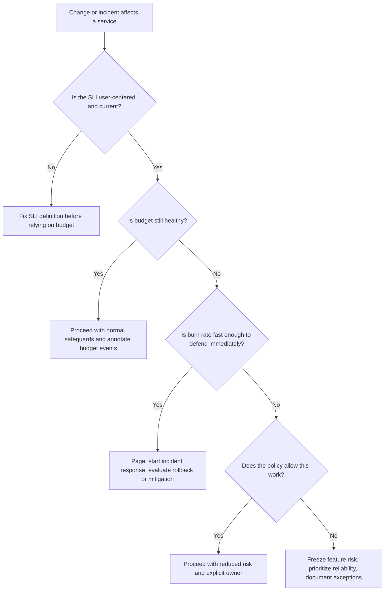

> **Discipline Module** | Complexity: `[MEDIUM]` | Time: 45-60 min
>
> **Prerequisites**: [Module 1.2: Service Level Objectives](../module-1.2-slos/) and the [Reliability Engineering Track](/platform/foundations/reliability-engineering/). You should already understand SLIs, SLOs, and why user-visible reliability matters more than internal comfort metrics.

## What You'll Be Able to Do

After completing this module, you will be able to:

- **Implement error budget policies that balance feature velocity with reliability goals** by turning an SLO into a written operating agreement, not just a dashboard tile that people admire during incidents.
- **Design escalation procedures triggered by error budget burn rate thresholds** so fast-moving failures page humans quickly, while slower budget leaks become planned reliability work.
- **Analyze error budget consumption patterns to identify systemic reliability issues** by separating isolated incidents, repeated failure classes, seasonal load effects, and measurement defects.
- **Build automated error budget tracking that informs release and deployment decisions** using SLI ratios, recording rules, alerting rules, dashboards, and review rituals that tie engineering choices to user impact.

## Why This Module Matters

Hypothetical scenario: A checkout service has a 99.9% availability SLO over a rolling 30-day window. The team wants to ship a medium-risk change before a seasonal launch week, but the service has already spent half of its monthly allowance on two incidents. Without an error budget, the conversation becomes political: product argues that the launch matters, operations argues that production is fragile, leadership asks for confidence, and nobody can say how much reliability risk is actually left.

With an error budget, that same conversation becomes concrete. The SLO says how reliable the service must be, the error budget says how much unreliability can still be spent, and the policy says what happens when the remaining budget drops below agreed thresholds. The team can still make a hard business decision, but it makes that decision with the cost visible instead of hidden inside mood, seniority, or optimism.

This is why the Google SRE literature treats error budgets as more than arithmetic. In the SRE Book's chapter on embracing risk, Google frames reliability as a risk-management problem rather than a pursuit of perfect uptime. Past a useful point, extra reliability has opportunity cost because the same engineers could be improving features, simplifying systems, or removing toil. Error budgets make that trade visible in a single shared measure.

The important word is shared. Development teams often feel pressure to increase velocity, while operations or SRE teams feel pressure to reduce change and preserve stability. If each side is judged by a different number, the organization creates a tug-of-war and then acts surprised when release decisions become emotional. An error budget gives both sides one number that connects user happiness, release risk, and reliability investment.

Think of an error budget like a monthly household budget for risk rather than money. You do not win by spending nothing, because that may mean you skipped useful opportunities. You also do not win by spending carelessly, because then you lose the ability to handle surprises. The discipline is to spend intentionally, notice the spending rate, and change behavior before the account runs empty.

The rest of this module teaches the durable practice. Tools such as Prometheus, Grafana, PagerDuty, Incident.io, and cloud monitoring products can help you calculate, visualize, and route alerts, but they do not create the operating agreement. The agreement comes from clear SLIs, defensible math, leadership-backed policy, and a culture that treats budget consumption as information rather than blame.

Error budgets also teach restraint in both directions. A team that treats every incident as proof that releases must slow forever will eventually create a brittle organization that fears change. A team that treats every successful release as proof that reliability concerns are excessive will eventually spend the budget by accident. The SRE discipline sits between those extremes by asking whether current behavior is still inside the risk envelope users and leaders agreed to accept.

The hard part is that the envelope is not purely technical. User expectations, product maturity, contractual promises, dependency quality, traffic shape, and team capacity all influence the right SLO. Error budgets force those factors into a concrete conversation. Instead of saying "this feels risky," you can say "this release would happen while the service has 18% budget remaining and a slow-burn ticket already open." That sentence changes the decision room because it names both the remaining margin and the current trend.

## Error Budgets in One Number

An error budget is the inverse of an SLO: `error budget = 1 - SLO`. If a service promises 99.9% good events during a window, the service is allowed 0.1% bad events during that same window. The budget is not a loophole or a consolation prize; it is the explicit quantity of unreliability the business is willing to tolerate while still calling the service reliable enough.

That definition depends completely on the SLI from the previous module. For a request-based availability SLI, the budget is a number of bad requests. For a latency SLI, the budget is a number of requests slower than the threshold. For a freshness SLI, the budget might be the number of reads that return stale data beyond an agreed age. The budget only makes sense after the team has agreed what counts as good service.

The budget is therefore not a second SLO bolted onto the first one. It is the operational form of the SLO. If the SLO is written for humans, the budget is written for decisions: whether to release, whether to page, whether to defer a migration, whether to spend a sprint on reliability, and whether a dependency contract is good enough. That is why a vague SLO produces a vague budget, and a vague budget produces inconsistent behavior.

This is the first place teams make a subtle mistake. They say "we have a 99.9% uptime SLO" when their service is rarely all the way up or all the way down. Modern systems often fail partially: one region degrades, one dependency times out, one API path slows down, or one user cohort sees errors. A request-based SLI usually captures that partial failure better than a binary up/down clock, because it measures the proportion of user interactions that were good.

The SRE Book's availability table is still useful because it builds intuition. At 99.9% availability, the Google table permits 43.2 minutes of unavailability per month and 8.76 hours per year. If you use an average calendar month rather than a fixed 30-day planning window, the monthly figure is about 43m49s. If your SLO window is exactly 30 days, the calculation is exactly 43.2 minutes, or 43 minutes and 12 seconds.

The arithmetic is simple enough to write on a whiteboard:

```text
budget = (1 - SLO) * window

For a 99.9% SLO over a fixed 30-day window:
  budget = (1 - 0.999) * 30 days
         = 0.001 * 30 days
         = 0.03 days
         = 43.2 minutes
```

That time-based calculation is easy to explain, but it is not always the best operational measure. If traffic is very low overnight, a short full outage may hurt fewer users than a smaller daytime degradation. If traffic is bursty, request-based accounting usually maps more directly to user pain. The right question is not which formula looks cleaner; the right question is which formula best represents the promise users and stakeholders actually care about.

For request-based accounting, multiply the eligible event count by the error budget ratio:

```text
allowed_bad_events = eligible_events * (1 - SLO)

For a 99.9% request SLO with 10,000,000 eligible requests:
  allowed_bad_events = 10,000,000 * 0.001
                     = 10,000 bad requests
```

The remaining budget then follows from actual bad events:

```text
budget_spent = actual_bad_events / allowed_bad_events
budget_remaining = 1 - budget_spent

If 4,000 requests were bad and 10,000 bad requests were allowed:
  budget_spent = 4,000 / 10,000 = 40%
  budget_remaining = 60%
```

Notice the denominator. Budget spent is not actual errors divided by all requests; that gives you the current error ratio. Budget spent is actual errors divided by allowed errors; that tells you how much of your permission to fail has already been consumed. SREs care about both numbers, but they answer different questions.

The current error ratio answers "how bad is the service right now?" The budget-spent ratio answers "how much of the agreed tolerance have we already used?" A service can have a high current error ratio for a few minutes and still preserve most of its budget, especially if the failure is detected and rolled back quickly. A service can also have a low current error ratio for many days and quietly exhaust the budget. Burn-rate alerting exists because humans need both the immediate symptom and the long-window accounting.

Low-traffic services need special care. If a service receives only a few hundred requests per window, one or two bad events can create alarming percentages that do not support useful decisions. In that case, the team may need longer windows, window-based SLIs, synthetic user journeys, or a different contract with internal customers. The principle remains the same: choose a budget that represents user pain well enough to guide behavior.

## Implement Error Budget Policies

An error budget number without a policy is a measurement, not a control system. A policy states what the organization will do when the service is healthy, when the budget is being consumed faster than planned, and when the budget is exhausted. The SRE Workbook's example error-budget policy makes this explicit: releases can continue while the service is within SLO, but change can halt when the service exceeds its budget, with carve-outs for urgent fixes and security work.

The policy matters because reliability tradeoffs create local incentives. Product teams may be rewarded for shipping visible features, platform teams may be rewarded for reducing incidents, and executives may be rewarded for hitting launch dates. If the consequences of budget exhaustion are negotiated during each crisis, the loudest stakeholder often wins. A written policy moves that argument earlier, when people are calmer and can reason from user impact.

A useful policy has at least five parts. It names the service and SLO. It states the measurement window and SLI query. It defines budget states that map remaining budget or burn rate to operating behavior. It lists exceptions that are allowed even during a freeze. It names the escalation path for disputes, because policies fail quietly when nobody has authority to enforce them.

Here is a compact policy shape that keeps the old module's spirit while making the consequences concrete:

```yaml
error_budget_policy:
  service: checkout-api
  slo:
    target: 99.9%
    window: 30d
    sli: "good HTTP requests divided by eligible HTTP requests"

  states:
    healthy:
      condition: "more than 50% budget remaining and no page-level burn-rate alert"
      release_policy: "normal release cadence with standard canary and rollback controls"
      review: "weekly service review"

    caution:
      condition: "25% to 50% budget remaining or slow-burn ticket alert active"
      release_policy: "staged rollouts, explicit rollback owner, and release note in service review"
      review: "budget trend reviewed twice weekly"

    critical:
      condition: "5% to 25% budget remaining or repeated page-level burn-rate alerts"
      release_policy: "only low-risk fixes, reliability work, and explicitly approved launches"
      review: "daily review until back above the threshold"

    frozen:
      condition: "less than 5% budget remaining or SLO already missed"
      release_policy: "feature freeze; security fixes and reliability fixes remain allowed"
      review: "leadership-visible recovery plan with owners and dates"

  exceptions:
    always_allowed:
      - security fixes with rollback plan
      - reliability fixes expected to reduce current or future budget burn
    requires_approval:
      - launches with material business impact
      - changes requested by a dependency team during a broader incident

  escalation:
    owner: "service engineering lead"
    approver: "engineering leader accountable for the service SLO"
    dispute_path: "product, SRE, and engineering leadership review the SLI data together"
```

Do not copy that policy blindly. A payments service, a search page, a batch billing export, and a developer portal may need different thresholds because their user impact differs. The durable pattern is that each threshold changes behavior. If a threshold only changes the dashboard color, it is decoration.

Executive buy-in is not ceremonial. The first time a budget is exhausted, someone will ask for an exception. That may be the correct business decision, but the policy must make the reliability debt explicit. A healthy exception process records who approved the risk, what mitigation was required, what budget was spent, and what reliability work follows. Without that record, exceptions become a second release process with weaker controls.

The policy should also say what does not count as punishment. Budget exhaustion is a signal that users experienced more bad service than the organization agreed to tolerate. The response is to reduce risk, learn, and repair weak systems. If teams learn that budget burn creates shame, they will hide incidents, redefine errors, or argue over measurement details instead of improving reliability.

A strong policy is specific about release classes. "No releases" sounds simple, but it breaks down immediately when a security fix, rollback, dependency patch, or reliability improvement needs to ship. Better policies distinguish feature risk from reliability risk. During a freeze, a new recommendation feature may wait, while a fix that reduces retry amplification may proceed with extra review. This distinction keeps the policy from blocking the very work needed to recover the service.

The policy also needs a review loop because SLOs are hypotheses. If the service repeatedly exhausts budget despite competent engineering, the target may be too strict for the architecture or business investment available. If the service never spends budget and releases are slow, the target may be stricter than users need. Reviewing the policy does not mean weakening standards to avoid accountability; it means checking whether the reliability contract still matches user expectations and organizational priorities.

## Budget Accounting and Windows

Budget accounting starts with eligible events. In a request-based SLO, eligible events might be production requests from real users, excluding health checks, synthetic probes, load tests, and requests outside the service contract. In a batch SLO, eligible events might be completed jobs or fresh records delivered before a deadline. In a Kubernetes-hosted service, a readiness probe failure may explain user impact, but it should not automatically count against a user-facing SLO unless the SLI defines it that way.

The words "good" and "bad" should be written down with the same care as the target. A successful HTTP status can still be bad if the response is wrong, empty, too slow, or stale. A failed HTTP status may be excluded if it reflects a caller error outside the service contract. The SRE Book's monitoring chapter warns that errors include explicit failures, implicit failures, and policy failures, which is why teams need user-centered SLI definitions rather than convenient infrastructure counters.

The SLI also decides how multiple failures are counted. If one user action fans out to five internal requests, counting all five internal failures may overstate user-visible harm. If one API request hides ten failed retries before returning success, counting only the final success may understate fragility and saturation risk. You can track internal causes on dashboards, but the budget should be anchored to the user-visible contract unless the service has a clearly internal customer.

Window choice changes behavior. Calendar windows line up with planning cycles, monthly reviews, and leadership reporting. They are easy to explain because everyone knows when the month or quarter ends. Their weakness is the cliff at the boundary: a severe incident late in the month can appear to disappear when the calendar turns, even though users and engineers still remember the pain.

Rolling windows keep recent user experience visible. The SRE Workbook recommends a four-week rolling window as a useful general-purpose interval because it contains a consistent number of weekends and smooths calendar artifacts. Rolling windows are better for operational decisions, but they require more careful communication because the budget recovers gradually as old bad events age out.

Short windows create faster feedback, while long windows support strategic decisions. A weekly SLO may tell a team to pause risky changes after a bad deploy, but it cannot justify a large architecture investment by itself. A quarterly view may show that one dependency class repeatedly consumes budget, but it reacts too slowly for paging. Mature teams usually keep several views: an alerting view, an operational review view, and an executive planning view.

Budget accounting should classify spending by source. Incidents, deployments, dependency failures, capacity saturation, data migrations, and measurement errors deserve different follow-up. If every budget event is labeled "outage," the trend is not actionable. If the team can say that repeated slow burns come from database saturation during predictable traffic peaks, the next reliability investment becomes much easier to defend.

Classification should be honest about ownership without turning into blame. A dependency failure can consume your user-facing budget even if another team caused the underlying fault. From the user's perspective, your service failed to deliver the promised outcome. The right response may be a dependency SLO, timeout tuning, fallback behavior, circuit breaking, or a product decision to accept degraded functionality. The budget keeps the user impact visible while the engineering analysis finds the most useful control point.

Planned maintenance deserves explicit treatment as well. Some services count planned downtime against the same budget because users still experience unavailability. Other services negotiate maintenance windows outside the SLO because the user base can tolerate scheduled interruption. Either choice can be valid, but ambiguity is dangerous. If maintenance is excluded, the exclusion must be documented, communicated, and bounded so teams cannot relabel avoidable incidents as planned work after the fact.

## Spend Budget Intentionally

The point is not to avoid all budget spend. If a team never spends budget, the SLO may be too loose, the release process may be too slow, or the service may be over-engineered relative to user needs. Google SRE frames an availability target as both a minimum and, in a practical sense, a maximum: exceeding it by too much can waste opportunities to improve the product or reduce operational cost.

Spending budget intentionally means attaching risk to decisions. A small, reversible UI change may be acceptable when the service is in caution state. A database migration that touches the write path may wait until budget recovers, or it may proceed only with a smaller batch size and a tested rollback. A reliability fix may proceed during a freeze because the policy should distinguish risk that helps reliability from risk that only adds feature surface.

Hypothetical scenario: A team has 40% of its request budget remaining with ten days left in a 30-day window. A new checkout promotion could increase traffic and touches code near payment authorization. The team chooses a staged rollout to 10% of users, watches the SLI and burn-rate alerts for two hours, then either expands the rollout or rolls back. The key decision is not "launch or no launch"; the key decision is how much budget the team is willing to risk for the expected value.

The same reasoning applies to reliability work. A risky refactor that reduces a known failure mode may be worth doing while budget is low, but only if the expected reliability gain is near-term and the rollback path is credible. A cosmetic feature that adds a new dependency probably waits. The budget does not decide for you; it supplies the shared constraint that makes the decision honest.

The healthiest teams review budget spend the way finance teams review forecast variance. They ask what changed, whether the current plan still fits the remaining budget, and which assumptions were wrong. They do not ask who can be blamed for spending the budget. Blameless postmortem culture matters here because accurate accounting depends on people being willing to surface weak signals and uncomfortable facts.

Intentional spending also changes how teams talk about launches. A launch does not become safe because someone important wants it, and it does not become unsafe because an engineer feels nervous. It becomes a risk decision with known controls: rollout size, guardrail metrics, rollback time, dependency readiness, support coverage, and remaining budget. When those controls are visible, stakeholders can choose a smaller launch, a delayed launch, or an exception with open eyes.

## Design Burn-Rate Escalation

Remaining budget tells you the current balance. Burn rate tells you how fast the balance is being consumed compared with the sustainable rate. A burn rate of 1x means the service is consuming budget exactly fast enough to use the full budget by the end of the window. A burn rate above 1x means the service will run out early if the condition continues.

For a 99.9% SLO, the error budget ratio is 0.001. If the observed bad-event ratio over a window is 0.006, the burn rate is `0.006 / 0.001 = 6x`. That does not mean six percent of all requests are failing; it means the service is burning the monthly budget six times faster than the sustainable pace. This distinction matters because burn rate normalizes alert thresholds across SLO targets.

The SRE Workbook's alerting chapter gives canonical starting points for a 99.9% SLO. A 14.4x burn rate over one hour with a five-minute short window is page-worthy because it spends about 2% of the budget quickly. A 6x burn rate over six hours with a 30-minute short window is also page-worthy because it spends about 5% of the budget. A 1x burn rate over three days with a six-hour short window is usually ticket-worthy because it signals a sustained leak rather than an immediate emergency.

The multi-window part is important. If you only alert on a long window, an incident can remain paging long after the user-visible failure stops. If you only alert on a short window, a brief spike can create noise without meaningful budget impact. Requiring both the long and short window to exceed the threshold says two things at once: enough budget has been consumed to matter, and the service is still actively burning.

Here is a complete Prometheus rules file that follows the SRE Workbook pattern for a request-based 99.9% availability SLO. The metric names are illustrative, but the Prometheus structure is real: recording rules precompute error ratios for each window, and alerting rules compare those ratios with burn-rate thresholds multiplied by the budget ratio.

```yaml
groups:
  - name: checkout-api-slo
    interval: 30s
    rules:
      - record: job:slo_errors_per_request:ratio_rate5m
        expr: |
          sum by (job) (
            rate(http_requests_total{job="checkout-api",code=~"5.."}[5m])
          )
          /
          sum by (job) (
            rate(http_requests_total{job="checkout-api"}[5m])
          )

      - record: job:slo_errors_per_request:ratio_rate30m
        expr: |
          sum by (job) (
            rate(http_requests_total{job="checkout-api",code=~"5.."}[30m])
          )
          /
          sum by (job) (
            rate(http_requests_total{job="checkout-api"}[30m])
          )

      - record: job:slo_errors_per_request:ratio_rate1h
        expr: |
          sum by (job) (
            rate(http_requests_total{job="checkout-api",code=~"5.."}[1h])
          )
          /
          sum by (job) (
            rate(http_requests_total{job="checkout-api"}[1h])
          )

      - record: job:slo_errors_per_request:ratio_rate6h
        expr: |
          sum by (job) (
            rate(http_requests_total{job="checkout-api",code=~"5.."}[6h])
          )
          /
          sum by (job) (
            rate(http_requests_total{job="checkout-api"}[6h])
          )

      - record: job:slo_errors_per_request:ratio_rate3d
        expr: |
          sum by (job) (
            rate(http_requests_total{job="checkout-api",code=~"5.."}[3d])
          )
          /
          sum by (job) (
            rate(http_requests_total{job="checkout-api"}[3d])
          )

      - alert: CheckoutApiFastBudgetBurn
        expr: |
          (
            job:slo_errors_per_request:ratio_rate1h{job="checkout-api"} > (14.4 * 0.001)
            and
            job:slo_errors_per_request:ratio_rate5m{job="checkout-api"} > (14.4 * 0.001)
          )
          or
          (
            job:slo_errors_per_request:ratio_rate6h{job="checkout-api"} > (6 * 0.001)
            and
            job:slo_errors_per_request:ratio_rate30m{job="checkout-api"} > (6 * 0.001)
          )
        labels:
          severity: page
          service: checkout-api
        annotations:
          summary: "checkout-api is burning the 99.9% availability budget quickly"
          description: "Fast burn-rate threshold crossed; follow the checkout-api SLO runbook."

      - alert: CheckoutApiSlowBudgetBurn
        expr: |
          job:slo_errors_per_request:ratio_rate3d{job="checkout-api"} > (1 * 0.001)
          and
          job:slo_errors_per_request:ratio_rate6h{job="checkout-api"} > (1 * 0.001)
        labels:
          severity: ticket
          service: checkout-api
        annotations:
          summary: "checkout-api has sustained 99.9% availability budget burn"
          description: "Slow burn-rate threshold crossed; plan reliability work before the budget is exhausted."
```

The rule uses `rate()` because `http_requests_total` is a counter. Prometheus's documentation recommends recording rules for expressions that are reused often, and SLO alerting is a good fit because dashboards and alerts ask for the same ratios repeatedly. In production, you would also decide how to handle missing traffic, canary labels, regional aggregation, low-volume services, and whether caller-caused errors are eligible events.

Burn-rate alerts should trigger procedures, not just messages. A page-level fast burn might require an incident commander, rollback evaluation, stakeholder communication, and temporary release hold. A slow-burn ticket might require a reliability owner, trend analysis, and a planning item. The escalation is part of the error-budget policy because alerts without agreed action become noise.

The alert thresholds are starting points, not sacred constants. A user-facing payment path may page on fast burn because every minute of failure directly blocks business activity. An internal analytics export may use ticket-level handling for the same burn rate if the data can be replayed before users notice. The math tells you how quickly the budget is disappearing; service criticality and user impact decide the response attached to that disappearance.

False positives are budget-policy bugs, not merely monitoring annoyances. If a page-level burn alert repeatedly fires when users are not harmed, responders will learn to distrust the SLO signal. If the alert never fires until customers complain, the SLI or threshold is missing real pain. Review every noisy burn alert with the same seriousness as a small incident, because alert trust is part of the reliability system.

## Analyze Budget Consumption

Error budget analysis asks why the budget is being spent, not merely how much remains. A single large incident suggests one kind of response. Many small incidents with the same cause suggest another. A constant low burn may indicate capacity pressure, retry storms, a dependency with a weak contract, or an SLI threshold that no longer matches user expectations. The budget number gets attention; the pattern tells you where to invest.

A useful analysis starts with an event ledger. For each material budget movement, record the time window, affected SLI, estimated bad events, related deploy or incident, dependency involvement, user segment, and whether the event was planned. This ledger should not become bureaucracy. Its purpose is to make the next review factual enough that people can see repeated causes instead of relying on memory.

The most valuable category is usually "same class, different day." If three releases each consumed a small portion of budget because rollback took too long, the systemic issue is not the individual releases. It is rollback design, test coverage, feature flagging, or ownership. If several incidents trace to one dependency, the right discussion may be dependency SLOs, fallback behavior, caching, backpressure, or graceful degradation.

Do not confuse budget recovery with system recovery. In a rolling window, budget returns as old bad events age out, even if the underlying weakness remains. A service can look healthier on the dashboard while carrying the same latent risk that caused the last incident. This is why budget reviews should connect remaining budget, burn pattern, and postmortem action status.

Budget analysis also catches measurement defects. If users report severe impact but the budget barely moves, the SLI may be missing an important path or counting retries incorrectly. If the budget is consumed by traffic that users never see, the eligibility rules may be too broad. Treat these as first-class reliability findings, because a misleading budget can authorize risky decisions with false confidence.

DORA's software delivery metrics provide a useful complement. Deployment frequency, change lead time, change fail rate, failed deployment recovery time, and deployment rework rate describe delivery flow and instability. Error budgets describe user-facing reliability against the SLO. When a team improves delivery metrics while staying within budget, it is learning to move quickly without hiding reliability cost. When velocity improves by burning budget faster, the budget makes that trade visible.

The most useful review question is often "what would have reduced budget spend without slowing every future change?" That framing steers teams away from blanket process additions. A mandatory approval meeting for all deployments may reduce risk, but it also taxes safe changes and encourages batching. A targeted improvement, such as automatic rollback on SLI regression or safer schema migration tooling, can reduce budget spend while preserving velocity. Error-budget analysis should prefer controls that make the safe path easier.

Another useful question is "which budget events were surprises?" Predictable budget spend is easier to manage because the team can choose mitigation before user impact grows. Surprise spend points to observability gaps, dependency assumptions, missing load tests, or rollout controls that did not match real traffic. Over time, the goal is not to eliminate every failure. The goal is to make failures smaller, more observable, and less surprising.

## Build Automated Budget Tracking

Automated tracking should answer four operational questions quickly. How much budget remains? How fast are we burning it? Which events consumed it? What policy state are we in? A dashboard that cannot answer those questions may still be visually polished, but it will not reliably inform release decisions.

The minimum dashboard has a current budget panel, burn-rate panels for alert windows, a trend over the SLO window, and an event annotation lane. The event lane matters because humans reason by connecting changes to outcomes. If a deploy, dependency incident, or traffic event lines up with budget burn, the review starts with better hypotheses. If no event lines up, the team has learned that instrumentation or operational awareness is incomplete.

The dashboard should separate SLI views from cause views. The SLI view tells whether users received good service. Cause views show latency by dependency, saturation by resource, errors by version, or readiness by Kubernetes workload. Cause views help debugging, but the budget should remain anchored to user-facing SLOs. This prevents a common failure mode where teams optimize a convenient internal metric while users still experience bad service.

Automation also helps release systems consume budget state. A deployment pipeline can show the current state before rollout, require extra approval in caution state, require a rollback owner in critical state, and block feature releases in frozen state. The pipeline should not become the only enforcement point, because emergencies and exceptions exist. It should make the policy visible at the moment risk is introduced.

> **Landscape snapshot — as of 2026-06. This changes fast; verify against vendor docs before relying on specifics.**
>
> Error-budget practice depends on durable capabilities, not a single vendor. Prometheus can evaluate recording and alerting rules, Grafana or similar tools can visualize SLI and budget time series, PagerDuty or Incident.io can route on-call notifications and incident workflows, and status-page tooling can communicate externally. Treat these as interchangeable capability examples: alert evaluation, dashboarding, on-call scheduling, incident coordination, and customer communication.

| Durable Capability | Example Tools or Approaches | Decision Question |
|--------------------|-----------------------------|-------------------|
| SLI calculation | Prometheus recording rules, managed monitoring, batch jobs | Can we compute good and eligible events consistently? |
| Burn-rate alerting | Prometheus alerts, cloud monitoring alerts, SLO platforms | Can alerts distinguish fast pages from slow tickets? |
| Visualization | Grafana, Perses, cloud dashboards, generated reports | Can humans see remaining budget and annotated spend? |
| Release enforcement | CI/CD gates, change-management workflow, deployment policy | Does budget state change rollout behavior before risk lands? |
| Incident routing | On-call tools, incident-management tools, team runbooks | Does each alert have an owner and an expected response? |

The tracking system should remain explainable. If only one specialist understands the SLI query, the policy will fail during urgent decisions. Keep formulas close to dashboards, link runbooks from alerts, and review the budget calculation in service reviews. The goal is not to make everyone an observability expert; the goal is to make reliability risk legible enough that the team can act together.

Good automation should also preserve human judgment. A pipeline gate that blocks a risky release during a frozen state is useful, but the organization still needs a deliberate exception path for urgent security or reliability work. The gate should make the cost visible, require the right approver, and leave an audit trail for the next review. It should not pretend that every reliability decision can be reduced to a boolean check.

Finally, automated tracking should connect to planning. If slow burn is repeatedly ticketed but never scheduled, the alerting system is only producing a backlog of ignored risk. Service reviews should convert budget evidence into owned work: fix the noisy dependency, improve rollback, add capacity, change the SLI, or renegotiate the SLO. Automation earns its keep when it changes priorities before the next incident, not when it merely proves that the last incident was measurable.

## Patterns & Anti-Patterns

### Patterns

The first strong pattern is a user-centered SLI with written eligibility rules. The budget only works when everyone understands what counts as a good event and what is excluded. This avoids debates during incidents and gives reviewers a stable basis for comparing budget spend across releases, dependencies, and operating periods.

The second strong pattern is a policy that changes release behavior before the SLO is missed. Waiting until the budget is exhausted turns the budget into a postmortem statistic. A better policy creates intermediate states where the team can reduce rollout size, increase review, pause risky work, and schedule reliability fixes while there is still room to maneuver.

The third strong pattern is multi-window burn-rate alerting tied to escalation. Fast failures deserve pages because the budget can disappear quickly. Slow failures deserve tickets or planning items because they are still real user pain, even if they do not justify waking someone immediately. The alert priority should match the urgency of defending the SLO.

The fourth strong pattern is trend review across incidents. Teams that only inspect budget during outages miss the repeated small burns that shape long-term reliability. A weekly or biweekly review can reveal weak dependencies, fragile deploys, or load-related degradation while the fixes are still cheaper than the next incident.

### Anti-Patterns

The most common anti-pattern is treating the budget as a punishment ledger. If every budget event becomes a search for the person who caused it, teams will learn to minimize disclosure. The budget should make user impact visible and support blameless learning, not provide a scoreboard for shame.

Another anti-pattern is using infrastructure health as a substitute for user experience. CPU saturation, pod restarts, readiness failures, and dependency errors are useful diagnostic signals, but they are not automatically bad user events. If the SLI does not represent the user's view of service quality, the budget can be both precise and wrong.

A third anti-pattern is allowing unlimited exceptions. A policy that always bends for launches is not a policy; it is a dashboard with ceremonies around it. Exceptions should be rare, named, approved, and followed by reliability work when they spend meaningful budget.

A fourth anti-pattern is alerting on budget exhaustion without burn-rate context. By the time the budget is gone, the SLO may already be lost. Burn-rate alerting provides earlier warnings and lets the team choose between immediate incident response and planned reliability work.

### Decision Framework

Use this flow when a release, incident, or reliability investment touches the error budget. The point is to decide from the SLI, remaining budget, burn rate, and policy state, then document exceptions when the business chooses to accept extra risk.


```mermaid
flowchart TD
    A[Change or incident affects a service] --> B{Is the SLI user-centered and current?}
    B -- No --> C[Fix SLI definition before relying on budget]
    B -- Yes --> D{Is budget still healthy?}
    D -- Yes --> E[Proceed with normal safeguards and annotate budget events]
    D -- No --> F{Is burn rate fast enough to defend immediately?}
    F -- Yes --> G[Page, start incident response, evaluate rollback or mitigation]
    F -- No --> H{Does the policy allow this work?}
    H -- Yes --> I[Proceed with reduced risk and explicit owner]
    H -- No --> J[Freeze feature risk, prioritize reliability, document exceptions]
```

| Decision | Use Budget Data For | Healthy State | Caution or Critical State | Frozen or Missed SLO |
|----------|---------------------|---------------|---------------------------|----------------------|
| Feature release | Remaining budget and recent burn | Normal rollout with canary | Smaller rollout, explicit rollback owner | Defer unless approved exception |
| Reliability fix | Expected effect on future burn | Schedule normally | Prioritize if risk is controlled | Usually allowed with rollback plan |
| Dependency incident | Bad events attributed to dependency | Track and review | Escalate contract or fallback work | Freeze feature risk until mitigated |
| SLI revision | Mismatch between user reports and budget | Review in planning | Fix before major decisions | Treat policy decisions as unreliable |

## Did You Know?

1. **Error budgets are intentionally uncomfortable when they work well.** They create a shared constraint that prevents both reckless shipping and excessive caution, which means each side sometimes hears "not yet" from the same number it previously used to justify its own preference.

2. **A surplus can be a problem signal.** If a service never spends budget, users may not need the current reliability target, or the team may be paying too much in delivery delay, infrastructure cost, or manual process to exceed a target nobody values.

3. **Burn rate makes different SLO targets comparable.** A 6x burn on a 99% SLO and a 6x burn on a 99.9% SLO represent the same relationship to each service's own budget, even though the raw error percentages are different.

4. **Budget recovery is not the same as learning.** Rolling windows eventually forget old bad events, but systems do not automatically improve when old errors age out; postmortems and follow-up work are what convert budget spend into better reliability.

## Common Mistakes

| Mistake | Problem | Solution |
|---------|---------|----------|
| Defining the budget before the SLI | The team argues about math while the user-visible promise remains unclear | Write good-event and eligible-event rules before choosing thresholds |
| Treating all failures equally | Minor internal noise can crowd out serious user harm, or severe partial failures can be undercounted | Account against the SLI and keep diagnostic metrics separate |
| Using budget thresholds with no consequences | Dashboards change color while releases continue exactly as before | Tie each state to release policy, review cadence, and escalation |
| Paging only when the budget is exhausted | The team learns too late to defend the SLO | Use multi-window burn-rate alerts for fast and slow budget consumption |
| Allowing vague exceptions | Every important launch becomes special, and the policy loses credibility | Require named approvers, mitigation, and follow-up reliability work |
| Resetting attention at calendar boundaries | Teams forget incidents when the budget resets, even if the weakness remains | Keep a ledger and review trend patterns across windows |
| Optimizing for zero budget spend | The service may become over-engineered or release velocity may collapse | Revisit the SLO and spend budget intentionally on valuable, controlled risk |
| Using budget as blame | People hide incidents or fight measurement instead of improving systems | Keep reviews blameless and focus on systemic causes and action items |

## Quiz

### Question 1

Your API has a 99.9% request availability SLO over a rolling 30-day window. It receives 20,000,000 eligible requests in that window, and 8,000 requests have been bad so far. How many bad requests are allowed, how much budget has been spent, and what policy question should the team ask next?

<details>
<summary>Answer</summary>

A 99.9% SLO leaves a 0.1% error budget, so the service is allowed 20,000 bad requests in the window. With 8,000 bad requests so far, the team has spent 40% of the budget and has 60% remaining. The next question is not merely whether the service is "up"; it is whether the current policy state still allows normal release risk. This is the foundation for implementing error budget policies that balance feature velocity with reliability goals.

</details>

### Question 2

A service has 35% of its budget remaining, and a medium-risk release touches the highest-traffic request path. The product owner wants to ship today because the feature is important, while the SRE on call is worried about recent slow-burn errors. What should the team do with the error-budget policy?

<details>
<summary>Answer</summary>

The team should use the written policy rather than renegotiating from scratch. At 35% remaining, many policies would place the service in a caution state, allowing a release only with reduced rollout size, extra observation, and a named rollback owner. If slow-burn alerts are active, the release may need to wait or be narrowed until the team understands the budget leak. The point is to make the business tradeoff explicit, not to let either product urgency or operational fear silently override the SLO.

</details>

### Question 3

Your team says a pod readiness failure should count against the user-facing availability budget because it is visible in Kubernetes events. Is that always correct?

<details>
<summary>Answer</summary>

No, not automatically. A readiness failure is a useful diagnostic signal, and in Kubernetes it can stop traffic from being sent to a pod, but the error budget should count bad events defined by the SLI. If users still receive successful responses from other pods, the readiness failure may explain risk without consuming user-facing budget. If the readiness failure causes eligible user requests to fail or violate latency policy, those bad user events should count.

</details>

### Question 4

Your 99.9% service shows a bad-event ratio of 0.0144 over one hour and 0.0144 over five minutes. What burn-rate condition is this, and what escalation should it trigger?

<details>
<summary>Answer</summary>

The error budget ratio for a 99.9% SLO is 0.001, so a 0.0144 bad-event ratio is a 14.4x burn rate. Because both the one-hour long window and five-minute short window are above the same threshold, this matches the fast-burn pattern from the SRE Workbook. It should normally trigger a page-level response because enough budget has been consumed to matter and the burn is still active. This is how you design escalation procedures triggered by error budget burn rate thresholds.

</details>

### Question 5

During the last two windows, budget consumption came from five small incidents rather than one major outage. Each incident involved a deploy that required manual rollback and took longer than expected. What does that pattern suggest?

<details>
<summary>Answer</summary>

The pattern suggests a systemic release and rollback problem rather than five unrelated accidents. The team should analyze error budget consumption patterns to identify systemic reliability issues such as slow rollback, weak canarying, missing automated checks, or unclear release ownership. The next investment may be safer deployment automation rather than a narrow fix for the last incident. Blameless review matters because people must be willing to describe where the process made the wrong action easy.

</details>

### Question 6

You are building a dashboard for an error-budget review. It shows remaining budget as a percentage, but it does not show burn rate, annotations for deploys or incidents, or the policy state. Why is this insufficient?

<details>
<summary>Answer</summary>

Remaining budget alone tells the current balance, but it does not tell whether the service is actively burning, why the budget moved, or what the team is supposed to do next. A useful dashboard should show burn-rate windows, event annotations, and the current policy state so release and incident decisions can happen quickly. It should also link to the SLI query and runbook so the calculation remains explainable. That is what it means to build automated error budget tracking that informs release and deployment decisions.

</details>

### Question 7

A team has stayed at 100% budget remaining for six months by allowing only one release each month and requiring long manual testing cycles. Leadership celebrates the reliability dashboard, but users complain that important improvements take too long. What should the team revisit?

<details>
<summary>Answer</summary>

The team should revisit both the SLO and the release process. A long-lived full budget may mean the service is more reliable than users need, or that the team is buying reliability with too much delivery delay. Error budgets are designed to permit thoughtful risk, so never spending the budget can be as informative as overspending it. The team should ask whether smaller, safer, more frequent releases could improve velocity while still preserving the agreed SLO.

</details>

## Hands-On

Create an error-budget policy and tracking plan for a service you know. If you do not have a production service available, use a hypothetical request-response service with 10,000,000 eligible requests in a 30-day rolling window and a 99.9% availability SLO. Keep the numbers round, label the scenario as hypothetical in your notes, and focus on whether each decision follows from the SLI and policy.

### Step 1: Define the SLO and Budget

Write the SLI in one sentence, including what counts as a good event and what counts as an eligible event. Then calculate both the allowed bad-event count and the time-based intuition for the same SLO window. The request-based budget should drive your policy if your service is traffic-based, while the time-based number helps stakeholders build intuition.

```yaml
service: checkout-api
slo:
  target: 99.9%
  window: 30d
  sli: "successful eligible HTTP requests divided by all eligible HTTP requests"
budget:
  error_budget_ratio: 0.001
  eligible_events: 10000000
  allowed_bad_events: 10000
```

### Step 2: Write the Policy

Define healthy, caution, critical, and frozen states. For each state, write what releases are allowed, who must approve exceptions, what review cadence applies, and what communication is expected. Make sure at least one state changes behavior before the budget is exhausted.

### Step 3: Add Burn-Rate Alerts

Adapt the Prometheus rule example from this module to your metric names, or write equivalent pseudocode if your monitoring system is not Prometheus. You should include a fast page-level alert and a slow ticket-level alert. For a 99.9% SLO, start with 14.4x over one hour plus five minutes, 6x over six hours plus 30 minutes, and 1x over three days plus six hours.

### Step 4: Review a Hypothetical Incident

Hypothetical scenario: A deployment causes 2,000 bad requests before rollback, and the service budget allows 10,000 bad requests in the window. Record the budget impact, identify the policy state after the incident, and write two blameless follow-up actions. Avoid saying "the deployer caused the outage"; describe the system conditions that let the bad change reach users.

### Success Criteria

- [ ] The policy includes a clear SLI definition, SLO target, window, allowed bad-event budget, and written eligibility rules that another engineer can review.
- [ ] The policy defines at least four budget states with release behavior, exception rules, escalation ownership, and review cadence for each state.
- [ ] The alerting plan includes both fast-burn and slow-burn thresholds, with page-level and ticket-level responses tied to expected action.
- [ ] The dashboard plan shows remaining budget, burn rate, annotated budget events, current policy state, and a link to the SLI query or calculation.
- [ ] The hypothetical incident review calculates budget spent correctly and produces blameless follow-up actions tied to systemic improvement.
- [ ] Every exception path names an approver and records what reliability work follows if the exception consumes meaningful budget.

## Sources

- [Google SRE Book: Embracing Risk](https://sre.google/sre-book/embracing-risk/) — Risk tradeoffs, motivation for error budgets, and the relationship between reliability and product velocity.
- [Google SRE Book: Service Level Objectives](https://sre.google/sre-book/service-level-objectives/) — SLO definition guidance and the argument against targeting 100% reliability.
- [Google SRE Book: Availability Table](https://sre.google/sre-book/availability-table/) — Verified nines-of-availability calculations, including 99.9% monthly and yearly unavailability.
- [SRE Workbook: Implementing SLOs](https://sre.google/workbook/implementing-slos/) — SLI selection, rolling windows, stakeholder agreement, and error-budget calculations.
- [SRE Workbook: Alerting on SLOs](https://sre.google/workbook/alerting-on-slos/) — Burn-rate alerting, multi-window thresholds, and recommended 99.9% alert parameters.
- [SRE Workbook: Example Error Budget Policy](https://sre.google/workbook/error-budget-policy/) — Written policy consequences, release pauses, exception handling, and escalation examples.
- [Google SRE Book: Monitoring Distributed Systems](https://sre.google/sre-book/monitoring-distributed-systems/) — Four golden signals, symptom-based monitoring, and Rob Ewaschuk's alerting philosophy.
- [Google SRE Book: Postmortem Culture](https://sre.google/sre-book/postmortem-culture/) — Blameless postmortem practice and why incidents should produce system learning.
- [Prometheus Alerting Rules](https://prometheus.io/docs/prometheus/latest/configuration/alerting_rules/) — Current Prometheus alert rule syntax, labels, annotations, and alert behavior.
- [Prometheus Recording Rules](https://prometheus.io/docs/prometheus/latest/configuration/recording_rules/) — Current Prometheus recording rule syntax and guidance for precomputing repeated expressions.
- [Prometheus Query Functions](https://prometheus.io/docs/prometheus/latest/querying/functions/) — Current PromQL function documentation, including `rate()` for counters.
- [Prometheus Query Operators](https://prometheus.io/docs/prometheus/latest/querying/operators/) — Current PromQL logical, comparison, and aggregation operator behavior used by alert expressions.
- [DORA: Software Delivery Performance Metrics](https://dora.dev/guides/dora-metrics/) — Delivery and instability metrics that complement SLO and error-budget analysis.
- [Google Cloud Observability: Concepts in Service Monitoring](https://docs.cloud.google.com/stackdriver/docs/solutions/slo-monitoring) — Service monitoring terminology, SLI/SLO concepts, and error-budget formula examples.
- [Kubernetes v1.35: Liveness, Readiness, and Startup Probes](https://v1-35.docs.kubernetes.io/docs/concepts/configuration/liveness-readiness-startup-probes/) — Current target-version reference for how Kubernetes probes affect traffic and container health.

## Next Module

Continue to [Module 1.4: Toil and Automation](../module-1.4-toil-automation/) to learn how error-budget signals connect to repetitive operational work and where automation creates the most leverage.
