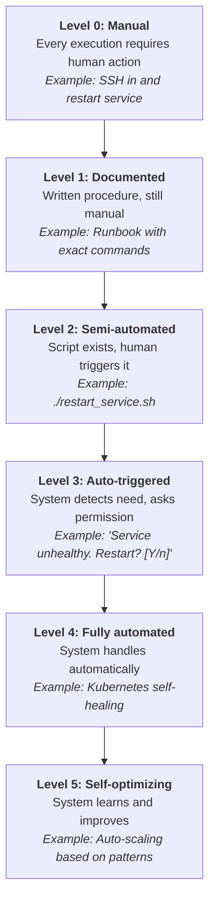
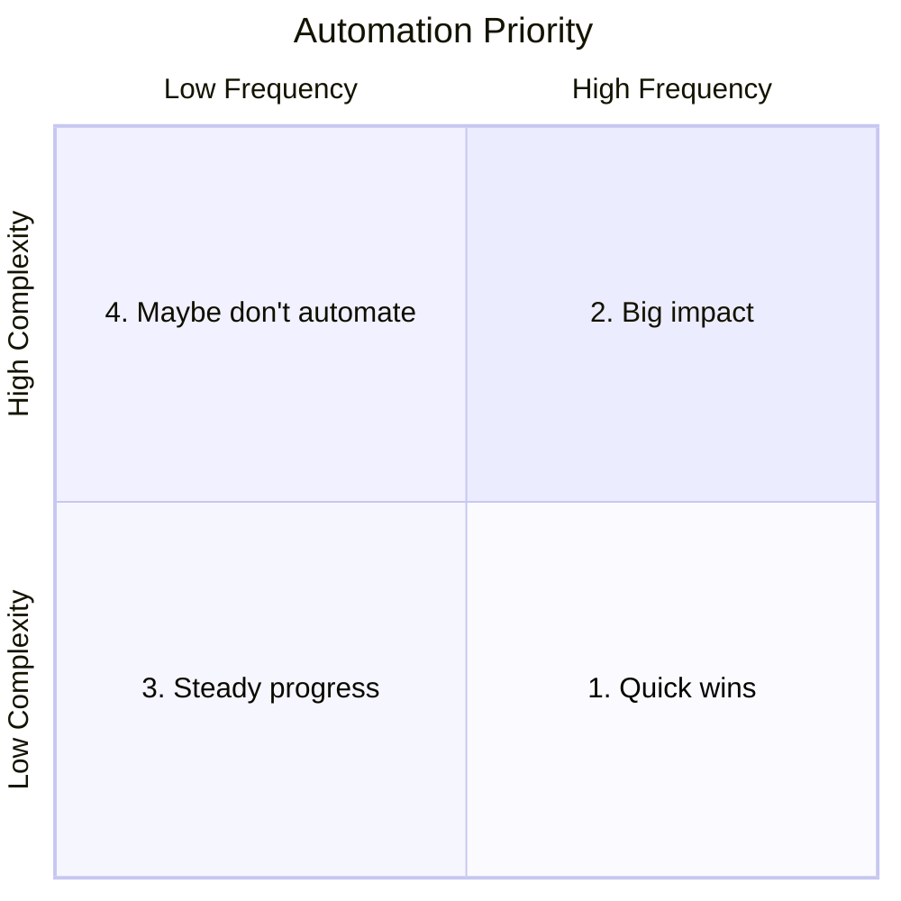
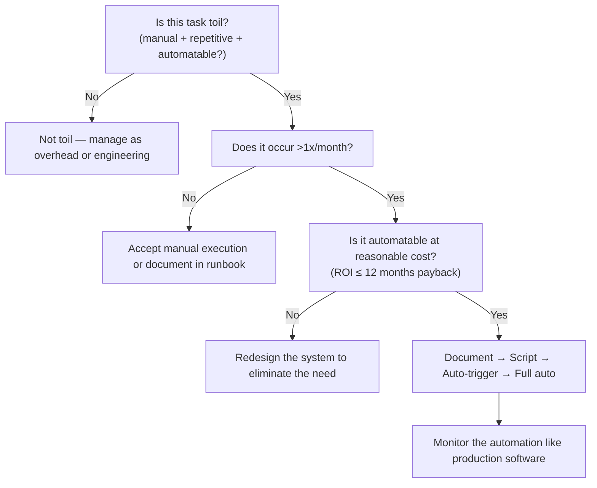

> **Discipline Module** | Complexity: `[MEDIUM]` | Time: 35-45 min

## Prerequisites

Before starting this module:
- **Required**: [Module 1.1: What is SRE?](../module-1.1-what-is-sre/) — Understanding SRE fundamentals
- **Recommended**: [Systems Thinking Track](/platform/foundations/systems-thinking/) — Understanding system leverage
- **Helpful**: Some experience with scripting or automation

---

## What You'll Be Able to Do

After completing this module, you will be able to:

- **Evaluate operational tasks against the SRE toil taxonomy to prioritize automation**
- **Design automation strategies that eliminate the highest-impact toil first**
- **Implement self-healing systems that resolve common incidents without human intervention**
- **Measure toil reduction over time and build a business case for continued automation investment**

---

## Why This Module Matters

> **Hypothetical scenario:** Imagine a platform engineering team of five people supporting a dozen production services. Every morning, a rotation engineer spends 45 minutes running a series of database health checks — connecting to each instance, executing the same diagnostic queries, pasting the output into a spreadsheet. Twice a week, that same engineer provisions new development namespaces by clicking through a cloud console, filling in the same fields each time. By Friday, roughly 30 hours of collective effort — nearly a full person-week — has disappeared into tasks that required no creative judgment, produced no lasting improvement, and looked identical to the previous week's work. The team has a backlog of meaningful projects: a canary deployment pipeline, an automated failover mechanism, a dashboard that would let developers self-serve answers to their most common questions. None of those projects move forward, because the team is trapped in a cycle of manual, repetitive, low-value work that expands linearly with the number of services they support. Add three more services next quarter and the same tasks simply take proportionally more time.

This is toil, and it is one of the most corrosive forces in operations engineering precisely because it is invisible in the moment. Each individual task feels minor — "it's only 15 minutes" — but in aggregate, toil consumes the capacity that should be directed at making systems more reliable, more scalable, and more maintainable. The site reliability engineering discipline developed a precise vocabulary and a systematic methodology for confronting this problem, and this module teaches you both. You will learn to identify toil with precision, distinguish it from legitimate operational overhead, measure its impact quantitatively, and apply an automation strategy that eliminates the highest-cost toil first while avoiding the trap of over-automation. By the end, you will be equipped to break the cycle and reclaim engineering time for engineering work.

---

## What Is Toil?

The term "toil" entered the operations engineering lexicon through the Google SRE Book (Chapter 5, "Eliminating Toil," Beyer et al., 2016), and its definition is more precise than most practitioners realise. Toil is not simply "work I dislike" or "busywork." It is work that satisfies a specific conjunction of attributes: it is manual, repetitive, automatable, tactical, devoid of enduring value, and scales linearly with service growth. Each of these attributes matters, and understanding them individually is essential to diagnosing toil accurately in your own environment.

**Manual** means the work requires direct human action to execute. If a script or system can perform the task without a human typing commands, clicking buttons, or making decisions, the work is not manual. Restarting a service by SSHing into a host and running `systemctl restart` is manual. Kubernetes performing a liveness-probe-triggered restart is not. The distinction matters because manual work consumes a scarce resource — human attention — that could be directed at tasks requiring judgment and creativity.

**Repetitive** means the work is performed frequently enough that its recurrence is predictable. A one-off data migration is not toil, even if it is manual and tedious, because it does not establish a recurring drain on team capacity. Running the same database backup verification script every morning, on the other hand, is repetitive. The frequency threshold is contextual — a quarterly manual financial reconciliation that takes two days may still qualify if it follows the same steps each quarter and could be automated — but the core idea is that toil is the work that keeps coming back.

**Automatable** is the attribute that separates toil from the genuinely human work of operations. If a task can be encoded as a program, script, or declarative configuration that a machine executes correctly without ongoing human involvement, it is automatable. Writing a postmortem is not automatable because it requires analysis, synthesis, and judgment. Restarting a pod when memory exceeds a threshold is automatable, and Kubernetes does exactly that with resource limits and liveness probes already. The automatable attribute is also why toil is fundamentally distinct from "overhead" — meetings, email, code reviews, and planning sessions are not automatable in any meaningful sense, and they are therefore not toil, even though they consume time that could be spent on other activities.

**Tactical** means the work is reactive rather than strategic. It addresses an immediate, surfaced need — a service is unhealthy and needs restarting, a user account needs provisioning, a certificate is about to expire — rather than changing the underlying conditions that cause the need to arise. Tactical work keeps the system running in its current state. Strategic work changes the state so that fewer tactical interventions are needed in the future. Toil is inherently tactical.

**Devoid of enduring value** is perhaps the most counterintuitive attribute, because executing toil often feels productive. Restarting a failing service restores availability — that has real, immediate value to users. But the value evaporates the moment the task is complete: the service is no more reliable after your manual restart than it was before the failure occurred. You have not improved its resilience, added monitoring that would detect the condition earlier, or built a mechanism that prevents recurrence. A postmortem, by contrast, produces enduring value because the analysis and action items it generates improve the system permanently.

**Scales linearly with service growth** is the attribute that makes toil an existential threat to teams. When a team supporting 5 services spends 10 hours per week on manual certificate rotation, supporting 20 services will require roughly 40 hours per week — a linear relationship. This means that if toil is not actively capped and reduced, service growth consumes all available capacity, and the team's ability to do engineering work goes to zero. The scaling property is what distinguishes toil from overhead: code reviews scale roughly with team size and change velocity, not linearly with the number of services the team supports. Toil scales with the operational surface area and, left unchecked, grows until it fills every available hour.

### The Toil Test

With these attributes in mind, you can evaluate any operational task by asking a short series of questions. The table below provides a diagnostic framework. A task that answers "yes" to most of questions 1 through 4 and "no" to question 5 is likely toil.

| Question | "Yes" Points to Toil |
|----------|---------------------|
| Could a script do this? | Yes |
| Do I do this frequently? | Yes |
| Does it require human judgment? | No (not toil) |
| Does it permanently improve things? | No (not toil) |
| Does it scale linearly with growth? | Yes |
| Is it the same every time? | Yes |

### Toil vs. Not Toil

Applying the taxonomy to real operational tasks makes the distinction concrete. Consider manual pod restarts: the work is manual (you SSH or run `kubectl delete pod`), repetitive (the same pods fail under the same conditions), automatable (a liveness probe or HorizontalPodAutoscaler can handle it), tactical (it restores service without fixing the underlying cause), and the value is transient. This is unambiguous toil. Responding to a page is more nuanced: the investigation component — determining what is broken and why — requires human judgment and is not automatable in the general case, but the remediation step might be (if you always run the same script after diagnosing a full disk, that script execution should be automated). Writing postmortems is not toil: it requires judgment, produces a permanent artifact that improves the system, and is not repetitive in the same mechanistic sense. Capacity planning requires analysis of growth trends, workload patterns, and business priorities — not toil. Running manual backups, however, is textbook toil: same steps every time, no judgment, could be a cron job.

| Task | Is It Toil? | Why |
|------|-------------|-----|
| Restarting pods manually | Yes | Repetitive, automatable |
| Responding to pages | Depends | Investigation isn't toil, remediation might be |
| Writing postmortems | No | Requires judgment, creates permanent value |
| Provisioning users | Yes | Same steps each time, automatable |
| Capacity planning | No | Requires analysis and judgment |
| Running backups manually | Yes | Repetitive, should be automated |
| Designing new system | No | Creative, strategic work |

### Overhead vs. Toil

A common mistake is to conflate toil with all operational work or with all work that feels like a distraction from engineering. The category distinction matters because the remediation strategy is different for each category, and applying the wrong strategy makes both problems worse. Overhead — team meetings, code reviews, planning sessions, training, interviewing — is necessary organisational work that keeps the team functioning as a team. It is not automatable in any practical sense, and attempting to "eliminate" it usually damages communication and coordination. The appropriate response to overhead is to optimise it (shorter meetings, better agendas, lighter-weight review processes) rather than to automate it away, because there is nothing to automate — the work is inherently human and relational. Toil, by contrast, is unnecessary operational work that machines could do but humans are currently doing. The appropriate response to toil is to automate it out of existence, because the human effort it consumes produces no lasting improvement and the machine can perform the task more consistently and at lower cost. Confusing these two categories leads to two symmetric failures: teams that try to "automate" meetings and code reviews waste engineering effort on an unsolvable problem, while teams that accept toil as an inevitable cost of operations never build the automation that would free them from it.

---

## The 50% Rule

Google's SRE teams operate under an explicit guardrail codified in the original SRE book: no more than 50% of an SRE's time may be spent on operational work, and toil is the operational work that should be driven as close to zero as possible — within that 50% ceiling, but ideally much lower. The other 50% or more is reserved for engineering projects: building automation that reduces future toil, improving system reliability through architectural changes, developing better tools and platforms, and performing the kind of strategic work that produces enduring value.

This ratio is not arbitrary. When operational work consumes less than half of a team's capacity, the remaining time is sufficient to run meaningful engineering projects that compound over time — each project reduces the operational load slightly, which frees more time for the next project, creating a virtuous cycle. When operational work exceeds 50%, the engineering time shrinks below the threshold where meaningful projects can be sustained. The team enters a reactive death spiral: they are too busy fighting fires to build fire prevention, which means more fires, which means even less time for prevention. Teams that operate above 80% operational load for more than a quarter or two almost never self-correct without external intervention, because the capacity to design and execute a recovery plan no longer exists within the team.

The 50% rule is a forcing function, not a law of nature. It forces an explicit conversation every time the operational load drifts upward: the team must either reduce the toil (by automating it), reduce the operational surface area (by consolidating services or improving their reliability), temporarily increase capacity (by borrowing engineers from elsewhere or slowing feature development), or renegotiate the service ownership arrangement that produces the load. Each of these options is uncomfortable, which is the point — the discomfort of confronting the 50% boundary prevents the quiet drift into a state where the team is too overloaded to recover.

### When Toil Exceeds 50%

If your team's toil exceeds the 50% ceiling, four responses are available, and the SRE workbook recommends pursuing them in roughly this order because each builds capacity for the next.

**Automate aggressively** means identifying the highest-frequency, lowest-complexity toil sources and eliminating them as quickly as possible. This is the fastest way to reclaim capacity and is usually the first response because it directly attacks the problem at its source. A team spending 15 hours per week on manual user provisioning can typically automate 80% of that work in a single engineering sprint, reclaiming 12 hours of capacity immediately.

**Push back on the service** means confronting the reliability problems in the service itself rather than absorbing them as operational work. If a service requires three manual restarts per week, the service has a reliability defect, and the correct response is to fix the defect, not to hire more people to perform the restarts. This can mean filing bugs, requesting architectural changes from the development team, or — in the SRE model — temporarily handing operational responsibility back to the developers until the service meets a minimum reliability bar.

**Create temporary capacity** means finding a way to give the team focused engineering time even when the operational load is high. This could involve an "engineering week" where operational work is handled by a skeleton rotation or by neighbouring teams, or it could involve temporarily pausing feature development to let the entire organisation focus on reliability improvements. The key is that the temporary capacity must be used to build permanent capacity through automation — otherwise the team returns to the same overloaded state when the temporary period ends.

**Rebalance ownership** means revisiting the fundamental arrangement of who is responsible for what. In the Google SRE model, a service that generates excessive operational toil may be returned to its development team until it meets defined reliability standards — a practice sometimes called the "production readiness review" gate. This rebalancing is not a punishment; it is an acknowledgment that certain operational loads are symptoms of design problems that the development team is best positioned to fix.

---

## Measuring Toil

You cannot reduce what you do not measure, and toil is particularly easy to underestimate without systematic tracking. Individual tasks feel small in the moment — "it's only ten minutes" — and the human mind is remarkably poor at aggregating dozens of small time expenditures into an accurate total. A team that guesses its toil at 30% is often shocked to discover the real number is closer to 55% or 60% once time tracking is introduced. This gap between perceived and actual toil is one of the most consistent findings in the SRE literature, and it has an important consequence: the team that is most convinced it does not have a toil problem is often the team that most urgently needs to measure. The very act of tracking toil changes behaviour. When engineers log each manual task and see the weekly total, they begin to notice patterns they previously overlooked. The same alert fires every Tuesday morning after the weekend batch job. The same deployment step fails half the time and requires manual intervention. The same access request could have been handled by a self-service form weeks ago. These patterns were always present, but they were invisible because they were distributed across different days, different people, and different contexts. A toil-tracking practice consolidates them into a single view where their aggregate cost becomes undeniable.

The first step in any toil-reduction programme is making toil visible. This can start with something as simple as a shared spreadsheet where team members log each recurring operational task, its category, time spent, and an assessment of whether it could be automated. The spreadsheet approach is deliberately low-ceremony: the goal is to establish the habit of tracking before investing in tooling. Once the practice is established, you can graduate to purpose-built time-tracking tools that integrate with your workflow, or to survey-based approaches where team members periodically self-report their toil distribution.

A survey-based approach — asking each team member to estimate what percentage of their past week went to toil, overhead, and engineering work — is surprisingly effective when done consistently over multiple measurement periods. Individual estimates are noisy, but the aggregate trend over four to eight weeks reliably reveals whether toil is increasing, decreasing, or stable. The SRE workbook recommends surveying at least once per month and tracking the trend on a shared dashboard so the entire team can see whether automation investments are producing measurable results.

The YAML structure below illustrates the categories and tracking dimensions that a mature toil measurement framework typically includes. This is a template, not a tool — the implementation can be a spreadsheet, a time-tracking application, or a custom dashboard, but the conceptual structure of categories, tasks, frequency, and trend is universal.

```yaml
toil_tracking:
  categories:
    - name: "User management"
      tasks:
        - "Password resets"
        - "Account provisioning"
        - "Access revocations"

    - name: "Incident response"
      tasks:
        - "Alert investigation"
        - "Service restarts"
        - "Failover execution"

    - name: "Deployments"
      tasks:
        - "Manual deployment steps"
        - "Rollback execution"
        - "Config updates"

    - name: "Maintenance"
      tasks:
        - "Certificate renewals"
        - "Capacity adjustments"
        - "Backup verification"

  tracking_method:
    - Tool: Time tracking software
    - Cadence: Weekly review
    - Metrics:
      - Hours per category
      - Trend over time
      - Percentage of work
```

### Key Metrics

| Metric | What It Tells You |
|--------|-------------------|
| **Toil percentage** | How much time goes to repetitive work |
| **Toil per team member** | Individual burden distribution |
| **Toil trend** | Is it getting better or worse? |
| **Toil per incident** | How much manual work per incident? |
| **Time to automate** | ROI of automation efforts |

Each metric answers a different question. The toil percentage tells you whether the 50% guardrail is being respected. The per-member distribution reveals whether the toil burden falls disproportionately on a subset of the team — a common pattern where newer team members or those in certain time zones absorb more operational load, creating an invisible inequity that affects morale and retention. The trend over time is the single most important metric for evaluating whether your automation investments are working: a flat or rising trend after automation projects suggests the automation is not reducing toil as expected, or that new toil is entering the system faster than old toil is being eliminated. Toil per incident is a leading indicator — if it is rising, each incident is becoming more expensive to resolve, which means either the system is growing more complex or the runbooks and tooling are falling behind.

---

## Automation Strategies

Automation is the primary tool for eliminating toil, but it is not free. Every automated system is itself a piece of software that must be designed, built, tested, deployed, monitored, and maintained. An automation that breaks silently and goes unnoticed for weeks is worse than the manual process it replaced, because it creates a false sense that the work is being handled while problems accumulate unseen. The decision to automate must therefore balance the toil-reduction benefit against the build cost and the ongoing maintenance burden.

### The Automation Ladder

The progression from fully manual to fully automated is not a binary switch but a series of steps, each of which reduces the human involvement required. Understanding these levels helps you target the right level for each task rather than reflexively pursuing full automation for everything.



Each level on this ladder represents a meaningful reduction in the human attention required per incident. Level 1 (documented) is better than Level 0 (pure manual) because the runbook eliminates the cognitive overhead of remembering the procedure, but it does not reduce the time cost of execution. Level 2 (semi-automated) reduces execution time and eliminates human error in running the commands, but still requires a human to decide when to run the script and to trigger it. Level 3 (auto-triggered with confirmation) moves the detection into the system but retains a human approval gate — useful for operations where the blast radius of a mistake is large, such as a database failover. Level 4 (fully automated) removes the human entirely from the detection-trigger-execution loop. Level 5 (self-optimising) is aspirational for most systems: the automation not only handles incidents but learns from patterns to improve its responses over time — think of a HorizontalPodAutoscaler that adjusts scaling thresholds based on historical traffic patterns rather than static configuration.

### When to Automate

The return-on-investment calculation for automation is straightforward in principle: compare the labour cost of continuing to perform the task manually against the engineering cost of building and maintaining the automation. For a task that takes 30 minutes, occurs 40 times per month, and would require 20 hours to automate, the formula is:

```
Monthly manual cost: 40 x 0.5 hrs = 20 hrs
Automation build cost: 20 hrs
Payback period: 1 month
```

After the first month, the automation has paid for itself, and every subsequent month saves 20 hours of human effort. The payback period should be short enough that the automation is likely to remain relevant — automating a task that will be obsolete in three months because the underlying system is being replaced is rarely worthwhile, even if the ROI calculation looks favourable on paper.

The decision framework for what to automate can be organised along two axes: frequency (how often the task occurs) and complexity (how difficult it is to automate). This produces a simple quadrant that guides prioritisation.

| How often? | Time saved | Automation worth it if development takes... |
|------------|------------|---------------------------------------------|
| 50 times/day | 5 min | Up to 6 weeks |
| Daily | 5 min | Up to 4 days |
| Weekly | 5 min | Up to 1 day |
| Monthly | 30 min | Up to 4 hours |
| Yearly | 1 hour | Up to 30 minutes |

This table is derived from the classic XKCD automation chart (Munroe, "Is It Worth the Time?"), and it provides a useful heuristic for quick triage. Tasks in the upper-left corner (high frequency, small per-occurrence savings) can justify substantial automation investment because the savings compound. Tasks in the lower-right (low frequency, small savings) are almost never worth automating unless the automation is trivial to build. The chart is deliberately conservative — it accounts only for time saved, not for the reduction in human error, the improvement in response consistency, or the morale benefit of eliminating a tedious task. In practice, these qualitative factors often tip the balance toward automation for tasks that the pure time-based calculation would reject.



The four quadrants suggest different strategies. **Quick wins** (high frequency, low complexity) should be automated first and fast — these are the tasks where a few hours of scripting can reclaim substantial weekly capacity. **Big impact** (high frequency, high complexity) represents major engineering investments that can transform a team's operational load but require careful planning and testing. **Steady progress** (low frequency, low complexity) is suitable for automation during quieter periods or as onboarding projects for new team members. **Maybe don't automate** (low frequency, high complexity) is the quadrant where automation is often the wrong answer — the build and maintenance cost exceeds the likely savings, and the task may be better handled through improved documentation or occasional manual execution.

### When NOT to Automate

Automation is not always the correct response to toil, and several categories of work resist responsible automation. The first is work that requires human judgment in a way that cannot be reduced to rules — determining whether a database schema change is safe to apply in production, for instance, involves assessing the query patterns, data volumes, and potential locking behaviour in ways that resist algorithmic encoding. Attempting to automate such decisions produces brittle systems that either err on the side of caution (blocking legitimate changes) or recklessness (applying dangerous changes automatically). The second category is work that is about to become obsolete. Automating a manual deployment process for a service that is being rewritten and will be replaced in two months is wasted effort — the automation's payback period must fit within the expected remaining lifetime of the process. The third category is work that occurs so rarely that the automation would be more expensive to maintain than the manual task is to perform. An annual compliance report that takes a day to produce and whose format changes each year as regulations evolve is a poor automation target: the automation would need to be updated every year to match the new format, and the update cost alone could exceed the cost of producing the report manually. In all of these cases, the correct response to the toil is not automation but either acceptance (it is cheaper to do it manually than to automate it) or redesign (changing the system so the toil-producing condition no longer exists).

A subtler category involves work that is automatable in principle but carries a failure cost so high that the risk of an automation error outweighs the efficiency gain. Database failover is the canonical example. The procedure is well-defined and repetitive enough to be a candidate for automation, but a false-positive trigger — failing over when the primary database was in fact healthy — can cause a split-brain scenario that is far more expensive to resolve than the 15 minutes of manual intervention would have been. For these operations, the appropriate automation level is often Level 3 (auto-triggered with human confirmation) rather than Level 4 (fully automated), preserving a human gate for the irreversible decision while automating the detection, diagnosis, and execution of the procedure itself. The human is not doing the work; the human is verifying that the automation's assessment is correct before the automation acts. This pattern — automate the process, keep the decision — is underused in practice and represents a pragmatic middle ground between the Scylla of toil and the Charybdis of fragile full automation.

### Automation as Software

Every automated system carries a maintenance burden of its own, and this burden must be factored into the automation decision from the start. Automated processes must be monitored like any other software component — if an automation that handles certificate renewal stops working, the team needs to know before certificates expire, not three weeks later when a production service goes down with an expired TLS certificate. Automations must be tested when the systems they depend on change — a script that worked against version 3 of an API may break silently against version 4, and the breakage may not be obvious if the script's failure mode is to exit without producing output rather than to crash visibly. Automations must be understood by multiple team members — an automation that only one person can debug is a bus-factor risk that negates some of the reliability benefit the automation was supposed to provide. And automations must have a defined owner, a runbook for what to do when they fail, and a regular review cadence to confirm they are still needed and still working correctly. The SRE approach treats automation not as a set-it-and-forget-it improvement but as a first-class software engineering product with the same expectations for testing, monitoring, documentation, and code review that apply to any production system. When a team views an automation script as a one-off artifact rather than a living piece of software, the script inevitably rots — dependencies change, APIs evolve, assumptions become invalid — and the team discovers the rot only when the manual task it was supposed to replace suddenly reappears during an incident.

---

## Patterns, Anti-Patterns, and Decision Framework

### Patterns

**Runbook to script, script to self-healing.** The most reliable path to automation starts with documentation. Before you automate a task, you must understand it well enough to write down every step, every edge case, and every failure mode. The runbook serves as both the specification for the automation and the fallback if the automation fails. Once the runbook exists and has been verified by multiple team members executing the procedure successfully, converting it to a script is a mechanical exercise. The script eliminates human error in execution but still requires a human trigger. The final step — making the trigger automatic, based on monitoring signals — moves the task to Level 4 on the automation ladder, where the system handles detection, decision, and execution without human involvement.

**ChatOps as a half-step toward full automation.** For operations where full automation is technically feasible but the blast radius of a mistake creates organisational resistance, a ChatOps approach provides an intermediate step. The system detects the condition (e.g., a service is unhealthy), posts a message to the team's chat platform describing what it detected and what it proposes to do, and waits for a human to approve or reject. This preserves human oversight for high-stakes operations while eliminating the manual steps of SSHing, running commands, and verifying results. The approval gate can be progressively relaxed as confidence in the automation grows — first requiring a senior engineer's approval, then any team member, then auto-approving after a timeout, and finally removing the gate entirely. The following example illustrates the pattern:

```
System: Payment service health check failed (HTTP 500).
        Proposing: rollout restart deployment/payment -n production
        Estimated impact: ~20s degraded service
        [Approve] [Reject] [Details]

User: [Approve]

System: Restarting payment-service...
        Old pods draining (3/3)
        New pods starting (1/3, 2/3, 3/3)
        Health check passed
        Restart complete (38s). Service restored.
```

**Self-healing through platform primitives.** The highest-leverage automation is the kind that uses the platform's built-in self-healing capabilities rather than custom scripts that must be maintained separately. Kubernetes provides liveness probes that restart unhealthy containers, readiness probes that remove unready pods from service, HorizontalPodAutoscalers that adjust replica counts based on resource utilisation, and PodDisruptionBudgets that maintain availability during voluntary disruptions. Each of these is declarative — you specify the desired state and the conditions that constitute health, and the platform continuously works to maintain that state. This is fundamentally different from imperative automation (a script that runs when a human decides to run it) because it is always active. The pod is always being monitored, the health check is always being evaluated, and the corrective action is always available.

```yaml
# Kubernetes liveness probe — declarative self-healing
livenessProbe:
  httpGet:
    path: /health
    port: 8080
  initialDelaySeconds: 30
  periodSeconds: 10
  failureThreshold: 3  # Restart after 3 consecutive failures

# Result: Kubernetes automatically restarts
# unhealthy pods — no human needed
```

### Anti-Patterns

**Automating everything indiscriminately.** The reflex to automate every toil task as soon as it is identified leads to a collection of fragile, poorly-understood scripts that consume more maintenance time than the original manual work. Automation should be prioritised by ROI: the highest-frequency, lowest-complexity tasks first. A team that spends its automation budget on a rare edge case while daily manual restarts continue unchecked has misallocated its engineering effort.

**Automating before understanding.** Writing a script for a procedure whose edge cases you do not fully understand produces automation that works in the common case and fails silently or dangerously in the uncommon case. The runbook-first approach is a guardrail against this: if you cannot write down what the procedure does under every condition you can think of, you are not ready to automate it.

**Unmonitored automation.** An automation that runs without monitoring is an incident waiting to happen. Certificate renewal automation that stops working goes unnoticed until certificates expire and services go down. The monitoring for an automation should alert on two conditions: the automation has not run when it should have (absence of expected activity), and the automation has run but produced an unexpected result (presence of an error or anomaly).

**Single-owner automation.** When only one person on the team understands how an automation works, the team's reliability posture has actually worsened: you have traded a manual task that anyone could perform (even if slowly) for an automated task that only one person can debug when it breaks. Every automation should have at least two people who understand its design, can read its code, and are confident making changes.

**Premature full automation.** Jumping directly from manual execution (Level 0) to full automation (Level 4) without passing through the intermediate levels eliminates the learning and trust-building that each step provides. The runbook (Level 1) makes the process explicit and testable. The script (Level 2) validates that the procedure can be encoded correctly. The auto-trigger with confirmation (Level 3) builds organisational trust in the automation's judgment. Skipping these steps produces automation that the team does not trust and will disable at the first sign of trouble.

**Hero-driven toil absorption.** When a single team member voluntarily absorbs a disproportionate share of the team's toil — staying late to handle manual deployments, being the only person who knows how to restart a particular service — the toil becomes invisible to the rest of the team and to management. The hero's good intentions prevent the systemic problem from being recognised and addressed. Toil must be visible and shared for the organisation to feel the pressure to eliminate it.

### Decision Framework

When you encounter a task that might be toil, walk through this decision sequence before deciding how to respond:



This framework forces the critical branching decisions: is the task actually toil, how frequently does it occur, what is the automation ROI, and — crucially — when automation is not the right answer, what alternative response (acceptance, redesign) is appropriate. The 12-month payback threshold is a reasonable default; teams in high-toil situations may want to accept longer payback periods because the opportunity cost of NOT automating is higher, while teams with low toil may be more selective.

---

## Did You Know?

- **Toil is defined with six specific attributes in the Google SRE book** — manual, repetitive, automatable, tactical, devoid of enduring value, and scaling linearly with service growth. Work must have most of these characteristics to qualify as toil; tedious but creative work (like writing a complex postmortem) is not toil. The precision of the definition matters because conflating toil with "work I dislike" leads to misdirected automation efforts that waste engineering time on tasks that genuinely require human judgment.

- **The SRE workbook estimates that a single SRE automating toil can reclaim 1 to 3 full-time equivalents of manual effort within a year.** This multiplier effect — one engineer's automation work eliminating the manual effort of multiple people — is why the 50% rule is an investment rule as much as a guardrail. The engineering time reserved by the cap funds the automation that makes the entire operation more efficient.

- **XKCD's "Is It Worth the Time?" chart (xkcd.com/1205), while humorous, encodes a real engineering decision framework.** It uses a time-based ROI calculation to determine how much development time a task's automation is worth, given its frequency and per-occurrence time savings. The underlying principle — that the cost of automation must be justified by the cumulative savings over a reasonable horizon — is the same one the SRE book recommends for prioritising toil-elimination projects.

- **The concept of toil as a distinct category of work originated in the Google SRE practice and was first published in the 2016 SRE book.** Before that, the industry lacked a precise vocabulary for distinguishing between necessary operational overhead (on-call response, capacity planning) and the unnecessary, automatable work that consumes capacity without producing lasting improvement. The introduction of the term gave teams a shared language for identifying and justifying automation investments.

---

## Common Mistakes

| Mistake | Problem | Solution |
|---------|---------|----------|
| Automate everything immediately | Wastes time on low-value automation while high-impact toil continues | Prioritise by frequency multiplied by per-occurrence time cost. Automate quick wins first, then tackle the big-impact quadrant |
| Automate before understanding | Script breaks in edge cases because the author did not fully map the problem space | Document the procedure as a runbook first, have multiple team members execute it, and understand failure modes before writing a single line of automation |
| No monitoring of automation | Automated tasks fail silently for weeks or months before anyone notices | Add monitoring and alerting to every automated process. Alert on both absence of expected activity and presence of errors or unexpected results |
| Over-complex automation | Hard to maintain, breaks often, and only one person understands it | Prefer simple, readable automation that multiple team members can debug. Use platform primitives (Kubernetes probes, HPA) over custom scripts where possible |
| Not tracking toil | Cannot prove automation investments are working or justify continued investment to management | Measure toil before and after every automation project. Track the trend on a shared dashboard visible to the team and leadership |
| Hero culture | An individual absorbs most of the toil burden, making the problem invisible to the team and organisation | Distribute operational work across the team through a formal on-call rotation. Make toil visible through shared tracking so the systemic cost is apparent |
| Confusing all ops work with toil | Treating incident investigation, capacity planning, or postmortems as toil leads to misguided attempts to automate work that requires judgment | Apply the toil taxonomy rigorously. If the task requires creative judgment, produces enduring value, or is not meaningfully automatable, it is not toil — manage it, don't try to eliminate it |
| Automating a process that is about to become obsolete | Investment wasted when the system or procedure is replaced before the automation pays for itself | Check the expected lifetime of the process before automating. If the underlying system is being deprecated within the automation's payback period, invest the engineering time elsewhere |

---

## Quiz

### Question 1 — Scenario-Based

You are an SRE reviewing the weekly task list. One task involves writing a detailed postmortem for a recent database outage, which takes four hours. Another task is manually running a database backup verification script every morning, which takes 15 minutes. How do you classify these tasks, and why?

<details>
<summary>Answer</summary>

The backup verification is toil, while the postmortem is not. Toil is defined by work that is manual, repetitive, automatable, and devoid of enduring value, scaling linearly with the system's growth. Running a backup verification script every morning fits this definition perfectly: it is the same action each day, requires no judgment, and could be replaced by a cron job that sends an alert only when verification fails. The postmortem, in contrast, requires deep analysis of what went wrong, synthesis of evidence from multiple sources, and the production of action items that permanently improve the system. This judgment-intensive, value-creating work is precisely the kind of engineering activity the 50% rule is designed to protect.
</details>

### Question 2 — Scenario-Based

Your SRE team has been tracking its time and discovers that over the last quarter, the team spent 70% of its hours executing manual user provisioning, responding to routine paging alerts, and manually scaling infrastructure. Management is proud the team kept the system running. How should this situation be handled according to SRE principles?

<details>
<summary>Answer</summary>

The team has substantially exceeded the 50% operational work ceiling and is in a reactive death spiral — too busy fighting fires to build fire prevention. Google's SRE model strictly limits operational work to at most 50% of an engineer's time to ensure that engineering projects which permanently improve the system can proceed. At 70%, the team lacks the capacity to design and execute the automation that would reduce the load. The correct responses are to automate the highest-frequency toil aggressively, push back on the services generating the most operational load (demanding reliability improvements or temporarily returning them to development teams), and consider creating temporary capacity. An engineering sprint where operations are covered by a skeleton rotation can jump-start the automation projects that will permanently reduce the toil.
</details>

### Question 3 — Scenario-Based

You manage a legacy reporting service that requires a manual cache-clearing process every Friday afternoon, taking 30 minutes. You estimate it would take 20 hours to write, test, and deploy a fully automated solution. Using ROI principles, should you prioritise automating this task, and what factors beyond the raw time calculation should influence your decision?

<details>
<summary>Answer</summary>

The raw ROI calculation favours automation: the manual task costs 2 hours per month (30 minutes x 4 weeks), and a 20-hour build cost yields a payback period of 10 months — well within the typical 12-month threshold. Beyond the time calculation, several additional factors strengthen the case for automation. The task occurs on a Friday afternoon, meaning it either interrupts an engineer's end-of-week flow or requires someone to be available at a specific time, limiting schedule flexibility. A manual cache-clearing process carries a non-zero error risk — a typo or skipped step could cause a production issue that costs far more than the 30 minutes of manual effort. Finally, automating this task frees the engineer to spend Friday afternoons on higher-value work, which has a compounding effect that a pure time-savings calculation does not capture.
</details>

### Question 4 — Scenario-Based

Your team currently handles high CPU alerts by manually SSHing into a server and running a script named `./scale_up.sh`. You want to improve this process. First, you configure an alert system that prompts you in Slack: "High CPU detected. Run scale_up.sh? [Y/n]". Later, you replace this entirely with a Kubernetes HorizontalPodAutoscaler that automatically adds pods when CPU reaches 80%. Describe the transitions in automation levels that occurred here, and explain what risk each transition eliminated.

<details>
<summary>Answer</summary>

The process transitioned from Level 2 (Semi-automated) to Level 3 (Auto-triggered), and finally to Level 4 (Fully automated). At Level 2, a human had to detect the CPU spike (presumably through a monitoring dashboard or alert), decide to act, SSH to the server, and run the script — every step was manual except the execution of the scale-up commands themselves. Moving to Level 3 eliminated the detection and SSH steps: the system detected the condition and presented a one-click approval in Slack, reducing response time and eliminating the risk of SSH-related mistakes. Moving to Level 4 with the HorizontalPodAutoscaler removed the human entirely from the loop, eliminating both the latency of waiting for human approval and the risk that the human was asleep, in a meeting, or otherwise unavailable when the alert fired. At Level 4, the system handles detection, decision, and execution continuously, which is particularly important for CPU scaling — by the time a human notices and approves, the service may already be degraded.
</details>

### Question 5 — Scenario-Based

A teammate proposes building a comprehensive automation framework that would handle every conceivable operational task for a service — restarts, scaling, failover, data recovery, and certificate rotation — in a single unified system. They estimate six months of development time. The service currently has five manual tasks, each performed between once and four times per month, taking 15 to 30 minutes each. Evaluate this proposal using the automation decision framework.

<details>
<summary>Answer</summary>

This proposal almost certainly represents over-automation. The five manual tasks, even at their maximum frequency and duration, consume roughly 8 to 10 hours per month of manual effort — about 100 to 120 hours per year. A six-month engineering investment is disproportionate: the automation's build cost would likely exceed the cumulative manual effort over the entire expected lifetime of the service. The proposal also violates the principle of progressive automation: rather than climbing the ladder one step at a time (document each task, create individual scripts, then selectively auto-trigger the highest-frequency ones), it attempts to jump from Level 0-1 to a massive Level 4-5 monolith. A unified automation framework also concentrates risk — a bug in the framework could simultaneously break restarts, scaling, and failover. The correct approach is to automate each task independently, starting with the highest-frequency, lowest-complexity ones, and to use platform primitives (Kubernetes liveness probes, HPA, cert-manager) where they already exist rather than building custom replacements.
</details>

### Question 6 — Conceptual

Explain why "scales linearly with service growth" is the most dangerous attribute of toil, even for a team that currently operates comfortably below the 50% ceiling.

<details>
<summary>Answer</summary>

The linear-scaling attribute means that toil grows in direct proportion to the operational surface area the team manages. A team supporting 10 services with 20 hours of toil per week will face 40 hours of toil when they support 20 services, assuming no automation improvements. This is dangerous because it makes toil a compounding problem that worsens silently: the team may be comfortable at 35% toil today, but if the organisation adds services faster than the team can automate existing toil, the percentage rises continuously. By the time toil crosses the 50% threshold, the team has already lost the engineering capacity needed to reverse the trend. The linear-scaling property also means that toil cannot be solved by hiring — doubling the team size temporarily halves the toil percentage, but the growth of the service fleet will eventually consume the new capacity as well. The only durable solution is to break the linear relationship by automating toil faster than the service surface area expands.
</details>

### Question 7 — Scenario-Based

Your team automates user provisioning with a self-service portal, reducing the time spent on account creation from 10 hours per week to near zero. Three months later, the toil tracking dashboard shows that the team's overall toil percentage has not decreased — the time saved on provisioning has been replaced by new manual tasks. What is likely happening, and how should the team respond?

<details>
<summary>Answer</summary>

This is a classic case of toil displacement: when one toil source is eliminated, other work that was previously deprioritised or done ad-hoc expands to fill the reclaimed capacity. The team may also have taken on additional services or responsibilities during the three-month period, introducing new toil. The time saved by automation must be explicitly protected for engineering work, not passively absorbed by new operational demands. The team's response should be twofold. First, make the reclaimed capacity visible — track it as "engineering hours gained from automation" and ensure those hours are booked against engineering projects, not open-ended operational availability. Second, apply the same toil-measurement discipline to the new tasks that appeared: categorise them, measure their frequency, and prioritise the highest-cost ones for the next round of automation. Toil reduction is not a one-time project but a continuous practice — if you stop eliminating toil, new toil fills the void.
</details>

---

## Hands-On Exercise: Toil Reduction Plan

Create a 30-day toil reduction plan for your own environment or, if you do not currently have an operational role, use the hypothetical scenario from the "Why This Module Matters" section: a five-person platform engineering team supporting a dozen production services with common toil sources including manual health checks, cloud-console provisioning, and certificate rotation. The exercise is structured in three parts that mirror the methodology covered in this module — audit, prioritise, and plan — and each part builds on the output of the previous one. Completing all three parts will give you a concrete artefact you can adapt for your own team's toil-reduction programme.

### Part 1: Toil Audit (15 min)

Begin by listing all the repetitive tasks you or your team performed in the past week. Be specific: "restart payment service" rather than "fix issues," and include the approximate time each task took per occurrence. The goal is to capture the operational work that happens regularly, not one-off emergencies or project work.

List all repetitive tasks from the past week:

| Task | Time/occurrence | Frequency | Weekly Hours | Automatable? |
|------|-----------------|-----------|--------------|--------------|
| 1.   |                 |           |              |              |
| 2.   |                 |           |              |              |
| 3.   |                 |           |              |              |
| 4.   |                 |           |              |              |
| 5.   |                 |           |              |              |

Total weekly toil: ___ hours
Percentage of work week (40h): ___%

### Part 2: Prioritisation (10 min)

Now score each task from your audit on three dimensions: frequency (how often it occurs, from 1 for annual to 5 for daily), time cost (how long each occurrence takes, from 1 for under a minute to 5 for over an hour), and automation complexity (how straightforward it would be to automate, from 1 for very complex to 5 for trivial). The total score determines which task to attack first — higher totals mean higher automation ROI.

Score each task:

| Task | Frequency Score (1-5, 5=daily) | Time Score (1-5, 5=long) | Complexity Score (1-5, 5=simple) | Total |
|------|--------------------------------|--------------------------|----------------------------------|-------|
| 1.   |                                |                          |                                  |       |
| 2.   |                                |                          |                                  |       |
| 3.   |                                |                          |                                  |       |

Priority order (highest total first):
1. _______________
2. _______________
3. _______________

### Part 3: 30-Day Plan (15 min)

For your top-priority task, build a concrete four-week implementation plan that follows the progressive automation approach: document in week one, script and test in week two, deploy with monitoring and run in parallel in week three, and remove the manual process after validation in week four. The plan should include the current state (what the task costs today), the target state (what automation level you are aiming for and what the expected savings are), and the success metrics you will use to confirm the automation is working.

For your top priority item:

```markdown
## Automation Plan: [Task Name]

### Current State
- Time per occurrence:
- Frequency:
- Total monthly time:
- Current automation level:

### Target State
- Automation level after:
- Expected time savings:
- Monitoring added:

### Implementation
Week 1:
  - [ ] Document current process
  - [ ] Identify edge cases

Week 2:
  - [ ] Write automation script/config
  - [ ] Test in non-production

Week 3:
  - [ ] Deploy with monitoring
  - [ ] Run in parallel with manual process

Week 4:
  - [ ] Remove manual process
  - [ ] Measure actual savings

### Success Metrics
- Time savings achieved: ___
- Errors reduced: ___
- Team satisfaction: ___
```

### Success Criteria

- [ ] Audited at least 5 tasks
- [ ] Calculated total toil percentage
- [ ] Prioritised using scoring
- [ ] Created detailed plan for #1 priority
- [ ] Defined success metrics

---

## Sources

- [SRE Book, Chapter 5: Eliminating Toil — Beyer, Jones, Petoff, Murphy (2016)](https://sre.google/sre-book/eliminating-toil/) — The canonical definition of toil, its six attributes, and the 50% operational work cap. This chapter introduced the term "toil" as a precise category of operational work and established the framework that the rest of the industry has adopted.
- [SRE Book, Chapter 7: The Evolution of Automation at Google — Beyer, Jones, Petoff, Murphy (2016)](https://sre.google/sre-book/automation-at-google/) — Google's internal history of automation, including the argument that automation is software that must be treated with the same rigor as any production system. Covers the automation value proposition versus consistency and the organisational dynamics of automation adoption.
- [SRE Workbook, Chapter 6: Eliminating Toil — Beyer, Murphy, Rensin, Kawahara, Thorne (2018)](https://sre.google/workbook/eliminating-toil/) — Practical methods for identifying, measuring, and reducing toil. Includes survey templates, toil-tracking advice, and case studies of toil-reduction programmes in practice.
- [Identifying and Tracking Toil Using SRE Principles — Google Cloud Blog](https://cloud.google.com/blog/products/management-tools/identifying-and-tracking-toil-using-sre-principles) — Accessible summary of the toil taxonomy and measurement approach, written for practitioners who may not have read the full SRE book.
- [Meeting Reliability Challenges with SRE Principles — Google Cloud Blog](https://cloud.google.com/blog/products/management-tools/meeting-reliability-challenges-with-sre-principles) — Connects toil reduction to broader SRE reliability practice, including the relationship between operational load management and system reliability outcomes.
- [XKCD 1205: Is It Worth the Time? — Randall Munroe](https://xkcd.com/1205/) — The classic visualisation of automation ROI by task frequency and per-occurrence time savings. Widely referenced in SRE practice as a quick heuristic for automation prioritisation.
- [DORA Metrics: The Four Keys — DORA (DevOps Research and Assessment)](https://dora.dev/guides/dora-metrics-four-keys/) — The research foundation connecting deployment frequency, lead time for changes, change failure rate, and time to restore service to organisational performance. These metrics are directly affected by toil levels: high toil raises change failure rate and MTTR.
- [Kubernetes: HorizontalPodAutoscaler — Kubernetes Documentation](https://kubernetes.io/docs/tasks/run-application/horizontal-pod-autoscale/) — Reference for the HPA, used throughout this module as an example of Level 4 platform-native automation that eliminates scaling toil.
- [SRE Workbook, Chapter 5: Alerting on SLOs — Beyer, Murphy, Rensin, Kawahara, Thorne (2018)](https://sre.google/workbook/alerting-on-slos/) — Covers burn-rate alerting and the relationship between SLO-based alerting and toil reduction: well-designed alerts fire on symptoms that require human judgment, not on conditions that could be auto-remediated.
- [SRE Book, Chapter 15: Postmortem Culture — Beyer, Jones, Petoff, Murphy (2016)](https://sre.google/sre-book/postmortem-culture/) — Establishes the blameless postmortem as an engineering practice distinct from toil, and explains why postmortem writing is one of the highest-value investments an SRE team can make.
- [Prometheus Alerting Rules — Prometheus Documentation](https://prometheus.io/docs/prometheus/latest/configuration/alerting_rules/) — Reference for Prometheus alerting rule syntax, relevant to the self-healing and monitoring automation patterns covered in this module.
- [Kubernetes: Self-Healing — Kubernetes Documentation](https://kubernetes.io/docs/concepts/architecture/self-healing/) — Documents the Kubernetes self-healing primitives (liveness probes, readiness probes, node auto-repair) that form the foundation of Level 4 automation in containerised environments.

---

## Next Module

Continue to [Module 1.5: Incident Management](../module-1.5-incident-management/) to learn how to respond effectively when things go wrong — including the incident command frameworks and communication practices that keep responders aligned under pressure.
