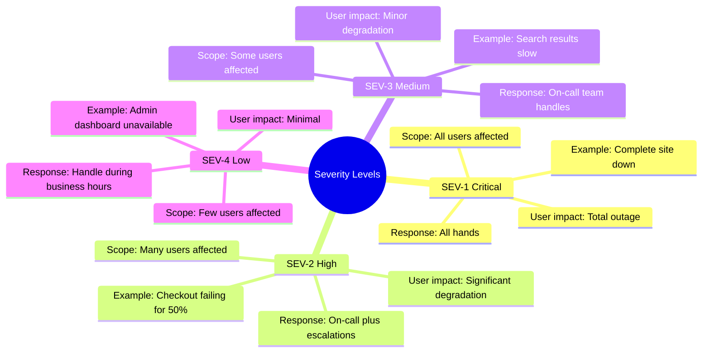
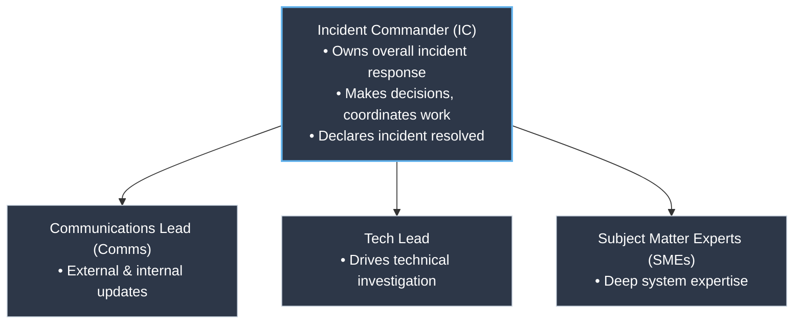
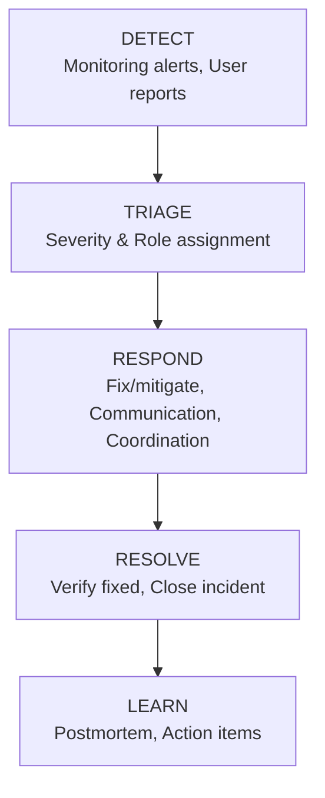
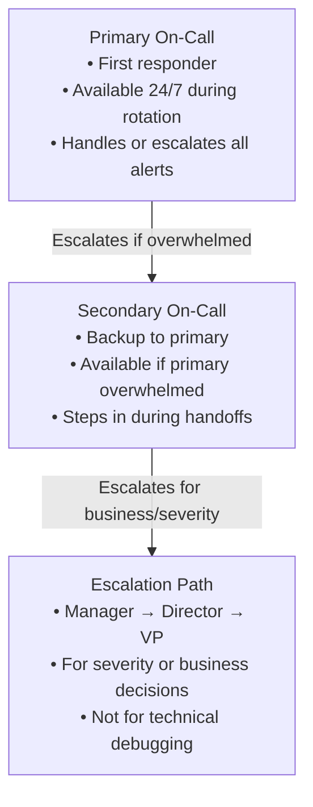

> **Discipline Module** | Complexity: `[MEDIUM]` | Time: 35-40 min

## Prerequisites

Before starting this module:
- **Required**: [Module 1.1: What is SRE?](../module-1.1-what-is-sre/) — Understanding SRE fundamentals
- **Required**: [Module 1.2: SLOs](../module-1.2-slos/) — Understanding service levels
- **Recommended**: [Observability Theory Track](/platform/foundations/observability-theory/) — Monitoring and debugging

---

## What You'll Be Able to Do

After completing this module, you will be able to:

- **Design an incident response framework with clear roles, severities, and escalation paths**
- **Lead an incident as Incident Commander — coordinating communication, diagnosis, and resolution**
- **Implement incident communication templates that keep stakeholders informed without slowing response**
- **Build runbooks that reduce mean time to resolution for recurring incident categories**

## Why This Module Matters

It's 3 AM. Your phone buzzes. The dashboard is red. Customers are complaining on Twitter.

What do you do?

**Without incident management**: Panic. Random debugging. Blame. Chaos. Hours of downtime.

**With incident management**: Clear roles. Systematic response. Coordinated communication. Resolution.

Incidents will happen. The question is whether you're prepared or not.

This module teaches you how to respond to incidents effectively — minimizing impact, enabling fast recovery, and learning from every failure.

---

## What Is an Incident?

An incident is an unplanned event that:
- Disrupts or degrades service
- Requires immediate response
- Affects users or business operations

Not every alert is an incident. Not every bug is an incident.

### Incident vs. Problem vs. Alert

| Term | Definition | Example |
|------|------------|---------|
| **Alert** | Notification that something might be wrong | "CPU usage above 80%" |
| **Incident** | Active, user-impacting issue requiring response | "Payment processing failing" |
| **Problem** | Root cause of one or more incidents | "Memory leak in payment service" |

An alert might trigger investigation. An incident triggers response. A problem is what you fix to prevent future incidents.

---

## Severity Levels

Not all incidents are equal. Severity levels help you respond appropriately.

### Standard Severity Framework



### Severity by SLO Impact

| Severity | Error Budget Impact | Response |
|----------|---------------------|----------|
| SEV-1 | Consuming >100x normal rate | Everyone engaged immediately |
| SEV-2 | Consuming 10-100x normal rate | On-call + escalations |
| SEV-3 | Consuming 2-10x normal rate | On-call investigates |
| SEV-4 | Normal to 2x normal rate | Track, fix when possible |

> **Pause and predict**: If you page five engineers simultaneously for a SEV-3 issue, what will happen to their responsiveness during the next SEV-1?

### Don't Over-Classify

A common mistake is making everything SEV-1. This causes:
- Alert fatigue
- Desensitization to real emergencies
- Resource exhaustion

Be honest about severity. Most incidents are SEV-3 or SEV-4.

---

## Incident Response Roles

Clear roles prevent chaos. Everyone knows their job.

### The Core Roles



### Role Definitions

**Incident Commander (IC)**
- Overall responsibility for the incident
- Coordinates all response activities
- Makes decisions when needed
- Communicates status to stakeholders
- Declares incident open/closed

> **Stop and think**: If you are the IC and you start reading application logs to find the bug, who is managing the incident?

**Communications Lead (Comms)**
- External communication (status page, social media)
- Internal communication (leadership, other teams)
- Keeps customers informed
- Handles media if necessary

**Tech Lead**
- Drives technical investigation
- Coordinates debugging efforts
- Recommends and implements fixes
- Documents technical timeline

**Subject Matter Experts (SMEs)**
- Called in based on incident type
- Provide deep expertise in specific areas
- Execute technical tasks under Tech Lead direction

### Role Rotation

The IC doesn't have to be the most senior person. In fact, rotating IC duties:
- Builds incident response skills across team
- Prevents burnout
- Reduces single points of knowledge

---

## Try This: Role-Play an Incident

With your team, practice roles with a mock incident:

```
Scenario: "Payment processing is failing for 30% of transactions"

Assign roles:
  - IC: ______________
  - Comms: ______________
  - Tech Lead: ______________
  - SME (Payments): ______________
  - SME (Database): ______________

Practice:
  1. IC opens incident, assigns roles
  2. Tech Lead begins investigation
  3. Comms drafts status page update
  4. After 5 min, IC requests status update
  5. Practice handoff if IC needs to leave
```

---

## The Incident Lifecycle

Every incident follows a lifecycle:



### Phase 1: Detection

How you learn something is wrong:
- Automated monitoring alerts
- Customer reports
- Internal user reports
- Social media
- Partner notifications

**Goal**: Minimize time to detection (TTD).

### Phase 2: Triage

Quick assessment:
- What's the impact?
- How many users affected?
- What's the severity?
- Who needs to be involved?

**Goal**: Correct severity classification within 5 minutes.

### Phase 3: Response

Active work to resolve:
- Investigation and debugging
- Implementing fixes
- Coordinating across teams
- Communicating status

**Goal**: Effective coordination, not chaos.

### Phase 4: Resolution

Confirming the incident is over:
- Fix deployed and verified
- Monitoring confirms recovery
- Users no longer impacted
- Incident declared resolved

**Goal**: Confident closure, not premature declaration.

### Phase 5: Learning

Post-incident improvement:
- Postmortem conducted (next module)
- Action items identified
- Process improvements made

**Goal**: Never have the same incident twice.

---

## On-Call Best Practices

Being on-call is central to incident management.

### On-Call Structure



### Sustainable On-Call

**Do:**
- Maximum 1 week on-call stretches
- Minimum 2 people in rotation
- Compensate for on-call (time off, pay)
- Clear escalation paths
- Runbooks for common issues
- Post-on-call feedback sessions

**Don't:**
- 24/7 on-call for one person
- Alerts for things that aren't actionable
- Expect on-call to also do project work
- Punish people for escalating

### Alert Quality

Good alerts are:
- **Actionable**: Responder can do something
- **Relevant**: Actually indicates a problem
- **Urgent**: Requires immediate attention
- **Clear**: Includes context to start debugging

Bad alerts are:
- "CPU is high" (what should I do?)
- Fires constantly (alert fatigue)
- Requires reading 5 dashboards to understand

### On-Call Metrics

| Metric | Good Target | Why It Matters |
|--------|-------------|----------------|
| Pages per on-call week | < 5 | More = burnout |
| False positive rate | < 20% | Higher = fatigue |
| Time to acknowledge | < 5 min | Faster = faster response |
| Incidents requiring escalation | < 20% | Higher = skill gaps |
| On-call satisfaction | > 3/5 | Lower = retention risk |

---

## Did You Know?

1. **Google's incident management system was inspired by fire department protocols**. The Incident Commander role comes directly from emergency services' Incident Command System (ICS).

2. **The best incident responders often do less, not more**. They focus on coordination and decision-making rather than trying to personally fix everything.

3. **"All hands" incidents often have worse outcomes** than properly staffed responses. Too many people creates confusion and duplicated effort.

4. **PagerDuty's annual "State of On-Call" report** consistently shows that engineers at high-performing organizations get paged less frequently but handle more complex issues—because they've automated away the simple stuff and have better tooling for the hard stuff.

---

## War Story: The Incident That Went Right

A company I worked with had a major outage:

**The Incident:**
- 2:30 AM: Total site down
- Cause: Database corruption from failed migration

**What Made It Go Well:**

**Clear roles activated immediately:**
```
IC: Senior SRE (woken by page)
Comms: Product manager (called in)
Tech Lead: Database engineer (paged)
SME: Migration author (paged)
```

**Structured communication:**
```
2:35 AM: IC opens incident channel
2:40 AM: Comms posts to status page: "Investigating issues"
2:50 AM: Tech Lead: "Identified - database corruption"
3:00 AM: Comms updates status page with ETA
3:30 AM: Database restored from backup
3:45 AM: Site back online
4:00 AM: IC declares incident resolved
```

**What the IC did well:**
- Didn't try to debug personally
- Focused on coordination
- Asked for status every 15 minutes
- Made decision to restore from backup (vs. repair)
- Handled escalation to leadership
- Kept Comms informed for status updates

**The result:**
- 75 minutes total downtime
- Clear communication throughout
- No blame, just focus
- Excellent postmortem material

**Compare to previous incidents:**
- Similar issue 6 months earlier: 4 hours of chaos
- No roles, everyone debugging same thing
- Customers in dark, leadership angry

**Lesson**: Process turns chaos into coordination.

---

## Incident Communication

### Internal Communication

**Incident Channel:**
```
#incident-2024-01-15-payment-outage

[IC] INCIDENT OPEN - SEV-1 - Payment processing failing
[IC] Roles: IC=@alice, Tech=@bob, Comms=@carol
[Tech] Investigating. Initial data shows DB connection failures.
[Comms] Status page updated. ETA 30 min.
[Tech] Root cause identified: Connection pool exhausted
[Tech] Implementing fix: Increasing pool size
[IC] 15-min check: Fix deploying, ETA 10 more minutes
[Tech] Fix deployed. Monitoring.
[IC] Metrics recovering. Watching for 10 minutes.
[IC] INCIDENT RESOLVED - Total duration: 45 minutes
```

**Key Practices:**
- One channel per incident
- All decisions documented
- Regular IC status updates
- Clear open/close announcements

### External Communication

**Status Page Updates:**

```
[INVESTIGATING] 2:45 PM
We are investigating reports of payment processing issues.
Some customers may experience failures when completing checkout.
Next update in 15 minutes.

[IDENTIFIED] 3:00 PM
We have identified the cause and are implementing a fix.
Affected: Payment processing
ETA: 15 minutes
Next update in 15 minutes.

[MONITORING] 3:20 PM
A fix has been deployed. We are monitoring for recovery.
Some transactions may have failed during this period.
Affected transactions will be automatically retried.

[RESOLVED] 3:35 PM
Payment processing has fully recovered.
The issue was caused by a configuration error.
No customer data was affected.
We apologize for the inconvenience.
```

**Principles:**
- Update regularly (every 15-30 min)
- Be honest about what you know
- Give ETAs when you can
- Acknowledge customer impact
- Avoid blame or technical jargon

### Communication Protocols for Major Incidents

During a major incident, unstructured communication causes almost as much damage as the outage itself. These protocols keep everyone informed without overwhelming responders.

**Communication Cadence by Severity:**

| Severity | Internal Update Cadence | Status Page Cadence | Leadership Notification |
|----------|------------------------|--------------------|-----------------------|
| SEV-1 | Every 15 minutes | Every 15 minutes | Immediately, then every 30 min |
| SEV-2 | Every 30 minutes | Every 30 minutes | Within 30 min, then hourly |
| SEV-3 | Every 60 minutes | As status changes | Daily summary if prolonged |
| SEV-4 | As status changes | Not required | Not required |

Even if nothing has changed, post an update. Silence breeds anxiety and speculation.

**Stakeholder Notification Tiers:**

```
Tier 1: Engineering (immediate)
  └── On-call team, incident responders, relevant SMEs
  └── Notified via: PagerDuty, incident Slack channel

Tier 2: Engineering Management (within 15 min for SEV-1)
  └── Engineering managers, directors of affected services
  └── Notified via: Slack, email

Tier 3: Executives (within 30 min for SEV-1)
  └── VP Engineering, CTO, CEO (for customer-facing SEV-1)
  └── Notified via: SMS, phone call, email
  └── They need: impact scope, ETA, whether customers are affected

Tier 4: Customers (within 30-60 min for SEV-1)
  └── Via status page, in-app banner, email for affected accounts
  └── They need: what's broken, workarounds, when it will be fixed
```

**Communication Templates:**

Use these as starting points. The Comms Lead fills in the brackets and posts.

```
INITIAL NOTIFICATION (internal):
"[SEVERITY] incident declared. [SERVICE] is [IMPACT DESCRIPTION].
Approximately [NUMBER/PERCENTAGE] of users affected.
IC: @[NAME] | Tech Lead: @[NAME] | Comms: @[NAME]
Incident channel: #incident-[DATE]-[SHORT-NAME]
Next update in [15/30] minutes."

STATUS UPDATE (internal, use at each cadence interval):
"Update [NUMBER] — [TIME]
Current status: [investigating / identified / fix in progress / monitoring]
What we know: [1-2 sentences]
What we're doing: [current action]
ETA to resolution: [estimate or 'unknown']
Next update in [15/30] minutes."

STATUS PAGE UPDATE (external, customer-facing):
"We are aware of an issue affecting [SERVICE/FEATURE].
Impact: [PLAIN-LANGUAGE DESCRIPTION of what users experience].
Our team is actively working on a resolution.
ETA: [estimate or 'We will provide an update by TIME'].
We apologize for the inconvenience."

RESOLUTION NOTIFICATION (external):
"The issue affecting [SERVICE] has been resolved as of [TIME].
Duration: [START] to [END].
[Brief root cause in plain language, no internal jargon].
[Any actions customers need to take, e.g., retry failed transactions].
We apologize for the disruption and are taking steps to prevent recurrence."
```

**War Room / Bridge Call Protocols:**

For SEV-1 incidents, a bridge call (video or voice) keeps responders aligned.

| Rule | Why |
|------|-----|
| IC opens and runs the bridge | Single point of coordination |
| Mute when not speaking | Reduce noise so updates are heard |
| Tech Lead gives status every 15 min | Keeps IC informed without IC asking repeatedly |
| Non-responders stay off the bridge | Too many people creates chaos (use the Slack channel instead) |
| All decisions spoken aloud and typed in channel | Creates written record, avoids "I thought we said..." |
| Handoff protocol when IC rotates | Outgoing IC summarizes state, incoming IC confirms |

**Post-Incident Customer Communication:**

After resolution, customers deserve a follow-up — especially for SEV-1 and SEV-2 incidents.

- **Within 24 hours**: Post a brief summary on the status page explaining what happened and what you are doing to prevent recurrence.
- **Within 3-5 business days**: For major incidents, send a detailed post-incident report to affected customers. Include root cause, timeline, impact scope, and concrete remediation steps.
- **Tone**: Honest, accountable, specific. Avoid vague language like "an issue occurred." Instead: "A misconfigured database failover caused payment processing to fail for 45 minutes."
- **Don't over-promise**: Say "we are implementing X and Y to reduce the likelihood of recurrence" rather than "this will never happen again."

Customers remember how you communicated during an outage more than the outage itself. Transparent, timely communication builds trust even when things break.

---

## Runbooks and Playbooks

Runbooks reduce time to resolution by documenting common procedures.

### Runbook Example

```markdown
# Runbook: Payment Service High Error Rate

## Trigger
Alert: payment-service-error-rate-high
Threshold: Error rate > 5% for 5 minutes

## Impact
Users unable to complete purchases.
Business impact: ~$X per minute of outage.

## Quick Diagnosis
1. Check payment-service dashboard: [link]
2. Check dependent services:
   - Database: [link]
   - Payment gateway: [link]
   - Auth service: [link]

## Common Causes & Fixes

### Database Connection Exhaustion
**Symptoms**: Connection timeout errors in logs
**Fix**:
```bash
kubectl rollout restart deployment/payment-service -n production
```
**If doesn't resolve**: Check database load, may need failover

### Payment Gateway Outage
**Symptoms**: Gateway timeout errors in logs
**Verify**: Check gateway status page: [link]
**Fix**: Enable fallback payment processor:
```bash
kubectl set env deployment/payment-service GATEWAY=fallback
```

### Auth Service Degradation
**Symptoms**: Auth timeout errors in logs
**Verify**: Check auth service dashboard: [link]
**Fix**: Auth service team owns resolution. Escalate to #auth-team

## Escalation
- If not resolved in 15 min: Page secondary on-call
- If not resolved in 30 min: Page engineering manager
- For business decisions: Contact VP on-call

## Post-Resolution
1. Verify metrics returned to normal
2. Create incident ticket in Jira
3. Schedule postmortem if SEV-2 or higher
```

### Playbook vs. Runbook

| Runbook | Playbook |
|---------|----------|
| Specific procedure | General strategy |
| Step-by-step | Principles and patterns |
| For specific alert/issue | For types of incidents |
| "How to fix X" | "How to approach category" |

Both are valuable. Runbooks for common issues, playbooks for novel situations.

---

## Common Mistakes

| Mistake | Problem | Solution |
|---------|---------|----------|
| Everyone debugging | Duplicated effort, chaos | Assign roles, coordinate |
| No communication | Customers angry, leadership blind | Comms role, regular updates |
| Premature resolution | Problem returns, erodes trust | Verify with metrics |
| Over-escalating | Leadership fatigue, cry wolf | Calibrate severity accurately |
| Under-escalating | Major incident unaddressed | Clear escalation criteria |
| No postmortem | Same incident recurs | Always do postmortems for SEV-1/2 |

---

## Quiz: Check Your Understanding

### Question 1
You are the primary on-call engineer for an e-commerce platform. At 2:00 PM on a busy Tuesday, PagerDuty alerts you that the checkout API error rate has spiked from a baseline of 0.1% to 3%. How do you triage this to determine the correct severity and next steps?

<details>
<summary>Show Answer</summary>

**Triage Steps:**

You must first evaluate the actual user impact and the trajectory of the issue. A 3% error rate on a critical path like checkout means real customers are actively failing to give you money, which immediately elevates the urgency. You should check if the error rate is stable at 3% or climbing rapidly; a climbing rate suggests a cascading failure that might quickly become a SEV-1. Additionally, you need to look at the nature of the errors—if they are 5xx server errors, your backend is failing, whereas 4xx errors might indicate a bad client release. Depending on these factors, you would likely classify this as a SEV-2, declare an incident, page a secondary responder to act as the Incident Commander while you take the Tech Lead role, and begin investigating upstream dependencies like the payment gateway.

</details>

### Question 2
During a massive SEV-1 database outage, the Tech Lead is struggling to find the root cause, and the CEO is demanding answers in the Slack channel. As the designated Incident Commander (IC), what is your primary focus, and what actions should you avoid taking yourself?

<details>
<summary>Show Answer</summary>

Your primary focus as the Incident Commander is to maintain situational awareness, coordinate the response, and protect the responders from external distractions. You must immediately intercept the CEO's inquiries, direct them to the Communications Lead, and establish a regular cadence for status updates so the CEO stops interrupting the engineers. Crucially, you must explicitly avoid opening terminal windows or trying to debug the database yourself, no matter how much technical expertise you have. If the IC gets tunnel vision on a technical problem, the entire incident response loses its coordination, communication breaks down, and the overall resolution time will increase. Your job is to facilitate the Tech Lead's work, ask clarifying questions, and ensure they have the resources or additional SMEs they need.

</details>

### Question 3
You are the Tech Lead for a SEV-2 incident where a Kubernetes deployment is crash-looping. You've been investigating for 45 minutes but haven't found the root cause. The runbook suggests escalating after 30 minutes, but you feel like you are "just 5 minutes away" from finding the fix. What should you do and why?

<details>
<summary>Show Answer</summary>

You should immediately escalate the incident and request additional Subject Matter Experts (SMEs), despite your feeling that a fix is imminent. The "just 5 more minutes" mindset is a well-known cognitive trap in incident response that leads to prolonged outages and responder exhaustion. The 30-minute escalation threshold exists specifically to override this psychological bias and bring fresh eyes to a problem before the current responders become fatigued or stuck in a single line of thinking. By escalating, you aren't admitting defeat; you are following the agreed-upon process to minimize the mean time to resolution (MTTR) and protect the business. Furthermore, bringing in a fresh perspective often instantly breaks the tunnel vision, leading to the rapid discovery of the root cause.

</details>

### Question 4
Your team is 20 minutes into a SEV-1 outage affecting all user logins. The Tech Lead has found nothing new in the last 15 minutes and is still reading logs. The last status page update was sent 15 minutes ago stating "Investigating." Should you post another update even though there is no new technical information?

<details>
<summary>Show Answer</summary>

Yes, you absolutely must post another update to the status page, even if the only message is that you are still actively investigating. During a major outage, external silence breeds anxiety, frustration, and a surge of duplicate support tickets from users who think you might not be aware the system is still broken. A predictable communication cadence reassures stakeholders and customers that the incident is being actively managed and hasn't been forgotten. By stating "We are continuing to investigate the root cause of the login failures and will provide another update in 15 minutes," you maintain trust and transparency. Managing the perception of the incident through consistent communication is often just as important to customer retention as fixing the underlying technical issue.

</details>

---

## Hands-On Exercise: Build an Incident Response Plan

Create an incident response plan for your team.

### Part 1: Severity Definition

Define your severity levels:

```yaml
severity_levels:
  sev1:
    name: "Critical"
    criteria:
      - # What makes an incident SEV-1?
    response:
      - # Who is paged?
      - # Response time target?
    examples:
      - # Real examples from your systems

  sev2:
    name: "High"
    criteria:
      -
    response:
      -
    examples:
      -

  sev3:
    name: "Medium"
    criteria:
      -
    response:
      -
    examples:
      -
```

### Part 2: Role Assignments

Define who fills each role:

```yaml
roles:
  incident_commander:
    primary: # Who is first IC?
    rotation: # Who rotates?
    responsibilities:
      -
      -

  communications_lead:
    primary:
    backup:
    responsibilities:
      -

  tech_lead:
    primary:
    responsibilities:
      -
```

### Part 3: Communication Templates

Create templates for status updates:

```markdown
## Status Page Template: Investigating

We are investigating reports of [ISSUE].

**Impact**: [WHO IS AFFECTED]
**Current status**: Investigating
**Next update**: [TIME]

---

## Status Page Template: Identified

We have identified the cause of [ISSUE] and are working on a fix.

**Impact**: [WHO IS AFFECTED]
**Root cause**: [HIGH-LEVEL DESCRIPTION]
**ETA**: [ESTIMATED TIME]
**Next update**: [TIME]

---

## Status Page Template: Resolved

[ISSUE] has been resolved.

**Duration**: [START TIME] to [END TIME]
**Impact**: [SUMMARY]
**Root cause**: [BRIEF EXPLANATION]

We apologize for any inconvenience.
```

### Part 4: Runbook Outline

Create a runbook template:

```markdown
# Runbook: [Alert Name]

## Overview
- Alert threshold:
- Impact when triggered:

## Quick Diagnosis
1.
2.
3.

## Common Causes
### Cause 1: [Name]
- Symptoms:
- Fix:

### Cause 2: [Name]
- Symptoms:
- Fix:

## Escalation
- If not resolved in X min:
- For business decisions:
```

### Success Criteria

- [ ] Defined all severity levels with examples
- [ ] Assigned roles with backups
- [ ] Created communication templates
- [ ] Started at least one runbook

---

## Key Takeaways

1. **Incidents need structure**: Roles, severity, process prevent chaos
2. **The IC coordinates, doesn't debug**: Focus on the whole response
3. **Communication is critical**: Internal and external, regular updates
4. **Runbooks save time**: Document common issues and fixes
5. **Sustainable on-call**: Reasonable load, compensation, clear escalation

---

## Further Reading

**Books**:
- **"Site Reliability Engineering"** — Chapter 14: Managing Incidents
- **"Incident Management for Operations"** — Rob Schnepp

**Articles**:
- **"Incident Response at Heroku"** — Heroku engineering blog
- **"On Being On-Call"** — Alice Goldfuss

**Tools**:
- **PagerDuty**: Incident management platform
- **OpsGenie**: Alerting and on-call management
- **Incident.io**: Incident response in Slack

---

## Summary

Incident management is what happens when things go wrong — and things will go wrong.

Effective incident management:
- Clear roles (IC, Comms, Tech Lead, SMEs)
- Defined severity levels
- Structured response process
- Regular communication
- Documented runbooks

Without it, incidents are chaos. With it, incidents are manageable.

---

## Next Module

Continue to [Module 1.6: Postmortems and Learning](../module-1.6-postmortems/) to learn how to learn from incidents and prevent recurrence.

---

*"Every great outage tells a story. Make sure you're listening."* — Unknown