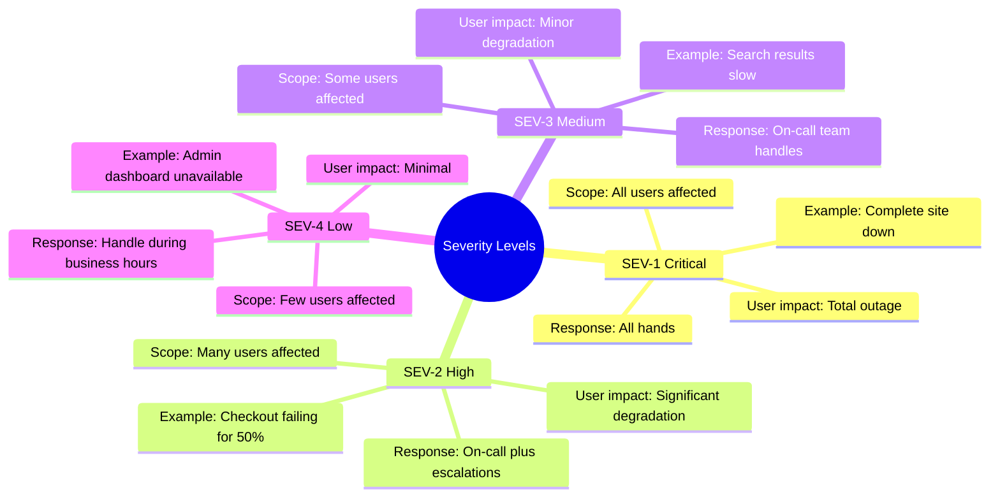
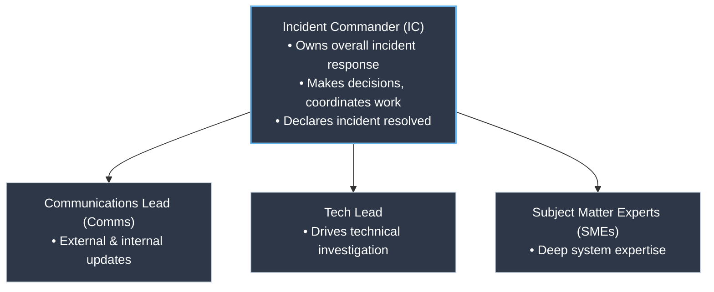
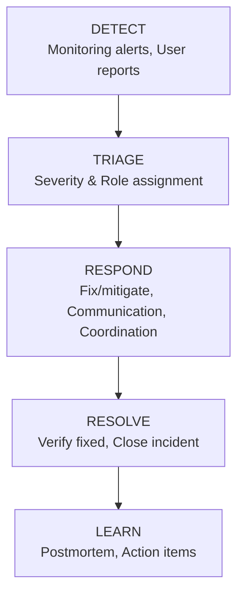
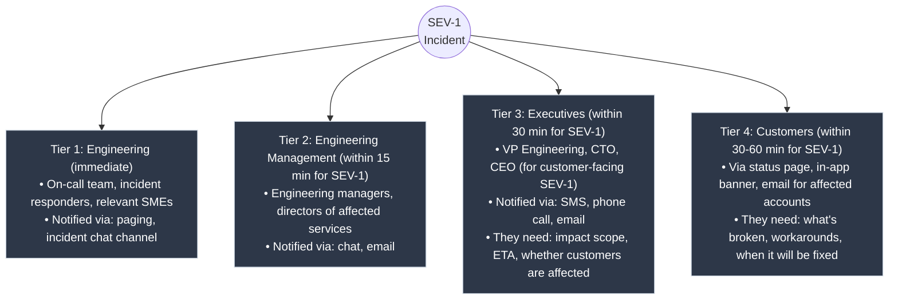
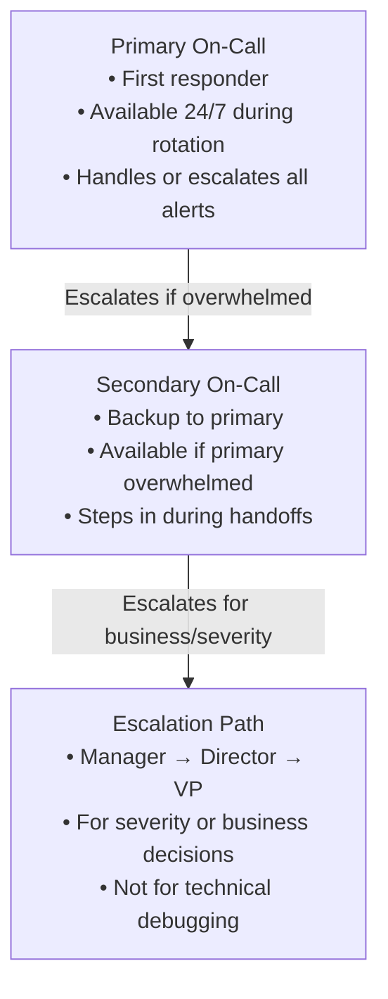
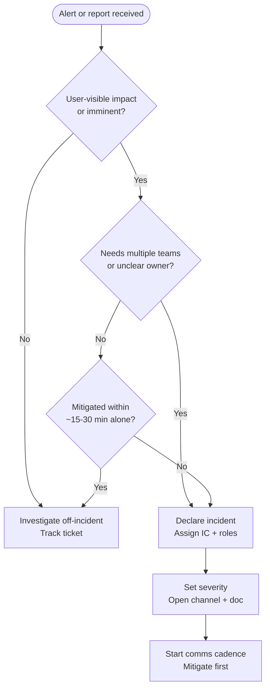

> **Discipline Module** | Complexity: `[MEDIUM]` | Time: 35-40 min
>
> **Prerequisites**: [Module 1.1: What is SRE?](../module-1.1-what-is-sre/), [Module 1.2: SLOs](../module-1.2-slos/), and the [Observability Theory Track](/platform/foundations/observability-theory/). You should already understand why user-visible reliability matters, how SLOs define good service, and how alerting should reflect symptoms rather than internal noise.

## What You'll Be Able to Do

By the end of this module you will have practiced the vocabulary and operating patterns that separate a coordinated outage response from a chat room full of talented people working at cross purposes.

- **Design an incident response framework with clear roles, severities, and escalation paths** that your team can execute under stress without renegotiating basics while customers are affected.
- **Lead an incident as Incident Commander — coordinating communication, diagnosis, and resolution** while keeping responders focused and stakeholders informed through a predictable cadence.
- **Implement incident communication templates that keep stakeholders informed without slowing response** by separating internal coordination from external status updates and matching message detail to audience need.
- **Build runbooks that reduce mean time to resolution for recurring incident categories** by documenting symptom-to-mitigation paths that responders can follow when cognitive load is high.

## Why This Module Matters

Hypothetical scenario: At 3:00 AM, your checkout API error rate jumps from 0.1% to 8%. PagerDuty wakes the primary on-call engineer. Within ten minutes, three more engineers join a shared channel, each running different diagnostic commands, none of them designated as coordinator. Leadership messages the on-call engineer directly for an ETA. Customer support opens fifty duplicate tickets because the status page has not changed in twenty minutes. Two hours later the team finds a bad configuration change, but the outage already consumed a meaningful slice of the quarterly error budget and the post-incident review reveals the same failure mode from six months ago.

That pattern is not a tooling failure alone. It is an incident-management failure. The Google SRE Book's chapter on managing incidents argues that effective response limits disruption and restores normal operations quickly, but only when the organization has practiced a principled process before the crisis. Without that process, talented engineers still default to sharp technical focus, poor communication, and uncoordinated changes that can make outages worse.

Incident management is the discipline that turns a room full of anxious experts into a coordinated response. It borrows structure from emergency services — the Incident Command System (ICS) — and adapts it to software: one person coordinates, another drives technical mitigation, another owns communication, and everyone knows which lane they are in. The goal is not bureaucracy for its own sake. The goal is to stop the bleeding, restore service, preserve evidence for later learning, and do all of that without burning out the humans who carry the pager.

This module teaches the durable practice. Tools such as PagerDuty, Grafana OnCall, Incident.io, and Jira Service Management can schedule rotations, route pages, and host incident timelines, but they do not replace the operating agreement. The agreement comes from pre-defined severities, named roles, communication cadence, escalation thresholds, and runbooks that turn recurring failures into rehearsed motion rather than improvisation.

---

## What Is an Incident?

An incident is an unplanned event that causes or threatens a meaningful drop in service quality that users can feel. That definition sounds simple, but teams stumble on it constantly because production generates endless signals, and not every signal deserves the same response. A pod restart in a multi-replica deployment may be invisible to users. A payment gateway timeout on the critical checkout path is immediately user-visible. The difference is impact scope and user experience, not which component flickered first.

The Google SRE Book distinguishes between the operational event and the underlying problem. An **alert** is a notification that something might be wrong — for example, CPU above 80% on a batch worker that does not sit on the request path. An **incident** is an active, user-impacting condition that requires coordinated response now — for example, payment processing failing for a significant share of checkout attempts. A **problem** is the root cause behind one or more incidents — for example, a connection-pool misconfiguration introduced in the last release. Alerts may trigger investigation. Incidents trigger the response framework. Problems are what you fix so the same incident class does not keep returning.

That separation protects on-call engineers from alert fatigue and protects the business from under-reaction. If every threshold breach becomes an incident, responders desensitize to pages and the incident channel fills with noise. If teams wait until the outage is undeniable before declaring, they lose the early structure that keeps a growing failure from becoming a catastrophic one. Google's guidance is explicit: declare early when customer impact is plausible, when multiple teams are needed, or when concentrated analysis has not produced progress. A declared incident with a named Incident Commander beats five engineers silently poking at dashboards.

Severity should be defined by user impact and scope, not by which subsystem broke. A database failover glitch that users never notice is not the same severity class as an authentication outage that blocks every login, even if both events light up the same monitoring board. Tying severity to the SLO and error-budget framing from [Module 1.2](../module-1.2-slos/) keeps the conversation grounded in the reliability promise rather than in engineer intuition about which service is "more important."

### Incident vs. Problem vs. Alert

| Term | Definition | Example |
|------|------------|---------|
| **Alert** | Notification that something might be wrong | "CPU usage above 80%" |
| **Incident** | Active, user-impacting issue requiring response | "Payment processing failing" |
| **Problem** | Root cause of one or more incidents | "Memory leak in payment service" |

The alert-versus-incident boundary is where many organizations discover they have been paging on infrastructure trivia while missing user pain. Revisit the distinction whenever alert volume climbs faster than incident count, because that imbalance usually means your signals are misaligned with the SLO definitions you wrote in earlier modules.

---

## Severity Levels

Not all incidents deserve the same response intensity. Severity levels exist so the organization can match people, communication cadence, and escalation depth to the harm users are experiencing. A clear severity scheme removes argument during the worst moments because the definitions were agreed in calm planning sessions, not invented under pager stress.

The durable pattern is a four-level scale from SEV-1 through SEV-4. SEV-1 represents full or critical outage: a large share of users cannot complete core workflows, or data integrity is at risk. SEV-2 represents significant degradation: an important feature is materially broken for many users, but workarounds may exist. SEV-3 represents minor degradation: some users see slowness or partial failure on a non-critical path. SEV-4 represents minimal impact: internal tools, narrow cohorts, or cosmetic issues that can wait for business hours. The labels matter less than the criteria. What matters is that every on-call engineer can classify an event in under two minutes using written examples from your own systems.


```mermaid
mindmap
  root((Severity Levels))
    SEV-1 Critical
      User impact: Total outage
      Scope: All users affected
      Response: All hands
      Example: Complete site down
    SEV-2 High
      User impact: Significant degradation
      Scope: Many users affected
      Response: On-call plus escalations
      Example: Checkout failing for 50%
    SEV-3 Medium
      User impact: Minor degradation
      Scope: Some users affected
      Response: On-call team handles
      Example: Search results slow
    SEV-4 Low
      User impact: Minimal
      Scope: Few users affected
      Response: Handle during business hours
      Example: Admin dashboard unavailable
```

Connecting severity to error-budget burn gives SRE teams a quantitative anchor. If your SLO window allows 43.2 minutes of bad events per 30 days at 99.9% availability, a SEV-1 is not merely "the site feels bad." It is an event that threatens to consume budget at a rate that makes normal release risk untenable. Fast-burn alerting from [Module 1.2](../module-1.2-slos/) and [Module 1.3](../module-1.3-error-budgets/) helps here: a 14.4× burn over one hour plus five minutes on a 99.9% target is a page-level signal that often corresponds to SEV-1 or SEV-2 response, while slower burns may justify ticket-level investigation without waking the entire organization.

### Severity by SLO Impact

| Severity | Error Budget Impact | Response |
|----------|---------------------|----------|
| SEV-1 | Consuming >100× normal rate | Core responders engaged immediately |
| SEV-2 | Consuming 10-100× normal rate | On-call + escalations |
| SEV-3 | Consuming 2-10× normal rate | On-call investigates |
| SEV-4 | Normal to 2× normal rate | Track, fix when possible |

> **Pause and predict**: Before you assign severity under pager stress, ask what happens organizationally if you wake five engineers simultaneously for a SEV-3 issue — their responsiveness during the next true SEV-1 will suffer because fatigue, context switching, and interrupted sleep accumulate across the rotation rather than disappearing when the channel goes quiet.

A common anti-pattern is severity inflation: labeling everything SEV-1 because leadership pays attention at that level. Inflation destroys the signal. Responders stop trusting pages, executives stop believing urgency declarations, and real emergencies compete with routine issues for the same cognitive bandwidth. Honest calibration is a reliability investment. Many events that feel catastrophic in the first ten minutes settle into SEV-3 once impact scope is measured. The Incident Commander's early job includes confirming or downgrading severity as facts arrive, not locking the loudest initial guess for the entire event. Document downgrade criteria the same way you document upgrade criteria so responders trust both directions during real events today.

---

## The Incident Command System and Response Roles

Google's incident management model is explicitly based on the Incident Command System, the emergency-response framework FEMA documents in the National Incident Management System. ICS was built for wildfires, hazmat events, and multi-agency disasters — situations where ad hoc heroics kill people. Software outages rarely threaten physical safety, but they share the same coordination failure mode: too many capable people doing uncoordinated work while communication collapses. ICS solves that by recursively separating responsibilities so each role has a single primary job.

The central lesson is counterintuitive for engineers: the Incident Commander (IC) coordinates and decides; the IC does not debug hands-on. The Operations or Tech Lead drives technical mitigation. The Communications Lead owns stakeholder and customer updates. The Scribe maintains the timeline. Planning supports longer incidents with handoffs, bug filing, and resource logistics. When load grows, the IC delegates sub-incidents rather than becoming a bottleneck. That separation is what keeps a large outage from collapsing into chaos when the most senior engineer disappears into a log stream.


```mermaid
graph TD
    classDef ic fill:#2d3748,stroke:#63b3ed,stroke-width:2px,color:#fff;
    classDef role fill:#2d3748,stroke:#cbd5e0,stroke-width:1px,color:#fff;
    
    IC["Incident Commander (IC)<br/>• Owns overall incident response<br/>• Makes decisions, coordinates work<br/>• Declares incident resolved"]:::ic
    Comms["Communications Lead (Comms)<br/>• External & internal updates"]:::role
    Tech["Tech Lead<br/>• Drives technical investigation"]:::role
    SME["Subject Matter Experts (SMEs)<br/>• Deep system expertise"]:::role
    
    IC --> Comms
    IC --> Tech
    IC --> SME
```

The **Incident Commander** holds the high-level state of the incident, structures the response task force, assigns responsibilities, and declares the incident open or resolved. The IC is the default owner of any role not explicitly delegated. If the IC starts tailing application logs, nobody is managing coordination, executive interruptions go unfiltered, and the Comms Lead lacks fresh material for the status page. The IC may have deep technical skill, but the organization spends that skill on judgment: when to roll back versus repair, when to escalate, when to narrow scope, and when to call for additional SMEs.

The **Communications Lead** is the public face of the response. That includes internal leadership updates, customer-facing status pages, and — during major events — prepared answers for support teams handling duplicate tickets. Comms does not need to understand every stack trace. Comms needs accurate impact statements, honest uncertainty, and a steady cadence. Engineers often underestimate how much anxiety silence creates. A status page that says "still investigating, next update in fifteen minutes" retains more trust than twenty minutes of radio silence while the team makes real progress.

The **Tech Lead** or Operations Lead is the only group that should modify production during the incident, in Google's framing. SMEs execute tasks under that lead's direction. Freelancing — well-intentioned changes without coordination — is how mitigations make outages worse. The SRE Book's unmanaged-incident narrative includes exactly that failure: an engineer deploys a "simple fix" without coordinating, and the remaining servers die. Operations discipline is not about distrusting colleagues. It is about ensuring every change is visible, reversible, and attributed.

The **Scribe** maintains a live incident document: timeline, hypotheses, actions taken, decisions, and open questions. The document can be messy; it must be current. Concurrent editing matters because no single person can type fast enough during a fast-moving SEV-1. The Scribe role is often rotated among responders who are not actively driving mitigation. That timeline becomes the backbone of the blameless postmortem in [Module 1.6](../module-1.6-postmortems/).

**Planning** becomes essential in long incidents that cross time zones or meal times. Planning arranges handoffs, tracks divergences from normal system state that must be reverted, files bugs, and ensures the IC is not also ordering dinner. Handoffs must be explicit: the outgoing IC states "you are now Incident Commander," and the incoming IC acknowledges before the outgoing IC leaves the bridge. Implicit handoffs produce duplicate commands and missed context.

> **Stop and think**: If you are the IC and you start reading application logs to find the bug, who is managing the incident?

Role rotation builds organizational resilience. The IC does not have to be the most senior engineer. Rotating IC duty across the team spreads skills, reduces single-person bottlenecks, and prevents burnout among the same three people who always "handle big outages well." Training value is high: engineers who have only ever been SMEs make better ICs later because they understand what coordination information responders need. Shadow rotations during lower-severity events let newcomers practice command without betting the entire customer base on their first bridge call.

---

## Declaring and Running an Incident

Declaring an incident is a commitment to structure, not an admission of personal failure. Teams that under-declare hope a spike will self-resolve before anyone notices. Sometimes that works. When it does not, they pay for the delay with duplicated debugging, missing communication, and changes deployed without coordination. Google's guidance is to declare when customer impact is visible or likely, when a second team must be involved, or when focused analysis for roughly an hour has not produced a mitigation path. Early declaration is cheap. Late declaration is expensive.

The response lifecycle is detect → declare → triage → mitigate → resolve → hand to postmortem. Each phase has a different optimization target. Detection minimizes time-to-know. Triage minimizes time-to-right-people. Mitigation minimizes user harm. Resolution confirms recovery without premature closure. Learning converts the event into systemic improvement. Skipping phases — especially jumping to root-cause analysis before mitigation — prolongs outages because users care about restored service before they care about elegant explanations.


```mermaid
flowchart TD
    Detect[DETECT<br/>Monitoring alerts, User reports] --> Triage[TRIAGE<br/>Severity & Role assignment]
    Triage --> Respond[RESPOND<br/>Fix/mitigate, Communication, Coordination]
    Respond --> Resolve[RESOLVE<br/>Verify fixed, Close incident]
    Resolve --> Learn[LEARN<br/>Postmortem, Action items]
```

**Detection** channels include automated monitoring, customer reports, support ticket spikes, partner notifications, and synthetic checks. The best detection stack pages on user-facing symptoms tied to SLOs, not on every internal metric twitch. Time-to-detect (MTTD) measures how long harm existed before the organization knew. Improving MTTD is often a monitoring and alerting investment rather than an incident-process investment, but the incident framework assumes detection will eventually fire and gives you a place to go when it does.

**Triage** answers impact, scope, severity, and roster. Who is IC? Who is Tech Lead? Is Comms needed yet? Triage should take minutes, not an hour. Use pre-written severity examples: "checkout success rate below 95% for five minutes → SEV-2, page secondary, open incident channel." Triage is where error-budget context helps: if budget is already critically low from prior events, the same technical failure may warrant broader escalation because the business has less margin left.

**Response** prioritizes mitigation before root cause. Mitigate means stop the bleeding: roll back the bad release, failover to a healthy region, drain traffic from a poisoned pool, disable a feature flag, scale out capacity, or restore from backup. Root-cause analysis can proceed in parallel only if it does not compete for the same hands changing production. The SRE Book's best practices list "Prioritize: stop the bleeding, restore service, and preserve the evidence for root-causing." Preservation matters: note the bad configuration, capture relevant logs, and avoid destructive actions that erase the trail before the postmortem.

**Resolution** requires evidence that users are healthy again, not merely that one dashboard turned green. Support ticket arrival rate, success-ratio SLIs, and synthetic probes should confirm recovery. The IC declares resolution only after Tech Lead and Comms agree the external story matches internal reality.

> **Stop and think**: If the monitoring dashboard turns green but customer support tickets are still pouring in, is the incident resolved?

**Learning** hands off to the postmortem process. Incidents without follow-up become recurring incidents. Runbook updates, automation, and architectural fixes belong on the action-item list, not in vague memory. The SRE Workbook's incident-response material emphasizes that the response framework does not end at green dashboards; it ends when the organization has captured enough timeline fidelity for blameless learning and has assigned owners to changes that reduce recurrence risk.

The NIST incident-handling lifecycle — preparation, detection, analysis, containment, eradication, recovery, and post-incident activity — aligns with the software variant even when the verbs differ. SRE teams often collapse containment and recovery into "mitigate," and push eradication into postmortem-driven engineering work rather than during the pager window. Naming that mapping explicitly helps security and platform teams share vocabulary when a customer-impacting outage also has compliance notification requirements.

### Hypothetical scenario: A Well-Run Incident Response

Hypothetical scenario: An e-commerce platform suffers a full-site outage early on a weekday morning. A failed database migration corrupts critical state. The following illustrates how structure changes outcomes — numbers are round and illustrative only.

**The incident:** The site stops serving traffic. Monitoring fires SEV-1 criteria. Primary on-call pages secondary and requests an IC.

Response effectiveness came from activating clear roles immediately rather than waiting for volunteers to emerge from the channel noise. The IC was a senior SRE paged at detection; Comms was a product manager who could translate impact for customers; the Tech Lead was a database engineer; an SME migration author joined for context on the failed change. Each person had a lane before the technical picture was complete.

Communication followed a visible rhythm rather than ad hoc updates whenever someone remembered. The IC opened a dedicated incident channel shortly after detection. Comms posted an initial status-page message while investigation was still early. The Tech Lead identified database corruption and surfaced a recovery plan. Comms updated the status page with an ETA once leadership and customers needed timing, not guesses. The team chose restore-from-backup over in-place repair when time-to-recover clearly favored rollback. Recovery completed, stability checks passed, and the IC declared resolution only after Comms confirmed external messaging matched internal state.

The IC did not debug personally, requested status every fifteen minutes, filtered executive questions away from engineers, and kept the live incident document current for the postmortem. Illustrative outcome: roughly seventy minutes of customer-visible downtime with steady communication and no blame during response. A prior comparable event without roles took several hours longer with confused customer messaging. The lesson is durable: process turns chaos into coordination even when the eventual technical fix is similar.

---

## Incident Communication

Communication failures during outages cause almost as much damage as the technical failure itself. Customers duplicate support load when the status page is stale. Executives interrupt engineers when they lack a filtered channel. Engineers talk past each other when decisions are not written down. Incident communication is therefore a first-class role, not something the IC does when there is a spare minute.

Internal communication should live in one channel per incident. All decisions, status checks, and handoffs appear there. The Scribe mirrors key points into the live incident document. Regular IC announcements — even "no change, still mitigating" — keep peripheral responders from spawning side threads that distract the Tech Lead.

The incident channel below shows how a single thread preserves decisions and timing. Notice that the IC announces open and close explicitly, that Comms status is visible to the whole room, and that the Tech Lead owns technical narrative without the IC rewriting every log line.

```
#incident-2026-06-15-payment-outage

[IC] INCIDENT OPEN - SEV-1 - Payment processing failing
[IC] Roles: IC=@alice, Tech=@bob, Comms=@carol
[Tech] Investigating. Initial data shows DB connection failures.
[Comms] Status page updated. ETA 30 min.
[Tech] Root cause identified: Connection pool exhausted
[Tech] Implementing fix: Increasing pool size
[IC] 15-min check: Fix deploying, ETA 10 more minutes
[Tech] Fix deployed. Monitoring.
[IC] Metrics recovering. Watching for 10 minutes.
[IC] INCIDENT RESOLVED - Total duration: 45 minutes
```

External communication must match audience need. Engineers want logs and hypotheses. Executives want scope, customer impact, business risk, and ETA. Customers want acknowledgement, plain-language impact, workarounds, and predictable update times. One message rarely serves all three; that is why Comms exists.

External status updates use plain language and predictable cadence. Customers do not need shard names; they need to know whether checkout works, whether data is safe, and when you will speak again. The sequence below mirrors what many status-page products support as named states.

```
[INVESTIGATING] 2:45 PM
We are investigating reports of payment processing issues.
Some customers may experience failures when completing checkout.
Next update in 15 minutes.

[IDENTIFIED] 3:00 PM
We have identified the cause and are implementing a fix.
Affected: Payment processing
ETA: 15 minutes
Next update in 15 minutes.

[MONITORING] 3:20 PM
A fix has been deployed. We are monitoring for recovery.
Some transactions may have failed during this period.
Affected transactions will be automatically retried.

[RESOLVED] 3:35 PM
Payment processing has fully recovered.
The issue was caused by a configuration error.
No customer data was affected.
We apologize for the inconvenience.
```

Principles for external updates: cadence beats heroics; honesty about uncertainty beats false precision; customer impact language beats internal component names; accountability without blame builds long-term trust.

### Communication Cadence by Severity

| Severity | Internal Update Cadence | Status Page Cadence | Leadership Notification |
|----------|------------------------|--------------------|-----------------------|
| SEV-1 | Every 15 minutes | Every 15 minutes | Immediately, then every 30 min |
| SEV-2 | Every 30 minutes | Every 30 minutes | Within 30 min, then hourly |
| SEV-3 | Every 60 minutes | As status changes | Daily summary if prolonged |
| SEV-4 | As status changes | Not required | Not required |

Even if nothing has changed, post an update on schedule during SEV-1 and SEV-2 events. Silence breeds anxiety, duplicate support tickets, and executive drive-by messages that interrupt engineers who should be mitigating. A short "still investigating, next update at HH:MM" message is cheap trust.

Stakeholder notification tiers map severity to audience and channel. Engineering needs the incident room immediately; management needs filtered summaries; executives need business impact and ETA; customers need honest acknowledgement and workarounds when they exist.


```mermaid
graph TD
    classDef tier fill:#2d3748,stroke:#cbd5e0,stroke-width:1px,color:#fff;
    
    T1["Tier 1: Engineering (immediate)<br/>• On-call team, incident responders, relevant SMEs<br/>• Notified via: paging, incident chat channel"]:::tier
    T2["Tier 2: Engineering Management (within 15 min for SEV-1)<br/>• Engineering managers, directors of affected services<br/>• Notified via: chat, email"]:::tier
    T3["Tier 3: Executives (within 30 min for SEV-1)<br/>• VP Engineering, CTO, CEO (for customer-facing SEV-1)<br/>• Notified via: SMS, phone call, email<br/>• They need: impact scope, ETA, whether customers are affected"]:::tier
    T4["Tier 4: Customers (within 30-60 min for SEV-1)<br/>• Via status page, in-app banner, email for affected accounts<br/>• They need: what's broken, workarounds, when it will be fixed"]:::tier

    SEV1(("SEV-1<br/>Incident")) --> T1
    SEV1 --> T2
    SEV1 --> T3
    SEV1 --> T4
```

Templates reduce cognitive load for Comms when the wording matters but the facts are still moving. Copy, fill brackets, and publish rather than drafting from a blank screen while the IC waits.

```
INITIAL NOTIFICATION (internal):
"[SEVERITY] incident declared. [SERVICE] is [IMPACT DESCRIPTION].
Approximately [NUMBER/PERCENTAGE] of users affected.
IC: @[NAME] | Tech Lead: @[NAME] | Comms: @[NAME]
Incident channel: #incident-[DATE]-[SHORT-NAME]
Next update in [15/30] minutes."

STATUS UPDATE (internal, use at each cadence interval):
"Update [NUMBER] — [TIME]
Current status: [investigating / identified / fix in progress / monitoring]
What we know: [1-2 sentences]
What we're doing: [current action]
ETA to resolution: [estimate or 'unknown']
Next update in [15/30] minutes."

STATUS PAGE UPDATE (external, customer-facing):
"We are aware of an issue affecting [SERVICE/FEATURE].
Impact: [PLAIN-LANGUAGE DESCRIPTION of what users experience].
Our team is actively working on a resolution.
ETA: [estimate or 'We will provide an update by TIME'].
We apologize for the inconvenience."

RESOLUTION NOTIFICATION (external):
"The issue affecting [SERVICE] has been resolved as of [TIME].
Duration: [START] to [END].
[Brief root cause in plain language, no internal jargon].
[Any actions customers need to take, e.g., retry failed transactions].
We apologize for the disruption and are taking steps to prevent recurrence."
```

For SEV-1 events, a bridge call or voice channel supplements chat when typing cannot keep pace with decisions. The IC runs the bridge, non-speaking participants stay muted, and observers who are not mitigating stay off the line to read the channel asynchronously. The table below captures durable bridge etiquette that survives vendor changes.

| Rule | Why |
|------|-----|
| IC opens and runs the bridge | Single point of coordination |
| Mute when not speaking | Reduce noise so updates are heard |
| Tech Lead gives status every 15 min | Keeps IC informed without repeated prompts |
| Non-responders stay off the bridge | Too many voices recreate chaos; use chat for observers |
| Decisions spoken aloud and typed in channel | Creates written record, avoids "I thought we agreed..." |
| Handoff protocol when IC rotates | Outgoing IC summarizes state; incoming IC confirms acceptance |

Post-incident customer follow-up matters for major events. Within twenty-four hours, publish a brief status-page summary. For large SEV-1/SEV-2 events, a detailed customer-facing report within a few business days shows accountability. Honest specificity — "a misconfigured failover stopped payment processing for forty-five minutes" — beats vague corporate language. Promise concrete remediation steps, not "this will never happen again." Customers remember how you communicated during an outage more than the outage duration itself.

---

## On-Call, Escalation, and Sustainable Coverage

Being on-call is how incident management meets the calendar. Someone must accept the pager, acknowledge within minutes, and either mitigate or escalate. The SRE Book's chapter on being on-call treats sustainable rotation as a reliability requirement, not a perk discussion. Exhausted on-call engineers make slow decisions, tolerate noisy alerts, and eventually leave the team, taking institutional knowledge with them.

A durable on-call structure includes primary and secondary responders, a documented escalation path for severity and business decisions, and explicit handoff rituals between shifts. Primary owns first response. Secondary backs up an overwhelmed primary or covers handoff gaps. Escalation to management is for severity confirmation, customer commitments, regulatory notification, or cross-team conflict — not for technical debugging that should route to SMEs.


```mermaid
graph TD
    POC["Primary On-Call<br/>• First responder<br/>• Available 24/7 during rotation<br/>• Handles or escalates all alerts"]
    SOC["Secondary On-Call<br/>• Backup to primary<br/>• Available if primary overwhelmed<br/>• Steps in during handoffs"]
    ESC["Escalation Path<br/>• Manager → Director → VP<br/>• For severity or business decisions<br/>• Not for technical debugging"]
    
    POC -->|Escalates if overwhelmed| SOC
    SOC -->|Escalates for business/severity| ESC
```

Alert quality determines on-call quality. Rob Ewaschuk's alerting philosophy, summarized in the SRE Book's practical alerting chapter, emphasizes paging on symptoms that correlate with user pain. Pages should be actionable, urgent, and novel enough to deserve waking a human. "CPU is high" is rarely a page; "checkout success ratio below SLO for five minutes" often is. False positives train responders to ignore the pager, which is indistinguishable from reliability failure when the next SEV-1 arrives.

Sustainable on-call practices include short rotations, enough people that no single engineer carries the pager alone, compensation or time-off tradeoffs, runbooks for common pages, and post-rotation feedback sessions. Anti-patterns include 24/7 solo on-call, punishing escalations, expecting major project delivery during a heavy rotation week, and paging on tickets that can wait until morning.

| Metric | Good Target | Why It Matters |
|--------|-------------|----------------|
| Pages per on-call week | Track the trend over time | Sustained page volume drives fatigue and burnout |
| False positive rate | Keep it low enough that responders trust alerts | Higher rates train people to ignore pages |
| Time to acknowledge | Minutes, not tens of minutes | Faster acknowledgment usually shortens response |
| Incidents requiring escalation | Track and review by team maturity | Frequent escalation can reveal coverage or skill gaps |
| On-call satisfaction | Track regularly with your team | Sustained dissatisfaction is a retention risk |

Link on-call back to SLO-based alerting. Burn-rate pages from Module 1.2 exist precisely so on-call wakes for budget-threatening symptoms, not for every metric wiggle. When an on-call rotation consistently receives pages that do not map to user impact, fix the alerts before adding more responders.

---

## MTTx: Measuring Detection, Response, and Recovery

Incident metrics turn post-incident arguments into improvement levers. The vocabulary is standardized enough that teams can compare classes of outages without pretending every minute is interchangeable. **Mean Time to Detect (MTTD)** measures how long user-impacting harm existed before the organization recognized it. **Mean Time to Acknowledge (MTTA)** measures how long after notification until a human owns response. **Mean Time to Repair / Recover / Resolve (MTTR)** measures how long from detection or declaration until service is restored for users — definitions vary by organization, so write yours down. **Mean Time Between Failures (MTBF)** measures stability between incidents of a class; it helps capacity and architecture planning more than it helps mid-outage coordination.

These metrics answer different questions. High MTTD points to monitoring gaps, missing SLO-based alerts, or weak synthetic checks. High MTTA points to rotation holes, noisy pager fatigue, or unclear ownership. High MTTR points to missing runbooks, slow escalation, change-risk aversion during mitigation, or architectural fragility. MTBF shrinking for a subsystem points to chronic problem debt. Teams that only track MTTR optimize the visible tail of the timeline while ignoring hours of silent user harm before anyone paged.

Use metrics blamelessly. A rising MTTA during holidays is a scheduling problem, not an individual failure. A rising MTTR for database incidents is a runbook and tooling problem. Publish trends internally, annotate charts with process changes, and review them in operations meetings alongside error-budget reports. GitLab's incident-metrics visualization guidance illustrates how timelines make MTTD, MTTA, and MTTR legible to leadership without turning human review into a single-number scoreboard.

When you report MTTR, state the start and end anchors your organization uses. Some teams measure from first customer report; others from declaration; others from page acknowledgment. Consistency matters more than which definition is theoretically perfect, because improvement programs compare periods using the same ruler.

---

## Runbooks and Playbooks

Runbooks reduce mean time to resolution by documenting recurring incident classes before adrenaline is high. A good runbook answers: what symptom triggered this, what user impact to expect, what checks to run in what order, what mitigations are safe, when to escalate, and what evidence to preserve for the postmortem. Runbooks are living documents. When a postmortem shows responders guessed wrong for twenty minutes, the runbook gets a new branch, not a shrug.

> **Pause and predict**: Runbooks written before an incident exist so responders do not spend the first twenty minutes reinventing a checklist while users remain broken — memory is unreliable under adrenaline, and the cost of "we will document it later" shows up as repeated MTTR spikes for the same alert class.

### Runbook Example

The following runbook skeleton shows how symptom, impact, ordered checks, mitigations, and escalation timers fit on one page. Bash commands appear as plain steps you would validate in staging and paste during response.

```markdown
# Runbook: Payment Service High Error Rate

## Trigger
Alert: payment-service-error-rate-high
Threshold: Error rate > 5% for 5 minutes

## Impact
Users unable to complete purchases.

## Quick Diagnosis
1. Check payment-service dashboard: [link]
2. Check dependent services:
   - Database: [link]
   - Payment gateway: [link]
   - Auth service: [link]

## Common Causes & Fixes

### Database Connection Exhaustion
Symptoms: Connection timeout errors in logs
Fix: kubectl rollout restart deployment/payment-service -n production
If unresolved: Check database load, may need failover

### Payment Gateway Outage
Symptoms: Gateway timeout errors in logs
Verify: Check gateway status page: [link]
Fix: kubectl set env deployment/payment-service GATEWAY=fallback

### Auth Service Degradation
Symptoms: Auth timeout errors in logs
Verify: Check auth service dashboard: [link]
Fix: Escalate to auth team channel; auth owners own resolution

## Escalation
- If not resolved in 15 min: Page secondary on-call
- If not resolved in 30 min: Page engineering manager
- For business decisions: Contact VP on-call

## Post-Resolution
1. Verify metrics returned to normal
2. Create incident ticket
3. Schedule postmortem if SEV-2 or higher
```

Executable commands for the database and gateway branches:

```bash
kubectl rollout restart deployment/payment-service -n production
kubectl set env deployment/payment-service GATEWAY=fallback
```

The anatomy of a strong runbook entry follows symptom → checks → mitigation → escalation. Each mitigation step should state prerequisites and rollback. Kubernetes-oriented teams can link to the [debug application tasks](https://kubernetes.io/docs/tasks/debug/debug-application/) for pod logs, events, and ephemeral debug containers — but the runbook should name the exact commands your platform expects, tested in a staging cluster.

**Playbooks** differ from runbooks: they describe general strategies for novel incidents — how to run a bridge, how to coordinate a multi-region failover, how to communicate when root cause is unknown. Use runbooks for known alert paths; use playbooks for categories where creativity is required but discipline still matters.

| Runbook | Playbook |
|---------|----------|
| Specific procedure | General strategy |
| Step-by-step | Principles and patterns |
| For specific alert/issue | For types of incidents |
| "How to fix X" | "How to approach category" |

Maintain runbooks from postmortem action items. If three incidents required the same manual cache flush, automate it or document it. A runbook that has not been tested in six months is folklore. Schedule quarterly runbook drills the same way you test backups: the cheap time to discover a broken link or stale command is before customers depend on it.

---

## Landscape snapshot — as of 2026-06. Verify against vendor docs before relying on specifics.

On-call and incident tooling changes quickly. The durable capabilities matter more than brand loyalty: paging, scheduling, escalation policies, incident timelines, stakeholder notifications, status pages, and retrospective exports. The following Rosetta compares peers on capability, not market share.

| Capability | What good looks like | Examples (verify current docs) |
|------------|---------------------|--------------------------------|
| Paging and scheduling | Rotations, overrides, fair load split | PagerDuty, Grafana OnCall, Jira Service Management Operations |
| Escalation policy | Tiered notify-if-unacked, severity routing | PagerDuty, Grafana OnCall, Jira Service Management |
| Incident comms channel | Single timeline, role assignments, updates | Incident.io, FireHydrant, PagerDuty |
| Status page | Customer-facing cadence templates | PagerDuty, Atlassian Statuspage, Instatus |
| Retrospective export | Timeline + actions for postmortem | Incident.io, FireHydrant, Jira Service Management |

**Opsgenie note:** Atlassian ended new Opsgenie sales on June 4, 2025, and set end of support for April 5, 2027. Capabilities migrate to Jira Service Management and Compass per Atlassian's migration guidance. If your organization still runs Opsgenie, plan exit before the hard shutdown date and verify which successor path matches your workflow.

Tools implement the workflow; they do not define it. A team with excellent PagerDuty configuration but no IC role separation still drowns in chaos. A team with a spreadsheet rotation but crisp ICS discipline often outperforms fancier stacks.

---

## Practicing Incident Response

Incident management skill atrophies without practice, as the Google SRE Book warns when teams only spin up roles during catastrophes. The framework should feel familiar on a bad Tuesday afternoon, not like a constitution you read once and hope to remember at 3 AM. Regular practice takes several forms, each cheap compared with an uncontrolled SEV-1.

**Tabletop exercises** walk a team through a written scenario without touching production: assign IC, Comms, Tech Lead, and Scribe; practice severity calls; draft status-page language; rehearse escalation when the scenario adds a second failing dependency. Tabletops surface gaps in runbooks, on-call rosters, and executive contact trees before customers notice.

**Role rotations during real incidents** build bench depth. If the same two seniors always command, everyone else stays SME-only forever. Deliberately pairing a newer IC with an experienced shadow IC spreads judgment skills while preserving safety.

**Game days and disaster-recovery drills** stress the same coordination muscles as customer-facing outages. Failing over a region, restoring backups, or rehearsing "metrics pipeline down" teaches responders how to declare incidents when observability itself is the casualty — a case where severity may be high even before user impact is fully visible.

**Postmortem readouts** close the loop from [Module 1.6](../module-1.6-postmortems/). When action items update runbooks, alert routes, or IC checklists, the next incident of that class starts closer to resolution. Practice is not only synthetic; it is maintaining the artifacts that make real events boring in the best possible way.

Google's guidance also suggests using the incident framework for large planned operational changes that span teams and time zones. If responders already know how to open a channel, assign roles, and hand off command, the same structure feels natural when production breaks unexpectedly.

---

## Patterns & Anti-Patterns

### Patterns

1. **Declare early, downgrade later.** Opening an incident channel and naming an IC costs little. Closing without structure after a two-hour scramble costs a lot.
2. **Mitigate before you root-cause.** Roll back, failover, drain, or feature-disable to restore users while investigation continues in parallel with guardrails.
3. **Single writer for production changes.** Tech Lead coordinates mutations; SMEs propose steps; freelancers do not push surprise fixes.
4. **Cadence even without news.** Comms posts on schedule during SEV-1/SEV-2 so customers and executives do not invent narratives.
5. **Live incident document.** Concurrent timeline capture feeds postmortems and prevents "I thought we tried that" disputes.
6. **Runbook-driven first fifteen minutes.** Repeatable alerts get repeatable first steps, freeing brainspace for novel failure modes.
7. **Explicit IC handoff.** Spoken and typed confirmation when command transfers across people or time zones.

### Anti-Patterns

1. **IC as super-debugger.** Coordinator disappears into logs; nobody owns the bridge.
2. **Severity inflation.** Everything is SEV-1; real emergencies hide in noise.
3. **Silent status pages.** Engineering works while customers assume nobody is home.
4. **Hero culture.** One expert carries response without roles; knowledge never spreads.
5. **Freelance production changes.** Unguarded "quick fixes" amplify damage.
6. **Premature resolution.** Dashboard green while support tickets still rising.
7. **Post-incident amnesia.** No postmortem, no runbook update, same incident repeats.
8. **Paging on non-actionable metrics.** On-call learns to ignore the pager.

### Decision Framework: Should we declare an incident?


```mermaid
flowchart TD
    Start([Alert or report received]) --> Impact{User-visible impact<br/>or imminent?}
    Impact -->|No| Investigate[Investigate off-incident<br/>Track ticket]
    Impact -->|Yes| Multi{Needs multiple teams<br/>or unclear owner?}
    Multi -->|Yes| Declare[Declare incident<br/>Assign IC + roles]
    Multi -->|No| Progress{Mitigated within<br/>~15-30 min alone?}
    Progress -->|Yes| Investigate
    Progress -->|No| Declare
    Declare --> Severity[Set severity<br/>Open channel + doc]
    Severity --> Cadence[Start comms cadence<br/>Mitigate first]
```

| Decision | Declare incident when | Stay off-incident when |
|----------|----------------------|------------------------|
| Customer impact | Checkout, login, or data path degraded | Internal-only batch delay |
| Coordination need | Multiple teams or unclear ownership | Single owner, known runbook fix |
| Time boxed analysis | No mitigation in ~30-60 minutes focused work | Fix deployed and verified quickly |
| Error budget | Fast burn threatening SLO | Minor blip within normal noise |
| Executive visibility | Customer-facing SEV likely | No external stakeholder risk |

---

## Did You Know?

1. **Google's incident management system was inspired by fire department protocols.** The Incident Commander role comes directly from the Incident Command System documented in FEMA's National Incident Management System.

2. **The best incident responders often do less hands-on debugging, not more.** ICs create clarity and decision flow so specialists can execute without second-guessing each other.

3. **Large, unstructured response groups create duplicated effort.** Major incidents still need explicit roles even when many experts arrive to help.

4. **High-performing teams reduce low-value pages by fixing alerts and automating routine responses**, leaving human attention for novel failures that actually threaten SLOs.

---

## Common Mistakes

| Mistake | Problem | Solution |
|---------|---------|----------|
| Everyone debugging | Duplicated effort, chaos | Assign IC, Tech Lead, Comms, Scribe |
| No communication | Customers angry, leadership blind | Comms role with cadence templates |
| Premature resolution | Problem returns, erodes trust | Verify with SLIs and support signals |
| Over-escalating severity | Leadership fatigue, cry-wolf effect | Calibrate with written examples |
| Under-escalating severity | Major incident unaddressed | Declare early; use error-budget burn |
| IC debugging hands-on | Coordination collapses | IC coordinates; Tech Lead mitigates |
| No live incident document | Lost timeline, weak postmortem | Scribe updates concurrent doc |
| Skipping postmortem | Same incident recurs | Blameless review for SEV-1/SEV-2 |

---

## Quiz

### Question 1

You are the primary on-call engineer for an e-commerce platform. At 2:00 PM on a busy Tuesday, your pager fires because the checkout API error rate has spiked from a baseline of 0.1% to 3%. How do you triage this to determine the correct severity and next steps?

<details>
<summary>Answer</summary>

Start with user impact on the critical path: checkout errors mean real revenue loss and customer frustration, so urgency is high even if the site is partly up. Compare the current error rate to SLO and error-budget context — a sustained 3% failure rate on checkout likely burns budget quickly. Check whether the rate is stable or climbing; climbing suggests cascading failure worth broader escalation. Inspect error types: 5xx implicates server-side failure, while 4xx might indicate a client or configuration mismatch. If impact is material and not fixed in minutes, declare an incident, assign IC and Tech Lead roles (secondary can IC while you tech-lead), and open the incident channel with a timed comms plan. This is how you design an incident response framework with clear roles, severities, and escalation paths under pressure.

</details>

### Question 2

During a massive SEV-1 database outage, the Tech Lead is struggling to find the root cause, and the CEO is demanding answers in the chat channel. As Incident Commander, what is your primary focus, and what should you avoid doing?

<details>
<summary>Answer</summary>

Your primary focus is coordination: maintain situational awareness, route executives to the Communications Lead, enforce the update cadence, and remove blockers for the Tech Lead. Intercept CEO messages so engineers are not context-switching to write ad hoc updates. Explicitly avoid hands-on debugging — if you dive into database logs, nobody is tracking open questions, handoffs, or decision points. Ask the Tech Lead for time-boxed status, bring SMEs when stuck, and make rollback-versus-repair decisions when mitigation options exist. Leading as IC means protecting the response structure so diagnosis and resolution can proceed without political noise.

</details>

### Question 3

You are Tech Lead on a SEV-2 incident where a Kubernetes deployment is crash-looping. After 45 minutes you have not found root cause. The runbook says escalate at 30 minutes, but you feel you are close. What should you do?

<details>
<summary>Answer</summary>

Escalate now and request additional SMEs despite the "almost there" feeling. The thirty-minute threshold exists because tunnel vision prolongs outages and exhausts responders. Fresh eyes often spot misconfigured probes, bad secrets, or dependency failures quickly. Escalation is not failure; it is process working. Meanwhile keep mitigation options on the table — rollback to the last healthy revision may restore users before root cause is fully understood. Following written escalation paths is part of building runbooks that reduce mean time to resolution for recurring incident categories.

</details>

### Question 4

Twenty minutes into a SEV-1 login outage, the Tech Lead has no new findings in fifteen minutes. The last status page update said "Investigating." Should Comms publish another update without technical news?

<details>
<summary>Answer</summary>

Yes. Cadence matters as much as breakthroughs during major outages. Silence drives duplicate support tickets and social media speculation. A update that says you are still investigating, restates user impact in plain language, and commits to the next check-in time maintains trust. Implementing incident communication templates that keep stakeholders informed without slowing response means Comms can draft from templates while engineering keeps working. Perception management is part of incident management, not a distraction from it.

</details>

### Question 5

A monitoring alert fires for elevated CPU on a background worker that does not sit on the user request path. Checkout SLIs remain healthy. Should you declare a customer-facing incident?

<details>
<summary>Answer</summary>

Not immediately as a customer-facing incident. The alert may warrant investigation and a ticket, but incident declaration should track user-visible harm or imminent risk to critical paths. CPU on a non-critical worker is a classic alert-versus-incident distinction. If investigation reveals the worker feeds checkout asynchronously and queue depth is growing toward user-visible delay, reassess severity. Severity definitions tied to user impact prevent alert fatigue and keep incident channels focused.

</details>

### Question 6

Your team resolves a SEV-2 outage when the main dashboard turns green, but support reports continued login failures from mobile clients. The IC asks whether to declare resolution. What do you recommend?

<details>
<summary>Answer</summary>

Do not declare resolution yet. Resolution requires confirmation across user-visible signals, not a single dashboard. Check mobile-specific SLIs, synthetic probes, geographic slices, and support ticket velocity. If mobile clients still fail, the incident remains active at reduced or unchanged severity. Premature closure erodes customer trust and hides partial outages that can flare again. The IC coordinates verification across Comms and Tech Lead before closing the incident record.

</details>

### Question 7

You are designing on-call for a ten-person team across three time zones. What practices reduce burnout while keeping MTTA low?

<details>
<summary>Answer</summary>

Use follow-the-sun or reasonable rotation lengths so no individual carries pager 24/7 alone. Maintain primary and secondary schedules with documented handoffs. Page only on actionable, user-symptom alerts tied to SLOs. Compensate on-call with time off or pay. Review pages-per-shift trends and fix noisy alerts instead of adding people. Sustainable on-call is a prerequisite for fast acknowledgment; exhausted responders miss pages or acknowledge slowly.

</details>

### Question 8

After three similar cache-related outages, postmortems recommend "document the flush procedure." What should you deliver instead of a vague wiki note?

<details>
<summary>Answer</summary>

Deliver a tested runbook tied to the alert or symptom: trigger threshold, user impact statement, ordered checks, safe flush commands, rollback caveats, escalation timers, and post-resolution verification steps. Link dashboards and kubectl commands validated in staging. Runbooks reduce mean time to resolution when responders execute the first fifteen minutes from memory-free instructions. Schedule a game day to walk the runbook under time pressure and update it from what fails.

</details>

---

## Hands-On

Build an incident response plan for a service you know. If you lack production access, use a hypothetical API service with a 99.9% availability SLO and round illustrative numbers. Label hypothetical choices in your notes and focus on whether each decision follows from user impact rather than component names.

### Part 1: Severity Definition

Write SEV-1 through SEV-4 with user-impact criteria, paging rules, communication cadence, and at least one concrete example per level drawn from systems you operate or from a clearly labeled hypothetical service.

```yaml
severity_levels:
  sev1:
    name: "Critical"
    criteria:
      - # What makes an incident SEV-1?
    response:
      - # Who is paged?
      - # Response time target?
    examples:
      - # Real examples from your systems

  sev2:
    name: "High"
    criteria:
      -
    response:
      -
    examples:
      -

  sev3:
    name: "Medium"
    criteria:
      -
    response:
      -
    examples:
      -
```

### Part 2: Role Assignments

Name primary and backup owners for IC, Comms, Tech Lead, and Scribe. Include how command transfers across time zones and who approves severity downgrades when new data arrives.

### Part 3: Communication Templates

Adapt the internal and status-page templates from this module to your service names, support links, and severity-based cadence. Include at least one template for "no new technical information yet."

### Part 4: Runbook Outline

Author one runbook for a recurring alert, including trigger threshold, user-impact statement, ordered checks, safe mitigations with rollback notes, escalation timers, and post-resolution verification queries.

### Success Criteria

- [ ] Defined all severity levels with user-impact criteria and concrete examples from your environment.
- [ ] Assigned incident roles with primary and backup owners plus escalation paths for business decisions.
- [ ] Created internal and external communication templates with severity-based cadence.
- [ ] Authored at least one tested runbook linked to a real or hypothetical alert.
- [ ] Documented MTTD/MTTA/MTTR definitions your team will use consistently in postmortems.

---

## Sources

- [Google SRE Book: Managing Incidents](https://sre.google/sre-book/managing-incidents/) — ICS-inspired roles, unmanaged versus managed incidents, declaration guidance, and response best practices.
- [Google SRE Book: Being On-Call](https://sre.google/sre-book/being-on-call/) — Sustainable rotations, alert quality, and operational readiness for interrupt-driven work.
- [Google SRE Book: Emergency Response](https://sre.google/sre-book/emergency-response/) — Troubleshooting under pressure and coordination with incident management.
- [Google SRE Book: Practical Alerting](https://sre.google/sre-book/practical-alerting/) — Symptom-based paging philosophy and alert design that protects on-call engineers.
- [Google SRE Book: Tracking Outages](https://sre.google/sre-book/tracking-outages/) — Outage measurement, analysis, and operational feedback loops.
- [Google SRE Book: Postmortem Culture](https://sre.google/sre-book/postmortem-culture/) — Blameless learning and why incidents must produce durable action items.
- [SRE Workbook: Incident Response](https://sre.google/workbook/incident-response/) — Practical incident response patterns for software operations teams.
- [PagerDuty Incident Response Guide](https://response.pagerduty.com/) — Industry reference for roles, lifecycle, and response operations.
- [FEMA National Incident Management System](https://www.fema.gov/national-incident-management-system) — Origin context for ICS and scalable command structures.
- [FEMA ICS Resource Center](https://training.fema.gov/emiweb/is/icsresource/) — Incident Command System reference materials and training resources.
- [Atlassian Incident Management](https://www.atlassian.com/incident-management) — Handbook-oriented guidance on incident workflows and team practices.
- [Atlassian Incident Management Handbook](https://www.atlassian.com/incident-management/handbook) — Durable practices for triage, comms, and resolution workflows.
- [Kubernetes: Debug Applications](https://kubernetes.io/docs/tasks/debug/debug-application/) — Current troubleshooting tasks for pod logs, events, and debug containers in runbooks.
- [Prometheus Alerting Rules](https://prometheus.io/docs/prometheus/latest/configuration/alerting_rules/) — Alert rule syntax for symptom-based paging tied to incident triggers.
- [GitLab: Visualizing Incident Management Metrics](https://about.gitlab.com/blog/visualizing-incident-management-metrics/) — MTTD, MTTA, MTTR, and timeline visualization practices.
- [NIST SP 800-61 Rev. 3](https://csrc.nist.gov/pubs/sp/800/61/r3/final) — Computer security incident handling guide for preparation, detection, and response.
- [DORA Research Program](https://dora.dev/research/) — Software delivery and operational performance research including stability and recovery metrics.

## Next Module

Continue to [Module 1.6: Postmortems and Learning](../module-1.6-postmortems/) to learn how blameless reviews convert incident timelines into durable action items, runbook updates, and architectural fixes that prevent recurrence.
