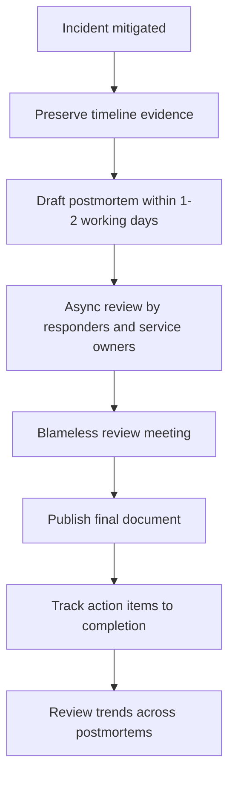
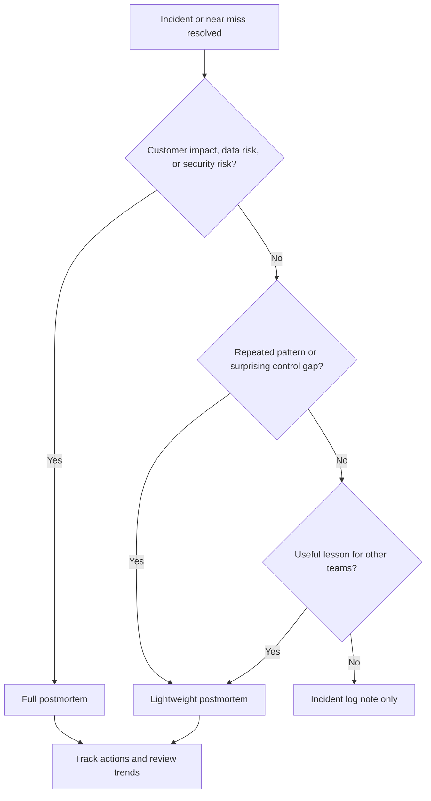

> **Discipline Module** | Complexity: `[MEDIUM]` | Time: 60-75 min

## What You'll Be Able to Do

After completing this module, you will be able to:

- **Lead blameless postmortem meetings that surface systemic causes rather than individual fault**, using facilitation language that makes responders safer, more precise, and more willing to share what they knew at the time.
- **Design action items that address root causes and prevent incident recurrence**, with clear owners, measurable completion criteria, and a priority that reflects reliability risk rather than meeting-room enthusiasm.
- **Build a postmortem culture where learning from failure becomes a competitive advantage**, by turning incidents into shared knowledge, repeatable habits, and better engineering decisions.
- **Analyze postmortem trends across incidents to identify organizational reliability patterns**, so a collection of incident reports becomes roadmap input instead of a document archive.

## Why This Module Matters

Hypothetical scenario: a checkout service fails for about 30 minutes after a routine configuration change. The on-call engineer restores service by rolling back the change, everyone writes a short message saying the incident is resolved, and the team tries to return to normal work. Two weeks later a similar change breaks the same service again, because the first incident taught the people who were awake that night but did not teach the system, the deployment process, or the rest of the organization.

That second outage is the reason postmortems exist. An incident is expensive tuition: customers lose trust, engineers lose sleep, support teams absorb confusion, and product work stops while people recover the service. The postmortem is how an SRE organization collects the lesson it already paid for, converts it into a shared explanation, and decides which changes are worth making so the same class of failure becomes less likely, easier to detect, or less damaging next time.

Without a postmortem, the strongest memories of an incident stay trapped in individual heads and slowly decay into folklore. One responder remembers that the dashboard was misleading, another remembers that the rollback command was missing a flag, and a manager remembers only that the deployment happened late in the day. A good postmortem creates a single learning artifact that is detailed enough to preserve the important facts, neutral enough that people can contribute honestly, and practical enough that it changes future behavior.

This module assumes you already understand the basics of SRE from [Module 1.1: What is SRE?](../module-1.1-what-is-sre/) and the live response mechanics from [Module 1.5: Incident Management](../module-1.5-incident-management/). If systems thinking is still new to you, the [Systems Thinking Track](/platform/foundations/systems-thinking/) will help with the idea that failures emerge from interacting conditions rather than one isolated mistake.

## What Is a Postmortem?

A postmortem is a structured review written after an incident is mitigated or resolved. The document records what happened, who and what was affected, how responders detected and mitigated the problem, which conditions made the incident possible, where the response went well or poorly, where luck reduced the impact, and what the organization will change afterward. The important word is structured: a hallway conversation can produce useful memories, but a postmortem turns those memories into durable knowledge that can be searched, reviewed, taught, and connected to later incidents.

The Google SRE Book defines postmortems as written records of incidents, impact, mitigation, causes, and follow-up actions. That definition is deliberately wider than "root cause analysis." Root cause analysis sounds like the team is hunting one buried object, but production incidents usually involve multiple conditions: technical design, operational pressure, missing guardrails, confusing dashboards, unclear ownership, weak tests, queue backlogs, dependency behavior, and human decisions that made sense locally at the time.

The postmortem analogy is a flight data recorder, not a courtroom transcript. A courtroom asks who violated a rule and what consequence should follow. A flight data recorder helps investigators reconstruct the operating environment, decisions, signals, alarms, and mechanical behavior that surrounded the event. SRE postmortems work the same way: the goal is not to prove a person was careful or careless, but to understand how the socio-technical system behaved under stress and how to improve it.

Low-severity incidents can still deserve postmortems when they reveal a reusable lesson. A silent background job failure, a near miss caught by an attentive engineer, or a repeated alert that never becomes customer-visible might teach more than a noisy outage with an obvious mitigation. The threshold should be low enough to capture important learning and high enough that the process stays sustainable. Many teams use severity as a default trigger, then add judgment for recurring issues, near misses, data risks, customer escalations, and incidents that exposed surprising operational gaps.

## Blameless Culture: The Load-Bearing Idea

Blameless culture is the load-bearing idea behind effective postmortems. It starts from the assumption that people generally acted rationally given the information, incentives, pressures, and tools they had at the time. That assumption is not naive optimism; it is an investigation strategy. If the team begins with "who messed up," people protect themselves and the story becomes smaller. If the team begins with "what made this action reasonable or possible," the investigation can expose the conditions that will affect the next responder too.

Blame is counterproductive because it hides the data you most need. The person closest to the incident often knows which dashboard was ambiguous, which runbook step was stale, which approval path was bypassed because it usually slows urgent work, and which command was easy to mistype. If that person expects punishment, public embarrassment, or career damage, they will understandably give a narrower account. The organization may feel decisive for identifying a culprit, but it has made future incidents harder to learn from.

Blameless does not mean consequence-free, careless, or indifferent to repeated harmful behavior. It means the postmortem is not the venue for shaming people for ordinary human error, local tradeoffs, or decisions that looked reasonable before the incident was understood. Accountability in SRE is forward-looking: own the facts, own the repair work, own the system improvement, and make it easier for future humans to do the right thing under pressure. Intentional abuse, gross negligence, and policy violations still need management channels, but mixing those channels with learning reviews poisons both.

Sidney Dekker's human-error work is useful because it separates the "first story" from the "second story." The first story is the simple story available after the fact: an engineer clicked the wrong button, a reviewer missed a bug, an on-call used the wrong cluster context, or a manager approved a risky change. The second story asks why that action made sense from inside the situation: what cues were visible, what goals were competing, what tools made the action easy, what constraints made alternatives hard, and what normal workarounds had become accepted practice.

Consider the first story for a database incident: "An engineer deleted the wrong table because they were careless." The second story is more useful: "The production and staging prompts looked identical, the database client did not require a second confirmation for destructive commands, the runbook used copy-paste commands without environment checks, and the engineer was responding to a customer escalation with incomplete context." The second story does not excuse the harm. It simply points to repairs that can protect the next engineer and the next customer.

John Allspaw's Etsy writing and talks helped popularize blameless postmortems in web operations, and the Google SRE Book made the practice central to the SRE canon. The shared lesson is that learning depends on psychological safety and factual detail. If responders believe the organization wants a scapegoat, they will give defensive testimony. If they believe the organization wants to understand how work really happens, they are more likely to describe the messy reality that written procedures often miss.

## Anatomy of a Good Postmortem Document

A good postmortem document begins with a neutral summary. The summary should tell a reader what happened, which users or internal systems were affected, how long the impact lasted, and how the incident ended. It should avoid judgmental verbs like "failed to," "forgot to," or "carelessly," because those words smuggle blame into the first paragraph. A useful summary orients the reader quickly without pretending the full causal analysis is already settled.

Impact is the next anchor because reliability work exists to protect users and the business mission, not to produce elegant documents. Impact should describe customer-visible symptoms, affected operations, approximate duration, data integrity concerns, support burden, and any known error-budget consumption when the service has an SLO. If the team cannot quantify impact, that is itself a finding: the postmortem should say what was unknown and create an action item to improve impact measurement for the next incident.

The timeline is the factual spine of the postmortem. It should include detection, first alert or report, major hypotheses, mitigation attempts, decisions, escalations, deploys, rollbacks, customer communications, and recovery confirmation. Timelines are most useful when they use one timezone, distinguish observation from interpretation, and include uncertainty honestly. "Alert fired for elevated HTTP errors" is stronger than "service broke," because it records the evidence responders actually saw.

Contributing factors are where the postmortem moves from chronology to explanation. A factor might be a missing test, an overloaded dependency, a confusing runbook, an alert that detected symptoms late, an ownership gap, a capacity limit, a risky manual step, or a deadline pressure that made a normal safeguard feel optional. The document should make space for several factors because incidents in distributed systems rarely have one cause. The trigger starts the visible failure; the contributing factors explain why the trigger became an incident.

"What went well" matters because reliable operations are built from strengths as well as weaknesses. Maybe the on-call escalated quickly, the rollback was fast, dashboards showed the right saturation metric, support messaging was clear, or a feature flag limited the affected population. Capturing those strengths helps the team preserve useful practices and shows that the postmortem is not a failure inventory. It also reduces defensiveness because the document recognizes competent work under stress.

"What went poorly" should describe friction in the response without turning friction into personal criticism. A statement like "the cache dashboard lacked per-region labels, which delayed hypothesis testing" is much more actionable than "the team was slow to debug the cache." The difference is subtle but important: one version points to an observable system gap, while the other version judges people from the comfort of hindsight. Good postmortems repeatedly translate judgment into observable conditions.

"Where we got lucky" is one of the most underused sections. Luck includes customer traffic being low, a dependency failing read-only rather than corrupting data, a senior engineer being online by coincidence, or a rollback working despite never having been practiced. Luck is dangerous when it masquerades as resilience. If the team escaped serious impact because of luck, the postmortem should treat that as a warning signal and decide whether the same event at a worse time would have exceeded the service's error budget or risk tolerance.

Action items are the bridge from learning to reliability improvement. They should be specific, owned, tracked, and tied to a failure mode described in the document. "Be more careful" is not an action item because it does not change the system. "Add CI validation that rejects production config with debug logging enabled" is an action item because it creates a guardrail, has a clear completion condition, and can be verified independently of anyone's memory.

## A Practical Timeline for the Process

The best time to start a postmortem is during the incident, but not by distracting responders with essay writing. During response, preserve raw material: incident channel messages, alert timestamps, deploy records, dashboard links, rollback commands, customer reports, Kubernetes events, audit logs, and decisions. For Kubernetes-backed services, `kubectl rollout history`, events, controller status, and audit records can help reconstruct what changed and when, but those artifacts are only useful if the team knows where they live before the incident.

After mitigation, give responders a short recovery window before the review meeting. Holding the meeting immediately can produce a rushed document because people are tired, emotional, and still carrying pager adrenaline. Waiting too long loses detail and weakens urgency. Many teams draft within one or two working days, circulate the draft asynchronously, and hold the review after participants have had time to correct the timeline, add missing context, and notice patterns that were invisible during the live response.



The meeting should be facilitated, not merely scheduled. A facilitator protects the learning environment, keeps the group anchored to evidence, redirects blameful language, and makes sure quieter participants can add context. The facilitator does not need to be the most senior engineer; in fact, a neutral facilitator can be useful when the service owner is emotionally close to the incident. The facilitator's job is to help the group produce a more accurate model of the incident than any one participant brought into the room.

The final document should be shared broadly enough for adjacent teams to learn from it. A payment incident might teach the observability team about missing cardinality, the platform team about rollback automation, the security team about access review, and product teams about graceful degradation. Sharing does not mean broadcasting raw blame-sensitive notes without care. It means publishing a reviewed, neutral, useful artifact in a place where future incident responders can find it.

## Causal Analysis without Single-Cause Thinking

The "5 Whys" technique can be a useful teaching aid because it pushes investigators past the first visible symptom. If a production database ran out of disk, asking why might reveal runaway logs, debug logging, missing config validation, a weak deployment pipeline, and absent ownership for log volume alerts. The value is not the number five. The value is refusing to stop at the first answer that sounds plausible.

The limitation is that "5 Whys" can accidentally create a single narrow chain when the incident actually had a causal network. One facilitator might ask why debug logging reached production and end at missing CI validation. Another might ask why the disk alert was late and end at observability ownership. Another might ask why rollback took so long and end at runbook drift. All three chains can be true at the same time, which is why mature postmortems prefer contributing factors over one final root cause.

```text
Incident: API pods repeatedly restarted during peak traffic.

Why did pods restart?
  They exceeded memory limits and were killed.

Why did memory usage grow?
  A new cache retained entries longer than expected.

Why did testing miss it?
  The load test used a smaller keyspace than production traffic.

Why was production traffic different?
  The service had a new customer segment with higher request diversity.

Why did the rollout continue after saturation rose?
  The dashboard showed average memory, not per-pod tail behavior.
```

This chain is useful, but it is incomplete if the team stops there. It does not ask why the rollout guardrail ignored saturation, why the new customer segment was not represented in test data, why the cache design lacked bounds, why the on-call had to assemble three dashboards manually, or why the service owner did not have a rollback rehearsal. A good postmortem keeps the chain, then branches outward into factors that describe how the incident became possible and why mitigation took the path it did.

Separate triggers from underlying causes. The trigger is the visible event that started the incident, such as a deploy, traffic spike, certificate rotation, node failure, schema migration, or dependency timeout. Underlying causes are the conditions that made the trigger harmful, such as missing canary analysis, unclear ownership, stale capacity assumptions, slow detection, fragile coupling, absent validation, or undocumented recovery steps. Removing a trigger may prevent one recurrence; repairing underlying causes often prevents a family of incidents.

Also separate hindsight from local rationality. After the incident, the bad path can look obvious because the outcome is known. Before the incident, responders saw partial signals, incomplete dashboards, competing priorities, time pressure, and normal practices that had worked many times before. Blameless causal analysis asks what cues were available at each point, not what the team wishes had been obvious later. That discipline makes the analysis fairer and more technically useful.

## Facilitating the Review Meeting

The review meeting is where a postmortem either becomes a learning mechanism or collapses into a status update. A weak meeting reads the draft aloud, confirms that action items exist, and ends before anyone challenges the explanation. A strong meeting uses the draft as shared evidence, then invites responders to improve the model of the incident. The facilitator should treat disagreement as useful data, because conflicting memories often reveal missing timeline entries, hidden assumptions, or different views of impact.

Start by restating the purpose in concrete terms. "We are here to understand how this incident happened and how to make future incidents less likely or less damaging" is more useful than "this is blameless," because it names the work the group is about to do. The facilitator should also set expectations for language. People can describe actions, decisions, and effects directly, but they should avoid character judgments, motive guesses, and after-the-fact certainty that responders did not have during the incident.

When the room drifts toward blame, intervene early and calmly. If someone says, "the deployer broke production," translate the statement into an investigable condition: "a production deploy introduced a query pattern that the test environment did not catch." Then ask what made that possible. This is not wordsmithing for politeness. The rewritten sentence points to test data, rollout controls, query review, canary coverage, and observability. The blameful sentence points only to the person closest to the change.

Good facilitation also protects quiet expertise. The incident commander may remember the coordination load, the newest engineer may remember where the runbook confused them, support may know when customers first noticed impact, and the service owner may know which tradeoff had been accepted months earlier. If the meeting is dominated by the highest-status voice, the postmortem becomes less accurate. A simple round of "what did you see that is missing from the timeline" can surface details that would otherwise stay hidden.

The facilitator should keep the meeting from overfitting on the most dramatic moment. Teams often spend too much time on the visible trigger because it is emotionally vivid. The more valuable questions are usually upstream and downstream: why the risk reached production, why detection took the time it did, why mitigation followed that path, why customer communication happened when it did, and why the team was or was not lucky. Those questions turn a dramatic event into a reliability model.

End the meeting by testing action quality. For each proposed action, ask which contributing factor it addresses, how the team will know it is complete, who owns it, and what risk remains if the work is deferred. This turns action planning into engineering judgment instead of brainstorming. It also gives the team permission to reject weak actions. A postmortem does not need many actions to be successful; it needs enough well-chosen actions to reduce the risk the incident exposed.

## Action Items That Actually Prevent Recurrence

Action items fail when they are vague, unowned, too numerous, or disconnected from the failure mode. The common postmortem anti-pattern is a meeting that produces a long list of good intentions, then sends those intentions into a backlog where they compete with product work without reliability context. A month later the team has the document, but not the improvement. The incident has produced paperwork instead of changed behavior.

Design action items like small reliability investments. Each item should name the failure mode it addresses, the owner who can drive it, the completion evidence, and the expected effect. "Improve monitoring" is not a good item. "Add a page-level alert when checkout successful-request ratio drops below the SLO threshold for ten minutes, with a runbook link and dashboard owner" is better because a reviewer can tell whether it exists, whether it would have helped, and who is responsible.

Prioritize action items against risk and error budget. If the incident consumed a large portion of a service's budget, exposed data integrity risk, or revealed a common platform hazard, the prevention work should outrank cosmetic backlog items. If the incident was low impact but revealed a useful local improvement, the team may choose a lightweight action. The point is not to overreact to every incident. The point is to make reliability tradeoffs explicit instead of letting action items die silently.

Use a small number of strong actions rather than a large number of weak ones. Three completed guardrails beat twelve abandoned backlog notes. A strong action might add automated validation, remove a dangerous manual step, practice rollback, improve ownership metadata, add a missing SLI, clarify a dependency contract, or change the release process. Training and documentation can be useful, but they are weakest when used alone because they rely on people remembering under stress.

Track action items in the same system where engineering work is planned. A postmortem-only spreadsheet that nobody reviews becomes a graveyard. A ticket in the delivery backlog with severity context, a due date, and a recurring review has a better chance of completion. Some organizations review open postmortem actions weekly until closed; others review them during error-budget meetings. The mechanism matters less than the habit that unresolved prevention work remains visible.

Completion evidence is the difference between an action item and a wish. "Add rollback testing" is ambiguous because one person may think a document update is enough while another expects an automated rehearsal in CI. "Run a monthly rollback drill for the payment service and record the first successful drill in the service readiness checklist" is clearer. Evidence can be a merged validation rule, a passing test, a dashboard link, a runbook review, a completed drill, or a service-catalog field that now exists.

Some action items should be explicit non-actions. A team may decide that a prevention idea is too expensive for the risk, especially when the incident had low impact or the service is being retired. That decision should still be written down. "We considered building automatic regional failover, but the current SLO and traffic profile do not justify it this quarter" is more honest than silently dropping the idea. Future reviewers can revisit the tradeoff if impact, traffic, or reliability goals change.

## Making Postmortems a Habit

Postmortem culture is built before the incident, not during the most emotional hour after it. Teams need a written trigger policy, a template, a known facilitator pool, a shared storage location, and leadership behavior that rewards truth instead of defensiveness. If engineers have only seen postmortems used as blame sessions, a single sentence saying "we are blameless" will not convince them. Trust comes from repeated evidence that honest participation leads to system improvement rather than punishment.

A useful trigger policy removes guesswork. For example, the team might require a postmortem for every SEV-1, every data-loss event, every security-relevant incident, every customer-visible outage above an agreed threshold, every repeated incident class, and every near miss that revealed a serious control gap. The policy should also allow responders to request a postmortem when they believe the lesson is important. A lightweight postmortem is better than no learning record for an incident that made the team uneasy.

Review meetings should be designed for learning, not performance theater. Send the draft ahead of time, ask participants to add corrections asynchronously, begin by restating the blameless purpose, and read the timeline together before debating causes. When language becomes personal, translate it back to conditions. "The reviewer missed the bug" becomes "the review checklist did not include this compatibility risk, and the test suite did not exercise it." That translation is a facilitation skill worth practicing.

Make reading postmortems normal. Some teams run a monthly learning review where one postmortem is discussed for its general lessons. Others maintain a "postmortem of the month" digest, onboard new engineers by having them read a small set of high-value incident reports, or connect postmortem themes to quarterly reliability planning. These rituals signal that postmortems are not shame documents. They are part of the organization's engineering memory.

Leadership has an outsized role because people watch what leaders do after expensive incidents. If leaders ask "who approved this," teams hear blame even if the template says blameless. If leaders ask "what made this outcome possible, what did we learn, and what support do you need to fix the system," teams learn that truth is safer than concealment. The culture becomes real when the first high-pressure incident is handled according to the stated values.

## Sharing Without Losing Trust

Postmortems should be shared, but sharing requires judgment. An internal postmortem can include operational details that help engineers learn, such as dashboard links, exact rollback steps, dependency names, and ambiguous ownership boundaries. A public postmortem may need to summarize those details to avoid exposing security-sensitive information or private customer data. The ethical obligation is to tell the truth at the right level of detail for the audience, not to publish every raw artifact or hide every uncomfortable fact.

Internal sharing should optimize for reuse. Store postmortems where responders can find them during future incidents, use consistent tags, link related incidents, and include enough context that someone outside the original team can understand the lesson. A postmortem that is technically accurate but impossible to discover has limited value. Searchability is part of reliability because future responders often need old lessons while time pressure is high and memory is imperfect.

External sharing is different because it has customer-trust and legal dimensions. When a provider publishes a customer-facing incident report, readers usually need to know what happened, what impact occurred, how the provider mitigated it, and what prevention work is underway. They do not need private employee names, raw chat logs, or sensitive architecture details. The same blameless principle still applies: explain system behavior and improvement work rather than offering a named person as proof that the organization took the event seriously.

Be careful with euphemisms. A postmortem that says "some users may have experienced elevated errors" when the team knows a critical workflow failed will read as evasive. A postmortem that overstates certainty before the investigation is complete will read as careless. Good communication uses plain language, marks unknowns honestly, and updates the record when new evidence changes the explanation. Trust comes from accuracy over time, not from pretending the first draft was perfect.

## Landscape Snapshot - as of 2026-06

This changes fast; verify against vendor docs before relying on specifics. Postmortem work can be done with a document editor, issue tracker, chat transcript, and dashboard links, or it can be supported by incident-management tools. Treat tools as scaffolding around the durable practice. A tool can help capture timelines and assign actions, but it cannot create psychological safety, decide which risks matter, or replace the human work of causal analysis.

| Durable capability | Common implementation options | Tradeoff to evaluate |
|--------------------|-------------------------------|---------------------|
| Timeline capture | Incident channels, alert history, deploy logs, incident tools | Automation saves time, but responders still need to correct context and interpretation. |
| On-call and escalation linkage | Paging systems, team calendars, service catalogs | Integration helps find responders, but ownership metadata must be maintained. |
| Postmortem authoring | Docs, wikis, issue trackers, incident platforms | Templates improve consistency, but overly complex templates reduce completion rates. |
| Action tracking | Backlog tickets, reliability boards, incident tools | Tracking must connect to planning, or action items become invisible. |
| Sharing and review | Team meetings, learning forums, searchable repositories | Broad sharing spreads lessons, but sensitive details need careful handling. |

Examples learners may encounter include PagerDuty, incident.io, Atlassian Jira Service Management, Grafana OnCall, custom wiki-based processes, and internal incident systems. This module does not rank those tools or claim market leadership. The durable question is whether your process preserves facts, supports blameless analysis, assigns accountable prevention work, and makes learning discoverable later.

## Trend Analysis Across Incidents

One postmortem improves one incident class; a corpus of postmortems improves the reliability program. Trend analysis means reviewing many postmortems together to find repeated patterns that are hard to see incident by incident. A team might discover that most severe incidents involve the same dependency, that detection is consistently slower for asynchronous jobs, that rollback is repeatedly delayed by manual database steps, or that action items cluster around missing ownership rather than missing code.

The most useful tags are boring and consistent. Track service, severity, impact type, detection source, time to detect, time to mitigate, contributing-factor categories, trigger type, customer-visible symptom, dependency involvement, and action-item status. Avoid turning the taxonomy into a research project. The goal is to give reliability leaders enough structure to ask better questions, not to force every incident into a perfect database schema.

Trend analysis should feed planning. If five postmortems in a quarter mention confusing dashboards, the observability roadmap needs attention. If many incidents were detected by customers before alerts, SLI coverage is weak. If action items repeatedly miss due dates, the organization may be underfunding reliability work or treating postmortems as ceremony. If near misses are never reported, psychological safety may be low even if major incidents have documents.

Use trend analysis to find leverage, not to rank teams by failure count. A team with many postmortems may be more transparent than a team with few. A service with frequent low-severity writeups may be learning actively, while a service with no postmortems might be hiding incidents or lacking detection. Counts need context. The better question is whether postmortems reveal systemic risks and whether the organization closes the loop on the most important ones.

## Patterns & Anti-Patterns

Effective postmortem programs share a few patterns that make learning repeatable. They separate incident response from learning review, so responders can restore service first and analyze later. They use neutral language, so participants can describe actions without defending themselves. They convert findings into tracked engineering work, so the organization can see whether learning changed the system. These patterns are simple, but they require discipline because pressure after incidents pushes teams toward shortcuts.

| Pattern | Why it works | Example in practice |
|---------|--------------|---------------------|
| Blameless facilitation | People share more accurate detail when the meeting does not threaten them. | The facilitator rewrites "operator error" into specific interface, runbook, and validation gaps. |
| Evidence-first timeline | Shared facts prevent the group from debating memory fragments too early. | The team aligns alerts, deploys, dashboard changes, and customer reports before naming causes. |
| Few strong action items | Completed prevention work improves reliability more than a long abandoned list. | The team chooses validation, rollback rehearsal, and SLI coverage instead of twelve vague tasks. |
| Shared learning archive | Future responders can search old failures and reuse hard-earned lessons. | New service owners review related postmortems before changing a dependency. |

Anti-patterns are just as important because they often look efficient in the moment. Blame feels decisive, single-cause language feels tidy, and vague actions feel polite because nobody has to negotiate ownership. Those shortcuts reduce discomfort during the meeting but preserve the conditions that caused the incident. A postmortem that avoids hard systems questions is cheaper today and more expensive later.

| Anti-pattern | Why it is bad | Better approach |
|--------------|---------------|-----------------|
| Blame game | Fear narrows the story and pushes future reporting underground. | Ask what made the action possible, reasonable, or hard to catch. |
| Single root cause | Complex incidents usually involve interacting technical and organizational factors. | Record triggers separately from contributing factors and repair several leverage points. |
| Action-item graveyard | Untracked work lets the organization feel finished while risk remains. | Put actions in the normal backlog with owners, due dates, and recurring review. |
| Compliance-only document | A document written only to satisfy process rarely changes engineering behavior. | Write for future responders, service owners, and planning decisions. |

## Decision Framework

The key decision after an incident is not "do we write a long document or ignore it." The decision is how much learning process the incident deserves. A brief postmortem can be right for a near miss with one clear action, while a major customer-facing incident may need a full review, cross-team attendance, executive visibility, and multiple reliability investments. The framework below keeps the decision tied to risk and learning value.

| Situation | Recommended review depth | Reason |
|-----------|--------------------------|--------|
| Customer-visible SEV-1 or data integrity risk | Full postmortem with facilitated meeting and tracked actions | The impact justifies broad learning and explicit prevention investment. |
| SEV-2 with known mitigation but unclear contributing factors | Standard postmortem with responder review | The team needs enough analysis to prevent recurrence and improve detection. |
| Near miss with serious latent risk | Lightweight postmortem or learning review | Luck should not be mistaken for resilience when the failure mode could recur. |
| Repeated low-severity incident | Trend-focused postmortem across occurrences | Repetition signals a systemic pattern rather than isolated noise. |
| No user impact and no reusable lesson | Record notes in the incident log | Not every operational event needs a meeting, but useful facts should remain searchable. |



## Did You Know?

1. **Google's SRE Book treats postmortems as a core reliability practice, not an optional ceremony.** The chapter on postmortem culture emphasizes written records, impact, mitigation, causes, and follow-up work because those artifacts let the organization learn beyond the people who handled the incident.
2. **The SRE Workbook includes a dedicated chapter on putting blamelessness into practice.** That distinction matters because a team can copy a template quickly, but changing meeting behavior, review expectations, and leadership reactions takes repeated practice.
3. **The "5 Whys" technique is useful but contested.** It can push a team past the first symptom, yet safety researchers warn that it can oversimplify incidents when investigators force a complex event into one linear chain.
4. **DORA's culture research connects high-trust information flow with software delivery performance.** Postmortems are one concrete place where that culture is tested, because organizations reveal whether bad news is welcomed, hidden, or punished.

## Common Mistakes

| Mistake | Problem | Solution |
|---------|---------|----------|
| Opening with "who caused this?" | The meeting becomes defensive before facts are clear. | Open with timeline reconstruction and system conditions. |
| Treating the trigger as the root cause | The team fixes one event but leaves the deeper vulnerability. | Separate trigger, contributing factors, detection gaps, and mitigation gaps. |
| Writing judgmental summaries | Loaded language makes the document feel like evidence against responders. | Use neutral, observable wording and remove hindsight bias. |
| Producing too many actions | A long list diffuses ownership and usually ages badly. | Choose fewer actions with strong risk reduction and clear completion evidence. |
| Leaving actions outside planning | Prevention work loses against product work because it has no visible priority. | Track actions in the normal backlog and review them until closed. |
| Skipping near misses | The organization wastes low-cost learning opportunities. | Write lightweight reviews for events where luck prevented serious impact. |
| Sharing only inside the service team | Other teams repeat preventable failure modes. | Publish reviewed postmortems where adjacent teams can find and discuss them. |
| Counting postmortems as team failure | Transparent teams look worse than silent teams. | Measure learning quality, action completion, and recurring patterns instead of raw counts alone. |

## Quiz

### Question 1

Scenario: During a production incident, a responder runs a destructive command in the wrong terminal window because production and staging prompts look nearly identical. In the review meeting, a manager says the action item should be "engineers must be more careful." What should a blameless facilitator do?

<details>
<summary>Answer</summary>

A facilitator should redirect the discussion from personal carefulness to system conditions. The better questions are why the terminals were easy to confuse, why destructive commands lacked confirmation, why the runbook did not include context checks, and why access allowed the command in that situation. This is how you **lead blameless postmortem meetings that surface systemic causes rather than individual fault**. The resulting actions should make the safe path easier for every future responder, not merely ask one person to remember harder.

</details>

### Question 2

Scenario: A malformed configuration file crashes a service, and the team writes one action item: "Review configs more carefully before merging." The item is assigned to the whole team with no due date. Why is this weak, and how should it be rewritten?

<details>
<summary>Answer</summary>

The item is weak because it relies on memory, has no owner, has no completion evidence, and does not change the deployment system. A stronger item would be "Add CI validation that rejects malformed production configuration before merge, assign it to the platform owner, and verify it with a failing test fixture." That form helps **design action items that address root causes and prevent incident recurrence** because the guardrail works even when reviewers are tired or rushed. Documentation may still help, but automation is the more durable fix for this failure mode.

</details>

### Question 3

Scenario: An external dependency times out during peak traffic, and the postmortem draft says, "Root cause: vendor outage." The service team wants to close the report because the vendor recovered. What is missing?

<details>
<summary>Answer</summary>

The draft confuses a trigger with the full causal analysis. The vendor timeout may have started the incident, but the team still needs to ask why the service could not degrade gracefully, why retries or queues amplified the problem, why alerting detected the issue when it did, and why customer communication took its actual path. A useful postmortem records the dependency behavior and the local contributing factors that turned it into customer impact. That broader analysis creates prevention options the team can control.

</details>

### Question 4

Scenario: A background job silently fails for two days, but the job only sends non-critical weekly reports and no customer complains. Should the team write a postmortem?

<details>
<summary>Answer</summary>

The team should probably write a lightweight postmortem or learning review because the silent failure mode is the lesson. The immediate impact may be low, but the same detection gap could affect a more important job later. A short review can capture how the failure was discovered, why alerts were absent, and which other jobs share the same monitoring pattern. This is how a team builds a postmortem habit without reserving learning only for high-severity outages.

</details>

### Question 5

Scenario: After three incidents in a quarter, every postmortem mentions confusing dashboards, but each service team creates separate local action items. What should an SRE lead do with this pattern?

<details>
<summary>Answer</summary>

The SRE lead should treat the repeated dashboard confusion as a cross-incident trend, not as three unrelated service problems. The next step might be a shared observability improvement, dashboard ownership standards, or a review of whether SLIs are represented clearly during incidents. This question probes the ability to **analyze postmortem trends across incidents to identify organizational reliability patterns**. Trend analysis turns a corpus of documents into roadmap input for platform reliability.

</details>

### Question 6

Scenario: A director says public postmortems make the team look bad and asks service owners to keep incident reports private unless required. What reliability risk does this create?

<details>
<summary>Answer</summary>

Over-restricting postmortems traps learning inside the smallest group and encourages teams to manage reputation instead of risk. Sensitive details sometimes need careful handling, but the default should be reviewed sharing with the people who can learn from the incident. A strong learning culture treats postmortems as engineering memory rather than shame documents. This is part of how organizations **build a postmortem culture where learning from failure becomes a competitive advantage**.

</details>

### Question 7

Scenario: A team completes a thorough postmortem but leaves five prevention actions in a separate document that nobody reviews again. Two months later, none are done. What process change would close the loop?

<details>
<summary>Answer</summary>

The team should move action items into the normal work-tracking system with owners, due dates, priority, and completion evidence, then review open items on a recurring cadence. Postmortem work has to compete visibly with other engineering work, especially when the incident consumed error budget or exposed serious risk. A smaller number of high-value actions is usually better than a large list that disappears. The learning loop is closed only when the system changes or the team explicitly decides not to invest further.

</details>

## Hands-On

Practice writing and reviewing a postmortem for the hypothetical incident below. The goal is not to produce a perfect document; the goal is to practice neutral language, multi-factor causal analysis, action design, and trend thinking. Use the template as a starting point, then improve it where the scenario needs more nuance.

```text
Hypothetical scenario: Payment API outage

09:00 - A new service version starts rolling out.
09:05 - Successful payment requests drop sharply.
09:08 - The checkout SLI alert fires.
09:12 - On-call acknowledges and opens an incident channel.
09:18 - Responders suspect a database query introduced by the deploy.
09:25 - Rollback begins, but the first rollback command fails because the runbook is stale.
09:33 - A senior engineer provides the corrected rollback command.
09:38 - Successful payment requests return to normal.
09:45 - Incident commander declares mitigation complete.

Context:
- The code passed review, but the staging environment had stale test data.
- The new query worked for small accounts but timed out for larger accounts.
- The team had a dashboard for request errors but not for query latency by account size.
- The rollback procedure had not been rehearsed in the previous quarter.
- Support heard from customers before the status page was updated.
```

Use this compact template, but write in complete sentences where the template asks for explanation. Avoid naming a single guilty person, and make sure every action item connects to a contributing factor.

```markdown
# Postmortem: Payment API outage

## Summary

## Impact

## Timeline

## Contributing Factors

## What Went Well

## What Went Poorly

## Where We Got Lucky

## Action Items

| Action | Owner | Due Date | Completion Evidence | Priority |
|--------|-------|----------|---------------------|----------|

## Trend Tags

## Lessons for Other Teams
```

Success criteria:

- [ ] The summary uses neutral language, describes customer impact, and avoids phrases that judge individual intent or competence.
- [ ] The timeline distinguishes observations from interpretations and includes detection, escalation, mitigation, and recovery confirmation.
- [ ] The contributing-factor section lists at least four factors, including testing data, observability, rollback readiness, and customer communication.
- [ ] The action items include specific owners, due dates, and completion evidence that a reviewer could verify without attending the meeting.
- [ ] The postmortem includes at least one "where we got lucky" observation and explains why that luck should not be treated as resilience.
- [ ] The trend tags make this incident searchable for future reviews of rollback readiness, stale test data, and SLI detection quality.

## Sources

- [Google SRE Book: Postmortem Culture](https://sre.google/sre-book/postmortem-culture/) - Canonical SRE chapter on why postmortems exist, what they contain, and how Google frames postmortem culture.
- [Google SRE Book: Example Postmortem](https://sre.google/sre-book/example-postmortem/) - A concrete example of an SRE-style incident writeup with timeline, impact, root causes, and action items.
- [SRE Workbook: Postmortem Culture](https://sre.google/workbook/postmortem-culture/) - Practical guidance on putting blameless postmortem culture into operation rather than only copying a template.
- [Google Research: Postmortem Action Items](https://research.google/pubs/postmortem-action-items-plan-the-work-and-work-the-plan/) - Follow-up guidance on creating and executing high-quality postmortem action-item plans.
- [PagerDuty Incident Response: Postmortem Template](https://response.pagerduty.com/after/post_mortem_template/) - Reachable template reference for common postmortem sections and post-incident structure.
- [PagerDuty Postmortems: Writing Step by Step](https://postmortems.pagerduty.com/how_to_write/writing/) - Guidance on writing timelines and factual incident records before jumping to conclusions.
- [PagerDuty Postmortems: The Blameless Postmortem](https://postmortems.pagerduty.com/culture/blameless/) - Explanation of the blameless mindset and the human-error framing used in postmortem practice.
- [Atlassian Incident Management Handbook: Postmortems](https://www.atlassian.com/incident-management/handbook/postmortems) - Incident-management handbook material on postmortem process, review, and follow-up actions.
- [InfoQ: Blameless Post-Mortems](https://www.infoq.com/news/2014/07/blameless-post-mortems/) - Reachable discussion of the Allspaw/Etsy blameless postmortem lineage and industry adoption.
- [Sidney Dekker: Books](https://sidneydekker.com/books) - Primary author page for human-error and just-culture work that informs the second-story framing in this module.
- [PubMed: The Problem with "5 Whys"](https://pubmed.ncbi.nlm.nih.gov/27590189/) - Reachable index page for Alan J. Card's critique of simplistic 5 Whys root-cause analysis.
- [DORA: Generative Organizational Culture](https://dora.dev/capabilities/generative-organizational-culture/) - Research-backed capability page connecting high-trust information flow with software delivery and organizational performance.
- [Kubernetes Documentation: Auditing](https://kubernetes.io/docs/tasks/debug/debug-cluster/audit/) - Primary Kubernetes documentation for audit records that can support incident timeline reconstruction.
- [Kubernetes Documentation: kubectl rollout history](https://kubernetes.io/docs/reference/kubectl/generated/kubectl_rollout/kubectl_rollout_history/) - Primary Kubernetes command reference for viewing rollout history during post-incident evidence gathering.

## Next Module

Continue to [Module 1.7: Capacity Planning](../module-1.7-capacity-planning/) to learn how to ensure your systems can handle future demand.
