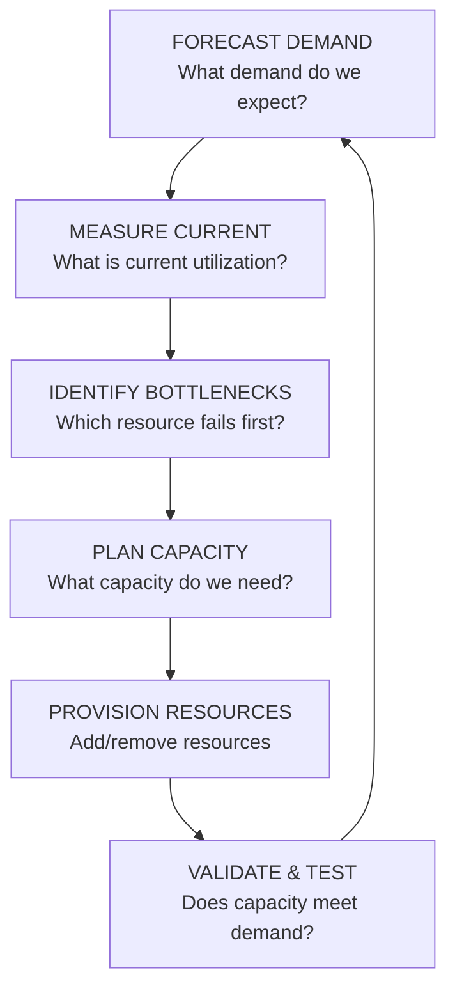
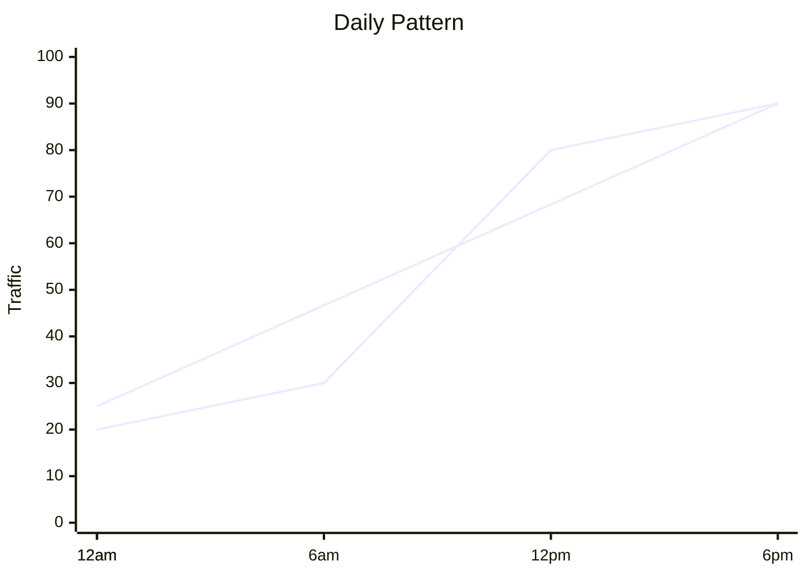
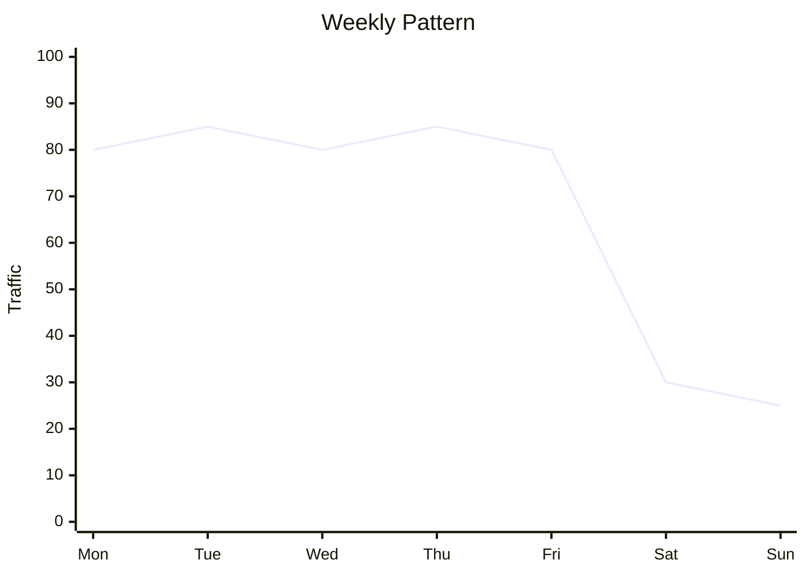
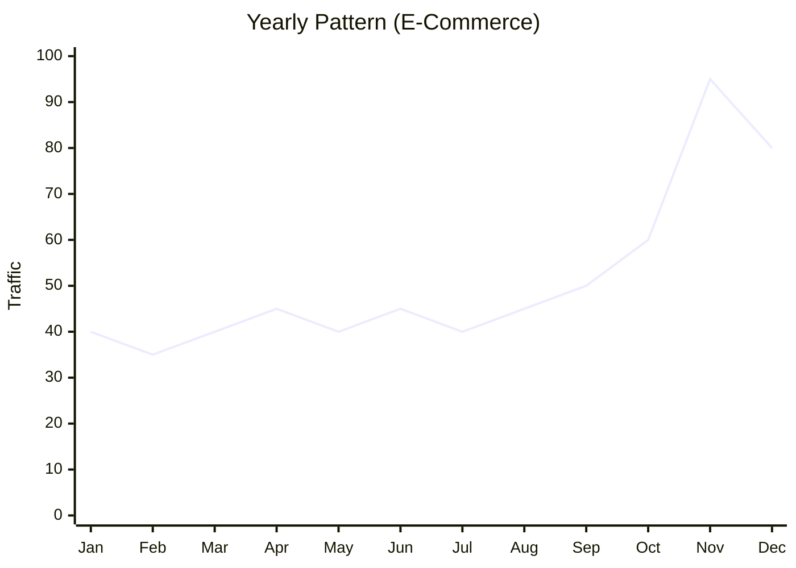
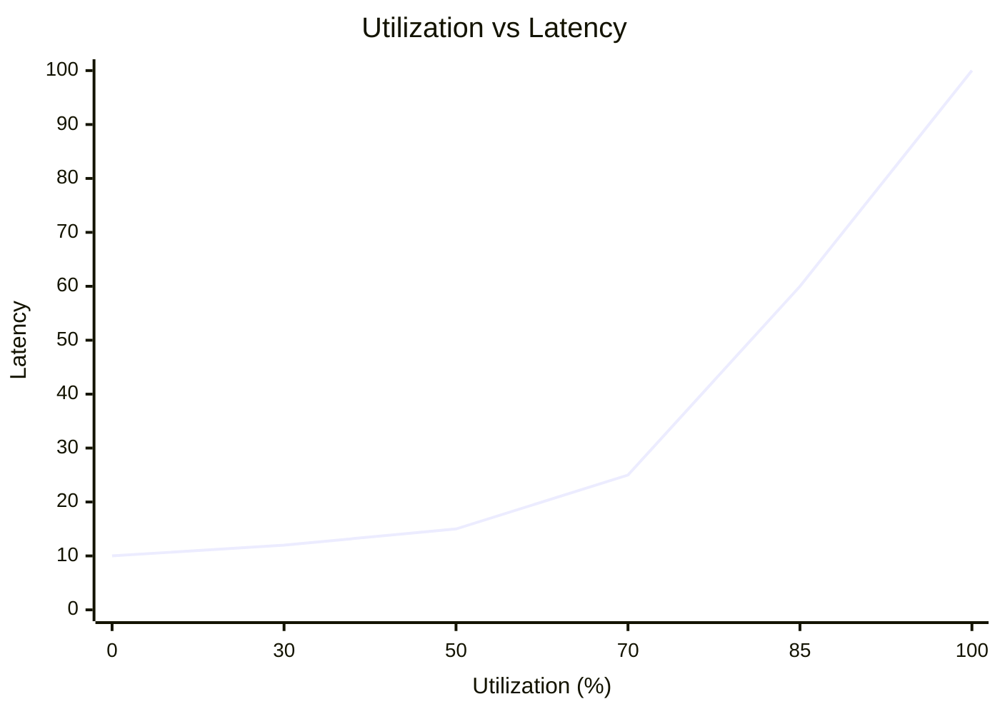
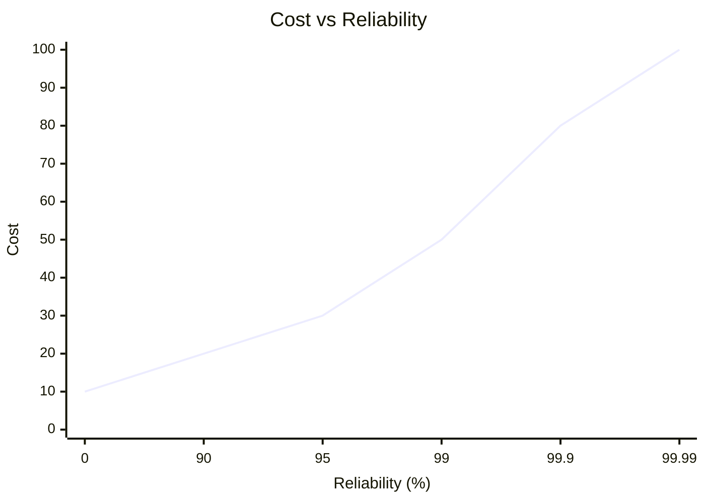

> **Discipline Module** | Complexity: `[COMPLEX]` | Time: 35-40 min

## Prerequisites

Before starting this module:
- **Required**: [Module 1.2: SLOs](../module-1.2-slos/) — Understanding service levels
- **Required**: [Observability Theory Track](/platform/foundations/observability-theory/) — Metrics and monitoring
- **Recommended**: [Module 1.4: Toil and Automation](../module-1.4-toil-automation/) — Automation mindset
- **Helpful**: Basic understanding of cloud infrastructure

---

## What You'll Be Able to Do

After completing this module, you will be able to:

- **Design capacity models that predict resource needs based on traffic growth patterns**
- **Implement load testing strategies that validate capacity assumptions before production impact**
- **Analyze resource utilization trends to optimize cost while maintaining SLO compliance**
- **Build automated capacity alerts that trigger scaling decisions before user impact occurs**

## Why This Module Matters

Your service is growing. Traffic is increasing. Revenue is up.

Then one day: crash. The system couldn't handle the load.

**Without capacity planning:**
- Outages during traffic spikes
- Over-provisioned resources (wasted money)
- Under-provisioned resources (poor performance)
- Last-minute panic scaling

**With capacity planning:**
- Headroom for growth
- Optimized spending
- Predictable performance
- Planned scaling

This module teaches you how to forecast demand, provision appropriately, and balance reliability with cost.

---

## What Is Capacity Planning?

Capacity planning is the process of ensuring your systems can handle future demand while optimizing cost.

It answers:
- How much traffic will we have?
- How much infrastructure do we need?
- When should we scale up?
- Are we spending efficiently?

### The Capacity Planning Cycle



---

## Forecasting Demand

You can't plan capacity without predicting demand.

> **Stop and think**: Think about the most recent major traffic spike your service experienced. Was it predictable based on historical trends or business events, or was it a complete surprise?

### Types of Demand Growth

**Organic Growth**
- Steady increase from user adoption
- Often 10-30% per year for established products
- More predictable, easier to plan

**Event-Driven Spikes**
- Marketing campaigns
- Product launches
- Press coverage
- Seasonal peaks (Black Friday, etc.)
- Requires explicit planning

**Viral Growth**
- Unpredictable, rapid increases
- Hard to plan for
- Requires elastic infrastructure

### Forecasting Methods

**1. Historical Trend Analysis**

```
Look at past growth, project forward:

Month     Traffic (RPM)    Growth
Jan       100,000          -
Feb       108,000          +8%
Mar       115,000          +6.5%
Apr       122,000          +6%
May       130,000          +6.5%

Average monthly growth: ~6.75%

Forecast for Dec (7 months):
  130,000 × (1.0675)^7 = ~205,000 RPM
```

**2. Business-Input Forecasting**

```
Ask the business what's planned:

Q: "What's our user growth target?"
A: "Double users by year end"

Q: "Any major launches planned?"
A: "New market in June, expected 50% traffic increase"

Q: "Marketing campaigns?"
A: "Black Friday campaign, expecting 3x normal traffic"
```

**3. Capacity Modeling**

```
Model capacity from first principles:

Each user generates:
  - 10 API calls/session
  - 2 sessions/day average

1M users = 20M API calls/day
         = 231 calls/second average
         = ~700 calls/second peak (3x average)

For 2M users (2x growth):
  Peak: ~1,400 calls/second
```

### Seasonality Patterns

Most services have predictable patterns. Account for these patterns when planning.







---

## Try This: Build a Capacity Forecast

For a service you manage:

```
Current State:
  Peak traffic: _______ RPM
  Current capacity: _______ RPM
  Headroom: _______% (capacity - peak / capacity)

Growth Factors:
  Expected organic growth: _______% per month
  Planned events: _______________________
  Event impact estimate: _______%

6-Month Forecast:
  Organic: current × (1 + growth%)^6 = _______
  Plus events: _______ + event impact = _______

  Capacity needed: forecast × 1.3 (30% headroom) = _______
```

---

## Measuring Current Capacity

Before planning, know where you are.

### Key Metrics

| Metric | What It Measures | Warning Sign |
|--------|------------------|--------------|
| **CPU Utilization** | Processing capacity | >70% sustained |
| **Memory Utilization** | Memory capacity | >80% |
| **Disk I/O** | Storage throughput | High latency |
| **Network I/O** | Bandwidth | Approaching limits |
| **Request Latency** | End-to-end response time | Increasing trend |
| **Queue Depth** | Backlog of work | Growing queues |
| **Error Rate** | Failures | Increasing with load |

### The Utilization Sweet Spot



**Rule of thumb**: Keep sustained utilization below 70%.
- Room for spikes
- Time to scale before problems
- Better latency characteristics

### Finding Bottlenecks

**The Bottleneck Question**: "Which resource fails first as load increases?"

> **Pause and predict**: If your application is currently running at 80% CPU and your database is at 40% CPU, what will happen to the overall system throughput if you simply double the size of the database instance?

```
System: Web App → Database → Cache

Under load:
  Web App CPU: 45%
  Database CPU: 78% ← BOTTLENECK
  Cache: 30%

The database will fail first.
Scaling web servers won't help.
```

Common bottlenecks:
- Database connections
- CPU on a single service
- Network bandwidth
- Disk I/O
- External dependencies

---

## Provisioning Strategies

How to add capacity:

### Manual Provisioning

```
When utilization > 70%:
  1. Create ticket
  2. Get approval
  3. Provision resources
  4. Deploy
  5. Verify

Lead time: Days to weeks
Best for: Predictable, slow growth
```

### Scheduled Scaling

```yaml
# Scale up before known events
scaling_schedule:
  - name: "business-hours"
    cron: "0 8 * * MON-FRI"
    replicas: 10

  - name: "overnight"
    cron: "0 20 * * MON-FRI"
    replicas: 3

  - name: "black-friday"
    cron: "0 0 25 11 *"  # Nov 25
    replicas: 50
```

### Reactive Auto-Scaling

```yaml
# Kubernetes HPA
apiVersion: autoscaling/v2
kind: HorizontalPodAutoscaler
metadata:
  name: my-app-hpa
spec:
  scaleTargetRef:
    apiVersion: apps/v1
    kind: Deployment
    name: my-app
  minReplicas: 3
  maxReplicas: 50
  metrics:
    - type: Resource
      resource:
        name: cpu
        target:
          type: Utilization
          averageUtilization: 70
  behavior:
    scaleUp:
      stabilizationWindowSeconds: 60
      policies:
        - type: Percent
          value: 100
          periodSeconds: 60
    scaleDown:
      stabilizationWindowSeconds: 300
      policies:
        - type: Percent
          value: 10
          periodSeconds: 60
```

### Predictive Auto-Scaling

```
Use ML to predict traffic and pre-scale:

Model learns:
  - Historical patterns (daily, weekly)
  - Event correlations
  - Leading indicators

Pre-scales 10-15 minutes before predicted spike
```

### Comparison

| Strategy | Pros | Cons | Best For |
|----------|------|------|----------|
| Manual | Full control | Slow, labor-intensive | Stable, slow-growth |
| Scheduled | Predictable cost | Misses unexpected spikes | Known patterns |
| Reactive | Handles variability | Lag behind demand | General use |
| Predictive | Proactive scaling | Complex to implement | Large scale, ML maturity |

---

## Did You Know?

1. **Netflix pre-provisions capacity for new show releases** based on predicted viewership, sometimes spinning up thousands of servers before a premiere.

2. **The "Thundering Herd" problem** occurs when many clients simultaneously retry after a failure, overwhelming a recovering system. Good capacity planning includes backoff strategies.

3. **AWS reports that customers typically over-provision by 30-40%** on average. Right-sizing can significantly reduce cloud costs.

4. **Twitter's "Fail Whale"** (the famous over-capacity error page) became so iconic that it was merchandised on t-shirts. The whale appeared during early Twitter's frequent capacity issues and drove the company to completely re-architect their system—eventually building their own capacity planning expertise that now handles billions of tweets.

---

## War Story: The Black Friday That Worked

An e-commerce company I worked with used to dread Black Friday:

**Previous Years:**
- Traffic 5x normal
- Site crashed every year
- Lost millions in sales
- Engineers worked 48-hour shifts
- Morale destroyed

**The New Approach:**

**3 Months Before:**
```
1. Analyzed previous Black Fridays
2. Got business projections (10% more than last year)
3. Identified bottlenecks (database, cache, payment gateway)
4. Built capacity model
```

**2 Months Before:**
```
1. Upgraded database (vertical scaling)
2. Added cache layer
3. Negotiated payment gateway capacity
4. Set up auto-scaling rules
```

**1 Month Before:**
```
1. Load tested to 8x normal traffic
2. Identified new bottleneck (auth service)
3. Fixed auth service
4. Load tested again - passed
```

**1 Week Before:**
```
1. Pre-provisioned 3x normal capacity
2. Scheduled scaling to 5x at midnight
3. War room ready, runbooks updated
4. All engineers briefed
```

**Black Friday:**
```
Traffic peaked at 6.2x normal (higher than expected!)
Auto-scaling added capacity smoothly
Site stayed fast throughout
Zero crashes, zero degradation
Sales up 40% from previous year
```

**Key Success Factors:**
- Started planning 3 months early
- Load tested to failure
- Over-provisioned (better to pay for unused capacity than lose sales)
- Auto-scaling handled unexpected spike

---

## Load Testing

You can't trust capacity you haven't tested.

> **Stop and think**: When was the last time you tested your system to the point of complete failure? If you don't know exactly where your system breaks, you don't truly know its capacity limit.

### Types of Load Tests

**Smoke Test**
```
Light load to verify system works
Duration: Minutes
Purpose: Baseline verification
```

**Load Test**
```
Expected production load
Duration: 30-60 minutes
Purpose: Verify capacity meets requirements
```

**Stress Test**
```
Load beyond expected capacity
Duration: Until failure
Purpose: Find breaking point
```

**Soak Test**
```
Sustained load over long period
Duration: Hours to days
Purpose: Find memory leaks, slow degradation
```

### Load Testing Best Practices

```yaml
load_test_checklist:
  before:
    - [ ] Notify stakeholders
    - [ ] Verify monitoring is working
    - [ ] Have rollback plan
    - [ ] Isolate test environment (or schedule carefully)

  during:
    - [ ] Monitor all metrics
    - [ ] Watch for errors, not just latency
    - [ ] Check dependent services
    - [ ] Stop if causing production impact

  after:
    - [ ] Document results
    - [ ] Compare to previous tests
    - [ ] Identify bottlenecks
    - [ ] Create action items
```

### Load Testing Tools

| Tool | Type | Best For |
|------|------|----------|
| **k6** | Script-based | Developer-friendly, CI/CD integration |
| **Locust** | Python-based | Custom scenarios, complex flows |
| **Gatling** | Scala-based | High performance, detailed reports |
| **JMeter** | GUI-based | Non-developers, complex protocols |
| **wrk** | CLI | Quick HTTP benchmarks |

### Example: k6 Load Test

```javascript
// load-test.js
import http from 'k6/http';
import { check, sleep } from 'k6';

export const options = {
  stages: [
    { duration: '2m', target: 100 },  // Ramp up
    { duration: '5m', target: 100 },  // Stay at 100
    { duration: '2m', target: 200 },  // Ramp up more
    { duration: '5m', target: 200 },  // Stay at 200
    { duration: '2m', target: 0 },    // Ramp down
  ],
  thresholds: {
    http_req_duration: ['p(95)<500'],  // 95% under 500ms
    http_req_failed: ['rate<0.01'],    // <1% errors
  },
};

export default function () {
  const res = http.get('https://api.example.com/products');
  check(res, {
    'status is 200': (r) => r.status === 200,
    'response time < 200ms': (r) => r.timings.duration < 200,
  });
  sleep(1);
}
```

---

## Cost Optimization

Capacity planning isn't just about having enough — it's about not having too much.

### The Cost-Reliability Trade-off



More reliability = more cost (diminishing returns)
The goal: Find the right balance for your business

### Right-Sizing

**Over-provisioned Signs:**
- CPU utilization consistently < 20%
- Memory usage < 30%
- Paying for resources never used

**Under-provisioned Signs:**
- CPU > 70% sustained
- Memory pressure
- Frequent scaling events
- Performance degradation

### Cost Optimization Strategies

**1. Use Appropriate Instance Types**
```
Workload             Recommended
─────────────────────────────────────
CPU-intensive        Compute-optimized
Memory-intensive     Memory-optimized
General purpose      Balanced
Burstable workloads  Burstable instances
```

**2. Leverage Spot/Preemptible Instances**
```
Good for:
  - Stateless workloads
  - Batch processing
  - Dev/test environments

Savings: 60-90% off on-demand pricing
Risk: Can be terminated with short notice
```

**3. Reserved Capacity**
```
For predictable baseline:
  - 1-3 year commitments
  - 30-70% savings
  - Good for minimum capacity
```

**4. Auto-Scaling Down**
```yaml
# Don't forget to scale DOWN
behavior:
  scaleDown:
    stabilizationWindowSeconds: 300
    policies:
      - type: Percent
        value: 10
        periodSeconds: 60

# Many teams over-scale up but never scale down
```

### Cost Monitoring

Track cost per unit of work:

```
Cost Efficiency Metrics:
  - Cost per request
  - Cost per user
  - Cost per transaction
  - Cost per revenue dollar

Example:
  Monthly cost: $50,000
  Monthly transactions: 10,000,000
  Cost per transaction: $0.005

  If cost per transaction increases, investigate.
```

---

## Common Mistakes

| Mistake | Problem | Solution |
|---------|---------|----------|
| No headroom | Can't handle spikes | Maintain 30%+ headroom |
| Only CPU monitoring | Miss other bottlenecks | Monitor all resources |
| No load testing | Surprised by failures | Test regularly |
| Over-provisioning | Wasted money | Right-size, use auto-scaling |
| Under-provisioning | Poor reliability | Plan for growth + buffer |
| Ignoring cost | Budget overruns | Track cost efficiency |
| Manual scaling only | Too slow to react | Implement auto-scaling |

---

## Quiz: Check Your Understanding

### Question 1
You are monitoring a critical payment processing microservice during normal daily peak hours. You notice that the pods are sustaining 80% CPU utilization for several hours. The current response times are within SLO, but there are no major events planned today. Is this a problem, and what should be your immediate concern?

<details>
<summary>Show Answer</summary>

**Yes, this is highly concerning and indicates a significant risk to system stability.** Running at 80% sustained utilization leaves almost no headroom for unexpected traffic spikes or automated background tasks. In most systems, request latency begins to degrade exponentially once CPU utilization crosses the 70% threshold due to context switching and queueing delays. If a sudden surge in traffic occurs or a dependent service slows down, your pods will quickly hit 100% CPU, leading to dropped requests and a potential cascade of failures. You should immediately scale out the service to bring baseline utilization below 70% and investigate if an underlying issue is consuming extra CPU cycles.

</details>

### Question 2
Your marketing team has confirmed a massive Black Friday campaign that is projected to drive exactly 5x your normal baseline traffic. Your current infrastructure comfortably handles the baseline load with 30% headroom. How much total capacity should you provision for the event, and how should you validate it?

<details>
<summary>Show Answer</summary>

**You should provision for at least 6.5x to 7x your normal baseline capacity to ensure a safe buffer.** Traffic forecasts, especially for massive marketing events, are inherently imprecise and user behavior can cause unpredictable spikes that exceed averages. By adding a 20-30% safety margin on top of the 5x estimate, you protect the system against unexpected thundering herds or sudden bursts of concurrent checkouts. Furthermore, you must empirically validate this configuration by conducting a stress test at 8x or 10x simulated load in a staging environment. The cost of over-provisioning compute resources for a few days is drastically lower than the revenue lost and brand damage caused by an outage during your biggest sales event.

</details>

### Question 3
Your Kubernetes Horizontal Pod Autoscaler (HPA) is configured to add replicas when average CPU utilization reaches 70%. During a recent viral social media mention, traffic doubled in less than a minute. The system crashed due to CPU starvation at 95% before any new pods could start serving traffic. What specific mechanism caused this failure?

<details>
<summary>Show Answer</summary>

**The system failed because the rate of traffic increase vastly outpaced the end-to-end response time of your reactive auto-scaling configuration.** Auto-scaling is not instantaneous; it requires time for metrics to be scraped, averages to be calculated over a stabilization window, and new pods to be scheduled and pass readiness probes. In this scenario, the total lag time for new pods to become active was longer than the time it took for the sudden traffic spike to consume all remaining CPU headroom. To prevent this, you should implement predictive pre-scaling for known events, maintain a larger baseline buffer by lowering the scale-up threshold to 50-60%, or reduce the application's startup time so new replicas can initialize faster under pressure.

</details>

### Question 4
Your multi-tier application (consisting of a React frontend, a Node.js API, a Redis cache, and a PostgreSQL database) is failing to scale beyond 2,000 requests per second. Adding more Node.js API replicas does not increase the total throughput, and latency continues to rise. How should you systematically identify the true bottleneck?

<details>
<summary>Show Answer</summary>

**You must conduct a structured load test while simultaneously monitoring the resource utilization and queue depths of every component in the stack.** By gradually increasing the simulated traffic, you can observe which specific resource—such as CPU on the database, memory in Redis, or network bandwidth—first reaches saturation or begins generating errors. In your scenario, the fact that adding API replicas did not improve throughput strongly indicates the bottleneck lies downstream, likely in the PostgreSQL database or the Redis cache. You must pinpoint the exact constraint (e.g., exhausted database connections or high disk I/O latency) and resolve it before scaling any other tier. Scaling the wrong component wastes money and adds complexity without solving the underlying capacity limit.

</details>

---

## Hands-On Exercise: Capacity Planning Workshop

Create a capacity plan for a service.

### Scenario

You operate an API service:
- Current traffic: 1,000 requests/second peak
- Current capacity: 1,500 requests/second
- Growth: 10% month-over-month
- Major product launch in 3 months (expected 2x traffic)
- Black Friday in 5 months (expected 4x traffic)

### Part 1: Demand Forecast

```markdown
## Demand Forecast (6 months)

| Month | Base Traffic | Events | Total Expected |
|-------|--------------|--------|----------------|
| 1     | 1,000 RPS    | -      |                |
| 2     |              | -      |                |
| 3     |              | Launch |                |
| 4     |              | -      |                |
| 5     |              | Black Friday |         |
| 6     |              | -      |                |

Show your calculations:
```

### Part 2: Capacity Requirements

```markdown
## Capacity Requirements

For each month, calculate required capacity:

Required = Expected traffic × 1.3 (30% headroom)

| Month | Expected | Headroom | Required Capacity |
|-------|----------|----------|-------------------|
| 1     |          | 30%      |                   |
| 2     |          | 30%      |                   |
| ...   |          |          |                   |

Current capacity: 1,500 RPS
Capacity gap: Required - Current = ___
```

### Part 3: Scaling Plan

```markdown
## Scaling Plan

### Auto-Scaling Configuration
- Minimum replicas:
- Maximum replicas:
- Scale-up threshold:
- Scale-down threshold:

### Pre-Scaling Events
| Event | Date | Pre-Scale To |
|-------|------|--------------|
| Launch | Month 3 | ___ RPS |
| Black Friday | Month 5 | ___ RPS |

### Load Testing Plan
- Test 1: When? To what level?
- Test 2: When? To what level?
```

### Part 4: Cost Estimate

```markdown
## Cost Estimate

Assuming $0.10 per 100 RPS capacity per hour:

| Month | Capacity | Hours | Cost |
|-------|----------|-------|------|
| 1     |          | 720   |      |
| 2     |          | 720   |      |
| ...   |          |       |      |

Total 6-month cost: $___
```

### Success Criteria

- [ ] Calculated demand for all 6 months
- [ ] Included organic growth + events
- [ ] Applied 30% headroom
- [ ] Created auto-scaling configuration
- [ ] Scheduled pre-scaling for events
- [ ] Planned load tests
- [ ] Estimated costs

---

## Key Takeaways

1. **Forecast demand**: Organic growth + events + seasonality
2. **Measure current state**: Know your utilization and bottlenecks
3. **Maintain headroom**: 30%+ buffer for spikes
4. **Use auto-scaling**: React to changes automatically
5. **Load test regularly**: Verify capacity meets requirements
6. **Optimize costs**: Balance reliability with spending

---

## Further Reading

**Books**:
- **"Site Reliability Engineering"** — Chapter 18: Software Engineering in SRE
- **"The Art of Capacity Planning"** — John Allspaw

**Articles**:
- **"Capacity Planning at Netflix"** — Netflix Tech Blog
- **"Load Testing Best Practices"** — k6 documentation

**Tools**:
- **k6**: Load testing (grafana.com/docs/k6)
- **Kubernetes HPA**: Auto-scaling
- **Karpenter**: Kubernetes node provisioning

---

## Summary

Capacity planning ensures your systems can handle future demand while optimizing cost.

The process:
1. **Forecast** demand (organic + events)
2. **Measure** current utilization
3. **Identify** bottlenecks
4. **Provision** with headroom
5. **Test** to verify
6. **Optimize** costs

Without capacity planning, you're gambling. With it, you're prepared.

---

## SRE Discipline Complete!

Congratulations! You've completed the SRE Discipline track.

You've learned:
1. **What is SRE** — Engineering approach to operations
2. **SLOs** — Defining and measuring reliability
3. **Error Budgets** — Balancing reliability and velocity
4. **Toil Reduction** — Eliminating repetitive work
5. **Incident Management** — Responding when things go wrong
6. **Postmortems** — Learning from failures
7. **Capacity Planning** — Preparing for future demand

**Where to go next:**

| Track | Why |
|-------|-----|
| [Platform Engineering Discipline](/platform/disciplines/core-platform/platform-engineering/) | Build internal developer platforms |
| [GitOps Discipline](/platform/disciplines/delivery-automation/gitops/) | Declarative operations |
| [Observability Toolkit](/platform/toolkits/observability-intelligence/observability/) | Implement monitoring and tracing |
| [CKA Certification](/k8s/cka/) | Apply SRE to Kubernetes |

---

*"Hope is not a strategy. Capacity planning is."* — SRE Proverb