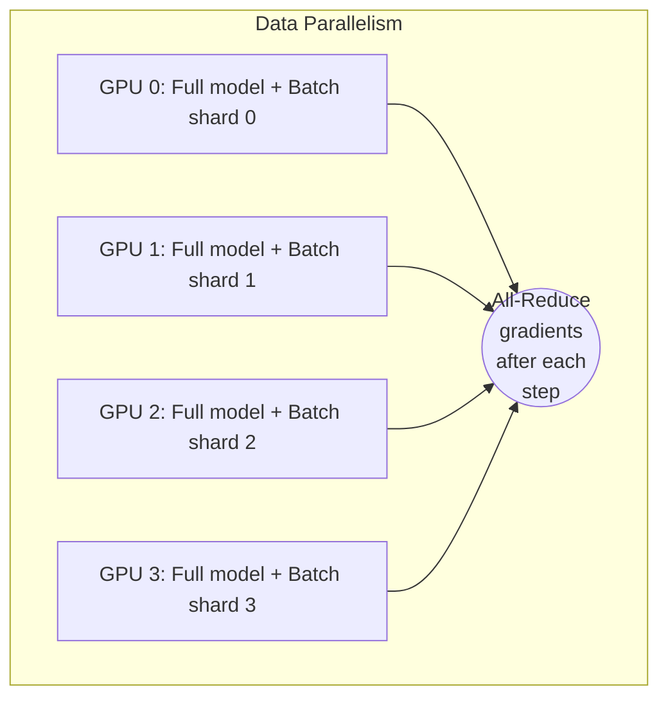
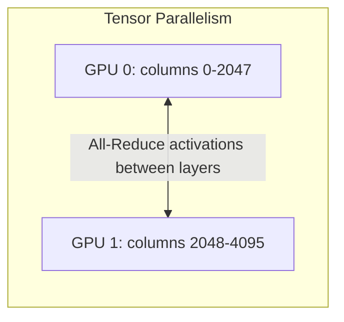
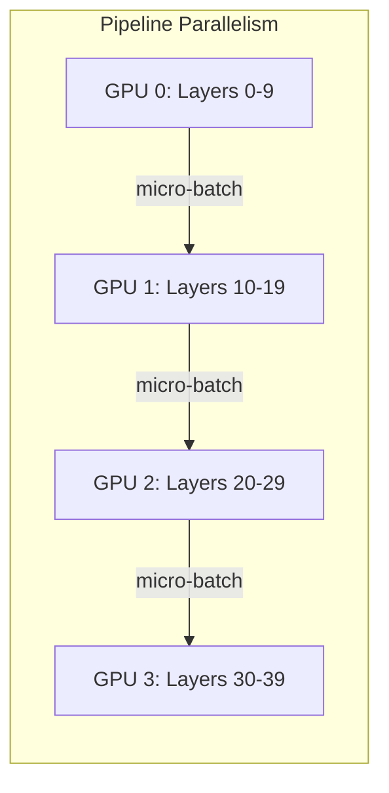
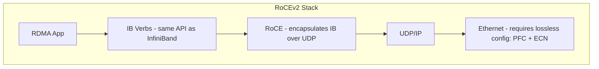
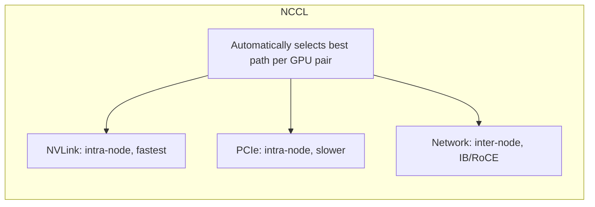
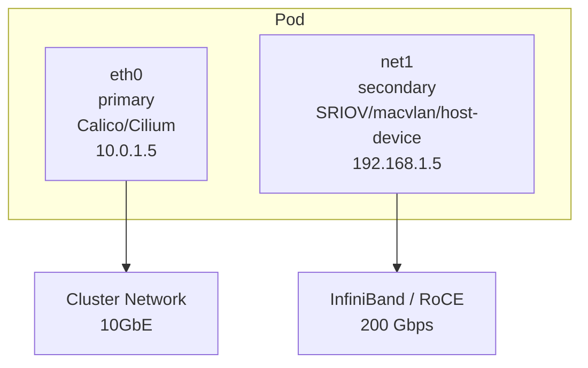

```mermaid
graph TD
    subgraph Without_GPUDirect [Without GPUDirect: 4 PCIe hops, 2 memory copies, CPU involvement]
        W_GPU[GPU Memory] -->|PCIe| W_RAM1[System RAM]
        W_RAM1 -->|PCIe| W_NIC1[NIC]
        W_NIC1 -.->|Network| W_NIC2[NIC]
        W_NIC2 -->|PCIe| W_RAM2[System RAM]
        W_RAM2 -->|PCIe| W_GPU2[GPU Memory]
    end

    subgraph With_GPUDirect_RDMA [With GPUDirect RDMA: 2 PCIe hops, 0 memory copies, 0 CPU involvement]
        D_GPU[GPU Memory] -->|PCIe| D_NIC1[NIC]
        D_NIC1 -.->|Network| D_NIC2[NIC]
        D_NIC2 -->|PCIe| D_GPU2[GPU Memory]
    end
```

> **Discipline Module** | Complexity: `[COMPLEX]` | Time: 5 hours

## Prerequisites

Before starting this module:
- **Required**: [Module 1.2: Advanced GPU Scheduling & Sharing](../module-1.2-gpu-scheduling/) — GPU topology, multi-GPU allocation
- **Required**: Kubernetes networking fundamentals (Services, CNI, Pod-to-Pod communication)
- **Recommended**: Basic understanding of neural network training (forward pass, backward pass, gradient descent)
- **Recommended**: Familiarity with PyTorch or TensorFlow distributed APIs
- **Recommended**: Access to a cluster with at least 2 GPU nodes (for multi-node exercises)

---

## What You'll Be Able to Do

After completing this module, you will be able to:

- **Implement distributed training jobs on Kubernetes using PyTorch DDP, Horovod, or DeepSpeed**
- **Design multi-node training architectures with proper NCCL configuration and network topology awareness**
- **Configure Kubernetes operators like Kubeflow Training Operator for managing distributed training lifecycle**
- **Diagnose common distributed training failures — NCCL timeouts, OOM errors, stragglers — in Kubernetes environments**

## Why This Module Matters

Modern AI models are too large and too slow to train on a single GPU. GPT-4 is estimated to have been trained on ~25,000 GPUs for roughly 100 days. Even a "small" LLM like Llama-3-8B requires 1.3 million GPU-hours to train.

This reality creates a brutal infrastructure challenge: you must make **hundreds or thousands of GPUs across dozens of machines** work together as if they were a single giant accelerator. Every microsecond of network latency between GPUs becomes a tax on your training throughput. Every node failure forces a decision: restart from scratch or recover from a checkpoint?

The platform team's job is to build the infrastructure that makes this possible:

- **High-speed networking** (InfiniBand, RoCE) so GPUs can exchange gradients at wire speed
- **Kubernetes operators** (MPI Operator, PyTorch Operator) that orchestrate distributed jobs
- **Multi-network CNIs** (Multus) that give pods secondary high-speed network interfaces
- **Fault tolerance** that recovers from node failures without losing days of work

Get this right, and your ML team ships models on schedule. Get it wrong, and they burn millions of dollars in GPU-hours on jobs that fail, stall, or run at a fraction of their potential speed.

---

## Distributed Training Fundamentals

### Why Distribute?

> **Pause and predict**: If a single GPU takes 67 years to train a model, how many GPUs do you realistically need to train it in one month, assuming perfect scaling?

A single A100 GPU can process roughly 300 TFLOPS of BF16 operations. Training Llama-3-70B requires approximately 6.4 x 10^23 FLOPs. At 300 TFLOPS:

```
6.4 × 10^23 FLOPS / (300 × 10^12 FLOPS/s)
= 2.1 × 10^9 seconds
= ~67 years on a single GPU
```

With 2,048 GPUs running at 50% efficiency:

```
67 years / (2,048 × 0.50)
= 24 days
```

The math is clear: you either distribute or you don't train.

### Parallelism Strategies

Distributed training uses three complementary strategies:

```mermaid
graph TD
    subgraph Distributed_Training [Distributed Training]
        DP[<b>Data Parallel</b><br>Same model on every GPU.<br>Different data.<br>Sync gradients after each step.<br>Scales to many GPUs easily.]
        MP[<b>Model Parallel (Tensor)</b><br>Split layers across GPUs.<br>Each GPU has part of each layer.<br>Forward/backward require all-to-all comms.]
        PP[<b>Pipeline Parallel</b><br>Split layers into stages.<br>Micro-batches flow through stages.<br>Reduces memory per stage.]
    end
```

**Data Parallelism** (most common for models that fit in one GPU's memory):


**Tensor Parallelism** (for layers too large for one GPU):


**Pipeline Parallelism** (for models with many layers):


In practice, large training runs use **3D parallelism**: data parallel across nodes, tensor parallel within a node (NVLink), and pipeline parallel across node groups.

### The Communication Bottleneck

> **Stop and think**: How much bandwidth is required to synchronize 140 GB of gradients across a cluster every second?

Here is the key insight: **distributed training is a networking problem disguised as a compute problem**.

During data-parallel training, every GPU must synchronize its gradients with every other GPU after each training step. For a model with 70 billion parameters in BF16:

```
Gradient size per step: 70 × 10^9 × 2 bytes = 140 GB
All-Reduce data volume: 2 × 140 GB × (N-1)/N ≈ 280 GB (ring all-reduce)
Training steps per second target: 1 step/s
Required network bandwidth: 280 GB/s bidirectional across the cluster
```

This is why standard Kubernetes networking (typically 10-25 Gbps) is completely inadequate for distributed training. You need specialized high-bandwidth, low-latency networks.

---

## High-Speed Networking: InfiniBand and RoCE

### InfiniBand

InfiniBand (IB) is a specialized network fabric designed for high-performance computing. It operates entirely outside the TCP/IP stack:

| Property | InfiniBand HDR | InfiniBand NDR | Ethernet (25GbE) |
|----------|---------------|----------------|-------------------|
| Bandwidth per port | 200 Gbps | 400 Gbps | 25 Gbps |
| Latency | ~0.6 μs | ~0.5 μs | ~10-25 μs |
| Protocol | Native IB verbs | Native IB verbs | TCP/IP |
| RDMA | Yes (native) | Yes (native) | No (requires RoCE) |
| CPU overhead | Near zero | Near zero | Significant |
| Cost | $$$$ | $$$$$ | $ |

InfiniBand's killer feature is **RDMA (Remote Direct Memory Access)**: one machine can read from or write to another machine's memory without involving either machine's CPU or operating system. The network card (HCA) handles the entire transfer in hardware.

```mermaid
graph TD
    subgraph Traditional_TCP [Traditional TCP]
        App1[App] -->|CPU copies data| Kernel1[Kernel]
        Kernel1 -->|Context switches| TCP1[TCP]
        TCP1 -->|Interrupt handling| NIC1[NIC]
        NIC1 -.-> NIC2[Remote NIC]
        NIC2 --> TCP2[TCP]
        TCP2 --> Kernel2[Kernel]
        Kernel2 --> App2[App]
    end
    subgraph RDMA [RDMA]
        RApp[RDMA App] -->|Zero CPU involvement<br>Kernel bypass| RNIC[NIC]
        RNIC -.->|Network: Zero-copy| RRNIC[Remote NIC]
        RRNIC --> RMem[Remote Memory]
    end
```



### RoCE (RDMA over Converged Ethernet)

RoCE brings RDMA to standard Ethernet networks. It is cheaper than InfiniBand but requires lossless Ethernet (PFC/ECN configuration):



### GPUDirect RDMA

The ultimate optimization: GPUDirect RDMA allows a network card to read/write directly to GPU memory, bypassing both system memory and the CPU entirely:



GPUDirect RDMA requires:
1. The GPU and NIC on the same PCIe root complex (ideally same PCIe switch)
2. NVIDIA peer memory kernel module (`nvidia-peermem`)
3. A supported NIC (Mellanox/NVIDIA ConnectX-6 or newer)
4. The `nv_peer_mem` or `nvidia-peermem` driver loaded

In Kubernetes, the GPU Operator can manage the peermem driver:

```yaml
apiVersion: nvidia.com/v1
kind: ClusterPolicy
metadata:
  name: cluster-policy
spec:
  driver:
    enabled: true
    rdma:
      enabled: true        # Enable GPUDirect RDMA
      useHostMofed: true   # Use host-installed Mellanox OFED drivers
```

---

## NCCL: The GPU Communication Library

### What NCCL Does

NCCL (NVIDIA Collective Communications Library, pronounced "nickel") is the library that implements collective operations (all-reduce, all-gather, broadcast, reduce-scatter) across GPUs. Every distributed training framework (PyTorch DDP, Horovod, DeepSpeed) uses NCCL under the hood.

> **Stop and think**: If NCCL automatically selects the best path, why do we need to set environment variables like `NCCL_SOCKET_IFNAME`?

NCCL automatically selects the best communication path:



### Critical NCCL Environment Variables

These environment variables dramatically affect distributed training performance:

```bash
# Network selection
NCCL_IB_DISABLE=0              # 0 = use InfiniBand if available
NCCL_SOCKET_IFNAME=eth0        # Fallback TCP interface (for bootstrapping)
NCCL_IB_HCA=mlx5               # InfiniBand HCA device name

# Performance tuning
NCCL_ALGO=Ring                 # Algorithm: Ring, Tree, CollNetDirect
NCCL_PROTO=Simple              # Protocol: Simple, LL, LL128
NCCL_MIN_NCHANNELS=4           # Minimum parallel channels
NCCL_MAX_NCHANNELS=12          # Maximum parallel channels
NCCL_BUFFSIZE=8388608          # Buffer size per channel (8MB)

# GPUDirect
NCCL_NET_GDR_LEVEL=5           # GPUDirect RDMA level (5 = across PCIe switches)
NCCL_P2P_LEVEL=5               # Peer-to-peer level (intra-node)

# Debugging
NCCL_DEBUG=INFO                # Logging: WARN, INFO, TRACE
NCCL_DEBUG_SUBSYS=INIT,NET     # Subsystem-specific debugging
```

### NCCL Topology Detection

NCCL probes the system topology at initialization and logs its findings. Look for these lines in your training job logs:

```
NCCL INFO Trees [0] 1/-1/-1->0->-1 [1] -1/-1/-1->0->1
NCCL INFO Channel 00 :  0  1  2  3  4  5  6  7
NCCL INFO  0 : NET/IB/0/GDRDMA [receive] via NET/IB/0/GDRDMA [send]
NCCL INFO Using 12 channels per connection
NCCL INFO comm 0x7f8b00003c00 rank 0 nranks 16 - Init COMPLETE
```

The key line is `NET/IB/0/GDRDMA` — this confirms NCCL is using InfiniBand with GPUDirect RDMA, the optimal path.

If you see `NET/Socket` instead, NCCL has fallen back to TCP, and your training will be 10-50x slower for communication.

---

## Multus CNI: Multi-Network Pods

### The Problem

> **Pause and predict**: If your Pod has both `eth0` and `net1` interfaces, how does NCCL know which one to use for distributed training traffic?

Kubernetes gives each Pod a single network interface (typically `eth0`) on the cluster's primary CNI network. This network is designed for general traffic — Service discovery, API calls, metrics scraping — not for 400 Gbps GPU-to-GPU data transfers.

For distributed training, Pods need a **second network interface** connected to the high-speed InfiniBand or RoCE fabric.

### Multus Architecture

Multus CNI is a "meta-plugin" that chains multiple CNI plugins, giving Pods multiple network interfaces:



### Installing Multus

```bash
# Install Multus CNI (thick plugin — recommended)
kubectl apply -f https://raw.githubusercontent.com/k8snetworkplumbingwg/multus-cni/master/deployments/multus-daemonset-thick.yml

# Verify
kubectl get pods -n kube-system -l app=multus
```

### Network Attachment Definitions

Define secondary networks using `NetworkAttachmentDefinition` CRDs:

**macvlan (for RoCE/Ethernet high-speed networks):**

```yaml
apiVersion: k8s.cni.cncf.io/v1
kind: NetworkAttachmentDefinition
metadata:
  name: roce-network
  namespace: ml-training
spec:
  config: |
    {
      "cniVersion": "0.3.1",
      "type": "macvlan",
      "master": "enp94s0f0",
      "mode": "bridge",
      "ipam": {
        "type": "host-local",
        "subnet": "192.168.10.0/24",
        "rangeStart": "192.168.10.100",
        "rangeEnd": "192.168.10.200",
        "routes": [
          { "dst": "192.168.10.0/24" }
        ]
      }
    }
```

**SR-IOV (for InfiniBand with hardware-level network isolation):**

```yaml
apiVersion: k8s.cni.cncf.io/v1
kind: NetworkAttachmentDefinition
metadata:
  name: ib-sriov-network
  namespace: ml-training
spec:
  config: |
    {
      "cniVersion": "0.3.1",
      "type": "ib-sriov",
      "pkey": "0x00FF",
      "link_state": "enable",
      "rdmaIsolation": true,
      "ibKubernetesEnabled": true,
      "ipam": {
        "type": "whereabouts",
        "range": "192.168.20.0/24"
      }
    }
```

**host-device (directly attach host NIC to Pod):**

```yaml
apiVersion: k8s.cni.cncf.io/v1
kind: NetworkAttachmentDefinition
metadata:
  name: ib-host-device
  namespace: ml-training
spec:
  config: |
    {
      "cniVersion": "0.3.1",
      "type": "host-device",
      "device": "mlx5_0",
      "ipam": {
        "type": "host-local",
        "subnet": "192.168.30.0/24"
      }
    }
```

### Using Secondary Networks in Pods

Annotate Pods to attach secondary networks:

```yaml
apiVersion: v1
kind: Pod
metadata:
  name: training-worker-0
  namespace: ml-training
  annotations:
    k8s.v1.cni.cncf.io/networks: roce-network
spec:
  containers:
    - name: trainer
      image: nvcr.io/nvidia/pytorch:24.09-py3
      env:
        - name: NCCL_SOCKET_IFNAME
          value: "net1"             # Use the secondary interface for NCCL
        - name: NCCL_IB_DISABLE
          value: "0"
```

Inside the Pod, you will see both interfaces:

```bash
# ip addr show
1: lo: <LOOPBACK> ...
2: eth0@if123: <BROADCAST> ...    # Primary (cluster network)
   inet 10.0.1.5/24
3: net1@if456: <BROADCAST> ...    # Secondary (high-speed network)
   inet 192.168.10.105/24
```

---

## Kubeflow Training Operators

### Overview

The Kubeflow Training Operator manages distributed training jobs on Kubernetes. It provides CRDs for:

| CRD | Framework | Communication |
|-----|-----------|---------------|
| `PyTorchJob` | PyTorch DDP/FSDP | NCCL + Gloo |
| `MPIJob` | Horovod, DeepSpeed | MPI (OpenMPI/MPICH) |
| `TFJob` | TensorFlow | gRPC |
| `PaddleJob` | PaddlePaddle | NCCL + Gloo |
| `JAXJob` | JAX/XLA | gRPC |

### Installing the Training Operator

```bash
# Install via Helm
helm repo add kubeflow https://kubeflow.github.io/training-operator
helm repo update

helm install training-operator kubeflow/training-operator \
  --namespace kubeflow \
  --create-namespace \
  --version v1.8.1
```

### PyTorchJob Example

A complete multi-node PyTorch DDP training job:

```yaml
apiVersion: kubeflow.org/v1
kind: PyTorchJob
metadata:
  name: llama-finetune
  namespace: ml-training
spec:
  nprocPerNode: "4"    # 4 GPUs per node
  pytorchReplicaSpecs:
    Master:
      replicas: 1
      restartPolicy: OnFailure
      template:
        metadata:
          annotations:
            k8s.v1.cni.cncf.io/networks: roce-network
        spec:
          tolerations:
            - key: nvidia.com/gpu
              operator: Exists
              effect: NoSchedule
          containers:
            - name: pytorch
              image: my-registry/llama-trainer:v1.2
              command:
                - torchrun
              args:
                - --nnodes=2
                - --nproc_per_node=4
                - --rdzv_backend=c10d
                - --rdzv_endpoint=$(MASTER_ADDR):$(MASTER_PORT)
                - train.py
                - --model_name=meta-llama/Llama-3-8B
                - --batch_size=8
                - --gradient_accumulation_steps=4
                - --fp16
                - --output_dir=/checkpoints/llama-ft
              env:
                - name: NCCL_SOCKET_IFNAME
                  value: "net1"
                - name: NCCL_DEBUG
                  value: "INFO"
                - name: NCCL_IB_DISABLE
                  value: "0"
              resources:
                limits:
                  nvidia.com/gpu: 4
                  cpu: "32"
                  memory: 128Gi
              volumeMounts:
                - name: checkpoints
                  mountPath: /checkpoints
                - name: dshm
                  mountPath: /dev/shm
          volumes:
            - name: checkpoints
              persistentVolumeClaim:
                claimName: training-checkpoints
            - name: dshm
              emptyDir:
                medium: Memory
                sizeLimit: 64Gi     # Large shared memory for NCCL
    Worker:
      replicas: 1
      restartPolicy: OnFailure
      template:
        metadata:
          annotations:
            k8s.v1.cni.cncf.io/networks: roce-network
        spec:
          tolerations:
            - key: nvidia.com/gpu
              operator: Exists
              effect: NoSchedule
          containers:
            - name: pytorch
              image: my-registry/llama-trainer:v1.2
              command:
                - torchrun
              args:
                - --nnodes=2
                - --nproc_per_node=4
                - --rdzv_backend=c10d
                - --rdzv_endpoint=$(MASTER_ADDR):$(MASTER_PORT)
                - train.py
                - --model_name=meta-llama/Llama-3-8B
                - --batch_size=8
                - --gradient_accumulation_steps=4
                - --fp16
                - --output_dir=/checkpoints/llama-ft
              env:
                - name: NCCL_SOCKET_IFNAME
                  value: "net1"
                - name: NCCL_DEBUG
                  value: "INFO"
                - name: NCCL_IB_DISABLE
                  value: "0"
              resources:
                limits:
                  nvidia.com/gpu: 4
                  cpu: "32"
                  memory: 128Gi
              volumeMounts:
                - name: checkpoints
                  mountPath: /checkpoints
                - name: dshm
                  mountPath: /dev/shm
          volumes:
            - name: checkpoints
              persistentVolumeClaim:
                claimName: training-checkpoints
            - name: dshm
              emptyDir:
                medium: Memory
                sizeLimit: 64Gi
```

### MPIJob Example (for Horovod/DeepSpeed)

```yaml
apiVersion: kubeflow.org/v1
kind: MPIJob
metadata:
  name: deepspeed-training
  namespace: ml-training
spec:
  slotsPerWorker: 4    # GPUs per worker
  runPolicy:
    cleanPodPolicy: Running
    backoffLimit: 3
  mpiReplicaSpecs:
    Launcher:
      replicas: 1
      restartPolicy: OnFailure
      template:
        spec:
          containers:
            - name: launcher
              image: my-registry/deepspeed-trainer:v2.0
              command:
                - mpirun
              args:
                - --allow-run-as-root
                - -np
                - "8"
                - -bind-to
                - none
                - -map-by
                - slot
                - -x NCCL_DEBUG=INFO
                - -x NCCL_IB_DISABLE=0
                - -x NCCL_SOCKET_IFNAME=net1
                - -x LD_LIBRARY_PATH
                - python
                - train_deepspeed.py
                - --deepspeed_config=ds_config.json
              resources:
                limits:
                  cpu: "2"
                  memory: 4Gi
    Worker:
      replicas: 2
      restartPolicy: OnFailure
      template:
        metadata:
          annotations:
            k8s.v1.cni.cncf.io/networks: roce-network
        spec:
          containers:
            - name: worker
              image: my-registry/deepspeed-trainer:v2.0
              resources:
                limits:
                  nvidia.com/gpu: 4
                  cpu: "32"
                  memory: 128Gi
              volumeMounts:
                - name: dshm
                  mountPath: /dev/shm
          volumes:
            - name: dshm
              emptyDir:
                medium: Memory
                sizeLimit: 64Gi
```

---

## Topology Spread and Pod Placement

### The Problem

When training across multiple nodes, you want pods placed on nodes that are physically close in the network. In a data center with multiple racks and spine-leaf networking, two nodes on the same leaf switch have ~2 μs latency, while nodes on different spine switches may have ~10 μs.

### Topology Spread Constraints

Use Kubernetes topology spread constraints to keep training workers close:

```yaml
spec:
  topologySpreadConstraints:
    - maxSkew: 1
      topologyKey: topology.kubernetes.io/zone
      whenUnsatisfiable: DoNotSchedule
      labelSelector:
        matchLabels:
          training.kubeflow.org/job-name: llama-finetune
    - maxSkew: 1
      topologyKey: kubernetes.io/hostname
      whenUnsatisfiable: DoNotSchedule
      labelSelector:
        matchLabels:
          training.kubeflow.org/job-name: llama-finetune
```

### Cloud Provider Placement Groups

For cloud-based training clusters:

```bash
# GCP: Compact placement policy
gcloud compute resource-policies create group-placement ml-training-compact \
  --collocation=COLLOCATED --vm-count=16

# AWS: Cluster placement group
aws ec2 create-placement-group \
  --group-name ml-training-cluster \
  --strategy cluster
```

---

## Node Failure Handling

### The Reality

> **Pause and predict**: If a node fails in a 128-node cluster, does the entire job fail, or can the remaining 127 nodes continue training?

In a cluster with 128 GPU nodes running a multi-day training job, node failures are not a possibility — they are a certainty. Common failure modes:

| Failure | Frequency (per 1000 GPU-hours) | Impact |
|---------|-------------------------------|--------|
| GPU Xid errors (recoverable) | 2-5 | Training step fails, retry |
| GPU fallen off bus (Xid 79) | 0.5-1 | Node reboot required |
| NIC failures | 0.2-0.5 | NCCL timeout, job stalls |
| OOM kills | 1-3 | Worker restarts |
| Node kernel panic | 0.1-0.3 | Node replacement |
| Disk failures | 0.05-0.1 | Checkpoint loss if local |

### Checkpointing Strategy

Checkpointing saves model state periodically so training can resume after failures:

```python
# In your training script (PyTorch example)
import torch
import torch.distributed as dist

def save_checkpoint(model, optimizer, epoch, step, path):
    if dist.get_rank() == 0:  # Only rank 0 saves
        checkpoint = {
            'model_state_dict': model.state_dict(),
            'optimizer_state_dict': optimizer.state_dict(),
            'epoch': epoch,
            'step': step,
            'rng_state': torch.cuda.get_rng_state(),
        }
        torch.save(checkpoint, f"{path}/checkpoint_epoch{epoch}_step{step}.pt")
        # Keep only last 3 checkpoints
        cleanup_old_checkpoints(path, keep=3)

# Checkpoint every N steps
for step, batch in enumerate(dataloader):
    loss = train_step(model, batch)
    if step % 500 == 0:
        save_checkpoint(model, optimizer, epoch, step, "/checkpoints")
```

### Elastic Training

PyTorch Elastic (torchrun) supports **elastic training** — workers can join or leave during training:

```yaml
apiVersion: kubeflow.org/v1
kind: PyTorchJob
metadata:
  name: elastic-training
spec:
  elasticPolicy:
    minReplicas: 2        # Minimum workers to continue training
    maxReplicas: 8        # Maximum workers if available
    maxRestarts: 10       # Total restart budget
    rdzvBackend: c10d
  pytorchReplicaSpecs:
    Worker:
      replicas: 4         # Desired replicas (elastic: can scale 2-8)
      restartPolicy: OnFailure
      template:
        spec:
          containers:
            - name: trainer
              image: my-registry/elastic-trainer:v1
              command: ["torchrun"]
              args:
                - --nnodes=2:8
                - --nproc_per_node=4
                - --rdzv_backend=c10d
                - --rdzv_endpoint=elastic-training-master-0:29400
                - --max_restarts=10
                - train_elastic.py
              resources:
                limits:
                  nvidia.com/gpu: 4
```

With elastic training, if a node fails:
1. Remaining workers detect the failure via rendezvous timeout
2. Workers re-form a new group (excluding the failed node)
3. Training resumes from the last checkpoint with fewer GPUs
4. When the node recovers, it can rejoin the group

---

## Did You Know?

1. **Meta's Grand Teton cluster for Llama 3 training used 16,384 H100 GPUs** connected via 400 Gbps RoCE fabric. During the 54-day training run, they experienced 466 job interruptions — roughly 8.6 per day. Their checkpoint-and-resume automation was so good that these interruptions cost only 3% of total GPU time.

2. **The `/dev/shm` mount is one of the most overlooked performance bottlenecks** in distributed training on Kubernetes. NCCL and PyTorch DataLoader use shared memory extensively. Docker's default `/dev/shm` size is 64MB. A multi-GPU training job can easily need 16-64GB of shared memory. Forgetting to set `emptyDir.medium: Memory` with an adequate `sizeLimit` is one of the most common reasons distributed training silently runs 2-5x slower than expected.

3. **The term "NCCL" was originally an acronym for "NVIDIA Collective Communications Library"** but the team internally jokes it stands for "Nickel" because every distributed training job is "nickel-and-dimed" by communication overhead. At Meta's scale, a 1% improvement in NCCL efficiency saves millions of dollars per year.

---

## War Story: The Mysterious 50% Throughput Drop

A team running a 32-GPU (4 nodes x 8 GPUs) training job on RoCE noticed that throughput was exactly half of what they expected based on single-node benchmarks.

The investigation:
1. **NCCL logs**: showed `NET/Socket` instead of `NET/IB` — NCCL was using TCP, not RDMA
2. **Root cause**: Multus was correctly attaching the RoCE NIC, but `NCCL_SOCKET_IFNAME` was set to `eth0` instead of `net1`
3. **Secondary issue**: Even after fixing the interface name, RoCE was slow because the switch did not have PFC (Priority Flow Control) enabled, causing packet drops and retransmissions

The fix:
1. Set `NCCL_SOCKET_IFNAME=net1` (or the correct secondary interface)
2. Configured PFC on the ToR switches for the RoCE VLAN
3. Verified with `NCCL_DEBUG=INFO` that logs showed `NET/IB/0/GDRDMA`

Result: throughput jumped from 50% to 93% of linear scaling.

**Lesson**: Always check NCCL debug output. The difference between TCP fallback and RDMA is not a 10% performance difference — it is a 10x difference.

---

## Common Mistakes

| Mistake | Problem | Solution |
|---------|---------|----------|
| Missing `/dev/shm` mount | NCCL and DataLoader OOM or slow | Always mount `emptyDir: {medium: Memory, sizeLimit: 64Gi}` at `/dev/shm` |
| Wrong `NCCL_SOCKET_IFNAME` | NCCL uses slow primary interface instead of high-speed secondary | Set to the Multus secondary interface name (e.g., `net1`) |
| No checkpointing | Node failure loses all training progress | Checkpoint every 500-1000 steps to shared storage |
| TCP fallback without noticing | Training runs 10-50x slower; team blames "Kubernetes overhead" | Always check `NCCL_DEBUG=INFO` output for `NET/IB` vs `NET/Socket` |
| Pods on different racks | Inter-rack latency kills all-reduce performance | Use topology spread constraints or placement groups |
| Insufficient `backoffLimit` | Job fails permanently after first transient error | Set `backoffLimit: 3-5` for training jobs |
| Not setting `hostIPC: true` when needed | Some NCCL/MPI configurations need host IPC namespace | Enable `hostIPC` for MPI jobs that use shared memory transports |
| Forgetting RDMA device permissions | Pod cannot open IB device — `errno 13` | Use RDMA device plugin or set `securityContext.capabilities.add: ["IPC_LOCK"]` |

---

## Quiz: Check Your Understanding

### Question 1
Your team is training a 70B parameter model on a cluster with 10Gbps Ethernet. The GPU utilization is hovering around 2%. Why is this happening, and why is distributed training fundamentally a networking problem in this scenario?

<details>
<summary>Show Answer</summary>

In data-parallel training, every GPU computes gradients independently, but then all GPUs must synchronize gradients before the next training step via an all-reduce operation. For a 70B parameter model in BF16, this means exchanging ~280GB of data every single training step across the cluster. If the network is slow, such as a 10Gbps Ethernet link, GPUs spend the vast majority of their time waiting for this gradient synchronization instead of actually computing. With 10 Gbps Ethernet, transferring 280GB takes roughly 224 seconds, whereas the actual compute phase might only take 3 seconds, leading to a dismal 1.3% GPU utilization. The network ultimately determines whether your expensive GPUs are actively computing or sitting idle waiting for data, making distributed training fundamentally a networking challenge.
</details>

### Question 2
You are setting up a new training cluster with InfiniBand networking. A colleague suggests skipping the GPUDirect RDMA configuration to save setup time, arguing that regular RDMA is fast enough. How do you explain the impact of this decision on the data path and training latency?

<details>
<summary>Show Answer</summary>

GPUDirect RDMA is a technology that allows a network card (NIC or HCA) to read from and write to GPU memory directly, bypassing system RAM and the CPU entirely. If you skip GPUDirect RDMA, the data path becomes significantly longer: data must travel from the GPU over PCIe to system RAM, then from system RAM over PCIe to the NIC, involving multiple memory copies and CPU overhead. By using GPUDirect RDMA, the data travels directly from the GPU over PCIe to the NIC, eliminating two PCIe hops, zeroing out memory copies, and removing CPU involvement. This direct path reduces gradient synchronization latency by 30-50%, which is critical for maintaining high GPU utilization and minimizing the communication bottleneck during distributed training.
</details>

### Question 3
A new engineer deploys a 4-node PyTorch training job. The job starts successfully but is running 4x slower than expected. You notice they omitted the `/dev/shm` volume mount in the Pod specification. What is happening under the hood to cause this silent performance degradation?

<details>
<summary>Show Answer</summary>

The `/dev/shm` directory provides shared memory backed by the host's RAM, which is heavily utilized by NCCL for intra-node GPU-to-GPU communication buffers and by the PyTorch DataLoader to share data between worker processes. By default, container runtimes like containerd limit `/dev/shm` to a mere 64MB, which is vastly insufficient for the 16-64GB typically required by modern multi-GPU training jobs. When this shared memory is exhausted, NCCL silently falls back to much slower communication paths, such as standard TCP sockets, instead of using high-speed shared memory. Simultaneously, DataLoader workers may fail to allocate shared tensors for data batching, which stalls the data pipeline and starves the GPUs. Because these fallbacks do not crash the container, the entire training job continues to run but at 2-5x slower speeds, making it a notoriously difficult performance degradation to diagnose without checking system resource utilization.
</details>

### Question 4
Your platform team is migrating a legacy Horovod-based computer vision workload to Kubernetes. A developer asks if they should use the `PyTorchJob` CRD since the underlying code uses PyTorch, or stick to `MPIJob`. How do you guide them based on how these two CRDs manage distributed workers?

<details>
<summary>Show Answer</summary>

You should guide the developer to use the `MPIJob` CRD because their legacy computer vision workload is based on Horovod, which fundamentally relies on MPI for distributed execution. The `PyTorchJob` CRD is specifically designed for workloads using PyTorch's native distributed launching mechanism (`torchrun`). In that model, workers self-organize and discover each other dynamically via a rendezvous backend like c10d. In contrast, an `MPIJob` uses a centralized Launcher pod running `mpirun` to start and orchestrate workers via SSH, which is exactly how Horovod and some legacy DeepSpeed setups expect to operate. Attempting to use `PyTorchJob` for a Horovod workload would instantly fail because it lacks the centralized MPI process management and SSH daemon setup required to bootstrap the job.
</details>

### Question 5
A 4-node distributed training job reports NCCL timeout errors after 5 minutes. Node 3 is the last to report the timeout. What is your investigation workflow and why do you follow these specific steps?

<details>
<summary>Show Answer</summary>

First, you must check the NCCL debug logs (`NCCL_DEBUG=INFO`) to determine if the job is actually utilizing the InfiniBand/RDMA transport or if it has silently fallen back to TCP sockets. TCP fallback often causes synchronization timeouts because it cannot handle the sheer bandwidth requirements of collective operations. Since Node 3 is the last to report the timeout, it is highly likely the source of the bottleneck or failure, as it is holding up the global all-reduce operation. You should use `kubectl describe pod` and `kubectl exec` to verify its resource allocation and network connectivity on the secondary high-speed interface (`net1`). From within Node 3's pod, use diagnostic tools like `ib_write_bw` to verify direct RDMA connectivity to other nodes, checking for asymmetric issues such as a missing `nvidia-peermem` kernel module or a downed InfiniBand link. Finally, verify that the pod is not hitting CPU or memory limits, which can lead to NCCL thread starvation and subsequent synchronization timeouts across the entire training group.
</details>

---

## Hands-On Exercise: Multi-Node Distributed PyTorch Training with Multus

### Objective

Deploy Multus CNI, configure a secondary macvlan network for high-speed inter-node communication, and run a distributed PyTorch training job across 2 nodes using the Kubeflow Training Operator.

### Environment

- Kubernetes cluster with 2+ GPU nodes (at least 1 GPU each)
- GPU Operator installed (Module 1.1)
- Helm installed
- Nodes with a shared Layer-2 network on a secondary NIC (for the macvlan exercise; if using cloud, adapt to use the primary network)

### Step 1: Install Multus CNI

```bash
# Install Multus thick plugin
kubectl apply -f https://raw.githubusercontent.com/k8snetworkplumbingwg/multus-cni/v4.1.4/deployments/multus-daemonset-thick.yml

# Verify Multus is running on all nodes
kubectl -n kube-system get pods -l app=multus -o wide
```

### Step 2: Create a Network Attachment Definition

```bash
# Identify the secondary NIC on your GPU nodes
# For cloud: this might be the same as the primary interface
# For bare-metal: find the high-speed interface
# kubectl debug node/<gpu-node> -it --image=ubuntu -- ip link show

# Create a macvlan NetworkAttachmentDefinition
cat <<'EOF' | kubectl apply -f -
apiVersion: k8s.cni.cncf.io/v1
kind: NetworkAttachmentDefinition
metadata:
  name: training-network
  namespace: ml-training
spec:
  config: |
    {
      "cniVersion": "0.3.1",
      "type": "macvlan",
      "master": "eth0",
      "mode": "bridge",
      "ipam": {
        "type": "host-local",
        "subnet": "192.168.100.0/24",
        "rangeStart": "192.168.100.10",
        "rangeEnd": "192.168.100.50"
      }
    }
EOF

# Create the namespace
kubectl create namespace ml-training
# Re-apply in the correct namespace
kubectl apply -n ml-training -f - <<'EOF'
apiVersion: k8s.cni.cncf.io/v1
kind: NetworkAttachmentDefinition
metadata:
  name: training-network
spec:
  config: |
    {
      "cniVersion": "0.3.1",
      "type": "macvlan",
      "master": "eth0",
      "mode": "bridge",
      "ipam": {
        "type": "host-local",
        "subnet": "192.168.100.0/24",
        "rangeStart": "192.168.100.10",
        "rangeEnd": "192.168.100.50"
      }
    }
EOF
```

### Step 3: Install the Kubeflow Training Operator

```bash
helm repo add kubeflow https://kubeflow.github.io/training-operator
helm repo update

helm install training-operator kubeflow/training-operator \
  --namespace kubeflow \
  --create-namespace \
  --version v1.8.1

# Verify
kubectl -n kubeflow get pods
```

### Step 4: Create Shared Storage for Checkpoints

```bash
cat <<'EOF' | kubectl apply -f -
apiVersion: v1
kind: PersistentVolumeClaim
metadata:
  name: training-checkpoints
  namespace: ml-training
spec:
  accessModes:
    - ReadWriteMany        # Must be RWX for multi-node access
  storageClassName: ""     # Use default; change to your RWX storage class
  resources:
    requests:
      storage: 50Gi
EOF
```

### Step 5: Deploy a Distributed PyTorch Training Job

```bash
# First, create a ConfigMap with the training script
# (torchrun does not support -c for inline scripts — it requires a file path)
cat <<'SCRIPTEOF' | kubectl apply -f -
apiVersion: v1
kind: ConfigMap
metadata:
  name: mnist-train-script
  namespace: ml-training
data:
  train.py: |
    import torch
    import torch.nn as nn
    import torch.distributed as dist
    import torch.optim as optim
    from torch.nn.parallel import DistributedDataParallel as DDP
    from torchvision import datasets, transforms
    from torch.utils.data.distributed import DistributedSampler

    dist.init_process_group(backend='nccl')
    rank = dist.get_rank()
    world_size = dist.get_world_size()
    device = torch.device('cuda')
    print(f"Rank {rank}/{world_size} on {device}")

    transform = transforms.Compose([
        transforms.ToTensor(),
        transforms.Normalize((0.1307,), (0.3081,))
    ])
    dataset = datasets.MNIST('/tmp/data', train=True, download=True, transform=transform)
    sampler = DistributedSampler(dataset, num_replicas=world_size, rank=rank)
    loader = torch.utils.data.DataLoader(dataset, batch_size=64, sampler=sampler)

    model = nn.Sequential(
        nn.Flatten(),
        nn.Linear(784, 256), nn.ReLU(),
        nn.Linear(256, 10)
    ).to(device)
    model = DDP(model)
    optimizer = optim.Adam(model.parameters(), lr=0.001)
    criterion = nn.CrossEntropyLoss()

    for epoch in range(3):
        sampler.set_epoch(epoch)
        total_loss = 0
        for batch_idx, (data, target) in enumerate(loader):
            data, target = data.to(device), target.to(device)
            optimizer.zero_grad()
            output = model(data)
            loss = criterion(output, target)
            loss.backward()
            optimizer.step()
            total_loss += loss.item()
            if batch_idx % 100 == 0:
                print(f"Rank {rank} Epoch {epoch} Batch {batch_idx} Loss {loss.item():.4f}")
        print(f"Rank {rank} Epoch {epoch} Avg Loss: {total_loss/len(loader):.4f}")

    if rank == 0:
        torch.save(model.state_dict(), '/checkpoints/mnist_ddp.pt')
        print("Model saved!")
    dist.destroy_process_group()
SCRIPTEOF

# Now create the PyTorchJob referencing the script file
cat <<'JOBEOF' | kubectl apply -f -
apiVersion: kubeflow.org/v1
kind: PyTorchJob
metadata:
  name: distributed-mnist
  namespace: ml-training
spec:
  nprocPerNode: "1"
  pytorchReplicaSpecs:
    Master:
      replicas: 1
      restartPolicy: OnFailure
      template:
        metadata:
          annotations:
            k8s.v1.cni.cncf.io/networks: training-network
        spec:
          containers:
            - name: pytorch
              image: nvcr.io/nvidia/pytorch:24.09-py3
              command: ["torchrun"]
              args:
                - --nnodes=2
                - --nproc_per_node=1
                - --rdzv_backend=c10d
                - --rdzv_endpoint=$(MASTER_ADDR):$(MASTER_PORT)
                - /scripts/train.py
              env:
                - name: NCCL_DEBUG
                  value: "INFO"
              resources:
                limits:
                  nvidia.com/gpu: 1
                  cpu: "4"
                  memory: 16Gi
              volumeMounts:
                - name: scripts
                  mountPath: /scripts
                - name: checkpoints
                  mountPath: /checkpoints
                - name: dshm
                  mountPath: /dev/shm
          volumes:
            - name: scripts
              configMap:
                name: mnist-train-script
            - name: checkpoints
              persistentVolumeClaim:
                claimName: training-checkpoints
            - name: dshm
              emptyDir:
                medium: Memory
                sizeLimit: 8Gi
    Worker:
      replicas: 1
      restartPolicy: OnFailure
      template:
        metadata:
          annotations:
            k8s.v1.cni.cncf.io/networks: training-network
        spec:
          containers:
            - name: pytorch
              image: nvcr.io/nvidia/pytorch:24.09-py3
              command: ["torchrun"]
              args:
                - --nnodes=2
                - --nproc_per_node=1
                - --rdzv_backend=c10d
                - --rdzv_endpoint=$(MASTER_ADDR):$(MASTER_PORT)
                - /scripts/train.py
              env:
                - name: NCCL_DEBUG
                  value: "INFO"
              resources:
                limits:
                  nvidia.com/gpu: 1
                  cpu: "4"
                  memory: 16Gi
              volumeMounts:
                - name: scripts
                  mountPath: /scripts
                - name: dshm
                  mountPath: /dev/shm
          volumes:
            - name: scripts
              configMap:
                name: mnist-train-script
            - name: dshm
              emptyDir:
                medium: Memory
                sizeLimit: 8Gi
JOBEOF

# Watch the job
kubectl -n ml-training get pods -w
```

### Step 6: Verify Distributed Communication

```bash
# Check NCCL initialization in master logs
kubectl -n ml-training logs distributed-mnist-master-0 | grep "NCCL INFO"

# Look for:
# - "Init COMPLETE" — NCCL initialized successfully
# - "NET/IB" or "NET/Socket" — which transport is being used
# - "nranks 2" — both nodes participating

# Check training progress
kubectl -n ml-training logs -f distributed-mnist-master-0

# Verify the secondary network interface exists
kubectl -n ml-training exec distributed-mnist-master-0 -- ip addr show net1
```

### Step 7: Cleanup

```bash
kubectl -n ml-training delete pytorchjob distributed-mnist
kubectl delete namespace ml-training
```

### Success Criteria

You have completed this exercise when:
- [ ] Multus CNI is running on all nodes
- [ ] `NetworkAttachmentDefinition` is created and Pods get a `net1` interface
- [ ] The PyTorchJob creates both Master and Worker pods on different nodes
- [ ] NCCL logs show `Init COMPLETE` with `nranks 2`
- [ ] Both ranks report decreasing loss values across 3 epochs
- [ ] The master saves a model checkpoint to the shared PVC
- [ ] You can identify which transport NCCL used (IB, Socket, etc.) from the logs

---

## Key Takeaways

1. **Distributed training is bottlenecked by network bandwidth** — standard Kubernetes networking (10-25 Gbps) is orders of magnitude too slow for gradient synchronization
2. **InfiniBand/RoCE with RDMA** eliminates CPU overhead and memory copies, providing 200-400 Gbps with sub-microsecond latency
3. **GPUDirect RDMA** is the optimal path — NIC reads/writes GPU memory directly, zero system memory involvement
4. **Multus CNI** gives training Pods secondary network interfaces connected to the high-speed fabric
5. **NCCL environment variables** are critical — a wrong `NCCL_SOCKET_IFNAME` can silently degrade performance by 10-50x
6. **Always mount `/dev/shm`** with adequate size (16-64GB) for NCCL and DataLoader shared memory
7. **Checkpointing is mandatory** — node failures in multi-day training runs are certain, not possible
8. **Elastic training** (PyTorch Elastic) allows training to continue with fewer workers after failures

---

## Further Reading

**Documentation**:
- **Kubeflow Training Operator**: www.kubeflow.org/docs/components/training/
- **NCCL Documentation**: docs.nvidia.com/deeplearning/nccl/user-guide/
- **Multus CNI**: github.com/k8snetworkplumbingwg/multus-cni
- **GPUDirect RDMA**: docs.nvidia.com/cuda/gpudirect-rdma/

**Papers**:
- **"Efficient Large-Scale Language Model Training on GPU Clusters Using Megatron-LM"** — NVIDIA (3D parallelism)
- **"PyTorch FSDP: Experiences on Scaling Fully Sharded Data Parallel"** — Meta (scaling DDP)

**Talks**:
- **"Training LLMs at Scale on Kubernetes"** — Meta, KubeCon NA 2024
- **"High Performance Networking for AI/ML in Kubernetes"** — NVIDIA, KubeCon EU 2024

---

## Summary

Distributed training infrastructure is the highest-stakes platform engineering challenge in AI. It requires mastering high-speed networking (InfiniBand/RoCE), GPU communication libraries (NCCL), multi-network Kubernetes (Multus), distributed job orchestration (Training Operator), and fault tolerance (checkpointing, elastic training). Every layer must work perfectly — a single misconfiguration in any layer can silently reduce your million-dollar GPU cluster to a fraction of its potential throughput.

---

## Next Module

Continue to [Module 1.4: High-Performance Storage for AI](../module-1.4-ai-storage/) to learn how to solve the data pipeline bottleneck with NVMe caching, distributed filesystems, and dataset caching layers.

---

*"In distributed training, the network is the computer."* — Adapted from John Gage (Sun Microsystems)