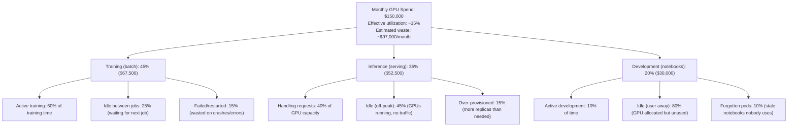
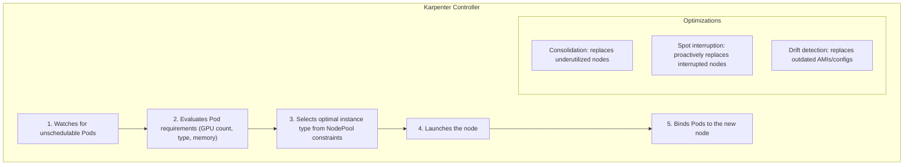
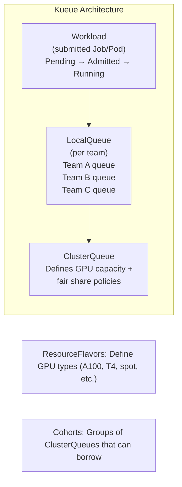

> **Discipline Module** | Complexity: `[MEDIUM]` | Time: 3 hours

## Prerequisites

Before starting this module:
- **Required**: [Module 1.1: GPU Provisioning & Device Plugins](../module-1.1-gpu-provisioning/) — GPU resources, DCGM metrics
- **Required**: [Module 1.5: Serving LLMs at Scale](../module-1.5-llm-serving/) — Inference workload patterns
- **Recommended**: Kubernetes autoscaling concepts (HPA, VPA, Cluster Autoscaler)
- **Recommended**: Experience with cloud billing (AWS, GCP, or Azure cost explorer)

---

## What You'll Be Able to Do

After completing this module, you will be able to:

- **Implement GPU cost tracking and attribution across teams, projects, and workload types**
- **Design spot/preemptible instance strategies that reduce AI training costs by 60-80%**
- **Build cost optimization workflows — right-sizing, scheduling, auto-shutdown — for GPU clusters**
- **Evaluate reserved capacity versus on-demand pricing models for predictable AI infrastructure budgets**

## Why This Module Matters

AI infrastructure is the most expensive line item in many organizations' cloud bills. The numbers are staggering:

| GPU Instance | Cloud Cost (on-demand) | Yearly Cost (1 node) |
|-------------|----------------------|---------------------|
| AWS p5.48xlarge (8x H100) | $98.32/hr | $861,283 |
| AWS p4d.24xlarge (8x A100) | $32.77/hr | $287,069 |
| GCP a3-megagpu-8g (8x H100) | $101.22/hr | $886,688 |
| Azure ND96amsr_A100_v4 (8x A100) | $32.77/hr | $287,069 |

A 32-node training cluster of H100s costs **$3.1 million per year** at on-demand prices. And here is the painful part: most organizations waste 40-70% of this spending through a combination of idle GPUs, over-provisioning, lack of spot/preemptible usage, and no queuing discipline.

This module teaches you the tools and techniques to cut GPU costs by 50-80% without sacrificing capability: spot instances for interruptible workloads, Karpenter for intelligent GPU node provisioning, Kueue for batch job scheduling and preemption, and the metrics framework to know exactly where every GPU-dollar goes.

---

## The Cost Anatomy of AI Workloads

> **Stop and think**: Before looking at the breakdown below, what percentage of your organization's GPU spend do you estimate is actively performing computations versus sitting idle?

### Where Money Goes

Break down a typical AI team's GPU spending:



### Cost Per Unit of Work

Think in **cost per unit of work**, not cost per GPU-hour:

| Metric | Formula | Example |
|--------|---------|---------|
| Cost per training epoch | (GPUs x $/hr x hours per epoch) | 8 A100 x $3/hr x 4hr = $96/epoch |
| Cost per 1K inference requests | (GPU-hours per 1K requests x $/hr) | 0.007 GPU-hr x $3/hr = $0.02/1K |
| Cost per experiment | (GPU-hours x $/hr) | 1 A100 x $3/hr x 2hr = $6/experiment |
| Cost per idle hour (waste) | (Idle GPUs x $/hr) | 4 idle A100 x $3/hr = $12/hr waste |

Track these metrics in dashboards. When a scientist says "I need 16 GPUs for a week," translate that to **$8,064** (16 x $3/hr x 168hr) and ask: "Is this experiment worth $8,064?"

---

## Spot Instances for Interruptible Workloads

> **Pause and predict**: If spot instances can be terminated with only a 30-120 second warning, what specific application architecture pattern is required to train a deep learning model over several days on spot capacity?

### The Opportunity

Cloud providers sell excess GPU capacity at 60-90% discount as "spot" (AWS), "preemptible" (GCP), or "spot" (Azure). The catch: they can be reclaimed with 30-120 seconds notice.

| Provider | GPU Instance | On-Demand | Spot Price | Savings |
|----------|-------------|-----------|------------|---------|
| AWS | p4d.24xlarge (8x A100) | $32.77/hr | $12.50/hr | 62% |
| AWS | g5.xlarge (1x A10G) | $1.01/hr | $0.35/hr | 65% |
| GCP | a2-highgpu-8g (8x A100) | $29.39/hr | $8.82/hr | 70% |
| Azure | NC24ads_A100_v4 (1x A100) | $3.67/hr | $1.47/hr | 60% |

### Which Workloads Can Use Spot

| Workload | Spot-Friendly? | Why |
|----------|---------------|-----|
| Training (with checkpointing) | Yes | Can resume from checkpoint after interruption |
| Hyperparameter search | Excellent | Individual trials are independent and short |
| Batch inference | Yes | Can re-queue interrupted batches |
| Data preprocessing | Yes | Stateless, idempotent |
| Interactive inference (serving) | No | Interruptions = user-facing errors |
| Jupyter notebooks | Risky | Users lose unsaved work |

### Handling Spot Interruptions

When a spot instance is reclaimed:

1. **Cloud provider sends termination notice** (2 min on AWS, 30s on GCP)
2. **Kubernetes detects node termination** and marks node as unschedulable
3. **Pods are evicted** — they receive SIGTERM
4. **Cluster autoscaler/Karpenter** provisions replacement nodes

For training jobs, the key is **checkpoint frequency** vs **interruption frequency**:

```
Interruption rate: ~1 per 4 hours (average for GPU spot on AWS)
Checkpoint frequency: every 30 minutes
Average work lost per interruption: 15 minutes (half a checkpoint interval)
Cost of lost work: 8 A100 x $1.56/hr (spot) x 0.25hr = $3.12

Savings from spot: 8 A100 x ($32.77 - $12.50) x 4hr = $648.64 per period
Net savings: $648.64 - $3.12 = $645.52 per 4-hour period (99.5% of potential savings captured)
```

### Node Termination Handler

Install a handler that gracefully manages spot interruptions:

```bash
# AWS: Node Termination Handler
helm repo add eks https://aws.github.io/eks-charts
helm install aws-node-termination-handler eks/aws-node-termination-handler \
  --namespace kube-system \
  --set enableSpotInterruptionDraining=true \
  --set enableRebalanceMonitoring=true \
  --set enableScheduledEventDraining=true
```

```bash
# GCP: Uses native node auto-repair + preemptible handling
# No separate handler needed — GKE handles it natively
```

---

## Karpenter: Intelligent GPU Node Provisioning

> **Stop and think**: The traditional Cluster Autoscaler scales predefined node groups. Why would relying on fixed node groups be particularly inefficient and costly when managing a diverse fleet of expensive GPU instances?

### Why Karpenter Over Cluster Autoscaler

The Cluster Autoscaler (CA) scales **node groups** — predefined pools of identical instances. This works poorly for GPUs because:

1. **GPU instance diversity**: You need different GPU types for different workloads (T4 for inference, A100 for training)
2. **Slow scaling**: CA checks every 10-30 seconds, then takes 5-10 minutes to provision cloud instances
3. **Inefficient packing**: CA can't mix instance types within a node group
4. **No spot fallback**: If spot capacity is unavailable, CA just waits

Karpenter provisions **individual nodes** based on Pod requirements, choosing the optimal instance type, zone, and capacity type (on-demand vs spot) in real-time.

### Karpenter Architecture for GPU



### NodePool for GPU Spot Instances

```yaml
apiVersion: karpenter.sh/v1
kind: NodePool
metadata:
  name: gpu-training-spot
spec:
  template:
    metadata:
      labels:
        workload-type: training
        capacity-type: spot
    spec:
      requirements:
        - key: karpenter.sh/capacity-type
          operator: In
          values: ["spot"]                    # Spot only
        - key: node.kubernetes.io/instance-type
          operator: In
          values:
            - p4d.24xlarge                    # 8x A100-40GB
            - p4de.24xlarge                   # 8x A100-80GB
            - p5.48xlarge                     # 8x H100-80GB
        - key: topology.kubernetes.io/zone
          operator: In
          values: ["us-east-1a", "us-east-1b", "us-east-1c"]
      nodeClassRef:
        group: karpenter.k8s.aws
        kind: EC2NodeClass
        name: gpu-training
      taints:
        - key: nvidia.com/gpu
          value: "true"
          effect: NoSchedule
        - key: workload-type
          value: training
          effect: NoSchedule
  disruption:
    consolidationPolicy: WhenEmpty       # Only remove when no GPU pods running
    consolidateAfter: 5m                 # Wait 5 min after last pod before removing
  limits:
    cpu: "512"
    memory: 4Ti
    nvidia.com/gpu: "64"                  # Max 64 GPUs total in this pool
  weight: 10                              # Prefer this pool (spot) over on-demand
```

### NodePool for GPU On-Demand (Fallback)

```yaml
apiVersion: karpenter.sh/v1
kind: NodePool
metadata:
  name: gpu-inference-ondemand
spec:
  template:
    metadata:
      labels:
        workload-type: inference
        capacity-type: on-demand
    spec:
      requirements:
        - key: karpenter.sh/capacity-type
          operator: In
          values: ["on-demand"]              # On-demand for SLA-bound inference
        - key: node.kubernetes.io/instance-type
          operator: In
          values:
            - g5.xlarge                      # 1x A10G (24GB)
            - g5.2xlarge                     # 1x A10G (24GB) + more CPU
            - g6.xlarge                      # 1x L4 (24GB)
        - key: topology.kubernetes.io/zone
          operator: In
          values: ["us-east-1a", "us-east-1b"]
      nodeClassRef:
        group: karpenter.k8s.aws
        kind: EC2NodeClass
        name: gpu-inference
      taints:
        - key: nvidia.com/gpu
          value: "true"
          effect: NoSchedule
  disruption:
    consolidationPolicy: WhenEmptyOrUnderutilized
    consolidateAfter: 10m
  limits:
    nvidia.com/gpu: "32"
```

### EC2NodeClass for GPU Nodes

```yaml
apiVersion: karpenter.k8s.aws/v1
kind: EC2NodeClass
metadata:
  name: gpu-training
spec:
  amiFamily: AL2023
  role: KarpenterNodeRole
  subnetSelectorTerms:
    - tags:
        karpenter.sh/discovery: ml-cluster
  securityGroupSelectorTerms:
    - tags:
        karpenter.sh/discovery: ml-cluster
  blockDeviceMappings:
    - deviceName: /dev/xvda
      ebs:
        volumeSize: 200Gi
        volumeType: gp3
        iops: 10000
        throughput: 500
    - deviceName: /dev/xvdb
      ebs:
        volumeSize: 1Ti             # Large local storage for model weights/data
        volumeType: gp3
        iops: 16000
        throughput: 1000
  userData: |
    #!/bin/bash
    # Install NVIDIA driver if not in AMI
    # GPU Operator handles this, but pre-baked AMIs are faster
```

### Scale to Zero with Karpenter

Karpenter naturally scales to zero: when no unschedulable Pods need GPUs, no GPU nodes exist. When a GPU Pod is created, Karpenter provisions a node within 1-3 minutes.

This is transformative for cost:

```
Without scale-to-zero:
  8 A100 nodes running 24/7 for training
  Active training: 10 hours/day
  Idle: 14 hours/day
  Monthly cost: 8 × $32.77/hr × 730hr = $191,376
  Effective cost: $191,376 (100%)

With Karpenter scale-to-zero:
  8 A100 nodes provisioned only during training
  Active: 10 hours/day × 30 days = 300 hours
  Monthly cost: 8 × $32.77/hr × 300hr = $78,648
  Savings: $112,728 (59%)

With Karpenter + spot:
  Active: 300 hours, spot price $12.50/hr
  Monthly cost: 8 × $12.50/hr × 300hr = $30,000
  Savings: $161,376 (84% vs always-on on-demand!)
```

---

## Priority Classes and Preemption

### GPU Priority Hierarchy

Not all GPU workloads are equally important. Define a priority hierarchy:

```yaml
# Critical production inference — never preempted
apiVersion: scheduling.k8s.io/v1
kind: PriorityClass
metadata:
  name: gpu-production
value: 1000000
globalDefault: false
preemptionPolicy: PreemptLowerPriority
description: "Production inference services — highest GPU priority"
---
# Training jobs — can preempt dev but not production
apiVersion: scheduling.k8s.io/v1
kind: PriorityClass
metadata:
  name: gpu-training
value: 100000
globalDefault: false
preemptionPolicy: PreemptLowerPriority
description: "Training jobs — preemptable by production only"
---
# Development and experimentation — lowest priority
apiVersion: scheduling.k8s.io/v1
kind: PriorityClass
metadata:
  name: gpu-development
value: 10000
globalDefault: false
preemptionPolicy: PreemptLowerPriority
description: "Development workloads — preempted by training and production"
---
# Best-effort — preempted by everything
apiVersion: scheduling.k8s.io/v1
kind: PriorityClass
metadata:
  name: gpu-best-effort
value: 1000
globalDefault: false
preemptionPolicy: Never         # Cannot preempt anything
description: "Best-effort GPU access — runs only when capacity is free"
```

Use in Pods:

```yaml
apiVersion: v1
kind: Pod
metadata:
  name: experiment-42
spec:
  priorityClassName: gpu-development   # Low priority — can be preempted
  containers:
    - name: experiment
      image: nvcr.io/nvidia/pytorch:24.09-py3
      resources:
        limits:
          nvidia.com/gpu: 1
```

---

## Kueue: Batch Job Queuing and Scheduling

> **Stop and think**: If a high-priority production job needs GPUs but the cluster is full of low-priority experiments, how should the system decide which experiments to terminate while ensuring resources are allocated fairly among different research teams?

### Why Kueue

Kubernetes schedulers are designed for **services** (run forever, maintain N replicas). AI training jobs are **batch** workloads that need:

- **Queuing**: 50 training jobs submitted, but only 16 GPUs available
- **Fair sharing**: Team A and Team B each get 50% of GPU capacity
- **Preemption**: High-priority jobs can bump low-priority ones
- **Resource quotas**: Team A can use at most 32 GPUs
- **Borrowing**: Team A can use Team B's idle GPUs (and give them back when needed)

Kueue (Kubernetes Queue) provides all of this.

### Kueue Architecture



### Installing Kueue

```bash
kubectl apply --server-side -f https://github.com/kubernetes-sigs/kueue/releases/download/v0.9.1/manifests.yaml

# Verify
kubectl -n kueue-system get pods
```

### Configuring Kueue for GPU Workloads

**Step 1: Define ResourceFlavors** (what kinds of GPUs exist)

```yaml
apiVersion: kueue.x-k8s.io/v1beta1
kind: ResourceFlavor
metadata:
  name: gpu-a100-spot
spec:
  nodeLabels:
    nvidia.com/gpu.product: NVIDIA-A100-SXM4-80GB
    karpenter.sh/capacity-type: spot
---
apiVersion: kueue.x-k8s.io/v1beta1
kind: ResourceFlavor
metadata:
  name: gpu-a100-ondemand
spec:
  nodeLabels:
    nvidia.com/gpu.product: NVIDIA-A100-SXM4-80GB
    karpenter.sh/capacity-type: on-demand
---
apiVersion: kueue.x-k8s.io/v1beta1
kind: ResourceFlavor
metadata:
  name: gpu-t4-spot
spec:
  nodeLabels:
    nvidia.com/gpu.product: Tesla-T4
    karpenter.sh/capacity-type: spot
```

**Step 2: Define ClusterQueue** (total GPU budget and fair sharing)

```yaml
apiVersion: kueue.x-k8s.io/v1beta1
kind: ClusterQueue
metadata:
  name: gpu-cluster-queue
spec:
  cohort: ai-platform              # Cohort for borrowing
  preemption:
    reclaimWithinCohort: Any
    borrowWithinCohort:
      policy: LowerPriority
      maxPriorityThreshold: 100000  # Only borrow for training+ priority
    withinClusterQueue: LowerPriority
  resourceGroups:
    - coveredResources: ["cpu", "memory", "nvidia.com/gpu"]
      flavors:
        - name: gpu-a100-spot
          resources:
            - name: nvidia.com/gpu
              nominalQuota: 32         # 32 A100 spot GPUs total
              borrowingLimit: 16       # Can borrow 16 more from cohort
            - name: cpu
              nominalQuota: 512
            - name: memory
              nominalQuota: 2Ti
        - name: gpu-a100-ondemand
          resources:
            - name: nvidia.com/gpu
              nominalQuota: 8          # 8 on-demand A100s (for critical jobs)
              borrowingLimit: 0
            - name: cpu
              nominalQuota: 128
            - name: memory
              nominalQuota: 512Gi
        - name: gpu-t4-spot
          resources:
            - name: nvidia.com/gpu
              nominalQuota: 16
            - name: cpu
              nominalQuota: 64
            - name: memory
              nominalQuota: 256Gi
  fairSharing:
    weight: 1
```

**Step 3: Define LocalQueues** (per-team queues)

```yaml
apiVersion: kueue.x-k8s.io/v1beta1
kind: LocalQueue
metadata:
  name: ml-research-queue
  namespace: ml-research
spec:
  clusterQueue: gpu-cluster-queue
---
apiVersion: kueue.x-k8s.io/v1beta1
kind: LocalQueue
metadata:
  name: ml-platform-queue
  namespace: ml-platform
spec:
  clusterQueue: gpu-cluster-queue
---
apiVersion: kueue.x-k8s.io/v1beta1
kind: LocalQueue
metadata:
  name: ml-production-queue
  namespace: ml-production
spec:
  clusterQueue: gpu-cluster-queue
```

**Step 4: Submit Jobs to Kueue**

```yaml
apiVersion: batch/v1
kind: Job
metadata:
  name: training-run-82
  namespace: ml-research
  labels:
    kueue.x-k8s.io/queue-name: ml-research-queue    # Which queue
spec:
  parallelism: 4                                       # 4 workers
  completions: 4
  template:
    spec:
      priorityClassName: gpu-training
      containers:
        - name: trainer
          image: my-registry/trainer:v2.1
          resources:
            requests:
              nvidia.com/gpu: 2                        # 2 GPUs per worker
              cpu: "16"
              memory: 64Gi
            limits:
              nvidia.com/gpu: 2
              cpu: "16"
              memory: 64Gi
      restartPolicy: OnFailure
```

### Kueue in Action: Queue Status

```bash
# View queue status
kubectl get clusterqueue gpu-cluster-queue -o wide

# NAME                COHORT       PENDING  ADMITTED  ACTIVE
# gpu-cluster-queue   ai-platform  3        5         5

# View workloads in a local queue
kubectl -n ml-research get workloads

# NAME                 QUEUE              ADMITTED  FINISHED  AGE
# training-run-82      ml-research-queue  True                2h
# training-run-83      ml-research-queue  True                1h
# experiment-99        ml-research-queue  False               10m  ← queued
```

### Preemption Flow

When a high-priority job arrives and no GPUs are free:

```
1. Job "critical-inference" (priority: 1000000) submitted → needs 4 GPUs
2. All 32 GPUs are busy with "experiment-*" jobs (priority: 10000)
3. Kueue identifies 4 GPUs occupied by lowest-priority workloads
4. Kueue evicts experiment-72, experiment-73 (freeing 4 GPUs)
5. critical-inference is admitted and starts running
6. experiment-72, experiment-73 return to the queue (pending)
7. When GPUs become available, experiments resume
```

---

## Utilization Profiling and Cost Dashboards

### Essential Metrics

Build a GPU cost dashboard with these Prometheus queries:

```yaml
# GPU utilization by team/namespace
avg(DCGM_FI_DEV_GPU_UTIL{}) by (namespace)

# Allocated vs used GPUs (waste detection)
# Allocated:
count(kube_pod_container_resource_limits{resource="nvidia_com_gpu"} > 0) by (namespace)
# Actually computing:
count(DCGM_FI_DEV_GPU_UTIL > 10) by (namespace)

# Cost per namespace per hour
(
  count(kube_pod_container_resource_limits{resource="nvidia_com_gpu"} > 0) by (namespace)
  * 3.06  # $/hr per GPU (adjust to your actual cost)
)

# Idle GPU hours per day (waste)
(
  count(DCGM_FI_DEV_GPU_UTIL < 5) by (namespace)
  * 3.06
)

# Kueue queue wait time
kueue_pending_workloads{cluster_queue="gpu-cluster-queue"}

# Spot vs on-demand ratio
count(kube_node_labels{label_karpenter_sh_capacity_type="spot"})
/
count(kube_node_labels{label_nvidia_com_gpu_present="true"})
```

### Cost Alerting

```yaml
apiVersion: monitoring.coreos.com/v1
kind: PrometheusRule
metadata:
  name: gpu-cost-alerts
  namespace: monitoring
spec:
  groups:
    - name: gpu-cost.rules
      rules:
        - alert: GPUIdleForTooLong
          expr: |
            (DCGM_FI_DEV_GPU_UTIL < 5)
            * on(node) group_left()
            (kube_node_labels{label_karpenter_sh_capacity_type="on-demand"})
          for: 1h
          labels:
            severity: warning
          annotations:
            summary: "On-demand GPU {{ $labels.gpu }} on {{ $labels.node }} idle for 1h — costing $3/hr"
            runbook: "Check if workload is stuck or notebook is abandoned. Consider scaling down."

        - alert: HighQueueWaitTime
          expr: |
            max(kueue_admission_wait_time_seconds{cluster_queue="gpu-cluster-queue"}) > 3600
          for: 10m
          labels:
            severity: info
          annotations:
            summary: "Jobs waiting >1hr in GPU queue — consider increasing GPU budget"

        - alert: SpotCapacityLow
          expr: |
            count(kube_node_labels{label_karpenter_sh_capacity_type="spot",label_nvidia_com_gpu_present="true"})
            /
            count(kube_node_labels{label_nvidia_com_gpu_present="true"})
            < 0.4
          for: 30m
          labels:
            severity: info
          annotations:
            summary: "Spot GPUs are <40% of fleet — check spot availability in your AZs"
```

### The GPU Chargeback Model

Implement chargeback so teams understand their spending:

```
Monthly GPU Report — ML Research Team
━━━━━━━━━━━━━━━━━━━━━━━━━━━━━━━━━━━━
GPU-hours consumed:      2,847 hrs
  ├── A100 on-demand:      312 hrs × $3.06 =   $954.72
  ├── A100 spot:         1,935 hrs × $1.17 = $2,263.95
  └── T4 spot:             600 hrs × $0.35 =   $210.00
                                             ──────────
Total:                                        $3,428.67

Waste analysis:
  Idle GPU-hours:          423 hrs (14.9%)
  Idle cost:                                    $495.09

Efficiency score: 85.1% (target: >80%)
Spot ratio: 89.1% (target: >70%)

Top consumers:
  1. training-llama-ft-v3:   1,200 GPU-hrs  ($1,404.00)
  2. hyperparameter-sweep:     800 GPU-hrs  ($280.00)
  3. jupyter-alice:            400 GPU-hrs  ($140.00) ← 82% idle
```

---

## Resource Quotas for GPU

### Namespace-Level Quotas

Prevent any single team from monopolizing GPUs:

```yaml
apiVersion: v1
kind: ResourceQuota
metadata:
  name: gpu-quota
  namespace: ml-research
spec:
  hard:
    requests.nvidia.com/gpu: "16"     # Team can request max 16 GPUs
    limits.nvidia.com/gpu: "16"
    pods: "50"                         # Max 50 pods (prevent notebook sprawl)
```

### LimitRange for Default GPU Requests

Prevent users from accidentally requesting too many GPUs:

```yaml
apiVersion: v1
kind: LimitRange
metadata:
  name: gpu-limits
  namespace: ml-research
spec:
  limits:
    - type: Container
      max:
        nvidia.com/gpu: "8"           # Single container max 8 GPUs
      default:
        nvidia.com/gpu: "1"           # Default: 1 GPU if not specified
      defaultRequest:
        nvidia.com/gpu: "1"
```

---

## Did You Know?

1. **Spot GPU interruption rates vary wildly by instance type and region**. AWS p4d.24xlarge (8x A100) in us-east-1 has a spot interruption rate of about 5-15% (meaning roughly 1 in 7-20 spot instances gets interrupted per hour), while g5.xlarge (1x A10G) has a rate under 5%. Diversifying across instance types and availability zones significantly reduces interruption frequency.

2. **Kueue was created at Google specifically for AI/ML workloads on GKE**. The Google Kubernetes team realized that the standard Kubernetes scheduler had no concept of "wait in line" — if resources aren't available, a Pod is just Pending forever with no ordering guarantee. Kueue adds the queuing, fair sharing, and preemption semantics that HPC and ML batch systems have had for decades (think SLURM, PBS).

3. **The biggest hidden cost in AI infrastructure is often egress, not compute**. A team downloading a 100GB model from Hugging Face Hub to 50 nodes pays for 5TB of egress. If they do this daily (CI/CD pipeline rebuilds), that is 150TB/month. At $0.09/GB, that is **$13,500/month in bandwidth alone**. Caching model weights on a shared PVC eliminates this entirely.

---

## War Story: The Team That Saved 73% by Doing Nothing Differently

A startup spending $180,000/month on GPU infrastructure asked for a cost review. Their workloads:

- 3 always-on inference services (needed on-demand for SLA)
- 15-20 training jobs per day (interruptible, checkpoint every 20 minutes)
- 30+ Jupyter notebooks (mostly idle)

**Changes made**:

1. **Karpenter + spot for training**: Training jobs moved to spot instances. Cost reduction: 62% on training compute.

2. **Karpenter scale-to-zero for notebooks**: Notebooks got GPU only when running a cell. Idle notebooks lost their GPU after 15 minutes. Cost reduction: 90% on notebook GPUs (from $30K/month to $3K/month).

3. **Kueue for fairness**: Instead of every team hoarding GPUs "just in case," Kueue managed a shared pool. Teams that finished early released GPUs for others. Utilization went from 35% to 78%.

4. **Time-slicing for inference**: Small inference models shared GPUs instead of getting dedicated ones. 3 inference services went from 6 GPUs to 2 GPUs.

**Result**:

| Category | Before | After | Savings |
|----------|--------|-------|---------|
| Training | $81,000 | $25,000 | 69% |
| Inference | $52,500 | $18,000 | 66% |
| Development | $30,000 | $3,000 | 90% |
| Networking/egress | $16,500 | $2,500 | 85% |
| **Total** | **$180,000** | **$48,500** | **73%** |

The ML team did not change a single line of training code. Every optimization was at the platform level.

**Lesson**: The platform team has more leverage over AI costs than the ML team does. Invest in infrastructure efficiency.

---

## Common Mistakes

| Mistake | Problem | Solution |
|---------|---------|----------|
| Running all GPU workloads on-demand | Paying 3x more than necessary for interruptible work | Use spot for training, hyperparameter search, batch inference |
| No scale-to-zero for dev GPUs | Notebooks hold GPUs 24/7, used 10% of the time | Karpenter `consolidateAfter: 15m` or KEDA scale-to-zero |
| No resource quotas | One team monopolizes all GPUs; others wait indefinitely | Per-namespace ResourceQuotas + Kueue ClusterQueue fair sharing |
| Checkpoint too infrequently on spot | Spot interruption loses 2+ hours of training | Checkpoint every 15-30 minutes; cost of wasted work is pennies |
| Same priority for all workloads | Production inference and casual experiments compete equally | PriorityClasses: production (1M), training (100K), dev (10K), best-effort (1K) |
| Ignoring egress costs | Downloading models/datasets on every Pod start | Cache on shared PVCs; use JuiceFS for datasets |
| No cost visibility | Teams have no idea what their GPU usage costs | Build chargeback dashboards with per-namespace cost tracking |
| Karpenter without GPU limits | Bug or runaway job provisions 100 GPU nodes | Set `limits.nvidia.com/gpu` on every NodePool |

---

## Quiz: Check Your Understanding

### Question 1
You are architecting a training pipeline for a new LLM. The data science team has implemented checkpointing every 30 minutes. The finance team points out that spot instances cost $12/hr compared to the $32/hr on-demand price, but the data scientists are worried about lost work since spot interruptions occur on average once every 3 hours. How do you calculate the effective hourly cost to prove to the data science team that spot instances are still the right choice?

<details>
<summary>Show Answer</summary>

The effective hourly cost is calculated by adding the base spot price to the cost of wasted compute time. Since the spot instance costs $12/hr and interruptions occur on average every 3 hours, you can expect one interruption per 3-hour window. With a 30-minute checkpoint interval, an interruption will destroy an average of 15 minutes of work (half the interval). This 15 minutes of lost work costs $3 ($12/hr × 0.25 hrs), which amortizes to a waste cost of $1/hr over the 3-hour period. Therefore, the effective cost is $13/hr, which still yields a massive 59% savings compared to the $32/hr on-demand price, definitively proving that spot instances are the more economical choice despite the interruptions.
</details>

### Question 2
Your organization currently relies on native Kubernetes PriorityClasses to ensure production inference services preempt batch experiments. However, the machine learning researchers complain that when preemption happens, their jobs fail completely and their quotas get messed up. You are proposing Kueue to solve this. How would you explain the operational difference between Kueue's preemption and native Kubernetes preemption to the research team?

<details>
<summary>Show Answer</summary>

Native Kubernetes preemption is a blunt tool operated by the scheduler that simply evicts lower-priority pods to make room, forcing them back into a pending state with no queuing order or quota awareness. In contrast, Kueue's preemption is managed by a sophisticated admission controller designed for multi-tenant batch workloads. Kueue respects fair sharing and cohort borrowing policies, ensuring that one team's high-priority job cannot aggressively evict workloads from another team's guaranteed quota unless borrowing limits are exceeded. When Kueue preempts a workload, it suspends it and returns it to an ordered queue, preserving its position so it can seamlessly resume once capacity frees up. This makes Kueue significantly safer and fairer for research teams sharing a cluster.
</details>

### Question 3
The computer vision team (Team A) and the NLP team (Team B) each have a strict quota of 16 A100 GPUs in your 32-GPU cluster. The vision team is currently only running experiments that use 8 GPUs. The NLP team has a massive backlog and needs 24 GPUs to meet a deadline. Using Kueue, how can you configure the system so the NLP team can utilize the vision team's idle GPUs without permanently depriving the vision team of their guaranteed capacity when they need it back?

<details>
<summary>Show Answer</summary>

Kueue solves this resource-sharing challenge through the use of cohorts and temporary borrowing. By placing both the computer vision and NLP teams' ClusterQueues into the same cohort, you establish a shared resource pool. You would configure the NLP team's queue with a `nominalQuota` of 16 and a `borrowingLimit` of at least 8, allowing them to dynamically borrow the vision team's unused GPUs and scale up to 24 GPUs. Crucially, because the vision team's queue maintains its `nominalQuota` of 16 and Kueue is configured with `reclaimWithinCohort: Any`, Kueue will gracefully preempt the NLP team's lowest-priority borrowed workloads the moment the vision team submits new jobs. This guarantees the vision team immediate access to their dedicated capacity while maximizing overall cluster utilization.
</details>

### Question 4
You are configuring Karpenter NodePools for a new GPU training cluster. A junior platform engineer suggests using `consolidationPolicy: WhenEmptyOrUnderutilized` to maximize cost savings by packing pods tightly and terminating underutilized nodes. You know this is a bad idea for GPU training workloads. How do you explain to the engineer why `WhenEmpty` is the safer and more appropriate choice?

<details>
<summary>Show Answer</summary>

Using the `WhenEmptyOrUnderutilized` policy on GPU nodes is highly disruptive because moving a running GPU training pod involves terminating it, losing uncheckpointed progress, and enduring a lengthy cold-start process to reload large model weights. Furthermore, Karpenter's utilization metrics might interpret a node as "underutilized" if only 1 out of 4 GPUs is active, even though the remaining GPUs might be required momentarily for the next phase of a distributed training job. `WhenEmpty` is the much safer alternative because it only terminates a node when zero GPU pods are running on it. This configuration entirely avoids the risk of destructive mid-training migrations while still aggressively scaling the cluster down to zero when the nodes are genuinely idle, perfectly balancing cost savings with workload stability.
</details>

### Question 5
You have been hired as a FinOps consultant for a startup struggling with a $156,750/month AWS bill for AI workloads. They currently run 40 inference pods (1 GPU each, 15% avg utilization), 20 daily training jobs (4 GPUs for 2 hours each), and 25 always-on Jupyter notebooks (1 GPU each). Everything runs on on-demand A100s at $3/hr without sharing. You plan to implement time-slicing (4 pods/GPU) for inference, Kueue with spot instances ($1.17/hr) for training, and Karpenter scale-to-zero (active 10% of time) for notebooks. Calculate the projected monthly savings and explain how these three mechanisms achieve the reduction.

<details>
<summary>Show Answer</summary>

The optimized monthly cost will be $29,652, resulting in a dramatic savings of $127,098 (an 81% reduction) compared to the original $156,750 bill. Time-slicing achieves the first major reduction by packing four 15%-utilized inference pods onto a single GPU, dropping the required always-on inference GPUs from 40 down to just 10. For training, transitioning to spot instances slashes the compute rate by 62%, while Kueue ensures these batch jobs execute efficiently without idle wait times or quota conflicts. Finally, applying Karpenter's scale-to-zero capabilities to the Jupyter notebooks eliminates the massive waste of 24/7 on-demand allocation, ensuring the cluster only spins up spot GPUs for the 10% of the time the data scientists are actively running code.
</details>

---

## Hands-On Exercise: Karpenter GPU Spot NodePool + Kueue Batch Jobs + Preemption

### Objective

Configure Karpenter to provision GPU spot nodes, deploy Kueue for batch job scheduling, submit jobs with different priorities, and observe preemption behavior.

### Environment

- EKS cluster with Karpenter installed (or GKE with equivalent; adapt NodePool syntax)
- At least one GPU instance type available in your region (g5.xlarge or similar)
- kubectl and Helm installed

> **Note**: This exercise is designed for AWS EKS with Karpenter. If using GKE or AKS, adapt the NodePool/NodeClass definitions to your provider's syntax. The Kueue concepts are identical across providers.

### Step 1: Create GPU NodePool in Karpenter

```bash
cat <<'EOF' | kubectl apply -f -
apiVersion: karpenter.sh/v1
kind: NodePool
metadata:
  name: gpu-spot-exercise
spec:
  template:
    metadata:
      labels:
        exercise: ai-cost
    spec:
      requirements:
        - key: karpenter.sh/capacity-type
          operator: In
          values: ["spot"]
        - key: node.kubernetes.io/instance-type
          operator: In
          values: ["g5.xlarge", "g5.2xlarge", "g6.xlarge"]
      nodeClassRef:
        group: karpenter.k8s.aws
        kind: EC2NodeClass
        name: gpu-exercise
      taints:
        - key: nvidia.com/gpu
          value: "true"
          effect: NoSchedule
  disruption:
    consolidationPolicy: WhenEmpty
    consolidateAfter: 2m
  limits:
    nvidia.com/gpu: "4"            # Max 4 GPUs for the exercise
---
apiVersion: karpenter.k8s.aws/v1
kind: EC2NodeClass
metadata:
  name: gpu-exercise
spec:
  amiFamily: AL2023
  role: KarpenterNodeRole-YOUR-CLUSTER-NAME
  subnetSelectorTerms:
    - tags:
        karpenter.sh/discovery: YOUR-CLUSTER-NAME
  securityGroupSelectorTerms:
    - tags:
        karpenter.sh/discovery: YOUR-CLUSTER-NAME
  blockDeviceMappings:
    - deviceName: /dev/xvda
      ebs:
        volumeSize: 100Gi
        volumeType: gp3
EOF
```

### Step 2: Install Kueue

```bash
kubectl apply --server-side -f https://github.com/kubernetes-sigs/kueue/releases/download/v0.9.1/manifests.yaml
kubectl -n kueue-system wait --for=condition=Ready pods --all --timeout=120s
```

### Step 3: Configure Kueue Resources

```bash
# Create namespaces
kubectl create namespace team-alpha
kubectl create namespace team-beta

# Priority classes
cat <<'EOF' | kubectl apply -f -
apiVersion: scheduling.k8s.io/v1
kind: PriorityClass
metadata:
  name: high-priority-gpu
value: 100000
preemptionPolicy: PreemptLowerPriority
---
apiVersion: scheduling.k8s.io/v1
kind: PriorityClass
metadata:
  name: low-priority-gpu
value: 10000
preemptionPolicy: PreemptLowerPriority
EOF

# ResourceFlavor
cat <<'EOF' | kubectl apply -f -
apiVersion: kueue.x-k8s.io/v1beta1
kind: ResourceFlavor
metadata:
  name: gpu-spot
spec:
  nodeLabels:
    karpenter.sh/capacity-type: spot
EOF

# ClusterQueue
cat <<'EOF' | kubectl apply -f -
apiVersion: kueue.x-k8s.io/v1beta1
kind: ClusterQueue
metadata:
  name: gpu-exercise-queue
spec:
  cohort: exercise
  preemption:
    withinClusterQueue: LowerPriority
    reclaimWithinCohort: Any
  resourceGroups:
    - coveredResources: ["cpu", "memory", "nvidia.com/gpu"]
      flavors:
        - name: gpu-spot
          resources:
            - name: nvidia.com/gpu
              nominalQuota: 4
            - name: cpu
              nominalQuota: 16
            - name: memory
              nominalQuota: 64Gi
EOF

# LocalQueues
cat <<'EOF' | kubectl apply -f -
apiVersion: kueue.x-k8s.io/v1beta1
kind: LocalQueue
metadata:
  name: team-alpha-queue
  namespace: team-alpha
spec:
  clusterQueue: gpu-exercise-queue
---
apiVersion: kueue.x-k8s.io/v1beta1
kind: LocalQueue
metadata:
  name: team-beta-queue
  namespace: team-beta
spec:
  clusterQueue: gpu-exercise-queue
EOF
```

### Step 4: Submit Low-Priority Jobs (fill the queue)

```bash
# Submit 4 low-priority jobs (will fill all 4 GPU slots)
for i in 1 2 3 4; do
cat <<EOF | kubectl apply -f -
apiVersion: batch/v1
kind: Job
metadata:
  name: low-priority-job-$i
  namespace: team-alpha
  labels:
    kueue.x-k8s.io/queue-name: team-alpha-queue
spec:
  template:
    spec:
      priorityClassName: low-priority-gpu
      tolerations:
        - key: nvidia.com/gpu
          operator: Exists
          effect: NoSchedule
      containers:
        - name: gpu-workload
          image: nvcr.io/nvidia/cuda:12.5.0-base-ubuntu22.04
          command: ["sleep", "600"]
          resources:
            requests:
              nvidia.com/gpu: 1
              cpu: "2"
              memory: 8Gi
            limits:
              nvidia.com/gpu: 1
              cpu: "2"
              memory: 8Gi
      restartPolicy: Never
  backoffLimit: 0
EOF
done

# Wait for Karpenter to provision nodes and jobs to start
echo "Waiting for jobs to be admitted..."
sleep 30
kubectl -n team-alpha get jobs
kubectl get nodes -l exercise=ai-cost
```

### Step 5: Submit a High-Priority Job (trigger preemption)

```bash
# Submit a high-priority job from Team Beta
cat <<'EOF' | kubectl apply -f -
apiVersion: batch/v1
kind: Job
metadata:
  name: high-priority-critical
  namespace: team-beta
  labels:
    kueue.x-k8s.io/queue-name: team-beta-queue
spec:
  template:
    spec:
      priorityClassName: high-priority-gpu
      tolerations:
        - key: nvidia.com/gpu
          operator: Exists
          effect: NoSchedule
      containers:
        - name: gpu-workload
          image: nvcr.io/nvidia/cuda:12.5.0-base-ubuntu22.04
          command: ["sh", "-c", "echo 'High priority job running!' && nvidia-smi && sleep 120"]
          resources:
            requests:
              nvidia.com/gpu: 1
              cpu: "2"
              memory: 8Gi
            limits:
              nvidia.com/gpu: 1
              cpu: "2"
              memory: 8Gi
      restartPolicy: Never
  backoffLimit: 0
EOF

# Observe preemption
echo "Watching for preemption..."
kubectl -n team-alpha get workloads -w &
kubectl -n team-beta get workloads -w &

# After ~30s, one low-priority job should be preempted
sleep 45
echo ""
echo "=== Team Alpha workloads ==="
kubectl -n team-alpha get workloads
echo ""
echo "=== Team Beta workloads ==="
kubectl -n team-beta get workloads
echo ""
echo "=== All pods ==="
kubectl get pods -n team-alpha -n team-beta
```

### Step 6: Verify and Observe

```bash
# Check Kueue events
kubectl -n team-alpha describe workload | grep -A 5 "Events:"
kubectl -n team-beta describe workload | grep -A 5 "Events:"

# Check ClusterQueue status
kubectl get clusterqueue gpu-exercise-queue -o yaml | grep -A 10 "status:"

# Check Karpenter logs for node provisioning/termination
kubectl -n kube-system logs -l app.kubernetes.io/name=karpenter --tail=50 | grep -i "gpu\|provisioned\|terminated"
```

### Step 7: Cleanup

```bash
kubectl delete namespace team-alpha team-beta
kubectl delete nodepool gpu-spot-exercise
kubectl delete ec2nodeclass gpu-exercise
kubectl delete clusterqueue gpu-exercise-queue
kubectl delete resourceflavor gpu-spot
kubectl delete priorityclass high-priority-gpu low-priority-gpu
```

### Success Criteria

You have completed this exercise when:
- [ ] Karpenter provisions spot GPU nodes in response to pending Pods
- [ ] 4 low-priority jobs are running on spot GPU nodes
- [ ] High-priority job submission triggers Kueue preemption of a low-priority job
- [ ] Preempted job returns to the queue (visible as Pending workload)
- [ ] High-priority job runs to completion
- [ ] After all jobs complete, Karpenter terminates idle GPU nodes (scale-to-zero)
- [ ] You can explain the cost advantage: spot pricing + scale-to-zero + preemption

---

## Key Takeaways

1. **Spot instances save 60-90% on interruptible GPU workloads** — training, hyperparameter search, and batch inference all qualify
2. **Karpenter provisions optimal GPU nodes dynamically** — right instance type, right zone, spot with on-demand fallback, and scale-to-zero when idle
3. **Priority classes create a GPU hierarchy** — production inference should never be disrupted by experiments
4. **Kueue brings HPC-grade batch scheduling to Kubernetes** — queuing, fair sharing, borrowing, and preemption for multi-tenant GPU clusters
5. **Cost visibility is prerequisite to cost optimization** — you cannot reduce what you cannot measure; build per-team chargeback dashboards
6. **The platform team has the most leverage on AI costs** — spot migration, scale-to-zero, sharing, and queuing save more than any ML code optimization
7. **Think in cost per unit of work** (cost per epoch, cost per 1K inferences) not cost per GPU-hour

---

## Further Reading

**Documentation**:
- **Kueue**: kueue.sigs.k8s.io/docs/
- **Karpenter**: karpenter.sh/docs/
- **AWS Spot Instances**: docs.aws.amazon.com/AWSEC2/latest/UserGuide/using-spot-instances.html
- **GKE Spot VMs**: cloud.google.com/kubernetes-engine/docs/concepts/spot-vms

**Talks**:
- **"Kueue: Job Queueing for Kubernetes"** — Aldo Culquicondor, KubeCon NA 2024
- **"Cost-Optimizing AI Workloads at Scale"** — AWS re:Invent 2024
- **"GPU Cost Optimization with Karpenter"** — Rajdeep Saha, KubeCon EU 2024

**Books**:
- **"Cloud FinOps"** — J.R. Storment & Mike Fuller (O'Reilly) — general cloud cost optimization principles

---

## Summary

AI infrastructure cost optimization is a multi-layered discipline: spot instances for interruptible workloads, Karpenter for intelligent node provisioning and scale-to-zero, priority classes and Kueue for multi-tenant GPU sharing with preemption, and comprehensive metrics dashboards for cost visibility and chargeback. Applied together, these techniques typically reduce GPU spending by 50-80% — often without any changes to ML training or inference code. The platform team's cost optimization work frequently delivers more ROI than the models it supports.

---

## What's Next

You have completed the AI/GPU Infrastructure discipline. From here:

- **Build on this foundation** with the [Platform Engineering](/platform/disciplines/core-platform/platform-engineering/) discipline for internal developer platforms
- **Deepen your observability** with the [SRE](/platform/disciplines/core-platform/sre/) discipline for GPU cluster reliability
- **Explore MLOps** with the [MLOps](/platform/disciplines/data-ai/mlops/) discipline for model lifecycle management
- **Review** all modules in this discipline and build a production GPU platform integrating all six modules

---

*"The cheapest GPU is the one you don't provision. The second cheapest is the spot instance you terminate when you're done."* — FinOps for AI