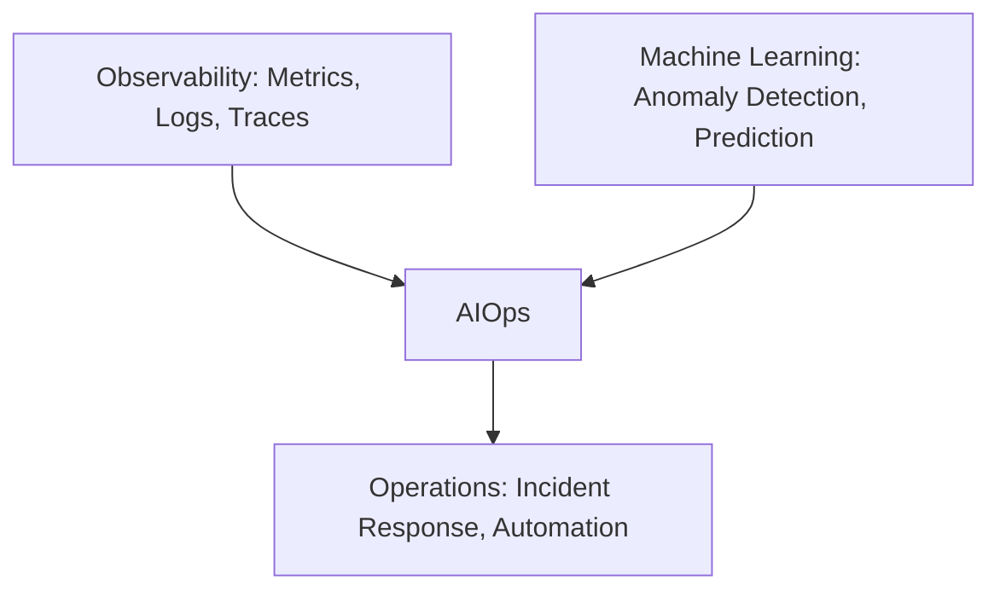
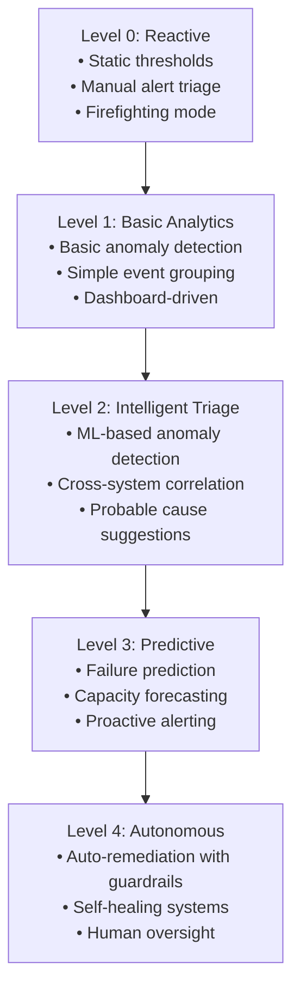
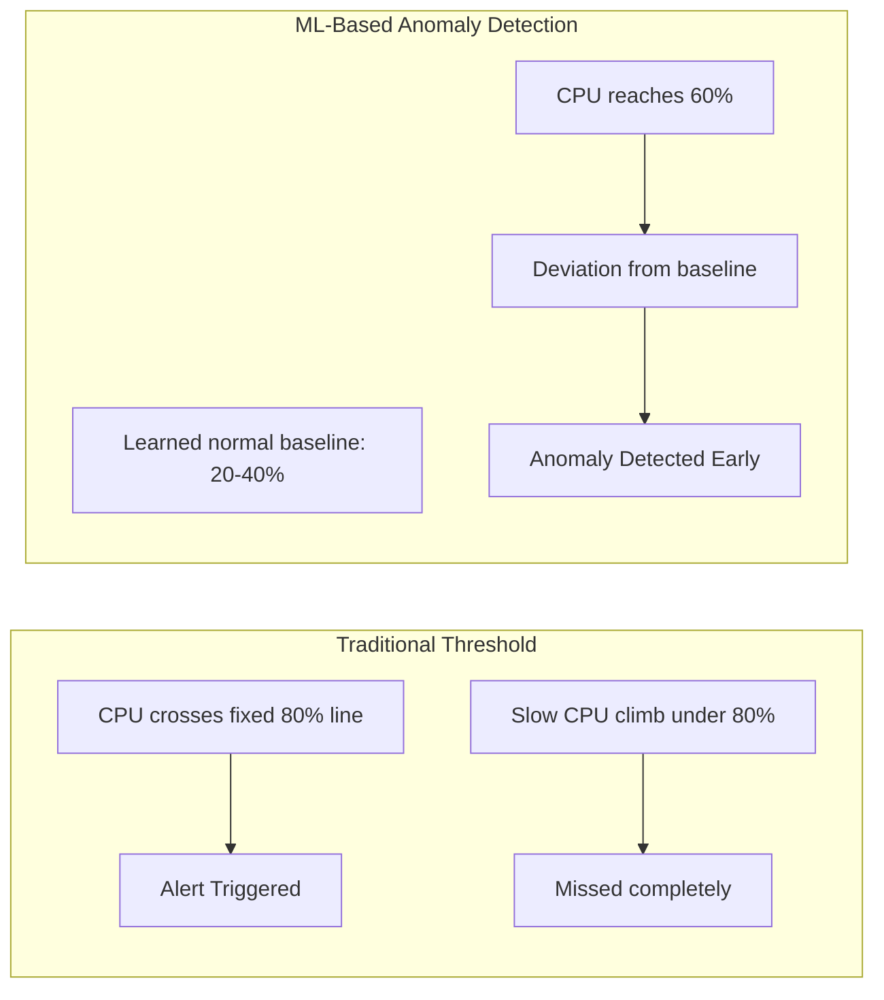
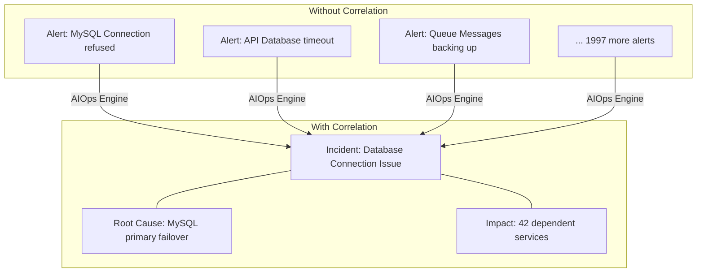
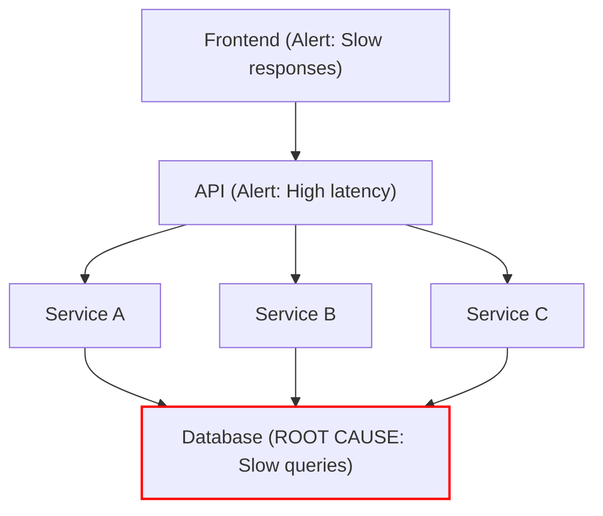
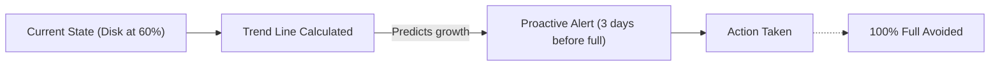
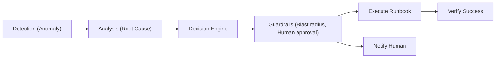
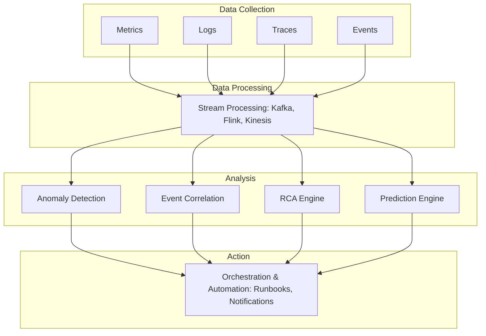
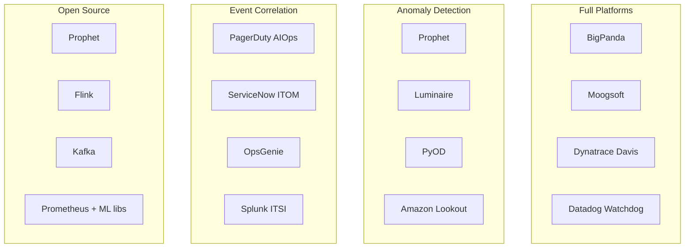

> **Discipline Track** | Complexity: `[MEDIUM]` | Time: 35-40 min

## Prerequisites

Before starting this module:
- [Observability Theory](/platform/foundations/observability-theory/) — Understanding of metrics, logs, traces
- [SRE Fundamentals](/platform/disciplines/core-platform/sre/module-1.1-what-is-sre/) — Incident management basics
- Basic understanding of machine learning concepts

## What You'll Be Able to Do

After completing this module, you will be able to:

- **Evaluate AIOps maturity levels to identify where AI-driven operations can deliver the most value**
- **Design an AIOps architecture that integrates with existing monitoring, logging, and alerting systems**
- **Implement data pipelines that feed operational telemetry into ML models for automated analysis**
- **Analyze the ROI of AIOps investments by measuring reduction in alert noise, MTTR, and manual toil**

## Why This Module Matters

Modern systems generate more data than humans can process. A medium-sized Kubernetes cluster produces millions of metrics, thousands of log lines per second, and countless traces. Traditional monitoring approaches—setting thresholds and waiting for alerts—can't scale.

The result? Alert fatigue. Teams receive thousands of alerts daily, miss critical signals buried in noise, and spend hours correlating events that machines could connect in milliseconds. AIOps isn't about replacing humans; it's about augmenting them with capabilities they simply don't have.

## Did You Know?

- **Gartner coined "AIOps" in 2017**, defining it as "Algorithmic IT Operations"—later expanded to include AI/ML approaches
- **The average enterprise IT environment produces 2.5 exabytes of data per day**, far beyond human analysis capacity
- **Alert fatigue causes 70% of critical alerts to be ignored** according to industry surveys—AIOps aims to fix this
- **Netflix's anomaly detection system processes over 2 billion events per second**, demonstrating AIOps at scale

## What is AIOps?

AIOps (Artificial Intelligence for IT Operations) applies machine learning and big data analytics to automate IT operations tasks. It sits at the intersection of observability, machine learning, and operations:



### AIOps vs Traditional Monitoring

| Aspect | Traditional Monitoring | AIOps |
|--------|----------------------|-------|
| **Detection** | Static thresholds | Dynamic baselines |
| **Alerts** | One event = one alert | Correlated, deduplicated |
| **Analysis** | Manual correlation | Automated root cause |
| **Response** | Human-driven | Automated + human oversight |
| **Learning** | Rules updated manually | Continuous learning |

### War Story: The 3AM Alert Storm

A team was paged at 3AM to 2,000 alerts. A single database failover had triggered cascading alerts across the stack—database connection failures, API timeouts, health check failures, queue backlogs.

The on-call engineer spent 45 minutes correlating alerts to find the root cause. With AIOps event correlation, those 2,000 alerts would have been one incident: "Database primary failover affecting 42 dependent services."

That's not science fiction—it's what modern AIOps platforms do every day.

> **Stop and think**: How much time does your team currently spend manually correlating logs and metrics when a major incident occurs before you even begin mitigation?

## The AIOps Maturity Model

Organizations progress through maturity levels:



**Most organizations are at Level 0 or 1.** Getting to Level 2 provides the biggest value leap.

> **Pause and predict**: Based on these descriptions, what data quality prerequisites must be met before an organization can successfully transition from Level 1 to Level 2?

## Core AIOps Capabilities

### 1. Anomaly Detection

Finding problems without predefined thresholds:



Key techniques:
- **Statistical methods**: Standard deviation, IQR, Z-scores
- **Machine learning**: Isolation forests, autoencoders, LSTM
- **Time series**: Seasonality-aware detection, trend analysis

### 2. Event Correlation

Grouping related alerts to reduce noise:



Correlation approaches:
- **Time-based**: Alerts within time windows
- **Topology-aware**: Using service dependencies
- **Text similarity**: NLP on alert messages
- **Causal**: Following data flow paths

### 3. Root Cause Analysis

Automatically identifying probable causes:



### 4. Predictive Analytics

Forecasting problems before they occur:



### 5. Auto-Remediation

Executing fixes with safety guardrails:



## AIOps Architecture

### Data Flow



### Build vs Buy

| Factor | Build Custom | Buy Platform |
|--------|-------------|--------------|
| **Time to value** | 6-18 months | Weeks |
| **Customization** | Full control | Limited |
| **Cost** | Engineering time | License fees |
| **Maintenance** | Your responsibility | Vendor handles |
| **Data privacy** | Full control | May require data sharing |
| **Best for** | Unique requirements, scale | Standard use cases |

**Recommendation**: Start with a platform, build custom components where needed.

> **Stop and think**: Does your organization have the specialized data science and engineering resources required to maintain and constantly retrain a custom ML platform in-house?

## The AIOps Tool Landscape



## Common Mistakes

| Mistake | Problem | Solution |
|---------|---------|----------|
| Buying a platform without data quality | Garbage in, garbage out | Fix observability first |
| Expecting magic from day one | ML needs training data | Start with historical data, iterate |
| Over-automating too fast | Automated mistakes at scale | Build trust with human-in-loop |
| Ignoring context/topology | Poor correlation without structure | Model your service dependencies |
| Treating AIOps as a project | Falls behind as systems change | Continuous investment required |
| No success metrics | Can't prove value | Define noise reduction, MTTR targets |

> **Pause and predict**: Which of these common mistakes is the most difficult to recover from technically, rather than organizationally?

## Quiz

Test your understanding:

<details>
<summary>1. Your e-commerce platform spans 50 microservices running on Kubernetes. During Black Friday, a networking issue causes intermittent packet loss, triggering 15,000 alerts across metrics, logs, and traces within a 3-minute window. Why is it impossible for your on-call team to manually resolve this using traditional monitoring?</summary>

**Answer**: In this scenario, the volume and velocity of telemetry data vastly exceed human cognitive limits. An on-call engineer would have to mentally filter out the noise of thousands of downstream symptom alerts (like API timeouts and database connection drops) to find the network-level root cause. By the time a human manually cross-references logs, metrics, and traces across 50 services, the business has already suffered catastrophic downtime. AIOps solves this by ingesting the massive data stream and automatically correlating the 15,000 alerts into a single actionable incident.
</details>

<details>
<summary>2. Your organization currently relies on static CPU thresholds (Level 1) and your on-call engineers are experiencing severe burnout from daily false positives. You secure funding to upgrade your observability stack. Which AIOps maturity transition will provide the most immediate relief to your team, and why?</summary>

**Answer**: Moving from Level 1 (Basic Analytics) to Level 2 (Intelligent Triage) will provide the most significant and immediate relief. At Level 1, your engineers are drowning in noise because simple, static thresholds trigger alerts for harmless traffic spikes. Level 2 introduces ML-based anomaly detection and cross-system correlation, which automatically groups those false positives or clusters related symptom alerts into a single incident. This directly reduces pager noise and provides probable cause suggestions, dramatically cutting down the time spent investigating.
</details>

<details>
<summary>3. A core database node in your cluster undergoes an automated failover. Instantly, your payment service logs connection timeouts, the frontend reports HTTP 500s, and the message queue starts backing up. If your AIOps platform lacks event correlation, what happens to your incident response?</summary>

**Answer**: Without event correlation, your monitoring system treats every symptom as an isolated failure, burying the on-call engineer in hundreds of separate notifications. The engineer must manually investigate the payment service, frontend, and message queue independently before realizing they all point back to the database failover. Event correlation analyzes the time topology and system dependencies to group these cascading failures together. Instead of investigating 500 alerts, the responder receives one unified incident report pointing directly to the root cause.
</details>

<details>
<summary>4. Your financial services company needs to implement AIOps to reduce MTTR. You have a standard microservices architecture, a small DevOps team, and a strict requirement to show ROI within the next quarter. Should you build a custom AIOps solution using open-source tools or purchase a commercial platform?</summary>

**Answer**: In this scenario, you should definitely purchase a commercial AIOps platform rather than building one. Building a custom solution requires a dedicated team of ML and data engineers, and typically takes 6 to 18 months before demonstrating any significant value. Since your organization has a standard architecture and an aggressive three-month timeline to prove ROI, an off-the-shelf platform provides the fastest time-to-value. You can integrate a commercial solution with your existing tools in a matter of weeks and start reducing alert noise almost immediately.
</details>

## Hands-On Exercise: Assess Your AIOps Readiness

Evaluate your organization's readiness for AIOps adoption:

### Step 1: Data Foundation Assessment

Create a checklist file:

```bash
mkdir -p aiops-assessment && cd aiops-assessment

cat > data-assessment.md << 'EOF'
# AIOps Data Foundation Assessment

## Metrics Coverage
- [ ] Infrastructure metrics (CPU, memory, disk, network)
- [ ] Application metrics (latency, errors, throughput)
- [ ] Business metrics (transactions, revenue, users)
- [ ] Custom application metrics

Score: ___ / 4

## Logs Quality
- [ ] Structured logging (JSON preferred)
- [ ] Consistent log levels across services
- [ ] Request/trace IDs for correlation
- [ ] Centralized log aggregation

Score: ___ / 4

## Traces
- [ ] Distributed tracing implemented
- [ ] Service dependencies visible
- [ ] Latency breakdown available
- [ ] Error tracking integrated

Score: ___ / 4

## Events
- [ ] Deployment events captured
- [ ] Configuration change events
- [ ] Infrastructure events (scaling, failovers)
- [ ] External events (third-party, DNS)

Score: ___ / 4

## Total Score: ___ / 16

Readiness:
- 0-4: Not ready - fix observability first
- 5-8: Basic - start with simple AIOps features
- 9-12: Good - ready for intelligent triage
- 13-16: Excellent - ready for predictive/autonomous
EOF
```

### Step 2: Current State Assessment

```bash
cat > current-state.md << 'EOF'
# Current Operations State

## Alert Volume (per day)
- Total alerts: ____
- Actionable alerts: ____
- Noise ratio: ____%

## Mean Time to Resolve (MTTR)
- P50: ____ minutes
- P90: ____ minutes
- P99: ____ minutes

## On-Call Experience
- Pages per week: ____
- False positive rate: ____%
- Escalation rate: ____%

## Correlation Capability
- [ ] Manual - engineers correlate in their heads
- [ ] Basic - time-based grouping only
- [ ] Moderate - some topology awareness
- [ ] Advanced - ML-based correlation

## Root Cause Analysis
- [ ] Fully manual investigation
- [ ] Basic runbooks guide investigation
- [ ] Some automated suggestions
- [ ] ML-powered probable cause

## Automation Level
- [ ] None - all manual response
- [ ] Basic scripts triggered manually
- [ ] Some auto-remediation for known issues
- [ ] Extensive automation with guardrails
EOF
```

### Step 3: Define Success Metrics

```bash
cat > success-metrics.md << 'EOF'
# AIOps Success Metrics

## Noise Reduction
Current actionable alert ratio: ____%
Target (6 months): ____%
Target (12 months): ____%

## MTTR Improvement
Current P50 MTTR: ____ minutes
Target (6 months): ____ minutes
Target (12 months): ____ minutes

## Prediction Accuracy
Target anomaly detection precision: ____%
Target prediction lead time: ____ minutes

## Auto-Remediation
Current auto-resolved incidents: ____%
Target (12 months): ____%

## ROI Calculation
On-call hours saved/month: ____
Incident cost reduction: $____
Platform investment: $____
EOF
```

### Success Criteria

You've completed this exercise when you can:
- [ ] Assess your data foundation readiness
- [ ] Document current operational state
- [ ] Identify gaps blocking AIOps adoption
- [ ] Define measurable success metrics
- [ ] Make a build vs. buy recommendation for your organization

## Key Takeaways

1. **AIOps augments, doesn't replace**: It gives humans capabilities they don't have (speed, scale, pattern recognition)
2. **Data quality is prerequisite**: AIOps can't fix bad observability—fix that first
3. **Start with correlation**: Biggest bang for buck is reducing alert noise
4. **Build trust gradually**: Human-in-loop before fully autonomous
5. **Measure success**: Define metrics before starting—noise reduction, MTTR improvement

## Further Reading

- [Gartner's AIOps Market Guide](https://www.gartner.com/en/documents/3991881) — Industry analysis
- [Google's SRE Book - Chapter 5](https://sre.google/sre-book/eliminating-toil/) — Automation principles
- [AIOps Foundation](https://www.aiops.foundation/) — Community resources
- [Moogsoft Blog](https://www.moogsoft.com/blog/) — AIOps practitioner insights

## Summary

AIOps applies machine learning to IT operations, addressing the fundamental problem that modern systems generate more data than humans can process. By automating anomaly detection, event correlation, root cause analysis, and remediation, AIOps transforms operations from reactive firefighting to proactive management.

Success requires good data foundations, realistic expectations, and incremental trust-building. Start with the biggest pain point (usually alert fatigue), prove value, then expand capabilities.

---

## Next Module

Continue to [Module 6.2: Anomaly Detection](../module-6.2-anomaly-detection/) to learn statistical and ML approaches for finding problems without predefined thresholds.