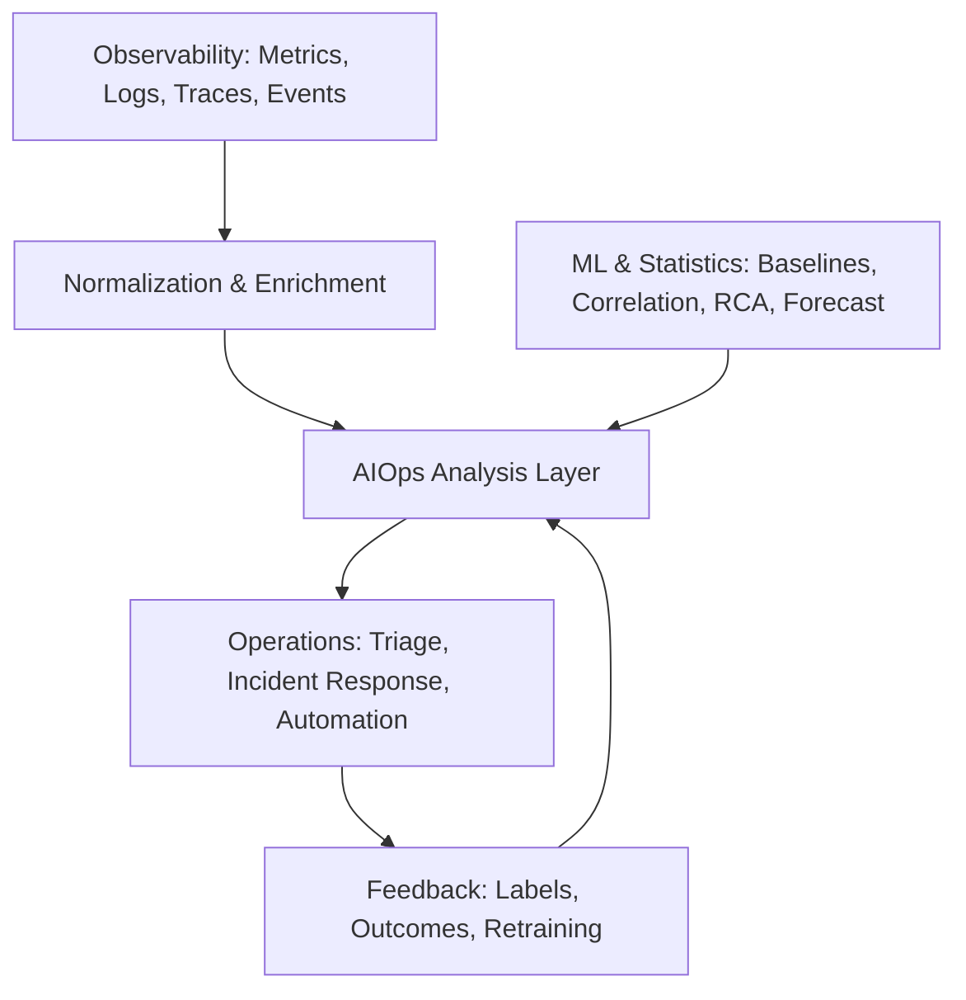
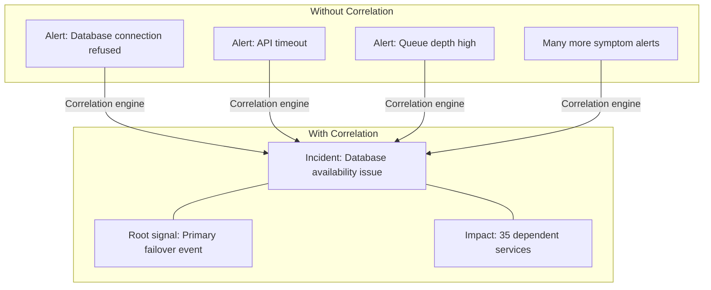
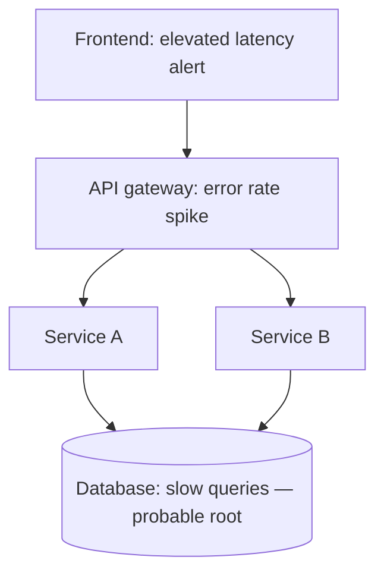
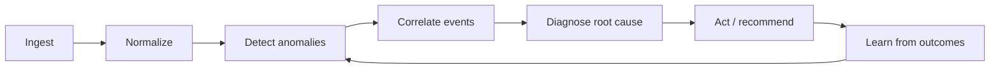
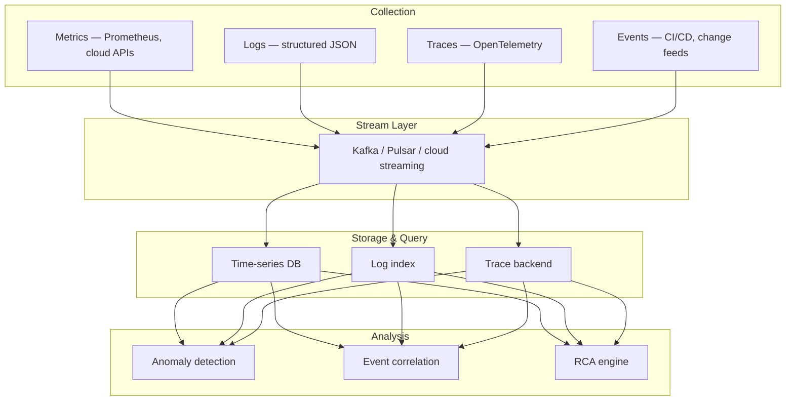
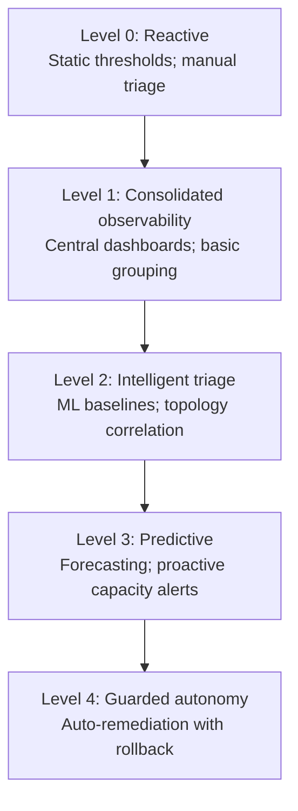
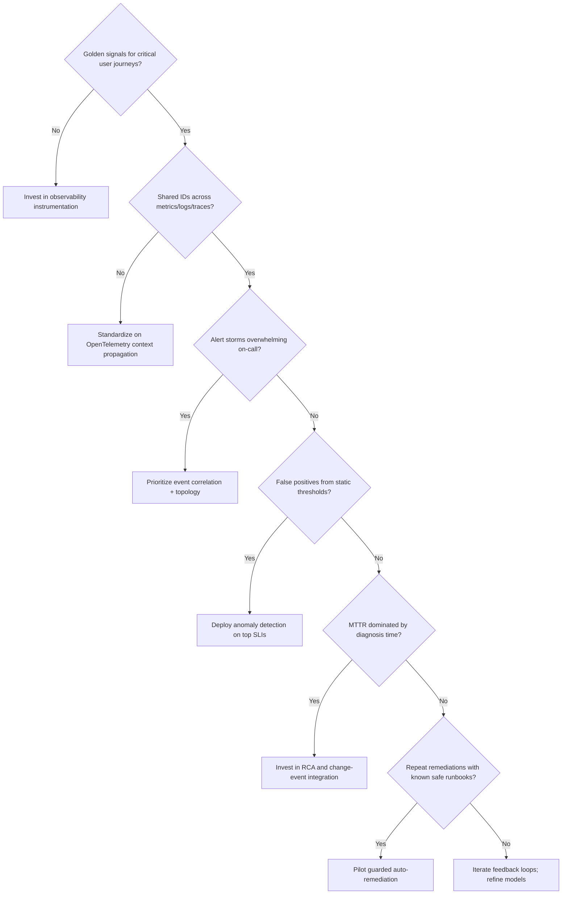

> **Discipline Track** | Complexity: `[MEDIUM]` | Time: 35-40 min

## Prerequisites

Before starting this module:
- [Observability Theory](/platform/foundations/observability-theory/) — Understanding of metrics, logs, traces
- [SRE Fundamentals](/platform/disciplines/core-platform/sre/module-1.1-what-is-sre/) — Incident management basics
- Basic understanding of machine learning concepts

## What You'll Be Able to Do

After completing this module, you will be able to:

- **Evaluate AIOps maturity levels to identify where AI-driven operations can deliver the most value**
- **Design an AIOps architecture that integrates with existing monitoring, logging, and alerting systems**
- **Implement data pipelines that feed operational telemetry into ML models for automated analysis**
- **Analyze the ROI of AIOps investments by measuring reduction in alert noise, MTTR, and manual toil**

## Why This Module Matters

Modern distributed systems generate operational data far faster than humans can read, let alone interpret. A modest Kubernetes cluster alone can emit millions of time-series samples per minute, gigabytes of structured and unstructured logs, thousands of distributed traces, and a continuous stream of change events from deployments, autoscaling, and infrastructure failures. Traditional monitoring was built for a world where a datacenter had dozens of servers and an operator could hold the entire topology in working memory. That mental model collapses the moment you adopt microservices, ephemeral containers, multi-region deployments, and third-party dependencies whose behavior you do not control.

The operational consequence is not merely inconvenience — it is a systematic failure mode. Static thresholds fire on every traffic spike. Cascading failures produce alert storms where hundreds of downstream symptoms obscure a single upstream root cause. On-call engineers spend the first thirty to sixty minutes of major incidents manually correlating dashboards, log queries, and topology diagrams before they even begin mitigation. Google’s Site Reliability Engineering practice describes this as the gap between *knowing something is wrong* and *knowing what to do about it* — and that gap widens with every service you add.

AIOps — Artificial Intelligence for IT Operations — addresses this gap by applying machine learning, statistics, and analytics to the full spectrum of operational data. The goal is not to remove humans from incident response but to give them capabilities they lack at scale: ingesting cross-domain telemetry in real time, learning adaptive baselines instead of brittle thresholds, correlating related events into coherent incidents, suggesting probable root causes using topology and causality, and eventually driving guarded automation. Gartner, who coined the term in 2017, originally framed AIOps as a platform approach combining big data management with machine learning for IT operations — an umbrella practice, not a single product category.

> **Hypothetical scenario:** A payment platform runs roughly 80 microservices on Kubernetes across two regions. At 03:00, a primary database node fails over. Within three minutes the monitoring stack generates roughly 2,000 separate alerts: connection pool exhaustion in twelve services, HTTP 500 errors at the API gateway, queue depth warnings, synthetic check failures, and pod restart loops. The on-call engineer pages through dashboards for 40 minutes before identifying the database failover as the root cause. With topology-aware event correlation, those 2,000 alerts collapse into one incident — “database primary failover affecting 35 dependent services” — and the responder can focus immediately on validation and recovery rather than forensic triage.

This module teaches the durable foundations: what AIOps is, why it exists, how its capabilities compose into a pipeline, what data you need before any algorithm can help, and how to evaluate maturity and investment without treating vendor marketing as engineering truth. Later modules in this sub-track go deep on anomaly detection (6.2), event correlation (6.3), root-cause analysis (6.4), predictive operations (6.5), and auto-remediation (6.6). Here you build the mental model those techniques plug into. Keep that pipeline mental model visible when evaluating vendor demos: ask which stage each feature serves, what evidence it shows operators, and how feedback from your environment retrains or retunes the behavior over time.

## What AIOps Is — and What It Is Not

AIOps sits at the intersection of observability, data engineering, and operations automation. Observability supplies the raw material — metrics, logs, traces, events, and dependency topology. Data engineering normalizes, enriches, and routes that material through stream processors and time-series stores so it can be queried consistently. Machine learning and statistical methods extract patterns: learned baselines, correlated incident groups, probable root causes, and forecasts. Operations automation closes the loop by triggering runbooks, tickets, or remediation actions under human-defined guardrails.


```mermaid
flowchart TD
    O[Observability: Metrics, Logs, Traces, Events] --> N[Normalization & Enrichment]
    N --> A[AIOps Analysis Layer]
    M[ML & Statistics: Baselines, Correlation, RCA, Forecast] --> A
    A --> P[Operations: Triage, Incident Response, Automation]
    P --> F[Feedback: Labels, Outcomes, Retraining]
    F --> A
```

AIOps is not a replacement for SRE fundamentals. Service level objectives, error budgets, golden signals, and well-designed alerting policies remain essential. AIOps augments them by handling volume and complexity that rule-based systems cannot. It is also not magic: models trained on incomplete or mislabeled data will confidently produce wrong answers. Treating a vendor dashboard as proof of intelligence without understanding the underlying methods is how teams end up with expensive noise generators instead of operational leverage.

The term has always been broad. Gartner’s framing emphasizes platforms that ingest heterogeneous operational data at scale and apply AI/ML to improve analysis and automation. In practice, organizations assemble capabilities from commercial platforms, open-source components (Prometheus, OpenTelemetry, Kafka, scikit-learn, Prophet), and custom pipelines. The durable lesson is architectural: separate ingestion, analysis, and action layers so you can evolve each independently as tools change.

## The Five Core AIOps Capabilities

Every AIOps implementation, regardless of vendor, maps to a small set of durable capabilities. Think of them as stages in a pipeline rather than isolated features. Data flows forward; feedback flows backward as operators confirm or reject suggestions and as systems change.

### Capability 1: Data Ingestion and Normalization

Before any algorithm runs, operational data must be collected from siloed sources — infrastructure monitors, APM agents, log aggregators, cloud provider APIs, CI/CD systems, configuration databases — and converted into a consistent schema. Normalization includes timestamp alignment, common resource identifiers (service name, pod, host, trace ID), severity mapping, and deduplication of identical events replayed across channels. Without this layer, correlation algorithms see unrelated strings instead of a unified incident timeline.

High-cardinality metrics and unstructured log text are both valuable and dangerous. Cardinality explosions can overwhelm time-series databases; inconsistent log formats break NLP-based correlation. OpenTelemetry has emerged as the durable open standard for instrumenting applications and exporting metrics, logs, and traces with shared context propagation — so a spike in latency on a trace span can be joined to the exact log lines and pod metrics that explain it. The CNCF graduated OpenTelemetry project specifically because vendor-specific agents do not survive multi-cloud, multi-team environments.

### Integrating Change Events

Operational telemetry without change context is incomplete. A latency spike that coincides with a deployment is a different incident class than a spike during steady state — yet both look identical on a dashboard line. Change events include application releases, feature-flag toggles, autoscaling actions, certificate rotations, DNS updates, and vendor maintenance windows. Ingesting them into the same timeline as metrics and alerts lets correlation engines down-rank alerts explained by expected change and prioritize unexplained deviations.

Change integration also accelerates post-incident review. When an RCA engine can answer “what changed in the hour before error rate doubled,” operators start diagnosis at the most probable lever rather than searching blindly. Kubernetes emits many change signals natively — pod creation, image updates, ConfigMap edits — but business-level changes (pricing rule updates, marketing campaigns driving traffic) often live outside the cluster. A durable AIOps architecture reserves a change-event channel that non-platform teams can write to, not only infrastructure automation.

### Supervised, Unsupervised, and Semi-Supervised Learning

AIOps pipelines use all three learning paradigms, often simultaneously on different stages. Unsupervised methods — Isolation Forest, autoencoders, clustering — discover anomalies without labeled failure examples, which suits rare incident types you cannot afford to wait for in training data. Supervised methods — classification models predicting incident severity, gradient-boosted trees ranking RCA candidates — need labeled historical incidents and improve when postmortems record which alert was truly causal. Semi-supervised approaches start unsupervised and incorporate operator feedback (accept, merge, split, dismiss) as weak labels over time.

Choosing the paradigm follows data availability, not vendor defaults. If you have years of incidents with confirmed root causes in a ticket system, supervised RCA ranking is viable. If you are greenfield, begin with unsupervised anomaly detection on golden signals and build labels from on-call overrides. Mixing paradigms without documenting which model owns which decision creates opaque stacks where nobody knows why a page fired.

### Precision, Recall, and Alerting Tradeoffs

Anomaly detection and correlation both face class imbalance: real outages are rare compared to normal operation. Optimizing for recall — catching every incident — produces noisy pages that erode trust. Optimizing for precision — paging only when certain — risks missing subtle degradation until customers complain. Production systems express this tradeoff with precision, recall, and F1 score on held-out incident windows, plus operational metrics like pages per genuine outage.

There is no universal optimum. Payment systems may accept lower precision during peak season if missing fraud-related latency costs more than extra triage. Internal batch systems may prefer high precision because nightly jobs predictably spike metrics. Document the tradeoff explicitly per service tier and revisit after architecture changes cause concept drift. AIOps maturity includes tuning this curve quarterly, not installing a model once and forgetting it.

### Capability 2: Event Correlation and Deduplication

When a single root cause fails, dependent systems generate symptom alerts in parallel. A database failover might trigger connection errors in application servers, timeout alerts at load balancers, queue backlog warnings, and synthetic monitor failures — each firing as an independent page in a traditional stack. Event correlation groups related alerts into one incident based on time proximity, shared resources, topology dependencies, and sometimes text similarity on alert titles.

The operational value is immediate noise reduction. Instead of triaging 500 alerts sequentially, an on-call engineer receives one correlated incident with a timeline and impact summary. Module 6.3 covers correlation algorithms in depth; at this foundation level, remember that topology data — who depends on whom — is what separates meaningful grouping from arbitrary time-window bucketing.


```mermaid
flowchart TD
    subgraph Without Correlation
        A1[Alert: Database connection refused]
        A2[Alert: API timeout]
        A3[Alert: Queue depth high]
        A4[Many more symptom alerts]
    end
    subgraph With Correlation
        C1[Incident: Database availability issue]
        C2[Root signal: Primary failover event]
        C3[Impact: 35 dependent services]
        C1 --- C2
        C1 --- C3
    end
    A1 & A2 & A3 & A4 -->|Correlation engine| C1
```

### Capability 3: Anomaly Detection

Traditional monitoring asks whether a metric crossed a fixed threshold. Anomaly detection asks whether current behavior deviates from a learned model of normal — accounting for time of day, day of week, deployment-driven shifts, and gradual trend changes. Statistical methods (z-score, median absolute deviation, exponentially weighted moving averages) and machine learning approaches (Isolation Forest, autoencoders, seasonal decomposition) each trade simplicity against robustness to seasonality and multivariate relationships.

Static thresholds fail in two predictable ways. They generate false positives when normal traffic patterns exceed an arbitrary line — for example, API latency during daily peak that is healthy but above 500 ms. They miss slow degradation when a metric creeps upward over weeks but never crosses a threshold until users complain. Anomaly detection targets both failure modes by adapting to context. Module 6.2 is dedicated entirely to these methods; here, treat anomaly detection as the early-warning layer that feeds correlation and RCA with higher-quality signals.

### Capability 4: Root-Cause Analysis via Topology and Causality

Correlation tells you that alerts belong together; root-cause analysis (RCA) proposes *why* they fired. Effective RCA in distributed systems requires more than statistical correlation across metrics — two metrics can move together because of a hidden common cause or pure coincidence. Topology maps — service dependency graphs, deployment hierarchies, network paths — constrain the search space: if the database tier shows elevated latency and every upstream service shows errors, the database is a more plausible root than a leaf microservice with a single timeout.

Causal inference is harder than correlation and remains an active area of practice. Production systems combine topology traversal, change-event alignment (did a deployment precede the spike?), and ranking algorithms that score candidate causes by evidence strength. Module 6.4 explores RCA techniques; the foundation takeaway is that RCA without topology devolves into guesswork, and RCA without human validation devolves into automation of the wrong fix.


```mermaid
flowchart TD
    FE[Frontend: elevated latency alert] --> API[API gateway: error rate spike]
    API --> SA[Service A]
    API --> SB[Service B]
    SA --> DB[(Database: slow queries — probable root)]
    SB --> DB
```

### Capability 5: Automation and Auto-Remediation

The final capability closes the loop: once an incident is detected, correlated, and diagnosed, the system can suggest or execute responses. Low-risk actions — scaling a replica set, restarting a stuck worker, clearing a known cache key — may run automatically within guardrails that limit blast radius and require approval for production-critical paths. High-risk actions remain recommendations with links to runbooks until trust is earned through measured accuracy.

Graduated autonomy is the durable pattern. Open-loop automation fires actions without verification; closed-loop automation checks whether the metric recovered before declaring success. Human-in-the-loop gates remain mandatory during early maturity. Module 6.6 covers auto-remediation patterns; premature automation without correlation and RCA maturity automates mistakes at scale.

### How the Pipeline Composes

In a mature flow, telemetry enters normalization, anomaly detection flags deviations, correlation groups them into incidents, RCA ranks causes, and automation executes or recommends remediation — while feedback from operator actions and post-incident reviews retrains models and refines rules. No stage is optional for long-term value, but organizations typically gain the largest immediate return from correlation (noise reduction) once data ingestion is solid.


```mermaid
flowchart LR
    I[Ingest] --> N[Normalize]
    N --> D[Detect anomalies]
    D --> C[Correlate events]
    C --> R[Diagnose root cause]
    R --> A[Act / recommend]
    A --> L[Learn from outcomes]
    L --> D
```

## AIOps Versus Traditional Monitoring

Traditional monitoring answers a narrow question well: did a metric cross a line, or did a health check fail? That is sufficient for small, stable systems with few dependencies. It breaks down when alert volume scales with service count, when normal behavior is non-stationary, and when failures propagate through dependency graphs faster than humans can manually trace them.

| Aspect | Traditional Monitoring | AIOps-Assisted Operations |
|--------|------------------------|---------------------------|
| Detection | Static thresholds on individual metrics | Adaptive baselines; multivariate and contextual anomalies |
| Alerting | One event often equals one alert | Correlation collapses symptom storms into incidents |
| Analysis | Manual dashboard and log correlation | Automated grouping, topology-aware RCA suggestions |
| Scope | Per-tool silos (metrics here, logs there) | Cross-domain ingestion with shared identifiers |
| Learning | Rules updated manually by engineers | Models and baselines updated from ongoing telemetry |
| Response | Human-driven runbook execution | Human-guided or guarded automatic remediation |

Monitoring tells you *something is wrong*. AIOps helps with *what*, *where*, *why*, and *what to do next* — but only if the data foundation and operational processes exist to support it. Google’s SRE book emphasizes monitoring distributed systems through golden signals — latency, traffic, errors, and saturation — with alerting tied to user-visible symptoms rather than low-level causes. AIOps extends that philosophy by automating the cross-signal synthesis that SREs otherwise perform under stress at 03:00.

The comparison is not either-or. Prometheus scraping cAdvisor metrics and Alertmanager routing notifications remains a valid backbone. AIOps layers add value on top — ingesting Alertmanager webhooks alongside logs and traces, enriching them with topology, and reducing pager noise. Teams that skip solid monitoring and jump to an AIOps platform usually discover that the platform amplifies existing data quality problems rather than solving them.

## The Data Foundation

AIOps algorithms are only as good as the telemetry they consume. Garbage in produces confident garbage out — a model that learns your staging environment’s chaos and fires false positives in production, or a correlation engine that groups alerts randomly because service names do not match between metrics and logs.

### Observability Signals

The four canonical observability signals — metrics, logs, traces, and events — each serve a distinct role. Metrics provide continuous, low-latency aggregates suitable for anomaly detection and SLO tracking. Logs capture discrete, high-context records of what individual components decided and observed. Traces follow requests across service boundaries, exposing where latency accumulates. Events mark changes: deployments, feature flags, scaling actions, certificate rotations, and vendor incidents.

OpenTelemetry standardizes how applications emit all three pillars with correlated context. A trace ID propagated from an HTTP header into log records and metric exemplars lets an AIOps pipeline join signals without brittle regular expressions. If your organization still relies on ad hoc log formats per team, normalization cost will dominate your first year of AIOps investment — fix instrumentation before buying intelligence.

### Topology and Dependency Data

Service dependency graphs are the backbone of correlation and RCA. Sources include service meshes, APM-discovered call graphs, manually curated configuration management databases, and infrastructure-as-code repositories. Stale topology is worse than none: it confidently points RCA at decommissioned services. Treat dependency data as a living asset with ownership, validation, and change detection — not a one-time diagram from a migration project.

### Data Quality Dimensions

Several dimensions determine readiness: completeness (are golden signals present for every critical path?), consistency (do identifiers align across signals?), labeling (can you distinguish canary from production?), cardinality control (will a new label explode storage?), and historical depth (do you have enough baseline data for seasonality?). Module 6.2’s anomaly detectors need weeks of clean history; correlation benefits from months of labeled incidents if you want supervised refinement.

## Building the Data Pipeline

Implementing data pipelines that feed operational telemetry into ML models is the engineering backbone of AIOps. A typical architecture streams metrics, logs, traces, and events through a message bus or stream processor, lands them in queryable stores, and exposes features to detection and correlation services.


```mermaid
flowchart TD
    subgraph Collection
        M[Metrics — Prometheus, cloud APIs]
        L[Logs — structured JSON]
        T[Traces — OpenTelemetry]
        E[Events — CI/CD, change feeds]
    end
    subgraph Stream Layer
        SP[Kafka / Pulsar / cloud streaming]
    end
    subgraph Storage & Query
        TS[Time-series DB]
        LS[Log index]
        TS2[Trace backend]
    end
    subgraph Analysis
        AD[Anomaly detection]
        EC[Event correlation]
        RCA[RCA engine]
    end
    M & L & T & E --> SP
    SP --> TS & LS & TS2
    TS & LS & TS2 --> AD & EC & RCA
```

Prometheus remains the durable open-source standard for pull-based metrics collection and PromQL analysis. Functions like `rate()` for counter derivatives and `predict_linear()` for simple extrapolation appear frequently in operational forecasting examples — though production AIOps more often exports Prometheus data to dedicated ML pipelines than runs complex models inside the scraper. OpenTelemetry collectors can receive, process, and export telemetry to multiple backends simultaneously, which decouples instrumentation from storage vendor choices.

Feature engineering for ML models transforms raw telemetry into model inputs: rolling means, seasonality-adjusted residuals, cross-service error ratios, and deployment-aware before/after windows. Batch pipelines (nightly retraining on historical incidents) and streaming pipelines (real-time scoring on incoming metrics) coexist in most organizations. Start with batch anomaly scoring on a handful of critical SLIs before attempting real-time multivariate models — the pipeline complexity grows quickly.

### PromQL and Operational Feature Extraction

Even when ML scoring runs outside Prometheus, PromQL remains the lingua franca for extracting operational features from scraped metrics. The `rate()` function converts monotonically increasing counters into per-second rates — essential for request throughput and error counters that reset on pod restart. `increase()` over bounded windows approximates event counts for SLO burn calculations. `predict_linear()` extrapolates simple trends for disk or queue growth, useful as a teaching analogue for forecasting though production teams often prefer dedicated seasonal models like Prophet for weekly patterns.

Recording rules precompute expensive queries so detection jobs read stable metric names instead of re-parsing high-cardinality labels every scoring interval. When exporting Prometheus data to Python pipelines, the remote write or federation path preserves label sets that must align with OpenTelemetry resource attributes — mismatched `service.name` labels between systems break joins that correlation depends on. Treat PromQL layers as part of the data pipeline contract, not an ad hoc dashboard convenience.

### Stream Processing and Backpressure

At scale, operational telemetry arrives as continuous streams rather than batch files. Message buses like Kafka or cloud-native equivalents decouple producers (instrumented services, agents) from consumers (anomaly scorers, correlators, archival stores). Backpressure handling matters: if detection lag exceeds alert relevance, pages arrive about problems that already resolved. Monitor consumer lag as a first-class SLO on the AIOps pipeline itself — the observability of observability is not meta-humor, it is how you detect that your noise-reduction system silently stopped consuming events.

## Human-in-the-Loop and Trust

AIOps augments operators; it does not replace accountability. Every automated suggestion — correlated incident grouping, probable root cause, recommended runbook — should be traceable to evidence the operator can inspect. Black-box models that page on opaque scores erode trust faster than transparent rules, because operators cannot distinguish a genuine anomaly from a misfit model after a deployment changed traffic patterns.

False positives carry a human cost that MTTR spreadsheets undercount. Alert fatigue causes teams to mute channels, raise thresholds until real failures hide, and burn out on-call rotations. AIOps programs succeed when they measure noise reduction and track how often operators accept versus override suggestions. An override is valuable feedback data, not a failure — it labels the model’s mistake for the next training cycle.

Explainability trades precision for adoption. A correlation engine that says “grouped because shared dependency on `payments-db` and temporal overlap within 120 seconds” teaches the operator something. One that says “ML confidence 0.87” does not. Design interfaces that show topology paths, contributing alerts, and recent change events alongside the conclusion.

Automation autonomy should graduate in stages: suggest → approve with one click → auto-execute in non-production → auto-execute for narrowly scoped production actions with automatic rollback. Skipping stages produces headline-grabbing incidents when a runbook restarts the wrong pods globally.

## The AIOps Maturity Model

Organizations progress through recognizable maturity levels. Evaluating where you sit honestly — not where a vendor slide says you could be — determines where investment returns the most value.


```mermaid
flowchart TD
    L0["Level 0: Reactive<br/>Static thresholds; manual triage"] --> L1["Level 1: Consolidated observability<br/>Central dashboards; basic grouping"]
    L1 --> L2["Level 2: Intelligent triage<br/>ML baselines; topology correlation"]
    L2 --> L3["Level 3: Predictive<br/>Forecasting; proactive capacity alerts"]
    L3 --> L4["Level 4: Guarded autonomy<br/>Auto-remediation with rollback"]
```

**Level 0 — Reactive:** Alerts fire independently from siloed tools. Incident response depends on engineer memory and manual correlation. Most organizations still have pockets here even after buying modern tools — usually because data integration was never finished.

**Level 1 — Consolidated observability:** Metrics, logs, and traces live in shared platforms with basic time-based alert grouping. Value comes from visibility, not intelligence. You cannot skip this level — it is the prerequisite data foundation.

**Level 2 — Intelligent triage:** Machine-learned baselines reduce false positives. Topology-aware correlation collapses alert storms. Probable-cause suggestions appear but require validation. For most teams, Level 2 delivers the largest step-change in on-call quality because noise reduction is immediately measurable.

**Level 3 — Predictive:** Forecasting detects disk-full weeks ahead, anticipates saturation before SLO breach, and surfaces leading indicators. Requires stable historical data and careful handling of concept drift when architecture changes.

**Level 4 — Guarded autonomy:** Automated remediation executes within policy boundaries, verifies recovery, and rolls back on failure. Rare in production for stateful systems; more common for horizontal scaling and known transient failures.

Attempting Level 3 algorithms on Level 0 data produces expensive demos, not operations. Evaluate maturity per capability (ingestion, correlation, detection, RCA, automation) rather than as a single score — you may be Level 2 for metrics and Level 0 for logs. Document that per-capability score in writing before budget conversations so stakeholders see concrete prerequisites instead of a single aspirational “AI maturity” percentage on a slide deck.

## Measuring AIOps Value and ROI

Analyzing the ROI of AIOps investments requires defining baselines before deployment and tracking operational metrics that finance and engineering leaders both accept. Vanity metrics — “AI analyzed ten million events” — do not justify renewal fees. Useful measures tie directly to outcomes your organization already tracks.

**Alert noise reduction** compares actionable alerts per week before and after correlation and anomaly tuning. Measure the ratio of incidents requiring human investigation to total alerts fired, not raw alert count alone — suppressing alerts without fixing detection just hides problems.

**Mean time to resolve (MTTR)** should segment by incident type. AIOps often shrinks detection and triage time dramatically while leaving remediation time unchanged if runbooks are immature. Report P50 and P90 separately; outliers reveal correlation gaps.

**Manual toil hours** capture time spent on repetitive triage tasks that SRE practice calls toil — work that scales linearly with traffic and adds no enduring value. If engineers spend twenty hours per week manually correlating logs during incidents, automating that triage has a clear hourly savings estimate without inventing industry-wide statistics.

**Model quality metrics** — precision, recall, and F1 score for anomaly detection under class imbalance — prevent over-trusting noisy detectors. A detector that pages on every anomaly with 30% precision still wastes on-call attention. Track override rates on RCA suggestions and auto-remediation success with rollback frequency.

ROI calculation combines avoided downtime (using your organization’s own cost model), saved engineer hours, and platform licensing minus integration and data storage costs. Present ranges and assumptions explicitly rather than single-point fiction. Hypothetical scenarios with round numbers are acceptable for teaching; fabricated company case studies are not.

## Limitations and Pitfalls

AIOps does not eliminate the need for reliable systems, clear ownership, or blameless postmortems. Several pitfalls recur across vendors and home-grown stacks.

**Cold start:** New services lack historical baselines. Deployments need warmup periods or transfer learning from similar services before anomaly detection is trustworthy.

**Concept drift:** When traffic patterns, architecture, or business models change, yesterday’s normal becomes today’s false positive flood. Models require retraining pipelines and drift monitoring — not one-time training.

**Label scarcity:** Supervised RCA and correlation refinement need labeled incidents. Many organizations never record which alert was the true root cause, starving feedback loops.

**Over-automation:** Executing remediation before correlation and RCA mature scales mistakes globally. Guardrails and blast-radius limits are non-negotiable.

**Black-box trust:** Operators who cannot inspect reasoning will disable features after the first bad page. Invest in explainability alongside algorithm sophistication.

**SLO neglect:** Detecting anomalies on low-level CPU metrics while user-facing SLOs remain undefined optimizes the wrong objective. Align AIOps targets with golden signals and error budgets from SRE practice.

### When AIOps Is the Wrong First Move

Teams sometimes reach for AIOps because dashboards feel overwhelming, when the actual problem is missing ownership, undefined SLOs, or uncontrolled alert rule sprawl. If every team can add Prometheus alert rules without review, no correlation engine fixes the resulting chaos — it merely groups unrelated pages into bigger buckets. Similarly, if post-incident reviews never happen, labeled feedback never accumulates and ML features stagnate at demo quality.

Another misstep is instrumenting vanity metrics — cluster node counts, pod restarts without service context — while user journeys lack end-to-end latency and error measurement. AIOps on low-signal metrics produces confident alerts about infrastructure trivia during customer-visible outages. The corrective action is boring operational hygiene: golden signals per critical path, alert policies tied to symptoms, blameless postmortems with recorded root causes. AIOps amplifies a healthy observability culture; it does not substitute for one.

### Organizational Readiness Signals

Technical readiness without organizational readiness produces shelfware. Useful signals that both sides are aligned include: an on-call rotation with documented escalation paths; incident commanders trained to accept correlated incident groupings; change management that emits structured deployment events; and executive sponsorship measured by reduced toil rather than by tool installation milestones. If operators distrust automation because a previous “self-healing” script caused an outage, rebuild trust with suggest-only modes and transparent evidence before reintroducing autonomy.

## Patterns and Anti-Patterns

### Patterns That Work

**Pattern: Fix observability before algorithms.** Centralize metrics, logs, and traces with shared trace IDs and service naming conventions. Normalization is unglamorous engineering that determines every downstream success.

**Pattern: Start with correlation on high-churn alert sources.** Payment paths, authentication, and primary databases generate the worst alert storms. Correlating those first proves value to skeptics.

**Pattern: Graduated automation with closed-loop verification.** Auto-scale only after detecting an anomaly, executing the action, and confirming saturation dropped — rollback if not.

**Pattern: Feed post-incident reviews back into models.** Record confirmed root causes and link them to alert IDs. This labeled dataset separates Level 2 from Level 3 maturity.

**Pattern: Durable spine, dated tool snapshots.** Teach methods and pipeline architecture; quarantine vendor feature lists in dated tables you refresh quarterly.

### Anti-Patterns to Avoid

**Anti-pattern: Platform purchase without data strategy.** Buying correlation software when logs are unstructured text in twelve formats imports noise faster than insight.

**Anti-pattern: Threshold sprawl disguised as ML.** Static thresholds wrapped in a vendor “AI” label without adaptive baselines or cross-signal context.

**Anti-pattern: Topology rot.** Dependency maps copied once from a wiki and never updated — RCA points at retired services while engineers distrust the tool.

**Anti-pattern: Precision blindness.** Optimizing for recall (“never miss an incident”) without measuring precision (“how many pages were false”) destroys on-call morale.

**Anti-pattern: Autonomous remediation on day one.** Runbooks that restart production databases without human approval because a demo looked impressive in a POC environment.

**Anti-pattern: Metric shopping.** Reporting only alert volume reduction while MTTR and customer-impact metrics stay flat — noise moved, outcomes did not.

## Decision Framework: Where to Invest First

Use this framework when prioritizing AIOps capabilities. Answer each question in order; the first “no” or “weak” step is where engineering effort belongs before advancing.


```mermaid
flowchart TD
    Q1{Golden signals for critical user journeys?}
    Q1 -->|No| A1[Invest in observability instrumentation]
    Q1 -->|Yes| Q2{Shared IDs across metrics/logs/traces?}
    Q2 -->|No| A2[Standardize on OpenTelemetry context propagation]
    Q2 -->|Yes| Q3{Alert storms overwhelming on-call?}
    Q3 -->|Yes| A3[Prioritize event correlation + topology]
    Q3 -->|No| Q4{False positives from static thresholds?}
    Q4 -->|Yes| A4[Deploy anomaly detection on top SLIs]
    Q4 -->|No| Q5{MTTR dominated by diagnosis time?}
    Q5 -->|Yes| A5[Invest in RCA and change-event integration]
    Q5 -->|No| Q6{Repeat remediations with known safe runbooks?}
    Q6 -->|Yes| A6[Pilot guarded auto-remediation]
    Q6 -->|No| A7[Iterate feedback loops; refine models]
```

| Decision | Choose build/custom when… | Choose integrated platform when… |
|----------|----------------------------|----------------------------------|
| Correlation engine | Unique topology sources; strong platform engineering | Standard microservice stack; need fast time-to-value |
| Anomaly detection | Deep in-house ML; unusual signal types | Typical metrics/logs; want maintained models |
| Full AIOps stack | Strict data residency; bespoke integrations | Small ops team; limited ML staffing |
| Open-source core | Budget constraints; existing Prometheus/Grafana skills | Need vendor support SLAs for executive buy-in |

Neither column is universally correct. Many organizations run Prometheus and OpenTelemetry for ingestion, commercial correlation for alert storms, and scikit-learn or Prophet for custom metric forecasting — hybrid architectures are normal.

### Security, Privacy, and Data Residency

AIOps pipelines aggregate sensitive operational data — request paths, customer identifiers in logs if instrumentation is careless, internal service names, failure modes that reveal architectural weaknesses. Before routing telemetry to commercial SaaS platforms, classify data flows against privacy policies and regulatory constraints. Some teams keep raw logs on-premises while exporting aggregated metrics and anonymized alert features to cloud correlators. OpenTelemetry processors can scrub or hash high-cardinality labels at collection time so downstream stores never see prohibited fields.

Access control on AIOps consoles matters as much as on production databases. Correlated incidents expose blast-radius maps that attackers find valuable. Role-based views, audit logs on automated remediation actions, and separation between read-only triage and execute permissions reduce risk. These are not optional compliance checkboxes — they determine whether security teams block your AIOps rollout entirely.

### Feedback Loops and Continuous Improvement

The pipeline diagram in this module closes with a “learn from outcomes” stage that too many deployments omit. Every operator override — splitting an incorrectly merged incident, marking an RCA suggestion wrong, snoozing a noisy detector — is training signal. Capture overrides in structured form linked to alert IDs and incident tickets. Review override rates weekly during early rollout; spike investigation often reveals misconfigured topology or a deployment that shifted baselines.

Quarterly, replay historical incidents against the current pipeline configuration and measure whether time-to-diagnosis would have improved. This offline evaluation avoids waiting for the next real outage to learn that a model regressed. Continuous improvement treats AIOps like any other production service with SLOs, on-call rotation for the pipeline itself, and postmortems when the noise-reduction system fails silently.

## Landscape Snapshot and Capability Rosetta

> **Landscape snapshot — as of 2026-06. This changes fast; verify against vendor docs before relying on specifics.**

Commercial platforms reposition features frequently. The table below maps **durable capabilities** (rows) to **example platforms** (columns) as peers compared by function — not rank. Use it to translate vendor language into architectural concepts you already understand. Dynatrace Davis, Datadog Watchdog, Splunk IT Service Intelligence, BigPanda, Moogsoft, PagerDuty AIOps, and Grafana machine learning features are illustrative examples, not endorsements.

| Capability | Dynatrace Davis | Datadog Watchdog | Splunk ITSI | BigPanda | Moogsoft | PagerDuty AIOps | Grafana ML |
|------------|-----------------|------------------|-------------|----------|----------|-----------------|------------|
| Cross-domain ingestion | Unified agent + OneAgent pipeline | Metrics/logs/traces/apm | Splunk data platform | Alert & event aggregation | Event ingestion hub | Integrations ecosystem | Prometheus/Loki/Tempo stack |
| Correlation & noise reduction | Causal AI correlation | Watchdog storylines | Episode review / MLTK | Alert correlation | Situation clustering | Event intelligence | Alert grouping rules + ML |
| Anomaly detection | Automatic baselines | Watchdog anomalies | MLTK time-series | Limited native; partner | Algorithm packs | AIOps insights | Grafana ML forecasting |
| Topology-aware RCA | Smartscape dependency map | Service map | Service analyzer | Topology ingestion | Vertex correlation | Service graph | Service map / k8s meta |
| Automation hooks | Workflow automation | Case management integrations | SOAR connectors | Open integration hub | Workflow engine | Runbook automation | On-call + webhook actions |

Open-source components fill gaps: Prometheus for metrics, OpenTelemetry for instrumentation, Kafka for streaming, scikit-learn Isolation Forest for multivariate anomaly scoring, Prophet for seasonal forecasting. The Isolation Forest algorithm (Liu, Ting, and Zhou, 2008) isolates anomalies by random partitioning — anomalies require fewer splits to isolate — and remains a practical baseline referenced in Module 6.2. When comparing vendor cells in the Rosetta, verify the specific integration against your stack in a proof-of-concept rather than assuming feature parity from marketing summaries alone. Capability names sound similar across vendors; behavior under your cardinality and topology often differs.

## Build Versus Buy — Engineering Tradeoffs

Building a custom AIOps stack offers maximum control over data residency, feature selection, and integration with internal identity and change systems. It demands sustained investment in data engineering, ML operations, and on-call tooling — typically months before measurable noise reduction. Buying a platform accelerates time-to-value for standard architectures but introduces licensing cost, integration constraints, and vendor-specific data models that may not export cleanly.

| Factor | Build (custom + open source) | Buy (commercial platform) |
|--------|------------------------------|---------------------------|
| Time to first value | Months to a year | Weeks to months |
| Customization | Full control | Constrained by product APIs |
| Staffing | ML + data + SRE engineering | Integration + vendor management |
| Data control | Complete | Depends on deployment model |
| Long-term cost | Engineering salaries + infra | Licenses + still some integration |

Hybrid approaches are common: open-source ingestion with commercial correlation, or platform correlation with custom Prophet models for capacity forecasting. Decide based on your team’s skills and the uniqueness of your telemetry — not based on marketing claims about artificial intelligence leadership.

## Did You Know?

- **Gartner coined the term “AIOps” in 2017**, describing platforms that combine big data and machine learning to enhance IT operations — the acronym originally stood for “Algorithmic IT Operations” before the industry converged on “Artificial Intelligence for IT Operations.”
- **The Isolation Forest algorithm**, published by Liu, Ting, and Zhou in 2008, remains a widely used unsupervised anomaly detection method because it scales to high-dimensional metrics without requiring labeled failure examples.
- **OpenTelemetry is a CNCF graduated project** providing vendor-neutral APIs and collectors for metrics, logs, and traces — the most durable anchor for cross-signal AIOps pipelines in multi-vendor environments.
- **Google’s SRE book defines four golden signals** — latency, traffic, errors, and saturation — as the minimum monitoring set for user-facing systems; AIOps models work best when anchored to these signals rather than raw infrastructure counters alone.

## Common Mistakes

| Mistake | Problem | Solution |
|---------|---------|----------|
| Buying a platform before fixing observability | Models ingest inconsistent, incomplete telemetry and amplify noise | Standardize golden signals, structured logs, and trace propagation first |
| Expecting accurate ML from day one without history | Anomaly detectors and forecasters need baseline periods; cold start generates false positives | Plan warmup windows; use robust statistical baselines until history accumulates |
| Over-automating remediation before correlation matures | Automated actions execute on wrong diagnoses, increasing blast radius | Graduate autonomy: suggest → approve → scoped auto-execute with rollback |
| Ignoring topology and dependency data | Correlation groups alerts arbitrarily; RCA suggests implausible causes | Maintain live service graphs from mesh, APM, or CMDB with ownership |
| Treating AIOps as a one-time project | Architecture and traffic evolve; unmaintained models drift | Budget continuous retraining, override review, and quarterly snapshot updates |
| Optimizing alert count instead of actionable incidents | Suppressed alerts hide real failures; metrics look improved while MTTR stays flat | Track precision, override rates, and user-visible SLO impact |
| Chasing vendor AI branding without evaluating methods | “AI-powered” dashboards may repackage static thresholds | Ask which algorithms run, on which signals, with what evidence shown to operators |
| No labeled feedback from post-incident reviews | Supervised improvement stalls; same mistakes repeat | Record confirmed root causes linked to alert IDs after every significant incident |

## Quiz

The questions below mix conceptual reasoning with operational scenarios you are likely to encounter when evaluating platforms, designing pipelines, or presenting ROI to leadership. Read each scenario fully before opening the answer — the details matter for choosing correlation versus detection investments.

<details>
<summary>1. Your e-commerce platform spans 50 microservices on Kubernetes. During a peak traffic event, a networking issue causes intermittent packet loss, triggering thousands of alerts across metrics, logs, and traces within minutes. Why is manual triage with traditional siloed monitoring insufficient?</summary>

**Answer**: The volume and velocity of cross-domain telemetry exceed human working memory and sequential dashboard review. An on-call engineer cannot simultaneously hold latency spikes, connection errors, and synthetic failures across fifty services in mind long enough to infer a network-layer root cause. By the time manual log and metric correlation completes, user-visible impact has already widened. AIOps addresses this by ingesting the full stream, applying topology-aware correlation, and presenting a single incident narrative. This directly supports designing an AIOps architecture that integrates existing monitoring, logging, and alerting into one analysis path rather than leaving signals in disconnected tools.
</details>

<details>
<summary>2. Your organization relies on static CPU thresholds and on-call engineers report severe alert fatigue from nightly batch jobs that predictably spike utilization. Which maturity transition delivers the most immediate relief, and what capability enables it?</summary>

**Answer**: Moving from Level 1 (consolidated observability with static thresholds) to Level 2 (intelligent triage) delivers the fastest relief because ML-based anomaly detection learns that nightly batch spikes are normal for each day of the week. Static thresholds treat every spike as exceptional. Seasonality-aware baselines and cross-system correlation convert hundreds of predictable warnings into silent acceptance or a single informational incident. Evaluating maturity levels honestly shows that your bottleneck is detection quality, not automation — so invest in anomaly detection on critical SLIs before predictive or auto-remediation features.
</details>

<details>
<summary>3. A primary database node fails over. Payment services log connection timeouts, the API gateway reports HTTP 500 errors, and a message queue depth alert fires — all within two minutes. What happens without event correlation, and what changes with topology-aware correlation?</summary>

**Answer**: Without correlation, each symptom becomes an independent page. The responder investigates payment, gateway, and queue issues in parallel, wasting time before recognizing shared dependency on the database tier. Topology-aware correlation groups alerts that share upstream dependencies and temporal overlap, producing one incident with an explicit impact set. The on-call engineer starts validation at the database layer instead of triaging leaf services. This is the foundational capability that makes later root-cause analysis and auto-remediation trustworthy — grouping must be correct before diagnosis or action.
</details>

<details>
<summary>4. You need to implement data pipelines feeding Prometheus metrics and OpenTelemetry traces into an anomaly detection service. Which architectural layers are essential, and why must normalization precede ML scoring?</summary>

**Answer**: Essential layers include collection (Prometheus scrape, OTel export), streaming or batch transport, time-series and trace storage, feature engineering, and the scoring service. Normalization must precede ML because raw alerts and metrics arrive with inconsistent timestamps, service names, and severity scales — a detector trained on misaligned identifiers learns spurious patterns. OpenTelemetry context propagation joins traces to metrics and logs so features like error-rate-per-deployment are computable. Implementing this pipeline is prerequisite to any AIOps algorithm; without it, models operate on garbage and confidence scores mislead operators.
</details>

<details>
<summary>5. Leadership asks for ROI justification before renewing an AIOps platform license. Which metrics should you present, and which should you avoid?</summary>

**Answer**: Present before-and-after actionable alert ratio, MTTR split by triage versus remediation phase, on-call toil hours spent on manual correlation, and operator override rates on correlated incidents — all using your organization’s measured baselines. Include precision/recall for anomaly detectors if available. Avoid invented industry averages, unsourced percentage improvements, and raw alert volume alone (which can improve by hiding real problems). Analyzing ROI this way ties investment to outcomes executives and engineers already agree matter: fewer false pages, faster diagnosis, and protected SLOs — not vanity counts of events processed.
</details>

<details>
<summary>6. A vendor demo shows autonomous remediation restarting pods after anomaly detection fires. Your team runs stateful payment services with strict change control. Should you enable this feature immediately?</summary>

**Answer**: No — auto-remediation without mature correlation, RCA, and closed-loop verification automates mistakes at scale on critical stateful paths. Graduated autonomy requires proven accuracy on suggestions, narrow blast-radius policies, rollback automation, and success metrics tracked over weeks. For payment services, start with suggest-only mode where the platform recommends a runbook link and evidence bundle. Enable scoped auto-execute only for known-safe actions (for example, clearing a CDN cache in staging) before production restart automation. Human-in-the-loop trust is built incrementally, not declared in a POC.
</details>

<details>
<summary>7. After a major release, anomaly detection false positives triple even though traffic looks normal to operators. What is the most likely cause, and what operational response is appropriate?</summary>

**Answer**: Concept drift — the release changed traffic shape, dependency latency, or error semantics so historical baselines no longer represent normal. This is expected when architecture or behavior shifts. Response includes marking the release window in training data, retraining or resetting baselines after a warmup period, temporarily raising confirmation thresholds, and reviewing overrides to label false positives for the next cycle. Treat drift as a maintenance event, not a one-time model bug; AIOps pipelines need the same change management discipline as the services they monitor.
</details>

<details>
<summary>8. Two metrics — API error rate and database connection pool utilization — rise together during incidents. Why is correlation alone insufficient to claim the database caused API errors?</summary>

**Answer**: Correlation measures co-movement, not causation. Both metrics might rise because of a common upstream cause (network partition), a downstream effect chain, or coincidence during unrelated concurrent failures. Root-cause analysis requires topology constraints (does the API depend on the database?), temporal ordering (did pool exhaustion precede errors?), and change alignment (did a deployment alter query patterns?). AIOps RCA ranks candidate causes with evidence; operators validate before remediation. Skipping causal reasoning and acting on correlation alone produces runbooks that restart the wrong tier and extend outages.
</details>

## Hands-On Exercise: Assess Your AIOps Readiness

This exercise walks through three activities that mirror how platform teams evaluate AIOps readiness in practice: scoring observability foundations, running a minimal anomaly baseline on sample data, and documenting maturity plus ROI baselines before any vendor purchase order. Complete all three steps in a scratch directory — the artifacts become inputs for later modules where you build correlation rules and full detectors.

### Step 1: Data Foundation Assessment

The checklist below scores whether your telemetry is ready to feed ingestion and normalization layers described earlier in this module. Copy it into a file and mark each item honestly; inflated scores only delay the observability work that unlocks every downstream capability.

```bash
mkdir -p aiops-assessment && cd aiops-assessment

cat > data-assessment.md << 'EOF'
# AIOps Data Foundation Assessment

## Metrics Coverage
- [ ] Infrastructure metrics (CPU, memory, disk, network)
- [ ] Application metrics (latency, errors, throughput)
- [ ] Business metrics (transactions, revenue, users)
- [ ] Custom application metrics

Score: ___ / 4

## Logs Quality
- [ ] Structured logging (JSON preferred)
- [ ] Consistent log levels across services
- [ ] Request/trace IDs for correlation
- [ ] Centralized log aggregation

Score: ___ / 4

## Traces
- [ ] Distributed tracing implemented
- [ ] Service dependencies visible
- [ ] Latency breakdown available
- [ ] Error tracking integrated

Score: ___ / 4

## Events
- [ ] Deployment events captured
- [ ] Configuration change events
- [ ] Infrastructure events (scaling, failovers)
- [ ] External events (third-party, DNS)

Score: ___ / 4

## Total Score: ___ / 16
EOF
```

### Step 2: Build a Minimal Anomaly Baseline in Python

Using synthetic or exported metric data, implement a z-score detector and compare against a seven-day rolling median absolute deviation (MAD) baseline — MAD is more robust to outliers than standard deviation for operational metrics.

```python
import numpy as np

# Example: hourly request rate samples (replace with your exported Prometheus data)
rates = np.array([
    1200, 1180, 1250, 1300, 1220, 1190, 1210,
    1215, 1230, 1205, 1185, 1240, 3500, 1225,
])

window = rates[:-1]
latest = rates[-1]

mean = window.mean()
std = window.std(ddof=1)
z_score = (latest - mean) / std if std > 0 else 0.0

median = np.median(window)
mad = np.median(np.abs(window - median))
robust_z = 0.6745 * (latest - median) / mad if mad > 0 else 0.0

print(f"Latest rate: {latest}")
print(f"Classic z-score: {z_score:.2f}")
print(f"Robust MAD z-score: {robust_z:.2f}")
```

Run the script and record which method flags the injected spike (3500) more cleanly without firing on normal hourly jitter.

### Step 3: Document Maturity and ROI Baselines

```bash
cat > maturity-roi.md << 'EOF'
# Maturity and ROI Baseline

## Current maturity (honest self-assessment)
- Ingestion/normalization level (0-4): ___
- Correlation level (0-4): ___
- Anomaly detection level (0-4): ___
- RCA level (0-4): ___
- Automation level (0-4): ___

## Baseline metrics (measure before AIOps expansion)
- Actionable alerts per week: ___
- P50 MTTR (minutes): ___
- Hours/week manual correlation toil: ___

## Target after 6 months (your org's goals)
- Target actionable alert ratio: ___
- Target P50 MTTR: ___
- Target toil reduction: ___ hours/week
EOF
```

### Success Criteria

You've completed this exercise when you can:

- [ ] Score your observability data foundation across metrics, logs, traces, and events
- [ ] Run a Python z-score and MAD baseline comparison on sample metric data
- [ ] Document honest AIOps maturity levels per capability area
- [ ] Record baseline ROI metrics (alert ratio, MTTR, toil) before proposing platform investment

## Sources

- [Gartner Glossary: AIOps (Artificial Intelligence for IT Operations)](https://www.gartner.com/en/information-technology/glossary/aiops-artificial-intelligence-operations) — Industry definition of AIOps as big data and ML applied to IT operations
- [Google SRE Book: Monitoring Distributed Systems](https://sre.google/sre-book/monitoring-distributed-systems/) — Golden signals, alerting philosophy, and symptom-oriented monitoring
- [Google SRE Book: Eliminating Toil](https://sre.google/sre-book/eliminating-toil/) — Toil definition and automation prerequisites
- [OpenTelemetry: Signals](https://opentelemetry.io/docs/concepts/signals/) — Metrics, logs, traces, and baggage as first-class observability signals
- [OpenTelemetry: Observability Primer](https://opentelemetry.io/docs/concepts/observability-primer/) — Why correlated telemetry matters for operational analysis
- [CNCF OpenTelemetry Project](https://www.cncf.io/projects/opentelemetry/) — Vendor-neutral instrumentation standard graduated by CNCF
- [Prometheus Query Functions](https://prometheus.io/docs/prometheus/latest/querying/functions/) — `rate()`, `predict_linear()`, and core PromQL building blocks
- [scikit-learn IsolationForest](https://scikit-learn.org/stable/modules/generated/sklearn.ensemble.IsolationForest.html) — Unsupervised anomaly detection API used in metric pipelines
- [Prophet Quick Start](https://facebook.github.io/prophet/docs/quick_start.html) — Seasonal time-series forecasting for operational capacity planning
- [Isolation Forest (Liu, Ting, Zhou 2008)](https://arxiv.org/abs/0810.2371) — Original paper on isolation-based anomaly detection
- [Dynatrace AIOps Platform](https://www.dynatrace.com/platform/aiops/) — Example commercial platform capability documentation
- [Datadog Watchdog](https://docs.datadoghq.com/watchdog/) — Example automated anomaly and storyline documentation
- [Splunk IT Service Intelligence](https://www.splunk.com/en_us/products/it-service-intelligence.html) — Example ITSI correlation and service analytics documentation
- [BigPanda Product Overview](https://www.bigpanda.io/product/) — Example alert correlation and automation hub documentation
- [PagerDuty AIOps](https://www.pagerduty.com/platform/aiops/) — Example event intelligence and automation documentation
- [Grafana Machine Learning](https://grafana.com/docs/grafana-cloud/machine-learning/) — Example forecasting and outlier detection in Grafana Cloud

---

## Next Module

Continue to [Module 6.2: Anomaly Detection](../module-6.2-anomaly-detection/) to learn statistical and ML approaches for finding problems without predefined thresholds.
