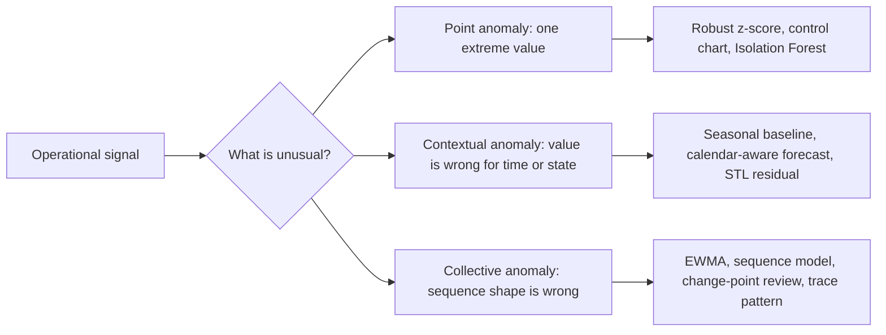
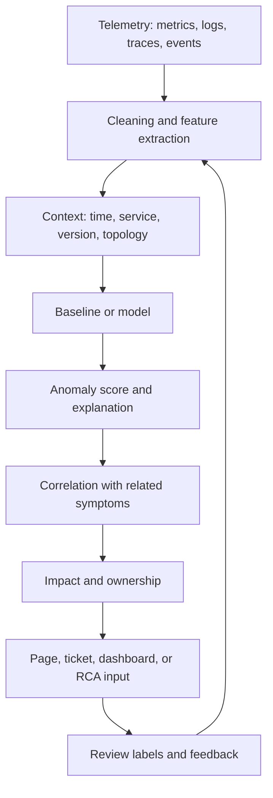
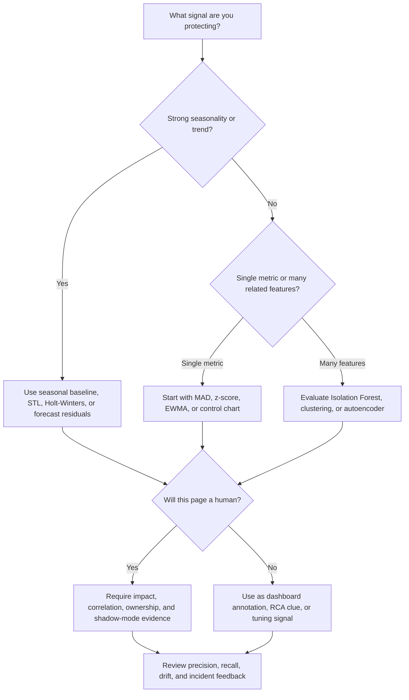

> **Discipline Track** | Complexity: `[COMPLEX]` | Time: 50-60 min

## Prerequisites

Before starting this module:

- [Module 6.1: AIOps Foundations](../module-6.1-aiops-foundations/) - Core AIOps concepts
- Basic statistics: mean, median, standard deviation, percentiles, and rates
- Understanding of operational time series such as latency, traffic, errors, and saturation
- Python basics for reading and running the hands-on detector

## What You'll Be Able to Do

After completing this module, you will be able to:

- **Implement anomaly detection models that identify unusual patterns in metrics, logs, and traces**
- **Design baseline learning algorithms that adapt to seasonal and trend-based operational patterns**
- **Configure alert thresholds using statistical methods that reduce false positives without missing real issues**
- **Evaluate anomaly detection approaches — statistical, ML-based, deep learning — against your data characteristics**

## Why This Module Matters

Hypothetical scenario: your checkout service emits latency, error, traffic, queue, database, cache, and runtime metrics across many pods. A routine promotional event doubles request volume for two hours, autoscaling adds capacity, and the user-visible checkout success rate remains healthy. A static CPU threshold still pages the on-call engineer many times because several pods spend the event above an arbitrary percentage. Later that month, a slow database connection leak increases checkout latency every afternoon, yet the same static threshold stays silent because no single resource crosses its old line. Both failures come from the same root problem: the alert rule knows a number, but it does not know the system's expected behavior in context.

Anomaly detection is the discipline of learning that expected behavior and flagging deviations worth investigation. It is not magic, and it is not a replacement for service-level objectives, ownership, or disciplined incident response. It is a way to make monitoring adaptive when fixed thresholds collapse under seasonality, trend, high cardinality, and changing traffic patterns. The practical goal is not to detect every unusual value, because unusual values happen constantly in healthy systems. The goal is to surface unusual behavior that might represent user harm, impending saturation, broken automation, or a change that deserves correlation with other signals.

The key shift is from "CPU above a line" to "this signal is behaving differently from its own baseline, in this context, with this confidence, and with this operational consequence." A baseline can be as simple as a median and median absolute deviation for a single metric, or as involved as a multivariate model that learns relationships among latency, traffic, error rate, and queue depth. Good AIOps practice starts with the simplest baseline that explains the data, then graduates to richer models only when the problem demands them. Complexity is a cost: models need training data, evaluation, ownership, and drift management.

This module treats anomaly detection as a production engineering practice rather than a product feature tour. You will learn why static thresholds break, how point, contextual, and collective anomalies differ, when statistical methods are enough, where machine learning helps, and how to evaluate detectors under the severe class imbalance of operations data. You will also learn why detected anomalies should flow into event correlation and root cause analysis instead of paging humans one anomaly at a time. An anomaly is a clue; an incident response system needs evidence, impact, ownership, and a next action.

## The Anomaly Detection Problem in Operations

Operational data has a shape that makes naive thresholds fragile. Traffic has daily and weekly cycles, business launches create legitimate step changes, batch jobs create predictable spikes, and deployments change the relationship between metrics. A web service might normally handle more requests during weekday business hours, a background worker might normally saturate CPU during nightly processing, and a database might normally show different write latency during backup windows. A fixed threshold treats all contexts as equal, so it either fires too often during healthy peaks or sits too high to catch gradual degradation.

The number of signals also matters. A small system can survive a handful of hand-tuned rules, but a platform with many services, endpoints, queues, nodes, and regions creates thousands of candidate alert conditions. Each static rule becomes another place where the chosen number can be stale, copied from a different service, or tuned for yesterday's traffic. The result is not just noise. It is operational blindness, because on-call engineers learn that many alerts are unactionable and start treating the alert stream as background radiation. Alert fatigue is a socio-technical failure caused by weak signal design, not by insufficient human attention.

Modern observability also mixes metrics, logs, traces, and events. Metrics show numerical behavior over time, logs record discrete facts and decisions, traces connect work across service boundaries, and topology explains which components depend on which others. OpenTelemetry describes telemetry as signals emitted by systems and applications, and Google SRE writing emphasizes alerting on meaningful symptoms rather than every possible cause. Anomaly detection works best when it respects that separation. A latency anomaly can tell you that users might be affected, a log anomaly can explain a new failure mode, and a trace anomaly can show where the request path changed.

The durable objective is adaptive, per-signal baselining. "Adaptive" means the detector learns from recent and historical behavior instead of carrying one frozen number forever. "Per-signal" means each metric or event stream gets a baseline appropriate to its own distribution, seasonality, and operational role. A queue-depth metric, a request-rate counter, and an error-ratio gauge should not share one thresholding strategy. Baselines must also be bounded by operational judgment, because a model that adapts too quickly can learn a memory leak, a runaway retry loop, or a slow dependency failure as the new normal.

An anomaly detector therefore sits between raw telemetry and incident workflow. It consumes cleaned time series, event counts, log-derived features, trace summaries, and deployment markers. It emits scored deviations with enough metadata for downstream systems to group related symptoms, suppress duplicates, and route likely ownership. In a mature AIOps pipeline, the detector is not the pager. It is one evidence generator feeding event correlation, service impact assessment, and root cause analysis.

## Types of Anomalies

Different anomaly types need different methods, so the first design decision is taxonomic. A point anomaly is a single observation that is extreme compared with nearby or historical values, such as a sudden latency spike. A contextual anomaly is a value that is normal in one context but abnormal in another, such as weekend traffic that would be ordinary on a weekday peak. A collective anomaly is a sequence whose individual points may look acceptable, but whose pattern is unusual, such as repeated small latency increases after every deployment step.



A point anomaly is the easiest to understand and the easiest to overuse. If checkout latency normally sits near a stable baseline and one minute jumps far beyond the expected range, a z-score, median absolute deviation, control chart, or tree-based outlier detector may identify it quickly. Point methods are useful when the anomaly is sharp and local, but they struggle when the problem is a slow ramp or a normal-looking value in the wrong context. A single high CPU value might be irrelevant during a batch job and important during an idle period.

Contextual anomalies are common in platform operations because infrastructure follows human and automated schedules. Request volume, cache hit ratios, job queues, and database write rates often depend on hour of day, weekday, release window, customer region, or business calendar. A value of 600 requests per second may be normal on Monday morning and suspicious on Sunday night. Contextual detection compares the observation to a baseline for the matching context, not to a global average. That is why seasonal decomposition, Holt-Winters style smoothing, and forecast intervals are useful for many operational time series.

Collective anomalies are the reason incident responders need more than outlier detection. A single request timeout might be routine, but a rising sequence of timeout retries, queue depth, connection pool usage, and downstream latency can signal a failure chain. The individual values may sit below their thresholds, yet the joint pattern says the system is losing margin. Detecting collective anomalies often requires windows, sequence features, multivariate relationships, or correlation with topology. This is where AIOps connects anomaly detection to event correlation and root cause analysis rather than treating every metric independently.

## Baselines Before Models

The most important design artifact in anomaly detection is the baseline, not the algorithm name. A baseline defines what the system expects for a signal at a point in time, including its center, normal spread, seasonal shape, trend, and known operating modes. For a stable internal queue, the baseline might be a rolling median and a robust spread estimate. For user traffic, the baseline might depend on hour of day and day of week. For deployment health, the baseline might compare the new version against the previous version under similar traffic.

Think of a baseline like a skilled operator's memory. The operator does not ask whether 70 percent CPU is always bad; they ask which service, what time, what workload, what recent change, what user impact, and what related signals changed together. A detector has to encode enough of that memory to compare like with like. If the baseline mixes weekday traffic with weekend traffic, or steady state with deployment warmup, the detector will either flag normal behavior or hide real regressions.

Clean feature construction matters before any modeling choice. Counters usually need rates, because the raw counter only increases. Ratios such as error rate often need numerator and denominator checks, because a high percentage over very low traffic can be misleading. Latency usually needs percentiles or histograms rather than averages, because tail latency is where users feel pain. Logs often need parsing into structured counts by error class, service, version, and endpoint. Traces often need span duration summaries and dependency edges, not full raw traces inside a detector.

Data quality becomes model quality. Missing samples, duplicated timestamps, scrape gaps, cardinality explosions, and label changes can look like anomalies even when the system is healthy. A reliable detector treats telemetry health as a first-class input: it knows when the data stream itself is incomplete, when a deployment changed metric labels, and when a new service has too little history for a learned baseline. Cold-start signals should begin with conservative rules, comparison to peer services, or explicit warmup periods instead of pretending that one day of data describes normal behavior.

The practical sequence is simple. Start by defining the operational question, such as "Is checkout latency abnormal for this endpoint and traffic level?" Choose the signal transformation that matches the question, such as rate, ratio, percentile, residual, or count. Decide which context must be part of the baseline, such as hour, weekday, region, service version, or dependency. Only then choose the detector. Reversing that sequence leads to impressive-looking models that answer a question the on-call team did not ask.

## Feature Engineering for Operational Signals

Feature engineering is where anomaly detection becomes operations-aware. Raw telemetry is rarely the right input shape for a detector, because raw telemetry usually reflects collection mechanics as much as system behavior. A counter is not interesting because its absolute value increased; counters are expected to increase. A latency histogram is not useful because one bucket changed; the operational question is usually about tail behavior for real user requests. A log stream is not useful as unbounded text; it becomes useful when grouped into templates, severities, services, versions, and error classes.

Metrics need transformations that respect their type. Counters usually become rates over a window, and the window length changes the detector's personality. A short window reacts quickly but can be noisy when scrape timing jitters or traffic is low. A longer window smooths noise but can hide brief incidents. Gauges such as queue depth, memory usage, and connection count can be modeled directly, but they still need context. Histograms and summaries should be turned into percentiles, bucket ratios, or service-level indicators that match user experience rather than averages that hide the tail.

Logs become anomaly features when you reduce text into stable operational signals. A sudden rise in one error template, one exception class, or one status-code family can be more useful than a raw count of all logs. You also need to track parser health, because a new deployment can change log format and create a fake anomaly by breaking template extraction. Good log features preserve enough dimensions for diagnosis, such as service, endpoint, version, region, and dependency, while avoiding uncontrolled cardinality that makes baselines sparse and expensive.

Traces provide relationship features that metrics and logs often miss. A trace can show that total request latency is stable while one downstream span is growing and another is shrinking, or that a request path now includes a dependency it did not use before. For anomaly detection, you usually summarize traces into span duration distributions, error counts by operation, dependency-edge changes, and critical-path shifts. Feeding entire raw traces into a detector is rarely the first useful step. The model needs features that describe behavior consistently across many requests.

Events and topology turn a suspicious score into useful evidence. Deployment events, autoscaler actions, configuration changes, failovers, feature-flag flips, and maintenance windows explain why a baseline might move. Topology explains blast radius and likely ownership. The same cache-miss anomaly means different things when it occurs on a leaf service, a shared authentication dependency, or a database used by many customer paths. A detector that ignores topology can find unusual behavior, but it cannot help correlation decide whether several symptoms belong to the same incident.

Windowing deserves explicit design. A five-minute window, a one-hour baseline, and a seven-day seasonal history each answer different questions. Short windows are good for fast detection, medium windows are good for smoothing and local context, and long windows are good for seasonality and drift review. Align windows with scrape intervals and business rhythms. A detector that compares a partially filled window with full historical windows can create false positives from collection timing alone, especially when traffic is low or services scale to zero.

Feature ownership is a production concern. Each feature should have a meaning that an operator can explain during an incident: "checkout p95 latency residual," "payment dependency error ratio," or "queue depth relative to same-hour baseline." If the feature cannot be explained, it will be difficult to debug the detector. If the feature changes whenever a team renames a label, the model will be brittle. Treat detector features like API contracts: version them, test them, and review them when services change.

## Statistical Methods

Statistical detectors are the first tools to reach for because they are explainable, cheap to run, and easy to reason about during an incident. A z-score measures how many standard deviations a value sits from the mean: `z = (x - mean) / standard_deviation`. This works best when the data is roughly symmetric, the mean is a useful center, and extreme values are rare enough not to distort the mean and standard deviation. It is a poor default for heavily skewed latency, bursty traffic, or training windows already polluted by incidents.

Median absolute deviation, usually called MAD, is a robust alternative for many operational metrics. The formula is `MAD = median(|x_i - median(x)|)`, and a common modified score is approximately `0.675 * (x_i - median(x)) / MAD`. The median and MAD resist the pull of a few extreme points, so a single outage spike does not move the center as much as it moves the mean. That robustness is valuable when the detector's history might contain the very anomalies you are trying to detect.

EWMA, or exponentially weighted moving average, smooths a signal by weighting recent observations more heavily than older ones. The recurrence is `s_t = alpha * x_t + (1 - alpha) * s_(t-1)`, where alpha controls how quickly the smoothed value reacts. A high alpha follows changes quickly but can chase noise; a low alpha suppresses noise but reacts slowly to real changes. EWMA is useful when you care about sustained movement rather than single-sample spikes, such as a latency trend that persists for several windows.

Holt-Winters, also known as triple exponential smoothing when level, trend, and seasonality are included, extends smoothing to seasonal time series. It models a baseline as a combination of current level, directional trend, and repeating seasonal component. This is a good fit for signals with strong daily or weekly patterns, provided the seasonal shape is stable enough to learn. It is less appropriate when behavior changes abruptly after deployments, business events, or traffic mix changes that are not represented in the training history.

STL, seasonal-trend decomposition using LOESS, separates a series into seasonal, trend, and residual components. The residual is the part left after expected seasonality and trend are removed, so anomaly detection can focus on what the model failed to explain. This is often clearer than alerting directly on the raw metric. If request traffic has a normal lunch-hour peak, STL can remove that shape and let the detector ask whether the remaining residual is abnormal for that moment.

Control charts bring process-control thinking into operations. Instead of asking whether a metric crossed a business threshold, they ask whether the process appears statistically controlled. A simple chart might use a center line plus upper and lower control limits, while richer charts track moving ranges or cumulative shifts. Control charts are useful for stable operational processes, but they must be used carefully in software systems because deployments, scaling, and user behavior can legitimately change the process.

```python
import numpy as np
import pandas as pd


def z_scores(values: np.ndarray) -> np.ndarray:
    mean = values.mean()
    std = values.std(ddof=0)
    if std == 0:
        return np.zeros_like(values, dtype=float)
    return (values - mean) / std


def modified_z_scores(values: np.ndarray) -> np.ndarray:
    median = np.median(values)
    mad = np.median(np.abs(values - median))
    if mad == 0:
        return np.zeros_like(values, dtype=float)
    return 0.675 * (values - median) / mad


def ewma(values: np.ndarray, alpha: float = 0.3) -> np.ndarray:
    smoothed = np.empty_like(values, dtype=float)
    smoothed[0] = values[0]
    for index in range(1, len(values)):
        smoothed[index] = alpha * values[index] + (1 - alpha) * smoothed[index - 1]
    return smoothed


metric = np.array([101, 99, 102, 100, 98, 103, 101, 160, 102, 99, 100, 104], dtype=float)
frame = pd.DataFrame({"value": metric})
frame["z"] = z_scores(metric)
frame["modified_z"] = modified_z_scores(metric)
frame["ewma"] = ewma(metric)
frame["ewma_residual"] = frame["value"] - frame["ewma"]
frame["robust_anomaly"] = frame["modified_z"].abs() > 3.5
print(frame.round(2).to_string(index=False))
```

The example shows why z-score and MAD can disagree in real telemetry. The spike influences the mean and standard deviation used by the z-score, so the detector's yardstick stretches when the outlier appears. The robust score compares the point with the median and median absolute deviation, which move less when the spike enters the window. EWMA gives a different view again: it highlights how far the current value sits from a smoothed local baseline, which is useful for sustained shifts as well as abrupt ones.

Statistical methods remain valuable even in ML-heavy environments because they create understandable first-line baselines. They are easy to run near the data source, easy to explain in an incident review, and easy to debug when a detector behaves badly. Their weakness is that each method encodes assumptions. Z-score assumes the mean and standard deviation describe the signal well. MAD assumes the median is the right center. Seasonal methods assume the seasonality is stable. A good platform exposes those assumptions so operators can choose deliberately.

## Machine Learning Methods

Machine learning helps when simple per-signal rules cannot capture the shape of normal behavior. The main categories are supervised, unsupervised, and semi-supervised detection. Supervised detection trains on labeled examples of normal and anomalous behavior, which can work well in domains with strong labels but is rare in operations because incidents are sparse and inconsistent. Unsupervised detection looks for unusual observations without labels, which fits many telemetry problems but requires careful evaluation. Semi-supervised detection learns normal behavior from mostly clean data and treats large deviations as suspicious.

Isolation Forest is a common unsupervised method for tabular or multivariate telemetry features. Liu, Ting, and Zhou introduced the core idea that anomalies tend to be "few and different," so random partitioning isolates them in fewer splits than normal points. In practical terms, the model builds many random isolation trees. Points that require short average path lengths to isolate receive more anomalous scores. This is useful when a service has many related features, such as latency, error rate, queue depth, CPU, memory, and retry count, and you want to detect unusual combinations.

```python
import numpy as np
import pandas as pd
from sklearn.ensemble import IsolationForest
from sklearn.preprocessing import StandardScaler


def build_metric_frame() -> pd.DataFrame:
    rng = np.random.default_rng(42)
    rows = []
    for minute in range(240):
        traffic = 500 + 80 * np.sin(minute / 30) + rng.normal(0, 20)
        latency = 120 + 0.03 * traffic + rng.normal(0, 8)
        errors = max(0, rng.normal(0.01, 0.005))
        queue = max(0, rng.normal(20, 5))
        if minute in {90, 91, 92, 180, 181}:
            latency += 90
            errors += 0.08
            queue += 50
        rows.append((minute, traffic, latency, errors, queue))
    return pd.DataFrame(rows, columns=["minute", "traffic", "latency_ms", "error_ratio", "queue_depth"])


df = build_metric_frame()
features = df[["traffic", "latency_ms", "error_ratio", "queue_depth"]]
scaled = StandardScaler().fit_transform(features)

model = IsolationForest(
    n_estimators=200,
    contamination=0.03,
    random_state=42,
)
df["prediction"] = model.fit_predict(scaled)
df["score"] = model.score_samples(scaled)
anomalies = df[df["prediction"] == -1].sort_values("score").head(10)
print(anomalies[["minute", "traffic", "latency_ms", "error_ratio", "queue_depth", "score"]].round(3))
```

The scikit-learn API returns `-1` for predicted outliers and `1` for predicted inliers, while `score_samples` assigns lower scores to more abnormal observations. The `contamination` parameter is not an accuracy promise; it is an operating assumption about the expected fraction of anomalies. If you set it too high, the model is forced to call too many points anomalous. If you set it too low, the model may suppress meaningful deviations. Treat the parameter like a threshold decision, then validate it against labeled incidents, replayed history, and on-call tolerance.

Autoencoders use a different idea. They learn to reconstruct normal input, then use reconstruction error as the anomaly score. If a model has learned normal request patterns, a sequence with unusual latency, error, and saturation relationships should reconstruct poorly. Autoencoders can be useful for high-dimensional telemetry, but they are harder to explain, require more training discipline, and can fail silently when the training data contains unrecognized incidents. They are strongest when you have enough clean normal data and a clear evaluation process.

Sequence models such as LSTM-based detectors focus on temporal order. They can learn patterns where the anomaly is not a single point but a sequence of states, such as retries increasing before queue depth rises and latency follows. Forecasting tools such as Prophet approach the problem by predicting an expected value and interval from trend, seasonality, and optional calendar effects; points outside the interval can become anomaly candidates. These methods are helpful when temporal structure is the main challenge, but they need careful holiday, deployment, and business-event handling.

Clustering methods, including density-based approaches such as DBSCAN, can identify observations that do not belong to dense regions of normal behavior. They are useful when normal behavior forms several modes, such as different traffic regimes for batch, interactive, and maintenance periods. Their weakness is parameter sensitivity and interpretability. If an on-call engineer cannot understand why a cluster boundary matters, the detector may be hard to trust during a high-pressure incident.

Univariate and multivariate detection answer different questions. A univariate detector asks whether one signal is abnormal compared with its own history. A multivariate detector asks whether a combination of signals is abnormal together. Univariate methods are simpler, explainable, and good for first-pass baselines. Multivariate methods catch relationship failures, such as latency rising only when traffic is flat and queue depth is growing. The tradeoff is that multivariate models need more careful feature selection, scaling, missing-data handling, and ownership.

## Thresholds and Evaluation

Anomaly detection does not remove thresholds; it moves them to a better place. Instead of one static business number, the threshold is applied to an anomaly score, residual, forecast interval, reconstruction error, or probability-like ranking. A dynamic threshold changes with context because the baseline changes with context. A service might tolerate different latency residuals during peak traffic than during a quiet period. The model creates the score, but engineers still choose the operating point where the score becomes actionable.

Evaluation is difficult because anomalies are rare. Accuracy is almost useless under heavy class imbalance. If only a tiny fraction of windows contain meaningful incidents, a detector that always says "normal" can achieve impressive accuracy while providing no operational value. Precision, recall, and F1 are more useful. Precision asks, "When the detector alerts, how often is it right?" Recall asks, "Of the real anomalies, how many did it catch?" F1 combines precision and recall into one harmonic mean, but teams should still inspect the separate values because false positives and false negatives have different costs.

| Metric | Formula | Operational question |
|--------|---------|----------------------|
| Precision | `TP / (TP + FP)` | How many detector alerts deserve attention? |
| Recall | `TP / (TP + FN)` | How many real anomaly windows did we catch? |
| F1 | `2 * precision * recall / (precision + recall)` | Is the detector balancing both error types? |
| False positive rate | `FP / (FP + TN)` | How much healthy behavior becomes noise? |
| False negative count | `FN` | Which important incidents were missed? |

The precision-recall tradeoff is a product decision as much as a statistical one. A detector used for a dashboard can favor recall because extra markers are tolerable. A detector that wakes a human at night must favor precision and user impact. A detector that gates automated remediation needs even stricter evidence, because a false positive can trigger an unnecessary action. This is why anomaly severity should usually combine score, affected service, user-facing symptom, deployment proximity, and correlation with other signals.

Choosing an operating point should use historical replay, shadow mode, and incident review. Historical replay runs the detector over previous telemetry and checks whether it would have surfaced known incidents without flooding healthy periods. Shadow mode emits detector decisions to a dashboard or low-priority channel before paging. Incident review examines both misses and noisy detections, then adjusts features, baselines, thresholds, suppression rules, or ownership. The review loop is part of the detector, not an optional afterthought.

Evaluation must also include label quality. Many organizations do not have clean anomaly labels, and incident tickets rarely map neatly to metric windows. A deployment rollback might be labeled as the incident start, while the anomaly began earlier. A customer report might arrive after the detector should have fired. Build evaluation datasets with humility: combine incident timelines, deployment events, SLO burn, known maintenance windows, and operator annotations. Weak labels are still useful, but they should not be treated as ground truth without inspection.

## Production Realities

Seasonality is not just a daily sine wave. Real systems have holidays, launch events, payroll cycles, regional traffic shifts, business-hour schedules, and maintenance windows. A detector that learns only the last few days may overreact after a long weekend. A detector that learns the last year may underreact to a recent architecture change. Calendar features and explicit event markers help, but they must be maintained. If the business calendar is wrong, the model can confidently explain away the wrong behavior.

Concept drift and data drift are different but related. Concept drift means the relationship between features and normality changes, such as a service architecture change that makes a previous latency range normal. Data drift means the input distribution changes, such as traffic moving to a different region or clients adopting a new endpoint. Both can degrade a detector. Retraining schedules, sliding windows, drift monitors, and canary comparisons help, but the safest systems also keep human-readable checks around model behavior.

Cold start is unavoidable for new services and new metrics. With no history, a detector cannot honestly know a seasonal baseline. Early strategies include static guardrails, peer comparison, service-template defaults, and conservative warmup periods. A new service can compare its pods to each other before it compares itself to last week. A new endpoint can inherit a broad latency guardrail before it earns a context-specific baseline. The key is to label cold-start confidence clearly so downstream systems do not treat weak evidence as mature signal.

Latency requirements shape architecture. A detector used for near-real-time paging must process windows quickly, tolerate missing samples, and emit decisions with bounded delay. A detector used for capacity planning can run slower and consider longer histories. A detector used for root cause analysis might prioritize rich feature context over sub-minute speed. There is no universal architecture. The right design depends on whether the output drives a page, a dashboard annotation, a correlation engine, a runbook recommendation, or an offline review.



The feedback loop is where many deployments fail. Teams launch a detector, celebrate the first interesting findings, and then leave it to rot while services change. Production detectors need owners, dashboards, configuration review, stale-feature cleanup, and incident-review input. They also need a rollback path. If a model update suddenly floods the alert pipeline, operators must be able to disable or degrade it without disabling basic monitoring. A detector is operational software, so it needs the same release discipline as any other production component.

Detected anomalies should feed correlation and RCA, not bypass them. An anomaly in database latency, a spike in checkout retries, and a burst of payment-service errors may represent one incident, not three pages. Correlation collapses related symptoms into an incident candidate, while RCA uses topology, causality hints, deployment history, and temporal order to suggest likely causes. This separation keeps anomaly detection focused on finding unusual behavior and keeps incident workflow focused on user impact and action.

## From Detection to Incident Workflow

The output of an anomaly detector should be an evidence record, not a vague alarm. A useful record includes the signal name, service, time window, observed value, expected range, anomaly score, baseline context, model version, and related metadata such as deployment or topology markers. This information lets downstream systems explain why the event exists. Without it, operators see another mysterious alert and have to reverse-engineer the detector during the incident, which defeats the purpose of using automation.

Severity should be assigned after combining anomaly evidence with impact and confidence. A high anomaly score on a noncritical internal metric might become a dashboard annotation, while a moderate anomaly on checkout latency during SLO burn might become a page. This distinction protects on-call attention. It also lets the same detector serve multiple consumers: dashboards for exploration, tickets for follow-up, correlation engines for grouping, and paging policies for urgent user-facing symptoms. The model score is one input into severity, not severity itself.

Correlation benefits from anomaly metadata. If several anomalies share a service, dependency, deployment version, region, and start time, the correlation engine can group them into one incident candidate. If a database anomaly begins before API latency rises, temporal order can become evidence for RCA. If a log anomaly appears only on the new version, deployment context matters more than global traffic. The detector should therefore emit structured fields, not just prose messages. Structure is what allows automation to collapse an alert storm into a smaller set of hypotheses.

Human feedback closes the loop. After an incident, responders can mark which anomaly events were helpful, which were noisy, which arrived too late, and which missing signal would have changed the response. That feedback can adjust thresholds, feature definitions, suppression rules, training exclusions, and routing. It can also reveal when a detector is solving the wrong problem. For example, a detector might accurately flag CPU anomalies, but incident reviews may show that user-visible latency residuals are better leading indicators for that service.

Automation needs stronger evidence than notification. Before an anomaly triggers remediation, the system should require correlation, confidence, scope limits, rollback safety, and clear ownership. Restarting a pod because one metric is odd can hide the real problem or make it worse. Safer actions include opening a ticket, annotating a dashboard, collecting extra diagnostics, increasing sampling, or asking for human approval. Closed-loop remediation belongs later in the AIOps maturity path; anomaly detection provides one signal that can help it, not a license to act blindly.

## Landscape Snapshot and Tool Rosetta

**Landscape snapshot — as of 2026-06. This changes fast; verify against vendor docs before relying on specifics.** The tools below are illustrative peers, not endorsements or rankings. Each product exposes anomaly-related capabilities through its own data model, pricing, permissions, and integration assumptions, so treat this Rosetta as a vocabulary map. The durable skill is recognizing the capability and tradeoff, then checking the current vendor documentation before depending on a specific feature.

| Durable capability | Datadog | Dynatrace | Grafana Cloud | Prometheus + custom code | Splunk ITSI | PagerDuty AIOps |
|--------------------|---------|-----------|---------------|---------------------------|-------------|-----------------|
| Metric anomaly detection | Anomaly monitors and Watchdog examples | Automated baselining and Davis anomaly detection docs | Forecasting, anomaly detection, and outlier workflows | PromQL functions plus external models | KPI anomaly or adaptive threshold workflows | Consumes events from detectors |
| Event correlation | Watchdog context and monitors | Problem analysis tied to topology | Usually integrated through alerts and dashboards | Alertmanager grouping plus custom enrichment | Service health and notable events | Event orchestration and noise reduction |
| Topology context | Service and APM metadata | Strong topology-aware model in product docs | Depends on data source and instrumentation | Requires labels, service inventory, and graph data | Service model and dependencies | Service ownership and routing context |
| Noise reduction | Monitor tuning and Watchdog signal context | Problem grouping and impact context | Alert rule design and routing | Alertmanager grouping, inhibition, and silence design | Episode and service-health workflows | Suppression, grouping, and routing policies |
| Auto-remediation handoff | Integrations and workflow hooks | Automation integrations | Alerting integrations | Webhooks and runbook automation | Notable event actions and integrations | Automation and event orchestration |

Vendor platforms can be useful when they reduce undifferentiated plumbing, but they do not remove the need for statistical judgment. A tool that says "anomaly" still needs the right signal, context, ownership, severity policy, and feedback loop. Conversely, a custom Prometheus, OpenTelemetry, and Python approach can be powerful when the team has model ownership, but it can become fragile if every service invents its own detector. The decision is less about buying intelligence and more about deciding where the learning loop, explainability, and operational accountability will live.

## Patterns & Anti-Patterns

Strong anomaly detection programs share a few patterns. First, they begin with user-facing or service-level symptoms, then add resource and dependency signals as evidence. Second, they compare each signal with an appropriate contextual baseline instead of copying one threshold across services. Third, they route detector output through correlation and severity policy before paging. These patterns keep the detector aligned with operational action rather than mathematical novelty.

| Pattern | Why it works | Example |
|---------|--------------|---------|
| Baseline by context | Compares like with like | Compare Sunday traffic with prior Sundays, not global average |
| Detect on residuals | Removes expected trend and seasonality | Run outlier detection after STL or forecast residual calculation |
| Shadow before paging | Measures noise before human interruption | Send detector decisions to a dashboard during tuning |
| Combine score with impact | Avoids paging on harmless oddities | Require anomaly plus SLO burn or error-rate movement |
| Review drift | Keeps models aligned with changing services | Revisit baselines after major architecture or traffic changes |

The common anti-patterns are just as important. A model-first rollout starts with a fashionable algorithm and then searches for places to use it. A detector-as-pager rollout sends every unusual point directly to on-call and recreates the alert storm under a new label. A no-owner rollout treats the detector as an appliance, so thresholds, features, and training data age without review. These failures are predictable because anomaly detection is not only a model; it is a lifecycle.

| Anti-pattern | Why it fails | Better approach |
|--------------|--------------|-----------------|
| One global threshold | Ignores service shape and context | Per-signal adaptive baselines with explicit contexts |
| Training on incidents | Teaches the model broken behavior | Filter known incidents and review polluted windows |
| Paging every anomaly | Converts unusual behavior into alert fatigue | Correlate, score impact, and route by ownership |
| Ignoring low traffic | Produces unstable ratios and false confidence | Require denominator checks and minimum sample windows |
| No drift plan | Baselines become stale or over-adaptive | Use drift monitors, retraining policy, and review gates |

## Decision Framework

Use the simplest method that matches the anomaly type, data shape, and operational action. If a single stable metric has rare spikes, robust statistics may be enough. If a metric has strong seasonality, decompose or forecast before detecting. If many metrics interact, use multivariate methods such as Isolation Forest or autoencoders after feature scaling and evaluation. If the output pages humans, require higher precision and correlation with impact. If the output annotates a dashboard, you can tolerate lower precision while gathering evidence.



| Decision | Prefer this when | Avoid this when |
|----------|------------------|-----------------|
| Static guardrail | Safety limit is absolute, such as disk nearly full | Normal behavior varies widely by context |
| Robust statistics | Signal is univariate and outliers pollute history | Relationship among signals carries the anomaly |
| Seasonal forecast | Pattern repeats by time or calendar | History is too short or seasonality is unstable |
| Isolation Forest | Many tabular features describe one time window | Temporal order is the main signal |
| Autoencoder or LSTM | Sequence shape or high-dimensional reconstruction matters | Explainability and small data are primary constraints |
| Vendor feature | You want integrated workflow and less plumbing | You need custom features or strict model transparency |

## Did You Know?

- **AIOps framing predates many current products**: Gartner's market-guide framing described AIOps platforms as combining large-scale data handling and machine learning functions to support IT operations.
- **The Google SRE golden signals are anomaly-friendly**: latency, traffic, errors, and saturation give detectors operationally meaningful symptoms instead of arbitrary infrastructure trivia.
- **MAD is robust because it uses medians**: a few extreme points can pull a mean and standard deviation, while the median and median absolute deviation move much less.
- **Isolation Forest does not model normal density directly**: it isolates points through random splits and treats points isolated in fewer splits as more suspicious.

## Common Mistakes

| Mistake | Problem | Solution |
|---------|---------|----------|
| Using one CPU threshold everywhere | Different services and workloads have different healthy ranges | Baseline per service, workload, and context |
| Ignoring seasonality | Predictable peaks become recurring false positives | Compare against same-context history or residuals |
| Training on broken periods | Incidents become part of normal behavior | Exclude known incidents and polluted windows |
| Optimizing for accuracy | Rare anomalies make accuracy misleading | Track precision, recall, F1, and incident usefulness |
| Paging on detector output alone | Every unusual value becomes human interruption | Correlate with impact, topology, and ownership |
| Forgetting denominator checks | Ratios over tiny traffic volumes become noisy | Require minimum sample counts before alerting |
| Letting baselines drift silently | Models either stale out or learn bad behavior | Add drift monitoring, review cadence, and rollback |

## Quiz

<details>
<summary>1. Scenario: a service has a daily traffic peak at noon, and a static latency threshold pages every weekday even though user success remains healthy. What kind of baseline should you design first?</summary>

**Answer**: Design a contextual baseline that compares noon behavior with prior noon behavior under similar traffic, not with a global average across the whole day. This directly supports the outcome to **Design baseline learning algorithms that adapt to seasonal and trend-based operational patterns** because the baseline must represent seasonality before it can judge deviations. A seasonal forecast, STL residual, or hour-and-weekday rolling baseline would be more appropriate than one static line. You should still connect the anomaly score to user-facing impact before paging.
</details>

<details>
<summary>2. Scenario: an error-rate detector catches nearly every real incident but creates many noisy alerts during low-traffic periods. How should you evaluate and adjust it?</summary>

**Answer**: This detector has high recall but weak precision, so the operating point is too sensitive for paging. To **Configure alert thresholds using statistical methods that reduce false positives without missing real issues**, add denominator checks, increase the anomaly-score threshold for paging, or route weak signals to dashboards until they correlate with impact. Accuracy would hide the problem because most windows are normal. Precision, recall, and false-positive review show whether the detector is useful to humans.
</details>

<details>
<summary>3. Scenario: checkout latency is normal by itself, traffic is normal by itself, and queue depth is normal by itself, but their combination after a deployment is unusual. Which method family fits this problem?</summary>

**Answer**: This is a multivariate anomaly problem because the relationship among features is the signal. A model such as Isolation Forest can help **Implement anomaly detection models that identify unusual patterns in metrics, logs, and traces** when engineered features describe the same time window. A univariate z-score on each metric may miss the relationship failure. You would still validate the model through replay and correlate the output with deployment events and user impact.
</details>

<details>
<summary>4. Scenario: a detector trained on the last two months stops flagging a slow memory leak because the baseline keeps adapting upward. What production reality is this demonstrating?</summary>

**Answer**: The detector is adapting too aggressively and learning bad behavior as normal, which is a concept-drift control failure. Adaptive baselines need guardrails, drift review, and sometimes long-horizon comparisons so slow degradation remains visible. This also shows why detected anomalies should be reviewed with incident feedback instead of allowing retraining to run blindly. A model owner should examine whether the update policy, feature choice, or threshold needs to change.
</details>

<details>
<summary>5. Scenario: your team has one stable metric with occasional extreme spikes, and the history may already contain several incident windows. Why might MAD be safer than a z-score?</summary>

**Answer**: A z-score uses the mean and standard deviation, both of which can be pulled by the same extreme values the detector should identify. MAD uses the median and median absolute deviation, so the center and spread are more robust when history contains outliers. This helps **Evaluate anomaly detection approaches — statistical, ML-based, deep learning — against your data characteristics** because the data distribution should drive the method. If the signal later shows strong seasonality, you would add context rather than rely on global MAD alone.
</details>

<details>
<summary>6. Scenario: a vendor tool marks a database metric as anomalous and offers to open an incident automatically. What should happen before a human is paged?</summary>

**Answer**: Treat the vendor anomaly as evidence, not as a complete incident decision. Check whether user-facing symptoms, related service signals, topology, deployment history, and ownership point to an actionable problem. The detector output should flow into correlation and severity policy so one database clue does not become a noisy page by itself. This keeps the durable practice independent of the specific product producing the score.
</details>

<details>
<summary>7. Scenario: a brand-new service has only one day of telemetry, but leadership wants anomaly detection enabled immediately. What is the safest rollout path?</summary>

**Answer**: Start with conservative static guardrails, peer comparison, and dashboard-only anomaly annotations while the service builds enough history for a contextual baseline. Label the detector as cold-start so downstream systems understand its confidence is limited. Avoid training a seasonal model from one day of data because it cannot honestly learn weekly or business-calendar patterns. Move toward paging only after replay, shadow mode, and ownership review show acceptable precision.
</details>

## Hands-On

In this exercise, you will build a small anomaly detector over synthetic operational metrics. The goal is not to create a perfect model; the goal is to see how robust statistics, EWMA residuals, and Isolation Forest produce different kinds of evidence. Run this from the repository root so the existing `.venv` supplies `numpy`, `pandas`, and `scikit-learn`.

```bash
.venv/bin/python - <<'PY'
import numpy as np
import pandas as pd
from sklearn.ensemble import IsolationForest
from sklearn.preprocessing import StandardScaler


def generate_metrics(points=240):
    rng = np.random.default_rng(42)
    rows = []
    for minute in range(points):
        seasonal = 40 * np.sin(2 * np.pi * minute / 60)
        traffic = 500 + seasonal + rng.normal(0, 15)
        latency = 120 + 0.04 * traffic + rng.normal(0, 5)
        error_ratio = max(0, rng.normal(0.01, 0.004))
        queue_depth = max(0, 20 + rng.normal(0, 4))
        actual = False
        if minute in {90, 91, 92, 180, 181, 182}:
            latency += 80
            error_ratio += 0.06
            queue_depth += 45
            actual = True
        rows.append((minute, traffic, latency, error_ratio, queue_depth, actual))
    return pd.DataFrame(
        rows,
        columns=["minute", "traffic", "latency_ms", "error_ratio", "queue_depth", "actual_anomaly"],
    )


def modified_z(series):
    values = series.to_numpy(dtype=float)
    median = np.median(values)
    mad = np.median(np.abs(values - median))
    if mad == 0:
        return np.zeros_like(values)
    return 0.675 * (values - median) / mad


def ewma_residual(series, alpha=0.25):
    values = series.to_numpy(dtype=float)
    smooth = np.empty_like(values)
    smooth[0] = values[0]
    for index in range(1, len(values)):
        smooth[index] = alpha * values[index] + (1 - alpha) * smooth[index - 1]
    return values - smooth


df = generate_metrics()
df["latency_modified_z"] = modified_z(df["latency_ms"])
df["latency_ewma_residual"] = ewma_residual(df["latency_ms"])

features = df[["traffic", "latency_ms", "error_ratio", "queue_depth"]]
scaled = StandardScaler().fit_transform(features)
model = IsolationForest(n_estimators=200, contamination=0.03, random_state=42)
df["iforest_prediction"] = model.fit_predict(scaled)
df["detected_anomaly"] = (
    (df["latency_modified_z"].abs() > 3.5)
    | (df["latency_ewma_residual"].abs() > 35)
    | (df["iforest_prediction"] == -1)
)

tp = int(((df["actual_anomaly"]) & (df["detected_anomaly"])).sum())
fp = int(((~df["actual_anomaly"]) & (df["detected_anomaly"])).sum())
fn = int(((df["actual_anomaly"]) & (~df["detected_anomaly"])).sum())
precision = tp / (tp + fp) if tp + fp else 0
recall = tp / (tp + fn) if tp + fn else 0

print("Confusion counts")
print({"true_positive": tp, "false_positive": fp, "false_negative": fn})
print(f"precision={precision:.3f} recall={recall:.3f}")
print()
print("Top detected windows")
print(
    df[df["detected_anomaly"]][
        ["minute", "latency_ms", "error_ratio", "queue_depth", "latency_modified_z", "latency_ewma_residual", "actual_anomaly"]
    ].round(3).head(12).to_string(index=False)
)
PY
```

Success criteria:

- [ ] Explain which detections came from robust latency scoring, EWMA residuals, and Isolation Forest.
- [ ] Change the EWMA residual threshold and observe how precision and recall move in opposite directions.
- [ ] Add a contextual rule that evaluates each minute against similar positions in the synthetic cycle.
- [ ] Draw a dependency graph showing where these anomaly events would enter event correlation from Module 6.3.
- [ ] Write one paragraph describing why this detector should not page humans without impact and ownership context.

## Sources

- [Gartner Market Guide for AIOps Platforms PDF](https://www.servicenow.com/community/s/cgfwn76974/attachments/cgfwn76974/blog/2438/5/market_guide_for_aiops.pdf)
- [Google SRE Book: Monitoring Distributed Systems](https://sre.google/sre-book/monitoring-distributed-systems/)
- [Google SRE Workbook: Alerting on SLOs](https://sre.google/workbook/alerting-on-slos/)
- [OpenTelemetry Signals](https://opentelemetry.io/docs/concepts/signals/)
- [NIST Engineering Statistics Handbook: Detection of Outliers](https://www.itl.nist.gov/div898/handbook/eda/section3/eda35h.htm)
- [statsmodels ExponentialSmoothing](https://www.statsmodels.org/stable/generated/statsmodels.tsa.holtwinters.ExponentialSmoothing.html)
- [statsmodels STL Decomposition Example](https://www.statsmodels.org/stable/examples/notebooks/generated/stl_decomposition.html)
- [scikit-learn IsolationForest](https://scikit-learn.org/stable/modules/generated/sklearn.ensemble.IsolationForest.html)
- [Liu, Ting, and Zhou: Isolation Forest](https://cs.nju.edu.cn/zhouzh/zhouzh.files/publication/icdm08b.pdf)
- [Prophet Quick Start](https://facebook.github.io/prophet/docs/quick_start.html)
- [Prometheus Query Functions](https://prometheus.io/docs/prometheus/latest/querying/functions/)
- [Datadog Anomaly Monitor](https://docs.datadoghq.com/monitors/types/anomaly/)
- [Dynatrace Anomaly Detection](https://docs.dynatrace.com/docs/dynatrace-intelligence/anomaly-detection)
- [Grafana Cloud Forecasting and Anomaly Detection](https://grafana.com/docs/grafana-cloud/machine-learning/dynamic-alerting/forecasting/)
- [Splunk ITSI Adaptive Thresholding Migration](https://help.splunk.com/en/splunk-it-service-intelligence/splunk-it-service-intelligence/visualize-and-assess-service-health/4.21/advanced-thresholding/migrate-anomaly-detection-to-adaptive-thresholding-in-itsi)
- [PagerDuty Noise Reduction](https://support.pagerduty.com/main/docs/noise-reduction)

## Next Module

Continue to [Module 6.3: Event Correlation](../module-6.3-event-correlation/) to learn how anomaly events become grouped evidence instead of isolated alert noise.
