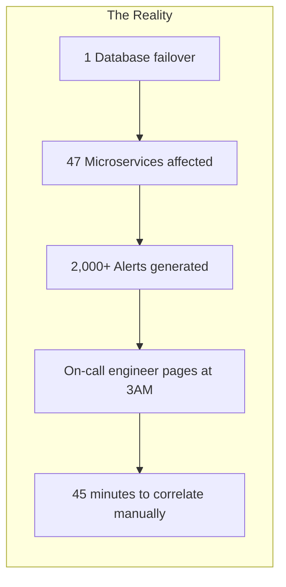
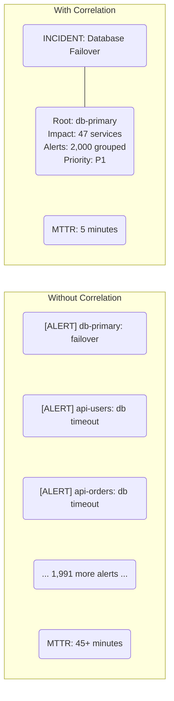
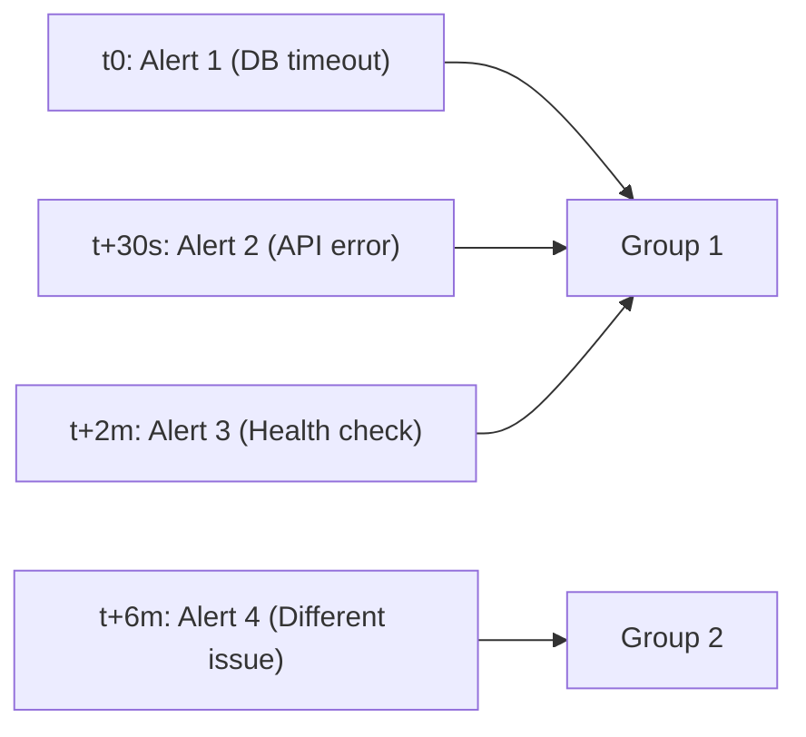
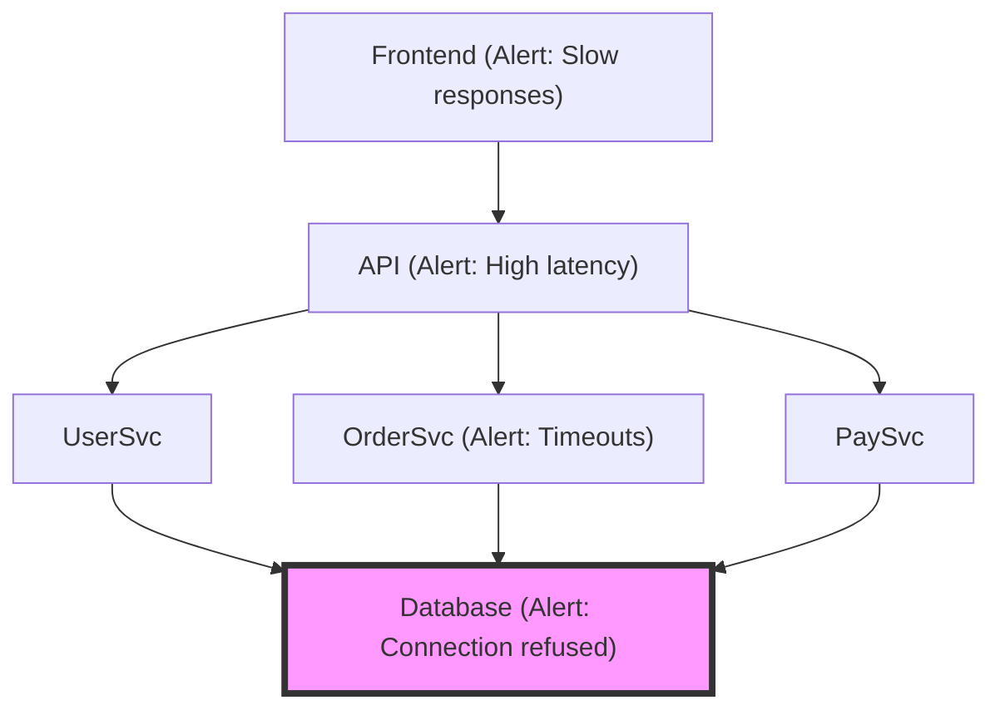
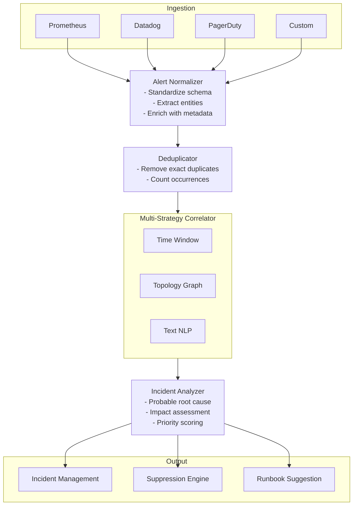

> **Discipline Track** | Complexity: `[COMPLEX]` | Time: 40-45 min

## Prerequisites

Before starting this module:
- [Module 6.1: AIOps Foundations](../module-6.1-aiops-foundations/) — Core AIOps concepts
- [Module 6.2: Anomaly Detection](../module-6.2-anomaly-detection/) — Finding anomalies
- Understanding of distributed systems architecture
- Basic graph concepts (nodes, edges)

## What You'll Be Able to Do

After completing this module, you will be able to:

- **Implement event correlation engines that group related alerts into actionable incidents**
- **Design topology-aware correlation rules that map alert storms to root infrastructure components**
- **Build noise reduction pipelines that suppress duplicate and redundant alerts during cascading failures**
- **Evaluate event correlation platforms and algorithms against your monitoring data volume and topology complexity**

## Why This Module Matters

A single database failure doesn't generate one alert—it generates hundreds. Connection timeouts, health check failures, queue backlogs, API errors. Each downstream service reports its own symptoms. Without correlation, your on-call engineer faces a wall of noise at 3AM.

Event correlation transforms chaos into clarity. It groups related alerts into incidents, identifies the source among symptoms, and can reduce alert volume by 90%+. This is where AIOps delivers the most immediate, tangible value.

## Did You Know?

- **One infrastructure failure can generate 1,000+ alerts** in microservices architectures due to cascading dependencies
- **PagerDuty reports that 70% of alerts are noise**—duplicates, transient issues, or symptoms of deeper problems
- **Moogsoft coined "Alert Fatigue Syndrome"** after finding that overloaded teams miss 30%+ of critical alerts
- **Topology-aware correlation** can identify root cause 80% faster than time-based grouping alone

## The Alert Storm Problem

### Why Correlation Matters





## Correlation Strategies

### 1. Time-Based Correlation

Simplest approach: group alerts within time windows.

> **Pause and predict**: If we group alerts purely by a 5-minute time window, what happens when a database fails at the exact same time a separate, unrelated caching layer fails?



```python
from collections import defaultdict
from datetime import datetime, timedelta

class TimeBasedCorrelator:
    """
    Group alerts within time windows.

    Pros: Simple, no dependencies needed
    Cons: May group unrelated alerts
    """
    def __init__(self, window_seconds=300):
        self.window = timedelta(seconds=window_seconds)
        self.incidents = []
        self.current_incident = None
        self.last_alert_time = None

    def correlate(self, alert):
        """Add alert to incident or create new one."""
        now = alert['timestamp']

        # Start new incident if window expired
        if self.last_alert_time and (now - self.last_alert_time) > self.window:
            if self.current_incident:
                self.incidents.append(self.current_incident)
            self.current_incident = None

        # Create or add to incident
        if self.current_incident is None:
            self.current_incident = {
                'id': len(self.incidents) + 1,
                'start_time': now,
                'alerts': [],
                'services': set()
            }

        self.current_incident['alerts'].append(alert)
        self.current_incident['services'].add(alert.get('service', 'unknown'))
        self.current_incident['last_time'] = now
        self.last_alert_time = now

        return self.current_incident['id']
```

**Limitation**: Unrelated alerts within the same window get grouped.

### 2. Topology-Based Correlation

Use service dependencies to group related alerts.

> **Stop and think**: How would you represent a third-party API dependency in your topology graph if you cannot monitor it directly?



```python
class TopologyCorrelator:
    """
    Correlate alerts using service dependency graph.

    Given a dependency graph, alerts on connected services
    within a time window are grouped together.
    """
    def __init__(self, dependency_graph, window_seconds=300):
        """
        dependency_graph: dict mapping service -> list of dependencies
        Example: {'api': ['database', 'cache'], 'frontend': ['api']}
        """
        self.graph = dependency_graph
        self.window = timedelta(seconds=window_seconds)
        self.incidents = {}
        self.service_to_incident = {}

    def _get_connected_services(self, service, visited=None):
        """Get all services connected to this one."""
        if visited is None:
            visited = set()

        if service in visited:
            return visited

        visited.add(service)

        # Direct dependencies
        for dep in self.graph.get(service, []):
            self._get_connected_services(dep, visited)

        # Reverse dependencies (services that depend on this one)
        for svc, deps in self.graph.items():
            if service in deps:
                self._get_connected_services(svc, visited)

        return visited

    def _find_root_cause(self, incident):
        """
        Find most likely root cause in incident.

        Heuristic: Deepest service in dependency graph
        (alerts propagate upward from root cause)
        """
        services_alerting = incident['services']

        # Score by depth in graph
        def depth(service, visited=None):
            if visited is None:
                visited = set()
            if service in visited:
                return 0
            visited.add(service)
            deps = self.graph.get(service, [])
            if not deps:
                return 0
            return 1 + max(depth(d, visited) for d in deps)

        root = max(services_alerting, key=depth, default=None)
        return root

    def correlate(self, alert):
        """Add alert, correlating by topology."""
        service = alert['service']
        now = alert['timestamp']

        # Check if connected to existing incident
        connected = self._get_connected_services(service)
        matching_incident = None

        for connected_service in connected:
            if connected_service in self.service_to_incident:
                incident_id = self.service_to_incident[connected_service]
                incident = self.incidents.get(incident_id)
                if incident and (now - incident['last_time']) < self.window:
                    matching_incident = incident
                    break

        # Create new incident or add to existing
        if matching_incident:
            incident = matching_incident
        else:
            incident = {
                'id': len(self.incidents) + 1,
                'start_time': now,
                'alerts': [],
                'services': set()
            }
            self.incidents[incident['id']] = incident

        incident['alerts'].append(alert)
        incident['services'].add(service)
        incident['last_time'] = now
        incident['root_cause'] = self._find_root_cause(incident)

        self.service_to_incident[service] = incident['id']

        return incident['id'], incident['root_cause']
```

### 3. Text-Based Correlation (NLP)

Group alerts with similar messages using natural language processing.

> **Stop and think**: What happens if an alert message contains dynamically generated request IDs or timestamps? How would that affect text-based correlation if the messages aren't normalized first?

```python
from sklearn.feature_extraction.text import TfidfVectorizer
from sklearn.cluster import DBSCAN
import numpy as np

class TextCorrelator:
    """
    Correlate alerts by message similarity.

    Uses TF-IDF + DBSCAN clustering to group
    alerts with similar error messages.
    """
    def __init__(self, similarity_threshold=0.3):
        self.vectorizer = TfidfVectorizer(
            stop_words='english',
            max_features=1000
        )
        self.threshold = similarity_threshold

    def correlate_batch(self, alerts):
        """Group alerts by message similarity."""
        messages = [a['message'] for a in alerts]

        # Convert to TF-IDF vectors
        tfidf_matrix = self.vectorizer.fit_transform(messages)

        # Cluster similar messages
        # DBSCAN doesn't require number of clusters upfront
        clustering = DBSCAN(
            eps=self.threshold,
            min_samples=1,
            metric='cosine'
        ).fit(tfidf_matrix)

        # Group alerts by cluster
        clusters = {}
        for i, label in enumerate(clustering.labels_):
            if label not in clusters:
                clusters[label] = []
            clusters[label].append(alerts[i])

        return clusters

# Example
alerts = [
    {'message': 'Connection to database refused', 'service': 'api'},
    {'message': 'Database connection timeout', 'service': 'users'},
    {'message': 'Cannot connect to MySQL database', 'service': 'orders'},
    {'message': 'Out of memory error', 'service': 'cache'},  # Different
]

correlator = TextCorrelator()
clusters = correlator.correlate_batch(alerts)
# Clusters database alerts together, OOM separate
```

### 4. Combined Correlation

Production systems use multiple strategies together:

```python
class HybridCorrelator:
    """
    Combine multiple correlation strategies:
    1. Time window (fast, cheap)
    2. Topology (structural relationships)
    3. Text similarity (catch related unknowns)
    """
    def __init__(self, dependency_graph, window_seconds=300):
        self.time_window = timedelta(seconds=window_seconds)
        self.topology = TopologyCorrelator(dependency_graph, window_seconds)
        self.text = TextCorrelator()
        self.pending_alerts = []

    def correlate(self, alert):
        """Multi-strategy correlation."""
        self.pending_alerts.append(alert)

        # Strategy 1: Topology (if service known)
        if alert.get('service'):
            incident_id, root = self.topology.correlate(alert)
            return incident_id, root, 'topology'

        # Strategy 2: Text similarity (batch periodically)
        if len(self.pending_alerts) >= 10:
            clusters = self.text.correlate_batch(self.pending_alerts)
            self.pending_alerts = []
            # ... process clusters

        # Strategy 3: Time-based fallback
        return self._time_based_fallback(alert)

    def _time_based_fallback(self, alert):
        """Fallback when other strategies don't apply."""
        # ... time-based grouping
        pass
```

## Deduplication

Before correlation, remove true duplicates:

```python
class AlertDeduplicator:
    """
    Remove duplicate alerts before correlation.

    Duplicates: Same source, same message, within time window
    """
    def __init__(self, window_seconds=60):
        self.window = timedelta(seconds=window_seconds)
        self.recent = {}  # fingerprint -> last_seen

    def _fingerprint(self, alert):
        """Create dedup fingerprint."""
        return f"{alert['service']}:{alert['message']}"

    def is_duplicate(self, alert):
        """Check if alert is duplicate."""
        fp = self._fingerprint(alert)
        now = alert['timestamp']

        if fp in self.recent:
            last_seen = self.recent[fp]
            if (now - last_seen) < self.window:
                return True

        self.recent[fp] = now
        self._cleanup(now)
        return False

    def _cleanup(self, now):
        """Remove expired fingerprints."""
        expired = [
            fp for fp, ts in self.recent.items()
            if (now - ts) > self.window
        ]
        for fp in expired:
            del self.recent[fp]
```

## Alert Suppression

Prevent redundant alerts during known issues:

> **Pause and predict**: If you suppress alerts after detecting a service is "flapping" (rapidly changing states), what is the risk if that service is actually failing repeatedly due to a genuine underlying capacity issue?

```python
class AlertSuppressor:
    """
    Suppress alerts during known incidents or maintenance.

    Suppression rules:
    1. Maintenance windows
    2. Known incidents (don't alert on symptoms)
    3. Flapping detection
    """
    def __init__(self):
        self.maintenance_windows = []  # (start, end, services)
        self.active_incidents = {}  # service -> incident_id
        self.alert_history = {}  # service -> list of (timestamp, state)

    def add_maintenance(self, start, end, services):
        """Schedule maintenance window."""
        self.maintenance_windows.append((start, end, services))

    def register_incident(self, incident_id, services):
        """Register active incident for suppression."""
        for service in services:
            self.active_incidents[service] = incident_id

    def should_suppress(self, alert):
        """Check if alert should be suppressed."""
        service = alert['service']
        now = alert['timestamp']

        # Check maintenance windows
        for start, end, services in self.maintenance_windows:
            if start <= now <= end and service in services:
                return True, f"Maintenance window: {start} to {end}"

        # Check if symptom of active incident
        if service in self.active_incidents:
            return True, f"Part of incident {self.active_incidents[service]}"

        # Check for flapping
        if self._is_flapping(service, now):
            return True, "Flapping detected"

        return False, None

    def _is_flapping(self, service, now, threshold=5, window_minutes=10):
        """Detect if service is flapping (oscillating)."""
        history = self.alert_history.get(service, [])
        window_start = now - timedelta(minutes=window_minutes)
        recent = [h for h in history if h[0] > window_start]
        return len(recent) >= threshold
```

## Correlation Architecture



## Measuring Correlation Quality

```python
class CorrelationMetrics:
    """
    Measure correlation effectiveness.
    """
    def __init__(self):
        self.raw_alert_count = 0
        self.incident_count = 0
        self.correct_root_cause = 0
        self.total_root_cause = 0

    def record_alert(self):
        self.raw_alert_count += 1

    def record_incident(self, predicted_root, actual_root=None):
        self.incident_count += 1
        if actual_root:
            self.total_root_cause += 1
            if predicted_root == actual_root:
                self.correct_root_cause += 1

    def get_metrics(self):
        """Calculate correlation metrics."""
        return {
            # Noise reduction: How much we reduced alerts
            'noise_reduction': 1 - (self.incident_count / self.raw_alert_count)
                               if self.raw_alert_count > 0 else 0,

            # Compression ratio: Alerts per incident
            'compression_ratio': self.raw_alert_count / self.incident_count
                                 if self.incident_count > 0 else 0,

            # Root cause accuracy
            'root_cause_accuracy': self.correct_root_cause / self.total_root_cause
                                   if self.total_root_cause > 0 else 0
        }

# Target metrics:
# - Noise reduction: > 90%
# - Compression ratio: > 10:1
# - Root cause accuracy: > 70%
```

## Common Mistakes

| Mistake | Problem | Solution |
|---------|---------|----------|
| Time window too short | Related alerts split across incidents | Use 5-10 minute windows |
| Time window too long | Unrelated alerts grouped together | Add topology/text correlation |
| Missing service metadata | Can't do topology correlation | Enrich alerts with service tags |
| Stale dependency graph | Correlations based on outdated topology | Auto-discover from traces |
| Over-suppression | Real issues hidden | Limit suppression scope, expire rules |
| No deduplication | Inflated alert counts skew metrics | Dedupe before correlation |

## Quiz

<details>
<summary>1. Scenario: You are on-call and receive 15 alerts within 3 minutes. Seven are database timeouts from the payment service, four are Kafka queue backlogs from the notification service, and the rest are frontend latency warnings. The system groups them all into one incident using a 5-minute time window strategy. What is the most significant risk of relying purely on this time-based correlation?</summary>

**Answer**: It will over-group unrelated issues. Since time-based correlation does not understand the relationships between services, it assumes any alerts firing simultaneously are part of the same incident. In this scenario, the payment database timeout and the notification Kafka backlog might be two completely distinct failures that coincidentally happened at the same time. The on-call engineer might only investigate the first issue they see in the group, leaving the other unresolved and continuing to impact users.
</details>

<details>
<summary>2. Scenario: Your topology graph maps the API Gateway connecting to the Order Service, which then connects to the Inventory Database. The API Gateway starts throwing 500 errors, the Order Service throws "Connection Refused", and the Inventory Database reports 100% CPU utilization. Using a topology-based correlation approach, which component will the system identify as the most likely root cause and why?</summary>

**Answer**: The Inventory Database. Topology-based correlation traverses the dependency graph to find the deepest node experiencing symptoms. Because the API Gateway depends on the Order Service, and the Order Service depends on the Inventory Database, the system recognizes that the database failure propagates upward through the stack. By pinpointing the deepest failing component, it correctly identifies the root cause rather than the cascading downstream symptoms.
</details>

<details>
<summary>3. Scenario: During a high-traffic event, a known issue causes the search service to restart every 20 minutes, generating a brief spike of "Search Unavailable" alerts each time. You implement alert deduplication. Will deduplication solve the issue of the on-call engineer being paged every 20 minutes?</summary>

**Answer**: No, deduplication will not prevent these pages. Deduplication only removes identical alerts that occur within the same immediate time window (e.g., merging 50 alerts fired in the same minute into a single alert). Because the search service restarts every 20 minutes, each new batch of alerts falls outside the previous deduplication window and is treated as an entirely new event. To stop the pages for this recurring known issue, you would need to implement an alert suppression rule or correlation strategy based on the flapping state.
</details>

<details>
<summary>4. Scenario: A critical deployment is scheduled for the payment processing module. You have an active suppression rule silencing all alerts from the payment module for the duration of the 1-hour deployment. During this time, the deployment causes a massive memory leak in a shared database used by multiple other modules, which start failing. How will the suppression rule affect the visibility of this new problem?</summary>

**Answer**: The shared database issue will still be visible, provided alerts are correctly tagged by service. The suppression rule is scoped strictly to the payment processing module. When the shared database begins failing and causing timeouts in other services, those downstream services will generate alerts that fall outside the payment module's suppression window. However, this scenario highlights the danger of over-suppression; if the rule was broadly applied to the entire environment rather than just the payment service, the critical database failure could have been hidden from the on-call team.
</details>

## Hands-On Exercise: Build a Correlation Engine

Build a multi-strategy correlation engine:

### Setup

```bash
mkdir correlation-engine && cd correlation-engine
python -m venv venv
source venv/bin/activate
pip install numpy pandas
```

### Step 1: Define Your Service Topology

```python
# topology.py
"""
Define a realistic microservices topology.

This represents a typical e-commerce application.
"""

DEPENDENCY_GRAPH = {
    # Frontend depends on API gateway
    'frontend': ['api-gateway'],

    # API gateway routes to services
    'api-gateway': ['user-service', 'order-service', 'product-service'],

    # Services depend on data stores
    'user-service': ['postgres-primary', 'redis-cache'],
    'order-service': ['postgres-primary', 'kafka'],
    'product-service': ['postgres-primary', 'elasticsearch', 'redis-cache'],

    # Async processing
    'order-processor': ['kafka', 'postgres-primary'],
    'notification-service': ['kafka', 'smtp-relay'],

    # Data stores (leaf nodes)
    'postgres-primary': [],
    'postgres-replica': ['postgres-primary'],
    'redis-cache': [],
    'elasticsearch': [],
    'kafka': ['zookeeper'],
    'zookeeper': [],
    'smtp-relay': []
}

# Service metadata
SERVICE_METADATA = {
    'postgres-primary': {'tier': 'critical', 'team': 'platform'},
    'kafka': {'tier': 'critical', 'team': 'platform'},
    'api-gateway': {'tier': 'critical', 'team': 'platform'},
    'frontend': {'tier': 'high', 'team': 'frontend'},
    'user-service': {'tier': 'high', 'team': 'backend'},
    'order-service': {'tier': 'high', 'team': 'backend'},
    # ... etc
}
```

### Step 2: Generate Test Alerts

```python
# generate_alerts.py
import random
from datetime import datetime, timedelta
from topology import DEPENDENCY_GRAPH

def generate_cascade_alerts(root_cause, timestamp):
    """
    Generate realistic alert cascade from a root cause.

    When a service fails, all dependent services eventually alert.
    """
    alerts = []

    # Alert on root cause
    alerts.append({
        'timestamp': timestamp,
        'service': root_cause,
        'message': f'{root_cause} is DOWN',
        'severity': 'critical',
        'type': 'availability'
    })

    # Find all services that depend on root_cause (reverse lookup)
    def get_dependents(service, delay=0):
        dependents = []
        for svc, deps in DEPENDENCY_GRAPH.items():
            if service in deps:
                # Delay increases as we go up the chain
                alert_delay = delay + random.randint(5, 30)
                dependents.append((svc, alert_delay))
                # Recursively find dependents
                dependents.extend(get_dependents(svc, alert_delay))
        return dependents

    # Generate symptom alerts
    for service, delay in get_dependents(root_cause):
        alert_time = timestamp + timedelta(seconds=delay)

        # Symptom messages
        messages = [
            f'Connection to {root_cause} refused',
            f'Timeout connecting to {root_cause}',
            f'Health check failed: {root_cause} dependency',
            f'Error rate elevated'
        ]

        alerts.append({
            'timestamp': alert_time,
            'service': service,
            'message': random.choice(messages),
            'severity': 'high',
            'type': 'dependency'
        })

    # Sort by timestamp
    alerts.sort(key=lambda a: a['timestamp'])
    return alerts

def generate_test_scenarios():
    """Generate multiple test scenarios."""
    scenarios = []

    # Scenario 1: Database failure
    db_alerts = generate_cascade_alerts(
        'postgres-primary',
        datetime(2024, 1, 15, 3, 0, 0)
    )
    scenarios.append({
        'name': 'Database Outage',
        'root_cause': 'postgres-primary',
        'alerts': db_alerts
    })

    # Scenario 2: Kafka failure
    kafka_alerts = generate_cascade_alerts(
        'kafka',
        datetime(2024, 1, 15, 3, 30, 0)
    )
    scenarios.append({
        'name': 'Kafka Outage',
        'root_cause': 'kafka',
        'alerts': kafka_alerts
    })

    # Scenario 3: Unrelated alerts (noise)
    noise = [
        {
            'timestamp': datetime(2024, 1, 15, 3, 15, 0),
            'service': 'frontend',
            'message': 'High memory usage',
            'severity': 'warning',
            'type': 'resource'
        }
    ]
    scenarios.append({
        'name': 'Noise',
        'root_cause': None,
        'alerts': noise
    })

    return scenarios

if __name__ == '__main__':
    scenarios = generate_test_scenarios()
    for s in scenarios:
        print(f"\n=== {s['name']} ===")
        print(f"Root cause: {s['root_cause']}")
        print(f"Alerts: {len(s['alerts'])}")
        for a in s['alerts'][:5]:
            print(f"  [{a['timestamp']}] {a['service']}: {a['message']}")
        if len(s['alerts']) > 5:
            print(f"  ... and {len(s['alerts']) - 5} more")
```

### Step 3: Build the Correlator

```python
# correlator.py
from datetime import timedelta
from collections import defaultdict
from topology import DEPENDENCY_GRAPH

class ProductionCorrelator:
    """
    Production-grade event correlator with multiple strategies.
    """
    def __init__(self, window_seconds=300):
        self.window = timedelta(seconds=window_seconds)
        self.graph = DEPENDENCY_GRAPH
        self.incidents = {}
        self.next_incident_id = 1

        # Track deduplication
        self.seen_fingerprints = {}

    def _fingerprint(self, alert):
        """Create dedup fingerprint."""
        return f"{alert['service']}:{alert['message'][:50]}"

    def _is_duplicate(self, alert):
        """Check for duplicate within window."""
        fp = self._fingerprint(alert)
        now = alert['timestamp']

        if fp in self.seen_fingerprints:
            if (now - self.seen_fingerprints[fp]) < timedelta(seconds=60):
                return True

        self.seen_fingerprints[fp] = now
        return False

    def _get_all_connected(self, service):
        """Get all services connected (up and downstream)."""
        connected = set()

        def explore(svc, visited):
            if svc in visited:
                return
            visited.add(svc)

            # Downstream (dependencies)
            for dep in self.graph.get(svc, []):
                explore(dep, visited)

            # Upstream (dependents)
            for s, deps in self.graph.items():
                if svc in deps:
                    explore(s, visited)

        explore(service, connected)
        return connected

    def _find_root_cause(self, services):
        """
        Find probable root cause among alerting services.

        Heuristic: Service with most depth in dependency chain
        """
        def depth(service, visited=None):
            if visited is None:
                visited = set()
            if service in visited or service not in self.graph:
                return 0
            visited.add(service)
            deps = self.graph.get(service, [])
            if not deps:
                return 1
            return 1 + max((depth(d, visited.copy()) for d in deps), default=0)

        alerting = [s for s in services if s in self.graph]
        if not alerting:
            return None

        # Sort by depth (deepest = most likely root)
        return max(alerting, key=depth)

    def correlate(self, alert):
        """
        Process alert through correlation pipeline.

        Returns: (incident_id, is_new, root_cause)
        """
        # Step 1: Deduplication
        if self._is_duplicate(alert):
            return None, False, None

        service = alert['service']
        now = alert['timestamp']

        # Step 2: Find matching incident (topology + time)
        connected = self._get_all_connected(service)
        matching_incident = None

        for inc_id, incident in self.incidents.items():
            # Check time window
            if (now - incident['last_time']) > self.window:
                continue

            # Check topology connection
            if incident['services'] & connected:
                matching_incident = incident
                break

        # Step 3: Create or update incident
        if matching_incident:
            incident = matching_incident
            is_new = False
        else:
            incident = {
                'id': self.next_incident_id,
                'start_time': now,
                'alerts': [],
                'services': set()
            }
            self.incidents[incident['id']] = incident
            self.next_incident_id += 1
            is_new = True

        # Update incident
        incident['alerts'].append(alert)
        incident['services'].add(service)
        incident['last_time'] = now
        incident['root_cause'] = self._find_root_cause(incident['services'])

        return incident['id'], is_new, incident['root_cause']

    def get_summary(self):
        """Get correlation summary."""
        total_alerts = sum(len(inc['alerts']) for inc in self.incidents.values())
        return {
            'total_alerts': total_alerts,
            'incidents': len(self.incidents),
            'compression_ratio': total_alerts / len(self.incidents)
                                 if self.incidents else 0,
            'incidents_detail': [
                {
                    'id': inc['id'],
                    'alerts': len(inc['alerts']),
                    'services': list(inc['services']),
                    'root_cause': inc['root_cause']
                }
                for inc in self.incidents.values()
            ]
        }
```

### Step 4: Test and Measure

```python
# test_correlator.py
from generate_alerts import generate_test_scenarios
from correlator import ProductionCorrelator

def test_correlation():
    """Test correlator against known scenarios."""
    correlator = ProductionCorrelator(window_seconds=300)

    scenarios = generate_test_scenarios()

    # Combine all alerts
    all_alerts = []
    expected_root_causes = {}

    for scenario in scenarios:
        for alert in scenario['alerts']:
            all_alerts.append(alert)
        if scenario['root_cause']:
            # First alert of scenario
            expected_root_causes[scenario['alerts'][0]['timestamp']] = \
                scenario['root_cause']

    # Sort by timestamp (realistic stream order)
    all_alerts.sort(key=lambda a: a['timestamp'])

    # Process
    results = []
    for alert in all_alerts:
        inc_id, is_new, root_cause = correlator.correlate(alert)
        if inc_id:
            results.append({
                'alert': alert,
                'incident_id': inc_id,
                'is_new': is_new,
                'predicted_root': root_cause
            })

    # Evaluate
    summary = correlator.get_summary()

    print("=== Correlation Results ===")
    print(f"Total alerts processed: {summary['total_alerts']}")
    print(f"Incidents created: {summary['incidents']}")
    print(f"Compression ratio: {summary['compression_ratio']:.1f}:1")
    print()

    print("=== Incidents ===")
    for inc in summary['incidents_detail']:
        print(f"Incident {inc['id']}:")
        print(f"  Alerts: {inc['alerts']}")
        print(f"  Services: {', '.join(inc['services'])}")
        print(f"  Root cause: {inc['root_cause']}")
        print()

    # Check root cause accuracy
    correct = 0
    total = 0
    for inc in summary['incidents_detail']:
        if inc['root_cause']:
            total += 1
            # Check against expected
            for scenario in scenarios:
                if scenario['root_cause'] == inc['root_cause']:
                    correct += 1
                    break

    if total > 0:
        print(f"Root cause accuracy: {correct}/{total} = {100*correct/total:.0f}%")

if __name__ == '__main__':
    test_correlation()
```

### Success Criteria

You've completed this exercise when:
- [ ] Defined a realistic service topology
- [ ] Generated cascade alert patterns
- [ ] Built correlator achieving >10:1 compression ratio
- [ ] Correctly identified root cause in test scenarios
- [ ] Understood trade-offs of different correlation strategies

## Key Takeaways

1. **Time alone isn't enough**: Add topology and/or text correlation
2. **Dedupe before correlating**: Removes noise, improves accuracy
3. **Root cause = deepest in graph**: Symptoms propagate upward
4. **Measure compression**: Target >90% noise reduction
5. **Maintain topology**: Auto-discover from traces when possible
6. **Suppression prevents fatigue**: But expire rules to avoid hiding issues

## Further Reading

- [Moogsoft: AIOps Noise Reduction](https://www.moogsoft.com/resources/aiops-guide/) — Practitioner guide
- [PagerDuty: Event Intelligence](https://www.pagerduty.com/platform/aiops/) — Commercial approach
- [BigPanda Architecture](https://www.bigpanda.io/blog/) — Scale challenges
- [Observability Engineering (Book)](https://www.oreilly.com/library/view/observability-engineering/9781492076438/) — Chapter on correlation

## Summary

Event correlation is where AIOps delivers immediate, measurable value. By combining time windows, topology awareness, and text similarity, you can reduce thousands of alerts to tens of incidents. The key is maintaining accurate service topology and measuring compression ratios to prove effectiveness.

The goal: Your on-call engineer sees one incident at 3AM, not 2,000 alerts.

---

## Next Module

Continue to [Module 6.4: Root Cause Analysis](../module-6.4-root-cause-analysis/) to learn how to automatically identify probable causes within correlated incidents.