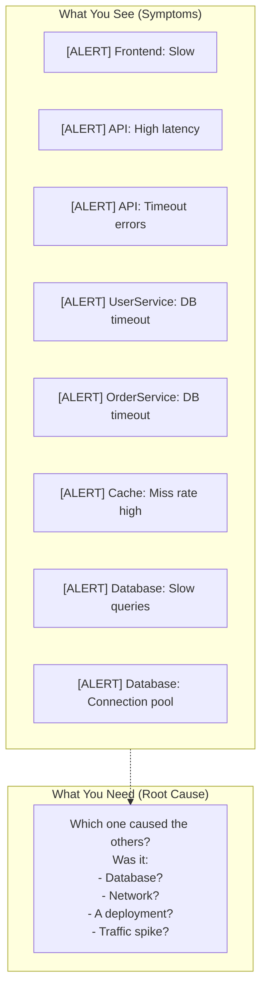
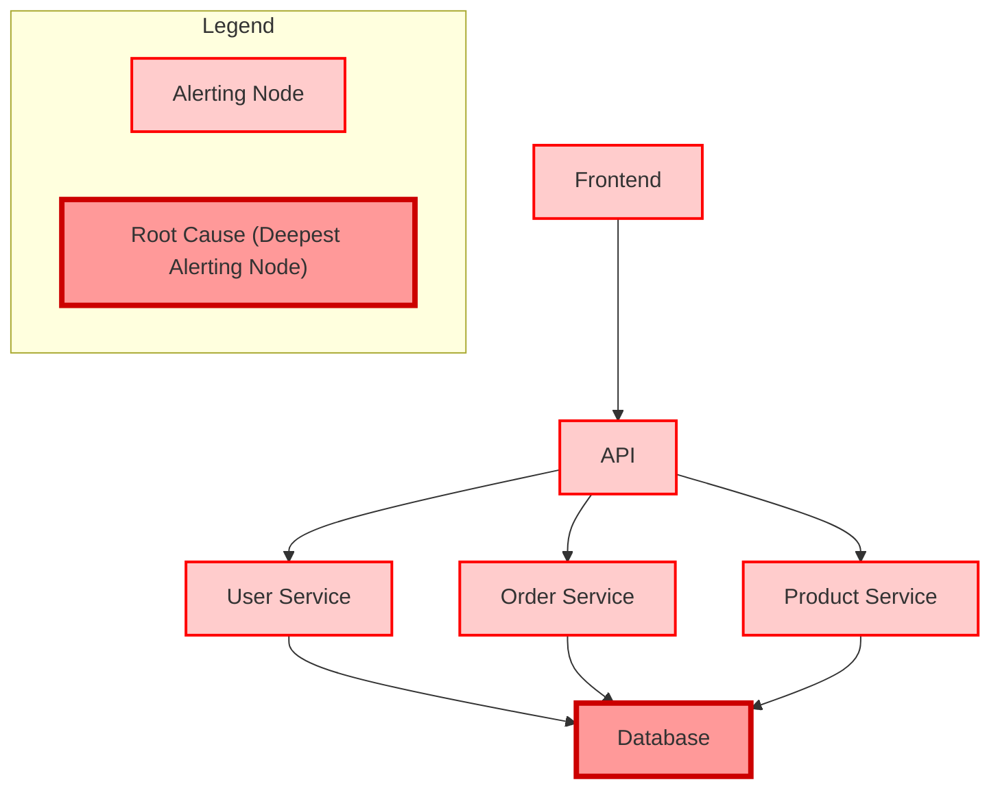
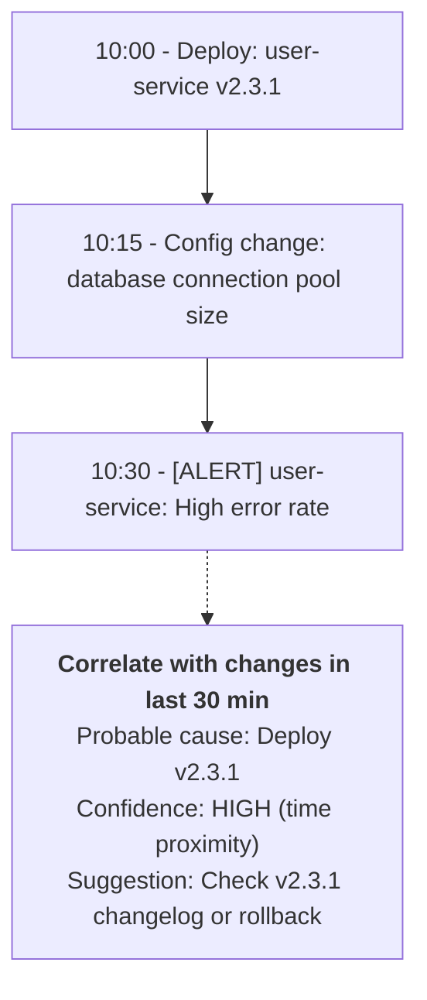
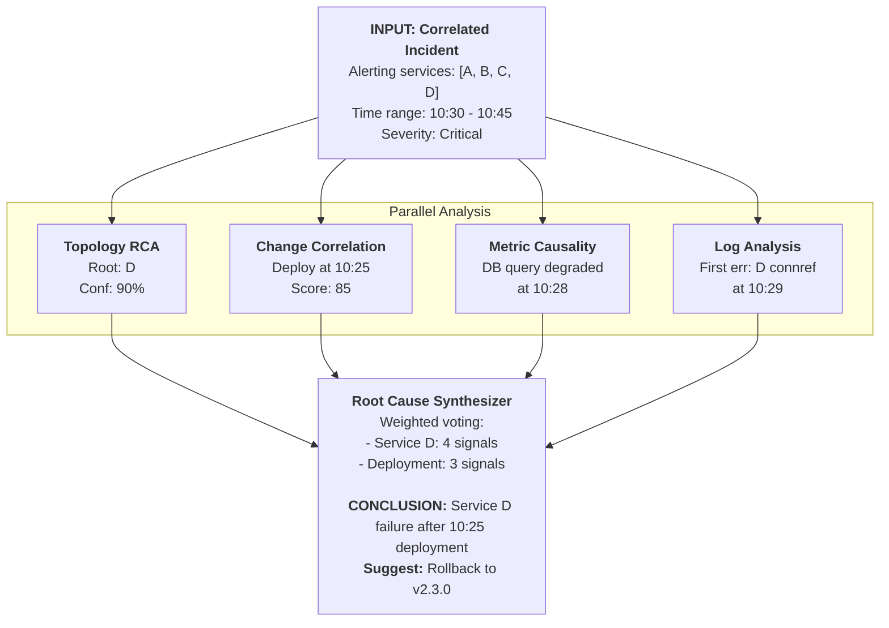
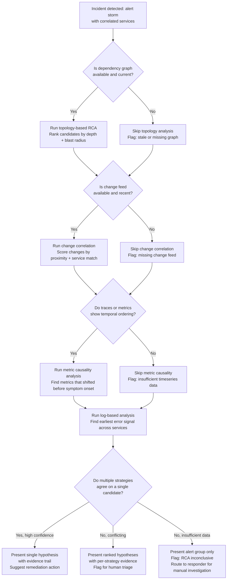

> **Discipline Track** | Complexity: `[COMPLEX]` | Time: 40-45 min

## Prerequisites

Before starting this module:
- [Module 6.3: Event Correlation](../module-6.3-event-correlation/) — Grouping related alerts
- Understanding of directed graphs and traversal
- Basic causal reasoning concepts
- Familiarity with distributed systems

## What You'll Be Able to Do

After completing this module, you will be able to:

- **Implement automated root cause analysis workflows that correlate symptoms across metrics, logs, and traces**
- **Design dependency graph analysis that traces failures from user-facing symptoms to infrastructure causes**
- **Build RCA playbooks that combine automated analysis with structured human investigation**
- **Evaluate causal inference techniques that distinguish root causes from correlated symptoms**

## Why This Module Matters

Event correlation answers a specific question: which alerts appear to belong together? Root Cause Analysis answers the harder one: which node in that correlated group is the origin, and why did it fail? The distinction is not academic. Responders who act on correlation alone routinely restart the wrong service, roll back the wrong deployment, or waste precious minutes chasing a symptom while the true cause escalates.

Hypothetical scenario: A checkout pipeline begins timing out at 14:22. Your correlation engine correctly groups alerts from the checkout service, the payment gateway, the inventory database, and the frontend error-rate monitor into a single incident candidate. That grouping is valuable — it tells you these alerts share a dependency chain. But it does not tell you whether the inventory database is slow because a query plan changed, whether the payment gateway timed out because a certificate expired, or whether the checkout service itself introduced a connection-pool leak in its most recent deploy. Each possible root cause demands a different remediation: roll back a deploy, rotate a certificate, tune a query, scale a connection pool. Picking the wrong one extends the outage.

Root Cause Analysis is the discipline of moving from "many symptoms" to "the smallest set of underlying causes," and doing it fast enough to matter. In manual incident response this means structured investigation techniques — the 5 Whys, the fishbone diagram, dependency-graph traversal. In automated AIOps it means building systems that ingest topology, change records, metric timeseries, log streams, and trace data, then rank candidate causes by how well each one explains the observed symptom set. The Google SRE book frames this as the difference between investigating each alert in isolation and reasoning about the system as a whole. An RCA system that understands that service A calls service B calls database C can infer that if C is slow and A and B are alerting, C is the most probable cause — not because it is "deepest" in the graph but because its failure explains the symptoms of every service above it.

The payoff is measured in MTTR. Industry surveys consistently report that investigation — not remediation — dominates incident duration. A system that can reduce the investigation phase from 90 minutes of dashboard-hopping and log-grepping to 5 minutes of hypothesis validation changes the economics of on-call and the safety of the systems under care.

## The RCA Challenge

### Why Distributed Systems Break RCA Intuition

In a monolithic application running on a single host, root cause analysis follows a natural gradient: start from the user-facing symptom, trace the code path backward, find the point of failure. The failure surface is bounded by the process. In a distributed system, the failure surface is the entire topology. One fault fans out into many symptoms because services are both workers and observers — when a dependency degrades, every caller records its own local timeout, error, or latency spike, and each of those observations may independently cross an alerting threshold. The alert storm that arrives at the responder's screen contains true signals about the dependency failure and true signals about each caller's struggle, but the causal arrow points only one way.

The topology itself compounds the difficulty. Microservice architectures evolve continuously — services are deployed, scaled, split, and retired — so the dependency graph the responder carries in their head is often weeks out of date by the time an incident occurs. A service may have added a new dependency on a cache layer in the last sprint; if that cache fails, the responder looking at a two-week-old mental model will search for the root cause in the wrong place. Automated RCA systems address this by deriving the dependency graph from live observability data — distributed traces, service-mesh sidecar telemetry, or API gateway logs — so the graph used for analysis matches the system as it actually runs, not as it was last diagrammed.

A third complication is that distributed systems regularly produce coincident, unrelated failures. Two completely independent root causes can trigger symptoms that overlap in time and in the affected service roster. A good RCA system must be willing to report "these two groups of symptoms have different root causes" rather than forcing everything into one explanation. This is why human-in-the-loop verification is essential: an automated RCA suggestion is a hypothesis to confirm, not a verdict to execute.

A fourth challenge, subtler than the others, is that the symptom set itself is often incomplete or misleading. Monitoring coverage is never total — a service may have metrics for request latency but not for garbage-collection pauses, or logs for application errors but not for kernel-level network retransmissions. The root cause may live in a gap between what is observed and what is not. When the RCA system proposes a candidate that explains all observed symptoms, the responder must still ask: are there symptoms we should have seen but didn't? A negative finding — "the database metrics show no anomalies" — can be as informative as a positive one, and a good RCA report surfaces the absence of expected confirming signals alongside the presence of positive ones.

### Symptoms vs Root Causes



The diagram illustrates the core problem: eight alerts fire, but the responder needs one root cause. Without RCA, the responder checks each alert manually, cross-references dashboards and logs, and builds the causal story through effort and experience. With RCA, the system proposes that the database slow queries caused the cascade, and the responder validates that hypothesis against the evidence. The difference in time-to-diagnose can be an order of magnitude.

### Root Cause Categories

Understanding the *nature* of a root cause helps narrow the search. Causes fall into distinct categories, each with characteristic detection approaches:

| Category | Examples | Detection Approach |
|----------|----------|-------------------|
| **Infrastructure** | Server down, disk full, network partition | Health checks, resource metrics |
| **Application** | Memory leak, infinite loop, deadlock | APM, profiling, error rates |
| **Data** | Corrupted data, schema change, volume spike | Data quality checks, query analysis |
| **Configuration** | Bad deployment, misconfigured service | Change correlation, config diff |
| **External** | Third-party outage, DNS issue, certificate expiry | External monitoring, dependency checks |
| **Capacity** | Traffic spike, resource exhaustion | Capacity metrics, forecasting |

A robust RCA system must search across all six categories because failure modes do not announce their category in advance. A memory leak (application) and a traffic spike (capacity) can produce nearly identical symptoms — rising latency, increasing error rates — but demand completely different responses.

## Correlation vs Causation

The most dangerous mistake in automated RCA is confusing temporal correlation with causal relationship. Two metrics rising together does not mean one caused the other; they may share a common cause, or the correlation may be entirely spurious. In large systems with thousands of metrics, spurious correlations are not rare — they are mathematically inevitable under multiple-comparison conditions. When a monitoring system tracks a thousand metrics at one-minute granularity, the number of pairwise comparisons is on the order of half a million. Even with a stringent significance threshold, dozens of statistically "significant" correlations will appear purely by chance in any given hour. A naive causality analyzer that treats every statistically significant temporal alignment as a causal signal will flood the responder with false root-cause hypotheses, many of them absurd — memory usage correlated with login attempts, disk I/O correlated with time of day, error rate correlated with a metric from an entirely unrelated service in a different cluster.

Consider a concrete example: during a deployment window, both the checkout-service error rate and the Redis cache hit rate begin changing at roughly the same moment. A naive causality analyzer might flag Redis as the root cause because its metric shifted first. But the real root cause is a database schema migration that increased query latency, which caused the checkout service to retry, which saturated connection pools, which slowed down cache population. Redis was a symptom, not a cause. The temporal correlation between the cache hit rate and the error rate was real, but the causal chain ran through the database, not the cache.

Real RCA systems address this by incorporating structural knowledge that goes beyond time-series alignment. The dependency graph is the primary structural input: if service A depends on service B, and both are alerting, then B is the more likely cause regardless of which metric shifted first. Change records provide a second structural signal: a deployment that touched the database schema five minutes before the incident is a stronger causal candidate than a Redis metric anomaly that happened to align in time. Together, topology and change history transform a correlation into a causal hypothesis with evidence behind it.

The causal inference literature — particularly Judea Pearl's framework of graphical models and do-calculus — provides a formal language for reasoning about these questions. In Pearl's terms, the dependency graph of a microservice architecture is a causal graph: edges represent not just "A calls B" but "if B fails, A will be affected." This allows RCA systems to answer counterfactual questions like "if we had not deployed version 2.3.1, would the database still have slowed down?" The answer, when supported by evidence, turns a suspicion into a diagnosis.

## RCA Approaches

In practice, an RCA system must combine multiple analytical strategies because no single strategy covers all failure modes. Topology-based analysis identifies the structural locus of a failure — which service broke — but cannot answer why it broke unless the failure propagated strictly along dependency edges. Change correlation identifies the operational trigger — what changed — but cannot identify failures caused by gradual resource exhaustion or external dependencies. Metric causality captures the temporal sequence — which metric degraded first — but is vulnerable to spurious correlations in high-dimensional metric spaces. Log analysis captures the textual narrative — which error message appeared first — but can be misled by error messages that are symptoms rather than causes. The art of RCA system design lies in understanding the failure modes of each strategy and combining them so that one strategy's blind spot is covered by another's strength. The sections that follow examine four complementary strategies, each contributing a distinct signal to the synthesis layer that combines them into a single ranked diagnosis.

> **Pause and predict**: If service A calls service B, and both are alerting for high latency, which one is statistically more likely to be the actual cause of the delay?

### 1. Dependency Graph Analysis

Dependency-graph-based RCA is the workhorse of automated root cause analysis because it encodes the single most reliable piece of structural information in a distributed system: the direction of dependency. When service A depends on service B, a failure in B will affect A; a failure in A will not affect B (unless the failure mode involves overwhelming B with retries, a special case that good RCA systems handle separately). This asymmetry is what allows a graph traversal algorithm to rank candidate root causes without any metric data at all — just the topology and the list of alerting services.

The algorithm works by scoring each alerting service on two dimensions. The first is depth: how far is this service from the leaf nodes of the dependency graph? A database at the bottom of the graph has many dependents; a frontend at the top has few or none. A deeper alerting service is a more likely root cause because its failure can explain the symptoms of every service above it. The second dimension is blast radius: if this service failed, which other services would be affected? A candidate whose blast radius covers most or all of the currently alerting services is a better explanation than one whose blast radius covers only a subset.

These two dimensions — depth and blast-radius coverage — give the algorithm a natural ranking. The database is deep and its blast radius covers the user service, the order service, the API gateway, and the frontend. The API gateway is shallow and its blast radius covers only the frontend. If both are alerting, the database wins.

The implementation below captures this logic in a Python class that builds both the forward dependency graph (service → its dependencies) and the reverse graph (service → its dependents), then scores each alerting service:

```python
from collections import defaultdict, deque

class DependencyRCA:
    """
    Root cause analysis using dependency graph traversal.

    Principle: Root cause is the deepest alerting service
    in the dependency chain (failures propagate upward).
    """
    def __init__(self, dependency_graph):
        """
        dependency_graph: dict mapping service -> list of dependencies
        """
        self.graph = dependency_graph
        self._build_reverse_graph()

    def _build_reverse_graph(self):
        """Build reverse graph for upstream traversal."""
        self.reverse_graph = defaultdict(list)
        for service, deps in self.graph.items():
            for dep in deps:
                self.reverse_graph[dep].append(service)

    def _depth_in_graph(self, service, visited=None):
        """Calculate depth (distance from leaf nodes)."""
        if visited is None:
            visited = set()
        if service in visited:
            return 0
        visited.add(service)

        deps = self.graph.get(service, [])
        if not deps:
            return 0  # Leaf node
        return 1 + max(self._depth_in_graph(d, visited.copy()) for d in deps)

    def _get_blast_radius(self, service):
        """Find all services affected by this service failing."""
        affected = set()
        queue = deque([service])

        while queue:
            current = queue.popleft()
            if current in affected:
                continue
            affected.add(current)

            # Add all services that depend on current
            for dependent in self.reverse_graph.get(current, []):
                queue.append(dependent)

        return affected

    def find_root_cause(self, alerting_services):
        """
        Find probable root cause among alerting services.

        Algorithm:
        1. Score each alerting service by depth
        2. Higher depth = more likely root cause
        3. Verify blast radius explains other alerts
        """
        if not alerting_services:
            return None, 0, set()

        candidates = []
        for service in alerting_services:
            depth = self._depth_in_graph(service)
            blast_radius = self._get_blast_radius(service)
            explained = alerting_services & blast_radius

            candidates.append({
                'service': service,
                'depth': depth,
                'blast_radius': blast_radius,
                'explained': explained,
                'explanation_ratio': len(explained) / len(alerting_services)
            })

        # Sort by: explanation_ratio desc, then depth desc
        candidates.sort(
            key=lambda c: (c['explanation_ratio'], c['depth']),
            reverse=True
        )

        best = candidates[0]
        return best['service'], best['explanation_ratio'], best['blast_radius']

# Usage
graph = {
    'frontend': ['api'],
    'api': ['user-svc', 'order-svc'],
    'user-svc': ['database', 'cache'],
    'order-svc': ['database', 'kafka'],
    'database': [],
    'cache': [],
    'kafka': []
}

rca = DependencyRCA(graph)
alerting = {'frontend', 'api', 'user-svc', 'order-svc', 'database'}
root, confidence, blast = rca.find_root_cause(alerting)
# root = 'database', confidence = 1.0 (explains all alerts)
```



The graph-based approach has important limitations. It assumes failures propagate strictly along dependency edges, which misses network partitions that sever edges entirely, and it misses root causes that are not themselves alerting services — a DNS outage, for instance, may cause the database to appear unreachable without the database itself having failed. This is why graph analysis must be combined with other signals.

> **Stop and think**: Think about the last three major incidents in your organization. How many of them were immediately preceded by a deployment or configuration change?

### 2. Change Correlation

If dependency-graph analysis answers "where did it fail," change correlation answers "what changed to make it fail." The empirical observation that most incidents follow a change — a deployment, a configuration update, a feature flag toggle, a traffic shift — is one of the most durable findings in operations research. The Google SRE book notes that roughly 70 percent of outages are caused by changes to a live system. This makes change correlation the single highest-signal input to an RCA pipeline.

The algorithm is conceptually simple: for a given incident, look backward in time through the change log and score each change by its proximity to the incident onset, its relationship to the affected services, and its risk profile (deployments and configuration changes carry higher risk scores than documentation updates or tag changes). Changes that both touch an affected service and occurred within minutes of the incident onset receive the highest scores.

The implementation below captures this logic with a configurable lookback window and a scoring system that weights service match, time proximity, and change type:



```python
from datetime import timedelta

class ChangeCorrelationRCA:
    """
    Correlate incidents with recent changes.

    Changes include:
    - Deployments
    - Config changes
    - Infrastructure changes
    - Traffic pattern shifts
    """
    def __init__(self, lookback_minutes=60):
        self.lookback = timedelta(minutes=lookback_minutes)
        self.changes = []  # List of change events

    def record_change(self, change):
        """
        Record a change event.

        change = {
            'timestamp': datetime,
            'type': 'deployment' | 'config' | 'infrastructure',
            'service': str,
            'description': str,
            'user': str,
            'reversible': bool
        }
        """
        self.changes.append(change)

    def find_related_changes(self, incident_time, affected_services):
        """
        Find changes that might have caused the incident.
        """
        cutoff = incident_time - self.lookback

        related = []
        for change in self.changes:
            if change['timestamp'] < cutoff:
                continue
            if change['timestamp'] > incident_time:
                continue

            # Check if change affects any incident service
            service_match = change['service'] in affected_services
            time_proximity = (incident_time - change['timestamp']).total_seconds()

            # Score the change
            score = 0
            reasons = []

            if service_match:
                score += 50
                reasons.append(f"Affects {change['service']}")

            # Closer to incident = higher score
            if time_proximity < 300:  # 5 min
                score += 30
                reasons.append("Within 5 minutes of incident")
            elif time_proximity < 900:  # 15 min
                score += 20
                reasons.append("Within 15 minutes of incident")
            elif time_proximity < 1800:  # 30 min
                score += 10
                reasons.append("Within 30 minutes of incident")

            # Deployment changes are higher risk
            if change['type'] == 'deployment':
                score += 20
                reasons.append("Deployment change")
            elif change['type'] == 'config':
                score += 15
                reasons.append("Config change")

            if score > 0:
                related.append({
                    'change': change,
                    'score': score,
                    'reasons': reasons,
                    'suggestion': self._get_suggestion(change)
                })

        # Sort by score
        related.sort(key=lambda r: r['score'], reverse=True)
        return related

    def _get_suggestion(self, change):
        """Generate remediation suggestion for change."""
        if change['type'] == 'deployment' and change.get('reversible'):
            return f"Consider rollback: {change['description']}"
        elif change['type'] == 'config':
            return f"Review config change: {change['description']}"
        else:
            return f"Investigate change: {change['description']}"
```

### 3. Metric-Based Causal Analysis

While dependency-graph analysis uses structural knowledge and change correlation uses operational history, metric-based causal analysis uses the raw timeseries data itself. The fundamental principle is simple and robust: causes must precede effects in time. If database query latency begins rising at 10:28 and API latency begins rising at 10:30, the database is a stronger causal candidate than the API, regardless of what the dependency graph says about their relationship.

The algorithm works by identifying the point at which each metric began to deviate from its historical baseline — the change point — and then comparing the change points across metrics. Metrics whose change points precede the symptom's change point are candidate causes; the shorter the lead time, the stronger the causal signal. A lead time of 30 seconds suggests a direct dependency relationship; a lead time of 30 minutes suggests a slower accumulation of pressure that may or may not be causal.

The implementation below uses a rolling z-score method to detect change points. It computes a baseline mean and standard deviation from the earliest portion of the timeseries window, then scans forward looking for the first data point that exceeds three standard deviations from that baseline:

### Metric Causality Analysis

**INCIDENT:** API latency spike at 10:30

| Metric | 10:00 | 10:15 | 10:30 | Verdict |
|--------|-------|-------|-------|---------|
| API latency (symptom) | 50ms | 55ms | 500ms | **← EFFECT** |
| Database query time | 10ms | 50ms | 400ms | **← CAUSE?** |
| Database connections | 50 | 80 | 100 | **← CAUSE?** |
| Request rate | 1000 | 1000 | 1000 | Stable |
| Memory usage | 60% | 61% | 62% | Stable |

**FINDING:** Database metrics degraded BEFORE API latency, suggesting the database is the root cause.

```python
import numpy as np
from datetime import timedelta

class MetricCausalityAnalyzer:
    """
    Analyze metrics to find causal relationships.

    Key principle: Causes precede effects.
    If metric A changes before metric B, A may cause B.
    """
    def __init__(self, lookback_minutes=30):
        self.lookback = timedelta(minutes=lookback_minutes)

    def analyze_causality(self, incident_time, metrics_data, symptom_metric):
        """
        Find metrics that changed before the symptom.

        metrics_data: dict of metric_name -> list of (timestamp, value)
        symptom_metric: the metric that alerted (effect)
        """
        # Find when symptom started degrading
        symptom_change_time = self._find_change_point(
            metrics_data[symptom_metric],
            incident_time
        )

        if symptom_change_time is None:
            return []

        # Find metrics that changed BEFORE symptom
        potential_causes = []
        for metric_name, data in metrics_data.items():
            if metric_name == symptom_metric:
                continue

            change_time = self._find_change_point(data, incident_time)
            if change_time is None:
                continue

            # Did this metric change before the symptom?
            if change_time < symptom_change_time:
                lead_time = (symptom_change_time - change_time).total_seconds()
                potential_causes.append({
                    'metric': metric_name,
                    'change_time': change_time,
                    'lead_time_seconds': lead_time,
                    'confidence': self._calculate_confidence(lead_time)
                })

        # Sort by confidence
        potential_causes.sort(key=lambda c: c['confidence'], reverse=True)
        return potential_causes

    def _find_change_point(self, data, reference_time):
        """
        Find when a metric started changing significantly.

        Uses simple rolling average comparison.
        """
        if len(data) < 10:
            return None

        # Filter to relevant time window
        cutoff = reference_time - self.lookback
        relevant = [(ts, val) for ts, val in data if ts >= cutoff]

        if len(relevant) < 5:
            return None

        values = [val for _, val in relevant]
        timestamps = [ts for ts, _ in relevant]

        # Calculate baseline (first 30%)
        baseline_end = len(values) // 3
        baseline_mean = np.mean(values[:baseline_end])
        baseline_std = np.std(values[:baseline_end])

        if baseline_std == 0:
            baseline_std = 0.01

        # Find first significant deviation
        for i in range(baseline_end, len(values)):
            z_score = abs(values[i] - baseline_mean) / baseline_std
            if z_score > 3:  # 3 sigma deviation
                return timestamps[i]

        return None

    def _calculate_confidence(self, lead_time_seconds):
        """
        Calculate confidence that this is a cause.

        Shorter lead times = higher confidence (more correlated).
        """
        if lead_time_seconds < 60:
            return 0.9
        elif lead_time_seconds < 300:
            return 0.7
        elif lead_time_seconds < 900:
            return 0.5
        else:
            return 0.3
```

### 4. Log-Based Analysis

Logs capture the narrative of a failure in a way that metrics cannot. A metric tells you that error count rose; a log line tells you *which* error, on *which* host, at *which* code path. Log-based RCA works by scanning log streams around the incident window, categorizing error messages into known patterns, and finding the earliest signal — the first service to log an error that matches a known failure category.

The implementation below defines error categories (connection, resource, database, authentication) with regex patterns for each, then scans logs to find the timeline of error first occurrences. The service whose error appears earliest in the timeline, and whose error category suggests a root cause rather than a symptom, becomes the prime candidate:

```python
import re
from collections import Counter

class LogBasedRCA:
    """
    Analyze logs to identify root cause patterns.
    """
    # Common error patterns
    ERROR_PATTERNS = {
        'connection': [
            r'connection refused',
            r'connection timed out',
            r'no route to host',
            r'connection reset'
        ],
        'resource': [
            r'out of memory',
            r'disk full',
            r'too many open files',
            r'resource exhausted'
        ],
        'database': [
            r'deadlock detected',
            r'lock wait timeout',
            r'too many connections',
            r'query timeout'
        ],
        'authentication': [
            r'authentication failed',
            r'invalid credentials',
            r'token expired',
            r'unauthorized'
        ]
    }

    def analyze_logs(self, logs, incident_time, window_minutes=30):
        """
        Analyze logs around incident time for root cause signals.

        logs: list of {'timestamp': datetime, 'service': str, 'message': str}
        """
        cutoff_start = incident_time - timedelta(minutes=window_minutes)
        cutoff_end = incident_time + timedelta(minutes=5)

        relevant_logs = [
            log for log in logs
            if cutoff_start <= log['timestamp'] <= cutoff_end
        ]

        # Categorize errors
        error_categories = Counter()
        first_occurrences = {}
        service_errors = Counter()

        for log in relevant_logs:
            message = log['message'].lower()
            service = log['service']

            for category, patterns in self.ERROR_PATTERNS.items():
                for pattern in patterns:
                    if re.search(pattern, message, re.IGNORECASE):
                        error_categories[category] += 1
                        service_errors[service] += 1

                        # Track first occurrence
                        key = (service, category)
                        if key not in first_occurrences:
                            first_occurrences[key] = log['timestamp']
                        break

        # Find earliest error signals
        sorted_firsts = sorted(
            first_occurrences.items(),
            key=lambda x: x[1]
        )

        return {
            'error_categories': dict(error_categories),
            'service_errors': dict(service_errors),
            'timeline': [
                {
                    'service': key[0],
                    'category': key[1],
                    'first_seen': ts
                }
                for key, ts in sorted_firsts[:10]
            ],
            'probable_root': sorted_firsts[0] if sorted_firsts else None
        }
```

> **Pause and predict**: What happens if the topology analysis points to the database, but the change correlation points to a frontend deployment? How should the system resolve the conflict?

## Data Fusion Across Signals

No single signal is sufficient for reliable RCA. Dependency graphs miss causes that are not themselves services — DNS outages, certificate expirations, external provider failures. Change correlation has high precision but low recall: it catches deployment-related failures but misses slow resource exhaustion that builds over days. Metric causality analysis is vulnerable to spurious temporal correlation, and log analysis can be misled by error messages that are consequences rather than causes. Each signal has blind spots; the combination covers them.

The highest-signal fusion is between topology and change records. When the dependency graph identifies service D as the deepest alerting node and the change log shows a deployment to service D five minutes before the incident, the combined confidence is far higher than either signal alone. This is not just additive — it is multiplicative, because the two signals confirm each other through independent mechanisms. The graph provides the structural "where," and the change log provides the temporal "why."

Distributed tracing provides a third dimension that neither graphs nor metrics capture well: the latency path through a specific request. A trace shows exactly which service calls occurred, in which order, and how long each one took. When the trace data shows that service A calls service B calls database C, and the database span shows 400 ms latency while the service B span shows 390 ms of that time spent waiting on C, the trace has effectively performed a micro-RCA on that single request. Aggregating across many traces — particularly traces that errored versus traces that succeeded — reveals the failure boundary with high precision.

The fourth dimension, often overlooked, is the deployment and configuration change feed. Most incidents follow a change. This is not folklore; it is one of the most consistently replicated findings in operations research. The Google SRE book reports it; the DevOps Research and Assessment (DORA) reports confirm it; every incident postmortem culture eventually arrives at it. A change feed — deployments, configuration pushes, feature flag toggles, infrastructure-as-code applies — should be treated as a first-class RCA input, with its own pipeline for ingestion, normalization, and temporal indexing alongside metrics and logs. The practical challenge is that change data is scattered across multiple systems — CI/CD platforms (GitHub Actions, Jenkins, ArgoCD), configuration management databases, feature-flag services, and infrastructure-as-code state stores — each with its own schema, latency, and completeness characteristics. Building a unified change feed requires normalization across these sources: every change event must carry a timestamp, a target-service identifier, a change type, a reversibility flag, and a pointer to the specific artifact (commit SHA, config diff, feature-flag toggle ID) that produced it. The normalization effort is significant, but the RCA accuracy improvement it enables is disproportionate — because most incidents follow a change, a well-populated change feed is the single highest-leverage data source in the RCA pipeline.

## Combining RCA Strategies

The individual strategies each produce a candidate and a confidence score. The job of the synthesis layer is to combine these candidates into a single ranked list with evidence from each strategy. The approach shown below uses weighted voting: each strategy casts a vote for its top candidate, weighted by the strategy's confidence and a strategy-level weight factor that encodes domain knowledge (topology gets the highest weight because it encodes structural causality; change correlation gets the second-highest because it encodes operational history).



```python
class ComprehensiveRCA:
    """
    Combine multiple RCA strategies for higher accuracy.
    """
    def __init__(self, dependency_graph, change_tracker):
        self.topo_rca = DependencyRCA(dependency_graph)
        self.change_rca = ChangeCorrelationRCA()
        self.metric_rca = MetricCausalityAnalyzer()
        self.log_rca = LogBasedRCA()

    def analyze(self, incident):
        """
        Run all RCA strategies and synthesize results.

        incident = {
            'services': set of alerting services,
            'start_time': datetime,
            'metrics': dict of metrics data,
            'logs': list of log entries
        }
        """
        results = {}

        # 1. Topology analysis
        topo_root, topo_conf, _ = self.topo_rca.find_root_cause(
            incident['services']
        )
        results['topology'] = {
            'root': topo_root,
            'confidence': topo_conf
        }

        # 2. Change correlation
        changes = self.change_rca.find_related_changes(
            incident['start_time'],
            incident['services']
        )
        results['changes'] = changes[:3]  # Top 3 changes

        # 3. Metric causality
        if 'symptom_metric' in incident:
            causes = self.metric_rca.analyze_causality(
                incident['start_time'],
                incident['metrics'],
                incident['symptom_metric']
            )
            results['metrics'] = causes[:3]

        # 4. Log analysis
        if 'logs' in incident:
            log_results = self.log_rca.analyze_logs(
                incident['logs'],
                incident['start_time']
            )
            results['logs'] = log_results

        # Synthesize
        return self._synthesize(results)

    def _synthesize(self, results):
        """
        Combine results from all strategies.

        Uses voting + confidence weighting.
        """
        votes = Counter()

        # Topology vote (high weight)
        if results.get('topology', {}).get('root'):
            root = results['topology']['root']
            conf = results['topology']['confidence']
            votes[root] += conf * 3  # Weight 3x

        # Change correlation (if service specific)
        for change in results.get('changes', []):
            service = change['change']['service']
            score = change['score'] / 100  # Normalize to 0-1
            votes[service] += score * 2  # Weight 2x

        # Log analysis
        log_results = results.get('logs', {})
        if log_results.get('probable_root'):
            service = log_results['probable_root'][0][0]
            votes[service] += 1

        # Get winner
        if votes:
            root_cause = votes.most_common(1)[0][0]
            total_votes = sum(votes.values())
            confidence = votes[root_cause] / total_votes
        else:
            root_cause = None
            confidence = 0

        return {
            'root_cause': root_cause,
            'confidence': confidence,
            'evidence': results,
            'suggestion': self._get_suggestion(root_cause, results)
        }

    def _get_suggestion(self, root_cause, results):
        """Generate actionable suggestion."""
        suggestions = []

        # Check if deployment related
        for change in results.get('changes', []):
            if change['change']['type'] == 'deployment':
                suggestions.append(change['suggestion'])

        if not suggestions:
            suggestions.append(f"Investigate {root_cause} for root cause")

        return suggestions
```

## Techniques for RCA

### The 5 Whys

The 5 Whys is the simplest and most widely taught RCA technique, originating in the Toyota Production System as part of the lean manufacturing philosophy developed by Taiichi Ohno. The method is deceptively simple: start with the symptom, ask "why did this happen," take the answer, ask "why" again, and repeat until you reach a process or systemic cause rather than a surface-level trigger. The number five is not a rule — it is a heuristic that most causal chains exhaust within roughly five iterations before arriving at a root cause worth addressing.

In an IT operations context, a 5-Whys session on a database outage might proceed as follows. Why did the database reject connections? Because the connection pool was exhausted. Why was the connection pool exhausted? Because a deployment introduced a connection leak in the user service. Why did the deployment introduce a connection leak? Because the new code path does not close connections in its error-handling branch. Why was this not caught before deploy? Because the test suite does not exercise the error-handling branch under load. Why does the test suite not cover that branch? Because load-testing error paths is not part of the team's pre-deploy checklist. The final answer — the absence of load-testing for error paths — is a process root cause, and addressing it prevents recurrence of the entire class of connection-leak failures, not just this instance.

The 5 Whys has an important limitation that is especially acute in distributed systems: it assumes a linear causal chain. In a microservice architecture, a failure rarely propagates along a single linear path. The connection leak in the user service may also cause cascading timeouts in the order service, which trigger retry storms in the API gateway, which saturate the load balancer. The 5 Whys, applied naively, follows one branch of this tree and misses the others. For distributed-systems RCA, the method is best used as a structured interview technique during the postmortem, supplemented by graph-based analysis that captures the full branching structure of the failure.

### Fishbone (Ishikawa) Diagrams

The fishbone diagram, developed by Kaoru Ishikawa in the 1960s for quality management in manufacturing, addresses the 5 Whys' linearity limitation by organizing potential causes into categories and encouraging the investigator to consider multiple causal branches simultaneously. The diagram places the symptom at the head of the "fish" and draws spines for major cause categories — traditionally Materials, Methods, Machines, Measurements, Environment, and People, but adapted for IT operations to categories like Infrastructure, Application, Configuration, Data, External Dependencies, and Process.

The value of the fishbone in incident response is not in producing a polished diagram but in preventing premature convergence on a single hypothesis. When an incident begins, the natural human tendency is to latch onto the first plausible explanation and search for evidence to confirm it — confirmation bias. The fishbone forces the responder to enumerate alternative hypotheses before evaluating any of them, which counteracts that tendency. An RCA system can support this by presenting a structured prompt: "The symptom is elevated API latency. Consider: could this be infrastructure (CPU, memory, network)? Could it be a configuration change? Could it be a data volume spike? Could it be an external dependency? Could it be a recent deployment?" Each category then triggers its own detection pipeline.

### Automated RCA with PageRank-Style Ranking

Beyond the manual techniques, automated RCA systems borrow algorithms from network science to rank candidate root causes in a dependency graph. The intuition is similar to Google's PageRank: just as PageRank scores web pages by the number and quality of inbound links, an RCA ranking algorithm scores services by the number and topology of dependent services that are also alerting. A service that many other alerting services depend on — directly or transitively — receives a high score; a service that depends on many alerting services but has no dependents of its own receives a low score.

The algorithm can be refined by incorporating edge weights that represent the strength of the dependency (a hard synchronous call carries more weight than an asynchronous fire-and-forget event), by modeling the failure propagation as a random walk that starts at the symptom services and walks backward along dependency edges, and by incorporating the timing data from metric change-point analysis as a prior on the walk probabilities. These refinements move the algorithm from a pure graph-structure ranker to a causal-inference engine that combines topology, timing, and change history.

### Human-in-the-Loop Verification

No automated RCA system should close the loop without human review. The system's output — "root cause: database, confidence: 0.87, evidence: topology depth + change correlation + log timeline" — is a hypothesis, not a verdict. The responder validates the hypothesis by checking the database's own health metrics, examining the deployment changelog, and confirming that rolling back or mitigating the database issue resolves the cascade. If the validation fails — if the database is healthy and the real cause is a network partition that the topology graph did not model — the feedback loop improves the RCA system for the next incident.

The trap to avoid is over-trusting an automated "root cause" label. When an RCA system consistently reports a specific service as the cause, responders stop questioning it, and the system's errors become organizationally invisible — nobody checks because "the AI said so." Mitigating this requires explicit confidence reporting (never present a root cause without a confidence score), regular blind-review exercises where RCA suggestions are evaluated against ground truth, and a cultural norm that the RCA system is an investigative assistant, not an adjudicator. This cultural norm is the hardest piece to institutionalize. The operational pressure during an incident — every minute of downtime costs revenue, violates SLOs, and pages executives — creates a powerful incentive to accept the first plausible diagnosis and act on it. Countering that pressure requires leadership that explicitly values verification time as part of the incident response process, not as a delay to be optimized away, and that treats a responder who questions the RCA system's output as exercising good judgment rather than wasting time.

## From RCA to Action

Root cause analysis is not an end in itself. A diagnosis that sits in a dashboard is wasted compute. The output of an RCA pipeline must feed into concrete action, and the three primary consumers of RCA output are remediation, postmortem, and prevention.

Remediation is the immediate consumer: the RCA system identifies the probable root cause and suggests a mitigation — roll back a deployment, restart a service, scale a resource, fail over to a standby — that the responder can execute or the auto-remediation system (covered in Module 6.6) can trigger automatically. The handoff from RCA to remediation is the tightest loop in the AIOps pipeline, and its latency directly affects MTTR. A system that takes 30 seconds to diagnose and 5 seconds to trigger a rollback reduces outage duration far more than a system that takes 5 minutes to diagnose with slightly higher accuracy.

The postmortem is the reflective consumer: the confirmed root cause, along with the evidence trail from all four RCA strategies, becomes the factual backbone of the blameless postmortem. Instead of the postmortem author reconstructing the timeline from scratch — interviewing responders, grepping logs, correlating dashboards — the RCA system provides a pre-assembled narrative: "At 10:25, deployment v2.3.1 was pushed to the database. At 10:28, database query latency began rising. At 10:30, the API latency alert fired. The topology graph confirms the database as the deepest alerting service, and the change correlation confirms the deployment as the trigger." The postmortem author's job shifts from investigation to validation and process improvement.

Prevention is the long-term consumer: patterns in RCA output — "database deployments are the most common root cause," "connection-pool exhaustion recurs every two weeks under peak load" — feed into capacity planning, architecture decisions, and deployment safety improvements. This is the bridge from reactive AIOps to predictive operations (Module 6.5), where instead of diagnosing failures after they occur, the system forecasts them before they impact users. The quality of the RCA pipeline directly determines the quality of the prevention signal. If the RCA system misattributes a recurring failure to the wrong service — consistently blaming the cache when the real cause is a slow database query — the prevention investment will target the wrong component, and the failure will recur despite the remediation effort. Measuring RCA quality is therefore not just a diagnostic concern; it is a reliability investment concern. Every false attribution wastes not only the responder's time during the incident but also the engineering hours spent on a prevention project that addresses the wrong root cause.

## RCA Tool Landscape

> **Landscape snapshot — as of 2026-06. This changes fast; verify against vendor docs before relying on specifics.**

The table below maps durable AIOps capabilities to platforms that implement them. Rows represent the capability — what the system does. Columns represent example platforms — who implements it. The capabilities are durable; the platform roster and feature sets change quarterly.

| Capability | Dynatrace Davis | Datadog Watchdog | BigPanda | PagerDuty AIOps | Causely |
|---|---|---|---|---|---|
| **Topology-based RCA** | Smartscape topology + causal AI engine | Service Map + Watchdog RCA | Topology correlation with graph algorithms | Service dependency mapping | Causal graph with counterfactual reasoning |
| **Change correlation** | Deployment event ingestion + automatic correlation | Deployment tracking + anomaly correlation | Change event correlation engine | Change events in incident timeline | Git-integrated change-to-incident mapping |
| **Metric causality** | Davis causal AI (temporal + topological) | Metric anomaly correlation with Watchdog | Metric clustering and time-series analysis | Alert grouping with metric context | Causal inference on metric timeseries |
| **Log-based RCA** | Log anomaly detection + pattern extraction | Log pattern detection with Watchdog Insights | Log clustering and pattern recognition | Log enrichment in incident details | Log-to-causal-chain mapping |
| **Multi-signal fusion** | Davis AI engine (combines all signals) | Watchdog correlates across signals | Unified correlation pipeline | Intelligent alert grouping | Causal model across signals |

Each platform takes a different architectural approach to the same fundamental problem. Dynatrace's Davis engine emphasizes a deterministic causal AI model derived from the Smartscape topology graph. Datadog Watchdog applies anomaly detection across metrics and logs, then layers RCA on top of the correlated anomalies. BigPanda focuses on the correlation and enrichment pipeline that normalizes alerts from heterogeneous monitoring tools into unified incident candidates. PagerDuty AIOps integrates RCA into the incident response workflow, emphasizing the responder experience and the reduction of cognitive load. Causely models the system as a causal graph and uses counterfactual reasoning to answer "what would have happened if this change had not been made." The right choice for a given organization depends on existing observability investments, team workflow, and the maturity of the change-tracking pipeline.

## Did You Know?

- **Google's internal RCA systems perform millions of diagnostic queries per second** across their global infrastructure, using precomputed dependency graphs derived from their distributed tracing system (Dapper) and service inventory
- **The 5 Whys technique was developed at Toyota in the 1950s** as part of the Toyota Production System and remains one of the most widely taught RCA methods across industries — including software operations, where it is a standard part of blameless postmortem culture
- **Causal inference, as formalized by Judea Pearl's do-calculus**, provides a mathematical framework for answering counterfactual questions such as "would the database have slowed down if we had not deployed version 2.3.1" — the same questions RCA systems must answer
- **The median time to diagnose a complex distributed-systems incident exceeds 200 minutes** according to multiple industry surveys, with investigation — not remediation — consuming the majority of the incident lifecycle; automated RCA aims to shrink this window by surfacing the most probable hypotheses in seconds

## Common Mistakes

| Mistake | Problem | Solution |
|---------|---------|----------|
| Only using topology | Misses non-dependency causes like DNS, certificates, external provider failures | Add change correlation, metric analysis, and external-dependency monitoring |
| Ignoring time ordering | Effects labeled as causes; responder acts on a symptom instead of the trigger | Causes must precede effects — enforce temporal ordering in all analysis |
| Stale dependency graph | Wrong root cause identification because the graph reflects last month's architecture | Derive the dependency graph from live observability data (traces, service mesh) rather than static documentation |
| No change tracking | Cannot correlate incidents with deployments or config changes | Track all changes — deployments, config pushes, feature flags, infrastructure-as-code — with timestamps and affected-service tags |
| Single strategy | Lower accuracy because each strategy has blind spots | Combine multiple strategies with weighted voting; topology + change correlation covers the majority of failure modes |
| Overfitting to patterns | Missing new failure modes because the system only recognizes previously seen error signatures | Include log and metric analysis for unknown patterns; never suppress alerts solely because they do not match a known signature |
| Over-trusting the machine | Responders stop questioning RCA suggestions, and systemic errors become invisible | Always report confidence scores; conduct regular blind-review exercises; treat RCA output as a hypothesis to validate, not a verdict |
| Ignoring coincident failures | Forcing all symptoms into one root cause when two independent incidents are happening simultaneously | Allow the RCA system to report multiple root-cause hypotheses when evidence supports them; do not penalize it for refusing to merge unrelated signals |

## Patterns and Anti-Patterns

### Patterns (What Good Looks Like)

1. **Multi-signal fusion with weighted voting**: Combine topology, change correlation, metric causality, and log analysis into a single ranking. Weight topology highest (structural causality), change correlation second (operational causality), and metric/log evidence as confirmatory signals. The synthesis output includes the winning candidate, its confidence score, and the evidence trail from each contributing strategy.

2. **Live dependency graph from distributed traces**: Derive the service dependency graph from distributed tracing data (via OpenTelemetry span context propagation) or service-mesh sidecar telemetry, not from static documentation or a manually maintained CMDB. The graph updates continuously as services are deployed, scaled, and reconfigured, so the RCA system always reasons about the system as it is, not as it was last diagrammed.

3. **Change-as-first-class-signal**: Treat the deployment, configuration, and infrastructure-as-code change feed as a primary RCA input with its own ingestion, normalization, and temporal-indexing pipeline. Score changes by proximity to incident onset, affected-service match, and change-type risk profile. The change feed alone catches the majority of incidents because most failures follow a change.

4. **Hypothesis presentation, not verdict delivery**: Present RCA output as a ranked list of hypotheses with confidence scores and supporting evidence, never as a single definitive answer. The top-ranked hypothesis carries a "suggested action" (roll back, restart, scale, fail over), and the responder confirms or rejects it. This preserves human judgment while dramatically reducing the time spent hunting for the hypothesis in the first place. The distinction between hypothesis and verdict is not cosmetic — it determines whether the RCA system becomes a force multiplier for skilled responders or a crutch that atrophies diagnostic skill across the organization. When responders routinely validate RCA suggestions against their own understanding of the system, they build the mental model that lets them recognize when the system is wrong. When they accept the suggestion without inspection, that mental model erodes, and the next incident that falls outside the RCA system's training distribution finds the responder unable to diagnose it independently.

### Anti-Patterns (What to Avoid)

1. **Topology-only RCA**: Relying exclusively on the dependency graph for root cause ranking. This misses causes that are not services (DNS, certificates, external providers), misses causes in services that are not alerting (silent failures), and cannot distinguish between a real cascade and coincident failures that happen to share a dependency chain. Always combine with at least change correlation and metric causality.

2. **Confidence without evidence**: Reporting a root cause with a confidence score but no evidence trail. "Root cause: database, confidence: 0.92" is useless to a responder who needs to validate the claim. Always include the evidence that produced the score: "Topology depth score: 1.0 (deepest alerting service), change correlation: deployment v2.3.1 at T-5 min, log timeline: database connection-refused at T-2 min."

3. **Alert-count reduction as an RCA quality metric**: Measuring RCA quality by how many alerts it suppresses. A system that incorrectly merges unrelated incidents into one "root cause" will reduce alert count but increase MTTR because responders waste time investigating the wrong thing. Measure RCA quality by diagnosis accuracy against ground truth (postmortem-confirmed root causes) and by time-to-diagnose reduction.

4. **Ignoring the change feed**: Building an RCA system without a change-correlation input. This is the most common implementation mistake because change feeds are harder to integrate than metrics and logs — they come from CI/CD systems, configuration management databases, and infrastructure-as-code pipelines, each with its own format and latency. The integration effort is worth it: change correlation alone catches the plurality of incidents, and its absence cripples the RCA system's accuracy on the most common failure mode.

## Decision Framework



The decision framework encodes a pragmatic truth about automated RCA: the quality of the output depends on the quality and completeness of the inputs. When all four input pipelines are healthy — the dependency graph is current, the change feed is populated, metric timeseries have sufficient history, and logs are flowing — the system can produce a high-confidence single hypothesis with an actionable suggestion. When inputs are degraded, the system degrades gracefully: it presents ranked hypotheses with per-strategy evidence and flags the conflict for human triage. When inputs are severely degraded, it does not fabricate a root cause — it presents the correlated alert group and routes the incident to a responder for manual investigation.

The most important branch in the flowchart is the one labeled "insufficient data." An RCA system that is wrong is worse than an RCA system that is silent, because a wrong diagnosis sends the responder down a false trail. A system that says "Root cause could not be determined with confidence, but here is the correlated incident group and the evidence collected so far" respects the responder's time and preserves trust in the automation.

## Quiz

<details>
<summary>1. You are investigating a massive outage where the frontend, API gateway, user service, and database are all firing high-latency alerts simultaneously. The topology analyzer flags the database as the root cause because it is the "deepest alerting service." Why does this specific heuristic correctly point to the database in this scenario?</summary>

**Answer**: In service dependency graphs, failures inherently propagate upward from downstream dependencies to the upstream services that call them. If the database fails, it will cause the user service to time out, which cascades to the API gateway and finally the frontend. The deepest service in the dependency tree is the furthest from the user-facing leaf nodes. Therefore, if it is alerting, it almost certainly triggered the cascade of alerts in all the services positioned above it.
</details>

<details>
<summary>2. During a Black Friday traffic spike, your topology-based RCA correctly identifies the `checkout-service` as the root cause of a site-wide slowdown. However, your team still doesn't know what to fix until the change correlation engine points to a configuration update made ten minutes prior. How does change correlation complement the topology findings in this specific incident?</summary>

**Answer**: Topology-based RCA is excellent at finding *what* part of the system failed, but it cannot explain the underlying reason *why* it failed. In this scenario, knowing the `checkout-service` is broken doesn't provide a remediation path on its own. Change correlation bridges this gap by identifying the exact trigger—in this case, the recent configuration update. Together, they provide both the location of the failure and an immediate path to resolution, such as rolling back the bad config.
</details>

<details>
<summary>3. You are reviewing an incident report where an API latency spike triggered alerts at 10:30. The metric-based causal analyzer highlights that database query times began degrading at 10:28, while memory usage remained stable. What is the fundamental principle the analyzer is using to flag the database metrics over others?</summary>

**Answer**: The analyzer relies on the fundamental principle that causes must strictly precede their effects in time. If the database query times started degrading before the API latency spiked, it establishes a temporal ordering that strongly suggests causality. The analyzer finds the exact moment the symptom metric degraded and then looks backward for metrics that shifted beforehand. By ranking these preceding changes by lead time, it filters out concurrent symptoms and isolates the true trigger.
</details>

<details>
<summary>4. Your platform team initially deployed an RCA system that only used topology-based dependency tracing. While it worked well for cascading timeouts, it completely missed a recent outage caused by a misconfigured load balancer that didn't trigger dependency alerts. Why must a robust RCA system combine multiple analytical strategies to prevent blind spots like this?</summary>

**Answer**: Different failure modes manifest in entirely different ways that no single analytical strategy can capture completely. Topology analysis excels at tracking cascading timeouts but is blind to configuration issues or instant application crashes. Change correlation catches bad deployments but misses slow resource exhaustion, while log analysis finds application errors but might miss network partitions. By combining multiple strategies with a weighted voting mechanism, the system can cross-validate signals, cover each method's blind spots, and drastically increase overall diagnostic accuracy.
</details>

<details>
<summary>5. Your RCA system reports "root cause: Redis, confidence: 0.72" for an incident that a responder later determines was caused by a DNS misconfiguration that made Redis unreachable. The topology graph showed Redis as the deepest alerting service, and the Redis process was healthy. What structural limitation of graph-based RCA does this scenario expose, and how should the system be improved?</summary>

**Answer**: This scenario exposes the limitation that graph-based RCA can only identify root causes among services that are present in the graph and actively alerting. DNS infrastructure is typically not modeled as a service node in the dependency graph — it is an assumed substrate — so when DNS fails, the graph sees Redis as unreachable and flags it as the root cause because it is the deepest alerting node with symptoms consistent with a cascade. The improvement is to add infrastructure-dependency monitoring as a separate RCA input: health checks on DNS resolution, certificate validity, network path connectivity, and external provider status. These infrastructure signals should be able to override a topology-based candidate when they indicate that the "root cause" service is actually a victim of an infrastructure failure.
</details>

<details>
<summary>6. During an incident, your topology-based RCA points to the database as the root cause (depth 3, blast radius covers 8 of 9 alerting services). But the change correlation shows a frontend deployment 3 minutes before the incident (score 85), and the database deployment was 6 hours ago (score 5). How should the weighted voting synthesis resolve this conflict, and what is the rationale?</summary>

**Answer**: The weighted voting synthesis should favor the topology result in this case because the topology evidence is structural and high-confidence (3x weight on a 1.0 explanation ratio = 3.0 weighted votes for database), while the change correlation score for the frontend (85/100 × 2x weight = 1.7 weighted votes) is lower. However, the system should not dismiss the conflict — it should present both candidates with their evidence and flag the conflict for human review. The frontend deployment, despite scoring high on change correlation, cannot explain the database alerting because the frontend does not sit upstream of the database in the dependency chain. A deployment to a service that no other alerting service depends on is unlikely to be the root cause of a cascade that includes the database. The responder should investigate whether the database degraded independently of the frontend deployment, or whether the frontend deploy triggered a traffic pattern (e.g., a new query pattern) that stressed the database — a causal chain that neither strategy captures alone.
</details>

<details>
<summary>7. You are designing the RCA pipeline for a platform serving 200 microservices. The team wants to use the 5 Whys as the primary automated technique. What are two specific limitations of the 5 Whys in a distributed-systems context that make it unsuitable as a sole automated method, and what should supplement it?</summary>

**Answer**: The 5 Whys assumes a linear causal chain — A caused B caused C caused D — but distributed-systems failures typically branch into trees: a database failure causes timeouts in three different services, each of which causes retry storms in their own callers. Following one branch of the tree misses the others, and the "root cause" the method finds depends on which branch the investigator follows first. Second, the 5 Whys has no mechanism for incorporating structural knowledge like the dependency graph or temporal evidence like metric change points — it relies entirely on the investigator's domain knowledge to answer each "why." In automated form, it would require a knowledge base of causal relationships that does not exist at the granularity needed for a 200-service architecture. The 5 Whys should be supplemented with graph-based RCA (to capture the branching structure), change correlation (to anchor the investigation in operational history), and metric causality (to provide temporal evidence), with the 5 Whys used as a structured interview technique during the human-led postmortem rather than as an automated algorithm.
</details>

<details>
<summary>8. An RCA system has been running in production for six months. The MTTR dashboard shows a steady decline, but an audit reveals that responders now accept the system's top-ranked hypothesis without verification 85 percent of the time, and two incidents in the last month were prolonged because the system's root cause was wrong and nobody questioned it. What specific mechanism should be added to the RCA workflow to prevent this over-trust trap?</summary>

**Answer**: The over-trust trap can be addressed with three specific mechanisms. First, the RCA system should never present a single root cause without an evidence trail that the responder can inspect — confidence scores alone are not sufficient; the system must show which strategies produced which evidence and how the synthesis arrived at its ranking. Second, the organization should conduct regular blind-review exercises where a sample of RCA suggestions is evaluated against postmortem-confirmed ground truth, and the system's precision and recall are publicly reported — this makes over-trust visible as a gap between perceived and actual accuracy. Third, the incident response workflow should include an explicit verification step: the responder confirms or rejects the RCA hypothesis before proceeding to remediation, and rejected hypotheses are fed back into the system as training signal. The goal is to make "the AI said so" an unacceptable justification and to make verification a normal, expected part of the responder's workflow.
</details>

> **Stop and think**: When building your own RCA system, what signals are unique to your environment that off-the-shelf tools might miss?

## Hands-On Exercise: Build an RCA System

### Setup

```bash
mkdir rca-system && cd rca-system
python -m venv venv
source venv/bin/activate
pip install numpy pandas
```

### Step 1: Create Test Scenario

```python
# scenario.py
from datetime import datetime, timedelta
import random

def create_database_failure_scenario():
    """
    Simulate a database failure scenario with all data.
    """
    incident_time = datetime(2024, 1, 15, 10, 30, 0)

    # Dependency graph
    graph = {
        'frontend': ['api-gateway'],
        'api-gateway': ['user-service', 'order-service', 'product-service'],
        'user-service': ['postgres', 'redis'],
        'order-service': ['postgres', 'kafka'],
        'product-service': ['postgres', 'elasticsearch'],
        'postgres': [],
        'redis': [],
        'kafka': [],
        'elasticsearch': []
    }

    # Alerting services (cascade from postgres)
    alerting_services = {
        'postgres', 'user-service', 'order-service',
        'product-service', 'api-gateway', 'frontend'
    }

    # Changes (deployment 5 min before incident)
    changes = [
        {
            'timestamp': incident_time - timedelta(minutes=5),
            'type': 'deployment',
            'service': 'postgres',
            'description': 'postgres: Update to version 15.2',
            'user': 'deploy-bot',
            'reversible': True
        },
        {
            'timestamp': incident_time - timedelta(hours=2),
            'type': 'config',
            'service': 'api-gateway',
            'description': 'Increase timeout to 30s',
            'user': 'jane@example.com',
            'reversible': True
        }
    ]

    # Logs showing progression
    logs = []
    base_time = incident_time - timedelta(minutes=2)

    # First signal: postgres
    logs.append({
        'timestamp': base_time,
        'service': 'postgres',
        'message': 'FATAL: connection limit exceeded for non-superuser'
    })

    # Cascade
    for service in ['user-service', 'order-service', 'product-service']:
        logs.append({
            'timestamp': base_time + timedelta(seconds=30),
            'service': service,
            'message': 'Connection to postgres refused: too many connections'
        })

    logs.append({
        'timestamp': base_time + timedelta(seconds=60),
        'service': 'api-gateway',
        'message': 'Upstream service timeout: user-service'
    })

    logs.append({
        'timestamp': base_time + timedelta(seconds=90),
        'service': 'frontend',
        'message': 'API request failed: 504 Gateway Timeout'
    })

    return {
        'incident_time': incident_time,
        'graph': graph,
        'alerting_services': alerting_services,
        'changes': changes,
        'logs': logs,
        'expected_root_cause': 'postgres',
        'expected_change': 'postgres deployment'
    }
```

### Step 2: Implement RCA

Use the classes from this module to implement a complete RCA:

```python
# rca_runner.py
from scenario import create_database_failure_scenario
from datetime import timedelta
from collections import Counter, defaultdict, deque

# Include the class implementations from this module here
# (DependencyRCA, ChangeCorrelationRCA, LogBasedRCA)

class SimpleRCA:
    """Simplified comprehensive RCA for exercise."""

    def __init__(self, graph):
        self.graph = graph
        self.reverse_graph = defaultdict(list)
        for svc, deps in graph.items():
            for dep in deps:
                self.reverse_graph[dep].append(svc)

    def find_root_by_topology(self, alerting):
        """Find deepest alerting service."""
        def depth(service, visited=None):
            if visited is None:
                visited = set()
            if service in visited:
                return 0
            visited.add(service)
            deps = self.graph.get(service, [])
            if not deps:
                return 0
            return 1 + max(depth(d, visited.copy()) for d in deps)

        if not alerting:
            return None
        return max(alerting, key=depth)

    def correlate_changes(self, changes, incident_time, services):
        """Find changes related to incident."""
        relevant = []
        for change in changes:
            if change['timestamp'] > incident_time:
                continue
            if (incident_time - change['timestamp']) > timedelta(hours=1):
                continue

            score = 0
            if change['service'] in services:
                score += 50
            if (incident_time - change['timestamp']) < timedelta(minutes=15):
                score += 30
            if change['type'] == 'deployment':
                score += 20

            if score > 0:
                relevant.append({'change': change, 'score': score})

        return sorted(relevant, key=lambda x: x['score'], reverse=True)

    def analyze_logs(self, logs, incident_time):
        """Find first error signals in logs."""
        cutoff = incident_time - timedelta(minutes=10)
        relevant = [l for l in logs if l['timestamp'] >= cutoff]
        relevant.sort(key=lambda x: x['timestamp'])

        if relevant:
            first = relevant[0]
            return {
                'first_service': first['service'],
                'first_message': first['message'],
                'timestamp': first['timestamp']
            }
        return None

    def run_rca(self, scenario):
        """Run complete RCA."""
        results = {}

        # Topology
        root = self.find_root_by_topology(scenario['alerting_services'])
        results['topology_root'] = root

        # Changes
        changes = self.correlate_changes(
            scenario['changes'],
            scenario['incident_time'],
            scenario['alerting_services']
        )
        results['related_changes'] = changes

        # Logs
        log_analysis = self.analyze_logs(
            scenario['logs'],
            scenario['incident_time']
        )
        results['log_analysis'] = log_analysis

        # Synthesize
        votes = Counter()
        if root:
            votes[root] += 3

        for c in changes:
            votes[c['change']['service']] += c['score'] / 100 * 2

        if log_analysis:
            votes[log_analysis['first_service']] += 2

        if votes:
            winner = votes.most_common(1)[0]
            results['final_root_cause'] = winner[0]
            results['confidence'] = winner[1] / sum(votes.values())
        else:
            results['final_root_cause'] = None
            results['confidence'] = 0

        return results


def main():
    scenario = create_database_failure_scenario()

    rca = SimpleRCA(scenario['graph'])
    results = rca.run_rca(scenario)

    print("=== RCA Results ===")
    print(f"Topology root cause: {results['topology_root']}")
    print()

    print("Related changes:")
    for c in results['related_changes']:
        print(f"  - {c['change']['description']} (score: {c['score']})")
    print()

    if results['log_analysis']:
        print(f"First log signal: {results['log_analysis']['first_service']}")
        print(f"  Message: {results['log_analysis']['first_message']}")
    print()

    print(f"FINAL ROOT CAUSE: {results['final_root_cause']}")
    print(f"Confidence: {results['confidence']:.0%}")
    print()

    # Verify
    expected = scenario['expected_root_cause']
    if results['final_root_cause'] == expected:
        print(f"SUCCESS: Correctly identified {expected}")
    else:
        print(f"MISS: Expected {expected}, got {results['final_root_cause']}")


if __name__ == '__main__':
    main()
```

### Success Criteria

You've completed this exercise when:
- [ ] Created realistic failure scenario with all data types
- [ ] Implemented topology-based RCA
- [ ] Implemented change correlation
- [ ] Implemented log analysis
- [ ] Combined strategies with voting
- [ ] Correctly identified root cause in test scenario

## Key Takeaways

1. **Causes precede effects**: Use temporal ordering in all analysis
2. **Deepest service wins**: In topology analysis, root cause is deepest alerting node
3. **Change correlation is key**: Most incidents follow changes—track everything
4. **Combine strategies**: Multiple signals increase confidence
5. **Blast radius explains scope**: Root cause should explain all affected services
6. **Automate the detective work**: What humans do in hours, systems can do in seconds

## Sources

- [Google SRE Book — Effective Troubleshooting](https://sre.google/sre-book/effective-troubleshooting/) — Practical techniques for systematic debugging in production systems, including the diagnostic flowchart and the "negative results are results" principle
- [Google SRE Workbook — Postmortem Culture](https://sre.google/workbook/postmortem-culture/) — Blameless postmortem practices and how RCA feeds into organizational learning
- [Causality: Models, Reasoning, and Inference (Pearl)](https://bayes.cs.ucla.edu/BOOK-2K/) — Foundational text on causal inference, counterfactual reasoning, and the do-calculus that underpins modern causal AI approaches
- [Five Whys — Wikipedia](https://en.wikipedia.org/wiki/Five_whys) — Origin (Toyota Production System, Taiichi Ohno), methodology, and limitations of the 5 Whys technique
- [Ishikawa Diagram — Wikipedia](https://en.wikipedia.org/wiki/Ishikawa_diagram) — The fishbone diagram methodology, its categories, and its role in structured root cause investigation
- [OpenTelemetry — Traces](https://opentelemetry.io/docs/concepts/signals/traces/) — Distributed tracing concepts, span context propagation, and how traces inform dependency-graph construction for RCA
- [OpenTelemetry Specification](https://github.com/open-telemetry/opentelemetry-specification) — The canonical specification for OpenTelemetry APIs, SDKs, and data formats, including the trace and span data model
- [scikit-learn — IsolationForest](https://scikit-learn.org/stable/modules/generated/sklearn.ensemble.IsolationForest.html) — API reference for the Isolation Forest anomaly detection algorithm (Liu et al., 2008), relevant to metric-based causality and anomaly detection as an RCA input
- [Prophet — Quick Start](https://facebook.github.io/prophet/docs/quick_start.html) — Facebook's open-source forecasting library for timeseries decomposition and trend detection, useful for detecting metric deviations that precede incidents
- [Prometheus — Query Functions](https://prometheus.io/docs/prometheus/latest/querying/functions/) — PromQL functions including `rate()`, `predict_linear()`, and `deriv()` used in metric-based causality analysis
- [NetworkX — Tutorial](https://networkx.org/documentation/stable/tutorial.html) — Python library for graph construction, traversal, and analysis used in implementing dependency-graph-based RCA algorithms
- [Istio — Diagnostic Tools](https://istio.io/latest/docs/ops/diagnostic-tools/istioctl-describe/) — Service mesh diagnostics and topology discovery that provide live dependency graphs for RCA systems
- [Observability Engineering (Book)](https://www.oreilly.com/library/view/observability-engineering/9781492076438/) — Debugging methodology, structured observability, and how high-cardinality data supports root cause analysis in distributed systems
- [Site Reliability Engineering (Book)](https://www.oreilly.com/library/view/site-reliability-engineering/9781491929117/) — The canonical SRE text with chapters on monitoring, alerting, incident management, and effective troubleshooting
- [Google Dapper — Distributed Tracing Infrastructure](https://research.google/pubs/pub36356/) — The original paper describing Google's Dapper distributed tracing system and how it enables dependency-graph construction and latency-path RCA at scale

## Summary

Root Cause Analysis automates the detective work of incident response. By combining dependency graph analysis, change correlation, metric causality, and log analysis, AIOps systems can identify probable causes in seconds instead of hours.

The key insight: different strategies catch different failure modes. Combine them with confidence-weighted voting for higher accuracy. And remember—always verify the blast radius explains all symptoms. The difference between a system that surfaces the right root cause in 5 seconds and one that surfaces it in 5 minutes is not just an MTTR improvement — it is the difference between an incident that the responder can diagnose and resolve while the business impact is still contained and one that escalates into a full-scale outage that pages the entire on-call rotation.

---

## Next Module

Continue to [Module 6.5: Predictive Operations](../module-6.5-predictive-operations/) to learn how to forecast problems before they impact users.
