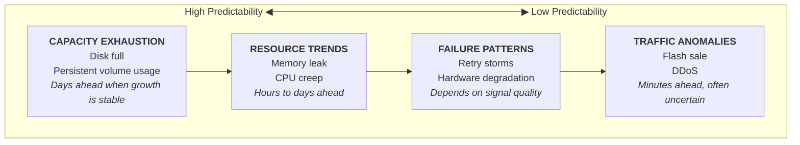
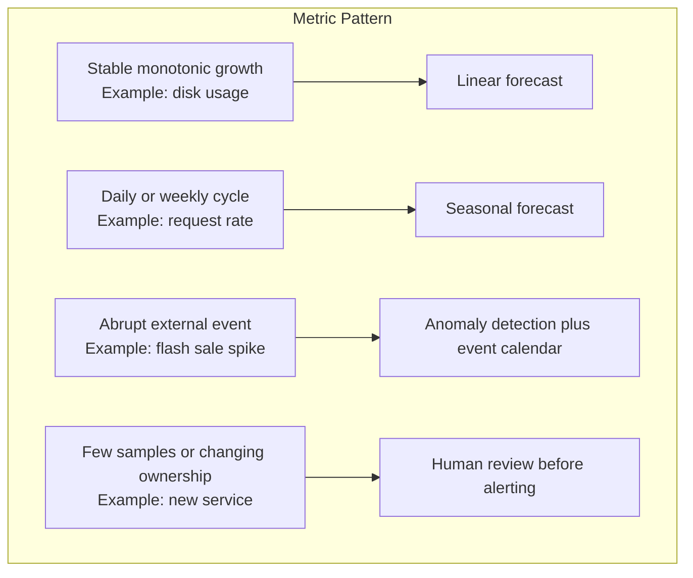
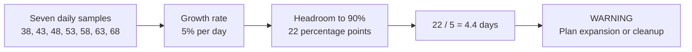
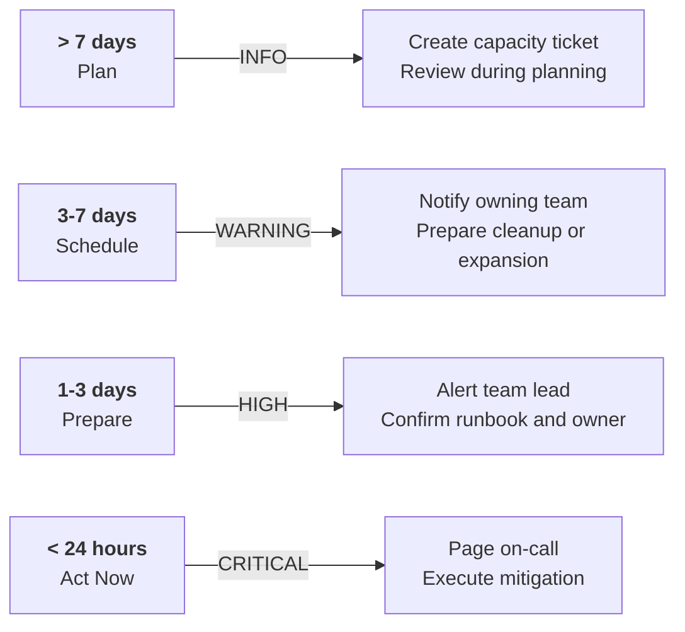
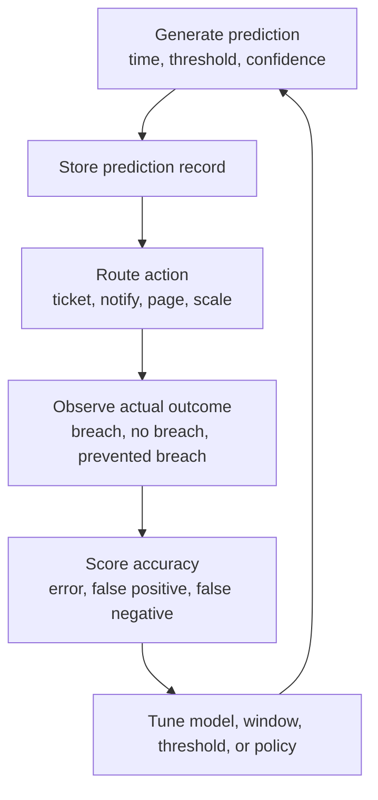
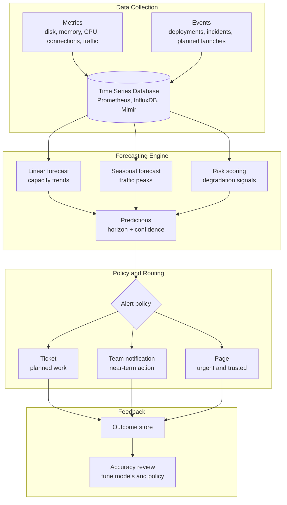

# Module 6.5: Predictive Operations

> **Discipline Track** | Complexity: `[COMPLEX]` | Time: 40-45 min

## Prerequisites

Before starting this module, you should be comfortable reading time-series charts, interpreting basic regression output, and reasoning about operational thresholds. You do not need to be a data scientist, but you do need to know what a metric sample represents, why historical windows matter, and how alert fatigue damages trust in an operations program.

Complete these modules first if the concepts are not fresh:

- [Module 6.2: Anomaly Detection](../module-6.2-anomaly-detection/) — detecting unusual behavior in operational signals.
- [Module 6.4: Root Cause Analysis](../module-6.4-root-cause-analysis/) — connecting symptoms to likely causes.
- Basic statistics — regression, residual error, confidence intervals, and seasonal patterns.
- Capacity planning — thresholds, headroom, growth rates, and service ownership boundaries.

## What You'll Be Able to Do

After completing this module, you will be able to:

- **Design** predictive operations workflows that forecast capacity exhaustion before a customer-facing incident occurs.
- **Evaluate** whether a metric is better served by linear forecasting, seasonal forecasting, anomaly detection, or no model at all.
- **Debug** misleading predictions by tracing input data, model assumptions, confidence, and alert routing decisions.
- **Implement** a small capacity predictor that turns historical disk usage into a time-to-threshold prediction and a tiered alert.
- **Compare** prediction quality against actual outcomes so teams can tune models without creating noisy emergency channels.

## Why This Module Matters

At 02:10 on a Wednesday, an on-call engineer receives a critical disk alert for the primary checkout service. The filesystem is already at ninety-nine percent, compaction is failing, and the queue of write requests is growing. The team knows how to add storage, but the incident has already begun; the next hour is dominated by emergency mitigation, customer messaging, and careful avoidance of data loss.

The painful part is not that the disk filled. The painful part is that the disk had been growing at the same rate for two weeks, and the organization treated every sample as an isolated measurement. A reactive threshold said "page when disk is almost full." A predictive system would have said "this disk will cross the danger threshold during the next business day unless someone acts now." The difference is not a clever model; it is an operational contract that converts trends into timely, trusted decisions.

Predictive operations is the discipline of using historical and current operational signals to estimate what will happen next, then routing that estimate through the right response path. A five-day capacity warning belongs in a planning queue. A twelve-hour high-confidence exhaustion prediction belongs with the owning team today. A low-confidence spike prediction belongs in investigation, not in a pager blast. Senior platform engineers care about these distinctions because prediction without trust becomes another noise source, while prediction with feedback becomes a planning advantage.

## The Predictive Operations Landscape

Predictive operations starts with a practical question: "What future condition would we act on if we knew it early enough?" This wording matters because the goal is not to predict everything. The goal is to predict conditions where earlier action is cheaper, safer, or less disruptive than late action. Disk exhaustion, connection pool saturation, queue backlog, certificate expiry, traffic peaks, and memory leaks are good candidates because teams can intervene before users feel the failure.

Some signals are naturally more predictable than others. A log volume directory that grows by a few percent per day is often predictable because the mechanism is stable and the threshold is obvious. A sudden viral traffic event is less predictable because the cause originates outside the system and the historical trend may not contain a similar event. A useful predictive operations program separates these cases instead of forcing every metric through the same forecasting model.



A mature system usually combines predictive forecasting with reactive detection. Forecasting answers "if this pattern continues, when will we cross a meaningful boundary?" Anomaly detection answers "is the current behavior unexpectedly different from normal?" These are related, but they are not interchangeable. A service can be perfectly normal today and still be on track to exhaust capacity next week; another service can spike dangerously in minutes even though yesterday's forecast looked safe.

| Aspect | Reactive Operations | Predictive Operations |
|--------|---------------------|-----------------------|
| Detection moment | After a threshold breach or symptom appears | Before the threshold is expected to be breached |
| Main question | "What is broken right now?" | "What will break if the current pattern continues?" |
| Response style | Incident response, rollback, emergency scaling | Planned maintenance, targeted scaling, backlog item, guarded automation |
| Primary risk | Late action and customer impact | False confidence, noisy predictions, model drift |
| Best signals | Saturation, errors, latency, availability | Capacity trends, seasonal traffic, degradation slopes, planned event demand |

> **Active learning prompt:** A disk is ninety-five percent full but has not grown for ten days. Another disk is forty percent full and grows by five percentage points per day. Which one should receive the earlier capacity ticket, and which one should receive the immediate safety check? Write down your answer before continuing, because the distinction between current state and trajectory is the core mental model for this module.

The ninety-five percent disk still deserves attention because it has little remaining headroom, but the forty percent disk may be the more urgent planning problem if it will cross the danger threshold soon. Predictive systems do not replace threshold thinking; they add trajectory thinking. The practical design is to combine both: keep hard reactive thresholds for imminent danger, and add forecasts for trends that give the team time to act calmly.

## Forecasting Fundamentals

The simplest useful forecast in operations is a linear extrapolation. It assumes a metric is moving at a roughly constant rate and extends that slope into the future. Linear forecasting is not glamorous, but it is often the right first model for monotonically growing resources such as disk usage, object count, queue depth under stable load, or connection count during a leak.

```mermaid
xychart-beta
    title "Linear Extrapolation"
    x-axis "Days" ["-6", "-5", "-4", "-3", "-2", "-1", "Now", "+1", "+2", "+3", "+4", "+5", "+6"]
    y-axis "Disk %" 20 --> 100
    line [38, 43, 48, 53, 58, 63, 68, 73, 78, 83, 88, 93, 98]
```

The model can be explained without heavy mathematics. Convert timestamps into numeric offsets, fit a line through the samples, calculate the current growth rate, and divide the remaining headroom by that growth rate. If the current usage is sixty-eight percent, the threshold is ninety percent, and the resource is growing five percentage points per day, the model predicts the threshold in about four and a half days.

```python
from __future__ import annotations

from dataclasses import dataclass
from datetime import datetime, timedelta


@dataclass
class ForecastResult:
    days_until: float | None
    predicted_time: datetime | None
    confidence: float
    slope_per_day: float
    current_value: float


class LinearForecaster:
    """Small linear forecaster for operational capacity metrics."""

    def forecast(
        self,
        points: list[tuple[datetime, float]],
        threshold: float,
        now: datetime,
        max_days: float = 30.0,
    ) -> ForecastResult:
        if len(points) < 2:
            return ForecastResult(None, None, 0.0, 0.0, points[-1][1] if points else 0.0)

        start = points[0][0]
        x = [(timestamp - start).total_seconds() / 86_400 for timestamp, _ in points]
        y = [value for _, value in points]

        n = len(points)
        sum_x = sum(x)
        sum_y = sum(y)
        sum_xx = sum(value * value for value in x)
        sum_xy = sum(x_value * y_value for x_value, y_value in zip(x, y))

        denominator = n * sum_xx - sum_x * sum_x
        if denominator == 0:
            return ForecastResult(None, None, 0.0, 0.0, y[-1])

        slope = (n * sum_xy - sum_x * sum_y) / denominator
        intercept = (sum_y - slope * sum_x) / n
        current = y[-1]

        if slope <= 0:
            return ForecastResult(None, None, 0.0, slope, current)

        days_until = (threshold - current) / slope
        if days_until < 0 or days_until > max_days:
            return ForecastResult(None, None, 0.0, slope, current)

        predictions = [slope * value + intercept for value in x]
        residual_sum = sum((actual - predicted) ** 2 for actual, predicted in zip(y, predictions))
        mean_y = sum_y / n
        total_sum = sum((actual - mean_y) ** 2 for actual in y)
        confidence = 1 - residual_sum / total_sum if total_sum else 0.0
        confidence = max(0.0, min(1.0, confidence))

        return ForecastResult(
            days_until=days_until,
            predicted_time=now + timedelta(days=days_until),
            confidence=confidence,
            slope_per_day=slope,
            current_value=current,
        )


if __name__ == "__main__":
    fixed_now = datetime(2026, 4, 26, 9, 0, 0)
    samples = [
        (fixed_now - timedelta(days=6), 38.0),
        (fixed_now - timedelta(days=5), 43.0),
        (fixed_now - timedelta(days=4), 48.0),
        (fixed_now - timedelta(days=3), 53.0),
        (fixed_now - timedelta(days=2), 58.0),
        (fixed_now - timedelta(days=1), 63.0),
        (fixed_now, 68.0),
    ]

    result = LinearForecaster().forecast(samples, threshold=90.0, now=fixed_now)
    print(f"Current usage: {result.current_value:.1f}%")
    print(f"Growth rate: {result.slope_per_day:.1f}% per day")
    print(f"Days until threshold: {result.days_until:.1f}")
    print(f"Predicted breach: {result.predicted_time}")
    print(f"Confidence: {result.confidence:.0%}")
```

This script is intentionally small because the operational reasoning is more important than the library choice. In production, you might use Prometheus range queries, a forecasting library, or a dedicated time-series platform. The core logic remains the same: choose a historical window, estimate the trend, calculate time to threshold, attach uncertainty, and route the result to the correct action.

A linear model becomes dangerous when the metric is seasonal. API gateway traffic often rises during business hours, drops overnight, and behaves differently on weekends. A straight line through that signal can hide the daily peak and produce bad scaling advice. For seasonal metrics, the model must represent repeating patterns or the prediction will average away the very behavior that matters.



> **Active learning prompt:** Your payments API has a normal daily peak at 14:00, but the weekly average is flat. If you train a linear model on seven days of traffic and alert when the average forecast crosses capacity, what failure mode should you expect? Think about whether users experience the average or the peak.

The answer is that users experience the peak, not the average. A model that smooths away the daily peak can say capacity is fine while the service saturates for one hour every afternoon. This is why predictive operations always starts by matching the model to the operational question. If the question is "will the daily peak exceed safe capacity tomorrow?" the model must preserve daily seasonality and uncertainty around the peak.

## Worked Example: Tracing a Disk Forecast

A worked example is where prediction becomes concrete. Suppose a stateful service writes audit records to a persistent volume. The owning team wants an alert when the disk is expected to reach ninety percent within seven days. The platform team collects one sample per day at 09:00, and the last seven samples are shown below.

| Day | Timestamp | Disk Usage | Interpretation |
|-----|-----------|------------|----------------|
| 1 | 2026-04-20 09:00 | 38% | Starting point for the window |
| 2 | 2026-04-21 09:00 | 43% | Five percentage points higher |
| 3 | 2026-04-22 09:00 | 48% | Same growth rate continues |
| 4 | 2026-04-23 09:00 | 53% | Still linear enough to model |
| 5 | 2026-04-24 09:00 | 58% | No obvious deployment jump |
| 6 | 2026-04-25 09:00 | 63% | Trend remains stable |
| 7 | 2026-04-26 09:00 | 68% | Current value used for headroom |

The first pass does not need a complicated formula. The observed growth is thirty percentage points over six day-to-day intervals, which is five percentage points per day. The current usage is sixty-eight percent, and the threshold is ninety percent, so the remaining headroom is twenty-two percentage points. Dividing twenty-two by five gives about four and a half days until the threshold is reached.

That result is actionable because it maps to a response window. Four and a half days is not a page, but it is also not a vague future concern. If the team's policy says "warning for three to seven days," the correct output is a warning routed to the service channel or work queue with the predicted breach time, confidence, and recommended action. The model is not saying the disk will fail at an exact second; it is saying the current trend will remove safe headroom within the planning window.



Now trace the same logic through an alert policy. If the forecast says `days_until = 4.4` and `confidence = 0.99`, the alert should not be downgraded. The historical samples are consistent, and the predicted threshold is inside the warning window. If the confidence were `0.35` because the samples jumped around, the system should still record the prediction, but it should avoid emergency routing until more evidence appears.

```python
from __future__ import annotations

from dataclasses import dataclass


@dataclass
class Prediction:
    resource: str
    days_until: float | None
    confidence: float
    threshold: float


def route_capacity_prediction(prediction: Prediction) -> dict[str, str]:
    if prediction.days_until is None:
        return {
            "severity": "NONE",
            "action": "record",
            "reason": "No actionable threshold breach predicted in the configured window.",
        }

    hours_until = prediction.days_until * 24

    if hours_until <= 24:
        severity = "CRITICAL"
        action = "page"
    elif hours_until <= 72:
        severity = "HIGH"
        action = "alert"
    elif hours_until <= 168:
        severity = "WARNING"
        action = "notify"
    else:
        severity = "INFO"
        action = "ticket"

    if prediction.confidence < 0.5 and severity in {"CRITICAL", "HIGH"}:
        severity = "WARNING"
        action = "notify"

    return {
        "severity": severity,
        "action": action,
        "reason": (
            f"{prediction.resource} is predicted to reach {prediction.threshold:.0f}% "
            f"in {prediction.days_until:.1f} days with {prediction.confidence:.0%} confidence."
        ),
    }


if __name__ == "__main__":
    stable_disk = Prediction(resource="audit-volume", days_until=4.4, confidence=0.99, threshold=90.0)
    noisy_disk = Prediction(resource="cache-volume", days_until=0.7, confidence=0.35, threshold=90.0)

    print(route_capacity_prediction(stable_disk))
    print(route_capacity_prediction(noisy_disk))
```

The second prediction demonstrates a senior-level operating rule: urgency is a function of both time remaining and trust. A low-confidence prediction for the next sixteen hours may deserve investigation, but it should not automatically wake someone unless the organization has decided that the cost of missing the event is higher than the cost of a false page. Predictive operations is therefore not only a modeling problem; it is an alert governance problem.

## Choosing Models and Data Windows

Model choice should be boring and defensible. Start with the simplest model that matches the signal, then add sophistication only when the errors show a real need. This is not anti-ML; it is operational discipline. A simple model with clear assumptions is easier to debug at 02:00 than a black-box model that nobody can explain when it pages the wrong team.

For monotonic capacity growth, linear regression or robust trend estimation is usually enough. For daily or weekly demand, use seasonal decomposition, a forecasting library, or a capacity policy that explicitly evaluates expected peaks. For abrupt external events, a forecast trained only on historical metrics may be the wrong tool; planned-event calendars, rate-limit telemetry, and anomaly detectors often provide better protection.

| Signal | Good First Model | Required Context | Failure Mode to Watch |
|--------|------------------|------------------|-----------------------|
| Disk usage | Linear forecast | Retention policy, cleanup jobs, deployment schedule | Step changes after releases distort the slope |
| Memory leak | Linear or segmented trend | Restart cadence, garbage collection behavior | Restarts hide the leak by resetting the series |
| Request traffic | Seasonal forecast | Business hours, weekend behavior, campaign calendar | Average forecast hides peak saturation |
| Queue backlog | Linear plus workload context | Consumer count, retry policy, downstream latency | Backlog drains after dependency recovery |
| Connection pool | Linear or threshold trend | Pool limit, client release behavior | Short spikes look like persistent leaks |
| Error rate | Anomaly detection plus trend | Deployments, dependency incidents, traffic mix | Low volume produces misleading percentages |

Data windows are just as important as models. A seven-day window can capture weekday behavior, but it may miss month-end load. A thirty-day window can capture more cycles, but it may include old behavior from before a migration. A senior engineer chooses windows based on the system's operating rhythm, not by copying a default value from a dashboard.

There is also a trade-off between responsiveness and stability. Short windows react quickly but are noisy. Long windows are stable but slow to reflect new behavior. For capacity exhaustion, a stable window is often better because the cost of a slightly late planning ticket is lower than the cost of constant false warnings. For traffic scaling ahead of a known campaign, a shorter window plus event metadata may be more useful.

```python
from __future__ import annotations

from statistics import mean


def choose_training_window(metric_name: str, samples_per_day: int, has_weekly_cycle: bool) -> int:
    """Return a defensible minimum sample count for a first forecast iteration."""
    if has_weekly_cycle:
        days = 21
    elif metric_name in {"disk_usage", "object_count", "persistent_volume_usage"}:
        days = 14
    else:
        days = 7

    return days * samples_per_day


def mean_absolute_error(predicted: list[float], actual: list[float]) -> float:
    if len(predicted) != len(actual):
        raise ValueError("predicted and actual must have the same length")
    if not predicted:
        raise ValueError("at least one value is required")
    return mean(abs(p - a) for p, a in zip(predicted, actual))


if __name__ == "__main__":
    hourly_samples = choose_training_window("request_rate", samples_per_day=24, has_weekly_cycle=True)
    print(f"Use at least {hourly_samples} hourly samples for a weekly traffic pattern.")

    predicted_hours_until_breach = [120.0, 96.0, 72.0, 48.0]
    actual_hours_until_breach = [126.0, 90.0, 80.0, 44.0]
    print(f"MAE: {mean_absolute_error(predicted_hours_until_breach, actual_hours_until_breach):.1f} hours")
```

The evaluation function is small, but the practice behind it is powerful. Every prediction should be stored with the timestamp, input window, model version, predicted breach time, confidence, and eventual outcome. Without that feedback loop, teams argue about whether predictions "feel wrong." With it, they can measure mean absolute error, false positives, false negatives, and alert usefulness by service.

## Predictive Alerting and Feedback Loops

A prediction is not an alert until it has passed through an alert policy. This distinction prevents a common failure mode where teams generate many interesting forecasts and send all of them to the same channel. The result is predictable: engineers stop trusting the channel, real warnings are missed, and the predictive system is blamed even if the model was mathematically reasonable.



The alert policy should encode operational intent. If the prediction is far enough away to plan, create a ticket. If it is close enough to require coordination, notify the owning team. If it threatens the current or next on-call shift, page only when confidence and business impact justify the interruption. These policies should be documented, tested, and reviewed after incidents just like reactive alert rules.

Confidence intervals matter because forecast values are not facts. A forecast might say tomorrow's peak traffic is ten thousand requests per second, with a lower estimate of eight thousand and an upper estimate of thirteen thousand. If current safe capacity is eleven thousand, the expected value looks acceptable while the upper bound suggests real risk. Capacity decisions should often use the upper bound, while paging decisions should require both risk and confidence.

```python
from __future__ import annotations

from dataclasses import dataclass


@dataclass
class TrafficForecast:
    expected_peak: float
    upper_bound: float
    current_capacity: float
    peak_hour: str


def recommend_scaling(forecast: TrafficForecast) -> dict[str, str]:
    safe_target = forecast.current_capacity * 0.70
    page_boundary = forecast.current_capacity * 1.00
    planning_boundary = forecast.current_capacity * 0.90

    if forecast.upper_bound >= page_boundary:
        return {
            "severity": "HIGH",
            "action": "scale_before_peak",
            "reason": (
                f"Upper bound {forecast.upper_bound:.0f} exceeds current capacity "
                f"{forecast.current_capacity:.0f} near {forecast.peak_hour}."
            ),
        }

    if forecast.upper_bound >= planning_boundary:
        scale_factor = forecast.upper_bound / safe_target
        return {
            "severity": "WARNING",
            "action": "prepare_scale_up",
            "reason": f"Scale by about {scale_factor:.1f}x to keep forecast peak near seventy percent utilization.",
        }

    return {
        "severity": "INFO",
        "action": "no_scale_change",
        "reason": "Forecast peak remains inside the planned headroom.",
    }


if __name__ == "__main__":
    forecast = TrafficForecast(
        expected_peak=9_800,
        upper_bound=12_300,
        current_capacity=11_000,
        peak_hour="14:00",
    )
    print(recommend_scaling(forecast))
```

A feedback loop closes the system. After the predicted window passes, compare what happened with what the model predicted. Did the disk cross the threshold? Did the team expand storage before the breach, making the prediction impossible to observe directly? Did a deployment change the growth rate? These are not annoyances; they are the evidence needed to improve the system.



Senior teams also evaluate prevented incidents differently from false positives. If a prediction says a disk will fill in four days and the team expands the volume on day two, the disk never fills. That does not mean the prediction was false. The record should mark the outcome as "prevented by action" and compare the pre-action trend with the intervention. Otherwise, the system punishes itself for successful prevention.

## Predictive Operations Architecture

A production architecture separates data collection, forecasting, alert policy, and action execution. This separation makes the system easier to debug. If an alert is wrong, you can ask whether the source metric was wrong, the query window was wrong, the model was wrong, the policy was wrong, or the receiving workflow was wrong. Bundling everything into one opaque job makes those questions harder.



Kubernetes adds useful implementation hooks, but the architectural idea is platform-agnostic. Prometheus can hold the metrics. A CronJob can run hourly forecasts. The output can be written to a small database, pushed to Alertmanager, or exposed as custom metrics that existing alerting tools consume. For automated scaling, the forecast should pass through guardrails such as maximum scale factor, business-hour restrictions, and owner approval for risky actions.

The same architecture also supports failure prediction. Instead of forecasting one capacity threshold, the system combines degradation signals such as error rate, p99 latency increase, retry rate, CPU pressure, and memory pressure. Each signal contributes to a risk score, and the risk score is trended over time. This is less precise than disk forecasting, so the response should usually begin with investigation rather than immediate remediation.

```python
from __future__ import annotations


class FailureRiskScorer:
    """Combine degradation signals into a simple operational risk score."""

    signals = {
        "error_rate": {"weight": 0.30, "threshold": 5.0},
        "p99_latency_multiplier": {"weight": 0.25, "threshold": 2.0},
        "retry_rate": {"weight": 0.20, "threshold": 10.0},
        "cpu_pressure": {"weight": 0.15, "threshold": 80.0},
        "memory_pressure": {"weight": 0.10, "threshold": 85.0},
    }

    def score(self, metrics: dict[str, float]) -> tuple[float, list[str]]:
        risk = 0.0
        factors: list[str] = []

        for signal, config in self.signals.items():
            if signal not in metrics:
                continue

            value = metrics[signal]
            threshold = config["threshold"]
            weight = config["weight"]

            if value >= threshold:
                contribution = weight
                factors.append(f"{signal} crossed threshold with value {value}")
            elif value >= threshold * 0.70:
                contribution = weight * (value / threshold)
                factors.append(f"{signal} is approaching threshold with value {value}")
            else:
                contribution = 0.0

            risk += contribution

        return min(1.0, risk), factors


if __name__ == "__main__":
    scorer = FailureRiskScorer()
    service_metrics = {
        "error_rate": 4.2,
        "p99_latency_multiplier": 2.3,
        "retry_rate": 11.0,
        "cpu_pressure": 72.0,
        "memory_pressure": 65.0,
    }

    score, factors = scorer.score(service_metrics)
    print(f"Risk score: {score:.2f}")
    for factor in factors:
        print(f"- {factor}")
```

This risk scorer is deliberately transparent. A responder can see which inputs contributed to the score and challenge the assumptions. That transparency is essential when predictions influence operational urgency. If the model says a service is at high risk, the team must be able to understand whether the risk comes from a real multi-signal degradation pattern or from one noisy percentage metric during low traffic.

Predictive operations reaches senior maturity when it influences planning, not just alerting. Capacity forecasts should inform quarterly infrastructure budgets. Traffic forecasts should influence launch readiness reviews. Failure-risk trends should guide reliability backlog prioritization. The best signal that a predictive program is working is not a prettier dashboard; it is fewer surprise incidents, calmer maintenance work, and more defensible capacity decisions.

## Did You Know?

- **Predictive maintenance ideas came from physical operations before software adopted them**: manufacturing and aviation teams used degradation signals because replacing parts during scheduled maintenance was cheaper than waiting for failure.
- **Seasonality can be more important than growth**: a service with flat weekly average traffic can still fail every weekday afternoon if its peak demand is close to capacity.
- **A prevented breach needs special accounting**: if engineers expand capacity after a good prediction, the threshold may never be crossed, but that outcome should be recorded as a successful intervention rather than a false alarm.
- **Confidence is part of the product**: teams trust forecasts more when the system explains uncertainty, input windows, and recommended action instead of presenting one predicted timestamp as a certainty.

## Common Mistakes

| Mistake | Why It Hurts | Better Practice |
|---------|--------------|-----------------|
| Using a linear model for seasonal traffic | The average trend hides daily or weekly peaks, so capacity can look safe while users hit saturation during peak periods. | Use a seasonal model, peak-based policy, or event-aware forecast for user-driven request patterns. |
| Alerting on every prediction | Forecasts become another noisy channel, and engineers stop trusting the system before it prevents meaningful incidents. | Separate prediction generation from alert routing, then page only for urgent, trusted, high-impact predictions. |
| Ignoring confidence and bounds | A single predicted timestamp looks precise even when the input data is noisy or the future range is wide. | Include confidence, lower and upper estimates, and policy rules that treat uncertainty as operational information. |
| Training on the wrong window | Too little history misses cycles, while too much history can include behavior that no longer represents the service. | Choose windows based on the metric's operating rhythm, then review forecast error after real outcomes. |
| Treating prevented incidents as false positives | Successful mitigation removes the predicted breach, which can make the model look wrong if the action is not recorded. | Store whether a prediction led to cleanup, expansion, rollback, or scaling before scoring the outcome. |
| Forecasting metrics with no action path | Teams receive interesting predictions but cannot decide who owns the response or what should change. | Define the threshold, owner, runbook, and routing path before putting a forecast into production. |
| Hiding model assumptions | Responders cannot debug a bad forecast, so trust collapses after the first visible mistake. | Expose input samples, training window, slope or seasonal factors, confidence, and policy decision in the alert. |
| Replacing reactive alerts entirely | Sudden failures and external spikes can happen faster than forecasts update, leaving the system blind to immediate danger. | Combine predictive warnings with reactive saturation, error, latency, and availability alerts. |

## Quiz

<details>
<summary>1. Your team forecasts persistent volume usage for a logging service. The model predicts the disk will cross ninety percent in five days with high confidence, but current usage is only sixty-five percent. A teammate says no ticket is needed because the disk is not close to full yet. What should you do?</summary>

Create a capacity ticket or team notification because the prediction is inside the planning window even though the current value is not alarming. The teammate is reasoning from current state only, while the forecast adds trajectory. You should include the growth rate, predicted breach time, confidence, and recommended action so the owning team can clean up logs, expand storage, or adjust retention before the threshold becomes urgent.
</details>

<details>
<summary>2. An API gateway has strong weekday traffic peaks at 14:00 and very low weekend traffic. A linear forecast over the last month says the average request rate will remain below capacity. During business hours, users still see latency spikes. What do you change first?</summary>

Change the modeling question and model type so the forecast evaluates peak demand rather than average demand. A linear average can smooth away the daily peak that users actually experience. Use a seasonal forecast, peak-based capacity check, or explicit business-hour policy, and compare the upper forecast bound against safe capacity before the peak arrives.
</details>

<details>
<summary>3. A predictive alert says a database connection pool will exhaust in twelve hours, but confidence is thirty-eight percent because the last two samples came from a short deploy-related spike. The default policy would page for predictions under twenty-four hours. How should the alert be routed?</summary>

It should usually be downgraded to investigation or team notification rather than an immediate page, unless the service has an explicit policy that favors paging on uncertain connection risk. The low confidence and known deploy spike weaken the prediction. A good response is to record the forecast, watch the next samples, check whether connections return to baseline, and page only if the trend persists or impact appears.
</details>

<details>
<summary>4. A disk forecast predicted threshold breach in four days. The team expanded the volume on day two, so the disk never crossed the threshold. During model review, someone labels the prediction a false positive. How do you correct the review?</summary>

Mark the outcome as a prevented breach or successful intervention, not as a normal false positive. The prediction caused an action that changed the future series. To review accuracy, inspect the pre-action trend, the confidence, and whether the recommended action was appropriate. Counting all prevented incidents as false positives would train the organization to distrust useful early warnings.
</details>

<details>
<summary>5. Your platform team wants to forecast memory leaks for a service that restarts every night during deployment. The daily chart appears stable because memory drops after each restart, but incidents occur when a deploy is skipped. What should the predictor account for?</summary>

The predictor should account for restart events and evaluate the within-uptime slope rather than treating the reset as proof of stability. Nightly restarts hide the leak by resetting the series. A better approach is to segment the data by process uptime, forecast memory growth inside each segment, and alert when the leak rate would exceed safe memory if a restart does not happen.
</details>

<details>
<summary>6. A new predictive system sends warnings for every service whose CPU forecast might exceed eighty percent in the next week. Service owners complain that most warnings are not actionable because they do not know what to do with them. What design gap caused this?</summary>

The system forecasted a metric without defining the operational action path. A useful prediction needs an owner, threshold rationale, confidence, runbook, and routing policy. CPU also needs workload context because high CPU can be efficient use rather than danger. The team should restrict alerts to predictions tied to service-specific impact and clear remediation steps.
</details>

<details>
<summary>7. A launch review expects a large traffic increase tomorrow. Historical traffic has never contained a similar event, but the team wants the forecasting system to decide whether to scale. What should a senior engineer recommend?</summary>

Do not rely only on a historical forecast because the event is outside the training data. Add launch metadata, expected campaign demand, load-test results, or manual capacity assumptions. The forecast can still show normal baseline traffic, but the scaling decision should use an event-aware estimate and guardrails such as maximum utilization targets, rollback plans, and active monitoring during the launch.
</details>

<details>
<summary>8. A model has become less accurate after a storage migration changed write patterns. The alert policy and thresholds stayed the same, but prediction error doubled. What should you inspect before replacing the model?</summary>

Inspect the input window, service behavior change, threshold meaning, and feedback records. The model may be using historical data from before the migration, so its assumptions no longer match the system. Shortening or resetting the training window, adding deployment or migration events, and rescoring recent predictions may fix the issue without replacing a transparent model with a more complex one.
</details>

## Hands-On Exercise: Build a Capacity Predictor

In this exercise, you will build a small disk-capacity predictor and route its output through an alert policy. The goal is not to create a production forecasting platform. The goal is to practice the reasoning loop from data to trend, from trend to threshold, from threshold to action, and from action to verification.

### Step 1: Create a Small Workspace

Use a temporary directory outside the repository if you are experimenting locally. The scripts use only standard Python libraries, so they should run anywhere with Python 3.12 or newer.

```bash
mkdir capacity-predictor
cd capacity-predictor
```

Create a file named `generate_data.py`:

```python
from __future__ import annotations

import csv
from datetime import datetime, timedelta
from random import Random


def generate_disk_usage(path: str, days: int = 21, growth_per_day: float = 2.2) -> None:
    random = Random(42)
    start = datetime(2026, 4, 1, 9, 0, 0)
    base = 41.0

    with open(path, "w", newline="", encoding="utf-8") as handle:
        writer = csv.DictWriter(handle, fieldnames=["timestamp", "usage"])
        writer.writeheader()

        for day in range(days):
            timestamp = start + timedelta(days=day)
            deployment_step = 3.0 if day >= 12 else 0.0
            noise = random.uniform(-0.4, 0.4)
            usage = base + day * growth_per_day + deployment_step + noise
            writer.writerow(
                {
                    "timestamp": timestamp.isoformat(),
                    "usage": f"{usage:.2f}",
                }
            )


if __name__ == "__main__":
    generate_disk_usage("disk_usage.csv")
    print("Wrote disk_usage.csv")
```

Run it:

```bash
python generate_data.py
head disk_usage.csv
tail disk_usage.csv
```

### Step 2: Implement the Predictor

Create a file named `predictor.py`:

```python
from __future__ import annotations

import csv
from dataclasses import dataclass
from datetime import datetime, timedelta


@dataclass
class Forecast:
    current: float
    slope_per_day: float
    days_until: float | None
    breach_time: datetime | None
    confidence: float


def read_points(path: str) -> list[tuple[datetime, float]]:
    points: list[tuple[datetime, float]] = []

    with open(path, newline="", encoding="utf-8") as handle:
        reader = csv.DictReader(handle)
        for row in reader:
            points.append((datetime.fromisoformat(row["timestamp"]), float(row["usage"])))

    return points


def linear_forecast(points: list[tuple[datetime, float]], threshold: float) -> Forecast:
    if len(points) < 2:
        raise ValueError("at least two points are required")

    start = points[0][0]
    x = [(timestamp - start).total_seconds() / 86_400 for timestamp, _ in points]
    y = [usage for _, usage in points]

    n = len(points)
    sum_x = sum(x)
    sum_y = sum(y)
    sum_xx = sum(value * value for value in x)
    sum_xy = sum(x_value * y_value for x_value, y_value in zip(x, y))
    denominator = n * sum_xx - sum_x * sum_x

    if denominator == 0:
        raise ValueError("timestamps must not all be identical")

    slope = (n * sum_xy - sum_x * sum_y) / denominator
    intercept = (sum_y - slope * sum_x) / n
    current = y[-1]

    predictions = [slope * value + intercept for value in x]
    residual_sum = sum((actual - predicted) ** 2 for actual, predicted in zip(y, predictions))
    mean_y = sum_y / n
    total_sum = sum((actual - mean_y) ** 2 for actual in y)
    confidence = 1 - residual_sum / total_sum if total_sum else 0.0
    confidence = max(0.0, min(1.0, confidence))

    if slope <= 0 or current >= threshold:
        return Forecast(current, slope, None, None, confidence)

    days_until = (threshold - current) / slope
    breach_time = points[-1][0] + timedelta(days=days_until)

    return Forecast(current, slope, days_until, breach_time, confidence)


def route_alert(forecast: Forecast) -> dict[str, str]:
    if forecast.days_until is None:
        return {
            "severity": "NONE",
            "action": "record",
            "message": "No future threshold breach predicted from the current trend.",
        }

    hours = forecast.days_until * 24

    if hours <= 24:
        severity = "CRITICAL"
        action = "page"
    elif hours <= 72:
        severity = "HIGH"
        action = "alert"
    elif hours <= 168:
        severity = "WARNING"
        action = "notify"
    else:
        severity = "INFO"
        action = "ticket"

    if forecast.confidence < 0.5 and severity in {"CRITICAL", "HIGH"}:
        severity = "WARNING"
        action = "notify"

    return {
        "severity": severity,
        "action": action,
        "message": (
            f"Disk is {forecast.current:.1f}% full, growing {forecast.slope_per_day:.2f}% per day, "
            f"and is predicted to cross the threshold in {forecast.days_until:.1f} days."
        ),
    }


if __name__ == "__main__":
    points = read_points("disk_usage.csv")
    forecast = linear_forecast(points, threshold=90.0)
    alert = route_alert(forecast)

    print("=== Forecast ===")
    print(f"Current usage: {forecast.current:.1f}%")
    print(f"Growth rate: {forecast.slope_per_day:.2f}% per day")
    print(f"Days until threshold: {forecast.days_until:.1f}")
    print(f"Breach time: {forecast.breach_time}")
    print(f"Confidence: {forecast.confidence:.0%}")
    print()
    print("=== Alert ===")
    print(f"Severity: {alert['severity']}")
    print(f"Action: {alert['action']}")
    print(alert["message"])
```

Run the predictor:

```bash
python predictor.py
```

### Step 3: Trace the Result by Hand

Before changing any code, verify that the output makes sense. Look at the first and last values in `disk_usage.csv`, estimate the rough daily growth, and divide the remaining headroom by that growth. Your hand estimate does not need to match the regression exactly, but it should be close enough to catch obvious mistakes such as using hours as days or subtracting the threshold in the wrong direction.

Write down answers to these prompts:

- [ ] What is the current disk usage in the final sample?
- [ ] What is the approximate daily growth rate from the generated data?
- [ ] How many percentage points remain before the ninety percent threshold?
- [ ] Does the predicted number of days match the rough headroom divided by the growth rate?
- [ ] Which alert tier did the prediction choose, and does that tier match the time horizon?

### Step 4: Test a Low-Confidence Scenario

Edit `generate_data.py` so the usage includes larger noise, then regenerate the CSV and rerun the predictor. For example, change `random.uniform(-0.4, 0.4)` to `random.uniform(-5.0, 5.0)`. The purpose is to observe how a noisy history changes confidence and why the routing policy should not treat every short-horizon prediction as equally trustworthy.

Run:

```bash
python generate_data.py
python predictor.py
```

Then inspect the output and answer:

- [ ] Did the confidence drop compared with the stable data?
- [ ] Did the predicted breach time become less believable when you inspected the CSV?
- [ ] Would you page an on-call engineer from this forecast alone?
- [ ] What additional evidence would you want before escalating?

### Step 5: Add an Outcome Record

Create a file named `record_outcome.py`:

```python
from __future__ import annotations

import json
from datetime import datetime


def write_outcome(path: str, prediction: dict[str, object]) -> None:
    with open(path, "w", encoding="utf-8") as handle:
        json.dump(prediction, handle, indent=2, default=str)


if __name__ == "__main__":
    outcome = {
        "recorded_at": datetime.now().isoformat(timespec="seconds"),
        "resource": "demo-disk",
        "prediction": "disk threshold breach predicted",
        "action_taken": "expanded volume before breach",
        "outcome": "prevented_by_action",
        "review_note": "Do not count this as a normal false positive during model review.",
    }
    write_outcome("outcome.json", outcome)
    print("Wrote outcome.json")
```

Run it:

```bash
python record_outcome.py
cat outcome.json
```

This final step reinforces the feedback loop. Predictive operations becomes useful when predictions, actions, and outcomes are reviewed together. A prediction that drives successful prevention should improve trust in the system, not disappear from the evidence trail.

### Success Criteria

You've completed this exercise when:

- [ ] You generated a realistic disk-usage CSV with daily samples.
- [ ] You implemented a runnable linear forecast using standard Python libraries.
- [ ] You traced a specific input set to a specific threshold prediction.
- [ ] You routed the prediction through a tiered alert policy.
- [ ] You tested how noisy data changes confidence and operational trust.
- [ ] You recorded an outcome that distinguishes a prevented breach from a false positive.
- [ ] You can explain why a seasonal traffic metric needs a different model than a steadily growing disk.

## Next Module

Continue to [Module 6.6: Auto-Remediation](../module-6.6-auto-remediation/) to learn how to safely automate corrective actions after predictions, alerts, and guardrails agree that automation is appropriate.
