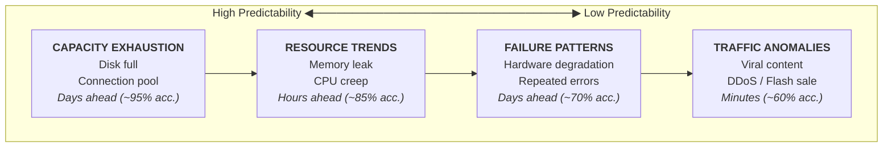
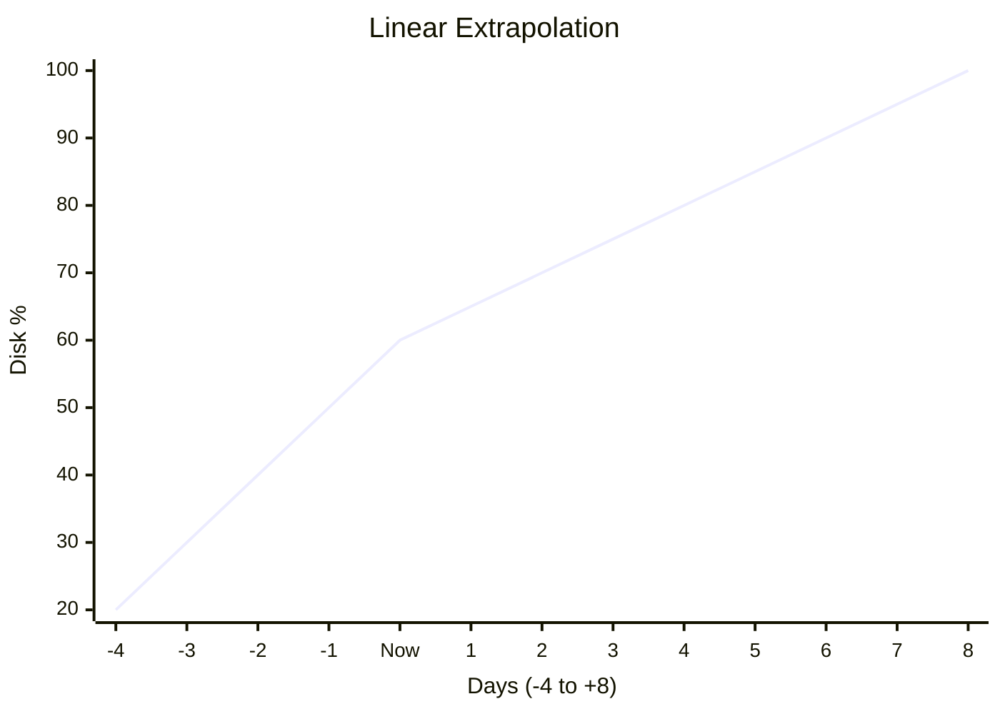
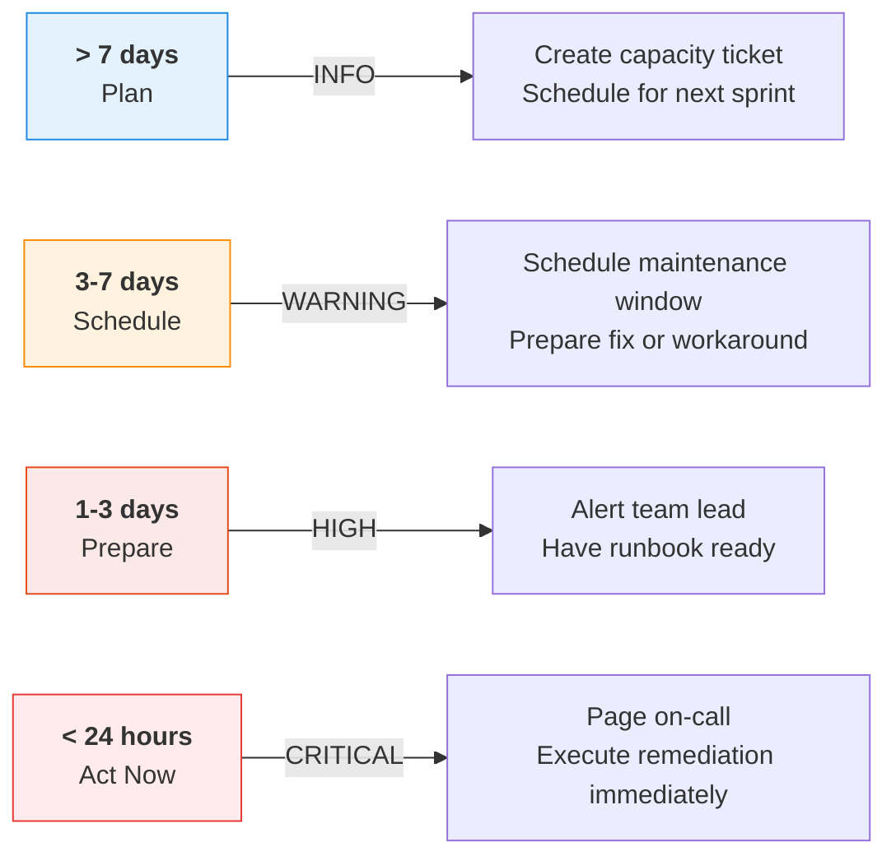
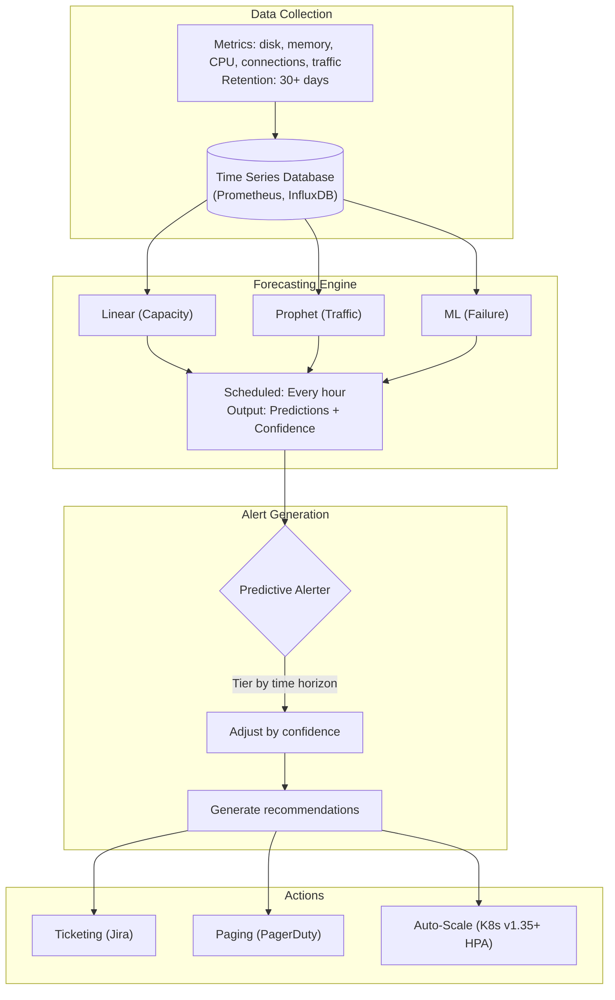

> **Discipline Track** | Complexity: `[COMPLEX]` | Time: 40-45 min

## Prerequisites

Before starting this module:
- [Module 6.2: Anomaly Detection](../module-6.2-anomaly-detection/) — Time series analysis
- [Module 6.4: Root Cause Analysis](../module-6.4-root-cause-analysis/) — Understanding causality
- Basic statistics (regression, forecasting concepts)
- Familiarity with capacity planning

## What You'll Be Able to Do

After completing this module, you will be able to:

- **Implement predictive models that forecast resource exhaustion, capacity limits, and potential failures**
- **Design early warning systems that alert teams before SLO violations occur**
- **Build capacity prediction pipelines using time-series forecasting on operational metrics**
- **Evaluate predictive accuracy and tune models to minimize false alarms while catching real predictions**

## Why This Module Matters

Reactive operations mean you're always behind. By the time you see the alert, users are already impacted. Predictive operations flip the script—you fix problems before they happen.

Disk full in 3 days? Scale now. Memory leak causing crash in 6 hours? Fix the code today. Traffic spike expected next Monday? Provision capacity Friday. This is the difference between firefighting and engineering.

## Did You Know?

- **Predictive maintenance in manufacturing reduces downtime by 45%** according to McKinsey—the same principles apply to software systems
- **Netflix's Zuul gateway predicts traffic patterns** 30 minutes ahead to pre-scale infrastructure
- **Google's Borg scheduler uses ML** to predict container resource needs before allocation
- **85% of disk failures show warning signs** 30+ days before failure—most organizations don't monitor for them

## The Predictive Operations Landscape

### What Can We Predict?



> **Stop and think**: Why is a 95% full disk with 0% growth less dangerous than a 40% full disk with 5% daily growth? Reactive systems alert on the 95% full disk and cause immediate panic, while predictive systems foresee the trajectory of the 40% full disk and allow for planned mitigation.

### Predictive vs Reactive

| Aspect | Reactive | Predictive |
|--------|----------|------------|
| **Detection** | After threshold breach | Before threshold approach |
| **Response time** | Limited (incident mode) | Planned (maintenance mode) |
| **User impact** | Usually impacted | Usually prevented |
| **Stress level** | High (firefighting) | Low (engineering) |
| **Cost** | Emergency response | Scheduled maintenance |

## Forecasting Fundamentals

### Linear Extrapolation

The simplest prediction: extend the trend line.



```python
import numpy as np
from datetime import datetime, timedelta

class LinearForecaster:
    """
    Simple linear extrapolation for resource forecasting.

    Best for: Disk usage, connection growth, queue sizes
    """
    def __init__(self):
        self.timestamps = []
        self.values = []

    def add_point(self, timestamp, value):
        """Add a data point."""
        self.timestamps.append(timestamp.timestamp())
        self.values.append(value)

    def forecast(self, threshold, max_days=30):
        """
        Predict when threshold will be reached.

        Returns: (days_until, predicted_time, confidence)
        """
        if len(self.values) < 2:
            return None, None, 0

        # Linear regression
        x = np.array(self.timestamps)
        y = np.array(self.values)

        # Fit: y = mx + b
        n = len(x)
        m = (n * np.sum(x * y) - np.sum(x) * np.sum(y)) / \
            (n * np.sum(x**2) - np.sum(x)**2)
        b = (np.sum(y) - m * np.sum(x)) / n

        # Current value and growth rate
        current = y[-1]
        rate_per_day = m * 86400  # Convert seconds to days

        if rate_per_day <= 0:
            # Not growing or shrinking
            return None, None, 0

        # Time to threshold
        days_until = (threshold - current) / rate_per_day

        if days_until > max_days or days_until < 0:
            return None, None, 0

        predicted_time = datetime.now() + timedelta(days=days_until)

        # Confidence based on R-squared
        y_pred = m * x + b
        ss_res = np.sum((y - y_pred) ** 2)
        ss_tot = np.sum((y - np.mean(y)) ** 2)
        r_squared = 1 - (ss_res / ss_tot) if ss_tot > 0 else 0
        confidence = max(0, r_squared)

        return days_until, predicted_time, confidence

# Usage
forecaster = LinearForecaster()

# Historical disk usage data
for i in range(7):
    ts = datetime.now() - timedelta(days=7-i)
    value = 30 + i * 5  # 5% per day growth
    forecaster.add_point(ts, value)

days, when, conf = forecaster.forecast(threshold=90)
# days ≈ 5, conf ≈ 0.99
```

> **Pause and predict**: If your application suddenly receives a 5x traffic spike due to a viral social media post, which predictive model will catch this fastest? Linear models rely on historical trends and take time to shift their slope, meaning they are often too slow for instant anomalies. This is why a mature observability stack utilizes both predictive forecasting and instantaneous anomaly detection.

### Seasonal Forecasting with Prophet

For metrics with patterns (daily, weekly cycles):

```python
from prophet import Prophet
import pandas as pd
from datetime import datetime, timedelta

class SeasonalForecaster:
    """
    Forecast with seasonality awareness using Prophet.

    Best for: Traffic, request rates, user-driven metrics
    """
    def __init__(self, daily_seasonality=True, weekly_seasonality=True):
        self.daily = daily_seasonality
        self.weekly = weekly_seasonality
        self.model = None

    def train(self, df):
        """
        Train on historical data.

        df must have columns: 'ds' (timestamp), 'y' (value)
        """
        self.model = Prophet(
            daily_seasonality=self.daily,
            weekly_seasonality=self.weekly,
            interval_width=0.95
        )
        self.model.fit(df)

    def forecast(self, periods, freq='H'):
        """
        Generate forecast.

        Returns DataFrame with:
        - ds: timestamp
        - yhat: predicted value
        - yhat_lower: lower bound (95% CI)
        - yhat_upper: upper bound (95% CI)
        """
        if self.model is None:
            raise ValueError("Must train model first")

        future = self.model.make_future_dataframe(
            periods=periods,
            freq=freq
        )
        forecast = self.model.predict(future)

        return forecast[['ds', 'yhat', 'yhat_lower', 'yhat_upper']]

    def predict_threshold_breach(self, threshold, max_periods=168):
        """
        Predict when threshold will be breached.

        Returns: (timestamp, confidence) or (None, 0)
        """
        forecast = self.forecast(max_periods)

        # Find first breach
        for _, row in forecast.iterrows():
            if row['yhat'] >= threshold:
                # Confidence based on how certain we are
                if row['yhat_lower'] >= threshold:
                    confidence = 0.95  # Lower bound exceeds
                elif row['yhat_upper'] >= threshold:
                    confidence = 0.75  # Only upper bound exceeds
                else:
                    confidence = 0.5
                return row['ds'], confidence

        return None, 0

# Usage
df = pd.DataFrame({
    'ds': pd.date_range('2024-01-01', periods=168, freq='H'),
    'y': generate_traffic_pattern()  # Your traffic data
})

forecaster = SeasonalForecaster()
forecaster.train(df)

# Forecast next 7 days
forecast = forecaster.forecast(periods=168)

# When will we hit capacity?
breach_time, conf = forecaster.predict_threshold_breach(threshold=10000)
```

## Predictive Use Cases

### 1. Capacity Exhaustion Prediction

```mermaid
graph TD
    subgraph "Resource Types"
        direction LR
        A["<b>DISK</b><br>Threshold: 90%<br>Growth: Linear<br>Accuracy: High"]
        B["<b>MEMORY</b><br>Threshold: 85%<br>Growth: Mixed<br>Accuracy: Med"]
        C["<b>CONNECTIONS</b><br>Threshold: 80%<br>Growth: Step<br>Accuracy: Med"]
    end

    subgraph "Forecast Engine"
        F1["1. Collect historical data (7-30 days)"]
        F2["2. Fit appropriate model"]
        F3["3. Predict time to threshold"]
        F4["4. Generate alert if < X days"]
        F1 --> F2 --> F3 --> F4
    end

    subgraph "Alert Tiers"
        T1["INFO: > 7 days"]
        T2["WARNING: 3-7 days"]
        T3["HIGH: 1-3 days"]
        T4["CRITICAL: < 1 day"]
    end

    A --> Forecast Engine
    B --> Forecast Engine
    C --> Forecast Engine
    Forecast Engine --> Alert Tiers
```

```python
class CapacityPredictor:
    """
    Predict capacity exhaustion across resource types.
    """
    RESOURCES = {
        'disk': {
            'threshold': 90,
            'model': 'linear',
            'warn_days': [7, 3, 1]
        },
        'memory': {
            'threshold': 85,
            'model': 'linear',
            'warn_days': [3, 1, 0.5]
        },
        'connections': {
            'threshold_ratio': 0.8,  # 80% of max
            'model': 'linear',
            'warn_days': [1, 0.5, 0.25]
        }
    }

    def __init__(self):
        self.forecasters = {}

    def predict_all(self, metrics_data):
        """
        Predict capacity exhaustion for all resources.

        Returns list of predictions with severity levels.
        """
        predictions = []

        for resource, config in self.RESOURCES.items():
            if resource not in metrics_data:
                continue

            data = metrics_data[resource]
            forecaster = LinearForecaster()

            for ts, value in data:
                forecaster.add_point(ts, value)

            threshold = config.get('threshold', 100)
            days, when, conf = forecaster.forecast(threshold)

            if days is None:
                continue

            # Determine severity
            warn_days = config['warn_days']
            if days < warn_days[2]:
                severity = 'CRITICAL'
            elif days < warn_days[1]:
                severity = 'HIGH'
            elif days < warn_days[0]:
                severity = 'WARNING'
            else:
                severity = 'INFO'

            predictions.append({
                'resource': resource,
                'days_until': days,
                'predicted_time': when,
                'confidence': conf,
                'severity': severity,
                'message': f"{resource} will reach {threshold}% in {days:.1f} days"
            })

        return sorted(predictions, key=lambda p: p['days_until'])
```

### 2. Failure Prediction

Predict component failures based on degradation patterns:

```python
class FailurePredictor:
    """
    Predict failures based on degradation signals.

    Key insight: Most failures show warning signs:
    - Increasing error rates
    - Latency degradation
    - Resource pressure
    - Retry rate increase
    """
    # Degradation indicators
    SIGNALS = {
        'error_rate': {'weight': 0.3, 'threshold': 5},  # 5% error rate
        'p99_latency_increase': {'weight': 0.25, 'threshold': 2},  # 2x increase
        'retry_rate': {'weight': 0.2, 'threshold': 10},  # 10% retry rate
        'cpu_pressure': {'weight': 0.15, 'threshold': 80},
        'memory_pressure': {'weight': 0.1, 'threshold': 85}
    }

    def calculate_failure_risk(self, service_metrics):
        """
        Calculate failure risk score for a service.

        Returns: (risk_score 0-1, contributing_factors)
        """
        risk_score = 0
        factors = []

        for signal, config in self.SIGNALS.items():
            if signal not in service_metrics:
                continue

            current = service_metrics[signal]
            threshold = config['threshold']
            weight = config['weight']

            # Calculate contribution
            if current >= threshold:
                contribution = weight  # Full weight
                factors.append({
                    'signal': signal,
                    'value': current,
                    'threshold': threshold,
                    'contribution': contribution
                })
            elif current >= threshold * 0.7:
                # Partial contribution for approaching threshold
                ratio = current / threshold
                contribution = weight * ratio
                factors.append({
                    'signal': signal,
                    'value': current,
                    'threshold': threshold,
                    'contribution': contribution
                })
            else:
                contribution = 0

            risk_score += contribution

        # Normalize to 0-1
        risk_score = min(1.0, risk_score)

        return risk_score, factors

    def predict_failure_window(self, service, metrics_history):
        """
        Predict failure window based on signal trends.

        Returns: estimated hours until failure, confidence
        """
        current_risk, _ = self.calculate_failure_risk(
            metrics_history[-1] if metrics_history else {}
        )

        if current_risk < 0.3:
            return None, 0  # Low risk, no prediction

        # Calculate risk trend
        if len(metrics_history) >= 3:
            risks = [
                self.calculate_failure_risk(m)[0]
                for m in metrics_history[-6:]  # Last 6 data points
            ]

            # Linear extrapolation to risk = 1.0
            x = np.arange(len(risks))
            y = np.array(risks)

            if len(x) >= 2:
                slope = np.polyfit(x, y, 1)[0]

                if slope > 0:
                    # Hours until risk = 1.0
                    data_interval_hours = 1  # Assuming hourly data
                    points_to_failure = (1.0 - current_risk) / slope
                    hours = points_to_failure * data_interval_hours

                    confidence = min(0.9, current_risk)  # Higher risk = higher confidence
                    return hours, confidence

        return None, current_risk
```

### 3. Traffic Prediction

Forecast traffic for capacity planning:

```python
class TrafficPredictor:
    """
    Predict traffic patterns for proactive scaling.
    """
    def __init__(self):
        self.model = None
        self.historical_peaks = []

    def train(self, traffic_data):
        """
        Train on historical traffic data.

        traffic_data: DataFrame with 'ds' and 'y' columns
        """
        self.model = Prophet(
            daily_seasonality=True,
            weekly_seasonality=True,
            yearly_seasonality=True
        )
        self.model.fit(traffic_data)

        # Track historical peaks
        for _, row in traffic_data.iterrows():
            self.historical_peaks.append(row['y'])

    def forecast_next_hours(self, hours=24):
        """Forecast traffic for next N hours."""
        if not self.model:
            raise ValueError("Model not trained")

        future = self.model.make_future_dataframe(periods=hours, freq='H')
        forecast = self.model.predict(future)

        # Return only future predictions
        return forecast.tail(hours)[['ds', 'yhat', 'yhat_lower', 'yhat_upper']]

    def predict_peak_today(self):
        """Predict today's peak traffic."""
        forecast = self.forecast_next_hours(24)

        peak_row = forecast.loc[forecast['yhat'].idxmax()]
        return {
            'expected_peak': peak_row['yhat'],
            'peak_time': peak_row['ds'],
            'upper_bound': peak_row['yhat_upper'],
            'historical_max': max(self.historical_peaks)
        }

    def get_scaling_recommendation(self, current_capacity):
        """
        Recommend scaling based on predicted traffic.
        """
        peak = self.predict_peak_today()
        expected = peak['upper_bound']  # Use upper bound for safety

        if expected > current_capacity * 0.9:
            scale_factor = expected / (current_capacity * 0.7)  # Target 70% utilization
            return {
                'action': 'scale_up',
                'factor': scale_factor,
                'reason': f"Expected peak {expected:.0f} exceeds 90% of capacity {current_capacity}",
                'when': peak['peak_time']
            }
        elif expected < current_capacity * 0.3:
            return {
                'action': 'scale_down',
                'factor': 0.5,
                'reason': f"Expected peak {expected:.0f} only uses 30% of capacity",
                'when': 'after_peak'
            }
        else:
            return {
                'action': 'none',
                'reason': "Current capacity sufficient"
            }
```

## Predictive Alerting

### Tiered Alert Strategy



```python
class PredictiveAlerter:
    """
    Generate predictive alerts with appropriate urgency.
    """
    TIERS = [
        {'max_hours': 24, 'severity': 'CRITICAL', 'action': 'page'},
        {'max_hours': 72, 'severity': 'HIGH', 'action': 'alert'},
        {'max_hours': 168, 'severity': 'WARNING', 'action': 'notify'},
        {'max_hours': float('inf'), 'severity': 'INFO', 'action': 'ticket'}
    ]

    def __init__(self, notification_channels):
        self.channels = notification_channels

    def generate_alert(self, prediction):
        """
        Generate appropriate alert for prediction.

        prediction = {
            'resource': str,
            'hours_until': float,
            'threshold': float,
            'confidence': float,
            'message': str
        }
        """
        hours = prediction['hours_until']
        confidence = prediction['confidence']

        # Find appropriate tier
        for tier in self.TIERS:
            if hours <= tier['max_hours']:
                severity = tier['severity']
                action = tier['action']
                break

        # Adjust for confidence
        if confidence < 0.5 and severity in ['CRITICAL', 'HIGH']:
            severity = 'WARNING'
            action = 'notify'

        return {
            'severity': severity,
            'action': action,
            'message': prediction['message'],
            'time_remaining': f"{hours:.1f} hours",
            'confidence': f"{confidence:.0%}",
            'recommendation': self._get_recommendation(prediction, severity)
        }

    def _get_recommendation(self, prediction, severity):
        """Generate actionable recommendation."""
        resource = prediction['resource']

        recommendations = {
            'disk': {
                'CRITICAL': f"Clean up {resource} immediately or expand storage",
                'HIGH': f"Schedule {resource} cleanup or expansion",
                'WARNING': f"Plan {resource} capacity increase",
                'INFO': f"Monitor {resource} growth"
            },
            'memory': {
                'CRITICAL': "Restart service or investigate memory leak",
                'HIGH': "Schedule service restart",
                'WARNING': "Investigate memory usage patterns",
                'INFO': "Monitor memory trends"
            },
            'connections': {
                'CRITICAL': "Increase connection pool or investigate leaks",
                'HIGH': "Review connection pool configuration",
                'WARNING': "Monitor connection patterns",
                'INFO': "Track connection growth"
            }
        }

        return recommendations.get(resource, {}).get(
            severity,
            f"Investigate {resource} capacity"
        )
```

## Predictive Operations Architecture



## Common Mistakes

| Mistake | Problem | Solution |
|---------|---------|----------|
| Linear model for seasonal data | Wildly wrong predictions | Use Prophet or seasonal decomposition |
| Too short training window | Missing patterns | Use 30+ days for weekly patterns |
| Ignoring confidence | Acting on low-confidence predictions | Only alert when confidence > threshold |
| Fixed thresholds | Different resources need different lead times | Configure per-resource alert windows |
| No feedback loop | Model accuracy unknown | Track prediction vs. actual |
| Over-predicting | Alert fatigue from false predictions | Tune sensitivity, require confidence |

## Quiz

<details>
<summary>1. You are configuring a predictive model for your API gateway's request volume, which peaks every day at 2 PM and drops near zero on weekends. A junior engineer suggests using a linear extrapolation model. Why will this approach fail?</summary>

**Answer**: Linear models assume a constant rate of change (a straight line) and cannot capture recurring cycles. Traffic has multiple seasonalities (daily and weekly) plus random spikes. A linear model would likely average these out, leading to massive under-provisioning during peak hours and over-provisioning on weekends. For traffic, you must use seasonal decomposition models (like Prophet) that explicitly model these recurring patterns.
</details>

<details>
<summary>2. Your predictive engine alerts that a database will run out of connections in 4 hours, but the prediction confidence is only 42%. The standard policy for < 24h exhaustion is to page the on-call engineer at 3 AM. What is the best way to handle this alert?</summary>

**Answer**: You should downgrade the severity or suppress the immediate page. Low confidence means there is high uncertainty in the prediction—perhaps due to noisy data or a recent transient spike. Paging an engineer at 3 AM for a highly uncertain prediction leads directly to alert fatigue. Instead, log the prediction, widen the alert bounds, or require more data points before escalating to a page.
</details>

<details>
<summary>3. You are setting up alerts for an expected memory leak that will eventually cause an Out-Of-Memory (OOM) crash. The model predicts the crash will happen in 14 days. Should you configure this as a CRITICAL alert to page the on-call engineer immediately?</summary>

**Answer**: No. A 14-day horizon falls into the "Plan" tier (INFO severity). Paging an engineer for an issue that won't happen for two weeks is a misuse of emergency channels and causes alert fatigue. With 14 days of lead time, the correct response is to create a ticket, schedule the fix for the next sprint, and address it during normal business hours without any urgency.
</details>

<details>
<summary>4. You implemented a disk prediction model three months ago, but the operations team complains that "the alerts are always wrong." How do you empirically prove or disprove their claim using telemetry?</summary>

**Answer**: You must track and compare the predicted exhaustion times against the actual occurrences. Log every prediction's timestamp, expected breach time, and confidence interval. When the threshold is actually hit, calculate the Mean Absolute Error (MAE) between the predicted time and actual time. If the false positive rate is high, you can use this data to tune the model's sensitivity or adjust the minimum confidence required to trigger an alert.
</details>

## Hands-On Exercise: Build a Capacity Predictor

### Setup

```bash
mkdir capacity-predictor && cd capacity-predictor
python -m venv venv
source venv/bin/activate
pip install numpy pandas matplotlib
```

### Step 1: Generate Realistic Data

```python
# generate_data.py
import numpy as np
import pandas as pd
from datetime import datetime, timedelta

def generate_disk_usage(days=30, growth_rate_per_day=2):
    """
    Generate realistic disk usage data.

    Characteristics:
    - Steady growth (data accumulation)
    - Small noise (file operations)
    - Occasional step increases (deployments)
    """
    np.random.seed(42)

    timestamps = []
    values = []

    start = datetime(2024, 1, 1)
    base = 40  # Start at 40%

    for hour in range(days * 24):
        ts = start + timedelta(hours=hour)
        timestamps.append(ts)

        # Base growth
        growth = (hour / 24) * growth_rate_per_day

        # Daily noise
        noise = np.random.normal(0, 0.3)

        # Occasional step increases (simulating deployments)
        if hour % 168 == 0 and hour > 0:  # Weekly
            growth += np.random.uniform(1, 3)

        value = base + growth + noise
        values.append(min(100, max(0, value)))  # Clamp to 0-100

    return pd.DataFrame({
        'timestamp': timestamps,
        'value': values
    })

def generate_traffic_pattern(days=30):
    """
    Generate realistic traffic data with seasonality.

    Characteristics:
    - Daily seasonality (peak at 14:00)
    - Weekly seasonality (lower on weekends)
    - Random noise
    - Occasional spikes (viral content)
    """
    np.random.seed(42)

    timestamps = []
    values = []

    start = datetime(2024, 1, 1)

    for hour in range(days * 24):
        ts = start + timedelta(hours=hour)
        timestamps.append(ts)

        # Base traffic
        base = 1000

        # Daily pattern (peak at 14:00)
        hour_of_day = ts.hour
        daily_factor = np.sin((hour_of_day - 6) * np.pi / 12) * 500

        # Weekly pattern (lower on weekends)
        day_of_week = ts.weekday()
        weekly_factor = -300 if day_of_week >= 5 else 0

        # Growth trend
        trend = hour * 0.5

        # Noise
        noise = np.random.normal(0, 50)

        # Occasional spikes
        if np.random.random() < 0.01:
            spike = np.random.uniform(500, 1000)
        else:
            spike = 0

        value = base + daily_factor + weekly_factor + trend + noise + spike
        values.append(max(0, value))

    return pd.DataFrame({
        'timestamp': timestamps,
        'value': values
    })

if __name__ == '__main__':
    disk_df = generate_disk_usage()
    disk_df.to_csv('disk_usage.csv', index=False)
    print(f"Generated disk usage: {len(disk_df)} points")
    print(f"  Start: {disk_df['value'].iloc[0]:.1f}%")
    print(f"  End: {disk_df['value'].iloc[-1]:.1f}%")

    traffic_df = generate_traffic_pattern()
    traffic_df.to_csv('traffic.csv', index=False)
    print(f"Generated traffic: {len(traffic_df)} points")
```

### Step 2: Implement Predictor

```python
# predictor.py
import numpy as np
import pandas as pd
from datetime import datetime, timedelta

class DiskPredictor:
    """Predict disk exhaustion using linear regression."""

    def __init__(self, threshold=90):
        self.threshold = threshold

    def predict(self, df):
        """
        Predict when disk will reach threshold.

        Returns: (days_until, predicted_time, confidence, trend)
        """
        # Convert timestamps to numeric (hours since start)
        df = df.copy()
        df['hours'] = (df['timestamp'] - df['timestamp'].min()).dt.total_seconds() / 3600

        x = df['hours'].values
        y = df['value'].values

        # Linear regression
        n = len(x)
        m = (n * np.sum(x * y) - np.sum(x) * np.sum(y)) / \
            (n * np.sum(x**2) - np.sum(x)**2)
        b = (np.sum(y) - m * np.sum(x)) / n

        # Current and rate
        current = y[-1]
        rate_per_hour = m
        rate_per_day = rate_per_hour * 24

        if rate_per_day <= 0:
            return None, None, 0, {'current': current, 'rate': 0}

        # Time to threshold
        hours_until = (self.threshold - current) / rate_per_hour
        days_until = hours_until / 24

        predicted_time = datetime.now() + timedelta(hours=hours_until)

        # Confidence (R-squared)
        y_pred = m * x + b
        ss_res = np.sum((y - y_pred) ** 2)
        ss_tot = np.sum((y - np.mean(y)) ** 2)
        r_squared = 1 - (ss_res / ss_tot) if ss_tot > 0 else 0

        return days_until, predicted_time, r_squared, {
            'current': current,
            'rate_per_day': rate_per_day,
            'slope': m,
            'intercept': b
        }

    def generate_alert(self, days_until, confidence):
        """Generate appropriate alert based on prediction."""
        if days_until is None:
            return None

        if days_until < 1:
            severity = 'CRITICAL'
            message = f"Disk will be full in {days_until*24:.1f} hours!"
        elif days_until < 3:
            severity = 'HIGH'
            message = f"Disk will be full in {days_until:.1f} days"
        elif days_until < 7:
            severity = 'WARNING'
            message = f"Disk will be full in {days_until:.1f} days"
        else:
            severity = 'INFO'
            message = f"Disk will be full in {days_until:.0f} days"

        # Adjust for confidence
        if confidence < 0.5:
            message += f" (low confidence: {confidence:.0%})"
            if severity == 'CRITICAL':
                severity = 'HIGH'

        return {
            'severity': severity,
            'message': message,
            'confidence': confidence
        }

# Run prediction
if __name__ == '__main__':
    df = pd.read_csv('disk_usage.csv', parse_dates=['timestamp'])

    predictor = DiskPredictor(threshold=90)
    days, when, conf, trend = predictor.predict(df)

    print("=== Disk Exhaustion Prediction ===")
    print(f"Current usage: {trend['current']:.1f}%")
    print(f"Growth rate: {trend['rate_per_day']:.2f}% per day")
    print(f"Days until 90%: {days:.1f}")
    print(f"Predicted time: {when}")
    print(f"Confidence: {conf:.0%}")
    print()

    alert = predictor.generate_alert(days, conf)
    if alert:
        print(f"Alert: [{alert['severity']}] {alert['message']}")
```

### Step 3: Visualize Predictions

```python
# visualize.py
import pandas as pd
import numpy as np
import matplotlib.pyplot as plt
from datetime import timedelta

def plot_prediction(df, trend, threshold, days_until):
    """Plot actual data and prediction."""
    fig, ax = plt.subplots(figsize=(12, 6))

    # Actual data
    ax.plot(df['timestamp'], df['value'], 'b-', label='Actual')

    # Trend line (past)
    hours = (df['timestamp'] - df['timestamp'].min()).dt.total_seconds() / 3600
    y_pred = trend['slope'] * hours + trend['intercept']
    ax.plot(df['timestamp'], y_pred, 'g--', label='Trend', alpha=0.7)

    # Forecast (future)
    if days_until and days_until > 0:
        future_hours = np.linspace(
            hours.max(),
            hours.max() + days_until * 24 + 24,
            50
        )
        future_timestamps = [
            df['timestamp'].max() + timedelta(hours=h - hours.max())
            for h in future_hours
        ]
        future_values = trend['slope'] * future_hours + trend['intercept']

        ax.plot(future_timestamps, future_values, 'r--', label='Forecast')

    # Threshold line
    ax.axhline(y=threshold, color='orange', linestyle='-', label=f'Threshold ({threshold}%)')

    ax.set_xlabel('Time')
    ax.set_ylabel('Disk Usage (%)')
    ax.set_title('Disk Usage Prediction')
    ax.legend()
    ax.grid(True, alpha=0.3)

    plt.tight_layout()
    plt.savefig('prediction.png')
    print("Saved prediction.png")

if __name__ == '__main__':
    from predictor import DiskPredictor

    df = pd.read_csv('disk_usage.csv', parse_dates=['timestamp'])
    predictor = DiskPredictor(threshold=90)
    days, when, conf, trend = predictor.predict(df)

    plot_prediction(df, trend, 90, days)
```

### Success Criteria

You've completed this exercise when:
- [ ] Generated realistic disk and traffic data
- [ ] Implemented linear forecasting for disk usage
- [ ] Correctly predicted days until threshold breach
- [ ] Generated appropriate severity alerts
- [ ] Visualized prediction with trend line
- [ ] Understood confidence intervals and their importance

## Key Takeaways

1. **Predict before react**: Fix problems before users notice
2. **Match model to pattern**: Linear for monotonic growth, Prophet for seasonal
3. **Confidence matters**: Don't page on low-confidence predictions
4. **Tiered alerts**: Different horizons need different responses
5. **Track accuracy**: Validate predictions vs. actuals
6. **Proactive is cheaper**: Planned maintenance beats emergency response

## Further Reading

- [Facebook Prophet](https://facebook.github.io/prophet/) — Time series forecasting
- [Google's Capacity Planning](https://sre.google/sre-book/capacity-planning/) — Scalable approaches
- [Predictive Maintenance at Scale](https://www.infoq.com/articles/predictive-maintenance-machine-learning/) — Industry practices
- [Time Series Analysis (Book)](https://www.oreilly.com/library/view/time-series-analysis/9780470540626/) — Statistical foundations

## Summary

Predictive operations transform IT from reactive firefighting to proactive engineering. By forecasting capacity exhaustion, failure patterns, and traffic trends, you can fix problems before they impact users.

The key is matching the model to the pattern (linear vs. seasonal), acting on predictions at the right time horizon, and tracking accuracy to build trust in the system.

---

## Next Module

Continue to [Module 6.6: Auto-Remediation](../module-6.6-auto-remediation/) to learn how to safely automate fixes with proper guardrails.
---