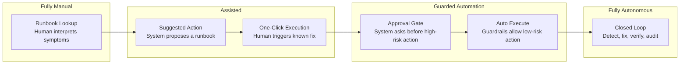
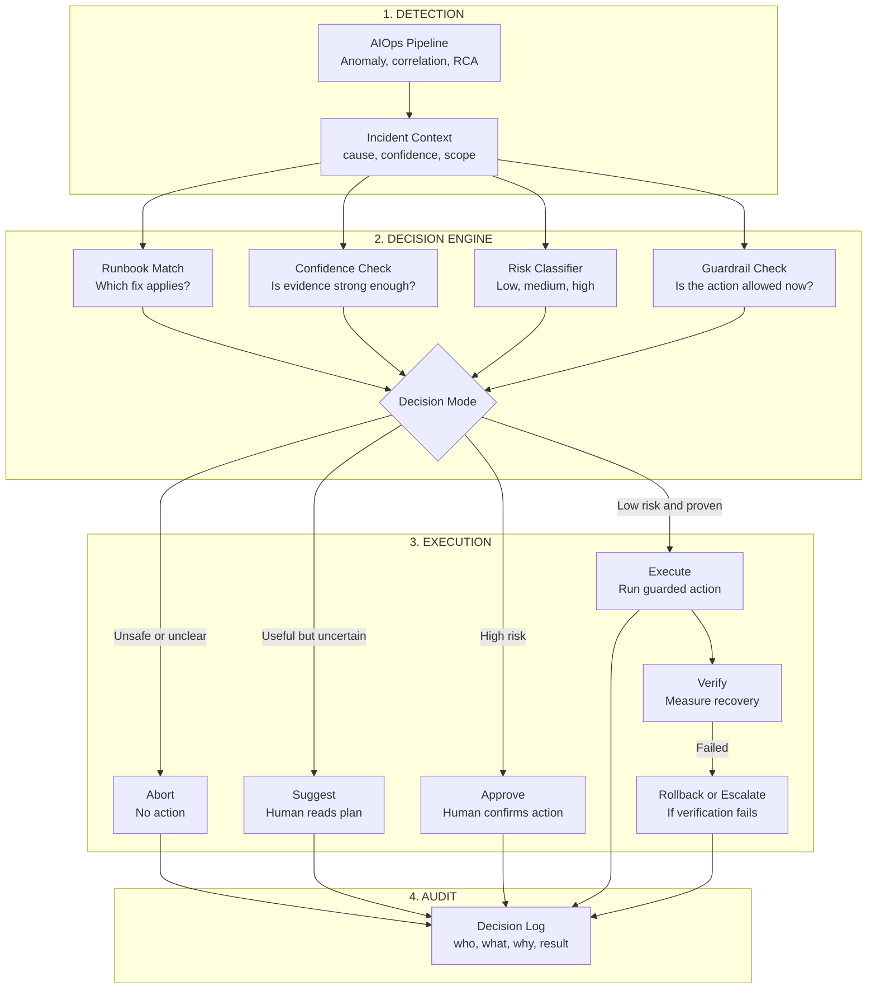
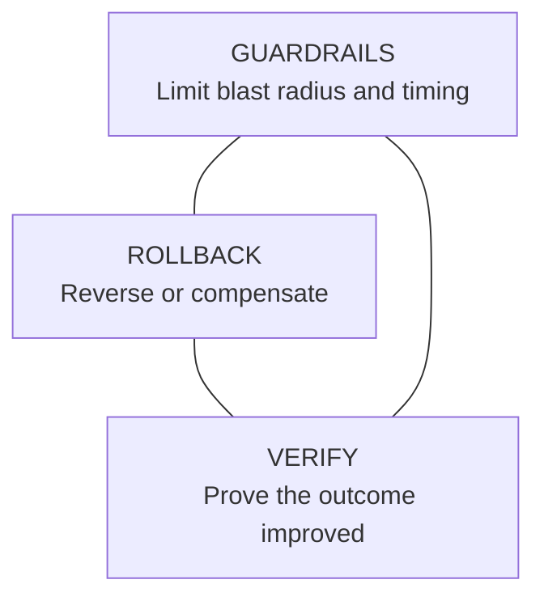
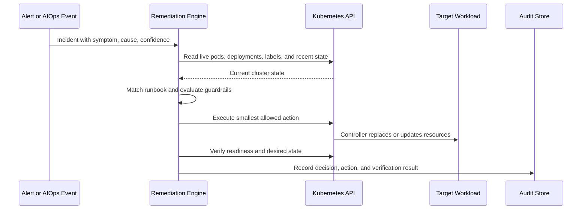

> **Discipline Track** | Complexity: `[COMPLEX]` | Time: 55-70 min

## Prerequisites

Before starting this module, you should be comfortable reading Kubernetes Deployments, Pods, labels, ServiceAccounts, Roles, RoleBindings, Jobs, and CronJobs. The exercise uses a live Kubernetes cluster, so you also need a local or sandbox cluster where you can create a namespace and run `kubectl` commands without affecting production workloads.

- [Module 6.4: Root Cause Analysis](../module-6.4-root-cause-analysis/) — tracing symptoms back to probable causes and confidence levels.
- [Module 6.5: Predictive Operations](../module-6.5-predictive-operations/) — acting before user impact grows into an incident.
- Familiarity with runbook automation concepts, especially pre-checks, execution steps, and post-checks.
- Access to Kubernetes 1.35+ through kind, minikube, a lab cluster, or another disposable environment.

## Learning Outcomes

After completing this module, you will be able to:

- **Design** auto-remediation workflows that combine root-cause confidence, risk classification, guardrails, rollback options, and human approval gates.
- **Evaluate** whether a remediation action should be manual, assisted, guarded, or fully autonomous based on blast radius, reversibility, and verification quality.
- **Implement** Kubernetes remediation runbooks that use RBAC, Jobs or CronJobs, pre-checks, and post-action verification instead of detached scripts.
- **Debug** failed remediation loops by inspecting audit logs, rate limits, circuit breakers, and live Kubernetes state.
- **Compare** self-healing patterns such as pod replacement, deployment restart, scale-up, rollback, and operator reconciliation.

## Why This Module Matters

A payment team ships a small memory optimization late on a Thursday. At first the dashboards look clean, then checkout latency creeps upward, queue depth rises, and pods begin restarting in one availability zone. The on-call engineer is asleep, the runbook exists in a wiki, and the first alert says only that error rate crossed a threshold. By the time a human connects the deploy, the memory leak, the pod churn, and the rising backlog, customers have already retried thousands of failed purchases.

Auto-remediation changes that incident shape, but only when it is designed as an operational control system rather than a script launcher. A safe system does not merely say, "CrashLoopBackOff means delete the pod." It asks whether the diagnosis is credible, whether the workload has enough replicas, whether this action has already failed recently, whether the replacement became healthy, and whether a human should approve a higher-risk fix. The value is not automation for its own sake; the value is reducing mean time to restore without letting a false positive make the outage worse.

The senior lesson is that auto-remediation is not a destination called "no humans." It is a progression from manual runbooks to suggested actions, then to one-click execution, guarded automation, and finally closed-loop remediation for narrow cases with excellent evidence. Mature teams automate the boring and reversible work first, keep humans in the loop for consequential decisions, and measure every remediation as carefully as they measure deploys.

## The Auto-Remediation Contract

Auto-remediation begins with a contract between detection, decision, execution, and verification. Detection supplies a symptom and a likely cause; the decision engine chooses whether the evidence is strong enough; execution performs the smallest safe action; verification proves whether the system improved. If any part is missing, the automation is not self-healing. It is merely faster incident response with fewer pauses for judgment.



Most teams should not try to jump from manual response to full autonomy. That leap hides too many assumptions about diagnosis quality, runbook reliability, and service ownership. A safer progression starts with suggestions, then makes the suggested action executable by a human, then allows automation only where the action is narrow, reversible, and consistently successful. The sequence matters because every stage produces evidence that the next stage needs.

The simplest contract can be written as a decision sentence: "When symptom X appears, and root cause Y has confidence above Z, and guardrails A through C pass, execute action D, then verify condition E within time window F." This sentence is more useful than a long script because it exposes the operational assumptions. If you cannot fill in each clause, the runbook is not ready for autonomous execution.

A good remediation contract also names the owner and failure mode. The owner is the team responsible for maintaining the runbook when the workload changes. The failure mode explains what the automation does when checks fail, verification times out, or repeated attempts do not help. Mature remediation designs treat "do nothing and page a human" as an intentional outcome, not as an implementation gap.

> **Active learning prompt:** Pick a remediation idea from your own environment. Can you write the decision sentence with a symptom, probable cause, confidence threshold, guardrail, action, verification check, and timeout? If one clause feels vague, that is the part you should not automate yet.

The contract also protects against a common misunderstanding: successful command execution is not the same as successful remediation. A `kubectl delete pod` command can return zero while the replacement pod crashes. A `kubectl rollout restart` can complete while the application still fails readiness checks under traffic. A scale-up can create more replicas while the true bottleneck remains a database connection pool. Verification must measure the desired system outcome, not merely the command result.

The senior operating question is therefore not "Can we automate this command?" It is "Can we prove that this action improves the failing condition often enough, safely enough, and quickly enough to run without a human every time?" That proof comes from historical incidents, staging tests, live shadow mode, and audit trails. Without those feedback loops, remediation confidence decays as services evolve.

## From Incident Signal to Decision Mode

The decision engine converts incident context into an execution mode. It should not be a loose chain of `if` statements hidden in a script; it should be a policy boundary that every remediation action passes through. The inputs are the symptom, probable root cause, confidence score, affected services, action risk, recent execution history, current cluster state, and business context such as maintenance windows or active incidents.



A practical decision model has at least four modes. `manual` means the system should page a human because no runbook matches or the evidence is weak. `suggest` means the system can recommend a runbook but should not run it. `approval_required` means the runbook is probably correct, but the action has enough business or technical risk to require human confirmation. `auto_execute` means the action is low-risk, reversible or self-healing, rate-limited, and historically reliable.

The model should deliberately separate diagnosis confidence from action risk. A highly confident diagnosis does not automatically justify autonomous execution. If the system is certain that the primary database is unhealthy, failover may still require approval because the action can create data consistency risk. Conversely, a modestly confident diagnosis may still justify a safe action, such as collecting diagnostics or restarting a single redundant pod, because the blast radius is small and the rollback path is natural.

Risk is not only a property of the command. It is also a property of timing, scale, dependency state, and ownership. Restarting one stateless pod during normal traffic is usually low risk when several healthy replicas exist. Restarting every pod in a checkout deployment during a payment provider incident is a different action, even if the command string looks similar. A decision engine must inspect the live system before it decides.

The table below shows a useful starting point for classifying common actions. Treat it as a design input, not as a universal truth. Your production context may turn a low-risk action into a medium-risk action if the service has weak redundancy, fragile startup behavior, or poor observability.

| Action Pattern | Usual Risk | Why It Fits That Risk | Typical Decision Mode | Required Verification |
|---|---|---|---|---|
| Delete one unhealthy pod from a redundant Deployment | Low | Kubernetes recreates the pod and other replicas serve traffic | Auto-execute after checks | Replacement pod becomes Ready and service error rate does not rise |
| Scale a Deployment up by one or two replicas | Low | Capacity increase is reversible and usually improves pressure | Auto-execute with quota checks | New pods are Ready and saturation metric improves |
| Rollout restart a Deployment | Medium | All replicas may churn, and warm-up behavior can hurt traffic | Approval or guarded automation | Rollout completes and service health remains acceptable |
| Roll back a recent Deployment | Medium to High | Fixes bad releases but can reintroduce older defects or migrations | Approval required unless narrowly proven | Error rate returns to baseline and rollback revision is known |
| Promote a database replica | High | Incorrect promotion can create data loss or split-brain risk | Human-led with automation assistance | Replication state, clients, and write path are verified |
| Scale a service to zero | High | Removes capacity entirely and may be part of security containment | Human approval and incident record | No pods remain and stakeholders confirm containment goal |

> **Active learning prompt:** Your team sees a confirmed memory leak in a stateless worker Deployment with ten replicas. Would you classify "delete one OOMKilled pod" and "rollout restart the whole Deployment" the same way? Explain the difference in blast radius before reading further.

The most important senior habit is making policy explicit. Hidden policy appears when a script silently decides to skip a pod, restart a deployment, or roll back a release. Explicit policy appears when the remediation log says the action was blocked because confidence was below threshold, replicas were too low, the service was in cooldown, or a high-risk action required approval. Clear policy gives reviewers something to audit and operators something to trust.

## Safe Auto-Remediation Principles

The safety triangle is the minimum design standard for any remediation that changes live state. Guardrails limit when the action can run, rollback gives the system or human a way back, and verification proves whether the action restored the desired condition. If one side is weak, the remediation should move left on the autonomy spectrum.



Guardrails answer the question, "Should this action run here and now?" Common guardrails include replica minimums, namespace allowlists, label selectors, maintenance windows, rate limits, budget checks, dependency health checks, and service ownership checks. A guardrail should be machine-checkable whenever possible. "Be careful with checkout" is not a guardrail; "do not restart checkout during active incident label `payments-provider-down=true`" can be encoded and audited.

Rollback answers the question, "What happens if the action makes things worse or does not help?" Some Kubernetes actions have natural rollback behavior. Deleting one pod owned by a Deployment is effectively self-healing because the ReplicaSet creates a replacement. Other actions need explicit rollback, such as returning a Deployment to its previous replica count after a failed scale-up or undoing a rollout after a bad restart. Irreversible actions, such as destructive database changes, should not be fully autonomous.

Verification answers the question, "How do we know the user-facing condition improved?" The verification should be tied to the original symptom and the service objective. For pod replacement, the replacement should become Ready, but readiness alone is not enough for critical services. You may also check request success rate, queue depth, latency, or synthetic transactions. Verification quality determines how far right a runbook can move on the autonomy spectrum.

Circuit breakers are a special guardrail because they learn from repeated failure. If a remediation fails several times in a short period, the system should stop repeating it and escalate. The correct lesson from a failed restart loop is not "try faster"; it is "this is not the problem the runbook solves." Circuit breakers prevent automation from consuming capacity, hiding symptoms, or generating noisy logs while the real incident continues.

Rate limits are different from circuit breakers. A rate limit controls how often an action may run even when it succeeds. This matters because a successful action can still be harmful if it runs too frequently. Replacing one pod may be safe; replacing one pod every minute for an hour can destroy cache locality, exhaust image pull limits, and mask a bad deployment. Rate limits protect the system from automation volume, while circuit breakers protect it from repeated failure.

Blast radius limits are the most concrete way to prevent a local fix from becoming a global outage. They cap the number of concurrent actions, the number of affected services, the percentage of replicas touched, or the namespaces where automation is allowed. A good blast radius limit assumes the detection layer can be wrong. If a metric bug marks every workload as unhealthy, the remediation layer should not obediently restart the cluster.

Human approval gates should be treated as part of the system, not as a failure of automation. The goal is to remove humans from repetitive low-judgment steps while keeping them in consequential decisions. A good approval request includes the detected cause, confidence, affected resources, proposed action, guardrail results, rollback plan, and expected verification. The human should approve a clear plan, not reverse-engineer a script under pressure.

## Building Runbooks That Machines and Humans Can Share

A remediation runbook should be executable by both humans and automation. This shared format reduces drift between "what the wiki says" and "what the bot does." The human version needs context, decision criteria, commands, and verification guidance. The machine version needs structured fields for triggers, thresholds, guardrails, actions, and post-checks. The best runbooks are not prose documents converted into scripts; they are operational contracts rendered for both audiences.

A useful runbook starts with intent. "Restart pod" is a command, not an intent. "Replace one unhealthy replica of a redundant stateless workload when the replacement can be verified" is an intent. The intent tells the decision engine which situations are in scope and tells reviewers which situations should be blocked. Ambiguous intent is one reason automation expands beyond its safe boundary over time.

The trigger section should describe both symptoms and probable causes. Symptoms are observable states such as `CrashLoopBackOff`, high queue depth, or a failing readiness probe. Probable causes are diagnoses such as memory leak, deadlocked process, or misconfigured dependency. Triggering only on symptoms can cause false fixes because different root causes can produce the same symptom. Triggering only on root cause can miss urgent situations when the RCA engine is uncertain.

The pre-check section protects the system before state changes. For Kubernetes workloads, common pre-checks include verifying that a target namespace is allowed, the pod is controlled by a workload controller, the service has enough ready replicas, no similar remediation ran recently, and the target workload is not already rolling out. These checks should be run against live Kubernetes state, not stale incident payloads, because the cluster may have changed since detection.

The action section should be the smallest state change that can plausibly fix the problem. If one pod is unhealthy, delete one pod before restarting an entire Deployment. If one Deployment is saturated, scale that Deployment before changing cluster autoscaler settings. Smaller actions are easier to verify, easier to roll back, and less likely to surprise service owners. This is one of the most reliable ways to move safely from assisted remediation to guarded automation.

The post-check section must be specific enough to fail. A post-check such as "service looks better" is not useful because every operator will interpret it differently. Better checks include "replacement pod reaches Ready within ninety seconds," "available replicas equal desired replicas," "queue depth decreases for three consecutive samples," or "HTTP five-hundred rate returns below the service's alert threshold." A verification check that cannot fail cannot protect you.

The audit section records the decision, not only the command output. At minimum, log the incident ID, runbook ID, resource identity, decision mode, guardrail results, action taken, verification result, and actor. The actor may be a human approver, a controller ServiceAccount, or a remediation engine identity. This audit trail is what lets the team tune thresholds, prove compliance, and answer "why did automation touch production?"

Here is a structured runbook pattern you can adapt. The fields are deliberately plain YAML because platform teams often store remediation definitions in Git and review them like code.

```yaml
apiVersion: remediations.kubedojo.io/v1
kind: RemediationRunbook
metadata:
  name: replace-redundant-pod
spec:
  intent: "Replace one unhealthy pod when a controller has enough healthy replicas."
  owner: "platform-operations"
  risk: "low"
  decisionMode: "auto_execute"
  triggers:
    symptoms:
      - "CrashLoopBackOff"
      - "readiness_probe_failed"
      - "manual_restart_recommended"
    probableCauses:
      - "pod_process_hung"
      - "transient_node_or_container_failure"
    minimumConfidence: 0.8
  scope:
    allowedNamespaces:
      - "aiops-remediation-lab"
    requiredLabels:
      remediator.kubedojo.io/enabled: "true"
  guardrails:
    minimumReadyReplicasWithSameApp: 2
    maxExecutionsPerHour: 3
    cooldownMinutes: 10
    maxConcurrentActions: 1
  action:
    command: "kubectl delete pod ${POD_NAME} -n ${NAMESPACE}"
  verification:
    checks:
      - "available_replicas_equal_desired_replicas"
      - "replacement_pod_ready_within_timeout"
    timeoutSeconds: 120
  rollback:
    type: "controller_recreates_pod"
    notes: "No explicit rollback because the ReplicaSet creates a replacement pod."
  escalation:
    onGuardrailFailure: "page_service_owner"
    onVerificationFailure: "open_incident_and_disable_runbook"
```

This example is intentionally narrow. It allows only a replacement of one pod in an allowed namespace, with a required label and enough healthy replicas. It does not promise to solve every `CrashLoopBackOff`. A pod that keeps crashing because the image is broken will fail verification and should trip a circuit breaker or escalate. Narrow runbooks are easier to trust because they say no more often than broad scripts do.

### Worked Example: Turning a Pod Restart Into a Safe Runbook

Suppose the AIOps pipeline reports that a single API pod is stuck because its process stopped responding after a transient node pressure event. The Deployment has four replicas, three are Ready, and the workload has a label indicating that pod replacement is allowed. A junior implementation might immediately run `kubectl delete pod api-123`. A production implementation asks several questions before it runs that command.

First, the decision engine checks whether the runbook matches the incident. The symptoms include failed readiness and the probable cause is a stuck process, so the runbook matches. The confidence is above the threshold, so the decision continues. If confidence were low, the correct action would be to suggest the runbook to a human rather than execute it.

Second, the guardrails inspect live Kubernetes state. The namespace must be allowlisted, the pod must have a controller owner, the `app` label must be present, and at least two pods with the same `app` label must be Ready. The engine also checks that no replacement action for this app ran during the cooldown window. These checks prevent a stale incident from deleting the last healthy replica.

Third, the action deletes the pod and immediately starts verification. The action is small: it affects one pod, not the whole Deployment. Verification watches the Deployment until available replicas equal desired replicas again and confirms that the replacement pod becomes Ready before the timeout. If verification fails, the runbook records a failure and escalates instead of repeating deletion indefinitely.

Fourth, the audit log explains the decision. A useful audit entry says that runbook `replace-redundant-pod` matched incident `INC-2026-0426`, confidence was sufficient, namespace and replica guardrails passed, pod `api-123` was deleted, replacement pod `api-456` became Ready, and no rollback was required. That entry is valuable during review because it proves the automation followed policy rather than merely running a command.

The senior review question for this worked example is whether the guardrails prove the action is safe enough for the service's reality. If the API takes five minutes to warm cache, the verification timeout must reflect that. If deleting one pod causes connection storms, the action may need a drain step before deletion. If readiness probes are weak, the post-check must include service-level metrics. Auto-remediation is only as strong as the operational truth encoded into its checks.

> **Active learning prompt:** In the worked example, which single guardrail would you remove last: namespace allowlist, replica minimum, cooldown, or controller ownership check? Defend your answer by describing the failure it prevents.

## Kubernetes Implementation Patterns

Kubernetes gives you several places to implement remediation, and each has different trade-offs. A CronJob is simple and familiar, but it polls on a schedule and may react slowly. A Job launched by an alert receiver can respond quickly, but you need secure event delivery and idempotency. An Operator can reconcile continuously and model remediation as desired state, but it requires more engineering discipline. A workflow engine can orchestrate approvals and complex steps, but it adds another dependency.

The pattern in this module uses Kubernetes-native RBAC and a Job or CronJob because it is easy to inspect in a lab. That does not mean every production remediation should be a shell script in a container. The important teaching point is the shape: least-privilege identity, scoped resource selection, live pre-checks, small action, verification, and logs. You can preserve that shape whether the execution layer is an Operator, Argo Workflows, StackStorm, Rundeck, PagerDuty Runbook Automation, or a custom controller.



RBAC is the first safety boundary in Kubernetes remediation. A remediation ServiceAccount should have only the verbs it needs in only the namespace it should touch. If the runbook only reads pods and deletes pods in one namespace, it should not have cluster-admin, access to secrets, or permission to mutate Deployments across the cluster. A correct decision engine can still have bugs; least privilege limits the damage when it does.

Labels and annotations are the second boundary. You should not allow automation to act on every workload by default. A label such as `remediator.kubedojo.io/enabled=true` lets service owners opt in after they understand the runbook. A direct pod label such as `remediator.kubedojo.io/restart=true` can mark a single target for a lab or a human-approved remediation. In production, the trigger usually comes from the incident system, but labels still help define ownership and scope.

Idempotency is the third boundary. A remediation action may be retried because a Job restarts, a network call times out, or an alert fires twice. The action should produce the same safe outcome when run more than once, or it should detect that the action already happened and stop. Deleting an already-deleted pod should not become a different broader action. Scaling from three to four replicas should not become scaling from four to five unless the policy explicitly allows repeated scale-ups.

Verification should prefer Kubernetes status plus service metrics. Kubernetes can tell you whether the controller recreated a pod and whether the pod became Ready. It cannot, by itself, prove that checkout recovered from a payment dependency failure or that a queue processor caught up. For low-risk lab work, Kubernetes status is enough. For production, wire the runbook to metrics that represent the original symptom.

The following Kubernetes manifest is a realistic teaching example for a namespaced remediator. It creates a ServiceAccount, a Role with narrow pod permissions, a RoleBinding, and a CronJob shell that looks for pods explicitly labeled for restart. The script checks that at least two pods with the same `app` label are Ready before deleting the target pod. That check is a live guardrail, not a simulation.

```yaml
apiVersion: v1
kind: Namespace
metadata:
  name: aiops-remediation-lab
---
apiVersion: v1
kind: ServiceAccount
metadata:
  name: pod-remediator
  namespace: aiops-remediation-lab
---
apiVersion: rbac.authorization.k8s.io/v1
kind: Role
metadata:
  name: pod-remediator
  namespace: aiops-remediation-lab
rules:
  - apiGroups: [""]
    resources: ["pods"]
    verbs: ["get", "list", "delete"]
  - apiGroups: ["apps"]
    resources: ["deployments"]
    verbs: ["get", "list"]
---
apiVersion: rbac.authorization.k8s.io/v1
kind: RoleBinding
metadata:
  name: pod-remediator
  namespace: aiops-remediation-lab
subjects:
  - kind: ServiceAccount
    name: pod-remediator
    namespace: aiops-remediation-lab
roleRef:
  apiGroup: rbac.authorization.k8s.io
  kind: Role
  name: pod-remediator
---
apiVersion: batch/v1
kind: CronJob
metadata:
  name: labeled-pod-remediator
  namespace: aiops-remediation-lab
spec:
  schedule: "*/10 * * * *"
  concurrencyPolicy: Forbid
  successfulJobsHistoryLimit: 3
  failedJobsHistoryLimit: 3
  jobTemplate:
    spec:
      backoffLimit: 1
      template:
        spec:
          serviceAccountName: pod-remediator
          restartPolicy: Never
          containers:
            - name: remediator
              image: bitnami/kubectl:1.35
              env:
                - name: TARGET_NAMESPACE
                  value: aiops-remediation-lab
              command:
                - /bin/sh
                - -c
                - |
                  set -eu

                  echo "Scanning for pods labeled remediator.kubedojo.io/restart=true"
                  pods="$(kubectl get pods -n "$TARGET_NAMESPACE" \
                    -l remediator.kubedojo.io/restart=true \
                    -o jsonpath='{range .items[*]}{.metadata.name}{"\n"}{end}')"

                  if [ -z "$pods" ]; then
                    echo "No labeled pods found; nothing to remediate"
                    exit 0
                  fi

                  echo "$pods" | while read -r pod_name; do
                    app_label="$(kubectl get pod "$pod_name" -n "$TARGET_NAMESPACE" \
                      -o jsonpath='{.metadata.labels.app}')"

                    if [ -z "$app_label" ]; then
                      echo "Skipping $pod_name because it has no app label"
                      continue
                    fi

                    ready_count="$(kubectl get pods -n "$TARGET_NAMESPACE" -l app="$app_label" \
                      -o jsonpath='{range .items[*]}{.metadata.name}{" "}{.status.containerStatuses[0].ready}{"\n"}{end}' \
                      | awk '$2 == "true" {count++} END {print count + 0}')"

                    echo "Pod $pod_name belongs to app=$app_label with ready_count=$ready_count"

                    if [ "$ready_count" -lt 2 ]; then
                      echo "Skipping $pod_name because blast-radius guardrail requires at least two ready pods"
                      continue
                    fi

                    echo "Deleting $pod_name after guardrails passed"
                    kubectl delete pod "$pod_name" -n "$TARGET_NAMESPACE"
                  done
```

This example is intentionally conservative. It does not discover every unhealthy pod, and it does not mutate Deployments. It acts only on pods that have been explicitly labeled and only when a redundant peer exists. That makes the behavior easy to verify in a live cluster, which is exactly what you want when building trust in an early remediation system.

The same pattern can be extended carefully. You might replace the direct restart label with an incident ID label applied by an alert receiver. You might add a ConfigMap-based cooldown record, or you might emit events to an audit sink. You might require a workload label that maps to a service owner. Each extension should preserve the core contract: match, check, act, verify, audit.

## Guardrails, Rollback, and Verification in Practice

Guardrails should be designed as failure detectors, not as decorative policy statements. A replica guardrail should stop the action when only one pod is Ready. A cooldown guardrail should stop the action when the same runbook already ran recently. A namespace guardrail should stop the action outside allowed environments. When a guardrail fires, the automation should log the reason in language a service owner can understand.

Rollback is easiest when you choose small actions. Deleting one pod owned by a controller has an implicit rollback path because the controller restores desired state. Scaling up can be rolled back by returning to the previous replica count. Rolling back a release is trickier because the "rollback" of a rollback may not restore database state, feature flags, or external integrations. As actions become less reversible, approval gates should become stricter.

Verification should include both a resource-level check and, where possible, an outcome-level check. For pod replacement, resource-level verification asks whether the Deployment's available replicas returned to desired replicas. Outcome-level verification asks whether the symptom that triggered remediation improved. In a lab, you will usually verify resource state. In production, you should connect the remediation result to service metrics and incident state.

A common production failure happens when verification reads the wrong signal. For example, a rollout restart may make all pods Ready while latency remains high because the dependency cache is cold. The remediation appears successful if readiness is the only post-check. A better post-check waits for readiness and then checks a latency or synthetic transaction signal for a short window. This is why auto-remediation belongs inside the reliability model, not beside it.

Circuit breakers require a clear definition of failure. A command failure is obvious, but a verification timeout is also a failure. A guardrail block is usually not a runbook failure because the system correctly refused to act. A repeated low-confidence decision is a detection problem rather than an execution problem. Separating these event types prevents you from disabling a good runbook because the upstream classifier became noisy.

Rate limits require a clear key. Limiting by runbook alone may block safe action on one service because another service had recent problems. Limiting by service alone may allow several different runbooks to churn the same workload. Many teams use a compound key such as `runbook_id`, namespace, and service label. The key should match the blast radius you are trying to control.

Approval gates should not require the approver to rediscover context. A strong approval payload says, "The system proposes to restart Deployment `api` because error rate rose after deploy `abc`, RCA confidence is high, the previous revision is available, synthetic checkout fails, and rollback should return to revision `def`." A weak approval payload says, "Approve rollback?" Senior operators reject weak approval requests because they shift all cognitive load back to the human at the worst moment.

The audit log should be queryable by incident, runbook, service, and outcome. This is how you learn which runbooks are ready to move right on the autonomy spectrum and which should move left. If a runbook succeeds in shadow mode for many incidents, you can consider guarded execution. If a runbook frequently blocks on guardrails, either the policy is too strict or the trigger is too broad. Audit data turns automation maturity into an evidence-based conversation.

## Operating Auto-Remediation as a Product

Auto-remediation should have a rollout plan just like a production feature. Start in observe-only mode where the system records what it would have done. Compare proposed actions with human incident decisions. When the suggestions are consistently useful, move to one-click execution. When one-click execution becomes routine and verification is strong, allow auto-execution for narrow low-risk cases. Each stage should have explicit promotion criteria.

The product mindset matters because remediation systems have users: on-call engineers, service owners, incident commanders, compliance reviewers, and customers indirectly affected by outages. On-call engineers need clear suggestions and logs. Service owners need opt-in controls and ownership boundaries. Incident commanders need to know what automation already changed. Compliance reviewers need evidence that privileged actions were authorized and scoped. Customers need the system to restore service without surprising side effects.

Service ownership is one of the hardest non-technical parts. A platform team may provide the remediation engine, but service teams own the application-specific runbooks and verification criteria. The platform team can safely provide generic primitives such as pod replacement, scale-up, restart, rollback suggestion, and audit logging. Service teams should decide which workloads are eligible, which metrics prove recovery, and which actions require approval.

Metrics for auto-remediation should measure both reliability and restraint. Track mean time to detect, mean time to decide, mean time to restore, runbook success rate, verification failure rate, guardrail block rate, approval acceptance rate, repeated incident rate, and automation-caused incident count. A system that executes many actions quickly is not necessarily good. A good system restores service, says no when evidence is weak, and makes failures visible.

Security review is mandatory because remediation engines hold operational power. A compromised remediator can delete pods, restart services, or roll back releases if RBAC is too broad. Use scoped ServiceAccounts, short-lived credentials where possible, namespace boundaries, audit logs, image pinning, and code review for runbook changes. Treat remediation definitions as production change artifacts, not as convenience scripts stored in a chat channel.

Change management should include simulation and live canaries. Simulation checks whether the decision engine would choose the expected mode for historical incidents. A live canary runs the remediation against a safe workload or lab namespace and verifies Kubernetes behavior. Production enablement should start with one service, one action, and one narrow trigger. Broad automation should be earned through observed safety, not declared in a roadmap.

The cultural concern is real: teams may fear that automation hides incidents, steals operational judgment, or makes outages harder to explain. Good design answers those concerns with visibility and control. Every action is logged, every high-risk action asks for approval, every runbook has an owner, and every service can opt in deliberately. The aim is not to remove operators from accountability; it is to remove repetitive toil from the critical path of recovery.

## Did You Know?

- **Kubernetes controllers are already remediation loops**: A Deployment replacing a failed pod is a built-in example of detecting drift from desired state and reconciling it back toward health.
- **The safest first runbooks are usually boring**: Actions such as replacing one redundant pod or scaling up within a small bound often teach more about guardrails than dramatic failovers do.
- **Verification is the difference between automation and hope**: A remediation that logs only command success cannot prove that user impact was reduced.
- **Human approval can still reduce MTTR**: A high-quality approval request with pre-filled evidence, command plan, and rollback path is much faster than asking an on-call engineer to rediscover context.

## Common Mistakes

| Mistake | Problem | Better Approach |
|---|---|---|
| Starting with dramatic actions such as database failover | The first false positive can create a larger incident than the original symptom | Begin with narrow, reversible actions and promote only after audit evidence proves reliability |
| Treating command success as remediation success | `kubectl` can return successfully while the workload remains unhealthy | Verify the live resource state and, for production services, the original service-level symptom |
| Giving the remediator cluster-admin | A bug or compromise can mutate resources far beyond the intended scope | Use namespaced ServiceAccounts, least-privilege Roles, and explicit workload opt-in labels |
| Missing rate limits and cooldowns | A recurring alert can churn pods, restart deployments, or consume capacity repeatedly | Limit executions by runbook and service, then record blocks as visible audit events |
| Ignoring blast radius during broad incidents | A shared metric bug or dependency outage can trigger simultaneous actions across many workloads | Cap concurrent actions, affected services, and percentage of replicas touched by automation |
| Automating irreversible actions | Destructive changes leave no safe recovery path when the diagnosis is wrong | Keep irreversible actions human-led, and use automation only to collect evidence or prepare a plan |
| Letting runbooks drift from service reality | A once-safe action becomes unsafe after topology, startup behavior, or dependencies change | Assign owners, review runbooks with service changes, and measure verification outcomes over time |
| Hiding automation from incident responders | Humans waste time guessing whether the system already changed production state | Emit audit logs, Kubernetes Events, chat notifications, and incident timeline entries for every decision |

## Quiz

<details>
<summary>1. Scenario: Your team wants its first auto-remediation project to fail over the primary database whenever write latency spikes. The RCA model is usually accurate, and the team argues that failover gives the largest MTTR reduction. How would you evaluate this proposal?</summary>

You should reject it as a first autonomous action because high diagnostic confidence does not remove the risk of an irreversible or hard-to-reverse action. Database failover can create data consistency problems, client reconnection issues, or split-brain conditions if the assumptions are wrong. A safer plan is to start with low-risk actions such as replacing one redundant stateless pod, collecting diagnostics, or suggesting a failover plan for human approval. The team can still automate evidence gathering and approval packaging for failover, but full autonomy should wait until the action has strong guardrails, rehearsed rollback procedures, and a proven verification model.
</details>

<details>
<summary>2. Scenario: A remediator deletes a pod in `CrashLoopBackOff`, logs success, and exits. Five minutes later the replacement pod is also crashing, so the same runbook fires again. After several attempts, the service is still down. Which design failures do you investigate first?</summary>

The first failure is weak verification: deleting the pod was treated as success even though the replacement never became Ready or restored the service symptom. The second failure is a missing or ineffective circuit breaker, because repeated verification failures should stop the runbook and escalate. A rate limit or cooldown may also be missing if the action is allowed to run frequently. The correct fix is to verify replacement health, record failed verification as a runbook failure, trip the breaker after a small threshold, and page a human with the evidence collected so far.
</details>

<details>
<summary>3. Scenario: A shared metrics bug marks every workload in a namespace as unhealthy. Your remediation system begins restarting deployments across unrelated services. Which guardrail should have contained this incident, and how would you redesign the policy?</summary>

A blast radius guardrail should have limited the number of concurrent actions, affected services, or percentage of replicas touched in the namespace. The redesign should assume that upstream detection can fail and cap remediation at a small scope until a human reviews the broad pattern. You can require per-service opt-in labels, limit concurrent runbooks, stop after one affected service per namespace, and escalate when many unrelated workloads match at once. The key is recognizing that a widespread trigger is often evidence of a shared detector or dependency problem, not permission to run widespread fixes.
</details>

<details>
<summary>4. Scenario: A service owner asks to auto-scale a worker Deployment up by two replicas when queue depth grows quickly. The cluster has spare capacity, the worker is stateless, and scale-down remains manual. What checks would you require before allowing guarded auto-execution?</summary>

You should require live checks that the Deployment exists, current replicas are below a configured maximum, resource quotas and cluster capacity can accept the new pods, no recent scale-up is still in cooldown, and the queue depth signal is reliable enough to justify action. Verification should confirm that new pods become Ready and queue depth begins to improve within the expected window. The runbook should record the previous replica count so a human or later automation can roll back if needed. Because the action is reversible and capacity-increasing, it can be a good candidate for guarded automation after those controls are in place.
</details>

<details>
<summary>5. Scenario: An approval request says only, "Approve rollback of checkout?" The incident commander is busy coordinating a customer-impacting outage. What information should the remediation system include so the approval gate helps instead of becoming another investigation task?</summary>

The request should include the detected symptom, probable cause, confidence score, affected Deployment and namespace, current revision, proposed rollback revision, relevant deploy timing, guardrail results, verification plan, rollback risk, and expected customer impact. It should also show what the system already checked, such as whether a previous revision exists and whether error rate increased after the latest rollout. A human approval gate is valuable when it compresses context into a clear decision. It is harmful when it simply asks the human to rediscover the whole incident under pressure.
</details>

<details>
<summary>6. Scenario: A team stores remediation scripts in a repository, but the wiki runbook still tells humans to run older commands. During an incident, the bot and the on-call engineer choose different actions. How would you redesign the runbook model?</summary>

You should move toward a shared runbook contract where the human-facing documentation and machine-executable fields come from the same reviewed source. The runbook should define intent, triggers, risk, guardrails, action, verification, rollback, owner, and escalation behavior. Humans can see the explanation and commands, while automation reads the structured policy. This reduces drift because changing the action or verification criteria requires a reviewed update to the same artifact rather than separate edits to a script and a wiki page.
</details>

<details>
<summary>7. Scenario: Your remediator has least-privilege RBAC in one namespace, but it acts on any pod in that namespace. A service team complains that automation deleted a pod from a workload that was not ready for self-healing. What boundary is missing?</summary>

The missing boundary is workload-level opt-in, usually expressed through labels or annotations owned by the service team. Namespace-scoped RBAC limits where the remediator can act, but it does not prove that every workload in that namespace accepts the same risk. Add a required label such as `remediator.kubedojo.io/enabled=true` or require an incident-specific annotation before action. This lets service owners adopt remediation deliberately and gives reviewers a clear way to see which workloads are eligible.
</details>

## Hands-On Exercise: Verify Guarded Pod Remediation in Kubernetes

In this exercise, you will run a Kubernetes-native remediation workflow against a live cluster. The goal is not to build a perfect production controller. The goal is to prove the teaching contract directly in Kubernetes: create a scoped identity, deploy two workloads, label one redundant pod for replacement, run a remediation Job, and verify that the Job deletes only the safe target while skipping a single-replica workload.

You can use any disposable Kubernetes 1.35+ cluster. The commands below use `kubectl`; after the initial alias command, we use `k` as a shorthand for `kubectl` in interactive commands. Do not run this exercise in a production namespace, because it intentionally deletes a lab pod after guardrails pass.

### Step 1: Confirm Cluster Access and Create the Lab Namespace

Start by checking that your client can reach the cluster. Then create a namespace dedicated to this exercise, so every resource can be removed cleanly at the end.

```bash
kubectl version --client
kubectl get nodes
alias k=kubectl
k create namespace aiops-remediation-lab
```

If your shell does not preserve aliases in scripts, keep using `kubectl` instead of `k`. The alias is only for your interactive terminal, not for containers running inside the cluster.

### Step 2: Deploy a Redundant Workload and a Single-Replica Workload

The redundant workload is safe for the remediator to touch because another Ready pod can continue serving. The single-replica workload demonstrates the blast-radius guardrail: even when a pod is labeled for restart, the remediator should skip it because deleting it would remove all capacity for that app.

```bash
k -n aiops-remediation-lab create deployment web --image=nginx:1.27 --replicas=2
k -n aiops-remediation-lab create deployment singleton --image=nginx:1.27 --replicas=1
k -n aiops-remediation-lab label deployment web remediator.kubedojo.io/enabled=true
k -n aiops-remediation-lab label deployment singleton remediator.kubedojo.io/enabled=true
k -n aiops-remediation-lab rollout status deployment/web --timeout=120s
k -n aiops-remediation-lab rollout status deployment/singleton --timeout=120s
```

Record the current pods before remediation. You will compare these names with the pods after the Job runs, which proves that the system changed live Kubernetes state rather than printing a simulated result.

```bash
k -n aiops-remediation-lab get pods -o wide
WEB_POD="$(k -n aiops-remediation-lab get pod -l app=web -o jsonpath='{.items[0].metadata.name}')"
SINGLETON_POD="$(k -n aiops-remediation-lab get pod -l app=singleton -o jsonpath='{.items[0].metadata.name}')"
echo "Selected web pod: $WEB_POD"
echo "Selected singleton pod: $SINGLETON_POD"
```

### Step 3: Mark One Pod From Each Workload for Remediation

In production, the trigger might come from an alert receiver or AIOps engine. In this lab, you label pods directly so the remediation logic has a clear and inspectable target. Because pod labels applied directly to an existing pod do not automatically transfer to replacement pods, the new web pod should not be remediated again.

```bash
k -n aiops-remediation-lab label pod "$WEB_POD" remediator.kubedojo.io/restart=true
k -n aiops-remediation-lab label pod "$SINGLETON_POD" remediator.kubedojo.io/restart=true
k -n aiops-remediation-lab get pods -L remediator.kubedojo.io/restart
```

Before you run the remediator, predict what should happen. The web pod has a redundant peer, so the guardrail should allow deletion. The singleton pod has no redundant peer, so the guardrail should skip it. If your prediction does not mention both outcomes, revisit the blast-radius logic before continuing.

### Step 4: Install Least-Privilege RBAC for the Remediator

Create a ServiceAccount and a namespaced Role. The Role can get, list, and delete pods, and it can read Deployments for context. It cannot touch Secrets, mutate nodes, or act outside the namespace. This is the Kubernetes version of limiting blast radius before the script even starts.

```bash
cat <<'EOF' | k apply -f -
apiVersion: v1
kind: ServiceAccount
metadata:
  name: pod-remediator
  namespace: aiops-remediation-lab
---
apiVersion: rbac.authorization.k8s.io/v1
kind: Role
metadata:
  name: pod-remediator
  namespace: aiops-remediation-lab
rules:
  - apiGroups: [""]
    resources: ["pods"]
    verbs: ["get", "list", "delete"]
  - apiGroups: ["apps"]
    resources: ["deployments"]
    verbs: ["get", "list"]
---
apiVersion: rbac.authorization.k8s.io/v1
kind: RoleBinding
metadata:
  name: pod-remediator
  namespace: aiops-remediation-lab
subjects:
  - kind: ServiceAccount
    name: pod-remediator
    namespace: aiops-remediation-lab
roleRef:
  apiGroup: rbac.authorization.k8s.io
  kind: Role
  name: pod-remediator
EOF
```

Verify the ServiceAccount can delete pods in the lab namespace but is scoped to that namespace by the RoleBinding. This check teaches the habit of verifying permissions before trusting a remediation identity.

```bash
k auth can-i delete pods --as=system:serviceaccount:aiops-remediation-lab:pod-remediator -n aiops-remediation-lab
k auth can-i delete pods --as=system:serviceaccount:aiops-remediation-lab:pod-remediator -n default
```

The first command should print `yes`. The second command should print `no` in a normal cluster because the RoleBinding is namespaced to the lab namespace. If it prints `yes`, your cluster has broader permissions granted elsewhere, and you should investigate before using similar automation in a shared environment.

### Step 5: Run the Remediation Job

Run a one-shot Job that finds labeled pods, checks how many Ready pods share the same `app` label, deletes only targets with enough redundancy, and logs every decision. This is a live Kubernetes action: the web pod should be replaced by its Deployment, while the singleton pod should remain.

```bash
cat <<'EOF' | k apply -f -
apiVersion: batch/v1
kind: Job
metadata:
  name: pod-remediation-once
  namespace: aiops-remediation-lab
spec:
  backoffLimit: 1
  template:
    spec:
      serviceAccountName: pod-remediator
      restartPolicy: Never
      containers:
        - name: remediator
          image: bitnami/kubectl:1.35
          env:
            - name: TARGET_NAMESPACE
              value: aiops-remediation-lab
          command:
            - /bin/sh
            - -c
            - |
              set -eu

              echo "Scanning for pods labeled remediator.kubedojo.io/restart=true"
              pods="$(kubectl get pods -n "$TARGET_NAMESPACE" \
                -l remediator.kubedojo.io/restart=true \
                -o jsonpath='{range .items[*]}{.metadata.name}{"\n"}{end}')"

              if [ -z "$pods" ]; then
                echo "No labeled pods found; nothing to remediate"
                exit 0
              fi

              echo "$pods" | while read -r pod_name; do
                app_label="$(kubectl get pod "$pod_name" -n "$TARGET_NAMESPACE" \
                  -o jsonpath='{.metadata.labels.app}')"

                if [ -z "$app_label" ]; then
                  echo "Skipping $pod_name because it has no app label"
                  continue
                fi

                ready_count="$(kubectl get pods -n "$TARGET_NAMESPACE" -l app="$app_label" \
                  -o jsonpath='{range .items[*]}{.metadata.name}{" "}{.status.containerStatuses[0].ready}{"\n"}{end}' \
                  | awk '$2 == "true" {count++} END {print count + 0}')"

                echo "Pod $pod_name belongs to app=$app_label with ready_count=$ready_count"

                if [ "$ready_count" -lt 2 ]; then
                  echo "Skipping $pod_name because blast-radius guardrail requires at least two ready pods"
                  continue
                fi

                echo "Deleting $pod_name after guardrails passed"
                kubectl delete pod "$pod_name" -n "$TARGET_NAMESPACE"
              done
EOF
```

Wait for the Job to finish, then inspect the logs. The logs are the audit trail for this lab. They should show a deletion for the selected web pod and a skip for the singleton pod.

```bash
k -n aiops-remediation-lab wait --for=condition=complete job/pod-remediation-once --timeout=120s
k -n aiops-remediation-lab logs job/pod-remediation-once
```

### Step 6: Verify the Outcome in Live Kubernetes State

Now verify that the web Deployment returned to its desired state and that the singleton pod was not deleted. This is the direct live-cluster verification that a pure Python logic simulation could not provide.

```bash
k -n aiops-remediation-lab rollout status deployment/web --timeout=120s
k -n aiops-remediation-lab rollout status deployment/singleton --timeout=120s
k -n aiops-remediation-lab get pods -o wide
NEW_WEB_PODS="$(k -n aiops-remediation-lab get pod -l app=web -o jsonpath='{range .items[*]}{.metadata.name}{"\n"}{end}')"
CURRENT_SINGLETON_POD="$(k -n aiops-remediation-lab get pod -l app=singleton -o jsonpath='{.items[0].metadata.name}')"
echo "Original web pod was: $WEB_POD"
echo "Current web pods are:"
echo "$NEW_WEB_PODS"
echo "Original singleton pod was: $SINGLETON_POD"
echo "Current singleton pod is: $CURRENT_SINGLETON_POD"
```

The original web pod should no longer appear in the current web pod list, because the Job deleted it and the Deployment created a replacement. The singleton pod name should match the original singleton pod name, because the remediator skipped it. If those results differ, inspect the Job logs and the labels on each pod before continuing.

### Step 7: Re-run the Job to Test Idempotency

A remediation action may be retried. Re-running this Job should not delete another web pod, because the direct restart label existed only on the old pod and should not be present on the replacement. The singleton pod still has the label, but the guardrail should continue to skip it.

```bash
k -n aiops-remediation-lab delete job pod-remediation-once
cat <<'EOF' | k apply -f -
apiVersion: batch/v1
kind: Job
metadata:
  name: pod-remediation-once
  namespace: aiops-remediation-lab
spec:
  backoffLimit: 1
  template:
    spec:
      serviceAccountName: pod-remediator
      restartPolicy: Never
      containers:
        - name: remediator
          image: bitnami/kubectl:1.35
          env:
            - name: TARGET_NAMESPACE
              value: aiops-remediation-lab
          command:
            - /bin/sh
            - -c
            - |
              set -eu

              pods="$(kubectl get pods -n "$TARGET_NAMESPACE" \
                -l remediator.kubedojo.io/restart=true \
                -o jsonpath='{range .items[*]}{.metadata.name}{"\n"}{end}')"

              if [ -z "$pods" ]; then
                echo "No labeled pods found; nothing to remediate"
                exit 0
              fi

              echo "$pods" | while read -r pod_name; do
                app_label="$(kubectl get pod "$pod_name" -n "$TARGET_NAMESPACE" \
                  -o jsonpath='{.metadata.labels.app}')"

                ready_count="$(kubectl get pods -n "$TARGET_NAMESPACE" -l app="$app_label" \
                  -o jsonpath='{range .items[*]}{.metadata.name}{" "}{.status.containerStatuses[0].ready}{"\n"}{end}' \
                  | awk '$2 == "true" {count++} END {print count + 0}')"

                echo "Pod $pod_name belongs to app=$app_label with ready_count=$ready_count"

                if [ "$ready_count" -lt 2 ]; then
                  echo "Skipping $pod_name because blast-radius guardrail requires at least two ready pods"
                  continue
                fi

                echo "Deleting $pod_name after guardrails passed"
                kubectl delete pod "$pod_name" -n "$TARGET_NAMESPACE"
              done
EOF
k -n aiops-remediation-lab wait --for=condition=complete job/pod-remediation-once --timeout=120s
k -n aiops-remediation-lab logs job/pod-remediation-once
```

This second run should either find only the singleton target and skip it, or find no unsafe web target. That behavior demonstrates idempotency and bounded action. The remediator does not escalate from "one labeled pod" to "restart the whole app" simply because the first target disappeared.

### Step 8: Clean Up

Remove the lab namespace when you are done. This deletes the Deployments, pods, ServiceAccount, Role, RoleBinding, and Jobs created in the exercise.

```bash
k delete namespace aiops-remediation-lab
```

### Success Criteria

You have completed this exercise when:

- [ ] You created a dedicated namespace and confirmed Kubernetes API access before running remediation commands.
- [ ] You deployed a two-replica workload and a single-replica workload, then labeled one pod from each as a remediation target.
- [ ] You installed a namespaced ServiceAccount, Role, and RoleBinding with limited permissions for the remediator.
- [ ] You ran a Kubernetes Job that inspected live pod state and deleted only the redundant workload's labeled pod.
- [ ] You verified through Job logs that the single-replica workload was skipped by the blast-radius guardrail.
- [ ] You verified through `kubectl` that the web pod was replaced and the Deployment returned to Ready state.
- [ ] You re-ran the Job and observed that it did not repeatedly delete healthy replacement pods.
- [ ] You can explain which parts of the lab correspond to trigger, guardrail, action, verification, and audit.

## Next Module

[AIOps Tools Toolkit](/platform/toolkits/observability-intelligence/aiops-tools/) — compare practical tools for anomaly detection, incident correlation, runbook execution, and guarded remediation in real platform environments.
