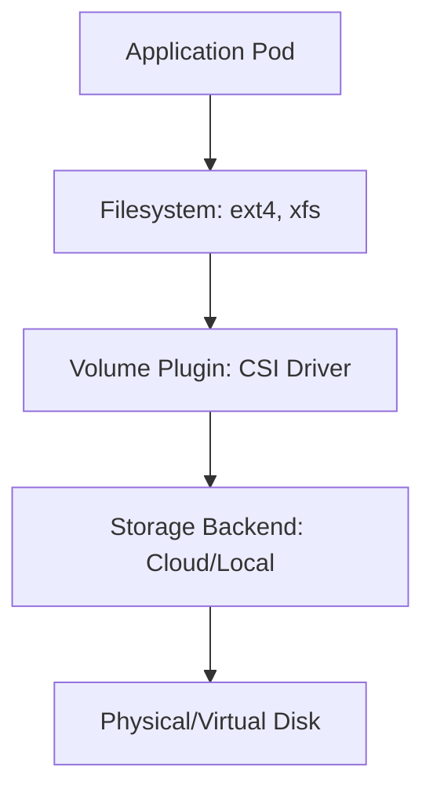
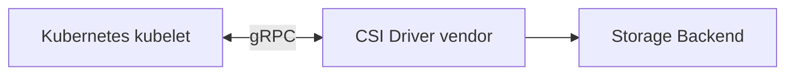
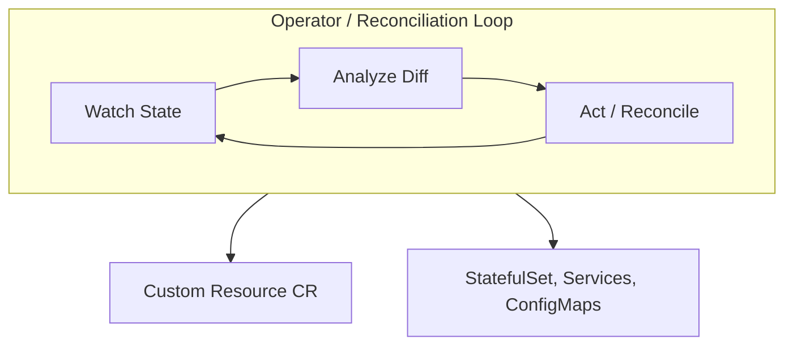
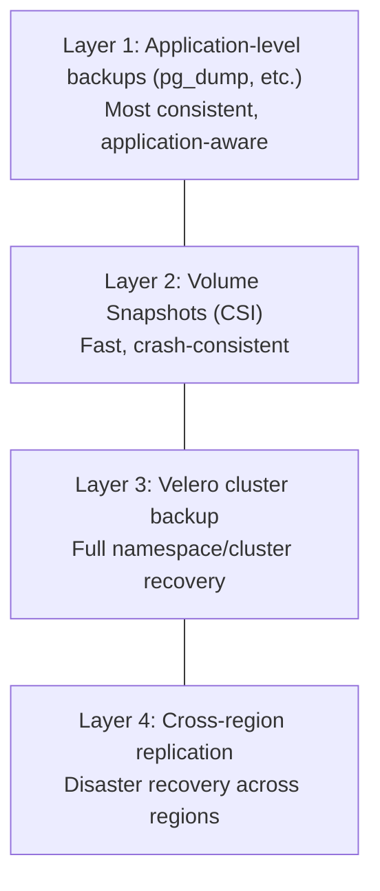

> **Discipline Module** | Complexity: `[COMPLEX]` | Time: 3 hours

## Prerequisites

Before starting this module:
- **Required**: Kubernetes Storage fundamentals — PersistentVolumes, PersistentVolumeClaims, StorageClasses
- **Required**: Working knowledge of StatefulSets, Deployments, and Services
- **Recommended**: Experience with at least one database (PostgreSQL, MySQL, MongoDB, etc.)
- **Recommended**: Familiarity with Linux filesystem and block device concepts

---

## What You'll Be Able to Do

After completing this module, you will be able to:

- **Design StatefulSet configurations that handle persistent storage, ordered deployment, and stable network identity**
- **Implement operator-managed stateful workloads using patterns like the sidecar, init container, and ambassador**
- **Configure persistent volume claims with appropriate storage classes for database and queue workloads**
- **Diagnose common stateful workload failures — split-brain, data corruption, volume mount issues — on Kubernetes**

## Why This Module Matters

There is a persistent myth in the Kubernetes community: "Don't run databases on Kubernetes." Five years ago, that was reasonable advice. Today, it is dangerously outdated.

The world's largest organizations — Uber, Spotify, Bloomberg, Apple — run critical stateful workloads on Kubernetes. Not because they enjoy complexity, but because Kubernetes gives them something traditional VM-based deployments cannot: **declarative lifecycle management for stateful applications at scale**.

But here is the catch. Running stateless web servers on Kubernetes is like driving on a straight highway. Running stateful workloads is like navigating a mountain pass at night. The vehicle is the same, but the skill required is entirely different. You need to understand storage internals, ordering guarantees, data protection, and failure modes that simply do not exist in the stateless world.

This module takes you from "I can deploy a Deployment" to "I can run a production database cluster on Kubernetes and sleep at night."

---

## Did You Know?

- **Etcd, the brain of Kubernetes itself, is a stateful workload.** Every Kubernetes cluster already runs a distributed stateful system. If Kubernetes could not handle state, it could not run itself.
- **A single misconfigured `reclaimPolicy` has caused more production data loss than any Kubernetes bug.** The default policy for dynamically provisioned volumes is `Delete` — meaning when you delete a PVC, your data is gone forever.
- **Local PVs can deliver 3-10x the IOPS of network-attached storage.** For write-heavy workloads like databases and message queues, the storage layer is almost always the bottleneck, and local disks eliminate the network hop entirely.

---

## The Storage Stack: From Disk to Pod

### Understanding the Layers

When a Pod writes data on Kubernetes, it passes through multiple layers. Understanding each layer is critical for performance tuning and troubleshooting.



Each layer introduces latency. Network-attached storage (EBS, Persistent Disk, Azure Disk) adds a network round-trip. Local storage eliminates that round-trip but sacrifices portability.

> **Pause and predict**: What happens if the CSI driver crashes on a specific node? How does that affect existing attached volumes versus new volumes that need to be mounted?

### CSI: The Container Storage Interface

Before CSI, every storage vendor wrote their own volume plugin directly inside the Kubernetes codebase. This was a nightmare — storage vendors had to match Kubernetes release cycles, bugs in one plugin could affect the entire cluster, and adding new storage backends required recompiling Kubernetes.

CSI changed everything. It defines a standard gRPC interface between Kubernetes and storage providers:



**CSI has three core RPCs:**

| RPC | Purpose | Example |
|-----|---------|---------|
| `CreateVolume` | Provision new storage | Create an EBS volume |
| `NodeStageVolume` | Attach volume to node | Mount the block device |
| `NodePublishVolume` | Mount into container | Bind-mount into Pod path |

The beauty of CSI is that Kubernetes does not need to know anything about the underlying storage. Whether it is AWS EBS, a Ceph cluster, or a local NVMe drive, the interface is identical.

#### CSI Driver Architecture

A CSI driver consists of two components:

```yaml
# Controller Plugin — runs as a Deployment (one per cluster)
# Handles: CreateVolume, DeleteVolume, ControllerPublishVolume
apiVersion: apps/v1
kind: Deployment
metadata:
  name: csi-controller
  namespace: kube-system
spec:
  replicas: 2
  selector:
    matchLabels:
      app: csi-controller
  template:
    metadata:
      labels:
        app: csi-controller
    spec:
      serviceAccountName: csi-controller-sa
      containers:
        - name: csi-provisioner
          image: registry.k8s.io/sig-storage/csi-provisioner:v5.1.0
          args:
            - "--csi-address=/csi/csi.sock"
            - "--leader-election"
        - name: csi-attacher
          image: registry.k8s.io/sig-storage/csi-attacher:v4.7.0
          args:
            - "--csi-address=/csi/csi.sock"
            - "--leader-election"
        - name: csi-driver
          image: my-storage-vendor/csi-driver:v2.3.0
          volumeMounts:
            - name: socket-dir
              mountPath: /csi
      volumes:
        - name: socket-dir
          emptyDir: {}
```

```yaml
# Node Plugin — runs as a DaemonSet (one per node)
# Handles: NodeStageVolume, NodePublishVolume, NodeGetInfo
apiVersion: apps/v1
kind: DaemonSet
metadata:
  name: csi-node
  namespace: kube-system
spec:
  selector:
    matchLabels:
      app: csi-node
  template:
    metadata:
      labels:
        app: csi-node
    spec:
      containers:
        - name: csi-node-driver-registrar
          image: registry.k8s.io/sig-storage/csi-node-driver-registrar:v2.12.0
          args:
            - "--csi-address=/csi/csi.sock"
            - "--kubelet-registration-path=/var/lib/kubelet/plugins/my-driver/csi.sock"
        - name: csi-driver
          image: my-storage-vendor/csi-driver:v2.3.0
          securityContext:
            privileged: true
          volumeMounts:
            - name: socket-dir
              mountPath: /csi
            - name: kubelet-dir
              mountPath: /var/lib/kubelet
              mountPropagation: Bidirectional
```

### Storage Classes: The Contract

A StorageClass is the contract between a workload and its storage. It defines what kind of storage you get and how it behaves.

```yaml
apiVersion: storage.k8s.io/v1
kind: StorageClass
metadata:
  name: fast-ssd
provisioner: ebs.csi.aws.com
parameters:
  type: gp3
  iops: "16000"
  throughput: "1000"
  encrypted: "true"
reclaimPolicy: Retain          # CRITICAL: Keep data on PVC deletion
volumeBindingMode: WaitForFirstConsumer  # Bind when Pod is scheduled
allowVolumeExpansion: true     # Allow online resize
mountOptions:
  - noatime                    # Skip access time updates for performance
```

**Key fields explained:**

| Field | Why It Matters |
|-------|---------------|
| `reclaimPolicy: Retain` | Prevents accidental data deletion. `Delete` is the default and has caused countless incidents |
| `volumeBindingMode: WaitForFirstConsumer` | Ensures volume is created in the same zone as the Pod. Without this, you get cross-zone scheduling failures |
| `allowVolumeExpansion: true` | Lets you resize PVCs without recreating them. Essential for growing databases |

---

## Local Persistent Volumes: Maximum Performance

> **Stop and think**: If network storage is reliable and survives node failures, why would anyone willingly take on the complexity of tying their data to a specific physical node?

### When Network Storage Is Not Enough

Network-attached storage is convenient — it survives node failures and can be attached to any node. But for workloads that demand maximum I/O performance, the network is the enemy.

**Typical latency comparison:**

| Storage Type | Read Latency | Write Latency | IOPS |
|-------------|-------------|---------------|------|
| Network SSD (gp3) | 0.5-1 ms | 0.5-1 ms | 16,000 |
| Network SSD (io2) | 0.2-0.5 ms | 0.2-0.5 ms | 64,000 |
| Local NVMe | 0.02-0.1 ms | 0.02-0.1 ms | 200,000+ |
| Local SSD (SATA) | 0.1-0.3 ms | 0.1-0.3 ms | 80,000+ |

For databases like CockroachDB, Cassandra, or Kafka — where every microsecond of write latency affects throughput — local storage can be transformative.

### Setting Up Local PVs

Local PVs require manual provisioning. You tell Kubernetes exactly which disk on which node to use.

```yaml
apiVersion: v1
kind: PersistentVolume
metadata:
  name: local-pv-node1-ssd0
spec:
  capacity:
    storage: 500Gi
  volumeMode: Filesystem
  accessModes:
    - ReadWriteOnce
  persistentVolumeReclaimPolicy: Retain
  storageClassName: local-nvme
  local:
    path: /mnt/disks/ssd0
  nodeAffinity:
    required:
      nodeSelectorTerms:
        - matchExpressions:
            - key: kubernetes.io/hostname
              operator: In
              values:
                - worker-node-1
---
apiVersion: storage.k8s.io/v1
kind: StorageClass
metadata:
  name: local-nvme
provisioner: kubernetes.io/no-provisioner
volumeBindingMode: WaitForFirstConsumer
reclaimPolicy: Retain
```

**Critical detail:** `volumeBindingMode: WaitForFirstConsumer` is mandatory for local PVs. Without it, the scheduler might bind a PVC to a PV on node A, then try to schedule the Pod on node B, resulting in a stuck Pod.

### The Sig-Storage Local Static Provisioner

Manually creating PV manifests for every disk on every node does not scale. The Local Static Provisioner automates this:

```yaml
apiVersion: v1
kind: ConfigMap
metadata:
  name: local-provisioner-config
  namespace: kube-system
data:
  storageClassMap: |
    local-nvme:
      hostDir: /mnt/disks/nvme
      mountDir: /mnt/disks/nvme
      blockCleanerCommand:
        - "/scripts/quick_reset.sh"
      volumeMode: Filesystem
      fsType: ext4
      namePattern: "local-pv-*"
```

The provisioner watches the configured directory. When a new disk appears (formatted and mounted), it automatically creates a PV. When a PV is released and cleaned, it becomes available again.

### The Trade-Off: Performance vs Durability

Local PVs come with a fundamental trade-off:

| YOU GET | YOU LOSE |
|---|---|
| 3-10x IOPS | Cross-node portability |
| Sub-ms latency | Automatic reattachment |
| Predictable IO | Node failure resilience |
| No network tax | Easy volume snapshots |

This means your application must handle replication itself. If a node dies, the data on its local PVs is inaccessible (or gone). Databases like CockroachDB, TiDB, and Cassandra handle this gracefully because they replicate at the application layer. A single-instance PostgreSQL on a local PV? That is a disaster waiting to happen.

---

## StatefulSets: Identity and Order

### Why Deployments Are Not Enough

Deployments treat Pods as interchangeable cattle. Any Pod can be replaced by any other Pod. This is perfect for stateless web servers but catastrophic for databases.

Stateful applications need three guarantees that Deployments cannot provide:

1. **Stable network identity** — Each Pod gets a predictable DNS name
2. **Stable storage** — Each Pod gets its own PVC that follows it across rescheduling
3. **Ordered lifecycle** — Pods start and stop in a defined sequence

### StatefulSet Mechanics

```yaml
apiVersion: apps/v1
kind: StatefulSet
metadata:
  name: cockroachdb
  namespace: data
spec:
  serviceName: cockroachdb    # Required: headless service name
  replicas: 3
  podManagementPolicy: Parallel  # or OrderedReady (default)
  updateStrategy:
    type: RollingUpdate
    rollingUpdate:
      partition: 0             # Update all Pods (set higher to canary)
      maxUnavailable: 1        # Allow 1 Pod down during update
  selector:
    matchLabels:
      app: cockroachdb
  template:
    metadata:
      labels:
        app: cockroachdb
    spec:
      terminationGracePeriodSeconds: 60
      containers:
        - name: cockroachdb
          image: cockroachdb/cockroach:v24.3.2
          ports:
            - containerPort: 26257
              name: grpc
            - containerPort: 8080
              name: http
          volumeMounts:
            - name: datadir
              mountPath: /cockroach/cockroach-data
          readinessProbe:
            httpGet:
              path: /health?ready=1
              port: http
            initialDelaySeconds: 10
            periodSeconds: 5
          resources:
            requests:
              cpu: "2"
              memory: 4Gi
            limits:
              memory: 4Gi
  volumeClaimTemplates:
    - metadata:
        name: datadir
      spec:
        accessModes: ["ReadWriteOnce"]
        storageClassName: local-nvme
        resources:
          requests:
            storage: 100Gi
```

**What this creates:**

| Resource | Name | Purpose |
|----------|------|---------|
| Pod | cockroachdb-0 | First replica (ordinal 0) |
| Pod | cockroachdb-1 | Second replica (ordinal 1) |
| Pod | cockroachdb-2 | Third replica (ordinal 2) |
| PVC | datadir-cockroachdb-0 | Storage for Pod 0 |
| PVC | datadir-cockroachdb-1 | Storage for Pod 1 |
| PVC | datadir-cockroachdb-2 | Storage for Pod 2 |

The headless Service gives each Pod a DNS entry:

```
cockroachdb-0.cockroachdb.data.svc.cluster.local
cockroachdb-1.cockroachdb.data.svc.cluster.local
cockroachdb-2.cockroachdb.data.svc.cluster.local
```

### Ordering Guarantees

With the default `podManagementPolicy: OrderedReady`:

**Startup:** cockroachdb-0 must be Running and Ready before cockroachdb-1 starts. cockroachdb-1 must be Running and Ready before cockroachdb-2 starts.

**Shutdown:** The reverse. cockroachdb-2 terminates first, then cockroachdb-1, then cockroachdb-0.

**Rolling updates:** cockroachdb-2 is updated first, then cockroachdb-1, then cockroachdb-0.

This ordering is essential for many distributed systems. For example, a database might elect its leader as the lowest-ordinal Pod. Shutting down Pod 0 first could trigger an unnecessary leader election.

For databases that handle their own coordination (like CockroachDB with Raft), you can use `podManagementPolicy: Parallel` to speed up scaling operations.

> **Pause and predict**: If you delete a StatefulSet without deleting the associated resources, what happens to its associated PVCs? Do they get automatically cleaned up like Pods do?

### The Partition Trick for Canary Updates

StatefulSets support canary deployments through the `partition` field:

```yaml
updateStrategy:
  type: RollingUpdate
  rollingUpdate:
    partition: 2    # Only update Pods with ordinal >= 2
```

With `partition: 2` and 3 replicas, only cockroachdb-2 gets the new image. Pods 0 and 1 stay on the old version. This lets you validate the new version on a single replica before rolling it out to the entire cluster.

---

## The Operator Pattern for Stateful Applications

### Why StatefulSets Alone Are Not Enough

StatefulSets handle Pod identity, ordering, and storage. But they know nothing about your application's domain logic:

- How do you initialize a database cluster?
- How do you add a new replica and rebalance data?
- How do you perform a zero-downtime schema migration?
- How do you handle a split-brain scenario?
- How do you take consistent backups?

This is where Operators come in. An Operator encodes the operational knowledge of running a specific application into a Kubernetes controller.

### How Operators Work



You declare what you want (a 3-node CockroachDB cluster), and the Operator figures out how to make it happen:

```yaml
apiVersion: crdb.cockroachlabs.com/v1alpha1
kind: CrdbCluster
metadata:
  name: cockroachdb
  namespace: data
spec:
  dataStore:
    pvc:
      spec:
        accessModes:
          - ReadWriteOnce
        resources:
          requests:
            storage: 100Gi
        storageClassName: local-nvme
        volumeMode: Filesystem
  resources:
    requests:
      cpu: "2"
      memory: 4Gi
    limits:
      memory: 4Gi
  tlsEnabled: true
  image:
    name: cockroachdb/cockroach:v24.3.2
  nodes: 3
  additionalLabels:
    app.kubernetes.io/part-of: data-platform
```

The Operator translates this into StatefulSets, Services, Jobs (for initialization), TLS certificates, and monitoring resources — plus it handles day-2 operations like scaling, upgrades, and backups.

### Popular Data Operators

| Operator | Database | Maturity | Key Features |
|----------|----------|----------|-------------|
| CockroachDB Operator | CockroachDB | Production | Auto-scaling, rolling upgrades, backup/restore |
| Strimzi | Apache Kafka | Production | Full Kafka lifecycle, Connect, MirrorMaker |
| CloudNativePG | PostgreSQL | Production | HA, backups to S3, connection pooling |
| Percona Operators | MySQL/MongoDB/PG | Production | Multi-cloud, backup, encryption |
| Crunchy PGO | PostgreSQL | Production | HA, monitoring, disaster recovery |
| Redis Operator (Spotahome) | Redis | Production | Redis Sentinel, cluster mode |

---

## Disaster Recovery and Volume Snapshots

### Volume Snapshots

CSI Volume Snapshots provide point-in-time copies of PVCs:

```yaml
# 1. Create a VolumeSnapshotClass
apiVersion: snapshot.storage.k8s.io/v1
kind: VolumeSnapshotClass
metadata:
  name: csi-snapclass
driver: ebs.csi.aws.com
deletionPolicy: Retain
parameters:
  tagSpecification_1: "Department=data-engineering"

---
# 2. Take a snapshot
apiVersion: snapshot.storage.k8s.io/v1
kind: VolumeSnapshot
metadata:
  name: cockroachdb-0-snap-20260324
  namespace: data
spec:
  volumeSnapshotClassName: csi-snapclass
  source:
    persistentVolumeClaimName: datadir-cockroachdb-0

---
# 3. Restore from snapshot (create a new PVC from it)
apiVersion: v1
kind: PersistentVolumeClaim
metadata:
  name: datadir-cockroachdb-0-restored
  namespace: data
spec:
  accessModes:
    - ReadWriteOnce
  storageClassName: fast-ssd
  resources:
    requests:
      storage: 100Gi
  dataSource:
    name: cockroachdb-0-snap-20260324
    kind: VolumeSnapshot
    apiGroup: snapshot.storage.k8s.io
```

### Automated Backup Strategies

For production stateful workloads, snapshots alone are not enough. You need a comprehensive backup strategy:



**Velero for Kubernetes-native backup:**

```yaml
# Schedule automated backups with Velero
apiVersion: velero.io/v1
kind: Schedule
metadata:
  name: cockroachdb-daily
  namespace: velero
spec:
  schedule: "0 2 * * *"    # Daily at 2 AM
  template:
    includedNamespaces:
      - data
    labelSelector:
      matchLabels:
        app: cockroachdb
    snapshotVolumes: true
    storageLocation: aws-backup
    ttl: 720h0m0s           # Retain for 30 days
    defaultVolumesToFsBackup: false
```

---

## Common Mistakes

| Mistake | Why It Happens | What To Do Instead |
|---------|---------------|-------------------|
| Using `reclaimPolicy: Delete` for database PVCs | It is the default for dynamic provisioning | Always set `reclaimPolicy: Retain` for stateful workloads |
| Running a single-instance database on a local PV | Local PVs are fast, seems like a good idea | Use network storage for single instances, local PVs only with replicated databases |
| Skipping `WaitForFirstConsumer` binding mode | Not understanding zone topology | Always use `WaitForFirstConsumer` for topology-constrained workloads |
| Setting CPU limits on database Pods | Following generic "always set limits" advice | Set CPU requests but skip CPU limits — databases need burst capacity |
| Not testing failover before going to production | "It will probably work" | Run chaos tests monthly: kill Pods, drain nodes, corrupt a replica |
| Using emptyDir for database state in development | Quick and easy for testing | Even in dev, use PVCs. Develop the habit now to avoid mistakes later |
| Ignoring terminationGracePeriodSeconds | Default 30s seems enough | Databases need 60-300s to flush buffers and deregister from the cluster cleanly |

---

## Quiz

**Question 1:** You are migrating a legacy MySQL database to Kubernetes. A junior engineer suggests using a standard Deployment with 3 replicas and a shared NFS volume to save time. Why is this approach fundamentally flawed for a relational database, and what specific guarantees does a StatefulSet provide to solve this?

<details>
<summary>Show Answer</summary>

If you use a Deployment, all replicas will be treated as identical and interchangeable cattle, lacking stable network identities. They might all try to write to the shared NFS volume simultaneously without coordination, leading to severe data corruption. A StatefulSet provides three essential guarantees to prevent this: stable network identity (each Pod gets a predictable DNS name), stable persistent storage (each Pod gets its own PVC that follows it across rescheduling), and ordered lifecycle management. This means the primary database node can initialize before replicas attempt to sync, and each replica safely maintains its own isolated data directory. Because Deployments cannot provide these ordered guarantees, they are fundamentally unsafe for replicated relational databases.

</details>

**Question 2:** Your team has decided to deploy a write-heavy Cassandra cluster using local NVMe drives for maximum performance. You apply the PersistentVolume manifests for the local disks, but the Cassandra Pods remain stuck in the `Pending` state. You notice the StorageClass lacks the `volumeBindingMode` parameter. What is happening, and how does the missing parameter cause this failure?

<details>
<summary>Show Answer</summary>

Without the `volumeBindingMode: WaitForFirstConsumer` parameter, the storage provisioner defaults to `Immediate` binding. This means the PersistentVolumeClaim (PVC) might immediately bind to an available local PersistentVolume (PV) on Node A, completely independent of the Pod scheduling process. When the Kubernetes scheduler then tries to place the Cassandra Pod, it might decide Node B is the best fit based on CPU or memory availability. Because the Pod is scheduled on Node B but its data is physically locked to Node A's local disk, the Pod cannot start and remains stuck in the Pending state forever. Setting the binding mode to `WaitForFirstConsumer` fixes this by delaying the PVC binding until the Pod is scheduled, ensuring both are assigned to the exact same node.

</details>

**Question 3:** During a routine cleanup, an administrator accidentally deletes the namespace containing your production PostgreSQL StatefulSet. The `reclaimPolicy` on the dynamically provisioned StorageClass was set to `Delete`. What is the state of your database data, and how could this disaster have been prevented?

<details>
<summary>Show Answer</summary>

Because the StorageClass was configured with a `Delete` reclaim policy, the underlying storage volumes (like AWS EBS or GCP Persistent Disks) were automatically destroyed the moment their associated PVCs were deleted along with the namespace. Your database data is now permanently lost and must be restored from an external backup, which causes significant downtime and potential data loss. This is the default behavior for dynamically provisioned volumes in Kubernetes, which is extremely dangerous for stateful workloads. To prevent this catastrophic scenario, the `reclaimPolicy` must always be explicitly set to `Retain` for databases. With `Retain`, even if the PVC is deleted, the physical volume is preserved and marked as `Released`, allowing administrators to manually recover the data.

</details>

**Question 4:** You are deploying a 50-node CockroachDB cluster to handle a massive spike in global traffic. Using the default StatefulSet configuration, you notice the deployment is taking an exceptionally long time, with nodes coming up one by one. How can you optimize this rollout, and why is it safe to do so for this specific database?

<details>
<summary>Show Answer</summary>

To optimize this rollout, you should change the StatefulSet's `podManagementPolicy` from the default `OrderedReady` to `Parallel`. By default, Kubernetes waits for each Pod to become Running and Ready before starting the next one, which creates a massive bottleneck when scaling out to 50 nodes. It is perfectly safe to use `Parallel` in this scenario because CockroachDB is a modern distributed database that uses the Raft consensus algorithm to handle its own internal coordination and leader election. Since the application does not rely on Kubernetes for sequential startup or strict ordering, launching all Pods simultaneously significantly reduces deployment time without risking cluster stability. This allows the cluster to rapidly absorb the traffic spike while relying on its own robust internal mechanisms to establish quorum.

</details>

**Question 5:** Your organization wants to automate the provisioning, scaling, and daily backups of a complex Redis Sentinel architecture on Kubernetes. A developer suggests writing a massive Helm chart with complex init containers and lifecycle hooks. Why is the Operator pattern a more robust architectural choice for this requirement?

<details>
<summary>Show Answer</summary>

While a Helm chart can template the initial deployment manifests, it is essentially a static package manager that cannot respond to real-time cluster events or database failures. A Redis Sentinel deployment requires active, continuous management to handle tasks like failovers, reconfiguring replicas, and taking consistent backups without downtime. An Operator solves this by running a continuous reconciliation loop inside the cluster—constantly watching the state of the Redis pods and automatically taking corrective action if a node fails. By extending the Kubernetes API with Custom Resource Definitions, the Operator encodes human operational knowledge directly into software, ensuring day-2 operations are handled autonomously rather than relying on brittle scripts or manual intervention. This dramatically reduces the operational burden and risk of human error during critical incidents.

</details>

---

## Hands-On Exercise: Deploy CockroachDB with the Operator on Local PVs

### Objective

Deploy a 3-node CockroachDB cluster using the CockroachDB Operator with local persistent volumes, then simulate a node failure and verify the cluster survives.

### Environment Setup

You need a multi-node kind cluster:

```yaml
# kind-config.yaml
kind: Cluster
apiVersion: kind.x-k8s.io/v1alpha4
nodes:
  - role: control-plane
  - role: worker
    extraMounts:
      - hostPath: /tmp/cockroachdb/node1
        containerPath: /mnt/disks/ssd0
  - role: worker
    extraMounts:
      - hostPath: /tmp/cockroachdb/node2
        containerPath: /mnt/disks/ssd0
  - role: worker
    extraMounts:
      - hostPath: /tmp/cockroachdb/node3
        containerPath: /mnt/disks/ssd0
```

```bash
# Create host directories and the kind cluster
mkdir -p /tmp/cockroachdb/node{1,2,3}
kind create cluster --name data-lab --config kind-config.yaml
```

### Step 1: Create the Local PV StorageClass and PVs

```bash
# Get worker node names
NODES=$(kubectl get nodes --selector='!node-role.kubernetes.io/control-plane' -o jsonpath='{.items[*].metadata.name}')
echo "Worker nodes: $NODES"
```

```yaml
# local-storage.yaml
apiVersion: storage.k8s.io/v1
kind: StorageClass
metadata:
  name: local-nvme
provisioner: kubernetes.io/no-provisioner
volumeBindingMode: WaitForFirstConsumer
reclaimPolicy: Retain
---
apiVersion: v1
kind: PersistentVolume
metadata:
  name: local-pv-worker-1
spec:
  capacity:
    storage: 10Gi
  volumeMode: Filesystem
  accessModes:
    - ReadWriteOnce
  persistentVolumeReclaimPolicy: Retain
  storageClassName: local-nvme
  local:
    path: /mnt/disks/ssd0
  nodeAffinity:
    required:
      nodeSelectorTerms:
        - matchExpressions:
            - key: kubernetes.io/hostname
              operator: In
              values:
                - data-lab-worker
---
apiVersion: v1
kind: PersistentVolume
metadata:
  name: local-pv-worker-2
spec:
  capacity:
    storage: 10Gi
  volumeMode: Filesystem
  accessModes:
    - ReadWriteOnce
  persistentVolumeReclaimPolicy: Retain
  storageClassName: local-nvme
  local:
    path: /mnt/disks/ssd0
  nodeAffinity:
    required:
      nodeSelectorTerms:
        - matchExpressions:
            - key: kubernetes.io/hostname
              operator: In
              values:
                - data-lab-worker2
---
apiVersion: v1
kind: PersistentVolume
metadata:
  name: local-pv-worker-3
spec:
  capacity:
    storage: 10Gi
  volumeMode: Filesystem
  accessModes:
    - ReadWriteOnce
  persistentVolumeReclaimPolicy: Retain
  storageClassName: local-nvme
  local:
    path: /mnt/disks/ssd0
  nodeAffinity:
    required:
      nodeSelectorTerms:
        - matchExpressions:
            - key: kubernetes.io/hostname
              operator: In
              values:
                - data-lab-worker3
```

```bash
kubectl apply -f local-storage.yaml
kubectl get pv
# All three PVs should show Available
```

### Step 2: Install the CockroachDB Operator

```bash
# Install the CockroachDB Operator via its manifest
kubectl apply -f https://raw.githubusercontent.com/cockroachdb/cockroach-operator/v2.15.0/install/crds.yaml
kubectl apply -f https://raw.githubusercontent.com/cockroachdb/cockroach-operator/v2.15.0/install/operator.yaml

# Wait for the operator to be ready
kubectl -n cockroach-operator-system wait --for=condition=Available \
  deployment/cockroach-operator-manager --timeout=120s
```

### Step 3: Deploy CockroachDB

```yaml
# cockroachdb-cluster.yaml
apiVersion: crdb.cockroachlabs.com/v1alpha1
kind: CrdbCluster
metadata:
  name: cockroachdb
  namespace: default
spec:
  dataStore:
    pvc:
      spec:
        accessModes:
          - ReadWriteOnce
        resources:
          requests:
            storage: 10Gi
        storageClassName: local-nvme
        volumeMode: Filesystem
  resources:
    requests:
      cpu: 500m
      memory: 1Gi
    limits:
      memory: 1Gi
  tlsEnabled: false
  image:
    name: cockroachdb/cockroach:v24.3.2
  nodes: 3
```

```bash
kubectl apply -f cockroachdb-cluster.yaml

# Watch Pods come up one by one
kubectl get pods -w -l app.kubernetes.io/name=cockroachdb

# Verify cluster health (wait for all 3 Pods to be Running)
kubectl exec cockroachdb-0 -- cockroach node status --insecure
```

### Step 4: Write Test Data

```bash
# Open a SQL shell
kubectl exec -it cockroachdb-0 -- cockroach sql --insecure

# Inside the SQL shell:
CREATE DATABASE testdb;
USE testdb;
CREATE TABLE sensors (
  id UUID DEFAULT gen_random_uuid() PRIMARY KEY,
  sensor_name STRING NOT NULL,
  reading FLOAT NOT NULL,
  recorded_at TIMESTAMP DEFAULT now()
);
INSERT INTO sensors (sensor_name, reading) VALUES
  ('temp-1', 23.5), ('temp-2', 24.1), ('pressure-1', 1013.25),
  ('humidity-1', 65.2), ('temp-3', 22.8);
SELECT * FROM sensors;
-- You should see 5 rows
\q
```

### Step 5: Simulate Node Failure

```bash
# Identify which node cockroachdb-1 is on
NODE=$(kubectl get pod cockroachdb-1 -o jsonpath='{.spec.nodeName}')
echo "cockroachdb-1 is on node: $NODE"

# Cordon and drain the node (simulates node failure)
kubectl cordon $NODE
kubectl drain $NODE --delete-emptydir-data --ignore-daemonsets --force --timeout=60s

# Check cluster status — should show 2/3 nodes healthy
kubectl exec cockroachdb-0 -- cockroach node status --insecure

# Verify data is still accessible
kubectl exec -it cockroachdb-0 -- cockroach sql --insecure \
  -e "SELECT count(*) FROM testdb.sensors;"
# Should return 5 — data is safe because CockroachDB replicates across nodes
```

### Step 6: Recover the Node

```bash
# Uncordon the node
kubectl uncordon $NODE

# The Pod will be rescheduled and rejoin the cluster
kubectl get pods -w -l app.kubernetes.io/name=cockroachdb

# Verify all 3 nodes are healthy again
kubectl exec cockroachdb-0 -- cockroach node status --insecure
```

### Step 7: Clean Up

```bash
kubectl delete crdbcluster cockroachdb
kubectl delete pvc -l app.kubernetes.io/name=cockroachdb
kubectl delete -f local-storage.yaml
kind delete cluster --name data-lab
rm -rf /tmp/cockroachdb
```

### Success Criteria

You have completed this exercise when you:
- [ ] Created 3 local PVs bound to specific worker nodes
- [ ] Deployed CockroachDB via the Operator with local storage
- [ ] Wrote test data and verified it across the cluster
- [ ] Simulated a node failure and confirmed data availability
- [ ] Recovered the node and verified cluster health returned to 3/3

---

## Key Takeaways

1. **CSI standardized storage in Kubernetes** — Every storage vendor speaks the same gRPC interface, making storage pluggable and vendor-neutral.
2. **Local PVs trade portability for performance** — Use them only with applications that replicate data at the application layer.
3. **StatefulSets provide identity, ordering, and stable storage** — They are the foundation for stateful workloads but insufficient alone for complex databases.
4. **Operators encode operational knowledge** — They automate day-2 operations (scaling, upgrades, backups) that StatefulSets cannot handle.
5. **Backup in layers** — Application-level backups, volume snapshots, and Velero each protect against different failure modes.

---

## Further Reading

**Books:**
- **"Managing Kubernetes"** — Brendan Burns, Craig Tracey (O'Reilly) — Deep dive on cluster operations
- **"Kubernetes Patterns"** — Bilgin Ibryam, Roland Huss (O'Reilly) — Stateful Service patterns

**Articles:**
- **"Running Databases on Kubernetes"** — DoK (Data on Kubernetes) Community white paper
- **"Local Persistent Volumes"** — Kubernetes documentation (kubernetes.io/docs/concepts/storage/volumes/#local)

**Talks:**
- **"Data on Kubernetes: How We Got Here"** — Melissa Logan, KubeCon 2024 (YouTube)
- **"CockroachDB on Kubernetes at Scale"** — Cockroach Labs Engineering Blog

---

## Summary

Running stateful workloads on Kubernetes is no longer an experiment — it is a proven production practice. The key is understanding the stack: CSI drivers provide pluggable storage, StorageClasses define the contract, StatefulSets provide identity and ordering, and Operators automate the complex lifecycle management that stateful applications demand.

The most common mistake is not a technical one — it is treating stateful workloads like stateless ones. Databases are not Deployments. They need stable identities, careful ordering, tested backup strategies, and operators who understand both Kubernetes and the specific database. Respect the complexity, and Kubernetes becomes an excellent platform for data workloads.

---

## Next Module

Continue to [Module 1.2: Apache Kafka on Kubernetes (Strimzi)](../module-1.2-kafka/) to learn how to deploy and operate the most widely-used distributed streaming platform on Kubernetes.

---

*"Data is not just state. Data is the reason most applications exist."* — Kelsey Hightower