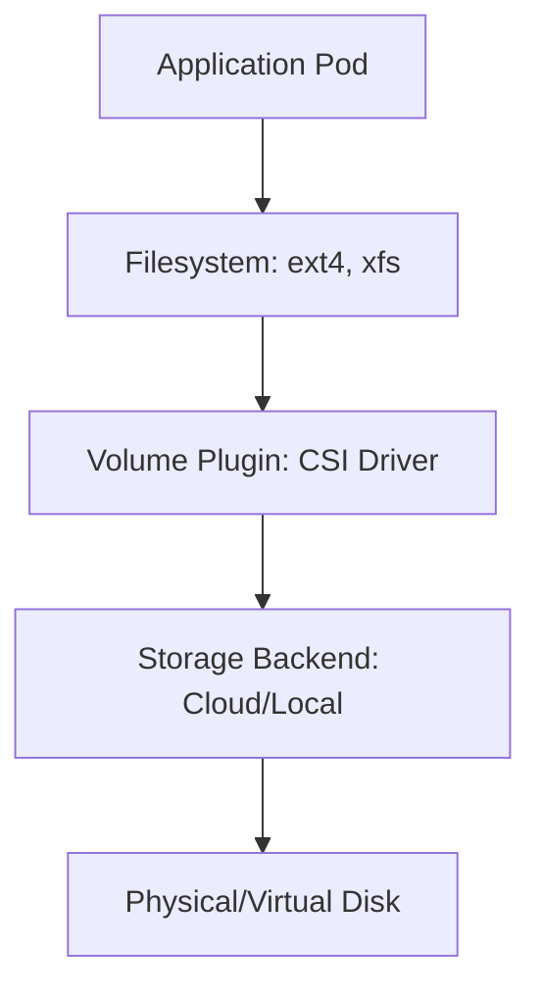
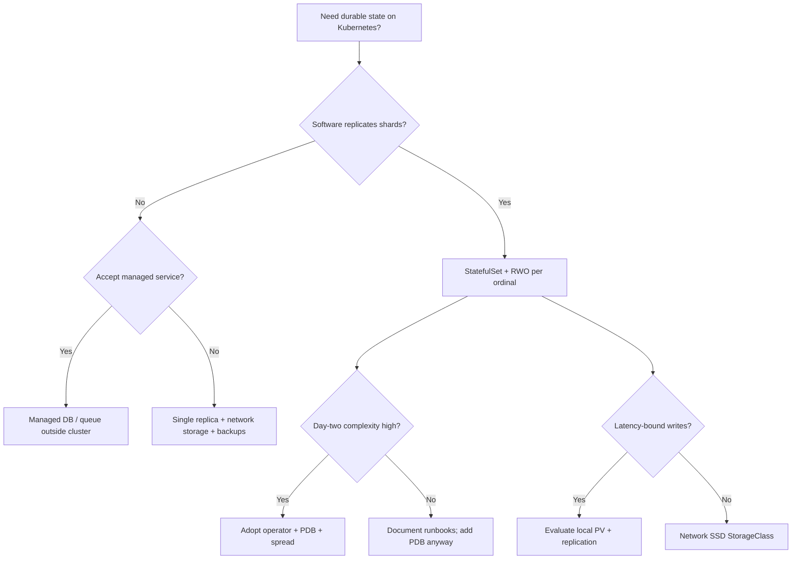

> **Discipline Module** | Complexity: `[COMPLEX]` | Time: 3 hours

## Prerequisites

Before starting this module:
- **Required**: Kubernetes Storage fundamentals — PersistentVolumes, PersistentVolumeClaims, StorageClasses
- **Required**: Working knowledge of StatefulSets, Deployments, and Services
- **Recommended**: Experience with at least one database (PostgreSQL, MySQL, MongoDB, etc.)
- **Recommended**: Familiarity with Linux filesystem and block device concepts

---

## What You'll Be Able to Do

After completing this module, you will be able to:

- **Design StatefulSet configurations that handle persistent storage, ordered deployment, and stable network identity**
- **Implement operator-managed stateful workloads using patterns like the sidecar, init container, and ambassador**
- **Configure persistent volume claims with appropriate storage classes for database and queue workloads**
- **Diagnose common stateful workload failures — split-brain, data corruption, volume mount issues — on Kubernetes**

## Why This Module Matters

There is a persistent myth in the Kubernetes community: "Don't run databases on Kubernetes." That advice made sense when the storage ecosystem was immature and operators were rare. Today the platform ships mature primitives — StatefulSets, CSI, volume snapshots, PodDisruptionBudgets — and a growing library of data operators that encode day-two procedures most teams previously maintained as runbooks.

**Hypothetical scenario:** A platform team runs a three-replica PostgreSQL cluster for an analytics pipeline. During a node upgrade, a Deployment-style rollout replaces all Pods at once. Two writers briefly attach to the same data directory, the filesystem corrupts, and recovery requires a restore from backup. The incident was not caused by Kubernetes being unsuitable for databases; it was caused by treating a quorum-aware database like a stateless web tier. Stateful workloads need stable identity, ordered lifecycle, durable storage binding, and operational automation that Deployments alone cannot provide.

The gap between development and production widens for stateful services because laptop clusters hide topology problems. Minikube and single-node kind setups bind PVCs without teaching zone affinity, PDB interaction, or drain behavior. Before promoting a chart to production, validate it on a multi-node cluster with real StorageClasses, exercise node drains during business hours in staging, and confirm backup restore produces a readable dataset — not just a green Pod status. That discipline separates teams who run data on Kubernetes successfully from teams who only run it until the first bad drain.

Running stateless web servers on Kubernetes is like driving on a straight highway: any Pod can substitute for any other Pod. Running stateful workloads is like navigating a mountain pass at night in fog. The vehicle is the same, but the skill required is entirely different. You must understand storage semantics, ordinal identity, replication versus backup, and failure modes that simply do not exist in the stateless world. Data engineering on Kubernetes — Kafka brokers, Flink TaskManagers, Airflow metadata stores, lakehouse catalog backends — all inherit these constraints because they persist bytes that must survive Pod death, node loss, and controlled upgrades.

This module takes you from "I can deploy a Deployment" to "I can reason about production-grade stateful systems on Kubernetes and sleep at night." You will learn the durable spine: why StatefulSets exist, how the storage stack binds volumes to Pods, when operators replace hand-rolled scripts, and how to diagnose the failures that actually appear in on-call pages. Every downstream module in this sub-track — Kafka brokers, Flink TaskManagers, Spark executors with shuffle state, Airflow metadata databases, lakehouse catalog services — assumes you understand the material here before tuning throughput or exactly-once semantics.

---

## Why Stateful Workloads Are Hard on Kubernetes

Kubernetes was designed around the cattle-not-pets metaphor. Deployments create ReplicaSets that treat Pods as interchangeable units of compute. When a Pod dies, the control plane schedules a replacement with a new name, a new IP address, and no memory of what came before. For HTTP handlers that store session state in Redis and keep no local disk, that model is ideal. For a Raft member, a Kafka broker, or a PostgreSQL primary, interchangeability is a bug.

Stateful systems need four properties that conflict with default Deployment semantics. First, **stable network identity** lets peers address each other predictably across restarts — `broker-2.broker-headless.default.svc.cluster.local` must still mean the same logical member after a reschedule, not a random new Pod. Second, **stable storage** binds each replica to its own PersistentVolumeClaim so data follows the ordinal identity rather than whichever node happens to be free. Third, **ordered lifecycle** ensures bootstrap sequences like "elect a seed node before followers join" or "shut down the highest ordinal first during scale-in" are respected. Fourth, **careful scaling** prevents split-brain or partial quorum during membership changes.

The contrast with Deployments is not academic. A Deployment rolling update can run multiple Pod revisions simultaneously during a rollout. That is fine when any instance can serve traffic. It is dangerous when two instances might both believe they are the write leader for the same shard. StatefulSets add ordinal suffixes, per-Pod PVCs from `volumeClaimTemplates`, and integration with headless Services so DNS SRV records map to ready endpoints. They do not, by themselves, understand database failover, backup schedules, or resharding — which is why mature data platforms pair StatefulSets with operators and well-chosen Pod patterns.

Etcd, the consensus store backing every Kubernetes API server, is itself a stateful workload. Clusters already run distributed stateful software at their core. The question is not whether Kubernetes can host state, but whether **your** team applies the right controller, storage contract, and operational guardrails for the specific data system you operate.

The scheduler compounds the difficulty because it optimizes for resource fit and spread constraints you declare, not for data gravity. A PVC bound to a zonal disk in one availability zone effectively pins any Pod using that claim to nodes in that zone unless you accept a costly cross-zone migration. Stateful workloads therefore require you to co-design compute scheduling with storage topology. Platform teams that treat StorageClass selection as a finance decision often discover too late that their brokers cannot tolerate the IOPS ceiling or that their database instances need encryption keys tied to a specific KMS region.

Finally, human processes lag behind automation. Stateless services encourage fast rollouts and aggressive auto-scaling because mistakes are cheap to undo. Stateful services punish haste: a rushed image bump on the wrong ordinal during a partition can leave a cluster in a state no controller reconciles cleanly. Mature organizations slow intentional change with pre-flight checks, backup verification, and PDB-aware maintenance windows while still automating the happy path through operators.

---

## The Storage Stack: From Disk to Pod

When an application writes bytes inside a Pod, the I/O path crosses several layers, each with distinct failure and performance characteristics. The container sees a filesystem mount — typically ext4 or xfs on a block device. That mount is published by the kubelet through a volume plugin. Modern clusters use **CSI** (Container Storage Interface) drivers rather than in-tree plugins, so the kubelet speaks gRPC to a vendor-specific node plugin that attaches cloud or local disks. Below the driver lies the storage backend: a zonal SSD, a regional replicated disk, a Ceph pool, or an NVMe drive physically attached to one machine.

Understanding this stack matters because symptoms surface at different layers. Slow queries might be an application lock, a saturated disk, or cross-zone network attachment. A Pod stuck in `ContainerCreating` might be waiting for volume attachment, CSI driver registration, or a topology mismatch between PVC and node. When you troubleshoot stateful workloads, map the symptom to the layer before changing application configuration. Teaching yourself to ask "is this compute, attach, mount, or filesystem?" prevents the common mistake of scaling CPU when the bottleneck is an EBS volume hitting its provisioned IOPS cap.


```mermaid
flowchart TD
    A[Application Pod] --> B[Filesystem: ext4, xfs]
    B --> C[Volume Plugin: CSI Driver]
    C --> D[Storage Backend: Cloud/Local]
    D --> E[Physical/Virtual Disk]
```

Network-attached volumes add a network round-trip on every fsync-heavy write path. Local volumes eliminate that hop but tie durability to node fate and application-level replication. Neither choice is universally correct; the decision depends on whether your software already replicates shards across nodes and whether you can tolerate losing a single node's disks during maintenance. Data engineering pipelines often mix both: brokers on fast local disks for append throughput, metadata stores on network SSD for simpler failover, and object storage for immutable layers where replay from scratch is cheap.

### PersistentVolumes, Claims, and StorageClasses

A **PersistentVolume (PV)** represents a piece of storage in the cluster — either statically provisioned by an administrator or dynamically created by a provisioner. A **PersistentVolumeClaim (PVC)** is the Pod's request for storage: capacity, access mode, and StorageClass. When a Pod references a PVC, the scheduler and volume binder must find a compatible PV or trigger dynamic provisioning through the StorageClass's `provisioner` field.

A **StorageClass** is the contract between workloads and infrastructure. It names the CSI driver or legacy provisioner, optional parameters (disk type, IOPS, encryption), **reclaim policy** (`Retain` versus `Delete`), **volume binding mode** (`Immediate` versus `WaitForFirstConsumer`), and whether online expansion is allowed. For database and queue workloads, three fields deserve obsessive attention: set `reclaimPolicy: Retain` on classes backing irreplaceable data so PVC deletion does not destroy cloud disks; use `volumeBindingMode: WaitForFirstConsumer` for topology-sensitive disks so volumes are created in the same zone as the scheduled Pod; enable `allowVolumeExpansion: true` when your operational model grows databases in place rather than migrating.

```yaml
apiVersion: storage.k8s.io/v1
kind: StorageClass
metadata:
  name: fast-ssd
provisioner: ebs.csi.aws.com
parameters:
  type: gp3
  iops: "16000"
  throughput: "1000"
  encrypted: "true"
reclaimPolicy: Retain
volumeBindingMode: WaitForFirstConsumer
allowVolumeExpansion: true
mountOptions:
  - noatime
```

### Access Modes and Multi-Attach Semantics

Kubernetes access modes describe how many nodes may mount a volume simultaneously, not how many Pods read it — though the two are related for block volumes. **ReadWriteOnce (RWO)** allows a single node mount and is the default for most databases. **ReadWriteMany (RWX)** allows multiple nodes to mount read-write simultaneously and requires a shared filesystem such as NFS or a parallel file system; it is appropriate for read-heavy shared caches but is a poor primary store for write-heavy relational databases unless the application explicitly coordinates writes. **ReadOnlyMany (ROX)** supports many readers on many nodes. **ReadWriteOncePod (RWOP)** restricts mount to a single Pod on a single node, a stricter variant useful when you must prevent two Pods from ever sharing a block device even during edge-case reschedules.

Choosing the wrong access mode produces subtle production bugs. A team that mounts RWX NFS behind three PostgreSQL Pods without application-level clustering will corrupt data because POSIX filesystems are not magically transactional across writers. Queue systems like Kafka use one broker directory per Pod with RWO local or network disks because each broker owns its log segments independently.

Volume binding modes interact with access modes in ways that confuse first-time operators. **Immediate** binding creates and attaches storage as soon as the PVC is created, which is fine for regional disks without node affinity but wrong for local PVs. **WaitForFirstConsumer** couples binding to scheduling, which is why topology-aware provisioning can place a new zonal disk in the same availability zone as the nominated Pod. If you use pre-provisioned PVs without a StorageClass, you must still ensure node affinity on the PV matches where the StatefulSet Pod can land.

Reclaim policies deserve explicit change-management review. **Retain** leaves the PV object and external disk after PVC deletion, requiring manual cleanup — ideal for production data. **Delete** instructs the provisioner to destroy backing storage — convenient for ephemeral CI namespaces, catastrophic for a database namespace deleted during a typo. Document which namespaces use which policy and enforce production classes through admission policy when possible.

### CSI: The Container Storage Interface

Before CSI, storage vendors maintained in-tree volume plugins compiled into Kubernetes releases. That coupling slowed innovation: fixing a driver bug required a Kubernetes patch release, and cluster operators could not adopt new backends without upgrading the control plane. CSI standardizes a gRPC interface between orchestrator and storage provider. Kubernetes ships sidecar containers — external-provisioner, external-attacher, node-driver-registrar — that translate API objects into CSI RPCs while the vendor implements `CreateVolume`, `DeleteVolume`, `ControllerPublishVolume`, `NodeStageVolume`, and `NodePublishVolume`.

The architectural split mirrors how data platforms separate control plane from data plane. A **controller plugin** (often a Deployment) handles cluster-wide provisioning and attachment. A **node plugin** (DaemonSet) runs on every worker, mounts devices into the kubelet's volume manager, and publishes them into Pod namespaces. When the node plugin crashes, existing mounts usually remain, but new Pods on that node cannot attach volumes until the driver recovers — a failure mode worth rehearsing in game days.

Sidecar containers in the CSI ecosystem — external-provisioner, external-attacher, external-resizer, external-snapshotter — translate Kubernetes API events into driver RPCs. They participate in leader election so only one provisioner acts at a time, preventing duplicate cloud disks from racing creates. When upgrading drivers, cordon nodes sequentially so node plugins restart without taking down every mount at once, and verify snapshot and expansion sidecars match driver capabilities documented for your Kubernetes minor version.

Volume expansion, when enabled on StorageClass and supported by CSI, grows PVC requests without recreating Pods if the filesystem supports online resize. Database operators may still require a filesystem resize inside the container or a rolling restart to pick up block device growth. Snapshot classes parallel StorageClasses: they name the driver, deletion policy, and parameters for crash-consistent copies. Treat snapshots as fast rewind buttons, not as a substitute for logical exports that capture schema-level objects independently of block layout.

```yaml
apiVersion: apps/v1
kind: DaemonSet
metadata:
  name: csi-node
  namespace: kube-system
spec:
  selector:
    matchLabels:
      app: csi-node
  template:
    metadata:
      labels:
        app: csi-node
    spec:
      containers:
        - name: csi-node-driver-registrar
          image: registry.k8s.io/sig-storage/csi-node-driver-registrar:v2.12.0
          args:
            - "--csi-address=/csi/csi.sock"
            - "--kubelet-registration-path=/var/lib/kubelet/plugins/my-driver/csi.sock"
        - name: csi-driver
          image: my-storage-vendor/csi-driver:v2.3.0
          securityContext:
            privileged: true
```

---

## StatefulSets: Identity, Order, and Scale

Deployments label Pods with a hash suffix that changes every rollout. StatefulSets assign **stable ordinals** — `mydb-0`, `mydb-1`, `mydb-2` — that persist across reschedules as long as the StatefulSet object exists. Combined with a **headless Service** (`clusterIP: None`), each ready Pod receives a DNS A record at `<pod-name>.<service-name>.<namespace>.svc.cluster.local`. Peers discover each other through DNS rather than through a load-balanced virtual IP that would mask individual members.

**Volume claim templates** create one PVC per ordinal at Pod creation time. The claim name follows the pattern `<template-name>-<statefulset-name>-<ordinal>`. When Pod `mydb-1` is deleted and recreated, it reattaches to `datadir-mydb-1`, preserving data locality. Deleting the StatefulSet does **not** automatically delete PVCs — a safety feature that also causes orphaned storage bills if cleanup runbooks are missing.

```yaml
apiVersion: apps/v1
kind: StatefulSet
metadata:
  name: cockroachdb
  namespace: data
spec:
  serviceName: cockroachdb
  replicas: 3
  podManagementPolicy: OrderedReady
  updateStrategy:
    type: RollingUpdate
    rollingUpdate:
      partition: 0
      maxUnavailable: 1
  selector:
    matchLabels:
      app: cockroachdb
  template:
    metadata:
      labels:
        app: cockroachdb
    spec:
      terminationGracePeriodSeconds: 60
      containers:
        - name: cockroachdb
          image: cockroachdb/cockroach:v24.3.2
          ports:
            - containerPort: 26257
              name: grpc
            - containerPort: 8080
              name: http
          volumeMounts:
            - name: datadir
              mountPath: /cockroach/cockroach-data
          readinessProbe:
            httpGet:
              path: /health?ready=1
              port: http
            initialDelaySeconds: 10
            periodSeconds: 5
  volumeClaimTemplates:
    - metadata:
        name: datadir
      spec:
        accessModes: ["ReadWriteOnce"]
        storageClassName: fast-ssd
        resources:
          requests:
            storage: 100Gi
```

### Ordering, Parallelism, and Canary Partitions

The default `podManagementPolicy: OrderedReady` starts Pod N+1 only after Pod N is Running and Ready, and terminates from highest ordinal downward. That behavior protects bootstrap sequences where the lowest ordinal initializes cluster metadata before followers join. Rolling updates proceed from highest to lowest ordinal so the presumed seed member updates last.

Some distributed databases manage their own membership via Raft or gossip and tolerate simultaneous startup. Setting `podManagementPolicy: Parallel` allows all Pods to launch together, dramatically shortening large scale-out events at the cost of losing Kubernetes-enforced sequencing — acceptable only when application code handles concurrent bootstrap and your runbooks document the change. The `partition` field in `rollingUpdate` enables canary updates: with `partition: 2` on a three-replica set, only ordinal 2 receives the new Pod spec until you lower the partition, letting you validate image compatibility on one member before touching seed nodes.

For queue and log workloads that use StatefulSets directly rather than through an operator, broker ID to ordinal mapping is a common convention: broker ID equals Pod ordinal plus a configured offset. Clients and tooling often assume this mapping when generating configuration, so changing ordinals or renaming the StatefulSet without updating external config produces ghost brokers that still appear in metrics but serve no partitions. Treat ordinal assignment as part of your data model, not as disposable infrastructure detail.

### Headless Services and Quorum Systems

A headless Service returns Pod IPs directly to clients resolving its DNS name. For StatefulSets, that means each member is individually addressable. Quorum systems — etcd, ZooKeeper, Kafka controllers, distributed SQL primaries — rely on stable endpoints for voter lists. Changing IP addresses on every restart would force constant reconfiguration. The combination of StatefulSet ordinals plus headless DNS gives you predictable membership strings you can embed in configuration or leave for an operator to manage.

Ordinal identity also influences human operations. On-call engineers know `kafka-0` historically holds the active controller role in some layouts, or that `postgres-0` was bootstrapped as the initial primary. Document these conventions; do not rely on folklore alone.

StatefulSet networking integrates with cluster DNS through the `serviceName` field. Without a headless Service of that name, per-Pod DNS records are not published and peers fall back to guessing Pod IPs that change on reschedule. Readiness probes gate OrderedReady progression: a too-strict probe blocks the entire scale-out chain, while a too-loose probe marks Pods Ready before they can serve traffic, causing clients to hit uninitialized members. Tune initial delays against real bootstrap time measured on cold starts, not against best-case laptop demos.

Scaling down reduces replica count from the highest ordinal first. Data systems must handle member removal gracefully — reassign partitions, replicate shards, or decommission brokers — before Kubernetes deletes the Pod. Never assume scale-in is safe because the StatefulSet API allows it; consult application documentation for decommission steps and automate them in operators where possible.

---

## Data Durability, High Availability, and Day-Two Operations

Replication and backup solve different problems, and conflating them causes recoveries that look successful but lose data. **Replication** keeps multiple live copies for availability and read scaling; it does not protect against application bugs that delete rows, ransomware encryption, or operator error that drops a table. **Backup** captures a point-in-time artifact you can restore after logical corruption. **Volume snapshots** provide crash-consistent or application-quiesced block copies fast enough for frequent schedules but may not guarantee transactional consistency unless the database integrates with snapshot APIs. Production stacks combine layers: continuous replication for uptime, scheduled logical backups for granular restore, CSI snapshots for fast volume rewind, and cluster-level tools like Velero for namespace disaster recovery.

**PodDisruptionBudgets (PDBs)** limit concurrent voluntary disruptions — node drains, cluster upgrades — so maintenance does not take down too many replicas at once. A Kafka cluster might require `minAvailable: 2` on a three-broker StatefulSet so a single drain cannot remove quorum. PDBs do not stop involuntary failures; they coordinate safe eviction during planned work.

**Topology spread constraints** and **pod anti-affinity** keep replicas off the same node or availability zone. Without anti-affinity, the scheduler might place all three database Pods on one worker because it has spare CPU; a single host failure then becomes a full outage. Spread rules express intent: "schedule at most one broker per `topology.kubernetes.io/zone`" or "do not co-locate with Pods labeled `app=postgres`."

Operators encode day-two procedures that StatefulSets cannot express: initialize a blank data directory, join a new member to an existing Raft group, promote a replica during failover, trigger backup hooks before volume snapshots, and validate configuration before rolling upgrades. The Operator pattern extends the Kubernetes API with Custom Resources and runs a reconciliation loop that drives StatefulSets, Services, Secrets, Jobs, and CR status fields until declared spec matches observed reality. Without an operator, teams accumulate bash in ConfigMaps — workable until the person who wrote it is on vacation and the cluster upgrades past an deprecated API version.

When evaluating operators, read the CRD schema as a contract: which fields are immutable after creation, which changes trigger rolling restart versus in-place reconcile, and how status conditions report backup freshness or replication lag. Good operators surface human-readable conditions; immature ones require reading controller logs to learn why reconciliation stalled. Prefer operators whose backup and restore paths are documented with the same clarity as install guides, because the install is the easy day.

> **Landscape snapshot — as of 2026-06. This changes fast; verify against vendor docs before relying on specifics.**

| Durable capability | Illustrative Kubernetes-native option | Notes |
|---|---|---|
| Relational HA on Kubernetes | CloudNativePG, Crunchy Postgres Operator | Encodes failover, backup, connection pooling as CRDs |
| Kafka lifecycle on Kubernetes | Strimzi | Manages brokers, listeners, Connect, MirrorMaker |
| MySQL / MongoDB clustering | Percona operators | Multi-engine; feature sets differ by engine |
| Generic StatefulSet + scripts | Helm + init Jobs | Works for lab; brittle at day-two scale |

Present these as peers compared by capability and operational model, not as a ranked leaderboard. Pick based on team expertise, existing backup tooling, and whether you need GitOps-friendly CRDs versus imperative scripts.

PodDisruptionBudget semantics deserve precision because they only constrain **voluntary** disruptions invoked through the eviction API — drains, cluster upgrades, autoscaling if configured to respect PDBs. They do not prevent node hardware failure or kubelet death. Pair `minAvailable` with replica counts that still tolerate one more failure than your PDB allows; a three-member cluster with `minAvailable: 2` permits only one simultaneous eviction, which is correct for maintenance but still vulnerable to a second unplanned failure during the drain window.

Anti-affinity and topology spread constraints express fault-domain intent to the scheduler. **Required** anti-affinity hard-fails scheduling if no compliant node exists, which protects you during normal times but can block scale-out during capacity crunches. **Preferred** rules soft-nudge placement, allowing scheduling when the cluster is saturated at the cost of temporary co-location risk. For multi-zone clusters, spread Pods across `topology.kubernetes.io/zone` so a single zone outage does not remove every replica.

Replication versus backup deserves a written policy on every data service. Streaming replication keeps a hot standby ready for promotion; it will happily replicate a destructive DDL statement to followers if executed on the primary. Backups — logical dumps, base backups plus WAL archiving, or object-storage exports — provide temporal rewind independent of live replication paths. Volume snapshots capture block state quickly but reflect filesystem contents at snapshot time unless quiesced. Velero adds Kubernetes object consistency so you rebuild Services, Secrets, and StatefulSet specs alongside disks after regional loss. None of these layers alone satisfies every recovery scenario; mature platforms stack them and test restores against realistic failure modes quarterly.

---

## Local Persistent Volumes and Performance Tradeoffs

Network-attached SSDs are convenient: they survive node loss, reattach to replacement nodes, and support snapshots through CSI. For write-heavy engines — log-structured brokers, LSM-tree databases, stream processors with large state backends — latency and IOPS often dominate cost. Local NVMe or SATA SSDs attached directly to the worker eliminate the storage network hop, delivering lower tail latency at the expense of **node stickiness**. If the node disappears, the data on its local disk is unavailable until the hardware returns or you rebuild from replicas elsewhere.

Local PVs are statically defined: you declare `local.path` and `nodeAffinity` tying each PV to one hostname. Dynamic local provisioning typically uses the sig-storage **local static provisioner**, which watches a host directory and creates PV objects when formatted disks appear. **`volumeBindingMode: WaitForFirstConsumer` is mandatory** for local storage. Without it, a PVC may bind immediately to a PV on node A while the scheduler places the Pod on node B, leaving the workload permanently Pending.

```yaml
apiVersion: v1
kind: PersistentVolume
metadata:
  name: local-pv-node1-ssd0
spec:
  capacity:
    storage: 500Gi
  volumeMode: Filesystem
  accessModes:
    - ReadWriteOnce
  persistentVolumeReclaimPolicy: Retain
  storageClassName: local-nvme
  local:
    path: /mnt/disks/ssd0
  nodeAffinity:
    required:
      nodeSelectorTerms:
        - matchExpressions:
            - key: kubernetes.io/hostname
              operator: In
              values:
                - worker-node-1
```

Use local disks only when the application replicates at the shard level — CockroachDB, Cassandra, Kafka — or when ephemeral rebuild from object storage is acceptable. A single-instance PostgreSQL on local storage without automated failover is a deliberate single point of failure. Capacity planning for local disks includes planning spare nodes: when a worker with unique NVMe fails, you need hardware replacement time in your RTO model, not only Pod reschedule time.

When latency budgets still exceed self-hosted capacity, **managed data services** outside the cluster trade operational burden for less control over kernel tuning and sidecar placement. The decision is economic and operational, not ideological.

Performance tuning on network volumes often starts with instance size and provisioned IOPS rather than Pod CPU. Cloud disks throttle when credits exhaust; monitoring must include volume queue depth and latency alarms, not only Pod CPU graphs. Mount options like `noatime` reduce metadata writes on read-heavy workloads. Filesystem choice matters: xfs handles large files and parallel allocation patterns common in append logs; ext4 remains ubiquitous and well understood.

The local static provisioner discovers mounted disks under configured host paths and creates PV objects with node affinity automatically. Operations teams format and mount disks through their node bootstrap process; Kubernetes only advertises capacity that physically exists. Cleaning released local volumes requires scripts configured in the provisioner ConfigMap because unlike cloud APIs there is no DeleteVolume RPC that scrubs NVMe sectors for you. Runbook disk replacement: drain node, replace hardware, remount, verify new PV appears Available, uncordon.

---

## Pod Design Patterns for Stateful Workloads

Operators and StatefulSets frequently combine with classic Pod patterns from the *Kubernetes Patterns* catalog. An **init container** runs to completion before application containers start, making it ideal for fixing permissions on mounted volumes, downloading configuration templates, or waiting until DNS records for peer ordinals resolve. A **sidecar container** shares the Pod network and volumes, extending the main process without forking the database binary — common for log shipping, metric exporters, service mesh proxies, or backup agents that read a shared data directory mount. An **ambassador container** proxies outbound connections, simplifying client configuration by presenting a localhost endpoint that forwards to external services such as a cloud object store or legacy LDAP server.

These patterns matter because stateful Pods are long-lived and tightly coupled to disk layout. Running `chown` in an init container prevents permission denied errors when the main image runs as a non-root UID but the CSI mount arrives root-owned. A sidecar might tail PostgreSQL WAL files to object storage while the primary container serves queries. An ambassador can present stable `127.0.0.1:5432` while the actual upstream changes during failover orchestrated by an operator.

```yaml
apiVersion: v1
kind: Pod
metadata:
  name: postgres-with-sidecar
spec:
  initContainers:
    - name: init-permissions
      image: busybox:1.36
      command: ["sh", "-c", "chown -R 999:999 /var/lib/postgresql/data"]
      volumeMounts:
        - name: data
          mountPath: /var/lib/postgresql/data
  containers:
    - name: postgres
      image: postgres:16
      volumeMounts:
        - name: data
          mountPath: /var/lib/postgresql/data
    - name: exporter
      image: prometheuscommunity/postgres-exporter:v0.15.0
      ports:
        - containerPort: 9187
```

Operators often embed these patterns in generated Pod templates so cluster users interact only with a high-level CRD while the controller ensures init and sidecar versions track the supported database image.

The ambassador pattern shines when applications expect a fixed localhost endpoint but the platform moves backends during failover. Instead of rewriting connection strings inside the database container on every promotion, an ambassador sidecar proxies to the current primary Service or upstream DNS name. Service meshes implement a sophisticated variant by intercepting outbound traffic transparently, but plain ambassador containers remain useful when mesh adoption is incomplete.

Init containers solve ordering problems StatefulSets do not address inside a single Pod. Waiting for peer DNS, downloading TLS bundles from cert-manager Secrets, or running filesystem checks on first boot belongs in init, not in the main container restart loop. Keep init work idempotent and fast; long migrations belong in Jobs or operator workflows that gate Ready status honestly. Sidecars share the Pod lifecycle: if the sidecar exits, the whole Pod restarts, so backup agents should handle SIGTERM gracefully and coordinate with the main container's shutdown hook.

---

## Diagnosing Stateful Failures

On-call pages for stateful systems cluster around a few recurring themes. **Split-brain** occurs when network partitions or misconfigured membership leave two nodes believing they are primary writers. Symptoms include divergent row counts, conflicting replication slots, or Raft terms that never converge. Mitigation starts with fencing: ensure only one Pod holds the write lease, verify headless DNS resolves distinct IPs, and confirm operators have finished failover before manually restarting Pods.

**Volume mount failures** surface as Pods stuck in `ContainerCreating` with events mentioning `FailedMount`, `VolumeAttachment`, or CSI timeout. Check whether the PV node affinity matches the scheduled node, whether the CSI node plugin is healthy, and whether cloud quotas block new disk creation. For `WaitForFirstConsumer` classes, confirm a Pod was scheduled — unbound PVCs without Pods indicate missing workloads, not necessarily broken storage.

**Data corruption** after scale events usually traces to shared storage misuse — multiple writers on RWO misunderstood as shared, or NFS latency causing partial writes — rather than Kubernetes "losing" bytes. Collect filesystem checks from a read-only mount, restore from logical backup, and fix the scheduling or access mode that allowed unsafe concurrency.

**Ordinal startup stalls** happen when Pod-0 never becomes Ready and OrderedReady policy blocks the rest. Inspect readiness probes, initialization logs, and whether bootstrap requires secrets or peer DNS that are not yet available. Temporarily switching to Parallel policy is a diagnostic tool, not a permanent fix, unless the application documentation explicitly allows concurrent bootstrap.

Document expected recovery steps in runbooks tied to your operator's CRD status fields rather than improvising `kubectl delete pod` chains during incidents.

Event timelines help operators separate storage issues from application bugs. `FailedMount` and `FailedAttachVolume` events implicate CSI or topology; `CrashLoopBackOff` with database logs showing lock files suggests concurrent writers or unclean shutdown; readiness probe failures without mount errors often mean the member is still joining quorum. Use `kubectl describe pod`, namespace-scoped events, and CSI driver logs on the node simultaneously rather than sequentially guessing.

Split-brain prevention is easier than split-brain cure. Prefer operators that manage leader labels and Services so only the primary receives write traffic. When manual intervention is unavoidable, fence the old primary by scaling it to zero or revoking its Service endpoints before promoting a replica. Never start two Pods against the same RWO volume — Kubernetes prevents double mount on one node, but rapid reschedules across nodes during partial failures can still produce dangerous overlap windows if old Pods linger Terminating.

Volume mount permission errors appear frequently when container users mismatch filesystem ownership on freshly provisioned volumes. Init containers that adjust data directory ownership are the standard fix; running as root in production is the brittle alternative. ReadOnlyRootFilesystem security contexts fail when applications expect to write pid files into directories that became read-only; align security policy with actual write paths documented by the vendor.

---

## Disaster Recovery and Volume Snapshots

CSI **VolumeSnapshot** objects capture point-in-time copies of PVC contents. Snapshot classes mirror StorageClasses: they name the driver, deletion policy, and driver-specific parameters. Restoring creates a new PVC with `dataSource` referencing the snapshot, allowing clone-and-attach workflows without overwriting the original volume.

```yaml
apiVersion: snapshot.storage.k8s.io/v1
kind: VolumeSnapshot
metadata:
  name: db-0-snap-20260615
  namespace: data
spec:
  volumeSnapshotClassName: csi-snapclass
  source:
    persistentVolumeClaimName: datadir-mydb-0
```

Snapshots alone do not replace application-aware backups for logical restore granularity. Coordinate quiesce hooks — `pg_start_backup`, filesystem freeze — when your vendor documents crash consistency limits. **Velero** backs up Kubernetes objects and optionally volume snapshots at namespace scope, useful when you must rebuild Services, Secrets, and StatefulSet specs together after cluster loss.

```yaml
apiVersion: velero.io/v1
kind: Schedule
metadata:
  name: data-namespace-daily
  namespace: velero
spec:
  schedule: "0 2 * * *"
  template:
    includedNamespaces:
      - data
    snapshotVolumes: true
    ttl: 720h0m0s
```

Test restores quarterly on a isolated namespace. A backup that has never been restored is a hypothesis, not an asset.

Restore drills should include Kubernetes object recreation, not only data bytes. Recreating a PVC from snapshot without the StatefulSet spec, Services, and Secrets yields orphaned disks nothing mounts correctly. Velero restores namespace-scoped resources in dependency order when configured; practice identifying which Secrets hold replication passwords and which ConfigMaps store server IDs so you are not reverse-engineering configuration during an outage.

Clone workflows from snapshots accelerate staging environments: create a VolumeSnapshot during a low-traffic window, provision a new PVC from that snapshot in a staging namespace, and attach to a single-reader Pod for schema migration tests. Never wire a clone directly into a production Service by accident — namespace boundaries and network policies exist to prevent that class of mistake, but human checklist discipline remains essential.

Application-native backup hooks integrate with operators. Projects like CloudNativePG schedule base backups to object storage while continuous archiving captures WAL segments, enabling point-in-time recovery finer than nightly snapshots alone. When evaluating operators, compare backup CRDs and restore procedures with the same rigor you apply to failover semantics; a cluster that fails over beautifully but restores painfully will still miss SLA during the only incident that counts.

---

## Patterns & Anti-Patterns

| Pattern | When to Use It | Why It Works |
|---|---|---|
| StatefulSet + headless Service + per-Pod PVC | Quorum databases, brokers, distributed logs | Stable identity and storage follow ordinals across reschedules |
| StorageClass with Retain + WaitForFirstConsumer | Production databases on zonal disks | Prevents accidental data destruction and cross-zone bind failures |
| Operator-managed CRD | Day-two failover, backup, upgrade automation | Encodes domain procedures beyond generic controllers |
| PDB + topology spread | Clusters subject to node drains and upgrades | Maintenance evicts safely without wiping quorum |
| Init container for volume permissions | Non-root database images on CSI mounts | Avoids startup races on freshly formatted filesystems |
| Layered backup (logical + snapshot + Velero) | Any irreplaceable dataset | Different failure modes need different restore paths |

| Anti-Pattern | What Goes Wrong | Better Approach |
|---|---|---|
| Deployment + shared RWX for a primary database | Concurrent writers corrupt pages | StatefulSet with RWO per replica or operator-managed HA |
| Delete default StorageClass reclaimPolicy on prod data | PVC deletion destroys cloud disks | Explicit Retain policy and documented PVC cleanup runbooks |
| Single replica on local disk without replication | Node loss equals data loss | Replicate at application layer or use network storage with backups |
| CPU limits on latency-sensitive databases | Throttling during compaction spikes | Set requests; avoid CPU limits unless you enforce noisy-neighbor isolation |
| Manual Pod deletion chains during failover | Split-brain and double promotion | Follow operator status; use fenced failover procedures |
| Skipping drain tests before production | Surprises during first platform upgrade | Game-day node drains with PDB verification |

The most important pattern is reviewability. If nobody owns a StatefulSet template or operator version pin, nobody notices when StorageClass defaults drift, PDBs disappear during chart upgrades, or backup Schedules stop firing after a namespace migration. Treat stateful manifests like application code: assign owners, review changes, and rehearse failure modes on a schedule rather than only during incidents.

---

## Decision Framework


```mermaid
flowchart TD
    A[Need durable state on Kubernetes?] --> B{Software replicates shards?}
    B -->|Yes| C[StatefulSet + RWO per ordinal]
    B -->|No| D{Accept managed service?}
    D -->|Yes| E[Managed DB / queue outside cluster]
    D -->|No| F[Single replica + network storage + backups]
    C --> G{Day-two complexity high?}
    G -->|Yes| H[Adopt operator + PDB + spread]
    G -->|No| I[Document runbooks; add PDB anyway]
    C --> J{Latency-bound writes?}
    J -->|Yes| K[Evaluate local PV + replication]
    J -->|No| L[Network SSD StorageClass]
```

| Decision | Prefer | Use alternative when | Tradeoff |
|---|---|---|---|
| Controller type | StatefulSet for stable identity | Stateless workers behind remote store | StatefulSets serialize ordered ops by default |
| Disk placement | WaitForFirstConsumer zonal SSD | Immediate bind for pre-provisioned PV farms | Late binding avoids zone skew |
| Storage media | Network SSD for single replicas | Local NVMe when app replicates | Local wins IOPS; network wins node mobility |
| Automation depth | Operator CRD | Hand-rolled Helm for lab only | Operators cost learning curve; scripts rot |
| Backup strategy | Logical + snapshot | Snapshot-only for ephemeral rebuild OK | Logical restore is slower but finer-grained |
| Scaling policy | OrderedReady for seed bootstrap | Parallel when app docs allow | Parallel saves minutes at scale-out |

When choosing between self-hosting and managed services, weigh how often you need kernel-level tuning versus how much on-call pain you accept. Self-hosted StatefulSets shine when you need colocation with co-located stream processors, custom sidecars, or strict cost control at large replica counts. Managed services shine when your team lacks database SRE depth or when compliance mandates vendor-operated patching. Hybrid models — Kubernetes for compute-heavy stateless tiers, managed object storage and catalog for the lakehouse — are common and not a compromise; they match each layer to the team that operates it best.

---

## Did You Know?

- **Etcd, the consensus store for the Kubernetes API, runs as a stateful cluster** with persistent WAL directories — every production cluster already depends on correctly operated stateful semantics.
- **Deleting a StatefulSet does not delete its PVCs by default**, which protects data during controller mistakes but creates orphaned volumes if cleanup runbooks omit explicit PVC review.
- **The default dynamic provisioning reclaim policy is often Delete**, meaning removing a PVC can destroy the backing cloud disk; production database StorageClasses typically override this with Retain.
- **Local persistent volumes require WaitForFirstConsumer binding** because Immediate binding can attach a disk to node A before the scheduler places the Pod on node B, producing permanent Pending Pods.

---

## Common Mistakes

| Mistake | Why It Happens | What To Do Instead |
|---------|---------------|-------------------|
| Using `reclaimPolicy: Delete` for database PVCs | Default on many dynamic provisioners | Set Retain on production StorageClasses; document manual PV reclaim |
| Running a single-instance database on local PV | Local disks feel faster in benchmarks | Use network storage or replicate before accepting node-loss risk |
| Skipping `WaitForFirstConsumer` for zonal disks | Unfamiliarity with topology binding | Always delay bind until Pod placement for zone-local volumes |
| Setting CPU limits on database Pods | Generic "always set limits" guidance | Set CPU requests; omit limits unless enforcing multi-tenant isolation |
| Not testing failover before production | Optimism after successful deploy | Run monthly game days: drain nodes, delete ordinals, restore backups |
| Using emptyDir for database state in dev | Convenience for quick demos | Use PVCs even in dev to catch mount permission and binding issues early |
| Ignoring `terminationGracePeriodSeconds` | Default 30 seconds seems sufficient | Allow 60–300 seconds for flush, checkpoint, and membership deregistration |
| Co-locating all replicas via default scheduling | Scheduler optimizes utilization, not fault domains | Add pod anti-affinity or topology spread across zones |

---

## Quiz

<details><summary>You are migrating a legacy MySQL database to Kubernetes. A colleague proposes a Deployment with three replicas sharing one NFS PersistentVolumeClaim. Why is this unsafe, and what guarantees does a StatefulSet provide instead?</summary>

A Deployment treats Pods as interchangeable and may run multiple replicas concurrently during rollouts, which is unsafe when each instance expects exclusive ownership of a data directory. Shared NFS without application-level clustering invites concurrent writes and filesystem corruption. A StatefulSet provides stable network identity via headless Service DNS, one dedicated PVC per ordinal through volumeClaimTemplates, and ordered lifecycle management so bootstrap sequences complete before followers start. For relational primaries you still need operator-managed HA or explicit primary-election logic — the StatefulSet supplies identity and storage binding, not semantic database failover.

</details>

<details><summary>Cassandra Pods stay Pending after you create local PersistentVolumes. The StorageClass omits volumeBindingMode. Explain the scheduling failure and the fix.</summary>

Without WaitForFirstConsumer, the binder likely used Immediate mode and attached a PVC to a local PV on node A before scheduling ran. The scheduler then placed the Pod on node B based on resource fit, but the volume physically resides on node A, so kubelet cannot mount it and the Pod remains Pending. Setting volumeBindingMode to WaitForFirstConsumer delays PVC binding until Pod assignment, guaranteeing volume and Pod colocate on the same node. After fixing the StorageClass, recreate claims or use fresh PVCs so binding occurs under the corrected policy.

</details>

<details><summary>An administrator deletes the namespace housing a production PostgreSQL StatefulSet. The StorageClass reclaimPolicy was Delete. What happened to the data, and how should the StorageClass have been configured?</summary>

With reclaimPolicy Delete, the cloud provider destroyed underlying disks when PVCs were garbage-collected during namespace deletion. The data is gone unless external logical backups or off-cluster snapshots exist. Production database classes should use Retain so disks transition to Released state and remain recoverable by administrators after PVC deletion. Pair Retain with documented reclaim procedures so orphaned disks do not accumulate silently.

</details>

<details><summary>You scale a 50-node CockroachDB cluster and OrderedReady startup takes hours. When is switching podManagementPolicy to Parallel justified?</summary>

Parallel allows all Pods to start simultaneously instead of waiting for each ordinal to become Ready before creating the next. It is justified when the database coordinates membership internally — CockroachDB uses Raft and does not depend on Kubernetes serial startup — and documentation confirms concurrent bootstrap is safe. Keep OrderedReady when the application requires seed nodes to initialize metadata before followers, or when operators explicitly document serial bootstrap. Parallel reduces wall-clock time for large scale-out at the cost of losing Kubernetes-enforced sequencing guardrails.

</details>

<details><summary>Your team wants automated Redis Sentinel failover, backups, and resharding on Kubernetes. Why is an Operator preferable to a large Helm chart with lifecycle hooks?</summary>

Helm renders initial manifests but does not continuously reconcile drift when Pods fail or CR specs change. Sentinel failover, replica reconfiguration, and backup coordination require ongoing control loops that respond to events in real time. An Operator watches Custom Resources and drives StatefulSets, Services, and Jobs to match declared desired state, embedding operational knowledge in software rather than brittle scripts. Sidecar and init patterns integrate cleanly into operator-generated Pod templates, keeping day-two behavior versioned alongside the CRD schema.

</details>

<details><summary>During a node drain, two of three Kafka brokers terminate simultaneously despite a StatefulSet. Which object should you inspect first, and what spec field prevents this?</summary>

Inspect the PodDisruptionBudget associated with the broker Pods. Without a PDB, the eviction API may allow concurrent disruptions during drains, breaking quorum. A PDB with minAvailable or maxUnavailable constraints limits simultaneous voluntary evictions so Kubernetes maintenance cannot remove too many brokers at once. Pair PDBs with anti-affinity so brokers spread across nodes; PDBs govern planned disruption, not single-node hardware failure.

</details>

<details><summary>A PostgreSQL Pod reports split-brain symptoms after manual deletes during an outage. How do volume mounts and headless DNS contribute to safe recovery?</summary>

Split-brain means two instances believe they accept writes. Recovery requires fencing so only one Pod mounts the primary RWO volume and registers as primary in service discovery. Headless DNS exposes per-ordinal endpoints so operators and peers address specific members rather than a load-balanced virtual IP that hides role. Verify PVC reattachment matches the intended primary ordinal, ensure the operator or failover script completed promotion before restarting containers, and avoid deleting multiple ordinals concurrently during incidents.

</details>

<details><summary>You must choose storage for a write-heavy Kafka broker StatefulSet. Compare network SSD versus local NVMe using durability and latency tradeoffs.</summary>

Network SSD survives node loss and reattaches to replacement nodes, simplifying broker replacement at the cost of higher write latency and cloud IOPS charges. Local NVMe minimizes tail latency for log append traffic but ties data to one node; Kafka mitigates node loss through partition replication across brokers, making local disks viable when rack awareness and min.in.sync.replicas policies are correct. Prefer network storage when replication factors are low or operational staff cannot quickly replace failed brokers; prefer local when throughput dominates cost and replication is proven.

</details>

---

## Hands-On

Deploy a three-node CockroachDB cluster using the CockroachDB Operator with local persistent volumes, then simulate node failure and verify the cluster survives.

### Environment Setup

You need a multi-node kind cluster:

```yaml
# kind-config.yaml
kind: Cluster
apiVersion: kind.x-k8s.io/v1alpha4
nodes:
  - role: control-plane
  - role: worker
    extraMounts:
      - hostPath: /tmp/cockroachdb/node1
        containerPath: /mnt/disks/ssd0
  - role: worker
    extraMounts:
      - hostPath: /tmp/cockroachdb/node2
        containerPath: /mnt/disks/ssd0
  - role: worker
    extraMounts:
      - hostPath: /tmp/cockroachdb/node3
        containerPath: /mnt/disks/ssd0
```

```bash
mkdir -p /tmp/cockroachdb/node{1,2,3}
kind create cluster --name data-lab --config kind-config.yaml
```

### Step 1: Create the Local PV StorageClass and PVs

```bash
NODES=$(kubectl get nodes --selector='!node-role.kubernetes.io/control-plane' -o jsonpath='{.items[*].metadata.name}')
echo "Worker nodes: $NODES"
```

```yaml
# local-storage.yaml
apiVersion: storage.k8s.io/v1
kind: StorageClass
metadata:
  name: local-nvme
provisioner: kubernetes.io/no-provisioner
volumeBindingMode: WaitForFirstConsumer
reclaimPolicy: Retain
---
apiVersion: v1
kind: PersistentVolume
metadata:
  name: local-pv-worker-1
spec:
  capacity:
    storage: 10Gi
  volumeMode: Filesystem
  accessModes:
    - ReadWriteOnce
  persistentVolumeReclaimPolicy: Retain
  storageClassName: local-nvme
  local:
    path: /mnt/disks/ssd0
  nodeAffinity:
    required:
      nodeSelectorTerms:
        - matchExpressions:
            - key: kubernetes.io/hostname
              operator: In
              values:
                - data-lab-worker
---
apiVersion: v1
kind: PersistentVolume
metadata:
  name: local-pv-worker-2
spec:
  capacity:
    storage: 10Gi
  volumeMode: Filesystem
  accessModes:
    - ReadWriteOnce
  persistentVolumeReclaimPolicy: Retain
  storageClassName: local-nvme
  local:
    path: /mnt/disks/ssd0
  nodeAffinity:
    required:
      nodeSelectorTerms:
        - matchExpressions:
            - key: kubernetes.io/hostname
              operator: In
              values:
                - data-lab-worker2
---
apiVersion: v1
kind: PersistentVolume
metadata:
  name: local-pv-worker-3
spec:
  capacity:
    storage: 10Gi
  volumeMode: Filesystem
  accessModes:
    - ReadWriteOnce
  persistentVolumeReclaimPolicy: Retain
  storageClassName: local-nvme
  local:
    path: /mnt/disks/ssd0
  nodeAffinity:
    required:
      nodeSelectorTerms:
        - matchExpressions:
            - key: kubernetes.io/hostname
              operator: In
              values:
                - data-lab-worker3
```

```bash
kubectl apply -f local-storage.yaml
kubectl get pv
```

### Step 2: Install the CockroachDB Operator

```bash
kubectl apply -f https://raw.githubusercontent.com/cockroachdb/cockroach-operator/v2.15.0/install/crds.yaml
kubectl apply -f https://raw.githubusercontent.com/cockroachdb/cockroach-operator/v2.15.0/install/operator.yaml
kubectl -n cockroach-operator-system wait --for=condition=Available \
  deployment/cockroach-operator-manager --timeout=120s
```

### Step 3: Deploy CockroachDB

```yaml
apiVersion: crdb.cockroachlabs.com/v1alpha1
kind: CrdbCluster
metadata:
  name: cockroachdb
  namespace: default
spec:
  dataStore:
    pvc:
      spec:
        accessModes:
          - ReadWriteOnce
        resources:
          requests:
            storage: 10Gi
        storageClassName: local-nvme
        volumeMode: Filesystem
  resources:
    requests:
      cpu: 500m
      memory: 1Gi
    limits:
      memory: 1Gi
  tlsEnabled: false
  image:
    name: cockroachdb/cockroach:v24.3.2
  nodes: 3
```

```bash
kubectl apply -f cockroachdb-cluster.yaml
kubectl get pods -w -l app.kubernetes.io/name=cockroachdb
kubectl exec cockroachdb-0 -- cockroach node status --insecure
```

### Step 4: Write Test Data

```bash
kubectl exec -it cockroachdb-0 -- cockroach sql --insecure -e "
CREATE DATABASE testdb;
CREATE TABLE testdb.sensors (
  id UUID DEFAULT gen_random_uuid() PRIMARY KEY,
  sensor_name STRING NOT NULL,
  reading FLOAT NOT NULL,
  recorded_at TIMESTAMP DEFAULT now()
);
INSERT INTO testdb.sensors (sensor_name, reading) VALUES
  ('temp-1', 23.5), ('temp-2', 24.1), ('pressure-1', 1013.25);
SELECT count(*) FROM testdb.sensors;"
```

### Step 5: Simulate Node Failure

```bash
NODE=$(kubectl get pod cockroachdb-1 -o jsonpath='{.spec.nodeName}')
kubectl cordon $NODE
kubectl drain $NODE --delete-emptydir-data --ignore-daemonsets --force --timeout=60s
kubectl exec cockroachdb-0 -- cockroach node status --insecure
kubectl exec cockroachdb-0 -- cockroach sql --insecure -e "SELECT count(*) FROM testdb.sensors;"
```

### Step 6: Recover and Clean Up

```bash
kubectl uncordon $NODE
kubectl exec cockroachdb-0 -- cockroach node status --insecure
kubectl delete crdbcluster cockroachdb
kubectl delete pvc -l app.kubernetes.io/name=cockroachdb
kind delete cluster --name data-lab
rm -rf /tmp/cockroachdb
```

### Success Criteria

- [ ] Created three local PVs with WaitForFirstConsumer StorageClass bound to worker nodes
- [ ] Deployed CockroachDB via the Operator with per-ordinal PVCs
- [ ] Inserted test rows and verified count after simulated node drain
- [ ] Observed cluster remain available with two of three nodes during drain
- [ ] Restored third node and verified all replicas rejoined healthy

---

## Sources

- [Kubernetes StatefulSet concept](https://kubernetes.io/docs/concepts/workloads/controllers/statefulset/)
- [Headless Services](https://kubernetes.io/docs/concepts/services-networking/service/#headless-services)
- [Persistent Volumes](https://kubernetes.io/docs/concepts/storage/persistent-volumes/)
- [Persistent Volume access modes](https://kubernetes.io/docs/concepts/storage/persistent-volumes/#access-modes)
- [StorageClasses](https://kubernetes.io/docs/concepts/storage/storage-classes/)
- [Container Storage Interface (CSI)](https://kubernetes.io/docs/concepts/storage/volumes/#csi)
- [Volume Snapshots](https://kubernetes.io/docs/concepts/storage/volume-snapshots/)
- [Volume Snapshot Classes](https://kubernetes.io/docs/concepts/storage/volume-snapshot-classes/)
- [Pod Disruption Budgets](https://kubernetes.io/docs/concepts/workloads/pods/disruptions/#pod-disruption-budgets)
- [Assign Pods to Nodes — affinity and anti-affinity](https://kubernetes.io/docs/concepts/scheduling-eviction/assign-pod-node/#affinity-and-anti-affinity)
- [Kubernetes Operator pattern](https://kubernetes.io/docs/concepts/extend-kubernetes/operator/)
- [CNCF Container Storage Interface documentation](https://kubernetes-csi.github.io/docs/)
- [sig-storage local static provisioner](https://github.com/kubernetes-sigs/sig-storage-local-static-provisioner)
- [CloudNativePG documentation](https://cloudnative-pg.io/documentation/current/)
- [Strimzi Kafka Operator overview](https://strimzi.io/docs/operators/latest/overview.html)
- [Velero documentation](https://velero.io/docs/)

---

## Next Module

Continue to [Module 1.2: Apache Kafka on Kubernetes (Strimzi)](../module-1.2-kafka/) to learn how to deploy and operate a distributed streaming platform on Kubernetes with operator-managed brokers, listeners, and storage.
