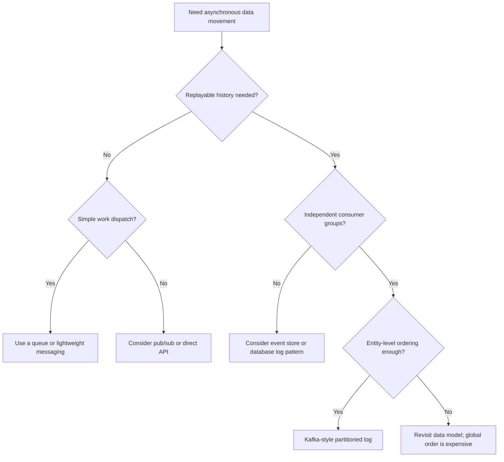

> **Discipline Module** | Complexity: `[COMPLEX]` | Time: 3.5 hours

## What You'll Be Able to Do

After completing this module, you will be able to:

- **Implement Apache Kafka on Kubernetes using Strimzi with proper broker, controller, storage, and KRaft configuration**
- **Design Kafka cluster topologies that balance throughput, durability, and availability requirements**
- **Configure topic partitioning, replication, and retention policies for production streaming workloads**
- **Diagnose Kafka performance issues including consumer lag, under-replicated partitions, broker imbalance, and Kubernetes placement failures**

You should already understand the StatefulSet and storage ideas from [Module 1.1: Stateful Workloads & Storage Deep Dive](../module-1.1-stateful-workloads/). Kafka is a stateful distributed system, so the same primitives matter here: stable identity, persistent volumes, predictable scheduling, and careful recovery behavior. Familiarity with replication, partitioning, and basic event-driven architecture will help, but the module rebuilds the Kafka-specific mental model from first principles before it asks you to operate anything.

## Why This Module Matters

Kafka is easy to describe badly as "a message broker," but that description hides the thing that makes it important to data platforms. A queue usually treats a message as a work item that disappears after successful processing. Kafka treats events as an ordered, replayable log, which means many independent consumers can read the same history at their own pace, rebuild derived state, recover after outages, and add new downstream systems without asking every producer to change. That replay property is why Kafka shows up beside streaming analytics, change data capture, lakehouse ingestion, audit trails, machine learning feature pipelines, and event-driven service integration.

Hypothetical scenario: imagine a platform team that starts with one order service writing directly to one warehouse loader. The design feels simple until fraud detection, billing reconciliation, customer notifications, and a data science feature job all need the same order changes. Point-to-point integrations turn one producer into a traffic coordinator, and every downstream outage becomes a producer-side concern. A log-based design changes the shape of the problem: the producer records what happened once, and each consumer owns its pace, offset, retry policy, and failure handling.

Running Kafka on Kubernetes is valuable for the same reason it is dangerous: Kubernetes is very good at replacing failed Pods, but Kafka brokers are not interchangeable stateless replicas. A broker owns partition replicas on disk, participates in leader election, exposes an identity that clients and peer brokers use, and must not lose its local storage just because a container restarted. Kubernetes can provide those guarantees through StatefulSets, persistent volumes, Pod disruption controls, anti-affinity, and declarative reconciliation, but only when the Kafka operator maps Kafka's failure model onto Kubernetes deliberately.

Strimzi is the running example in this module because it is a Kubernetes operator built specifically for Kafka lifecycle management. The durable lesson is not "always run this exact version of this exact operator." The durable lesson is that Kafka needs an operator-aware control plane that can coordinate brokers, topics, users, certificates, listeners, node pools, rolling upgrades, rebalances, and storage without treating every restart as a disposable Deployment rollout. Strimzi gives us concrete custom resources to inspect while we learn those operational boundaries.

Operationally, Kafka also forces a platform team to connect infrastructure work with data ownership. A broker restart, a topic retention change, a schema compatibility mode, and a consumer offset reset can all change what downstream teams observe. That means Kafka cannot be owned only as "the cluster" and ignored as "the data." Healthy platforms define who owns each topic, which consumers are allowed to replay, how breaking schema changes are reviewed, what retention means for recovery, and how incident responders decide whether to preserve availability or reject unsafe writes.

> **The Library Ledger Analogy**
>
> Think of Kafka as a library ledger rather than a delivery truck. A delivery truck hands one package to one recipient and then the package is gone. A ledger records a durable sequence of entries, and many readers can independently keep bookmarks in that same sequence. Partitions are separate ledger books, offsets are bookmarks, replicas are copies of each book, and consumer groups are teams that divide the reading work without changing the ledger itself.

## The Log Abstraction

Jay Kreps' canonical writing on "the log" describes an append-only sequence as a unifying abstraction for real-time data systems. Kafka takes that idea and distributes it: producers append records to topic partitions, brokers store those partitions on disk, consumers read records by offset, and retention policies decide how long old records remain available. The important point is not that Kafka has files on disk. The important point is that the append-only structure lets systems separate "record the fact that something happened" from "decide every possible use for that fact today."

A Kafka topic is a named stream, but the topic itself is not the unit of ordering or parallelism. A topic is split into partitions, and each partition is an ordered, immutable log. Within one partition, offsets increase as records are appended, so a consumer can say, "I have processed through offset N." Across partitions, Kafka does not provide a single total order. That tradeoff is intentional: one global order would make the log simpler to reason about, but it would also turn the topic into a single serialization point.

Records normally have a key, value, timestamp, and headers. The key matters because producers use it to choose the partition unless you override the partitioner. If all events for `customer-123` use the same key, they land in the same partition and preserve per-customer order. If keys are missing or poorly chosen, Kafka can spread records more evenly, but the application loses entity-level ordering. Good Kafka design starts with the question "what must be ordered together?" rather than "how many partitions can I create?"

Offsets are not acknowledgments stored inside the record. They are positions in a partition, and consumer groups commit their progress separately. That separation is powerful because two consumer groups can read the same topic independently. The fraud detector can be caught up, the warehouse loader can be behind, and a new backfill job can start from the beginning without changing producer behavior. It is also why lag is such an important signal: lag tells you the distance between the latest produced offsets and the offsets a consumer group has committed.

Retention makes Kafka different from a traditional queue. With delete retention, records age out by time or size. With compaction, Kafka keeps the latest value for each key and may remove older values for the same key. Delete retention fits event histories such as orders, clicks, or telemetry. Compaction fits changelog-like topics such as user profiles, feature flags, or table snapshots where the current value by key matters more than every intermediate update. Many production platforms use both patterns side by side.

The log abstraction also explains why Kafka is useful even when no consumer is ready at the moment an event is produced. A new team can add a consumer tomorrow and read retained history. A broken consumer can restart and resume from its committed offset. A stream processor can rebuild state after a redeploy by replaying input topics. This is the platform engineering reason to treat Kafka as shared infrastructure: the value is not just high throughput, but controlled decoupling between producers, consumers, and time.

## Landscape Snapshot

> **Landscape snapshot — as of 2026-06. This changes fast; verify against vendor docs before relying on specifics.**
>
> Apache Kafka's documentation site exposes 4.3 docs, while Strimzi's latest operator documentation is 1.0.0 and its example manifests use Kafka 4.2.0 images. Kafka 4.0 and later run in KRaft mode without ZooKeeper integration, and Strimzi removed support for ZooKeeper-based Kafka clusters starting with the 0.46 line. The durable lesson is to design for KRaft controller quorums and node pools; the exact Kafka and Strimzi versions belong in release notes, platform standards, and upgrade runbooks.

| Capability | Durable Meaning | Illustrative Options |
|------------|-----------------|----------------------|
| Streaming log | Replayable ordered partitions with offsets and retention | Apache Kafka, Redpanda-compatible APIs, cloud-managed Kafka offerings |
| Lightweight messaging | Low-latency pub/sub or work dispatch with simpler operations | NATS, NATS JetStream, cloud queue services |
| Stream processing | Stateful computation over event time and processing time | Flink, Kafka Streams, Spark Structured Streaming |
| Schema governance | Compatibility checks between producers and consumers | Apicurio Registry, Confluent-compatible registries, cloud registries |
| Cross-cluster replication | Disaster recovery, migration, or regional read copies | MirrorMaker 2, vendor-native replication features |

This module uses Kafka and Strimzi as the worked example because they expose the core semantics clearly. The Rosetta view matters because platform engineers must avoid turning a curriculum module into vendor advocacy. If a workload only needs a small work queue, Kafka may be unnecessary operational weight. If a workload needs replayable partitions, independent consumer groups, long retention, and stream processing integration, Kafka's log model may be the right primitive even when a managed service runs the brokers for you.

## Partitioning, Ordering, and Parallelism

Partitioning is Kafka's central design lever. A partition is the smallest unit that a consumer group can assign to one consumer at a time, which means a topic with six partitions can keep at most six consumers in one group busy. Adding more consumers than partitions can still help with rolling deploys or standby capacity, but it does not increase active read parallelism. Increasing partitions can improve throughput, yet it also increases metadata, file handles, leader election work, client connections, and rebalance complexity.

The hardest partitioning decisions are not arithmetic; they are semantic. If an order service emits `order-created`, `order-paid`, and `order-cancelled` events, the processor that builds an order timeline needs those events in order for each order. Keying by `order_id` gives that processor a coherent per-order stream. Keying by customer might preserve a broader customer timeline but concentrate heavy customers into hot partitions. Random keys spread load but break entity ordering. A platform standard should make teams state their ordering key explicitly during topic design.

Hot partitions are the common failure mode behind "Kafka is slow" reports. The cluster may have many brokers and the topic may have many partitions, but one key or one small key range can dominate write volume. Because all records for that key must remain in one partition to preserve order, the overloaded partition becomes the bottleneck while other partitions look healthy. The fix is rarely "add consumers." If the hot partition is still one partition, adding consumers to the same group cannot split it.

You can respond to skew in several ways, but each response changes semantics. You can choose a better key, such as `merchant_id` instead of a constant event type. You can shard a hot entity key by adding a suffix, such as `merchant_id + shard`, but then downstream consumers must reconstruct order carefully or accept weaker ordering. You can split the workload into separate topics so high-volume event families do not crowd out lower-volume ones. The correct answer depends on which order the business actually requires.

Partition count also affects future operations. Kafka can increase a topic's partition count, but doing so changes key-to-partition mapping for many keys and can surprise consumers that assumed a stable mapping. Kafka cannot simply shrink a topic's partition count in place because offsets and ordering histories are partition-specific. That asymmetry makes initial partition planning important. Pick enough partitions for credible growth, but avoid using enormous counts as a substitute for understanding throughput, ordering, and operational overhead.

## Producers and Delivery Semantics

Producer settings express the tradeoff between speed, durability, and duplicate handling. With `acks=0`, the producer does not wait for broker acknowledgment, so loss can be invisible. With `acks=1`, the leader acknowledges after writing locally, but a leader failure before followers catch up can still lose acknowledged records. With `acks=all`, the leader waits for the configured in-sync replica requirement before acknowledging, so the producer participates in the topic's durability policy. Critical event streams should treat `acks=all` as the normal starting point, not as a luxury.

`min.insync.replicas` is the broker-side partner to `acks=all`. A topic with replication factor three and `min.insync.replicas=2` can continue accepting acknowledged writes when one replica is unavailable, but it will reject writes if too few replicas remain in sync. That rejection is not Kafka being broken. It is Kafka choosing availability loss over acknowledged data loss. Platform teams need to explain this to application owners because the visible symptom is often producer errors during maintenance, while the real benefit is preserving the durability contract.

Idempotent producers reduce duplicates caused by retries. Kafka assigns producer sequence information so the broker can detect retried sends for a partition and avoid appending duplicates from the same producer session. Transactions extend the idea across multiple partitions and offset commits, allowing a consume-process-produce pipeline to write output records and commit input offsets atomically. This is what people usually mean when they say Kafka supports exactly-once processing, but the phrase deserves caution.

"Exactly-once" in distributed systems is effectively-once behavior within a defined boundary, not magic removal of all duplicate risk everywhere. Kafka transactions can make Kafka-to-Kafka processing atomic when producers, consumers, brokers, and stream processors use the transaction protocol correctly. They do not automatically make an external payment API, email sender, or database write exactly-once. Once side effects leave Kafka, the application still needs idempotent writes, deduplication keys, transactional outbox patterns, or compensating logic.

Batching and compression are the producer-side performance levers that most teams touch first. `batch.size` controls how much data a producer tries to batch per partition, `linger.ms` allows a small wait to fill batches, and compression reduces network and disk bytes at the cost of CPU. High-throughput analytics streams often benefit from larger batches and compression. Low-latency interactive workflows may choose smaller batches and lower linger. The platform standard should describe the tradeoff rather than mandate one universal setting.

## Replication, ISR, and Durability

Kafka replication happens at the partition level. Each partition has one leader replica that handles client reads and writes, plus follower replicas that fetch from the leader. The in-sync replica set, usually shortened to ISR, contains replicas that are caught up enough to be eligible for safe leadership and acknowledgment decisions. When a follower falls behind or disappears, it leaves the ISR. When it catches up, it can rejoin. This small piece of state drives many operational outcomes.

Replication factor sets how many broker copies exist for a partition, but replication factor alone does not define durability. A topic with three replicas can still lose recently acknowledged records if producers use weak acknowledgments and the cluster elects a stale replica as leader after failure. The safer production pattern is replication factor three, `acks=all`, and `min.insync.replicas=2`, paired with careful broker placement across nodes or zones. That combination says, "do not acknowledge the write unless at least two in-sync replicas have it."

Unclean leader election is the availability-versus-durability emergency lever. If all in-sync replicas are unavailable, Kafka can either wait for an in-sync replica to return or elect an out-of-sync replica and risk losing acknowledged records. For critical data, unclean leader election should stay disabled so the cluster refuses unsafe leadership. For disposable telemetry where freshness matters more than perfect retention, a team might make a different choice deliberately. The key is that the choice belongs in a data classification policy, not in a copied default.

Kubernetes placement directly affects Kafka durability. If three broker Pods land on the same worker node, a single node failure can remove every replica of some partitions. If brokers share one storage failure domain, persistent volumes can fail together. If PodDisruptionBudgets allow too many brokers to be evicted at once, maintenance can push topics below their ISR requirement. Kafka durability therefore depends on Kubernetes scheduling, storage classes, disruption policies, and node maintenance processes as much as it depends on Kafka configuration.

Replication also has a cost. Followers fetch data from leaders, reassignments copy partition data between brokers, and recovery after a broker outage can create heavy network and disk traffic. A platform engineer should monitor under-replicated partitions, offline partitions, leader distribution, disk usage, and replication throughput. If a cluster is constantly catching up, the issue may be storage latency, network limits, overloaded brokers, aggressive rebalancing, or too many large partitions moving at the same time.

## Consumers, Groups, Offsets, and Lag

Consumers read by polling partitions, and a consumer group coordinates multiple consumers so each partition is assigned to only one active consumer in that group. This is the mechanism that lets a Deployment with several Pods share work horizontally. If a Pod dies, the group rebalances and assigns its partitions elsewhere. If a new Pod joins, the group may rebalance again to spread partitions. Rebalancing is useful, but it is not free; it interrupts assignment and can cause duplicate processing if offset commits and processing are not designed carefully.

Offset commits are the consumer's record of progress. Auto-commit is convenient because the client commits periodically, but it can commit before the application has durably finished processing a record. Manual commits give the application control, but they require discipline. For at-least-once processing, the usual pattern is process records first, make side effects idempotent, and commit offsets after success. If the consumer crashes after processing but before committing, it will process some records again after restart. That duplicate is the price of not losing work.

At-most-once processing commits before processing or otherwise accepts that a crash can skip records. It can be appropriate for disposable metrics or cache warming, but it is wrong for financial, inventory, compliance, and state-building streams. At-least-once processing avoids skipping records but may duplicate them. Effectively-once processing combines Kafka transactions, idempotent sinks, or deterministic updates so repeated delivery does not corrupt results. The platform should name these semantics plainly because "the consumer reads Kafka" tells you almost nothing about correctness.

Lag is the primary health signal for consumer groups, but it needs context. Offset lag counts how many records behind a group is; time lag estimates how old the unprocessed records are. A low-volume topic can have small offset lag but old data if no new records arrive, while a high-volume topic can have a large offset lag that represents only a short delay. Good dashboards show lag by group, topic, and partition, and they separate producer spikes from consumer failures. A single hot partition can hide behind healthy-looking group averages.

Partition assignment strategy also shapes behavior. Eager rebalancing can revoke many partitions during membership changes, while cooperative strategies try to move fewer partitions incrementally. Static membership can reduce churn for stable Kubernetes Pods if the application gives each member a stable identity. These details are client-specific, but the durable lesson is broader: consumer group design is part of application architecture. Scaling Pods without understanding assignment, processing time, and offset policy can make lag worse rather than better.

## Kafka on Kubernetes with Strimzi

Kafka maps naturally to StatefulSets because brokers need stable names, stable network identity, and stable storage. A broker called `my-cluster-broker-0` must be able to return with the same persistent volume after a restart, because its local logs contain partition replicas. A headless service and StatefulSet identity let peer brokers and operators reason about the broker as a stable member rather than a disposable Pod. This is the same reason databases and consensus systems usually use StatefulSets instead of Deployments.

Strimzi raises the abstraction from raw StatefulSets to Kafka-specific custom resources. A `Kafka` resource defines the cluster, listeners, security, common configuration, and optional components. A `KafkaNodePool` resource defines groups of nodes with broker and controller roles, storage, replicas, and resource requests. A `KafkaTopic` resource lets the Topic Operator reconcile topic partitions, replicas, and retention. A `KafkaUser` resource lets the User Operator manage credentials and ACLs. The operator turns those resources into StatefulSets, Services, Secrets, ConfigMaps, and rolling operations.

KRaft mode changes the deployment mental model because Kafka's metadata quorum lives inside Kafka rather than ZooKeeper. Controller nodes manage cluster metadata and broker nodes serve partition data. Small development clusters may use dual-role nodes, where the same Pods act as controllers and brokers. Production clusters often separate controller and broker pools to isolate control-plane work from data-plane load. The exact node pool design depends on workload size and operational maturity, but every design must protect the controller quorum and broker storage.

The Strimzi examples are intentionally declarative. You describe what the Kafka cluster should look like, and the operator reconciles toward that state. That does not mean every change is harmless. Changing storage, listener exposure, node pool roles, broker counts, or metadata versions can trigger rolling restarts, reassignments, or upgrade workflows. The operator removes a lot of manual shell work, but it does not remove the need to understand Kafka's failure domains. Declarative infrastructure is still infrastructure.

Here is a compact lab-sized Strimzi cluster that follows the current CRD shape while keeping the deployment small enough to inspect. Production clusters need stronger resource sizing, storage classes, rack awareness, monitoring, backup planning, and change management, but the core resources are the same.

```yaml
apiVersion: kafka.strimzi.io/v1
kind: KafkaNodePool
metadata:
  name: dual-role
  labels:
    strimzi.io/cluster: lab
spec:
  replicas: 3
  roles:
    - controller
    - broker
  storage:
    type: jbod
    volumes:
      - id: 0
        type: persistent-claim
        size: 10Gi
        kraftMetadata: shared
        deleteClaim: false
---
apiVersion: kafka.strimzi.io/v1
kind: Kafka
metadata:
  name: lab
spec:
  kafka:
    version: 4.2.0
    metadataVersion: 4.2-IV1
    listeners:
      - name: plain
        port: 9092
        type: internal
        tls: false
      - name: tls
        port: 9093
        type: internal
        tls: true
    config:
      default.replication.factor: 3
      min.insync.replicas: 2
      offsets.topic.replication.factor: 3
      transaction.state.log.replication.factor: 3
      transaction.state.log.min.isr: 2
      auto.create.topics.enable: false
  entityOperator:
    topicOperator: {}
    userOperator: {}
```

Notice what this YAML does and does not promise. It gives each broker persistent storage and KRaft metadata, disables accidental topic creation, and sets safer replication defaults for internal and application topics. It does not promise zone spreading, external access, TLS client authentication, schema governance, or operational dashboards. Those are separate platform decisions. A common mistake is to call a cluster "production" as soon as it has three replicas. Three replicas are a starting point, not an operating model.

## Topics, Retention, and Schemas as Contracts

Topics should be treated as platform contracts. A topic name tells producers where to write, but partition count, replication factor, retention, compaction, schema compatibility, and ownership tell everyone what reliability and evolution behavior to expect. If teams can create topics accidentally through producer typos, the platform has no review point for those decisions. Disabling automatic topic creation and managing topics as code forces the right conversation before data starts flowing.

```yaml
apiVersion: kafka.strimzi.io/v1
kind: KafkaTopic
metadata:
  name: orders.events
  labels:
    strimzi.io/cluster: lab
spec:
  partitions: 6
  replicas: 3
  config:
    retention.ms: 604800000
    cleanup.policy: delete
    min.insync.replicas: 2
---
apiVersion: kafka.strimzi.io/v1
kind: KafkaTopic
metadata:
  name: users.profile.current
  labels:
    strimzi.io/cluster: lab
spec:
  partitions: 6
  replicas: 3
  config:
    cleanup.policy: compact
    min.cleanable.dirty.ratio: 0.5
    delete.retention.ms: 86400000
    min.insync.replicas: 2
```

The first topic is an event history. It uses delete retention because downstream consumers may need the sequence of changes for a bounded time window. The second topic is a compacted state topic. It preserves the latest value per key so consumers can rebuild the current user profile table without replaying every historical mutation. Neither policy is universally better. The retention policy should match the data product's semantics: history, state, audit, replay, recovery, or temporary buffering.

Schema management protects consumers from accidental producer changes. Without a schema registry or compatibility process, one team can rename `customer_id` to `customerId`, change a numeric field to a string, or remove a field that a downstream consumer still requires. Kafka will happily store bytes either way. The registry's job is not to make data modeling bureaucratic. Its job is to make compatibility explicit, so a producer deployment cannot silently corrupt the data contract for every reader.

Compatibility mode is a rollout strategy in disguise. Backward compatibility means new consumers can read old data, which supports upgrading consumers before producers. Forward compatibility means old consumers can read new data, which supports upgrading producers first. Full compatibility constrains both directions and is safer for heavily shared streams, but it may slow evolution. The platform should define defaults by topic class rather than leaving every service team to rediscover schema evolution during an incident.

Kafka Connect and Debezium-style change data capture are common ways to move data into Kafka, while sink connectors move data out to warehouses, search indexes, object storage, and lakehouse tables. Connect is useful because connector workers, offsets, and task status become part of a managed runtime rather than custom application code in every team. It is still not "free integration." Connectors need schemas, secrets, capacity planning, dead-letter handling, and upgrade testing just like any other production workload.

## Security and Access Boundaries

Kafka security has several layers, and they solve different problems. TLS encrypts network traffic so records and credentials are not exposed in transit. Authentication proves which client is connecting, commonly through TLS client certificates, SASL/SCRAM, or OAuth integrations. Authorization controls which authenticated principal can read, write, describe, create, or administer resources. NetworkPolicies and listener choices control which network paths even reach the brokers. A secure platform uses all of these layers deliberately.

Strimzi can generate cluster and client certificates and store them as Kubernetes Secrets. That default is convenient because the operator can rotate certificates and roll affected components as part of reconciliation. Some organizations require externally managed certificate authorities, and Strimzi can be configured for that kind of integration. The design question is operational ownership: whichever system issues certificates must also support rotation, expiry monitoring, emergency revocation, and clear responsibilities during broker or client failures.

```yaml
apiVersion: kafka.strimzi.io/v1
kind: KafkaUser
metadata:
  name: orders-reader
  labels:
    strimzi.io/cluster: lab
spec:
  authentication:
    type: tls
  authorization:
    type: simple
    acls:
      - resource:
          type: topic
          name: orders.events
          patternType: literal
        operations:
          - Describe
          - Read
        host: "*"
      - resource:
          type: group
          name: orders-analytics
          patternType: literal
        operations:
          - Read
        host: "*"
```

ACL design should follow least privilege. Producers usually need `Write` and `Describe` on specific topics, while consumers need `Read` and `Describe` on topics plus `Read` on their consumer group. Administrative permissions should be rare and auditable. Prefix ACLs can reduce toil for controlled naming schemes, but they can also grant more than intended if topic names are loose. A platform team should pair naming standards with ACL standards so permissions remain understandable after the number of topics grows.

## MirrorMaker, Rebalancing, and Operational Drift

Cross-cluster replication is useful for migrations, disaster recovery drills, regional reads, and platform transitions. MirrorMaker 2 is Kafka's Kafka Connect-based replication system, and Strimzi can manage it through custom resources. The durable concept is offset-aware replication between clusters, not the belief that a second cluster automatically creates a simple active-active system. Replicated topics need naming policy, loop prevention, group offset handling, network capacity, schema availability, security on both sides, and failover runbooks.

MirrorMaker's default topic prefixing protects bidirectional replication from loops by marking where a topic came from. Identity replication policies can keep names unchanged for one-way disaster recovery, but that convenience becomes dangerous if someone later turns on reverse replication without understanding the topology. This is a good example of a broader Kafka lesson: the easiest local configuration can create the hardest global failure mode. Regional designs should be reviewed as dataflow graphs, not as isolated YAML snippets.

Kafka clusters drift over time. New topics appear, old topics grow unevenly, brokers are added, nodes are replaced, and traffic shifts as product behavior changes. Initial partition placement that looked balanced in a test environment may become skewed under real keys and real consumers. Manual partition reassignment can move replicas for a precise decommission or repair. Cruise Control, which Strimzi can integrate through `KafkaRebalance`, can generate optimization proposals based on goals such as disk balance, leader distribution, and rack awareness.

Rebalancing should be treated as a controlled maintenance operation. Moving replicas consumes disk, network, CPU, and broker I/O. If you move too much at once, you can cause the very latency and lag symptoms you were trying to fix. Throttles, concurrent movement limits, proposal review, and metrics windows matter. On a fresh cluster, there may not be enough workload history to generate a useful proposal. On a busy cluster, the proposal can become stale while you are reviewing it. Automation helps, but observability and judgment still matter.

## When Not Kafka

Kafka is a strong fit when you need replayable event history, independent consumer groups, partitioned ordering, large fan-out, retention-based backfills, and integration with stream processors. It is a weaker fit when you need a simple task queue, low operational overhead for a small service, request-response RPC, or short-lived messages with no replay value. Choosing Kafka for every asynchronous interaction creates heavy platform dependencies, complex local development, and operational expectations that many teams do not need.

NATS and NATS JetStream illustrate the lighter-messaging side of the tradeoff. Core NATS focuses on fast pub/sub, while JetStream adds persistence, retention, and durable consumers. Cloud queue and pub/sub services may also be a better fit when the team wants provider-managed operations and accepts provider-specific semantics. None of these options is universally better. The durable question is what the workload needs: replay length, ordering scope, consumer independence, throughput, retention, operational control, and ecosystem integration.

Use [Module 1.9: NATS JetStream](../module-1.9-nats-jetstream/) as the counterpoint after you learn Kafka. The comparison is healthy because it prevents tool monoculture. A platform team should be able to say, "this stream needs Kafka because replay and partitioned consumer groups are central," and also, "this workflow should not use Kafka because a lighter queue meets the reliability requirement with less operational surface."

## Patterns & Anti-Patterns

Kafka designs succeed when teams make the data contract visible. Topics are not just pipes; they are shared APIs with reliability, ordering, schema, and ownership commitments. The patterns below are less about memorizing settings than about making those commitments explicit before production traffic depends on them.

| Pattern | Why It Works | Practice Signal |
|---------|--------------|-----------------|
| Log-first integration | Producers record facts once and consumers own independent offsets | New consumers can be added without producer redeploys |
| Keyed ordering by entity | Related events share a partition, preserving local order | Topic design names the required ordering key |
| Topics as code | Partition, retention, replication, and ownership are reviewed | `KafkaTopic` resources live beside application manifests |
| Idempotent consumers | Retries and duplicate delivery do not corrupt state | Sinks use deterministic keys or deduplication tables |
| KRaft-aware node pools | Controllers and brokers have explicit roles and storage | `KafkaNodePool` design is part of the runbook |

Anti-patterns usually come from treating Kafka like a transparent transport layer. Kafka can move bytes quickly, but bytes without ownership, schema, retention, and failure semantics become a long-lived liability. The table names the smell, the damage, and the correction.

| Anti-Pattern | Why It Hurts | Better Approach |
|--------------|--------------|-----------------|
| One topic for everything | Consumers cannot reason about ownership, retention, or schema | Split by domain event stream and data contract |
| Random partition keys for ordered data | Entity timelines arrive out of order | Key by the entity that must be ordered |
| Auto-created production topics | Typos create silent data loss paths | Disable auto-create and manage topics declaratively |
| Offsets committed before side effects | Crashes can skip unprocessed records | Commit after successful idempotent processing |
| Kafka for every async need | Small workflows inherit broker complexity | Use lighter queues or NATS when replay is not required |

### Decision Framework

Use this framework during design reviews. It is intentionally simple because the goal is to force the right questions before a team selects an implementation. A "yes" answer does not automatically mandate Kafka, but several yes answers together indicate that a replayable partitioned log is probably the right primitive.

| Question | If Yes | If No |
|----------|--------|-------|
| Do multiple independent consumers need the same event history? | Kafka-style log is a strong candidate | A queue or direct integration may be enough |
| Must consumers replay old events after code changes or outages? | Retention and offsets matter | Short-lived messaging may be simpler |
| Is ordering needed for each entity but not globally? | Keyed partitions fit well | Global order or no order may point elsewhere |
| Are stream processors or CDC pipelines central to the design? | Kafka ecosystem integration helps | Avoid adopting ecosystem weight without need |
| Can the team operate broker storage, lag, schemas, and rebalances? | Self-managed or operator-managed Kafka can work | Prefer managed services or lighter primitives |



## Did You Know?

- **Kafka's durable primitive is the partition log, not the topic name.** Topics organize streams, but ordering, offsets, leaders, replicas, and consumer assignment all happen at partition scope.
- **KRaft moved Kafka metadata into Kafka's own control plane.** Modern Kafka operations should plan for controller quorums and metadata versions instead of a separate ZooKeeper ensemble.
- **Compaction is not compression.** Compression shrinks bytes in record batches, while compaction removes older records for the same key after newer values exist.
- **Lag is a symptom, not a diagnosis.** Growing lag can come from slow consumers, hot partitions, producer spikes, broker throttling, rebalance churn, or downstream sink failures.

## Common Mistakes

| Mistake | Problem | Solution |
|---------|---------|----------|
| Treating Kafka as a generic queue | Teams forget replay, retention, offsets, and duplicate delivery | Document stream semantics before implementation |
| Choosing partition keys after coding | Ordering and skew problems become expensive to fix | Choose keys during topic design review |
| Setting replication without ISR policy | Replicas exist but acknowledgments may still be weak | Pair replication factor with `acks=all` and `min.insync.replicas` |
| Ignoring Kubernetes placement | Broker replicas can fail together on one node or zone | Use anti-affinity, topology spread, and disruption controls |
| Enabling topic auto-creation in production | Typos silently create unmanaged topics | Disable auto-create and require `KafkaTopic` resources |
| Relying on exactly-once as a slogan | External side effects can still duplicate or reorder | Use transactions only within their boundary and make sinks idempotent |
| Watching only average consumer lag | One hot partition can hide behind healthy averages | Monitor lag by group, topic, and partition |
| Rebalancing without throttles | Replica movement can overload brokers and worsen lag | Review proposals and limit movement concurrency |

## Quiz

**Question 1:** A team deploys an `orders-processor` with eight Pods in one consumer group, but the `orders.events` topic has four partitions. Four Pods are busy and four Pods stay idle during peak traffic. What is happening, and what design decision should the team revisit?

<details>
<summary>Answer</summary>
Kafka assigns each partition to only one active consumer inside a consumer group, so four partitions can keep only four consumers busy. The idle Pods are not broken; there is simply no partition work to assign to them. The team should revisit the topic's partition count and the ordering key, because increasing partitions can raise parallelism but may also change key-to-partition mapping. This answer probes the outcome about configuring topic partitioning for production streaming workloads.
</details>

**Question 2:** During node maintenance, one broker in a three-broker cluster goes offline. A critical topic has replication factor three, `min.insync.replicas=2`, and producers use `acks=all`. Should producers continue to receive acknowledgments, and what happens if another in-sync replica disappears before the first broker returns?

<details>
<summary>Answer</summary>
With one broker offline, two in-sync replicas can remain, so producers using `acks=all` can still receive acknowledgments if the leader and another replica are healthy. If a second in-sync replica disappears, the topic can fall below `min.insync.replicas`, and Kafka should reject writes rather than acknowledge records that do not meet the durability policy. That rejection is an intentional availability tradeoff. This answer probes the outcome about designing topologies that balance throughput, durability, and availability.
</details>

**Question 3:** A fraud detection service writes alerts to another Kafka topic after reading `orders.events`. The team wants exactly-once behavior and also writes each alert to an external case-management API. Which part can Kafka transactions protect, and which part still needs application-level idempotency?

<details>
<summary>Answer</summary>
Kafka transactions can protect the Kafka-to-Kafka boundary: consuming input records, producing output records, and committing offsets atomically when the application uses the transaction protocol correctly. The external case-management API is outside that Kafka transaction, so retries can still duplicate side effects unless the API call uses idempotency keys or another deduplication mechanism. Exactly-once should be understood as effectively-once within a defined boundary. This answer probes the implementation and durability outcomes because producer transactions affect correctness as much as configuration.
</details>

**Question 4:** A platform engineer sees growing lag for one consumer group, but only partition 0 of the topic is behind. Other partitions are current, and adding more consumer Pods does not help. What is the likely cause, and what options should the team evaluate?

<details>
<summary>Answer</summary>
The likely cause is a hot partition, usually from a key distribution that sends too much traffic to one partition. Adding consumers does not help because one partition can still be assigned to only one consumer in the group. The team should evaluate whether the key matches the required ordering scope, whether a hot entity can be deliberately sharded, or whether the workload should be split into separate topics. This answer probes the diagnostic outcome around lag, partition skew, and consumer-group behavior.
</details>

**Question 5:** A team asks to run Kafka as a Kubernetes Deployment with an emptyDir volume because "Kubernetes will restart failed Pods anyway." Explain why that design is unsafe and which Kubernetes primitives Strimzi relies on instead.

<details>
<summary>Answer</summary>
A Kafka broker is not a disposable stateless replica because its local log contains partition replicas and its identity participates in cluster membership. If a restarted Pod loses storage or returns with a different identity, Kafka can lose replicas, trigger avoidable recovery, or violate operational assumptions. Strimzi relies on StatefulSet-style stable identity, persistent volume claims, Services, Secrets, and operator reconciliation to map Kafka's stateful model onto Kubernetes. This answer probes the outcome about implementing Kafka on Kubernetes with broker, controller, storage, and KRaft configuration.
</details>

**Question 6:** A product team wants to publish small notification jobs that do not need replay after delivery, do not need multiple independent consumer groups, and can tolerate provider-managed queue semantics. Should Kafka be the default choice? Defend your answer.

<details>
<summary>Answer</summary>
Kafka should not be the default just because the interaction is asynchronous. If the workload does not need replayable history, partitioned ordering, independent consumer groups, or stream-processing integration, a lighter queue, pub/sub system, or managed messaging service may satisfy the requirement with less operational surface. Kafka becomes attractive when the log semantics are part of the product or data-platform requirement. This answer probes the topology design outcome because good platform design includes knowing when not to use Kafka.
</details>

**Question 7:** A schema change removes a field used by a downstream warehouse loader. The producer team says the record still serializes correctly and Kafka accepted it. Why is that not enough, and what platform control should have caught the problem?

<details>
<summary>Answer</summary>
Kafka stores bytes and does not know whether removing a field breaks a consumer's data contract. Serialization success only proves the producer created a valid record in its own format; it does not prove compatibility with existing readers. A schema registry or equivalent compatibility gate should check whether the new schema is backward, forward, or fully compatible according to the topic's policy. This answer probes the outcome about configuring production streaming workloads because schema compatibility is part of topic governance.
</details>

## Hands-On

This lab deploys a small Strimzi-managed Kafka cluster, creates topics with explicit durability settings, produces and consumes records, and inspects consumer lag. It is meant for a local or disposable Kubernetes cluster with enough CPU and memory for three Kafka Pods. The commands use the Strimzi `latest` install URL and the Strimzi Kafka image tag that the current 1.0.0 docs list for Kafka 4.2.0; verify both against upstream docs before reusing them in a long-lived platform standard.

### Step 1: Create a disposable cluster and install Strimzi

```bash
kind create cluster --name kafka-lab
kubectl create namespace kafka
kubectl create -f 'https://strimzi.io/install/latest?namespace=kafka' -n kafka
kubectl -n kafka wait --for=condition=Available \
  deployment/strimzi-cluster-operator --timeout=180s
```

### Step 2: Apply the Kafka cluster manifest

Save the cluster YAML from the Kafka on Kubernetes section as `kafka-lab.yaml`, then apply it in the `kafka` namespace.

```bash
kubectl -n kafka apply -f kafka-lab.yaml
kubectl -n kafka wait kafka/lab --for=condition=Ready --timeout=600s
kubectl -n kafka get kafkanodepool,kafka,pod
```

### Step 3: Create two topics with different retention semantics

Save the topic YAML from the topics section as `kafka-topics.yaml`, then apply and inspect the resulting topics.

```bash
kubectl -n kafka apply -f kafka-topics.yaml
kubectl -n kafka get kafkatopic
kubectl -n kafka describe kafkatopic orders.events
```

### Step 4: Produce and consume records with a shared consumer group

```bash
kubectl -n kafka run kafka-client --restart=Never --image=quay.io/strimzi/kafka:1.0.0-kafka-4.2.0 -- sleep 3600
kubectl -n kafka wait pod/kafka-client --for=condition=Ready --timeout=120s

kubectl -n kafka exec kafka-client -- bash -lc \
  'printf "order-1 created\norder-1 paid\norder-2 created\n" | bin/kafka-console-producer.sh --bootstrap-server lab-kafka-bootstrap:9092 --topic orders.events'

kubectl -n kafka exec kafka-client -- bash -lc \
  'bin/kafka-console-consumer.sh --bootstrap-server lab-kafka-bootstrap:9092 --topic orders.events --group orders-analytics --from-beginning --timeout-ms 10000'
```

### Step 5: Inspect consumer-group position and partition health

```bash
kubectl -n kafka exec kafka-client -- bash -lc \
  'bin/kafka-consumer-groups.sh --bootstrap-server lab-kafka-bootstrap:9092 --group orders-analytics --describe'

kubectl -n kafka exec kafka-client -- bash -lc \
  'bin/kafka-topics.sh --bootstrap-server lab-kafka-bootstrap:9092 --topic orders.events --describe'
```

### Step 6: Clean up

```bash
kubectl delete namespace kafka
kind delete cluster --name kafka-lab
```

### Success Criteria

- [ ] Strimzi Cluster Operator reaches `Available` in the `kafka` namespace.
- [ ] The `lab` Kafka resource reaches `Ready` with three dual-role KRaft nodes.
- [ ] `orders.events` and `users.profile.current` exist as `KafkaTopic` resources with explicit replication and retention settings.
- [ ] A producer writes sample order events and a consumer group reads them from the beginning.
- [ ] `kafka-consumer-groups.sh --describe` shows committed progress for the `orders-analytics` group.
- [ ] `kafka-topics.sh --describe` shows leaders, replicas, and ISR for the `orders.events` partitions.

## Sources

- [Apache Kafka 4.3 Introduction](https://kafka.apache.org/43/getting-started/introduction)
- [Apache Kafka 4.3 Design: Message Delivery Semantics and Replication](https://kafka.apache.org/43/design/design/)
- [Apache Kafka 4.3 Producer Configuration](https://kafka.apache.org/43/configuration/producer-configs/)
- [Apache Kafka 4.3 Consumer Configuration](https://kafka.apache.org/43/configuration/consumer-configs/)
- [Apache Kafka 4.3 KRaft Operations](https://kafka.apache.org/43/operations/kraft/)
- [Apache Kafka 4.3 Basic Operations](https://kafka.apache.org/43/operations/basic-kafka-operations/)
- [Strimzi Operator Deploying and Managing 1.0.0](https://strimzi.io/docs/operators/latest/deploying)
- [Strimzi Operator Configuring 1.0.0](https://strimzi.io/docs/operators/latest/configuring.html)
- [Strimzi Blog: Introducing MirrorMaker 2](https://strimzi.io/blog/2020/03/30/introducing-mirrormaker2/)
- [Strimzi Blog: Cruise Control and Automated Rebalancing](https://strimzi.io/blog/2020/06/15/cruise-control/)
- [Kubernetes StatefulSet Documentation](https://kubernetes.io/docs/concepts/workloads/controllers/statefulset/)
- [Kubernetes Persistent Volumes Documentation](https://kubernetes.io/docs/concepts/storage/persistent-volumes/)
- [The Log: What Every Software Engineer Should Know About Real-Time Data's Unifying Abstraction](https://engineering.linkedin.com/distributed-systems/log-what-every-software-engineer-should-know-about-real-time-datas-unifying)
- [NATS JetStream Concepts](https://docs.nats.io/nats-concepts/jetstream)

## Next Module

Continue to [Module 1.3: Stream Processing with Apache Flink](../module-1.3-flink/) to learn how event-time processing, windows, watermarks, checkpoints, and stateful stream computation build on the Kafka log.
