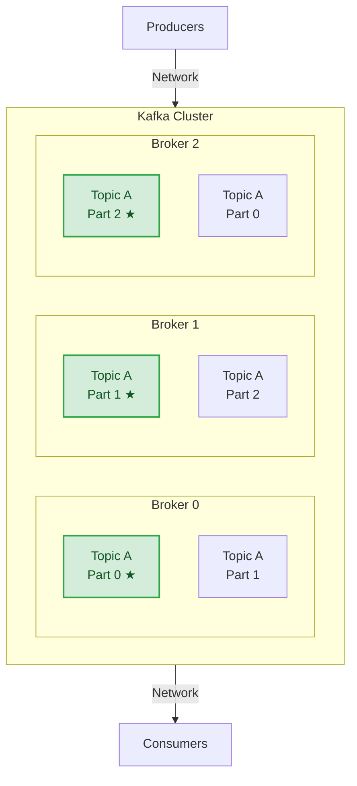
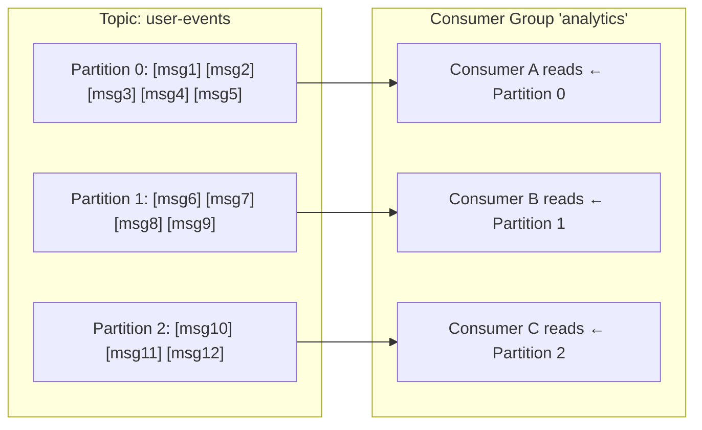
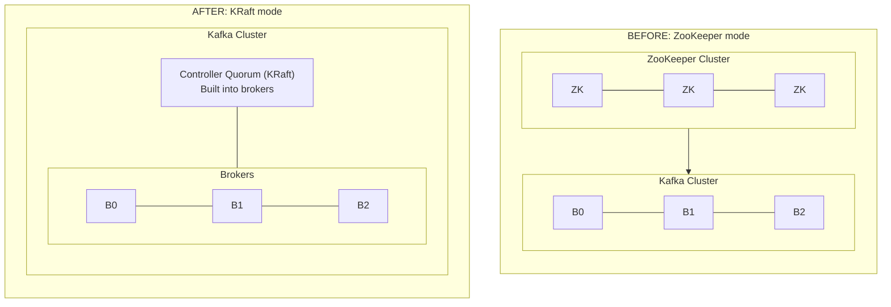
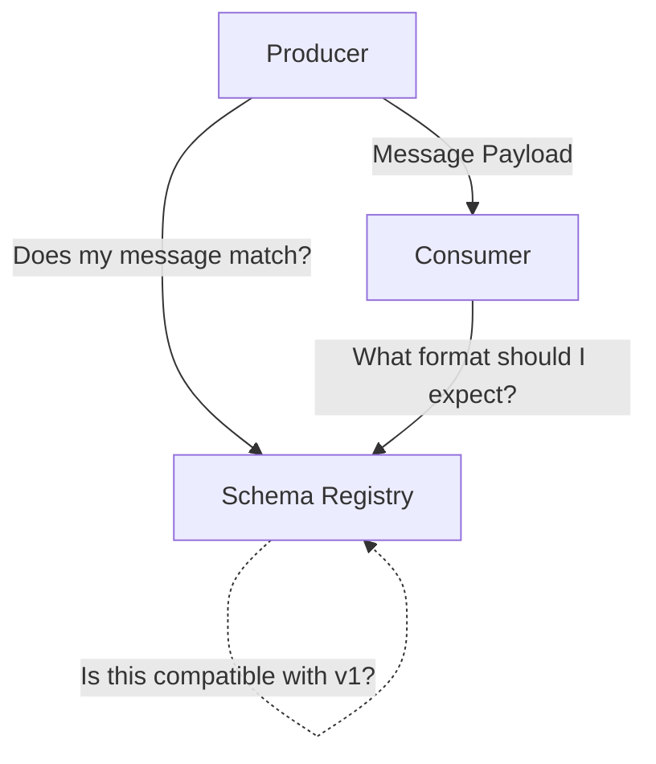
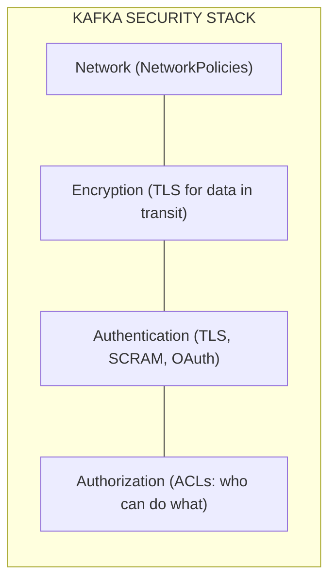
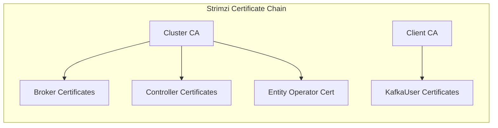
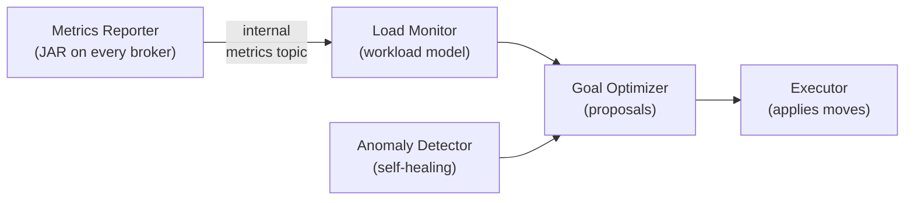
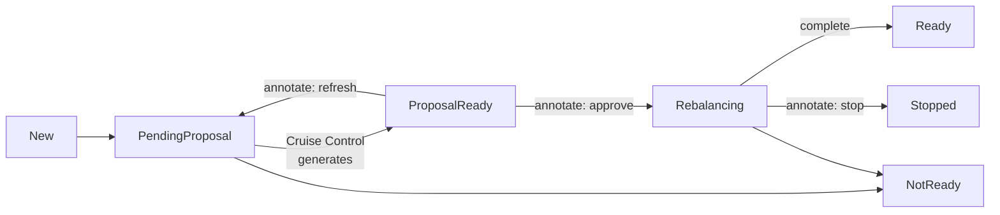

> **Discipline Module** | Complexity: `[COMPLEX]` | Time: 3.5 hours

## Prerequisites

Before starting this module:
- **Required**: [Module 1.1 — Stateful Workloads & Storage Deep Dive](../module-1.1-stateful-workloads/) — StatefulSets, Operators, storage fundamentals
- **Required**: Understanding of distributed systems concepts (replication, partitioning, consensus)
- **Recommended**: Experience with any messaging or event system (RabbitMQ, SQS, Pub/Sub, etc.)
- **Recommended**: Familiarity with TLS certificates and mutual authentication concepts

---

## What You'll Be Able to Do

After completing this module, you will be able to:

- **Implement Apache Kafka on Kubernetes using Strimzi operator with proper broker and ZooKeeper configuration**
- **Design Kafka cluster topologies that balance throughput, durability, and availability requirements**
- **Configure topic partitioning, replication, and retention policies for production streaming workloads**
- **Diagnose Kafka performance issues — consumer lag, under-replicated partitions, broker imbalance — in Kubernetes**

## Why This Module Matters

Every modern data platform has Kafka at its center. Not sometimes — virtually always.

LinkedIn built Kafka in 2011 to solve a specific problem: connecting hundreds of microservices without point-to-point spaghetti. Today, over 80% of Fortune 100 companies run Kafka. Netflix processes 7 million events per second through it. The New York Times uses it to deliver articles in real time. Uber routes every trip through Kafka.

Running Kafka well is hard. Running Kafka on Kubernetes is harder — but also better, because Kubernetes solves Kafka's most painful operational challenges: broker replacement, rolling upgrades, certificate rotation, and configuration management.

The Strimzi Operator is the CNCF-incubating project that makes Kafka on Kubernetes a first-class experience. It manages the entire Kafka lifecycle through Kubernetes Custom Resources, turning what used to be weeks of manual work into a single YAML file.

This module teaches you to deploy, configure, secure, and operate a production-grade Kafka cluster on Kubernetes using Strimzi.

---

## Did You Know?

- **Kafka was named after the author Franz Kafka** because Jay Kreps, its creator, thought a system optimized for writing deserved a writer's name. The name has no deeper connection to Kafka's literary themes.
- **A single Kafka broker can sustain 800 MB/s of throughput** on appropriate hardware. That is roughly 2.8 TB per hour, per broker. Most performance problems are caused by misconfiguration, not Kafka's limits.
- **KRaft mode eliminates ZooKeeper entirely.** Since Kafka 3.3, the metadata quorum runs inside the brokers themselves using the Raft consensus protocol. Strimzi fully supports KRaft, and ZooKeeper-based deployments are now deprecated.

---

## Kafka Architecture: The 10-Minute Version

### Core Concepts

Kafka is a **distributed commit log**. Producers append messages to the end of the log. Consumers read from the log at their own pace. The log is durable, ordered, and replayable.



*(★ indicates the Partition Leader; unmarked boxes are follower replicas)*

**Key terms:**

| Concept | What It Is | Analogy |
|---------|-----------|---------|
| **Broker** | A Kafka server process | A librarian managing shelves |
| **Topic** | A named stream of records | A bookshelf for one subject |
| **Partition** | An ordered, immutable log within a topic | A single shelf on the bookshelf |
| **Replica** | A copy of a partition on another broker | A backup copy of that shelf |
| **Leader** | The replica that handles reads/writes | The primary librarian for that shelf |
| **Consumer Group** | A set of consumers sharing work | A reading club splitting chapters |
| **Offset** | Position in the partition log | A bookmark |

### Why Partitions Matter

Partitions are Kafka's unit of parallelism. A topic with 12 partitions can be consumed by up to 12 consumers in a group simultaneously. More partitions = more throughput, but also more overhead.



> **Stop and think**: If a topic has 12 partitions, and your application scales up to 15 pods sharing the same consumer group, what happens to the remaining 3 pods?

Messages within a partition are strictly ordered. Messages across partitions have no ordering guarantee. If you need ordering for a specific entity (e.g., all events for user-123), use a partition key — Kafka hashes the key to determine the partition.

### KRaft: Kafka Without ZooKeeper

Until Kafka 3.3, every Kafka cluster required a separate ZooKeeper ensemble to manage metadata (broker registration, topic configuration, partition leadership). This doubled operational complexity.

KRaft (Kafka Raft) moves metadata management inside the Kafka brokers themselves:



**KRaft advantages:**
- Simpler operations (no ZooKeeper to babysit)
- Faster controller failover (seconds vs. minutes)
- Better scalability (millions of partitions)
- Unified security model

> **Pause and predict**: If a controller node fails in KRaft mode versus ZooKeeper mode, which one recovers faster and why?

Strimzi supports KRaft as the default deployment mode. All examples in this module use KRaft.

---

## Strimzi: Kafka's Kubernetes Operator

### What Strimzi Manages

Strimzi is not just a Helm chart that deploys Kafka. It is a full lifecycle manager that handles:

| Lifecycle Phase | What Strimzi Does |
|----------------|-------------------|
| **Deployment** | Creates StatefulSets, Services, ConfigMaps, NetworkPolicies |
| **Configuration** | Generates broker configs, validates settings, applies rolling changes |
| **Security** | Auto-generates and rotates TLS certificates, manages SASL/SCRAM users |
| **Scaling** | Adds/removes brokers, triggers partition rebalancing |
| **Upgrades** | Rolling broker upgrades with automatic protocol version negotiation |
| **Monitoring** | Deploys JMX exporters, creates Prometheus ServiceMonitors |
| **Connectivity** | Configures external access via NodePort, LoadBalancer, Ingress, or Route |

### Strimzi Custom Resources

Strimzi introduces several CRDs:

```
Kafka                    ─── The Kafka cluster itself
KafkaNodePool            ─── Groups of broker nodes with distinct configs
KafkaTopic               ─── Managed Kafka topics
KafkaUser                ─── Managed Kafka users with ACLs
KafkaConnect             ─── Kafka Connect clusters
KafkaConnector           ─── Individual connectors within a Connect cluster
KafkaMirrorMaker2        ─── Cross-cluster replication
KafkaBridge              ─── HTTP bridge for REST-based access
KafkaRebalance           ─── Cruise Control rebalancing proposals
```

### Deploying Strimzi

```bash
# Install Strimzi Operator (latest stable)
kubectl create namespace kafka
kubectl create -f 'https://strimzi.io/install/latest?namespace=kafka' -n kafka

# Wait for the operator to be ready
kubectl -n kafka wait --for=condition=Available \
  deployment/strimzi-cluster-operator --timeout=180s
```

### A Production-Grade Kafka Cluster

```yaml
# kafka-cluster.yaml
apiVersion: kafka.strimzi.io/v1beta2
kind: KafkaNodePool
metadata:
  name: broker
  namespace: kafka
  labels:
    strimzi.io/cluster: production
spec:
  replicas: 3
  roles:
    - broker
  storage:
    type: persistent-claim
    size: 100Gi
    class: fast-ssd
    deleteClaim: false
  resources:
    requests:
      cpu: "2"
      memory: 8Gi
    limits:
      memory: 8Gi
  template:
    pod:
      affinity:
        podAntiAffinity:
          requiredDuringSchedulingIgnoredDuringExecution:
            - labelSelector:
                matchLabels:
                  strimzi.io/cluster: production
                  strimzi.io/kind: Kafka
              topologyKey: kubernetes.io/hostname
---
apiVersion: kafka.strimzi.io/v1beta2
kind: KafkaNodePool
metadata:
  name: controller
  namespace: kafka
  labels:
    strimzi.io/cluster: production
spec:
  replicas: 3
  roles:
    - controller
  storage:
    type: persistent-claim
    size: 20Gi
    class: fast-ssd
    deleteClaim: false
  resources:
    requests:
      cpu: "1"
      memory: 4Gi
    limits:
      memory: 4Gi
---
apiVersion: kafka.strimzi.io/v1beta2
kind: Kafka
metadata:
  name: production
  namespace: kafka
  annotations:
    strimzi.io/kraft: enabled
    strimzi.io/node-pools: enabled
spec:
  kafka:
    version: 3.9.0
    metadataVersion: "3.9"
    listeners:
      - name: plain
        port: 9092
        type: internal
        tls: false
      - name: tls
        port: 9093
        type: internal
        tls: true
        authentication:
          type: tls
      - name: external
        port: 9094
        type: nodeport
        tls: true
        authentication:
          type: scram-sha-512
    config:
      # Replication settings
      default.replication.factor: 3
      min.insync.replicas: 2
      # Performance tuning
      num.network.threads: 8
      num.io.threads: 16
      socket.send.buffer.bytes: 102400
      socket.receive.buffer.bytes: 102400
      socket.request.max.bytes: 104857600
      # Log settings
      log.retention.hours: 168            # 7 days
      log.segment.bytes: 1073741824       # 1 GB segments
      log.retention.check.interval.ms: 300000
      # Topic defaults
      num.partitions: 12
      auto.create.topics.enable: false    # Explicit topic creation only
    metricsConfig:
      type: jmxPrometheusExporter
      valueFrom:
        configMapKeyRef:
          name: kafka-metrics
          key: kafka-metrics-config.yml
  entityOperator:
    topicOperator:
      resources:
        requests:
          cpu: 250m
          memory: 512Mi
        limits:
          memory: 512Mi
    userOperator:
      resources:
        requests:
          cpu: 250m
          memory: 512Mi
        limits:
          memory: 512Mi
```

**Key configuration decisions explained:**

| Setting | Value | Why |
|---------|-------|-----|
| `default.replication.factor: 3` | 3 copies of every partition | Survives loss of 1 broker without data loss |
| `min.insync.replicas: 2` | At least 2 replicas must acknowledge writes | Prevents data loss when one replica is down |
| `auto.create.topics.enable: false` | Topics must be created explicitly | Prevents typos from silently creating garbage topics |
| `log.retention.hours: 168` | 7-day retention | Balance between replay capability and disk usage |
| `num.partitions: 12` | Default 12 partitions per topic | Reasonable parallelism without excessive overhead |

---

## High Throughput vs Low Latency Configuration

Kafka can be tuned for throughput or latency. These are opposing forces.

### High Throughput Configuration

When you need maximum messages per second (log aggregation, analytics pipelines):

```yaml
# In the Kafka CR spec.kafka.config
config:
  # Producer-side (configure in producer clients)
  # batch.size: 65536              # 64 KB batches
  # linger.ms: 50                  # Wait 50ms to fill batches
  # compression.type: lz4          # Compress for throughput

  # Broker-side
  num.network.threads: 8           # Handle more concurrent connections
  num.io.threads: 16               # More disk I/O threads
  socket.send.buffer.bytes: 1048576    # 1 MB send buffer
  socket.receive.buffer.bytes: 1048576 # 1 MB receive buffer
  log.flush.interval.messages: 50000   # Batch disk flushes
  replica.fetch.max.bytes: 10485760    # 10 MB replica fetch
```

### Low Latency Configuration

When you need sub-10ms end-to-end latency (payment processing, real-time bidding):

```yaml
config:
  # Producer-side (configure in producer clients)
  # batch.size: 16384             # Small batches
  # linger.ms: 0                  # Send immediately
  # acks: 1                       # Acknowledge after leader write only
  # compression.type: none        # No compression overhead

  # Broker-side
  num.network.threads: 16         # More threads for responsiveness
  num.io.threads: 8               # Fewer I/O threads, less contention
  socket.send.buffer.bytes: 65536
  socket.receive.buffer.bytes: 65536
  log.flush.interval.messages: 1  # Flush every message (if durability needed)
```

### The Tradeoff Spectrum


| Setting | High Throughput | Low Latency |
|---------|-----------------|-------------|
| **Batching** | Large batches | Small/no batches |
| **linger.ms** | 50-200 | 0 |
| **Compression** | lz4 / zstd | No compression |
| **acks** | 1 | all |
| **Buffers** | Bigger buffers | Smaller buffers |
| **Requests** | Fewer, larger requests | Many, smaller requests |

> **Stop and think**: If your trading application requires sub-millisecond response times, why might enabling `lz4` compression actually hurt your performance?

---

## Schema Management

### Why Schemas Matter

Without schemas, producers and consumers are in a trust-based relationship. Producer sends JSON with field `user_id`. Consumer expects `userId`. Things break silently.

Schemas enforce a contract between producers and consumers:



### Apicurio Registry on Kubernetes

Apicurio Registry is the open-source schema registry that works with Kafka (alternative to Confluent Schema Registry):

```yaml
# apicurio-registry.yaml
apiVersion: apps/v1
kind: Deployment
metadata:
  name: apicurio-registry
  namespace: kafka
spec:
  replicas: 2
  selector:
    matchLabels:
      app: apicurio-registry
  template:
    metadata:
      labels:
        app: apicurio-registry
    spec:
      containers:
        - name: registry
          image: apicurio/apicurio-registry:3.0.4
          ports:
            - containerPort: 8080
          env:
            - name: APICURIO_STORAGE_KIND
              value: kafkasql
            - name: APICURIO_KAFKASQL_BOOTSTRAP_SERVERS
              value: production-kafka-bootstrap.kafka.svc.cluster.local:9092
          resources:
            requests:
              cpu: 250m
              memory: 512Mi
            limits:
              memory: 512Mi
          readinessProbe:
            httpGet:
              path: /health/ready
              port: 8080
            initialDelaySeconds: 15
            periodSeconds: 10
---
apiVersion: v1
kind: Service
metadata:
  name: apicurio-registry
  namespace: kafka
spec:
  selector:
    app: apicurio-registry
  ports:
    - port: 8080
      targetPort: 8080
```

### Compatibility Modes

| Mode | Rule | When To Use |
|------|------|-------------|
| **BACKWARD** | New schema can read old data | Default. Consumers upgrade first |
| **FORWARD** | Old schema can read new data | Producers upgrade first |
| **FULL** | Both backward and forward compatible | Most restrictive, safest |
| **NONE** | No compatibility check | Never in production |

> **Pause and predict**: If you choose `FORWARD` compatibility, which side of the stream (producers or consumers) must be upgraded with the new schema first?

---

## Kafka Connect: Moving Data In and Out

Kafka Connect is the framework for streaming data between Kafka and external systems without writing code.

### Deploying Kafka Connect with Strimzi

```yaml
# kafka-connect.yaml
apiVersion: kafka.strimzi.io/v1beta2
kind: KafkaConnect
metadata:
  name: data-connect
  namespace: kafka
  annotations:
    strimzi.io/use-connector-resources: "true"  # Enable KafkaConnector CRs
spec:
  version: 3.9.0
  replicas: 3
  bootstrapServers: production-kafka-bootstrap:9093
  tls:
    trustedCertificates:
      - secretName: production-cluster-ca-cert
        pattern: "*.crt"
  config:
    group.id: data-connect-cluster
    offset.storage.topic: connect-offsets
    config.storage.topic: connect-configs
    status.storage.topic: connect-status
    offset.storage.replication.factor: 3
    config.storage.replication.factor: 3
    status.storage.replication.factor: 3
    key.converter: org.apache.kafka.connect.json.JsonConverter
    value.converter: org.apache.kafka.connect.json.JsonConverter
    key.converter.schemas.enable: false
    value.converter.schemas.enable: false
  build:
    output:
      type: docker
      image: my-registry.io/kafka-connect:latest
      pushSecret: registry-credentials
    plugins:
      - name: debezium-postgres
        artifacts:
          - type: tgz
            url: https://repo1.maven.org/maven2/io/debezium/debezium-connector-postgres/2.7.3.Final/debezium-connector-postgres-2.7.3.Final-plugin.tar.gz
      - name: camel-s3
        artifacts:
          - type: tgz
            url: https://repo1.maven.org/maven2/org/apache/camel/kafkaconnector/camel-aws-s3-sink-kafka-connector/4.8.2/camel-aws-s3-sink-kafka-connector-4.8.2-package.tar.gz
  resources:
    requests:
      cpu: "1"
      memory: 2Gi
    limits:
      memory: 2Gi
```

### Example: CDC with Debezium

Change Data Capture (CDC) streams database changes to Kafka in real time:

```yaml
# debezium-connector.yaml
apiVersion: kafka.strimzi.io/v1beta2
kind: KafkaConnector
metadata:
  name: postgres-cdc
  namespace: kafka
  labels:
    strimzi.io/cluster: data-connect
spec:
  class: io.debezium.connector.postgresql.PostgresConnector
  tasksMax: 1
  config:
    database.hostname: postgres.default.svc.cluster.local
    database.port: 5432
    database.user: debezium
    database.password: "${file:/opt/kafka/external-configuration/db-credentials/password}"
    database.dbname: orders
    topic.prefix: cdc
    plugin.name: pgoutput
    publication.autocreate.mode: filtered
    slot.name: debezium_slot
    table.include.list: "public.orders,public.customers"
    transforms: unwrap
    transforms.unwrap.type: io.debezium.transforms.ExtractNewRecordState
    transforms.unwrap.drop.tombstones: false
    heartbeat.interval.ms: 10000
```

This creates topics `cdc.public.orders` and `cdc.public.customers` with every INSERT, UPDATE, and DELETE streamed in real time.

---

## Securing Kafka: TLS, mTLS, and SCRAM

### Security Layers



### Strimzi TLS: Automatic Certificate Management

Strimzi automatically generates a CA and issues certificates:



Certificates are stored as Kubernetes Secrets and automatically rotated by the operator.

### Creating Authenticated Users with ACLs

```yaml
# kafka-user-producer.yaml
apiVersion: kafka.strimzi.io/v1beta2
kind: KafkaUser
metadata:
  name: events-producer
  namespace: kafka
  labels:
    strimzi.io/cluster: production
spec:
  authentication:
    type: scram-sha-512
  authorization:
    type: simple
    acls:
      - resource:
          type: topic
          name: user-events
          patternType: literal
        operations:
          - Write
          - Describe
        host: "*"
      - resource:
          type: topic
          name: user-events
          patternType: literal
        operations:
          - Create
        host: "*"
---
# kafka-user-consumer.yaml
apiVersion: kafka.strimzi.io/v1beta2
kind: KafkaUser
metadata:
  name: analytics-consumer
  namespace: kafka
  labels:
    strimzi.io/cluster: production
spec:
  authentication:
    type: tls
  authorization:
    type: simple
    acls:
      - resource:
          type: topic
          name: user-events
          patternType: literal
        operations:
          - Read
          - Describe
        host: "*"
      - resource:
          type: group
          name: analytics-
          patternType: prefix
        operations:
          - Read
        host: "*"
```

Strimzi creates a Secret for each user containing the credentials:
- **SCRAM**: Secret contains `password` and `sasl.jaas.config`
- **TLS**: Secret contains `user.crt`, `user.key`, and `ca.crt`

### mTLS Client Configuration

```yaml
# Application Pod mounting mTLS credentials
apiVersion: apps/v1
kind: Deployment
metadata:
  name: analytics-consumer
  namespace: kafka
spec:
  replicas: 3
  selector:
    matchLabels:
      app: analytics-consumer
  template:
    metadata:
      labels:
        app: analytics-consumer
    spec:
      containers:
        - name: consumer
          image: my-registry.io/analytics-consumer:v1.4.0
          env:
            - name: KAFKA_BOOTSTRAP_SERVERS
              value: production-kafka-bootstrap.kafka.svc.cluster.local:9093
            - name: KAFKA_SECURITY_PROTOCOL
              value: SSL
            - name: KAFKA_SSL_TRUSTSTORE_LOCATION
              value: /etc/kafka/certs/ca.p12
            - name: KAFKA_SSL_TRUSTSTORE_PASSWORD
              valueFrom:
                secretKeyRef:
                  name: production-cluster-ca-cert
                  key: ca.password
            - name: KAFKA_SSL_KEYSTORE_LOCATION
              value: /etc/kafka/certs/user.p12
            - name: KAFKA_SSL_KEYSTORE_PASSWORD
              valueFrom:
                secretKeyRef:
                  name: analytics-consumer
                  key: user.password
          volumeMounts:
            - name: kafka-certs
              mountPath: /etc/kafka/certs
              readOnly: true
      volumes:
        - name: kafka-certs
          projected:
            sources:
              - secret:
                  name: production-cluster-ca-cert
                  items:
                    - key: ca.p12
                      path: ca.p12
              - secret:
                  name: analytics-consumer
                  items:
                    - key: user.p12
                      path: user.p12
```

---

## Managing Topics as Code

```yaml
# kafka-topics.yaml
apiVersion: kafka.strimzi.io/v1beta2
kind: KafkaTopic
metadata:
  name: user-events
  namespace: kafka
  labels:
    strimzi.io/cluster: production
spec:
  partitions: 24
  replicas: 3
  config:
    retention.ms: 604800000         # 7 days
    cleanup.policy: delete
    min.insync.replicas: 2
    compression.type: lz4
    max.message.bytes: 1048576      # 1 MB max message
    segment.bytes: 536870912        # 512 MB segments
---
apiVersion: kafka.strimzi.io/v1beta2
kind: KafkaTopic
metadata:
  name: user-events-dlq
  namespace: kafka
  labels:
    strimzi.io/cluster: production
spec:
  partitions: 6
  replicas: 3
  config:
    retention.ms: 2592000000        # 30 days (DLQ gets longer retention)
    cleanup.policy: delete
    min.insync.replicas: 2
---
apiVersion: kafka.strimzi.io/v1beta2
kind: KafkaTopic
metadata:
  name: user-profiles
  namespace: kafka
  labels:
    strimzi.io/cluster: production
spec:
  partitions: 12
  replicas: 3
  config:
    cleanup.policy: compact          # Keep latest value per key
    min.cleanable.dirty.ratio: 0.5
    delete.retention.ms: 86400000    # 1 day tombstone retention
    min.insync.replicas: 2
```

**Topic naming conventions** that prevent chaos:

| Pattern | Example | When |
|---------|---------|------|
| `domain.entity.event` | `payments.order.completed` | Domain events |
| `source.table` | `cdc.public.orders` | CDC topics |
| `topic-name-dlq` | `user-events-dlq` | Dead letter queues |
| `connect-offsets` | `connect-offsets` | Internal Connect topics |

---

## MirrorMaker2 for DR and Multi-Region

MirrorMaker2 (MM2) is Kafka's cross-cluster replication engine, built on Kafka Connect and managed in Strimzi via the `KafkaMirrorMaker2` CRD. Unlike the original MirrorMaker 1, MM2 tracks consumer group offsets bidirectionally, handles topic renaming to prevent message loops in active-active configurations, and uses three internal connectors: a **source connector** (replicates records), a **checkpoint connector** (translates consumer group offsets), and a **heartbeat connector** (monitors pipeline liveness).

### KafkaMirrorMaker2 CRD Configuration

A production MM2 deployment replicating from a `us-east` cluster to `us-west`:

```yaml
apiVersion: kafka.strimzi.io/v1beta2
kind: KafkaMirrorMaker2
metadata:
  name: mm2-east-to-west
  namespace: kafka
spec:
  version: 3.9.0
  replicas: 2
  connectCluster: "us-west"      # The cluster that hosts the Connect worker pods
  clusters:
    - alias: "us-east"
      bootstrapServers: east-kafka-bootstrap.kafka-east.svc.cluster.local:9093
      tls:
        trustedCertificates:
          - secretName: east-cluster-ca-cert
            pattern: "*.crt"
      authentication:
        type: scram-sha-512
        username: mm2-east-user
        passwordSecret:
          secretName: mm2-east-user
          password: password
    - alias: "us-west"
      bootstrapServers: west-kafka-bootstrap.kafka-west.svc.cluster.local:9093
      tls:
        trustedCertificates:
          - secretName: west-cluster-ca-cert
            pattern: "*.crt"
      authentication:
        type: scram-sha-512
        username: mm2-west-user
        passwordSecret:
          secretName: mm2-west-user
          password: password
  mirrors:
    - sourceCluster: "us-east"
      targetCluster: "us-west"
      topicsPattern: "payments\\..*|orders\\..*|user-events"
      groupsPattern: "analytics-.*|reporting-.*"
      sourceConnector:
        config:
          replication.factor: 3
          offset-syncs.topic.replication.factor: 3
          sync.topic.acls.enabled: "false"
      checkpointConnector:
        config:
          checkpoints.topic.replication.factor: 3
          sync.group.offsets.enabled: "true"          # Write translated offsets to __consumer_offsets on target
          sync.group.offsets.interval.seconds: "60"
      heartbeatConnector:
        config:
          heartbeats.topic.replication.factor: 3
  resources:
    requests:
      cpu: 500m
      memory: 1Gi
    limits:
      memory: 1Gi
```

`connectCluster` must match one of the `alias` values. The MM2 Connect workers run inside the target cluster — the cluster receiving the replicated data.

### Topic Naming: Default Prefix vs. Identity Policy

By default, MM2 prepends the source cluster alias to every replicated topic name to prevent infinite loops in active-active configurations:

- `user-events` on `us-east` → `us-east.user-events` on `us-west`

MM2 also creates three internal bookkeeping topics on the target cluster:

| Internal Topic | Purpose |
|---------------|---------|
| `mm2-offset-syncs.us-east.internal` | Maps source partition offsets to target offsets |
| `us-east.checkpoints.internal` | Stores translated consumer group committed offsets |
| `us-east.heartbeats` | 1-second heartbeat confirming the pipeline is live |

To replicate without renaming — for strictly one-directional DR where consumer code should be identical on both clusters — use the `IdentityReplicationPolicy`:

```yaml
sourceConnector:
  config:
    replication.policy.class: "org.apache.kafka.connect.mirror.IdentityReplicationPolicy"
```

> **Trade-off:** `IdentityReplicationPolicy` simplifies consumer configuration but makes bidirectional active-active setups dangerous — both sides would replicate the same topics endlessly. Use it only when you guarantee replication runs in one direction only.

### Offset Translation and Consumer Failover

With `sync.group.offsets.enabled: true`, the checkpoint connector continuously writes translated consumer group offsets to the target cluster's `__consumer_offsets` topic. A consumer group that was reading from `us-east` can reconnect to `us-west` and resume from the correct position with no code changes.

```bash
# Verify all three MM2 connectors are in RUNNING state
kubectl -n kafka get kafkamirrormaker2 mm2-east-to-west \
  -o jsonpath='{.status.connectors[*].connector.state}'

# Confirm checkpoint topic created on target
kubectl -n kafka exec -it west-kafka-0 -- \
  bin/kafka-topics.sh --bootstrap-server localhost:9092 \
    --list | grep checkpoints

# Inspect translated consumer group offsets on target cluster
kubectl -n kafka exec -it west-kafka-0 -- \
  bin/kafka-consumer-groups.sh \
    --bootstrap-server localhost:9092 \
    --group analytics-orders \
    --describe
```

### Monitoring Replication Lag

MM2 exposes JMX metrics through the Connect worker. With Strimzi's JMX Prometheus Exporter configured, these key metrics surface:

| Metric | What It Measures | Alert Threshold |
|--------|-----------------|-----------------|
| `kafka_connect_mirror_source_connector_replication_latency_ms` | End-to-end lag from source produce to target produce | `> 30000` ms |
| `kafka_connect_worker_connector_count` | Active connectors (expect 3: source, checkpoint, heartbeat) | `< 3` |
| `kafka_connect_worker_task_count` | Active tasks across all connectors | Sustained drop from baseline |
| `kafka_connect_mirror_source_connector_record_count` | Records replicated per second | `= 0` for more than 1 min |

A PromQL alert:

```yaml
- alert: KafkaMirrorMaker2ReplicationLag
  expr: kafka_connect_mirror_source_connector_replication_latency_ms > 30000
  for: 5m
  labels:
    severity: critical
  annotations:
    summary: "MM2 replication lag exceeds 30s — DR readiness degraded"
    description: "kubectl -n kafka get kafkamirrormaker2 to inspect connector states"
```

### Topology Patterns

| Topology | Description | Use When |
|----------|-------------|----------|
| **Active-Passive** | Source cluster handles all writes; target is a read-only replica | Simple DR — RPO in minutes, RTO via manual cutover |
| **Active-Active** | Both clusters accept writes; MM2 replicates bidirectionally using the default prefix policy | Multi-region writes where local-latency matters more than operational simplicity |
| **Hub-and-Spoke** | Edge clusters replicate to a central hub in one direction only | IoT regional clusters feeding a central analytics platform |

### Regional Outage Recovery Procedure

1. Confirm the source is unreachable and the heartbeat topic has gone stale on the target:
   ```bash
   kubectl -n kafka get kafkamirrormaker2 mm2-east-to-west \
     -o jsonpath='{.status.conditions[?(@.type=="Ready")].message}'
   ```
2. Scale consumer Deployments to point at the target cluster bootstrap servers.
3. If `sync.group.offsets.enabled` was set, consumer groups resume at the translated offset automatically on reconnect. Otherwise, reset offsets by timestamp:
   ```bash
   kubectl -n kafka exec -it west-kafka-0 -- \
     bin/kafka-consumer-groups.sh --bootstrap-server localhost:9092 \
       --group analytics-orders --reset-offsets \
       --to-datetime 2026-05-22T00:00:00.000 --execute --all-topics
   ```
4. After source recovery, replay messages produced to the target during the outage back to the source using a short-lived MM2 deployment in the reverse direction with a time-bounded `topicsPattern`.

---

## Partition Reassignment

Kafka's partition assignment is fixed at topic creation time. Over a cluster's lifetime, this assignment drifts: brokers are added or decommissioned, traffic patterns shift, rack-awareness requirements are added retroactively. Partition reassignment realigns replicas and leaders across brokers to restore balance.

### When to Reassign

| Trigger | Symptom | Goal |
|---------|---------|------|
| **Broker decommission** | Target broker still holds partition leaders | Move all replicas off before draining the node |
| **Capacity imbalance** | One broker at 90%+ while others idle | Redistribute replicas and leaders evenly |
| **Rack-awareness retrofit** | Replicas of the same partition share one AZ | Regenerate assignment with rack constraints |
| **New broker added** | New broker shows 0 partitions | Move a subset of partitions to the new broker |

### kafka-reassign-partitions.sh: Generate, Execute, Verify

The tool runs in three distinct phases. Always save the "current assignment" output from `--generate` before executing — it is your rollback plan.

**Phase 1 — Generate a plan** (moving topics off broker 0 during decommission):

```bash
# Describe which topics to reassign
cat > /tmp/topics-to-move.json <<'EOF'
{"topics": [{"topic": "user-events"}, {"topic": "payments.order.completed"}], "version": 1}
EOF

# Generate a plan targeting brokers 1, 2, 3
kubectl -n kafka exec -it production-kafka-0 -- \
  bin/kafka-reassign-partitions.sh \
    --bootstrap-server localhost:9092 \
    --topics-to-move-json-file /tmp/topics-to-move.json \
    --broker-list "1,2,3" \
    --generate
```

The tool prints two JSON blocks: the current assignment (save it for rollback) and the proposed assignment. Save the proposed block as `reassignment.json`:

```json
{
  "version": 1,
  "partitions": [
    {"topic": "user-events", "partition": 0, "replicas": [1, 2, 3], "log_dirs": ["any","any","any"]},
    {"topic": "user-events", "partition": 1, "replicas": [2, 3, 1], "log_dirs": ["any","any","any"]}
  ]
}
```

**Phase 2 — Execute with a bandwidth throttle** (50 MB/s prevents the replication burst from saturating inter-broker links):

```bash
kubectl -n kafka exec -it production-kafka-0 -- \
  bin/kafka-reassign-partitions.sh \
    --bootstrap-server localhost:9092 \
    --reassignment-json-file /tmp/reassignment.json \
    --execute \
    --throttle 52428800    # 50 MB/s in bytes
```

The throttle sets `leader.replication.throttled.rate` and `follower.replication.throttled.rate` on every affected broker and topic. To adjust mid-reassignment, re-run `--execute` with the same JSON and a new `--throttle` value.

**Phase 3 — Verify and release the throttle:**

```bash
kubectl -n kafka exec -it production-kafka-0 -- \
  bin/kafka-reassign-partitions.sh \
    --bootstrap-server localhost:9092 \
    --reassignment-json-file /tmp/reassignment.json \
    --verify
```

> **Critical:** Running `--verify` after completion automatically removes the throttle configuration from broker configs. If you skip this step, the throttle persists and silently caps all future intra-cluster replication until you clear it manually with `kafka-configs.sh`. Always run `--verify` to clean up.

### KafkaRebalance CRD vs kafka-reassign-partitions.sh

| Approach | Use When | Avoid When |
|----------|----------|------------|
| **`kafka-reassign-partitions.sh`** | Precise, one-off decommissions; exact control of final partition placement; small numbers of topics | Many topics and partitions — manual JSON planning is error-prone at scale |
| **`KafkaRebalance` (Cruise Control)** | Routine load balancing; adding or removing brokers at scale; ongoing cluster health | Clusters with ≤ 3 brokers, or when exact deterministic partition placement is required |

### Reading Partition-Leader Skew

Diagnose the distribution before deciding whether to reassign:

```bash
# Per-partition leader, replicas, and ISR state
kubectl -n kafka exec -it production-kafka-0 -- \
  bin/kafka-topics.sh \
    --bootstrap-server localhost:9092 \
    --topic user-events \
    --describe

# Example skewed output — broker 0 leads every partition:
# Topic: user-events  Partition: 0  Leader: 0  Replicas: 0,1,2  Isr: 0,1,2
# Topic: user-events  Partition: 1  Leader: 0  Replicas: 0,2,1  Isr: 0,2,1
# Topic: user-events  Partition: 2  Leader: 0  Replicas: 0,1,2  Isr: 0,1,2

# Count leader assignments per broker across all topics
kubectl -n kafka exec -it production-kafka-0 -- \
  bin/kafka-topics.sh --bootstrap-server localhost:9092 --describe \
  | awk '/^\tTopic:/ {print $6}' | sort | uniq -c | sort -rn
```

The `KafkaTopic` status also reflects partition state after the Topic Operator reconciles it:

```bash
kubectl -n kafka get kafkatopic user-events -o jsonpath='{.status.replicasChange}'
```

### Validating In-Sync Replicas During Reassignment

A reassignment temporarily adds a new replica that is not yet in-sync, raising the under-replicated partition count. Monitor this — if the count stays elevated, the throttle is too aggressive or a replica is not catching up:

```bash
# Stream under-replicated partitions during the operation
watch -n 5 'kubectl -n kafka exec -it production-kafka-0 -- \
  bin/kafka-topics.sh --bootstrap-server localhost:9092 \
    --describe --under-replicated-partitions'
```

> **Stop and think**: With `min.insync.replicas: 2` and a 3-replica topic, if a reassignment temporarily adds a 4th replica (now in-progress) and one of the 3 original replicas goes offline mid-move, how many in-sync replicas remain and can producers with `acks=all` still write?

---

## Cruise Control for Continuous Rebalancing

Manual reassignment fixes specific, one-off problems. Cruise Control solves the ongoing problem: even after careful initial deployment, Kafka clusters drift toward imbalance as traffic patterns change, topics are added, and producer volumes shift. Cruise Control models your cluster continuously and generates rebalancing proposals — and can execute them automatically — to maintain broker health without manual intervention.

### Architecture

Cruise Control runs as a separate Pod alongside your Kafka cluster. You enable it by adding `cruiseControl: {}` to the `Kafka` CR:

```yaml
apiVersion: kafka.strimzi.io/v1beta2
kind: Kafka
metadata:
  name: production
  namespace: kafka
spec:
  kafka:
    # ... existing config ...
  cruiseControl:
    config:
      num.metric.fetchers: 1
      metric.sampler.class: com.linkedin.kafka.cruisecontrol.monitor.sampling.CruiseControlMetricsReporterSampler
    jvmOptions:
      -Xms: "512m"
      -Xmx: "1g"
    resources:
      requests:
        cpu: 250m
        memory: 512Mi
      limits:
        memory: 1Gi
```

The five components of the Cruise Control pipeline:



- **Metrics Reporter** — a JAR Strimzi installs on every broker; samples JMX metrics (CPU, network in/out, disk, replication bytes) into an internal Kafka topic
- **Load Monitor** — reads the metrics topic and builds a per-partition workload model, refreshed every 15 minutes by default
- **Goal Optimizer** — evaluates the workload model against configured goals and generates partition-movement proposals; hard goals must be satisfied, soft goals are best-effort
- **Executor** — applies approved proposals as a throttle-aware sequence of replica additions, removals, and leader elections
- **Anomaly Detector** — monitors for broker failures, goal violations, disk failures, and metric anomalies; can trigger automatic self-healing proposals

### Rebalancing with the KafkaRebalance CRD

Strimzi intentionally locks down Cruise Control's REST API — all rebalancing goes through the `KafkaRebalance` CRD and the `strimzi.io/rebalance` annotation:

```yaml
apiVersion: kafka.strimzi.io/v1beta2
kind: KafkaRebalance
metadata:
  name: full-cluster-rebalance
  namespace: kafka
  labels:
    strimzi.io/cluster: production
spec:
  mode: full
  goals:
    - RackAwareGoal
    - ReplicaDistributionGoal
    - LeaderReplicaDistributionGoal
    - NetworkInboundUsageDistributionGoal
    - NetworkOutboundUsageDistributionGoal
    - DiskUsageDistributionGoal
  concurrentPartitionMovementsPerBroker: 5
  replicationThrottle: 52428800    # 50 MB/s
```

**Rebalance modes:**

| Mode | What It Does |
|------|-------------|
| `full` | Reoptimize the entire cluster — leaders and replicas across all brokers |
| `add-brokers` | Move partitions onto newly added brokers listed in `.spec.brokers` |
| `remove-brokers` | Drain a broker before decommission — list it in `.spec.brokers` |
| `rebalance-disks` | Balance partition data across disks on JBOD storage nodes |

### The Rebalance State Machine



```bash
# 1. Apply the KafkaRebalance CR
kubectl apply -f rebalance.yaml

# 2. Watch state progress (New → PendingProposal → ProposalReady)
kubectl -n kafka get kafkarebalance full-cluster-rebalance -w

# 3. Inspect the proposal summary before approving
kubectl -n kafka describe kafkarebalance full-cluster-rebalance

# 4. Approve and start execution
kubectl -n kafka annotate kafkarebalance full-cluster-rebalance \
  strimzi.io/rebalance=approve --overwrite

# 5. Stop an in-progress rebalance
kubectl -n kafka annotate kafkarebalance full-cluster-rebalance \
  strimzi.io/rebalance=stop --overwrite

# 6. Force a fresh proposal (after cluster state changes)
kubectl -n kafka annotate kafkarebalance full-cluster-rebalance \
  strimzi.io/rebalance=refresh --overwrite
```

> **Note:** Cruise Control needs at least one full 15-minute sampling window of broker metrics before generating a reliable proposal. On a fresh cluster, proposals generated before this window closes may be suboptimal or propose unnecessary partition moves.

### Goal Selection

Cruise Control maintains three tiers of goals. Hard goals form a hard constraint — a proposal that violates any of them is rejected outright. Soft goals are optimized on a best-effort basis:

| Goal | Default Tier | What It Ensures |
|------|-------------|-----------------|
| `RackAwareGoal` | Hard | Replicas of each partition span multiple racks/AZs |
| `ReplicaCapacityGoal` | Hard | No broker exceeds the configured maximum replica count |
| `DiskCapacityGoal` | Hard | No broker disk exceeds configured maximum utilization |
| `NetworkInboundCapacityGoal` | Hard | No broker network inbound exceeds capacity |
| `NetworkOutboundCapacityGoal` | Hard | No broker network outbound exceeds capacity |
| `ReplicaDistributionGoal` | Soft | Replica count evenly distributed across brokers |
| `LeaderReplicaDistributionGoal` | Soft | Partition leaders evenly distributed (reduces CPU and connection skew) |
| `DiskUsageDistributionGoal` | Soft | Disk utilization balanced across brokers |

`skipHardGoalCheck: true` bypasses hard goal validation — use only when an imbalanced cluster needs emergency relief and hard goals cannot currently be satisfied (e.g., not enough brokers to satisfy rack-awareness after a failure).

### Self-Healing via Anomaly Detection

Configure Cruise Control to auto-remediate cluster anomalies:

```yaml
spec:
  cruiseControl:
    config:
      anomaly.detection.goals: >
        com.linkedin.kafka.cruisecontrol.analyzer.goals.RackAwareGoal,
        com.linkedin.kafka.cruisecontrol.analyzer.goals.ReplicaCapacityGoal
      self.healing.enabled: "true"
      self.healing.broker.failure.enabled: "true"
      self.healing.broker.failure.threshold.ms: "300000"    # Wait 5 min before acting
```

| Anomaly | What Triggers It | Default Action |
|---------|-----------------|---------------|
| **Broker failure** | Broker becomes unreachable | Triggers a `remove-brokers` style rebalance |
| **Goal violation** | Current assignment violates a hard goal | Generates a `full` rebalance proposal |
| **Disk failure** | A JBOD disk becomes unavailable | Triggers a `rebalance-disks` proposal |
| **Metric anomaly** | Unusual deviation in CPU/network/disk metrics | Alerts only — no auto-action by default |

### Production Tuning

| Parameter | Recommended | Why |
|-----------|-------------|-----|
| `concurrentPartitionMovementsPerBroker` | 2–5 | Limits network pressure on producers/consumers during rebalancing |
| `replicationThrottle` | 50–100 MB/s | Prevents replication bursts from saturating inter-broker bandwidth |
| Cruise Control `-Xmx` | 1–2 Gi | Required for clusters with 1000+ partitions; default 512 Mi causes GC pressure |

Set the JVM heap in the `Kafka` CR:

```yaml
spec:
  cruiseControl:
    jvmOptions:
      -Xms: "512m"
      -Xmx: "1g"
```

### When NOT to Use Cruise Control

- **Clusters with ≤ 3 brokers** — not enough variance to produce meaningful optimization proposals; overhead outweighs benefit.
- **When exact deterministic partition placement is required** — Cruise Control optimizes toward goals, not toward a specific layout. Use `kafka-reassign-partitions.sh` when you need partition 5 of `payments` to land on broker 2 exactly.
- **Before the first metrics window has closed** — proposals generated in the first 15 minutes of a cluster's life are based on incomplete data and may trigger unnecessary moves.
- **When the `KafkaRebalance` state machine is not monitored** — a rebalance in `NotReady` state stops silently without notifying anyone. Alert on `.status.conditions[type=Ready].status != True` or you will believe you're rebalancing when execution has halted.

---

## Common Mistakes

| Mistake | Why It Happens | What To Do Instead |
|---------|---------------|-------------------|
| Setting partition count too low (1-3) | Underestimating future throughput | Start with 12-24 partitions. You can increase later but never decrease |
| Using `auto.create.topics.enable: true` | Convenient for development | Disable in production. Use KafkaTopic CRs for explicit management |
| Setting `acks=0` or `acks=1` for critical data | Chasing low latency | Use `acks=all` with `min.insync.replicas=2` for data you cannot afford to lose |
| Ignoring consumer lag monitoring | "It seems to be working" | Monitor consumer group lag. Growing lag is the first sign of a failing pipeline |
| Running Kafka with ZooKeeper in 2026 | Following outdated tutorials | Use KRaft mode. ZooKeeper is deprecated and will be removed |
| Not setting `podAntiAffinity` | Trusting the scheduler | Always spread brokers across nodes. Two brokers on one node = two failures at once |
| Using `replication.factor: 1` | Works fine in dev | In production, always replicate 3x with `min.insync.replicas: 2` |
| Skipping dead letter queues | "We'll handle errors later" | Set up DLQs from day one. Unprocessable messages will corrupt your pipeline silently |

---

## Quiz

**Question 1:** You have a new topic `orders` with 4 partitions. Your `order-processor` application is deployed as a Kubernetes Deployment with 6 replicas, all sharing the same consumer group. During a high-traffic event, you notice that 2 of your pods are sitting completely idle while the other 4 are processing heavily. Why is this happening, and how can you fix it?

<details>
<summary>Show Answer</summary>
This happens because Kafka's unit of parallelism is the partition, and a single partition can only be consumed by **one consumer within a given consumer group** at a time. Since there are only 4 partitions, Kafka can only assign work to 4 consumers; the remaining 2 consumers will sit idle. To fix this and utilize all 6 pods, you must increase the number of partitions on the `orders` topic to at least 6. Keep in mind that while you can always increase partition counts, you cannot decrease them later.
</details>

**Question 2:** Your team is building a caching layer that needs to replay the current state of every user's profile on startup. Initially, they set the `user-profiles` topic to a 30-day retention policy. However, after a month, the service takes hours to start up, reading millions of outdated profile updates. What configuration change should you make to this topic to solve this issue?

<details>
<summary>Show Answer</summary>
You should change the topic's cleanup policy from `delete` to `compact`. A `delete` policy retains all historical events until the retention window expires, meaning your application is forced to process every single update a user ever made. With a `compact` policy, Kafka actively scans the log and retains only the **latest value for each unique key** (e.g., the user ID). This dramatically reduces the log size and startup time, as your application will only read the final, current state of each profile rather than its entire history.
</details>

**Question 3:** Your production Kafka cluster has 3 brokers. A critical topic is configured with `replication.factor: 3` and `min.insync.replicas: 2`. During a scheduled node maintenance, Kubernetes gracefully evicts and terminates Broker 1. Your producers are configured with `acks=all`. Will the producers experience downtime or dropped messages during this maintenance?

<details>
<summary>Show Answer</summary>
The producers will not experience downtime and writes will continue successfully. With `replication.factor: 3` and `min.insync.replicas: 2`, losing one broker leaves exactly 2 in-sync replicas available. Because 2 is greater than or equal to the `min.insync.replicas` requirement, the leader can still acknowledge writes to producers using `acks=all`. However, the cluster is now in a degraded state; if a second broker were to go down before Broker 1 recovers, writes would be rejected with a `NotEnoughReplicasException` to prevent data loss.
</details>

**Question 4:** Your security team mandates that all TLS certificates must be managed centrally. They notice Strimzi automatically generates its own CA and certificates for broker communication and client authentication. They ask you to disable this and explain why Strimzi does this by default. What is the operational reason for Strimzi's default behavior?

<details>
<summary>Show Answer</summary>
Strimzi manages its own CA by default to provide a zero-friction, out-of-the-box secure setup. It tightly integrates certificate generation with broker configuration, enabling automatic rotation and rolling restarts without requiring external dependencies like cert-manager. By handling this internally, Strimzi ensures that inter-broker communication and client authentication are secured from day one. However, if organizational policy strictly requires a centralized CA, Strimzi can be configured to use externally provided certificates or integrate directly with tools like cert-manager.
</details>

**Question 5:** An application developer mistakenly configures their new microservice to write to `payment-processed` instead of the approved `payments-processed` topic. In your production environment, you have `auto.create.topics.enable` set to `true`. What are the immediate consequences of this typo, and what is the best practice to prevent it?

<details>
<summary>Show Answer</summary>
The immediate consequence is that Kafka will silently create the new `payment-processed` topic using the cluster's default settings, and the producer will start writing data there successfully. The intended downstream consumers will never see these messages, leading to silent data loss in your pipeline. Furthermore, the auto-created topic might have incorrect partition counts or retention policies for its workload. To prevent this, `auto.create.topics.enable` should always be set to `false` in production, forcing teams to explicitly declare their topics using Strimzi `KafkaTopic` Custom Resources.
</details>

---

## Hands-On Exercise: Multi-Broker Kafka with Strimzi + Producer/Consumer Benchmarks

### Objective

Deploy a 3-broker Kafka cluster using Strimzi in KRaft mode, create topics, run producer and consumer performance benchmarks, and observe the impact of different configurations on throughput and latency.

### Environment Setup

```bash
# Create a kind cluster with enough resources
kind create cluster --name kafka-lab

# Install Strimzi Operator
kubectl create namespace kafka
kubectl create -f 'https://strimzi.io/install/latest?namespace=kafka' -n kafka
kubectl -n kafka wait --for=condition=Available \
  deployment/strimzi-cluster-operator --timeout=180s
```

### Step 1: Deploy the Kafka Cluster

```yaml
# kafka-lab-cluster.yaml
apiVersion: kafka.strimzi.io/v1beta2
kind: KafkaNodePool
metadata:
  name: combined
  namespace: kafka
  labels:
    strimzi.io/cluster: lab
spec:
  replicas: 3
  roles:
    - controller
    - broker
  storage:
    type: persistent-claim
    size: 10Gi
    deleteClaim: true
  resources:
    requests:
      cpu: 500m
      memory: 2Gi
    limits:
      memory: 2Gi
---
apiVersion: kafka.strimzi.io/v1beta2
kind: Kafka
metadata:
  name: lab
  namespace: kafka
  annotations:
    strimzi.io/kraft: enabled
    strimzi.io/node-pools: enabled
spec:
  kafka:
    version: 3.9.0
    metadataVersion: "3.9"
    listeners:
      - name: plain
        port: 9092
        type: internal
        tls: false
    config:
      default.replication.factor: 3
      min.insync.replicas: 2
      auto.create.topics.enable: false
      num.partitions: 6
      offsets.topic.replication.factor: 3
      transaction.state.log.replication.factor: 3
      transaction.state.log.min.isr: 2
  entityOperator:
    topicOperator: {}
```

```bash
kubectl apply -f kafka-lab-cluster.yaml
# Wait for all 3 brokers to be ready (this takes 3-5 minutes)
kubectl -n kafka wait kafka/lab --for=condition=Ready --timeout=300s
```

### Step 2: Create Benchmark Topics

```yaml
# benchmark-topics.yaml
apiVersion: kafka.strimzi.io/v1beta2
kind: KafkaTopic
metadata:
  name: benchmark-throughput
  namespace: kafka
  labels:
    strimzi.io/cluster: lab
spec:
  partitions: 12
  replicas: 3
  config:
    retention.ms: 3600000
    min.insync.replicas: 2
---
apiVersion: kafka.strimzi.io/v1beta2
kind: KafkaTopic
metadata:
  name: benchmark-latency
  namespace: kafka
  labels:
    strimzi.io/cluster: lab
spec:
  partitions: 6
  replicas: 3
  config:
    retention.ms: 3600000
    min.insync.replicas: 2
```

```bash
kubectl apply -f benchmark-topics.yaml
```

### Step 3: Run Producer Throughput Benchmark

```bash
# High throughput producer benchmark
# 1 million messages, 1 KB each, batched
kubectl -n kafka run producer-throughput --rm -it --restart=Never \
  --image=quay.io/strimzi/kafka:latest-kafka-3.9.0 -- \
  bin/kafka-producer-perf-test.sh \
    --topic benchmark-throughput \
    --throughput -1 \
    --num-records 1000000 \
    --record-size 1024 \
    --producer-props \
      bootstrap.servers=lab-kafka-bootstrap:9092 \
      acks=all \
      batch.size=65536 \
      linger.ms=50 \
      compression.type=lz4 \
      buffer.memory=67108864

# Record the results:
# - Messages/sec
# - MB/sec
# - Average latency (ms)
# - P99 latency (ms)
```

### Step 4: Run Low-Latency Producer Benchmark

```bash
# Low latency producer benchmark — same message count, different config
kubectl -n kafka run producer-latency --rm -it --restart=Never \
  --image=quay.io/strimzi/kafka:latest-kafka-3.9.0 -- \
  bin/kafka-producer-perf-test.sh \
    --topic benchmark-latency \
    --throughput -1 \
    --num-records 100000 \
    --record-size 1024 \
    --producer-props \
      bootstrap.servers=lab-kafka-bootstrap:9092 \
      acks=all \
      batch.size=16384 \
      linger.ms=0 \
      compression.type=none

# Compare: throughput will be lower, but P99 latency should be better
```

### Step 5: Run Consumer Benchmark

```bash
# Consumer benchmark — read 1 million messages
kubectl -n kafka run consumer-bench --rm -it --restart=Never \
  --image=quay.io/strimzi/kafka:latest-kafka-3.9.0 -- \
  bin/kafka-consumer-perf-test.sh \
    --bootstrap-server lab-kafka-bootstrap:9092 \
    --topic benchmark-throughput \
    --messages 1000000 \
    --group benchmark-consumer-group

# Record:
# - Messages/sec consumed
# - MB/sec consumed
```

### Step 6: Compare Results

Create a comparison table from your benchmarks:

| Metric | High Throughput | Low Latency |
|--------|----------------|-------------|
| Messages/sec | (your result) | (your result) |
| MB/sec | (your result) | (your result) |
| Avg Latency | (your result) | (your result) |
| P99 Latency | (your result) | (your result) |

### Step 7: Clean Up

```bash
kubectl delete kafkatopic benchmark-throughput benchmark-latency -n kafka
kubectl delete kafka lab -n kafka
kubectl delete kafkanodepool combined -n kafka
kubectl delete -f 'https://strimzi.io/install/latest?namespace=kafka' -n kafka
kubectl delete namespace kafka
kind delete cluster --name kafka-lab
```

### Success Criteria

You have completed this exercise when you:
- [ ] Deployed a 3-broker Kafka cluster in KRaft mode via Strimzi
- [ ] Created topics with explicit partition and replication settings
- [ ] Ran high-throughput producer benchmark and recorded results
- [ ] Ran low-latency producer benchmark and recorded results
- [ ] Compared throughput vs latency trade-offs with actual numbers
- [ ] Ran a consumer benchmark and measured consumption throughput

---

## Sources

**MirrorMaker2 and Cross-Cluster Replication:**
- [KIP-382: MirrorMaker 2.0](https://cwiki.apache.org/confluence/display/KAFKA/KIP-382%3A+MirrorMaker+2.0) — The Kafka Improvement Proposal that redesigned MirrorMaker on top of Kafka Connect, enabling active-active topologies and consumer group offset translation.
- [Strimzi Blog: Introducing MirrorMaker 2](https://strimzi.io/blog/2020/03/30/introducing-mirrormaker2/) — Explains MM2's internal connector model, topic naming conventions, and offset tracking in a Strimzi context.
- [Strimzi Docs: Deploying KafkaMirrorMaker2](https://strimzi.io/docs/operators/latest/full/deploying.html) — Official Strimzi operator reference for the `KafkaMirrorMaker2` CRD and connector configuration.

**Partition Reassignment:**
- [Apache Kafka Documentation: Expanding a Cluster](https://kafka.apache.org/documentation/#basic_ops_cluster_expansion) — Canonical reference for `kafka-reassign-partitions.sh`, JSON plan format, throttle configuration, and verification.

**Cruise Control:**
- [LinkedIn Engineering Blog: Introducing Kafka Cruise Control Frontend](https://www.linkedin.com/blog/engineering/open-source/introducing-kafka-cruise-control-frontend) — LinkedIn's original introduction of Cruise Control, covering its architecture (Load Monitor, Goal Optimizer, Executor, Anomaly Detector) and the motivation for continuous automated rebalancing at scale.
- [Strimzi Blog: Cruise Control and Automated Rebalancing](https://strimzi.io/blog/2020/06/15/cruise-control/) — Explains the `KafkaRebalance` CRD, the annotation-driven state machine, and goal configuration within a Strimzi cluster.

**KRaft and Kafka Internals:**
- [KIP-500: Replace ZooKeeper with a Self-Managed Metadata Quorum](https://cwiki.apache.org/confluence/display/KAFKA/KIP-500%3A+Replace+ZooKeeper+with+a+Self-Managed+Metadata+Quorum) — The proposal that eliminated ZooKeeper from Kafka by introducing the Raft-based controller quorum used in all modern Kafka deployments.
- [KIP-227: Introduce Incremental FetchRequests to Increase Partition Scalability](https://cwiki.apache.org/confluence/display/KAFKA/KIP-227%3A+Introduce+Incremental+FetchRequests+to+Increase+Partition+Scalability) — The fetch protocol improvement that makes large partition counts (as used in multi-region MM2 setups) operationally feasible.

---

## Key Takeaways

1. **KRaft eliminates ZooKeeper** — Kafka manages its own metadata via the Raft consensus protocol, simplifying operations and improving failover speed.
2. **Strimzi makes Kafka a Kubernetes-native workload** — Topics, users, and connectors are all managed via Custom Resources, enabling GitOps workflows.
3. **Throughput and latency are opposing forces** — Batching increases throughput but adds latency. Choose based on your use case.
4. **Security is not optional** — Use TLS for encryption, mTLS or SCRAM for authentication, and ACLs for authorization. Strimzi automates certificate management.
5. **Schemas prevent pipeline corruption** — Always use a schema registry in production to enforce contracts between producers and consumers.

---

## Further Reading

**Books:**
- **"Kafka: The Definitive Guide"** (2nd edition) — Gwen Shapira, Todd Palino, Rajini Sivaram, Krit Petty (O'Reilly)
- **"Designing Event-Driven Systems"** — Ben Stopford (Confluent, free download)

**Articles:**
- **"Running Apache Kafka on Kubernetes"** — Strimzi documentation (strimzi.io/documentation)
- **"KRaft: Kafka Without ZooKeeper"** — Apache Kafka KIP-500 (cwiki.apache.org)

**Talks:**
- **"Strimzi: Kafka on Kubernetes"** — Jakub Scholz, KubeCon EU 2024 (YouTube)
- **"Kafka Performance Tuning"** — Tim Berglund, Confluent (YouTube)

---

## Summary

Apache Kafka is the backbone of modern data engineering, and Strimzi makes it a first-class Kubernetes citizen. By managing Kafka through Custom Resources, you get declarative configuration, automated security, rolling upgrades, and integration with the entire Kubernetes ecosystem.

The key to running Kafka well is understanding the trade-offs: partitions vs overhead, throughput vs latency, replication vs performance. There is no single correct configuration — only the correct configuration for your specific workload.

---

## Next Module

Continue to [Module 1.3: Stream Processing with Apache Flink](../module-1.3-flink/) to learn how to process the data flowing through your Kafka topics in real time.

---

*"Kafka is like a central nervous system for data. Every event that happens in your business flows through it."* — Jay Kreps, creator of Apache Kafka
---