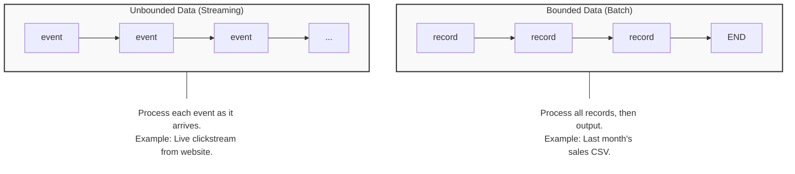
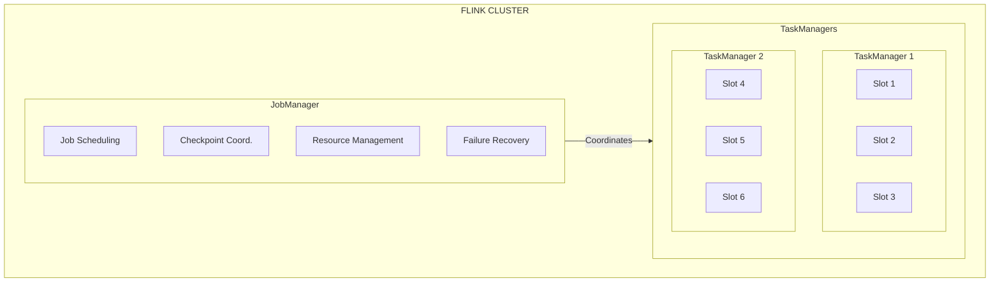
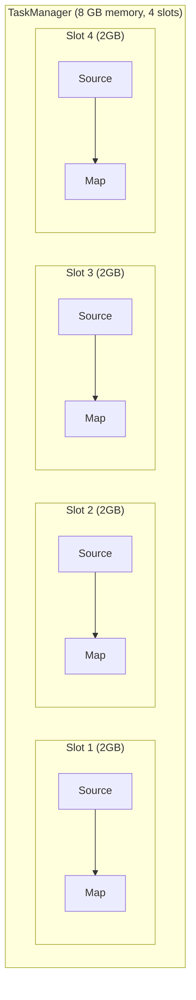
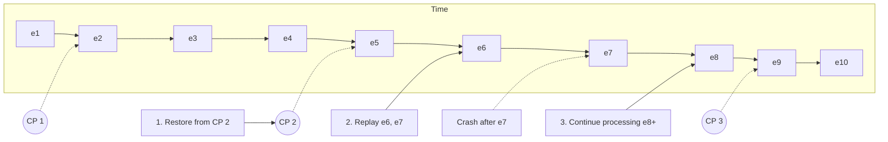
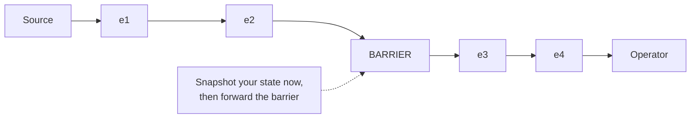
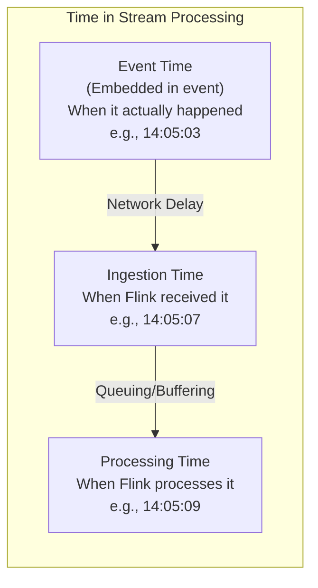
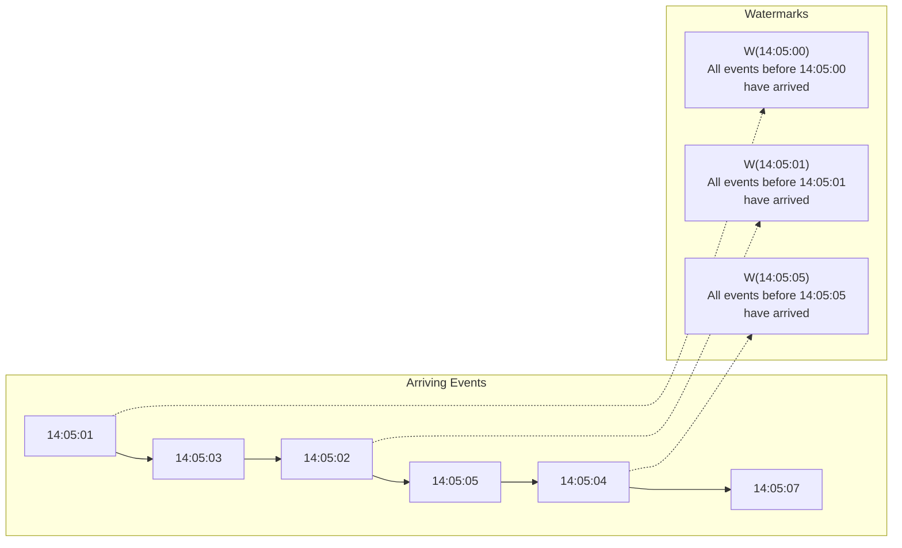
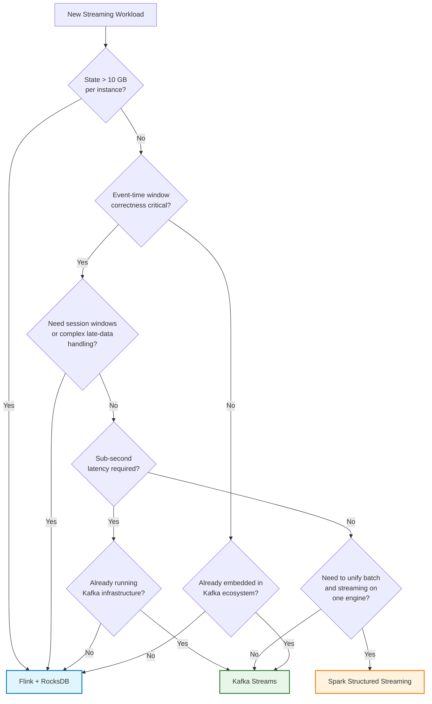

> **Discipline Module** | Complexity: `[COMPLEX]` | Time: 3.5 hours

## Prerequisites

Before starting this module:
- **Required**: [Module 1.2 — Apache Kafka on Kubernetes](../module-1.2-kafka/) — Kafka fundamentals, topics, partitions, consumer groups
- **Required**: Basic Java or Python programming knowledge
- **Recommended**: Understanding of SQL (SELECT, GROUP BY, JOIN, window functions)
- **Recommended**: Familiarity with event-driven architecture concepts

---

## What You'll Be Able to Do

After completing this module, you will be able to:

- **Implement Apache Flink on Kubernetes using the Flink Operator for stream processing workloads**
- **Design Flink job architectures with proper checkpointing, savepoints, and state backend configuration**
- **Configure Flink cluster scaling policies that adjust parallelism based on event throughput**
- **Build monitoring dashboards that track Flink job health, backpressure, and processing latency**

---

## Why This Module Matters

Kafka gives you a firehose of data. Events pour into topics at millions per second, carrying sensor readings, user clicks, financial transactions, and infrastructure telemetry. But raw events flowing through partitions are not insight — they are noise. Somewhere between capture and action, you need a system that can read from that firehose continuously, apply business logic, maintain accumulated knowledge over time, and emit results with low enough latency to matter. That system must also survive crashes without losing work and produce correct answers even when events arrive out of order.

Apache Flink exists to solve exactly this problem.

Flink is not the only stream processor in the ecosystem. Spark Structured Streaming, Kafka Streams, and Apache Beam all process events. But Flink occupies a unique position: it was designed for streaming from day one. While other frameworks started as batch engines and later added streaming support — bolting micro-batches or continuous processing modes onto architectures fundamentally shaped by bounded data — Flink took the opposite approach. It treats bounded data (batch files, database dumps) as a special case of unbounded data (live streams). This philosophical inversion is not merely aesthetic. It gives Flink capabilities that batch-origin engines struggle to reproduce reliably: true event-time semantics, exactly-once processing in the face of arbitrary failures, and sub-second state access on terabyte-scale application state.

The practical consequence is that Flink handles the genuinely hard streaming problems natively. Out-of-order events? Flink's watermark mechanism corrects for them. Network partitions and TaskManager crashes? The checkpointing system recovers automatically without data loss or double-counting. A job that has been running for months and accumulated enormous internal state? A savepoint freezes it safely so you can upgrade the code without starting over. These are not features bolted on after the fact — they are consequences of the architecture's streaming-first design.

Understanding Flink is essential for the platform engineer because stream processing is no longer a niche concern. Real-time fraud detection, live operational dashboards, continuous ETL pipelines into the lakehouse, event-driven microservice coordination — all of these are streaming workloads, and they run in production on Kubernetes. The Flink Kubernetes Operator, a CNCF project, turns Flink from a complex distributed system managed by hand into a declarative Kubernetes workload. You describe the desired state of the streaming job and its cluster, and the operator reconciles reality to match. This module teaches you the durable principles of stream processing as they are embodied in Flink, and shows you how to operate it reliably on Kubernetes using the operator.

---

## Bounded vs Unbounded Data — The Theoretical Foundation

### The Fundamental Distinction

Every data processing system must answer one question: does the data have an end? This seemingly simple question determines the entire architecture of the processing engine.



Batch systems — Hadoop MapReduce, classic Apache Spark — were built for bounded data. You read all input from disk, process it completely, and write all output. The algorithm can see the entire dataset at once, which makes global operations like sorting, total counts, and joins straightforward. The cost is latency: answers arrive only when the entire batch job finishes, which might be minutes or hours after the data was generated.

Streaming systems process unbounded data. Events arrive continuously, and the system must produce partial results continuously. You cannot wait for "all the data" because by definition there is no end. This introduces fundamental challenges: how do you compute a moving average without seeing every event? How do you join two streams when events from each arrive at different times? How do you know when a time-based window is "complete" enough to emit its result?

Flink's central insight is that batch is streaming with a known endpoint. If you build an engine optimized for the unbounded case — continuous processing, low-latency state access, event-time awareness — then the bounded case becomes trivial. You just read the file, process the records as they stream in, and emit the final result when the stream ends. The reverse strategy — building a batch engine and retrofitting streaming — leads to awkward compromises around window boundaries, checkpointing granularity, and latency.

### Why This Distinction Matters in Practice

Consider computing the average purchase amount per customer over a 5-minute window for a live dashboard:

- **Batch approach**: Wait for all data, compute the average over the entire day, emit once. Simple but hours-delayed and useless for real-time monitoring.

- **Micro-batch approach** (Spark Structured Streaming's default mode): Collect events for a fixed interval — say 1 second — compute the average over that micro-batch, emit results. Lower latency but introduces artificial boundaries. Events that straddle a micro-batch boundary may be split inconsistently, and the interval itself is an implementation detail that leaks into application semantics.

- **True streaming approach** (Flink): Maintain a running aggregate for each customer in keyed state, update it with every individual event as it arrives, emit updated results continuously. The aggregation is correct regardless of event arrival order because Flink tracks the event timestamp, not the processing timestamp. This requires sophisticated state management — keeping per-customer counters and sums in memory, handling out-of-order arrivals, cleaning up expired state — but produces the lowest possible latency with the highest possible accuracy.

Flink handles the hard case natively, which is why it excels at streaming workloads and why understanding its internal mechanisms is essential for building production-grade pipelines.

---

## Flink Architecture — The Distributed Runtime

### JobManager and TaskManagers

Flink's execution model separates coordination from computation. The architecture consists of two process types that communicate over the network.



**JobManager** (the coordinator) is a single JVM process that accepts job submissions, translates the user's program into an execution graph (a directed acyclic graph of operators), schedules operators onto available TaskManager slots, coordinates distributed checkpoints, and orchestrates recovery when a TaskManager fails. In production, you run the JobManager with high availability — multiple standby instances that take over if the leader crashes, using ZooKeeper or, on Kubernetes, the native Kubernetes HA service.

**TaskManagers** (the workers) execute the actual data processing. Each TaskManager is a JVM process that hosts some number of task slots. A slot is a fixed fraction of the TaskManager's resources (memory, not CPU) and can run one parallel instance of an operator chain. TaskManagers manage local state — keyed accumulators, window contents, join tables — stored either on the JVM heap or in an embedded RocksDB instance on local SSD. They exchange data with each other through network buffers, forming a logical dataflow graph whose physical layout is determined by the JobManager's scheduling decisions.

### Task Slots, Parallelism, and Operator Chains

Each TaskManager provides a configurable number of task slots. A slot represents a share of the TaskManager's managed memory and can execute one parallel pipeline of operators.



Parallelism determines how many parallel subtasks a given operator runs. If your Kafka source has 12 partitions and you set the source operator's parallelism to 12, each of the 12 parallel source instances reads from exactly one partition. If you set it higher — say 24 — then 12 instances sit idle because a Kafka partition can be consumed by only one consumer within a consumer group. The parallelism of downstream operators (filters, maps, keyed aggregations) can differ from the source parallelism, and Flink redistributes data between operators using network shuffles.

Flink also optimizes execution by chaining operators together. When two operators run with the same parallelism and do not require a network shuffle between them (for example, a map followed by a filter), Flink fuses them into a single task that runs in one thread. This eliminates serialization overhead and network round-trips. Operator chains show up as a single node in the Flink Web UI. Disabling chaining is occasionally necessary — for example, when you need to isolate a computationally expensive operator to its own slot — but it comes at a measurable performance cost.

### Backpressure: What Happens When You're Overloaded

In a streaming system, backpressure propagates upstream when a downstream operator cannot process data as fast as its upstream neighbor produces it. Imagine a sink writing to a slow external database. The sink's network buffers fill up. The Flink network stack, which uses credit-based flow control, detects this and reduces the credits it grants to the upstream operator. That operator, receiving fewer credits, slows its own processing, which propagates the backpressure further upstream — all the way to the source, which eventually slows its consumption from Kafka. This prevents the system from running out of memory by buffering unbounded data, but it also means that one slow operator can throttle the entire pipeline. Monitoring backpressure in the Flink Web UI is therefore essential: a sustained backpressure signal on a single operator tells you exactly where your bottleneck lives.

---

## The Flink Kubernetes Operator

### Why Use an Operator?

Running Flink directly on Kubernetes without an operator requires manual orchestration. You deploy JobManager and TaskManager Pods by hand, manage ConfigMaps for configuration, trigger savepoints manually before upgrades, and handle pod failures with ad-hoc scripts. This works at small scale but becomes unmanageable as the number of streaming jobs grows.

The Flink Kubernetes Operator automates this lifecycle through Kubernetes Custom Resources. Instead of operating on individual Pods and Deployments, you declare a `FlinkDeployment` resource that describes the desired state of your Flink job — its container image, parallelism, state backend, checkpointing configuration, upgrade policy — and the operator reconciles reality to match. This is the same pattern used by the Prometheus Operator, the Strimzi Kafka Operator, and countless other Kubernetes-native controllers.

The operator handles the following lifecycle concerns that are otherwise error-prone to manage manually:

- **Job lifecycle**: Submit, cancel, suspend, and resume Flink jobs through changes to the CR.
- **Savepoints**: Automatically trigger a savepoint before any job upgrade, and restore from that savepoint when the new job version starts. No manual scripting.
- **Rolling upgrades**: When you change the `FlinkDeployment` spec (new container image, new parallelism, new configuration), the operator takes a savepoint, stops the old job, starts the new job from the savepoint, and monitors its health.
- **Autoscaling**: Scale TaskManagers based on observed backpressure, Kafka consumer lag, or CPU utilization (requires `flink-autoscaler` integration).
- **Health monitoring**: Detect failed jobs and restart them automatically from the most recent checkpoint, without manual intervention.
- **Resource management**: Allocate and release Kubernetes resources per job based on the spec.

### Landscape Snapshot — as of 2026-06

> This changes fast; verify against vendor docs before relying on specifics.
>
> - **Flink stable version**: 2.2 (released 2026-05), with Flink 1.20 as the current LTS.
> - **Flink Kubernetes Operator**: 1.15.0 (released 2026-05), supporting Flink 1.18 through 2.2.
> - **API version in CRDs**: `flink.apache.org/v1beta1` for `FlinkDeployment` and `FlinkSessionJob`.
> - **Cert-manager** is required by the operator's admission webhooks.
> - **HA**: Kubernetes-native HA uses ConfigMaps for leader election; no ZooKeeper dependency.

### Installing the Operator

```bash
# Add the Flink Helm repository
helm repo add flink-operator https://downloads.apache.org/flink/flink-kubernetes-operator-1.10.0/
helm repo update

# Install the operator
kubectl create namespace flink
helm install flink-kubernetes-operator flink-operator/flink-kubernetes-operator \
  --namespace flink \
  --set webhook.create=true \
  --set metrics.port=9999

# Verify installation
kubectl -n flink wait --for=condition=Available \
  deployment/flink-kubernetes-operator --timeout=120s
```

### Deployment Modes

**Application Mode** (recommended for production):

Each Flink application runs in its own dedicated cluster. The JobManager runs the application's `main()` method directly as part of its startup, and the cluster exists solely for that application. This provides the strongest isolation — a failing job cannot affect other jobs — and is the mode the operator manages by default.

```yaml
apiVersion: flink.apache.org/v1beta1
kind: FlinkDeployment
metadata:
  name: fraud-detector
  namespace: flink
spec:
  image: my-registry.io/fraud-detector:v2.1.0
  flinkVersion: v1_20
  flinkConfiguration:
    taskmanager.numberOfTaskSlots: "4"
    state.backend.type: rocksdb
    state.checkpoints.dir: s3://flink-state/fraud-detector/checkpoints
    state.savepoints.dir: s3://flink-state/fraud-detector/savepoints
    execution.checkpointing.interval: "60000"
    execution.checkpointing.min-pause: "30000"
    restart-strategy.type: exponential-delay
    restart-strategy.exponential-delay.initial-backoff: 1s
    restart-strategy.exponential-delay.max-backoff: 60s
  serviceAccount: flink
  jobManager:
    resource:
      memory: "2048m"
      cpu: 1
    replicas: 1
  taskManager:
    resource:
      memory: "4096m"
      cpu: 2
    replicas: 3
  job:
    jarURI: local:///opt/flink/usrlib/fraud-detector.jar
    entryClass: com.example.FraudDetector
    parallelism: 12
    upgradeMode: savepoint
    state: running
    savepointTriggerNonce: 0
```

**Session Mode** (for development and ad-hoc queries):

A long-running Flink cluster accepts multiple job submissions through the Flink CLI or REST API. This is convenient for interactive exploration but provides weaker isolation.

```yaml
apiVersion: flink.apache.org/v1beta1
kind: FlinkDeployment
metadata:
  name: flink-session
  namespace: flink
spec:
  image: flink:1.20-java17
  flinkVersion: v1_20
  flinkConfiguration:
    taskmanager.numberOfTaskSlots: "4"
    state.backend.type: hashmap
  serviceAccount: flink
  jobManager:
    resource:
      memory: "2048m"
      cpu: 1
  taskManager:
    resource:
      memory: "4096m"
      cpu: 2
    replicas: 2
```

---

## State Management — Flink's Core Superpower

### What State Means in a Streaming System

A stateless transformation — filter, map, flatMap — processes each event independently. One event in, zero or one events out. These transformations are easy to reason about and trivial to parallelize. But the genuinely valuable streaming computations all require state. Counting page views per URL requires remembering the running count for each URL. Detecting a sequence of events that constitutes a fraud pattern requires remembering recently seen events per user. Joining a stream of orders with a stream of payments requires buffering unmatched orders and payments until their counterpart arrives.

State is accumulated knowledge that persists across individual events. In Flink, state is always partitioned by key. When you write `keyBy(userId).process(new MyStatefulFunction())`, Flink ensures that all events for the same `userId` arrive at the same parallel operator instance, which maintains the state for that user locally. This partitioning is the foundation for horizontal scalability — adding more parallelism splits the key space across more operator instances, each managing its own fraction of the total state.

### State Backends: Heap vs RocksDB

Flink offers two state backends that differ fundamentally in where they store data and what scale of state they can handle.

| Backend | Storage | Best For |
|---------|---------|----------|
| **HashMapStateBackend** | JVM heap | Small state (< 1 GB), development, lowest latency |
| **EmbeddedRocksDBStateBackend** | Local disk + memory cache | Large state (TB+), production |

The HashMapStateBackend keeps all state as Java objects on the JVM heap. Access is fast — a pointer dereference — but the state must fit in the TaskManager's allocated memory, and large state will trigger JVM garbage collection pauses that destroy processing latency. This backend is appropriate for development and for jobs with small, bounded state (configuration tables, lookup dictionaries).

RocksDB is an embedded key-value store written in C++ that Flink integrates through JNI. It stores state in local files organized as LSM trees (log-structured merge trees) with an in-memory block cache. Because data lives on disk, the total state can be far larger than the TaskManager's RAM. Flink's managed memory framework allocates a portion of each TaskManager's memory to the RocksDB block cache and write buffers, preventing the JVM heap from ballooning.

```yaml
flinkConfiguration:
  state.backend.type: rocksdb
  state.backend.rocksdb.memory.managed: "true"
  state.backend.rocksdb.block.cache-size: 256mb
  state.backend.rocksdb.writebuffer.size: 128mb
  state.backend.rocksdb.writebuffer.count: "4"
```

RocksDB is the production choice for any job whose state might grow beyond a few hundred megabytes. The tradeoff is small but real: state access requires I/O (even if cached), which adds microseconds of latency compared to the nanosecond-level access of heap-based state. In practice, the latency difference is dwarfed by the reliability gain of not running out of memory.

### State TTL and Cleanup

Unbounded streams create an unbounded state problem. If your job counts page views per URL and runs for a year, the state for abandoned URLs from month one continues to occupy disk space and memory even though those URLs will never be queried again. Flink's state TTL (time-to-live) addresses this by automatically expiring state entries that have not been accessed or updated for a configurable duration. You configure TTL per state descriptor, and Flink lazily cleans up expired entries during full state snapshots or compaction. This is essential for any production job that maintains per-key state over unbounded time.

The cleanup strategy deserves attention because it interacts with checkpointing performance. When TTL expires entries lazily — only removing them during a full snapshot — those entries persist on disk and consume space until the next checkpoint completes. For RocksDB-based state, Flink can also configure a compaction filter that removes expired entries during RocksDB's background compaction, which happens continuously rather than only at checkpoint boundaries. The tradeoff is that compaction-filter-based cleanup adds CPU overhead to every compaction cycle, while snapshot-based cleanup delays reclamation until the next checkpoint. For jobs with rapid state turnover — where keys are created and abandoned within minutes — preferring compaction-based cleanup prevents state size from ballooning between checkpoints. For jobs with slow state churn, the default lazy cleanup during checkpoints is sufficient and avoids unnecessary compaction overhead.

---

## Checkpointing and Savepoints — Fault Tolerance

### The Problem: State Is Fragile

A TaskManager maintains gigabytes of state in memory and on disk. If that TaskManager's Pod crashes — because the node fails, because Kubernetes evicts it, because the JVM runs out of memory — all that accumulated state vanishes. Without a recovery mechanism, the job would need to reprocess every event from the beginning of time to rebuild its state, which is infeasible for jobs that have been running for weeks or months.

### Checkpoints: Automatic, Coordinated Snapshots

Flink's checkpointing mechanism takes periodic, globally consistent snapshots of the entire job's state and stores them on durable, distributed storage (S3, GCS, HDFS). A checkpoint captures the exact position of every Kafka consumer in the source operator, the contents of every keyed state entry in every operator, and the in-flight state of any ongoing windows or timers. If a TaskManager fails, the JobManager restores the entire job from the most recent successful checkpoint — all state, all offsets — and processing continues from that exact point.



### The Barrier Mechanism (Chandy-Lamport Algorithm)

How does Flink take a consistent snapshot without stopping the world? The mechanism is an adaptation of the Chandy-Lamport distributed snapshot algorithm, published in 1985. The JobManager injects special checkpoint barrier events into the source operators of the dataflow graph. These barriers flow through the graph alongside regular data events.



When an operator receives a barrier from one of its input channels, it stops processing events from that channel, snapshots its own state, and then forwards the barrier to all of its output channels. Once it has received barriers from all of its input channels, it resumes normal processing. This ensures the checkpoint represents a consistent cut — a point in the logical dataflow where no event is partially processed. All events before the barrier are reflected in the snapshot; all events after the barrier are not.

For operators with multiple inputs (joins, unions), Flink offers two strategies. **Aligned checkpointing** waits for barriers on all inputs before snapshotting, which adds latency proportional to the difference in arrival times between input channels. **Unaligned checkpointing** (available since Flink 1.11) allows operators to take a snapshot immediately upon receiving the first barrier, storing in-flight buffers as part of the checkpoint state. Unaligned checkpointing reduces the checkpoint duration under backpressure but increases checkpoint size.

**Configuration:**

```yaml
flinkConfiguration:
  execution.checkpointing.interval: "60000"
  execution.checkpointing.min-pause: "30000"
  execution.checkpointing.mode: EXACTLY_ONCE
  execution.checkpointing.tolerable-failed-checkpoints: "3"
  execution.checkpointing.timeout: "600000"
  state.checkpoints.dir: s3://flink-state/checkpoints
  state.checkpoints.num-retained: "3"
```

### Exactly-Once Semantics

Checkpointing alone provides at-least-once semantics — if a TaskManager fails after a checkpoint, recovery replays events, and some events might be processed twice (once before the crash, once after the replay). Flink achieves exactly-once by integrating the checkpoint mechanism with the source and sink connectors. The Kafka source resets its consumer offsets to the checkpointed position, so every event is replayed from a known point. The sink uses two-phase commits: it writes output to a pending state and only atomically commits it when the checkpoint completes. If the job crashes, any uncommitted sink output is discarded, and the replay produces exactly the same committed output as before.

This mechanism is more accurately described as **effectively-once**: events may be processed internally more than once during replay, but the durable output — to Kafka, to a database, to object storage — appears exactly once to downstream consumers. The distinction between internal reprocessing and durable side effects is what makes this guarantee practical. A pure exactly-once guarantee would require the entire dataflow to be transactional at every operator boundary, which would be prohibitively expensive. By limiting the exactly-once boundary to the source and sink connectors and allowing operators to be idempotent internally (recomputing the same state from the same input produces the same effect), Flink achieves the guarantee that matters — correct external output — without paying the cost of end-to-end transactions within the dataflow.

Combined with Kafka's transactional producer API, this guarantee extends across the entire pipeline: Flink reads events from Kafka with committed offsets, processes them with checkpoint alignment, and writes results to Kafka inside transactions that commit only when the checkpoint succeeds. A downstream consumer reading from the output topic with `isolation.level=read_committed` sees only the results of completed checkpoints, never partial or duplicate output.

### Savepoints: Manual Snapshots for Operational Control

A savepoint is a checkpoint triggered manually by an operator, not automatically by the system. While checkpoints are optimized for speed and automatic recovery, savepoints are designed for intentional operational procedures.

Use savepoints when:
- **Upgrading job code**: Take a savepoint, stop the old job, deploy the new code, and restore from the savepoint. The new job continues with all accumulated state intact, provided the state schema is compatible.
- **Forking a job**: Create a savepoint and start two jobs from it — one with the original logic, one with experimental changes — to perform A/B testing on identical state.
- **Migrating between clusters**: A savepoint is portable across Flink clusters, allowing you to move a job from a development cluster to production without losing state.
- **Scaling parallelism**: While Flink supports rescaling from savepoints (redistributing keyed state across a different number of parallel operators), this operation requires careful state schema design and is more expensive than a simple restart.

```bash
# Trigger a savepoint via the Flink Kubernetes Operator
kubectl -n flink patch flinkdeployment fraud-detector --type merge \
  -p '{"spec":{"job":{"savepointTriggerNonce": 1}}}'

# Check status
kubectl -n flink get flinkdeployment fraud-detector -o yaml | grep -A5 savepointInfo
```

The critical distinction between checkpoints and savepoints is portability. Checkpoints are tightly coupled to the specific job graph version that created them — they contain internal pointer structures that are not guaranteed to be compatible with a modified job. Savepoints, by contrast, contain enough metadata to be restored by a compatible job with a different execution graph, making them the correct tool for planned upgrades.

---

## Event Time and Watermarks — Correctness Despite Disorder

### Three Notions of Time



**Event time** is the timestamp embedded in the event itself — when the sensor reading was taken, when the user clicked the button, when the transaction was authorized. It is independent of when the event reaches the processing system and is the only notion of time that produces deterministic, reproducible results.

**Processing time** is the wall-clock time on the machine running the Flink operator. It is easy to use and requires no timestamp extraction, but it produces nondeterministic results: replay the same data on a different day, and window boundaries shift, aggregations change, and outputs differ.

**Ingestion time** is a middle ground — the time Flink first receives the event, assigned at the source operator. It provides approximate event-time behavior without requiring embedded timestamps, but it is still vulnerable to replay differences.

The Dataflow model, formalized in the 2015 Google paper and expanded in Tyler Akidau's "Streaming 101" and "Streaming 102" articles, establishes event time as the foundation for correct stream processing. The core insight is that the processing system must separate the **notion of completeness** (when all events for a given time window have arrived) from the **notion of processing progress** (how far the system has advanced through the stream). This separation is achieved through watermarks.

### Watermarks: Declaring Event-Time Progress

A watermark is a statement by the source about event-time progress: "I believe all events with timestamps earlier than T have been observed." Watermarks flow through the dataflow graph alongside data events, and each operator uses them to decide when a time-based window can be emitted.



In practice, events rarely arrive in strict timestamp order. A mobile device might batch events offline and upload them minutes later. A network partition might delay events from one region. A retry mechanism might resubmit events that were temporarily rejected. The watermark must account for this disorder by including a bounded-out-of-orderness allowance — essentially declaring, "I expect events to arrive at most 5 seconds late."

```java
// Allow up to 5 seconds of late data
WatermarkStrategy
    .<Event>forBoundedOutOfOrderness(Duration.ofSeconds(5))
    .withTimestampAssigner((event, timestamp) -> event.getTimestamp());

// Monotonously increasing timestamps (no late data expected)
WatermarkStrategy
    .<Event>forMonotonousTimestamps()
    .withTimestampAssigner((event, timestamp) -> event.getTimestamp());
```

The bounded-out-of-orderness parameter represents a tradeoff. A larger allowance produces more accurate results (fewer events classified as late and dropped) but increases latency (windows fire later). A smaller allowance fires windows sooner but risks missing late-arriving events. Choosing the right value requires understanding your data's actual arrival patterns — instrument your pipeline, measure the distribution of event-time minus ingestion-time across your events, and set the bound to cover an acceptable percentile (for example, 99th percentile, accepting that 1% of events will arrive too late).

### Allowed Lateness and Side Outputs

What happens to events that arrive after the watermark has passed the end of their window? By default, Flink drops them. But you can configure **allowed lateness**, a period after the watermark during which late events are still accepted into the correct window. When a late event arrives, Flink updates the window's state and re-emits the updated result.

For events that arrive after the allowed lateness period, Flink provides **side outputs**. A side output is a separate output stream that receives events that did not match the main pipeline's criteria. You can route late events to a side output, log them, and replay them later as a correction batch — this is how streaming systems achieve eventual correctness even when individual events arrive extremely late.

The decision of how much allowed lateness to configure is deeply workload-dependent. A payments fraud detection system might accept zero allowed lateness because a transaction that arrives 10 minutes late is no longer actionable — the fraud already happened. A daily analytics pipeline might accept an hour of allowed lateness because the dashboard updates hourly anyway, and catching 99.9% of events is more important than shaving a few minutes off result emission. The choice shapes your resource consumption as well: Flink must retain window state for the entire allowed-lateness duration after the watermark passes, which means more disk and memory for windows that stay open longer. If your windows are large and your allowed lateness is long, the retained state can become substantial enough to affect checkpoint size and duration.

---

## Windows — Slicing Unbounded Data into Finite Chunks

### Window Types

Windows impose finite boundaries on unbounded streams so that aggregations can produce results periodically rather than waiting forever.

```mermaid
gantt
    title Tumbling vs Sliding Windows
    dateFormat X
    axisFormat %s
    
    section Tumbling
    0-5 min  :0, 5
    5-10 min :5, 10
    10-15 min :10, 15

    section Sliding
    0-10 min :0, 10
    5-15 min :5, 15
    10-20 min :10, 20
```



- **Tumbling windows**: Fixed-size, non-overlapping, contiguous. Every event belongs to exactly one window. When the watermark passes the end of the window, the window fires and its state is discarded. Use tumbling windows for regular, fixed-interval reporting — "page views per 5-minute interval."

- **Sliding windows**: Fixed-size, overlapping. Defined by a window size and a slide interval. A single event typically participates in multiple windows. Use sliding windows for moving averages and continuously updating metrics — "the number of rides requested in the last hour, updated every minute."

- **Session windows**: Dynamic, gap-based windows with no fixed size. A window begins when an event arrives for a key and expands as long as new events for that key continue to arrive within a specified gap timeout. When the gap timeout expires without a new event, the window fires. Use session windows for grouping user activity into discrete sessions — "each visit to the website, defined as a sequence of page views with no more than 30 minutes between them."

- **Global windows**: A single window per key that spans all events. Since this window would never complete on an unbounded stream, you must define a custom trigger that determines when Flink computes and emits results.

### Flink SQL Example

Flink SQL makes windowed aggregations accessible without writing Java or Scala code. The Table API and SQL layer compiles SQL queries into the same optimized DataStream execution plans that hand-written Java code would produce.

```sql
-- Tumbling window: count events per URL every 5 minutes
SELECT
    url,
    TUMBLE_START(event_time, INTERVAL '5' MINUTE) AS window_start,
    TUMBLE_END(event_time, INTERVAL '5' MINUTE) AS window_end,
    COUNT(*) AS page_views,
    COUNT(DISTINCT user_id) AS unique_visitors
FROM page_events
GROUP BY
    url,
    TUMBLE(event_time, INTERVAL '5' MINUTE);

-- Sliding window: moving average over 1 hour, updated every 5 minutes
SELECT
    sensor_id,
    HOP_START(event_time, INTERVAL '5' MINUTE, INTERVAL '1' HOUR) AS window_start,
    AVG(temperature) AS avg_temp,
    MAX(temperature) AS max_temp,
    MIN(temperature) AS min_temp
FROM sensor_readings
GROUP BY
    sensor_id,
    HOP(event_time, INTERVAL '5' MINUTE, INTERVAL '1' HOUR);
```

### The Completeness-Versus-Latency Tradeoff

Every windowing strategy confronts the same fundamental tension. If you fire a window as soon as the watermark passes its end, you minimize latency but may classify some slow-arriving events as late. If you wait for an extended allowed-lateness period, you maximize accuracy but delay every result. There is no universal correct answer — the right balance depends on the business requirement. A fraud detection system must fire within seconds, accepting a small error rate. A daily billing report can wait minutes after the hour to capture nearly all events. Flink gives you explicit control over both dimensions through watermark strategy, allowed lateness, and side outputs, rather than imposing a one-size-fits-all compromise.

---

## Flink Compared — When to Choose Which Stream Processor

Flink does not exist in isolation. The streaming ecosystem includes several mature alternatives, each with different design centers. Understanding their tradeoffs helps you choose the right tool for a given workload.

### Rosetta: Durable Capabilities Across Stream Processors

| Capability | Apache Flink | Kafka Streams | Spark Structured Streaming |
|---|---|---|---|
| **Streaming model** | True streaming (event-at-a-time) | True streaming (record-at-a-time) | Micro-batch (default) or continuous processing |
| **State backend** | RocksDB (disk + memory) or heap | RocksDB (disk + memory) | In-memory (state store) with WAL |
| **State scale** | Terabytes | Gigabytes to low terabytes | Moderate (limited by executor memory) |
| **Event-time semantics** | Full watermarks, allowed lateness, side outputs | Event-time via window grace period | Event-time via watermark, output mode |
| **Exactly-once** | Checkpointing + transactional sinks | Transactions (idempotent producer) | Checkpointing + WAL |
| **SQL support** | ANSI SQL with streaming extensions (mature) | KSQL (Kafka-native SQL) | ANSI SQL with streaming extensions |
| **Joins** | Stream-stream, stream-table, temporal table | Stream-stream (windowed), stream-table, KTable foreign-key | Stream-stream (windowed), stream-static |
| **Latency** | Sub-second | Sub-second (but bounded by Kafka poll interval) | Seconds to minutes (micro-batch) |
| **Operational complexity** | High (JobManager + TaskManagers + state) | Low (library, runs in your application) | Moderate (Spark cluster) |
| **Kubernetes integration** | Flink Kubernetes Operator (CNCF) | Runs as a plain Deployment/StatefulSet | Spark Operator or native K8s scheduler |
| **Best for** | Complex stateful pipelines, low-latency event-time aggregations, SQL-heavy streaming | Simpler streaming apps already in the Kafka ecosystem, transformation pipelines, small-to-medium state | Unifying batch and streaming on a single engine, large-scale batch with occasional streaming needs |

Kafka Streams is a Java library, not a cluster. You embed it in your application, and it runs wherever your application runs — as a Kubernetes Deployment, a bare-metal JVM, or even a unit test. This dramatically reduces operational complexity but also limits the available hardware resources to what your application process can provide. For pipelines with moderate state (a few gigabytes per instance) and no need for complex event-time operations like session windows, Kafka Streams is often the simplest option that works.

Spark Structured Streaming benefits from Spark's enormous ecosystem — MLlib for machine learning, GraphX for graph processing, and decades of SQL optimization. If you already run a Spark cluster for batch ETL and want to add streaming without deploying a second system, Structured Streaming lets you reuse your existing infrastructure. The tradeoff is latency: the micro-batch model introduces unavoidable seconds of delay, which is acceptable for hourly aggregations but problematic for sub-second alerting.

Flink is the right choice when state size, event-time correctness, or latency requirements push beyond what the simpler alternatives can deliver. If your job maintains tens of gigabytes of state per TaskManager, requires session windows with late-data handling, or must emit results within milliseconds of event arrival, Flink's architecture — streaming-first, with a dedicated state backend and fine-grained checkpointing — becomes the difference between a pipeline that works and one that constantly struggles against its own design choices.

---

## Patterns and Anti-Patterns

### Patterns

**Pattern 1: Idempotent Sinks with Exactly-Once Checkpointing.** Every production Flink job that writes to an external system should pair exactly-once checkpointing with an idempotent sink. An idempotent sink can safely receive the same output record multiple times without duplicating effects — think upserts (INSERT ... ON CONFLICT UPDATE), keyed writes to a KV store, or transactional Kafka producers. This combination means that even if a checkpoint replay causes the sink to write the same result twice, the downstream system deduplicates transparently.

**Pattern 2: Watermark Tuning from Observed Data, Not Guesswork.** Set your bounded-out-of-orderness parameter by instrumenting your source and measuring the actual distribution of event-time delay (event time minus ingestion time) across your production traffic. Configure the watermark to cover the 99th percentile of observed delay, and route the remaining 1% of extremely late events to a side output for offline reconciliation. This gives you predictable latency while bounding the error rate to a known, acceptable level.

**Pattern 3: Operator-Chain Parallelism Tuning.** Set parallelism per operator based on its computational cost, not uniformly. A simple filter running at parallelism 2 might keep up with a JSON parser running at parallelism 12. Use the Flink Web UI's backpressure monitor and per-operator throughput metrics to identify bottlenecks, then increase parallelism only for the specific operators that are falling behind. Disable operator chaining for the expensive operator to isolate it in its own slot, but keep chaining enabled for light operators to avoid serialization overhead.

**Pattern 4: State TTL on Every Keyed State Descriptor.** Any production Flink job that runs continuously must configure state TTL on every keyed state descriptor. Unbounded streams create unbounded key spaces — user IDs, session IDs, device IDs — and without TTL, abandoned state accumulates forever, eventually exhausting disk and causing checkpoint timeouts. Set TTL based on your business retention requirement (a session window obviously expires after the session gap, while a user profile might persist for 90 days of inactivity).

### Anti-Patterns

**Anti-Pattern 1: Using Processing Time for Business-Critical Aggregations.** Processing time is convenient — no timestamp extraction, no watermark configuration. But it makes your results nondeterministic and unreproducible. If you replay last week's data to debug an anomaly, processing-time windows will assign events to completely different buckets than they fell into during the original run. Only event time (with watermarks) guarantees that replaying the same data produces the same results.

**Anti-Pattern 2: Parallelism Exceeding Available Kafka Partitions.** Flink's Kafka source can assign at most one parallel consumer instance per partition. If your topic has 12 partitions and you set source parallelism to 24, exactly 12 source subtasks sit idle, consuming memory and slots without processing any data. Match source parallelism to partition count, and if you need more parallelism, repartition within Flink (using `keyBy` or `rebalance`) after the source operator.

**Anti-Pattern 3: HashMapStateBackend for Production Jobs with Growing State.** The HashMapStateBackend is the default and works fine in development when state is small. In production, state that grows beyond the JVM heap triggers catastrophic garbage collection pauses — stop-the-world events lasting seconds or tens of seconds that destroy processing latency and may cause checkpoint timeouts. Switch to the EmbeddedRocksDBStateBackend for any job whose state might exceed a few hundred megabytes.

**Anti-Pattern 4: Deploying in Session Mode for Long-Running Production Jobs.** Session mode is designed for interactive exploration and short-lived queries. A production job deployed in a shared session cluster risks resource contention from other jobs, and a single misbehaving query can crash the entire cluster. Application mode gives each job its own dedicated cluster with isolated resources and an independent failure domain.

---

## Decision Framework

When choosing a streaming architecture for a new workload, walk through the following decision flow.



This decision framework is a starting point, not a replacement for benchmarking your specific workload. State size, latency, and correctness requirements dominate the initial screening. Operational factors — your team's existing expertise, your infrastructure dependencies, your monitoring stack — often determine the final choice once the technical constraints are satisfied.

---

## Did You Know?

- **Flink started as a research project at TU Berlin called Stratosphere.** It was donated to the Apache Software Foundation in 2014 and graduated to a top-level project in only 8 months — one of the fastest graduations in Apache history. The name "Flink" is German for "quick" or "nimble," reflecting the project's focus on low-latency processing.

- **Flink can maintain terabytes of application state while processing millions of events per second.** It uses RocksDB as an embedded state backend, storing state on local SSD with an in-memory block cache, and takes asynchronous distributed snapshots without pausing event processing — the Chandy-Lamport barrier algorithm makes this possible.

- **The Alibaba "Blink" fork of Flink was so influential that it was partially merged back into mainline Flink.** Alibaba's modifications included the unified batch/streaming SQL engine and substantial performance improvements to the network stack and state backend. This upstream contribution model is a case study in how open-source forks can productively strengthen the original project.

- **Flink's exactly-once checkpointing was inspired by a distributed snapshot algorithm from 1985.** Leslie Lamport and K. Mani Chandy published "Distributed Snapshots: Determining Global States of Distributed Systems" four decades ago, and their barrier-based algorithm directly informs how Flink coordinates consistent snapshots across hundreds of TaskManagers without stopping the dataflow.

---

## Common Mistakes

| Mistake | Why It Happens | What To Do Instead |
|---------|---------------|-------------------|
| Using processing time for business logic | Simpler to implement, no watermark config needed | Use event time with watermarks. Processing time produces inconsistent, nondeterministic results on replay. |
| Setting parallelism higher than Kafka partitions | "More parallelism equals faster" assumption | Match source parallelism to partition count. If you need more downstream parallelism, use `keyBy` or `rebalance` to repartition. |
| Not configuring checkpoint storage durably | Works on local disk during development | Use S3, GCS, or HDFS for checkpoints. Local disk means state is lost on Pod restart, defeating the purpose of checkpointing. |
| Using HashMapStateBackend for large state | It's the default, works fine at small scale | Switch to RocksDB for any state larger than ~500 MB. JVM GC pauses under large heap state destroy processing latency. |
| Skipping savepoints during job upgrades | Assuming checkpoints are sufficient | Checkpoints are tied to a specific job graph version. Savepoints are designed for cross-version portability — use them for all planned upgrades. |
| Ignoring backpressure signals | "Everything seems to be running" appearance | Monitor backpressure in the Flink Web UI. Sustained backpressure on one operator identifies the bottleneck — fix it before latency degrades. |
| Not handling late data at all | Assuming events always arrive in order | Configure allowed lateness for critical windows and route truly late events to a side output for offline reconciliation. |
| Deploying production jobs in Session Mode | Easier to submit jobs interactively | Use Application Mode for production. Session clusters share resources and a single bad job can degrade the entire cluster. |

---

## Quiz

**Question 1:** You are planning to roll out a new version of your Flink job that changes the business logic of an operator. You need to stop the current job and start the new one without losing state or reprocessing events from the beginning. Would you rely on a checkpoint or a savepoint for this operation, and why?

<details>
<summary>Show Answer</summary>

You must use a **savepoint** for this planned upgrade. Savepoints are manually triggered, full snapshots designed specifically for operational tasks like job upgrades, A/B testing, and migrations. They contain metadata that makes them portable across job versions, provided the state schema remains compatible. Checkpoints, while they also capture state, are automatic snapshots tightly coupled to the specific job execution graph that created them and are not guaranteed to restore correctly on a modified job version. The Flink Kubernetes Operator automates this entire flow: change the `flinkVersion` or `image` in your `FlinkDeployment`, and the operator takes a savepoint, stops the old job, starts the new job from the savepoint, and monitors its health.

</details>

**Question 2:** Your e-commerce system uses Flink to compute daily active users. Due to a cloud provider outage, mobile client events generated on Tuesday were buffered on devices and did not reach Kafka until Wednesday. If your Flink job was configured to use processing time, what would happen to these delayed Tuesday events?

<details>
<summary>Show Answer</summary>

If the job uses processing time, Tuesday's events would be incorrectly counted toward Wednesday's daily active users metric. Processing time evaluates events based on when the Flink TaskManager executes them — Wednesday, in this case — completely ignoring the timestamp embedded in the event indicating it occurred on Tuesday. This produces a double error: Tuesday's DAU count is artificially low, and Wednesday's is artificially high. To fix this, you must configure your Flink job to use event time with watermarks. The watermark allows a bounded amount of out-of-order arrival (you configure the bound based on your observed network delay distribution), and events arriving within that bound are placed into their correct event-time window regardless of when they are physically processed.

</details>

**Question 3:** You have a Kafka topic with 12 partitions feeding a Flink job. A team member notices the job is falling behind and increases the parallelism of the Flink source operator to 24, expecting it to process data twice as fast. What actually happens, and what should they have done instead?

<details>
<summary>Show Answer</summary>

The processing speed will not improve, and 12 of the 24 parallel source instances will sit completely idle. A single Kafka partition can be consumed by exactly one consumer within a consumer group to maintain ordering guarantees. Since there are only 12 partitions, Flink can run at most 12 parallel source readers. The idle instances waste TaskManager slots and memory. To increase throughput, the team would need to first increase the Kafka topic's partition count to 24 (or whatever the desired parallelism), then scale the Flink source accordingly. Alternatively, they could leave the source at 12 and use Flink's `rebalance()` or `keyBy()` to repartition the data stream to a higher parallelism for downstream operators that are the actual bottleneck.

</details>

**Question 4:** Your team deployed a real-time fraud detection Flink job that maintains a historical profile for every user, accumulating over 2 TB of state. The job is crashing with `OutOfMemoryError` in the TaskManagers. What state backend misconfiguration is most likely the cause, and how do you fix it?

<details>
<summary>Show Answer</summary>

The job is almost certainly running on the default **HashMapStateBackend**, which stores all state as Java objects on the JVM heap. When state grows to terabytes, it exhausts the TaskManager's allocated heap, triggering cascading Full GC pauses that eventually lead to out-of-memory crashes and TaskManager termination. The fix is to switch to the **EmbeddedRocksDBStateBackend**, which stores state on local SSD organized as an LSM tree with a configurable in-memory block cache. Configure the managed memory to allocate sufficient space for RocksDB write buffers and block cache, and your state can grow to many times the TaskManager's RAM without JVM memory pressure.

</details>

**Question 5:** You are building a live dashboard for a ride-sharing application. The dashboard must display the total number of rides requested in the last hour and must update every minute to feel responsive to operators. Which windowing strategy should you implement, and why?

<details>
<summary>Show Answer</summary>

You should use a **sliding window** with a 1-hour size and a 1-minute slide. A sliding window is defined by a fixed window size and a fixed slide interval; each event participates in multiple overlapping windows, and Flink emits a new result every slide period. In this scenario, every minute Flink emits a result representing the previous 60 minutes of data, which perfectly matches the requirement for a continuously updating metric. A tumbling window would not work — it would emit only one result per hour, not the 60 updates per hour the dashboard requires. Session windows would not work either, because they group events based on activity gaps rather than fixed time intervals.

</details>

**Question 6:** A TaskManager running a critical Flink job suddenly loses power and dies. The job uses `EXACTLY_ONCE` checkpointing configured to run every 60 seconds. Walk through exactly what happens — from the moment of the crash to the moment processing resumes normally.

<details>
<summary>Show Answer</summary>

When the JobManager detects the lost TaskManager heartbeat, it immediately cancels all running tasks and initiates recovery. It identifies the most recent successful checkpoint (at most 60 seconds old), loads the full job topology from that checkpoint's metadata, and redistributes the recovered state to the available TaskManagers. Crucially, the Kafka source operators reset their consumer offsets to the positions recorded in the checkpoint, meaning Flink will replay all Kafka events from that offset forward. Because the sink uses a transactional protocol coordinated with the checkpoint, any output written after the checkpoint but before the crash is discarded (the transaction was never committed). Flink then replays the events between the checkpoint and the crash point, producing exactly the same output that was not durable at the time of failure. No events are lost, and no events are double-counted in the final output.

</details>

**Question 7:** Your Flink job computes a 5-minute tumbling window over sensor data with a watermark bounded out-of-orderness of 30 seconds. A sensor reading with event timestamp 14:03:45 arrives at the Flink source at 14:09:20 — over 5 minutes late. What happens to this event, and what two mechanisms does Flink provide to prevent data loss in this scenario?

<details>
<summary>Show Answer</summary>

This event arrives well after the watermark has passed the end of its window (14:05:00). By default, Flink drops it entirely, and it contributes to no window result. To prevent this data loss, Flink provides two mechanisms. First, you can configure **allowed lateness** on the window operator — for example, accepting events up to 10 minutes after the watermark. With this configured, Flink retains the window's state past the watermark, accepts the late event, updates the window's aggregation, and re-emits the corrected result. Second, you can configure a **side output** to capture events that arrive after the allowed lateness period. These extremely late events can be logged, stored in a dead-letter queue, and incorporated later through an offline reconciliation process. The combination of allowed lateness (for reasonably late events) and side outputs (for pathological cases) gives you fine-grained control over the completeness-vs-latency tradeoff.

</details>

**Question 8:** You are comparing Flink, Kafka Streams, and Spark Structured Streaming for a new pipeline that must join a stream of user orders with a slowly-changing table of product metadata, maintain per-user state of roughly 500 MB, and emit results within 5 seconds of order arrival. Which processor is the best fit, and why are the other two less suitable?

<details>
<summary>Show Answer</summary>

**Flink** is the best fit here. The 500 MB per-user state requirement exceeds what is comfortable for the HashMapStateBackend but is handled easily by Flink's RocksDB state backend without memory pressure. The stream-table join is a first-class operation in Flink's Table/SQL API with temporal table semantics. The sub-5-second latency requirement rules out Spark Structured Streaming's default micro-batch mode (which adds seconds of latency per batch). Kafka Streams could handle the latency and the join but would struggle with 500 MB of state per instance — it would need to be partitioned across many instances, and if some keys accumulate more state than others, individual instances could run out of memory due to the RocksDB-on-disk limitation of Kafka Streams' architecture for very large per-key state. Flink's dedicated state backend with managed memory and asynchronous checkpointing is designed precisely for this scale of stateful processing.

</details>

---

## Hands-On Exercise: Flink Consuming from Kafka with Windowed Aggregations

### Objective

Deploy a Flink job that reads events from a Kafka topic, performs windowed aggregations using event time, and writes results to an output topic. You will observe checkpointing, watermark progression, and the effect of late data.

### Environment Setup

```bash
# Create cluster
kind create cluster --name flink-lab

# Install Strimzi and create a Kafka cluster
kubectl create namespace kafka
kubectl create -f 'https://strimzi.io/install/latest?namespace=kafka' -n kafka
kubectl -n kafka wait --for=condition=Available \
  deployment/strimzi-cluster-operator --timeout=180s
```

```yaml
# kafka-for-flink.yaml
apiVersion: kafka.strimzi.io/v1beta2
kind: KafkaNodePool
metadata:
  name: combined
  namespace: kafka
  labels:
    strimzi.io/cluster: flink-lab
spec:
  replicas: 1
  roles:
    - controller
    - broker
  storage:
    type: ephemeral
  resources:
    requests:
      cpu: 250m
      memory: 1Gi
    limits:
      memory: 1Gi
---
apiVersion: kafka.strimzi.io/v1beta2
kind: Kafka
metadata:
  name: flink-lab
  namespace: kafka
  annotations:
    strimzi.io/kraft: enabled
    strimzi.io/node-pools: enabled
spec:
  kafka:
    version: 3.9.0
    metadataVersion: "3.9"
    listeners:
      - name: plain
        port: 9092
        type: internal
        tls: false
    config:
      auto.create.topics.enable: false
      num.partitions: 3
      default.replication.factor: 1
      offsets.topic.replication.factor: 1
      transaction.state.log.replication.factor: 1
      transaction.state.log.min.isr: 1
  entityOperator:
    topicOperator: {}
---
apiVersion: kafka.strimzi.io/v1beta2
kind: KafkaTopic
metadata:
  name: sensor-readings
  namespace: kafka
  labels:
    strimzi.io/cluster: flink-lab
spec:
  partitions: 3
  replicas: 1
---
apiVersion: kafka.strimzi.io/v1beta2
kind: KafkaTopic
metadata:
  name: sensor-aggregates
  namespace: kafka
  labels:
    strimzi.io/cluster: flink-lab
spec:
  partitions: 3
  replicas: 1
```

```bash
kubectl apply -f kafka-for-flink.yaml
kubectl -n kafka wait kafka/flink-lab --for=condition=Ready --timeout=300s
```

### Step 1: Install the Flink Kubernetes Operator

```bash
# Install cert-manager (required by Flink Operator webhooks)
kubectl apply -f https://github.com/cert-manager/cert-manager/releases/download/v1.16.3/cert-manager.yaml
kubectl -n cert-manager wait --for=condition=Available deployment --all --timeout=120s

# Install Flink Operator
kubectl create namespace flink
helm repo add flink-operator https://downloads.apache.org/flink/flink-kubernetes-operator-1.10.0/
helm repo update
helm install flink-kubernetes-operator flink-operator/flink-kubernetes-operator \
  --namespace flink \
  --set webhook.create=true

kubectl -n flink wait --for=condition=Available \
  deployment/flink-kubernetes-operator --timeout=120s
```

### Step 2: Create the Flink Session Cluster and Submit a SQL Job

Since the Flink Kubernetes Operator manages job lifecycle, we deploy a **session cluster** and then use the Flink SQL Client to submit our streaming query.

```yaml
# flink-session.yaml
apiVersion: flink.apache.org/v1beta1
kind: FlinkDeployment
metadata:
  name: sensor-aggregator
  namespace: flink
spec:
  image: flink:1.20-java17
  flinkVersion: v1_20
  flinkConfiguration:
    taskmanager.numberOfTaskSlots: "2"
    state.backend.type: hashmap
    execution.checkpointing.interval: "30000"
    execution.checkpointing.mode: EXACTLY_ONCE
    state.checkpoints.num-retained: "3"
    rest.flamegraph.enabled: "true"
  serviceAccount: flink
  jobManager:
    resource:
      memory: "1024m"
      cpu: 0.5
  taskManager:
    resource:
      memory: "2048m"
      cpu: 1
    replicas: 2
```

```bash
# Create RBAC for Flink
kubectl -n flink create serviceaccount flink
kubectl create clusterrolebinding flink-role-binding \
  --clusterrole=edit --serviceaccount=flink:flink

kubectl apply -f flink-session.yaml

# Wait for the session cluster to be ready
kubectl -n flink get flinkdeployment sensor-aggregator -w
# Wait until READY status shows True
```

Next, download the Kafka SQL connector JAR into the Flink cluster and submit the SQL job:

```bash
# Copy the Kafka connector into the running JobManager
FLINK_JM=$(kubectl -n flink get pod -l component=jobmanager,app=sensor-aggregator -o jsonpath='{.items[0].metadata.name}')

# Download the Flink SQL Kafka connector into the JobManager
kubectl -n flink exec $FLINK_JM -- bash -c '
  wget -q -P /opt/flink/lib/ \
    https://repo1.maven.org/maven2/org/apache/flink/flink-sql-connector-kafka/3.3.0-1.20/flink-sql-connector-kafka-3.3.0-1.20.jar &&
  echo "Kafka connector downloaded"
'

# Submit the SQL job via the SQL Client
kubectl -n flink exec -it $FLINK_JM -- /opt/flink/bin/sql-client.sh embedded -e "
CREATE TABLE sensor_readings (
    sensor_id STRING,
    temperature DOUBLE,
    humidity DOUBLE,
    event_time TIMESTAMP(3),
    WATERMARK FOR event_time AS event_time - INTERVAL '10' SECOND
) WITH (
    'connector' = 'kafka',
    'topic' = 'sensor-readings',
    'properties.bootstrap.servers' = 'flink-lab-kafka-bootstrap.kafka.svc.cluster.local:9092',
    'properties.group.id' = 'flink-sensor-aggregator',
    'scan.startup.mode' = 'earliest-offset',
    'format' = 'json',
    'json.timestamp-format.standard' = 'ISO-8601'
);

CREATE TABLE sensor_aggregates (
    sensor_id STRING,
    window_start TIMESTAMP(3),
    window_end TIMESTAMP(3),
    avg_temperature DOUBLE,
    max_temperature DOUBLE,
    min_temperature DOUBLE,
    avg_humidity DOUBLE,
    reading_count BIGINT
) WITH (
    'connector' = 'kafka',
    'topic' = 'sensor-aggregates',
    'properties.bootstrap.servers' = 'flink-lab-kafka-bootstrap.kafka.svc.cluster.local:9092',
    'format' = 'json',
    'json.timestamp-format.standard' = 'ISO-8601'
);

SET 'parallelism.default' = '3';
SET 'pipeline.name' = 'sensor-aggregator';

INSERT INTO sensor_aggregates
SELECT
    sensor_id,
    window_start,
    window_end,
    AVG(temperature) AS avg_temperature,
    MAX(temperature) AS max_temperature,
    MIN(temperature) AS min_temperature,
    AVG(humidity) AS avg_humidity,
    COUNT(*) AS reading_count
FROM TABLE(
    TUMBLE(TABLE sensor_readings, DESCRIPTOR(event_time), INTERVAL '1' MINUTE)
)
GROUP BY
    sensor_id, window_start, window_end;
"
```

### Step 3: Produce Test Events

```bash
# Generate sensor readings with event-time timestamps
kubectl -n kafka run producer --rm -it --restart=Never \
  --image=quay.io/strimzi/kafka:latest-kafka-3.9.0 -- bash -c '
NOW=$(date +%s)
for i in $(seq 1 200); do
  SENSOR="sensor-$((RANDOM % 5 + 1))"
  TEMP=$(echo "20 + $((RANDOM % 15))" | bc)
  HUMID=$(echo "40 + $((RANDOM % 40))" | bc)
  # Vary event times within a 5-minute window
  EVENT_TS=$((NOW - RANDOM % 300))
  ISO_TS=$(date -u -d @$EVENT_TS +"%Y-%m-%dT%H:%M:%S.000" 2>/dev/null || date -u -r $EVENT_TS +"%Y-%m-%dT%H:%M:%S.000")
  echo "{\"sensor_id\":\"$SENSOR\",\"temperature\":$TEMP,\"humidity\":$HUMID,\"event_time\":\"$ISO_TS\"}"
done | bin/kafka-console-producer.sh \
  --bootstrap-server flink-lab-kafka-bootstrap:9092 \
  --topic sensor-readings
echo "Produced 200 events"
'
```

### Step 4: Consume Aggregated Results

```bash
# Read the aggregated output
kubectl -n kafka run consumer --rm -it --restart=Never \
  --image=quay.io/strimzi/kafka:latest-kafka-3.9.0 -- \
  bin/kafka-console-consumer.sh \
    --bootstrap-server flink-lab-kafka-bootstrap:9092 \
    --topic sensor-aggregates \
    --from-beginning \
    --max-messages 20

# You should see JSON objects with per-sensor, per-minute aggregations
```

### Step 5: Monitor the Flink Job

```bash
# Port-forward to the Flink Web UI
kubectl -n flink port-forward svc/sensor-aggregator-rest 8081:8081 &

# Open http://localhost:8081 in your browser
# Explore:
# - Running Jobs → click on your job → see the execution graph
# - Checkpoints tab → verify checkpoints are completing
# - Backpressure tab → check for bottlenecks
```

### Step 6: Clean Up

```bash
kubectl -n flink delete flinkdeployment sensor-aggregator
helm -n flink uninstall flink-kubernetes-operator
kubectl delete -f https://github.com/cert-manager/cert-manager/releases/download/v1.16.3/cert-manager.yaml
kubectl -n kafka delete kafka flink-lab
kubectl -n kafka delete kafkanodepool combined
kubectl delete -f 'https://strimzi.io/install/latest?namespace=kafka' -n kafka
kubectl delete namespace kafka flink
kind delete cluster --name flink-lab
```

### Success Criteria

You have completed this exercise when you:
- [ ] Deployed Kafka with input and output topics
- [ ] Installed the Flink Kubernetes Operator
- [ ] Deployed a Flink SQL job that reads from Kafka and writes windowed aggregations
- [ ] Produced 200+ test events with event-time timestamps
- [ ] Consumed and verified windowed aggregation results from the output topic
- [ ] Observed the Flink Web UI, including the execution graph and checkpointing metrics

---

## Sources

- [Apache Flink Documentation — Concepts: Timely Stream Processing](https://nightlies.apache.org/flink/flink-docs-stable/docs/concepts/time/) — The definitive reference on event time, processing time, watermarks, and allowed lateness.
- [Apache Flink Documentation — Fault Tolerance: Checkpointing](https://nightlies.apache.org/flink/flink-docs-stable/docs/ops/state/checkpoints/) — Checkpoint configuration, the barrier mechanism, exactly-once semantics, and incremental checkpoints.
- [Apache Flink Documentation — State Backends](https://nightlies.apache.org/flink/flink-docs-stable/docs/ops/state/state_backends/) — HashMapStateBackend vs EmbeddedRocksDBStateBackend, configuration, and managed memory allocation.
- [Apache Flink Documentation — Windows](https://nightlies.apache.org/flink/flink-docs-stable/docs/dev/datastream/operators/windows/) — Tumbling, sliding, session, and global windows with triggers and evictors.
- [Apache Flink Kubernetes Operator Documentation](https://nightlies.apache.org/flink/flink-kubernetes-operator-docs-stable/) — Official operator documentation covering FlinkDeployment CRD, application/session modes, upgrade strategies, and autoscaling.
- [Apache Flink Documentation — Native Kubernetes Deployment](https://nightlies.apache.org/flink/flink-docs-stable/docs/deployment/resource-providers/native_kubernetes/) — Running Flink directly on Kubernetes with the native integration.
- [Apache Flink Documentation — Table API and SQL](https://nightlies.apache.org/flink/flink-docs-stable/docs/dev/table/overview/) — SQL on streaming data, window TVFs, temporal joins, and the unified batch/stream SQL engine.
- [Apache Flink Documentation — Savepoints](https://nightlies.apache.org/flink/flink-docs-stable/docs/ops/state/savepoints/) — Manual snapshots for job upgrades, forking, migration, and rescaling.
- [Apache Flink Documentation — Monitoring Backpressure](https://nightlies.apache.org/flink/flink-docs-stable/docs/ops/monitoring/back_pressure/) — How Flink's credit-based flow control detects and propagates backpressure.
- [Apache Flink Documentation — Stateful Stream Processing](https://nightlies.apache.org/flink/flink-docs-stable/docs/concepts/stateful-stream-processing/) — Foundational concepts: keyed state, operator state, state TTL, and queryable state.
- [Google Dataflow Model Paper](https://static.googleusercontent.com/media/research.google.com/en//pubs/archive/43864.pdf) — Akidau et al., "The Dataflow Model: A Practical Approach to Balancing Correctness, Latency, and Cost in Massive-Scale, Unbounded, Out-of-Order Data Processing" (2015). The theoretical foundation for event-time stream processing.
- [Streaming Systems (O'Reilly)](https://www.oreilly.com/library/view/streaming-systems/9781491983867/) — Akidau, Chernyak, and Lax. The book-length treatment of the Dataflow model, watermarks, exactly-once, and streaming SQL.
- [Kubernetes StatefulSets](https://kubernetes.io/docs/concepts/workloads/controllers/statefulset/) — Kubernetes documentation on StatefulSets, stable storage, and stable network identities — the pattern that Flink's TaskManagers rely on.
- [CloudEvents Specification](https://github.com/cloudevents/spec/blob/main/cloudevents/spec.md) — CNCF graduated project standardizing event metadata for interoperability between event producers and consumers.
- [Apache Kafka Documentation](https://kafka.apache.org/documentation/) — Kafka protocol, consumer groups, transactions, and exactly-once semantics — the most common source and sink for Flink pipelines.
- [Kafka Streams Architecture](https://docs.confluent.io/platform/current/streams/architecture.html) — The library-based stream processor for comparison with Flink's cluster-based model.
- [Spark Structured Streaming Programming Guide](https://spark.apache.org/docs/latest/structured-streaming-programming-guide.html) — The micro-batch streaming engine for comparison with Flink's true-streaming model.
- [Exactly-Once Semantics in Apache Kafka](https://www.confluent.io/blog/exactly-once-semantics-are-possible-heres-how-apache-kafka-does-it/) — Confluent blog on idempotent producers, transactions, and how Kafka enables end-to-end exactly-once processing when paired with Flink.

---

## Next Module

Continue to [Module 1.4: Batch Processing & Apache Spark on Kubernetes](../module-1.4-spark/) to learn how to handle large-scale batch processing — the other half of the data processing story.

---

*"Streaming is not the future of data processing. It is the present. Batch is just streaming that waits."* — Tyler Akidau
