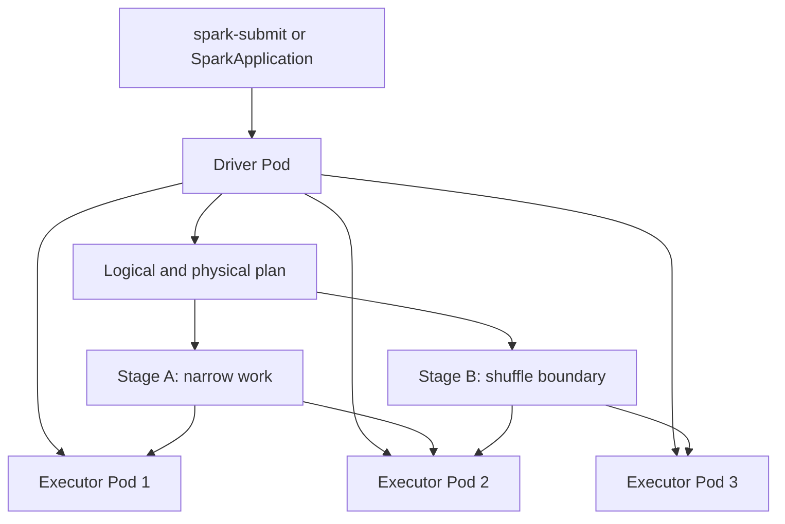
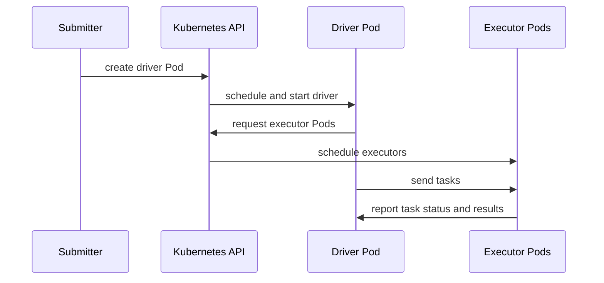
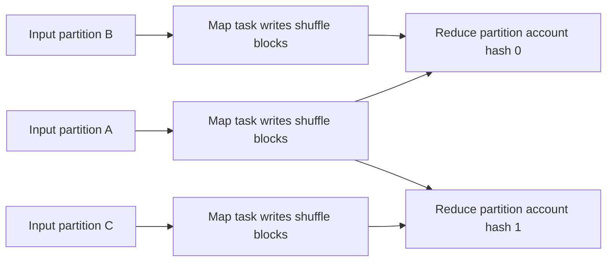
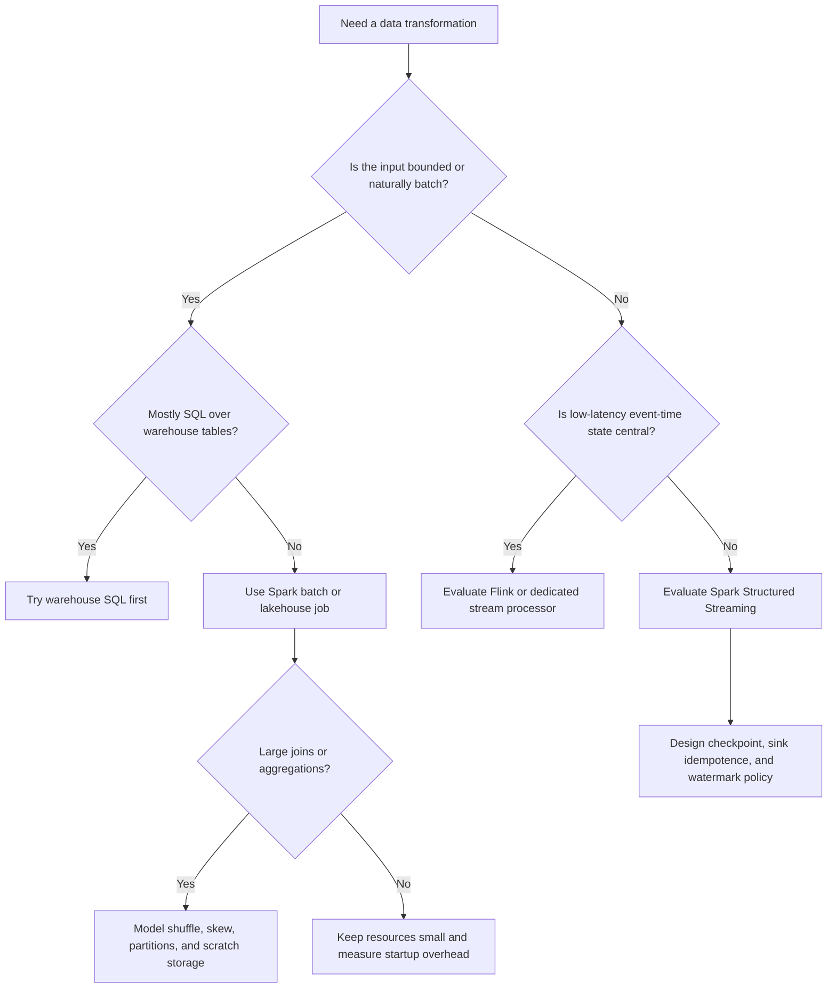

> **Discipline Module** | Complexity: `[COMPLEX]` | Time: 4-5 hours

## Prerequisites

Before starting this module:
- **Required**: Kubernetes Jobs and CronJobs, especially how Pods request CPU, memory, and storage.
- **Required**: Basic Python programming knowledge and comfort reading SQL-style transformations.
- **Recommended**: [Module 1.1 - Stateful Workloads & Storage](../module-1.1-stateful-workloads/) for storage persistence and failure-domain reasoning.
- **Recommended**: [Module 1.3 - Stream Processing with Apache Flink](../module-1.3-flink/) for event-time and checkpointing vocabulary.

---

## What You'll Be Able to Do

After completing this module, you will be able to:

- **Implement Apache Spark on Kubernetes using spark-submit or the Spark Operator for batch and streaming jobs**
- **Design Spark cluster configurations that optimize executor sizing, memory allocation, and shuffle performance**
- **Configure dynamic allocation and autoscaling for Spark workloads to balance cost and performance**
- **Diagnose common Spark failures - OOM errors, shuffle spills, data skew - in Kubernetes environments**

---

## Why This Module Matters

Most platform teams meet Spark after they already have a data problem that is too large or too irregular for a single database query. A warehouse can answer many analytical questions, but it is not always the right place to parse raw logs, reshape semi-structured files, build training features, compact a lakehouse table, or run a one-off reconciliation across years of history. Spark exists for these wide data transformations: read many partitions, apply a plan, move data when the plan requires it, and write a new dataset that downstream systems can trust.

Spark is also one of the clearest examples of why Kubernetes batch platforms are different from web platforms. A web service wants steady availability and predictable request latency. A Spark application wants a driver, a burst of executors, enough scratch space for shuffle, permission to talk to object storage, and then a clean shutdown when the work is done. Treating that workload like a permanently running Deployment wastes capacity and hides failure modes. Treating it like a disposable distributed computation makes the resource model visible.

Hypothetical scenario: A product analytics team runs a nightly pipeline that reads raw event files, filters invalid records, joins them to account metadata, writes curated Parquet, and refreshes a feature table. On a quiet night, the pipeline finishes with a small executor pool because filters remove most rows early. On a launch night, the same code needs many more tasks and writes far more shuffle data. The platform engineer's job is not to guess the exact number of Pods forever; it is to give Spark a cluster, storage, and policy envelope that let it scale safely while keeping failure recovery explainable.

The mental model for this module is a kitchen preparing a banquet. The driver is the head chef reading the recipe, deciding which stations work on which ingredients, and calling for the next course only after the previous preparation is complete. Executors are the cooking stations. Partitions are trays of ingredients. A narrow transformation is a station handling its own tray without asking anyone else for help, while a shuffle is the moment every station sends ingredients across the kitchen so dishes can be assembled by key. The banquet succeeds when the recipe is sound, the trays are sized sensibly, and the kitchen has enough counters, power, and cleanup space for the messiest step.

---

## The Spark Execution Model

Spark began with a simple but powerful abstraction: the resilient distributed dataset, or RDD. An RDD is not just a bag of records spread across machines; it also carries lineage, which is the recipe for reconstructing each partition from its parents. That lineage is why Spark can recover from executor loss without writing every intermediate result to durable storage. If a partition disappears, Spark can often recompute only the missing branch of the lineage graph rather than restarting the entire application.

RDDs also explain the difference between transformations and actions. A transformation such as `map`, `filter`, or `select` describes a new distributed dataset, but Spark does not immediately scan files or launch tasks when the transformation is declared. An action such as `count`, `collect`, or `write` asks for a result, so Spark turns the accumulated transformations into a physical execution plan. This lazy evaluation is not a convenience feature; it is what gives Spark room to collapse adjacent work, push filters closer to data sources, and avoid materializing intermediate data that nobody needs.

Modern Spark work should usually start with DataFrames or SQL instead of raw RDDs. A raw RDD tells Spark that code must run on records, but it says little about columns, predicates, join keys, data types, or the shape of the result. A DataFrame gives Spark a schema and a logical expression tree. That extra information lets the optimizer reason about the work before it becomes tasks, which is why the same business logic expressed as DataFrame operations often runs better than hand-written row functions.

The driver is the control plane of a Spark application. It owns the Spark session, constructs jobs from actions, asks the scheduler to divide work into stages, and tracks task results from executors. Executors are the data-plane workers. They run tasks, hold cached partitions, write shuffle files, and report status. In Kubernetes cluster mode, the driver itself runs as a Pod and creates executor Pods through the Kubernetes API, so driver placement, service account permissions, and Pod resources become part of the application design.



A job is created when an action needs work. A stage is a group of tasks that can run without waiting for a shuffle boundary. A task is the unit that processes one partition inside a stage. These names matter because operational symptoms map to them. A failed task might be a bad input record, a transient executor loss, or one partition too large for memory. A slow stage often means a shuffle, skew, or insufficient parallelism. A failed job usually means the driver could not assemble all stages into a completed action.

Partitions are Spark's unit of parallelism. A dataset with too few partitions leaves cores idle because there are not enough tasks to keep executors busy. A dataset with too many tiny partitions wastes scheduler overhead, opens too many files, and makes downstream commits noisy. Partitioning is therefore not just a file-layout detail; it is the bridge between data shape and cluster usage. When you tune Spark, you are usually tuning how records become partitions, how partitions become tasks, and how tasks use executor memory and disk.

The expensive moment is the shuffle. A narrow dependency lets one child partition depend on one parent partition, so a task can work locally. A wide dependency, such as a grouping or join by key, requires records with the same key to meet on the same downstream partition. That means executors write shuffle files, other executors fetch those files, and the network and local disks become part of the critical path. A Spark engineer learns to ask, "Where is the shuffle, how large is it, and can the plan reduce it?"

---

## Catalyst, Tungsten, and Why DataFrames Usually Win

Spark SQL works because Spark can separate what you want from how it should run. When you write `events.filter("event_type = 'purchase'").groupBy("account_id").count()`, you describe a logical result. Catalyst takes that logical plan through analysis, optimization, and physical planning. It can resolve column names, simplify expressions, push predicates into supported data sources, remove unused columns, and choose from multiple physical strategies before tasks ever start.

The optimizer cannot perform that reasoning if the important logic is hidden inside opaque user-defined functions. A Python function that returns `True` or `False` might be correct, but Spark cannot always inspect it, reorder it, or push it into a Parquet reader. Native DataFrame expressions keep the work visible. This is why "write SQL-shaped Spark" is often better advice than "write clever Python loops over rows." The goal is not aesthetic purity; the goal is to preserve information that the optimizer can use.

Tungsten is the execution-side idea that Spark should manage memory, binary formats, and generated code carefully instead of relying only on generic JVM object graphs. In practice, the learner-facing lesson is that DataFrame and SQL plans can run through optimized paths that are hard to reproduce manually with RDDs. Columnar formats, whole-stage code generation, and compact internal rows reduce the amount of CPU and memory wasted on object overhead. Those savings compound when a job touches billions of values.

Predicate pushdown is a concrete example. Suppose a Parquet dataset has columns for account, event type, region, and payload, but the query only needs purchases from one region. If the filter and projection are expressed in Spark SQL terms, Spark can ask the reader to skip unrelated row groups and columns when the format supports it. If the job reads every row into a Python function and filters afterward, the same business rule may force needless I/O, serialization, and executor memory pressure.

The optimizer is powerful, but it is not magic. Spark still has to move data when the requested result requires co-located keys. A join can become a broadcast join if one side is small enough, but a join between two large unpartitioned datasets usually becomes a shuffle. A group-by on a hot key still creates a partition that receives too much data. Catalyst can improve a plan, while good data modeling and operational tuning keep the plan inside the cluster's physical limits.

Use raw RDDs when you genuinely need low-level control, custom partitioners, or APIs that are not exposed through structured operations. Use DataFrames and SQL for ordinary ETL, aggregations, joins, feature preparation, lakehouse table maintenance, and most production pipelines. This boundary is durable across Spark versions because it follows from information flow: the more structure Spark can see, the more it can optimize.

---

## Landscape Snapshot - as of 2026-06. This changes fast; verify against vendor docs before relying on specifics.

Apache Spark's latest upstream documentation and download page show the current Spark documentation line as 4.1.2, while the official downloads page also lists active release news for Spark 4.0.3 and 4.1.2. Spark 4 artifacts use Scala 2.13, and Spark 3 remains common in environments that have not completed a major runtime migration. Treat this snapshot as a compatibility checkpoint, not a recommendation to upgrade blindly; application dependencies, connector support, managed-service runtimes, and table-format compatibility must all be checked before changing a production Spark minor or major line.

The Kubernetes Operator for Apache Spark lives under the `kubeflow/spark-operator` project and exposes `SparkApplication` resources for declarative job submission and status. The Kubeflow Helm repository reports chart and app version 2.5.0 as the current chart entry at authoring time. The examples below use the current Apache Spark image family and the Spark Operator CRD shape from upstream docs, but you should verify image tags, chart versions, and CRD fields before relying on them in a real cluster.

| Durable capability | Spark option used here | Tradeoff to check before production |
|--------------------|------------------------|-------------------------------------|
| Batch processing | DataFrame or SQL job in cluster mode | Great for high-throughput transformations; startup latency matters for tiny jobs. |
| Streaming with the same API | Structured Streaming | Convenient unification, but low-latency streaming semantics need careful checkpoint and sink design. |
| Kubernetes submission | `spark-submit` native scheduler or Spark Operator | CLI is direct; operator gives GitOps-friendly custom resources and status. |
| Elastic executors | Dynamic allocation with shuffle tracking | Saves idle capacity, but scale-down must not discard needed shuffle or cached state. |
| Lakehouse writes | Parquet plus Iceberg, Delta, or Hudi connectors | Table-format compatibility changes faster than the execution model. |

---

## Spark on Kubernetes Architecture

Spark can run on Kubernetes without a permanent Spark master or YARN cluster. In cluster mode, `spark-submit` talks to the Kubernetes API, creates a driver Pod, and the driver requests executor Pods as the application needs work. Kubernetes schedules those Pods according to requests, node selectors, tolerations, quotas, and any admission policy installed in the cluster. Spark remains responsible for query planning and task scheduling inside the application, while Kubernetes remains responsible for Pod lifecycle and placement.

That division of responsibility is easy to blur, so keep it explicit. Kubernetes does not know that one executor holds important shuffle files or that one task is the last straggler in a stage. Spark does not know every other workload that needs a node or every policy that limits a namespace. A healthy platform gives Spark enough configuration to express CPU, memory, local disk, identity, and failure tolerance in Kubernetes terms, then gives operators enough observability to connect Spark UI symptoms to Pod and node events.



The driver Pod is a single point of coordination. If it is evicted, OOM-killed, or denied API access, the application usually fails even if executor Pods are still healthy. The driver also holds metadata about stages, task attempts, accumulators, streaming queries, and collected results. Do not starve the driver because "executors process the data." A driver that cannot track a large job reliably can fail a computation whose executor sizing looked generous.

Executor Pods need enough CPU for concurrent tasks, enough JVM heap for Spark-managed memory, enough memory overhead for non-heap and Python processes, and enough local scratch for shuffle and spill. Kubernetes resource requests influence where Pods can be scheduled; limits influence runtime enforcement. For Spark, a memory limit breach often becomes a container termination, while a CPU limit can throttle tasks and make stage duration harder to interpret. Many teams set clear memory limits and evaluate CPU limits carefully rather than copying web-service defaults.

The native Kubernetes scheduler integration is direct, but many production teams prefer the Spark Operator for recurring and GitOps-managed jobs. The operator lets you define a `SparkApplication` custom resource, inspect status through Kubernetes, set restart policy, and keep application configuration in the same review flow as other platform objects. It does not remove the need to understand Spark internals. A bad join strategy, undersized memory overhead, or broken object-store credentials will still fail inside the Spark application.

Here is the smallest useful shape of a native cluster-mode submission. The values are illustrative; the important part is that the driver points Spark at Kubernetes, names a real image, and declares executor resources instead of relying on hidden defaults.

```bash
spark-submit \
  --master k8s://https://127.0.0.1:6443 \
  --deploy-mode cluster \
  --name sales-etl \
  --conf spark.kubernetes.namespace=spark \
  --conf spark.kubernetes.container.image=apache/spark:4.1.2-python3 \
  --conf spark.executor.instances=2 \
  --conf spark.executor.cores=1 \
  --conf spark.executor.memory=1024m \
  --conf spark.executor.memoryOverhead=512m \
  local:///opt/spark/examples/src/main/python/pi.py
```

Here is the same operational idea expressed with the operator. This is a better fit when a job is scheduled by Airflow, reviewed through Git, retried by policy, or observed by platform dashboards that already know how to read Kubernetes objects.

```yaml
apiVersion: sparkoperator.k8s.io/v1beta2
kind: SparkApplication
metadata:
  name: sales-etl
  namespace: spark
spec:
  type: Python
  pythonVersion: "3"
  mode: cluster
  image: apache/spark:4.1.2-python3
  imagePullPolicy: IfNotPresent
  mainApplicationFile: local:///scripts/etl.py
  sparkVersion: "4.1.2"
  restartPolicy:
    type: OnFailure
    onFailureRetries: 2
    onFailureRetryInterval: 30
  sparkConf:
    spark.sql.adaptive.enabled: "true"
    spark.sql.adaptive.coalescePartitions.enabled: "true"
    spark.serializer: org.apache.spark.serializer.KryoSerializer
  driver:
    cores: 1
    coreLimit: "1200m"
    memory: "1024m"
    serviceAccount: spark
    labels:
      spark-role: driver
    volumeMounts:
      - name: etl-script
        mountPath: /scripts
      - name: data
        mountPath: /data
  executor:
    cores: 1
    coreLimit: "1200m"
    memory: "1024m"
    memoryOverhead: "512m"
    instances: 2
    labels:
      spark-role: executor
    volumeMounts:
      - name: data
        mountPath: /data
  volumes:
    - name: etl-script
      configMap:
        name: spark-etl
    - name: data
      persistentVolumeClaim:
        claimName: spark-data
```

Notice what is not in that manifest: no permanent cluster, no hand-managed executor Deployment, and no assumption that object storage credentials or scratch space magically appear. In real deployments you will add service account bindings, cloud identity, node selection, secrets, metrics, and sometimes Pod templates. The durable lesson is that Spark applications become Kubernetes applications with a short but intense lifecycle.

---

## Memory, Cores, and the Cost Model

Spark tuning becomes less mysterious when you reduce it to a cost model. A task reads records, transforms them, may hold intermediate state, may serialize data, may write local shuffle, and may fetch remote shuffle. CPU, heap, off-heap memory, Python memory, network, and local disk all take turns becoming the bottleneck. A tuning change helps only when it relieves the resource that is actually constraining the stage.

Executor cores decide how many tasks can run concurrently inside one executor. More cores per executor can improve throughput, but it also means more tasks compete for the same heap, overhead memory, disk bandwidth, and garbage collector. Fewer cores per executor can isolate failures and reduce memory contention, but it creates more Pods and more scheduler overhead. There is no universal executor shape; start from workload evidence and adjust based on Spark UI and Kubernetes metrics.

Executor memory is not the same as Pod memory. `spark.executor.memory` describes the JVM heap available to Spark's executor process. `spark.executor.memoryOverhead` covers non-heap memory, native overhead, and, when PySpark memory is not configured separately, Python worker memory. Kubernetes sees the container as a whole. If the total memory used by the JVM, Python workers, native libraries, and overhead crosses the container limit, the kubelet can terminate the container even though the Spark heap setting looked large.

PySpark makes this distinction especially important. Python workers sit alongside the JVM, and pandas or NumPy operations can use memory that Spark's heap manager does not see. When a PySpark executor is OOM-killed, increasing only `spark.executor.memory` may make the container larger in one dimension while still leaving overhead too tight. Read the Pod termination reason, inspect container memory, and size overhead as deliberately as heap.

Spark's unified memory model divides heap between execution memory and storage memory. Execution memory is used for shuffles, joins, sorts, and aggregations. Storage memory is used for cached blocks. If you cache aggressively and then run a shuffle-heavy join, those two needs compete. Caching a DataFrame is useful when it prevents repeated expensive scans, but it is harmful when it pins memory that a one-pass job needs for execution.

Persistence levels are a tool, not a default. `MEMORY_ONLY` is fast when the dataset fits, but it can evict partitions and force recomputation when it does not. `MEMORY_AND_DISK` tolerates larger cached datasets by spilling partitions, but it turns repeated access into disk I/O. Caching after a selective filter is often better than caching raw input because it stores fewer columns and rows. Cache only when you can name the repeated reuse that pays for it, and unpersist when that reuse is finished.

```python
from pyspark.sql import SparkSession
from pyspark.storagelevel import StorageLevel

spark = SparkSession.builder.appName("CacheOnlyWhenReused").getOrCreate()

events = spark.read.parquet("/data/raw/events")
purchase_events = (
    events
    .where("event_type = 'purchase'")
    .select("account_id", "event_time", "amount")
    .persist(StorageLevel.MEMORY_AND_DISK)
)

daily_revenue = purchase_events.groupBy("account_id").sum("amount")
daily_revenue.write.mode("overwrite").parquet("/data/curated/account_revenue")

late_audit = purchase_events.where("event_time < '2026-01-01'")
late_audit.write.mode("overwrite").parquet("/data/audit/old_purchases")

purchase_events.unpersist()
spark.stop()
```

Serialization belongs in the same cost model. Spark's tuning guide calls out serialization because distributed jobs constantly move data between memory, disk, and network. Kryo serialization can reduce object size and speed up shuffle-heavy workloads compared with Java serialization, but it may require registering classes in Scala or Java applications. In PySpark, the largest gains often come from reducing data before it crosses language boundaries rather than expecting serializer settings to fix a poor plan.

Partition count is the most common tuning lever learners misuse. `repartition(n)` always creates a shuffle because it redistributes records. `coalesce(n)` can reduce partitions without a full shuffle when the current layout allows it, but it can also create too few large partitions if used carelessly before a write. A useful pattern is to preserve parallelism through expensive transformations, then reduce output partitions near the final write when file count matters.

---

## Shuffle, Joins, Skew, and Adaptive Query Execution

Shuffle is Spark's tax for changing data ownership. A filter can run wherever each input partition already lives. A join on `account_id` requires all rows for a given account from both sides to meet at the same downstream task. An aggregation by `city` requires all records for each city to meet. The more data that crosses this boundary, the more the job depends on network throughput, local disk, serialization, and retry behavior.



On Kubernetes, shuffle files normally live on executor-local storage. If an executor Pod disappears before downstream tasks fetch its shuffle files, Spark may have to recompute the upstream tasks that produced those files. This is not a Kubernetes bug; it follows from where the intermediate state lived. The design question is whether the workload can tolerate recomputation, whether local disk is fast and large enough, and whether dynamic allocation might remove executors that still hold needed shuffle data.

Adaptive Query Execution, or AQE, lets Spark adjust parts of a SQL plan after it observes runtime statistics. It can coalesce post-shuffle partitions when the original partition count created too many tiny tasks. It can split skewed shuffle partitions when one reduce partition is much larger than its peers. It can switch from a sort-merge join to a broadcast hash join when a filtered side is small enough at runtime. AQE does not remove the need to understand the plan, but it turns some static guesses into runtime decisions.

Broadcast joins illustrate the tradeoff. If a dimension table is small, Spark can send it to every executor and let each task join locally against its input partition. That avoids shuffling the large fact table. If the "small" side is not actually small, broadcasting can overload executor memory and driver planning. The engineer's job is to verify cardinality, filter early, and let Spark's statistics guide the strategy where possible.

Data skew is different from a simple lack of executors. If most keys are evenly distributed but one key receives a huge share of rows, adding more executors may leave one slow task stranded while the rest of the cluster sits idle. AQE can split some skewed partitions, and manual salting can spread a hot key when the business logic allows it. The first diagnostic step is not to change a random setting; it is to compare maximum task duration, input size, and shuffle read size against the median in the Spark UI.

```python
from pyspark.sql import functions as F

events = spark.read.parquet("/data/raw/events")
accounts = spark.read.parquet("/data/reference/accounts")

active_accounts = accounts.where("status = 'active'").select("account_id", "tier")

joined = (
    events
    .where("event_date = '2026-06-01'")
    .join(F.broadcast(active_accounts), on="account_id", how="inner")
    .groupBy("tier")
    .agg(F.count("*").alias("event_count"))
)

joined.write.mode("overwrite").parquet("/data/curated/events_by_tier")
```

The code above is intentionally small, but it carries three important habits. It filters the large event table before the join, projects only needed columns from the reference table, and broadcasts only the table that should plausibly be small after filtering. If the reference table grows beyond memory, the explicit broadcast becomes a liability. Good tuning always includes a plan to revisit assumptions as data changes.

Shuffle scratch space needs explicit Kubernetes design. An `emptyDir` volume is simple and follows the Pod lifecycle, which is acceptable for workloads where recomputation is cheap and nodes have enough ephemeral storage. A host path or local persistent volume can provide faster or larger scratch on selected nodes, but it binds the job more tightly to node layout and security policy. Object-store based shuffle plugins and remote shuffle services can improve resilience for some environments, but they add their own operational surface. Pick the simplest option that matches recovery and throughput needs.

---

## Dynamic Allocation and Autoscaling

Fixed executor counts are easy to understand and wasteful for variable workloads. A job may start with a narrow scan, hit a large join, then finish with a small write. If you size for the peak, the early and late stages over-reserve resources. If you size for the quiet stages, the wide stage drags. Dynamic allocation lets Spark request more executors when pending tasks accumulate and remove idle executors when demand falls.

The important word is "heuristic." Spark cannot know the future. It watches scheduling backlog, asks for executors in rounds, and removes executors after idle timeouts. On Kubernetes, those requests become new executor Pods, so namespace quota, cluster autoscaler latency, image pulls, and node capacity all affect how quickly dynamic allocation becomes useful. A setting that looks responsive in Spark may still wait on the platform to create room.

Dynamic allocation also has to protect intermediate state. If an executor has cached data or shuffle files that future tasks need, removing it can force recomputation. Spark's shuffle tracking exists to reduce accidental removal of executors that still hold unconsumed shuffle files. This is especially relevant on Kubernetes because executor-local storage disappears with the Pod. Dynamic allocation is not merely a cost feature; it changes the lifecycle of state inside the job.

```yaml
sparkConf:
  spark.dynamicAllocation.enabled: "true"
  spark.dynamicAllocation.shuffleTracking.enabled: "true"
  spark.dynamicAllocation.minExecutors: "1"
  spark.dynamicAllocation.initialExecutors: "2"
  spark.dynamicAllocation.maxExecutors: "8"
  spark.dynamicAllocation.schedulerBacklogTimeout: "5s"
  spark.dynamicAllocation.executorIdleTimeout: "120s"
```

These settings express a bounded elasticity policy. The application can start small, grow when it has queued tasks, and shrink after executors sit idle. The maximum is as important as the minimum because it protects the shared cluster from one job consuming every available node. In production, pair Spark-side maximums with Kubernetes `ResourceQuota`, priority classes, and cluster autoscaler limits so a single data pipeline cannot surprise the rest of the platform.

Autoscaling at the cluster layer is a separate loop. Spark may request more executor Pods, but Kubernetes can only schedule them if nodes have capacity. A cluster autoscaler may then add nodes, after which image pulling and Pod startup still take time. This means dynamic allocation helps most when stages last long enough for extra Pods to arrive and do meaningful work. For tiny jobs, startup latency can dominate the useful computation.

Cost tuning therefore means measuring wall-clock time and resource-time together. A job that doubles executors and finishes only slightly faster may cost more and create more shuffle pressure. A job that uses fewer executors but runs far longer may block downstream service-level objectives. Platform teams should teach users to compare task saturation, executor idle time, input size, shuffle size, and business deadline instead of treating "more executors" as a universal fix.

---

## Structured Streaming: Batch Logic on Incremental Data

Structured Streaming extends the DataFrame model to unbounded input. You express a computation against a streaming DataFrame, and Spark runs it incrementally. By default, Spark uses a micro-batch engine: it takes available input for a trigger interval, plans a small batch, updates state, writes output, and records progress. Spark also has continuous processing modes for lower-latency use cases with different guarantees, but micro-batch remains the common mental model for many data engineering pipelines.

The unified API is useful because the same vocabulary applies to static files and arriving events. A select is still a select. A group-by is still a group-by. A join still has a data movement cost. The difference is that state can live across triggers and input never truly ends. That makes checkpointing, output idempotence, and event-time handling part of correctness rather than optional performance tuning.

Event time is the timestamp inside the event, while processing time is when Spark observes the event. Late data exists because networks, devices, producers, and brokers do not deliver every event in event-time order. A watermark tells Spark how long to keep state for late arrivals before it can close old windows and discard state. This is the same core idea you saw in the Flink module, but Spark expresses it through DataFrame operations such as `withWatermark` and windowed aggregation.

```python
from pyspark.sql import SparkSession
from pyspark.sql.functions import window, count

spark = SparkSession.builder.appName("WindowedPurchases").getOrCreate()

events = (
    spark.readStream
    .format("json")
    .schema("event_time timestamp, account_id string, event_type string")
    .load("/data/streaming/events")
)

purchases_per_window = (
    events
    .where("event_type = 'purchase'")
    .withWatermark("event_time", "10 minutes")
    .groupBy(window("event_time", "5 minutes"), "account_id")
    .agg(count("*").alias("purchase_count"))
)

query = (
    purchases_per_window.writeStream
    .format("parquet")
    .option("path", "/data/streaming/output")
    .option("checkpointLocation", "/data/streaming/checkpoints/purchases")
    .outputMode("append")
    .start()
)

query.awaitTermination()
```

The checkpoint location is part of the contract. Spark records progress, state metadata, and enough information to recover a query after failure. If you delete the checkpoint and reuse the output path, Spark no longer knows which input ranges were already processed. If you change incompatible query structure while reusing a checkpoint, recovery may fail or produce incorrect state. Treat streaming checkpoint storage like application state, not like temporary logs.

"Exactly once" in streaming systems is best understood as effectively-once outcomes under specific source, checkpoint, and sink conditions. Spark can replay input ranges and avoid double-counting inside its state when the source is replayable and checkpointing is intact. The output sink still matters. A file sink can coordinate committed files differently from a custom `foreachBatch` sink that writes to an external API. If the sink is not idempotent or transactional, a retried batch can create duplicates even when Spark's internal state recovered correctly.

Structured Streaming is not a replacement for Flink in every streaming design. Spark is attractive when teams already use Spark SQL, need a single API for batch and incremental pipelines, and tolerate micro-batch latency. Flink is often a better fit for deeply stateful, low-latency streaming applications that depend on fine-grained event-time behavior and long-running operators. The decision is not "which engine is best"; it is which failure model, latency target, state model, and operational skill set fit the workload.

---

## Operating Spark Applications on Kubernetes

Operating Spark starts with logs, but logs are not enough. The Spark UI explains jobs, stages, SQL plans, task attempts, shuffle, spill, storage, and executor status. Kubernetes explains Pod scheduling, image pulls, restarts, evictions, resource limits, node pressure, service account errors, and volume mounts. A production incident usually needs both views. If the Spark UI says tasks were slow, Kubernetes may explain that executor Pods were CPU-throttled or waiting for image pulls. If Kubernetes says a Pod was OOM-killed, Spark's stage view may explain which shuffle or UDF caused memory growth.

Driver logs are the first place to confirm application-level failure. They show submission errors, missing dependencies, permission problems, unresolved classes, Python exceptions, and final application status. Executor logs show task-level failures and data-specific exceptions. Kubernetes events show scheduling and lifecycle problems that Spark cannot diagnose by itself. The habit is to move from symptom to layer: application exception, Spark plan, executor resource, Pod lifecycle, node pressure, and storage or network dependency.

Image design belongs in operations because Spark creates many short-lived Pods. A large image that is not cached on nodes can turn every job start into a pull storm. Installing Python packages at container startup makes failure later and less reproducible. Use a reviewed image with application code and dependencies baked in, pin the tag, and keep the base image aligned with the Spark runtime you actually run. Avoid `latest`, not because tags are morally bad, but because reproducibility is impossible when the bytes can change behind the same name.

```dockerfile
FROM apache/spark:4.1.2-python3

USER root
COPY requirements.txt /tmp/requirements.txt
RUN pip install --no-cache-dir -r /tmp/requirements.txt && \
    rm -f /tmp/requirements.txt

COPY etl.py /opt/spark/work-dir/etl.py

USER spark
WORKDIR /opt/spark/work-dir
```

Storage design also belongs in operations. Input and output usually live in object storage or a shared filesystem. Shuffle and spill often use local executor storage. Checkpoints for streaming must be durable across Pod restarts. These are three different storage needs with different lifetimes. Mixing them into one vague "data volume" hides the most important question: what must survive Pod loss, and what can Spark recompute?

Service accounts and identity are another common source of failed jobs. The driver needs permission to create and watch executor Pods. Both driver and executors may need permission to read secrets, mount volumes, or access cloud object storage through workload identity. Over-broad permissions make the platform risky; under-broad permissions create failures that look like Spark problems but are really API or storage authorization problems. Define the identity contract as part of the application template.

Metrics close the loop. Spark can expose executor and application metrics; Kubernetes exposes Pod resource usage and events; object stores expose request and error rates. Performance tuning without metrics becomes folklore. A mature data platform records enough information after each run to answer what changed: input volume, task count, shuffle read and write, spill bytes, executor count, executor lost events, driver memory, and output files.

---

## Choosing Spark, Flink, or Warehouse SQL

Spark, Flink, and warehouse SQL overlap, but they optimize for different centers of gravity. Spark is a strong fit for batch-heavy transformation, lakehouse maintenance, feature engineering, machine-learning preparation, and pipelines that benefit from a general-purpose distributed execution engine. Flink is a strong fit for long-running event processing where low latency, state, event time, and continuous operation dominate. Warehouse SQL is a strong fit when data already lives in the warehouse and the transformation is mostly relational.

The practical mistake is to choose by brand instead of by workload shape. If the job reads a daily partition, performs several joins, writes Parquet, and finishes, Spark is a natural candidate. If the job must react to each event stream with tight latency and rich keyed state, Flink may fit better. If the job is a dashboard aggregate over governed warehouse tables, pushing SQL into the warehouse avoids exporting data only to import it again.

| Question | Spark tends to fit when... | Flink tends to fit when... | Warehouse SQL tends to fit when... |
|----------|----------------------------|-----------------------------|------------------------------------|
| Workload lifetime | Jobs start, process bounded or micro-batch work, and stop. | Applications run continuously and hold streaming state. | Queries run inside an existing warehouse control plane. |
| Latency target | Minutes are acceptable, or micro-batch latency is fine. | Low event-to-output latency is central to the product. | Interactive or scheduled SQL latency is enough. |
| Data movement | Data is in files, lakehouse tables, or multiple external systems. | Data arrives through streams and needs event-time processing. | Data is already modeled in warehouse tables. |
| Operational priority | Elastic batch capacity and broad language APIs matter. | Stateful streaming recovery and event-time control matter. | Governance, SQL ergonomics, and warehouse optimization matter. |

The decision can also be staged. A team may prototype a daily batch computation in Spark, then move the hot path to Flink if the business later requires lower latency. Another team may start in warehouse SQL and introduce Spark only for a transformation that exceeds warehouse ergonomics or needs custom libraries. Good architecture preserves the reason for the choice so the next engineer can revisit it when requirements change.

---

## Patterns & Anti-Patterns

### Patterns

**Pattern: Keep transformations visible to Spark.** Prefer DataFrame and SQL expressions for filters, projections, aggregations, and joins so Catalyst can optimize the plan. Use user-defined functions only when the native expression set cannot represent the logic. This pattern improves both performance and debuggability because the Spark UI can show a meaningful SQL plan instead of a black box of row-level code.

**Pattern: Treat shuffle as a first-class design constraint.** Before increasing executor count, inspect which stages shuffle data, how much they read and write, and whether skew is present. Tune joins, partitioning, and filters around the shuffle boundary. This pattern prevents expensive changes that only make a poor plan run louder.

**Pattern: Separate durable state from recomputable scratch.** Inputs, outputs, and streaming checkpoints must survive Pod loss. Shuffle and spill may be recomputable, but they need fast local space while the Pod lives. This pattern keeps Kubernetes volume choices aligned with Spark's fault model instead of making every byte look equally permanent.

**Pattern: Bound elasticity.** Dynamic allocation should have clear minimums, maximums, idle timeouts, and namespace quotas. A data job that can scale without a ceiling can disrupt unrelated workloads, while a job that cannot scale at all may miss deadlines. This pattern turns cost optimization into a policy instead of a surprise.

### Anti-Patterns

**Anti-pattern: Using `collect()` as a debugging shortcut on production-sized data.** `collect()` moves data to the driver, which is exactly where large results do not belong. It may work in a notebook sample and fail in production with driver OOM. Use `show`, `limit`, sampled writes, or aggregate checks instead.

**Anti-pattern: Treating OOMKilled as only a Spark heap problem.** Kubernetes kills the container, not just the JVM heap. PySpark, native libraries, off-heap memory, and overhead all count. Raising executor heap while leaving overhead too low can make the failure more confusing rather than fixing it.

**Anti-pattern: Repartitioning because a job feels slow.** `repartition` creates a shuffle, so it can add the very cost you are trying to reduce. Change partitioning when you can explain the target parallelism or output layout. Otherwise, inspect the plan and task distribution first.

**Anti-pattern: Scaling executors without checking skew.** More executors cannot fully solve a hot key that sends most records to one reduce partition. Skew needs plan-level treatment through AQE, key salting, pre-aggregation, or data modeling. Executor count helps when work is parallelizable; skew is evidence that some work is not evenly parallelized.

### Decision Framework



Use the framework as a conversation starter, not a gate that replaces engineering judgment. The goal is to force the durable questions into the open: bounded versus unbounded input, SQL versus general computation, latency target, state, shuffle, and operational ownership. Once those questions are explicit, tool choice becomes easier to defend and easier to revise.

---

## Did You Know?

- **Spark's RDD guide still teaches the core laziness model.** Transformations build a plan, and actions force Spark to compute a result. That basic split remains useful even when you write DataFrame code instead of raw RDD operations.
- **Structured Streaming uses the Spark SQL engine.** A streaming aggregation and a batch aggregation can share much of the same expression vocabulary, which is why Spark can offer a unified API across bounded and unbounded data.
- **Kubernetes is the resource scheduler, not the Spark query planner.** Kubernetes places driver and executor Pods, while Spark still plans jobs, stages, tasks, shuffle, and retries inside the application.
- **Memory overhead is part of the container memory budget.** Spark's configuration docs call out executor memory overhead because non-heap and PySpark memory can be the difference between a stable job and an OOMKilled executor.

---

## Common Mistakes

| Mistake | Why It Happens | What To Do Instead |
|---------|----------------|-------------------|
| Using raw RDDs for ordinary ETL | The low-level API feels more explicit | Use DataFrames or SQL so Spark can optimize filters, projections, joins, and scans. |
| Calling `collect()` on large results | It works during small notebook testing | Use `show`, `limit`, aggregate checks, or write sampled output to storage. |
| Increasing executors before reading the Spark UI | More Pods look like more power | Inspect stages, task skew, shuffle read and write, spill, and executor utilization first. |
| Ignoring `memoryOverhead` for PySpark | The heap setting looks large enough | Size heap and overhead together, and read Kubernetes termination reasons when Pods die. |
| Repartitioning at every step | Parallelism and partition count get confused | Preserve useful partitioning, repartition only for a named reason, and coalesce near final writes when appropriate. |
| Treating dynamic allocation as automatic cost control | The setting is enabled but policy is missing | Bound minimums and maximums, use shuffle tracking, and align with namespace quotas and cluster autoscaling. |
| Storing checkpoints on ephemeral volumes | Checkpoints look like temporary run data | Put streaming checkpoints on durable storage and treat incompatible query changes as state migrations. |
| Pinning examples to stale images or charts | Blog posts and old snippets circulate for years | Verify image tags, chart versions, and CRD fields against upstream docs before copying manifests. |

---

## Quiz

**Question 1:** Your team migrates a nightly ETL job from a long-running Hadoop cluster to Kubernetes. The job reads files, joins a reference dataset, writes curated Parquet, and exits. Why does Spark on Kubernetes change the operational model, and what must you design around before calling the migration complete?

<details>
<summary>Answer</summary>

Spark on Kubernetes replaces a permanent resource-manager cluster with an application lifecycle made of a driver Pod and executor Pods. That means the platform must design service account permissions, Pod resource requests, image delivery, local shuffle storage, and cleanup behavior for each application run. This answer aligns with the outcome to **implement Apache Spark on Kubernetes using spark-submit or the Spark Operator for batch and streaming jobs** because the real implementation work is not only submitting code; it is making the driver and executor lifecycle reliable in Kubernetes. A migration is not complete until failures can be diagnosed across both Spark UI state and Kubernetes Pod events.

</details>

**Question 2:** A PySpark job fails with executor Pods showing `OOMKilled`. The Spark configuration already gives each executor a large heap, and the developer asks for an even larger `spark.executor.memory` value. What should you check first, and why?

<details>
<summary>Answer</summary>

Check the container memory budget, especially `spark.executor.memoryOverhead`, because PySpark workers and other non-heap memory count against the Kubernetes container limit. A large JVM heap does not guarantee enough space for Python processes, native libraries, off-heap memory, or user code outside Spark's heap manager. This answer aligns with the outcome to **design Spark cluster configurations that optimize executor sizing, memory allocation, and shuffle performance** because executor sizing includes heap, overhead, cores, and local disk, not just one memory knob. The fix may be a different heap-to-overhead balance rather than a larger heap alone.

</details>

**Question 3:** A join stage has thousands of tasks, but nearly all finish quickly while one task runs for a long time. Adding executors improves other stages but does not remove the long tail. What is the likely cause, and which Spark features or data-modeling changes could help?

<details>
<summary>Answer</summary>

The symptom points to data skew: one downstream shuffle partition receives far more data than its peers. Adaptive Query Execution can split skewed shuffle partitions in supported SQL plans, and a broadcast join may avoid shuffling a large table when the other side is truly small. If the hot key is inherent in the data, manual salting, pre-aggregation, or a different data model may be needed. This answer aligns with the outcome to **diagnose common Spark failures - OOM errors, shuffle spills, data skew - in Kubernetes environments** because the root cause lives in task distribution, not simple cluster size.

</details>

**Question 4:** A platform team enables dynamic allocation and sees executor Pods scale down during a long application. Later stages recompute earlier work, and the job becomes slower rather than cheaper. What design mistake might explain this behavior?

<details>
<summary>Answer</summary>

The likely mistake is allowing executors that hold useful cached blocks or unconsumed shuffle files to disappear too aggressively. Dynamic allocation is a heuristic that removes idle executors, and on Kubernetes an executor Pod's local storage disappears with the Pod. Shuffle tracking, safer idle timeouts, and careful caching decisions reduce the chance that scale-down destroys intermediate state the application will need again. This answer aligns with the outcome to **configure dynamic allocation and autoscaling for Spark workloads to balance cost and performance** because the balance depends on state lifetime, not only executor count.

</details>

**Question 5:** A developer writes a Structured Streaming query that reads events, groups them into event-time windows, and writes output through `foreachBatch` to an external API. They say Spark guarantees exactly-once semantics, so the API does not need idempotency. What is wrong with that reasoning?

<details>
<summary>Answer</summary>

Spark's recovery guarantees depend on replayable sources, checkpointing, state management, and sink behavior. `foreachBatch` gives the developer control over writes, which means a retried batch can duplicate effects unless the external API write is idempotent or transactional. The checkpoint helps Spark know what it processed, but it cannot force an arbitrary external system to deduplicate side effects. This answer reinforces the Kubernetes implementation outcome for streaming jobs because a copy-runnable streaming deployment must include durable checkpoints and a sink contract, not only a running Pod.

</details>

**Question 6:** You inspect a slow Spark job and find huge shuffle read and write sizes. The input files are Parquet, but the code selects all columns, runs a Python UDF, then filters to a few event types. How would you restructure the job before changing cluster size?

<details>
<summary>Answer</summary>

Move projections and filters into native DataFrame expressions before the UDF so Spark can push column pruning and predicates closer to the Parquet scan when supported. Keep the optimizer's view of the plan as long as possible, then apply the UDF only to the reduced dataset if it is still necessary. This can cut I/O, serialization, shuffle volume, and executor memory pressure before any infrastructure tuning. The answer aligns with the executor sizing and shuffle-performance outcome because the best resource configuration cannot compensate for a plan that moves needless data.

</details>

**Question 7:** A team asks whether every transformation should move from Spark to Flink because the organization is investing in streaming. The workload in question reads a daily partition, performs several joins, writes a lakehouse table, and must finish before business hours. How would you frame the decision?

<details>
<summary>Answer</summary>

The workload is bounded and batch-heavy, so Spark remains a natural fit unless latency or state requirements change. Flink is valuable when continuous event-time processing and low-latency state dominate, while warehouse SQL may fit if the data is already modeled in a warehouse. The decision should compare workload lifetime, latency, data location, state, and operational ownership rather than ranking tools globally. This answer supports the implementation and design outcomes because choosing Spark is part of designing the platform contract for the job.

</details>

---

## Hands-On

### Objective

Deploy a small PySpark batch job with the Spark Operator, observe driver and executor Pods, inspect the Spark UI while the job runs, and make one controlled tuning change. The lab uses a PVC so the generated input and output survive individual Pod restarts, while Spark shuffle remains executor-local scratch. Run it on a disposable local cluster because it installs a CRD-backed operator and creates batch Pods.

### Step 1: Create the Cluster and Install the Operator

```bash
kind create cluster --name spark-lab
kubectl create namespace spark

helm repo add spark-operator https://kubeflow.github.io/spark-operator
helm repo update
helm install spark-operator spark-operator/spark-operator \
  --namespace spark \
  --set webhook.enable=true \
  --set sparkJobNamespaces[0]=spark \
  --set serviceAccounts.spark.create=true \
  --set serviceAccounts.spark.name=spark

kubectl -n spark wait --for=condition=Available \
  deployment/spark-operator-controller --timeout=180s
```

### Step 2: Create Shared Lab Storage

```yaml
apiVersion: v1
kind: PersistentVolumeClaim
metadata:
  name: spark-data
  namespace: spark
spec:
  accessModes:
    - ReadWriteOnce
  resources:
    requests:
      storage: 5Gi
```

```bash
cat > spark-data-pvc.yaml <<'EOF'
apiVersion: v1
kind: PersistentVolumeClaim
metadata:
  name: spark-data
  namespace: spark
spec:
  accessModes:
    - ReadWriteOnce
  resources:
    requests:
      storage: 5Gi
EOF

kubectl apply -f spark-data-pvc.yaml
kubectl -n spark wait --for=jsonpath='{.status.phase}'=Bound pvc/spark-data --timeout=120s
```

### Step 3: Generate Sample CSV Input

```bash
kubectl -n spark create configmap data-generator --from-literal=generate.py='
import csv
import os
import random

random.seed(42)
output_dir = "/data/input"
os.makedirs(output_dir, exist_ok=True)
cities = ["New York", "Los Angeles", "Chicago", "Houston", "Phoenix"]
categories = ["Electronics", "Clothing", "Food", "Books", "Sports"]

for file_num in range(3):
    path = f"{output_dir}/sales_{file_num}.csv"
    with open(path, "w", newline="") as f:
        writer = csv.writer(f)
        writer.writerow(["order_id", "city", "category", "amount", "quantity"])
        for i in range(20000):
            writer.writerow([
                f"ORD-{file_num}-{i:06d}",
                random.choice(cities),
                random.choice(categories),
                round(random.uniform(5.0, 500.0), 2),
                random.randint(1, 20),
            ])
    print(f"Wrote {path}")
'

kubectl -n spark run data-gen --rm -i --restart=Never \
  --image=python:3.12-slim \
  --overrides='{
    "spec": {
      "containers": [{
        "name": "data-gen",
        "image": "python:3.12-slim",
        "command": ["python", "/scripts/generate.py"],
        "volumeMounts": [
          {"name": "scripts", "mountPath": "/scripts"},
          {"name": "data", "mountPath": "/data"}
        ]
      }],
      "volumes": [
        {"name": "scripts", "configMap": {"name": "data-generator"}},
        {"name": "data", "persistentVolumeClaim": {"claimName": "spark-data"}}
      ]
    }
  }'
```

### Step 4: Create and Submit the PySpark Job

```bash
kubectl -n spark create configmap spark-etl --from-literal=etl.py='
from pyspark.sql import SparkSession
from pyspark.sql import functions as F

spark = SparkSession.builder.appName("SalesETL").getOrCreate()

df = spark.read.csv("/data/input/*.csv", header=True, inferSchema=True)

city_revenue = (
    df.groupBy("city")
    .agg(
        F.sum("amount").alias("total_revenue"),
        F.avg("amount").alias("avg_order_value"),
        F.count("*").alias("total_orders"),
        F.sum("quantity").alias("total_items"),
    )
    .orderBy(F.desc("total_revenue"))
)

category_revenue = (
    df.groupBy("category")
    .agg(F.sum("amount").alias("total_revenue"), F.count("*").alias("orders"))
    .orderBy(F.desc("total_revenue"))
)

print("=== Revenue by City ===")
city_revenue.show(truncate=False)
print("=== Revenue by Category ===")
category_revenue.show(truncate=False)

city_revenue.write.mode("overwrite").parquet("/data/output/city_revenue")
category_revenue.write.mode("overwrite").parquet("/data/output/category_revenue")

spark.stop()
'

cat > spark-etl-app.yaml <<'EOF'
apiVersion: sparkoperator.k8s.io/v1beta2
kind: SparkApplication
metadata:
  name: sales-etl
  namespace: spark
spec:
  type: Python
  pythonVersion: "3"
  mode: cluster
  image: apache/spark:4.1.2-python3
  imagePullPolicy: IfNotPresent
  mainApplicationFile: local:///scripts/etl.py
  sparkVersion: "4.1.2"
  restartPolicy:
    type: OnFailure
    onFailureRetries: 2
    onFailureRetryInterval: 30
  sparkConf:
    spark.sql.adaptive.enabled: "true"
    spark.sql.adaptive.coalescePartitions.enabled: "true"
    spark.serializer: org.apache.spark.serializer.KryoSerializer
  driver:
    cores: 1
    coreLimit: "1200m"
    memory: "1024m"
    serviceAccount: spark
    volumeMounts:
      - name: etl-script
        mountPath: /scripts
      - name: data
        mountPath: /data
  executor:
    cores: 1
    coreLimit: "1200m"
    memory: "1024m"
    memoryOverhead: "512m"
    instances: 2
    volumeMounts:
      - name: data
        mountPath: /data
  volumes:
    - name: etl-script
      configMap:
        name: spark-etl
    - name: data
      persistentVolumeClaim:
        claimName: spark-data
EOF

kubectl apply -f spark-etl-app.yaml
kubectl -n spark get sparkapplication sales-etl -w
```

### Step 5: Observe and Verify

```bash
kubectl -n spark get pods -l sparkoperator.k8s.io/app-name=sales-etl
kubectl -n spark logs -f -l spark-role=driver,sparkoperator.k8s.io/app-name=sales-etl
kubectl -n spark port-forward svc/sales-etl-ui-svc 4040:4040
```

While the port-forward is active, open `http://127.0.0.1:4040` and inspect the Jobs, Stages, SQL, Executors, and Environment tabs. Look for the action that writes Parquet, the stages created by aggregations, the number of tasks per stage, and any shuffle read or write reported by the UI. Then edit `spark-etl-app.yaml` to set executor `instances: 3`, apply it under a new metadata name such as `sales-etl-three-executors`, and compare stage timing and executor utilization rather than assuming the extra executor helped.

### Step 6: Clean Up

```bash
kubectl -n spark delete sparkapplication sales-etl --ignore-not-found
kubectl -n spark delete configmap data-generator spark-etl --ignore-not-found
kubectl -n spark delete pvc spark-data --ignore-not-found
helm -n spark uninstall spark-operator
kubectl delete namespace spark
kind delete cluster --name spark-lab
rm -f spark-data-pvc.yaml spark-etl-app.yaml
```

### Success Criteria

- [ ] The Spark Operator is installed in the `spark` namespace and its controller deployment becomes Available.
- [ ] The `sales-etl` SparkApplication creates one driver Pod and executor Pods, then reaches a completed state.
- [ ] Driver logs show revenue aggregations and no Python exception or Kubernetes permission error.
- [ ] Parquet output directories exist under `/data/output` on the PVC.
- [ ] The Spark UI shows at least one SQL plan and stage information while the job is running.
- [ ] You can explain whether increasing executor instances improved the run using stage or executor evidence.

---

## Sources

- [Apache Spark Overview](https://spark.apache.org/docs/latest/)
- [Apache Spark Downloads](https://spark.apache.org/downloads.html)
- [Apache Spark RDD Programming Guide](https://spark.apache.org/docs/latest/rdd-programming-guide.html)
- [Apache Spark SQL, DataFrames and Datasets Guide](https://spark.apache.org/docs/latest/sql-programming-guide.html)
- [Apache Spark Running on Kubernetes](https://spark.apache.org/docs/latest/running-on-kubernetes.html)
- [Apache Spark Configuration](https://spark.apache.org/docs/latest/configuration.html)
- [Apache Spark Tuning Guide](https://spark.apache.org/docs/latest/tuning.html)
- [Apache Spark Job Scheduling](https://spark.apache.org/docs/latest/job-scheduling.html)
- [Apache Spark SQL Performance Tuning](https://spark.apache.org/docs/latest/sql-performance-tuning.html)
- [Apache Spark Structured Streaming Overview](https://spark.apache.org/docs/latest/streaming/index.html)
- [Apache Spark Structured Streaming APIs](https://spark.apache.org/docs/latest/streaming/apis-on-dataframes-and-datasets.html)
- [Spark Operator GitHub Repository](https://github.com/kubeflow/spark-operator)
- [Spark Operator Getting Started](https://www.kubeflow.org/docs/components/spark-operator/getting-started/)
- [Spark Operator User Guide](https://kubeflow.github.io/spark-operator/docs/user-guide.html)
- [Spark Operator Helm Repository Index](https://kubeflow.github.io/spark-operator/index.yaml)
- [Kubernetes Resource Management for Pods and Containers](https://kubernetes.io/docs/concepts/configuration/manage-resources-containers/)
- [Kubernetes Persistent Volumes](https://kubernetes.io/docs/concepts/storage/persistent-volumes/)

---

## Next Module

Continue to [Module 1.5: Data Orchestration with Apache Airflow](../module-1.5-airflow/) to learn how schedulers coordinate Spark, Flink, warehouse, and validation steps into reliable data workflows.
