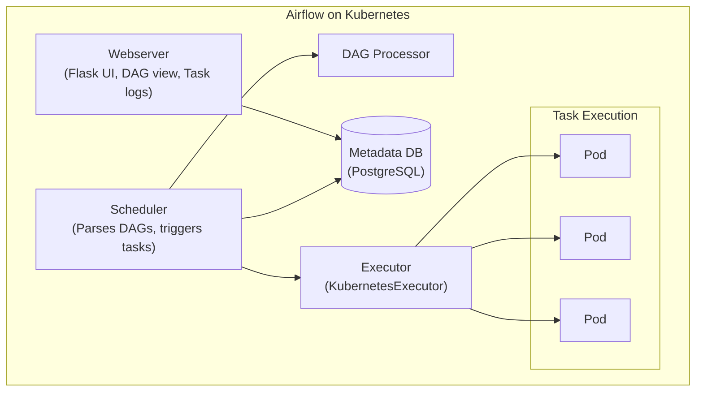
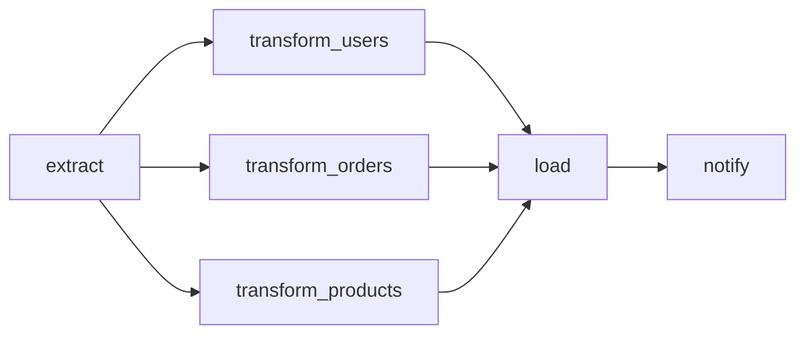

> **Discipline Module** | Complexity: `[MEDIUM]` | Time: 2.5 hours

## Prerequisites

Before starting this module:
- **Required**: Basic Python programming — Variables, functions, decorators, context managers
- **Required**: Kubernetes fundamentals — Pods, Deployments, Services, ConfigMaps, Secrets
- **Recommended**: [Module 1.4 — Batch Processing & Apache Spark on K8s](../module-1.4-spark/) — Understanding batch job execution
- **Recommended**: Familiarity with cron syntax and scheduling concepts

---

## What You'll Be Able to Do

After completing this module, you will be able to:

- **Implement Apache Airflow on Kubernetes using the KubernetesExecutor for scalable DAG execution**
- **Design Airflow deployment architectures with proper scheduler, webserver, and worker configurations**
- **Configure DAG dependency management and retry policies for reliable data pipeline orchestration**
- **Build monitoring and alerting for Airflow that catches DAG failures, SLA misses, and resource bottlenecks**

## Why This Module Matters

You have Kafka streaming events. Flink processing them in real time. Spark running batch transformations. Databases storing results. Dashboards visualizing insights.

Who coordinates all of this?

Without orchestration, your data platform is a collection of independent tools. Somebody has to ensure the Spark job runs after the data lands in S3. Somebody has to retry the failed transformation. Somebody has to alert the team when the pipeline is 3 hours late. Somebody has to make sure the downstream dashboard only refreshes after all upstream jobs succeed.

That somebody is Apache Airflow.

Airflow is the most widely adopted data orchestration platform in the world. It runs at Airbnb (where it was created), Google, Spotify, Slack, PayPal, and thousands of other organizations. It is not a data processing engine — it does not move or transform data itself. It **orchestrates** other tools to do that work, providing scheduling, dependency management, retries, alerting, and observability.

On Kubernetes, Airflow gains a superpower: the **KubernetesExecutor**. Instead of running tasks on a pool of permanent workers, each task runs in its own isolated Pod. Different tasks can use different Docker images, different resource limits, and different Python dependencies — all without conflicts.

This module teaches you to deploy Airflow on Kubernetes, write DAGs that orchestrate real workloads, and operate it in production.

---

## Did You Know?

- **Airflow was created at Airbnb in 2014 by Maxime Beauchemin**, who later also created Apache Superset (the visualization tool). He built Airflow because existing tools like Oozie and Luigi could not handle Airbnb's increasingly complex data pipelines.
- **The name "DAG" is not Airflow-specific.** A Directed Acyclic Graph is a mathematical concept used everywhere from Git (commit history) to build systems (Make) to spreadsheets (cell dependency). Airflow popularized the term in data engineering, but the concept is universal.
- **Airflow 2.0 was the most significant rewrite in the project's history.** Released in December 2020, it introduced the TaskFlow API, a stable REST API, independent task scheduling, and the High Availability scheduler. The codebase was almost entirely rewritten.

---

## Airflow Architecture

### The Four Components



**Webserver**: The Flask-based UI where you view DAGs, monitor task execution, check logs, manage variables and connections. Runs as a Deployment.

**Scheduler**: The brain of Airflow. It parses DAG files, determines which tasks are ready to run, and tells the executor to launch them. Supports HA with multiple replicas since Airflow 2.0.

**Metadata Database**: PostgreSQL (or MySQL) storing all state: DAG definitions, task instances, run history, variables, connections, XComs. This is the source of truth.

**Executor**: Determines HOW tasks run. The KubernetesExecutor creates a new Pod for each task, which is the recommended approach on Kubernetes.

### DAGs, Tasks, and Operators

A **DAG** (Directed Acyclic Graph) defines the workflow: what tasks to run and in what order.



A **Task** is a single unit of work within a DAG. It could be running a SQL query, executing a Python function, triggering a Spark job, or calling an API.

An **Operator** defines what a task does:

| Operator | Purpose | Example |
|----------|---------|---------|
| `PythonOperator` | Run a Python function | Data validation |
| `BashOperator` | Run a shell command | File processing |
| `KubernetesPodOperator` | Run a task in a dedicated Pod | ML training |
| `SparkKubernetesOperator` | Submit a Spark job | Batch ETL |
| `PostgresOperator` | Execute SQL | Data warehousing |
| `S3ToGCSOperator` | Move data between clouds | Migration |
| `SlackWebhookOperator` | Send notifications | Alerting |

### KubernetesExecutor vs CeleryExecutor vs KubernetesPodOperator

This is the most confusing part of Airflow on Kubernetes. Let me clear it up:

| Feature | KubernetesExecutor | CeleryExecutor |
|---------|--------------------|----------------|
| **Workers** | Ephemeral Pods | Long-running worker Pods |
| **Isolation** | Per-task Pod | Shared worker process |
| **Startup time** | 5-30 seconds | Instant (worker running) |
| **Resource use** | Pay per task | Always-on workers |
| **Dependencies** | Per-task image | Shared worker image |
| **Scaling** | Infinite (K8s) | Fixed pool (+ autoscaler) |
| **Best for** | Varied workloads | Homogeneous, fast tasks |

> **Stop and think**: If your Airflow tasks have wildly different resource requirements—like a lightweight API caller and a heavy machine learning training job—how does the KubernetesExecutor's model provide an advantage over the CeleryExecutor?

**KubernetesPodOperator** is different from the KubernetesExecutor. It is a specific operator that runs a task inside a custom Pod, regardless of which executor you use. You can use it with CeleryExecutor to run specific heavy tasks in isolated Pods while other tasks run on Celery workers.

**Recommendation**: Start with KubernetesExecutor. Switch to CeleryExecutor only if Pod startup latency is unacceptable for your use case (sub-second task scheduling).

---

## Deploying Airflow on Kubernetes with Helm

### The Official Helm Chart

```bash
# Add the Apache Airflow Helm repository
helm repo add apache-airflow https://airflow.apache.org
helm repo update

# Create the namespace
kubectl create namespace airflow
```

### Production-Ready Values

```yaml
# airflow-values.yaml
# Core settings
airflowVersion: "2.10.4"
defaultAirflowRepository: apache/airflow
defaultAirflowTag: "2.10.4"

# Use KubernetesExecutor
executor: KubernetesExecutor

# Webserver
webserver:
  replicas: 2
  resources:
    requests:
      cpu: 500m
      memory: 1Gi
    limits:
      memory: 2Gi
  service:
    type: ClusterIP
  defaultUser:
    enabled: true
    username: admin
    password: changeme         # Use a Secret in production
    role: Admin
    email: admin@example.com

# Scheduler (HA with multiple replicas)
scheduler:
  replicas: 2
  resources:
    requests:
      cpu: 500m
      memory: 1Gi
    limits:
      memory: 2Gi

# Triggerer (for deferrable operators)
triggerer:
  replicas: 1
  resources:
    requests:
      cpu: 250m
      memory: 512Mi
    limits:
      memory: 1Gi

# Metadata database
postgresql:
  enabled: true
  auth:
    postgresPassword: airflow
    database: airflow
  primary:
    persistence:
      size: 10Gi
      storageClass: standard

# DAG synchronization via Git
dags:
  gitSync:
    enabled: true
    repo: https://github.com/your-org/airflow-dags.git
    branch: main
    subPath: dags
    wait: 60                   # Sync every 60 seconds

# Logging
logs:
  persistence:
    enabled: true
    size: 10Gi
    storageClassName: standard

# KubernetesExecutor worker Pod template
workers:
  resources:
    requests:
      cpu: 250m
      memory: 512Mi
    limits:
      memory: 1Gi

# Environment variables
env:
  - name: AIRFLOW__CORE__LOAD_EXAMPLES
    value: "False"
  - name: AIRFLOW__CORE__DAGS_ARE_PAUSED_AT_CREATION
    value: "True"
  - name: AIRFLOW__WEBSERVER__EXPOSE_CONFIG
    value: "False"
  - name: AIRFLOW__CORE__DEFAULT_TIMEZONE
    value: "UTC"

# Extra ConfigMaps and Secrets
extraEnvFrom: |
  - secretRef:
      name: airflow-connections

# Enable PgBouncer for connection pooling
pgbouncer:
  enabled: true
  maxClientConn: 100
  metadataPoolSize: 10
  resultBackendPoolSize: 5
```

```bash
# Install Airflow
helm install airflow apache-airflow/airflow \
  --namespace airflow \
  --values airflow-values.yaml \
  --timeout 10m

# Wait for deployment
kubectl -n airflow wait --for=condition=Available deployment/airflow-webserver --timeout=300s

# Access the web UI
kubectl -n airflow port-forward svc/airflow-webserver 8080:8080 &
# Open http://localhost:8080 (admin / changeme)
```

---

## Writing DAGs

### The TaskFlow API (Modern Approach)

```python
# dags/sales_pipeline.py
from datetime import datetime, timedelta
from airflow.decorators import dag, task

default_args = {
    "owner": "data-engineering",
    "retries": 3,
    "retry_delay": timedelta(minutes=5),
    "retry_exponential_backoff": True,
    "max_retry_delay": timedelta(minutes=30),
    "email_on_failure": True,
    "email": ["data-team@example.com"],
}


@dag(
    dag_id="sales_pipeline",
    description="Daily sales data pipeline: extract, transform, load",
    schedule="0 6 * * *",       # Every day at 6 AM UTC
    start_date=datetime(2026, 1, 1),
    catchup=False,              # Don't backfill missed runs
    max_active_runs=1,          # Only one run at a time
    tags=["sales", "production"],
    default_args=default_args,
)
def sales_pipeline():

    @task()
    def extract_sales_data(**context):
        """Extract sales data from source systems."""
        execution_date = context["ds"]
        print(f"Extracting sales data for {execution_date}")

        # Simulate extraction
        import json
        records = [
            {"id": i, "amount": 100 + i * 10, "city": "NYC"}
            for i in range(1000)
        ]
        return json.dumps(records)

    @task()
    def validate_data(raw_data: str):
        """Validate extracted data quality."""
        import json
        records = json.loads(raw_data)
        total = len(records)
        valid = sum(1 for r in records if r["amount"] > 0)
        ratio = valid / total

        print(f"Validation: {valid}/{total} records valid ({ratio:.1%})")
        if ratio < 0.95:
            raise ValueError(f"Data quality below threshold: {ratio:.1%}")

        return raw_data

    @task()
    def transform_data(validated_data: str):
        """Apply business transformations."""
        import json
        records = json.loads(validated_data)

        # Add computed fields
        for record in records:
            record["revenue_category"] = (
                "high" if record["amount"] > 500
                else "medium" if record["amount"] > 100
                else "low"
            )

        print(f"Transformed {len(records)} records")
        return json.dumps(records)

    @task()
    def load_to_warehouse(transformed_data: str):
        """Load transformed data into the data warehouse."""
        import json
        records = json.loads(transformed_data)
        print(f"Loading {len(records)} records to warehouse")
        # In production: write to PostgreSQL, BigQuery, Redshift, etc.
        return len(records)

    @task()
    def send_notification(record_count: int, **context):
        """Send Slack notification on pipeline completion."""
        execution_date = context["ds"]
        message = (
            f"Sales pipeline completed for {execution_date}. "
            f"Processed {record_count} records."
        )
        print(f"Notification: {message}")
        # In production: use SlackWebhookOperator or HTTP hook

    # Define the DAG flow
    raw = extract_sales_data()
    validated = validate_data(raw)
    transformed = transform_data(validated)
    count = load_to_warehouse(transformed)
    send_notification(count)


sales_pipeline()
```

### Using KubernetesPodOperator for Heavy Tasks

When a task needs a different Docker image, specific resources, or complete isolation:

```python
# dags/ml_training_pipeline.py
from datetime import datetime, timedelta
from airflow import DAG
from airflow.providers.cncf.kubernetes.operators.pod import KubernetesPodOperator
from airflow.operators.python import PythonOperator
from kubernetes.client import models as k8s

default_args = {
    "owner": "ml-engineering",
    "retries": 2,
    "retry_delay": timedelta(minutes=10),
}

with DAG(
    dag_id="ml_training_pipeline",
    description="Train ML model using Spark for feature prep and custom image for training",
    schedule="0 2 * * 0",        # Weekly on Sunday at 2 AM
    start_date=datetime(2026, 1, 1),
    catchup=False,
    max_active_runs=1,
    tags=["ml", "training"],
    default_args=default_args,
) as dag:

    # Task 1: Feature preparation using PySpark
    prepare_features = KubernetesPodOperator(
        task_id="prepare_features",
        name="feature-prep",
        namespace="airflow",
        image="my-registry.io/spark-feature-prep:v2.0.0",
        cmds=["python", "/app/prepare_features.py"],
        arguments=["--date", "{{ ds }}", "--output", "s3://ml-data/features/"],
        resources=k8s.V1ResourceRequirements(
            requests={"cpu": "2", "memory": "4Gi"},
            limits={"memory": "8Gi"},
        ),
        env_vars={
            "SPARK_MASTER": "k8s://https://kubernetes.default.svc",
            "AWS_REGION": "us-east-1",
        },
        env_from=[
            k8s.V1EnvFromSource(
                secret_ref=k8s.V1SecretEnvSource(name="aws-credentials")
            )
        ],
        is_delete_operator_pod=True,
        get_logs=True,
        startup_timeout_seconds=300,
    )

    # Task 2: Model training using GPU
    train_model = KubernetesPodOperator(
        task_id="train_model",
        name="model-training",
        namespace="airflow",
        image="my-registry.io/ml-trainer:v3.1.0",
        cmds=["python", "/app/train.py"],
        arguments=[
            "--features", "s3://ml-data/features/{{ ds }}/",
            "--model-output", "s3://ml-models/{{ ds }}/",
            "--epochs", "50",
        ],
        resources=k8s.V1ResourceRequirements(
            requests={"cpu": "4", "memory": "16Gi", "nvidia.com/gpu": "1"},
            limits={"memory": "16Gi", "nvidia.com/gpu": "1"},
        ),
        node_selector={"accelerator": "nvidia-tesla-t4"},
        tolerations=[
            k8s.V1Toleration(
                key="nvidia.com/gpu",
                operator="Exists",
                effect="NoSchedule",
            )
        ],
        is_delete_operator_pod=True,
        get_logs=True,
        startup_timeout_seconds=600,
    )

    # Task 3: Model validation
    validate_model = KubernetesPodOperator(
        task_id="validate_model",
        name="model-validation",
        namespace="airflow",
        image="my-registry.io/ml-validator:v1.5.0",
        cmds=["python", "/app/validate.py"],
        arguments=[
            "--model", "s3://ml-models/{{ ds }}/",
            "--test-data", "s3://ml-data/test/",
            "--threshold", "0.85",
        ],
        resources=k8s.V1ResourceRequirements(
            requests={"cpu": "2", "memory": "4Gi"},
            limits={"memory": "4Gi"},
        ),
        is_delete_operator_pod=True,
        get_logs=True,
    )

    # Task 4: Send Slack notification
    def notify_completion(**context):
        ti = context["task_instance"]
        dag_run = context["dag_run"]
        message = (
            f"ML Training Pipeline completed.\n"
            f"Run: {dag_run.run_id}\n"
            f"Date: {context['ds']}\n"
        )
        print(message)

    notify = PythonOperator(
        task_id="notify_completion",
        python_callable=notify_completion,
    )

    prepare_features >> train_model >> validate_model >> notify
```

---

## Monitoring DAGs

### The Airflow UI

The Airflow web UI provides comprehensive monitoring:

| View | What It Shows | When To Use |
|------|-------------|------------|
| **DAGs list** | All DAGs with status, schedule, last run | Daily overview |
| **Grid view** | Historical task status in a grid layout | Spot patterns (recurring failures) |
| **Graph view** | DAG structure with task states | Debug dependencies |
| **Gantt view** | Task execution timeline | Identify bottlenecks and parallelism |
| **Task logs** | Stdout/stderr from each task | Debug failures |
| **Landing times** | Time between scheduled and actual execution | Detect growing delays |

### Airflow Metrics with Prometheus

```yaml
# In airflow-values.yaml
config:
  metrics:
    statsd_on: true
    statsd_host: statsd-exporter
    statsd_port: 9125
    statsd_prefix: airflow

# Deploy StatsD exporter
extraObjects:
  - apiVersion: apps/v1
    kind: Deployment
    metadata:
      name: statsd-exporter
      namespace: airflow
    spec:
      replicas: 1
      selector:
        matchLabels:
          app: statsd-exporter
      template:
        metadata:
          labels:
            app: statsd-exporter
          annotations:
            prometheus.io/scrape: "true"
            prometheus.io/port: "9102"
        spec:
          containers:
            - name: statsd-exporter
              image: prom/statsd-exporter:v0.27.2
              ports:
                - containerPort: 9125
                  protocol: UDP
                - containerPort: 9102
              resources:
                requests:
                  cpu: 100m
                  memory: 128Mi
```

**Key metrics to monitor:**

| Metric | Alert Threshold | Meaning |
|--------|----------------|---------|
| `airflow_scheduler_heartbeat` | Missing for > 30s | Scheduler is down |
| `airflow_dag_processing_total_parse_time` | > 30s | DAG parsing is too slow |
| `airflow_pool_open_slots` | 0 for > 5 min | All task slots are full |
| `airflow_dagrun_duration_success` | 2x normal duration | Pipeline is slower than usual |
| `airflow_ti_failures` | > 3 per hour | Tasks are failing frequently |
| `airflow_zombie_killed` | > 0 | Tasks are becoming zombies (bad) |

---

## Retry Strategies and Error Handling

### Configuring Retries

```python
default_args = {
    # Retry up to 3 times
    "retries": 3,

    # Wait 5 minutes before first retry
    "retry_delay": timedelta(minutes=5),

    # Exponential backoff: 5 min, 10 min, 20 min
    "retry_exponential_backoff": True,

    # Cap maximum retry delay at 1 hour
    "max_retry_delay": timedelta(hours=1),

    # Timeout the task after 2 hours
    "execution_timeout": timedelta(hours=2),

    # Send email on failure (after all retries exhausted)
    "email_on_failure": True,
    "email_on_retry": False,
}
```

### SLA Monitoring

```python
@dag(
    dag_id="critical_pipeline",
    schedule="0 */2 * * *",  # Every 2 hours
    sla_miss_callback=sla_alert,
    default_args=default_args,
)
def critical_pipeline():

    @task(sla=timedelta(minutes=30))
    def time_sensitive_task():
        """This task must complete within 30 minutes."""
        # If it takes longer, the sla_miss_callback fires
        pass
```

> **Pause and predict**: By default, Airflow tasks use the `ALL_SUCCESS` trigger rule. If a data validation task fails, what state will the downstream reporting task enter? Does it fail or does it get skipped?

### Handling Upstream Failures with Trigger Rules

```python
from airflow.utils.trigger_rule import TriggerRule

@task(trigger_rule=TriggerRule.ALL_SUCCESS)
def proceed_if_all_pass():
    """Default: runs only if all upstream tasks succeeded."""
    pass

@task(trigger_rule=TriggerRule.ONE_SUCCESS)
def proceed_if_any_pass():
    """Runs if at least one upstream task succeeded."""
    pass

@task(trigger_rule=TriggerRule.ALL_DONE)
def cleanup_always():
    """Runs regardless of upstream success/failure. Good for cleanup."""
    pass

@task(trigger_rule=TriggerRule.ALL_FAILED)
def alert_on_total_failure():
    """Runs only if ALL upstream tasks failed."""
    pass
```

---

## Common Mistakes

| Mistake | Why It Happens | What To Do Instead |
|---------|---------------|-------------------|
| Putting heavy logic directly in DAG files | Treating DAGs like scripts | DAG files should define structure. Put logic in separate modules, or use KubernetesPodOperator for heavy work |
| Using `catchup=True` without understanding it | Default behavior | Airflow will run ALL missed DAG runs since `start_date`. Set `catchup=False` unless you explicitly need backfilling |
| Not setting `max_active_runs` | Seems unnecessary | Without it, multiple runs of the same DAG execute simultaneously, causing resource contention and data corruption |
| Hardcoding dates instead of using Jinja templates | Quick and easy | Use `{{ ds }}`, `{{ ds_nodash }}`, `{{ execution_date }}` for date-aware pipelines that support backfilling |
| Making DAGs that are hard to parse | Complex Python at top level | Keep DAG files simple. Avoid heavy imports, API calls, or database queries at module level — the scheduler parses DAGs every 30 seconds |
| Running the scheduler with 1 replica | Works for development | Run 2+ scheduler replicas in production for HA. If the single scheduler dies, nothing gets scheduled |
| Not using PgBouncer | "PostgreSQL handles connections fine" | Each task Pod opens its own database connection. With 50 concurrent tasks, that is 50 connections — PgBouncer pools them efficiently |
| Ignoring XCom size limits | Passing large datasets between tasks | XComs are stored in the metadata DB. Pass file paths (S3 URIs) instead of actual data. Max recommended XCom size: 48 KB |
| Using CeleryExecutor when KubernetesExecutor is sufficient | Following outdated guides | KubernetesExecutor is simpler to operate and provides better isolation. Use Celery only when sub-second task startup is required |

---

## Quiz

**Question 1:** You are designing a pipeline where one task requires a specific legacy Python 2.7 environment, while the rest of the pipeline uses Python 3.11. A colleague suggests using `KubernetesExecutor` to solve this, but another suggests `KubernetesPodOperator`. Which should you choose and why?

<details>
<summary>Show Answer</summary>

**KubernetesPodOperator** is the correct choice for this specific task. The operator allows you to specify a custom container image (like Python 2.7) for a single task, isolating its environment completely from the rest of the Airflow workers. While `KubernetesExecutor` does launch a Pod for every task, it uses the default Airflow worker image unless configured otherwise, which would not contain the legacy dependencies. By using the `KubernetesPodOperator`, you maintain the modern Python 3.11 environment for your standard tasks while spinning up a specialized, isolated Pod solely for the legacy requirement. This prevents dependency conflicts and keeps the core Airflow image lightweight.
</details>

**Question 2:** Your team just added 50 new DAGs to the repository. Suddenly, the scheduler CPU usage spikes to 100%, and tasks are taking 5 minutes to get scheduled. Upon inspection, you notice the DAG files contain SQLAlchemy queries at the top level to fetch dynamic configurations. Why is this causing scheduler degradation?

<details>
<summary>Show Answer</summary>

Top-level code in DAG files is executed every time the scheduler parses the file, which defaults to every 30 seconds. Because the SQLAlchemy queries were placed at the module level (outside of task definitions), the scheduler executes these queries sequentially across all 50 new files during every parsing loop. This constant database polling consumes massive amounts of scheduler CPU and blocks the parsing process, causing a massive delay in task scheduling. To fix this, the queries must be moved inside the execution context of the tasks themselves. This ensures they only run when the specific task is triggered, rather than during the scheduler's continuous DAG discovery phase.
</details>

**Question 3:** You deploy a new DAG to production on Friday afternoon with a `start_date` set to 6 months ago and a daily schedule. Within minutes, the Kubernetes cluster auto-scales to its maximum node limit and the database connections are exhausted. What configuration caused this incident, and how do you prevent it?

<details>
<summary>Show Answer</summary>

The incident was caused by deploying the DAG with `catchup=True` (which is the default behavior in Airflow). When a DAG is enabled with `catchup`, the Airflow scheduler immediately attempts to execute all missed DAG runs between the `start_date` (6 months ago) and the current date. This resulted in roughly 180 concurrent DAG runs being triggered simultaneously, which exhausted the cluster's resources and overwhelmed the metadata database. To prevent this, you must explicitly set `catchup=False` in your DAG arguments. This instructs the scheduler to ignore historical intervals and only schedule runs from the current date forward.
</details>

**Question 4:** A task in your DAG queries an external API that has a strict rate limit of 100 requests per minute. Occasionally, the API returns a 429 Too Many Requests error. The task is configured with 3 retries and a fixed 1-minute retry delay, but it still frequently fails completely. How should you modify the retry strategy to handle this API rate limiting?

<details>
<summary>Show Answer</summary>

You should implement an exponential backoff strategy by setting `retry_exponential_backoff=True` and increasing the `max_retry_delay`. A fixed 1-minute retry delay is problematic because if the API is overwhelmed, hitting it exactly 1 minute later repeatedly does not give the external service enough time to shed its load or reset the rate limit bucket. Exponential backoff progressively increases the wait time between each retry (e.g., 1 minute, 2 minutes, 4 minutes), giving the rate limit a realistic window to reset. This approach is fundamental in distributed systems for handling transient errors effectively. It prevents your pipeline from contributing to a "thundering herd" problem against the external API while increasing the ultimate chance of task success.
</details>

**Question 5:** Your pipeline processes 10GB CSV files. A junior developer writes a task that reads the file into a Pandas DataFrame, serializes it to JSON, and returns it so the next task can pull it via XCom. The Airflow metadata database crashes shortly after the DAG runs. Why did this architectural choice cause an outage?

<details>
<summary>Show Answer</summary>

This architectural choice caused an outage because XComs are stored directly in the Airflow metadata database (PostgreSQL or MySQL). When the task serialized the 10GB dataset into an XCom, it attempted to write a massive payload into a single database row. This saturated the database's memory, exhausted connection limits, and severely bloated the underlying storage volume. XComs are exclusively designed for passing small metadata—like a status string, a count, or a file path—with a strongly recommended limit of 48 KB. To fix this architecture, the first task should write the 10GB CSV to a persistent object store (like an S3 bucket) and only return the file's URI via XCom for the downstream task to pull.
</details>

---

## Hands-On Exercise: Airflow with KubernetesExecutor + DAG Triggering a Task

### Objective

Deploy Airflow on Kubernetes using the official Helm chart with KubernetesExecutor, create a DAG that processes data and sends a notification, and observe task execution as isolated Pods.

### Environment Setup

```bash
# Create the kind cluster
kind create cluster --name airflow-lab

# Create namespace
kubectl create namespace airflow
```

### Step 1: Install Airflow via Helm

```yaml
# airflow-lab-values.yaml
executor: KubernetesExecutor

webserver:
  replicas: 1
  resources:
    requests:
      cpu: 250m
      memory: 512Mi
    limits:
      memory: 1Gi
  defaultUser:
    enabled: true
    username: admin
    password: admin123
    role: Admin

scheduler:
  replicas: 1
  resources:
    requests:
      cpu: 250m
      memory: 512Mi
    limits:
      memory: 1Gi

triggerer:
  enabled: false

postgresql:
  enabled: true
  auth:
    postgresPassword: airflow
  primary:
    persistence:
      size: 2Gi

pgbouncer:
  enabled: false

logs:
  persistence:
    enabled: false

dags:
  persistence:
    enabled: true
    size: 1Gi
    accessMode: ReadWriteOnce

config:
  core:
    load_examples: "False"
    dags_are_paused_at_creation: "False"
  kubernetes_executor:
    delete_worker_pods: "True"
    delete_worker_pods_on_failure: "False"
```

```bash
helm repo add apache-airflow https://airflow.apache.org
helm repo update

helm install airflow apache-airflow/airflow \
  --namespace airflow \
  --values airflow-lab-values.yaml \
  --timeout 10m

kubectl -n airflow wait --for=condition=Available \
  deployment/airflow-webserver --timeout=300s
```

### Step 2: Create a DAG

```bash
# Copy a DAG file into the DAGs PVC
# First, find the DAGs PVC
kubectl -n airflow get pvc

# Create a DAG file via a temporary Pod
kubectl -n airflow run dag-loader --rm -it --restart=Never \
  --image=busybox:1.37 \
  --overrides='{
    "spec": {
      "containers": [{
        "name": "dag-loader",
        "image": "busybox:1.37",
        "command": ["sh", "-c", "cat > /opt/airflow/dags/data_pipeline.py << '\''DAGEOF'\''\nfrom datetime import datetime, timedelta\nfrom airflow.decorators import dag, task\n\n\n@dag(\n    dag_id=\"data_pipeline_lab\",\n    description=\"Lab exercise: data pipeline with notifications\",\n    schedule=None,\n    start_date=datetime(2026, 1, 1),\n    catchup=False,\n    tags=[\"lab\", \"data-engineering\"],\n    default_args={\"retries\": 1, \"retry_delay\": timedelta(minutes=1)},\n)\ndef data_pipeline_lab():\n\n    @task()\n    def generate_data():\n        import json\n        import random\n        random.seed(42)\n        records = [\n            {\"id\": i, \"value\": round(random.uniform(10, 1000), 2), \"category\": random.choice([\"A\", \"B\", \"C\"])}\n            for i in range(500)\n        ]\n        print(f\"Generated {len(records)} records\")\n        return json.dumps(records)\n\n    @task()\n    def validate(raw: str):\n        import json\n        records = json.loads(raw)\n        valid = [r for r in records if r[\"value\"] > 0]\n        print(f\"Validation: {len(valid)}/{len(records)} records valid\")\n        return json.dumps(valid)\n\n    @task()\n    def aggregate(validated: str):\n        import json\n        records = json.loads(validated)\n        from collections import defaultdict\n        totals = defaultdict(float)\n        counts = defaultdict(int)\n        for r in records:\n            totals[r[\"category\"]] += r[\"value\"]\n            counts[r[\"category\"]] += 1\n        result = {cat: {\"total\": round(totals[cat], 2), \"count\": counts[cat], \"avg\": round(totals[cat]/counts[cat], 2)} for cat in totals}\n        print(f\"Aggregation results: {json.dumps(result, indent=2)}\")\n        return json.dumps(result)\n\n    @task()\n    def notify(results: str):\n        import json\n        data = json.loads(results)\n        print(\"=\" * 50)\n        print(\"PIPELINE COMPLETE - NOTIFICATION\")\n        print(\"=\" * 50)\n        for cat, stats in data.items():\n            print(f\"  Category {cat}: {stats['count']} records, total=${stats['total']:.2f}, avg=${stats['avg']:.2f}\")\n        print(\"=\" * 50)\n        print(\"Notification sent successfully!\")\n\n    raw = generate_data()\n    validated = validate(raw)\n    aggregated = aggregate(validated)\n    notify(aggregated)\n\n\ndata_pipeline_lab()\nDAGEOF\necho DAG written successfully"],
        "volumeMounts": [{"name": "dags", "mountPath": "/opt/airflow/dags"}]
      }],
      "volumes": [{"name": "dags", "persistentVolumeClaim": {"claimName": "airflow-dags"}}]
    }
  }'
```

### Step 3: Access the UI and Trigger the DAG

```bash
# Port-forward to the Airflow web UI
kubectl -n airflow port-forward svc/airflow-webserver 8080:8080 &

# Open http://localhost:8080 in your browser
# Login: admin / admin123
# You should see "data_pipeline_lab" in the DAG list
# Click on it, then click "Trigger DAG" (play button)
```

### Step 4: Watch Task Pods

```bash
# In a separate terminal, watch Pods being created for each task
kubectl -n airflow get pods -w

# You should see Pods like:
# data-pipeline-lab-generate-data-xxxxx   (runs, completes)
# data-pipeline-lab-validate-xxxxx        (runs, completes)
# data-pipeline-lab-aggregate-xxxxx       (runs, completes)
# data-pipeline-lab-notify-xxxxx          (runs, completes)
```

### Step 5: Check Task Logs

```bash
# View logs from the notification task (or any task)
# In the Airflow UI: click on DAG → click on task → click "Log"
# Or via kubectl:
kubectl -n airflow logs -l dag_id=data_pipeline_lab --tail=50
```

### Step 6: Clean Up

```bash
kill %1  # Stop port-forward
helm -n airflow uninstall airflow
kubectl delete namespace airflow
kind delete cluster --name airflow-lab
```

### Success Criteria

You have completed this exercise when you:
- [ ] Deployed Airflow on Kubernetes with KubernetesExecutor via Helm
- [ ] Created a DAG with 4 tasks (generate, validate, aggregate, notify)
- [ ] Triggered the DAG from the Airflow web UI
- [ ] Observed individual task Pods being created and completed
- [ ] Verified task outputs in the logs (aggregation results, notification message)

---

## Key Takeaways

1. **Airflow orchestrates, it does not process** — Airflow schedules and monitors other tools (Spark, Flink, dbt). Keep logic out of DAG files.
2. **KubernetesExecutor gives each task its own Pod** — Complete isolation, per-task resource allocation, and different Docker images per task.
3. **DAG files must be lightweight** — The scheduler parses them every 30 seconds. Heavy imports or computations at module level slow down the entire system.
4. **Retries with exponential backoff are essential** — Transient failures are normal in distributed systems. Give failing services time to recover.
5. **Monitor your Airflow installation, not just your DAGs** — Scheduler heartbeat, parse time, pool utilization, and zombie tasks are as important as individual DAG success rates.

---

## Further Reading

**Books:**
- **"Data Pipelines with Apache Airflow"** — Bas Harenslak, Julian de Ruiter (Manning)
- **"Apache Airflow Best Practices"** — Astronomer.io documentation (free)

**Articles:**
- **"Airflow on Kubernetes"** — Apache Airflow documentation (airflow.apache.org/docs/helm-chart/)
- **"KubernetesExecutor Architecture"** — Apache Airflow docs (airflow.apache.org/docs/apache-airflow/stable/core-concepts/executor/kubernetes.html)

**Talks:**
- **"How to Use Apache Airflow on Kubernetes"** — Marc Lamberti, Airflow Summit 2024 (YouTube)
- **"Apache Airflow 2.x: The Full Story"** — Astronomer.io webinar series (YouTube)

---

## Summary

Apache Airflow is the glue that holds a data platform together. It does not move data or train models — it ensures the right tool runs at the right time with the right inputs, retries on failure, and alerts the team when something goes wrong.

On Kubernetes, the KubernetesExecutor transforms Airflow from a monolithic system with permanent workers into a cloud-native platform where every task gets its own isolated, ephemeral Pod. This eliminates dependency conflicts, enables per-task resource tuning, and integrates naturally with the Kubernetes ecosystem.

The most important lesson: keep your DAGs simple, your tasks idempotent, and your data references in XComs (not data itself).

---

## Next Module

Continue to [Module 1.6: Building a Data Lakehouse on Kubernetes](../module-1.6-lakehouse/) to learn how to combine the best of data lakes and data warehouses into a unified architecture on Kubernetes.

---

*"Airflow is not a data processing framework. It is a platform for programmatically authoring, scheduling, and monitoring workflows."* — Apache Airflow documentation
---