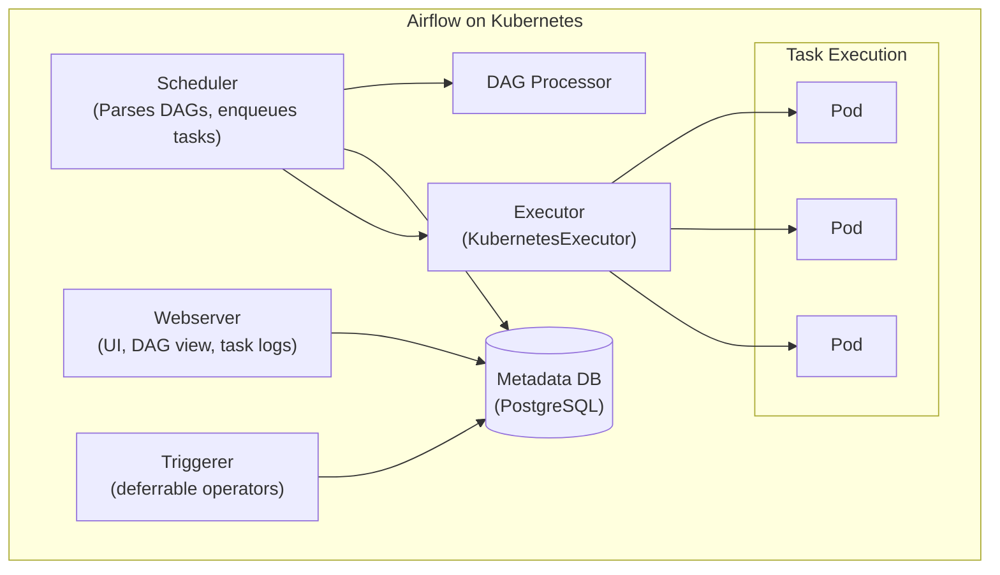
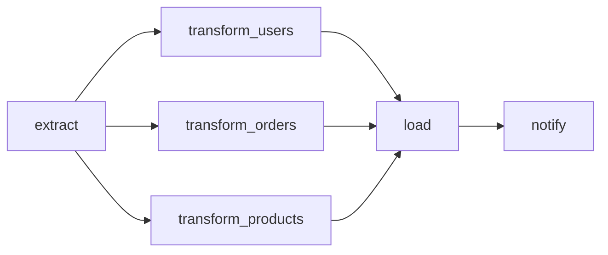
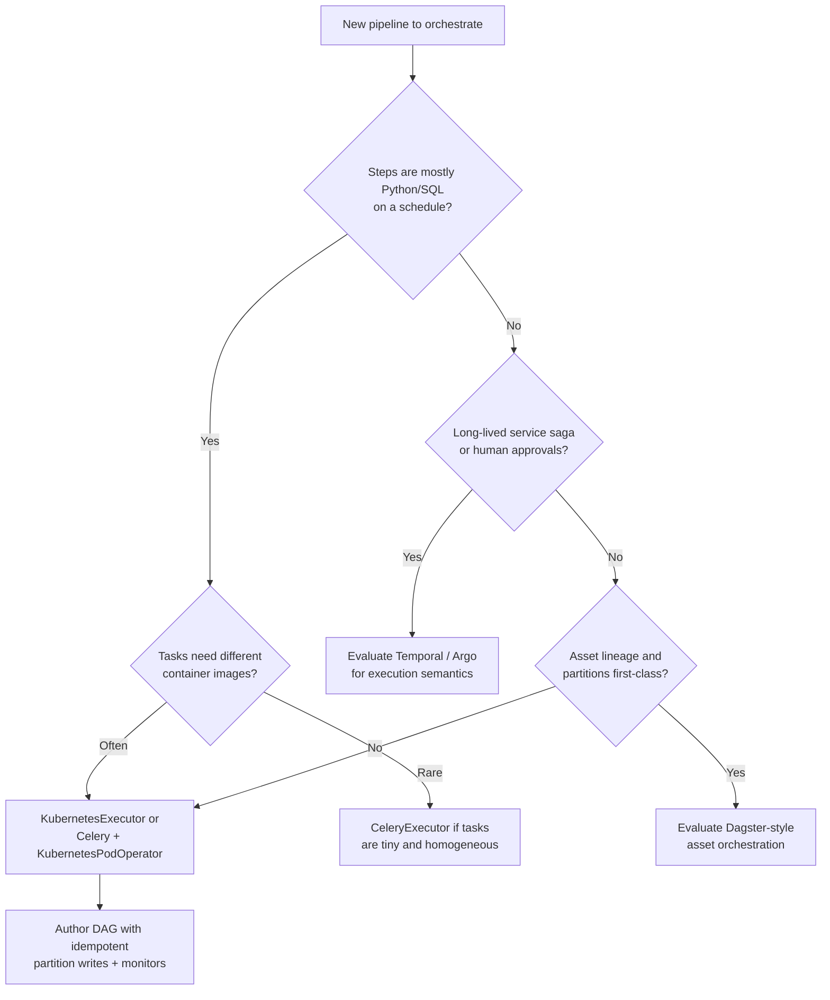

> **Discipline Module** | Complexity: `[MEDIUM]` | Time: 2.5 hours

## Prerequisites

Before starting this module:
- **Required**: Basic Python programming — Variables, functions, decorators, context managers
- **Required**: Kubernetes fundamentals — Pods, Deployments, Services, ConfigMaps, Secrets
- **Recommended**: [Module 1.4 — Batch Processing & Apache Spark on K8s](../module-1.4-spark/) — Understanding batch job execution
- **Recommended**: Familiarity with cron syntax and scheduling concepts

---

## What You'll Be Able to Do

After completing this module, you will be able to:

- **Implement Apache Airflow on Kubernetes using the KubernetesExecutor for scalable DAG execution**
- **Design Airflow deployment architectures with proper scheduler, webserver, and worker configurations**
- **Configure DAG dependency management and retry policies for reliable data pipeline orchestration**
- **Build monitoring and alerting for Airflow that catches DAG failures, SLA misses, and resource bottlenecks**

## Why This Module Matters

You have Kafka streaming events. Flink processing them in real time. Spark running batch transformations. Databases storing results. Dashboards visualizing insights.

Who coordinates all of this?

Without orchestration, your data platform is a collection of independent tools connected by cron jobs, shell scripts, and institutional memory. Somebody has to ensure the Spark job runs after the data lands in object storage. Somebody has to retry the failed transformation. Somebody has to alert the team when the pipeline is three hours late. Somebody has to make sure the downstream dashboard only refreshes after all upstream jobs succeed. When that coordination lives in scattered scripts, failures become silent, dependencies become implicit, and on-call engineers spend nights untangling which job was supposed to run first.

That coordination layer is what an orchestrator provides. Apache Airflow is a mature open-source orchestrator that expresses pipelines as Python-defined DAGs, tracks execution state in a metadata database, and exposes a web UI for operators. Airflow is not a data processing engine — it does not move or transform data itself. It **orchestrates** other tools to do that work, providing scheduling, dependency management, retries, alerting, and observability over the jobs that actually touch your data.

On Kubernetes, Airflow gains a practical superpower: the **KubernetesExecutor**. Instead of running tasks on a pool of permanent workers with a shared Python environment, each task can run in its own isolated Pod. Different tasks can use different container images, different resource limits, and different dependency stacks — all without conflicts. That model aligns with how Kubernetes already runs Spark drivers, Flink job managers, and one-off batch Jobs: ephemeral compute that appears when needed and disappears when finished.

> **Hypothetical scenario:** A platform team runs nightly ETL with Spark, hourly stream compaction with Flink, and a weekly ML retrain job that needs a GPU image. Without orchestration, three separate cron entries fire independently; when Spark finishes late, the dashboard refresh cron still runs and publishes stale numbers. With Airflow, a single DAG encodes the dependency graph, retries failed stages with backoff, and holds the notification task until upstream work is genuinely complete.

This module teaches the durable practice of pipeline orchestration — why DAGs beat script tangles, why tasks must be idempotent, how Airflow's control plane maps onto Kubernetes — and walks through deploying and operating Airflow on a cluster using patterns that survive tool version churn.

---

## What Orchestration Is (and What It Is Not)

Orchestration sits between **data processing** and **platform operations**. A stream processor consumes events and updates state. A batch engine shuffles terabytes and writes Parquet files. An orchestrator answers different questions: *when* should each job run, *what* must finish before the next step starts, *how* do we recover from transient failure, and *who* gets paged when an SLA is missed. Confusing orchestration with processing is a common architectural mistake — you do not implement a 50 GB join inside an Airflow task any more than you would implement TCP inside a cron entry. The orchestrator's job is to **invoke** the right workload with the right inputs and to **record** whether that invocation succeeded.

The durable primitive is the **DAG** (Directed Acyclic Graph): a set of tasks with dependency edges and no cycles. Edges encode logical prerequisites — load cannot start until extract and transform both finish. The scheduler walks this graph, marking tasks *runnable* when their upstream dependencies reach terminal success states (subject to trigger rules you configure). This is fundamentally different from a flat list of cron entries because dependencies are **explicit, versioned, and observable** in one place rather than implied by wall-clock timing.

Orchestration also owns **time semantics**. A daily sales pipeline does not mean "run at 6 AM"; it means "process the business day that ended at midnight, then run after that interval is complete." Airflow models this with **data intervals** attached to each DAG run. The `schedule` parameter (replacing the deprecated `schedule_interval` in modern Airflow versions) defines how those intervals are carved out of the timeline — via cron strings, `timedelta` cadences, timetables, or asset-driven triggers in newer releases. Understanding data intervals is what separates operators who can safely backfill March from operators who accidentally reprocess six months of history in one afternoon.

Finally, orchestration provides **operational surface area**: structured metadata for every run, centralized logs, SLA timers, pool limits, and APIs for external systems to trigger or wait on workflows. That surface is what makes a data platform operable at 3 AM by someone who was not in the design meeting.

Compare orchestration to the anti-pattern it replaces: a **cron plus script tangle**. Cron fires at wall-clock times with no memory of whether yesterday's job succeeded. Shell scripts chain commands with `&&` but leave no UI, no automatic retry policy, and no graph view when step seven of nine fails. Adding a second consumer that must wait for the first pipeline doubles the number of fragile timing guesses. Orchestration centralizes the graph, records every attempt, and turns implicit tribal knowledge into queryable state. The cost is operational complexity — you now run a metadata database, scheduler, and executor tier — but that complexity buys observability and safe retries at platform scale.

The boundary with **workflow engines** (Temporal, Cadence) is worth stating clearly. Those systems optimize for long-lived, stateful processes with signals, timers, and human tasks — think order fulfillment sagas. Airflow optimizes for **batch- and interval-shaped data work** with clear start and end per run. Many organizations run both: Airflow for nightly analytics DAGs, a workflow engine for microservice orchestration. Choosing wrong shows up as fighting the tool — modeling a six-month loan approval in Airflow sensors, or cramming hourly Spark ETL into hand-rolled workflow code.

---

## Airflow's Core Model: DAGs, Tasks, and the Control Plane

Airflow's architecture separates **definition** (Python DAG files), **planning** (scheduler + DAG processor), **execution** (executor), and **persistence** (metadata database). The DAG file is declarative structure; the metadata database is the source of truth for what actually ran.


```mermaid
graph TD
    subgraph "Airflow on Kubernetes"
        W["Webserver<br/>(UI, DAG view, task logs)"]
        S["Scheduler<br/>(Parses DAGs, enqueues tasks)"]
        DP["DAG Processor"]
        M[("Metadata DB<br/>(PostgreSQL)")]
        E["Executor<br/>(KubernetesExecutor)"]
        T["Triggerer<br/>(deferrable operators)"]
        
        S --> DP
        W --> M
        S --> M
        S --> E
        T --> M
        
        subgraph "Task Execution"
            P1["Pod"]
            P2["Pod"]
            P3["Pod"]
        end
        E --> P1
        E --> P2
        E --> P3
    end
```

The **webserver** exposes the UI where engineers inspect DAG runs, clear failed tasks, trigger backfills, and read task logs. In production you typically run multiple webserver replicas behind a Service for availability, understanding that the UI is an operational tool — not the scheduler itself.

The **scheduler** is the control-plane brain. On a loop, it parses DAG files (via the DAG processor in Airflow 2.x/3.x split architectures), creates DAG runs for due data intervals, and sets task instances to `scheduled` when dependencies are satisfied. It then hands runnable work to the executor. Scheduler HA — multiple scheduler replicas coordinating through the metadata database — matters because a dead scheduler means nothing new gets enqueued even if workers are idle.

The **metadata database** (PostgreSQL is the common choice; MySQL is supported) stores DAG serialization, DagRun rows, TaskInstance state, Variables, Connections, and XCom payloads. Every operational question — "did yesterday's load task succeed?" — resolves to a query against this database. That centrality is why connection pooling (PgBouncer is popular on Kubernetes) is not optional at scale: each task Pod can open its own DB connection during startup and teardown.

The **executor** determines *where* task processes run. On Kubernetes, the **KubernetesExecutor** asks the API server to create a Pod per task instance, passing command, image, and resource requirements drawn from executor configuration and optional per-task overrides. Completed Pods can be deleted automatically to reduce etcd noise.

The **triggerer** (introduced for deferrable operators) runs asyncio event loops that wait on external events without holding a worker slot — valuable for sensors that would otherwise occupy a worker while sleeping.

Understanding how these components interact during a single run clarifies failure modes. When a data interval becomes due, the scheduler creates a **DagRun** row and sets root tasks without upstream dependencies to `scheduled`. The executor picks up runnable TaskInstances, launches Pods (under KubernetesExecutor), and reports state transitions back to the metadata database. Downstream tasks remain `None` or `upstream_failed` until dependencies satisfy their trigger rules. If the scheduler stops heartbeating, queued work stalls even though old Pods may still finish — which is why monitoring scheduler health is as important as monitoring task failures. If PostgreSQL is slow, every state update backs up, creating the illusion that workers are idle while tasks are actually stuck in `queued`.

Airflow 3.x continues to evolve the control plane: an updated UI, refined REST APIs, and **event-driven scheduling** hooks that can react to external messages (for example cloud queue integrations) rather than only cron ticks. The durable lesson for platform engineers is to treat the scheduler and metadata tier as **tier-0 services** with the same HA discipline you apply to Kafka brokers or Kubernetes API availability.

### DAGs, Tasks, and Operators

A **DAG** defines workflow structure: task identities, dependencies, default arguments, schedule, and tags. It should stay lightweight because the scheduler re-parses DAG files frequently.


```mermaid
graph LR
    E[extract] --> T1[transform_users]
    E --> T2[transform_orders]
    E --> T3[transform_products]
    T1 --> L[load]
    T2 --> L
    T3 --> L
    L --> N[notify]
```

A **task** is one node in that graph — a single unit of work bound to a runtime attempt (a TaskInstance for a specific DAG run). An **operator** is the template that defines what kind of work the task performs: Python callable, Bash command, Kubernetes Pod, Spark submission, SQL statement, or notification hook. Providers packages ship dozens of operators; your platform team standardizes on a curated subset to keep DAGs reviewable.

| Operator | Purpose | Example |
|----------|---------|---------|
| `PythonOperator` / `@task` | Run a Python callable | Data validation |
| `BashOperator` | Run a shell command | Invoke CLI tool |
| `KubernetesPodOperator` | Run a task in a dedicated Pod | ML training image |
| `SparkKubernetesOperator` | Submit a Spark application | Batch ETL |
| `PostgresOperator` | Execute SQL | Warehouse load |
| `SlackWebhookOperator` | Send notifications | Failure alert |

> **Stop and think**: If your Airflow tasks have wildly different resource requirements — a lightweight API caller and a heavy GPU training job — how does running each task in its own Pod change your capacity planning compared with a shared worker pool?

---

## Scheduling, Data Intervals, Catchup, and Backfill

Modern Airflow DAGs use the `schedule` parameter. Cron strings (`0 6 * * *`), preset aliases (`@daily`), `timedelta` objects, timetables, and asset schedules all compile to scheduling decisions under the hood. The old `schedule_interval` argument still appears in legacy DAGs but is deprecated — new code should use `schedule` exclusively.

Each scheduled DAG run carries a **data interval**: the window of data the run is responsible for. A `@daily` DAG triggered after midnight processes the previous calendar day. Template variables like `{{ ds }}` (date string) and `{{ data_interval_start }}` let tasks parameterize object-storage paths and SQL predicates without hardcoding wall-clock timestamps. This is what makes backfills meaningful — re-running March 2026 means re-running the same logic against March intervals, not "running the DAG three hundred times with today's date."

**Catchup** controls whether the scheduler creates DAG runs for intervals that were missed while a DAG was paused or not yet deployed. In current Airflow defaults, catchup is off unless you opt in (`catchup=True` on the DAG or `scheduler.catchup_by_default=True` in configuration). That default prevents the classic Friday-afternoon incident where enabling a DAG with an old `start_date` instantly materializes hundreds of concurrent runs. When you genuinely need historical reprocessing, use an explicit **backfill** (`airflow backfill create` or the UI backfill form) with `max_active_runs` throttled so you do not overwhelm executors or downstream systems.

**`max_active_runs`** limits how many concurrent DAG runs of the same DAG may execute. Pipelines that write to the same partition without merge semantics should almost always set `max_active_runs=1` so two runs cannot clobber each other's outputs. **`depends_on_past`** (when true) prevents a task instance from running until the same task succeeded in the previous interval — useful for incremental pipelines that assume prior state exists.

Airflow 3.x refined scheduling further: cron schedules default to `CronTriggerTimetable` rather than `CronDataIntervalTimetable`, and logical-date semantics shifted relative to Airflow 2.x. The durable lesson is unchanged: **read the scheduling docs for your installed major version** before interpreting `logical_date`, `run_id`, or data-interval boundaries in production DAGs.

**Timetables** deserve a sentence because they explain why two DAGs with `schedule="0 6 * * *"` can behave differently. A timetable class decides how to generate data intervals and when to enqueue the next run. `CronDataIntervalTimetable` aligns intervals to calendar boundaries (midnight-to-midnight for daily). `CronTriggerTimetable` fires at the cron moment and uses a different interval semantics — important when migrating majors. Custom timetables encode business calendars (skip holidays, fiscal weeks). If your organization argues about "why did this run at 6:01 instead of 6:00," the answer is usually in the timetable class, not in Kubernetes latency.

**Asset- and dataset-driven scheduling** (where supported in your Airflow version) flips the trigger: downstream DAGs start when upstream datasets update rather than when a clock ticks. That models real data dependencies more faithfully than `ExternalTaskSensor` chains that poll every few minutes. Whether you adopt asset schedules or classic sensors, the design goal is the same — **downstream work starts because upstream data is ready**, not because a cron guess aligned on average.

---

## Idempotency and Deterministic Tasks

Retries are not a bug-handling luxury in orchestration — they are an assumption. Networks stall, APIs return 503, nodes drain, and Pods OOMKill. Airflow will re-attempt failed tasks according to `retries`, `retry_delay`, and optional exponential backoff. Therefore every task must be **idempotent**: running it twice for the same data interval must leave the system in the same correct state as running it once.

Idempotency strategies map cleanly to data-engineering patterns. **Partition-scoped writes** (`INSERT OVERWRITE` for `dt='{{ ds }}'`, or writing to `s3://bucket/path/dt={{ ds }}/` then atomically swapping a pointer) let retries replace work instead of duplicating it. **Merge keys** in warehouses absorb duplicates when a load task retries mid-batch. **External idempotency tokens** — passing a deterministic job ID to an API — let remote systems deduplicate. Tasks that silently append without keys will double-count revenue every time they retry.

Determinism is the sibling requirement. A task that reads "latest" without scoping to the DAG run's interval is non-deterministic: a retry at 6:05 AM may see different upstream data than the first attempt at 6:00 AM. Bind reads to `data_interval_start` / `data_interval_end` (or explicit `{{ ds }}` partitions) so the outcome depends only on inputs frozen for that run.

Hidden mutable state is the silent idempotency killer. Writing temp files to a shared worker filesystem, mutating global singletons, or relying on in-memory caches across retries produces "success" TaskInstance rows with wrong side effects. KubernetesExecutor reduces shared-filesystem risk by giving each attempt a fresh Pod, but object-storage races and database partial commits still require explicit design.

There is also a semantic gap between **task done** and **task correct**. Airflow marks success when your operator returns without raising — not when a downstream analyst confirms numbers reconcile. Build validation tasks (row counts, null rates, referential checks) into the DAG graph so correctness gates promotion to consumer-facing tables.

Walk through a concrete idempotent load pattern. An extract task writes raw JSON to `s3://lake/raw/sales/dt={{ ds }}/part-000.json`. A transform task reads only that prefix, writes curated Parquet to `s3://lake/curated/sales/dt={{ ds }}/`, and a load task executes `MERGE INTO warehouse.sales_daily USING staging_{{ ds }}`. If the load task fails mid-merge and retries, the merge key on `(order_id, dt)` absorbs duplicates. If the transform retries, overwriting the partition path replaces partial output. No step depends on "whatever was left on disk from last Tuesday." Document these invariants in DAG docstrings so reviewers know retries are safe.

**Side-effectful operators** — sending email, charging an API quota, publishing to a billing system — need **idempotency keys** in the remote system or guard tasks that check whether the side effect already happened for this `run_id`. Airflow will retry; your partners' APIs might not deduplicate unless you design for it.

---

## Executors on Kubernetes: KubernetesExecutor, CeleryExecutor, and KubernetesPodOperator

Choosing an executor is choosing a **capacity model**: ephemeral per-task Pods versus long-lived workers versus hybrid patterns.

| Feature | KubernetesExecutor | CeleryExecutor |
|---------|--------------------|----------------|
| **Workers** | Ephemeral Pods per task | Long-running worker Pods |
| **Isolation** | Per-task Pod | Shared worker process |
| **Startup time** | Seconds (image pull + Pod schedule) | Near-instant (worker already running) |
| **Resource use** | Pay per task | Always-on worker pool |
| **Dependencies** | Per-task image overrides possible | Shared worker image |
| **Scaling** | Cluster autoscaling | Worker replica count (+ optional HPA) |
| **Best fit** | Heterogeneous images and resource profiles | Homogeneous, sub-minute tasks at high volume |

**KubernetesExecutor** is the natural default on Kubernetes clusters: the scheduler creates a Pod spec, the API server schedules it, logs land in the container runtime, and the Pod exits. Platform teams tune a **pod template** in Helm values so every task gets sensible defaults (service account, affinity, resource requests) while still allowing per-operator overrides.

**CeleryExecutor** keeps a warm pool of worker Pods that dequeue tasks from a message broker (Redis or RabbitMQ). The broker and result backend add operational components but eliminate per-task Pod scheduling latency — valuable when you run thousands of tiny tasks per hour and Pod startup dominates wall time.

**KubernetesPodOperator** is not an executor — it is an operator that runs one task inside an explicitly specified Pod regardless of executor. Teams on CeleryExecutor often use KubernetesPodOperator for GPU or legacy-image tasks while keeping lightweight Python work on shared workers. Teams on KubernetesExecutor use it when a task needs a radically different image or node selector than the default worker pod template provides.

> **Landscape snapshot — as of 2026-06. This changes fast; verify against vendor docs before relying on specifics.**

| Item | Status |
|------|--------|
| Apache Airflow latest major | 3.x GA (April 2025); 2.x still widely deployed |
| DAG `schedule` parameter | Current; `schedule_interval` deprecated |
| Default catchup (Airflow 3) | Off unless `catchup=True` or config override |
| Official Kubernetes deployment | Apache Airflow Helm chart (`apache-airflow/airflow`) |
| Python provider for K8s Pod tasks | `apache-airflow-providers-cncf-kubernetes` |

### Orchestrator landscape (durable capabilities)

| Capability | Apache Airflow | Argo Workflows | Dagster | Prefect | Temporal |
|------------|----------------|----------------|---------|---------|----------|
| Primary DAG authoring | Python code | YAML / Python containers | Python assets/graphs | Python decorators | Polyglot workflows |
| Kubernetes-native execution | Via executors / providers | Native CRD workflows | Agents / K8s jobs | Workers / cloud | Workers |
| Schedule / sensors | Rich cron, timetables, sensors | Cron workflows | Partitions, sensors | Deployments, schedules | Timers, event-driven |
| Data-aware lineage | Limited native; plugins | Minimal | First-class assets | Limited | External |
| Durable execution / long waits | Deferrable operators; not a full workflow engine | Step retries | Runs / backfills | Task workers | Core design center |
| Best when you need | Python-centric data DAGs with broad provider ecosystem | Container-step HPC/CI-style graphs on K8s | Asset-centric analytics pipelines | Lightweight Python orchestration with fast iteration | Microservice sagas, human-in-the-loop |

No row "wins" universally — teams often run Airflow for batch analytics DAGs and Argo or Temporal adjacent to it for service orchestration or ML training graphs. The evaluation question is: *does your workload look like scheduled data intervals with SQL/Spark/Python steps, or like long-lived state machines and service calls?*

**LocalExecutor** and **SequentialExecutor** appear in tutorials and CI — they run tasks in-process on the scheduler host. They are invaluable for laptop development but are not Kubernetes production patterns. Mentioning them prevents beginners from copying `docker-compose` defaults into a Helm values file and wondering why tasks compete for one Python interpreter.

Resource planning differs by executor choice. KubernetesExecutor task Pods need **headroom for image pulls and init containers**; a cluster without enough free CPU can queue Pods while Airflow marks tasks in `queued` state. CeleryExecutor needs **right-sized worker Deployments** and broker memory; under-provisioned Redis becomes the hidden bottleneck. In both cases, **`parallelism`** and **`max_active_tasks_per_dag`** Airflow settings cap how much work the scheduler releases at once — protecting shared databases and external APIs from unconstrained fan-out.

---

## Deploying Airflow on Kubernetes with Helm

The Apache project publishes an official Helm chart that renders scheduler, webserver, triggerer, database, migration jobs, and (depending on executor) worker components. This is the supported path for production Kubernetes deployments.

```bash
# Add the Apache Airflow Helm repository
helm repo add apache-airflow https://airflow.apache.org
helm repo update

# Create the namespace
kubectl create namespace airflow
```

Production values tune replicas, resources, executor choice, DAG delivery, and security defaults. Pin `airflowVersion` and image tags to the major you have tested — upgrading the metadata schema requires planned migration windows.

```yaml
# airflow-values.yaml
# Core settings — verify current chart defaults for your target major
airflowVersion: "2.10.4"
defaultAirflowRepository: apache/airflow
defaultAirflowTag: "2.10.4"

# Use KubernetesExecutor
executor: KubernetesExecutor

# Webserver
webserver:
  replicas: 2
  resources:
    requests:
      cpu: 500m
      memory: 1Gi
    limits:
      memory: 2Gi
  service:
    type: ClusterIP
  defaultUser:
    enabled: true
    username: admin
    password: changeme         # Use a Secret in production
    role: Admin
    email: admin@example.com

# Scheduler (HA with multiple replicas)
scheduler:
  replicas: 2
  resources:
    requests:
      cpu: 500m
      memory: 1Gi
    limits:
      memory: 2Gi

# Triggerer (for deferrable operators)
triggerer:
  replicas: 1
  resources:
    requests:
      cpu: 250m
      memory: 512Mi
    limits:
      memory: 1Gi

# Metadata database
postgresql:
  enabled: true
  auth:
    postgresPassword: airflow
    database: airflow
  primary:
    persistence:
      size: 10Gi
      storageClass: standard

# DAG synchronization via Git
dags:
  gitSync:
    enabled: true
    repo: https://github.com/your-org/airflow-dags.git
    branch: main
    subPath: dags
    wait: 60                   # Sync every 60 seconds

# Logging
logs:
  persistence:
    enabled: true
    size: 10Gi
    storageClassName: standard

# KubernetesExecutor worker Pod template
workers:
  resources:
    requests:
      cpu: 250m
      memory: 512Mi
    limits:
      memory: 1Gi

# Environment variables
env:
  - name: AIRFLOW__CORE__LOAD_EXAMPLES
    value: "False"
  - name: AIRFLOW__CORE__DAGS_ARE_PAUSED_AT_CREATION
    value: "True"
  - name: AIRFLOW__WEBSERVER__EXPOSE_CONFIG
    value: "False"
  - name: AIRFLOW__CORE__DEFAULT_TIMEZONE
    value: "UTC"

# Extra ConfigMaps and Secrets
extraEnvFrom: |
  - secretRef:
      name: airflow-connections

# Enable PgBouncer for connection pooling
pgbouncer:
  enabled: true
  maxClientConn: 100
  metadataPoolSize: 10
  resultBackendPoolSize: 5
```

```bash
# Install Airflow
helm install airflow apache-airflow/airflow \
  --namespace airflow \
  --values airflow-values.yaml \
  --timeout 10m

# Wait for deployment
kubectl -n airflow wait --for=condition=Available deployment/airflow-webserver --timeout=300s

# Access the web UI
kubectl -n airflow port-forward svc/airflow-webserver 8080:8080 &
# Open http://127.0.0.1:8080 (admin / changeme)
```

Architecturally, treat the Helm release as three planes: **control plane** (scheduler, webserver, triggerer, DAG processor), **data plane** (task Pods the executor creates), and **state plane** (PostgreSQL + optional Redis for Celery). Network policies should let task Pods reach your data sources (warehouse, object storage, Kubernetes API) while scoping metadata database access to control-plane components. Git-sync or CI-pushed PVCs for DAGs keep workflow definitions versioned like application code.

**Upgrades** follow the same caution as any stateful platform: read release notes for metadata migrations, snapshot PostgreSQL before major bumps, and roll chart versions through a staging namespace that mirrors production executor settings. Airflow 2.x to 3.x jumps may require DAG import path updates (`airflow.sdk` imports in 3.x provider layouts) and scheduling semantics review — never roll production on Friday without a rehearsed rollback.

**Identity and permissions** for task Pods matter on Kubernetes: bind a **service account** with least-privilege RBAC if tasks call the Kubernetes API (Spark-on-K8s submissions, custom operators). Separate service accounts for control plane versus workload Pods so a compromised DAG cannot patch cluster-wide resources. For cloud warehouses, prefer workload identity federation over long-lived keys in Connections.

**DAG delivery** choices trade freshness against blast radius. Git-sync sidecars poll a branch every minute — simple and auditable. CI pipelines that build immutable DAG images or ConfigMaps tie DAG changes to the same review gates as application deploys. Avoid editing DAGs directly in PVC shells in production; that path bypasses code review and drifts within weeks.

---

## Writing Production DAGs

The TaskFlow API (`@dag`, `@task`) is the readable default for Python-centric pipelines: dependencies are implied by function arguments, and XCom passing is typed.

```python
# dags/sales_pipeline.py
from datetime import datetime, timedelta
from airflow.decorators import dag, task

default_args = {
    "owner": "data-engineering",
    "retries": 3,
    "retry_delay": timedelta(minutes=5),
    "retry_exponential_backoff": True,
    "max_retry_delay": timedelta(minutes=30),
    "email_on_failure": True,
    "email": ["data-team@example.com"],
}


@dag(
    dag_id="sales_pipeline",
    description="Daily sales data pipeline: extract, transform, load",
    schedule="0 6 * * *",       # Every day at 6 AM UTC
    start_date=datetime(2026, 1, 1),
    catchup=False,              # Do not backfill missed runs on deploy
    max_active_runs=1,          # Only one run at a time
    tags=["sales", "production"],
    default_args=default_args,
)
def sales_pipeline():

    @task()
    def extract_sales_data(**context):
        """Extract sales data from source systems."""
        execution_date = context["ds"]
        print(f"Extracting sales data for {execution_date}")

        # Simulate extraction
        import json
        records = [
            {"id": i, "amount": 100 + i * 10, "city": "NYC"}
            for i in range(1000)
        ]
        return json.dumps(records)

    @task()
    def validate_data(raw_data: str):
        """Validate extracted data quality."""
        import json
        records = json.loads(raw_data)
        total = len(records)
        valid = sum(1 for r in records if r["amount"] > 0)
        ratio = valid / total

        print(f"Validation: {valid}/{total} records valid ({ratio:.1%})")
        if ratio < 0.95:
            raise ValueError(f"Data quality below threshold: {ratio:.1%}")

        return raw_data

    @task()
    def transform_data(validated_data: str):
        """Apply business transformations."""
        import json
        records = json.loads(validated_data)

        for record in records:
            record["revenue_category"] = (
                "high" if record["amount"] > 500
                else "medium" if record["amount"] > 100
                else "low"
            )

        print(f"Transformed {len(records)} records")
        return json.dumps(records)

    @task()
    def load_to_warehouse(transformed_data: str):
        """Load transformed data into the data warehouse."""
        import json
        records = json.loads(transformed_data)
        print(f"Loading {len(records)} records to warehouse")
        return len(records)

    @task()
    def send_notification(record_count: int, **context):
        """Send notification on pipeline completion."""
        execution_date = context["ds"]
        message = (
            f"Sales pipeline completed for {execution_date}. "
            f"Processed {record_count} records."
        )
        print(f"Notification: {message}")

    raw = extract_sales_data()
    validated = validate_data(raw)
    transformed = transform_data(validated)
    count = load_to_warehouse(transformed)
    send_notification(count)


sales_pipeline()
```

Keep **business logic out of the DAG file** when it grows beyond trivial callables — import from a package your CI tests independently. The DAG file should read like a wiring diagram: which steps exist, how they connect, what defaults apply.

**Parameterization** keeps DAGs reusable. `dag_run.conf` JSON passed on manual triggers can override warehouse targets for ad-hoc replays. Jinja templates in operator arguments (`{{ ds }}`, `{{ macros.ds_add(ds, -7) }}`) encode date math without Python string formatting in every operator. For environment-specific endpoints, prefer Airflow Variables or Connections referenced in templates rather than `if os.environ["ENV"] == "prod"` branches scattered through tasks — those branches make testing harder and encourage accidental production writes from staging namespaces.

**Testing strategy** mirrors application engineering: unit-test pure functions imported by `@task` callables, parse DAG files in CI to catch import cycles, and use `dag.test()` / task dry-run utilities supported in your Airflow version to validate a run in a sandbox metadata database. A DAG that never parses in CI will eventually break the scheduler in production when someone adds a typo at module scope.

When integrating **Spark or Flink** from Airflow, treat the operator as a thin submitter: pass image, main class, job args, and cluster credentials; keep heavy configuration in ConfigMaps the job reads at runtime. The orchestrator should not embed fifty-line SparkConf dicts inline — those belong in versioned job specs next to the Spark application code.

### KubernetesPodOperator for heterogeneous workloads

When a task needs a different container image, GPU nodes, or security context than the default worker Pod template:

```python
# dags/ml_training_pipeline.py
from datetime import datetime, timedelta
from airflow import DAG
from airflow.providers.cncf.kubernetes.operators.pod import KubernetesPodOperator
from airflow.operators.python import PythonOperator
from kubernetes.client import models as k8s

default_args = {
    "owner": "ml-engineering",
    "retries": 2,
    "retry_delay": timedelta(minutes=10),
}

with DAG(
    dag_id="ml_training_pipeline",
    description="Train ML model: Spark feature prep + custom training image",
    schedule="0 2 * * 0",
    start_date=datetime(2026, 1, 1),
    catchup=False,
    max_active_runs=1,
    tags=["ml", "training"],
    default_args=default_args,
) as dag:

    prepare_features = KubernetesPodOperator(
        task_id="prepare_features",
        name="feature-prep",
        namespace="airflow",
        image="my-registry.io/spark-feature-prep:v2.0.0",
        cmds=["python", "/app/prepare_features.py"],
        arguments=["--date", "{{ ds }}", "--output", "s3://ml-data/features/"],
        resources=k8s.V1ResourceRequirements(
            requests={"cpu": "2", "memory": "4Gi"},
            limits={"memory": "8Gi"},
        ),
        is_delete_operator_pod=True,
        get_logs=True,
        startup_timeout_seconds=300,
    )

    train_model = KubernetesPodOperator(
        task_id="train_model",
        name="model-training",
        namespace="airflow",
        image="my-registry.io/ml-trainer:v3.1.0",
        cmds=["python", "/app/train.py"],
        arguments=[
            "--features", "s3://ml-data/features/{{ ds }}/",
            "--model-output", "s3://ml-models/{{ ds }}/",
        ],
        resources=k8s.V1ResourceRequirements(
            requests={"cpu": "4", "memory": "16Gi", "nvidia.com/gpu": "1"},
            limits={"memory": "16Gi", "nvidia.com/gpu": "1"},
        ),
        node_selector={"accelerator": "nvidia-tesla-t4"},
        is_delete_operator_pod=True,
        get_logs=True,
        startup_timeout_seconds=600,
    )

    def notify_completion(**context):
        print(f"ML Training Pipeline completed for {context['ds']}")

    notify = PythonOperator(
        task_id="notify_completion",
        python_callable=notify_completion,
    )

    prepare_features >> train_model >> notify
```

Pod tasks should set `is_delete_operator_pod=True` for successful runs so completed workload Pods do not clutter `kubectl get pods`, but consider retaining failed Pods briefly for live debugging when startup errors involve image pull or RBAC denials. `startup_timeout_seconds` must exceed cold-start image pulls on your slowest node pool — otherwise Airflow marks tasks failed while Kubernetes is still scheduling.

---

## Integrating Airflow with the Data Platform Stack

Airflow sits **above** the processing engines this sub-track already covered. A typical daily analytics path might use a sensor or interval schedule to wait for raw files in object storage, trigger a **Spark** application via `SparkKubernetesOperator` or a thin KubernetesPodOperator wrapper, run SQL quality checks with a `PostgresOperator` or warehouse-specific operator, then call an HTTP endpoint to invalidate a BI cache. None of that processing happens inside the scheduler JVM or the webserver container — Airflow only issues start commands and records results.

Streaming systems complicate scheduling because data never "finishes." Common patterns include: micro-batch DAGs on five-minute `timedelta` schedules that compact Kafka topics into Iceberg tables; hourly DAGs that read Flink savepoint outputs; and daily reconciliation DAGs that compare stream counts against warehouse totals. The orchestrator handles **when** reconciliation runs and **what** happens if counts diverge — it does not replace Flink's state backend.

Lakehouse table formats benefit from explicit **post-write validation tasks** in the same DAG as the Spark write. Because Iceberg and Delta commits are atomic at the metadata layer, a failed validation before promoting a snapshot can prevent consumers from querying bad partitions. Airflow's graph makes that gate visible; a cron-wrapped Spark script often publishes first and asks questions later.

Event-driven extensions in newer Airflow versions complement cron for **arrival-based** work: a message on a cloud queue or an asset update triggers a DAG run without polling sensors every minute. That reduces idle work but requires idempotent consumers on the data side because duplicate messages will happen. Pair external triggers with `max_active_runs` and deterministic `run_id` handling documented in your platform runbook.

Platform engineers should publish a **DAG authoring standard** for their organization: required `owner` and `tags`, banned module-level network I/O, maximum recommended DAG parse time, approved operators list, and where Connections must be used instead of environment variables. Standards reduce review friction and make automated linting meaningful — without them, every DAG author reinvents retry policy and pool naming, and the cluster slowly becomes unmaintainable.

Treat Airflow as **infrastructure**, not a personal scheduler: versioned configuration, monitored control plane, on-call runbooks, and CI-tested DAG repositories are what separate a demo deployment from a platform other teams can depend on for daily revenue and compliance reporting.

---

## Sensors, XComs, and Passing State Between Tasks

**XComs** (cross-communications) let tasks exchange small metadata via the metadata database — return values from TaskFlow tasks, explicit `xcom_push` / `xcom_pull`, or templated references. They are ideal for passing URIs, row counts, or partition markers. They are the wrong channel for bulk data: serializing large DataFrames into XCom rows bloats PostgreSQL and can destabilize the control plane. Pass object-storage paths, not payloads.

**Sensors** wait for external conditions — a file landing in a bucket, a partition appearing in a metastore, an upstream DAG completing. Classic sensors occupied a worker slot while sleeping; **deferrable operators** hand off waiting to the triggerer, freeing execution capacity. Prefer **data-aware scheduling** (assets / datasets in Airflow 2.4+) or explicit external-task sensors when cross-DAG coordination is required, and document the failure mode when the external system is late.

**Connections and Variables** store credentials and configuration outside DAG files. On Kubernetes, mount them via Secrets referenced in Helm `extraEnvFrom` or use a secrets backend integration so DAG repos stay free of secrets. Rotate credentials by updating the Secret — not by editing DAG code.

**Pools** and **priority_weight** throttle concurrency when many DAGs share scarce resources — GPU nodes, warehouse slots, or a partner API with strict quotas. Assign heavy Spark submissions to a `spark_pool` with two slots while lightweight checks use the default pool so a backfill cannot starve hourly freshness tasks. **Execution timeouts** (`execution_timeout=timedelta(hours=2)`) kill runaway tasks so zombie work does not hold pool slots indefinitely; pair timeouts with alerting because a killed task may still leave partial writes unless tasks are idempotent.

**Cross-DAG dependencies** appear in every mature platform: curated tables must exist before dashboard DAGs run. `ExternalTaskSensor` (or dataset schedules when available) models those edges explicitly. Document the contract — which upstream DAG and which task must be green — so renames do not silently break consumers. Prefer stable dataset identifiers over brittle sensor poke intervals when your Airflow version supports them.

---

## Monitoring DAGs and Platform Health

Operating Airflow means monitoring **DAG outcomes** and **platform vitals** together. A green dashboard means little if the scheduler has not heartbeated in ten minutes.

| View | What It Shows | When To Use |
|------|-------------|------------|
| **DAGs list** | All DAGs with status, schedule, last run | Daily overview |
| **Grid view** | Historical task status in a grid layout | Spot recurring failure patterns |
| **Graph view** | DAG structure with task states | Debug dependency logic |
| **Gantt view** | Task execution timeline | Find straggler tasks and parallelism limits |
| **Task logs** | Stdout/stderr from each attempt | Root-cause analysis |
| **Cluster Activity** | Scheduler and executor health | Detect platform stalls |

Export StatsD metrics to Prometheus via a statsd-exporter sidecar or chart values:

```yaml
# In airflow-values.yaml
config:
  metrics:
    statsd_on: true
    statsd_host: statsd-exporter
    statsd_port: 9125
    statsd_prefix: airflow
```

| Metric | Alert Threshold | Meaning |
|--------|----------------|---------|
| `airflow_scheduler_heartbeat` | Missing for > 30s | Scheduler unhealthy |
| `airflow_dag_processing_total_parse_time` | > 30s | DAG bag parsing too slow |
| `airflow_pool_open_slots` | 0 for > 5 min | Capacity exhausted |
| `airflow_dagrun_duration_success` | 2× normal duration | Pipeline slowdown |
| `airflow_ti_failures` | Sustained spike | Task logic or infra regression |
| `airflow_zombie_killed` | > 0 | Tasks lost worker communication |

**SLA misses** fire when tasks exceed `sla=timedelta(...)` deadlines, invoking `sla_miss_callback` hooks — wire these to paging systems for pipelines with contractual delivery times, not just email aliases nobody reads.

Build **runbooks** that map UI states to actions. `failed` tasks with retry attempts remaining may self-heal — page only on final failure. `upstream_failed` and `skipped` downstream tasks often indicate an earlier validation failure that needs business triage, not a Pod restart. `deferred` tasks are waiting on the triggerer — if they linger, check triggerer health before restarting workers. **`zombie` task kills** mean the executor lost track of a running process; investigate node pressure, OOM events, and network partitions between worker Pods and the metadata database.

Log aggregation deserves explicit planning: task stdout lands in Pod logs on Kubernetes. Ship logs to a centralized store (Loki, Elasticsearch, cloud logging) with labels for `dag_id`, `task_id`, and `run_id` so engineers do not rely on port-forwarding the webserver in incidents. The Airflow UI remains the friendly view; the log store is the durable forensic record.

Alerting anti-patterns include paging on every retry (noise) and never paging on SLA misses (silence). Tune alerts on **final failure rate**, **scheduler heartbeat absence**, and **duration anomaly** against a seven-day baseline. Freshness SLAs for executive dashboards belong in the same on-call rotation as service uptime — stale data is a user-visible outage even when all Pods are green.

---

## Retry Strategies, Trigger Rules, and Failure Semantics

Retries belong in `default_args` or per-task overrides:

```python
default_args = {
    "retries": 3,
    "retry_delay": timedelta(minutes=5),
    "retry_exponential_backoff": True,
    "max_retry_delay": timedelta(hours=1),
    "execution_timeout": timedelta(hours=2),
    "email_on_failure": True,
    "email_on_retry": False,
}
```

Exponential backoff spreads retry pressure on struggling dependencies — critical for rate-limited APIs where fixed-minute retries create thundering herds.

**Trigger rules** define when downstream tasks run given mixed upstream states:

```python
from airflow.utils.trigger_rule import TriggerRule

@task(trigger_rule=TriggerRule.ALL_SUCCESS)   # default
def proceed_if_all_pass(): ...

@task(trigger_rule=TriggerRule.ONE_SUCCESS)
def proceed_if_any_pass(): ...

@task(trigger_rule=TriggerRule.ALL_DONE)
def cleanup_always(): ...

@task(trigger_rule=TriggerRule.ALL_FAILED)
def alert_on_total_failure(): ...
```

`ALL_SUCCESS` skips downstream tasks when any upstream fails — the default for strict ETL. `ALL_DONE` runs cleanup regardless, useful for tearing down temp resources. Misconfigured trigger rules can mark DAG runs successful while intermediate transforms failed, so treat them as part of the data contract review.

**Clearing and re-running** tasks from the UI is an everyday operator action after fixing upstream data. Clearing a task increments `try_number` and resets state so the next scheduler pass enqueues fresh work. Teach on-call engineers to clear **downstream** consumers when reprocessing an extract, not only the failed leaf — otherwise stale successful downstream tasks may reference old partitions while upstream rewrites history. Airflow preserves task instance history so you can compare log output across tries when debugging nondeterminism.

For pipelines with **branching** (`@task.branch` or `BranchPythonOperator`), document which branches are mutually exclusive and which trigger rules apply on the join task. Join tasks with `NONE_FAILED_MIN_ONE_SUCCESS` are a frequent source of "why did my merge not run" tickets when one branch legitimately skips.

> **Pause and predict**: By default, Airflow tasks use the `ALL_SUCCESS` trigger rule. If a data validation task fails, what state will the downstream reporting task enter? It will be **skipped**, not failed — alerting must watch for skipped critical paths, not only failed tasks.

---

## Patterns and Anti-Patterns

### Patterns

| Pattern | What it solves | How to apply |
|---------|----------------|--------------|
| **Partition-scoped idempotent writes** | Safe retries without duplicate facts | Write to `dt={{ ds }}` paths; use atomic partition swaps in the warehouse |
| **Thin DAG files, fat libraries** | Scheduler parse performance | Import tested callables from packages; no DB calls at import time |
| **Git-synced DAGs with CI gates** | Untested DAGs reaching prod | Lint, unit-test callables, and parse DAGs in CI before merge to sync branch |
| **Pools and priority_weight** | Noisy neighbor isolation | Separate pools for heavy Spark tasks vs lightweight sensors; cap concurrent GPU jobs |
| **Explicit backfill throttles** | Historical replays overwhelming cluster | `max_active_runs`, off-peak windows, and incremental backfill date ranges |

### Anti-Patterns

| Anti-Pattern | Why it fails | Better approach |
|--------------|--------------|-----------------|
| **Mega-task DAG** | One PythonOperator does extract+transform+load | Split into retryable steps with clear inputs/outputs |
| **Cron copy-paste farm** | Dependencies live only in human memory | Consolidate into a DAG with explicit edges |
| **Passing dataframes via XCom** | Metadata DB bloat and OOM | Write to object storage; pass URI and row counts |
| **Import-time side effects** | Scheduler CPU spikes, slow scheduling | Lazy imports inside callables; dynamic config via Variables at runtime |
| **Unbounded catchup on deploy** | Cluster and DB connection storms | `catchup=False`; deliberate backfills with limits |
| **Shared mutable local temp dirs** | Nondeterministic retries | Ephemeral Pod volumes or unique temp prefixes per run ID |

### Decision Framework


```mermaid
flowchart TD
    A[New pipeline to orchestrate] --> B{Steps are mostly Python/SQL<br/>on a schedule?}
    B -->|Yes| C{Tasks need different<br/>container images?}
    B -->|No| D{Long-lived service saga<br/>or human approvals?}
    C -->|Often| E[KubernetesExecutor or<br/>Celery + KubernetesPodOperator]
    C -->|Rare| F[CeleryExecutor if tasks<br/>are tiny and homogeneous]
    D -->|Yes| G[Evaluate Temporal / Argo<br/>for execution semantics]
    D -->|No| H{Asset lineage and<br/>partitions first-class?}
    H -->|Yes| I[Evaluate Dagster-style<br/>asset orchestration]
    H -->|No| E
    E --> J[Author DAG with idempotent<br/>partition writes + monitors]
```

Use the framework to pick **execution substrate** and **authoring model**, then implement on Airflow when the workload is schedule-driven data processing with Python-native DAGs.

When documenting a pattern for your platform team, include **failure semantics**: what happens on retry, what partial outputs may exist, and which downstream consumers must pause. Patterns without failure semantics become copy-paste incidents — the next engineer inherits a DAG that is idempotent only on sunny days.

---

## Did You Know?

- **Airflow began as an internal workflow tool at Airbnb in 2014**, created by Maxime Beauchemin, who later also created Apache Superset. The motivating problem was expressing complex dependency graphs in code instead of opaque configuration XML.
- **The term DAG predates Airflow by decades.** Directed acyclic graphs appear in build systems (Make), spreadsheets (cell dependencies), and version control history. Airflow popularized the term in data engineering, but the underlying graph theory is universal infrastructure thinking.
- **Airflow 2.0 (December 2020) separated scheduling from execution semantics** with a rewritten scheduler, TaskFlow API, and stable REST interface — a breaking upgrade that set the pattern for multi-major coexistence teams still navigate today.
- **Deferrable operators moved blocking waits out of worker slots**, letting the triggerer process thousands of lightweight sensor waits asynchronously — a response to sensor-induced worker starvation in large deployments.

---

## Common Mistakes

| Mistake | Problem | Solution |
|---------|---------|----------|
| Putting heavy logic directly in DAG files | Scheduler re-parses files constantly; failures are hard to unit test | Keep DAG files as wiring; import logic from tested modules |
| Enabling catchup without throttles on old `start_date` | Hundreds of concurrent DAG runs exhaust executors and DB connections | Default `catchup=False`; run explicit backfills with `max_active_runs` |
| Omitting `max_active_runs` on writers | Concurrent runs race on the same partition | Set `max_active_runs=1` unless merges are provably safe |
| Hardcoding dates instead of templates | Backfills write to wrong partitions | Use `{{ ds }}`, `{{ data_interval_start }}`, and partition macros |
| Top-level imports that query databases | Scheduler parse loop catches fire | Move dynamic lookups into task callables or Airflow Variables |
| Single scheduler replica in production | Scheduler death halts all enqueueing | Run HA scheduler replicas supported for your Airflow major |
| Skipping PgBouncer at scale | Task Pods exhaust PostgreSQL `max_connections` | Pool metadata connections via PgBouncer or managed DB limits |
| Shipping multi-gigabyte payloads via XCom | Metadata DB growth and query timeouts | Pass object-storage URIs and small metadata only |

---

## Quiz

**Question 1:** You are designing a pipeline where one task requires a legacy Python 2.7 environment while the rest uses Python 3.12. Should you switch the entire deployment to KubernetesExecutor, or use KubernetesPodOperator for one task?

<details>
<summary>Answer</summary>

Use **KubernetesPodOperator** for the legacy task while keeping the standard executor for everything else. KubernetesExecutor already runs each task in a Pod, but the default worker image is shared unless you override per task — KubernetesPodOperator makes the image, resources, and node selectors explicit for the one special case without forcing your platform team to maintain a global Python 2.7 worker image. This implements **heterogeneous workloads on Kubernetes** with isolation where needed and a simpler default elsewhere — the first learning outcome for KubernetesExecutor deployments.
</details>

**Question 2:** Your Helm deployment runs two scheduler replicas, two webserver replicas, PgBouncer, and KubernetesExecutor. A colleague wants to delete the triggerer Deployment to save cost. What capability do you lose?

<details>
<summary>Answer</summary>

You lose **deferrable operator / async sensor** execution paths that depend on the triggerer process. Classic sensors without deferral occupy worker capacity while sleeping; deferrable operators offload waiting to the triggerer, improving effective throughput. Removing the triggerer does not stop basic scheduling, but it breaks DAGs authored with deferrable sensors or operators and may force fallback to busy-wait sensors that consume executor slots — a deployment architecture tradeoff, not merely a cost trim.
</details>

**Question 3:** Fifty new DAG files each run a Snowflake metadata query at import time to build task lists. Scheduler CPU hits 100% and task latency grows. What is the root cause and fix?

<details>
<summary>Answer</summary>

The root cause is **module-level side effects during DAG parsing**: the scheduler imports DAG files repeatedly to build the DagBag, so top-level queries execute on every parse cycle across all files. The fix is to move Snowflake lookups into task callables, Airflow Variables populated by a separate admin process, or a static manifest generated in CI. This restores scheduler health and is a core **DAG dependency management** discipline — structure belongs in code, volatile discovery belongs inside task execution boundaries.
</details>

**Question 4:** A DAG with `schedule="0 */2 * * *"` and `sla=timedelta(minutes=30)` on the extract task breaches SLA twice per week but never shows failed tasks. Why might on-call miss this?

<details>
<summary>Answer</summary>

SLA misses are **not task failures** — the extract task may eventually succeed after the SLA window, marking the TaskInstance green while `sla_miss_callback` fires separately. Dashboards that only alert on `failed` states miss slow pipelines. Wire SLA callbacks to paging and monitor **landing-time** metrics and `airflow_dagrun_duration_success` in Prometheus — part of **monitoring and alerting** that catches SLA misses distinct from hard failures.
</details>

**Question 5:** A developer deploys a DAG with `start_date` six months ago and explicitly sets `catchup=True` on Friday afternoon. Within minutes the cluster scales to max nodes and PostgreSQL refuses connections. What happened?

<details>
<summary>Answer</summary>

Catchup instructs the scheduler to create DAG runs for **every unprocessed data interval** since `start_date`. Six months of daily runs materializes roughly 180 DagRuns, each spawning multiple task Pods simultaneously without `max_active_runs` throttling — overwhelming Kubernetes capacity and opening a connection storm against the metadata database. Prevention combines `catchup=False` by default, throttled backfills, and **`max_active_runs`** limits — retry and scheduling policy knowledge from the third learning outcome.
</details>

**Question 6:** A task returns a 2 GB JSON string to pass to the next TaskFlow task. The metadata database fills disk overnight. Explain the mechanism.

<details>
<summary>Answer</summary>

TaskFlow return values are stored as **XCom** rows in the metadata database. XCom is designed for small metadata — paths, counts, flags — not bulk datasets. A 2 GB payload writes a huge row (or chunked blobs) into PostgreSQL, bloating storage and slowing queries for unrelated DAGs. The correct pattern writes the dataset to object storage and returns only the URI via XCom, keeping the control plane lean while data stays in the data plane.
</details>

**Question 7:** Your API sensor task gets HTTP 429 responses. Retries use a fixed 60-second `retry_delay` and still fail after three attempts. What retry policy change helps?

<details>
<summary>Answer</summary>

Enable **`retry_exponential_backoff=True`** and raise `max_retry_delay` so attempts spread out (for example 1, 2, 4, 8 minutes). Fixed-minute retries synchronize with rate-limit windows and hammer the API in a thundering herd. Exponential backoff gives the dependency time to recover and is standard **retry policy** design for orchestrated systems calling external services — aligning with configuring DAG dependency management for reliable pipelines.
</details>

---

## Hands-On

Deploy Airflow on Kubernetes using the official Helm chart with KubernetesExecutor, author a TaskFlow DAG, trigger it from the UI, and observe each task execute in its own Pod.

### Environment Setup

```bash
kind create cluster --name airflow-lab
kubectl create namespace airflow
```

### Step 1: Install Airflow via Helm

```yaml
# airflow-lab-values.yaml
executor: KubernetesExecutor

webserver:
  replicas: 1
  resources:
    requests:
      cpu: 250m
      memory: 512Mi
    limits:
      memory: 1Gi
  defaultUser:
    enabled: true
    username: admin
    password: admin123
    role: Admin

scheduler:
  replicas: 1
  resources:
    requests:
      cpu: 250m
      memory: 512Mi
    limits:
      memory: 1Gi

triggerer:
  enabled: false

postgresql:
  enabled: true
  auth:
    postgresPassword: airflow
  primary:
    persistence:
      size: 2Gi

pgbouncer:
  enabled: false

logs:
  persistence:
    enabled: false

dags:
  persistence:
    enabled: true
    size: 1Gi
    accessMode: ReadWriteOnce

config:
  core:
    load_examples: "False"
    dags_are_paused_at_creation: "False"
  kubernetes_executor:
    delete_worker_pods: "True"
    delete_worker_pods_on_failure: "False"
```

```bash
helm repo add apache-airflow https://airflow.apache.org
helm repo update

helm install airflow apache-airflow/airflow \
  --namespace airflow \
  --values airflow-lab-values.yaml \
  --timeout 10m

kubectl -n airflow wait --for=condition=Available \
  deployment/airflow-webserver --timeout=300s
```

### Step 2: Create a DAG

```bash
kubectl -n airflow get pvc

kubectl -n airflow run dag-loader --rm -it --restart=Never \
  --image=busybox:1.37 \
  --overrides='{
    "spec": {
      "containers": [{
        "name": "dag-loader",
        "image": "busybox:1.37",
        "command": ["sh", "-c", "cat > /opt/airflow/dags/data_pipeline.py << '\''DAGEOF'\''\nfrom datetime import datetime, timedelta\nfrom airflow.decorators import dag, task\n\n\n@dag(\n    dag_id=\"data_pipeline_lab\",\n    description=\"Lab exercise: data pipeline with notifications\",\n    schedule=None,\n    start_date=datetime(2026, 1, 1),\n    catchup=False,\n    tags=[\"lab\", \"data-engineering\"],\n    default_args={\"retries\": 1, \"retry_delay\": timedelta(minutes=1)},\n)\ndef data_pipeline_lab():\n\n    @task()\n    def generate_data():\n        import json\n        import random\n        random.seed(42)\n        records = [\n            {\"id\": i, \"value\": round(random.uniform(10, 1000), 2), \"category\": random.choice([\"A\", \"B\", \"C\"])}\n            for i in range(500)\n        ]\n        print(f\"Generated {len(records)} records\")\n        return json.dumps(records)\n\n    @task()\n    def validate(raw: str):\n        import json\n        records = json.loads(raw)\n        valid = [r for r in records if r[\"value\"] > 0]\n        print(f\"Validation: {len(valid)}/{len(records)} records valid\")\n        return json.dumps(valid)\n\n    @task()\n    def aggregate(validated: str):\n        import json\n        records = json.loads(validated)\n        from collections import defaultdict\n        totals = defaultdict(float)\n        counts = defaultdict(int)\n        for r in records:\n            totals[r[\"category\"]] += r[\"value\"]\n            counts[r[\"category\"]] += 1\n        result = {cat: {\"total\": round(totals[cat], 2), \"count\": counts[cat], \"avg\": round(totals[cat]/counts[cat], 2)} for cat in totals}\n        print(f\"Aggregation results: {json.dumps(result, indent=2)}\")\n        return json.dumps(result)\n\n    @task()\n    def notify(results: str):\n        import json\n        data = json.loads(results)\n        print(\"=\" * 50)\n        print(\"PIPELINE COMPLETE - NOTIFICATION\")\n        print(\"=\" * 50)\n        for cat, stats in data.items():\n            print(f\"  Category {cat}: {stats['count']} records, total=${stats['total']:.2f}, avg=${stats['avg']:.2f}\")\n        print(\"=\" * 50)\n\n    raw = generate_data()\n    validated = validate(raw)\n    aggregated = aggregate(validated)\n    notify(aggregated)\n\n\ndata_pipeline_lab()\nDAGEOF\necho DAG written successfully"],
        "volumeMounts": [{"name": "dags", "mountPath": "/opt/airflow/dags"}]
      }],
      "volumes": [{"name": "dags", "persistentVolumeClaim": {"claimName": "airflow-dags"}}]
    }
  }'
```

### Step 3: Trigger and Observe

```bash
kubectl -n airflow port-forward svc/airflow-webserver 8080:8080 &
# Open http://127.0.0.1:8080 — login admin / admin123 — trigger data_pipeline_lab

kubectl -n airflow get pods -w
```

### Success Criteria

- [ ] Deployed Airflow on Kubernetes with KubernetesExecutor via the official Helm chart
- [ ] Created a TaskFlow DAG with generate, validate, aggregate, and notify tasks
- [ ] Triggered the DAG from the web UI and observed four ephemeral task Pods run to completion
- [ ] Confirmed aggregation output and notification text in task logs
- [ ] Deleted the lab cluster or namespace after verification

---

## Sources

- [Airflow Core Concepts: DAGs](https://airflow.apache.org/docs/apache-airflow/stable/core-concepts/dags.html) — Canonical definition of DAGs, task dependencies, and DagBag parsing expectations.
- [Airflow Core Concepts: DAG Runs](https://airflow.apache.org/docs/apache-airflow/stable/core-concepts/dag-run.html) — Data intervals, catchup, backfill, and DagRun lifecycle semantics.
- [Kubernetes Executor](https://airflow.apache.org/docs/apache-airflow/stable/core-concepts/executor/kubernetes.html) — How the scheduler creates and monitors per-task Pods on Kubernetes.
- [Airflow Helm Chart for Kubernetes](https://airflow.apache.org/docs/helm-chart/stable/index.html) — Official chart architecture, values reference, and upgrade guidance.
- [Airflow Best Practices](https://airflow.apache.org/docs/apache-airflow/stable/best-practices.html) — Idempotent tasks, DAG authoring discipline, and performance recommendations.
- [Airflow XComs](https://airflow.apache.org/docs/apache-airflow/stable/core-concepts/xcoms.html) — Intended payload sizes and cross-task communication patterns.
- [Airflow Operators](https://airflow.apache.org/docs/apache-airflow/stable/core-concepts/operators.html) — Operator model, task instantiation, and executor interaction.
- [Airflow Scheduler](https://airflow.apache.org/docs/apache-airflow/stable/administration-and-deployment/scheduler.html) — Scheduler loop, HA deployment, and parsing configuration.
- [Apache Airflow 3.0 Release Announcement](https://airflow.apache.org/blog/airflow-three-point-oh-is-here/) — Major-version changes including scheduling and UI direction.
- [Argo Workflows Documentation](https://argo-workflows.readthedocs.io/en/latest/) — Container-native workflow CRDs for comparison with Python DAG orchestration.
- [Kubernetes Pods](https://kubernetes.io/docs/concepts/workloads/pods/) — Pod lifecycle primitives underlying KubernetesExecutor task isolation.
- [Dagster Documentation](https://docs.dagster.io/) — Asset-centric orchestration model contrasted with interval scheduling.

---

## Next Module

Continue to [Module 1.6: Building a Data Lakehouse on Kubernetes](../module-1.6-lakehouse/) to learn how open table formats unify lake storage and warehouse semantics for analytics workloads on Kubernetes.

---

*"Airflow is not a data processing framework. It is a platform for programmatically authoring, scheduling, and monitoring workflows."* — Apache Airflow documentation
