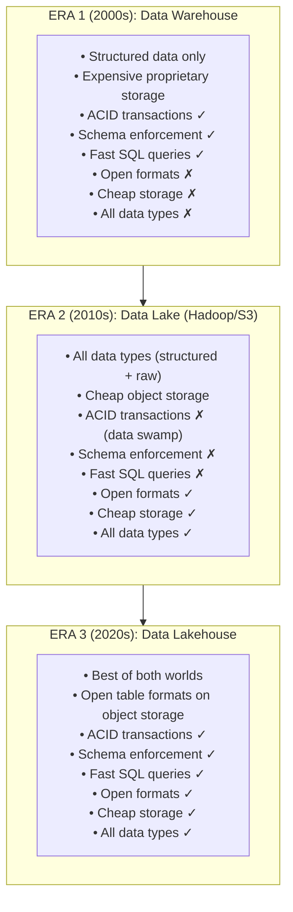
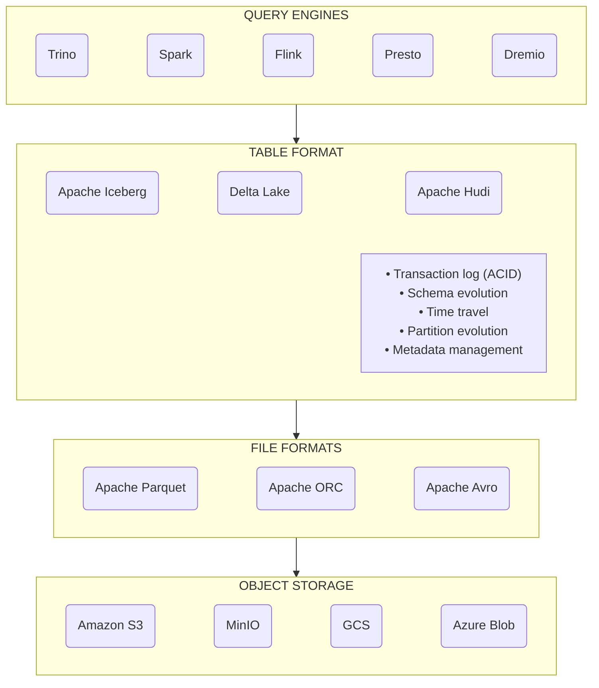
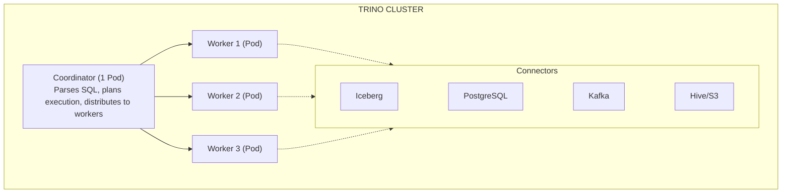
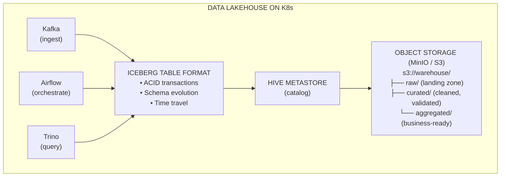
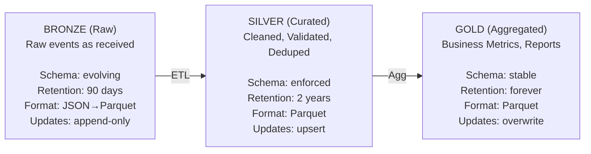

> **Discipline Module** | Complexity: `[COMPLEX]` | Time: 3.5 hours

## Prerequisites

Before starting this module:
- **Required**: [Module 1.2 — Apache Kafka on Kubernetes](../module-1.2-kafka/) — Understanding event streaming and data pipelines
- **Required**: [Module 1.4 — Batch Processing & Apache Spark on K8s](../module-1.4-spark/) — Spark fundamentals and the Spark Operator
- **Recommended**: SQL proficiency (joins, window functions, CTEs, partitioning)
- **Recommended**: Familiarity with S3/object storage concepts (buckets, prefixes, object lifecycle)

---

## What You'll Be Able to Do

After completing this module, you will be able to:

- **Design lakehouse architectures on Kubernetes using Delta Lake, Apache Iceberg, or Apache Hudi**
- **Implement data catalog and metadata management for lakehouse tables across streaming and batch workloads**
- **Configure storage tiering and compaction strategies that optimize query performance and storage costs**
- **Build data governance workflows that enforce schema evolution, access controls, and data quality checks**

## Why This Module Matters

For 30 years, the data world has been split into two camps.

**Data lakes** store everything cheaply in open formats on object storage — Parquet, JSON, CSV — but struggle with consistency, transactions, and performance at query time. You can dump petabytes into S3 for pennies per gigabyte, but querying it feels like searching a library where the books are shelved randomly and some have missing pages.

**Data warehouses** (Snowflake, BigQuery, Redshift) offer blazing-fast SQL queries, ACID transactions, and schema enforcement — but they are expensive, proprietary, and force you to load data into their walled garden before you can query it.

The **data lakehouse** is the third option: the reliability and performance of a warehouse, built on the openness and cost of a lake. It achieves this through **open table formats** (Apache Iceberg, Delta Lake, Apache Hudi) that add transaction logs, schema evolution, and time travel on top of plain Parquet files in object storage.

On Kubernetes, you can build a complete lakehouse with open-source components: object storage for data, Iceberg or Delta Lake for table management, Hive Metastore for metadata, and Trino or Spark for SQL queries. No vendor lock-in. No per-query pricing. Full control.

This module teaches you every layer of the lakehouse stack and how to deploy it on Kubernetes.

> **Stop and think**: If data lakes are cheap and data warehouses are fast, what are the trade-offs of trying to maintain both simultaneously in a traditional "two-tier" architecture instead of moving to a unified lakehouse?

---

## Did You Know?

- **Netflix was one of the earliest adopters of the lakehouse pattern.** Before the term existed, Netflix built Apache Iceberg internally to manage their petabyte-scale data on S3. They open-sourced it in 2018, and it became an Apache top-level project in 2020.
- **The cost difference between a lakehouse and a traditional warehouse is staggering.** Storing 1 PB in Snowflake costs approximately $23,000/month in storage alone. Storing the same data in S3 with Iceberg tables costs about $750/month. The query engines (Trino, Spark) run only when you need them.
- **Iceberg's hidden partition feature eliminates a class of query errors entirely.** Unlike Hive-style partitioning where users must know the partition scheme to write efficient queries, Iceberg automatically prunes partitions based on filter predicates — no partition column in the WHERE clause needed.

---

## Data Lake vs Data Warehouse vs Data Lakehouse

### The Evolution



### What Makes a Lakehouse Work

The secret sauce is the **table format layer** that sits between the query engine and the raw files:



Each layer is independent and interchangeable. You can switch from Trino to Spark without changing your data. You can move from S3 to GCS without changing your table format. This is the power of open standards.

---

## Open Table Formats: The Core Innovation

### Apache Iceberg

Iceberg is the most widely adopted open table format. Originally developed at Netflix, it is now used by Apple, LinkedIn, Airbnb, and hundreds of other organizations.

**How Iceberg works:**

```text
Traditional Hive table:
  /data/events/year=2026/month=03/day=24/*.parquet
  (Just files in directories. No transactions. No schema history.)

Iceberg table:
  /warehouse/events/
  ├── metadata/
  │   ├── v1.metadata.json      ← Table schema, partition spec, snapshot list
  │   ├── v2.metadata.json      ← Updated after each write operation
  │   ├── snap-1234.avro        ← Manifest list: which manifests belong to snapshot
  │   └── manifest-5678.avro    ← Manifest: which data files, their stats
  └── data/
      ├── 00001-abc.parquet     ← Actual data files
      ├── 00002-def.parquet
      └── 00003-ghi.parquet
```

The **metadata layer** is what gives Iceberg its powers:

| Feature | How It Works | Why It Matters |
|---------|-------------|---------------|
| **ACID transactions** | Atomic swap of metadata pointers | Concurrent readers never see partial writes |
| **Schema evolution** | Schema stored in metadata, not file names | Add/rename/drop columns without rewriting data |
| **Time travel** | Each transaction creates a snapshot | Query data as of any point in time |
| **Partition evolution** | Partition spec in metadata, not directory layout | Change partitioning without rewriting data |
| **Hidden partitioning** | Engine auto-prunes based on transforms | Users write `WHERE date = '2026-03-24'`, Iceberg handles the rest |
| **File-level statistics** | Min/max/null counts per column per file | Skip entire files that cannot contain matching rows |

### Delta Lake

Created by Databricks, Delta Lake uses a transaction log (`_delta_log/`) stored alongside the data:

```text
/warehouse/events/
├── _delta_log/
│   ├── 00000000000000000000.json   ← Initial commit
│   ├── 00000000000000000001.json   ← Second commit
│   ├── 00000000000000000010.checkpoint.parquet  ← Checkpoint (every 10 commits)
│   └── _last_checkpoint
└── part-00000-xxx.parquet
└── part-00001-xxx.parquet
```

Delta Lake's transaction log is simpler than Iceberg's multi-level metadata. Each JSON file records the actions (add file, remove file, change metadata) for one transaction.

### Comparison

| Feature | Apache Iceberg | Delta Lake | Apache Hudi |
|---------|---------------|------------|-------------|
| **Origin** | Netflix (2018) | Databricks (2019) | Uber (2017) |
| **License** | Apache 2.0 | Apache 2.0 | Apache 2.0 |
| **ACID transactions** | Yes | Yes | Yes |
| **Schema evolution** | Full (add, drop, rename, reorder) | Add, rename, change nullability | Add columns |
| **Time travel** | Yes (snapshot-based) | Yes (version-based) | Yes (timeline-based) |
| **Partition evolution** | Yes (change without rewrite) | Partial | Partial |
| **Hidden partitioning** | Yes | No | No |
| **Engine support** | Spark, Flink, Trino, Presto, Dremio, Snowflake | Spark, Flink (limited), Trino, Presto | Spark, Flink, Presto |
| **Streaming support** | Via Flink sink | Structured Streaming | Native (core feature) |
| **Community momentum** | Highest (2025-2026) | Strong (Databricks ecosystem) | Growing |

**Recommendation for new projects:** Apache Iceberg. It has the broadest engine support, the most advanced features (partition evolution, hidden partitioning), and the strongest community momentum outside any single vendor's ecosystem.

---

## The Metadata Layer: Hive Metastore and Alternatives

> **Pause and predict**: If open table formats like Iceberg track metadata at the file level, what prevents two concurrent Spark jobs from trying to update the exact same metadata file at the same time, and how might a catalog solve this?

### Why You Need a Catalog

Table formats store metadata alongside the data (in the `metadata/` or `_delta_log/` directory). But how does a query engine know WHERE a table's metadata lives? That is the catalog's job.

```text
User: "SELECT * FROM analytics.events"

Query Engine: "Where is the 'analytics.events' table?"
      │
      ▼
Catalog (Hive Metastore): "It's at s3://warehouse/analytics/events/"
      │
      ▼
Table Format (Iceberg): "Current snapshot is snap-1234, which includes files 00001, 00002, 00003"
      │
      ▼
Query Engine reads: s3://warehouse/analytics/events/data/00001-abc.parquet ...
```

### Hive Metastore on Kubernetes

Hive Metastore (HMS) is the original and most widely supported catalog. It is a standalone service backed by a relational database:

```yaml
# hive-metastore.yaml
apiVersion: apps/v1
kind: Deployment
metadata:
  name: hive-metastore
  namespace: lakehouse
spec:
  replicas: 2
  selector:
    matchLabels:
      app: hive-metastore
  template:
    metadata:
      labels:
        app: hive-metastore
    spec:
      initContainers:
        - name: init-schema
          image: apache/hive:4.0.1
          command:
            - /opt/hive/bin/schematool
            - -dbType
            - postgres
            - -initSchema
            - -ifNotExists
          env:
            - name: HIVE_METASTORE_DB_DRIVER
              value: org.postgresql.Driver
            - name: HIVE_METASTORE_DB_URL
              value: jdbc:postgresql://postgres.lakehouse.svc:5432/metastore
            - name: HIVE_METASTORE_DB_USER
              valueFrom:
                secretKeyRef:
                  name: metastore-db
                  key: username
            - name: HIVE_METASTORE_DB_PASS
              valueFrom:
                secretKeyRef:
                  name: metastore-db
                  key: password
      containers:
        - name: metastore
          image: apache/hive:4.0.1
          command:
            - /opt/hive/bin/hive
            - --service
            - metastore
          ports:
            - containerPort: 9083
              name: thrift
          env:
            - name: SERVICE_NAME
              value: metastore
            - name: HIVE_METASTORE_DB_DRIVER
              value: org.postgresql.Driver
            - name: HIVE_METASTORE_DB_URL
              value: jdbc:postgresql://postgres.lakehouse.svc:5432/metastore
            - name: HIVE_METASTORE_DB_USER
              valueFrom:
                secretKeyRef:
                  name: metastore-db
                  key: username
            - name: HIVE_METASTORE_DB_PASS
              valueFrom:
                secretKeyRef:
                  name: metastore-db
                  key: password
          resources:
            requests:
              cpu: 500m
              memory: 1Gi
            limits:
              memory: 2Gi
          readinessProbe:
            tcpSocket:
              port: 9083
            initialDelaySeconds: 30
            periodSeconds: 10
---
apiVersion: v1
kind: Service
metadata:
  name: hive-metastore
  namespace: lakehouse
spec:
  selector:
    app: hive-metastore
  ports:
    - port: 9083
      targetPort: thrift
      name: thrift
```

### Alternatives to Hive Metastore

| Catalog | Description | When To Use |
|---------|-------------|-------------|
| **Hive Metastore** | Original catalog, broadest support | Default choice, works with everything |
| **AWS Glue Catalog** | Managed HMS-compatible service | AWS-native deployments |
| **Nessie** | Git-like catalog with branching and tagging | Multi-table transactions, data-as-code workflows |
| **Polaris (Iceberg REST Catalog)** | Snowflake-donated OSS REST catalog | Iceberg-first deployments, vendor neutral |
| **Unity Catalog** | Databricks-donated OSS catalog | Delta Lake-first or multi-format deployments |

---

## Trino: The SQL Query Engine

### What Is Trino?

Trino (formerly PrestoSQL, originally Presto from Facebook) is a distributed SQL query engine that can query data where it lives — S3, databases, Kafka, Elasticsearch — without requiring you to move or copy data first.



Trino does not store data. It is a pure compute engine that:
- Reads from configured **connectors** (data sources)
- Executes SQL queries across multiple data sources
- Can **join data across different systems** in a single query

### Deploying Trino on Kubernetes

```yaml
# trino-coordinator.yaml
apiVersion: apps/v1
kind: Deployment
metadata:
  name: trino-coordinator
  namespace: lakehouse
spec:
  replicas: 1
  selector:
    matchLabels:
      app: trino
      role: coordinator
  template:
    metadata:
      labels:
        app: trino
        role: coordinator
    spec:
      initContainers:
        - name: init-config
          image: busybox:1.37
          command: ["sh", "-c"]
          args:
            - |
              # Copy configs to writable directory
              cp /etc/trino-cm/* /etc/trino/
              mkdir -p /etc/trino/catalog
              cp /etc/trino-catalog/* /etc/trino/catalog/
              # Generate unique node.id (required by Trino)
              NODE_ID=$(cat /proc/sys/kernel/random/uuid 2>/dev/null || hostname)
              sed -i "s|^node.data-dir=|node.id=${NODE_ID}\nnode.data-dir=|" /etc/trino/node.properties
          volumeMounts:
            - name: config-cm
              mountPath: /etc/trino-cm
            - name: catalog-cm
              mountPath: /etc/trino-catalog
            - name: config
              mountPath: /etc/trino
      containers:
        - name: trino
          image: trinodb/trino:450
          ports:
            - containerPort: 8080
              name: http
          env:
            - name: TRINO_ENVIRONMENT
              value: production
          volumeMounts:
            - name: config
              mountPath: /etc/trino
          resources:
            requests:
              cpu: "2"
              memory: 8Gi
            limits:
              memory: 8Gi
          readinessProbe:
            httpGet:
              path: /v1/info
              port: 8080
            initialDelaySeconds: 30
            periodSeconds: 10
      volumes:
        - name: config-cm
          configMap:
            name: trino-coordinator-config
        - name: catalog-cm
          configMap:
            name: trino-catalog
        - name: config
          emptyDir: {}
---
apiVersion: apps/v1
kind: Deployment
metadata:
  name: trino-worker
  namespace: lakehouse
spec:
  replicas: 3
  selector:
    matchLabels:
      app: trino
      role: worker
  template:
    metadata:
      labels:
        app: trino
        role: worker
    spec:
      initContainers:
        - name: init-config
          image: busybox:1.37
          command: ["sh", "-c"]
          args:
            - |
              cp /etc/trino-cm/* /etc/trino/
              mkdir -p /etc/trino/catalog
              cp /etc/trino-catalog/* /etc/trino/catalog/
              NODE_ID=$(cat /proc/sys/kernel/random/uuid 2>/dev/null || hostname)
              sed -i "s|^node.data-dir=|node.id=${NODE_ID}\nnode.data-dir=|" /etc/trino/node.properties
          volumeMounts:
            - name: config-cm
              mountPath: /etc/trino-cm
            - name: catalog-cm
              mountPath: /etc/trino-catalog
            - name: config
              mountPath: /etc/trino
      containers:
        - name: trino
          image: trinodb/trino:450
          volumeMounts:
            - name: config
              mountPath: /etc/trino
          resources:
            requests:
              cpu: "4"
              memory: 16Gi
            limits:
              memory: 16Gi
      volumes:
        - name: config-cm
          configMap:
            name: trino-worker-config
        - name: catalog-cm
          configMap:
            name: trino-catalog
        - name: config
          emptyDir: {}
---
apiVersion: v1
kind: Service
metadata:
  name: trino
  namespace: lakehouse
spec:
  selector:
    app: trino
    role: coordinator
  ports:
    - port: 8080
      targetPort: http
```

### Trino Configuration

```yaml
# trino-coordinator-config ConfigMap
apiVersion: v1
kind: ConfigMap
metadata:
  name: trino-coordinator-config
  namespace: lakehouse
data:
  config.properties: |
    coordinator=true
    node-scheduler.include-coordinator=false
    http-server.http.port=8080
    discovery.uri=http://trino.lakehouse.svc:8080
    query.max-memory=20GB
    query.max-memory-per-node=8GB
    query.max-total-memory-per-node=10GB

  node.properties: |
    node.environment=production
    node.data-dir=/data/trino

  jvm.config: |
    -server
    -Xmx6G
    -XX:+UseG1GC
    -XX:G1HeapRegionSize=32M
    -XX:+ExplicitGCInvokesConcurrent
    -XX:+ExitOnOutOfMemoryError
    -Djdk.attach.allowAttachSelf=true

  log.properties: |
    io.trino=INFO
---
apiVersion: v1
kind: ConfigMap
metadata:
  name: trino-worker-config
  namespace: lakehouse
data:
  config.properties: |
    coordinator=false
    http-server.http.port=8080
    discovery.uri=http://trino.lakehouse.svc:8080
    query.max-memory-per-node=12GB
    query.max-total-memory-per-node=14GB

  node.properties: |
    node.environment=production
    node.data-dir=/data/trino

  jvm.config: |
    -server
    -Xmx12G
    -XX:+UseG1GC
    -XX:G1HeapRegionSize=32M
    -XX:+ExplicitGCInvokesConcurrent
    -XX:+ExitOnOutOfMemoryError
    -Djdk.attach.allowAttachSelf=true

  log.properties: |
    io.trino=INFO
```

### Catalog Configuration (Connectors)

```yaml
# trino-catalog ConfigMap
apiVersion: v1
kind: ConfigMap
metadata:
  name: trino-catalog
  namespace: lakehouse
data:
  iceberg.properties: |
    connector.name=iceberg
    iceberg.catalog.type=hive_metastore
    hive.metastore.uri=thrift://hive-metastore.lakehouse.svc:9083
    hive.s3.endpoint=http://minio.lakehouse.svc:9000
    hive.s3.aws-access-key=minioadmin
    hive.s3.aws-secret-key=minioadmin
    hive.s3.path-style-access=true
    iceberg.file-format=PARQUET
    iceberg.compression-codec=ZSTD

  postgres.properties: |
    connector.name=postgresql
    connection-url=jdbc:postgresql://postgres.lakehouse.svc:5432/analytics
    connection-user=trino
    connection-password=trino_password

  tpch.properties: |
    connector.name=tpch
```

---

## Access Control

### Trino Security

Trino supports fine-grained access control:

```yaml
# In trino-coordinator-config ConfigMap, add:
data:
  access-control.properties: |
    access-control.name=file
    security.config-file=/etc/trino/rules/rules.json
    security.refresh-period=60s
```

```json
{
  "catalogs": [
    {
      "catalog": "iceberg",
      "allow": "all"
    },
    {
      "catalog": "postgres",
      "allow": "read-only"
    }
  ],
  "schemas": [
    {
      "catalog": "iceberg",
      "schema": "raw",
      "owner": true
    }
  ],
  "tables": [
    {
      "catalog": "iceberg",
      "schema": "pii",
      "table": ".*",
      "privileges": ["SELECT"],
      "grantee": "analyst",
      "columns": [
        {
          "name": "ssn",
          "allow": false
        },
        {
          "name": "email",
          "mask": "'***@***.***'"
        }
      ]
    }
  ]
}
```

This configuration:
- Gives full access to the Iceberg catalog
- Gives read-only access to PostgreSQL
- Masks PII columns for the `analyst` role
- Blocks access to SSN entirely

---

## Building the Lakehouse: End-to-End

### The Reference Architecture



### The Medallion Architecture

The most common lakehouse data organization pattern:



---

## Common Mistakes

| Mistake | Why It Happens | What To Do Instead |
|---------|---------------|-------------------|
| Using Hive partitioning with Iceberg | Old habits from Hive/Spark | Use Iceberg's hidden partitioning. Define partition transforms in the table spec, not in directory paths |
| Not compacting small files | Streaming ingestion creates many tiny files | Schedule compaction jobs (Spark or Trino `OPTIMIZE`) to merge small files into optimal sizes (128-512 MB) |
| Skipping the catalog layer | "I'll just point at the S3 path" | Without a catalog, every engine needs hardcoded paths. Use Hive Metastore or a REST catalog for a single source of truth |
| Choosing table format based on marketing | "We use Databricks, so Delta Lake" | Choose based on engine compatibility. If you use Trino + Spark + Flink, Iceberg has the broadest support |
| Not monitoring query performance | "Queries are running, so they must be fine" | Track query duration, data scanned per query, and failed queries. A single bad query can scan terabytes unnecessarily |
| Ignoring file format and compression | "Parquet is Parquet" | Use ZSTD compression (better ratio than Snappy, comparable speed). Use Parquet with appropriate row group sizes (64-128 MB) |
| Storing everything in one schema | "We'll organize later" | Use the medallion architecture from day one. Bronze/Silver/Gold schemas with clear ownership and SLAs |
| Running Trino coordinator and workers on the same node | Resource contention | Use pod anti-affinity to spread workers across nodes. The coordinator should be on a separate node |
| Not enabling Iceberg metadata cleanup | Metadata files accumulate indefinitely | Configure `write.metadata.delete-after-commit.enabled=true` and run `expire_snapshots` regularly |

---

## Quiz

**Question 1:** Your team is currently dumping JSON and Parquet logs directly into an S3 bucket and querying them with Athena. Data scientists are complaining that queries occasionally fail with "file not found" errors, and they can't reproduce reports from last week because the data has changed. Why is this happening, and how would adopting an open table format like Apache Iceberg resolve these specific issues?

<details>
<summary>Show Answer</summary>

Adopting an open table format like Apache Iceberg resolves these issues by introducing an ACID transaction layer and strict schema management on top of object storage. In a plain data lake, query engines list raw S3 objects directly, which can result in reading partial data if a file is being written or deleted mid-query, causing "file not found" or corruption errors. Iceberg solves this by tracking all active files in a metadata manifest, ensuring readers only ever see a consistent, point-in-time snapshot of the data. Furthermore, because Iceberg tracks the history of all transactions as a series of snapshots, users can perform "time travel" queries to reproduce exact reports from last week simply by querying the table as of a specific historical snapshot ID. This completely eliminates the volatility and inconsistency typical of raw object storage.

</details>

**Question 2:** A junior analyst is querying a Hive-partitioned table (partitioned by year, month, and day) using the query `SELECT * FROM events WHERE event_timestamp > '2026-03-01'`. The query takes 45 minutes and scans 10 terabytes of data. If this table were migrated to Apache Iceberg using hidden partitioning, how would the execution of this exact same query change, and why?

<details>
<summary>Show Answer</summary>

If migrated to Apache Iceberg using hidden partitioning, the exact same query (`SELECT * FROM events WHERE event_timestamp > '2026-03-01'`) would execute dramatically faster and scan only the relevant day partitions. This happens because Iceberg stores partition transforms directly in the table metadata rather than relying on directory structures and explicit column definitions. When the query engine sees the filter on `event_timestamp`, Iceberg consults its metadata to determine exactly which data files overlap with that date range and skips the rest. The analyst does not need to know the underlying partitioning scheme or manually add `year`, `month`, and `day` filters to the query. This decoupling of logical queries from physical storage layout drastically reduces scan times and prevents accidental full-table scans caused by missing partition predicates.

</details>

**Question 3:** You are designing a lakehouse architecture and your storage team asks, "Why do we need a Hive Metastore deployment if all the Iceberg metadata and Parquet data files are already stored safely in MinIO?" How do you justify the requirement for a catalog service in a multi-engine environment (e.g., Spark for ETL, Trino for queries)?

<details>
<summary>Show Answer</summary>

While MinIO stores the actual data and metadata files, a catalog like Hive Metastore provides the critical mechanism for concurrency control and table discoverability. Without a centralized catalog, query engines like Spark and Trino would have no way to determine which metadata file represents the absolute latest, valid state of a table, nor would they know where to look without hardcoded S3 paths. The catalog acts as a locking mechanism and atomic swap pointer; when Spark finishes writing a new batch of data, it uses the catalog's database backend to atomically update the table's current snapshot pointer. This prevents race conditions where two concurrent writers might overwrite each other's metadata files, ensuring that Trino always reads a consistent, fully committed version of the data.

</details>

**Question 4:** The business intelligence team needs to connect their visualization dashboards (like Superset or Tableau) to the new lakehouse. The data engineering team already uses Apache Spark on Kubernetes for daily ETL jobs. Should you point the BI dashboards to a Spark Thrift Server, or deploy Trino specifically for the dashboard workloads? Explain your architectural choice.

<details>
<summary>Show Answer</summary>

You should deploy Trino specifically for the dashboard workloads rather than pointing BI tools to a Spark Thrift Server. Trino is built using a massively parallel processing (MPP) architecture designed specifically for interactive, low-latency SQL queries, returning initial results almost immediately. In contrast, Spark is fundamentally designed for batch-oriented ETL; it incurs significant startup latency to spin up drivers and executors and evaluates data in blocking stages. By routing BI dashboards to Trino, business users experience snappy, sub-second query responses, while Spark is reserved for heavy, long-running data transformations where throughput and fault tolerance are more critical than immediate latency.

</details>

**Question 5:** An engineering team is building a new data pipeline that ingests raw IoT sensor data, cleans out anomalous readings, and produces a daily summary of device health. They decide to write the cleaned data and the daily summaries back into the same S3 prefix and Iceberg table to "keep things simple." What architectural pattern are they violating, and what specific problems will this unified approach cause as the system scales?

<details>
<summary>Show Answer</summary>

The team is violating the Medallion Architecture pattern by mixing raw data ingestion, validation, and business aggregation within the same storage layer and schema. By combining these distinct data lifecycles, they create a tightly coupled system where an error in the raw ingestion logic can corrupt the daily summaries, and schema changes to accommodate new sensors might break downstream reporting. The Medallion Architecture specifically separates data into Bronze (raw, append-only), Silver (cleaned, validated, enforced schema), and Gold (aggregated, business-ready) layers. This separation provides clear data lineage, ensures that downstream consumers only read validated data, and allows engineers to recompute the Gold layer from the Silver layer if business logic changes, without touching the raw ingestion stream.

</details>

**Question 6:** A real-time Flink job is continuously appending thousands of events per minute into an Iceberg table. Over the course of a week, analysts notice that simple `SELECT count(*)` queries in Trino are taking progressively longer to execute, even when filtering on highly specific partition keys. The total data volume has only grown by a few gigabytes. What is the most likely root cause of this degradation, and what maintenance operation must be implemented to fix it?

<details>
<summary>Show Answer</summary>

The most likely root cause of this degradation is the "small file problem" caused by the continuous streaming ingestion from Flink. Because Flink is writing data continuously, it produces thousands of tiny Parquet files and corresponding metadata entries, rather than large, optimally sized files. When Trino attempts to query the table, the sheer overhead of opening, reading, and parsing the metadata for thousands of tiny files dominates the query execution time, effectively neutralizing the benefits of partition pruning. To fix this, the data engineering team must schedule a regular compaction job (using Trino's `OPTIMIZE` or Spark's `rewriteDataFiles` procedure) to routinely merge these small, fragmented files into larger, 128-512 MB files, dramatically reducing metadata bloat and restoring query performance.

</details>

---

## Hands-On Exercise: Trino on K8s + MinIO + Hive Metastore + SQL on Iceberg Tables

### Objective

Deploy a complete lakehouse stack on Kubernetes: MinIO for object storage, Hive Metastore for the catalog, and Trino for SQL queries. Create Iceberg tables, load data, and run analytical queries.

### Environment Setup

```bash
# Create the kind cluster
kind create cluster --name lakehouse-lab

# Create namespace
kubectl create namespace lakehouse
```

### Step 1: Deploy MinIO (Object Storage)

```yaml
# minio.yaml
apiVersion: apps/v1
kind: Deployment
metadata:
  name: minio
  namespace: lakehouse
spec:
  replicas: 1
  selector:
    matchLabels:
      app: minio
  template:
    metadata:
      labels:
        app: minio
    spec:
      containers:
        - name: minio
          image: quay.io/minio/minio:RELEASE.2025-02-28T09-55-16Z
          args: ["server", "/data", "--console-address", ":9001"]
          ports:
            - containerPort: 9000
              name: api
            - containerPort: 9001
              name: console
          env:
            - name: MINIO_ROOT_USER
              value: minioadmin
            - name: MINIO_ROOT_PASSWORD
              value: minioadmin
          volumeMounts:
            - name: data
              mountPath: /data
          resources:
            requests:
              cpu: 250m
              memory: 512Mi
            limits:
              memory: 1Gi
      volumes:
        - name: data
          emptyDir:
            sizeLimit: 10Gi
---
apiVersion: v1
kind: Service
metadata:
  name: minio
  namespace: lakehouse
spec:
  selector:
    app: minio
  ports:
    - port: 9000
      targetPort: api
      name: api
    - port: 9001
      targetPort: console
      name: console
```

```bash
kubectl apply -f minio.yaml
kubectl -n lakehouse wait --for=condition=Available deployment/minio --timeout=120s

# Create the warehouse bucket
kubectl -n lakehouse run mc --rm -it --restart=Never \
  --image=quay.io/minio/mc:latest -- \
  sh -c "mc alias set myminio http://minio:9000 minioadmin minioadmin && \
         mc mb myminio/warehouse && \
         mc ls myminio/"
```

### Step 2: Deploy PostgreSQL for Hive Metastore

```yaml
# postgres.yaml
apiVersion: apps/v1
kind: Deployment
metadata:
  name: postgres
  namespace: lakehouse
spec:
  replicas: 1
  selector:
    matchLabels:
      app: postgres
  template:
    metadata:
      labels:
        app: postgres
    spec:
      containers:
        - name: postgres
          image: postgres:16-alpine
          ports:
            - containerPort: 5432
          env:
            - name: POSTGRES_DB
              value: metastore
            - name: POSTGRES_USER
              value: hive
            - name: POSTGRES_PASSWORD
              value: hive_password
          volumeMounts:
            - name: data
              mountPath: /var/lib/postgresql/data
          resources:
            requests:
              cpu: 250m
              memory: 256Mi
            limits:
              memory: 512Mi
      volumes:
        - name: data
          emptyDir: {}
---
apiVersion: v1
kind: Service
metadata:
  name: postgres
  namespace: lakehouse
spec:
  selector:
    app: postgres
  ports:
    - port: 5432
      targetPort: 5432
---
apiVersion: v1
kind: Secret
metadata:
  name: metastore-db
  namespace: lakehouse
type: Opaque
stringData:
  username: hive
  password: hive_password
```

```bash
kubectl apply -f postgres.yaml
kubectl -n lakehouse wait --for=condition=Available deployment/postgres --timeout=120s
```

### Step 3: Deploy Trino with Iceberg Connector

For this lab, we use Trino's built-in Iceberg connector with a JDBC catalog (pointing to our PostgreSQL), which simplifies the setup by eliminating the need for a separate Hive Metastore service.

```yaml
# trino-lab.yaml
apiVersion: v1
kind: ConfigMap
metadata:
  name: trino-config
  namespace: lakehouse
data:
  config.properties: |
    coordinator=true
    node-scheduler.include-coordinator=true
    http-server.http.port=8080
    discovery.uri=http://localhost:8080
    query.max-memory=2GB
    query.max-memory-per-node=1GB

  node.properties: |
    node.environment=lab
    node.data-dir=/data/trino

  jvm.config: |
    -server
    -Xmx1G
    -XX:+UseG1GC
    -XX:+ExitOnOutOfMemoryError

  log.properties: |
    io.trino=INFO
---
apiVersion: v1
kind: ConfigMap
metadata:
  name: trino-catalog-config
  namespace: lakehouse
data:
  iceberg.properties: |
    connector.name=iceberg
    iceberg.catalog.type=jdbc
    iceberg.jdbc-catalog.driver-class=org.postgresql.Driver
    iceberg.jdbc-catalog.connection-url=jdbc:postgresql://postgres.lakehouse.svc:5432/metastore
    iceberg.jdbc-catalog.connection-user=hive
    iceberg.jdbc-catalog.connection-password=hive_password
    iceberg.jdbc-catalog.catalog-name=lakehouse
    fs.native-s3.enabled=true
    s3.endpoint=http://minio.lakehouse.svc:9000
    s3.region=us-east-1
    s3.path-style-access=true
    s3.aws-access-key=minioadmin
    s3.aws-secret-key=minioadmin
    iceberg.file-format=PARQUET

  tpch.properties: |
    connector.name=tpch
---
apiVersion: apps/v1
kind: Deployment
metadata:
  name: trino
  namespace: lakehouse
spec:
  replicas: 1
  selector:
    matchLabels:
      app: trino
  template:
    metadata:
      labels:
        app: trino
    spec:
      initContainers:
        - name: init-config
          image: busybox:1.37
          command: ["sh", "-c"]
          args:
            - |
              # Copy configs to a writable directory (ConfigMap mounts are read-only)
              cp /etc/trino-cm/* /etc/trino/
              mkdir -p /etc/trino/catalog
              cp /etc/trino-catalog/* /etc/trino/catalog/
              # Generate unique node.id (required by Trino to start)
              NODE_ID=$(cat /proc/sys/kernel/random/uuid 2>/dev/null || hostname)
              sed -i "s|^node.data-dir=|node.id=${NODE_ID}\nnode.data-dir=|" /etc/trino/node.properties
          volumeMounts:
            - name: config-cm
              mountPath: /etc/trino-cm
            - name: catalog-cm
              mountPath: /etc/trino-catalog
            - name: config
              mountPath: /etc/trino
      containers:
        - name: trino
          image: trinodb/trino:450
          ports:
            - containerPort: 8080
          volumeMounts:
            - name: config
              mountPath: /etc/trino
          resources:
            requests:
              cpu: "1"
              memory: 2Gi
            limits:
              memory: 2Gi
          readinessProbe:
            httpGet:
              path: /v1/info
              port: 8080
            initialDelaySeconds: 30
            periodSeconds: 10
      volumes:
        - name: config-cm
          configMap:
            name: trino-config
        - name: catalog-cm
          configMap:
            name: trino-catalog-config
        - name: config
          emptyDir: {}
---
apiVersion: v1
kind: Service
metadata:
  name: trino
  namespace: lakehouse
spec:
  selector:
    app: trino
  ports:
    - port: 8080
      targetPort: 8080
```

```bash
kubectl apply -f trino-lab.yaml
kubectl -n lakehouse wait --for=condition=Available deployment/trino --timeout=180s
```

### Step 4: Create Iceberg Tables and Load Data

```bash
# Connect to Trino CLI
kubectl -n lakehouse run trino-cli --rm -it --restart=Never \
  --image=trinodb/trino:450 -- trino --server http://trino:8080 --catalog iceberg
```

Inside the Trino CLI:

```sql
-- Create a schema (database)
CREATE SCHEMA IF NOT EXISTS iceberg.analytics
  WITH (location = 's3://warehouse/analytics/');

-- Create an Iceberg table from TPCH sample data
CREATE TABLE iceberg.analytics.orders
  WITH (
    format = 'PARQUET',
    partitioning = ARRAY['month(orderdate)']
  )
  AS SELECT
    orderkey,
    custkey,
    orderstatus,
    totalprice,
    orderdate,
    orderpriority,
    clerk,
    shippriority
  FROM tpch.sf1.orders;
-- This creates an Iceberg table with ~1.5M rows

-- Verify the table
SELECT count(*) AS total_orders FROM iceberg.analytics.orders;

-- Create a customers table
CREATE TABLE iceberg.analytics.customers
  WITH (format = 'PARQUET')
  AS SELECT * FROM tpch.sf1.customer;

-- Check metadata
SELECT * FROM iceberg.analytics."orders$snapshots";
SELECT * FROM iceberg.analytics."orders$files" LIMIT 5;
```

### Step 5: Run Analytical Queries

```sql
-- Revenue by order status and month
SELECT
    orderstatus,
    date_trunc('month', orderdate) AS order_month,
    count(*) AS order_count,
    round(sum(totalprice), 2) AS total_revenue,
    round(avg(totalprice), 2) AS avg_order_value
FROM iceberg.analytics.orders
WHERE orderdate >= DATE '1996-01-01'
  AND orderdate < DATE '1997-01-01'
GROUP BY orderstatus, date_trunc('month', orderdate)
ORDER BY order_month, orderstatus;

-- Top 10 customers by total spend (cross-table join)
SELECT
    c.name AS customer_name,
    c.mktsegment AS market_segment,
    count(o.orderkey) AS order_count,
    round(sum(o.totalprice), 2) AS total_spend
FROM iceberg.analytics.orders o
JOIN iceberg.analytics.customers c ON o.custkey = c.custkey
GROUP BY c.name, c.mktsegment
ORDER BY total_spend DESC
LIMIT 10;

-- Time travel: see data as of a specific snapshot
SELECT snapshot_id, committed_at FROM iceberg.analytics."orders$snapshots";
-- Use a snapshot ID from the output:
-- SELECT count(*) FROM iceberg.analytics.orders FOR VERSION AS OF <snapshot_id>;
```

### Step 6: Schema Evolution

```sql
-- Add a new column (no data rewrite needed)
ALTER TABLE iceberg.analytics.orders ADD COLUMN region VARCHAR;

-- Verify the column was added
DESCRIBE iceberg.analytics.orders;

-- Update the new column for some rows
UPDATE iceberg.analytics.orders
SET region = 'NORTH AMERICA'
WHERE clerk LIKE '%000001%';

-- Verify: check the snapshot history shows the update
SELECT snapshot_id, committed_at, operation
FROM iceberg.analytics."orders$snapshots"
ORDER BY committed_at DESC;
```

### Step 7: Clean Up

```bash
kubectl delete namespace lakehouse
kind delete cluster --name lakehouse-lab
```

### Success Criteria

You have completed this exercise when you:
- [ ] Deployed MinIO, PostgreSQL, and Trino on Kubernetes
- [ ] Created an Iceberg schema pointing to MinIO (S3)
- [ ] Created partitioned Iceberg tables from TPCH sample data
- [ ] Ran analytical SQL queries with joins across Iceberg tables
- [ ] Inspected Iceberg metadata (snapshots, file listing)
- [ ] Performed schema evolution (added a column without rewriting data)

---

## Key Takeaways

1. **The lakehouse combines the best of lakes and warehouses** — Cheap, open storage with ACID transactions, schema enforcement, and fast queries.
2. **Open table formats are the key innovation** — Iceberg, Delta Lake, and Hudi add a metadata layer on top of Parquet files that enables transactions, time travel, and schema evolution.
3. **The catalog (Hive Metastore) is the bridge** — It maps logical table names to physical storage locations, enabling multiple engines to share the same data.
4. **Trino is the interactive SQL layer** — It queries data where it lives without moving it, supporting sub-second to minute-range analytical queries.
5. **The medallion architecture organizes data quality** — Bronze (raw), Silver (curated), Gold (aggregated) layers provide clear data lineage and quality guarantees.
6. **File compaction is not optional** — Streaming ingestion and frequent writes create small files that destroy query performance. Schedule regular compaction.

---

## Further Reading

**Books:**
- **"Apache Iceberg: The Definitive Guide"** — Tomer Shiran, Jason Hughes, Alex Merced (O'Reilly)
- **"The Data Lakehouse"** — Bill Inmon, Mary Levins, Ranjeet Srivastava (Technics Publications)

**Articles:**
- **"Lakehouse: A New Generation of Open Platforms"** — Databricks Research Paper (cidrdb.org/cidr2021)
- **"Apache Iceberg Documentation"** — iceberg.apache.org
- **"Trino Documentation"** — trino.io/docs/current

**Talks:**
- **"The Rise of the Data Lakehouse"** — Ali Ghodsi, Data + AI Summit 2023 (YouTube)
- **"Apache Iceberg: An Architectural Look Under the Covers"** — Alex Merced, Dremio (YouTube)

---

## Summary

The data lakehouse is not a single product — it is an architecture pattern built from composable, open-source components. Object storage provides durability at scale. Open table formats (Iceberg) add reliability and governance. Catalogs provide discoverability. Query engines (Trino, Spark) provide compute.

On Kubernetes, each of these components runs as a managed workload: scalable, declarative, and replaceable. You are not locked into any vendor. If a better query engine emerges, swap it in. If your storage needs change, switch backends. The data stays in open formats on storage you control.

This is the promise of the lakehouse: warehouse-grade reliability, lake-scale economics, and cloud-native flexibility.

---

## Next Steps

You have completed the Data Engineering on Kubernetes discipline. From here, consider:
- **[SRE Discipline](/platform/disciplines/core-platform/sre/)** — Learn to operate these data systems reliably in production
- **[Observability Toolkit](/platform/toolkits/observability-intelligence/observability/)** — Monitor your data platform with Prometheus, Grafana, and OpenTelemetry
- **[MLOps Discipline](/platform/disciplines/data-ai/mlops/)** — Build ML pipelines on top of your lakehouse

---

*"The best data architecture is the one that does not make you choose between cost, performance, and openness."* — Ryan Blue, Apache Iceberg co-creator