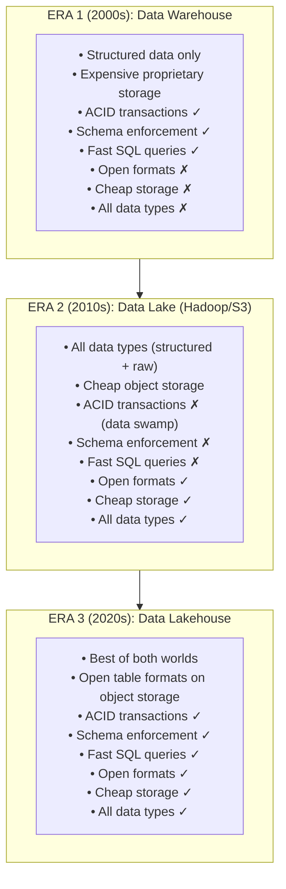
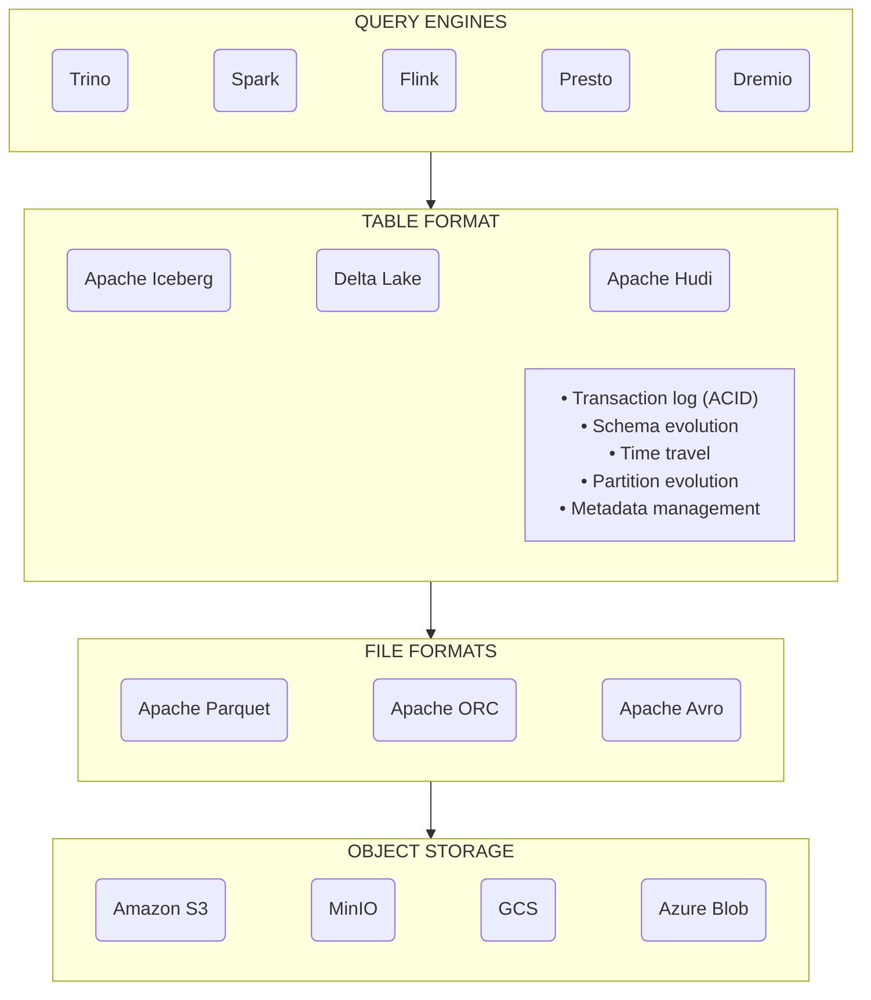
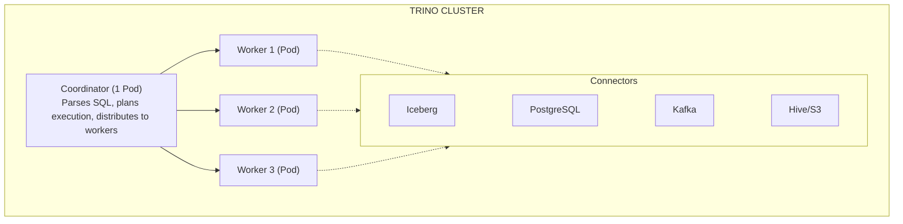
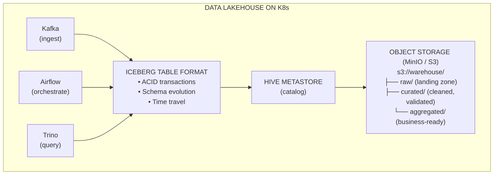
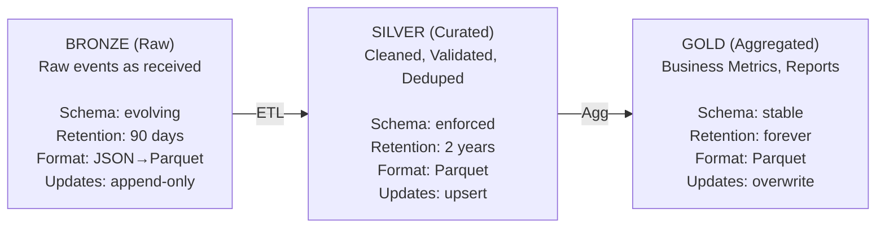
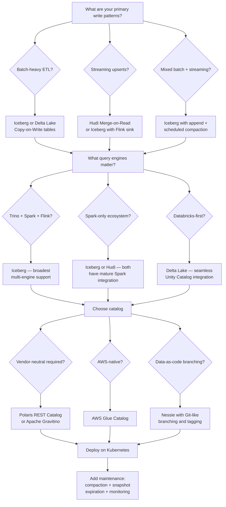

> **Discipline Module** | Complexity: `[COMPLEX]` | Time: 3.5 hours

## Prerequisites

Before starting this module, make sure you have completed the required modules below and are comfortable with the recommended concepts — the lakehouse builds on streaming, batch processing, and SQL foundations covered earlier in this sub-track.
- **Required**: [Module 1.2 — Apache Kafka on Kubernetes](../module-1.2-kafka/) — Understanding event streaming and data pipelines
- **Required**: [Module 1.4 — Batch Processing & Apache Spark on K8s](../module-1.4-spark/) — Spark fundamentals and the Spark Operator
- **Recommended**: SQL proficiency (joins, window functions, CTEs, partitioning)
- **Recommended**: Familiarity with S3/object storage concepts (buckets, prefixes, object lifecycle)

---

## What You'll Be Able to Do

After completing this module, you will be able to design, implement, and operate each layer of a production lakehouse architecture on Kubernetes.

- **Design lakehouse architectures on Kubernetes using Delta Lake, Apache Iceberg, or Apache Hudi**
- **Implement data catalog and metadata management for lakehouse tables across streaming and batch workloads**
- **Configure storage tiering and compaction strategies that optimize query performance and storage costs**
- **Build data governance workflows that enforce schema evolution, access controls, and data quality checks**

---

## Why This Module Matters

For 30 years, the data world has been split into two camps, each strong where the other is weak, and organizations have been forced to choose between them — paying the cost of the choice they did not make.

**Data lakes** store everything cheaply in open formats on object storage — Parquet, JSON, CSV — but struggle with consistency, transactions, and performance at query time. You can dump petabytes into S3 for pennies per gigabyte, but querying it feels like searching a library where the books are shelved randomly and some have missing pages.

**Data warehouses** (Snowflake, BigQuery, Redshift) offer blazing-fast SQL queries, ACID transactions, and schema enforcement — but they are expensive, proprietary, and force you to load data into their walled garden before you can query it.

The **data lakehouse** is the third option: the reliability and performance of a warehouse, built on the openness and cost of a lake. It achieves this through **open table formats** (Apache Iceberg, Delta Lake, Apache Hudi) that add transaction logs, schema evolution, and time travel on top of plain Parquet files in object storage.

On Kubernetes, you can build a complete lakehouse with open-source components: object storage for data, Iceberg or Delta Lake for table management, Hive Metastore for metadata, and Trino or Spark for SQL queries. No vendor lock-in. No per-query pricing. Full control.

This architectural shift matters because it fundamentally separates two concerns that warehouses tightly coupled: storage and compute. In a warehouse, your data lives inside the warehouse engine — if you need a different query pattern, you buy more warehouse capacity, or you export and copy. In a lakehouse, data lives in open formats on commodity object storage, and you bring whatever compute engine suits the workload: Spark for heavy ETL, Trino for interactive SQL, Flink for streaming. The data stays put; the engines come and go. This decoupling is the same principle that made containers and Kubernetes transformative for application workloads — now it is reaching data workloads, and the implications are equally profound.

The economic argument is not just about storage cost per gigabyte. The more significant savings come from eliminating data copies. In a traditional two-tier architecture, organizations routinely maintain three copies of the same data: raw files in the lake, a transformed copy in the warehouse, and aggregated extracts in operational databases for application consumption. Each copy carries storage cost, pipeline maintenance cost, and a consistency problem — which copy is canonical? The lakehouse eliminates the warehouse copy altogether, and with careful design, the aggregated extracts can become materialized views over the same lakehouse tables rather than separate copies. The result is a single source of truth with multiple access patterns, not multiple sources of truth fighting each other.

> **Stop and think**: If data lakes are cheap and data warehouses are fast, what are the trade-offs of trying to maintain both simultaneously in a traditional "two-tier" architecture instead of moving to a unified lakehouse?

---

## From Warehouses to Lakes to Lakehouses: The Evolution

### The Data Warehouse Era

Data warehouses solved a real problem. In the early 2000s, analytical queries against operational databases were slow, unreliable, and risked taking down production systems. The warehouse decoupled analytics from operations: extract data nightly, transform it into a star schema, load it into a dedicated system with columnar storage, precomputed aggregates, and a cost-based query optimizer. The result was fast, predictable analytics on structured data. The trade-off was that you had to know your schema before you loaded data — schema-on-write — and anything that did not fit the warehouse schema (semi-structured logs, images, raw JSON events) was left outside. Worse, the warehouse hardware and software were proprietary and expensive, so you stored only the most valuable data and aggressively pruned the rest.

### The Data Lake Era

Hadoop changed the economics. Suddenly you could store everything — structured, semi-structured, unstructured — on commodity hardware in open file formats. Object storage (S3, then GCS, Azure Blob, MinIO) completed the picture by removing the physical cluster entirely. Data lakes adopted a schema-on-read model: dump data in any format, and apply structure only when you query. This removed the upfront modeling burden and let organizations retain raw data they might never use.

The problem that emerged — and the reason the term "data swamp" entered the vocabulary — was that schema-on-read without governance means nobody knows what is in the lake, what quality it has, or whether two datasets are consistent. Queries that joined across unversioned, unvalidated files produced contradictory results. Updates were done by rewriting entire directory trees, which meant a 1-GB partition with a single-row change required rewriting the entire gigabyte. There was no notion of a transaction, no snapshot isolation, and no way to time-travel to yesterday's data. A team that needed to reproduce a report from last month would find that the underlying files had been overwritten by the nightly ETL job, making the historical result permanently unrecoverable. The data lake had solved the storage cost problem but had created a correctness problem that grew worse with scale.

### The Lakehouse

The lakehouse answers a specific question: can we have the openness and cost model of a lake with the reliability guarantees of a warehouse? The answer is yes, provided you add a metadata layer that gives Parquet files the transactional semantics they lack. That metadata layer is the **open table format**. It is not middleware or a proxy service — it is a specification for how metadata (table schema, partition layout, snapshot history, column statistics, file manifests) is written alongside data files so that any compatible query engine can read a consistent, point-in-time view of the table without coordinating with a central service.

This is a subtle but important distinction from the warehouse model. A warehouse stores data in a closed format and controls access through a monolithic query engine. A lakehouse table format defines an open protocol that any engine can implement. The data remains Parquet files (or ORC, or Avro) in object storage, and the metadata is also committed to object storage. The catalog — a lightweight service like Hive Metastore or a REST catalog — acts only as a pointer to the current metadata location. The result is that multiple engines can safely read and write the same table concurrently, each seeing a consistent snapshot, without the table format acting as a runtime bottleneck.


```mermaid
flowchart TD
    subgraph ERA_1 ["ERA 1 (2000s): Data Warehouse"]
        DW["• Structured data only<br>• Expensive proprietary storage<br>• ACID transactions ✓<br>• Schema enforcement ✓<br>• Fast SQL queries ✓<br>• Open formats ✗<br>• Cheap storage ✗<br>• All data types ✗"]
    end
    subgraph ERA_2 ["ERA 2 (2010s): Data Lake (Hadoop/S3)"]
        DL["• All data types (structured + raw)<br>• Cheap object storage<br>• ACID transactions ✗ (data swamp)<br>• Schema enforcement ✗<br>• Fast SQL queries ✗<br>• Open formats ✓<br>• Cheap storage ✓<br>• All data types ✓"]
    end
    subgraph ERA_3 ["ERA 3 (2020s): Data Lakehouse"]
        LH["• Best of both worlds<br>• Open table formats on object storage<br>• ACID transactions ✓<br>• Schema enforcement ✓<br>• Fast SQL queries ✓<br>• Open formats ✓<br>• Cheap storage ✓<br>• All data types ✓"]
    end
    ERA_1 --> ERA_2 --> ERA_3
```

### What Makes a Lakehouse Work

The secret sauce is the **table format layer** that sits between the query engine and the raw files:


```mermaid
flowchart TD
    subgraph QE [QUERY ENGINES]
        direction LR
        E1(Trino) ~~~ E2(Spark) ~~~ E3(Flink) ~~~ E4(Presto) ~~~ E5(Dremio)
    end

    subgraph TF [TABLE FORMAT]
        direction LR
        I(Apache Iceberg) ~~~ D(Delta Lake) ~~~ H(Apache Hudi)
        desc["• Transaction log (ACID)<br>• Schema evolution<br>• Time travel<br>• Partition evolution<br>• Metadata management"]
    end

    subgraph FF [FILE FORMATS]
        direction LR
        P(Apache Parquet) ~~~ O(Apache ORC) ~~~ A(Apache Avro)
    end

    subgraph OS [OBJECT STORAGE]
        direction LR
        S3(Amazon S3) ~~~ M(MinIO) ~~~ G(GCS) ~~~ AB(Azure Blob)
    end

    QE --> TF
    TF --> FF
    FF --> OS
```

Each layer is independent and interchangeable. You can switch from Trino to Spark without changing your data. You can move from S3 to GCS without changing your table format. This is the power of open standards.

---

## Open Table Formats: The Core Innovation

### What a Table Format Actually Is

A table format is not a file format and not a storage engine. Parquet tells you how to encode rows into bytes and compress them; a table format tells you which Parquet files belong to a logical table, what schema they share, which rows are currently visible, and how to safely add, remove, or modify them without corrupting concurrent reads.

Think of the relationship as analogous to a version control system over a collection of documents. The documents themselves are Parquet files — formatted, compressed, self-describing. The table format is the git repository: it tracks what files exist in each snapshot, records who changed what and when, and lets you check out any historical version. Without the table format, you have a pile of files in a directory with no history, no consistency boundary, and no way to know whether a file you are reading was half-written by a concurrent job.

The core operations every open table format must support are deceptively simple to state but fiendishly difficult to implement correctly on eventually-consistent object storage. First, writes must be atomic: a reader must never see a partial write, even if the writer crashes mid-operation. Second, writes must be isolated: two concurrent writers must not silently corrupt each other's metadata. Third, snapshots must be consistent: once a snapshot is committed, its contents must be immutable — queries against that snapshot must return the same results forever, regardless of later writes. Achieving these guarantees on object stores that offer only eventual consistency for list-after-write operations (historically a well-known S3 behavior) required careful protocol design, and the differences in how Iceberg, Delta Lake, and Hudi solve these challenges are the primary distinctions between them.

### Apache Iceberg

Iceberg is the most widely adopted open table format. Originally developed at Netflix to manage their petabyte-scale data on S3, it is now used by Apple, LinkedIn, Airbnb, and hundreds of other organizations. It became an Apache top-level project in 2020.

Iceberg's metadata architecture is best understood by comparing its on-disk layout with the flat-directory approach of Hive tables. While a Hive table is simply a directory tree where the path encodes partition values, an Iceberg table maintains a structured metadata directory that tracks every snapshot, manifest, and data file — giving the query engine a precise map of what to read without ever listing files:

```text
Traditional Hive table:
  /data/events/year=2026/month=03/day=24/*.parquet
  (Just files in directories. No transactions. No schema history.)

Iceberg table:
  /warehouse/events/
  ├── metadata/
  │   ├── v1.metadata.json      ← Table schema, partition spec, snapshot list
  │   ├── v2.metadata.json      ← Updated after each write operation
  │   ├── snap-1234.avro        ← Manifest list: which manifests belong to snapshot
  │   └── manifest-5678.avro    ← Manifest: which data files, their stats
  └── data/
      ├── 00001-abc.parquet     ← Actual data files
      ├── 00002-def.parquet
      └── 00003-ghi.parquet
```

With this metadata structure in place, Iceberg delivers a set of capabilities that were previously impossible on object storage alone.

| Feature | How It Works | Why It Matters |
|---------|-------------|---------------|
| **ACID transactions** | Atomic swap of metadata pointers | Concurrent readers never see partial writes |
| **Schema evolution** | Schema stored in metadata, not file names | Add/rename/drop columns without rewriting data |
| **Time travel** | Each transaction creates a snapshot | Query data as of any point in time |
| **Partition evolution** | Partition spec in metadata, not directory layout | Change partitioning without rewriting data |
| **Hidden partitioning** | Engine auto-prunes based on transforms | Users write `WHERE date = '2026-03-24'`, Iceberg handles the rest |
| **File-level statistics** | Min/max/null counts per column per file | Skip entire files that cannot contain matching rows |

Iceberg's architecture uses a three-level metadata hierarchy that is worth understanding because it explains both its performance characteristics and its operational complexity. At the top is the metadata file (`v{N}.metadata.json`), which points to a manifest list. The manifest list points to individual manifests, each of which tracks a subset of data files along with per-column statistics (min, max, null count). When a query with a filter like `WHERE event_date = '2026-03-24'` arrives, the engine can check the partition statistics in the manifest files to eliminate entire manifests without opening any data files. Then, for the remaining manifests, it checks per-file column statistics to skip individual Parquet files whose min/max ranges exclude the filter value. This multi-level pruning — partition → manifest → file → row group — means that on a well-partitioned, well-compacted table, a point query might open only a handful of Parquet files even when the table holds billions of rows.

This design also makes Iceberg's partition evolution possible. Because the partition specification is stored in the metadata rather than encoded in directory paths (as Hive does), you can change the partition scheme — say, from daily to hourly granularity — by writing new data with the new partition spec. Old data retains the old spec; new data uses the new spec; queries transparently handle both. No table rewrite is required.

### Delta Lake

Created by Databricks, Delta Lake uses a transaction log (`_delta_log/`) stored alongside the data:

```text
/warehouse/events/
├── _delta_log/
│   ├── 00000000000000000000.json   ← Initial commit
│   ├── 00000000000000000001.json   ← Second commit
│   ├── 00000000000000000010.checkpoint.parquet  ← Checkpoint (every 10 commits)
│   └── _last_checkpoint
└── part-00000-xxx.parquet
└── part-00001-xxx.parquet
```

Delta Lake's transaction log is simpler than Iceberg's multi-level metadata. Each JSON file records the actions (add file, remove file, change metadata) for one transaction. When a reader opens a table, it reads the transaction log from the latest checkpoint forward, reconstructing the current state of the table.

This simpler model makes Delta Lake easier to understand and debug — you can literally open `_delta_log/00000000000000000001.json` and read what changed — but it comes with trade-offs. Because there is no per-file column-level statistics index in the metadata (unlike Iceberg's manifests), file-skipping during queries relies on the statistics embedded within Parquet file footers, which requires opening more files during query planning. This means that on very large tables with thousands of data files, Iceberg's manifest-based approach typically produces more efficient query plans, while Delta Lake's simpler log is faster to read and write for tables with fewer files and lower cardinality.

Delta Lake's approach to concurrent writes is based on optimistic concurrency control. When a writer commits, it checks that there are no new transaction log entries since it began writing — if someone else committed first, the writer must retry by reading the new state and reapplying its changes. This is functionally similar to a compare-and-swap operation and works well under moderate write concurrency. Under very high write concurrency (hundreds of simultaneous writers), the retry overhead can become significant, which is why Iceberg's design — where writers can prepare manifests independently and only the final metadata pointer swap is atomic — scales better to high-concurrency scenarios.

### Apache Hudi

Apache Hudi originated at Uber in 2017 for solving a specific problem that neither Hive nor early data lakes addressed well: incremental upserts on large tables at streaming speeds. If you have a ride-sharing dataset where trips transition through states (requested → matched → in-progress → completed → paid), you do not want to rewrite an entire partition every time a trip changes status. You want to efficiently update individual rows, and you want downstream consumers to be able to read only the rows that changed since their last read — incremental pull, rather than full-table scan.

Hudi achieves this through a design centered on two table types. Copy-on-Write (CoW) works like a traditional batch table: every write creates new versions of the data files that were modified, and queries read the latest file versions. This is simple and provides good read performance, but the write amplification can be high for frequent small updates — changing one row in a 500 MB Parquet file requires rewriting the entire file. Merge-on-Read (MoR) stores incoming updates in row-based log files (Avro) alongside the columnar base files (Parquet). Reads merge the base files with the log files at query time, which reduces write amplification at the cost of higher read latency. This MoR design is conceptually similar to how LSM trees work in storage engines like RocksDB — writes go to a fast append-only log, and a background compaction process periodically merges the log into the sorted base files. It is the key differentiator that makes Hudi the strongest choice for workloads where low-latency upserts are the primary requirement.

Hudi also pioneered the concept of an incremental query — a query that returns only rows that changed since a given commit timestamp — which makes it particularly well-suited for building incremental data pipelines where each stage processes only the delta from the previous stage rather than rescanning full tables.

### The Rosetta: Comparing Table Formats on Capability

Rather than declaring a "best" format, think of each as strongest in its area of origin. Iceberg excels at multi-engine interoperability and analytical workloads with broad, complex schema evolution needs. Delta Lake excels in the Databricks/Spark ecosystem with a simpler operational model and deep Unity Catalog integration. Hudi excels at streaming upserts and incremental processing. The table below compares them on the durable capabilities that matter:

| Capability | Apache Iceberg | Delta Lake | Apache Hudi |
|------------|---------------|------------|-------------|
| ACID transactions | Yes (atomic metadata swap) | Yes (optimistic concurrency) | Yes (timeline-based) |
| Time travel | Yes (snapshot-based) | Yes (version-based) | Yes (commit-timeline-based) |
| Schema evolution | Full (add, drop, rename, reorder, change type) | Add, rename, change nullability, change type | Add columns, change type |
| Partition evolution | Yes (change without rewrite) | Partial (requires rewrite for some changes) | No (partition path is fixed) |
| Hidden partitioning | Yes | No | No |
| Streaming upserts | Via Flink sink | Via Structured Streaming | Native (core design feature, MoR tables) |
| Incremental reads | Yes (snapshot diffing) | Limited | Native (core design feature) |
| Multi-engine | Spark, Flink, Trino, Presto, Dremio, Snowflake, StarRocks, Doris | Spark, Flink (limited), Trino, Presto | Spark, Flink, Presto, Trino (emerging) |
| File-level stats in metadata | Yes (per-column min/max/null in manifests) | No (stats in Parquet footers) | Yes (per-column in Hudi metadata table) |
| Metadata table | Built-in for query planning | Not separate; uses checkpoint mechanism | Built-in (Hudi metadata table) |

> **Landscape snapshot — as of 2026-06. This changes fast; verify against vendor docs before relying on specifics.** The three formats are increasingly converging on features. Iceberg has added stored procedures for row-level deletes and updates (v2 spec). Delta Lake added column mapping (renaming columns without rewrite) and liquid clustering. Hudi added a metadata table for faster file listing, non-blocking concurrency control, and a record-level index. All three now support the Iceberg REST catalog specification for multi-engine table discovery — Delta Lake via UniForm, Hudi via its catalog integration layer. Do not choose based on a feature checklist alone; evaluate against your actual workload mix (batch vs streaming, write frequency, query engine diversity), your team's operational comfort, and your catalog strategy.

### Choosing a Format: Decision Factors

The largest factor is not feature count — it is engine compatibility. If your organization standardizes on Trino for SQL and Spark for ETL, Iceberg gives you the most consistent cross-engine experience because both engines implement the full Iceberg spec natively. If you are deep in the Databricks ecosystem with Unity Catalog for governance, Delta Lake's integration is seamless in ways that Iceberg-on-Databricks cannot entirely match. If your primary workload is streaming upserts with low-latency incremental consumers — think fraud detection pipelines where every status change must propagate within seconds — Hudi's Merge-on-Read tables and native incremental queries are purpose-built for this pattern in ways that Iceberg's append-and-compact approach and Delta Lake's copy-on-write default cannot replicate without significant engineering effort.

The good news is that all three formats store data as Parquet files in object storage. Migration between formats is possible, though not trivial — there are community tools for converting between Iceberg and Delta Lake metadata without rewriting data files. This reduces the risk of format lock-in, provided you maintain portable data rather than relying on format-specific stored procedures that tie business logic to the format layer.

---

## The Metadata Layer: Catalogs

> **Pause and predict**: If open table formats like Iceberg track metadata at the file level, what prevents two concurrent Spark jobs from trying to update the exact same metadata file at the same time, and how might a catalog solve this?

### Why You Need a Catalog

Table formats store metadata alongside the data (in the `metadata/` or `_delta_log/` directory). But how does a query engine know WHERE a table's metadata lives? That is the catalog's job.

```text
User: "SELECT * FROM analytics.events"

Query Engine: "Where is the 'analytics.events' table?"
      │
      ▼
Catalog (Hive Metastore): "It's at s3://warehouse/analytics/events/"
      │
      ▼
Table Format (Iceberg): "Current snapshot is snap-1234, which includes files 00001, 00002, 00003"
      │
      ▼
Query Engine reads: s3://warehouse/analytics/events/data/00001-abc.parquet ...
```

The catalog is not just a file path registry. For Iceberg specifically, the catalog plays an essential role in concurrency control by acting as the atomic compare-and-swap point. When a writer finishes preparing new metadata files in object storage, it asks the catalog to atomically update the table's current metadata pointer from the old version to the new version — but only if the current pointer is still the expected old version. If another writer committed first, the pointer has already changed, and the first writer's commit is rejected. The writer must then read the new state, rebase its changes, and retry. This optimistic locking pattern, mediated by the catalog's backing database (typically PostgreSQL or MySQL), is what prevents the "two writers overwrite each other" scenario without requiring a distributed lock manager.

### Hive Metastore on Kubernetes

Hive Metastore (HMS) is the original and most widely supported catalog. It is a standalone service backed by a relational database:

```yaml
# hive-metastore.yaml
apiVersion: apps/v1
kind: Deployment
metadata:
  name: hive-metastore
  namespace: lakehouse
spec:
  replicas: 2
  selector:
    matchLabels:
      app: hive-metastore
  template:
    metadata:
      labels:
        app: hive-metastore
    spec:
      initContainers:
        - name: init-schema
          image: apache/hive:4.0.1
          command:
            - /opt/hive/bin/schematool
            - -dbType
            - postgres
            - -initSchema
            - -ifNotExists
          env:
            - name: HIVE_METASTORE_DB_DRIVER
              value: org.postgresql.Driver
            - name: HIVE_METASTORE_DB_URL
              value: jdbc:postgresql://postgres.lakehouse.svc:5432/metastore
            - name: HIVE_METASTORE_DB_USER
              valueFrom:
                secretKeyRef:
                  name: metastore-db
                  key: username
            - name: HIVE_METASTORE_DB_PASS
              valueFrom:
                secretKeyRef:
                  name: metastore-db
                  key: password
      containers:
        - name: metastore
          image: apache/hive:4.0.1
          command:
            - /opt/hive/bin/hive
            - --service
            - metastore
          ports:
            - containerPort: 9083
              name: thrift
          env:
            - name: SERVICE_NAME
              value: metastore
            - name: HIVE_METASTORE_DB_DRIVER
              value: org.postgresql.Driver
            - name: HIVE_METASTORE_DB_URL
              value: jdbc:postgresql://postgres.lakehouse.svc:5432/metastore
            - name: HIVE_METASTORE_DB_USER
              valueFrom:
                secretKeyRef:
                  name: metastore-db
                  key: username
            - name: HIVE_METASTORE_DB_PASS
              valueFrom:
                secretKeyRef:
                  name: metastore-db
                  key: password
          resources:
            requests:
              cpu: 500m
              memory: 1Gi
            limits:
              memory: 2Gi
          readinessProbe:
            tcpSocket:
              port: 9083
            initialDelaySeconds: 30
            periodSeconds: 10
---
apiVersion: v1
kind: Service
metadata:
  name: hive-metastore
  namespace: lakehouse
spec:
  selector:
    app: hive-metastore
  ports:
    - port: 9083
      targetPort: thrift
      name: thrift
```

### Beyond Hive: The Catalog Landscape

The catalog layer is undergoing a major transition. Hive Metastore, while battle-tested and universally supported, was designed for a world where tables were Hive tables stored as directories of files. It has no native concept of Iceberg snapshots or Delta Lake transaction logs — table format clients work around this by storing format-specific metadata as HMS table properties. This works but is fragile and leads to format-specific catalog configuration.

The **Iceberg REST Catalog** specification changes this by defining a standard HTTP API for table operations: create, load, commit, list. Any catalog that implements this API can serve Iceberg tables, and any Iceberg client can connect to any compliant catalog without format-specific glue code. This is analogous to how the S3 API became the universal object storage interface — the REST catalog spec aims to be the universal table catalog interface.

| Catalog | Type | Best For |
|---------|------|----------|
| **Hive Metastore** | Thrift service with RDBMS backend | Universal compatibility; the safe default |
| **Polaris (Apache)** | Iceberg REST catalog, open-source | Iceberg-native deployments, multi-engine, vendor-neutral |
| **Unity Catalog (Apache)** | Multi-format REST catalog, open-source | Delta Lake + Iceberg, Databricks ecosystem integration |
| **Gravitino (Apache)** | Multi-format REST catalog, open-source | Multi-format federation across Iceberg/Hive/MySQL/PostgreSQL |
| **AWS Glue Catalog** | Managed HMS-compatible service | AWS-native deployments |
| **Nessie** | Git-like catalog with branching and tagging | Multi-table transactions, data-as-code workflows, experimentation |

The trend is clear: the catalog is becoming an open protocol rather than a proprietary service. This means you can run the same catalog on Kubernetes that you run in a managed cloud environment, preserving portability and avoiding lock-in at the metadata layer — which, historically, was the hardest layer to migrate.

---

## Trino: The SQL Query Engine for the Lakehouse

### What Is Trino?

Trino (formerly PrestoSQL, originally Presto from Facebook) is a distributed SQL query engine designed specifically for the lakehouse pattern: it queries data where it lives — S3, databases, Kafka, Elasticsearch — without requiring you to move or copy data first. Unlike Spark, which is fundamentally a batch processing engine that can also run SQL, Trino is an MPP (massively parallel processing) SQL engine that was built from the ground up for interactive query performance.


```mermaid
flowchart TD
    subgraph TC [TRINO CLUSTER]
        C["Coordinator (1 Pod)<br>Parses SQL, plans execution, distributes to workers"]

        W1["Worker 1 (Pod)"]
        W2["Worker 2 (Pod)"]
        W3["Worker 3 (Pod)"]

        C --> W1
        C --> W2
        C --> W3

        subgraph Conn [Connectors]
            direction LR
            Iceberg ~~~ PostgreSQL ~~~ Kafka ~~~ Hive_S3["Hive/S3"]
        end

        W1 -.-> Conn
        W2 -.-> Conn
        W3 -.-> Conn
    end
```

Trino does not store data. It is a pure compute engine that:
- Reads from configured **connectors** (data sources)
- Executes SQL queries across multiple data sources
- Can **join data across different systems** in a single query

The architectural implication of this is important: Trino is stateless from the perspective of the data layer. You can scale Trino workers up and down, deploy multiple independent Trino clusters for different workload classes (ad-hoc analytics vs scheduled reporting vs data exploration), and upgrade Trino versions without touching data. This operational flexibility is what makes Trino such a natural fit for the lakehouse model — it complements rather than competes with the other compute engines in your stack.

### Deploying Trino on Kubernetes

```yaml
# trino-coordinator.yaml
apiVersion: apps/v1
kind: Deployment
metadata:
  name: trino-coordinator
  namespace: lakehouse
spec:
  replicas: 1
  selector:
    matchLabels:
      app: trino
      role: coordinator
  template:
    metadata:
      labels:
        app: trino
        role: coordinator
    spec:
      initContainers:
        - name: init-config
          image: busybox:1.37
          command: ["sh", "-c"]
          args:
            - |
              # Copy configs to writable directory
              cp /etc/trino-cm/* /etc/trino/
              mkdir -p /etc/trino/catalog
              cp /etc/trino-catalog/* /etc/trino/catalog/
              # Generate unique node.id (required by Trino)
              NODE_ID=$(cat /proc/sys/kernel/random/uuid 2>/dev/null || hostname)
              sed -i "s|^node.data-dir=|node.id=${NODE_ID}\nnode.data-dir=|" /etc/trino/node.properties
          volumeMounts:
            - name: config-cm
              mountPath: /etc/trino-cm
            - name: catalog-cm
              mountPath: /etc/trino-catalog
            - name: config
              mountPath: /etc/trino
      containers:
        - name: trino
          image: trinodb/trino:450
          ports:
            - containerPort: 8080
              name: http
          env:
            - name: TRINO_ENVIRONMENT
              value: production
          volumeMounts:
            - name: config
              mountPath: /etc/trino
          resources:
            requests:
              cpu: "2"
              memory: 8Gi
            limits:
              memory: 8Gi
          readinessProbe:
            httpGet:
              path: /v1/info
              port: 8080
            initialDelaySeconds: 30
            periodSeconds: 10
      volumes:
        - name: config-cm
          configMap:
            name: trino-coordinator-config
        - name: catalog-cm
          configMap:
            name: trino-catalog
        - name: config
          emptyDir: {}
---
apiVersion: apps/v1
kind: Deployment
metadata:
  name: trino-worker
  namespace: lakehouse
spec:
  replicas: 3
  selector:
    matchLabels:
      app: trino
      role: worker
  template:
    metadata:
      labels:
        app: trino
        role: worker
    spec:
      initContainers:
        - name: init-config
          image: busybox:1.37
          command: ["sh", "-c"]
          args:
            - |
              cp /etc/trino-cm/* /etc/trino/
              mkdir -p /etc/trino/catalog
              cp /etc/trino-catalog/* /etc/trino/catalog/
              NODE_ID=$(cat /proc/sys/kernel/random/uuid 2>/dev/null || hostname)
              sed -i "s|^node.data-dir=|node.id=${NODE_ID}\nnode.data-dir=|" /etc/trino/node.properties
          volumeMounts:
            - name: config-cm
              mountPath: /etc/trino-cm
            - name: catalog-cm
              mountPath: /etc/trino-catalog
            - name: config
              mountPath: /etc/trino
      containers:
        - name: trino
          image: trinodb/trino:450
          volumeMounts:
            - name: config
              mountPath: /etc/trino
          resources:
            requests:
              cpu: "4"
              memory: 16Gi
            limits:
              memory: 16Gi
      volumes:
        - name: config-cm
          configMap:
            name: trino-worker-config
        - name: catalog-cm
          configMap:
            name: trino-catalog
        - name: config
          emptyDir: {}
---
apiVersion: v1
kind: Service
metadata:
  name: trino
  namespace: lakehouse
spec:
  selector:
    app: trino
    role: coordinator
  ports:
    - port: 8080
      targetPort: http
```

### Trino Configuration

```yaml
# trino-coordinator-config ConfigMap
apiVersion: v1
kind: ConfigMap
metadata:
  name: trino-coordinator-config
  namespace: lakehouse
data:
  config.properties: |
    coordinator=true
    node-scheduler.include-coordinator=false
    http-server.http.port=8080
    discovery.uri=http://trino.lakehouse.svc:8080
    query.max-memory=20GB
    query.max-memory-per-node=8GB
    query.max-total-memory-per-node=10GB

  node.properties: |
    node.environment=production
    node.data-dir=/data/trino

  jvm.config: |
    -server
    -Xmx6G
    -XX:+UseG1GC
    -XX:G1HeapRegionSize=32M
    -XX:+ExplicitGCInvokesConcurrent
    -XX:+ExitOnOutOfMemoryError
    -Djdk.attach.allowAttachSelf=true

  log.properties: |
    io.trino=INFO
---
apiVersion: v1
kind: ConfigMap
metadata:
  name: trino-worker-config
  namespace: lakehouse
data:
  config.properties: |
    coordinator=false
    http-server.http.port=8080
    discovery.uri=http://trino.lakehouse.svc:8080
    query.max-memory-per-node=12GB
    query.max-total-memory-per-node=14GB

  node.properties: |
    node.environment=production
    node.data-dir=/data/trino

  jvm.config: |
    -server
    -Xmx12G
    -XX:+UseG1GC
    -XX:G1HeapRegionSize=32M
    -XX:+ExplicitGCInvokesConcurrent
    -XX:+ExitOnOutOfMemoryError
    -Djdk.attach.allowAttachSelf=true

  log.properties: |
    io.trino=INFO
```

### Catalog Configuration (Connectors)

```yaml
# trino-catalog ConfigMap
apiVersion: v1
kind: ConfigMap
metadata:
  name: trino-catalog
  namespace: lakehouse
data:
  iceberg.properties: |
    connector.name=iceberg
    iceberg.catalog.type=hive_metastore
    hive.metastore.uri=thrift://hive-metastore.lakehouse.svc:9083
    hive.s3.endpoint=http://minio.lakehouse.svc:9000
    hive.s3.aws-access-key=minioadmin
    hive.s3.aws-secret-key=minioadmin
    hive.s3.path-style-access=true
    iceberg.file-format=PARQUET
    iceberg.compression-codec=ZSTD

  postgres.properties: |
    connector.name=postgresql
    connection-url=jdbc:postgresql://postgres.lakehouse.svc:5432/analytics
    connection-user=trino
    connection-password=trino_password

  tpch.properties: |
    connector.name=tpch
```

---

## Building the Lakehouse: End-to-End Architecture

### The Reference Architecture


```mermaid
flowchart TD
    subgraph DL_K8S [DATA LAKEHOUSE ON K8s]
        K["Kafka<br>(ingest)"]
        A["Airflow<br>(orchestrate)"]
        T["Trino<br>(query)"]

        ITF["ICEBERG TABLE FORMAT<br>• ACID transactions<br>• Schema evolution<br>• Time travel"]

        HM["HIVE METASTORE<br>(catalog)"]

        OS["OBJECT STORAGE (MinIO / S3)<br>s3://warehouse/<br>├── raw/ (landing zone)<br>├── curated/ (cleaned, validated)<br>└── aggregated/ (business-ready)"]

        K --> ITF
        A --> ITF
        T --> ITF

        ITF --> HM
        HM --> OS
    end
```

### The Medallion Architecture

The most common lakehouse data organization pattern is the medallion architecture:


```mermaid
flowchart LR
    B["BRONZE (Raw)<br>Raw events as received<br><br>Schema: evolving<br>Retention: 90 days<br>Format: JSON→Parquet<br>Updates: append-only"]

    S["SILVER (Curated)<br>Cleaned, Validated, Deduped<br><br>Schema: enforced<br>Retention: 2 years<br>Format: Parquet<br>Updates: upsert"]

    G["GOLD (Aggregated)<br>Business Metrics, Reports<br><br>Schema: stable<br>Retention: forever<br>Format: Parquet<br>Updates: overwrite"]

    B -- "ETL" --> S
    S -- "Agg" --> G
```

The medallion architecture is not just a directory structure — it is a data quality contract. Bronze tables accept data as it arrives, with minimal validation, in whatever schema the source system emits. The contract for Bronze is "we captured it." Silver tables enforce schema, deduplicate, resolve identity (mapping source-specific IDs to canonical entity IDs), and apply business validation rules. The contract for Silver is "this data is correct and complete." Gold tables contain business-ready aggregates, metrics, and feature stores. The contract for Gold is "this data is directly consumable by dashboards, models, and applications."

The key operational insight is that each layer can be recomputed from the layer below it. If a bug in the Silver transformation logic corrupts a month of data, you do not need to replay from the source — you recompute Silver from Bronze. If the business definition of a Gold metric changes retroactively, you recompute Gold from Silver. This recomputability is what distinguishes a well-architected lakehouse from a data swamp, and it is only possible because the table format provides snapshot isolation and time travel — you recompute Silver as of a specific Bronze snapshot, and the new Silver results are committed as a new Silver snapshot, leaving the old Silver intact for comparison.

### Maintenance Operations

A lakehouse that ingests streaming data requires ongoing maintenance to prevent performance degradation, and the operational reality on Kubernetes changes how you approach this compared to managed services. In a managed lakehouse (Databricks, Snowflake with Iceberg tables), maintenance is handled by the platform. On Kubernetes, you own maintenance explicitly — which means you must schedule it, monitor it, and budget compute resources for it alongside your data processing workloads. This ownership is not a disadvantage; it is the same trade-off Kubernetes operators already accept for application workloads in exchange for portability and cost control. The maintenance jobs run as Kubernetes CronJobs or Airflow DAGs, the same way your ETL jobs run, and they benefit from the same observability and retry infrastructure you have already built. Three operations are essential:

**Compaction** addresses the small-file problem. When a streaming job (Flink, Spark Structured Streaming, or Kafka Connect) writes events continuously, it produces many small Parquet files — often a few megabytes each — rather than the optimal 128–512 MB. Query engines spend disproportionate time opening and reading metadata for thousands of tiny files rather than scanning data. Compaction merges these small files into larger ones, typically as a scheduled batch job. Iceberg exposes this through the `rewriteDataFiles` procedure; Delta Lake through `OPTIMIZE`; Hudi through its built-in compaction scheduler for MoR tables.

**Snapshot expiration** prevents metadata bloat. Every write to an Iceberg table creates a new snapshot with associated manifest files. Over months of streaming ingestion, these accumulate into tens of thousands of metadata files. Trino queries must read the snapshot hierarchy to determine which files are current, and this metadata traversal eventually dominates query latency. Snapshot expiration — `expire_snapshots` in Iceberg, `VACUUM` in Delta Lake — removes old snapshots and their orphaned data files, retaining only a configurable window of history.

**Orphan file cleanup** removes data files that are no longer referenced by any snapshot. These accumulate when writes fail partway through, when snapshots are expired without deleting associated data files, or when compaction creates new files without cleaning up the old ones. Iceberg's `remove_orphan_files` procedure scans the data directory and deletes any file not referenced by a live snapshot.

These three operations — compact, expire, clean — should run as scheduled maintenance jobs. Neglecting them causes query performance to degrade gradually, often going unnoticed until a critical dashboard times out.

---

## Access Control

### Trino Security

Trino supports fine-grained access control through file-based rules or integration with Apache Ranger. A typical file-based access control configuration restricts which users can access which catalogs, schemas, and tables, and can also apply column-level masking for sensitive fields.

```yaml
# In trino-coordinator-config ConfigMap, add:
data:
  access-control.properties: |
    access-control.name=file
    security.config-file=/etc/trino/rules/rules.json
    security.refresh-period=60s
```

```json
{
  "catalogs": [
    {
      "user": "analyst",
      "catalog": "iceberg",
      "allow": "all"
    },
    {
      "user": "analyst",
      "catalog": "postgres",
      "allow": "read-only"
    },
    {
      "user": "data_engineer",
      "catalog": ".*",
      "allow": "all"
    }
  ],
  "schemas": [
    {
      "user": "analyst",
      "catalog": "iceberg",
      "schema": "finance",
      "allow": "read-only"
    }
  ],
  "tables": [
    {
      "user": "analyst",
      "catalog": "iceberg",
      "schema": ".*",
      "table": "users",
      "allow": "read-only",
      "filter": "mask_columns(ssn, email)"
    },
    {
      "user": "analyst",
      "catalog": "iceberg",
      "schema": "raw_prod",
      "table": ".*",
      "allow": "none"
    }
  ]
}
```

This rule configuration grants full access to the Iceberg catalog for the analyst role while restricting PostgreSQL to read-only access. The column masking rule obfuscates the `ssn` and `email` columns in the users table, and access to the raw production schema is blocked entirely for analysts — data engineers retain unrestricted access through a separate role definition.

---

## Patterns and Anti-Patterns

### Patterns (What Good Looks Like)

**Medallion architecture from day one.** Establish Bronze, Silver, and Gold schemas before the first production pipeline runs. The cost of retrofitting layers onto an existing flat lake is significantly higher than starting with the structure, because retrofitting requires identifying which tables are at which quality tier, backfilling missing layers, and retraining consumers to use the correct layer — all while production queries are running against the old layout. A common lightweight starting point: Bronze gets a schema per source system (ingested raw), Silver gets a schema per business domain (cleaned, validated, entity-resolved), Gold gets a schema per consumer use case (aggregates, feature stores, exports).

**Storage and compute separation as a design principle, not a cost-saving tactic.** The architectural benefit — the ability to choose the right engine for each workload and evolve engines independently — outweighs the infrastructure cost savings. Design your tables so that they are queryable by any engine you might reasonably adopt, not just the engine you use today. This means avoiding engine-specific SQL extensions in transformation logic (prefer ANSI SQL where possible), storing table schemas in the catalog rather than in engine-specific configuration, and using the table format's native partitioning rather than engine-specific partition schemes.

**Time travel as a testing and recovery primitive.** Before running a data-modifying operation (a schema change, a backfill, a deduplication pass), record the current snapshot ID. If the operation produces incorrect results, roll back by querying the old snapshot and rewriting the table from it. This turns irreversible data modifications — historically a source of anxiety in data engineering — into reversible operations with a known recovery point.

**Scheduled maintenance as a first-class operational concern.** Compaction, snapshot expiration, and orphan file cleanup should run on a schedule with alerting. The table format provides the procedures; your job is to ensure they execute reliably. A table with six months of unmaintained streaming writes is not a lakehouse — it is a data swamp with ACID guarantees.

### Anti-Patterns (What to Avoid)

| Anti-Pattern | Why It Is Harmful | What to Do Instead |
|--------------|-------------------|--------------------|
| **Hive-style partitioning with Iceberg** | Bypasses hidden partitioning; query writers must know and include partition columns in WHERE clauses, or suffer full-table scans | Use Iceberg partition transforms defined in the table spec. Let the engine prune partitions automatically from any filter predicate |
| **Neglecting compaction** | Streaming ingestion creates thousands of small files; metadata traversal overhead dominates query latency, turning sub-second queries into minute-long scans | Schedule `rewriteDataFiles` (Iceberg), `OPTIMIZE` (Delta Lake), or compaction (Hudi MoR) as a regular maintenance job with alerting |
| **Skipping the catalog layer** | Every engine needs hardcoded S3 paths; no concurrency control between writers; table discovery is manual and error-prone | Deploy Hive Metastore or a REST catalog (Polaris, Unity) as the single source of truth for table locations and current metadata pointers |
| **Choosing format based on vendor alignment** | "We use Databricks, so Delta Lake" or "We attended an Iceberg talk, so Iceberg" — the format must match your actual workload, not your vendor relationship | Evaluate based on engine compatibility, write patterns (batch vs streaming upserts), and multi-engine requirements. The Rosetta table in this module is your starting point |
| **Single-table medallion** | Writing cleaned data and business aggregates into the same table as raw events creates tight coupling; a schema change to accommodate new raw fields can break aggregate queries | Separate schemas for Bronze, Silver, and Gold. Each layer can evolve independently; downstream layers recompute from upstream when formats change |
| **Ignoring snapshot expiration** | Metadata files accumulate indefinitely; Trino must traverse thousands of snapshots to determine current state, degrading query planning time linearly with table age | Configure `write.metadata.delete-after-commit.enabled=true` (Iceberg) and schedule `expire_snapshots` with a retention window appropriate for your compliance requirements |
| **PII in Bronze without access controls** | Raw data contains unmasked PII; any user with Trino access to the Bronze schema can read sensitive fields | Mask or hash PII columns in the Silver transformation, restrict Bronze access to data engineers only, and use Trino's file-based or Ranger-based access control to enforce column-level restrictions |
| **No dry-run before destructive write operations** | Data-modifying operations (backfills, schema migrations, deduplications) that run without a snapshot checkpoint are irreversible if they go wrong | Record the current snapshot ID before any write that touches more rows than you can manually verify. Test with a `SELECT` of the intended changes before executing the modification |

---

## Decision Framework: Choosing Your Lakehouse Stack

When designing a lakehouse, work through these decisions in order. Each decision constrains the next, and skipping ahead to tool selection before understanding your workload guarantees a rewrite within 12 months.


```mermaid
flowchart TD
    A[What are your primary write patterns?] --> B{Batch-heavy ETL?}
    A --> C{Streaming upserts?}
    A --> D{Mixed batch + streaming?}

    B --> B1[Iceberg or Delta Lake<br>Copy-on-Write tables]
    C --> C1[Hudi Merge-on-Read<br>or Iceberg with Flink sink]
    D --> D1[Iceberg with append +<br>scheduled compaction]

    B1 --> E[What query engines matter?]
    C1 --> E
    D1 --> E

    E --> F{Trino + Spark + Flink?}
    E --> G{Spark-only ecosystem?}
    E --> H{Databricks-first?}

    F --> F1[Iceberg — broadest<br>multi-engine support]
    G --> G1[Iceberg or Hudi — both<br>have mature Spark integration]
    H --> H1[Delta Lake — seamless<br>Unity Catalog integration]

    F1 --> I[Choose catalog]
    G1 --> I
    H1 --> I

    I --> J{Vendor-neutral required?}
    I --> K{AWS-native?}
    I --> L{Data-as-code branching?}

    J --> J1[Polaris REST Catalog<br>or Apache Gravitino]
    K --> K1[AWS Glue Catalog]
    L --> L1[Nessie with Git-like<br>branching and tagging]

    J1 --> M[Deploy on Kubernetes]
    K1 --> M
    L1 --> M

    M --> N[Add maintenance:<br>compaction + snapshot<br>expiration + monitoring]
```

The flowchart is a guide, not a prescription. The correct stack is the one your team can operate reliably, not the one with the most features. If your team knows Spark deeply but has never run Trino, starting with Spark as both the ETL engine and the query engine (via Spark Thrift Server) is operationally safer than deploying Trino alongside Spark on day one — even though Trino would deliver better interactive query performance. Operational simplicity should win tiebreakers.

---

## Did You Know?

- **Netflix created Iceberg because Hive tables on S3 broke at their scale.** Before the term "lakehouse" existed, Netflix engineers found that Hive's directory-based partitioning made atomic table operations impossible on S3's eventually-consistent object listing. Listing a partition with thousands of files took minutes. Iceberg's snapshot-based design eliminated the need to list files entirely — the manifest tells you exactly which files to read. Netflix open-sourced Iceberg in 2018, and it became an Apache top-level project in 2020.
- **The cost difference between a lakehouse and a traditional warehouse is not just about storage.** Storing 1 PB in a cloud data warehouse costs an order of magnitude more in compute than in storage because the warehouse bundles compute with data. In a lakehouse, storage is commodity object storage with no compute markup, and query engines (Trino, Spark) run only when you need them — and can be scaled independently based on query concurrency rather than data volume. This architectural decoupling is the same principle that made microservices economically viable compared to monolithic application servers.
- **Iceberg's hidden partitioning eliminates a class of query errors that plagued Hive for a decade.** In Hive, if you partition by `year`, `month`, and `day`, every query author must remember to include all three columns in the WHERE clause. Forgetting one causes a full-table scan. Iceberg's partition transforms let the engine derive partition values from any filter predicate — `WHERE event_timestamp > '2026-03-01'` automatically prunes to the correct partitions even though the table is partitioned by `month(event_timestamp)`, not by a literal partition column.
- **The Iceberg REST Catalog specification is becoming the universal table catalog protocol.** What the S3 API did for object storage — making it possible to switch between Amazon S3, MinIO, Ceph, GCS, and Azure Blob without application changes — the Iceberg REST Catalog specification is doing for table catalogs. Polaris (Apache), Unity Catalog (Apache), Gravitino (Apache), Tabular, and Dremio all implement this spec, meaning an Iceberg client written against the REST API can discover and query tables regardless of which catalog implementation sits behind it. This is a secular trend toward catalog portability that significantly reduces the risk of metadata-layer lock-in.

---

## Common Mistakes

| Mistake | Why It Happens | What To Do Instead |
|---------|---------------|-------------------|
| Using Hive partitioning with Iceberg | Old habits from Hive/Spark — directory-based partitioning is familiar | Use Iceberg's hidden partitioning: define partition transforms in the table spec, not in directory paths. The query engine handles pruning automatically from any filter predicate |
| Not compacting small files | Streaming ingestion feels fast and "just works" until it does not — the degradation is gradual | Schedule compaction jobs (Iceberg `rewriteDataFiles` or Trino `OPTIMIZE`) to merge small files into 128–512 MB Parquet files. Monitor average file size per partition as a leading indicator |
| Skipping the catalog layer | "I will just point at the S3 path" — works for one engine, fails for multi-engine coordination | Deploy Hive Metastore or a REST catalog as the single source of truth. Without a catalog, concurrent writers will corrupt each other's metadata, and table discovery is manual and fragile |
| Choosing format based on vendor alignment rather than workload fit | Organizational momentum: "We standardize on vendor X, therefore format Y" | Evaluate against the Rosetta table in this module. Iceberg for multi-engine, Delta Lake for Databricks-native, Hudi for streaming upserts with incremental consumers |
| Storing everything in a single schema | "We will organize later" — later never arrives, and retrofitting medallion layers onto a live lake is painful | Establish Bronze, Silver, and Gold schemas from day one. Each layer has clear ownership, SLAs, and a recompute path from the layer below |
| Neglecting snapshot expiration | Metadata files are small and invisible — nobody notices until queries slow down months later | Configure automatic snapshot expiration with a retention window appropriate for compliance needs. Iceberg: `expire_snapshots`. Delta Lake: `VACUUM` |
| Writing PII to Bronze without access controls | Raw data capture is treated as an infrastructure problem; governance is treated as an application problem | Mask or hash PII in the Silver transformation. Restrict Bronze access to data engineers only via Trino access control rules |
| Running compaction as an afterthought rather than a scheduled operation | Compaction is seen as a one-time fix rather than continuous maintenance | Schedule compaction as a cron-like job with alerting. Untended tables degrade to swamp quality regardless of the table format |

---

## Quiz

**Question 1:** Your team is currently dumping JSON and Parquet logs directly into an S3 bucket and querying them with Athena. Data scientists are complaining that queries occasionally fail with "file not found" errors, and they cannot reproduce reports from last week because the data has changed. Why is this happening, and how would adopting an open table format like Apache Iceberg resolve these specific issues?

<details>
<summary>Show Answer</summary>

Adopting an open table format like Apache Iceberg resolves these issues by introducing an ACID transaction layer and strict schema management on top of object storage. In a plain data lake, query engines list raw S3 objects directly, which can result in reading partial data if a file is being written or deleted mid-query, causing "file not found" or corruption errors. Iceberg solves this by tracking all active files in a metadata manifest, ensuring readers only ever see a consistent, point-in-time snapshot of the data. Furthermore, because Iceberg tracks the history of all transactions as a series of snapshots, users can perform "time travel" queries to reproduce exact reports from last week simply by querying the table as of a specific historical snapshot ID. This completely eliminates the volatility and inconsistency typical of raw object storage.

</details>

**Question 2:** A junior analyst is querying a Hive-partitioned table (partitioned by year, month, and day) using the query `SELECT * FROM events WHERE event_timestamp > '2026-03-01'`. The query takes 45 minutes and scans 10 terabytes of data. If this table were migrated to Apache Iceberg using hidden partitioning, how would the execution of this exact same query change, and why?

<details>
<summary>Show Answer</summary>

If migrated to Apache Iceberg using hidden partitioning, the exact same query (`SELECT * FROM events WHERE event_timestamp > '2026-03-01'`) would execute dramatically faster and scan only the relevant day partitions. This happens because Iceberg stores partition transforms directly in the table metadata rather than relying on directory structures and explicit column definitions. When the query engine sees the filter on `event_timestamp`, Iceberg consults its metadata to determine exactly which data files overlap with that date range and skips the rest. The analyst does not need to know the underlying partitioning scheme or manually add `year`, `month`, and `day` filters to the query. This decoupling of logical queries from physical storage layout drastically reduces scan times and prevents accidental full-table scans caused by missing partition predicates.

</details>

**Question 3:** You are designing a lakehouse architecture and your storage team asks, "Why do we need a Hive Metastore deployment if all the Iceberg metadata and Parquet data files are already stored safely in MinIO?" How do you justify the requirement for a catalog service in a multi-engine environment (e.g., Spark for ETL, Trino for queries)?

<details>
<summary>Show Answer</summary>

While MinIO stores the actual data and metadata files, a catalog like Hive Metastore provides the critical mechanism for concurrency control and table discoverability. Without a centralized catalog, query engines like Spark and Trino would have no way to determine which metadata file represents the absolute latest, valid state of a table, nor would they know where to look without hardcoded S3 paths. The catalog acts as a locking mechanism and atomic swap pointer; when Spark finishes writing a new batch of data, it uses the catalog's database backend to atomically update the table's current snapshot pointer. This prevents race conditions where two concurrent writers might overwrite each other's metadata files, ensuring that Trino always reads a consistent, fully committed version of the data.

</details>

**Question 4:** The business intelligence team needs to connect their visualization dashboards (like Superset or Tableau) to the new lakehouse. The data engineering team already uses Apache Spark on Kubernetes for daily ETL jobs. Should you point the BI dashboards to a Spark Thrift Server, or deploy Trino specifically for the dashboard workloads? Explain your architectural choice.

<details>
<summary>Show Answer</summary>

You should deploy Trino specifically for the dashboard workloads rather than pointing BI tools to a Spark Thrift Server. Trino is built using a massively parallel processing (MPP) architecture designed specifically for interactive, low-latency SQL queries, returning initial results almost immediately. In contrast, Spark is fundamentally designed for batch-oriented ETL; it incurs significant startup latency to spin up drivers and executors and evaluates data in blocking stages. By routing BI dashboards to Trino, business users experience snappy, sub-second query responses, while Spark is reserved for heavy, long-running data transformations where throughput and fault tolerance are more critical than immediate latency.

</details>

**Question 5:** An engineering team is building a new data pipeline that ingests raw IoT sensor data, cleans out anomalous readings, and produces a daily summary of device health. They decide to write the cleaned data and the daily summaries back into the same S3 prefix and Iceberg table to "keep things simple." What architectural pattern are they violating, and what specific problems will this unified approach cause as the system scales?

<details>
<summary>Show Answer</summary>

The team is violating the Medallion Architecture pattern by mixing raw data ingestion, validation, and business aggregation within the same storage layer and schema. By combining these distinct data lifecycles, they create a tightly coupled system where an error in the raw ingestion logic can corrupt the daily summaries, and schema changes to accommodate new sensors might break downstream reporting. The Medallion Architecture specifically separates data into Bronze (raw, append-only), Silver (cleaned, validated, enforced schema), and Gold (aggregated, business-ready) layers. This separation provides clear data lineage, ensures that downstream consumers only read validated data, and allows engineers to recompute the Gold layer from the Silver layer if business logic changes, without touching the raw ingestion stream.

</details>

**Question 6:** A real-time Flink job is continuously appending thousands of events per minute into an Iceberg table. Over the course of a week, analysts notice that simple `SELECT count(*)` queries in Trino are taking progressively longer to execute, even when filtering on highly specific partition keys. The total data volume has only grown by a few gigabytes. What is the most likely root cause of this degradation, and what maintenance operation must be implemented to fix it?

<details>
<summary>Show Answer</summary>

The most likely root cause of this degradation is the "small file problem" caused by the continuous streaming ingestion from Flink. Because Flink is writing data continuously, it produces thousands of tiny Parquet files and corresponding metadata entries, rather than large, optimally sized files. When Trino attempts to query the table, the sheer overhead of opening, reading, and parsing the metadata for thousands of tiny files dominates the query execution time, effectively neutralizing the benefits of partition pruning. To fix this, the data engineering team must schedule a regular compaction job (using Trino's `OPTIMIZE` or Iceberg's `rewriteDataFiles` procedure) to routinely merge these small, fragmented files into larger, 128–512 MB files, dramatically reducing metadata bloat and restoring query performance. The team should also implement monitoring on average file size per partition to catch this regression before users notice.

</details>

---

## Hands-On Exercise: Trino on K8s + MinIO + Hive Metastore + SQL on Iceberg Tables

### Objective

Deploy a complete lakehouse stack on Kubernetes: MinIO for object storage, Hive Metastore for the catalog, and Trino for SQL queries. Create Iceberg tables, load data, and run analytical queries.

### Environment Setup

```bash
# Create the kind cluster
kind create cluster --name lakehouse-lab

# Create namespace
kubectl create namespace lakehouse
```

### Step 1: Deploy MinIO (Object Storage)

```yaml
# minio.yaml
apiVersion: apps/v1
kind: Deployment
metadata:
  name: minio
  namespace: lakehouse
spec:
  replicas: 1
  selector:
    matchLabels:
      app: minio
  template:
    metadata:
      labels:
        app: minio
    spec:
      containers:
        - name: minio
          image: quay.io/minio/minio:RELEASE.2025-02-28T09-55-16Z
          args: ["server", "/data", "--console-address", ":9001"]
          ports:
            - containerPort: 9000
              name: api
            - containerPort: 9001
              name: console
          env:
            - name: MINIO_ROOT_USER
              value: minioadmin
            - name: MINIO_ROOT_PASSWORD
              value: minioadmin
          volumeMounts:
            - name: data
              mountPath: /data
          resources:
            requests:
              cpu: 250m
              memory: 512Mi
            limits:
              memory: 1Gi
      volumes:
        - name: data
          emptyDir:
            sizeLimit: 10Gi
---
apiVersion: v1
kind: Service
metadata:
  name: minio
  namespace: lakehouse
spec:
  selector:
    app: minio
  ports:
    - port: 9000
      targetPort: api
      name: api
    - port: 9001
      targetPort: console
      name: console
```

```bash
kubectl apply -f minio.yaml
kubectl -n lakehouse wait --for=condition=Available deployment/minio --timeout=120s

# Create the warehouse bucket
kubectl -n lakehouse run mc --rm -it --restart=Never \
  --image=quay.io/minio/mc:latest -- \
  sh -c "mc alias set myminio http://minio:9000 minioadmin minioadmin && \
         mc mb myminio/warehouse && \
         mc ls myminio/"
```

### Step 2: Deploy PostgreSQL for Hive Metastore

```yaml
# postgres.yaml
apiVersion: apps/v1
kind: Deployment
metadata:
  name: postgres
  namespace: lakehouse
spec:
  replicas: 1
  selector:
    matchLabels:
      app: postgres
  template:
    metadata:
      labels:
        app: postgres
    spec:
      containers:
        - name: postgres
          image: postgres:16-alpine
          ports:
            - containerPort: 5432
          env:
            - name: POSTGRES_DB
              value: metastore
            - name: POSTGRES_USER
              value: hive
            - name: POSTGRES_PASSWORD
              value: hive_password
          volumeMounts:
            - name: data
              mountPath: /var/lib/postgresql/data
          resources:
            requests:
              cpu: 250m
              memory: 256Mi
            limits:
              memory: 512Mi
      volumes:
        - name: data
          emptyDir: {}
---
apiVersion: v1
kind: Service
metadata:
  name: postgres
  namespace: lakehouse
spec:
  selector:
    app: postgres
  ports:
    - port: 5432
      targetPort: 5432
---
apiVersion: v1
kind: Secret
metadata:
  name: metastore-db
  namespace: lakehouse
type: Opaque
stringData:
  username: hive
  password: hive_password
```

```bash
kubectl apply -f postgres.yaml
kubectl -n lakehouse wait --for=condition=Available deployment/postgres --timeout=120s
```

### Step 3: Deploy Trino with Iceberg Connector

For this lab, we use Trino's built-in Iceberg connector with a JDBC catalog (pointing to our PostgreSQL), which simplifies the setup by eliminating the need for a separate Hive Metastore service.

```yaml
# trino-lab.yaml
apiVersion: v1
kind: ConfigMap
metadata:
  name: trino-config
  namespace: lakehouse
data:
  config.properties: |
    coordinator=true
    node-scheduler.include-coordinator=true
    http-server.http.port=8080
    discovery.uri=http://localhost:8080
    query.max-memory=2GB
    query.max-memory-per-node=1GB

  node.properties: |
    node.environment=lab
    node.data-dir=/data/trino

  jvm.config: |
    -server
    -Xmx1G
    -XX:+UseG1GC
    -XX:+ExitOnOutOfMemoryError

  log.properties: |
    io.trino=INFO
---
apiVersion: v1
kind: ConfigMap
metadata:
  name: trino-catalog-config
  namespace: lakehouse
data:
  iceberg.properties: |
    connector.name=iceberg
    iceberg.catalog.type=jdbc
    iceberg.jdbc-catalog.driver-class=org.postgresql.Driver
    iceberg.jdbc-catalog.connection-url=jdbc:postgresql://postgres.lakehouse.svc:5432/metastore
    iceberg.jdbc-catalog.connection-user=hive
    iceberg.jdbc-catalog.connection-password=hive_password
    iceberg.jdbc-catalog.catalog-name=lakehouse
    fs.native-s3.enabled=true
    s3.endpoint=http://minio.lakehouse.svc:9000
    s3.region=us-east-1
    s3.path-style-access=true
    s3.aws-access-key=minioadmin
    s3.aws-secret-key=minioadmin
    iceberg.file-format=PARQUET

  tpch.properties: |
    connector.name=tpch
---
apiVersion: apps/v1
kind: Deployment
metadata:
  name: trino
  namespace: lakehouse
spec:
  replicas: 1
  selector:
    matchLabels:
      app: trino
  template:
    metadata:
      labels:
        app: trino
    spec:
      initContainers:
        - name: init-config
          image: busybox:1.37
          command: ["sh", "-c"]
          args:
            - |
              # Copy configs to a writable directory (ConfigMap mounts are read-only)
              cp /etc/trino-cm/* /etc/trino/
              mkdir -p /etc/trino/catalog
              cp /etc/trino-catalog/* /etc/trino/catalog/
              # Generate unique node.id (required by Trino to start)
              NODE_ID=$(cat /proc/sys/kernel/random/uuid 2>/dev/null || hostname)
              sed -i "s|^node.data-dir=|node.id=${NODE_ID}\nnode.data-dir=|" /etc/trino/node.properties
          volumeMounts:
            - name: config-cm
              mountPath: /etc/trino-cm
            - name: catalog-cm
              mountPath: /etc/trino-catalog
            - name: config
              mountPath: /etc/trino
      containers:
        - name: trino
          image: trinodb/trino:450
          ports:
            - containerPort: 8080
          volumeMounts:
            - name: config
              mountPath: /etc/trino
          resources:
            requests:
              cpu: "1"
              memory: 2Gi
            limits:
              memory: 2Gi
          readinessProbe:
            httpGet:
              path: /v1/info
              port: 8080
            initialDelaySeconds: 30
            periodSeconds: 10
      volumes:
        - name: config-cm
          configMap:
            name: trino-config
        - name: catalog-cm
          configMap:
            name: trino-catalog-config
        - name: config
          emptyDir: {}
---
apiVersion: v1
kind: Service
metadata:
  name: trino
  namespace: lakehouse
spec:
  selector:
    app: trino
  ports:
    - port: 8080
      targetPort: 8080
```

```bash
kubectl apply -f trino-lab.yaml
kubectl -n lakehouse wait --for=condition=Available deployment/trino --timeout=180s
```

### Step 4: Create Iceberg Tables and Load Data

```bash
# Connect to Trino CLI
kubectl -n lakehouse run trino-cli --rm -it --restart=Never \
  --image=trinodb/trino:450 -- trino --server http://trino:8080 --catalog iceberg
```

Once connected to the Trino CLI, execute the following SQL statements to create schemas, load TPCH sample data into Iceberg tables, and inspect the resulting metadata:

```sql
-- Create a schema (database)
CREATE SCHEMA IF NOT EXISTS iceberg.analytics
  WITH (location = 's3://warehouse/analytics/');

-- Create an Iceberg table from TPCH sample data
CREATE TABLE iceberg.analytics.orders
  WITH (
    format = 'PARQUET',
    partitioning = ARRAY['month(orderdate)']
  )
  AS SELECT
    orderkey,
    custkey,
    orderstatus,
    totalprice,
    orderdate,
    orderpriority,
    clerk,
    shippriority
  FROM tpch.sf1.orders;
-- This creates an Iceberg table with ~1.5M rows

-- Verify the table
SELECT count(*) AS total_orders FROM iceberg.analytics.orders;

-- Create a customers table
CREATE TABLE iceberg.analytics.customers
  WITH (format = 'PARQUET')
  AS SELECT * FROM tpch.sf1.customer;

-- Check metadata
SELECT * FROM iceberg.analytics."orders$snapshots";
SELECT * FROM iceberg.analytics."orders$files" LIMIT 5;
```

### Step 5: Run Analytical Queries

```sql
-- Revenue by order status and month
SELECT
    orderstatus,
    date_trunc('month', orderdate) AS order_month,
    count(*) AS order_count,
    round(sum(totalprice), 2) AS total_revenue,
    round(avg(totalprice), 2) AS avg_order_value
FROM iceberg.analytics.orders
WHERE orderdate >= DATE '1996-01-01'
  AND orderdate < DATE '1997-01-01'
GROUP BY orderstatus, date_trunc('month', orderdate)
ORDER BY order_month, orderstatus;

-- Top 10 customers by total spend (cross-table join)
SELECT
    c.name AS customer_name,
    c.mktsegment AS market_segment,
    count(o.orderkey) AS order_count,
    round(sum(o.totalprice), 2) AS total_spend
FROM iceberg.analytics.orders o
JOIN iceberg.analytics.customers c ON o.custkey = c.custkey
GROUP BY c.name, c.mktsegment
ORDER BY total_spend DESC
LIMIT 10;

-- Time travel: see data as of a specific snapshot
SELECT snapshot_id, committed_at FROM iceberg.analytics."orders$snapshots";
-- Use a snapshot ID from the output:
-- SELECT count(*) FROM iceberg.analytics.orders FOR VERSION AS OF <snapshot_id>;
```

### Step 6: Schema Evolution

```sql
-- Add a new column (no data rewrite needed)
ALTER TABLE iceberg.analytics.orders ADD COLUMN region VARCHAR;

-- Verify the column was added
DESCRIBE iceberg.analytics.orders;

-- Update the new column for some rows
UPDATE iceberg.analytics.orders
SET region = 'NORTH AMERICA'
WHERE clerk LIKE '%000001%';

-- Verify: check the snapshot history shows the update
SELECT snapshot_id, committed_at, operation
FROM iceberg.analytics."orders$snapshots"
ORDER BY committed_at DESC;
```

### Step 7: Clean Up

```bash
kubectl delete namespace lakehouse
kind delete cluster --name lakehouse-lab
```

### Success Criteria

You have completed this exercise when you can independently perform each of the following tasks and verify the results:
- [ ] Deployed MinIO, PostgreSQL, and Trino on Kubernetes
- [ ] Created an Iceberg schema pointing to MinIO (S3)
- [ ] Created partitioned Iceberg tables from TPCH sample data
- [ ] Ran analytical SQL queries with joins across Iceberg tables
- [ ] Inspected Iceberg metadata (snapshots, file listing)
- [ ] Performed schema evolution (added a column without rewriting data)

---

## Key Takeaways

1. **The lakehouse combines the best of lakes and warehouses** — Cheap, open storage with ACID transactions, schema enforcement, and fast queries. The architectural innovation is decoupling storage from compute, the same principle that made containers transformative.
2. **Open table formats are the key innovation** — Iceberg, Delta Lake, and Hudi add a metadata layer on top of Parquet files that enables transactions, time travel, and schema evolution without requiring a proprietary storage engine.
3. **The catalog (Hive Metastore or REST catalog) is the coordination point** — It maps logical table names to physical storage locations and provides the atomic compare-and-swap that prevents concurrent writers from corrupting each other's metadata.
4. **Trino is the interactive SQL layer** — An MPP query engine that reads data where it lives without moving it, providing sub-second to minute-range analytical queries without competing with Spark for batch ETL responsibilities.
5. **The medallion architecture organizes data quality** — Bronze (raw), Silver (curated), Gold (aggregated) layers provide clear data lineage, recomputability, and quality guarantees. Each layer depends on the one below it and can be recomputed without touching upstream sources.
6. **Maintenance is not optional** — Compaction, snapshot expiration, and orphan file cleanup must run on a schedule. An unmaintained lakehouse degrades to data-swamp performance regardless of which table format you chose.

---

## Sources

- [Apache Iceberg Documentation](https://iceberg.apache.org/docs/latest/) — Official documentation for the Iceberg table format, including specification, quickstart, and connector guides
- [Apache Iceberg Specification](https://iceberg.apache.org/spec/) — The formal table format specification defining metadata layout, snapshot lifecycle, and partition transforms
- [Delta Lake Documentation](https://docs.delta.io/latest/index.html) — Official Delta Lake documentation covering the transaction log protocol, table features, and engine integrations
- [Apache Hudi Overview](https://hudi.apache.org/docs/overview/) — Official Hudi documentation describing table types (CoW, MoR), timeline, and incremental processing model
- [Apache Hudi Table Types](https://hudi.apache.org/docs/table_types/) — Deep dive into Copy-on-Write vs Merge-on-Read table designs and their trade-offs
- [Lakehouse: A New Generation of Open Platforms that Unify Data Warehousing and Advanced Analytics](https://www.cidrdb.org/cidr2021/papers/cidr2021_paper17.pdf) — Armbrust et al., CIDR 2021. The foundational paper that defined the lakehouse architecture and motivated the development of open table formats
- [Trino Documentation](https://trino.io/docs/current/) — Official Trino documentation covering architecture, deployment, SQL reference, and connector configuration
- [Trino Iceberg Connector](https://trino.io/docs/current/connector/iceberg.html) — Configuration reference for Trino's native Iceberg connector, including catalog setup, SQL support, and performance tuning
- [Apache Iceberg Flink Integration](https://iceberg.apache.org/docs/latest/flink/) — Official documentation for reading and writing Iceberg tables from Apache Flink streaming jobs
- [Apache Polaris (Incubating)](https://github.com/apache/polaris) — Open-source implementation of the Iceberg REST Catalog specification, donated by Snowflake to the Apache Software Foundation
- [Apache Hive](https://hive.apache.org/) — The original metastore service; still the most broadly supported catalog across query engines and table formats
- [Kubernetes StatefulSets](https://kubernetes.io/docs/concepts/workloads/controllers/statefulset/) — Kubernetes documentation on StatefulSets, relevant for running stateful catalog and database workloads on K8s

---

## Summary

The data lakehouse is not a single product — it is an architecture pattern built from composable, open-source components. Object storage provides durability at scale. Open table formats (Iceberg) add reliability and governance. Catalogs provide discoverability and concurrency control. Query engines (Trino, Spark) provide compute on demand.

On Kubernetes, each of these components runs as a managed workload: scalable, declarative, and replaceable. You are not locked into any vendor. If a better query engine emerges, swap it in. If your storage needs change, switch backends. The data stays in open formats on storage you control.

This is the promise of the lakehouse: warehouse-grade reliability, lake-scale economics, and cloud-native flexibility.

---

## Next Module

[Module 1.7 — Event Streaming Fundamentals](../module-1.7-event-streaming-fundamentals/) — Learn the streaming mental model—logs, partitions, ordering, backpressure, and replay—that underpins lakehouse ingestion pipelines

---

*"The best data architecture is the one that does not make you choose between cost, performance, and openness."* — Ryan Blue, Apache Iceberg co-creator
