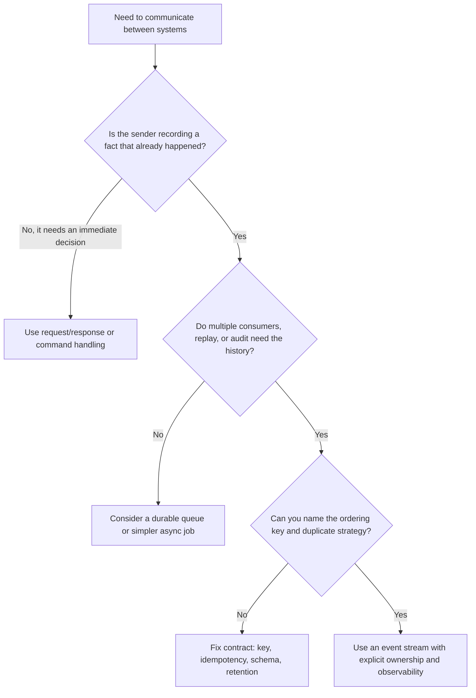

> **Complexity**: `[INTERMEDIATE]`
>
> **Time to Complete**: 3 hours
>
> **Prerequisites**: [Module 1.1 — Stateful Workloads & Storage Deep Dive](../module-1.1-stateful-workloads/), basic Kubernetes operations on version 1.35+, and familiarity with HTTP APIs or message queues

---

## What You'll Be Able to Do

After completing this module, you will be able to:

- **Design event-streaming topologies that use an append-only log as the replayable source of truth**
- **Evaluate partitioning schemes and explain the exact ordering guarantees they do and do not provide**
- **Compare at-most-once, at-least-once, and exactly-once processing using producer, broker, and consumer settings**
- **Diagnose backpressure by separating producer throttling, broker quotas, consumer lag, and downstream saturation**
- **Choose between Kafka and NATS JetStream based on operator posture, latency target, ordering model, and Kubernetes maturity**

## Why This Module Matters

Hypothetical scenario: at first, the incident looks like a normal analytics delay. The checkout service is still accepting orders, the payment provider is still sending settlement events, the warehouse service is still updating inventory, and dashboards are late in the ordinary way dashboards sometimes are. Then support agents notice a deeper problem: shipment notifications mention refunded orders, inventory counts diverge across regions, and fraud review is making decisions from stale account state. The streaming platform is not down, yet the business state built from the stream is no longer trustworthy.

The team did not fail because it forgot a command. It failed because it treated streaming as a faster queue instead of a replayable log with explicit semantics. Some consumers retried messages without idempotency keys, some services assumed partitioned logs gave global order, one team changed partition count during a promotion without understanding the ordering boundary, and another team treated rising consumer lag as a broker problem when the real bottleneck was a slow database write behind the consumer. The system kept moving while several projections quietly became different interpretations of the same history.

Event streaming is a storage and coordination pattern built around an append-only log. Producers append facts, brokers retain those facts according to a policy, and consumers replay them at their own pace. That design is powerful because it decouples teams and time: fraud detection, billing, support search, machine learning features, and warehouse loading can all derive different views from the same source history without asking the checkout service to call each one synchronously. It is also dangerous because every downstream team now owns correctness questions that a simple request path used to hide.

This module gives you the map before you operate the tools. You will learn the semantic difference between events, messages, commands, and requests; why the log is the durable primitive; how partition keys define the real ordering guarantee; how at-most-once, at-least-once, and exactly-once processing are assembled from producer, broker, consumer, and sink behavior; and why event time, watermarks, windows, lag, retention, schema evolution, and replay are not optional vocabulary. If you later deploy Kafka with Strimzi in [Module 1.2](../module-1.2-kafka/) or compare NATS JetStream in Module 1.9, this module is the reasoning layer underneath the YAML.

> **The Event Journal Analogy**
>
> Think of a streaming log as a shared journal in a busy operations room. A command is somebody asking for action, a request/response call is somebody waiting at the desk for an answer, a queue ticket is a work item assigned to one worker, and an event is a journal entry saying what already happened. The journal does not decide every future use of the entry; it preserves a trustworthy sequence so many readers can build their own view.

## Events, Messages, Commands, and Requests

An event is an immutable fact about the past. `OrderCreated`, `PaymentCaptured`, `UserEmailChanged`, and `TemperatureReadingRecorded` describe something that already happened, so consumers should not interpret them as requests for permission or instructions that may be refused. If a later fact changes the business meaning, you append another event such as `OrderRefunded` or `PaymentReversed` rather than editing the earlier event in place. This is why event streams fit audit trails, projections, replay, and data products: they preserve the history from which many derived states can be rebuilt.

A command is different because it expresses intent. `CapturePayment`, `ReserveInventory`, and `SendPasswordResetEmail` are requests for a component to do work, and the correct receiver may reject them, validate them, retry them, or turn them into one or more events after the decision is made. Mixing commands and events in one stream creates confusion because consumers cannot tell whether a record is a fact to learn from or an instruction to execute. Good stream names and event type names make that boundary visible to humans, not just to serializers.

A message is the transport envelope that carries either an event, a command, or another payload. A broker can route messages by topic, subject, partition, consumer group, or subscription, but routing does not define the business semantics. A request/response interaction adds a stronger coupling: the caller waits for an answer now, so latency, availability, and authorization sit on the critical path. Streaming is usually a poor substitute for a decision that must complete before the user gets a response; it is strongest when the decision has happened and other systems need a durable fact.

CloudEvents is useful here because it standardizes event metadata such as `id`, `source`, `type`, `subject`, `time`, and `datacontenttype` without requiring one broker or one payload format. The durable lesson is not that every platform must use that exact envelope. The lesson is that event identity, source, type, subject, timestamp, content type, and partitioning metadata are part of the contract. Without them, consumers cannot deduplicate safely, route consistently, trace failures, or decide whether an old event is still within the meaning of its schema.

## Streaming, Batch, and Request/Response

Streaming, batch, and request/response are three integration styles, not a maturity ladder. Batch works with bounded data: a job reads a known input, computes an answer, and finishes. Request/response works when a caller needs a timely answer from a specific service and can tolerate being coupled to that service's availability. Streaming works with unbounded data: events keep arriving, consumers maintain positions, and derived state changes continuously as the log grows. Mature platforms use all three styles because each one optimizes a different shape of work.

Streaming wins when decoupling, replay, and timeliness matter together. A new consumer can start from retained history, a corrected projection can be rebuilt after a bad deployment, and producers can publish facts without knowing every downstream team that will care later. Those benefits are why streaming appears in change data capture, fraud scoring, observability pipelines, lakehouse ingestion, feature generation, alerting, and event-driven application integration. The log becomes a shared source of integration truth, while each consumer controls its own deployment cadence and recovery path.

The costs are equally real. Streaming introduces eventual consistency, partitioning decisions, offset management, retention budgets, schema compatibility, replay blast radius, and operational signals that are easy to misread. A slow consumer does not necessarily stop a producer, which means failure can become delayed, distributed, and surprising. The question is not "can this be streamed?" The better question is "does retained, replayable history reduce coupling enough to justify the operational surface area?"

## The Log Is the Product

Most engineers first meet messaging through queues.
A producer puts work in.
A worker takes work out.
After the worker acknowledges the item, the queue forgets it.

That model is useful for distributing jobs, but it is not the core idea behind event streaming.

In streaming, the durable log is the product. Consumers do not "take" an event from the log in the way a worker takes a job from a queue. They read it, remember their own position, and leave the event available for other consumers, which means the broker becomes more like a shared history than a task dispenser. Jay Kreps' writing on the log popularized this as a unifying abstraction for data integration because a log lets many systems subscribe to the same sequence without demanding point-to-point wiring from the source.

```text
                  append
        +----------------------+
        |      Producers       |
        | orders, payments,    |
        | inventory, devices   |
        +----------+-----------+
                   |
                   v
        +----------------------+
        |  Append-Only Stream  |
        |                      |
        |  offset 100: A       |
        |  offset 101: B       |
        |  offset 102: C       |
        |  offset 103: D       |
        |  offset 104: E       |
        +----+----------+------+
             |          |
      replay |          | fan-out
             v          v
  +---------------+  +----------------+
  | Billing view  |  | Fraud model    |
  | offset: 104   |  | offset: 102    |
  +---------------+  +----------------+
             |
             v
  +----------------------+
  | Warehouse projection |
  | offset: 099          |
  +----------------------+
```

The same event history can feed billing, fraud detection, search indexing, ML features, warehouse loading, and incident replay.
Each consumer group tracks its own offset.
One group can be caught up while another is deliberately replaying last month.

The log gives you three properties that are easy to understate during design reviews because they sound simple until a recovery depends on them. Append-only history gives you an audit trail, replay gives you a way to rebuild derived state, and fan-out lets teams add consumers without changing the producer's critical path. Every one of those properties depends on retention, schema compatibility, partitioning, and ownership being treated as part of the product contract rather than as broker defaults.

First, it is **append-only**.
New facts are added at the end.
Existing facts are not edited in place.
If an order is refunded, the stream receives a refund event rather than mutating the original order event.
This is why streams pair naturally with audit trails.

Second, it is **replayable**.
A new service can start from the beginning and build its own state.
A broken deployment can rewind to a known offset and reprocess corrected logic.
A data science team can replay historical events into a feature pipeline.

Third, it supports **fan-out**.
The producer does not need to know every future consumer.
The stream becomes a contract between teams.
The payment service publishes `PaymentAuthorized`.
Fraud, billing, analytics, and support tooling can subscribe without adding synchronous calls to the payment path.

That does not mean every event should be huge.
An event should usually contain the facts that changed, the identity of the thing that changed, and enough metadata to route, deduplicate, and debug it.
A common envelope looks like this:

```yaml
id: evt_20260518_9c1d
source: checkout-api
type: order.created
subject: order-88391
time: "2026-05-18T10:25:13Z"
datacontenttype: application/json
partitionKey: customer-991
data:
  orderId: order-88391
  customerId: customer-991
  totalCents: 12850
  currency: USD
```

The important field for this module is `partitionKey`.
It is the bridge between a business invariant and a broker guarantee.

If all events for `customer-991` must be processed in order, the key needs to be stable for that customer.
If all events for `order-88391` must be processed in order, the key needs to be stable for that order.
You cannot postpone that decision until the consumer is written.
The producer is choosing the shape of ordering when it chooses the key.

### Worked Example: Rebuilding a Projection

Imagine a support dashboard stores a materialized view of each order.
It consumes an `orders` stream and writes the latest status into PostgreSQL.

At noon, the team discovers a bug: `OrderRefunded` events were ignored for orders above a certain value.
In a non-replayable queue, the team would need a compensating migration from another database.
In a stream, they can do this:

```text
1. Pause the broken consumer deployment.
2. Deploy fixed projection code under a new consumer group name.
3. Start the new group at offset 0, or at a trusted snapshot offset.
4. Let it replay all order events into a clean table.
5. Compare counts and selected orders against the old table.
6. Switch the dashboard read path to the corrected projection.
```

The replay works because the stream retained the source facts.
The consumer's table was not the source of truth.
It was a projection.

This distinction is not academic. When a team treats a projection as the truth, it starts patching derived state directly and soon loses the ability to explain why two views disagree. When a team treats the log as the truth, it asks a sharper question: does the stream contain enough retained, schema-compatible history to rebuild the projection correctly, and can the consumer apply that history deterministically?

> **Check yourself**: Pick a service you know. If its derived database were deleted, which event stream would let you rebuild it? If the answer is "none," that service is not using the log as its source of truth.

### When a Stream Is Not a Queue

A stream can behave like a queue for one consumer group, but the design intent is different because the event remains valuable after one worker succeeds. A queue is often optimized for work distribution and removal after acknowledgment. A stream is optimized for retained history, independent reader positions, and replay, even when one consumer group uses it in a worker-pool style.

| Question | Queue answer | Stream answer |
|---|---|---|
| What happens after a worker acknowledges a message? | The message is usually removed or hidden permanently. | The event remains until retention removes or compacts it. |
| Can two independent teams consume the same event history? | Usually not without duplicating messages or topics. | Yes, each consumer group tracks its own position. |
| Can a new service replay old events? | Usually no, unless dead-letter or archive behavior was added. | Yes, if retention still contains the needed history. |
| Is the broker the source of truth? | Usually no, it is a work dispatcher. | Often yes, or at least the durable integration source. |

This is why "just use Kafka as a queue" often leads to pain. If there is exactly one worker pool, no replay requirement, no fan-out, and no need to retain history, a durable task queue may be simpler and easier to reason about. Streaming earns its complexity when the history itself has value: rebuilding projections, auditing facts, adding consumers, comparing new logic against old logic, or replaying data through a corrected processor.

## Partitions Decide Ordering

No serious streaming platform gives infinite ordering, infinite throughput, and infinite availability at the same time. Partitions are the compromise: the platform splits a topic or stream into ordered shards, places those shards across nodes, and lets consumers process different shards in parallel. That gives you scale, but it narrows the ordering guarantee to the shard that contains a given record.

Kafka orders records within a partition.
NATS JetStream orders messages within a stream or ordered consumer view, but subject filters and shared pull consumers change how applications observe that order.
Neither system gives you simple global ordering across all business entities at high scale.

The practical rule is worth memorizing because it prevents a large class of design mistakes:

```text
Ordering is per key when the key always maps to the same ordered shard.
Ordering is not global unless you accept a single ordered shard.
```

### Worked Example: Three Partitions

Suppose the `orders` topic has three partitions.
The producer uses `customerId` as the key.
The partitioner hashes the key and maps it to a partition.

```text
orders topic

Partition 0
+--------+-------------------+------------------------------+
| Offset | Key               | Event                        |
+--------+-------------------+------------------------------+
| 0      | customer-a        | OrderCreated(order-10)       |
| 1      | customer-a        | PaymentAuthorized(order-10)  |
| 2      | customer-d        | OrderCreated(order-13)       |
+--------+-------------------+------------------------------+

Partition 1
+--------+-------------------+------------------------------+
| Offset | Key               | Event                        |
+--------+-------------------+------------------------------+
| 0      | customer-b        | OrderCreated(order-11)       |
| 1      | customer-b        | OrderCancelled(order-11)     |
| 2      | customer-e        | OrderCreated(order-14)       |
+--------+-------------------+------------------------------+

Partition 2
+--------+-------------------+------------------------------+
| Offset | Key               | Event                        |
+--------+-------------------+------------------------------+
| 0      | customer-c        | OrderCreated(order-12)       |
| 1      | customer-c        | AddressChanged(customer-c)   |
| 2      | customer-f        | OrderCreated(order-15)       |
+--------+-------------------+------------------------------+
```

For `customer-a`, `OrderCreated` is processed before `PaymentAuthorized` because both events are in partition 0.
For `customer-b`, `OrderCreated` is processed before `OrderCancelled` because both events are in partition 1.

There is no meaningful global order between `customer-a` offset 1 and `customer-b` offset 1.
They live in different partitions.
The broker can process, replicate, and deliver them independently.

If a dashboard says "show all events exactly as they happened across the company," the stream cannot magically produce one total order unless the design forces all events through one partition or adds a separate sequencing service.
That usually trades away throughput and availability.

### Key Choice Changes the Business Guarantee

The same event can be partitioned several ways.
Each choice protects a different invariant.

| Partition key | Ordering you get | Ordering you lose | Typical fit |
|---|---|---|---|
| `orderId` | All events for one order stay ordered. | A customer's many orders may interleave across partitions. | Order lifecycle, fulfillment, refunds. |
| `customerId` | All customer events stay ordered. | A hot customer or tenant can overload one partition. | Account state, fraud, entitlement changes. |
| `tenantId` | Tenant-level audit order is preserved. | High-volume tenants become hot spots. | Multi-tenant billing and compliance logs. |
| Random or round-robin | Maximum distribution. | Business ordering is mostly gone. | Metrics, independent telemetry, fire-and-forget analytics. |

There is no "best" key without a business rule. The key is the answer to the question: "Which events would be dangerous to process out of order?" A platform review should force that sentence into the design note because the wrong key can make a stream look healthy while a business invariant breaks quietly downstream.

### Active Exercise: Predict the Failure

Your team emits these events:

```text
UserEmailChanged(user-7, old=a@example.com, new=b@example.com)
PasswordResetRequested(user-7, email=b@example.com)
MarketingConsentRevoked(user-7)
```

If the producer partitions by `eventType`, the three events may land in three different partitions.
The password reset worker might observe the reset before the email change.
The marketing system might send a campaign before consent revocation is processed.

> **Check yourself**: What partition key would you choose if account security is the highest-risk workflow? What if marketing analytics is the only consumer and all events are independent counters?

### Repartitioning Is a Migration

Increasing partitions sounds harmless because the change is presented as a scaling knob, but it is not always harmless. In a partitioned log, the count of partitions is part of the mapping from key to ordered shard, so changing that count can change where future records for a key land.

In Kafka, changing a topic from three partitions to six partitions changes the key-to-partition mapping for many keys.
New events for a key may go to a different partition than old events.
That can break order for consumers that replay a mixed range of old and new records.

A safe repartition plan usually includes one of these moves, and each one should be reviewed as an application migration rather than a broker-only change:

| Strategy | How it works | Trade-off |
|---|---|---|
| Create a new topic | Write to `orders-v2` with the new partition count and migrate consumers. | Cleanest ordering boundary, but more rollout work. |
| Version the key | Include a routing version and teach consumers where the boundary is. | More application complexity. |
| Keep old topic stable | Add throughput by splitting by domain, not by mutating partitions. | Requires topic design work. |
| Accept the break | Use only when records are independent and order is not a correctness requirement. | Easy to underestimate risk. |

Operators need to treat partition count as an architectural decision, not just a capacity knob. The safest moment to choose it is before producers depend on ordering and consumers depend on replay. After that, repartitioning becomes a compatibility problem involving producers, consumers, offsets, retention, and sometimes historical backfills.

## Delivery Semantics Are a Ladder

Delivery semantics describe what can happen during failures, not moral grades. At-most-once can be correct for disposable telemetry, at-least-once can be correct for payments when consumers are idempotent, and exactly-once processing can be valuable for stream-to-stream transformations. The important phrase is "during failures," because a system that looks duplicate-free on a normal day may reveal its real contract only during producer retry, broker leadership change, consumer crash, or sink timeout.

The ladder looks like this, but every rung has a scope that you must state explicitly:

```text
At-most-once
  Message may be lost.
  Message should not be redelivered.

At-least-once
  Message should not be lost after acknowledgment rules are met.
  Message may be redelivered.

Exactly-once processing
  The system coordinates writes and offsets so each input affects the committed output once.
  Scope matters: stream-to-stream is different from stream-to-email.
```

The dangerous phrase is "exactly-once delivery." In most real systems, the broker can only coordinate the parts it owns or the clients that participate in its protocol. Kafka transactions, for example, can coordinate consumed offsets with produced output records for cooperating clients, but they cannot make a non-transactional email provider forget an email that was already sent. Exactly-once is best understood as effectively-once behavior inside a defined boundary, assembled from idempotent producers, transactions, deterministic processing, idempotent sinks, and careful offset rules.

### Worked Example: The Same Failure Under Three Semantics

A consumer reads `PaymentCaptured(order-10)`.
It writes a row to a reporting table.
Then the process crashes before committing its offset.

| Semantic target | What happens after restart | Correct design response |
|---|---|---|
| At-most-once | The offset may have been committed before processing, so the row might be missing. | Use only if missing data is acceptable or can be recovered elsewhere. |
| At-least-once | The event is read again, so the row might be written twice. | Make the database write idempotent with `event_id` or an upsert key. |
| Exactly-once stream processing | The output write and consumed offset commit are atomic inside the streaming transaction. | Keep output in a transactional sink that participates, or accept a weaker boundary. |

The lesson is not "always use exactly-once."
The lesson is "know where duplicates or loss can appear, then design the side effect."

### Kafka Semantics Table

Kafka's official producer documentation describes idempotence, retries, acknowledgments, and transactions as separate pieces.
The table below turns those pieces into an operator checklist.

| Goal | Producer settings | Consumer settings | Offset behavior | What it protects | What it does not protect |
|---|---|---|---|---|---|
| At-most-once | `acks=0` or low durability settings, retries disabled or irrelevant | Commit offset before processing | Offset advances before work finishes | Avoids duplicate processing from broker redelivery | Can lose messages during producer, broker, or consumer failure |
| Basic at-least-once | `acks=all`, retries enabled | Process first, commit offset after success | Offset advances only after work succeeds | Avoids acknowledged data loss under normal failures | Can duplicate side effects after crashes |
| Idempotent production | `enable.idempotence=true`, `acks=all`, retries enabled, bounded in-flight requests | Same as at-least-once | Same as at-least-once | Prevents duplicate records caused by producer retry within the producer session | Does not deduplicate application-level resends with new IDs |
| Transactional stream-to-stream | `transactional.id` set, idempotence active | `isolation.level=read_committed` for downstream readers | Consumer offsets are sent to the producer transaction | Atomically commits output records and consumed offsets | Does not make arbitrary external calls exactly-once |
| Application-level exactly-once effect | Same as transactional where possible | Consumer uses idempotency key at sink | Sink records processed `event_id` or equivalent | Gives exactly-once effect in a database or API designed for idempotency | Requires sink support and careful schema design |

For Kafka, remember the three moving parts because each one solves a different part of the failure story:

- Idempotent producers prevent duplicate writes caused by producer retries.
- Transactions coordinate output records and consumed offsets.
- `isolation.level=read_committed` prevents consumers from reading aborted transactional writes.

Those are necessary for exactly-once stream processing with Kafka, and they are not enough for every side effect. The moment a consumer writes to a database, calls a webhook, sends an email, or updates a third-party API, the application must decide how that sink detects duplicates and how it recovers from uncertainty.

### NATS JetStream Semantics Table

NATS Core and NATS JetStream have different reliability postures.
Core NATS is a fast message bus with at-most-once delivery.
JetStream adds persistence, replay, acknowledgments, redelivery, retention policies, and publish acknowledgments.

| Goal | JetStream posture | Consumer posture | What it protects | What to design yourself |
|---|---|---|---|---|
| Fast at-most-once | Core NATS or unacknowledged push consumer | Subscriber must be online and fast | Very low latency message distribution | Recovery after subscriber outage |
| At-least-once | JetStream publish acknowledgments and explicit consumer acknowledgments | Ack only after processing succeeds | Redelivery when processing fails or ack is lost | Idempotent consumer side effects |
| Publisher duplicate suppression | Set a unique message ID header for a deduplication window | Same as at-least-once | Retries that publish the same message ID | Duplicate sends outside the dedupe window |
| Stronger consumer acknowledgment | Use double-ack style confirmation where the client waits for the server to confirm the ack | Consumer treats unconfirmed ack as uncertain | Reduces false redelivery after ack uncertainty | External side effects still need idempotency |
| Work queue retention | Use work-queue retention when each message should be consumed by one worker group | Avoid overlapping consumers on the same subject | Queue-like distribution with persistence | Long-term replay to many independent teams |

JetStream's model is often easier for request-adjacent messaging and edge deployments.
Kafka's model is often stronger for large analytic logs, long retention, and mature stream-processing ecosystems.
The correct choice depends on the failure you are trying to make boring.

### Idempotency Is the Safety Net

At-least-once systems intentionally allow duplicates because they prefer repeated work over silent loss. That means the consumer must be safe to run twice, and "safe" must be true at the side effect boundary, not only inside the message handler's memory.

For a database sink, the simplest pattern is to store the event ID with a unique constraint in the same database that receives the business update. The table is not just bookkeeping; it is the durable memory that lets the consumer recognize that a redelivered event already changed state.

```sql
CREATE TABLE processed_events (
  event_id TEXT PRIMARY KEY,
  processed_at TIMESTAMPTZ NOT NULL DEFAULT now()
);
```

Then the consumer makes the side effect conditional on the insert succeeding, so a crash after the database commit and before the offset commit turns into a harmless duplicate rather than a second business update.

```text
1. Begin database transaction.
2. Insert event_id into processed_events.
3. If insert conflicts, skip the side effect and commit.
4. Apply the business update.
5. Commit database transaction.
6. Acknowledge or commit the stream offset.
```

This pattern does not require a magic broker feature. It requires the sink to remember which event IDs already changed state and to make that memory transactional with the state change itself. If the event ID insert and the business update can commit separately, the consumer has simply moved the uncertainty from the broker into the database.

## Time and Correctness in Streams

Streaming systems force you to ask which clock you mean. Event time is the time at which the business fact happened, such as when a customer clicked a button or a device measured a temperature. Processing time is the time at which a processor observes the event. Ingestion time sits between them: the time the broker or pipeline first received the event. These clocks often agree in demos, but they diverge in production when mobile clients reconnect, edge devices buffer data, networks partition, producers retry, or a consumer replays old records through new code.

The Dataflow model popularized this distinction because correctness over unbounded, out-of-order data depends on it. If a payment event happened at 10:00 but arrived at 10:07, a processing-time window for 10:05 might miss it while an event-time window for 10:00 can still include it. That difference matters for fraud thresholds, billing summaries, inventory counts, and alerting because the business usually cares when the fact occurred, not when a worker finally saw it. Event time gives you a better semantic target, but it also requires a policy for late and out-of-order data.

Watermarks are that policy's visible signal. A watermark is the system's estimate that it has probably seen all events up to a certain event-time point, so it can close or emit results for windows before that point. Watermarks are not magic truth; they encode assumptions about lateness and completeness. An aggressive watermark gives lower latency but increases the chance of late corrections. A conservative watermark waits longer and produces more complete answers, but it delays results. Streaming correctness is often a tradeoff among completeness, latency, and operational cost rather than a single perfect answer.

Windows turn an unbounded stream into finite pieces that a processor can aggregate. A tumbling window assigns each event to one fixed interval, such as five-minute buckets. A sliding window overlaps intervals, so one event can contribute to multiple rolling views. A session window groups events separated by gaps of inactivity, which is useful when behavior has natural bursts rather than clean clock boundaries. The right window follows the business question: "orders per minute" is not the same as "active checkout sessions" or "suspicious bursts after account change."

Late data should be designed into the output contract instead of treated as an exception. Some systems emit an early estimate, then a corrected result when late events arrive. Some emit only final results after the watermark passes. Some route very late records to a side output for review or compensating repair. The platform does not decide this alone because different consumers have different tolerance for correction. A real-time dashboard may accept provisional numbers, while a billing report may require a slower but more complete result.

```text
Event time line:

10:00   10:01   10:02   10:03   10:04
  |------- five-minute tumbling window -------|

Arrival order:
  event A: happened 10:00, arrived 10:00
  event C: happened 10:02, arrived 10:02
  event B: happened 10:01, arrived 10:05

Question:
  Do you update the 10:00 window when B arrives late,
  ignore B, or send B to a correction path?
```

This is where event streaming becomes more than broker administration. A platform team can provide Flink checkpoints, Kafka offsets, or JetStream retention, but the application team still owns the meaning of time. If the stream carries business facts, every aggregation should state its event-time field, window type, allowed lateness, late-data handling, and whether outputs are provisional or final.

## Backpressure Is a Signal, Not a Panic Button

Backpressure means one part of the pipeline cannot keep up with another, and in streaming this is normal rather than automatically alarming. The point of a durable log is that consumers can fall behind temporarily without forcing producers to stop immediately. The operational question is whether lag is bounded, intentional, and recoverable before retention or downstream correctness is at risk.

```text
Producer rate: 20,000 events/sec
Broker append: 20,000 events/sec
Consumer read: 18,000 events/sec
Sink write:    12,000 events/sec

Result:
  Broker looks healthy.
  Consumer lag grows.
  The real bottleneck is the sink.
```

A healthy operator asks where pressure is accumulating before changing capacity. Broker metrics, producer latency, consumer lag, and sink latency describe different failure modes, so a single "streaming is slow" page is rarely enough context for a safe response.

| Pressure location | Symptom | First metric to inspect | Common fix |
|---|---|---|---|
| Producer client | Sends block, time out, or receive throttle responses | Producer request latency, buffer pool wait, error rate | Batch better, slow producer, increase broker capacity, fix quota |
| Broker | Disk, network, or CPU saturation | Broker request queue, disk I/O, under-replicated partitions | Add brokers, rebalance partitions, tune retention, reduce hot keys |
| Consumer | Lag rises while broker remains healthy | Lag per partition, processing time, rebalance count | Scale consumers up to partition count, optimize handler, reduce rebalances |
| Downstream sink | Consumer processing time rises | Database latency, connection pool wait, write errors | Batch writes, add indexes carefully, isolate slow sinks |

Consumer lag is not automatically bad.
Lag during a replay is expected.
Lag after a planned downstream maintenance window is expected.
Lag that grows during normal traffic and never drains is a capacity problem.

### Hypothetical scenario: The Lag Was Not Kafka

A platform team receives an alert that looks dramatic because lag is rising quickly:

```text
consumer_group=fraud-score-writer
topic=payments
lag=9,800,000
lag_trend=increasing
broker_cpu=42%
broker_disk_io=normal
consumer_rebalances=0
db_write_latency_p95=1800ms
```

A first instinct might be to add Kafka brokers, but that would not fix the incident. The brokers are not saturated, the consumer group is stable, and the database write latency is high. The stream is exposing a slow sink, not causing it.

A better response separates each stage of the path and changes only the bottleneck that evidence supports:

```text
1. Confirm lag is concentrated in all partitions or only one hot partition.
2. Check consumer handler timing: deserialize, score, write, commit.
3. Inspect downstream database p95 and p99 write latency.
4. Temporarily increase consumer batch size if the sink benefits from batching.
5. Add consumers only if partitions are available and the sink can absorb more writes.
6. Throttle noncritical producers if retention risk appears.
```

Adding consumers without fixing the sink can make the outage worse by increasing database concurrency. Adding brokers without fixing the sink can make the chart look more expensive without making the projection catch up. Backpressure work is disciplined diagnosis, not reflexive scaling.

### Kafka vs NATS Backpressure

Kafka and NATS JetStream both expose pressure, but they guide operators differently because their consumer and retention models are shaped differently. The durable idea is to look for the point where demand exceeds safe capacity, then decide whether to slow producers, isolate noncritical consumers, add processing parallelism, increase sink capacity, or protect retention.

| Backpressure concern | Kafka posture | NATS JetStream posture | Operator interpretation |
|---|---|---|---|
| Consumer lag | First-class concept through offsets per partition and consumer group lag | Consumer state tracks delivered and acknowledged positions; pull consumers make demand explicit | Kafka makes lag dashboards very natural; JetStream often makes per-consumer pending and ack metrics central |
| Producer throttling | Broker quotas can throttle producers or consumers; clients may block when buffers fill | Server limits, max pending, publish acknowledgments, and discard policies shape producer behavior | Kafka is quota-heavy for multi-tenant clusters; JetStream is often subject and stream limit heavy |
| Broker-side quotas | Quotas can be applied to clients, users, or IPs depending on deployment | Account limits, stream limits, and server resource limits are the common levers | Both need intentional tenancy design before noisy neighbors appear |
| Slow consumer behavior | Lag accumulates in the log until retention removes old records | Push consumers can hit pending limits; pull consumers naturally request what they can handle | Pull-based JetStream consumers are often easier for worker-style backpressure |
| Replay pressure | Replays can generate high read load across brokers | Replays can be instant or original-rate depending on consumer policy | Replays need SLOs; do not let a backfill starve production consumers |

Backpressure handling is an operations contract. The producing team, platform team, and consuming team should agree on these values before launch because the first serious lag event is a poor time to negotiate which producer may be throttled or which replay may continue:

- Maximum acceptable lag by consumer group.
- Retention window large enough to survive expected outages.
- Whether noncritical producers may be throttled first.
- Which consumers are allowed to replay during peak hours.
- What happens when a sink is down longer than retention.

## Retention Is Product Policy

Retention is often configured as if it were storage housekeeping, but it is really product policy. A stream's retention setting defines how long the platform can recover from consumer downtime, how far a new service can replay history, how long a projection can be rebuilt without another source, and how long sensitive facts remain on disk.

If the stream is the source of truth for rebuilding a projection, retention defines how far back you can recover without another system.
If the stream feeds compliance analytics, retention defines what the audit can prove.
If the stream contains sensitive data, retention also defines how long risk remains on disk.

There are three common retention modes, and they answer different questions rather than competing as generic defaults.

| Retention mode | How it works | Choose it when | Avoid it when |
|---|---|---|---|
| Time-based | Keep records for a duration such as seven days or ninety days. | Consumers need a recovery window measured in time. | Storage cost or privacy rules require tighter bounds. |
| Size-based | Keep records until the log reaches a byte limit. | Storage budget is the hard cap and traffic is predictable. | Traffic spikes could delete history earlier than consumers expect. |
| Log-compacted | Keep the latest record for each key, plus some recent history depending on broker behavior. | Consumers need the latest state per key, such as account settings or feature flags. | Every historical transition matters for audit or analytics. |

Time-based retention answers, "How long can a consumer be down?"
Size-based retention answers, "How much storage can this stream consume?"
Compaction answers, "What is the latest value for each key?"

### Worked Example: Choosing Retention

Three teams ask for event storage.

| Stream | Need | Retention choice | Reasoning |
|---|---|---|---|
| `orders.events` | Rebuild operational projections after a bad deploy. | Time-based, long enough for rollback and incident response. | Every transition matters, so compaction would lose history. |
| `user.preferences` | New services need the latest preference for each user. | Log-compacted by user ID. | Consumers care about current state, not every toggle. |
| `edge.metrics.raw` | High-volume device metrics used for near-real-time alerts. | Size-based or short time-based retention. | Long-term analytics should be downsampled into another store. |

The mistake is configuring all three the same way. They carry different business promises, and those promises should be visible in the stream contract beside owner, schema, key, retention, replay expectation, and access controls.

### Retention and Replay Must Match

If retention is seven days and the warehouse consumer is down for eight days, the stream cannot fully rebuild the warehouse.
The missing data may still exist in another source, but the stream contract failed.

That is why production stream reviews should include this question, stated plainly enough that product owners and incident commanders can both understand the consequence:

```text
What is the longest credible outage for each consumer,
and does retention exceed that outage plus detection and repair time?
```

If the answer is no, increase retention, add a cold archive, or stop claiming the stream can rebuild that projection. The worst answer is to keep a short retention window while telling downstream teams that replay is their disaster recovery plan.

## Architecture Patterns That Reuse the Log

Publish/subscribe and queues are often mentioned together, but they solve different coordination problems. In publish/subscribe, a producer publishes a fact once and many independent subscribers may react to it. In a work queue, one item is usually assigned to one worker from one logical pool. Streaming logs can support both shapes, but the platform should name which one a stream is serving. A long-retention order event stream with several consumer groups is a pub/sub and replay primitive; a work-queue stream for image resizing is a durable worker distribution primitive that should not pretend to be the source of business history.

The log as a shared source of truth is the pattern behind many modern data platforms. A service records domain events, downstream consumers build tables, indexes, feature stores, caches, alerts, and lakehouse tables, and each derived view records how far it has read. Kreps calls out the duality between tables and event logs: a table is the current state at a point in the log, while the log is the sequence of changes that can produce tables. That idea explains why change data capture, event sourcing, and stream processing keep reappearing in different tool ecosystems.

Kappa and Lambda architectures are two ways to organize this relationship between historical and real-time computation. Lambda keeps a batch layer for recomputing authoritative views and a speed layer for low-latency updates, then merges the two. Kappa tries to simplify the design by using the same streaming path for live processing and replay, so history is reprocessed by reading the log again. The durable tradeoff is not branding; it is whether one unified processing path can handle both live latency and historical correction without making replay too risky or too slow.

Event sourcing and CQRS take the log idea into application architecture. Event sourcing stores state changes as events and derives current state by applying them in order. CQRS separates the write model that validates commands from read models optimized for queries. Those patterns can be powerful, but they also raise hard questions about schema evolution, replay duration, snapshotting, and operational repair. Module 1.8 covers CloudEvents and event-driven architecture more directly; in this module, remember that event sourcing is not required for every event stream, and every event stream is not automatically an event-sourced system.

Dead-letter queues and replay paths are part of the architecture, not cleanup afterthoughts. A consumer may reject an event because the payload violates schema, because a referenced entity is missing, because a downstream API is unavailable, or because the handler contains a bug. Retrying forever can block progress, while dropping the event loses history. A dead-letter path preserves the failed record with enough metadata to inspect, repair, and reprocess it. A replay path defines how corrected code reads retained history without overwhelming production sinks or duplicating external side effects.

Backpressure and flow control close the loop between architecture and operations. A pub/sub diagram can make every downstream consumer look independent, but they still share broker storage, network, retention, and sometimes sink capacity. A replaying analytics consumer can starve operational consumers if reads are not limited. A hot key can make one partition the bottleneck while averages look fine. A durable streaming architecture therefore includes not only topics and consumers, but also quotas, priorities, replay windows, owner escalation, and observability for each stage.

## Landscape Snapshot and Tool Rosetta

> **Landscape snapshot — as of 2026-06. This changes fast; verify against vendor docs before relying on specifics.**
>
> Kafka, Flink, Spark Structured Streaming, Airflow, NATS JetStream, CloudEvents, and lakehouse table formats all appear in cloud-native data platforms, but they are not interchangeable products in one ranked list. Kafka is commonly used as a partitioned replay log, NATS JetStream adds persistence and replay to a subject-based messaging system, Flink and Spark process streams, Airflow orchestrates scheduled workflows, and CloudEvents standardizes event metadata. Treat these as peers in a capability map, then verify current versions, operators, APIs, and deployment guidance in the tool-specific modules or upstream docs before making implementation choices.

| Durable capability | Kafka-shaped option | NATS JetStream-shaped option | Stream processing option | Orchestration or table option |
|---|---|---|---|---|
| Replayable transport | Partitioned topics, offsets, retention, consumer groups | Streams, subjects, durable consumers, acknowledgments | Reads from transports and writes derived streams or tables | Airflow may trigger batch jobs; table formats retain analytic history |
| Ordering and parallelism | Per-partition order controlled by key and partition count | Stream and subject order, with consumer mode shaping delivery | Keyed state and operator parallelism define processing order | Table commits define snapshot order, not message delivery order |
| Failure recovery | Producer idempotence, replication, transactions, offset commits | Publish acknowledgments, explicit acks, redelivery, duplicate windows | Checkpoints, savepoints, state backends, replay from source | Task retries, idempotent jobs, ACID table commits |
| Schema and contract | Schema registry patterns and compatibility policies | Envelope discipline and subject conventions | Typed pipelines and compatibility checks at boundaries | Table schema evolution and metadata history |
| Platform ownership | Broker, topic, schema, quota, retention, and consumer group policy | Server, account, stream, subject, consumer, and limit policy | State storage, checkpoint location, job upgrades, and backfills | DAG ownership, table ownership, compaction, retention, and governance |

Kafka and NATS JetStream overlap, but they do not feel the same to operate because the abstractions lead teams to different first questions. Kafka asks you to reason early about topics, partitions, keys, replication, offsets, consumer groups, and retention. NATS asks you to reason early about subjects, service communication, stream capture, consumers, acknowledgments, and account limits. Neither posture is universally better. The useful decision is to match the workload's ordering model, replay depth, latency target, team skill, Kubernetes operating model, and surrounding ecosystem.

| Criterion | Kafka posture | NATS JetStream posture | Strong fit signal |
|---|---|---|---|
| Replay depth | Designed around durable partitioned logs and independent consumer group offsets. | Adds replayable persistence to subject-based messaging. | Use the log-shaped posture when many teams replay history independently. |
| Latency shape | Often tuned by batching, replication, and throughput goals. | Often attractive for request-adjacent messaging and pull-based workers. | Use the subject-shaped posture when service messaging dominates and replay is selective. |
| Ordering model | Per-partition order; key choice controls business order. | Stream and consumer configuration shape observed order. | Choose the model whose ordering boundary matches the business invariant. |
| Operations | Broker storage, partition placement, quotas, rebalances, schemas, and retention need explicit ownership. | Accounts, subjects, streams, replicas, pending limits, and consumers need explicit ownership. | Pick the system your platform can operate during failure, not the one with the shortest demo. |
| Ecosystem fit | Connectors, stream processors, schema registries, and lakehouse ingestion often expect a Kafka-shaped log. | Service meshes, request/reply, edge messaging, and lightweight workers may fit a NATS-shaped fabric. | Match the neighboring tools and teams before optimizing an isolated benchmark. |

No table replaces a proof of concept, but the table prevents two common mistakes: choosing Kafka for every message because the data team already runs it, or choosing NATS JetStream for a long-retention analytic backbone because a first demo was simpler. A serious proof of concept should test the specific failure modes you care about: producer retry, broker restart, consumer crash after side effect, hot key, replay under load, late data, schema change, and retention boundary.

The manifest-level expression changes by tool, and that is why this conceptual module avoids pinning a CRD as the lesson. The durable contract is the same whether a later module expresses it as a `KafkaTopic`, a NATS stream, a Terraform resource, or a managed-service setting: name the owner, key, ordering invariant, replication or durability target, retention policy, replay expectation, schema compatibility rule, and consumer responsibilities. A concise design sketch like the one below is often more valuable in review than a copied manifest with unclear semantics.

```yaml
streamContract:
  name: orders.events
  owner: checkout-platform
  semanticRole: replayable-domain-event-log
  key: orderId
  orderingInvariant: "All lifecycle facts for one order are processed in order."
  retention:
    mode: time
    minimum: 35d
    reason: "Supports fraud replay plus operational recovery buffer."
  consumers:
    - name: warehouse-projector
      deliveryTarget: at-least-once
      duplicateDefense: "Idempotent projection update keyed by event_id."
    - name: fraud-experiment-runner
      deliveryTarget: replayable-at-least-once
      duplicateDefense: "Experiment output deduplicates by event_id and run_id."
```

## Patterns & Anti-Patterns

Patterns are useful when they name a repeatable shape and the reason it works. Anti-patterns are useful when they name a tempting shortcut and the failure it creates. Streaming has both because the same broker can support clean event-driven decoupling or hide a fragile chain of distributed side effects.

### Pattern: Publish Facts, Not Instructions

Publish events when the domain decision has already happened and other systems need to learn from it. `PaymentCaptured` lets accounting, fraud, support, and analytics build their own views without forcing the payment path to call every consumer. The producing service still owns the command validation and transaction that created the fact, while the stream distributes the result. This pattern keeps the source of truth clear: commands ask for change, events record change.

### Pattern: Build Projections From Replayable History

Use streams to build read models, indexes, lakehouse ingestion jobs, and feature pipelines when those derived views can be rebuilt from retained history. The projection should store its consumed position, apply events idempotently, and have a documented replay plan that protects production sinks from overload. This pattern gives teams a recovery path after bad code, schema mistakes, or lost derived storage because the projection is not the only copy of the facts.

### Pattern: Separate Operational and Experimental Consumers

Give operational consumers and experimental consumers different consumer groups, quotas, alert policies, and replay windows. A warehouse projection that supports support agents has different urgency than a fraud experiment replaying last month's history. Separating them lets the platform protect business-critical lag while still allowing exploration. The anti-pattern is letting a backfill or model experiment compete invisibly with production consumers for broker, network, or sink capacity.

### Pattern: Treat Schemas as Compatibility Contracts

Every event schema is a compatibility promise between a producer and current or future consumers. A producer can add optional fields more safely than it can rename required ones; a consumer can ignore unknown fields more safely than it can assume every producer deploys at the same time. Whether the platform uses a registry or a simpler review process, the durable rule is the same: schema evolution must be deliberate because replay means old events and new code will meet.

### Anti-Pattern: Streaming Because It Sounds Future-Proof

Streaming is attractive because it sounds future-proof, but it can be the wrong tool. The anti-pattern is not "using Kafka" or "using NATS." The anti-pattern is making a simple coordination problem harder by adding replay, partitioning, offset management, retention, schema evolution, and eventual consistency without a business need.

### Anti-Pattern: Synchronous Request/Response Hidden in a Stream

If a user clicks "Place Order" and the API must return a payment authorization immediately, a stream is usually not the request path. Use synchronous HTTP, gRPC, or request/reply messaging for the decision that must happen now, then publish an event after the decision. The event records the fact; it should not pretend that an asynchronous consumer is part of the immediate user response.

```text
Good shape:

Checkout API --sync--> Payment API
Checkout API --append--> OrderCreated stream
Payment API  --append--> PaymentAuthorized stream
```

The stream records the fact.
It does not pretend an asynchronous consumer is part of the immediate user response.

### Anti-Pattern: Single Durable Worker With No Replay Need

If there is exactly one logical consumer and messages should disappear after work completes, a durable queue may be a better fit. You can implement one-off background jobs with a stream, but the stream's extra concepts should pay for themselves through replay, fan-out, auditability, or shared history.

Examples that often do not need a replayable event log include these worker-style tasks:

- Resize uploaded images.
- Send a password reset email.
- Run one background export job.
- Trigger a one-off cache warm task.

You can implement these with a stream, and sometimes that is reasonable if the platform already standardizes on one broker. But if nobody needs fan-out or replay, the stream's extra concepts may not pay rent, and an ordinary work queue can be easier to secure, monitor, and explain during incidents.

### Anti-Pattern: Replacing OLTP

A stream is not a replacement for the database that enforces current transactional state. The log records facts and distributes change, but the system that validates a command still needs a transactional boundary for uniqueness, balance checks, locks, authorization, and current-state decisions.

Do not ask a stream to answer questions that require immediate, authoritative state:

- "Is this username available right now?"
- "Can this account spend this balance?"
- "Did this unique invoice number already get issued?"
- "Which row should this transaction lock?"

Those are OLTP questions. Use a database transaction or another authoritative state system to make the decision, then publish the event describing what happened. The stream can feed projections of that decision, but it should not become the thing that pretends eventual state is immediate state.

### Anti-Pattern: Infinite Retention Without Ownership

Keeping everything forever sounds safe until storage costs, privacy obligations, access-control drift, and schema drift arrive. Every retained stream needs an owner, deletion policy, schema compatibility policy, and replay expectation because old data is not just old bytes. It is a long-lived contract with risk attached.

If no team owns those decisions, the stream becomes an expensive archive nobody trusts. If a team does own them, long retention can be a deliberate product feature rather than a vague hope that storage will make future recovery easy.

## Decision Framework

Use this framework when a team proposes a new stream or wants to move a workflow from request/response or batch into event streaming. The goal is not to force every answer toward streaming. The goal is to make the tradeoff visible before producers, consumers, schemas, retention, and dashboards become hard to change.

| Question | Stream-favoring answer | Non-streaming-favoring answer | Design consequence |
|---|---|---|---|
| Is the record a fact about the past? | The producer has already made the domain decision and other systems need to learn it. | The caller needs an immediate decision or a worker needs a private task. | Publish an event only after the authoritative decision. |
| Does retained history have value? | New consumers, projection rebuilds, audits, or experiments need replay. | The item is useful only until one worker completes it. | Size retention from recovery and replay requirements. |
| What order must be preserved? | There is a clear entity key such as order, customer, tenant, or device. | Records are independent or require one global sequence. | Key by the invariant or avoid a partitioned stream. |
| Can consumers tolerate duplicates? | Sinks can deduplicate by event ID or apply idempotent updates. | Duplicate side effects would be unsafe and cannot be guarded. | Use idempotency, transactions, or a different integration pattern. |
| How late can data arrive? | The business accepts event-time windows, watermarks, and correction policy. | The business needs immediate final answers with no late correction. | Define windowing and lateness before building dashboards. |
| Who owns operations? | Topic, schema, retention, lag, replay, and dead-letter ownership are named. | Ownership stops at "the platform runs the broker." | Do not launch until the stream has an operating contract. |



## Did You Know?

- **Kafka's exactly-once story is scoped to cooperating clients.** Idempotent producers and transactions are powerful, but consumers that call non-transactional external APIs still need idempotency keys or compensating logic.
- **NATS JetStream can replay at original speed.** That makes it useful for staging traffic against a test consumer without flooding it faster than production originally published.
- **Consumer lag can be healthy.** A replaying consumer, a paused backfill, or a planned downstream outage can create lag that is expected and bounded.
- **Log compaction is not archival.** It preserves the latest value per key for state reconstruction, but it is the wrong mode when every historical transition must be audited.

## Common Mistakes

| Mistake | Why it hurts | Better move |
|---|---|---|
| Assuming Kafka ordering is global | Different partitions advance independently, so cross-key order is not guaranteed. | Choose a key that matches the business invariant that must stay ordered. |
| Increasing partitions as a casual scaling fix | Key-to-partition mappings can change, splitting old and new records for the same key. | Treat repartitioning as a migration with a new topic or explicit boundary. |
| Treating exactly-once as an end-to-end checkbox | Broker transactions do not make emails, webhooks, or arbitrary database writes exactly-once. | Use idempotency keys and transactional sink design. |
| Alerting on raw lag without context | A planned replay can look like an outage, while a small lag on a critical stream can be serious. | Alert on lag age, trend, consumer purpose, and retention risk. |
| Using streaming for synchronous decisions | Users wait on an asynchronous path that is harder to debug and time out correctly. | Make the immediate decision synchronously, then publish the fact. |
| Setting retention by storage budget only | Consumers may be unable to recover after an outage that exceeds the retained window. | Size retention from recovery objectives, then manage cost explicitly. |
| Choosing random keys for business events | Throughput improves, but related events can process out of order. | Use random keys only when events are genuinely independent. |
| Running every workload through one giant topic | Schemas, retention, ownership, and access control become tangled. | Split streams by domain contract and lifecycle. |

## Quiz

### Question 1

Your team deployed a Kafka consumer that writes payment summaries to PostgreSQL.
Consumer lag is climbing, broker CPU is normal, and database write latency increased after a new index was added.
What do you check first?

<details>
<summary>Answer</summary>

Start with the consumer handler and the downstream database, not the broker.
The broker is not showing saturation, while the sink latency changed at the same time lag started rising.
Check write p95/p99, connection pool waits, transaction duration, batch size, and whether the new index made each write more expensive.
Adding brokers or consumers may increase pressure on the database and make the incident worse.

</details>

### Question 2

A product team says all events in the company must be processed "in the exact order they happened."
They also expect high throughput and independent scaling by customer.
How do you respond?

<details>
<summary>Answer</summary>

Clarify which business entities require ordering.
High-throughput streaming systems usually provide order within a partition or stream sequence, not a single global order across every entity.
If customer-level correctness matters, key by customer.
If order-level correctness matters, key by order.
A true global sequence would require a single ordered bottleneck or a separate sequencing service, which trades away throughput and availability.

</details>

### Question 3

A Kafka producer uses retries and `acks=all`, but `enable.idempotence` was disabled because an old client config conflicted with it.
During a broker leadership change, the team sees duplicate records in the topic.
What change reduces this class of duplicate?

<details>
<summary>Answer</summary>

Enable idempotent production with compatible settings.
Idempotence prevents producer retry duplicates within the producer session when the broker actually received the first attempt but the producer did not see the acknowledgment.
The team should also verify `acks=all`, retries, and allowable in-flight request settings.
This does not remove the need for idempotent consumers because application-level resends can still create duplicates.

</details>

### Question 4

A NATS JetStream consumer sends a webhook to a partner API and then crashes before acknowledging the message.
After restart, the webhook is sent again.
Which guarantee failed?

<details>
<summary>Answer</summary>

The broker did what at-least-once delivery allows: it redelivered a message that was not acknowledged.
The missing guarantee is idempotency at the external side effect.
The consumer should send a stable idempotency key, store processed event IDs, or use a partner API that deduplicates requests.
JetStream acknowledgments protect message processing progress, not arbitrary external effects.

</details>

### Question 5

The warehouse consumer has been down for nine days.
The topic retains seven days of events.
The team wants to replay from the last committed offset.
What is the risk?

<details>
<summary>Answer</summary>

The earliest needed records may have aged out of retention.
The consumer can no longer rebuild purely from the stream.
The team needs another source such as an archive, database snapshot, or upstream replay.
After recovery, retention should be changed to exceed the longest credible outage plus detection and repair time, or the team should stop promising full replay from that stream.

</details>

### Question 6

A team uses `tenantId` as the partition key.
One enterprise tenant suddenly sends most of the traffic, and only one partition is lagging.
What happened, and what are the options?

<details>
<summary>Answer</summary>

The tenant became a hot key.
All events for that tenant are correctly ordered, but they concentrate on one partition.
Options include splitting that tenant's stream by a narrower key if the business can tolerate weaker tenant-wide order, creating a dedicated stream for large tenants, adding a routing version, or keeping the key and scaling the slow consumer logic.
Adding more consumers cannot parallelize one partition beyond its ordering limit.

</details>

### Question 7

A platform team is choosing between Kafka and NATS JetStream for edge clusters that need low-latency command messages, occasional durable replay, and a small operations team.
Which way do you lean, and what caveat do you give?

<details>
<summary>Answer</summary>

Lean toward NATS with JetStream if the main need is low-latency service messaging with selective persistence and simpler operations.
The caveat is to prove the retention, acknowledgment, stream limits, and replication behavior under failure before committing.
If the workload turns into a long-retention analytic backbone with many independent replaying teams, Kafka may become a better fit.

</details>

### Question 8

A team wants to use log compaction for an `OrderStatusChanged` stream because it saves storage.
Auditors require the full sequence of status transitions for each order.
Is compaction appropriate?

<details>
<summary>Answer</summary>

Not as the audit stream.
Compaction keeps the latest value per key and can remove earlier transitions.
It is useful for rebuilding current state, such as the latest order status, but it is not appropriate when every transition is evidence.
The team can keep an uncompacted audit stream and optionally derive a compacted current-state stream from it.

</details>

## Hands-On Exercise

In this exercise, you will design the streaming contract for a small commerce platform before writing any deployment YAML.
The goal is to practice the mental model: log ownership, key choice, delivery semantics, retention, and backpressure.

### Scenario

You operate three services in a small commerce platform, and each one participates in the event design from a different position in the workflow:

- `checkout-api` creates orders and requests payment authorization.
- `payment-worker` records payment outcomes from a provider.
- `warehouse-projector` builds a read model for support agents.

The business requirements deliberately mix synchronous decisions, replay needs, duplicate tolerance, and outage recovery so you have to separate integration style from broker preference:

- Support agents must see the correct final state for each order.
- Fraud analysts need to replay the last thirty days of payment events into experiments.
- Password reset and checkout request paths must remain synchronous.
- Warehouse projection can tolerate duplicates but not missing confirmed payments.
- A regional database outage may last up to two days.

### Step 1: Define the Streams

Create a short design note with at least two streams.
For each stream, write the owner, event types, and consumers.

Use this template as the starting point for your design note, then edit the names and consumers if your reasoning leads to a different stream boundary:

```yaml
streams:
  - name: orders.events
    owner: checkout-platform
    eventTypes:
      - OrderCreated
      - OrderCancelled
      - OrderRefunded
    primaryConsumers:
      - warehouse-projector
      - support-search-indexer
  - name: payments.events
    owner: payments-platform
    eventTypes:
      - PaymentAuthorized
      - PaymentCaptured
      - PaymentFailed
    primaryConsumers:
      - warehouse-projector
      - fraud-experiment-runner
```

### Step 2: Choose Partition Keys

For each stream, choose a key and explain the invariant it protects. Do not write "hash by ID" without naming the business consequence, because partitioning is how the design turns an abstract ordering requirement into a broker guarantee.

The example below chooses `orderId` because the support projection cares about each order's lifecycle being applied in order:

```yaml
partitioning:
  orders.events:
    key: orderId
    protects: "All lifecycle events for one order are processed in order."
  payments.events:
    key: orderId
    protects: "Payment outcomes for one order are applied in order to the warehouse projection."
```

If you choose `customerId` instead, explain what improves and what gets worse. Customer-level ordering may help account-wide fraud or entitlement logic, but it may also create hot keys and weaken order-level parallelism.

### Step 3: Pick Delivery Semantics

Write the target semantics for each consumer.
Do not just write "exactly-once."
Name the duplicate or loss risk and how the sink handles it.

```yaml
consumers:
  warehouse-projector:
    target: at-least-once with idempotent database writes
    duplicateDefense: "Unique event_id table inside the same database transaction as the projection update."
    offsetRule: "Commit or acknowledge after the database transaction commits."
  fraud-experiment-runner:
    target: replayable at-least-once
    duplicateDefense: "Experiment jobs deduplicate by event_id before feature generation."
    offsetRule: "Use separate consumer group for each experiment run."
```

### Step 4: Set Retention

Choose retention for each stream, and make the answer trace back to recovery promises rather than storage habit. Your answer must mention the thirty-day fraud replay and two-day outage requirement because both are product requirements expressed as log-retention policy.

```yaml
retention:
  orders.events:
    mode: time
    minimum: 7d
    reason: "Operational recovery exceeds the expected regional database outage plus repair time."
  payments.events:
    mode: time
    minimum: 35d
    reason: "Fraud analysts need thirty days of replay plus a buffer for detection and rerun time."
```

### Step 5: Define Backpressure Alerts

Add alerts that separate broker pressure from consumer pressure. A good alert set should tell responders whether the producer is being throttled, the broker is saturated, the consumer is falling behind, the sink is slow, or retention is close to deleting data a consumer still needs.

```yaml
alerts:
  - name: warehouse-lag-age
    signal: "Oldest unprocessed event age for warehouse-projector"
    pageWhen: "Age exceeds 2h during normal traffic"
  - name: retention-risk
    signal: "Oldest required consumer offset is close to stream retention boundary"
    pageWhen: "Remaining replay window is less than 24h"
  - name: producer-throttle-rate
    signal: "Producer receives sustained broker throttle responses"
    pageWhen: "Throttle persists for 10m on critical producers"
```

### Step 6: Decide Kafka or NATS JetStream

Write a short decision record.
Use Kafka if your priority is long-retention analytic replay, large fan-out, and mature Strimzi operations.
Use NATS JetStream if your priority is low-latency service messaging, smaller operational surface, and selective persistence.

Your record should include the decision and the risk that would make you revisit it, so the choice remains an operating hypothesis rather than a one-time preference:

- The platform you choose.
- The reason tied to this scenario.
- The risk that would make you revisit the decision.
- The first failure test you would run.

### Success Criteria

- [ ] The design names at least two streams and their owning teams.
- [ ] Each stream has a partition key tied to a business ordering invariant.
- [ ] Each consumer has a delivery target and an idempotency strategy.
- [ ] Retention covers the stated replay and outage requirements.
- [ ] Backpressure alerts distinguish lag, retention risk, and producer throttling.
- [ ] The Kafka vs NATS decision explains operator posture, not only feature preference.
- [ ] The design explicitly keeps synchronous request/response paths out of the stream.

## Sources

- [Streaming 101: The World Beyond Batch](https://www.oreilly.com/radar/the-world-beyond-batch-streaming-101/)
- [Streaming 102: The World Beyond Batch](https://www.oreilly.com/radar/the-world-beyond-batch-streaming-102/)
- [The Dataflow Model](https://research.google/pubs/the-dataflow-model-a-practical-approach-to-balancing-correctness-latency-and-cost-in-massive-scale-unbounded-out-of-order-data-processing/)
- [The Log: Real-Time Data's Unifying Abstraction](https://engineering.linkedin.com/distributed-systems/log-what-every-software-engineer-should-know-about-real-time-datas-unifying)
- [Apache Kafka 4.3 Design](https://kafka.apache.org/43/design/design/)
- [Apache Kafka Streams Core Concepts](https://kafka.apache.org/43/documentation/streams/core-concepts)
- [Apache Flink: Timely Stream Processing](https://nightlies.apache.org/flink/flink-docs-stable/docs/concepts/time/)
- [Apache Flink: Stateful Stream Processing](https://nightlies.apache.org/flink/flink-docs-stable/docs/concepts/stateful-stream-processing/)
- [NATS JetStream Concepts](https://docs.nats.io/nats-concepts/jetstream)
- [NATS JetStream Model Deep Dive](https://docs.nats.io/using-nats/developer/develop_jetstream/model_deep_dive)
- [NATS Controllers for Kubernetes](https://github.com/nats-io/nack)
- [CloudEvents Specification](https://github.com/cloudevents/spec/blob/main/cloudevents/spec.md)
- [Designing Data-Intensive Applications](https://dataintensive.net/)
- [Kubernetes StatefulSet Documentation](https://kubernetes.io/docs/concepts/workloads/controllers/statefulset/)

## Next Module

Continue to [Module 1.8: CloudEvents and Event-Driven Architecture](../module-1.8-cloudevents-event-driven-arch/) to design event contracts and Kubernetes delivery paths on top of the streaming mental model.
