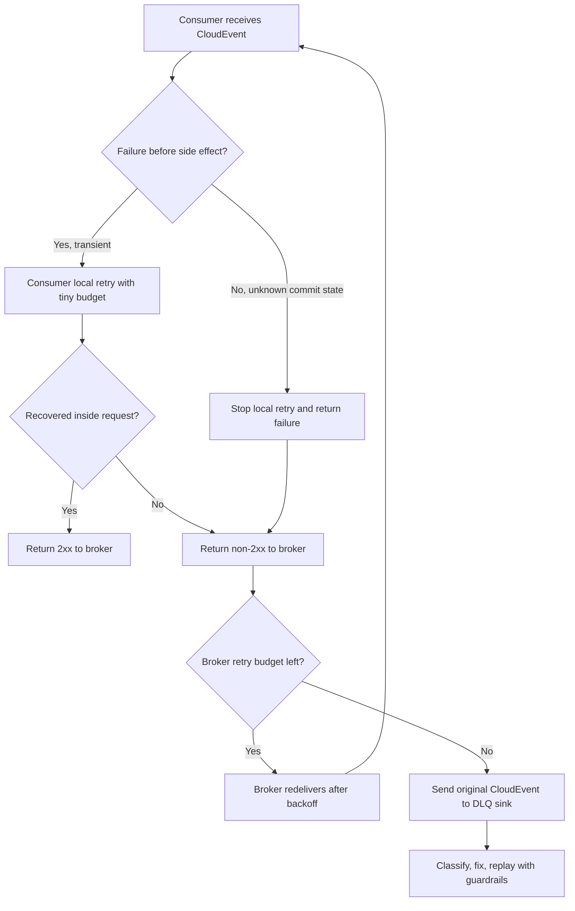
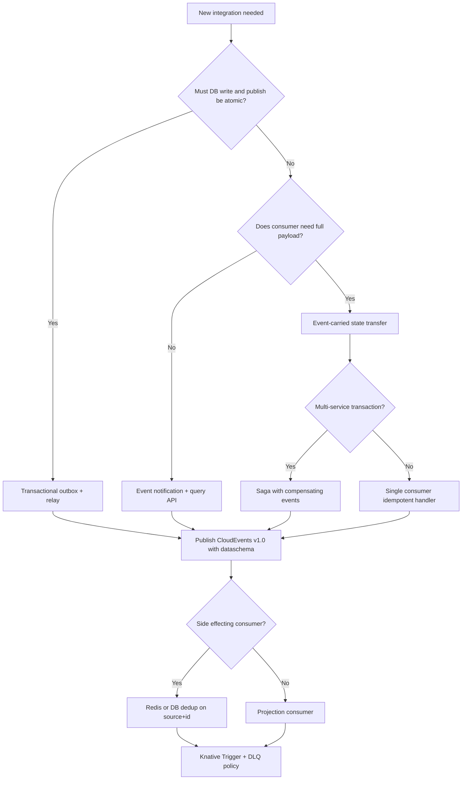

> **Complexity**: Advanced
>
> **Time to Complete**: 3.5 hours
>
> **Prerequisites**: [Module 1.2 - Apache Kafka on Kubernetes](../module-1.2-kafka/), [Module 1.7 - Event Streaming Fundamentals](../module-1.7-event-streaming-fundamentals/), Kubernetes Services and Deployments, HTTP request troubleshooting, and basic Redis familiarity

---

## What You'll Be Able to Do

After completing this module, you will be able to:

- **Design** a CloudEvents v1.0 event contract that separates routing metadata, payload schema, ordering hints, and trace context.
- **Compare** HTTP, Kafka, AMQP, NATS, and MQTT CloudEvents transport bindings against latency, throughput, ordering, and operational constraints.
- **Implement** Knative Eventing Broker, Trigger, Channel, and Subscription resources with retry, dead-letter, and Kafka-backed delivery settings.
- **Debug** duplicate event delivery by applying an idempotency window with Redis `SET NX` and clear retry behavior.
- **Evaluate** production risks in event-driven systems, including schema evolution, downstream amplification, trace propagation, and replay safety.

## Why This Module Matters

**Hypothetical scenario:** The checkout team ships a harmless improvement. Instead of calling inventory, billing, fraud, email, loyalty, analytics, and fulfillment directly, the service now emits one `order-placed` event. The architecture diagram looks clean, the checkout API is faster, and the teams are finally decoupled — on paper. Then the first flash sale starts, and the gaps in the event contract become visible under load rather than in a design review.

Inventory receives the same event twice and reserves two items. Email retries a transient failure and sends customers duplicate receipts. Fraud adds a new field to the payload and the fulfillment consumer crashes because its JSON parser rejects unknown fields. Analytics replays a week of historical orders and accidentally triggers live loyalty credits. The trace in the API gateway ends at the broker, so nobody can see which consumer introduced the delay.

Nothing in that failure requires Kafka to be broken, and nothing requires Kubernetes to be unhealthy. The system fails because the event contract did not carry enough meaning, the delivery path did not have a failure policy, and the consumers were not safe to run more than once. Event-driven architecture trades synchronous certainty for asynchronous flexibility, and that trade only pays off when the contract, delivery semantics, and consumer safety are designed together rather than assumed.

CloudEvents fixes the first part by standardizing the envelope so every hop speaks the same metadata language. Knative Eventing fixes much of the Kubernetes wiring by giving platform teams Broker, Trigger, Channel, and Subscription objects that route CloudEvents natively. Idempotent consumer design fixes the uncomfortable truth that event-driven systems usually deliver at least once, not exactly once — and "exactly once" in practice means idempotent side effects plus transactional boundaries, not a magical broker guarantee.

This module assumes you already understand the streaming mental model from Module 1.7: logs, partitions, retention, backpressure, and replay. Here we move one layer up and design the event contract and the Kubernetes delivery path that make those streaming mechanics usable across teams without turning every integration into a bespoke HTTP callback with incompatible headers and untyped JSON blobs.

> **Stop and think**: If a broker retries an event after a network timeout, how can the consumer know whether the first attempt failed before the business action or after it committed the business action?

## Event-Driven Architecture: Producers, Consumers, and the Event Backbone

Event-driven architecture (EDA) is a style where services communicate by publishing and subscribing to events rather than calling each other synchronously. An **event** is a record that something happened — an order was placed, a payment was captured, a sensor reading crossed a threshold — together with enough metadata for downstream systems to react without the producer knowing who will react or how many consumers exist. The **event backbone** is the durable or semi-durable transport layer — Kafka, NATS JetStream, AMQP brokers, MQTT brokers, or an HTTP-based event mesh such as Knative Eventing — that decouples producers from consumers in time and space.

The durable benefit of EDA is **loose coupling**. The checkout service publishes `order-placed` once; inventory, email, fraud, analytics, and fulfillment each subscribe independently. Adding a new consumer does not require changing the producer's code or redeploying checkout, provided the event contract is stable and extensible. Scaling read-side consumers does not require scaling the writer, because fan-out happens at the broker rather than inside a monolithic orchestrator loop. Teams can deploy on different cadences as long as they honor the published contract for event types they consume.

The durable cost is **eventual consistency** and **debuggability**. When checkout returns success to the customer, inventory may not yet reflect the reservation, email may arrive seconds later, and a failed consumer may leave the system in a partially updated state until retries or human intervention complete. There is no single stack trace that spans "user clicked Buy" through "warehouse picked the item," because work happened asynchronously across services. Operators need correlation identifiers, trace context, and event logs to reconstruct causality — which is exactly why CloudEvents standardizes metadata such as `id`, `source`, `type`, and trace extensions rather than leaving every team to invent header names.

Two coordination styles appear repeatedly in EDA discussions, and conflating them causes design mistakes. **Choreography** means each service reacts to events and may emit further events without a central coordinator: checkout emits `order-placed`, inventory emits `stock-reserved`, billing listens to both and emits `invoice-created`. **Orchestration** means a dedicated process — often a workflow engine or saga coordinator — explicitly commands each step and waits for responses or compensations. Choreography scales team autonomy and avoids a single orchestrator bottleneck; orchestration makes multi-step business processes easier to visualize, timeout, and compensate when one leg fails. Most production systems mix both: choreographed domain events for fan-out, orchestrated sagas for money movement or long-running approvals.

The **distributed monolith trap** is what happens when teams adopt message brokers but keep synchronous coupling disguised as events. If every consumer must receive events in a strict order across the whole company, if payloads are undocumented blobs that only one pair of services understands, or if removing one consumer breaks the producer's assumptions, you have the worst of both worlds — network partitions and retry semantics without independent deployability. A healthy EDA boundary treats events as versioned contracts with explicit delivery semantics (at-least-once by default), idempotent handlers, and schema governance. The backbone stores and routes; it does not magically fix ambiguous business logic.

On Kubernetes, the event backbone often lives partly inside the cluster (Knative Eventing, Strimzi Kafka, NATS operators) and partly outside (managed Kafka, cloud event buses). The platform team's job is to expose a consistent ingress and routing API — CloudEvents over HTTP into a Broker, Kafka headers mapped from CloudEvents attributes, dead-letter sinks with retention — so application teams focus on event types and consumer safety rather than reinventing retry policies per service.

> **Landscape snapshot — as of 2026-06. This changes fast; verify against vendor docs before relying on specifics.**

| Capability | CloudEvents | Knative Eventing | Typical backing transport |
|------------|-------------|------------------|---------------------------|
| Vendor-neutral event envelope | CNCF Graduated spec v1.0.x | Native CloudEvents routing on Broker/Trigger | N/A (metadata layer) |
| Kubernetes event mesh API | Bindings for HTTP, Kafka, AMQP, MQTT | Broker, Trigger, Channel, Subscription CRDs | Often Kafka Channel or in-memory MTChannel |
| Graduation / maturity | Graduated CNCF project (2024) | CNCF incubating project; Eventing GA patterns vary by install | Depends on chosen channel implementation |

CloudEvents answers *what metadata every event carries*; Knative Eventing answers *how Kubernetes routes CloudEvents to subscribers*; Kafka or another broker answers *how events persist and replay*. None replaces the others — they stack.

## EDA Interaction Patterns: Notification, State Transfer, Sourcing, and CQRS

Not every event means the same thing architecturally. Martin Fowler's event-driven taxonomy distinguishes patterns by how much data the event carries and who owns authoritative state. Understanding these patterns prevents teams from using "events" as a synonym for "RPC over Kafka."

**Event notification** is the lightest pattern: the event says that something happened, often with minimal payload, and consumers must call back or query a source of truth if they need details. A `order-placed` event that carries only `orderId` is notification if fulfillment must GET the order from checkout's API. Notification keeps payloads small and reduces coupling to internal data models, but it reintroduces synchronous dependencies and availability requirements on the producer's read API.

**Event-carried state transfer** pushes enough data in the event that consumers can act without a follow-up call. The worked example in this module uses event-carried transfer: the order lines and totals ride in `data`, so inventory can reserve stock without querying checkout. The tradeoff is larger messages, tighter schema coupling, and the need for schema evolution rules — consumers must tolerate unknown fields forward-compatibly and producers must version breaking changes through new `type` or `dataschema` values.

**Event sourcing** goes further: the sequence of events *is* the authoritative state for an aggregate. Instead of updating a row in `orders` and emitting a side event, the system appends `order-placed`, `order-line-added`, `order-cancelled` to an event log and rebuilds current state by replaying them. Event sourcing excels at audit trails, temporal queries ("what did we know at 09:00?"), and replay-driven recovery, but it demands careful handling of schema evolution, snapshotting for read performance, and idempotent projections. CloudEvents fits naturally as the envelope for each appended event: `source` scopes the aggregate stream, `subject` identifies the entity, `sequence` helps detect gaps.

**CQRS (Command Query Responsibility Segregation)** separates the write model from read models optimized for queries. Commands mutate state (or append events); queries hit denormalized projections built by consumers. EDA and CQRS often appear together: write side emits events; read-side projectors build search indexes, dashboards, and cache-friendly views. The failure mode to avoid is treating every read model as authoritative for writes — the write model (or event log) remains source of truth, and projections are eventually consistent.

Two patterns solve the hardest integration problem: **atomic write plus publish**. The **transactional outbox** writes the business row and an outbox row in the same database transaction; a separate relay process reads the outbox and publishes CloudEvents to the broker. That eliminates the race where the database commits but the message never sends (or the message sends and the transaction rolls back). The **saga pattern** coordinates multi-service transactions through a sequence of local transactions plus compensating events: if payment succeeds but inventory fails, emit `payment-refund-requested` rather than holding a distributed lock across services. Sagas can be choreographed (each service knows the next event to emit) or orchestrated (a workflow engine drives steps). Both patterns assume at-least-once delivery and therefore require idempotent consumers and clear correlation IDs in CloudEvents extensions or payload fields.

Schema registries and contract testing belong at this layer. When ten teams consume `com.acme.orders.order-placed.v1`, compatibility modes (backward, forward, full) define whether a new producer can talk to old consumers and vice versa. A backward-compatible change adds optional fields; an incompatible change needs a new event type or schema URI. Consumer-driven contract tests — loading sample CloudEvents from the registry and asserting handlers behave — catch breaking changes before production, which is cheaper than debugging DLQ spikes after a Friday deploy.

## The Contract: CloudEvents as the Envelope

An event-driven architecture needs two contracts working in tandem, and teams that collapse them into one undocumented JSON blob pay for that shortcut during the first serious incident. The **payload contract** describes the business data — fields, types, required versus optional attributes, and semantic meaning of values such as currency codes or SKU identifiers. The **envelope contract** describes the event itself — who emitted it, what kind of occurrence it represents, when it happened, how to deduplicate it, and how to route it without parsing business-specific payloads.

Teams often start with only the payload, which feels expedient because product managers speak in domain objects rather than transport metadata.

```json
{
  "orderId": "ord-1001",
  "customerId": "cus-9001",
  "total": 129.90,
  "currency": "USD"
}
```

That object is useful for a single producer-consumer pair, but middleware cannot safely route it without understanding your business schema. A broker does not know whether `orderId` is an idempotency key, a subject identifier, or just another field among many. A tracing system cannot infer the parent trace from arbitrary JSON. A schema registry cannot tell whether this payload is compatible with the previous version unless you bolt on conventions every team interpre differently.

CloudEvents is a [CNCF Graduated](https://www.cncf.io/projects/cloudevents/) specification — currently at **v1.0** for production use — that adds a small, standard envelope around your payload. Graduation matters because it signals long-term stewardship across vendors and clouds, not a single company's proprietary header set. The spec defines required context attributes, optional core attributes, extension points, serializations (JSON and others), and protocol bindings so the same logical event can traverse HTTP webhooks, Kafka topics, AMQP exchanges, and MQTT topics without rewriting metadata at every hop.

CloudEvents adds a small, standard envelope. The example below shows JSON structured content with commonly used extensions; your cluster may map these attributes to HTTP `ce-*` headers or Kafka record headers per the binding you choose:

```json
{
  "specversion": "1.0",
  "id": "evt-20260518-000001",
  "source": "/checkout/orders",
  "type": "com.acme.orders.order-placed.v1",
  "subject": "orders/ord-1001",
  "time": "2026-05-18T09:15:30Z",
  "datacontenttype": "application/json",
  "dataschema": "https://schemas.acme.example/orders/order-placed/v1.json",
  "traceparent": "00-1af7651916cd43dd8448eb211c80319c-b9c7c989f97918e1-01",
  "partitionkey": "ord-1001",
  "sequence": "0000000000001001",
  "data": {
    "orderId": "ord-1001",
    "customerId": "cus-9001",
    "total": 129.90,
    "currency": "USD",
    "lines": [
      {
        "sku": "sku-wooden-train",
        "quantity": 1,
        "unitPrice": 129.90
      }
    ]
  }
}
```

CloudEvents does not force one broker, one language, or one payload format. It gives every hop a shared vocabulary so gateways, service meshes, and observability backends can treat events as first-class telemetry rather than opaque POST bodies.

```text
+---------------- CloudEvents context ----------------+
| id              Unique event instance                |
| source          Producer or source scope             |
| specversion     CloudEvents spec version             |
| type            Event kind and semantic version      |
| subject         Business object within the source    |
| time            Occurrence timestamp                 |
| datacontenttype Payload media type                   |
| dataschema      Payload schema identifier            |
| extensions      Trace, partition, sequence, policy   |
+---------------------- data --------------------------+
| Domain payload: order fields, invoice fields, etc.   |
+------------------------------------------------------+
```

The separation matters because brokers and platform tools can route, filter, trace, and dead-letter events without opening the payload. Consumers can evolve payload parsing without changing transport code, and operators can inspect failed events in a DLQ knowing exactly which producer and event type failed rather than guessing from nested JSON fields.

### Required CloudEvents v1.0 Attributes

Every CloudEvents v1.0 event must include four context attributes, and omitting any one of them makes the event non-compliant with the spec regardless of how sensible your custom headers look to your team.

| Attribute | Type | What it means | Operator check |
|-----------|------|---------------|----------------|
| `id` | String | Unique identifier for the event within the producer's `source` scope | Use `source + id` as the deduplication identity |
| `source` | URI-reference | The context in which the event happened | Keep it stable when the same producer changes deployment names |
| `specversion` | String | The CloudEvents specification version | Use `1.0` unless you are intentionally testing a newer draft |
| `type` | String | The semantic event type | Version the meaning, not the transport |

The most important subtlety is `id`, which identifies a specific event occurrence rather than the business entity described in the payload. It is not required to be globally unique by itself; uniqueness is defined in combination with `source`, meaning two different producers may both emit `id: "123"` without collision because their `source` values differ. That scoping rule is why idempotency keys must be `source + id` rather than bare `id` or payload business IDs alone.

Use `source + id` for deduplication at consumers, and treat `type` as the semantic version of meaning — for example `com.acme.orders.order-placed.v1` encodes both domain and contract generation. One order can legitimately produce many events over its lifetime (`order-placed`, `order-authorized`, `order-shipped`), each with a distinct `id` but the same `subject` pointing at `orders/ord-1001`.

### Optional Core Attributes

Most production systems should use more than the required four attributes because routing, observability, and schema governance all depend on metadata that the spec makes optional but operators quickly treat as mandatory.

| Attribute | Use it when | Common mistake |
|-----------|-------------|----------------|
| `datacontenttype` | The payload has a known media type such as `application/json` or `application/avro` | Omitting it and forcing every consumer to guess |
| `dataschema` | Consumers need a stable schema reference or registry lookup | Treating schema compatibility as a wiki convention |
| `subject` | You need to filter or troubleshoot by the business object | Hiding all identity inside `data` |
| `time` | Consumers need occurrence time, not broker arrival time | Setting it inconsistently across producers |

`subject` is not a replacement for the payload; it is a routing and observability hint that lets generic infrastructure filter or partition work by business entity without JSON parsing. For an order system, `subject: "orders/ord-1001"` lets a Knative Trigger or Kafka consumer route troubleshooting queries to the correct entity timeline while keeping the full line items inside `data`.

`dataschema` should point to a durable schema identifier — an HTTPS URL, a schema registry URI, or an internal catalog path — and incompatible payload changes must receive a new identifier or a new `type`. Treating schema compatibility as a wiki convention fails the first time a producer deploys on Friday evening and a consumer team is paged because an unknown field appeared.

### Extension Attributes That Matter in Production

CloudEvents extensions let you attach additional context attributes while keeping the same envelope model.
The extensions below are especially useful on Kubernetes.

| Extension | Type | Why it matters |
|-----------|------|----------------|
| `traceparent` | String | Carries W3C trace context across broker and consumer boundaries |
| `tracestate` | String | Carries vendor-specific trace state when your tracing system needs it |
| `partitionkey` | String | Communicates the key that should preserve per-entity ordering in partitioned transports |
| `sequence` | String | Communicates relative ordering within a source-defined sequence |

`traceparent` does not replace protocol headers when both are available on the same hop. For a direct HTTP POST into Knative, you normally send the W3C [`traceparent` header](https://www.w3.org/TR/trace-context/) and mirror the value in the CloudEvents `traceparent` extension when the event may later cross transports where HTTP headers no longer exist. When the event moves through Kafka or another broker, the CloudEvents extension keeps the original trace context attached to the message so consumer instrumentation can continue the trace instead of starting an orphan root span.

`partitionkey` is a hint that must be mapped into the transport by your producer SDK or bridge — it is not automatic ordering magic. For Kafka, it should become the record key so all events for `ord-1001` land in one partition and preserve per-key order. For NATS JetStream, it may become a subject segment or message header depending on your subject hierarchy design. For HTTP-only paths, it is metadata unless the receiver forwards it into a partitioned downstream system.

`sequence` helps detect gaps, stale updates, or replay mistakes when a source emits an ordered stream for one entity. If you need strict order, you still need a single ordered stream for that entity and consumers that process one event at a time for that key; sequence numbers alert you when `1003` arrives without `1002`, which is invaluable for inventory projectors and dangerous to ignore for best-effort email senders.

> **Pause and predict**: A consumer sees `sequence: "0000000000001003"` for `subject: "orders/ord-1001"` but never saw sequence `0000000000001002`. Should it process immediately, wait, or alert? What changes if the consumer is an email sender versus an inventory projector?

## Transport Bindings: Same Event, Different Wire

CloudEvents separates **event formats** (how attributes and data serialize) from **protocol bindings** (how those attributes map onto HTTP, Kafka, AMQP, NATS, or MQTT). The same logical CloudEvent can move as HTTP headers plus a JSON body, as Kafka record headers plus value, or as a single JSON envelope in structured mode — and choosing among them is an operational decision about latency, durability, ordering, and who operates the backbone, not a moral judgment about which protocol is fashionable this quarter.

The binding choice should follow workload shape and team capabilities. High-volume analytics pipelines that need replay and fan-out usually anchor on Kafka with the [Kafka protocol binding](https://github.com/cloudevents/spec/blob/main/cloudevents/bindings/kafka-protocol-binding.md). Webhook-style integrations and Knative ingress favor the [HTTP protocol binding](https://github.com/cloudevents/spec/blob/main/cloudevents/bindings/http-protocol-binding.md). Device telemetry may enter through MQTT before normalization. The [CloudEvents primer](https://github.com/cloudevents/spec/blob/main/cloudevents/primer.md) walks through these mappings in vendor-neutral language, which is the right reference when your platform team standardizes one internal mapping table for all application producers.

| Binding | Best fit | Latency posture | Throughput posture | Ordering posture | Kubernetes operator concern |
|---------|----------|-----------------|--------------------|------------------|-----------------------------|
| HTTP | Webhooks, Knative sinks, simple producer-to-broker ingress | Very low per hop, but request timeout bounded | Moderate unless fronted by queues | No inherent ordering | Backpressure appears as request failures and retries |
| Kafka | High-volume durable streams, replay, fan-out, analytics | Low to moderate depending on batching | Very high with partitions | Per partition when keying is correct | Partition count, retention, ISR health, consumer lag |
| AMQP | Enterprise messaging, routing keys, broker-mediated queues | Low in LAN deployments | High but broker topology dependent | Queue order can hold until redelivery or competing consumers interfere | Exchange and queue policy drift |
| NATS | Low-latency service events, edge control planes, JetStream durability | Very low for core NATS; JetStream adds durability cost | High for small messages | Subject and stream configuration dependent | Retention, ack wait, and subject hierarchy design |
| MQTT | IoT, unreliable networks, device telemetry | Low over constrained links | Moderate; optimized for many small device messages | Topic and QoS dependent, not a global log | Session state, retained messages, and device auth |

HTTP is the easiest way into Knative Eventing because Knative sinks receive CloudEvents over HTTP POST with `ce-*` headers in binary mode. That does not mean HTTP should be your durable event store — HTTP ingress is a clean front door, not a substitute for retention, partitioning, and consumer groups when you need replay after outages.

Kafka is usually the durable backbone when the workload needs replay and high fan-out, but the tradeoff is operational ownership: partition keys, retention policies, replication factor, in-sync replica health, and consumer lag become part of your platform contract rather than hidden inside a managed webhook. AMQP shines when routing topology is rich and messages behave like work items in queues, though it is less natural as a long-term analytical event log unless you deliberately architect retention and replay tooling. NATS is excellent when the subject namespace is the architecture — core NATS favors speed and simplicity while JetStream adds persistence and replay with different failure semantics you must not conflate. MQTT fits constrained device networks where QoS levels and session state dominate design conversations before CloudEvents normalization even begins.

### Binary Versus Structured Mode

CloudEvents bindings often support **binary mode**, where context attributes map to transport metadata and `data` remains the raw payload body, and **structured mode**, where the entire CloudEvent including `data` serializes as one envelope document such as `application/cloudevents+json`.

Binary mode is ergonomic when the transport has rich metadata support — HTTP and Kafka both map attributes to headers cleanly, which is why Knative sinks commonly expect binary HTTP CloudEvents. Structured mode is easier to store, replay, and inspect as a single self-contained object, which makes it attractive for DLQ archives and object-store retention where you want auditors to fetch one JSON file and see the full context without reassembling headers. Many platforms accept both at boundaries but standardize one mode internally to reduce test matrix size; document that choice for application teams so producers do not mix modes against the same subscriber without explicit conversion.

## Knative Eventing Primitives

[Knative Eventing](https://knative.dev/docs/eventing/) provides Kubernetes-native custom resources for routing CloudEvents so application teams publish to a Broker without maintaining a list of subscriber URLs. Knative does not remove the need to understand the broker underneath — Kafka lag, channel capacity, and ingress TLS remain real — but it gives platform teams a consistent API surface that mirrors how developers already think about Kubernetes Services and Deployments.

The mental model is a pipeline from producer to subscriber with filtering in the middle. Producers send CloudEvents over HTTP to a Broker ingress; Triggers attach filters on attributes such as `type` and `source`; subscribers receive HTTP deliveries to Knative Services or plain Kubernetes Services. Channels and Subscriptions appear when you want explicit stream topology rather than the Broker abstraction alone, which is common for audit fan-out or data-platform pipelines that treat the channel name as part of the contract.

```text
Producer
   |
   | CloudEvents over HTTP
   v
+--------+       +---------+       +----------+
| Broker | ----> | Trigger | ----> | Consumer |
+--------+       +---------+       +----------+
   |
   | optional channel-backed delivery
   v
+---------+      +--------------+
| Channel | ---> | Subscription |
+---------+      +--------------+
```

The four primitives in this module are:

| Primitive | What it represents | Use it when |
|-----------|--------------------|-------------|
| `Broker` | A named event pool that accepts CloudEvents | Producers should not know every consumer |
| `Trigger` | A filter and subscriber attached to a Broker | Consumers want selected event types |
| `Channel` | A brokerable event stream with subscriptions | You need explicit channel topology |
| `Subscription` | A Channel-to-subscriber binding | You want fan-out from a Channel |

### Broker With Kafka-Backed Delivery

This ConfigMap tells the channel-based Broker to use KafkaChannel as its backing channel.
Your cluster must have the Knative Kafka channel implementation installed.

```yaml
apiVersion: v1
kind: ConfigMap
metadata:
  name: kafka-channel
  namespace: knative-eventing
  annotations:
    platform.kubedojo.io/purpose: "default channel template for commerce brokers"
data:
  channel-template-spec: |
    apiVersion: messaging.knative.dev/v1beta1
    kind: KafkaChannel
    spec:
      numPartitions: 12
      replicationFactor: 3
```

Now create the Broker in the application namespace.

```yaml
apiVersion: eventing.knative.dev/v1
kind: Broker
metadata:
  name: commerce
  namespace: commerce
  annotations:
    eventing.knative.dev/broker.class: MTChannelBasedBroker
    platform.kubedojo.io/owner: "platform-events"
    platform.kubedojo.io/replay-policy: "dlq-reviewed-only"
spec:
  config:
    apiVersion: v1
    kind: ConfigMap
    name: kafka-channel
    namespace: knative-eventing
  delivery:
    retry: 5
    backoffPolicy: exponential
    backoffDelay: PT1S
    deadLetterSink:
      ref:
        apiVersion: v1
        kind: Service
        name: order-dlq
        namespace: commerce
```

This Broker accepts CloudEvents.
The `delivery` section is the broker-level safety net.
It does not make consumers idempotent.
It only controls how Knative retries failed delivery attempts and where it sends the event after the retry budget is exhausted.

### Trigger for a Specific Event Type

A Trigger selects events from a Broker and sends them to one subscriber.

```yaml
apiVersion: eventing.knative.dev/v1
kind: Trigger
metadata:
  name: order-placed-to-fulfillment
  namespace: commerce
  annotations:
    platform.kubedojo.io/team: "fulfillment"
    platform.kubedojo.io/runbook: "https://runbooks.acme.example/events/order-placed"
spec:
  broker: commerce
  filter:
    attributes:
      type: com.acme.orders.order-placed.v1
      source: /checkout/orders
  subscriber:
    ref:
      apiVersion: v1
      kind: Service
      name: idempotent-order-consumer
      namespace: commerce
  delivery:
    retry: 3
    backoffPolicy: exponential
    backoffDelay: PT0.5S
    deadLetterSink:
      ref:
        apiVersion: v1
        kind: Service
        name: order-dlq
        namespace: commerce
```

The Trigger filter uses CloudEvents attributes.
It does not inspect `data`.
That keeps routing fast, generic, and independent of payload parser changes.

### Channel for Explicit Fan-Out

A Channel is useful when the topology itself is part of the design.
For example, a platform team may expose an `order-audit` channel that multiple teams subscribe to.

```yaml
apiVersion: messaging.knative.dev/v1
kind: Channel
metadata:
  name: order-audit
  namespace: commerce
  annotations:
    platform.kubedojo.io/backing-store: "kafka"
    platform.kubedojo.io/retention: "7d"
spec:
  channelTemplate:
    apiVersion: messaging.knative.dev/v1beta1
    kind: KafkaChannel
    spec:
      numPartitions: 12
      replicationFactor: 3
  delivery:
    retry: 4
    backoffPolicy: exponential
    backoffDelay: PT1S
    deadLetterSink:
      ref:
        apiVersion: v1
        kind: Service
        name: order-dlq
        namespace: commerce
```

Broker and Channel are not interchangeable words.
A Broker is the common decoupling API for producers and consumers.
A Channel is a lower-level stream abstraction that Subscriptions attach to.
Some broker implementations use channels internally.

### Subscription From Channel to Consumer

A Subscription connects a Channel to a subscriber.

```yaml
apiVersion: messaging.knative.dev/v1
kind: Subscription
metadata:
  name: order-audit-to-warehouse-loader
  namespace: commerce
  annotations:
    platform.kubedojo.io/team: "data-platform"
    platform.kubedojo.io/slo: "events-visible-within-5m"
spec:
  channel:
    apiVersion: messaging.knative.dev/v1
    kind: Channel
    name: order-audit
  subscriber:
    ref:
      apiVersion: v1
      kind: Service
      name: warehouse-loader
      namespace: commerce
  reply:
    ref:
      apiVersion: messaging.knative.dev/v1
      kind: Channel
      name: order-audit-replies
      namespace: commerce
  delivery:
    retry: 3
    backoffPolicy: exponential
    backoffDelay: PT2S
    deadLetterSink:
      ref:
        apiVersion: v1
        kind: Service
        name: order-dlq
        namespace: commerce
```

Use Broker and Trigger for most application eventing where producers should not know consumers. Use Channel and Subscription when you intentionally manage the stream topology — for example, an `order-audit` channel that multiple compliance consumers attach to with independent delivery policies. Some Broker implementations use channels internally; that detail matters to platform engineers tuning Kafka partitions but not to application developers publishing `order-placed` events.

Delivery configuration on Broker, Trigger, Channel, and Subscription resources — retry counts, exponential backoff, and `deadLetterSink` references — is the platform-level failure policy. It complements but never replaces idempotent consumers: if your inventory service double-reserves on duplicate delivery, no amount of broker tuning fixes that logic bug.

## Dead-Letter Queue Design

Dead-letter queues are not trash cans where failed messages disappear — they are evidence lockers that hold events which could not be delivered or processed within the allowed retry budget, together with enough context for a human or runbook to decide whether replay is safe. The central design question is not "Do we need a DLQ?" but "Which component owns each retry layer, and what metadata do we preserve so replay does not become a second incident?"



### Retry Ownership

| Retry layer | Good for | Bad for | Budget rule |
|-------------|----------|---------|-------------|
| Consumer retry | Short-lived dependency blips inside one request | Long outages, unknown commit state | Milliseconds to a few seconds |
| Broker retry | Subscriber unavailable, network timeout, cold start | Business validation failures | Small count with exponential backoff |
| DLQ replay | Fixed bugs, restored downstream service, manual remediation | Blind automatic reprocessing | Human or runbook gated |

Consumer retries should be tiny — milliseconds to a few seconds for dependency blips inside one HTTP request — because long in-request loops hide backpressure from the broker and tie up pods. If the consumer retries for minutes, Knative sees one hung request, cannot redeliver to another replica promptly, and operator dashboards show misleading "slow consumer" symptoms instead of clear failure signals.

Broker retries should handle subscriber unavailability, network timeouts, and cold starts with a small count and exponential backoff configured on the Trigger or Broker `delivery` section. They should not compensate for non-idempotent consumers: if the consumer commits a side effect and then returns `500`, the broker cannot know the side effect happened and will redeliver, which is why business validation failures often belong in a rejection workflow rather than infinite broker retry.

DLQ replay should be explicit, runbook-gated, and preservationist about CloudEvents identity. The replay tool should preserve original `source`, `id`, `type`, and `data` unless you intentionally emit a new event with a new `id` for audit separation. Add replay metadata through extensions such as `replayattempt` when your platform standard supports it so consumers can distinguish live traffic from recovery traffic.

### DLQ Sink Shape

The DLQ sink can be a Knative Service, a Kafka topic, a Channel, or another addressable sink.
For teaching clarity, this module uses a Kubernetes Service.
In production, many teams store DLQ events in a durable topic or object store after the DLQ service receives them.

```yaml
apiVersion: v1
kind: Service
metadata:
  name: order-dlq
  namespace: commerce
  annotations:
    platform.kubedojo.io/purpose: "capture failed order events for review"
spec:
  selector:
    app: order-dlq
  ports:
    - name: http
      port: 80
      targetPort: 8080
```

```yaml
apiVersion: apps/v1
kind: Deployment
metadata:
  name: order-dlq
  namespace: commerce
spec:
  replicas: 2
  selector:
    matchLabels:
      app: order-dlq
  template:
    metadata:
      labels:
        app: order-dlq
    spec:
      containers:
        - name: sink
          image: ghcr.io/acme/order-dlq-sink:1.0.0
          ports:
            - containerPort: 8080
          env:
            - name: DLQ_BUCKET
              value: s3://commerce-event-dlq
            - name: REQUIRE_REPLAY_APPROVAL
              value: "true"
```

The DLQ service should store:

- The complete CloudEvent.
- Delivery metadata such as received time and failing sink.
- The HTTP status or error category when available.
- The consumer version that failed, if the sink reports it.
- A replay status: new, classified, fixed, replayed, ignored.

## Idempotent Consumers With Redis `SET NX`

At-least-once delivery means duplicates are normal operating conditions, not rare edge cases reserved for disaster drills. Every consumer that performs side effects — reserving inventory, sending email, posting ledger entries — must decide explicitly how it behaves when the same CloudEvent arrives again because a broker retry, a network timeout, or a pod restart duplicated delivery.

The baseline idempotency identity is `source + id` prefixed for namespacing in your store, for example `ce:/checkout/orders:evt-20260518-000001`. Use the CloudEvents identity, not the payload's business ID alone, because one `orderId` legitimately appears across multiple event types and multiple occurrences within the same type during retries.

```text
idempotency key = "ce:" + source + ":" + id
```

### Worked Example: Lock Then Mark Done

The safest simple Redis pattern uses two keys to distinguish "another pod is processing this event" from "this event already completed successfully," which matters when two Knative delivery attempts overlap during rolling deploys or partition rebalance storms.

```text
done key = ce:done:/checkout/orders:evt-20260518-000001
lock key = ce:lock:/checkout/orders:evt-20260518-000001
```

Flow:

1. If the done key exists, return success immediately.
2. Try to create the lock key with `SET lock value NX EX 60`.
3. If the lock already exists, return a retryable failure so the broker tries later.
4. Perform the business transaction.
5. Set the done key with a long expiry window.
6. Delete the lock key.

This separates "another pod is processing it" from "this event has already completed," and returning `409 Conflict` on lock contention gives the broker a retryable signal without duplicating side effects. Production systems often combine Redis deduplication with database unique constraints on `(source, event_id)` when the side effect itself is a row insert, so dedup survives Redis evictions within the idempotency window.

```python
import json
import os
from typing import Any

from cloudevents.http import from_http
from flask import Flask, Response, request
from redis import Redis

app = Flask(__name__)

redis_client = Redis.from_url(
    os.environ.get("REDIS_URL", "redis://redis:6379/0"),
    decode_responses=True,
)

PROCESSING_LOCK_SECONDS = int(os.environ.get("PROCESSING_LOCK_SECONDS", "60"))
IDEMPOTENCY_WINDOW_SECONDS = int(
    os.environ.get("IDEMPOTENCY_WINDOW_SECONDS", "604800")
)


def event_identity(event: Any) -> str:
    source = event["source"]
    event_id = event["id"]
    return f"{source}:{event_id}"


def parse_payload(event: Any) -> dict[str, Any]:
    data = event.data
    if isinstance(data, bytes):
        return json.loads(data.decode("utf-8"))
    if isinstance(data, str):
        return json.loads(data)
    return data


def reserve_inventory(payload: dict[str, Any]) -> None:
    order_id = payload["orderId"]
    for line in payload["lines"]:
        print(f"reserve {line['quantity']} of {line['sku']} for {order_id}")


@app.post("/")
def receive_order_event() -> Response:
    event = from_http(request.headers, request.get_data())
    identity = event_identity(event)
    done_key = f"ce:done:{identity}"
    lock_key = f"ce:lock:{identity}"

    if redis_client.exists(done_key):
        return Response(status=204)

    locked = redis_client.set(
      lock_key,
      "processing",
      nx=True,
      ex=PROCESSING_LOCK_SECONDS,
    )
    if not locked:
        return Response("duplicate in flight", status=409)

    try:
        payload = parse_payload(event)
        reserve_inventory(payload)
        redis_client.set(done_key, "done", ex=IDEMPOTENCY_WINDOW_SECONDS)
        return Response(status=204)
    except Exception:
        redis_client.delete(lock_key)
        raise
    finally:
        if redis_client.get(lock_key) == "processing":
            redis_client.delete(lock_key)


if __name__ == "__main__":
    app.run(host="0.0.0.0", port=8080)
```

Run it locally with the repository virtual environment style:

```bash
.venv/bin/python -m pip install flask redis cloudevents
REDIS_URL=redis://127.0.0.1:6379/0 .venv/bin/python app.py
```

Test a duplicate:

```bash
curl -i -X POST http://127.0.0.1:8080/ \
  -H "content-type: application/json" \
  -H "ce-specversion: 1.0" \
  -H "ce-id: evt-20260518-000001" \
  -H "ce-source: /checkout/orders" \
  -H "ce-type: com.acme.orders.order-placed.v1" \
  -H "ce-subject: orders/ord-1001" \
  -H "ce-partitionkey: ord-1001" \
  -d '{"orderId":"ord-1001","lines":[{"sku":"sku-wooden-train","quantity":1}]}'
```

Send the same command again.
The consumer should return `204` without repeating the side effect because the done key exists.

### Choosing the Idempotency Window

The window must outlive the longest plausible duplicate.

| Workload | Suggested window | Why |
|----------|------------------|-----|
| Webhook fan-out | 1 to 7 days | Retries and manual replays usually happen quickly |
| Financial side effects | 30 to 90 days | Duplicates may appear during reconciliation |
| Analytics projection | Retention length | Replay can cover the full retained log |
| Device telemetry | Short window or sequence check | High volume may make long dedup storage too expensive |

If the event log can be replayed for seven days, a one-hour idempotency window is a bug waiting for the analytics team's rebuild job. Size windows to the longest plausible duplicate source: broker retries during outages, manual DLQ replays, and log reprocessing jobs should all fall inside the deduplication horizon or be routed through isolated replay infrastructure.

## End-to-End Worked Example: Order Placed

Now combine the pieces.

Goal:

```text
Checkout HTTP source
  -> CloudEvents HTTP request
  -> Knative Broker named commerce
  -> Kafka-backed channel inside the broker
  -> Trigger for order-placed events
  -> Idempotent consumer
  -> DLQ after retry budget
  -> Reviewed replay procedure
```

### Step 1: Namespace and Broker

```bash
kubectl create namespace commerce
```

From here on, this module uses `kubectl` explicitly. Some tutorials alias `k=kubectl`; if your shell defines that alias, the commands below behave the same either way.

```bash
kubectl apply -f kafka-channel-config.yaml
kubectl apply -f commerce-broker.yaml
kubectl -n commerce get broker commerce
```

After apply, confirm the Broker reports `READY True` — the URL column should point at the in-cluster broker ingress, which is the target checkout will POST CloudEvents to once Triggers and consumers exist.

```text
NAME       URL                                                                      AGE   READY   REASON
commerce   http://broker-ingress.knative-eventing.svc.cluster.local/commerce/...    1m    True
```

### Step 2: Idempotent Consumer Service

The Kubernetes Service exposes the consumer pods to Knative Eventing delivery, while the Deployment below configures Redis connectivity and an explicit idempotency window through environment variables that the sample Python handler reads at startup.

```yaml
apiVersion: v1
kind: Service
metadata:
  name: idempotent-order-consumer
  namespace: commerce
  annotations:
    platform.kubedojo.io/consumer-kind: "side-effecting"
spec:
  selector:
    app: idempotent-order-consumer
  ports:
    - name: http
      port: 80
      targetPort: 8080
```

The Deployment runs three replicas so you can observe lock contention when duplicate deliveries arrive during rollouts; scale is not the lesson, but overlapping delivery attempts are.

```yaml
apiVersion: apps/v1
kind: Deployment
metadata:
  name: idempotent-order-consumer
  namespace: commerce
spec:
  replicas: 3
  selector:
    matchLabels:
      app: idempotent-order-consumer
  template:
    metadata:
      labels:
        app: idempotent-order-consumer
      annotations:
        instrumentation.opentelemetry.io/inject-python: "true"
    spec:
      containers:
        - name: app
          image: ghcr.io/acme/idempotent-order-consumer:1.0.0
          ports:
            - containerPort: 8080
          env:
            - name: REDIS_URL
              value: redis://redis.commerce.svc.cluster.local:6379/0
            - name: PROCESSING_LOCK_SECONDS
              value: "60"
            - name: IDEMPOTENCY_WINDOW_SECONDS
              value: "604800"
```

The OpenTelemetry annotation is intentionally shown because event-driven tracing must be designed end to end — automatic instrumentation alone is not enough if the `traceparent` extension is dropped at the broker boundary or never extracted in consumer middleware.

### Step 3: Trigger Routes Only Order-Placed Events

```bash
kubectl apply -f order-placed-trigger.yaml
kubectl -n commerce get trigger order-placed-to-fulfillment
```

Send a CloudEvent into the Broker once port-forward exposes the ingress — in a real cluster, the checkout service would post to the Broker URL from inside the cluster or through an ingress policy rather than from your laptop.

```bash
kubectl -n knative-eventing port-forward svc/broker-ingress 8080:80
```

```bash
curl -i -X POST http://127.0.0.1:8080/commerce/commerce \
  -H "content-type: application/json" \
  -H "ce-specversion: 1.0" \
  -H "ce-id: evt-20260518-000001" \
  -H "ce-source: /checkout/orders" \
  -H "ce-type: com.acme.orders.order-placed.v1" \
  -H "ce-subject: orders/ord-1001" \
  -H "ce-time: 2026-05-18T09:15:30Z" \
  -H "ce-dataschema: https://schemas.acme.example/orders/order-placed/v1.json" \
  -H "ce-traceparent: 00-1af7651916cd43dd8448eb211c80319c-b9c7c989f97918e1-01" \
  -H "ce-partitionkey: ord-1001" \
  -H "ce-sequence: 0000000000001001" \
  -d '{"orderId":"ord-1001","customerId":"cus-9001","total":129.90,"currency":"USD","lines":[{"sku":"sku-wooden-train","quantity":1,"unitPrice":129.90}]}'
```

Inspect the consumer logs:

```bash
kubectl -n commerce logs deploy/idempotent-order-consumer
```

Send the same curl command again.
The consumer should return success without repeating the side effect.
That is idempotency doing useful work.

### Step 4: Force a Failure and Observe DLQ

Temporarily configure the consumer to reject a specific order.
For example, set an environment variable that makes the app return `500` for `ord-1001`.

```bash
kubectl -n commerce set env deploy/idempotent-order-consumer FAIL_ORDER_ID=ord-1001
kubectl -n commerce rollout status deploy/idempotent-order-consumer
```

Send a new event ID for the same order:

```bash
curl -i -X POST http://127.0.0.1:8080/commerce/commerce \
  -H "content-type: application/json" \
  -H "ce-specversion: 1.0" \
  -H "ce-id: evt-20260518-000002" \
  -H "ce-source: /checkout/orders" \
  -H "ce-type: com.acme.orders.order-placed.v1" \
  -H "ce-subject: orders/ord-1001" \
  -H "ce-partitionkey: ord-1001" \
  -d '{"orderId":"ord-1001","customerId":"cus-9001","total":129.90,"currency":"USD","lines":[{"sku":"sku-wooden-train","quantity":1,"unitPrice":129.90}]}'
```

Watch the DLQ sink:

```bash
kubectl -n commerce logs deploy/order-dlq
```

The DLQ entry should contain the original CloudEvent, not a new event invented by the broker.
That distinction matters for replay.

### Step 5: Replay Procedure

Do not replay everything.
Replay only after classification.

```text
1. Confirm the consumer bug or dependency outage is fixed.
2. Confirm the event type and dataschema are still supported.
3. Confirm the consumer is replay safe for this side effect.
4. Preserve source, id, type, subject, and data.
5. Add replay metadata if your platform standard supports it.
6. Send the event back to the Broker or to a dedicated replay Broker.
7. Record the replay result on the DLQ item.
```

A minimal replay command can read a stored structured CloudEvent and send it back:

```bash
curl -i -X POST http://127.0.0.1:8080/commerce/commerce \
  -H "content-type: application/cloudevents+json" \
  --data-binary @dlq-events/evt-20260518-000002.json
```

Use a dedicated replay Broker when live consumers cannot distinguish live traffic from replay traffic.
For side-effecting consumers, a replay Broker with narrower Triggers is often safer than replaying into the main Broker.

## Production Gotchas

Production event-driven systems fail in predictable ways long after the proof-of-concept demo works. The sections below cover schema evolution, downstream amplification, trace propagation, and replay safety — the same risk categories called out in the learning outcomes — because each category spans tooling choices and organizational process, not just a missing YAML field.

### Schema Evolution

`dataschema` is only useful when it points to something governed by a registry or catalog with compatibility rules, not a wiki link that rots when someone renames a Git branch. A good schema evolution policy names compatibility modes explicitly: **backward** compatible changes let new producers talk to old consumers (typically adding optional fields), **forward** compatible changes let old producers talk to new consumers, **full** requires both directions, and **none** means breaking changes require a new event type or schema URI rather than silent Friday-night deploys.

Prefer additive changes for a stable event type — adding `discountCode` to an order event is usually safe when consumers ignore unknown fields. Changing `total` from a number to a nested object is not backward compatible and should bump `type` to `com.acme.orders.order-placed.v2` or publish under a new `dataschema` with consumer contract tests gating rollout. Consumer tests that load real historical CloudEvents from retention or fixture archives catch incompatibilities before they become DLQ avalanches.

### Downstream Amplification

One event can trigger many consumers, and each consumer can call multiple downstream services, so one `order-placed` event may become inventory reservation, email, fraud scoring, loyalty updates, billing, search indexing, warehouse loading, and analytics writes without any single team seeing the full blast radius on their architecture slide. Amplification is the point of EDA — fan-out is a feature — but it becomes an incident when platform teams do not model quotas, admission control for new Triggers, and replay impact before approving another subscriber on a critical event type.

Ask during design reviews: how many consumers receive this `type`? Which call external SaaS APIs with rate limits? Which perform irreversible side effects? What happens during log replay or flash-sale traffic spikes? Treat a new Trigger on `order-placed` like approving a new client of a public API, because operationally it is one.

### Traceparent Propagation

Distributed tracing across asynchronous boundaries breaks easily because each hop uses different metadata carriers. Common failure points include HTTP ingress receiving a `traceparent` header but failing to copy it into CloudEvents extensions before Kafka bridging, Brokers forwarding attributes while consumer OpenTelemetry SDKs start a new root trace, replay tools emitting events stripped of original trace context, and Kafka bridges mapping payload bytes while dropping header mappings defined in the CloudEvents Kafka binding.

Your platform standard should document where trace context lives at each boundary: HTTP headers on ingress, CloudEvents `traceparent` extension inside the broker, Kafka headers on egress, extraction hooks in consumer middleware. For replay, create a distinct replay span linked to the original trace rather than pretending the replay is the same request attempt.

### Replay Safety

Replay turns an event log into an operational recovery tool and simultaneously into a weapon if misused. Classify every consumer before granting replay access: pure projections are usually replay safe; idempotent side effects are replay safe within the deduplication window; non-idempotent side effects such as customer email require compensating workflows or replay isolation; external money movement must never replay blindly through the live Broker without provider idempotency keys.

Every Trigger should carry a replay classification annotation in your platform conventions. If you cannot state how a consumer handles replay, assume it is unsafe and route rebuild traffic through dedicated replay Brokers with narrower Trigger filters.

## Patterns and Anti-Patterns

The table below collects durable patterns that appear in well-run event platforms, anti-patterns that recreate distributed monoliths with extra steps, and a decision flow for choosing among notification, carried state, outbox, and saga approaches when scoping a new integration.

### Patterns

| Pattern | When to use | CloudEvents hook |
|---------|-------------|------------------|
| Transactional outbox | Must atomically commit DB state and publish | Relay publishes fully formed CloudEvents with `source + id` from outbox row |
| Idempotent consumer | Any at-least-once side effect | Dedup on `source + id`; return success on duplicate |
| Event-carried state transfer | Consumers should act without callback GET | Rich `data` with governed `dataschema` |
| Choreographed saga | Multi-step process with compensating events | Correlation via `subject` or extension; distinct `type` per step |
| Dedicated replay Broker | Rebuild projections without touching email/payments | Same events, different Triggers; replay extensions |
| Schema registry with compatibility | Many teams share one `type` | `dataschema` URI resolves to versioned schema |

### Anti-Patterns

| Anti-Pattern | Why it fails | Better approach |
|--------------|--------------|-----------------|
| Payload-only contracts | Brokers cannot filter or trace generically | Required CloudEvents context on every event |
| Central orchestrator for everything | Bottleneck and deployment coupling | Choreography for fan-out; orchestration only where needed |
| Infinite broker retry on validation errors | DLQ fills with permanently bad events | Reject invalid events at edge; short retry for transients |
| Shared mutable DB between services | Breaks autonomy; hides coupling | Event notification or carried transfer with owned stores |
| Replay into live Broker blindly | Duplicates side effects | Replay Broker + consumer classification |
| Dropping trace at Kafka bridge | Incidents become undebuggable | Map CloudEvents trace extensions to record headers |

### Decision Framework



When in doubt, default to at-least-once delivery, explicit CloudEvents contracts, idempotent handlers, and broker-level DLQ — then add orchestration or event sourcing only where the business complexity justifies the operational cost.

## Did You Know?

- CloudEvents v1.0 standardizes event metadata, not your business payload, so teams can use JSON, Avro, Protobuf, or another payload format behind the same envelope and binding mappings.
- Knative Eventing routes events by CloudEvents attributes such as `type` and `source`, which lets Triggers filter without payload parsing and keeps routing stable when `data` evolves additively.
- The transactional outbox pattern predates CloudEvents but pairs naturally with it: the outbox relay emits standards-compliant events so downstream teams consume one envelope shape across services.
- W3C Trace Context and CloudEvents trace extensions solve different layers — HTTP headers for synchronous hops, CloudEvents attributes for stored and bridged events — and production systems need both mapped explicitly at each boundary.

## Common Mistakes

| Mistake | Why it hurts | Better practice |
|---------|--------------|-----------------|
| Deduplicating only by `id` | Different sources can reuse IDs | Deduplicate by `source + id` |
| Hiding event type inside `data` | Brokers and Triggers cannot filter generically | Put semantic type in `type` |
| Treating `partitionkey` as an ordering guarantee | The transport must actually use the key | Map it to Kafka key or equivalent |
| Retrying inside the consumer for minutes | The broker cannot observe backpressure | Keep local retries tiny and return failure |
| Sending invalid business events to DLQ | DLQ fills with events that will never succeed | Validate at producer or route to rejection workflow |
| Replaying DLQ blindly | Side effects may run again | Classify, fix, and replay with guardrails |
| Dropping `traceparent` at bridges | Traces end at the broker | Preserve trace context across protocol mappings |
| Changing payload shape without changing schema | Consumers fail at runtime | Govern `dataschema` and compatibility rules |

## Quiz

### 1. Duplicate delivery after a timeout

Your inventory consumer reserves stock in PostgreSQL, then the HTTP response to Knative times out before the consumer returns `204`.
Knative redelivers the same CloudEvent.
What should the consumer check before reserving stock again?

<details>
<summary>Answer</summary>

It should check an idempotency record keyed by `source + id`.
The payload `orderId` is useful business context, but the CloudEvents identity tells the consumer whether this exact event occurrence has already completed.
If the event is marked done inside the same transaction as the reservation or immediately after the durable side effect, the duplicate can return success without reserving again.
</details>

### 2. Schema change breaks one consumer

The checkout team changes `total` from a number to an object with `amount` and `currency`.
Most consumers tolerate it, but the warehouse loader crashes.
The event still uses the same `type` and `dataschema`.
What failed in the event contract?

<details>
<summary>Answer</summary>

The producer made an incompatible payload change without changing the schema identity or event type.
The fix is to publish a new schema URI and, for a semantic breaking change, usually a new event type such as `com.acme.orders.order-placed.v2`.
Consumers should test against the schema registry and real historical events before the old type is retired.
</details>

### 3. Ordering bug by customer

A loyalty projector receives `points-earned` and `points-reversed` events out of order for the same customer.
The producer includes `partitionkey: customer-9001`, but the Kafka records are written with random keys.
Where is the bug?

<details>
<summary>Answer</summary>

The bug is in the transport mapping.
`partitionkey` is metadata until the Kafka producer or bridge maps it to the Kafka record key.
Without that mapping, events for the same customer can land on different partitions and lose per-key ordering.
</details>

### 4. DLQ volume spikes during an outage

A payment provider is down for ten minutes.
The payment consumer returns `500`.
Broker retries exhaust and thousands of payment events land in the DLQ.
Should the team replay the whole DLQ immediately after the provider recovers?

<details>
<summary>Answer</summary>

No.
Payment is a high-risk side effect.
The team should classify the DLQ entries, confirm which payment attempts committed or failed, verify idempotency with the payment provider, and replay only through the approved payment recovery workflow.
Blind replay can double-charge customers.
</details>

### 5. Trace ends at the broker

An API request emits a CloudEvent with the HTTP `traceparent` header.
The downstream consumer trace starts as a new root span.
What should you inspect?

<details>
<summary>Answer</summary>

Inspect the bridge from HTTP to the Broker and the consumer instrumentation.
The system should preserve trace context in protocol headers where applicable and in the CloudEvents `traceparent` extension when the event can cross transports.
The consumer should extract that context instead of starting a fresh root trace.
</details>

### 6. Replay corrupts analytics

Analytics replays a week of `order-placed` events to rebuild a projection.
The email consumer also receives the replay and sends duplicate receipts.
What design boundary was missing?

<details>
<summary>Answer</summary>

The replay path was not isolated from side-effecting consumers.
The platform should use a dedicated replay Broker, replay-specific Triggers, or consumer replay classifications so projection consumers can rebuild while email and other non-idempotent side effects are excluded.
</details>

### 7. Broker retry versus consumer retry

A consumer calls Redis and gets a connection refused error.
The developer adds a loop that retries for five minutes inside the HTTP request.
What operational problem does this create?

<details>
<summary>Answer</summary>

It hides backpressure from the broker and ties up consumer pods.
A small local retry is reasonable for a short blip, but long recovery should be handled by broker retries and DLQ policy.
The consumer should fail fast enough for Knative delivery controls to work.
</details>

### 8. Production risk review before launch

Your team is about to expose `com.acme.orders.order-placed.v1` to three new Triggers owned by different squads. What production risks should you evaluate before merge, and which CloudEvents or platform fields help mitigate them?

<details>
<summary>Answer</summary>

Evaluate schema evolution (`dataschema` and compatibility tests), downstream amplification (how many side-effecting consumers fan out from one event), trace propagation (`traceparent` preserved across Broker and Kafka bridges), and replay safety (whether each consumer is projection-safe, idempotent, or requires an isolated replay Broker). Mitigations include versioning breaking changes through new `type` values, admission review for new Triggers, explicit DLQ and retry policies on Broker delivery, idempotency keys on `source + id`, and consumer replay classifications documented before go-live.
</details>

## Hands-On Exercise

Build a small CloudEvents path for `order-placed` events in a Kubernetes 1.35+ cluster with Knative Eventing installed.

### Part 1: Contract

- [ ] Define an `order-placed` CloudEvent with `id`, `source`, `specversion`, `type`, `subject`, `time`, `datacontenttype`, and `dataschema`.
- [ ] Add `traceparent`, `partitionkey`, and `sequence` extension attributes.
- [ ] Write down the deduplication key and idempotency window.

### Part 2: Knative Routing

- [ ] Create the `commerce` namespace.
- [ ] Apply a Kafka-backed Broker configuration or document the Broker class your cluster provides.
- [ ] Create a Broker named `commerce`.
- [ ] Create a Trigger that filters only `com.acme.orders.order-placed.v1`.
- [ ] Confirm the Trigger subscriber is a Kubernetes Service or Knative Service that can receive HTTP CloudEvents.

### Part 3: Consumer Safety

- [ ] Implement Redis `SET NX` locking for in-flight events.
- [ ] Mark completed events with a longer Redis TTL.
- [ ] Prove that sending the same CloudEvent twice does not repeat the side effect.
- [ ] Return a retryable non-2xx status when another pod is already processing the event.

### Part 4: DLQ and Replay

- [ ] Configure Broker or Trigger delivery retries with exponential backoff.
- [ ] Configure a DLQ sink that stores the complete CloudEvent.
- [ ] Force one event into the DLQ by making the consumer return `500`.
- [ ] Classify the failed event and explain whether replay is safe.
- [ ] Replay one fixed event through the Broker or a dedicated replay Broker.

### Success Criteria

- [ ] You can explain why CloudEvents `source + id` is the idempotency identity.
- [ ] You can show the Trigger filter and identify which CloudEvents attributes it uses.
- [ ] You can show one DLQ entry that preserves the original CloudEvent.
- [ ] You can demonstrate duplicate delivery without duplicate side effects.
- [ ] You can describe how `partitionkey` maps to Kafka ordering behavior.
- [ ] You can trace one event from producer to consumer using `traceparent`.

## Sources

- [CloudEvents Specification v1.0](https://github.com/cloudevents/spec/blob/main/cloudevents/spec.md) — normative definition of context attributes, extensions, and serialization.
- [CloudEvents Primer](https://github.com/cloudevents/spec/blob/main/cloudevents/primer.md) — conceptual introduction to events, formats, and bindings.
- [CloudEvents HTTP Protocol Binding](https://github.com/cloudevents/spec/blob/main/cloudevents/bindings/http-protocol-binding.md) — mapping CloudEvents to HTTP headers and bodies for Knative ingress.
- [CloudEvents Kafka Protocol Binding](https://github.com/cloudevents/spec/blob/main/cloudevents/bindings/kafka-protocol-binding.md) — mapping attributes to Kafka record headers and values.
- [CNCF CloudEvents Project](https://www.cncf.io/projects/cloudevents/) — project maturity, governance, and ecosystem context.
- [Knative Eventing Documentation](https://knative.dev/docs/eventing/) — Brokers, Sources, Sinks, and CloudEvents-native routing on Kubernetes.
- [Knative Broker Configuration and Delivery](https://knative.dev/docs/eventing/configuration/broker-configuration/) — retry, backoff, and dead-letter sink settings.
- [Knative Subscriptions](https://knative.dev/docs/eventing/channels/subscriptions/) — Channel fan-out and subscriber delivery policies.
- [What do you mean by Event-Driven? (Martin Fowler)](https://martinfowler.com/articles/201701-event-driven.html) — notification, carried state transfer, event sourcing, and CQRS taxonomy.
- [Event Sourcing (Martin Fowler)](https://martinfowler.com/eaaDev/EventSourcing.html) — authoritative state as an append-only event log.
- [CQRS (Martin Fowler)](https://martinfowler.com/bliki/CQRS.html) — separating write models from read-optimized projections.
- [Transactional Outbox Pattern](https://microservices.io/patterns/data/transactional-outbox.html) — atomic database commit and event publish.
- [Saga Pattern](https://microservices.io/patterns/data/saga.html) — distributed transactions through local commits and compensations.
- [W3C Trace Context](https://www.w3.org/TR/trace-context/) — `traceparent` and `tracestate` propagation across services.

## Next Module

You've completed the Data Engineering track. Continue to the [MLOps discipline](../../mlops/) — [Module 5.1 — MLOps Fundamentals](../../mlops/module-5.1-mlops-fundamentals/) builds on these event-driven foundations when ML pipelines need to react to data-arrival events and emit prediction-emitted CloudEvents downstream. If you want to revisit stateful stream processing with the contracts from this module, return to [Module 1.3 — Stream Processing with Flink](../module-1.3-flink/).
