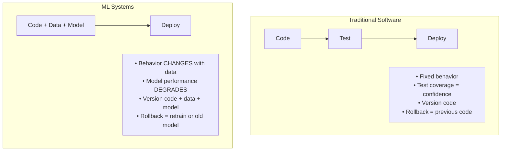
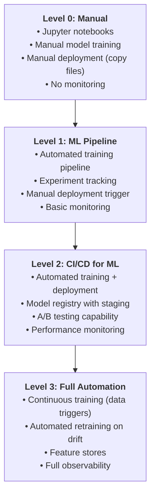
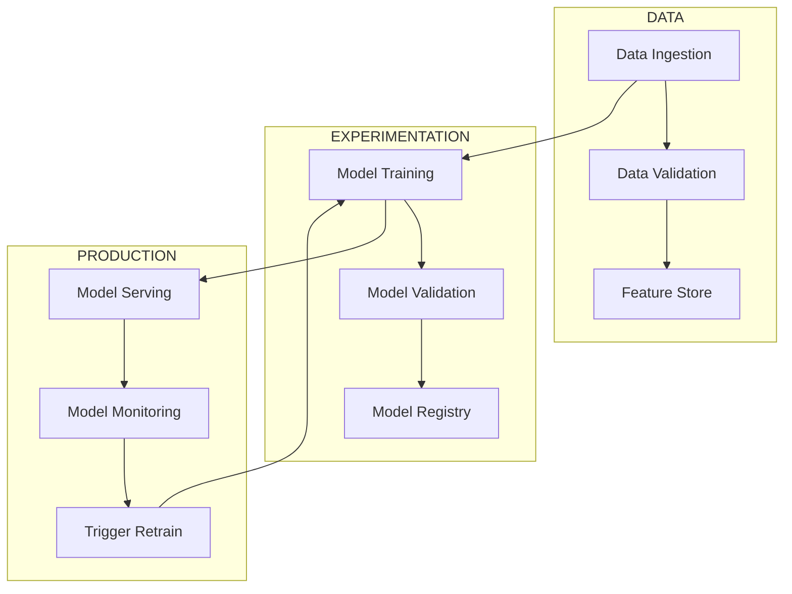
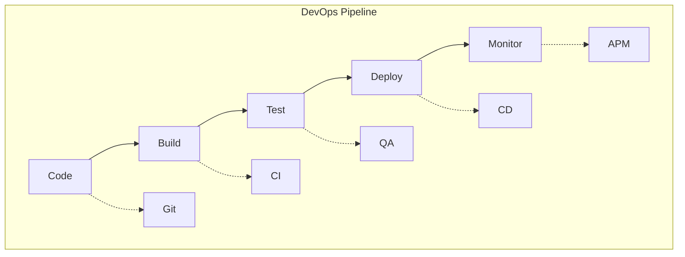
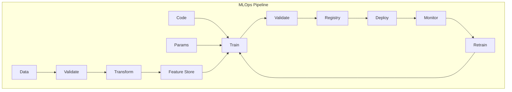
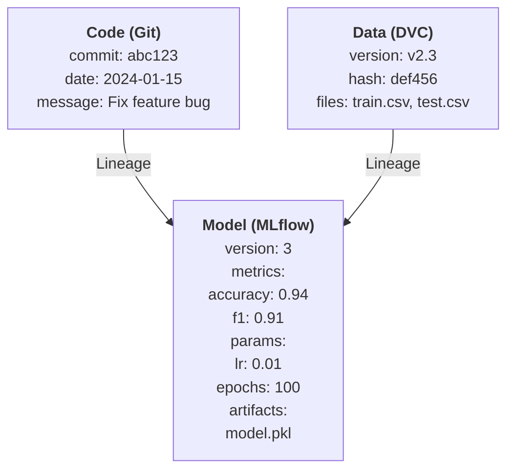
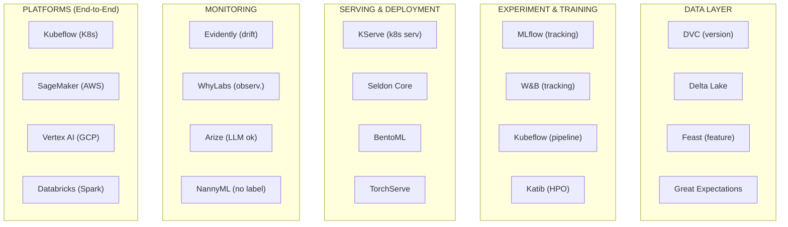

> **Discipline Track** | Complexity: `[MEDIUM]` | Time: 35-40 min

## Prerequisites

Before starting this module:
- Basic machine learning concepts (training, inference, models)
- [DevOps fundamentals](/platform/disciplines/reliability-security/devsecops/module-4.1-devsecops-fundamentals/)
- Understanding of CI/CD pipelines
- Python basics

## What You'll Be Able to Do

After completing this module, you will be able to:

- **Evaluate your organization's MLOps maturity and identify gaps in the ML lifecycle**
- **Design an MLOps architecture that covers experiment tracking, model registry, and deployment pipelines**
- **Implement version control practices for ML artifacts — data, code, models, and configurations**
- **Analyze the differences between MLOps levels 0-2 to build a realistic adoption roadmap**

## Why This Module Matters

Most machine learning projects never make it to production. Not because the models aren't good enough—but because teams don't know how to operationalize them. Data scientists build great prototypes in Jupyter notebooks, then hand them off expecting someone else to "just deploy it."

MLOps bridges this gap. It's the discipline that transforms experimental notebooks into reliable production systems. Without MLOps, you're stuck in an endless cycle of "works on my machine" and "the model was fine last week."

Companies that master MLOps ship models 10x faster and maintain them with far less pain.

## Did You Know?

- **87% of ML projects never reach production** according to Gartner—not due to model quality, but deployment and maintenance challenges
- **Google's first ML production rule** is "Do machine learning like the great engineer you are, not like the great ML expert you aren't"—emphasizing engineering practices over model sophistication
- **Netflix serves millions of ML predictions per second** using a platform that took years to build—their lesson: invest in infrastructure early
- **The term "MLOps" was coined around 2015** but didn't gain mainstream adoption until 2020, showing how young this discipline really is

## What is MLOps?

MLOps (Machine Learning Operations) applies DevOps principles to machine learning systems. But ML systems are fundamentally different from traditional software:



### Why ML is Different

| Aspect | Traditional Software | ML Systems |
|--------|---------------------|------------|
| **Input** | Code | Code + Data + Hyperparameters |
| **Output** | Deterministic | Probabilistic |
| **Testing** | Unit tests pass/fail | Model metrics (accuracy, F1) |
| **Versioning** | Git for code | Git + DVC/MLflow for data/models |
| **Debugging** | Stack traces | Data quality, drift, feature issues |
| **Failure modes** | Crashes, errors | Silent degradation |

> **Pause and predict**: If your model predicts perfectly today, why might it fail tomorrow without a single line of code changing?

### War Story: The Model That Worked Until It Didn't

A team deployed a fraud detection model that performed brilliantly—96% accuracy in testing. Three months later, fraud losses tripled. The model was still running, still returning predictions, no errors in logs.

What happened? The fraud patterns changed. New attack vectors emerged. The model's accuracy dropped to 60%, but nobody was monitoring it. The model was "working" (returning predictions) while completely failing at its job.

This is the core challenge MLOps addresses: **ML systems fail silently**.

> **Stop and think**: Does an organization need to reach "Level 3: Full Automation" to see a return on investment for MLOps?

## MLOps Maturity Levels

Organizations progress through maturity levels:



**Most organizations are at Level 0 or 1.** Getting to Level 2 is the biggest leap in value.

## The ML Lifecycle

### End-to-End Pipeline



### Pipeline Components

| Component | Purpose | Key Questions |
|-----------|---------|---------------|
| **Data Ingestion** | Collect, validate data | Is data fresh? Complete? |
| **Feature Engineering** | Transform raw data | Consistent train/serve? |
| **Training** | Build models | Reproducible? Scalable? |
| **Validation** | Test model quality | Meets performance bar? |
| **Registry** | Version, stage models | Who approved for prod? |
| **Serving** | Deploy for inference | Latency? Throughput? |
| **Monitoring** | Track health | Drift? Degradation? |

## MLOps vs DevOps

While MLOps borrows heavily from DevOps, key differences exist:





### Additional MLOps Concerns

| Concern | Description |
|---------|-------------|
| **Data versioning** | Track which data trained which model |
| **Experiment tracking** | Compare hyperparameters, metrics |
| **Feature stores** | Consistent features train/serve |
| **Model lineage** | What data, code, params made this? |
| **Drift detection** | Data distribution changes |
| **A/B testing** | Compare model versions |

## Core MLOps Principles

### 1. Reproducibility

Every training run must be reproducible:

```python
# BAD: Non-reproducible
model = train(data)  # Which data? What params?

# GOOD: Reproducible
model = train(
    data_version="v2.3.1",
    commit_sha="abc123",
    hyperparams={
        "learning_rate": 0.01,
        "epochs": 100,
        "seed": 42
    }
)
```

### 2. Automation

Automate everything that can be automated:

```yaml
# Trigger retraining on new data
on:
  schedule:
    - cron: '0 0 * * 0'  # Weekly
  workflow_dispatch:
    inputs:
      data_version:
        required: true

jobs:
  train:
    steps:
      - name: Fetch data
        run: dvc pull data/

      - name: Train model
        run: python train.py --data-version ${{ inputs.data_version }}

      - name: Validate model
        run: python validate.py --threshold 0.85

      - name: Register model
        if: success()
        run: python register.py --stage staging
```

### 3. Versioning Everything



### 4. Continuous Monitoring

Monitor more than just uptime:

| Metric Type | What to Track |
|-------------|---------------|
| **Infrastructure** | Latency, throughput, errors, CPU/memory |
| **Data Quality** | Schema, nulls, distributions |
| **Model Performance** | Accuracy, precision, recall (if labels) |
| **Business Impact** | Conversion, revenue, user satisfaction |

## The MLOps Tool Landscape



## Common Mistakes

| Mistake | Problem | Solution |
|---------|---------|----------|
| Notebook to production | Not reproducible, no versioning | Proper training pipelines |
| No experiment tracking | Can't reproduce good results | MLflow, W&B from day one |
| Training/serving skew | Different predictions | Feature stores |
| No model validation | Bad models reach prod | Automated quality gates |
| Ignoring drift | Silent performance degradation | Continuous monitoring |
| Manual deployments | Slow, error-prone | CI/CD for ML |

## Quiz

Test your understanding:

<details>
<summary>1. You are a platform engineer evaluating a new fraud detection model. The data science team hands you a Docker container with the model and says, "Just deploy it like our other microservices." What critical differences between this container and your standard microservices must you account for?</summary>

**Answer**: ML systems introduce probabilistic behavior and data dependencies that standard microservices lack. Unlike a traditional service where the logic is fixed in the code, the model's behavior is dictated by the data it was trained on and the data it receives in production. This means you must account for "silent degradation" where the service remains perfectly healthy from an infrastructure perspective (200 OKs, low latency) but the predictions become increasingly inaccurate over time due to data drift. Furthermore, rolling back a bad deployment isn't just about reverting code; it may require reverting to an older model artifact and the specific data version used to create it.
</details>

<details>
<summary>2. A recommendation engine showed a 15% revenue lift during offline testing. However, once deployed to the live website, revenue actually dropped by 2%. The engineering team confirms the deployed model file is identical to the tested one. What is the most likely cause of this discrepancy?</summary>

**Answer**: The most likely cause is training/serving skew. This occurs when the data pipeline used to generate features for offline model training differs from the real-time data pipeline used during production serving. For example, the training set might have relied on a batch job that aggregated user clicks over 24 hours, while the production system attempts to calculate this on-the-fly and misses recent events. The model performs exactly as it was mathematically optimized to, but it is being fed fundamentally different inputs in production, leading to terrible predictions. A feature store is typically implemented to solve this by ensuring a single source of truth for feature transformations across both environments.
</details>

<details>
<summary>3. Your organization currently runs scheduled scripts to train models, which data scientists then manually copy to a deployment bucket (Level 1 MLOps). Leadership wants to jump straight to Level 3 (Continuous Training on data drift). Why might this be a disastrous approach?</summary>

**Answer**: Jumping to Level 3 without mastering Level 2 (CI/CD for ML) removes human oversight before you have the automated quality gates necessary to prevent bad models from reaching production. Level 2 establishes the crucial foundation of reproducibility, automated testing, and a model registry with staging environments. If you automate retraining and deployment (Level 3) without these rigorous CI/CD checks, a sudden influx of corrupted data could automatically trigger a retrain and deploy a disastrously inaccurate model directly to your users. The leap to Level 2 is the most vital because it enforces safety and reliability; Level 3 merely adds speed and automation on top of that safety net.
</details>

<details>
<summary>4. At 3:00 AM, a data pipeline bug causes the "user_age" feature to be set to 0 for all incoming requests. The ML model continues to return predictions, and your standard APM dashboards (Datadog/New Relic) show green across the board. How should a proper MLOps monitoring setup have caught this?</summary>

**Answer**: A proper MLOps monitoring setup tracks data quality and feature distributions, not just infrastructure health. While traditional APM tools correctly reported that the server was up and processing requests without crashing, they lack the context to understand the payload's semantic meaning. ML monitoring would have detected an immediate and severe data drift—specifically, that the distribution of "user_age" had suddenly shifted entirely to 0, completely outside the expected training baseline. By monitoring the input feature distributions and alerting on this anomalous shift, the ML monitoring system would have flagged the silent failure before it resulted in thousands of incorrect business decisions.
</details>

## Hands-On Exercise: Your First MLOps Pipeline

Let's build a minimal but complete MLOps pipeline:

### Setup

```bash
# Create project
mkdir mlops-intro && cd mlops-intro

# Create virtual environment
python -m venv venv
source venv/bin/activate

# Install dependencies
pip install mlflow scikit-learn pandas
```

### Step 1: Create Training Script with Tracking

```python
# train.py
import mlflow
import mlflow.sklearn
from sklearn.datasets import load_iris
from sklearn.model_selection import train_test_split
from sklearn.ensemble import RandomForestClassifier
from sklearn.metrics import accuracy_score, f1_score
import argparse

def train(n_estimators, max_depth, random_state):
    # Load data
    iris = load_iris()
    X_train, X_test, y_train, y_test = train_test_split(
        iris.data, iris.target, test_size=0.2, random_state=random_state
    )

    # Start MLflow run
    with mlflow.start_run():
        # Log parameters
        mlflow.log_param("n_estimators", n_estimators)
        mlflow.log_param("max_depth", max_depth)
        mlflow.log_param("random_state", random_state)

        # Train model
        model = RandomForestClassifier(
            n_estimators=n_estimators,
            max_depth=max_depth,
            random_state=random_state
        )
        model.fit(X_train, y_train)

        # Evaluate
        predictions = model.predict(X_test)
        accuracy = accuracy_score(y_test, predictions)
        f1 = f1_score(y_test, predictions, average='weighted')

        # Log metrics
        mlflow.log_metric("accuracy", accuracy)
        mlflow.log_metric("f1_score", f1)

        # Log model
        mlflow.sklearn.log_model(model, "model")

        print(f"Accuracy: {accuracy:.4f}, F1: {f1:.4f}")
        return accuracy

if __name__ == "__main__":
    parser = argparse.ArgumentParser()
    parser.add_argument("--n-estimators", type=int, default=100)
    parser.add_argument("--max-depth", type=int, default=5)
    parser.add_argument("--seed", type=int, default=42)
    args = parser.parse_args()

    mlflow.set_experiment("iris-classifier")
    train(args.n_estimators, args.max_depth, args.seed)
```

### Step 2: Run Experiments

```bash
# Run multiple experiments
python train.py --n-estimators 50 --max-depth 3
python train.py --n-estimators 100 --max-depth 5
python train.py --n-estimators 200 --max-depth 10

# View results in MLflow UI
mlflow ui
# Open http://localhost:5000
```

### Step 3: Register Best Model

```python
# register.py
import mlflow
from mlflow.tracking import MlflowClient

client = MlflowClient()

# Find best run
experiment = client.get_experiment_by_name("iris-classifier")
runs = client.search_runs(
    experiment_ids=[experiment.experiment_id],
    order_by=["metrics.accuracy DESC"],
    max_results=1
)

best_run = runs[0]
print(f"Best run: {best_run.info.run_id}")
print(f"Accuracy: {best_run.data.metrics['accuracy']:.4f}")

# Register model
model_uri = f"runs:/{best_run.info.run_id}/model"
model_name = "iris-classifier"

mlflow.register_model(model_uri, model_name)
print(f"Model registered as '{model_name}'")
```

### Step 4: Create Inference Script

```python
# predict.py
import mlflow

# Load model from registry
model_name = "iris-classifier"
model = mlflow.sklearn.load_model(f"models:/{model_name}/latest")

# Make predictions
sample = [[5.1, 3.5, 1.4, 0.2]]  # Setosa
prediction = model.predict(sample)
print(f"Prediction: {prediction[0]} (0=setosa, 1=versicolor, 2=virginica)")
```

### Success Criteria

You've completed this exercise when you can:
- [ ] Run training with experiment tracking
- [ ] View experiments in MLflow UI
- [ ] Compare runs with different hyperparameters
- [ ] Register the best model
- [ ] Load and use the registered model for inference

## Key Takeaways

1. **ML systems are different**: They include code, data, AND models—all must be versioned
2. **Silent failures are the norm**: Models degrade without crashing—monitoring is critical
3. **Reproducibility is non-negotiable**: Every training run must be reproducible
4. **Automate the pipeline**: Manual processes don't scale
5. **Start simple**: MLflow + basic monitoring beats complex platforms with no adoption

## Further Reading

- [Google's Rules of ML](https://developers.google.com/machine-learning/guides/rules-of-ml) — Best practices from Google
- [MLOps Maturity Model](https://learn.microsoft.com/en-us/azure/architecture/example-scenario/mlops/mlops-maturity-model) — Microsoft's maturity framework
- [Made With ML](https://madewithml.com/) — Production ML course
- [MLflow Documentation](https://mlflow.org/docs/latest/index.html) — Experiment tracking

## Summary

MLOps brings engineering rigor to machine learning. By treating ML systems as software systems (with additional complexity), we can move from notebook experiments to reliable production systems. The core practices—versioning, automation, monitoring, reproducibility—aren't optional. They're what separate successful ML projects from the 87% that never reach production.

---

## Next Module

Continue to [Module 5.2: Feature Engineering & Stores](../module-5.2-feature-stores/) to learn how feature stores ensure consistency between training and serving.