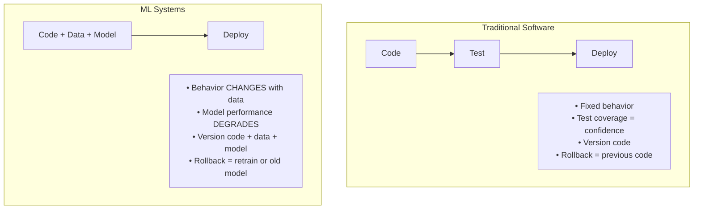
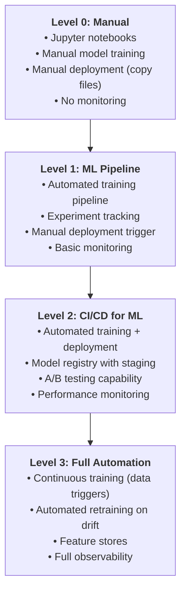
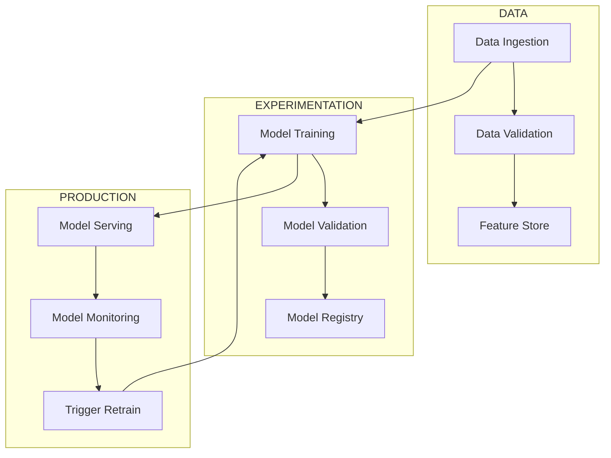
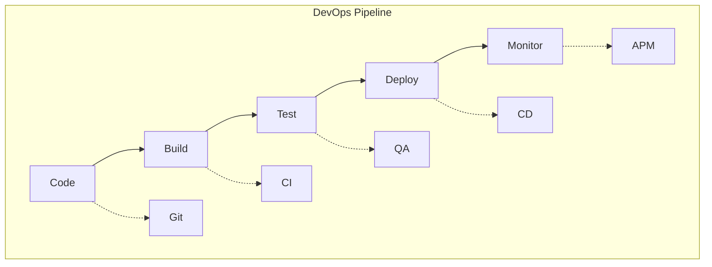
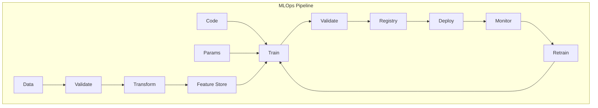
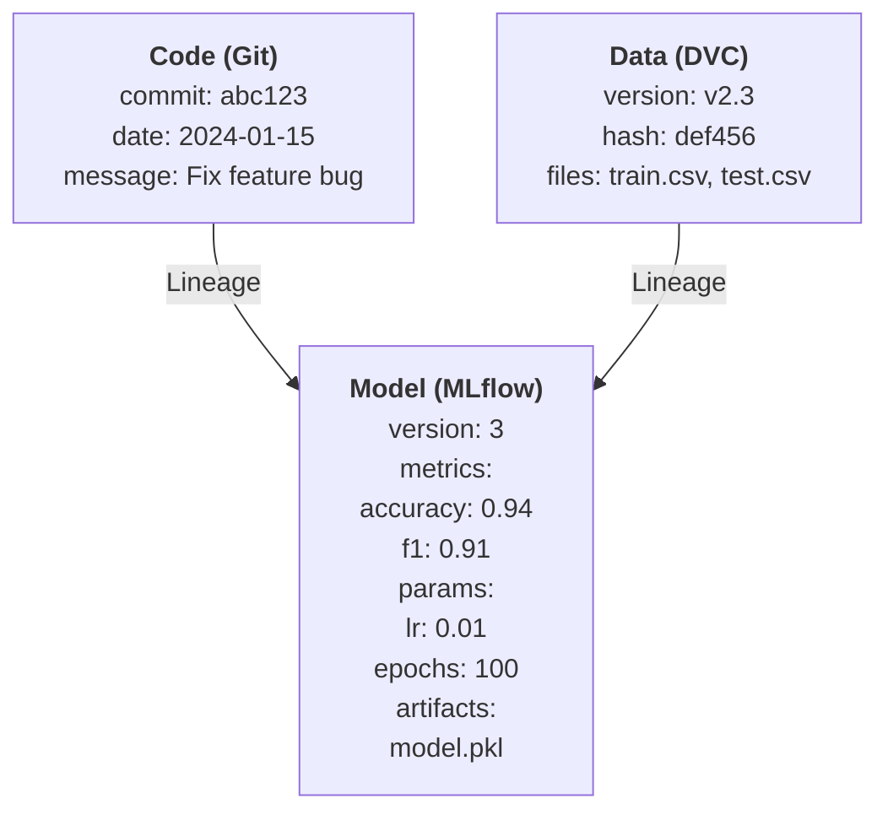
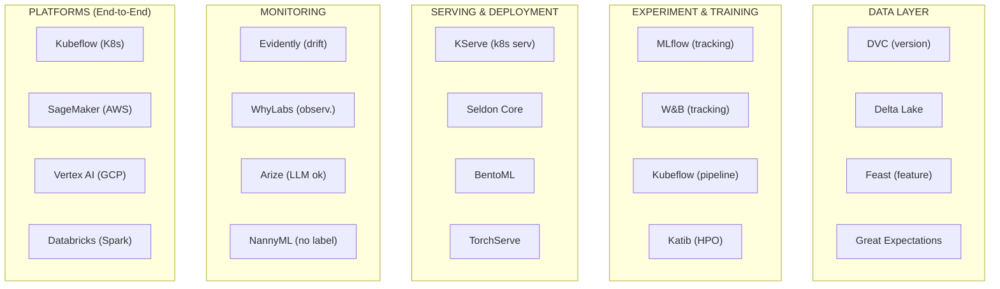

> **Discipline Track** | Complexity: `[MEDIUM]` | Time: 45-60 min

## Prerequisites

Before starting this module:

- Basic machine learning concepts: training, inference, labels, features, and models
- [DevOps fundamentals](/platform/disciplines/reliability-security/devsecops/module-4.1-devsecops-fundamentals/)
- Understanding of CI/CD pipelines
- Python basics
- Basic comfort reading YAML and shell commands

## Learning Outcomes

After completing this module, you will be able to:

- **Evaluate** an organization's MLOps maturity by identifying gaps across data, training, deployment, monitoring, and governance.
- **Design** a production-ready MLOps architecture that connects experiment tracking, model registry, deployment gates, and monitoring feedback loops.
- **Implement** reproducible ML versioning practices for code, data, models, parameters, metrics, and runtime configuration.
- **Analyze** model failures that do not appear in normal application logs, including drift, training-serving skew, and data quality regressions.
- **Compare** MLOps maturity levels and recommend a realistic adoption roadmap that improves reliability without over-automating too early.

## Why This Module Matters

A data science team builds a churn model that looks excellent in the notebook.

The test metrics are strong.

The demo impresses leadership.

The first production deployment works.

Three months later, the support team notices something strange.

The model still answers every request.

The API still returns `200 OK`.

Latency is still low.

CPU and memory look normal.

No deployment happened last night.

No stack trace appears in the logs.

Yet the business outcome is getting worse.

High-risk customers are no longer being flagged.

Retention campaigns are going to the wrong accounts.

The team has a production incident, but the service did not crash.

That is the central problem MLOps solves.

Traditional software often fails loudly.

Machine learning systems often fail quietly.

A model can be operationally healthy and statistically wrong at the same time.

MLOps is the engineering discipline that makes this quiet failure visible, traceable, and recoverable.

It does not replace machine learning.

It surrounds machine learning with the production practices required to trust it.

It answers questions that a notebook cannot answer by itself:

Who trained this model?

Which data snapshot was used?

Which code commit produced it?

Which parameters changed?

Which metrics justified promotion?

Who approved deployment?

What changed in production traffic after release?

What should happen if the model starts drifting?

Without those answers, a team does not have a production ML system.

It has a model artifact and a hope that nothing changes.

In real organizations, everything changes.

Customers change.

Fraud patterns change.

Product behavior changes.

Data pipelines change.

Regulations change.

The model's environment keeps moving after deployment.

MLOps gives platform engineers, data scientists, ML engineers, and operations teams a shared operating model for that movement.

The goal is not to buy every tool in the MLOps landscape.

The goal is to build enough discipline that models can move from experiment to production with evidence, rollback paths, and monitoring.

A senior platform engineer does not ask, "Can we deploy the model?"

They ask, "Can we explain, reproduce, validate, observe, and safely change the model after deployment?"

This module teaches that standard.

## What Is MLOps?

MLOps means Machine Learning Operations.

It applies DevOps ideas to machine learning systems.

The phrase is simple.

The implications are not.

A regular software service is mainly controlled by code.

If the code is unchanged, the behavior is usually unchanged.

There are exceptions, but that assumption is often useful.

A machine learning system is controlled by code, data, parameters, features, labels, and the model artifact produced by training.

The code might be identical while the behavior changes.

The model file might be identical while production input data changes.

The training data might be valid historically while no longer matching today's users.

That is why MLOps is not just "CI/CD for models."

It is a lifecycle for systems whose behavior depends on data.



The diagram shows the first mental shift.

Traditional software pipelines focus on source code changes.

MLOps pipelines must track the relationship between source code, data, training runs, model artifacts, and production behavior.

That relationship is called lineage.

Lineage is what lets a team answer, "Where did this prediction behavior come from?"

Without lineage, debugging a model incident becomes guesswork.

A model may be trained from the wrong data.

A feature may be calculated differently in production.

A threshold may be changed manually.

A dependency upgrade may alter preprocessing.

A retraining job may silently use incomplete input.

Each of those failures can produce a model that runs successfully and makes poor decisions.

### Why ML Is Different

| Aspect | Traditional Software | ML Systems |
|--------|---------------------|------------|
| **Input** | Code | Code + Data + Hyperparameters |
| **Output** | Deterministic | Probabilistic |
| **Testing** | Unit tests pass/fail | Model metrics (accuracy, F1) |
| **Versioning** | Git for code | Git + DVC/MLflow for data/models |
| **Debugging** | Stack traces | Data quality, drift, feature issues |
| **Failure modes** | Crashes, errors | Silent degradation |

This table is not saying traditional software is easy.

It is saying the failure surface is different.

A payment API can fail because code throws an exception.

A recommendation model can fail because the meaning of a feature changed.

A fraud model can fail because attackers adapted.

A pricing model can fail because the market moved.

A support classifier can fail because the product launched a new feature and customers began using new language.

The API wrapper around the model may still be perfect.

The model may still return a number.

The number may no longer be useful.

> **Pause and predict**: If your model predicts perfectly today, why might it fail tomorrow without a single line of code changing?

A strong answer names the environment.

Maybe user behavior changed.

Maybe the data pipeline changed.

Maybe the model receives values it rarely saw during training.

Maybe labels arrive late, so performance degradation is invisible for days.

Maybe a business rule changed and the target definition is now different.

A weaker answer says only, "The model got old."

Models do not age like files on disk.

They become less useful when the world they represent no longer matches the world they serve.

### The Production ML Contract

A production ML system needs a contract.

That contract is broader than an API schema.

It should define:

What data is expected.

How features are created.

Which model version is active.

Which metric threshold qualifies a model for deployment.

Which monitoring signals trigger investigation.

Which rollback action is safe.

Who owns each step.

How decisions are recorded.

The contract matters because ML systems are cross-functional.

Data scientists optimize models.

Data engineers build data pipelines.

Platform engineers run infrastructure.

Application teams integrate predictions.

Risk, security, or compliance teams may review model behavior.

A good MLOps process gives each group clear handoff points.

A bad MLOps process turns every model deployment into an undocumented exception.

### War Story: The Model That Worked Until It Didn't

A team deployed a fraud detection model that performed brilliantly.

It reached 96% accuracy in testing.

The deployment passed.

The API stayed available.

Three months later, fraud losses tripled.

The model was still running.

It was still returning predictions.

There were no errors in logs.

The infrastructure dashboard was green.

What changed?

The fraud patterns changed.

New attack vectors emerged.

The old training distribution stopped matching current traffic.

The model's real-world accuracy dropped sharply, but nobody was monitoring model quality.

The model was "working" in an infrastructure sense while failing at its job.

This is the core challenge MLOps addresses: **ML systems fail silently**.

A senior response to this incident is not only "retrain the model."

That may help, but it is incomplete.

The deeper response is to ask why the team could not see the failure earlier.

Were input distributions monitored?

Were delayed labels connected back to predictions?

Was there an alert when performance dropped?

Was there a baseline for expected feature ranges?

Was the model registry recording which version was live?

Was there a rollback path?

Was there an owner for model health?

MLOps turns those questions into system design requirements.

> **Stop and think**: Does an organization need to reach "Level 3: Full Automation" to see a return on investment for MLOps?

No.

Many teams get most of the early value from reproducibility, tracking, registry discipline, and deployment gates.

Full automation is useful only after the safety checks are trustworthy.

Automating a weak process makes failure faster.

## MLOps Maturity Levels

MLOps maturity is a way to reason about adoption.

It is not a trophy ladder.

It is a risk map.

A team should not jump to advanced automation before it can reproduce and validate models reliably.

Organizations commonly move through levels like these:



Most organizations are at Level 0 or Level 1.

That is normal.

A Level 0 organization may still have smart people and valuable models.

The issue is that production behavior depends on individual memory and manual handoffs.

At Level 0, a data scientist may train a model in a notebook.

They may export a file.

They may send the file to an engineer.

The engineer may copy it into a container.

The container may be deployed.

Nobody may know exactly which data snapshot created the model.

Nobody may be able to reproduce the run.

Nobody may know whether the new model is better for the business or merely better on an offline metric.

This works until something goes wrong.

Level 1 improves the training side.

The team creates repeatable training pipelines.

Experiment tracking records parameters and metrics.

The model artifact is saved in a predictable place.

Deployment may still be manual.

This is a major improvement because the team can compare runs and reproduce work.

Level 2 adds deployment discipline.

Models move through a registry.

Promotion requires automated validation.

CI checks code.

Training checks data and model quality.

Deployment is controlled.

Monitoring can compare production behavior against baselines.

This is often the largest practical jump in value.

Level 3 adds continuous training and automation based on data or drift triggers.

That can be powerful.

It can also be dangerous if the lower levels are weak.

If bad data triggers automatic retraining and automatic deployment, the platform can convert a data bug into a production model incident without human review.

### Maturity Is Not Only Tooling

A common mistake is to define maturity by tool count.

"We have MLflow, so we are Level 1."

"We installed Kubeflow, so we are Level 2."

"We use a feature store, so we are advanced."

Tools help, but maturity is demonstrated by behavior.

Can the team reproduce a model?

Can the team block a bad model?

Can the team explain why a model was promoted?

Can the team roll back?

Can the team detect drift?

Can the team connect predictions to outcomes?

Can the team learn from incidents?

If the answer is no, the tools are not yet operating as a system.

### A Practical Adoption Roadmap

Start with the smallest practices that reduce the most risk.

First, make training runs reproducible.

Record the code commit, data version, parameters, metrics, and model artifact.

Second, create a model registry.

Give models states such as candidate, staging, production, and archived.

Third, automate validation.

Do not let an artifact reach production because somebody copied it into a bucket.

Fourth, monitor production inputs and outputs.

Infrastructure metrics are necessary but not sufficient.

Fifth, connect delayed labels when possible.

Model quality often cannot be measured at request time.

Sixth, introduce automated retraining only when the team trusts the gates.

This sequence is intentionally conservative.

It reflects the platform engineering principle that automation should encode a known-good process.

## The ML Lifecycle

The ML lifecycle begins before training and continues after deployment.

A model is not the center of the system.

It is one artifact produced by a larger loop.

That loop includes data ingestion, validation, feature engineering, experiment tracking, model validation, deployment, monitoring, and retraining decisions.



The arrows matter.

Production monitoring feeds back into training.

Training depends on data validation.

Model deployment depends on registry state.

The registry depends on validation evidence.

A weak lifecycle has gaps between those boxes.

A strong lifecycle makes the handoffs explicit.

### Pipeline Components

| Component | Purpose | Key Questions |
|-----------|---------|---------------|
| **Data Ingestion** | Collect, validate data | Is data fresh? Complete? |
| **Feature Engineering** | Transform raw data | Consistent train/serve? |
| **Training** | Build models | Reproducible? Scalable? |
| **Validation** | Test model quality | Meets performance bar? |
| **Registry** | Version, stage models | Who approved for prod? |
| **Serving** | Deploy for inference | Latency? Throughput? |
| **Monitoring** | Track health | Drift? Degradation? |

Each component protects against a different class of failure.

Data ingestion protects against missing, stale, malformed, or duplicated data.

Feature engineering protects against inconsistent transformation logic.

Training protects against non-reproducible experiments.

Validation protects against promoting weak models.

The registry protects against untracked artifacts.

Serving protects against runtime failure and capacity problems.

Monitoring protects against slow degradation after release.

The lifecycle is only reliable when the components reinforce each other.

For example, model validation should not just ask, "Is accuracy high?"

It should ask whether the model is better than the current production baseline.

It should check performance across important slices.

It should check whether predictions are stable enough for the business process.

It should capture enough evidence that a future incident review can understand the promotion decision.

### Data Validation Comes Before Model Validation

New teams often focus on model metrics first.

That is understandable.

Accuracy, precision, recall, F1, AUC, and loss are familiar metrics.

But model metrics are downstream of data quality.

If the data is wrong, the model metric can be misleading.

A validation step should check schema.

It should check row counts.

It should check missing values.

It should check value ranges.

It should check category cardinality.

It should check timestamp freshness.

It should compare current data distribution to a baseline.

These checks should happen before training and before serving.

A production request with impossible feature values should not be treated as normal traffic.

### Feature Engineering Is a Contract

Features are where many ML systems break.

A feature is not just a column.

It is a definition.

"Number of purchases in the last thirty days" sounds simple.

But does "last thirty days" use event time or processing time?

Are refunded purchases included?

Are test users excluded?

Is the value computed at prediction time or precomputed in batch?

Is the same logic used for training and serving?

If training and serving use different logic, the model receives different meaning in production.

That is training-serving skew.

A feature store can help by centralizing feature definitions and serving paths.

But a feature store is not magic.

The team still needs ownership, tests, versioning, and monitoring.

### Model Registry Is a Control Plane

A model registry is not just storage.

It is a control plane for model lifecycle state.

A useful registry answers:

Which versions exist?

Which version is in production?

Which version is approved for staging?

Which run produced this artifact?

Which metrics were recorded?

Which code and data versions were used?

Who changed the stage?

When did the stage change?

A registry helps teams separate "a model exists" from "a model is allowed to serve users."

That separation is important.

Many models are experiments.

Few models should be production candidates.

Fewer should be live.

### Serving Is More Than Loading a File

Serving a model means integrating it into a production path.

The serving layer must handle request validation.

It must load the correct model version.

It must expose health signals.

It must manage latency budgets.

It must support rollback.

It must emit prediction metadata.

It may need batching, caching, or hardware acceleration.

It may need canary or shadow deployment.

It may need explainability outputs.

It may need audit trails.

The serving pattern depends on the use case.

An online fraud model has strict latency requirements.

A batch churn model may run nightly.

An internal document classifier may tolerate slower responses but require stronger explainability.

An LLM-based assistant may need prompt, retrieval, and safety monitoring in addition to model monitoring.

### Monitoring Closes the Loop

Monitoring is where MLOps diverges sharply from ordinary service operations.

Traditional monitoring asks whether the service is alive.

MLOps monitoring also asks whether the model remains useful.

A model monitoring setup commonly tracks:

Request volume.

Latency.

Error rate.

Input schema validity.

Feature missingness.

Feature distribution drift.

Prediction distribution drift.

Confidence distribution.

Business outcome metrics.

Delayed ground-truth labels.

Performance by segment.

The exact metrics depend on the problem.

A fraud model may emphasize recall on high-risk transactions.

A recommendation model may emphasize conversion, revenue, or retention.

A medical triage model may emphasize false negatives and review workflows.

A search ranking model may emphasize click-through and satisfaction signals.

The point is not to monitor everything.

The point is to monitor the assumptions that would hurt if they became false.

> **Active learning prompt**: Choose one ML system you have seen or can imagine. Which single feature would be most dangerous if it silently became null, stale, or constant? What alert would catch it before users notice?

## MLOps vs DevOps

MLOps borrows from DevOps.

It keeps source control, CI, CD, automated testing, observability, and incident response.

But it extends them.

DevOps assumes deployable behavior is mostly inside code.

MLOps treats behavior as the product of code and data.



The DevOps loop is still necessary.

Model serving code should have unit tests.

Container builds should be reproducible.

Deployment manifests should be reviewed.

Security scanning still matters.

Operational dashboards still matter.

But that pipeline cannot see model behavior by itself.

A model can pass unit tests and still be poor.

A container can be secure and still serve a biased model.

A deployment can succeed and still reduce business value.

The MLOps pipeline adds data and model-specific controls.



Notice that monitoring feeds retraining.

This creates a loop.

Loops need control.

A poorly controlled loop can amplify problems.

For example, suppose a data pipeline bug corrupts a feature.

Monitoring detects drift.

An automated retraining system retrains on corrupted data.

A deployment gate checks only aggregate accuracy on a flawed validation set.

The new model is promoted.

The incident is now larger.

This is why MLOps maturity must be staged.

Automation without validation is not maturity.

It is speed without judgment.

### Additional MLOps Concerns

| Concern | Description |
|---------|-------------|
| **Data versioning** | Track which data trained which model |
| **Experiment tracking** | Compare hyperparameters, metrics |
| **Feature stores** | Consistent features train/serve |
| **Model lineage** | What data, code, params made this? |
| **Drift detection** | Data distribution changes |
| **A/B testing** | Compare model versions |

Each concern maps to a production question.

Data versioning asks, "Can we recreate the training input?"

Experiment tracking asks, "Why did this run perform differently?"

Feature stores ask, "Are training and serving using the same definitions?"

Model lineage asks, "What produced this artifact?"

Drift detection asks, "Has production moved away from training assumptions?"

A/B testing asks, "Is the new model actually better for live users?"

A senior engineer does not treat these as separate buzzwords.

They treat them as controls in one system.

### Testing Changes Shape

Traditional service tests often verify deterministic behavior.

Given input X, function Y returns output Z.

Some ML code can still be tested this way.

Feature transformations should have deterministic tests.

Preprocessing code should have deterministic tests.

API request validation should have deterministic tests.

But the model itself may not have a single correct output for every case.

Model validation often uses thresholds.

For example:

Accuracy must be at least the current production model minus an allowed tolerance.

Recall for a high-risk class must not drop below a threshold.

Prediction latency must stay within the service budget.

The model must not regress on protected or critical slices.

The model must not produce impossible output values.

The model must pass smoke tests on known examples.

The key is to define the acceptance criteria before looking at the result.

If a team changes thresholds after seeing metrics, the gate becomes theater.

### Rollback Also Changes Shape

In traditional software, rollback often means deploy the previous code version.

In ML systems, rollback may mean deploy the previous model artifact while keeping the same serving code.

Or it may mean restore a previous feature definition.

Or it may mean disable a feature.

Or it may mean fall back to a rules-based system.

Or it may mean route traffic away from a new model.

Rollback planning should be part of model deployment design.

A model registry helps because it records production-ready versions.

A deployment platform helps because it can shift traffic.

Monitoring helps because it tells the team when rollback is needed.

Incident playbooks help because model incidents can be ambiguous.

### Ownership Must Be Explicit

MLOps fails when every team assumes another team owns the hard part.

Data scientists may assume platform owns deployment.

Platform may assume data scientists own model behavior.

Data engineering may assume downstream teams validate features.

Application teams may assume the model API is a normal dependency.

The result is an ownership gap.

A useful ownership model might say:

Data engineering owns raw data freshness and schema.

ML engineering owns training pipeline correctness.

Data science owns model objective and evaluation design.

Platform engineering owns serving infrastructure and deployment controls.

Product owns business metric tradeoffs.

Risk or compliance owns review requirements where needed.

Operations owns incident process.

These boundaries vary by organization.

The important point is that they are written down.

## Core MLOps Principles

The principles below are the foundation of a practical MLOps system.

They are intentionally tool-agnostic.

You can implement them with managed cloud services, open-source tools, or a lean internal platform.

The principles matter more than the brand names.

### 1. Reproducibility

A training run is reproducible when the team can recreate the same process and understand its inputs.

Perfect bit-for-bit reproduction is sometimes difficult.

The practical standard is that a team can identify the code, data, parameters, environment, and artifact lineage.

A non-reproducible model cannot be trusted.

It cannot be audited.

It cannot be debugged reliably.

It cannot be improved systematically.

```python
# BAD: Non-reproducible
model = train(data)  # Which data? What params?

# GOOD: Reproducible
model = train(
    data_version="v2.3.1",
    commit_sha="abc123",
    hyperparams={
        "learning_rate": 0.01,
        "epochs": 100,
        "seed": 42
    }
)
```

The good example is not good because the syntax is fancy.

It is good because it records the questions future engineers will ask.

Which data version?

Which code version?

Which hyperparameters?

Which random seed?

Which artifact came out?

A reproducible pipeline should record all of these automatically.

Humans should not rely on memory or screenshots.

### 2. Automation

Automation reduces manual error.

It also makes processes repeatable.

But automation should start with stable processes.

Automating an unclear approval path creates confusion.

Automating a weak validation gate creates risk.

A useful first automation is training pipeline execution.

A useful next automation is model validation.

A useful next automation is registry promotion with approvals.

A useful next automation is deployment to staging.

Only after those are reliable should a team automate production promotion based on drift or scheduled retraining.

```yaml
# Trigger retraining on new data
on:
  schedule:
    - cron: '0 0 * * 0'  # Weekly
  workflow_dispatch:
    inputs:
      data_version:
        required: true

jobs:
  train:
    steps:
      - name: Fetch data
        run: dvc pull data/

      - name: Train model
        run: python train.py --data-version ${{ inputs.data_version }}

      - name: Validate model
        run: python validate.py --threshold 0.85

      - name: Register model
        if: success()
        run: python register.py --stage staging
```

This pipeline is intentionally modest.

It does not promise full autonomy.

It fetches versioned data.

It trains.

It validates.

It registers only after success.

That is enough to remove a large amount of manual ambiguity.

The next improvement would be to record the code commit, dependency versions, and validation report as artifacts.

The improvement after that would be a promotion workflow.

### 3. Versioning Everything

Versioning code is not enough.

A model artifact is derived from many inputs.

If one input changes, the resulting model may change.

The team must version enough context to explain the artifact.



This lineage graph is minimal.

In a real system, the model may also depend on:

Feature definitions.

Dependency versions.

Training container image.

Hardware type.

Random seed.

Label generation logic.

Data filtering rules.

Evaluation dataset.

Approval metadata.

Deployment configuration.

The goal is not to make every run bureaucratic.

The goal is to ensure that important production decisions are explainable.

### 4. Continuous Monitoring

Monitoring must include more than uptime.

A model that returns fast responses can still be wrong.

A model that has no server errors can still damage the business.

| Metric Type | What to Track |
|-------------|---------------|
| **Infrastructure** | Latency, throughput, errors, CPU/memory |
| **Data Quality** | Schema, nulls, distributions |
| **Model Performance** | Accuracy, precision, recall (if labels) |
| **Business Impact** | Conversion, revenue, user satisfaction |

Infrastructure metrics answer, "Is the service running?"

Data quality metrics answer, "Are inputs valid?"

Model performance metrics answer, "Are predictions correct when labels are available?"

Business metrics answer, "Is the model helping the outcome it was built for?"

A mature monitoring design includes all four layers.

The layers catch different failures.

If latency spikes, infrastructure monitoring catches it.

If a feature becomes null, data monitoring catches it.

If recall drops after new labels arrive, model monitoring catches it.

If a model optimizes a proxy metric while hurting revenue, business monitoring catches it.

### 5. Promotion Gates

A promotion gate is a rule that a model must pass before moving forward.

Good gates are explicit.

Good gates are automated where possible.

Good gates are reviewed when judgment is required.

A candidate model might need to pass:

Data validation.

Training completion.

Metric threshold.

Slice performance threshold.

Bias or fairness checks where relevant.

Latency benchmark.

Security scan of serving image.

Canary result.

Approval by model owner.

A gate should fail closed.

If evidence is missing, the model should not advance.

That may feel slow at first.

It is faster than debugging an untraceable production incident.

### 6. Human Review at the Right Points

MLOps is not a demand to remove humans.

It is a demand to put humans where their judgment matters.

Humans should not manually copy model files.

Humans should review risk tradeoffs.

Humans should not manually paste metrics into a spreadsheet.

Humans should approve meaningful promotions when business or safety risk is high.

Humans should not remember which notebook generated which artifact.

Humans should decide whether a model is acceptable when metrics conflict.

Good MLOps reduces low-value manual work and preserves high-value judgment.

## The MLOps Tool Landscape

The tool landscape is large because the lifecycle has many parts.

Do not start by shopping for tools.

Start by identifying the lifecycle gaps you need to close.

Then choose the smallest tool set that closes those gaps.



The same organization may use several layers.

For example, a team might use DVC for data versioning, MLflow for experiment tracking and registry, GitHub Actions for pipeline automation, KServe for Kubernetes serving, and Evidently for drift checks.

Another team might use a managed platform such as SageMaker or Vertex AI.

Both approaches can be valid.

The architecture should match the team's constraints.

A small team with one model does not need the same platform as a company serving thousands of models.

A regulated environment needs stronger lineage and approval evidence.

A high-traffic low-latency inference service needs stronger serving design.

A research-heavy organization needs excellent experiment tracking.

A batch-scoring business may need stronger data validation than online serving infrastructure.

### Tool Selection Questions

Before choosing tools, ask:

Which lifecycle gap is causing the most risk?

Which teams will use this tool daily?

Does it integrate with our identity and access controls?

Can it record lineage automatically?

Can it support our deployment model?

Can it export evidence for audits or incident reviews?

Can we operate it reliably?

Does it reduce manual work or add ceremony?

Can teams adopt it incrementally?

Will it still make sense when we have more models?

The best tool is often the one teams will actually use correctly.

### Build Versus Buy

Platform teams often face a build-versus-buy decision.

Building internal MLOps tooling gives control.

It can fit local workflows exactly.

It can also consume large engineering effort.

Buying or adopting a managed platform accelerates standard capabilities.

It can also impose workflow constraints.

A pragmatic approach is to build only where the organization has specific needs and adopt standard tools for commodity capabilities.

Experiment tracking is usually not worth inventing from scratch.

Model approval workflow might need local integration.

Feature definitions may need deep integration with existing data systems.

Deployment controls may need to match the organization's Kubernetes or cloud platform.

### Kubernetes and MLOps

Kubernetes is common in MLOps because it provides scheduling, isolation, deployment primitives, and autoscaling.

It is not required for every ML system.

But it often helps when teams need repeatable training jobs, model serving, and platform APIs.

A Kubernetes-based MLOps setup may use Jobs for training.

It may use Argo Workflows or Kubeflow Pipelines for orchestration.

It may use KServe or Seldon for inference.

It may use Prometheus and Grafana for infrastructure metrics.

It may integrate model-specific metrics through custom exporters.

The platform engineer's job is not to expose every Kubernetes object to data scientists.

The job is to provide usable workflows with strong defaults.

## Worked Example: Diagnosing Silent Model Degradation

This worked example shows how to reason through a model incident before you attempt the hands-on exercise.

The scenario is intentionally small.

The reasoning pattern scales.

### Scenario

A subscription company uses a churn prediction model.

The model scores customers every night.

Customers above a threshold receive a retention offer.

The model was promoted two months ago.

Offline validation showed strong recall on high-risk customers.

Last week, the retention team reported that offers are missing obvious churn risks.

The batch job succeeds every night.

The model artifact has not changed.

The application logs show no errors.

The data science team asks platform engineering to "restart the job."

A restart may be harmless.

It is also unlikely to solve the root cause.

The system is running.

The behavior is wrong.

This is an MLOps investigation.

### Step 1: Separate Infrastructure Health From Model Health

First, confirm the pipeline ran.

Check whether the nightly scoring job completed.

Check whether output files were written.

Check whether the serving or batch runtime produced errors.

Check latency, memory, and CPU if relevant.

Assume these all look healthy.

That tells you the execution path is alive.

It does not tell you predictions are useful.

The first senior move is to avoid stopping at green infrastructure dashboards.

### Step 2: Identify What Changed

The model artifact did not change.

So the likely changes are around the model.

Possibilities include:

Input data changed.

Feature logic changed.

Upstream data freshness changed.

Customer population changed.

Label definition changed.

Threshold changed.

Post-processing changed.

A dependency changed.

The scoring schedule changed.

A production filter changed.

You now investigate the lineage around the prediction.

For the active model version, pull:

Model version.

Training data version.

Feature definitions.

Training code commit.

Scoring code commit.

Deployment timestamp.

Promotion notes.

Expected feature distribution baseline.

Current feature distribution.

### Step 3: Compare Current Inputs Against Training Baseline

Suppose the model uses a feature called `days_since_last_login`.

During training, the median value was `12`.

In current scoring data, the median value is `0`.

That is suspicious.

It may mean users suddenly became more active.

It may also mean the feature pipeline now fills missing values with zero.

You check null rates.

During training, null rate was under 1%.

Current null rate before filling is 38%.

The model receives zeros after preprocessing.

The job succeeds because zero is a valid number.

The predictions degrade because the value no longer means what it meant during training.

This is a data quality failure.

It is not a server failure.

### Step 4: Check Feature Lineage

Next, find the owner of `days_since_last_login`.

The feature is built from an events table.

An upstream migration changed event names from `login` to `user_login`.

The feature query still filters for `login`.

The query returns fewer rows.

The feature pipeline fills missing values with zero.

The model sees many customers as having logged in today.

The churn score drops.

Retention offers are suppressed.

Now the failure chain is clear:

Event taxonomy changed.

Feature query was not updated.

Missingness increased.

Default fill hid the problem.

Model predictions shifted.

Business outcome degraded.

### Step 5: Define the Fix and the Guardrail

The immediate fix is to update the feature query.

Then backfill the feature.

Then rerun scoring.

Then compare prediction distributions.

Then notify the retention team.

The guardrail is more important.

Add a data validation check:

If `days_since_last_login` null rate exceeds the baseline by a defined tolerance, fail the scoring job or route it to manual review.

Add a drift alert:

If the median or distribution changes sharply, alert the model owner.

Add a feature contract:

The feature definition must list accepted event names and owner.

Add a regression test:

A sample event with `user_login` should produce the expected feature value.

### Step 6: Record the Incident in the MLOps System

After fixing the issue, record what happened.

Attach the feature change.

Attach the validation rule.

Attach the scoring rerun.

Attach the model version affected.

Attach the time range of bad predictions.

Attach the business impact if known.

This is not paperwork for its own sake.

The next incident will be faster if the system remembers the last one.

### What This Example Teaches

A model incident is often a system incident.

Restarting jobs rarely fixes a broken assumption.

The model artifact is only one part of lineage.

Input distributions can explain failures that logs cannot.

Default values can hide data quality problems.

Monitoring should protect the business meaning of features.

Good MLOps turns the fix into a guardrail.

> **Active learning prompt**: In the worked example, where would you put the first automated gate: before feature generation, before model scoring, after prediction output, or during business review? Choose one and justify the tradeoff.

A defensible answer usually places a hard gate before scoring if the feature is critical and the validation signal is reliable.

A softer alert may be appropriate if the feature is noisy but not decisive.

The decision depends on business risk.

A retention campaign might tolerate delayed scoring.

A real-time fraud system may need fallback rules instead of stopping traffic.

## Designing a Minimal MLOps Architecture

A beginner often asks, "Which MLOps platform should we install?"

A senior engineer asks, "What is the minimal architecture that closes our current risks?"

For many teams, the first useful architecture has five capabilities.

Experiment tracking.

Data and artifact versioning.

Model registry.

Automated validation.

Production monitoring.

Those capabilities can be implemented with different tools.

The architecture matters more than the logos.

### Minimal Architecture Flow

The simplest useful flow is:

Data arrives.

Data is validated.

Training pipeline runs.

Metrics and parameters are logged.

Model artifact is registered.

Validation report is attached.

A human or automated gate promotes to staging.

A deployment workflow releases the model.

Monitoring compares production signals to expected baselines.

Incidents or drift trigger investigation or retraining.

The flow should be visible to every team involved.

A hidden notebook step breaks the chain.

A manual artifact copy breaks the chain.

An untracked threshold change breaks the chain.

### ASCII Architecture View

```text
+-------------------+      +-------------------+      +-------------------+
| Source Data       | ---> | Data Validation   | ---> | Feature Pipeline  |
| events, tables    |      | schema, drift     |      | batch or online   |
+-------------------+      +-------------------+      +-------------------+
                                                              |
                                                              v
+-------------------+      +-------------------+      +-------------------+
| Experiment Tracker| <--- | Training Pipeline | ---> | Model Registry    |
| params, metrics   |      | code + data       |      | stages, lineage   |
+-------------------+      +-------------------+      +-------------------+
                                                              |
                                                              v
+-------------------+      +-------------------+      +-------------------+
| Deployment Gate   | ---> | Model Serving     | ---> | Model Monitoring  |
| tests, approval   |      | batch or online   |      | drift, quality    |
+-------------------+      +-------------------+      +-------------------+
                                                              |
                                                              v
                                                     +-------------------+
                                                     | Retrain Decision  |
                                                     | human or auto     |
                                                     +-------------------+
```

This diagram is deliberately compact.

It shows ownership points.

It shows feedback.

It shows where evidence is collected.

It also shows why MLOps is not one tool.

No single box solves the whole lifecycle.

### Decision Matrix

| Decision | Choose the Simpler Option When | Choose the Heavier Option When |
|----------|--------------------------------|--------------------------------|
| Batch vs online inference | Predictions can be precomputed | Users need immediate decisions |
| Manual vs automatic promotion | Risk is high or gates are immature | Gates are strong and failures are reversible |
| Local registry vs managed registry | Few models and low compliance pressure | Many models, audits, or strict access control |
| Basic drift checks vs full observability | Features are few and labels arrive quickly | Models are high impact or labels are delayed |
| Scripted pipeline vs orchestrator | Workflow is linear and small | Many dependencies, retries, schedules, and owners |
| Direct features vs feature store | Few features and one serving path | Many teams reuse features across training and serving |

Decision matrices help prevent tool-driven architecture.

A team should be able to explain why a heavier option is necessary.

"Everyone is using it" is not enough.

A better justification is:

We need feature reuse across five teams.

We have training-serving skew incidents.

We need point-in-time correct historical features.

We need online and offline feature consistency.

That is a reason to evaluate a feature store.

### Platform Interface Design

Platform engineers should expose MLOps capabilities through clear interfaces.

Data scientists should not need to become Kubernetes experts to train a model.

ML engineers should not need to file tickets for every experiment.

Application teams should not guess which model version to call.

A good platform interface might provide:

A standard project template.

A training pipeline contract.

A model registration command.

A validation report format.

A promotion workflow.

A serving template.

A monitoring dashboard.

An incident playbook.

The goal is self-service with guardrails.

Self-service without guardrails creates inconsistency.

Guardrails without self-service create bottlenecks.

### Governance Without Freezing Delivery

Governance is often treated as a blocker.

Good governance is a delivery accelerator because it makes decisions repeatable.

For low-risk models, approval may be lightweight.

For high-risk models, approval may require fairness checks, explainability, security review, and business sign-off.

The platform should support different risk levels.

A marketing recommendation model and a credit decision model should not have identical gates.

The governance model should define:

Risk tier.

Required validation evidence.

Required approvers.

Monitoring requirements.

Rollback requirements.

Review cadence.

Data retention requirements.

This keeps teams from inventing process per model.

## Evaluating MLOps Readiness

Before adopting new tools, evaluate the current system.

Use questions that reveal operational behavior.

### Readiness Questions

Can the team reproduce the current production model?

Can the team identify the training dataset?

Can the team identify the code commit?

Can the team identify the parameters?

Can the team compare the current model to the previous one?

Can the team explain why the model was promoted?

Can the team roll back within an acceptable time?

Can the team detect bad input data?

Can the team detect prediction drift?

Can the team connect predictions to later outcomes?

Can the team identify model owners?

Can the team audit access to model artifacts?

Can the team prevent unapproved promotion?

Can the team test feature transformations?

Can the team run the pipeline without a specific person?

Each "no" is not a failure.

It is a backlog item.

The most dangerous "no" answers are the ones attached to high-impact models.

### Risk-Based Prioritization

Not every model deserves the same investment.

Prioritize MLOps work by risk.

A model is higher risk when:

It affects customers directly.

It affects money, safety, access, or compliance.

It runs automatically without human review.

It has delayed labels.

It uses unstable input data.

It is hard to roll back.

It serves high traffic.

It affects many downstream systems.

It has a history of incidents.

Lower-risk models still need discipline.

But the strongest gates should protect the highest-impact systems first.

### Maturity Assessment Table

| Area | Level 0 Signal | Level 1 Signal | Level 2 Signal | Level 3 Signal |
|------|----------------|----------------|----------------|----------------|
| Training | Notebook runs | Scripted pipeline | CI-triggered pipeline | Event-triggered retraining |
| Tracking | Manual notes | Experiment tracker | Linked lineage | Automated reports |
| Registry | Shared folder | Registered artifacts | Stage transitions | Policy-based promotion |
| Validation | Informal review | Metric threshold | Automated gates | Adaptive validation |
| Deployment | Manual copy | Manual trigger | CI/CD release | Controlled auto-release |
| Monitoring | API health only | Basic metrics | Drift and quality alerts | Retraining feedback loop |
| Ownership | Individual memory | Named owners | Shared playbooks | Continuous improvement process |

Use this table as a diagnostic tool.

Do not use it to shame teams.

A team at Level 0 needs a path, not a lecture.

The right next step is usually one or two practices that reduce real risk.

## Did You Know?

- **Most ML projects struggle to reach production because operational gaps outlast modeling work**: deployment, monitoring, ownership, and reproducibility often become the limiting factors.
- **A model can fail while every infrastructure dashboard stays green**: feature drift, label drift, and training-serving skew can damage predictions without creating server errors.
- **Experiment tracking is a reliability practice, not just a research convenience**: it gives production teams the evidence needed to compare, reproduce, and audit model behavior.
- **The safest MLOps roadmap usually improves gates before automation**: continuous retraining is valuable only when validation, lineage, and rollback are already dependable.

## Common Mistakes

| Mistake | Problem | Solution |
|---------|---------|----------|
| Notebook to production | Not reproducible, no versioning | Proper training pipelines |
| No experiment tracking | Can't reproduce good results | MLflow, W&B from day one |
| Training/serving skew | Different predictions | Feature stores |
| No model validation | Bad models reach prod | Automated quality gates |
| Ignoring drift | Silent performance degradation | Continuous monitoring |
| Manual deployments | Slow, error-prone | CI/CD for ML |
| Treating APM as model monitoring | Green service metrics hide bad predictions | Add data, prediction, and business metrics |
| Automating retraining too early | Bad data can trigger bad models faster | Build lineage and promotion gates first |

## Quiz

Test your ability to apply the concepts.

<details>
<summary>1. You are a platform engineer evaluating a new fraud detection model. The data science team hands you a Docker container with the model and says, "Just deploy it like our other microservices." What critical differences between this container and your standard microservices must you account for?</summary>

**Answer**: ML systems introduce probabilistic behavior and data dependencies that standard microservices lack. Unlike a traditional service where the logic is fixed in the code, the model's behavior is dictated by the data it was trained on and the data it receives in production. You must account for silent degradation where the service remains healthy from an infrastructure perspective but the predictions become increasingly inaccurate due to drift or feature changes. You also need lineage for the model artifact, validation evidence, data quality checks, prediction monitoring, and a rollback path that can restore a previous model version rather than only a previous code version.
</details>

<details>
<summary>2. A recommendation engine showed a 15% revenue lift during offline testing. However, once deployed to the live website, revenue dropped by 2%. The engineering team confirms the deployed model file is identical to the tested one. What is the most likely cause of this discrepancy, and what MLOps control would you inspect first?</summary>

**Answer**: A likely cause is training-serving skew. The model file may be identical, but the features used during offline testing may not match the features generated in production. For example, the offline pipeline might calculate a user activity feature from complete batch data, while the online path calculates it from partial real-time events. I would inspect feature lineage and compare production feature distributions against the training baseline. A feature store or shared feature transformation contract helps prevent this class of failure, but the immediate investigation should prove whether the model received equivalent inputs in both environments.
</details>

<details>
<summary>3. Your organization currently runs scheduled scripts to train models, which data scientists then manually copy to a deployment bucket. Leadership wants to jump straight to continuous retraining on drift. Why might this be a dangerous roadmap, and what should you implement first?</summary>

**Answer**: Continuous retraining is dangerous when the team has not yet built reliable validation, registry, and promotion controls. If corrupted data triggers retraining, the system may produce and deploy a bad model faster than a human team would. The safer next step is to implement reproducible training, experiment tracking, model registry stages, automated validation gates, and controlled deployment. Once those gates reliably block bad artifacts and rollback is tested, drift-triggered retraining can be introduced with less risk.
</details>

<details>
<summary>4. At 3:00 AM, a data pipeline bug causes the `user_age` feature to be set to `0` for all incoming requests. The ML model continues to return predictions, and your standard APM dashboards show green across the board. How should a proper MLOps monitoring setup have caught this?</summary>

**Answer**: A proper MLOps monitoring setup tracks data quality and feature distributions, not just infrastructure health. Traditional APM tools correctly report that the service is up and processing requests, but they do not understand whether `user_age` has a valid distribution. ML monitoring should compare current feature values against a training or recent production baseline, detect that `user_age` became constant, and alert on the distribution shift or schema-quality violation. For a critical feature, the system might also reject the batch, route to fallback logic, or require manual review before predictions are used.
</details>

<details>
<summary>5. A team wants to promote a new churn model because its aggregate F1 score is slightly higher than the production model. During review, you notice performance dropped sharply for enterprise customers, who represent a smaller but high-value segment. How should the promotion gate handle this?</summary>

**Answer**: The promotion gate should not rely only on aggregate F1. It should include slice-based validation for important business or risk segments. If enterprise customers are high value, a sharp regression for that segment may outweigh a small aggregate improvement. The model should be blocked or sent for review unless the business owner explicitly accepts the tradeoff. The validation report should compare the candidate against the production baseline by segment and record the decision.
</details>

<details>
<summary>6. Your team can reproduce model training only when one senior data scientist runs a notebook on their laptop. The model is important but not yet business critical. What is the most pragmatic first MLOps improvement?</summary>

**Answer**: The first improvement should be to convert the notebook workflow into a scripted, repeatable training pipeline that logs parameters, metrics, code version, data version, and artifacts. This does not require a full platform migration. A simple script plus experiment tracking can remove the single-person dependency and create reproducible evidence. After that, the team can add registry stages, validation gates, and deployment automation.
</details>

<details>
<summary>7. A model registry contains ten versions of a classifier, but nobody can tell which data snapshot or code commit produced each version. The team says, "At least the artifacts are versioned." Why is this still insufficient?</summary>

**Answer**: Artifact versioning without lineage is incomplete. The registry can tell the team that versions exist, but it cannot explain why they behave differently or how to reproduce them. Production debugging requires links between the model artifact, training data, code commit, parameters, metrics, and validation evidence. Without those links, rollback may still be possible, but learning from incidents and safely improving the model becomes much harder.
</details>

<details>
<summary>8. A platform team proposes installing a feature store for every ML project. One team has a single monthly batch model with three stable features and no online serving path. How would you evaluate whether the feature store is justified?</summary>

**Answer**: I would evaluate the actual lifecycle risks. A feature store is most valuable when teams need shared feature definitions, online/offline consistency, point-in-time correctness, or reuse across multiple models. For a single monthly batch model with three stable features, the overhead may not be justified. The team may get more value from data validation, experiment tracking, and clear feature transformation tests. If the model later gains online serving or feature reuse across teams, the feature store decision can be revisited.
</details>

## Hands-On Exercise: Build and Evaluate a Minimal MLOps Pipeline

In this exercise, you will build a small but complete local MLOps workflow.

You will train a model.

You will track experiments.

You will compare runs.

You will register the best model.

You will load the registered model for inference.

You will add a simple validation gate so the exercise is not just "train and save."

This is a local learning exercise.

It is not a production architecture.

The goal is to practice the core loop: run, track, compare, gate, register, serve.

### Setup

Create a clean project directory.

Use a virtual environment.

```bash
mkdir mlops-intro
cd mlops-intro
python -m venv venv
source venv/bin/activate
pip install mlflow scikit-learn pandas
```

Create a file named `train.py`.

```python
import argparse

import mlflow
import mlflow.sklearn
from sklearn.datasets import load_iris
from sklearn.ensemble import RandomForestClassifier
from sklearn.metrics import accuracy_score, f1_score
from sklearn.model_selection import train_test_split


def train(n_estimators, max_depth, random_state):
    iris = load_iris()
    x_train, x_test, y_train, y_test = train_test_split(
        iris.data,
        iris.target,
        test_size=0.2,
        random_state=random_state,
    )

    with mlflow.start_run():
        mlflow.log_param("n_estimators", n_estimators)
        mlflow.log_param("max_depth", max_depth)
        mlflow.log_param("random_state", random_state)
        mlflow.log_param("dataset", "sklearn_iris")

        model = RandomForestClassifier(
            n_estimators=n_estimators,
            max_depth=max_depth,
            random_state=random_state,
        )
        model.fit(x_train, y_train)

        predictions = model.predict(x_test)
        accuracy = accuracy_score(y_test, predictions)
        f1 = f1_score(y_test, predictions, average="weighted")

        mlflow.log_metric("accuracy", accuracy)
        mlflow.log_metric("f1_score", f1)

        mlflow.sklearn.log_model(model, "model")

        print(f"Accuracy: {accuracy:.4f}")
        print(f"F1: {f1:.4f}")
        return accuracy


if __name__ == "__main__":
    parser = argparse.ArgumentParser()
    parser.add_argument("--n-estimators", type=int, default=100)
    parser.add_argument("--max-depth", type=int, default=5)
    parser.add_argument("--seed", type=int, default=42)
    args = parser.parse_args()

    mlflow.set_experiment("iris-classifier")
    train(args.n_estimators, args.max_depth, args.seed)
```

### Step 1: Run Experiments

Run several experiments with different hyperparameters.

```bash
python train.py --n-estimators 50 --max-depth 3
python train.py --n-estimators 100 --max-depth 5
python train.py --n-estimators 200 --max-depth 10
```

Start the MLflow UI.

```bash
mlflow ui
```

Open `http://127.0.0.1:5000`.

Compare the runs.

Look for the run with the best accuracy and F1 score.

Do not treat this as a production model decision.

The Iris dataset is small.

The point is to practice tracking and comparison.

### Step 2: Add a Validation Gate

Create `validate.py`.

This script checks whether the best run meets a minimum metric threshold.

```python
import argparse
import sys

from mlflow.tracking import MlflowClient


def main(min_accuracy):
    client = MlflowClient()
    experiment = client.get_experiment_by_name("iris-classifier")

    if experiment is None:
        print("Experiment not found: iris-classifier")
        return 1

    runs = client.search_runs(
        experiment_ids=[experiment.experiment_id],
        order_by=["metrics.accuracy DESC"],
        max_results=1,
    )

    if not runs:
        print("No runs found")
        return 1

    best_run = runs[0]
    accuracy = best_run.data.metrics.get("accuracy")

    if accuracy is None:
        print("Best run has no accuracy metric")
        return 1

    print(f"Best run: {best_run.info.run_id}")
    print(f"Accuracy: {accuracy:.4f}")
    print(f"Required minimum: {min_accuracy:.4f}")

    if accuracy < min_accuracy:
        print("Validation failed")
        return 1

    print("Validation passed")
    return 0


if __name__ == "__main__":
    parser = argparse.ArgumentParser()
    parser.add_argument("--min-accuracy", type=float, default=0.85)
    args = parser.parse_args()
    sys.exit(main(args.min_accuracy))
```

Run the validation gate.

```bash
python validate.py --min-accuracy 0.85
```

Now run it with an unrealistic threshold.

```bash
python validate.py --min-accuracy 1.01
```

The second command should fail.

That failure is useful.

A gate that cannot fail is not a gate.

### Step 3: Register the Best Model

Create `register.py`.

```python
from mlflow.tracking import MlflowClient
import mlflow


def main():
    client = MlflowClient()
    experiment = client.get_experiment_by_name("iris-classifier")

    if experiment is None:
        raise SystemExit("Experiment not found: iris-classifier")

    runs = client.search_runs(
        experiment_ids=[experiment.experiment_id],
        order_by=["metrics.accuracy DESC"],
        max_results=1,
    )

    if not runs:
        raise SystemExit("No runs found")

    best_run = runs[0]
    accuracy = best_run.data.metrics["accuracy"]

    print(f"Best run: {best_run.info.run_id}")
    print(f"Accuracy: {accuracy:.4f}")

    model_uri = f"runs:/{best_run.info.run_id}/model"
    model_name = "iris-classifier"

    result = mlflow.register_model(model_uri, model_name)
    print(f"Model registered as '{model_name}' version {result.version}")


if __name__ == "__main__":
    main()
```

Run validation before registration.

```bash
python validate.py --min-accuracy 0.85
python register.py
```

This ordering matters.

You are practicing a promotion gate.

The registry should receive models that passed the expected checks.

### Step 4: Create an Inference Script

Create `predict.py`.

```python
import mlflow


def main():
    model_name = "iris-classifier"
    model = mlflow.sklearn.load_model(f"models:/{model_name}/latest")

    sample = [[5.1, 3.5, 1.4, 0.2]]
    prediction = model.predict(sample)

    labels = {
        0: "setosa",
        1: "versicolor",
        2: "virginica",
    }

    predicted_class = int(prediction[0])
    print(f"Prediction: {predicted_class} ({labels[predicted_class]})")


if __name__ == "__main__":
    main()
```

Run inference.

```bash
python predict.py
```

You have now loaded the model from the registry instead of loading a random local file.

That is a small but important shift.

The serving code depends on a registered artifact.

### Step 5: Inspect the Local Artifacts

List the files created by MLflow.

```bash
find . -maxdepth 3 -type d | sort
```

You should see local MLflow tracking directories.

Inspect the UI again.

Find:

The experiment.

The runs.

The parameters.

The metrics.

The model artifact.

The registered model.

This inspection matters.

MLOps is not only about writing scripts.

It is about making evidence visible.

### Step 6: Explain the Lifecycle

Write a short `README.md` for your local project.

Include:

How to train.

How to validate.

How to register.

How to predict.

Which metric gates registration.

Which model name prediction loads.

This is not busywork.

If another engineer cannot run your workflow, the workflow is not operational.

### Step 7: Extend the Exercise

Choose one extension.

Add a second validation metric.

Record the training script's Git commit if the project is in a Git repository.

Add a simple data quality check for row count.

Add a command that prints the current production model version.

Add a script that compares the best candidate to the latest registered model.

Add a small monitoring simulation that warns if an input feature is outside the training range.

Pick one extension that matches a real MLOps concern from the module.

### Success Criteria

You've completed this exercise when you can:

- [ ] Run training with experiment tracking.
- [ ] View experiments in the MLflow UI.
- [ ] Compare runs with different hyperparameters.
- [ ] Explain which parameters and metrics were logged.
- [ ] Run a validation gate that can pass and fail.
- [ ] Register the best model only after validation.
- [ ] Load and use the registered model for inference.
- [ ] Explain how this local workflow maps to training, validation, registry, serving, and monitoring in a production MLOps lifecycle.

## Next Module

Continue to [Module 5.2: Feature Engineering & Stores](../module-5.2-feature-stores/) to learn how feature stores ensure consistency between training and serving.
