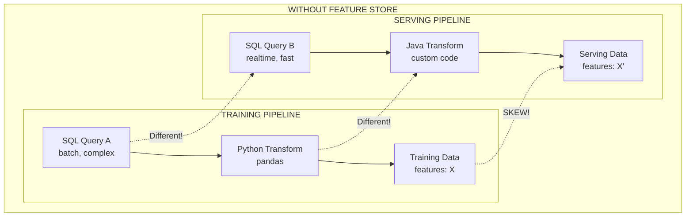
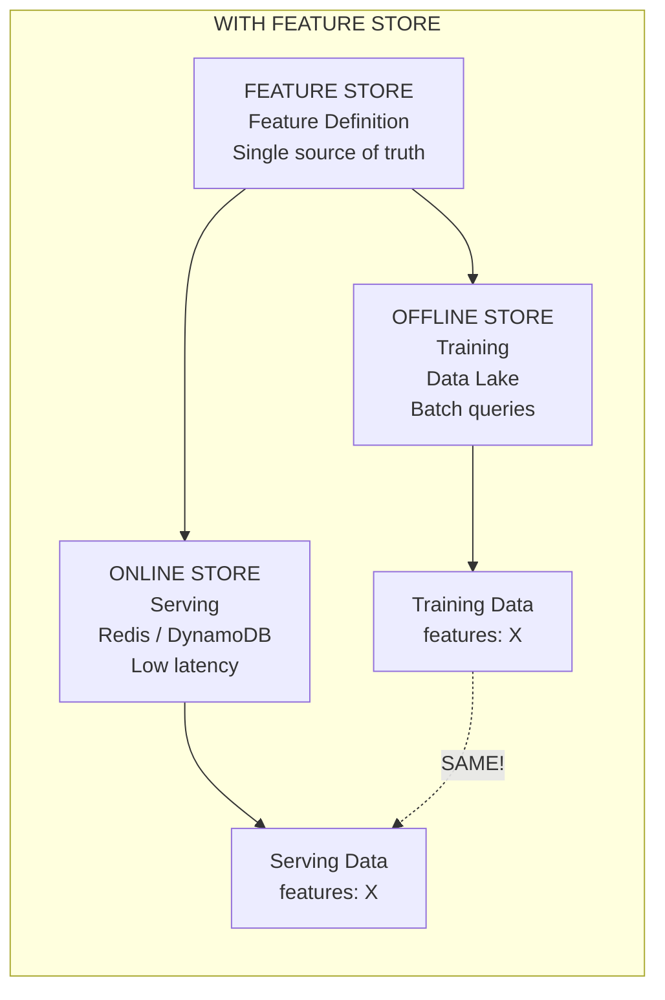
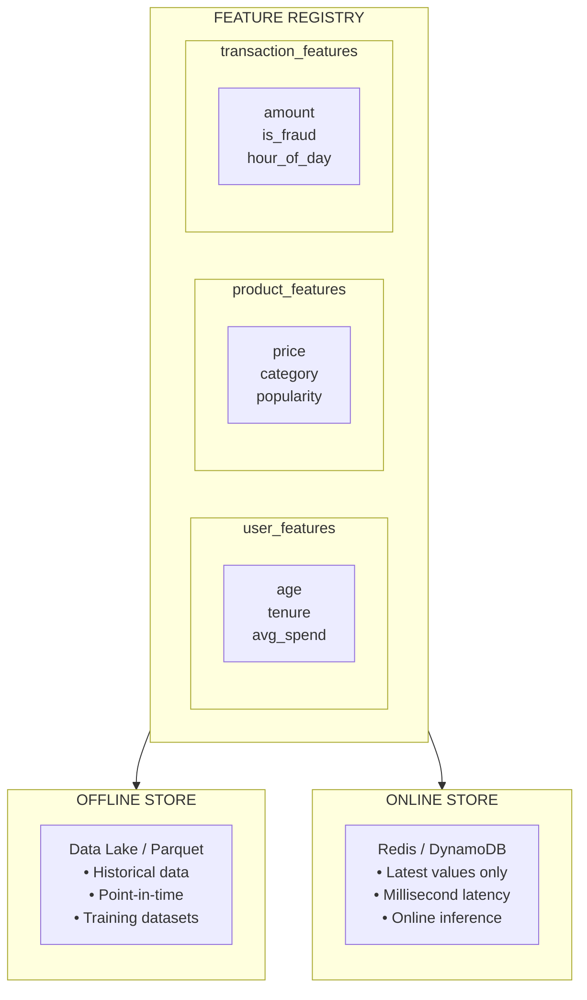
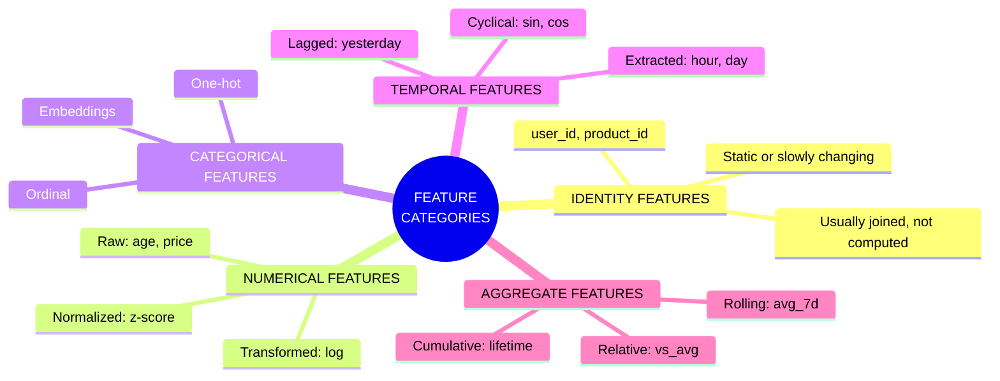
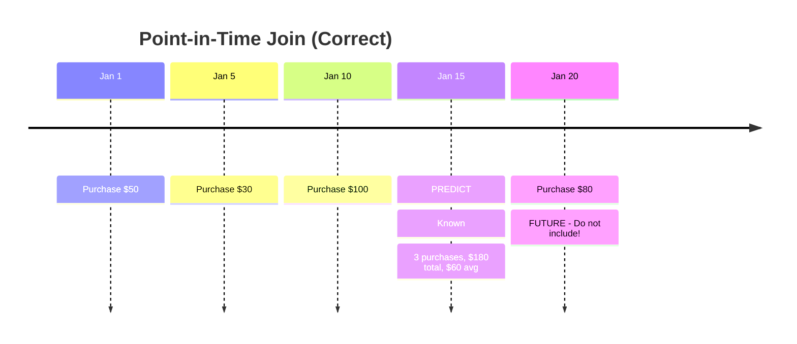

> **Discipline Track** | Complexity: `[COMPLEX]` | Time: 40-45 min

## Prerequisites

Before starting this module:
- [Module 5.1: MLOps Fundamentals](../module-5.1-mlops-fundamentals/)
- Basic understanding of data transformations
- Familiarity with pandas DataFrames
- Understanding of training vs. inference

## What You'll Be Able to Do

After completing this module, you will be able to:

- **Design a feature store architecture that serves both batch training and real-time inference workloads**
- **Implement feature pipelines using Feast or Tecton for consistent feature computation and serving**
- **Build feature discovery workflows that enable ML engineers to find and reuse existing features**
- **Evaluate feature store solutions against requirements for latency, freshness, and data consistency**

## Why This Module Matters

The number one cause of ML production failures isn't bad models—it's **training/serving skew**. Your model trains on features computed one way, then serves predictions using features computed differently. Same feature name, different values, wrong predictions.

Feature stores solve this by providing a single source of truth for features. Compute once, use everywhere. Netflix, Uber, and Airbnb all built feature stores after learning this lesson the hard way.

If you're doing ML at scale without a feature store, you're building technical debt.

## Did You Know?

- **Uber built Michelangelo** (their ML platform) primarily to solve the feature consistency problem—they found 30% of ML debugging time was spent on feature issues
- **Feature computation often takes 80% of ML pipeline time**—yet gets 20% of the attention. Feature stores flip this ratio by making feature engineering reusable
- **The term "feature store" was coined by Uber in 2017**, but the concept existed earlier as "feature engineering platforms" at Google and Facebook
- **Point-in-time correctness** (avoiding data leakage) is the hardest feature store problem to solve—get it wrong and your backtesting lies to you

## What is a Feature Store?

A feature store is a centralized repository for storing, sharing, and serving ML features. Think of it as a "data warehouse for ML features."





### The Training/Serving Skew Problem

```python
# TRAINING: pandas on full dataset
df['avg_purchase_30d'] = df.groupby('user_id')['amount'].transform(
    lambda x: x.rolling(30).mean()
)

# SERVING: custom SQL for single user
SELECT AVG(amount)
FROM purchases
WHERE user_id = ?
  AND date > NOW() - INTERVAL 30 DAY  # Bug: different window!
```

Small differences cause big problems:
- Different date ranges
- NULL handling differences
- Timezone mismatches
- Rounding errors

> **Stop and think**: How would you ensure that a feature calculated as a 30-day rolling average in batch (using pandas) matches the exact same logic when calculated per-user in real-time (using custom SQL or Java)? Without a unified feature store framework, you are relying entirely on manual code translation, leaving you highly vulnerable to these small discrepancies.

### War Story: The $10M Feature Bug

A financial services company deployed a credit risk model. The training pipeline computed "average balance over 90 days" correctly. The serving pipeline had a bug—it computed 30-day average instead.

The model underestimated risk. They approved loans they shouldn't have. Six months later: $10M in defaults traced to one feature computation bug.

A feature store would have prevented this entirely.

## Feature Store Architecture

### Core Components



### Offline vs. Online Stores

| Aspect | Offline Store | Online Store |
|--------|---------------|--------------|
| **Purpose** | Training data | Real-time inference |
| **Latency** | Seconds to minutes | Milliseconds |
| **Data** | Full history | Latest values |
| **Storage** | Data lake (S3, GCS) | Key-value (Redis, DynamoDB) |
| **Query** | Batch, point-in-time | Key lookup |
| **Cost** | Storage optimized | Compute optimized |

## Feature Engineering Best Practices

### Feature Types



### Transformation Code

```python
# Good feature engineering patterns
import pandas as pd
import numpy as np

def create_user_features(df: pd.DataFrame) -> pd.DataFrame:
    """Create user-level features."""
    features = pd.DataFrame()
    features['user_id'] = df['user_id']

    # Numerical: log transform for skewed data
    features['log_total_spend'] = np.log1p(df['total_spend'])

    # Temporal: cyclical encoding for hour
    features['hour_sin'] = np.sin(2 * np.pi * df['hour'] / 24)
    features['hour_cos'] = np.cos(2 * np.pi * df['hour'] / 24)

    # Aggregate: rolling windows
    features['avg_purchase_7d'] = df.groupby('user_id')['amount'].transform(
        lambda x: x.rolling(7, min_periods=1).mean()
    )

    # Ratio features (often powerful)
    features['purchase_frequency'] = df['num_purchases'] / df['days_active']

    return features
```

## Point-in-Time Correctness

The most critical feature store capability is **point-in-time correctness**—ensuring you only use data that was available at prediction time.

> **Pause and predict**: If you inadvertently use future data to train your model (e.g., calculating a user's total spend up to today for a purchase that happened last month), what will happen to your model's evaluation metrics during offline testing versus live production?



If you compute features using ALL data without enforcing a point-in-time boundary:
- `avg_purchase` = $65 (includes the Jan 20 transaction!)
- This introduces FUTURE INFORMATION into your training data.
- The model learns from data it won't actually possess in production.
- Your offline backtests will look amazing, but the model will fail entirely when deployed.

### Implementing Point-in-Time Joins

```python
# Feast handles this automatically
from feast import FeatureStore

store = FeatureStore(repo_path=".")

# Entity DataFrame with timestamps
entity_df = pd.DataFrame({
    "user_id": [1, 2, 3],
    "event_timestamp": [
        datetime(2024, 1, 15),  # Use features available on Jan 15
        datetime(2024, 1, 16),
        datetime(2024, 1, 17),
    ]
})

# Get features as of each timestamp
training_df = store.get_historical_features(
    entity_df=entity_df,
    features=[
        "user_features:avg_purchase_7d",
        "user_features:total_purchases",
    ],
).to_df()
```

## Feature Store Tools

### Feast (Open Source)

**"Feature Store for Machine Learning"**

**Pros:**
- Open source, free
- Cloud agnostic
- Kubernetes native
- Point-in-time joins
- Growing ecosystem

**Cons:**
- Less polished UI
- Smaller community
- Limited streaming capabilities
- Manual schema management

**Best For:** Teams wanting control, K8s environments

### Feature Store Comparison

| Feature Store | Type | Strengths | Best For |
|--------------|------|-----------|----------|
| **Feast** | Open source | Flexible, K8s native | Self-hosted, multi-cloud |
| **Tecton** | Commercial | Streaming, enterprise | Real-time ML at scale |
| **Hopsworks** | Open core | ML platform integration | End-to-end ML |
| **Databricks** | Commercial | Spark integration | Databricks users |
| **SageMaker** | AWS | AWS integration | AWS-native teams |
| **Vertex AI** | GCP | GCP integration | GCP-native teams |

## Feast Deep Dive

### Project Structure

```
feast-project/
├── feature_repo/
│   ├── feature_store.yaml    # Configuration
│   ├── entities.py           # Entity definitions
│   ├── features.py           # Feature views
│   └── data_sources.py       # Data source definitions
├── data/
│   └── user_features.parquet
└── requirements.txt
```

### Configuration

```yaml
# feature_store.yaml
project: my_project
registry: data/registry.db
provider: local
online_store:
  type: sqlite
  path: data/online_store.db
offline_store:
  type: file
entity_key_serialization_version: 2
```

### Defining Features

```python
# entities.py
from feast import Entity

user = Entity(
    name="user_id",
    description="Unique user identifier",
)

product = Entity(
    name="product_id",
    description="Unique product identifier",
)
```

```python
# data_sources.py
from feast import FileSource

user_stats_source = FileSource(
    name="user_stats",
    path="data/user_stats.parquet",
    timestamp_field="event_timestamp",
)
```

```python
# features.py
from feast import FeatureView, Field
from feast.types import Float32, Int64
from datetime import timedelta

from entities import user
from data_sources import user_stats_source

user_features = FeatureView(
    name="user_features",
    entities=[user],
    ttl=timedelta(days=1),
    schema=[
        Field(name="total_purchases", dtype=Int64),
        Field(name="avg_purchase_amount", dtype=Float32),
        Field(name="days_since_last_purchase", dtype=Int64),
    ],
    source=user_stats_source,
)
```

### Using Feast

```python
from feast import FeatureStore
import pandas as pd
from datetime import datetime

# Initialize
store = FeatureStore(repo_path="feature_repo/")

# Apply feature definitions
# Run: feast apply

# Materialize features to online store
# Run: feast materialize 2024-01-01 2024-01-31

# Get training data (offline)
entity_df = pd.DataFrame({
    "user_id": [1, 2, 3],
    "event_timestamp": [datetime.now()] * 3,
})

training_df = store.get_historical_features(
    entity_df=entity_df,
    features=["user_features:total_purchases", "user_features:avg_purchase_amount"],
).to_df()

# Get online features (serving)
online_features = store.get_online_features(
    features=["user_features:total_purchases", "user_features:avg_purchase_amount"],
    entity_rows=[{"user_id": 1}],
).to_dict()

print(online_features)
# {'user_id': [1], 'total_purchases': [42], 'avg_purchase_amount': [29.99]}
```

## Feature Engineering Patterns

### Pattern 1: Lag Features

```python
# For time series: what happened N periods ago
def create_lag_features(df, column, lags=[1, 7, 30]):
    for lag in lags:
        df[f'{column}_lag_{lag}d'] = df.groupby('user_id')[column].shift(lag)
    return df

# Result: value_lag_1d, value_lag_7d, value_lag_30d
```

### Pattern 2: Rolling Aggregates

```python
# Windowed statistics
def create_rolling_features(df, column, windows=[7, 30, 90]):
    for window in windows:
        df[f'{column}_mean_{window}d'] = df.groupby('user_id')[column].transform(
            lambda x: x.rolling(window, min_periods=1).mean()
        )
        df[f'{column}_std_{window}d'] = df.groupby('user_id')[column].transform(
            lambda x: x.rolling(window, min_periods=1).std()
        )
    return df
```

### Pattern 3: Ratio Features

```python
# Comparative features
def create_ratio_features(df):
    # User vs. average user
    global_avg = df['purchase_amount'].mean()
    df['purchase_vs_avg'] = df['purchase_amount'] / global_avg

    # Recent vs. historical
    df['recent_vs_historical'] = df['avg_7d'] / df['avg_90d']

    return df
```

### Pattern 4: Interaction Features

```python
# Combine features for non-linear relationships
def create_interaction_features(df):
    df['price_x_quantity'] = df['price'] * df['quantity']
    df['age_x_tenure'] = df['user_age'] * df['account_tenure']
    return df
```

## Common Mistakes

| Mistake | Problem | Solution |
|---------|---------|----------|
| No point-in-time joins | Data leakage, false confidence | Use feature store with timestamps |
| Feature computed twice | Training/serving skew | Single definition, feature store |
| Missing feature versioning | Can't reproduce models | Version features with models |
| Too many features | Overfitting, slow inference | Feature selection, importance analysis |
| No feature documentation | Team can't understand/reuse | Document every feature |
| Ignoring feature freshness | Stale predictions | TTL and monitoring |

## Quiz

Test your understanding:

<details>
<summary>1. Your data science team built a fraud detection model that achieves 95% accuracy in offline testing using a massive Parquet dataset. When deployed to production using a real-time Redis cache and a Java-based serving API, the model's accuracy drops to 60%. What is the most likely architectural cause of this massive performance drop?</summary>

**Answer**: This is a classic symptom of training/serving skew, which occurs when feature computation logic diverges between the offline training environment and the online serving environment. In this scenario, the batch transformations applied to the Parquet dataset (e.g., aggregating 30-day transaction volumes) likely do not mathematically match the real-time Java code extracting data from the Redis cache. Even minor discrepancies—such as different timezone handling, NULL value imputation, or trailing window boundaries—will result in the model receiving inputs it has never seen before. A feature store resolves this by ensuring a single, centralized definition generates both the historical training data and the real-time serving vectors.
</details>

<details>
<summary>2. You are tasked with designing a system that must supply 10 years of historical user behavior to train a new recommendation model, while simultaneously supplying the current user's last 5 clicks to the live website with under 10 milliseconds of latency. Why would attempting to use a single database (like PostgreSQL or Snowflake) for both of these workloads fail?</summary>

**Answer**: Attempting to use a single database will fail because the workload requirements are fundamentally opposed, which is exactly why feature stores separate the offline and online stores. An offline store (typically a data lake or warehouse like Snowflake) is optimized for high-throughput batch queries across massive historical datasets, which is necessary for point-in-time correct training data but far too slow for real-time inference. Conversely, an online store (like Redis) is optimized for ultra-low latency key-value lookups for individual entities, but would be prohibitively expensive and inefficient for storing and joining years of historical data. By splitting the architecture, a feature store can independently optimize both workloads while maintaining a single logical definition of the features.
</details>

<details>
<summary>3. Your ML engineer trained a model to predict customer churn. They calculated a feature called "total_support_tickets" by querying the entire database for each customer's ticket history up to today, and joined it to churn events from six months ago. The model looks fantastic in backtesting. What critical mistake was made, and what will happen when this model is deployed?</summary>

**Answer**: The engineer failed to enforce point-in-time correctness, meaning they introduced severe data leakage into the training dataset. By including support tickets from the last six months in the feature calculation for a churn event that happened six months ago, the model was trained using future information it would never have in a real-time scenario. When deployed, the model will catastrophically underperform because the production system will only have access to strictly past data, rendering the learned patterns useless. A feature store prevents this by performing automated point-in-time joins, "time-traveling" to calculate the exact feature values as they existed at the specific moment of the historical event.
</details>

<details>
<summary>4. Your startup is building its first machine learning feature—a simple daily batch job that predicts which users might upgrade their subscription based on three static demographic features. The CTO suggests implementing Feast and Redis to ensure "enterprise readiness." Why is this likely a bad architectural decision?</summary>

**Answer**: Implementing a feature store in this scenario introduces massive unnecessary complexity and operational overhead for a use case that does not actually require it. Feature stores are designed to solve problems of scale, specifically training/serving skew, feature reuse across multiple models, and low-latency real-time inference. Since your model runs as a simple daily batch job using only a few static features, there is no online serving component, no strict latency requirement, and no complex feature sharing needed. Adopting a feature store too early will slow down development and waste engineering resources; you should wait until you experience the pain of feature duplication or require real-time serving before introducing this infrastructure.
</details>

## Hands-On Exercise: Build a Feature Store

Let's build a complete feature store with Feast:

### Setup

```bash
# Create project directory
mkdir feast-demo && cd feast-demo

# Create and activate virtual environment
python -m venv venv
source venv/bin/activate

# Install Feast
pip install feast pandas pyarrow
```

### Step 1: Initialize Feast Project

```bash
feast init feature_repo
cd feature_repo
```

### Step 2: Create Sample Data

```python
# create_data.py
import pandas as pd
import numpy as np
from datetime import datetime, timedelta

# Generate user feature data
np.random.seed(42)
n_users = 100
n_days = 30

data = []
for user_id in range(1, n_users + 1):
    for day in range(n_days):
        timestamp = datetime(2024, 1, 1) + timedelta(days=day)
        data.append({
            "user_id": user_id,
            "event_timestamp": timestamp,
            "total_purchases": np.random.randint(0, 100),
            "avg_purchase_amount": round(np.random.uniform(10, 200), 2),
            "days_since_last_purchase": np.random.randint(0, 30),
        })

df = pd.DataFrame(data)
df.to_parquet("data/user_features.parquet")
print(f"Created {len(df)} records")
print(df.head())
```

```bash
mkdir -p data
python create_data.py
```

### Step 3: Define Features

```python
# feature_repo/features.py
from datetime import timedelta
from feast import Entity, FeatureView, Field, FileSource
from feast.types import Float32, Int64

# Entity
user = Entity(
    name="user_id",
    join_keys=["user_id"],
    description="User identifier",
)

# Data source
user_features_source = FileSource(
    name="user_features_source",
    path="data/user_features.parquet",
    timestamp_field="event_timestamp",
)

# Feature view
user_features = FeatureView(
    name="user_features",
    entities=[user],
    ttl=timedelta(days=1),
    schema=[
        Field(name="total_purchases", dtype=Int64),
        Field(name="avg_purchase_amount", dtype=Float32),
        Field(name="days_since_last_purchase", dtype=Int64),
    ],
    source=user_features_source,
    online=True,
)
```

### Step 4: Apply and Materialize

```bash
# Apply feature definitions
feast apply

# Materialize to online store
feast materialize 2024-01-01 2024-02-01
```

### Step 5: Use Features

```python
# use_features.py
from feast import FeatureStore
import pandas as pd
from datetime import datetime

store = FeatureStore(repo_path=".")

# Training: Get historical features
entity_df = pd.DataFrame({
    "user_id": [1, 2, 3, 4, 5],
    "event_timestamp": [datetime(2024, 1, 15)] * 5,  # Point-in-time
})

training_df = store.get_historical_features(
    entity_df=entity_df,
    features=[
        "user_features:total_purchases",
        "user_features:avg_purchase_amount",
        "user_features:days_since_last_purchase",
    ],
).to_df()

print("Training data (point-in-time as of Jan 15):")
print(training_df)

# Serving: Get online features
online_features = store.get_online_features(
    features=[
        "user_features:total_purchases",
        "user_features:avg_purchase_amount",
    ],
    entity_rows=[
        {"user_id": 1},
        {"user_id": 2},
    ],
).to_dict()

print("\nOnline features (latest):")
for key, values in online_features.items():
    print(f"  {key}: {values}")
```

### Success Criteria

You've completed this exercise when you can:
- [ ] Create sample feature data
- [ ] Define entities and feature views in Feast
- [ ] Apply feature definitions
- [ ] Materialize features to online store
- [ ] Retrieve historical features for training (point-in-time)
- [ ] Retrieve online features for serving (latest values)

## Key Takeaways

1. **Feature stores solve training/serving skew**: Single source of truth for features
2. **Offline and online stores serve different needs**: Training vs. real-time inference
3. **Point-in-time correctness prevents data leakage**: Only use data available at prediction time
4. **Feature engineering is reusable**: Compute once, use across models
5. **Start simple**: Feast provides core functionality without vendor lock-in

## Further Reading

- [Feast Documentation](https://docs.feast.dev/) — Open source feature store
- [Feature Store for ML](https://www.featurestore.org/) — Community resources
- [Uber Michelangelo](https://eng.uber.com/michelangelo-machine-learning-platform/) — Uber's ML platform
- [Building Feature Stores](https://www.tecton.ai/blog/) — Tecton's blog

## Summary

Feature stores are the backbone of production ML. They ensure consistency between training and serving, prevent data leakage through point-in-time correctness, and enable feature reuse across teams. While they add complexity, the alternative—debugging training/serving skew in production—is far more expensive.

---

## Next Module

Continue to [Module 5.3: Model Training & Experimentation](../module-5.3-model-training/) to learn how to build reproducible training pipelines with experiment tracking.