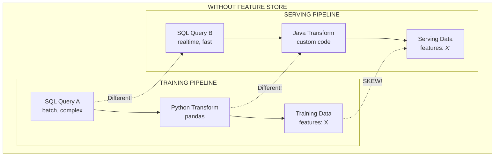
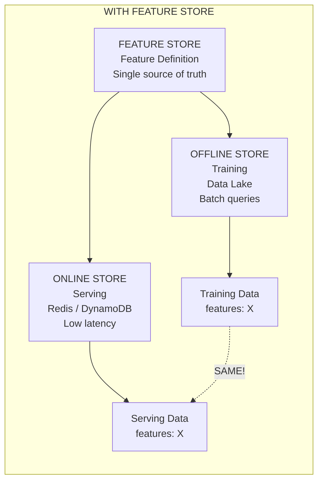
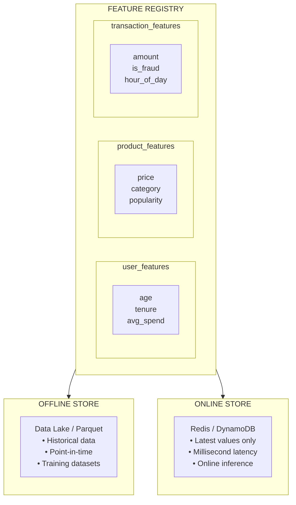
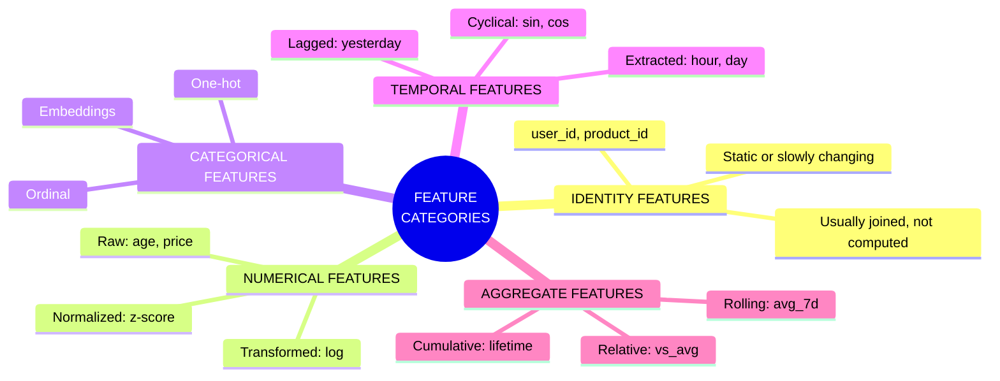
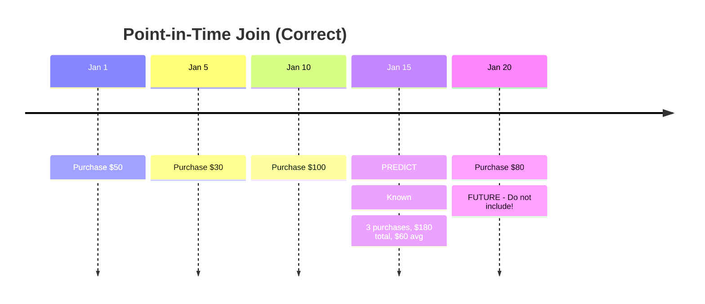

> **Discipline Track** | Complexity: `[COMPLEX]` | Time: 40-45 min

## Prerequisites

Before starting this module:
- [Module 5.1: MLOps Fundamentals](../module-5.1-mlops-fundamentals/)
- Basic understanding of data transformations
- Familiarity with pandas DataFrames
- Understanding of training vs. inference

## What You'll Be Able to Do

After completing this module, you will be able to:

- **Design a feature store architecture that serves both batch training and real-time inference workloads**
- **Implement feature pipelines using Feast or Tecton for consistent feature computation and serving**
- **Build feature discovery workflows that enable ML engineers to find and reuse existing features**
- **Evaluate feature store solutions against requirements for latency, freshness, and data consistency**

## Why This Module Matters

The number one cause of ML production failures isn't bad models—it's **training/serving skew**. Your model trains on features computed one way, then serves predictions using features computed differently. Same feature name, different values, wrong predictions.

Production ML systems rarely fail because the neural network architecture was wrong. They fail because the numbers fed into the model at inference time do not match the numbers seen during training. That mismatch is training/serving skew, and it is the silent killer of deployed models.

Skew can hide for weeks behind green dashboards. Latency stays flat, error rates stay low, and the API keeps returning two hundred responses. Meanwhile, fraud scores drift, recommendations get worse, and credit decisions become systematically biased. The model is running; it is just running on the wrong inputs.

A feature store attacks skew at the source by centralizing feature definitions. Instead of re-implementing the same transformation in Python for batch jobs and again in Java or SQL for online serving, teams register one canonical definition. Both training pipelines and serving paths read from that definition, which shrinks the surface area for subtle divergence.

Large product companies learned this lesson while scaling ML. Uber's Michelangelo platform, described in Uber engineering publications, explicitly centralizes feature management to keep training and serving aligned across thousands of models. The feature store concept was popularized by Michelangelo around 2017, though similar ideas existed earlier inside big-tech data platforms.

Feature stores are not mandatory on day one. They add operational complexity: another registry to govern, another online store to keep fresh, and another system to monitor. But once multiple models share features, once real-time inference needs low-latency lookups, or once skew incidents cost real money, the investment usually pays back quickly.

## Did You Know?

- **Uber built Michelangelo** (their ML platform) to centralize ML infrastructure including feature management—debugging inconsistent features across training and serving pipelines was a recurring pain point at scale
- **Feature engineering work is often under-invested relative to its impact**—feature stores make that work reusable so teams spend less time re-implementing the same transformations in every pipeline
- **The feature store concept was popularized by Uber's Michelangelo platform (2017)**, though similar centralized feature management ideas existed earlier inside large-scale data platforms
- **Point-in-time correctness** (avoiding data leakage) is the hardest feature store problem to solve—get it wrong and your backtesting lies to you

## What is a Feature Store?

A feature store is a centralized repository for storing, sharing, and serving ML features. Think of it as a governed catalog that connects batch history to real-time inference with shared definitions.

At its core, a feature store is a governed layer between raw data and model consumption. Raw tables in a warehouse hold events; models need curated signals such as rolling purchase averages, session counts, or embedding vectors. The store records how those signals are computed, who owns them, and how to fetch them consistently.

Think of the store as a catalog plus two delivery modes. The catalog is the feature registry: schemas, owners, freshness expectations, and lineage back to upstream tables. The delivery modes are offline retrieval for training datasets and online retrieval for millisecond inference. Same definitions, different physical storage tuned to each workload.

Without that split, teams bolt transformations onto whichever pipeline is convenient. Data scientists experiment in notebooks, data engineers schedule nightly Spark jobs, and serving engineers rewrite logic in the API tier. Each path is defensible in isolation, yet together they guarantee drift unless someone manually audits every release.


```mermaid
flowchart TB
    subgraph Without["WITHOUT FEATURE STORE"]
        direction LR
        subgraph Training["TRAINING PIPELINE"]
            direction TB
            A1[SQL Query A<br/>batch, complex] --> B1[Python Transform<br/>pandas]
            B1 --> C1[Training Data<br/>features: X]
        end
        subgraph Serving["SERVING PIPELINE"]
            direction TB
            A2[SQL Query B<br/>realtime, fast] --> B2[Java Transform<br/>custom code]
            B2 --> C2[Serving Data<br/>features: X']
        end
        A1 -.->|"Different!"| A2
        B1 -.->|"Different!"| B2
        C1 -.->|"SKEW!"| C2
    end
```


```mermaid
flowchart TB
    subgraph With["WITH FEATURE STORE"]
        direction TB
        FS[FEATURE STORE<br/>Feature Definition<br/>Single source of truth]
        FS --> Offline[OFFLINE STORE<br/>Training<br/>Data Lake<br/>Batch queries]
        FS --> Online[ONLINE STORE<br/>Serving<br/>Redis / DynamoDB<br/>Low latency]
        Offline --> TrainData[Training Data<br/>features: X]
        Online --> ServData[Serving Data<br/>features: X]
        TrainData -.->|"SAME!"| ServData
    end
```

The diagram above contrasts duplicated logic with a shared definition layer. The offline path materializes historical values for training; the online path serves the latest vector for live requests. Both paths invoke the same transformation specification, which is the architectural invariant you are protecting.

### The Training/Serving Skew Problem

```python
# TRAINING: pandas on full dataset
df['avg_purchase_30d'] = df.groupby('user_id')['amount'].transform(
    lambda x: x.rolling(30).mean()
)

# SERVING: custom SQL for single user
SELECT AVG(amount)
FROM purchases
WHERE user_id = ?
  AND date > NOW() - INTERVAL 30 DAY  # Bug: different window!
```

Small differences in feature logic cause disproportionate production problems, including mismatched date ranges, inconsistent NULL handling, divergent timezone normalization, and floating-point rounding drift:
- Different date ranges
- NULL handling differences
- Timezone mismatches
- Rounding errors

> **Stop and think**: How would you ensure that a feature calculated as a 30-day rolling average in batch (using pandas) matches the exact same logic when calculated per-user in real-time (using custom SQL or Java)? Without a unified feature store framework, you are relying entirely on manual code translation, leaving you highly vulnerable to these small discrepancies.

Training/serving skew often begins with innocent shortcuts. Batch code can use pandas window functions with inclusive boundaries, while serving SQL uses calendar dates that exclude partial days. NULL handling differs: training may forward-fill missing values, serving may drop rows. Time zones shift day boundaries for global users.

The code sample above shows a classic window mismatch: a thirty-day rolling average in training versus a calendar interval in serving. The feature names match, the dashboards look healthy, and unit tests pass because each pipeline is tested separately. Integration tests that compare batch versus online vectors for the same entity at the same timestamp are what catch the bug.

Even tiny numeric differences matter for tree models and neural nets trained on sharp thresholds. A fraud model trained on exact thirty-day aggregates will behave unpredictably when served ninety-day aggregates labeled with the same column name. Production debugging then chases model retraining when the real fix is feature parity.

### Hypothetical scenario: The Rolling Window Mismatch

**Hypothetical scenario:** A credit risk team trains on a ninety-day average balance feature computed in a nightly Spark job. Serving engineers, optimizing for query speed, implement a thirty-day SQL aggregate in the API layer because product asked for fresher signals. Offline metrics look stable; live approvals slowly shift toward higher-risk applicants.

Months later, portfolio monitoring shows rising default rates clustered among recently approved accounts. Root cause analysis traces back to the serving window, not the model weights. A feature store would have forced both paths to reference one registered transformation with explicit window parameters and versioning.

## Feature Store Architecture

Feature store architecture separates concerns that are easy to conflate when you are moving fast. Ingestion pipelines still land raw events in the warehouse. Feature pipelines read those events and materialize entity-level values. The registry records metadata; offline and online stores hold materialized values optimized for their respective query patterns.

The registry is the control plane. It answers questions an on-call engineer asks during incidents: which upstream table feeds this column, what TTL applies, who approved the last schema change, and which model versions consumed a given feature revision. Good registries integrate with data catalogs so discovery does not depend on tribal knowledge.

Materialization jobs move computed features from batch or stream processors into both stores. Offline materialization may rewrite Parquet partitions hourly; online materialization may push latest values into Redis or DynamoDB after each micro-batch. The same transformation code runs in both contexts when the store supports unified definitions.

Platform engineers evaluating feature stores should write down non-negotiable requirements before comparing vendors. Latency targets for online inference, maximum acceptable staleness, regulatory lineage needs, and existing cloud commitments narrow the field quickly. A spreadsheet scoring latency, governance, operational burden, and exit cost beats choosing based on brand familiarity.

Training pipelines consume feature stores through batch exports or point-in-time join APIs. Serving systems consume them through low-latency key lookups, often co-located with model servers in the same availability zone. The contract between those clients is the feature view name and schema version, not ad-hoc column names copied from a wiki page.

Schema evolution requires discipline. Adding nullable columns is usually backward compatible; renaming columns is not. Feature stores that support view versioning let you run shadow pipelines comparing old and new definitions before cutover. Without that, a renamed field silently breaks serving while training happily reads the new name from offline storage.

### Core Components


```mermaid
flowchart TB
    subgraph Registry["FEATURE REGISTRY"]
        direction LR
        subgraph U["user_features"]
            direction TB
            U1[age<br/>tenure<br/>avg_spend]
        end
        subgraph P["product_features"]
            direction TB
            P1[price<br/>category<br/>popularity]
        end
        subgraph T["transaction_features"]
            direction TB
            T1[amount<br/>is_fraud<br/>hour_of_day]
        end
    end
    
    Registry --> Offline
    Registry --> Online
    
    subgraph Offline["OFFLINE STORE"]
        direction TB
        DL[Data Lake / Parquet<br/>• Historical data<br/>• Point-in-time<br/>• Training datasets]
    end
    
    subgraph Online["ONLINE STORE"]
        direction TB
        KV[Redis / DynamoDB<br/>• Latest values only<br/>• Millisecond latency<br/>• Online inference]
    end
```

Offline and online stores exist because no single database satisfies both historical training joins and sub-ten-millisecond inference. Warehouses and data lakes excel at scanning billions of rows with point-in-time semantics; they are the wrong tool for fetching one user's feature vector during a live HTTP request.

Online key-value stores invert that tradeoff. They store the latest feature vector per entity key and respond in single-digit milliseconds, but storing a decade of history per user would be cost-prohibitive and slow to hydrate. The feature store links both worlds through shared entity keys and synchronized definitions.

Operational teams should monitor both sides independently. Offline freshness tracks whether training snapshots include yesterday's data; online freshness tracks whether serving keys reflect the last materialization. A model can train on fresh data while serving stale online values if materialization fails silently, recreating skew from the opposite direction.

Cost planning also differs. Offline storage favors compressed columnar files with lifecycle policies; online storage pays for memory, replication, and hot-path CPU. Feature TTLs balance freshness against spend: shorter TTLs increase write amplification, while long TTLs risk stale predictions when user behavior shifts quickly.

Batch features recompute on schedules and fit stable aggregates with relaxed freshness. Streaming features update continuously from event buses and fit fraud detection or personalization where minutes matter. Hybrid architectures are common: batch backfills plus stream deltas, each registered with explicit freshness metadata.

Feature discovery reduces duplicate warehouse spend. When engineers cannot find existing signals, they recompute near-identical columns under new names, bloating storage and confusing lineage. Registries with search, ownership tags, and documentation fields make reuse the default path instead of reinventing SQL in every squad.

Lineage links feature columns back to upstream datasets, transformation jobs, and consuming models. During incidents, lineage answers whether a broken upstream ETL poisoned features or whether a deployment pinned the wrong view version. Stores without lineage force engineers to grep notebooks under pressure.

Observability for features mirrors observability for models. Track distribution shifts, null rates, materialization lag, and online cache hit ratios. A sudden spike in nulls for a critical feature is often the first sign that an upstream ETL job failed, even when model latency looks fine.

Security teams care about feature stores because they concentrate sensitive signals. Income estimates, health proxies, or geolocation aggregates may be subject to retention policies. Central registration makes it easier to apply column-level access controls and audit who materialized or retrieved regulated attributes.

Multi-tenant platforms sometimes expose a feature catalog to internal customers. Data scientists discover approved views, request access through workflow, and compose models without writing raw SQL against production tables. That self-service layer is where feature stores pay organizational dividends beyond skew prevention alone.

### Offline vs. Online Stores

| Aspect | Offline Store | Online Store |
|--------|---------------|--------------|
| **Purpose** | Training data | Real-time inference |
| **Latency** | Seconds to minutes | Milliseconds |
| **Data** | Full history | Latest values |
| **Storage** | Data lake (S3, GCS) | Key-value (Redis, DynamoDB) |
| **Query** | Batch, point-in-time | Key lookup |
| **Cost** | Storage optimized | Compute optimized |

When evaluating the offline versus online split in your own environment, document expected query patterns before selecting storage backends. Training jobs may scan terabytes once per day; serving paths may issue millions of single-key lookups per hour. Capacity plans that ignore either side lead to either runaway warehouse bills or Redis clusters that cannot fit working sets in memory.

Real-time models often need hybrid freshness: batch features computed nightly plus streaming deltas applied between batch runs. The registry should record which views are batch-only, stream-backed, or hybrid so consumers understand latency guarantees. Mixing hybrid and batch views in one model without documenting freshness invites silent degradation when stream processors lag.

Entity design deserves early attention because it is expensive to change later. Pick stable identifiers—user ID, account ID, device ID—and avoid composite keys unless the store explicitly supports them. Ambiguous entity definitions cause join bugs that look like model drift but are actually key mismatches between training exports and serving requests.

## Feature Engineering Best Practices

Feature engineering is where domain knowledge enters the model. Identity features join entities across tables; numerical features capture magnitude; categorical features encode discrete states; temporal features express seasonality; aggregate features summarize histories. A store does not remove the need for thoughtful design—it makes good designs reusable.

Teams often underestimate how many production features are aggregates. Rolling means, lifetime counts, and ratios dominate models in marketplaces and fintech. Aggregates are also the highest skew risk because window boundaries are easy to mis-specify. Centralizing them in a store with tested definitions prevents each squad from reinventing subtly different windows.

### Feature Types


```mermaid
mindmap
  root((FEATURE<br/>CATEGORIES))
    IDENTITY FEATURES
      user_id, product_id
      Static or slowly changing
      Usually joined, not computed
    NUMERICAL FEATURES
      Raw: age, price
      Transformed: log
      Normalized: z-score
    CATEGORICAL FEATURES
      One-hot
      Ordinal
      Embeddings
    TEMPORAL FEATURES
      Extracted: hour, day
      Cyclical: sin, cos
      Lagged: yesterday
    AGGREGATE FEATURES
      Rolling: avg_7d
      Cumulative: lifetime
      Relative: vs_avg
```

The mind map above is a checklist when registering views. Identity columns usually come from dimension tables; aggregates require explicit window policies; categorical features need stable encoding rules that match between Python training code and serving clients. Document each category in the registry so consumers know what to expect.

### Transformation Code

```python
# Good feature engineering patterns
import pandas as pd
import numpy as np

def create_user_features(df: pd.DataFrame) -> pd.DataFrame:
    """Create user-level features."""
    features = pd.DataFrame()
    features['user_id'] = df['user_id']

    # Numerical: log transform for skewed data
    features['log_total_spend'] = np.log1p(df['total_spend'])

    # Temporal: cyclical encoding for hour
    features['hour_sin'] = np.sin(2 * np.pi * df['hour'] / 24)
    features['hour_cos'] = np.cos(2 * np.pi * df['hour'] / 24)

    # Aggregate: rolling windows
    features['avg_purchase_7d'] = df.groupby('user_id')['amount'].transform(
        lambda x: x.rolling(7, min_periods=1).mean()
    )

    # Ratio features (often powerful)
    features['purchase_frequency'] = df['num_purchases'] / df['days_active']

    return features
```

The Python helper above demonstrates patterns you will register as reusable transformations: log transforms for skewed spend, cyclical encodings for hour-of-day, and grouped rolling means for recency signals. In a store-backed workflow, this logic lives in a versioned module invoked by both batch backfills and stream processors.

When transformations change, versioning matters as much as code review. Bumping a window from seven to fourteen days alters model behavior even if the column name stays constant. Registries should record transformation versions and let training jobs pin to a specific revision while serving gradually rolls forward behind validation gates.

Reuse turns feature engineering from craft into infrastructure. When a churn model and a recommendation model both need thirty-day purchase counts, one feature view serves both with a single materialization job and unified tests. That consolidation is how platform teams multiply data scientist throughput without multiplying headcount.

Experiment tracking integrations link training runs to exact feature view revisions. When an experiment beats the production champion, reviewers can diff not only hyperparameters but also the feature definitions used. That closes a common loophole where improved offline metrics come from accidental leakage rather than better modeling.

Cold start problems affect both stores and models. New users lack history for aggregate features; stores should document default imputation policies applied consistently offline and online. If training replaces missing rolling averages with zero but serving uses NULL, skew returns despite a centralized definition file sitting in Git.

Edge deployment adds latency constraints. Mobile or embedded inference may not reach a remote Redis cluster; teams sometimes replicate a slim online store regionally or precompute bundles. The feature store still owns definitions even when physical serving caches vary by geography.

## Point-in-Time Correctness

The most critical feature store capability is **point-in-time correctness**—ensuring you only use data that was available at prediction time.

Point-in-time correctness is the feature store capability that separates toy demos from production-grade training data. Historical labels must pair with features computed using only information available at the label timestamp. Violating that rule injects future data, inflates offline metrics, and guarantees disappointment after deployment.

The mechanism is a temporal join: for each training row, the store finds feature values whose event timestamps are less than or equal to the label time, then picks the latest such value per feature. That as-of join is tedious to hand-write in SQL across dozens of tables, which is why stores automate it.

> **Pause and predict**: If you inadvertently use future data to train your model (e.g., calculating a user's total spend up to today for a purchase that happened last month), what will happen to your model's evaluation metrics during offline testing versus live production?


```mermaid
timeline
    title Point-in-Time Join (Correct)
    Jan 1 : Purchase $50
    Jan 5 : Purchase $30
    Jan 10 : Purchase $100
    Jan 15 : PREDICT : Known: 3 purchases, $180 total, $60 avg
    Jan 20 : Purchase $80 : FUTURE - Do not include!
```

If you compute features using ALL data without enforcing a point-in-time boundary:
- `avg_purchase` = $65 (includes the Jan 20 transaction!)
- This introduces FUTURE INFORMATION into your training data.
- The model learns from data it won't actually possess in production.
- Your offline backtests will look amazing, but the model will fail entirely when deployed.

Leakage is insidious because models still train and loss still decreases. You are simply learning shortcuts that will not exist live. Support ticket counts that include tickets filed after a churn event make churn look predictable until the future tickets disappear in production.

Feast encodes entities, sources, and feature views so historical retrieval can apply consistent as-of logic. The entity DataFrame carries both entity keys and event timestamps; `get_historical_features` aligns each row with the correct feature snapshot. Teams still must ensure source tables contain accurate event times—garbage timestamps break even the best join engine.

Backtesting workflows should always spot-check a handful of rows manually. Pick an entity and timestamp, compute features by hand from raw events, and compare to the store output. Discrepancies often reveal timezone normalization bugs or duplicate events that automated tests missed.

Data quality checks belong upstream of materialization. If source tables duplicate events or carry incorrect timestamps, the store faithfully serves wrong values at scale. Great Expectations or similar frameworks should gate promotion of new feature view versions, treating features with the same skepticism as training labels.

Backfill operations rebuild historical offline values after definition changes. Plan backfills before switching serving to a new view version, or training-serving skew reappears during the transition window. Large backfills may require throttled warehouse queries to avoid starving interactive analysts.

Documentation is a feature of the registry, not a wiki afterthought. Each view should state owner, freshness SLO, upstream dependencies, known limitations, and example consumers. Future you—and auditors—will thank present you when incidents strike at midnight on a holiday.

### Implementing Point-in-Time Joins

```python
# Feast handles this automatically
from feast import FeatureStore

store = FeatureStore(repo_path=".")

# Entity DataFrame with timestamps
entity_df = pd.DataFrame({
    "user_id": [1, 2, 3],
    "event_timestamp": [
        datetime(2024, 1, 15),  # Use features available on Jan 15
        datetime(2024, 1, 16),
        datetime(2024, 1, 17),
    ]
})

# Get features as of each timestamp
training_df = store.get_historical_features(
    entity_df=entity_df,
    features=[
        "user_features:avg_purchase_7d",
        "user_features:total_purchases",
    ],
).to_df()
```

## Feature Store Tools

Choosing a feature store is an architecture decision, not a leaderboard exercise. Match capabilities to latency needs, governance requirements, existing cloud commitments, and team skill. The comparison below treats vendors as peers evaluated on tradeoffs; none is universally superior for every workload. **Landscape snapshot — as of 2026-06:** feature-store products churn quickly, so verify capabilities against current vendor documentation before relying on specifics in planning documents. Re-read the comparison table whenever vendors ship major releases, because feature-store capabilities change faster than textbook chapters can be updated.

### Feast (Open Source)

Feast markets itself as a feature store for machine learning—a centralized layer for defining, discovering, and serving ML features consistently across training and inference workloads.

Feast is an open-source feature store incubating under the LF AI & Data Foundation, originating from a Gojek and Google collaboration. It targets teams that want cloud-agnostic definitions, optional Kubernetes deployments, and community-driven integrations. Recent project announcements also note Feast joining the PyTorch Ecosystem, reflecting broader ML tooling alignment.

The current Feast release on PyPI is version 0.64.0 as of June 2026—well beyond early blog posts that reference 0.10-era APIs. Always verify installation docs for your target version because configuration keys evolve. Feast provides offline historical retrieval and pluggable online stores such as Redis, DynamoDB, or SQLite for local labs.

Feast shines when you need portable definitions and are willing to operate materialization jobs yourself. Streaming support and enterprise UI polish vary by deployment; many teams pair Feast with existing orchestrators like Airflow or Dagster for backfills. Community breadth means integrations exist for major warehouses, though you curate which connectors match your stack.

Feast strengths include open-source licensing under LF AI & Data, cloud-agnostic pluggable offline and online stores, Kubernetes-friendly deployment patterns, documented [point-in-time joins](https://github.com/feast-dev/feast), and an active community with PyTorch Ecosystem alignment. Tradeoffs include operational overhead for materialization and streaming pipelines, variable UI and governance depending on deployment choices, streaming integrations that often require custom assembly, and explicit schema evolution management by platform teams. Feast fits teams that want portable feature definitions and direct control over underlying infrastructure rather than a fully managed SaaS control plane.

Tecton is a commercial managed feature platform built on concepts aligned with Feast, adding a proprietary transformation DSL and managed real-time infrastructure for teams that prefer not to assemble stream processors themselves. Hopsworks offers open-core feature storage with strong governance and lineage tooling aimed at regulated or on-prem deployments, available self-hosted or via Hopsworks.ai managed service.

Cloud-native options such as SageMaker Feature Store and Vertex AI Feature Store integrate with their respective ML control planes, which reduces glue code when you already train and deploy inside those ecosystems. Trade flexibility for convenience: portable definitions may be harder to extract if you later multi-cloud.

Skip a feature store when a team runs one batch model nightly on a handful of static columns with no online serving and no sharing across squads. A well-tested SQL script checked into Git plus integration tests comparing batch outputs to served payloads may suffice until duplication or latency pain appears.

Premature adoption slows startups: engineers operate Redis clusters, debug materialization cron jobs, and write YAML instead of shipping product fixes. Adopt when you feel concrete pain—a second model needing the same features, real-time API latency requirements, or a documented skew incident.

Governance also covers access control and PII handling. Sensitive features may require column-level policies, audit logs, and approval workflows before promotion to production views. Regulated industries often choose platforms with built-in lineage export for compliance reviews.

Total cost includes offline storage, online memory, materialization compute, and engineer time operating pipelines. Duplicated ad-hoc features often hide inside warehouse bills; centralized stores make spend visible per feature view. Right-size online clusters by TTL and key cardinality—high-cardinality entities explode memory if every possible key is preloaded.

Organizational adoption often stalls on ownership ambiguity. Name a feature platform owner who curates standards, reviews new views, and coordinates breaking changes. Without that role, registries become graveyards of experimental columns nobody dares delete.

Capacity planning for online stores estimates key cardinality times vector size times replication factor. Seasonal products can spike cardinality during promotions; autoscaling policies should consider memory limits of Redis clusters serving peak traffic.

Testing feature pipelines differs from testing model code. Golden-file tests compare materialized outputs for fixed input snapshots; contract tests verify serving APIs return schemas matching registry declarations. Both should run in CI before `feast apply` touches production registries.

### Feature Store Comparison

| Feature Store | Type | Strengths | Best For |
|--------------|------|-----------|----------|
| **Feast** | Open source | Flexible, K8s native | Self-hosted, multi-cloud |
| **Tecton** | Commercial | Streaming, enterprise | Real-time ML at scale |
| **Hopsworks** | Open core | ML platform integration | End-to-end ML |
| **Databricks** | Commercial | Spark integration | Databricks users |
| **SageMaker** | AWS | [AWS integration](https://docs.aws.amazon.com/sagemaker/latest/dg/feature-store.html) | AWS-native teams |
| **Vertex AI** | GCP | [GCP integration](https://cloud.google.com/vertex-ai/docs/featurestore/latest/overview) | GCP-native teams |

Before committing to a row in the comparison table, run a two-week proof of concept with your highest-risk feature—the one most likely to diverge between batch and serving today. Measure materialization latency, point-in-time join correctness on a labeled holdout set, and operational steps required for schema changes. Paper evaluations miss the friction that determines whether teams actually adopt the store or bypass it with notebook SQL.

Managed cloud feature stores reduce undifferentiated heavy lifting but couple you to provider release cadences and pricing models. Self-hosted Feast maximizes portability at the cost of SRE time for online stores, registry backups, and upgrade testing. Many mature teams start managed for speed, then extract portable definitions if multi-cloud becomes a requirement rather than a hypothetical.

## Feast Deep Dive

Feast projects organize definitions as code in a feature repository. That repository is the contract between data engineers who maintain sources and ML engineers who consume feature views. Checking it into Git gives you pull-request review, reproducible environments, and CI validation before changes hit production registries.

Local development typically uses file-backed offline stores and SQLite online stores, as shown in the sample configuration. Production deployments swap those types for cloud object storage plus managed Redis or DynamoDB. The YAML stays structurally similar, which eases promotion from laptop to staging cluster.

### Project Structure

```
feast-project/
├── feature_repo/
│   ├── feature_store.yaml    # Configuration
│   ├── entities.py           # Entity definitions
│   ├── features.py           # Feature views
│   └── data_sources.py       # Data source definitions
├── data/
│   └── user_features.parquet
└── requirements.txt
```

Entities define join keys—often user, product, or session identifiers—that tie feature values to prediction targets. Feast uses entities to align offline training rows and online lookup requests. Explicit join key lists prevent ambiguous merges when multiple identifiers could apply in complex domains.

### Configuration

```yaml
# feature_store.yaml
project: my_project
registry: data/registry.db
provider: local
online_store:
  type: sqlite
  path: data/online_store.db
offline_store:
  type: file
entity_key_serialization_version: 2
```

Feature views group related columns with shared freshness rules and materialization settings. TTL values such as one day tell the online store when to expire stale keys, which prevents unbounded growth and forces periodic refresh. Schema fields use explicit types so serving clients deserialize consistently across languages.

### Defining Features

```python
# entities.py
from feast import Entity

user = Entity(
    name="user_id",
    description="Unique user identifier",
)

product = Entity(
    name="product_id",
    description="Unique product identifier",
)
```

```python
# data_sources.py
from feast import FileSource

user_stats_source = FileSource(
    name="user_stats",
    path="data/user_stats.parquet",
    timestamp_field="event_timestamp",
)
```

```python
# features.py
from feast import FeatureView, Field
from feast.types import Float32, Int64
from datetime import timedelta

from entities import user
from data_sources import user_stats_source

user_features = FeatureView(
    name="user_features",
    entities=[user],
    ttl=timedelta(days=1),
    schema=[
        Field(name="total_purchases", dtype=Int64),
        Field(name="avg_purchase_amount", dtype=Float32),
        Field(name="days_since_last_purchase", dtype=Int64),
    ],
    source=user_stats_source,
)
```

### Using Feast

```python
from feast import FeatureStore
import pandas as pd
from datetime import datetime

# Initialize
store = FeatureStore(repo_path="feature_repo/")

# Apply feature definitions
# Run: feast apply

# Materialize features to online store
# Run: feast materialize 2024-01-01 2024-01-31

# Get training data (offline)
entity_df = pd.DataFrame({
    "user_id": [1, 2, 3],
    "event_timestamp": [datetime.now()] * 3,
})

training_df = store.get_historical_features(
    entity_df=entity_df,
    features=["user_features:total_purchases", "user_features:avg_purchase_amount"],
).to_df()

# Get online features (serving)
online_features = store.get_online_features(
    features=["user_features:total_purchases", "user_features:avg_purchase_amount"],
    entity_rows=[{"user_id": 1}],
).to_dict()

print(online_features)
# {'user_id': [1], 'total_purchases': [42], 'avg_purchase_amount': [29.99]}
```

The workflow begins with `feast apply` to register definitions, then materialization commands push historical snapshots into the online store for low-latency reads. Training jobs call `get_historical_features` with entity timestamps; serving services call `get_online_features` with entity keys only. Both paths resolve the same feature view names.

Monitoring should confirm materialization lag and online hit rates. If materialization stops, online features freeze while offline training continues to ingest new history—another skew vector. Alert on materialization job failures as aggressively as you alert on model deployment failures.

## Feature Engineering Patterns

Lag features expose past values at fixed offsets and are common in forecasting and churn models. Rolling aggregates summarize recent behavior with means, standard deviations, or counts. Ratio features compare entity behavior to population baselines or recent history versus long-term history. Interaction features capture non-linear combinations that linear models would miss alone.

When these patterns live only in notebooks, each model team copies them with small edits. A store promotes them to shared assets with documentation, ownership, and SLAs. That reuse cuts duplicate warehouse spend and reduces the time data scientists spend rebuilding the same SQL.

### Pattern 1: Lag Features

Lag features require careful ordering within each entity partition. Shifts must respect event time, not ingestion time, or late-arriving data will misalign lags. In streaming settings, watermark policies define how long to wait for straggler events before closing a window.

```python
# For time series: what happened N periods ago
def create_lag_features(df, column, lags=[1, 7, 30]):
    for lag in lags:
        df[f'{column}_lag_{lag}d'] = df.groupby('user_id')[column].shift(lag)
    return df

# Result: value_lag_1d, value_lag_7d, value_lag_30d
```

### Pattern 2: Rolling Aggregates

Rolling windows need explicit min_periods policies so cold-start users receive sensible defaults instead of NULLs that serving code might impute differently. Document whether windows are calendar-based or event-count-based; mixing the two across features in one model confuses interpretation and debugging.

```python
# Windowed statistics
def create_rolling_features(df, column, windows=[7, 30, 90]):
    for window in windows:
        df[f'{column}_mean_{window}d'] = df.groupby('user_id')[column].transform(
            lambda x: x.rolling(window, min_periods=1).mean()
        )
        df[f'{column}_std_{window}d'] = df.groupby('user_id')[column].transform(
            lambda x: x.rolling(window, min_periods=1).std()
        )
    return df
```

### Pattern 3: Ratio Features

Ratio features amplify signal but also amplify skew when denominators approach zero. Add epsilon guards or cap ratios in transformation code, and apply the same guards in both offline and online paths. Feature stores make that sharing automatic once ratios are registered centrally.

```python
# Comparative features
def create_ratio_features(df):
    # User vs. average user
    global_avg = df['purchase_amount'].mean()
    df['purchase_vs_avg'] = df['purchase_amount'] / global_avg

    # Recent vs. historical
    df['recent_vs_historical'] = df['avg_7d'] / df['avg_90d']

    return df
```

### Pattern 4: Interaction Features

Interaction terms increase dimensionality and can overfit small datasets. Use them when domain knowledge suggests combined effects—price times quantity for revenue proxies, age times tenure for loyalty signals—and monitor feature importance after deployment to prune weak interactions.

```python
# Combine features for non-linear relationships
def create_interaction_features(df):
    df['price_x_quantity'] = df['price'] * df['quantity']
    df['age_x_tenure'] = df['user_age'] * df['account_tenure']
    return df
```

Ratio and interaction features often dominate model performance after basic aggregates saturate gains. They also multiply skew risk when numerator and denominator come from different pipelines. Register ratios as single computed columns rather than expecting serving code to divide two independently materialized values that may update at different cadences.

## Common Mistakes

Most feature store incidents trace back to process failures rather than tool bugs. Teams skip point-in-time validation, duplicate transformations outside the registry, or deploy models without pinning feature versions. The table below lists recurring mistakes with practical fixes; treat it as a pre-production checklist.

Migration from ad-hoc features to a store is incremental. Pick one high-value aggregate with known skew risk, register it, dual-write offline and online paths, and compare outputs for two weeks before cutting over training. Big-bang migrations fail when hidden notebook dependencies surface late.

Open-source versus managed tradeoffs hinge on operational headcount. Feast on Kubernetes may suit platform teams with SRE support; Vertex or SageMaker feature stores suit teams already standardized on those clouds with limited ops bandwidth. Hybrid models—Feast definitions with managed online stores—are common middle grounds.

Future modules cover training pipelines and monitoring; feature consistency established here is the foundation those systems assume. If features drift silently, no amount of experiment tracking or drift detection will save you from debugging ghosts.

| Mistake | Problem | Solution |
|---------|---------|----------|
| No point-in-time joins | Data leakage, false confidence | Use feature store with timestamps |
| Feature computed twice | Training/serving skew | Single definition, feature store |
| Missing feature versioning | Can't reproduce models | Version features with models |
| Too many features | Overfitting, slow inference | Feature selection, importance analysis |
| No feature documentation | Team can't understand/reuse | Document every feature |
| Ignoring feature freshness | Stale predictions | TTL and monitoring |

## Quiz

Test your understanding:

Work through these scenario questions after completing the lab. They emphasize architectural tradeoffs and failure modes you will see in platform reviews and on-call rotations.

<details>
<summary>1. Your data science team built a fraud detection model that achieves 95% accuracy in offline testing using a massive Parquet dataset. When deployed to production using a real-time Redis cache and a Java-based serving API, the model's accuracy drops to 60%. What is the most likely architectural cause of this massive performance drop?</summary>

**Answer**: This is a classic symptom of training/serving skew, which occurs when feature computation logic diverges between the offline training environment and the online serving environment. In this scenario, the batch transformations applied to the Parquet dataset (e.g., aggregating 30-day transaction volumes) likely do not mathematically match the real-time Java code extracting data from the Redis cache. Even minor discrepancies—such as different timezone handling, NULL value imputation, or trailing window boundaries—will result in the model receiving inputs it has never seen before. A feature store resolves this by ensuring a single, centralized definition generates both the historical training data and the real-time serving vectors.
</details>

<details>
<summary>2. You are tasked with designing a system that must supply 10 years of historical user behavior to train a new recommendation model, while simultaneously supplying the current user's last 5 clicks to the live website with under 10 milliseconds of latency. Why would attempting to use a single database (like PostgreSQL or Snowflake) for both of these workloads fail?</summary>

**Answer**: Attempting to use a single database will fail because the workload requirements are fundamentally opposed, which is exactly why feature stores separate the offline and online stores. An offline store (typically a data lake or warehouse like Snowflake) is optimized for high-throughput batch queries across massive historical datasets, which is necessary for point-in-time correct training data but far too slow for real-time inference. Conversely, an online store (like Redis) is optimized for ultra-low latency key-value lookups for individual entities, but would be prohibitively expensive and inefficient for storing and joining years of historical data. By splitting the architecture, a feature store can independently optimize both workloads while maintaining a single logical definition of the features.
</details>

<details>
<summary>3. Your ML engineer trained a model to predict customer churn. They calculated a feature called "total_support_tickets" by querying the entire database for each customer's ticket history up to today, and joined it to churn events from six months ago. The model looks fantastic in backtesting. What critical mistake was made, and what will happen when this model is deployed?</summary>

**Answer**: The engineer failed to enforce point-in-time correctness, meaning they introduced severe data leakage into the training dataset. By including support tickets from the last six months in the feature calculation for a churn event that happened six months ago, the model was trained using future information it would never have in a real-time scenario. When deployed, the model will catastrophically underperform because the production system will only have access to strictly past data, rendering the learned patterns useless. A feature store prevents this by performing automated point-in-time joins, "time-traveling" to calculate the exact feature values as they existed at the specific moment of the historical event.
</details>

<details>
<summary>4. Your startup is building its first machine learning feature—a simple daily batch job that predicts which users might upgrade their subscription based on three static demographic features. The CTO suggests implementing Feast and Redis to ensure "enterprise readiness." Why is this likely a bad architectural decision?</summary>

**Answer**: Implementing a feature store in this scenario introduces massive unnecessary complexity and operational overhead for a use case that does not actually require it. Feature stores are designed to solve problems of scale, specifically training/serving skew, feature reuse across multiple models, and low-latency real-time inference. Since your model runs as a simple daily batch job using only a few static features, there is no online serving component, no strict latency requirement, and no complex feature sharing needed. Adopting a feature store too early will slow down development and waste engineering resources; you should wait until you experience the pain of feature duplication or require real-time serving before introducing this infrastructure.
</details>

<details>
<summary>5. Two teams each maintain their own SQL for "days_since_last_login." Team A's model uses the feature in training; Team B's serving API recomputes it nightly with a different NULL-handling rule. Neither team knows the other exists. What platform capability prevents this duplication and drift?</summary>

**Answer**: A feature registry with discovery and shared feature views prevents silent duplication. When features are registered with owners, schemas, and documentation, engineers can search for existing signals before writing new SQL. Shared views ensure the same transformation—and the same NULL policy—feeds every model. Governance workflows add approval gates so changes propagate consistently rather than breaking one team's pipeline quietly.
</details>

<details>
<summary>6. Your fraud team needs click counts updated within one minute for online scoring, while your marketing churn model retrains weekly on demographic aggregates. Must both feature sets use the same freshness policy and storage tier?</summary>

**Answer**: No—different features warrant different freshness SLOs and often different ingestion paths. Click counts likely flow through streaming materialization into an online store with short TTLs, while demographic aggregates may batch nightly into offline partitions with longer TTLs. A feature store still helps because both register in one registry with explicit freshness metadata, but you should not force one global schedule when workloads differ sharply.
</details>

<details>
<summary>7. During a model audit, regulators ask which training data produced a credit decision six months ago. Your team has model weights archived but feature definitions lived in a spreadsheet. What registry capability satisfies the audit?</summary>

**Answer**: Feature lineage tied to versioned feature views and materialization timestamps shows which transformation logic and upstream datasets produced the features consumed by that model version. A registry records view revisions, source tables, and often links to model registry entries. Spreadsheets fail audits because they lack immutable history; Git-backed definitions plus store metadata provide reproducible evidence.
</details>

## Hands-On Exercise: Build a Feature Store

The lab installs Feast locally so you can feel materialization and retrieval without provisioning cloud infrastructure. Follow each step in order; skipping materialization leaves the online store empty even when offline Parquet files exist.

After completing the lab, try changing a feature schema locally and observe how `feast apply` reports diffs. That workflow mirrors production promotion: propose a change, review impact, apply to registry, backfill offline history, rematerialize online keys, and validate sample entities before models pin the new version.

If online lookups return empty dicts, check three places first: materialization date range coverage, TTL expiration relative to your sample timestamps, and whether `online=True` was set on the feature view. Most beginner Feast issues are operational, not conceptual.

Let's build a complete feature store with Feast:

### Setup

Use an isolated virtual environment so Feast dependencies do not conflict with other project packages. Pin Feast in requirements.txt when promoting beyond the lab so teammates reproduce the same behavior.

```bash
# Create project directory
mkdir feast-demo && cd feast-demo

# Create and activate virtual environment
python -m venv venv
source venv/bin/activate

# Install Feast
pip install feast pandas pyarrow
```

### Step 1: Initialize Feast Project

`feast init` scaffolds a repository with example entities and feature views you will replace with the definitions below. Treat generated files as templates; production repos often split entities, sources, and views into separate modules for clarity.

```bash
feast init feature_repo
cd feature_repo
```

### Step 2: Create Sample Data

Synthetic Parquet data stands in for warehouse exports. Real pipelines would land similar files via Spark or SQL exports with event timestamps aligned to business clocks. Verify timestamp columns are timezone-aware before registering sources.

```python
# create_data.py
import pandas as pd
import numpy as np
from datetime import datetime, timedelta

# Generate user feature data
np.random.seed(42)
n_users = 100
n_days = 30

data = []
for user_id in range(1, n_users + 1):
    for day in range(n_days):
        timestamp = datetime(2024, 1, 1) + timedelta(days=day)
        data.append({
            "user_id": user_id,
            "event_timestamp": timestamp,
            "total_purchases": np.random.randint(0, 100),
            "avg_purchase_amount": round(np.random.uniform(10, 200), 2),
            "days_since_last_purchase": np.random.randint(0, 30),
        })

df = pd.DataFrame(data)
df.to_parquet("data/user_features.parquet")
print(f"Created {len(df)} records")
print(df.head())
```

```bash
mkdir -p data
python create_data.py
```

### Step 3: Define Features

Setting `online=True` on the feature view tells Feast to allow online serving after materialization. Omitting that flag restricts retrieval to historical training queries only, which is easy to miss when debugging empty online lookups.

```python
# feature_repo/features.py
from datetime import timedelta
from feast import Entity, FeatureView, Field, FileSource
from feast.types import Float32, Int64

# Entity
user = Entity(
    name="user_id",
    join_keys=["user_id"],
    description="User identifier",
)

# Data source
user_features_source = FileSource(
    name="user_features_source",
    path="data/user_features.parquet",
    timestamp_field="event_timestamp",
)

# Feature view
user_features = FeatureView(
    name="user_features",
    entities=[user],
    ttl=timedelta(days=1),
    schema=[
        Field(name="total_purchases", dtype=Int64),
        Field(name="avg_purchase_amount", dtype=Float32),
        Field(name="days_since_last_purchase", dtype=Int64),
    ],
    source=user_features_source,
    online=True,
)
```

### Step 4: Apply and Materialize

`feast apply` diffs local definitions against the registry database and applies changes. Materialize over a date range that covers your sample Parquet rows; narrow ranges silently skip older events, producing empty online keys that look like bugs.

```bash
# Apply feature definitions
feast apply

# Materialize to online store
feast materialize 2024-01-01 2024-02-01
```

### Step 5: Use Features

Compare offline rows for a fixed timestamp against online dicts for the same entities. Values should match when materialization included that timestamp. Mismatches usually mean stale online stores or TTL eviction—not model issues.

```python
# use_features.py
from feast import FeatureStore
import pandas as pd
from datetime import datetime

store = FeatureStore(repo_path=".")

# Training: Get historical features
entity_df = pd.DataFrame({
    "user_id": [1, 2, 3, 4, 5],
    "event_timestamp": [datetime(2024, 1, 15)] * 5,  # Point-in-time
})

training_df = store.get_historical_features(
    entity_df=entity_df,
    features=[
        "user_features:total_purchases",
        "user_features:avg_purchase_amount",
        "user_features:days_since_last_purchase",
    ],
).to_df()

print("Training data (point-in-time as of Jan 15):")
print(training_df)

# Serving: Get online features
online_features = store.get_online_features(
    features=[
        "user_features:total_purchases",
        "user_features:avg_purchase_amount",
    ],
    entity_rows=[
        {"user_id": 1},
        {"user_id": 2},
    ],
).to_dict()

print("\nOnline features (latest):")
for key, values in online_features.items():
    print(f"  {key}: {values}")
```

### Success Criteria

You've completed this exercise when you can:
- [ ] Create sample feature data
- [ ] Define entities and feature views in Feast
- [ ] Apply feature definitions
- [ ] Materialize features to online store
- [ ] Retrieve historical features for training (point-in-time)
- [ ] Retrieve online features for serving (latest values)

## Key Takeaways

Feature stores earn their keep when feature consistency, reuse, and governance outweigh operational overhead. They are force multipliers for platform teams supporting many models, not silver bullets for single batch jobs with three static columns.

Start with clear entity and timestamp discipline, add a registry once duplication hurts, and introduce online stores only when latency requirements demand them. Feast offers a portable on-ramp; cloud-managed stores integrate tightly with SageMaker or Vertex when you already live in those ecosystems.

1. **Feature stores solve training/serving skew**: Single source of truth for features
2. **Offline and online stores serve different needs**: Training vs. real-time inference
3. **Point-in-time correctness prevents data leakage**: Only use data available at prediction time
4. **Feature engineering is reusable**: Compute once, use across models
5. **Start simple**: Feast provides core functionality without vendor lock-in

Adoption maturity progresses from ad-hoc SQL to shared views to full online serving. Most teams do not jump directly to the final stage. Measure progress by skew incidents prevented, duplicate pipelines eliminated, and time saved when launching models that reuse existing features rather than by counting YAML files in a repository.

## Summary

You now have a mental model for offline versus online storage, point-in-time joins, and vendor-neutral evaluation criteria. The lab showed how definitions in code become training datasets and serving vectors without rewriting transformations per environment.

Carry these patterns into model training modules next: reproducible pipelines matter only if the features feeding them stay consistent from experiment tracking through production monitoring.

Feature stores are the backbone of production ML. They ensure consistency between training and serving, prevent data leakage through point-in-time correctness, and enable feature reuse across teams. While they add complexity, the alternative—debugging training/serving skew in production—is far more expensive than investing in shared infrastructure early enough to matter.

When you revisit this module during platform design reviews, use the offline/online split and point-in-time join checklist as non-negotiable gates before any model reaches production traffic.

---

## Next Module

Continue to [Module 5.3: Model Training & Experimentation](../module-5.3-model-training/) to learn how to build reproducible training pipelines with experiment tracking.

Production feature stores succeed when platform and product teams share vocabulary. Data scientists should know which views are approved for modeling; platform engineers should understand which models break if materialization slips. Regular office hours or office-style reviews of new feature views prevent the registry from becoming an opaque dumping ground that everyone ignores.

Incident response playbooks should include a feature-store section. When model quality drops, verify upstream ETL health, materialization job success, online store lag, and recent registry changes before retraining. Retraining on skewed features encodes the bug into a new artifact and wastes GPU cycles.

Finally, treat feature definitions as production code: review in pull requests, test in CI, pin versions in model metadata, and deprecate unused views on a schedule. The store is not a side project; it is part of the critical path every prediction traverses from raw event to user-visible outcome.

## Sources

- [Feast Documentation](https://docs.feast.dev/) — Official docs for open-source Feast: concepts, configuration, offline/online retrieval, and materialization workflows.
- [Feast GitHub Repository](https://github.com/feast-dev/feast) — Source code and README describing Feast as an LF AI & Data incubation project with offline and online serving.
- [LF AI & Data: Feast Project](https://lfaidata.foundation/projects/feast/) — Foundation hosting page documenting Feast governance, community, and incubation status.
- [PyTorch Blog: Feast Joins the PyTorch Ecosystem](https://pytorch.org/blog/feast-joins-the-pytorch-ecosystem/) — Announcement of Feast joining the PyTorch Ecosystem and implications for ML tooling integration.
- [Feast on PyPI](https://pypi.org/project/feast/) — Current package releases (0.64.0 as of June 2026) and installation metadata.
- [Tecton Documentation](https://docs.tecton.ai/) — Commercial feature platform docs covering real-time feature pipelines and managed infrastructure.
- [Hopsworks Documentation](https://docs.hopsworks.ai/) — Open-core feature store and ML platform docs with governance and lineage emphasis.
- [AWS SageMaker Feature Store](https://docs.aws.amazon.com/sagemaker/latest/dg/feature-store.html) — AWS managed feature store concepts: online/offline stores and discovery within SageMaker.
- [Amazon SageMaker Feature Store Concepts](https://docs.aws.amazon.com/sagemaker/latest/dg/feature-store-concepts.html) — Detailed explanation of online versus offline records and feature groups.
- [Google Cloud Vertex AI Feature Store](https://cloud.google.com/vertex-ai/docs/featurestore/latest/overview) — GCP managed feature store overview with online serving and BigQuery offline history.
- [Monitor Models for Training-Serving Skew with Vertex AI](https://cloud.google.com/blog/topics/developers-practitioners/monitor-models-training-serving-skew-vertex-ai) — Google Cloud blog on detecting and operationalizing training-serving skew in production.
- [Hidden Technical Debt in Machine Learning Systems](https://papers.nips.cc/paper/5656-hidden-technical-debt-in-machine-learning-systems) — Sculley et al. NeurIPS paper framing data dependencies, boundary erosion, and ML system debt—including feature consistency risks.
- [USENIX OPML19: Michelangelo (Uber ML Platform)](https://www.usenix.org/conference/opml19/presentation/hazelwood) — Original Uber presentation on Michelangelo as a centralized ML platform with shared feature management for training and serving at scale.
