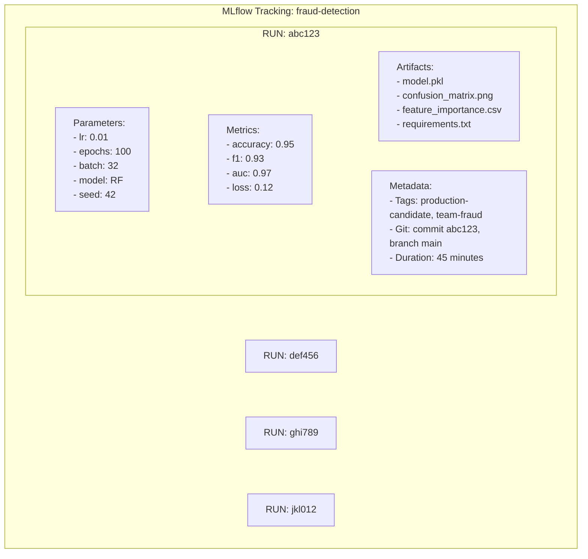
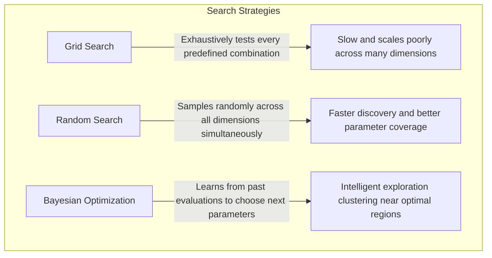

> **Discipline Track** | Complexity: `[COMPLEX]` | Time: 40-45 min

## Prerequisites

Before starting this module:
- [Module 5.1: MLOps Fundamentals](../module-5.1-mlops-fundamentals/)
- [Module 5.2: Feature Engineering & Stores](../module-5.2-feature-stores/)
- Experience training ML models (any framework)
- Basic understanding of hyperparameters

## What You'll Be Able to Do

After completing this module, you will be able to:

- **Implement model training pipelines on Kubernetes using Kubeflow, MLflow, or custom operators**
- **Design experiment tracking workflows that capture hyperparameters, metrics, and artifacts reproducibly**
- **Configure training infrastructure with proper GPU scheduling, checkpointing, and fault tolerance**
- **Build automated hyperparameter tuning using Katib or Optuna on Kubernetes clusters**

## Why This Module Matters

Data scientists run hundreds of experiments. "Try learning rate 0.01... now 0.001... add a layer... remove dropout..." Most of these experiments are lost to time—run in notebooks, results forgotten, impossible to reproduce.

When a model works, the question becomes: "What exactly did we do?" Without experiment tracking, the answer is often "I don't remember." You can't reproduce what you can't track.

Experiment tracking isn't just nice-to-have—it's the difference between scientific machine learning and random guessing.

## Did You Know?

- **The average ML team runs 1,000+ experiments** before finding a production-worthy model—without tracking, most learnings are lost
- **Weights & Biases found that teams using experiment tracking** ship models 2x faster because they don't repeat failed experiments
- **Hyperparameter optimization can improve model performance by 10-50%** but manual tuning rarely explores the full space
- **Random search beats grid search** for hyperparameter optimization in most cases—and this was only proven through systematic experimentation
- **Kubernetes 1.35 introduced native Gang Scheduling** (alpha) — ensuring all pods in an ML training job are scheduled together or not at all, eliminating the deadlock problem where partial pod groups hold resources while waiting for the rest

## The Experiment Tracking Problem

Without proper tracking:

```
DATA SCIENTIST'S NOTEBOOK
─────────────────────────────────────────────────────────────────

Experiment 1: accuracy = 0.85
Experiment 2: accuracy = 0.87  # Better!
Experiment 3: accuracy = 0.82  # Worse
...
Experiment 47: accuracy = 0.91  # Best yet!

Question: What were the hyperparameters for Experiment 47?
Answer: "I think learning_rate was 0.01... or 0.001?"

Question: Can we reproduce Experiment 47?
Answer: "The notebook was modified... let me try..."

Question: What data version was used?
Answer: "Um... the current one? Maybe?"
```

### The Cost of Poor Tracking

| Problem | Impact |
|---------|--------|
| Can't reproduce results | Best model is lost forever |
| Repeat failed experiments | Waste time and compute |
| No comparison baseline | Don't know if new approach is better |
| Lost institutional knowledge | New team members start from scratch |
| Debugging in production | "Which experiment is deployed?" |

> **Stop and think**: Imagine you just got paged because the new model version is classifying 90% of transactions as fraud. How long would it take your current team to pinpoint exactly which dataset and hyperparameters were used to train that specific artifact?

## Experiment Tracking with MLflow

MLflow is the most popular open-source experiment tracking tool. It tracks:



### War Story: The Vanishing Model

A team at a startup had their best fraud model—deployed, working great. Six months later, fraud patterns changed. They needed to retrain.

"Let's start from the best model." But which was it? The data scientist who trained it had left. Notebooks were scattered across laptops. The model file existed but no one knew what hyperparameters produced it.

They spent two weeks recreating experiments from scratch. MLflow would have saved them with one command: `mlflow.search_runs(order_by=['metrics.f1 DESC'])`

## MLflow in Practice

### Basic Tracking

```python
import mlflow
import mlflow.sklearn
from sklearn.ensemble import RandomForestClassifier
from sklearn.model_selection import train_test_split
from sklearn.metrics import accuracy_score, f1_score, roc_auc_score

# Set experiment
mlflow.set_experiment("fraud-detection")

# Training function with tracking
def train_model(X_train, y_train, X_test, y_test, params):
    with mlflow.start_run():
        # Log parameters
        mlflow.log_params(params)

        # Train model
        model = RandomForestClassifier(**params)
        model.fit(X_train, y_train)

        # Evaluate
        predictions = model.predict(X_test)
        proba = model.predict_proba(X_test)[:, 1]

        accuracy = accuracy_score(y_test, predictions)
        f1 = f1_score(y_test, predictions)
        auc = roc_auc_score(y_test, proba)

        # Log metrics
        mlflow.log_metric("accuracy", accuracy)
        mlflow.log_metric("f1", f1)
        mlflow.log_metric("auc", auc)

        # Log model
        mlflow.sklearn.log_model(model, "model")

        # Log artifacts (plots, reports, etc.)
        mlflow.log_artifact("confusion_matrix.png")

        return model, {"accuracy": accuracy, "f1": f1, "auc": auc}

# Run experiments
params_list = [
    {"n_estimators": 100, "max_depth": 5, "random_state": 42},
    {"n_estimators": 200, "max_depth": 10, "random_state": 42},
    {"n_estimators": 300, "max_depth": 15, "random_state": 42},
]

for params in params_list:
    train_model(X_train, y_train, X_test, y_test, params)
```

### Comparing Experiments

```python
# Find best run
from mlflow.tracking import MlflowClient

client = MlflowClient()
experiment = client.get_experiment_by_name("fraud-detection")

runs = client.search_runs(
    experiment_ids=[experiment.experiment_id],
    filter_string="metrics.f1 > 0.9",
    order_by=["metrics.f1 DESC"],
    max_results=5,
)

print("Top 5 runs by F1 score:")
for run in runs:
    print(f"  Run {run.info.run_id[:8]}: F1={run.data.metrics['f1']:.4f}")
```

### MLflow UI

```bash
# Start UI server
mlflow ui --port 5000

# Access at http://localhost:5000
```

The UI provides:
- Experiment comparison tables
- Metric visualization (charts, plots)
- Parameter search and filtering
- Artifact browsing
- Run diff comparison

> **Pause and predict**: We've tracked our experiments and found the best model. But how do we communicate to the serving infrastructure *which* model to load without hardcoding paths or risking typos?

## Model Registry

The Model Registry manages model versions and lifecycle stages:

```mermaid
flowchart TD
    subgraph Registry ["Model Registry: fraud-detector"]
        V1["Version 1\nStage: Archived\nF1: 0.89\nDate: Jan 1"]
        V2["Version 2\nStage: Production\nF1: 0.93\nDate: Feb 1"]
        V3["Version 3\nStage: Staging\nF1: 0.95\nDate: Mar 1"]
        
        Live["Live traffic"]
        Shadow["Shadow traffic"]
        
        V2 --> Live
        V3 --> Shadow
    end
    
    style V1 fill:#f9f9f9,stroke:#999,stroke-dasharray: 5 5
    style V2 fill:#d4edda,stroke:#28a745,stroke-width:2px
    style V3 fill:#fff3cd,stroke:#ffc107,stroke-width:2px
```



### Model Stages

| Stage | Purpose |
|-------|---------|
| **None** | Just registered, not evaluated |
| **Staging** | Under evaluation, shadow traffic |
| **Production** | Live traffic, actively monitored |
| **Archived** | Deprecated, kept for reference |

### Using the Registry

```python
import mlflow

# Register model from run
model_uri = f"runs:/{best_run.info.run_id}/model"
model_name = "fraud-detector"

# Register new version
mlflow.register_model(model_uri, model_name)

# Transition stages
client = MlflowClient()
client.transition_model_version_stage(
    name=model_name,
    version=3,
    stage="Staging"
)

# After validation, promote to production
client.transition_model_version_stage(
    name=model_name,
    version=3,
    stage="Production"
)

# Load production model
model = mlflow.sklearn.load_model(f"models:/{model_name}/Production")
```

## Hyperparameter Optimization

### The Search Space Problem

```
HYPERPARAMETER SEARCH SPACE
─────────────────────────────────────────────────────────────────

Model: Random Forest
Parameters:
  n_estimators:  [50, 100, 200, 500, 1000]     = 5 options
  max_depth:     [3, 5, 10, 15, 20, None]      = 6 options
  min_samples:   [2, 5, 10, 20]                = 4 options
  max_features:  ['sqrt', 'log2', None]        = 3 options

Grid Search: 5 × 6 × 4 × 3 = 360 combinations
At 5 min/train: 30 hours!

Random Search: 50 random combinations = 4 hours
  → Often finds near-optimal in ~60 iterations
```

> **Stop and think**: If adding a new hyperparameter to tune doubles the number of grid search combinations, what happens to your compute budget when you need to tune 10 parameters at once?

### Grid vs. Random vs. Bayesian



### Optuna for HPO

```python
import optuna
import mlflow

def objective(trial):
    # Suggest hyperparameters
    params = {
        "n_estimators": trial.suggest_int("n_estimators", 50, 500),
        "max_depth": trial.suggest_int("max_depth", 3, 20),
        "min_samples_split": trial.suggest_int("min_samples_split", 2, 20),
        "max_features": trial.suggest_categorical("max_features", ["sqrt", "log2", None]),
    }

    with mlflow.start_run(nested=True):
        mlflow.log_params(params)

        # Train and evaluate
        model = RandomForestClassifier(**params, random_state=42)
        model.fit(X_train, y_train)
        f1 = f1_score(y_test, model.predict(X_test))

        mlflow.log_metric("f1", f1)

        return f1

# Run optimization
with mlflow.start_run(run_name="hpo-study"):
    study = optuna.create_study(direction="maximize")
    study.optimize(objective, n_trials=100)

    # Log best params
    mlflow.log_params(study.best_params)
    mlflow.log_metric("best_f1", study.best_value)

print(f"Best F1: {study.best_value:.4f}")
print(f"Best params: {study.best_params}")
```

### Katib (Kubernetes-Native HPO)

For Kubernetes environments, Katib provides distributed HPO:

```yaml
apiVersion: kubeflow.org/v1beta1
kind: Experiment
metadata:
  name: fraud-hpo
spec:
  objective:
    type: maximize
    goal: 0.95
    objectiveMetricName: f1-score
  algorithm:
    algorithmName: bayesianoptimization
  parallelTrialCount: 3
  maxTrialCount: 30
  maxFailedTrialCount: 3
  parameters:
    - name: learning_rate
      parameterType: double
      feasibleSpace:
        min: "0.001"
        max: "0.1"
    - name: num_epochs
      parameterType: int
      feasibleSpace:
        min: "10"
        max: "100"
  trialTemplate:
    primaryContainerName: training
    trialParameters:
      - name: learningRate
        reference: learning_rate
      - name: epochs
        reference: num_epochs
    trialSpec:
      apiVersion: batch/v1
      kind: Job
      spec:
        template:
          spec:
            containers:
              - name: training
                image: my-training-image
                command:
                  - python
                  - train.py
                  - --lr=${trialParameters.learningRate}
                  - --epochs=${trialParameters.epochs}
            restartPolicy: Never
```

## Reproducibility Best Practices

### 1. Version Everything

```python
import mlflow
import subprocess

# Log environment
mlflow.log_artifact("requirements.txt")

# Log git info
git_commit = subprocess.check_output(["git", "rev-parse", "HEAD"]).decode().strip()
git_branch = subprocess.check_output(["git", "branch", "--show-current"]).decode().strip()

mlflow.set_tags({
    "git.commit": git_commit,
    "git.branch": git_branch,
})
```

### 2. Set Random Seeds

```python
import numpy as np
import random
import torch

def set_seeds(seed=42):
    """Set all random seeds for reproducibility."""
    random.seed(seed)
    np.random.seed(seed)
    torch.manual_seed(seed)
    torch.cuda.manual_seed_all(seed)

    # For CUDA determinism
    torch.backends.cudnn.deterministic = True
    torch.backends.cudnn.benchmark = False
```

### 3. Data Versioning with DVC

```bash
# Initialize DVC
dvc init

# Track data files
dvc add data/training.csv
git add data/training.csv.dvc .gitignore
git commit -m "Track training data with DVC"

# Push data to remote
dvc remote add -d storage s3://my-bucket/dvc
dvc push

# In MLflow, log data version
mlflow.log_param("data_version", "abc123")  # DVC hash
```

## Common Mistakes

| Mistake | Problem | Solution |
|---------|---------|----------|
| No experiment names | "What was run xyz?" | Descriptive experiment/run names |
| Missing parameters | Can't reproduce | Log ALL hyperparameters |
| No git tracking | Code version unknown | Auto-log git commit |
| Overwriting runs | History lost | Each run is immutable |
| No validation data | Overfitting to test | Log train/val/test splits |
| Ignoring hardware | "Works on my GPU" | Log hardware, CUDA version |

## Quiz

Test your understanding:

<details>
<summary>1. Your team lead asks you to reproduce the model deployed to production last year because a new regulation requires an audit of its training data and parameters. You find a `model_final_v2.pkl` file and a Jupyter notebook named `training_final_USE_THIS.ipynb`. The notebook has been modified since the file creation date. Why is this situation a major compliance risk, and what exact tracking mechanisms would have prevented it?</summary>

**Answer**: This situation is a major compliance risk because there is no cryptographically secure or immutable link between the deployed artifact and the code/data that produced it. The modified notebook means the exact training procedure is lost, making it impossible to definitively prove to auditors how the model learned its behavior or what data it saw. A proper experiment tracking system would have recorded an immutable snapshot. This includes the exact Git commit hash of the code, a DVC hash of the training data, and the precise hyperparameters used, all tied directly to the specific run ID that produced the `model_final_v2.pkl` artifact.
</details>

<details>
<summary>2. You are setting up MLflow for a new deep learning project. You need to log the learning rate, the validation loss at each epoch, and the final trained model weights. A junior engineer suggests logging the validation loss as an "artifact" and the model weights as a "parameter". Why is this conceptually incorrect, and how should they be categorized to leverage MLflow's UI effectively?</summary>

**Answer**: This approach fundamentally misunderstands how experiment tracking tools index and query data. Parameters are static inputs defined *before* training begins (like the learning rate), which allows you to filter and group runs based on configuration. Metrics are dynamic numeric outputs evaluated *during* or *after* training (like validation loss), which MLflow stores as time-series data so you can plot learning curves and compare convergence across runs. Artifacts are bulk files generated by the run (like model weights or plots) stored in blob storage. If you log loss as an artifact, you cannot visualize it in the UI; if you log weights as a parameter, you exceed string limits and cannot download the model for deployment.
</details>

<details>
<summary>3. You have a compute budget of exactly 100 training runs to tune a Random Forest model with 4 hyperparameters. Your colleague insists on setting up a grid search with 3 values for each parameter (3 × 3 × 3 × 3 = 81 runs), leaving 19 runs unused. You propose using random search for all 100 runs instead. Why is your random search approach likely to yield a better-performing model despite seeming less systematic?</summary>

**Answer**: Your random search approach is likely to win because hyperparameter importance is rarely uniform; typically, only one or two parameters strongly influence the model's performance, while others have minimal impact. In your colleague's grid search, even though 81 runs are executed, each individual parameter is only tested at exactly 3 distinct values. With 100 random search runs, every parameter is evaluated at 100 distinct, unique values. This provides vastly superior coverage along the most critical parameter dimensions, allowing the search to discover fine-grained optimal values that fall into the gaps between the predefined steps of a rigid grid.
</details>

<details>
<summary>4. A researcher publishes a paper claiming state-of-the-art results. They provide the exact model architecture, the dataset URL, the precise hyperparameter values (learning rate, batch size), and the random seed (`42`). When you run their code on your Kubernetes cluster, you get an accuracy 5% lower than published. Assuming no code bugs, what un-tracked environmental factors are most likely preventing exact reproducibility in this scenario?</summary>

**Answer**: Exact reproducibility is fragile and depends on the entire hardware and software execution environment, not just the code and data. The most likely culprit is a difference in library versions (e.g., PyTorch, CUDA, or underlying linear algebra libraries like cuDNN), which can change the order of floating-point operations and lead to divergence. Furthermore, depending on the framework, setting the random seed `42` in Python might not make GPU operations deterministic unless specific backend flags (like `cudnn.deterministic = True` and `cudnn.benchmark = False`) are also enforced. Without containerizing the exact environment and hardware specifications, implicit differences will easily derail exact reproduction.
</details>

## Hands-On Exercise: Complete Experiment Pipeline

Build a full experiment tracking setup:

### Setup

```bash
mkdir ml-experiments && cd ml-experiments
python -m venv venv
source venv/bin/activate
pip install mlflow scikit-learn optuna pandas matplotlib
```

### Step 1: Create Experiment Script

```python
# train.py
import mlflow
import mlflow.sklearn
import optuna
from sklearn.datasets import make_classification
from sklearn.model_selection import train_test_split, cross_val_score
from sklearn.ensemble import RandomForestClassifier, GradientBoostingClassifier
from sklearn.metrics import accuracy_score, f1_score, roc_auc_score
import numpy as np
import matplotlib.pyplot as plt
import subprocess

def get_git_info():
    """Get current git info for tracking."""
    try:
        commit = subprocess.check_output(["git", "rev-parse", "HEAD"]).decode().strip()[:8]
        return {"git_commit": commit}
    except Exception:
        return {"git_commit": "unknown"}

def create_dataset(n_samples=1000, n_features=20, random_state=42):
    """Create synthetic classification dataset."""
    X, y = make_classification(
        n_samples=n_samples,
        n_features=n_features,
        n_informative=10,
        n_redundant=5,
        random_state=random_state,
    )
    return train_test_split(X, y, test_size=0.2, random_state=random_state)

def train_and_evaluate(model, X_train, y_train, X_test, y_test):
    """Train model and return metrics."""
    model.fit(X_train, y_train)
    predictions = model.predict(X_test)
    proba = model.predict_proba(X_test)[:, 1]

    return {
        "accuracy": accuracy_score(y_test, predictions),
        "f1": f1_score(y_test, predictions),
        "auc": roc_auc_score(y_test, proba),
    }

def plot_feature_importance(model, n_features=20):
    """Create and save feature importance plot."""
    importance = model.feature_importances_
    indices = np.argsort(importance)[::-1][:10]  # Top 10

    plt.figure(figsize=(10, 6))
    plt.title("Feature Importance (Top 10)")
    plt.bar(range(10), importance[indices])
    plt.xticks(range(10), [f"Feature {i}" for i in indices])
    plt.tight_layout()
    plt.savefig("feature_importance.png")
    plt.close()

def run_experiment(model_type, params, X_train, y_train, X_test, y_test):
    """Run single experiment with tracking."""
    with mlflow.start_run():
        # Log git info
        mlflow.set_tags(get_git_info())
        mlflow.set_tag("model_type", model_type)

        # Log parameters
        mlflow.log_params(params)

        # Create model
        if model_type == "random_forest":
            model = RandomForestClassifier(**params, random_state=42)
        else:
            model = GradientBoostingClassifier(**params, random_state=42)

        # Train and evaluate
        metrics = train_and_evaluate(model, X_train, y_train, X_test, y_test)

        # Cross-validation score
        cv_scores = cross_val_score(model, X_train, y_train, cv=5, scoring='f1')
        metrics["cv_f1_mean"] = cv_scores.mean()
        metrics["cv_f1_std"] = cv_scores.std()

        # Log metrics
        mlflow.log_metrics(metrics)

        # Log artifacts
        plot_feature_importance(model)
        mlflow.log_artifact("feature_importance.png")

        # Log model
        mlflow.sklearn.log_model(model, "model")

        return metrics

def hpo_objective(trial, X_train, y_train, X_test, y_test):
    """Optuna objective for HPO."""
    model_type = trial.suggest_categorical("model_type", ["random_forest", "gradient_boosting"])

    if model_type == "random_forest":
        params = {
            "n_estimators": trial.suggest_int("n_estimators", 50, 300),
            "max_depth": trial.suggest_int("max_depth", 3, 15),
            "min_samples_split": trial.suggest_int("min_samples_split", 2, 10),
        }
    else:
        params = {
            "n_estimators": trial.suggest_int("n_estimators", 50, 300),
            "max_depth": trial.suggest_int("max_depth", 3, 10),
            "learning_rate": trial.suggest_float("learning_rate", 0.01, 0.3),
        }

    with mlflow.start_run(nested=True):
        mlflow.log_params(params)
        mlflow.set_tag("model_type", model_type)

        if model_type == "random_forest":
            model = RandomForestClassifier(**params, random_state=42)
        else:
            model = GradientBoostingClassifier(**params, random_state=42)

        metrics = train_and_evaluate(model, X_train, y_train, X_test, y_test)
        mlflow.log_metrics(metrics)

        return metrics["f1"]

def main():
    # Setup
    mlflow.set_experiment("classification-experiments")
    X_train, X_test, y_train, y_test = create_dataset()

    # Run HPO study
    with mlflow.start_run(run_name="hpo-study"):
        study = optuna.create_study(direction="maximize")
        study.optimize(
            lambda trial: hpo_objective(trial, X_train, y_train, X_test, y_test),
            n_trials=20,
        )

        # Log best results
        mlflow.log_params(study.best_params)
        mlflow.log_metric("best_f1", study.best_value)

        print(f"\nBest F1: {study.best_value:.4f}")
        print(f"Best params: {study.best_params}")

if __name__ == "__main__":
    main()
```

### Step 2: Run and Analyze

```bash
# Run experiments
python train.py

# Start MLflow UI
mlflow ui

# Open http://localhost:5000 and explore:
# - Compare runs side-by-side
# - View parameter/metric correlations
# - Download artifacts
```

### Step 3: Register Best Model

```python
# register_best.py
import mlflow
from mlflow.tracking import MlflowClient

client = MlflowClient()
experiment = client.get_experiment_by_name("classification-experiments")

# Find best run
runs = client.search_runs(
    experiment_ids=[experiment.experiment_id],
    filter_string="tags.model_type IS NOT NULL",
    order_by=["metrics.f1 DESC"],
    max_results=1,
)

best_run = runs[0]
print(f"Best run: {best_run.info.run_id}")
print(f"F1: {best_run.data.metrics['f1']:.4f}")

# Register
model_uri = f"runs:/{best_run.info.run_id}/model"
mlflow.register_model(model_uri, "best-classifier")

# Promote to staging
client.transition_model_version_stage(
    name="best-classifier",
    version=1,
    stage="Staging"
)

print("Model registered and promoted to Staging")
```

### Success Criteria

You've completed this exercise when you can:
- [ ] Run HPO with multiple model types
- [ ] View experiments in MLflow UI
- [ ] Compare runs and their parameters
- [ ] Register the best model
- [ ] Transition model to Staging stage

## Key Takeaways

1. **Track everything**: Parameters, metrics, artifacts, code version
2. **Use HPO**: Random/Bayesian search finds better hyperparameters than manual tuning
3. **Reproducibility requires discipline**: Seeds, versions, environment—all must be tracked
4. **Model registry manages lifecycle**: Stage models from development to production
5. **MLflow is a great starting point**: Open source, flexible, widely adopted

## Further Reading

- [MLflow Documentation](https://mlflow.org/docs/latest/index.html) — Complete MLflow guide
- [Optuna Documentation](https://optuna.org/) — HPO library
- [Random Search for Hyper-Parameter Optimization](https://www.jmlr.org/papers/v13/bergstra12a.html) — Foundational paper
- [DVC Documentation](https://dvc.org/doc) — Data versioning

## Summary

Experiment tracking transforms ML from guesswork into science. By tracking parameters, metrics, and artifacts for every run, you build a searchable history of what works (and what doesn't). Combined with hyperparameter optimization, you systematically explore the search space instead of randomly hoping for good results. The model registry then manages the transition from experiment to production.

---

## Next Module

Continue to [Module 5.4: Model Serving & Inference](../module-5.4-model-serving/) to learn how to deploy trained models for production inference.