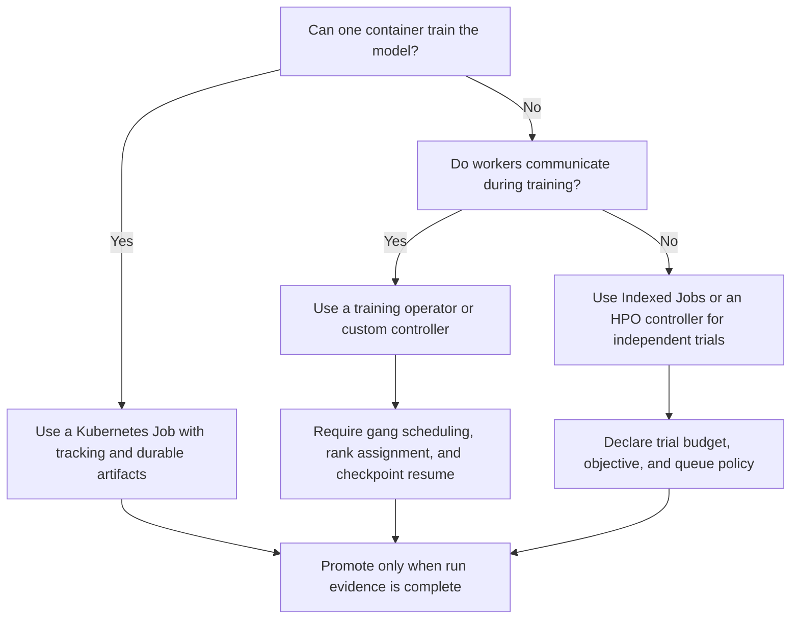

> **Discipline Track** | Complexity: `[COMPLEX]` | Time: 55-65 min

## Prerequisites

Before starting this module:

- [Module 5.1: MLOps Fundamentals](../module-5.1-mlops-fundamentals/)
- [Module 5.2: Feature Engineering & Stores](../module-5.2-feature-stores/)
- Experience training ML models in at least one framework
- Basic understanding of hyperparameters, validation metrics, and Kubernetes Jobs

## What You'll Be Able to Do

After completing this module, you will be able to:

- **Implement model training pipelines on Kubernetes using Kubeflow, MLflow, or custom operators**
- **Design experiment tracking workflows that capture hyperparameters, metrics, and artifacts reproducibly**
- **Configure training infrastructure with proper GPU scheduling, checkpointing, and fault tolerance**
- **Build automated hyperparameter tuning using Katib or Optuna on Kubernetes clusters**

## Why This Module Matters

Hypothetical scenario: a small platform team has eight expensive GPUs, three model teams, and a backlog of training work that arrives in bursts. One team launches a multi-node training run that needs every worker to start together, another launches twenty small tuning trials, and a third keeps a notebook open on a GPU while waiting for code review. The cluster looks busy, the budget looks painful, and yet the largest training job makes no progress because only half of its workers were placed.

Model training is not just "a script that runs for a while." It is a batch workload with unusually sharp edges: large input data, high accelerator demand, long runtime, checkpoint pressure, and a tight relationship between scheduling and correctness. A serving deployment can usually add or remove replicas gradually, but a distributed training job may need a whole group of Pods placed together before useful work can begin. If only part of that group runs, those Pods can hold scarce GPUs while waiting for peers that never arrive.

The platform lesson is that training needs a different operating model from inference. Serving is latency-sensitive, request-driven, and always on. Training is throughput-oriented, bursty, failure-prone, and artifact-producing. A good MLOps platform treats training as a first-class workload: it queues demand, admits work when the full resource shape is available, records evidence for every run, checkpoints state outside the Pod, and gives teams a fair way to share accelerators without turning every experiment into a manual negotiation.

Think of model training as a research kitchen inside a busy restaurant. Serving is the dining room: predictable stations, strict response times, and clear handoffs. Training is the kitchen lab: many attempts, some failures, unusual equipment, and a need to write down exactly which recipe produced the dish that customers will eventually taste. If the lab never labels ingredients, never saves intermediate results, and lets one cook reserve every oven indefinitely, the restaurant cannot turn experiments into repeatable production work.

This module focuses on the durable spine behind the tools. Kubeflow Trainer, Kueue, Volcano, Katib, MLflow, Optuna, and framework-specific APIs will keep changing. The stable ideas are admission control, distributed synchronization, checkpoint durability, experiment evidence, tuning economics, and resource efficiency. Once you understand those ideas, a new training operator or queue controller becomes easier to evaluate because you know which platform promises actually matter.

> **Landscape snapshot — as of 2026-06. This changes fast; verify against vendor docs before relying on specifics.**
>
> Kubeflow Trainer v2 documentation describes `TrainJob`, `ClusterTrainingRuntime`, and `TrainingRuntime` as the unified path for current training jobs, while legacy framework CRDs such as `PyTorchJob`, `TFJob`, and `MPIJob` are documented as older framework-specific APIs. The Kueue documentation currently describes Kubernetes-native quota and job admission with resources such as `Workload`, `LocalQueue`, `ClusterQueue`, and `ResourceFlavor`; its install guide shows released manifests for v0.18.1. Volcano is listed by CNCF as an Incubating project, and Kubeflow is also listed by CNCF as Incubating. KubeDojo targets Kubernetes 1.35; Kubernetes 1.35 introduced alpha workload-aware scheduling with initial native gang scheduling, but platform teams should treat native gang behavior as feature-gated and verify the exact API on their cluster.

## Model Training as a Platform Workload

Training workloads look deceptively simple from the outside because most of them begin life as a single command: run a Python script, read a dataset, write a model artifact. The platform view is different. That command expands into a bundle of storage reads, accelerator reservations, network synchronization, checkpoint writes, metric streams, and exit semantics. A platform that only sees "one more container" misses the reasons training jobs behave differently from web services and background workers.

The first difference is demand shape. Training work is bursty because teams launch experiments after data refreshes, research reviews, model architecture changes, or drift investigations. Demand also clusters around deadlines: a batch of tuning runs starts before a release review, or several teams submit retraining jobs after a feature-store backfill. Bursty demand is painful for GPUs because accelerators are high-cost, discrete resources. You cannot schedule half a traditional extended GPU resource request the same way you can schedule a fractional CPU request.

The second difference is runtime. Many training jobs run long enough that node failures, spot interruptions, image pulls, transient storage errors, and quota changes become normal operating conditions rather than rare accidents. A ten-minute batch job can often restart from the beginning without much concern. A multi-day training job that loses all progress when one Pod is evicted teaches the team to avoid the platform, hoard nodes, or disable preemption entirely. Checkpointing is therefore not a convenience feature; it is the mechanism that lets a platform reclaim or replace capacity without destroying days of useful compute.

The third difference is artifact gravity. A serving deployment usually consumes an already-built artifact, while a training job produces the artifact and the evidence around it. The model file is only one output. The run should also produce parameters, metrics, environment details, code revision, data references, logs, profiling traces, and validation reports. Without that evidence, the model artifact becomes an opaque binary that nobody can audit, compare, or safely promote.

The fourth difference is the relationship between scheduling and correctness. A single-node training run can often start whenever a suitable node is available. A distributed run may require a coordinator and several workers to start as a group, with predictable rank assignment and network reachability. If the scheduler starts only part of the group, the placed Pods can sit idle while still holding GPUs. The failure is not simply "slow scheduling"; it is a resource deadlock pattern caused by treating a tightly coupled job as independent Pods.

For platform engineers, these differences change the control plane you design. You need queues before Pods, quotas before burst demand, checkpoint policy before preemption, and run identity before model promotion. You also need a clear distinction between a training platform and a model-serving platform. They share Kubernetes primitives, observability tools, and security controls, but they optimize for different SLOs. Training optimizes for throughput, fairness, utilization, and reproducibility; serving optimizes for latency, availability, rollout safety, and request cost.

The basic training workload contract can be summarized as "admit, run, record, resume, and promote." Admission decides whether the full requested shape can begin without starving other tenants. Running turns a containerized training function into one or more Pods with the right data, accelerator, and network access. Recording captures the run evidence while the work is still fresh. Resume behavior converts failures and preemptions into bounded delays instead of total loss. Promotion connects the resulting artifact to the next stage of validation and serving.

```text
TRAINING WORKLOAD CONTRACT

request -> queue -> admit -> place -> train -> checkpoint
              |        |       |       |          |
              |        |       |       |          +--> object storage / artifact store
              |        |       |       +--> metrics, logs, run evidence
              |        |       +--> scheduler, GPU plugin, storage mounts
              |        +--> quota, priority, fairness, gang policy
              +--> tenant, namespace, experiment, budget context
```

Notice what is not in the center of that diagram: a specific vendor product. Tools help implement the contract, but the contract is the durable part. If your platform cannot explain when a training job starts, how it gets its data, where it writes checkpoints, how it resumes, and which run produced the candidate model, then the platform is still relying on human memory at the most expensive point in the ML lifecycle.

## Implement Model Training Pipelines on Kubernetes

Kubernetes gives you useful primitives for training, but the plain `Pod` abstraction is too small for most platform needs. A Pod can run a container, request resources, mount volumes, and restart according to policy. A training pipeline needs a higher-level object that describes a unit of work, its completion semantics, its retry behavior, and sometimes a group of coordinated workers. The most basic built-in choice is a `Job`, which creates one or more Pods and tracks completion for a task that runs to completion.

For simple training, a Kubernetes `Job` is often enough. The training image contains the code and dependencies, the Pod reads input data from a mounted volume or object store, and the script writes artifacts to durable storage before exiting. You can set resource requests, node selectors, tolerations, and environment variables like any other workload. This pattern is valuable because it keeps the first version boring: if one container on one node can train the model, do not start with a distributed operator.

For partitioned batch work, Indexed Jobs are a better fit than a pile of manually named Pods. Kubernetes Indexed Jobs are stable and assign each Pod an index that the container can read through the `JOB_COMPLETION_INDEX` environment variable. That index lets each worker process a deterministic shard, such as one fold, one dataset partition, or one evaluation slice. The key design point is that the application must understand the index and make each shard idempotent enough to retry.

```yaml
apiVersion: batch/v1
kind: Job
metadata:
  name: training-shards
spec:
  completions: 4
  parallelism: 4
  completionMode: Indexed
  template:
    spec:
      restartPolicy: Never
      containers:
        - name: trainer
          image: python:3.12-slim
          command: ["python", "-c"]
          args:
            - |
              import os
              shard = os.environ["JOB_COMPLETION_INDEX"]
              print(f"training shard {shard}")
```

That example is intentionally small, but the platform lesson is important. Indexed Jobs solve static work assignment; they do not automatically solve distributed gradient synchronization, gang placement, experiment tracking, or checkpoint retention. If each shard is independent, a built-in Job may be the right tool. If workers must communicate during training, you need to think about rank assignment, rendezvous, network paths, startup ordering, and all-or-nothing scheduling.

Training operators add a higher-level API around those concerns. Kubeflow Trainer v2 is an example of this approach: the current documentation describes a unified `TrainJob` API and reusable runtime resources instead of making users define separate framework-specific resources for every framework. Legacy `PyTorchJob` and `TFJob` still matter in many clusters because real platforms lag migrations, but the durable lesson is not the exact CRD name. The lesson is that the operator should separate platform-owned runtime templates from user-owned training functions.

That separation is a strong platform pattern. Platform teams define runtimes with base images, launcher behavior, security context, storage conventions, scheduling policy, and observability hooks. ML teams provide the training function, parameters, and dataset references. The boundary keeps every model team from reinventing cluster-level details, while still allowing them to iterate on model code. When that boundary is missing, training manifests become long YAML documents copied between teams, and every copy slowly diverges.

The same boundary applies when you build a custom operator. A custom operator should not merely wrap `kubectl apply` for a Job. It should encode the parts of the training contract that your organization wants to standardize: how experiments are named, which queue a tenant uses, how checkpoints are configured, which artifacts are required before completion, which metrics are scraped, and which failure modes are retryable. If those rules live only in a wiki, the platform will discover violations after expensive jobs have already run.

Good Kubernetes training pipelines also avoid treating notebooks as production control planes. Notebooks are excellent for exploration, but they are weak audit boundaries because cells can run out of order, hidden state can survive, and local paths can leak into scripts. A healthy pipeline converts the notebook insight into a containerized training entrypoint with explicit arguments, a declared data source, a stable environment, and a run record. That conversion is where "research code" starts becoming platform work.

The pipeline should preserve a straight line from training request to model candidate. A useful naming pattern is `project / experiment / run / artifact`, where the run ID is created before the job starts and passed into the container. The training process writes metrics and artifacts under that run ID, and the model registry or promotion gate reads from the same identity later. This prevents the common failure where the model file, the metric table, and the validation report all exist but cannot be tied together reliably.

```text
RUN IDENTITY FLOW

experiment request
  -> run_id created
  -> Kubernetes Job or TrainJob receives run_id
  -> training code logs params, metrics, checkpoints, and final artifact
  -> validation gate reads the same run_id
  -> registry entry points back to the run_id
```

The final implementation detail is exit behavior. A training job that exits successfully without uploading artifacts should not be considered successful by the platform. The platform should define completion in terms of required evidence: final checkpoint or model artifact present, metrics recorded, validation report written, and lineage metadata available. That evidence-oriented completion model is stricter than container exit code, but it matches the real business question: can we trust and reproduce the model this job produced?

## Distributed Training: Parallelism, Synchronization, and Gang Scheduling

Distributed training starts with a tradeoff: you add coordination overhead in exchange for more memory, more throughput, or both. The simplest form is data parallelism. Each worker holds a copy of the model, receives a different slice of the batch, computes gradients, and synchronizes updates with the other workers. Data parallelism is attractive because the model code changes less than other strategies, but it still depends on communication performance and consistent worker progress.

Model parallelism is different. Instead of copying the whole model to every worker, you split the model itself across devices. Tensor parallelism splits operations inside layers, pipeline parallelism splits groups of layers into stages, and fully sharded approaches split parameters, gradients, or optimizer state. These techniques exist because some models no longer fit comfortably on one device, or because memory pressure becomes the limiting factor before raw compute does. They usually demand more careful framework support and more sensitivity to topology.

Synchronous and asynchronous training also lead to different platform expectations. In synchronous data parallel training, workers regularly meet at synchronization points, such as gradient all-reduce. The fastest worker waits for the slowest worker, so a single slow node, network path, or storage mount can reduce job throughput. In asynchronous approaches, workers can update shared parameters without waiting for every peer at the same step, which can improve hardware usage but complicate convergence behavior and reproducibility.

All-reduce and parameter-server patterns are the classic communication choices. In an all-reduce pattern, workers collectively combine gradient information so each participant can apply a consistent update. In a parameter-server pattern, one or more server processes hold parameters, and trainers communicate with those servers to retrieve or update state. The platform implication is that both patterns need predictable placement, stable networking, and clear failure semantics, but they stress the network differently.

PyTorch DistributedDataParallel is a common example of synchronous data parallel training. The PyTorch documentation describes DDP as using collective communication to synchronize gradients and buffers across processes, and recommends one process per model replica. That recommendation matters for Kubernetes because the unit you schedule is a Pod and the unit the framework often expects is a process with a rank. The platform must map Pods, containers, ranks, and GPUs in a way the framework can understand.

Rank assignment deserves more attention than it usually gets. A distributed job needs every process to know its global rank, local rank, world size, and rendezvous endpoint. In static environments those values may come from a hostfile or scheduler integration. In Kubernetes they often come from environment variables, operator-generated configuration, DNS names, or launcher containers. If rank assignment is inconsistent, the job can hang in initialization even though every Pod is technically Running.

Gang scheduling exists because distributed training is tightly coupled. If a job needs one coordinator and seven workers, placing four workers is worse than placing none when those workers reserve GPUs and block other jobs. Gang scheduling makes placement all-or-nothing: the scheduler admits or binds the group only when enough resources are available for the group policy. This does not make the cluster larger, but it prevents partial placement from wasting scarce resources while a job waits for the rest of its group.

Partial placement deadlock is easy to miss in dashboards. GPU utilization may show low activity, but allocatable resources look consumed because idle workers are already bound to nodes. The queue grows, smaller jobs cannot start, and the large job cannot make progress. Humans may respond by deleting Pods manually, which turns scheduling into an operations ritual. A platform-level gang policy prevents that class of failure by refusing to start a distributed gang until the minimum group can actually run.

```text
WITHOUT GANG SCHEDULING

job needs 8 workers
scheduler places 5 workers
5 workers hold GPUs and wait for peers
remaining 3 workers stay Pending
other jobs cannot use the held GPUs

WITH GANG SCHEDULING

job declares minimum group size
scheduler waits until the group can be placed
all workers start together, or none consume GPUs
other admitted jobs can use resources meanwhile
```

Kueue, Volcano, scheduler-plugins, and native Kubernetes workload-aware scheduling all approach this problem from different angles. Kueue focuses on admission and quota for jobs before Pods are created or fully admitted. Volcano provides batch scheduling features including gang scheduling and queue management. Kubernetes 1.35 introduced alpha workload-aware scheduling with an initial gang-scheduling implementation. The durable decision is not "which name wins"; it is whether your platform has an explicit job-level admission point before expensive Pods are allowed to reserve resources.

Topology is the next level of scheduling maturity. Distributed training performance can depend on whether GPUs are on the same node, same rack, same network fabric, or attached through a particular accelerator topology. A placement that satisfies raw GPU count can still produce poor throughput if interconnect paths are slow. Advanced platforms therefore consider not only "can I fit eight GPUs?" but also "can I fit the communication pattern in a topology that will not waste most of the run?"

Distributed training is also a failure-domain problem. If a synchronous job loses one worker, the remaining workers may fail or wait depending on framework and launcher behavior. Retrying the whole group from the latest checkpoint is often cleaner than trying to patch one missing worker into a running gang. That retry model makes checkpoint cadence, checkpoint durability, and startup time part of the scheduling design. A platform cannot reason about preemption without knowing how much work a training job can safely lose.

## Configure Training Infrastructure: GPUs, Queues, Storage, and Fault Tolerance

GPU scheduling in Kubernetes begins with device plugins. Kubernetes device plugins let vendors advertise specialized hardware, such as GPUs, to the kubelet without changing Kubernetes core code. Once a plugin advertises a resource such as `nvidia.com/gpu`, Pods request it through resource limits. That extended-resource model is simple and useful, but it hides several platform decisions behind one number.

A request for `nvidia.com/gpu: 1` does not say whether the workload needs a specific GPU model, memory size, interconnect, driver version, sharing mode, or topology. Platform teams typically add labels, taints, tolerations, node pools, resource flavors, or queue configuration to express those differences. The goal is to keep users from writing hardware folklore into every manifest while still making the differences visible enough for scheduling and cost control.

Multi-Instance GPU and time-slicing show why "GPU count" is not a complete scheduling language. MIG partitions supported GPUs into hardware-isolated slices with separate memory and fault domains. Time-slicing lets multiple workloads share a GPU by interleaving access, but NVIDIA's documentation is explicit that time-sliced replicas do not get memory or fault isolation like MIG. That tradeoff can be reasonable for short experiments or low-risk notebooks, but it is risky for long, memory-heavy training runs that assume exclusive accelerator behavior.

Queueing is the control plane that keeps scarce accelerators from becoming a first-come, first-served accident. Kueue describes a model where workloads wait, are admitted when quota is available, and can be preempted according to policy. `ClusterQueue` objects govern resource pools and fair sharing, while namespaced queues give tenants a place to submit work. The important design point is that queue admission happens at the workload level, not as an afterthought once Pods are already fighting for nodes.

Queues should encode fairness in terms users can understand. A platform can define separate queues for research, retraining, urgent incident response, and low-priority sweeps, but those queues need transparent policy. If nobody knows why one job started and another waited, the platform becomes a social bottleneck. Fair sharing, borrowing, and preemption are useful only when teams can predict how their jobs will behave before they submit them.

Storage is the second scarce resource. Training input data may come from object storage, mounted filesystems, feature stores, or precomputed local caches. The fastest choice is not always the safest choice. Mounting a shared filesystem can make development easy but can become a bottleneck when many workers read the same files. Streaming from object storage can scale better operationally, but training code needs buffering, retry, and locality awareness to avoid starving GPUs while waiting for data.

Checkpoint storage should be durable outside the Pod and outside the node. A checkpoint written only to an emptyDir volume is useful for a container restart on the same Pod, but it does not protect against node loss or job replacement. For long-running training, checkpoints usually belong in object storage or a durable shared volume with a naming scheme that includes run ID, step or epoch, and enough metadata to validate compatibility during resume. The checkpoint writer should make partial writes detectable, commonly by writing to a temporary name and promoting only complete files.

Checkpoint frequency is a cost tradeoff. Frequent checkpoints reduce the amount of lost compute after preemption, but they consume I/O, storage, and sometimes training time. Infrequent checkpoints improve throughput until the first failure, when the job may lose hours of progress. A practical platform default is to checkpoint often enough that the expected lost work is acceptable for the queue class. Spot or preemptible capacity needs a different checkpoint posture from reserved, low-interruption capacity.

Fault tolerance also depends on what the framework can restore. Saving model weights alone may not be enough to resume a training run accurately. Many training jobs also need optimizer state, learning-rate scheduler state, random number generator state, epoch or step counters, tokenizer or preprocessing configuration, and sometimes data-loader position. If the checkpoint omits these details, the resumed run may continue but no longer represent the same experiment.

Spot and preemptible economics are attractive because training is often batch-oriented and can tolerate interruption when checkpointing works. The platform risk is that cheap capacity without resume discipline becomes expensive repeated work. A queue can route tolerant experiments to interruptible nodes and reserve stable nodes for fragile jobs, but that policy only works if the job declares its tolerance and proves it can resume. Otherwise every team has an incentive to claim the safest pool.

Observability closes the loop. A training platform should show queue wait time, admission decisions, pending reasons, GPU allocation, GPU utilization, data throughput, checkpoint age, restart count, loss curves, and artifact completion. CPU and memory metrics are not enough. A job can be Running, healthy, and still waste GPUs because the input pipeline is slow or because all workers are waiting at a synchronization barrier. Training observability must reveal progress, not just liveness.

## Data and Checkpointing: Feeding the Job Without Losing the Run

Data movement is often the hidden bottleneck in model training. A team may spend days tuning batch size and learning rate while the real problem is that each worker repeatedly downloads the same files or waits on a remote filesystem with poor parallel read behavior. The platform should treat data access as part of the workload design, not as an implementation detail left to whichever notebook first loaded the dataset.

The first data question is whether the dataset is immutable for the run. A training job that reads "latest" data from a mutable location cannot be reproduced later unless the storage layer provides a stable version reference. A durable run record should capture a dataset version, content hash, table snapshot, object prefix, feature-store retrieval definition, or other stable pointer. If the data source cannot provide that pointer, the platform should call out the limitation rather than pretending the run is reproducible.

The second data question is how workers divide work. In data parallel training, each worker should receive a distinct slice of data for each step, usually through framework-aware samplers or sharding logic. In Indexed Jobs, each Pod can use its completion index to process a deterministic shard. In hyperparameter tuning, every trial may read the same training set but write different metrics. These patterns need different caching and throttling strategies even if they all read from the same bucket.

Input caching is valuable when it is explicit. Node-local caches, distributed caches, and prefetching can reduce repeated downloads and improve GPU utilization, but they introduce invalidation questions. A stale cache can silently train on old data unless the cache key includes the dataset version. A cache that is too small can churn constantly and hide the real bottleneck. The platform should make cache hit rate and input throughput observable when training jobs depend on cached data.

Checkpoint layout is another data-design problem. A clear layout might separate temporary checkpoints, candidate checkpoints, final artifacts, and validation reports. Temporary checkpoints support resume. Candidate checkpoints support comparison during training. Final artifacts support promotion. Validation reports support review and audit. Mixing all of those outputs in one directory named `model` makes cleanup and governance harder than it needs to be.

```text
EXAMPLE ARTIFACT LAYOUT

runs/
  churn-model/
    run-2026-06-15-a/
      params.json
      metrics.jsonl
      checkpoints/
        step-000500/
        step-001000/
      artifacts/
        model/
        feature_importance.json
      reports/
        validation.json
        environment.json
```

Good checkpointing also has a reader contract. It is not enough to write files; the next process must know how to find the latest complete checkpoint, verify that it matches the current code and data, and resume without overwriting the evidence of the previous attempt. Many teams implement a small manifest file for this purpose. The manifest points to the latest complete checkpoint and records compatibility metadata, while incomplete checkpoint directories can be safely ignored or cleaned up.

Preemption turns checkpoint quality into a user-visible platform feature. If a job resumes automatically after a node interruption, the team experiences preemption as delay. If the job restarts from the beginning, the team experiences preemption as data loss and may resist any shared scheduling policy that includes it. This is why checkpoint discipline belongs in the platform contract. It allows queue fairness and cheaper capacity strategies without asking every user to absorb unbounded risk.

## Design Experiment Tracking Workflows

Experiment tracking is the memory system for model training. It records the inputs and outputs of a run so that a team can compare alternatives, debug regressions, reproduce a candidate, and explain what changed. A useful tracker does not merely store a final metric. It connects static parameters, time-series metrics, artifacts, environment, data references, and run metadata under one identity.

MLflow's documentation describes runs as executions that record metadata, metrics, parameters, and artifacts. Those categories are durable even if the tracking tool changes. Parameters are the intended inputs, such as learning rate, batch size, model family, seed, and feature set. Metrics are observed outputs, such as validation loss, F1 score, throughput, or calibration error. Artifacts are files, such as checkpoints, plots, confusion matrices, validation reports, and model weights. Tags and metadata supply context, such as Git commit, data version, owner, queue, and hardware shape.

The reason to separate these categories is queryability. If the learning rate is logged as a text file artifact, the team cannot easily filter runs by learning rate. If the loss curve is logged only as a final number, the team cannot see instability during training. If the model weights are stuffed into a parameter field, the tracker becomes unusable. A good run record respects the data model of the tracker so future humans and automation can ask useful questions.

Experiment tracking should begin before the Kubernetes workload is created. The orchestrating layer creates or reserves a run identity, passes it to the training job, and expects all outputs to use that identity. This is safer than letting the training process create an unknown local run and later trying to match it to a cluster job. When run identity flows from scheduler to tracker to artifact store, the platform can answer which namespace, queue, image, and Pod produced a candidate model.

Reproducibility requires more than a seed. Seeds are useful, but exact reproducibility can depend on framework version, CUDA and driver behavior, nondeterministic kernels, data order, preprocessing code, and hardware. The practical target for many teams is not bit-for-bit replay; it is explainable, bounded variation with enough evidence to rerun the same procedure. The run record should therefore capture the environment and the deterministic controls that were actually used, while being honest about remaining nondeterminism.

Environment pinning starts with the container image. The image should be referenced by immutable digest in production workflows, not only a mutable tag. Dependency lock files, base image digest, CUDA runtime, framework version, and training entrypoint should be recorded with the run. When a team cannot reproduce a result months later, the missing detail is often not the model architecture; it is a seemingly minor library or driver change.

Data lineage is the other half of reproducibility. The run should record which dataset snapshot, feature-store point-in-time query, preprocessing code, and split strategy were used. Random train-test splits should be seeded and logged, but seed alone is not enough if the source table changed. A validation metric without a data reference is a number without a specimen. You can admire it, but you cannot study where it came from.

Experiment tracking also improves platform operations. Queue wait time, node pool, GPU type, runtime, restarts, checkpoint count, and average throughput can be logged as run metadata. This allows platform teams to compare not just model quality, but training efficiency. A model that gains a tiny metric improvement at a large compute cost may not be a good candidate. Conversely, a run that converges faster with lower GPU hours may be worth promoting even if final quality is similar.

The model registry is downstream of tracking, not a replacement for it. A registry manages named model versions and lifecycle state, while the tracker explains how a version was produced. If the registry entry does not link back to the run evidence, it becomes another unlabeled file cabinet. Promotion gates should require a registry entry to point to a run with parameters, metrics, artifacts, data lineage, and validation evidence.

Hypothetical scenario: a fraud model candidate looks better than the current production model on the main validation metric, but the run record shows it used a newer feature snapshot, a different negative-sampling rule, and a smaller evaluation set. Without tracking, the team might promote it based on a single number. With tracking, the review shifts to the right question: did model quality improve, or did the evaluation contract change?

## Build Automated Hyperparameter Tuning

Hyperparameter tuning is controlled experimentation under a compute budget. The search algorithm decides which configurations to try, the scheduler decides when trials run, the tracker records what happened, and the promotion process decides whether any result is worth using. Treating HPO as "launch many jobs" misses the reason it is difficult: every extra trial competes with other work, and every failed trial should still teach the team something.

Grid search is the easiest strategy to explain. You define a set of values for each parameter and run every combination. Grid search is useful when the search space is small, the parameters are known to matter, and the team wants exhaustive coverage of a few discrete choices. It becomes inefficient when many parameters are included because it spends equal effort on dimensions that may not matter much.

Random search samples configurations from defined ranges. The classic lesson from Bergstra and Bengio's random-search paper is that not all hyperparameters matter equally, so random search often explores important dimensions more effectively than a coarse grid with the same budget. The platform lesson is even broader: a tuning system should make the budget explicit. If the team can afford twenty trials, the search strategy should spend those trials intentionally rather than accidentally through nested loops in a notebook.

Bayesian optimization uses previous observations to choose promising next configurations. It can be valuable when trials are expensive and the objective surface is smooth enough for a model to guide exploration. The tradeoff is sequential dependency: the algorithm may want to learn from earlier trials before choosing later ones. That can reduce parallelism compared with random search, which is often easier to fan out across a cluster.

Early-stopping strategies such as successive halving and ASHA add another dimension. They start multiple trials, observe partial training results, stop weak performers, and allocate more budget to promising ones. This can save compute when early metrics are predictive, but it can also bias against models that learn slowly and improve later. Platform teams should expose early-stopping policy as a reviewable experiment choice, not a hidden default.

Katib is a Kubernetes-native worked example for HPO. Its Experiment resource describes the objective metric, algorithm, search space, parallel trial count, maximum trial count, and trial template. The trial template can create a Kubernetes Job or another supported resource, with parameters substituted into the training command. The durable lesson is that HPO needs a controller that owns trial generation and status, while the underlying training workload remains an ordinary, observable unit of work.

```yaml
apiVersion: kubeflow.org/v1beta1
kind: Experiment
metadata:
  name: churn-hpo
spec:
  objective:
    type: minimize
    objectiveMetricName: validation-loss
  algorithm:
    algorithmName: random
  parallelTrialCount: 2
  maxTrialCount: 8
  maxFailedTrialCount: 2
  parameters:
    - name: learning_rate
      parameterType: double
      feasibleSpace:
        min: "0.0001"
        max: "0.1"
    - name: batch_size
      parameterType: int
      feasibleSpace:
        min: "32"
        max: "128"
  trialTemplate:
    primaryContainerName: trainer
    trialParameters:
      - name: learningRate
        reference: learning_rate
      - name: batchSize
        reference: batch_size
    trialSpec:
      apiVersion: batch/v1
      kind: Job
      spec:
        template:
          spec:
            restartPolicy: Never
            containers:
              - name: trainer
                image: python:3.12-slim
                command: ["python", "-c"]
                args:
                  - |
                    print("lr=${trialParameters.learningRate}")
                    print("batch=${trialParameters.batchSize}")
                    print("validation-loss=0.5")
```

That example is deliberately modest because production HPO should use a real training image, a real metrics collector, and durable artifact storage. The important fields are the ones that encode the experiment contract: objective, algorithm, parallelism, total trial budget, failure budget, search space, and trial template. When those fields are explicit, reviewers can discuss whether the experiment is scientifically meaningful and operationally affordable.

Optuna is a useful library-level contrast. Instead of using a Kubernetes CRD to define the experiment, application code defines an objective function and asks Optuna to suggest parameters. This can be a better fit for local development, CI validation, or teams that already control orchestration elsewhere. The tradeoff is that the platform must still decide how to distribute trials, persist study state, and connect trial results to the shared run tracker.

HPO parallelism is not automatically good. Running many trials at once can reduce wall-clock time, but it can also starve other teams and reduce the learning efficiency of adaptive algorithms. A queue should treat HPO as a group of related workloads with a budget, not as unrelated jobs that happen to share a name. The HPO controller should make it obvious how many trials are active, how many failed, what metric is being optimized, and when the experiment should stop.

The most common tuning failure is optimizing the wrong thing. If the objective metric ignores latency, memory, fairness, calibration, or business constraints, the search may find a model that is numerically impressive and operationally unusable. A mature platform lets teams log secondary metrics and promotion constraints alongside the primary objective. The HPO system can optimize one metric, but the release process should review the whole evidence set.

## Resource Efficiency and Training Observability

Training efficiency is not the same as high allocation. A cluster can show every GPU allocated while actual GPU utilization is low because jobs are waiting on input data, synchronization, checkpoints, or CPU preprocessing. The utilization trap appears when a platform celebrates "reserved capacity" rather than useful work. For training, useful work means examples processed, tokens processed, steps completed, loss improving, checkpoints written, and artifacts produced.

Right-sizing starts with requests. Under-requested CPU or memory can starve the input pipeline and make GPUs idle. Over-requested GPUs can block other work while providing no speedup. A training platform should collect actual usage and throughput by run so teams can adjust defaults. The goal is not to shame users for imperfect first guesses; the goal is to shorten the feedback loop between resource request and observed training behavior.

Mixed precision is one common efficiency technique. By using lower-precision arithmetic where appropriate, many models can reduce memory pressure and improve throughput on hardware that supports it. The tradeoff is numerical behavior: loss scaling, stability, and metric parity need validation. Mixed precision should be recorded as a run parameter because it affects both performance and sometimes model behavior.

Gradient accumulation is another useful technique. Instead of increasing the per-device batch size beyond memory limits, the training loop accumulates gradients across several smaller microbatches before applying an optimizer step. This can approximate a larger effective batch, but it changes synchronization cadence and can affect learning dynamics. The run record should log accumulation steps, effective batch size, and any learning-rate adjustment tied to batch size.

Throughput metrics should be close to the training loop. Examples per second, tokens per second, step time, data-loader time, checkpoint time, and synchronization time tell different stories. If step time is high because checkpoint writes block the loop, storage is the bottleneck. If data-loader time dominates, preprocessing or input reads are the bottleneck. If synchronization time dominates, topology or straggler behavior may be the problem. A single GPU utilization chart cannot distinguish these causes.

Loss curves are operational signals, not only research artifacts. A flat or exploding loss curve can reveal bad parameters, data bugs, unstable mixed precision, or a resumed checkpoint mismatch. The platform should make current loss and recent trend visible while the job is running, especially for expensive runs. Stopping a clearly broken job early is one of the simplest ways to return capacity to the queue.

Training observability should connect cluster and model views. Kubernetes events explain why Pods are Pending or restarting. Scheduler and queue metrics explain admission and fairness. GPU metrics explain device usage. Training metrics explain learning progress. Artifact metrics explain whether checkpoints and final outputs are being written. When these views are separated, every incident turns into a blame handoff between platform engineers and ML engineers.

Cost control is a product of design, not only a monthly report. Queue policies limit concurrent demand, HPO budgets cap exploration, checkpointing allows interruptible capacity, right-sizing reduces waste, and observability catches idle accelerators. The platform should help teams choose cheaper patterns when they are safe, while preserving stable capacity for fragile or urgent work. That is a better conversation than telling every team to "use fewer GPUs" after the invoice arrives.

## Patterns & Anti-Patterns

The patterns below are durable because they describe responsibilities, not brands. A platform can implement them with Kubeflow Trainer, plain Jobs, Kueue, Volcano, a custom operator, or a managed service. The important question is whether the behavior exists and whether users can rely on it.

### Patterns

**Run identity before workload creation** means the orchestrator creates a run ID before submitting the Kubernetes workload and passes that identity into the container. The training code uses that identity for metrics, parameters, checkpoints, and final artifacts. This pattern prevents later forensic work from depending on log scraping or filename guesses.

**Queue admission before Pod creation** means expensive distributed jobs wait as workloads until the platform can admit the requested shape. This is especially important for multi-worker GPU training because partial placement can waste resources. A queue can also express tenant fairness, borrowing, priority, and preemption in a way raw Pod scheduling cannot.

**Checkpoint to durable storage** means every long-running job can resume from storage outside the Pod and node. The checkpoint should include enough state to continue correctly, and the platform should know where complete checkpoints live. This pattern turns failures and preemption into bounded delay instead of total recomputation.

**Runtime templates owned by the platform** means platform teams define common runtimes for images, launchers, security context, storage, scheduling, and observability, while model teams provide training logic and parameters. This preserves flexibility without forcing every ML engineer to become a scheduler and storage expert.

### Anti-Patterns

**Notebook as production scheduler** is the pattern where a human keeps a notebook session alive to train important models on shared GPUs. The work may succeed once, but it leaves weak lineage, weak retry behavior, and poor fairness. Move the training entrypoint into a containerized job and keep notebooks for exploration and analysis.

**GPU hoarding through idle Pods** happens when teams reserve accelerators before their job can make progress. This often appears with distributed jobs that start partially or with interactive sessions left open. Use queue admission, idle-time policy, and gang scheduling to make progress the condition for holding scarce devices.

**Artifact without evidence** happens when a registry contains model files but no linked run record. The team can deploy the artifact but cannot explain its data, parameters, environment, or validation history. Promotion gates should require a traceable run before a model version can move toward serving.

**HPO without a budget** happens when a tuning loop launches trials until somebody notices the spend. A tuning experiment should declare maximum trials, parallel trial count, objective, early-stopping rules, and failure budget before it starts. Exploration is valuable, but unbounded exploration is not a platform strategy.

### Decision Framework

Use this framework to choose the minimum training architecture that satisfies the workload. The point is not to choose the most advanced controller; it is to match coupling, evidence, and resource risk.

| Workload shape | Good starting point | Scheduling need | Evidence need | Watch out for |
|---|---|---|---|---|
| Single-node training | Kubernetes `Job` | Normal Pod scheduling | Run ID, params, metrics, artifact | Local-only checkpoints |
| Static independent shards | Indexed `Job` | Parallelism and retry policy | Shard index, per-shard metrics | Duplicate or non-idempotent shard writes |
| Multi-worker synchronous training | Training operator or custom controller | Gang scheduling and topology awareness | Rank map, checkpoints, loss curves | Partial placement and stragglers |
| Many HPO trials | Katib, Optuna with orchestration, or custom tuner | Queue quota and trial budget | Trial params, objective, secondary metrics | Optimizing a narrow metric |
| Interruptible capacity training | Job or operator with resume support | Preemption-aware queue policy | Durable checkpoints and resume logs | Restarting from scratch after eviction |


```mermaid
flowchart TD
    A["Can one container train the model?"] -->|Yes| B["Use a Kubernetes Job with tracking and durable artifacts"]
    A -->|No| C["Do workers communicate during training?"]
    C -->|No| D["Use Indexed Jobs or an HPO controller for independent trials"]
    C -->|Yes| E["Use a training operator or custom controller"]
    E --> F["Require gang scheduling, rank assignment, and checkpoint resume"]
    D --> G["Declare trial budget, objective, and queue policy"]
    B --> H["Promote only when run evidence is complete"]
    F --> H
    G --> H
```

## Did You Know?

- **Kubeflow Trainer v2 uses a unified training API**: Current Kubeflow Trainer documentation describes `TrainJob` and reusable runtimes as the v2 path, while older `PyTorchJob`, `TFJob`, and `MPIJob` APIs remain part of legacy v1 documentation.
- **Indexed Jobs expose stable shard identity**: Kubernetes Indexed Jobs are stable and expose each Pod's completion index through mechanisms including the `JOB_COMPLETION_INDEX` environment variable.
- **PyTorch DDP synchronizes gradients across processes**: PyTorch documents DistributedDataParallel as using collective communication to synchronize gradients and buffers, with one process per model replica as the recommended pattern.
- **GPU sharing modes have different isolation guarantees**: NVIDIA documents that time-sliced GPU replicas interleave access without the memory or fault isolation provided by MIG, which makes the choice workload-dependent.

## Common Mistakes

| Mistake | Problem | Better approach |
|---|---|---|
| Treating training like serving | Serving replicas can scale gradually, while distributed training may need all workers together | Design training as a batch workload with admission, completion, and checkpoint semantics |
| Launching distributed workers without gang scheduling | Partial placement can hold GPUs while the job waits for missing peers | Use queue admission and gang scheduling for tightly coupled multi-worker jobs |
| Writing checkpoints only to local Pod storage | Node loss or replacement destroys progress | Write complete checkpoints to object storage or durable shared storage |
| Logging only the final metric | The team cannot diagnose convergence, instability, or bad intermediate behavior | Log parameters, time-series metrics, artifacts, data references, and environment metadata |
| Running HPO without a declared budget | Trials can consume shared GPUs without a stopping rule | Declare objective, maximum trials, parallelism, early stopping, and failure budget |
| Requesting GPUs without hardware intent | The scheduler may place work on unsuitable or inefficient nodes | Use resource flavors, labels, tolerations, and queue policy to express hardware needs |
| Promoting a model artifact without lineage | The registry cannot prove which run, data, code, or parameters produced the model | Require registry entries to link back to complete run evidence |

## Quiz

Test your understanding:

<details>
<summary>1. A team submits a distributed PyTorch run that needs eight GPU workers. Five workers start, three stay Pending, and the running workers show almost no GPU utilization. What platform problem is this, and what should you change first?</summary>

**Answer**: This is a partial placement problem for a tightly coupled distributed training job. The running workers are holding GPUs while waiting for peers, so the cluster is both busy and unproductive. The first platform change is to use workload-level queue admission and gang scheduling so the job starts only when the minimum worker group can be placed. That change supports the outcome **Configure training infrastructure with proper GPU scheduling, checkpointing, and fault tolerance** because it makes scheduling correctness part of the training contract.
</details>

<details>
<summary>2. A model registry contains `churn-model-v12`, but nobody can find the data snapshot, hyperparameters, training image, or validation report for the run that produced it. Why is this not just a documentation problem?</summary>

**Answer**: The registry entry is not enough evidence to trust or reproduce the model. A model version should link back to an experiment run that records parameters, metrics, artifacts, code version, environment, and data lineage. Without that link, promotion and rollback decisions depend on memory and guesswork. This directly tests **Design experiment tracking workflows that capture hyperparameters, metrics, and artifacts reproducibly** because the missing run evidence is the real failure.
</details>

<details>
<summary>3. Your cluster has a queue for low-priority tuning work on interruptible nodes. A team wants to use that queue for a multi-day training job but has not implemented checkpoint resume. What risk should you raise in review?</summary>

**Answer**: Interruptible capacity is only economical when jobs can resume from durable checkpoints. Without checkpoint resume, every interruption can restart the job from the beginning, wasting compute and making completion time unpredictable. The review should require checkpoint state outside the Pod, a resume path, and evidence that the job can load the latest complete checkpoint. This is part of **Configure training infrastructure with proper GPU scheduling, checkpointing, and fault tolerance** because capacity policy and resume behavior must agree.
</details>

<details>
<summary>4. A data scientist proposes a grid search over six hyperparameters because it feels systematic. The platform can afford only a limited number of trials this week. How would you reason about an alternative?</summary>

**Answer**: Grid search can be useful for small, well-understood spaces, but it spends effort evenly across every dimension. When the budget is limited and parameter importance is uncertain, random search or Bayesian optimization may spend the budget more effectively. The team should declare the objective, maximum trials, parallelism, and secondary metrics before launching. This answer covers **Build automated hyperparameter tuning using Katib or Optuna on Kubernetes clusters** because it connects search strategy to cluster budget and experiment design.
</details>

<details>
<summary>5. A training job requests one GPU and shows the Pod as Running, but the loss curve barely moves and GPU utilization stays low. Which signals would you inspect before increasing the GPU request?</summary>

**Answer**: Increasing the GPU request may make the waste larger if the bottleneck is elsewhere. Inspect data-loader time, examples or tokens per second, checkpoint duration, CPU and memory pressure, network reads, synchronization time, and the loss curve. If the GPU is waiting on input data or distributed synchronization, the resource request is not the first fix. This reinforces **Implement model training pipelines on Kubernetes using Kubeflow, MLflow, or custom operators** because a pipeline must expose progress signals, not only Pod phase.
</details>

<details>
<summary>6. You are designing a custom training operator for several ML teams. What should belong in platform-owned runtime templates, and what should remain team-owned?</summary>

**Answer**: Platform-owned templates should define the shared operational contract: base runtime, launcher behavior, security context, queue selection, storage conventions, checkpoint paths, observability hooks, and default failure policy. Team-owned inputs should include training code, model configuration, dataset references, and experiment parameters. Keeping that boundary clear reduces YAML copying while preserving research flexibility. This is a practical version of **Implement model training pipelines on Kubernetes using Kubeflow, MLflow, or custom operators**.
</details>

<details>
<summary>7. An HPO experiment finds a model with the best validation loss, but it used a different dataset snapshot and has much higher inference memory than the current model. Should the tuning controller automatically promote it?</summary>

**Answer**: No. The HPO controller can identify a trial that is best for its declared objective, but promotion needs a broader evidence review. Dataset lineage, serving memory, latency, fairness, calibration, and business constraints may invalidate the apparent win. The platform should log secondary metrics and require a promotion gate that reads the run evidence. This answer also supports **Design experiment tracking workflows that capture hyperparameters, metrics, and artifacts reproducibly** because tracking makes the promotion decision reviewable.
</details>

## Hands-On

In this exercise, you will build a small, copy-runnable training workload that records run evidence, checkpoints progress, resumes from a checkpoint, and emits a Kubernetes Job manifest for the same training entrypoint. The model is intentionally simple and uses only the Python standard library so the exercise focuses on platform behavior rather than a framework install. Keep the same shell open across the steps because the commands reuse the generated scratch directory.

### Step 1: Create a local training script

Run the following commands from the repository root. The script trains a tiny logistic model on synthetic data, writes parameters and metrics, checkpoints every few epochs, and resumes from the latest checkpoint when requested.

```bash
export REPO_ROOT="$(pwd)"
export DEMO_DIR="$(mktemp -d)"
cd "$DEMO_DIR"
cat > train.py <<'PY'
import argparse
import json
import math
import os
import random
import sys
from pathlib import Path


def make_dataset(seed, rows):
    rng = random.Random(seed)
    data = []
    for _ in range(rows):
        x1 = rng.uniform(-1.0, 1.0)
        x2 = rng.uniform(-1.0, 1.0)
        logit = (2.0 * x1) - (1.5 * x2) + 0.2
        y = 1 if logit > 0 else 0
        data.append((x1, x2, y))
    return data


def sigmoid(value):
    return 1.0 / (1.0 + math.exp(-value))


def latest_checkpoint(path):
    checkpoints = sorted(path.glob("checkpoint-*.json"))
    return checkpoints[-1] if checkpoints else None


def load_state(path):
    checkpoint = latest_checkpoint(path)
    if checkpoint is None:
        return 0, [0.0, 0.0], 0.0
    state = json.loads(checkpoint.read_text())
    return state["epoch"], state["weights"], state["bias"]


def save_state(path, epoch, weights, bias):
    tmp = path / f"checkpoint-{epoch:03d}.json.tmp"
    final = path / f"checkpoint-{epoch:03d}.json"
    tmp.write_text(json.dumps({"epoch": epoch, "weights": weights, "bias": bias}, indent=2))
    tmp.replace(final)


def train(args):
    run_dir = Path(args.output) / args.run_id
    checkpoint_dir = run_dir / "checkpoints"
    artifact_dir = run_dir / "artifacts"
    checkpoint_dir.mkdir(parents=True, exist_ok=True)
    artifact_dir.mkdir(parents=True, exist_ok=True)

    params = {
        "run_id": args.run_id,
        "seed": args.seed,
        "epochs": args.epochs,
        "learning_rate": args.learning_rate,
        "rows": args.rows,
    }
    (run_dir / "params.json").write_text(json.dumps(params, indent=2))

    data = make_dataset(args.seed, args.rows)
    start_epoch, weights, bias = load_state(checkpoint_dir) if args.resume else (0, [0.0, 0.0], 0.0)
    metrics_path = run_dir / "metrics.jsonl"

    for epoch in range(start_epoch + 1, args.epochs + 1):
        total_loss = 0.0
        correct = 0
        for x1, x2, y in data:
            pred = sigmoid((weights[0] * x1) + (weights[1] * x2) + bias)
            error = pred - y
            weights[0] -= args.learning_rate * error * x1
            weights[1] -= args.learning_rate * error * x2
            bias -= args.learning_rate * error
            total_loss += -(y * math.log(pred + 1e-9) + (1 - y) * math.log(1 - pred + 1e-9))
            correct += int((pred >= 0.5) == bool(y))

        metric = {
            "epoch": epoch,
            "loss": round(total_loss / len(data), 6),
            "accuracy": round(correct / len(data), 6),
        }
        with metrics_path.open("a") as stream:
            stream.write(json.dumps(metric) + "\n")
        if epoch % args.checkpoint_every == 0 or epoch == args.epochs:
            save_state(checkpoint_dir, epoch, weights, bias)

    model = {"weights": weights, "bias": bias}
    (artifact_dir / "model.json").write_text(json.dumps(model, indent=2))
    (run_dir / "environment.json").write_text(json.dumps({"python": sys.version.split()[0]}, indent=2))
    print(json.dumps({"run_id": args.run_id, "model": str(artifact_dir / "model.json")}, indent=2))


def parse_args():
    parser = argparse.ArgumentParser()
    parser.add_argument("--run-id", required=True)
    parser.add_argument("--output", default="runs")
    parser.add_argument("--epochs", type=int, default=10)
    parser.add_argument("--checkpoint-every", type=int, default=2)
    parser.add_argument("--learning-rate", type=float, default=0.2)
    parser.add_argument("--rows", type=int, default=200)
    parser.add_argument("--seed", type=int, default=42)
    parser.add_argument("--resume", action="store_true")
    return parser.parse_args()


if __name__ == "__main__":
    train(parse_args())
PY
```

### Step 2: Run, interrupt, and resume the training record

Use the repository virtual environment interpreter. The first command writes an early checkpoint; the second resumes and writes the final model artifact.

```bash
"$REPO_ROOT/.venv/bin/python" "$DEMO_DIR/train.py" \
  --run-id demo-run \
  --output "$DEMO_DIR/runs" \
  --epochs 4 \
  --checkpoint-every 2

"$REPO_ROOT/.venv/bin/python" "$DEMO_DIR/train.py" \
  --run-id demo-run \
  --output "$DEMO_DIR/runs" \
  --epochs 10 \
  --checkpoint-every 2 \
  --resume
```

### Step 3: Verify the evidence contract

This verification checks that the run has parameters, metrics, checkpoints, a model artifact, and environment evidence. In a real platform, this kind of check belongs in the completion gate before a model can be promoted.

```bash
"$REPO_ROOT/.venv/bin/python" - <<'PY'
import json
import os
from pathlib import Path

run_dir = Path(os.environ["DEMO_DIR"]) / "runs" / "demo-run"
required = [
    run_dir / "params.json",
    run_dir / "metrics.jsonl",
    run_dir / "checkpoints" / "checkpoint-010.json",
    run_dir / "artifacts" / "model.json",
    run_dir / "environment.json",
]
missing = [str(path) for path in required if not path.exists()]
if missing:
    raise SystemExit(f"missing evidence: {missing}")

metrics = [json.loads(line) for line in (run_dir / "metrics.jsonl").read_text().splitlines()]
if metrics[-1]["loss"] >= metrics[0]["loss"]:
    raise SystemExit("loss did not improve")

print("run evidence complete")
PY
```

### Step 4: Render a Kubernetes Job manifest for the same entrypoint

The manifest below is a portable sketch of the same training contract. In a real cluster, replace the inline script with your training image, mount or fetch the dataset, write checkpoints to durable object storage, and apply the manifest only after reviewing the namespace, queue, and storage policy.

```bash
cat > "$DEMO_DIR/training-job.yaml" <<'YAML'
apiVersion: batch/v1
kind: Job
metadata:
  name: demo-training
  labels:
    app.kubernetes.io/name: demo-training
spec:
  backoffLimit: 1
  template:
    spec:
      restartPolicy: Never
      containers:
        - name: trainer
          image: python:3.12-slim
          command: ["python", "-c"]
          args:
            - |
              import json
              from pathlib import Path
              output = Path("run-evidence")
              output.mkdir(parents=True, exist_ok=True)
              (output / "params.json").write_text(json.dumps({"run_id": "demo-training"}))
              (output / "metrics.jsonl").write_text(json.dumps({"loss": 0.5}) + "\n")
              (output / "model.json").write_text(json.dumps({"weights": [0.1, 0.2]}))
              print("training evidence written")
YAML

"$REPO_ROOT/.venv/bin/python" - <<'PY'
import os
from pathlib import Path

import yaml

manifest = yaml.safe_load((Path(os.environ["DEMO_DIR"]) / "training-job.yaml").read_text())
assert manifest["apiVersion"] == "batch/v1"
assert manifest["kind"] == "Job"
assert manifest["spec"]["template"]["spec"]["restartPolicy"] == "Never"
assert manifest["spec"]["template"]["spec"]["containers"][0]["image"] == "python:3.12-slim"
print("manifest is a Kubernetes Job")
PY
```

### Success Criteria

- [ ] You can run the local training script and see a `model.json` artifact under `$DEMO_DIR/runs/demo-run/artifacts/`.
- [ ] You can resume from a checkpoint and verify that `checkpoint-010.json` exists after the resumed run.
- [ ] You can explain which files represent parameters, metrics, checkpoints, artifacts, and environment metadata.
- [ ] You can parse the Kubernetes Job manifest locally and confirm it is a `batch/v1` Job with a `Never` restart policy.

## Sources

- [Kubeflow Trainer Overview](https://www.kubeflow.org/docs/components/trainer/overview/)
- [Migrating to Kubeflow Trainer v2](https://www.kubeflow.org/docs/components/trainer/operator-guides/migration/)
- [Kubeflow Trainer PyTorch Guide](https://www.kubeflow.org/docs/components/trainer/user-guides/pytorch/)
- [Kubeflow Trainer Gang Scheduling Overview](https://www.kubeflow.org/docs/components/trainer/operator-guides/job-scheduling/overview/)
- [Kubeflow Katib Configure Experiment](https://www.kubeflow.org/docs/components/katib/user-guides/hp-tuning/configure-experiment/)
- [Kueue Overview](https://kueue.sigs.k8s.io/docs/overview/)
- [Kueue Workload Concept](https://kueue.sigs.k8s.io/docs/concepts/workload/)
- [Kueue ClusterQueue Concept](https://kueue.sigs.k8s.io/docs/concepts/cluster_queue/)
- [Kubernetes Jobs](https://kubernetes.io/docs/concepts/workloads/controllers/job/)
- [Kubernetes Indexed Jobs](https://kubernetes.io/docs/tasks/job/indexed-parallel-processing-static/)
- [Kubernetes Device Plugins](https://kubernetes.io/docs/concepts/extend-kubernetes/compute-storage-net/device-plugins/)
- [Kubernetes v1.35 Workload Aware Scheduling](https://kubernetes.io/blog/2025/12/29/kubernetes-v1-35-introducing-workload-aware-scheduling/)
- [PyTorch Distributed Overview](https://docs.pytorch.org/tutorials/beginner/dist_overview.html)
- [PyTorch DistributedDataParallel Tutorial](https://docs.pytorch.org/tutorials/intermediate/ddp_tutorial.html)
- [PyTorch Parameter Server with Distributed RPC](https://docs.pytorch.org/tutorials/intermediate/rpc_param_server_tutorial.html)
- [PyTorch Pipeline Parallelism Tutorial](https://docs.pytorch.org/tutorials/intermediate/pipelining_tutorial.html)
- [MLflow Tracking](https://mlflow.org/docs/latest/ml/tracking/)
- [MLflow Artifact Stores](https://mlflow.org/docs/latest/self-hosting/architecture/artifact-store/)
- [NVIDIA GPU Operator Time-Slicing](https://docs.nvidia.com/datacenter/cloud-native/gpu-operator/latest/gpu-sharing.html)
- [CNCF Kubeflow Project](https://www.cncf.io/projects/kubeflow/)
- [CNCF Volcano Project](https://www.cncf.io/projects/volcano/)
- [Random Search for Hyper-Parameter Optimization](https://www.jmlr.org/papers/v13/bergstra12a.html)

## Next Module

Continue to [Module 5.4: Model Serving & Inference](../module-5.4-model-serving/) to learn how to deploy trained models for production inference.
