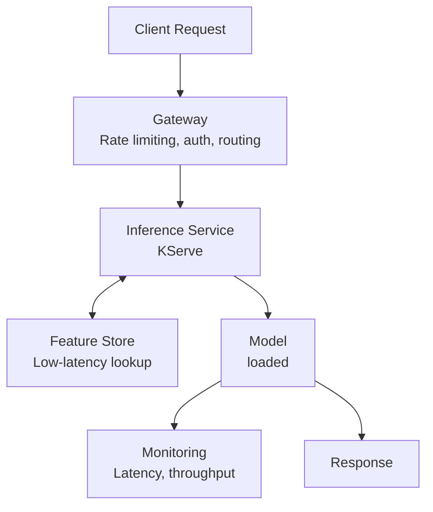
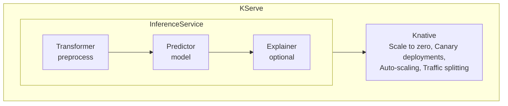
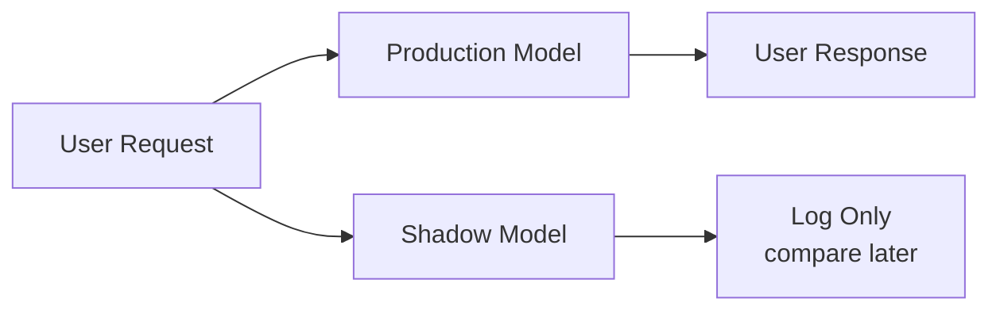
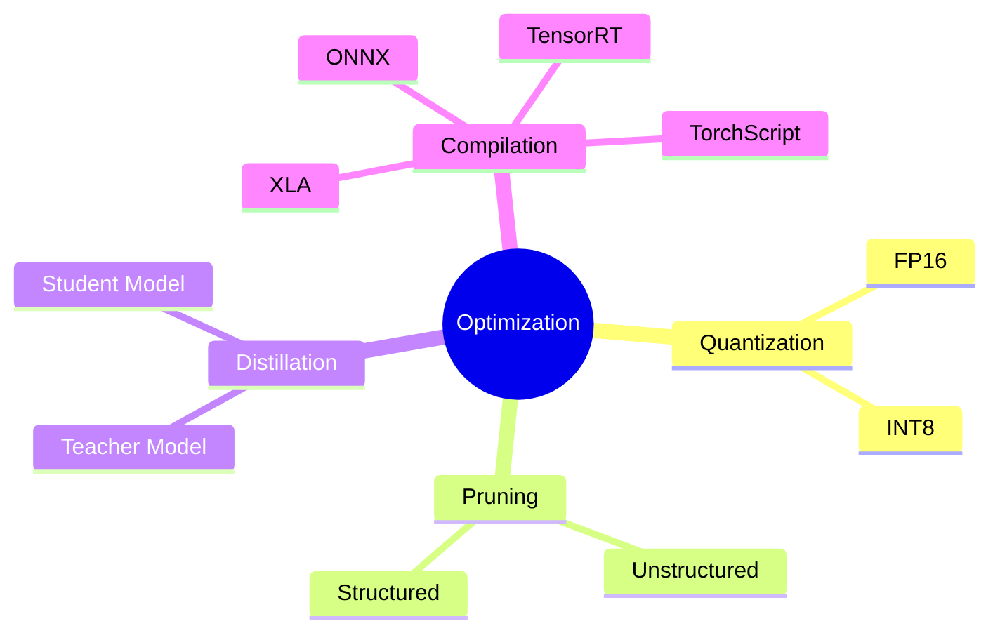
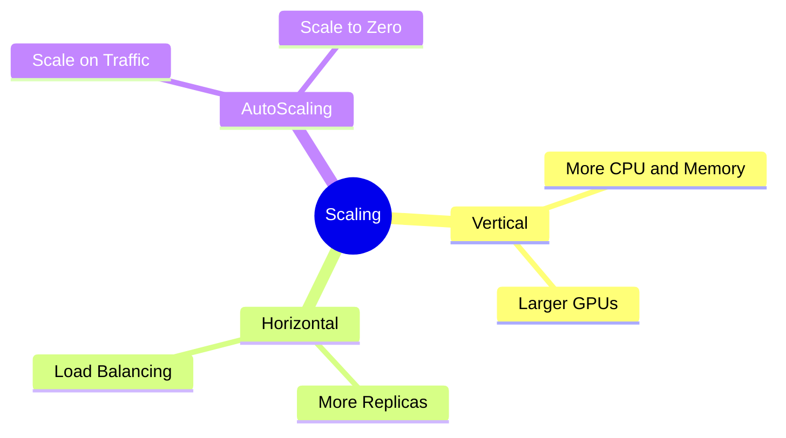

> **Discipline Track** | Complexity: `[COMPLEX]` | Time: 40-45 min

## Prerequisites

Before starting this module:
- [Module 5.3: Model Training & Experimentation](../module-5.3-model-training/)
- Understanding of REST APIs
- Basic Kubernetes concepts (Deployments, Services)
- Familiarity with containerization (Docker)

## What You'll Be Able to Do

After completing this module, you will be able to:

- **Implement model serving infrastructure using KServe, Seldon Core, or Triton on Kubernetes**
- **Design inference architectures that handle model versioning, A/B testing, and canary rollouts**
- **Configure autoscaling policies for model endpoints based on request latency and throughput SLOs**
- **Build model serving pipelines with preprocessing, inference, and postprocessing stages**

## Why This Module Matters

A model in a notebook isn't a product. The best fraud detection model is worthless if it takes 30 seconds to return a prediction. Users won't wait, transactions will fail, business will suffer.

Model serving is where ML meets reality. Latency matters. Scalability matters. Reliability matters. A prediction service that's down loses money—or worse, defaults to allowing fraudulent transactions.

The gap between "model works in Jupyter" and "model serves 10,000 requests per second" is where most ML projects fail.

> **Stop and think**: Think about the last time a mobile app or website took more than 3 seconds to load. Did you wait, or did you abandon it? Your model's inference time directly impacts this user experience.

## Did You Know?

- **Netflix serves 150 million predictions per second** using a combination of batch and real-time serving—different use cases need different architectures
- **The latency budget for real-time inference is often <100ms**—including network, feature lookup, and model computation. Every millisecond counts
- **Google found that a 0.5-second delay** in search results reduces traffic by 20%. For ML predictions embedded in user flows, latency is everything
- **Model serving costs can exceed training costs by 10x**—training happens once, serving happens continuously. Optimize for inference, not just training

## Serving Patterns

Different use cases require different serving patterns:

```mermaid
flowchart TD
    subgraph Online [ONLINE / Real-time]
        direction LR
        Req1[Request] --> FL[Feature Lookup] --> Mod1[Model] --> Resp1[Response]
    end

    subgraph Batch [BATCH / Scheduled]
        direction LR
        Data2[Data] --> Mod2[Model] --> Pred2[Predictions] --> Store2[Store]
    end

    subgraph Streaming [STREAMING / Event-driven]
        direction LR
        Ev1[Event Stream] --> Mod3[Model] --> Ev2[Event Stream]
    end

    subgraph Edge [EDGE / On-device]
        direction LR
        Dev[Device Input] --> LMod[Local Model] --> Pred3[Prediction]
    end
```



### Choosing a Pattern

| Use Case | Pattern | Why |
|----------|---------|-----|
| Fraud detection | Online | Must block transaction in real-time |
| Product recommendations | Batch | Pre-compute, serve from cache |
| Log anomaly detection | Streaming | Process events as they arrive |
| Mobile image classification | Edge | Works offline, low latency |
| Credit scoring | Online + Batch | Real-time for decisions, batch for reports |

### War Story: The Recommendation Catastrophe

A startup built an amazing recommendation model. In tests, it was perfect—personalized, relevant, engaging. They deployed it as a real-time service.

> **Pause and predict**: What happens to a web page when it has to wait for a complex machine learning model to run sequentially before rendering the HTML?

Launch day: 500ms latency per recommendation. Pages with 20 recommendations took 10 seconds to load. Users bounced. Revenue tanked.

The fix? Batch predictions. Pre-compute recommendations hourly, serve from Redis. Latency dropped to 5ms. Same model, different serving pattern.

## Online Serving Architecture



## Model Serving Frameworks

### Framework Comparison

| Framework | Best For | Pros | Cons |
|-----------|----------|------|------|
| **KServe** | Kubernetes-native ML | Autoscaling, multi-framework | K8s complexity |
| **Seldon Core** | Enterprise ML | Explainability, A/B testing | Complex setup |
| **BentoML** | Simple deployment | Easy packaging | Less scalable |
| **TorchServe** | PyTorch models | Optimized for PyTorch | Framework-specific |
| **TensorFlow Serving** | TensorFlow models | High performance | TF only |
| **Triton** | Multi-framework GPU | Best GPU utilization | NVIDIA only |

### KServe (Kubernetes Serving)

KServe (formerly KFServing) is the standard for Kubernetes-native model serving:



### KServe InferenceService

```yaml
apiVersion: serving.kserve.io/v1beta1
kind: InferenceService
metadata:
  name: fraud-detector
  namespace: ml-serving
spec:
  predictor:
    model:
      modelFormat:
        name: sklearn
      storageUri: s3://models/fraud-detector/v1
      resources:
        requests:
          cpu: "500m"
          memory: "512Mi"
        limits:
          cpu: "1"
          memory: "1Gi"
    minReplicas: 1
    maxReplicas: 10
    scaleTarget: 10  # Concurrent requests per replica
    scaleMetric: concurrency
```

### Deploying to KServe

```bash
# Apply InferenceService
kubectl apply -f inference-service.yaml

# Check status
kubectl get inferenceservice fraud-detector -n ml-serving

# Get endpoint URL
kubectl get inferenceservice fraud-detector -n ml-serving -o jsonpath='{.status.url}'

# Test prediction
curl -X POST "http://${SERVICE_URL}/v1/models/fraud-detector:predict" \
  -H "Content-Type: application/json" \
  -d '{"instances": [[0.5, 0.3, 0.2, 0.8, 0.1]]}'
```

## Deployment Strategies

### Canary Deployments

```mermaid
gantt
    title Canary Deployment Traffic Shift
    dateFormat X
    axisFormat %s
    section Day 1
    v1 (100%) : 0, 10
    v2 (0%)   : 0, 0
    section Day 2
    v1 (90%)  : 0, 9
    v2 (10%)  : 0, 1
    section Day 3
    v1 (50%)  : 0, 5
    v2 (50%)  : 0, 5
    section Day 4
    v1 (0%)   : 0, 0
    v2 (100%) : 0, 10
```



Monitor: latency, errors, business metrics. Rollback: If metrics degrade, shift traffic back to v1.

### KServe Canary

```yaml
apiVersion: serving.kserve.io/v1beta1
kind: InferenceService
metadata:
  name: fraud-detector
spec:
  predictor:
    # Primary (90% traffic)
    model:
      modelFormat:
        name: sklearn
      storageUri: s3://models/fraud-detector/v1
    # Canary (10% traffic)
    canaryTrafficPercent: 10
  canary:
    predictor:
      model:
        modelFormat:
          name: sklearn
        storageUri: s3://models/fraud-detector/v2
```

### Shadow Deployments

Shadow mode runs the new model on real traffic without affecting responses:



Benefits:
- Real production traffic
- No user impact
- Compare performance on real data
- Validate before promotion

> **Stop and think**: If a shadow deployment proves the new model is technically stable and returns fast predictions, does it prove the model will actually improve user engagement?

### A/B Testing

For comparing model variants with statistical significance:

```yaml
# Seldon Core A/B test
apiVersion: machinelearning.seldon.io/v1
kind: SeldonDeployment
metadata:
  name: ab-test
spec:
  predictors:
    - name: model-a
      traffic: 50
      graph:
        name: classifier-a
        modelUri: gs://models/model-a
    - name: model-b
      traffic: 50
      graph:
        name: classifier-b
        modelUri: gs://models/model-b
```

## Model Optimization

### Why Optimize?

| Metric | Impact of Optimization |
|--------|----------------------|
| Latency | 50ms → 10ms (5x faster) |
| Throughput | 100 RPS → 1000 RPS (10x higher) |
| Memory | 1GB → 100MB (10x smaller) |
| Cost | $1000/mo → $100/mo (10x cheaper) |

### Optimization Techniques



### ONNX for Portability

```python
# Convert sklearn model to ONNX
from skl2onnx import convert_sklearn
from skl2onnx.common.data_types import FloatTensorType

# Define input type
initial_type = [('float_input', FloatTensorType([None, 4]))]

# Convert
onnx_model = convert_sklearn(sklearn_model, initial_types=initial_type)

# Save
with open("model.onnx", "wb") as f:
    f.write(onnx_model.SerializeToString())

# Run with ONNX Runtime
import onnxruntime as ort

session = ort.InferenceSession("model.onnx")
input_name = session.get_inputs()[0].name
output_name = session.get_outputs()[0].name

predictions = session.run([output_name], {input_name: input_data})
```

### Quantization Example

```python
# TensorFlow Lite quantization
import tensorflow as tf

# Load model
model = tf.keras.models.load_model('model.h5')

# Convert with quantization
converter = tf.lite.TFLiteConverter.from_keras_model(model)
converter.optimizations = [tf.lite.Optimize.DEFAULT]
converter.target_spec.supported_types = [tf.float16]  # or tf.int8

tflite_model = converter.convert()

# Save
with open('model_quantized.tflite', 'wb') as f:
    f.write(tflite_model)

# Size comparison
import os
print(f"Original: {os.path.getsize('model.h5') / 1024 / 1024:.2f} MB")
print(f"Quantized: {os.path.getsize('model_quantized.tflite') / 1024 / 1024:.2f} MB")
```

## Scaling Strategies

### Horizontal vs. Vertical Scaling



### KServe Autoscaling

```yaml
apiVersion: serving.kserve.io/v1beta1
kind: InferenceService
metadata:
  name: fraud-detector
  annotations:
    # Knative autoscaling
    autoscaling.knative.dev/class: kpa.autoscaling.knative.dev
    autoscaling.knative.dev/metric: concurrency
    autoscaling.knative.dev/target: "10"  # Target 10 concurrent requests
spec:
  predictor:
    minReplicas: 1
    maxReplicas: 100
    model:
      modelFormat:
        name: sklearn
      storageUri: s3://models/fraud-detector/v1
```

## Common Mistakes

| Mistake | Problem | Solution |
|---------|---------|----------|
| No latency budget | Slow predictions | Set SLOs, profile regularly |
| Ignoring cold starts | First request slow | Pre-warm, min replicas > 0 |
| No batching | Inefficient GPU usage | Batch requests for throughput |
| No fallback | Service failure = outage | Default predictions, circuit breakers |
| Wrong serving pattern | Over-engineered or too slow | Match pattern to use case |
| No model versioning | Can't rollback | Version every deployment |

## Quiz

Test your understanding:

<details>
<summary>1. An e-commerce site wants to show "Products you might like" on the homepage. They have a massive matrix factorization model, but generating recommendations on the fly is causing the homepage to load 3 seconds slower. Why might batch serving be the correct architectural choice here, and how does it work compared to real-time?</summary>

**Answer**: Real-time serving requires the application to wait for the model to compute a prediction on demand, which severely impacts latency if the model is slow. By switching to batch serving, predictions are computed asynchronously offline (e.g., in a nightly pipeline) and saved into a fast key-value store like Redis. When the user visits the homepage, the application simply performs a sub-millisecond lookup against Redis to retrieve the pre-computed recommendations. This decouples the heavy ML computation from the critical user-facing response path, immediately solving the 3-second delay.
</details>

<details>
<summary>2. Your team has developed a new credit scoring model. The business is terrified that a bug in the model might incorrectly auto-approve bad loans. You need to validate the model in production without risking business capital. Should you use a canary or shadow deployment first, and why?</summary>

**Answer**: You should definitely use a shadow deployment first. A shadow deployment mirrors live production traffic to the new model, but its predictions are only logged and never returned to the user or business systems. This allows you to evaluate how the new model behaves on real-world, current data and compare its outputs to the existing model without any financial risk. A canary deployment, by contrast, would actually serve the new model's predictions to a small percentage of real users, exposing the business to the exact risk they are trying to avoid before validation is complete.
</details>

<details>
<summary>3. Your fraud detection model works perfectly, but to handle Black Friday traffic (10,000 RPS), your cloud bill for GPU instances is projected to exceed the revenue saved by the fraud detection. What specific optimization techniques should you apply before scaling horizontally, and why?</summary>

**Answer**: You should apply quantization (reducing precision from FP32 to FP16 or INT8) and model compilation (using TensorRT or ONNX) before scaling out. Quantization drastically reduces the memory footprint and speeds up computation by using simpler math, often with negligible loss in accuracy. Compilation optimizes the computational graph specifically for the underlying hardware, minimizing overhead. By optimizing the model vertically first, you increase the throughput (RPS) that a single GPU or CPU can handle, meaning you will need far fewer replicas when you finally scale horizontally, dramatically reducing your cloud bill.
</details>

<details>
<summary>4. You configured KServe to scale your internal NLP model to zero during the night to save costs. However, the first user who logs in at 6 AM consistently experiences a 15-second timeout error. What is causing this, and how can you fix it without completely giving up the cost savings of autoscaling?</summary>

**Answer**: This is a classic "cold start" problem. Because the replicas scaled to zero, the first request forces Kubernetes to spin up a new pod, download the model weights from storage, and load them into memory before it can serve the prediction, which easily exceeds standard timeouts. You can fix this by setting the `minReplicas` to `1` so there is always at least one pod ready to serve the first request immediately. Alternatively, if strict zero-cost is needed overnight, you could implement predictive scaling by writing a cron job that pings the service at 5:55 AM to "pre-warm" the pods just before the first user arrives.
</details>

## Hands-On Exercise: Deploy a Model with KServe

Deploy a model and test different serving patterns:

### Setup

```bash
# Requires: Kubernetes cluster with KServe installed
# For local testing, use kind with KServe quickstart

# Create namespace
kubectl create namespace ml-serving

# Create S3-compatible storage (MinIO for local)
kubectl apply -f https://raw.githubusercontent.com/kserve/kserve/master/hack/quick_install.sh
```

### Step 1: Train and Save Model

```python
# train_and_export.py
import joblib
from sklearn.datasets import load_iris
from sklearn.ensemble import RandomForestClassifier
from sklearn.model_selection import train_test_split

# Train
X, y = load_iris(return_X_y=True)
X_train, X_test, y_train, y_test = train_test_split(X, y, test_size=0.2)

model = RandomForestClassifier(n_estimators=100)
model.fit(X_train, y_train)

print(f"Accuracy: {model.score(X_test, y_test):.4f}")

# Save
joblib.dump(model, "model.joblib")
print("Model saved to model.joblib")
```

### Step 2: Create InferenceService

```yaml
# inference-service.yaml
apiVersion: serving.kserve.io/v1beta1
kind: InferenceService
metadata:
  name: iris-classifier
  namespace: ml-serving
spec:
  predictor:
    model:
      modelFormat:
        name: sklearn
      storageUri: gs://your-bucket/iris-model  # Or s3://, pvc://, etc.
      resources:
        requests:
          cpu: "100m"
          memory: "256Mi"
        limits:
          cpu: "500m"
          memory: "512Mi"
    minReplicas: 1
    maxReplicas: 5
```

### Step 3: Deploy and Test

```bash
# Deploy
kubectl apply -f inference-service.yaml

# Wait for ready
kubectl wait --for=condition=Ready inferenceservice/iris-classifier -n ml-serving --timeout=300s

# Get URL
SERVICE_URL=$(kubectl get inferenceservice iris-classifier -n ml-serving -o jsonpath='{.status.url}')
echo "Service URL: $SERVICE_URL"

# Test prediction
curl -X POST "${SERVICE_URL}/v1/models/iris-classifier:predict" \
  -H "Content-Type: application/json" \
  -d '{
    "instances": [
      [5.1, 3.5, 1.4, 0.2],
      [6.2, 3.4, 5.4, 2.3]
    ]
  }'
```

### Step 4: Set Up Canary Deployment

```yaml
# canary-deployment.yaml
apiVersion: serving.kserve.io/v1beta1
kind: InferenceService
metadata:
  name: iris-classifier
  namespace: ml-serving
spec:
  predictor:
    model:
      modelFormat:
        name: sklearn
      storageUri: gs://your-bucket/iris-model-v1
    canaryTrafficPercent: 20
  canary:
    predictor:
      model:
        modelFormat:
          name: sklearn
        storageUri: gs://your-bucket/iris-model-v2
```

### Step 5: Monitor and Promote

```bash
# Check traffic split
kubectl get inferenceservice iris-classifier -n ml-serving -o yaml | grep -A 5 "traffic"

# If canary performs well, promote (set canary to 100%)
kubectl patch inferenceservice iris-classifier -n ml-serving --type='merge' -p '
spec:
  predictor:
    canaryTrafficPercent: 100
'

# Or rollback (set canary to 0%)
kubectl patch inferenceservice iris-classifier -n ml-serving --type='merge' -p '
spec:
  predictor:
    canaryTrafficPercent: 0
'
```

### Success Criteria

You've completed this exercise when you can:
- [ ] Deploy a model as an InferenceService
- [ ] Send prediction requests
- [ ] Set up canary deployment with traffic splitting
- [ ] Promote or rollback canary
- [ ] View autoscaling behavior

## Key Takeaways

1. **Choose the right serving pattern**: Online, batch, streaming, or edge—match to use case
2. **KServe provides production-grade serving**: Autoscaling, canary, multi-framework
3. **Optimize models for serving**: Quantization, compilation, batching
4. **Use canary deployments**: Gradual rollout reduces risk
5. **Plan for cold starts**: Pre-warm, min replicas, fast loading

## Further Reading

- [KServe Documentation](https://kserve.github.io/website/) — Kubernetes model serving
- [Seldon Core](https://docs.seldon.io/) — Enterprise ML serving
- [ONNX Runtime](https://onnxruntime.ai/) — Cross-platform inference
- [TensorRT](https://developer.nvidia.com/tensorrt) — NVIDIA GPU optimization

## Summary

Model serving bridges the gap between training and production. The right serving pattern (online, batch, streaming, edge) depends on latency requirements and use case. KServe provides a Kubernetes-native solution with autoscaling, canary deployments, and multi-framework support. Optimization techniques (quantization, compilation) reduce latency and cost. Gradual rollouts (canary, shadow) reduce deployment risk.

---

## Next Module

Continue to [Module 5.5: Model Monitoring & Observability](../module-5.5-model-monitoring/) to learn how to detect model degradation before it impacts users.